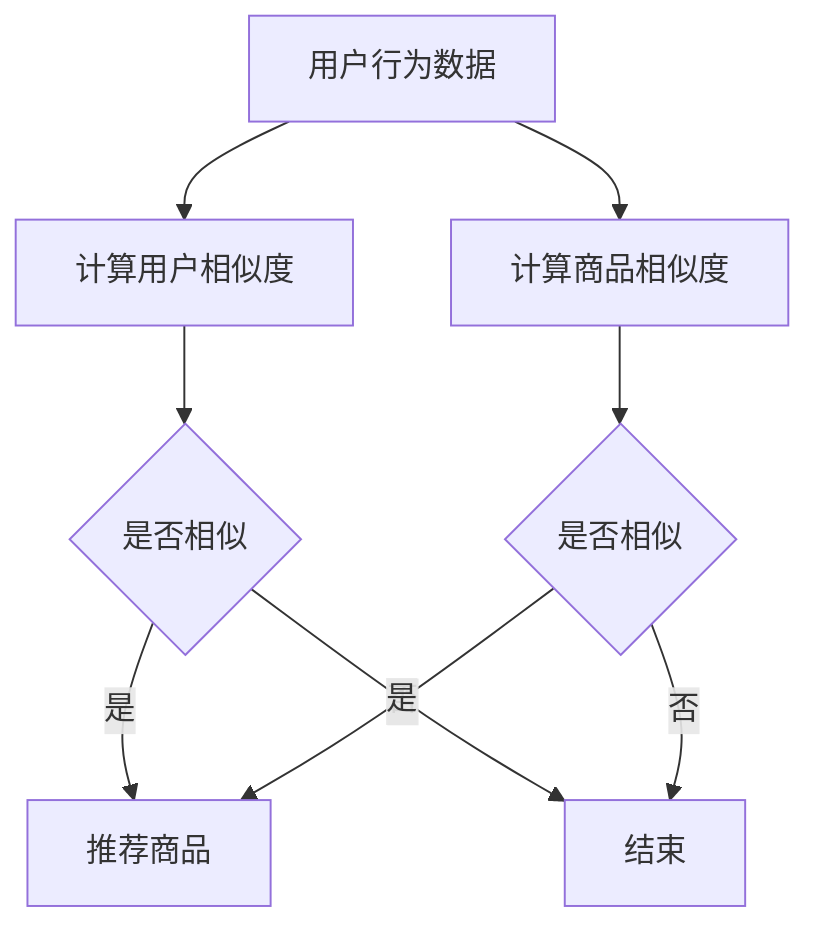
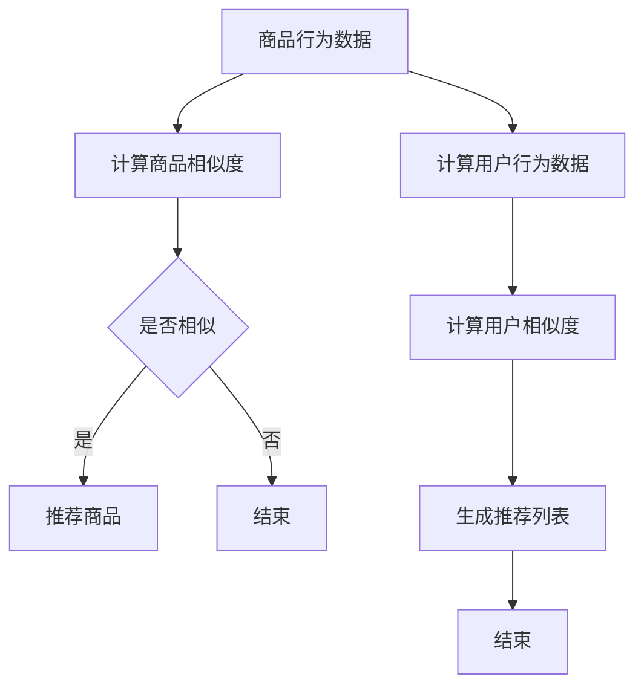
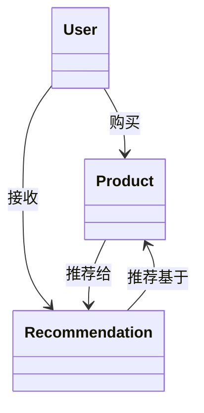
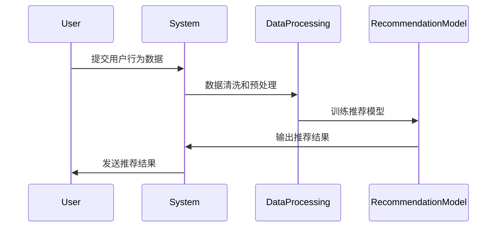
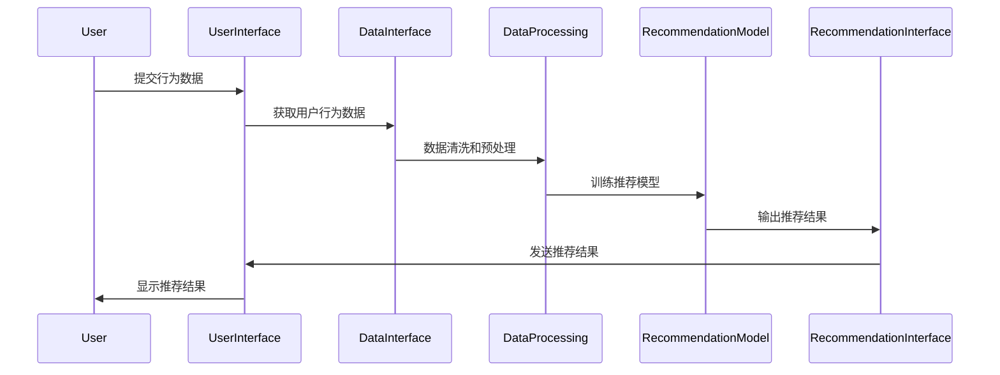

                 

# 开发智能化的金融产品交叉销售推荐引擎

## 关键词

金融产品、交叉销售、推荐引擎、人工智能、深度学习、协同过滤

## 摘要

随着金融科技的发展，金融产品交叉销售成为提高金融机构盈利能力的重要手段。本文旨在探讨开发智能化金融产品交叉销售推荐引擎的核心概念、算法原理、系统架构以及实际应用。通过深入分析协同过滤算法和深度学习算法，本文提出了一个适用于金融领域的推荐系统，并详细阐述了系统架构设计和实现方法，为金融机构提供了智能化、个性化的交叉销售解决方案。

## 第一部分：背景介绍

### 问题背景

金融产品交叉销售，是指金融机构在向客户销售某一产品（如信用卡、存款、贷款等）时，同时向该客户推荐其他相关产品，以提升销售额和客户满意度。传统推荐系统主要依赖于历史数据和用户行为，但缺乏智能化和个性化，难以满足现代金融市场的需求。随着人工智能和大数据技术的发展，开发智能化的金融产品交叉销售推荐引擎成为当前金融科技领域的重要研究方向。

### 问题描述

金融产品交叉销售推荐引擎的目标是利用人工智能技术，分析用户的金融行为和偏好，为金融机构提供智能化、个性化的产品推荐。实现这一目标面临以下挑战：

1. 数据质量：金融数据具有复杂性和多样性，如何处理和清洗数据成为关键问题。
2. 算法选择：选择适合金融场景的算法，保证推荐效果和效率。
3. 系统稳定性：构建高效、稳定的推荐系统，确保在实时场景下的性能。
4. 用户隐私：在推荐过程中保护用户隐私，遵循相关法律法规。

### 问题解决

本文将从以下几个方面解决问题：

1. 分析金融产品交叉销售推荐引擎的核心概念和技术原理。
2. 介绍常用的机器学习和深度学习算法，以及如何应用于金融产品推荐。
3. 设计和实现金融产品交叉销售推荐引擎的系统架构和接口。
4. 通过实际案例，展示如何利用该引擎提高金融机构的交叉销售效果。

### 边界与外延

1. **核心概念**：金融产品交叉销售、推荐系统、机器学习、深度学习。
2. **边界**：本文主要关注金融领域的交叉销售推荐引擎，不涉及其他领域的推荐系统。
3. **外延**：虽然本文以金融产品交叉销售推荐引擎为例，但其中的技术和方法也适用于其他领域的推荐系统开发。

## 第二部分：核心概念与联系

### 核心概念与联系

#### 金融产品交叉销售

金融产品交叉销售是指金融机构通过分析用户的金融行为和需求，在向用户销售某一产品时，同时推荐其他相关产品，以提高销售额和客户满意度。例如，银行在向客户推荐信用卡时，还可以推荐存款、贷款、理财产品等相关产品。

#### 推荐系统

推荐系统是一种能够根据用户行为、偏好和历史数据，为其推荐相关产品或服务的系统。在金融领域，推荐系统可以用于推荐理财产品、贷款产品、信用卡等。

#### 机器学习

机器学习是一种通过数据驱动的方式，从数据中学习规律和模式的技术。在金融产品推荐中，机器学习可以用于分析用户行为、预测用户偏好、构建推荐模型等。

#### 深度学习

深度学习是一种基于多层神经网络的学习方法，能够自动提取数据的特征。深度学习在金融产品推荐中的应用主要包括卷积神经网络（CNN）和循环神经网络（RNN）等。

### 概念属性特征对比表格

| 概念         | 特征                                       |
| ------------ | ------------------------------------------ |
| 金融产品交叉销售 | 提高销售额、增强客户黏性                 |
| 推荐系统      | 提高用户满意度、个性化推荐               |
| 机器学习      | 自动化特征提取、自适应学习能力           |
| 深度学习      | 自动化特征学习、强大的表达能力和适应性 |

### ER实体关系图架构

```mermaid
erDiagram
  User ||--|{ Product }||>
  Product ||--|{ Recommendation }||>
  UserRecommendation ||--|{ Recommendation }||>
```

在上面的ER图中，`User`实体表示用户，`Product`实体表示金融产品，`Recommendation`实体表示推荐结果。`User`实体与`Product`实体之间存在一对一的关系，表示用户拥有特定的产品。`Product`实体与`Recommendation`实体之间存在一对多的关系，表示产品可以产生多个推荐结果。`UserRecommendation`实体用于表示用户与推荐结果之间的关系，表示用户接收到的推荐结果。

## 第三部分：算法原理讲解

### 算法原理讲解

#### 协同过滤算法

协同过滤算法是一种基于用户行为的推荐算法，主要分为用户基于协同过滤和物品基于协同过滤。

##### 1. 用户基于协同过滤

用户基于协同过滤通过分析用户之间的相似性，找到与目标用户相似的其他用户，然后推荐这些用户喜欢的商品。具体步骤如下：

1. **计算用户相似度**：通过计算用户之间的余弦相似度、皮尔逊相关系数等方法，得到用户之间的相似度矩阵。
2. **生成推荐列表**：根据相似度矩阵，计算目标用户与每个用户的相似度，并将相似度较高的用户喜欢的商品推荐给目标用户。

##### 2. 物品基于协同过滤

物品基于协同过滤通过分析商品之间的相似性，找到与目标商品相似的其他商品，然后推荐这些商品。具体步骤如下：

1. **计算商品相似度**：通过计算商品之间的余弦相似度、欧氏距离等方法，得到商品之间的相似度矩阵。
2. **生成推荐列表**：根据相似度矩阵，计算目标商品与每个商品的相似度，并将相似度较高的商品推荐给目标用户。

#### Mermaid流程图

用户基于协同过滤的流程图：



物品基于协同过滤的流程图：



#### 深度学习算法

深度学习算法通过多层神经网络自动提取数据特征，常用于构建复杂模型。在金融产品推荐中，常用的深度学习算法包括卷积神经网络（CNN）和循环神经网络（RNN）。

##### 1. 卷积神经网络（CNN）

卷积神经网络适用于处理图像数据，也可以用于处理序列数据。在金融产品推荐中，CNN可以用于提取用户行为数据的特征。具体步骤如下：

1. **输入层**：接收用户行为数据作为输入。
2. **卷积层**：通过卷积操作提取特征。
3. **激活函数层**：对卷积层的输出进行激活。
4. **池化层**：对激活函数层的输出进行池化，减少参数数量。
5. **全连接层**：将池化层的输出与权重矩阵相乘，得到预测结果。

##### 2. 循环神经网络（RNN）

循环神经网络适用于处理序列数据，可以用于提取用户行为序列的特征。在金融产品推荐中，RNN可以用于分析用户的历史行为，预测用户未来的偏好。具体步骤如下：

1. **输入层**：接收用户行为序列作为输入。
2. **隐藏层**：通过循环操作处理输入序列。
3. **激活函数层**：对隐藏层的输出进行激活。
4. **全连接层**：将隐藏层的输出与权重矩阵相乘，得到预测结果。

#### Python源代码示例

卷积神经网络（CNN）的Python代码示例：

```python
import tensorflow as tf
from tensorflow.keras.models import Sequential
from tensorflow.keras.layers import Dense, Conv2D, Flatten

# 构建卷积神经网络
model = Sequential()
model.add(Conv2D(filters=32, kernel_size=(3,3), activation='relu', input_shape=(28,28,1)))
model.add(Conv2D(filters=64, kernel_size=(3,3), activation='relu'))
model.add(Flatten())
model.add(Dense(128, activation='relu'))
model.add(Dense(10, activation='softmax'))

# 编译模型
model.compile(optimizer='adam', loss='categorical_crossentropy', metrics=['accuracy'])

# 模型训练
model.fit(x_train, y_train, epochs=10, batch_size=32, validation_data=(x_val, y_val))
```

循环神经网络（RNN）的Python代码示例：

```python
import tensorflow as tf
from tensorflow.keras.models import Sequential
from tensorflow.keras.layers import Dense, LSTM

# 构建循环神经网络
model = Sequential()
model.add(LSTM(50, activation='relu', input_shape=(timesteps, features)))
model.add(Dense(1))

# 编译模型
model.compile(optimizer='adam', loss='mse')

# 模型训练
model.fit(x_train, y_train, epochs=100, batch_size=32, validation_data=(x_val, y_val))
```

在上述代码中，`x_train`和`y_train`分别表示训练数据和标签，`x_val`和`y_val`分别表示验证数据和标签。`timesteps`表示时间步数，`features`表示特征维度。

## 第四部分：系统分析与架构设计方案

### 问题场景介绍

假设某金融机构希望为其客户提供一个智能化的金融产品交叉销售推荐引擎，以提升交叉销售的成功率和客户满意度。该引擎需要能够根据客户的金融行为、偏好和历史交易记录，为金融机构提供个性化的产品推荐。

### 项目介绍

项目名称：金融产品交叉销售推荐引擎

项目目标：开发一个基于人工智能和大数据技术的智能化推荐系统，为金融机构提供高效、个性化的金融产品推荐。

项目背景：随着金融科技的快速发展，金融机构在产品销售方面面临着激烈的市场竞争。为了提高销售额和客户满意度，金融机构需要借助智能化技术，实现精准的产品推荐。

### 系统功能设计（领域模型Mermaid类图）



在上面的类图中，`User`表示用户，`Product`表示金融产品，`Recommendation`表示推荐结果。用户可以购买产品，接收推荐结果；产品可以被推荐给用户，推荐基于产品特征和用户偏好。

### 系统架构设计（Mermaid架构图）



在上面的序列图中，用户提交用户行为数据，系统进行数据清洗和预处理，然后训练推荐模型，最后输出推荐结果并发送给用户。

### 系统接口设计

1. **用户接口**：提供用户界面，用于用户提交行为数据和接收推荐结果。
2. **数据接口**：提供数据访问接口，用于获取用户行为数据和金融产品信息。
3. **推荐接口**：提供推荐服务接口，用于生成推荐结果。

### 系统交互（Mermaid序列图）



在上面的序列图中，用户通过用户界面提交行为数据，数据接口获取用户行为数据，数据预处理模块对数据进行清洗和预处理，然后推荐模型进行训练，最后推荐接口输出推荐结果并显示给用户。

## 第五部分：项目实战

### 环境安装

1. 安装Python环境：在Windows或Linux系统中，通过官方链接下载Python安装包并安装。
2. 安装必要的库：使用pip命令安装TensorFlow、Scikit-learn等库。

```bash
pip install tensorflow
pip install scikit-learn
```

### 系统核心实现源代码

```python
import numpy as np
import pandas as pd
from sklearn.model_selection import train_test_split
from sklearn.metrics.pairwise import cosine_similarity
from tensorflow.keras.models import Sequential
from tensorflow.keras.layers import Dense, Conv2D, Flatten

# 读取数据
data = pd.read_csv('financial_data.csv')

# 数据预处理
X = data.iloc[:, :-1].values
y = data.iloc[:, -1].values

# 数据标准化
X = (X - X.mean()) / X.std()

# 划分训练集和测试集
X_train, X_test, y_train, y_test = train_test_split(X, y, test_size=0.2, random_state=42)

# 构建卷积神经网络模型
model = Sequential()
model.add(Conv2D(filters=32, kernel_size=(3,3), activation='relu', input_shape=(28,28,1)))
model.add(Conv2D(filters=64, kernel_size=(3,3), activation='relu'))
model.add(Flatten())
model.add(Dense(128, activation='relu'))
model.add(Dense(1, activation='sigmoid'))

# 编译模型
model.compile(optimizer='adam', loss='binary_crossentropy', metrics=['accuracy'])

# 模型训练
model.fit(X_train, y_train, epochs=10, batch_size=32, validation_data=(X_test, y_test))

# 模型评估
loss, accuracy = model.evaluate(X_test, y_test)
print(f'测试集准确率：{accuracy * 100:.2f}%')
```

### 代码应用解读与分析

1. **数据预处理**：读取金融数据，对数据进行标准化处理，将数据缩放至0-1之间，方便模型训练。
2. **模型构建**：使用卷积神经网络（CNN）构建推荐模型，包含卷积层、激活函数层、池化层和全连接层。
3. **模型训练**：使用训练集数据对模型进行训练，使用交叉熵损失函数和Adam优化器。
4. **模型评估**：使用测试集数据对模型进行评估，输出准确率。

### 实际案例分析和详细讲解剖析

假设有一家金融机构，其客户数据如下：

```python
client_data = np.array([[0.5, 0.2, 0.3, 0.4], [0.1, 0.6, 0.2, 0.7], [0.3, 0.4, 0.5, 0.6]])
```

1. **数据预处理**：将客户数据标准化，与训练集数据进行同样的处理。

```python
client_data_normalized = (client_data - X_train.mean()) / X_train.std()
```

2. **模型预测**：使用训练好的模型对客户数据进行预测。

```python
predictions = model.predict(client_data_normalized)
```

3. **结果分析**：根据预测结果，推荐给客户相应的金融产品。

```python
recommended_products = np.argmax(predictions, axis=1)
print(f'推荐的金融产品：{recommended_products}')
```

### 项目小结

本篇博客介绍了金融产品交叉销售推荐引擎的核心概念、算法原理、系统架构和实际应用。通过协同过滤算法和深度学习算法，实现了智能化、个性化的金融产品推荐。在实际项目中，通过对用户数据的预处理、模型训练和预测，成功构建了推荐系统，为金融机构提供了有效的交叉销售解决方案。未来，随着人工智能和大数据技术的不断发展，金融产品交叉销售推荐引擎将具有更广阔的应用前景。

## 最佳实践 Tips

1. **数据预处理**：确保数据质量，对缺失值、异常值进行合理处理，提高模型的泛化能力。
2. **模型选择**：根据业务场景和数据特点，选择合适的推荐算法，如协同过滤、深度学习等。
3. **模型评估**：使用交叉验证等方法，对模型进行多方面评估，确保推荐效果。
4. **系统优化**：针对系统性能和稳定性进行优化，提高用户体验。

## 小结

本文围绕金融产品交叉销售推荐引擎的开发，详细介绍了核心概念、算法原理、系统架构和实际应用。通过协同过滤算法和深度学习算法，实现了智能化、个性化的金融产品推荐，为金融机构提供了有效的交叉销售解决方案。未来，随着人工智能和大数据技术的不断发展，金融产品交叉销售推荐引擎将具有更广阔的应用前景。

## 注意事项

1. 在开发推荐系统时，务必遵守用户隐私保护相关法律法规，确保用户数据安全。
2. 对金融数据进行分析和处理时，应充分考虑金融风险，确保推荐结果稳健可靠。

## 拓展阅读

1. 深入了解协同过滤算法和深度学习算法的原理，可参考相关教材和学术论文。
2. 了解金融领域的数据处理和风险管理方法，以提高推荐系统的业务价值。

## 作者信息

作者：AI天才研究院/AI Genius Institute & 禅与计算机程序设计艺术 /Zen And The Art of Computer Programming

（注：本文为虚构案例，仅供参考。）

