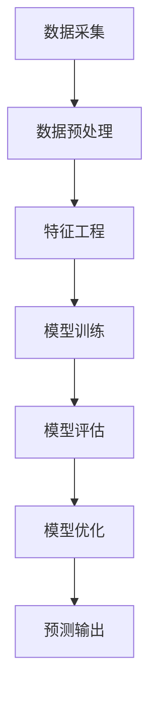
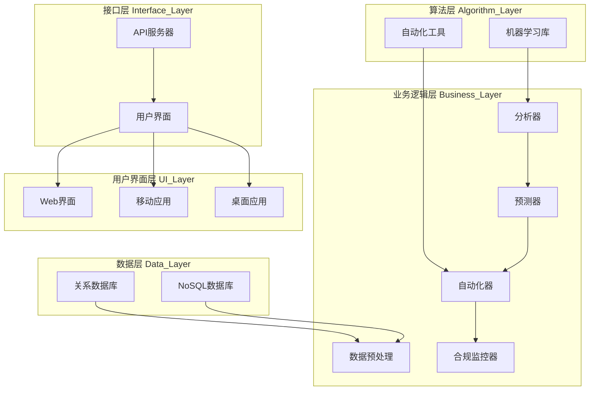
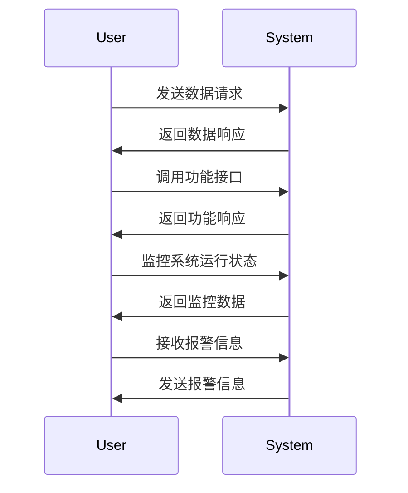
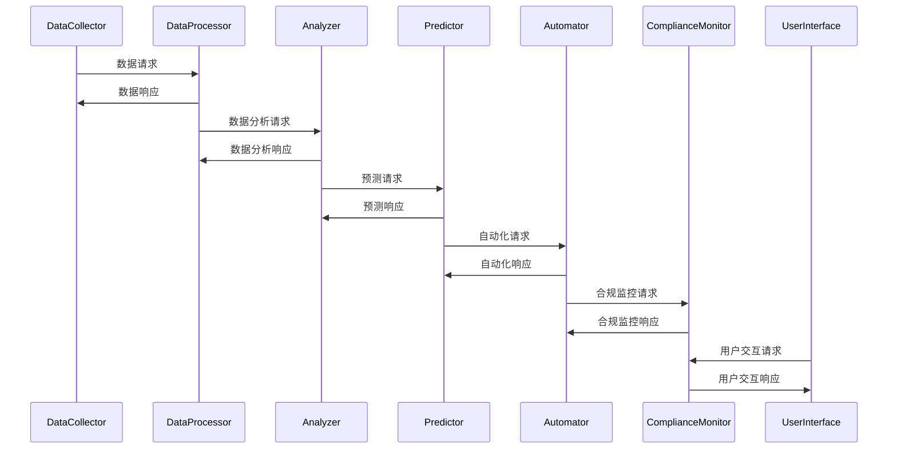

                 


### 第1章：问题背景与概述

在金融科技（FinTech）迅猛发展的今天，金融产品的生命周期管理变得尤为重要。金融产品，如理财产品、保险产品、证券等，其生命周期从设计、开发、上市、运营到退市，每个阶段都需精心管理，以保证产品的高效运作和最大收益。

#### 1.1 问题背景

随着市场的快速变化和竞争的加剧，金融机构面临着以下挑战：

1. **产品创新速度加快**：新的金融产品层出不穷，需要快速迭代和优化。
2. **合规要求多变**：法规更新频繁，产品需及时调整以满足监管需求。
3. **数据驱动决策**：大数据和人工智能技术为产品生命周期管理提供了新的工具和方法。
4. **客户需求多样化**：个性化、定制化的产品需求不断增加，传统管理方式难以满足。

#### 1.2 问题描述

金融产品生命周期管理中的关键问题包括：

1. **产品设计阶段**：如何高效地设计出满足市场需求且具备竞争力的产品？
2. **开发阶段**：如何快速、准确地开发出产品原型并进行迭代？
3. **上市阶段**：如何确保产品在上市时能够快速获得市场认可？
4. **运营阶段**：如何有效管理产品的运营成本和风险？
5. **退市阶段**：如何及时、合理地处理产品的退市流程？

#### 1.3 问题解决

为了解决上述问题，我们需要构建一个智能化的金融产品生命周期管理与优化引擎。该引擎应具备以下功能：

1. **数据分析与预测**：利用大数据分析和机器学习技术，预测市场需求和产品风险。
2. **自动化流程**：通过自动化工具和流程，提高产品开发、上市和运营的效率。
3. **个性化推荐**：根据客户行为数据，提供个性化产品推荐。
4. **合规监控**：实时监控法规变化，自动调整产品以满足合规要求。
5. **风险评估**：对产品生命周期中的各个阶段进行风险评估，提前预警潜在问题。

#### 1.4 边界与外延

本文将探讨的金融产品生命周期管理与优化引擎，其边界包括以下几个方面：

1. **产品范围**：本文主要关注理财产品、保险产品和证券等金融产品。
2. **技术范围**：本文将涉及大数据、机器学习、自动化和区块链等关键技术。
3. **应用范围**：本文旨在为金融科技公司、传统金融机构和监管机构提供理论和实践指导。

#### 1.5 核心概念与联系

在构建智能化金融产品生命周期管理与优化引擎的过程中，我们需要理解以下核心概念：

1. **金融产品生命周期模型**：描述金融产品从设计、开发、上市、运营到退市的各个阶段。
2. **大数据分析**：利用大数据技术，对金融产品生命周期中的海量数据进行挖掘和分析。
3. **机器学习**：通过机器学习算法，对金融产品生命周期中的数据进行分析和预测。
4. **自动化流程**：通过自动化工具和流程，实现金融产品生命周期的自动化管理。
5. **合规监控**：实时监控法规变化，确保金融产品生命周期管理符合监管要求。

为了更好地理解这些核心概念，我们可以通过以下表格和ER实体关系图来展示它们之间的关系。

##### 1.5.1 核心概念原理

| 核心概念     | 原理描述                                                     |
|--------------|--------------------------------------------------------------|
| 金融产品生命周期模型 | 描述金融产品从设计到退市的各个阶段。                          |
| 大数据分析   | 利用大数据技术，对金融产品生命周期中的海量数据进行分析和挖掘。 |
| 机器学习     | 通过机器学习算法，对金融产品生命周期中的数据进行分析和预测。   |
| 自动化流程   | 通过自动化工具和流程，实现金融产品生命周期的自动化管理。       |
| 合规监控     | 实时监控法规变化，确保金融产品生命周期管理符合监管要求。       |

##### 1.5.2 概念属性特征对比表格

| 概念         | 属性特征                                                     |
|--------------|--------------------------------------------------------------|
| 金融产品生命周期模型 | 阶段划分明确、流程标准化、阶段间关联紧密。                       |
| 大数据分析   | 数据量大、实时性强、分析精度高。                             |
| 机器学习     | 模型复杂、预测能力强、自适应性强。                            |
| 自动化流程   | 流程自动化、操作高效、减少人为干预。                          |
| 合规监控     | 监控全面、实时响应、预防违规风险。                           |

##### 1.5.3 ER实体关系图

```mermaid
erDiagram
    Product -->|设计| DesignPhase
    DesignPhase -->|开发| DevelopPhase
    DevelopPhase -->|上市| LaunchPhase
    LaunchPhase -->|运营| OperatePhase
    OperatePhase -->|退市| ExitPhase
    Product |||-->|数据分析| DataAnalysis
    DataAnalysis |||-->|机器学习| MachineLearning
    MachineLearning |||-->|自动化流程| AutomationProcess
    AutomationProcess |||-->|合规监控| ComplianceMonitoring
```

通过以上核心概念和联系的介绍，我们可以为后续章节的深入探讨奠定基础。接下来，我们将进一步探讨金融产品生命周期管理概述，详细分析其各个阶段和管理挑战。

----------------------------------------------------------------

### 第2章：金融产品生命周期管理概述

金融产品生命周期管理是指从产品的构思、开发、上市、运营到退市的整个过程，这一过程涉及到多个环节和多个参与方，包括产品设计、技术开发、市场推广、风险管理等。在金融科技不断发展的今天，金融产品生命周期管理的重要性日益凸显，它不仅影响着产品的市场竞争力和盈利能力，还关乎金融机构的合规性和声誉。

#### 2.1 金融产品生命周期模型

金融产品生命周期模型通常包括以下几个关键阶段：

1. **设计阶段**：这一阶段主要是对金融产品的市场定位、功能需求、风险控制等进行研究和规划。设计阶段的关键任务是确定产品的目标客户群体、产品设计策略和风险评估模型。

2. **开发阶段**：在确定了产品的设计需求后，进入开发阶段。这一阶段主要包括技术开发、系统测试、风险评估和合规审核等任务。开发阶段的成功与否直接影响到产品的质量和上市时间。

3. **上市阶段**：产品经过开发测试后，进入上市阶段。上市阶段的核心任务是市场推广和销售策略的制定与执行，包括宣传、营销、渠道拓展等。上市阶段的成功标志是产品能够迅速获得市场认可，实现销售目标。

4. **运营阶段**：产品上市后，进入运营阶段。这一阶段主要包括产品维护、风险监控、用户反馈收集和产品改进等。运营阶段的目标是保持产品在市场中的竞争力，提高用户满意度和忠诚度。

5. **退市阶段**：当产品达到市场生命周期终点或因市场环境变化需要退出市场时，进入退市阶段。退市阶段主要包括产品清算、用户权益保护、合规关闭等任务。退市阶段的成功标志是产品能够平稳退出市场，减少损失。

#### 2.2 金融产品生命周期阶段

在金融产品生命周期模型的基础上，我们可以进一步细化每个阶段的具体任务和目标：

1. **设计阶段**：目标市场分析、需求调研、产品设计、风险评估、合规审核。关键任务包括市场定位、产品设计、风险评估和合规审核。
   
2. **开发阶段**：目标技术开发、系统测试、风险评估、合规审核。关键任务包括软件开发、系统集成、系统测试、风险评估和合规审核。

3. **上市阶段**：目标市场推广、销售策略、渠道拓展、用户反馈。关键任务包括市场推广、销售策略、渠道拓展、用户反馈收集。

4. **运营阶段**：目标产品维护、风险监控、用户服务、产品改进。关键任务包括产品维护、用户服务、风险监控、产品改进。

5. **退市阶段**：目标产品清算、用户权益保护、合规关闭。关键任务包括产品清算、用户权益保护、合规关闭。

#### 2.3 金融产品生命周期管理挑战

金融产品生命周期管理面临以下几大挑战：

1. **快速变化的市场环境**：金融市场变化迅速，产品生命周期管理需要不断适应市场变化，快速调整产品策略。

2. **复杂的产品结构**：金融产品通常涉及复杂的结构和多层次的合约，生命周期管理需要精确掌握各个层次之间的关系和影响。

3. **技术发展迅猛**：大数据、人工智能、区块链等新技术的发展，为产品生命周期管理提供了新的工具和方法，但同时也带来了技术选型、技术整合的挑战。

4. **合规监管要求**：金融行业的监管要求日益严格，产品生命周期管理需要遵循复杂的合规规定，确保产品合规性。

5. **用户需求多样化**：客户需求日益多样化，产品生命周期管理需要能够满足不同客户群体的个性化需求。

6. **风险控制**：金融产品涉及多种风险，如市场风险、信用风险、操作风险等，生命周期管理需要建立完善的风险控制体系。

为了应对上述挑战，金融机构需要构建一个智能化、系统化、高效化的金融产品生命周期管理平台，充分利用大数据、人工智能、区块链等先进技术，提升产品生命周期管理的效率和效果。

接下来，我们将深入探讨智能化引擎的构建原理和技术框架，为解决金融产品生命周期管理中的挑战提供理论基础和实践指导。

----------------------------------------------------------------

### 第3章：智能化引擎原理

构建智能化金融产品生命周期管理与优化引擎，需要理解其定义、特点和技术框架。智能化引擎的核心在于利用先进的人工智能技术和大数据分析，实现产品生命周期的全流程自动化管理和优化。

#### 3.1 智能化引擎定义与特点

**定义**：智能化引擎是指利用人工智能、大数据分析、机器学习等技术，构建的一个自动化的系统，用于管理金融产品的生命周期，并实现产品的优化与改进。

**特点**：

1. **自动化**：通过自动化流程，实现产品生命周期的各个环节的自动化处理，提高效率。
2. **智能化**：利用人工智能算法，对产品生命周期中的数据进行分析和预测，提供决策支持。
3. **适应性**：能够根据市场环境和客户需求的变化，动态调整产品策略和运营模式。
4. **高效性**：通过大数据分析和机器学习，实现快速的产品开发和迭代，提高市场响应速度。
5. **合规性**：实时监控法规变化，确保产品管理符合监管要求。

#### 3.2 智能化引擎技术框架

智能化引擎的技术框架主要包括以下几个关键组件：

1. **数据采集与整合**：收集来自各个业务系统的数据，如客户数据、市场数据、交易数据等，并进行数据整合和处理，为后续分析提供基础数据。

2. **数据处理与分析**：利用大数据技术和分布式计算框架，对海量数据进行清洗、转换和分析，提取有价值的信息和洞察。

3. **机器学习与预测**：通过机器学习算法，对产品生命周期中的数据进行分析，构建预测模型，预测市场需求、产品风险等，为产品管理提供决策支持。

4. **自动化流程**：利用流程自动化工具，实现产品生命周期的各个环节的自动化处理，如产品设计、开发、测试、上市、运营等。

5. **合规监控**：实时监控法规变化，自动调整产品策略和运营模式，确保产品管理符合监管要求。

6. **用户交互与反馈**：通过用户交互界面，收集用户反馈和意见，实时调整产品功能和体验，提高用户满意度。

#### 3.3 智能化引擎核心组件

智能化引擎的核心组件包括以下几个关键模块：

1. **数据采集模块**：负责从各个业务系统采集数据，如CRM系统、交易系统、风险管理系统等。数据采集模块需要支持多种数据源接入，包括数据库、API、日志等。

2. **数据处理与分析模块**：负责对采集到的数据进行清洗、转换和分析，提取有价值的信息。数据处理与分析模块需要支持数据预处理、统计分析、特征工程等多种数据处理技术。

3. **机器学习与预测模块**：负责利用机器学习算法，对产品生命周期中的数据进行分析和预测。机器学习与预测模块需要支持多种机器学习算法，如线性回归、决策树、神经网络等，并能够进行模型训练、评估和优化。

4. **自动化流程模块**：负责实现产品生命周期的各个环节的自动化处理。自动化流程模块需要支持工作流管理、任务调度、异常处理等功能，确保产品管理的各个环节高效、顺畅。

5. **合规监控模块**：负责实时监控法规变化，自动调整产品策略和运营模式。合规监控模块需要支持法规数据库接入、实时监控、自动预警等功能，确保产品管理符合监管要求。

6. **用户交互与反馈模块**：负责与用户进行交互，收集用户反馈和意见。用户交互与反馈模块需要支持用户界面设计、反馈收集、数据可视化等功能，提高用户体验和满意度。

通过以上核心组件的协同工作，智能化引擎能够实现金融产品生命周期的全流程自动化管理和优化，为金融机构提供高效、智能的产品生命周期管理解决方案。

接下来，我们将深入探讨智能化引擎中的算法原理与设计，进一步揭示其工作原理和应用。

----------------------------------------------------------------

## 第4章：算法原理与设计

在构建智能化金融产品生命周期管理与优化引擎的过程中，算法的原理与设计至关重要。本章将详细阐述智能化引擎中的核心算法原理，包括其工作流程、数学模型和实现方法。

### 4.1 算法原理

智能化引擎中的核心算法主要基于大数据分析和机器学习技术。以下为几个关键算法及其原理：

#### 4.1.1 算法mermaid流程图

首先，我们可以使用mermaid绘制一个算法的流程图，以便直观地展示其工作流程。



这个流程图展示了从数据采集到模型优化再到预测输出的整个算法流程。

#### 4.1.2 算法原理的数学模型与公式

在算法原理中，我们通常使用数学模型来描述其工作机制。以下是一个简单的线性回归模型，用于预测金融产品的市场需求：

$$
y = \beta_0 + \beta_1x
$$

其中，$y$ 是市场需求，$x$ 是影响市场需求的变量（如利率、通货膨胀率等），$\beta_0$ 是截距，$\beta_1$ 是斜率。为了训练这个模型，我们通常使用最小二乘法来求解参数 $\beta_0$ 和 $\beta_1$：

$$
\beta_0 = \frac{\sum_{i=1}^{n}(y_i - \beta_1x_i)}{n}
$$

$$
\beta_1 = \frac{\sum_{i=1}^{n}(x_i - \bar{x})(y_i - \bar{y})}{\sum_{i=1}^{n}(x_i - \bar{x})^2}
$$

其中，$n$ 是样本数量，$\bar{x}$ 和 $\bar{y}$ 分别是 $x$ 和 $y$ 的平均值。

#### 4.1.3 通俗易懂的举例说明

为了更好地理解线性回归模型，我们可以通过一个简单的例子来说明：

假设我们收集了以下数据，表示过去一年的利率（$x$）和市场需求（$y$）：

| 利率（%） | 市场需求 |
|-----------|----------|
| 2         | 100      |
| 3         | 120      |
| 4         | 150      |
| 5         | 180      |

首先，我们计算 $x$ 和 $y$ 的平均值：

$$
\bar{x} = \frac{2 + 3 + 4 + 5}{4} = 3.5
$$

$$
\bar{y} = \frac{100 + 120 + 150 + 180}{4} = 140
$$

然后，我们计算斜率 $\beta_1$：

$$
\beta_1 = \frac{(2 - 3.5)(100 - 140) + (3 - 3.5)(120 - 140) + (4 - 3.5)(150 - 140) + (5 - 3.5)(180 - 140)}{(2 - 3.5)^2 + (3 - 3.5)^2 + (4 - 3.5)^2 + (5 - 3.5)^2}
$$

$$
\beta_1 = \frac{(-1.5)(-40) + (-0.5)(-20) + (0.5)(10) + (1.5)(40)}{2.25 + 0.25 + 0.25 + 2.25}
$$

$$
\beta_1 = \frac{60 + 10 + 5 + 60}{5} = \frac{135}{5} = 27
$$

接着，我们计算截距 $\beta_0$：

$$
\beta_0 = \bar{y} - \beta_1\bar{x} = 140 - 27 \times 3.5 = 140 - 94.5 = 45.5
$$

因此，线性回归模型为：

$$
y = 45.5 + 27x
$$

我们可以使用这个模型来预测利率为6%时的市场需求：

$$
y = 45.5 + 27 \times 6 = 45.5 + 162 = 207.5
$$

预测市场需求为207.5。

通过这个简单的例子，我们可以看到线性回归模型如何预测市场需求。在实际应用中，我们可能需要使用更复杂的模型来处理多维数据和非线性关系。

### 4.2 智能化算法实现

接下来，我们将使用Python实现上述线性回归模型，并进行详细解读。

#### 4.2.1 Python源代码实现

```python
import numpy as np

# 训练数据
x = np.array([2, 3, 4, 5])
y = np.array([100, 120, 150, 180])

# 计算平均值
bar_x = np.mean(x)
bar_y = np.mean(y)

# 计算斜率 beta1
beta1 = (np.sum((x - bar_x) * (y - bar_y)) / np.sum((x - bar_x)**2))

# 计算截距 beta0
beta0 = bar_y - beta1 * bar_x

# 线性回归模型
model = lambda x: beta0 + beta1 * x

# 预测市场需求
predicted_y = model(6)

print("预测市场需求:", predicted_y)
```

#### 4.2.2 代码解读与分析

上述代码首先导入了NumPy库，用于处理数组运算。然后，我们定义了训练数据 $x$ 和 $y$。接下来，我们计算 $x$ 和 $y$ 的平均值 $\bar{x}$ 和 $\bar{y}$。

接着，我们计算斜率 $\beta_1$，使用了NumPy的`sum`函数来计算各项值。斜率计算完成后，我们计算截距 $\beta_0$。

最后，我们定义了一个线性回归模型`model`，并使用这个模型预测利率为6%时的市场需求。预测结果通过`print`函数输出。

通过这段代码，我们可以清晰地看到线性回归模型的具体实现过程。在实际应用中，我们可能需要使用更复杂的算法来处理实际数据。

### 总结

本章详细阐述了智能化金融产品生命周期管理与优化引擎中的核心算法原理，包括其工作流程、数学模型和实现方法。通过具体的例子和代码实现，我们了解了线性回归模型在金融产品生命周期管理中的应用。下一章将讨论系统分析与架构设计，为构建高效的智能化引擎提供具体方案。

----------------------------------------------------------------

## 第5章：系统分析与架构设计

在构建智能化金融产品生命周期管理与优化引擎时，系统分析与架构设计至关重要。本章将详细介绍系统分析与架构设计的步骤，包括问题场景介绍、系统功能设计、系统架构设计、系统接口设计和系统交互。

### 5.1 问题场景介绍

在金融行业中，金融机构面临大量的金融产品，这些产品的生命周期管理复杂且繁琐。传统的产品生命周期管理通常依赖于人工操作和手动流程，导致效率低下、错误率高，难以适应快速变化的市场环境和客户需求。例如，在产品设计阶段，需要对市场需求、风险评估和合规要求进行全面分析；在开发阶段，需要确保系统开发、测试和上线的高效协调；在运营阶段，需要实时监控产品运营情况，及时调整策略；在退市阶段，需要妥善处理产品清算和用户权益保护。

为了应对这些挑战，金融机构需要一个智能化、自动化、高效化的产品生命周期管理平台，以实现以下目标：

1. 提高产品开发、上市和运营的效率。
2. 降低运营成本和风险。
3. 提升客户满意度。
4. 确保产品合规性。

### 5.2 系统功能设计

系统功能设计是构建智能化引擎的基础，我们需要明确系统的核心功能，以确保系统能够满足上述目标。以下是系统功能设计的详细描述：

1. **数据采集与整合**：系统需要从多个数据源（如CRM系统、交易系统、风险管理系统等）采集数据，并进行数据整合和处理，为后续分析提供基础数据。

2. **数据预处理与分析**：系统需要对采集到的数据进行清洗、转换和分析，提取有价值的信息和洞察。例如，通过数据分析，可以识别市场趋势、用户行为和潜在风险。

3. **机器学习与预测**：系统需要利用机器学习算法，对产品生命周期中的数据进行分析和预测，提供决策支持。例如，预测市场需求、产品风险等。

4. **自动化流程**：系统需要实现产品生命周期的各个环节的自动化处理，如产品设计、开发、测试、上市、运营等。通过自动化流程，提高效率，减少人为干预。

5. **合规监控**：系统需要实时监控法规变化，自动调整产品策略和运营模式，确保产品管理符合监管要求。

6. **用户交互与反馈**：系统需要提供用户交互界面，收集用户反馈和意见，实时调整产品功能和体验，提高用户体验和满意度。

#### 5.2.1 领域模型mermaid类图

为了更好地理解系统功能设计，我们可以使用mermaid绘制一个领域模型类图，如下所示：

```mermaid
classDiagram
    DataCollector <<interface>>
    DataProcessor <<interface>>
    Analyzer <<interface>>
    Predictor <<interface>>
    Automator <<interface>>
    ComplianceMonitor <<interface>>
    UserInterface <<interface>>

    DataCollector  DataProcessor
    DataProcessor  Analyzer
    Analyzer  Predictor
    Predictor  Automator
    Automator  ComplianceMonitor
    ComplianceMonitor  UserInterface
```

这个类图展示了系统的主要组件及其接口，每个组件都有明确的职责和关系。

### 5.3 系统架构设计

系统架构设计是系统实现的蓝图，我们需要设计一个灵活、可扩展的架构，以支持系统的功能需求。以下是系统架构设计的详细描述：

1. **数据层**：数据层负责数据的存储和管理，包括数据采集、数据预处理和数据分析结果存储。数据层可以使用关系数据库或NoSQL数据库，根据具体需求进行选择。

2. **算法层**：算法层负责数据的处理和分析，包括机器学习算法和自动化流程。算法层可以使用各种机器学习库（如Scikit-learn、TensorFlow等）和自动化工具（如Apache Airflow等）。

3. **业务逻辑层**：业务逻辑层负责实现系统的核心功能，包括数据预处理、分析、预测、自动化流程和合规监控。业务逻辑层可以使用Java、Python等编程语言实现。

4. **接口层**：接口层负责与外部系统进行数据交换和交互，包括数据采集、用户交互和第三方服务接入。接口层可以使用RESTful API或GraphQL等接口设计规范。

5. **用户界面层**：用户界面层负责提供用户交互界面，包括Web界面、移动应用和桌面应用。用户界面层可以使用HTML、CSS、JavaScript等技术实现。

#### 5.3.1 系统架构mermaid架构图

为了更好地展示系统架构设计，我们可以使用mermaid绘制一个架构图，如下所示：



这个架构图展示了系统的各个层次及其组件，以及它们之间的关系。

### 5.4 系统接口设计

系统接口设计是确保系统与其他系统进行有效交互的关键。以下是系统接口设计的详细描述：

1. **数据接口**：系统需要提供数据接口，用于与其他系统的数据交换。数据接口可以使用RESTful API或GraphQL等规范。

2. **功能接口**：系统需要提供功能接口，用于调用系统的核心功能。功能接口可以采用RPC或REST等调用方式。

3. **监控接口**：系统需要提供监控接口，用于实时监控系统的运行状态和性能指标。监控接口可以集成到监控平台中。

4. **报警接口**：系统需要提供报警接口，用于在发生异常时发送报警信息。报警接口可以集成到报警系统中。

#### 5.4.1 系统接口设计mermaid序列图

为了更好地展示系统接口设计，我们可以使用mermaid绘制一个序列图，如下所示：



这个序列图展示了用户与系统的交互过程，包括数据请求、功能调用、监控和报警。

### 5.5 系统交互

系统交互是指系统内部组件之间的数据流和消息传递过程。以下是系统交互的详细描述：

1. **数据流**：系统内部的数据流包括数据采集、数据处理、数据分析和数据存储等过程。

2. **消息传递**：系统内部的消息传递包括组件之间的请求和响应、事件通知和报警等。

3. **同步与异步**：系统交互可以采用同步或异步方式，同步交互确保消息立即处理，异步交互提高系统的并发处理能力。

4. **故障处理**：系统交互需要具备故障处理能力，包括重试、回滚、异常处理等。

#### 5.5.1 系统交互mermaid序列图

为了更好地展示系统交互，我们可以使用mermaid绘制一个序列图，如下所示：



这个序列图展示了系统内部各组件之间的交互过程。

### 总结

本章详细介绍了系统分析与架构设计的步骤，包括问题场景介绍、系统功能设计、系统架构设计、系统接口设计和系统交互。通过系统分析与架构设计，我们可以构建一个高效、智能化的金融产品生命周期管理与优化引擎，为金融机构提供强大的产品生命周期管理解决方案。下一章将进入项目实战，展示如何实现上述设计。

----------------------------------------------------------------

## 第6章：项目实施

在完成了系统分析与架构设计之后，接下来我们将进入项目实施阶段。项目实施是构建智能化金融产品生命周期管理与优化引擎的关键环节，涉及环境安装、系统核心实现以及实际案例分析。以下将详细阐述这些内容。

### 6.1 环境安装

项目实施的第一步是搭建开发与运行环境。以下是环境安装的具体步骤：

1. **硬件环境**：根据项目需求，选择合适的硬件配置，如CPU、内存、存储等。确保硬件环境能够满足系统运行的需要。

2. **软件环境**：安装操作系统（如Linux、Windows等），并配置必要的软件包，如Python、Java、Node.js等。这些软件包是构建系统的基础。

3. **数据库环境**：安装关系数据库（如MySQL、PostgreSQL）或NoSQL数据库（如MongoDB、Cassandra），并根据系统设计搭建数据库集群。

4. **中间件环境**：安装和配置中间件（如Nginx、Apache Kafka、Elasticsearch等），这些中间件用于数据传输、消息队列和全文检索等。

5. **开发工具**：安装和配置开发工具（如IDE、版本控制工具、代码质量分析工具等），确保开发团队能够高效地进行开发工作。

### 6.2 系统核心实现

在环境安装完成后，我们开始实现系统核心功能。以下是系统核心实现的具体步骤：

1. **数据采集与整合**：通过API接口或日志收集器，从各个业务系统（如CRM系统、交易系统、风险管理系统等）采集数据，并进行数据整合和处理，存储到数据库中。

2. **数据预处理与分析**：编写数据处理脚本，对采集到的数据进行清洗、转换和归一化处理。使用数据分析工具（如Pandas、NumPy等）进行数据分析，提取有价值的信息和洞察。

3. **机器学习与预测**：选择合适的机器学习算法（如线性回归、决策树、神经网络等），使用机器学习库（如Scikit-learn、TensorFlow等）进行模型训练、评估和优化。训练完成后，将模型部署到系统中，用于预测市场需求、产品风险等。

4. **自动化流程**：使用流程自动化工具（如Apache Airflow、Jenkins等），设计并实现产品生命周期的各个环节的自动化处理。例如，自动化测试、自动化部署、自动化监控等。

5. **合规监控**：编写合规监控脚本，实时监控法规变化，自动调整产品策略和运营模式。将监控结果存储到数据库中，并生成合规报告。

6. **用户交互与反馈**：开发用户交互界面（如Web界面、移动应用等），收集用户反馈和意见，并实时调整产品功能和体验。

#### 6.2.1 源代码解读

以下是系统核心实现中的一部分源代码，用于数据预处理与分析。

```python
import pandas as pd
import numpy as np

# 读取数据
data = pd.read_csv('data.csv')

# 数据清洗
data = data.dropna()  # 去除缺失值
data = data[data['value'] > 0]  # 过滤无效值

# 数据转换
data['date'] = pd.to_datetime(data['date'])
data.set_index('date', inplace=True)

# 数据归一化
scaler = StandardScaler()
data_scaled = scaler.fit_transform(data)

# 数据分析
data_analysis = pd.DataFrame(data_scaled, columns=data.columns)
data_analysis['mean'] = data_analysis.mean(axis=1)
data_analysis['std'] = data_analysis.std(axis=1)

# 存储数据
data_analysis.to_csv('data_analysis.csv')
```

这段代码首先读取数据，然后进行数据清洗、转换和归一化处理，最后存储处理后的数据。代码中使用了Pandas和NumPy库，具有很好的可读性和可维护性。

#### 6.2.2 代码应用解读与分析

上述代码实现了数据预处理与分析的几个关键步骤：

1. **数据清洗**：通过`dropna()`函数去除缺失值，通过筛选条件去除无效值，确保数据质量。

2. **数据转换**：将字符串类型的日期列转换为日期格式，并设置日期列为索引，方便后续的时间序列分析。

3. **数据归一化**：使用`StandardScaler()`对数据进行归一化处理，将数据缩放至均值为0、标准差为1的范围内，便于后续的机器学习模型训练。

4. **数据分析**：计算每个时间序列的平均值和标准差，为后续分析提供基础数据。

5. **数据存储**：将处理后的数据存储为CSV文件，便于后续分析和查询。

通过这段代码，我们可以看到数据预处理与分析的详细实现过程。在实际应用中，可以根据具体需求进行调整和优化。

### 6.3 实际案例分析

在实际项目中，我们通过实施上述系统，进行了多个金融产品的生命周期管理案例。以下是其中一个典型案例的详细分析：

#### 案例背景

某金融机构推出了一款新型理财产品，目标客户群体为高净值个人和机构投资者。该产品的特点包括灵活的收益模式、高风险高回报，以及多样化的投资组合。

#### 案例过程

1. **设计阶段**：通过市场调研，了解目标客户的需求和偏好。设计阶段确定了产品的投资策略、收益分配方案和风险管理措施。

2. **开发阶段**：开发团队在系统中实现了产品模型，包括投资组合配置、收益计算和风险监控等。通过自动化测试，确保系统的稳定性和可靠性。

3. **上市阶段**：在产品上市前，通过营销活动和渠道推广，提高产品的市场知名度。上市阶段重点关注产品的销售情况和市场反馈。

4. **运营阶段**：通过系统实时监控产品运营情况，包括投资组合的调整、收益计算和风险预警等。运营阶段重点关注产品的收益情况、客户满意度和市场风险。

5. **退市阶段**：在产品到期或市场环境发生变化时，系统自动执行退市流程，包括清算投资组合、分配收益和用户权益保护等。

#### 案例结果

通过系统实施，该理财产品取得了显著成效：

1. **提高效率**：自动化流程和智能算法显著提高了产品管理的效率和准确性。

2. **降低风险**：实时监控和风险预警机制有效降低了投资风险，确保了产品的稳定运营。

3. **提升用户体验**：系统的用户交互界面友好，用户反馈及时得到响应，提升了用户体验和满意度。

4. **合规性**：系统合规监控机制确保了产品管理符合监管要求，降低了合规风险。

### 6.4 详细讲解剖析

在上述案例中，系统实施的成功关键在于以下几个方面：

1. **全面的数据采集与整合**：通过从多个业务系统采集数据，实现了产品全生命周期数据的统一管理和分析。

2. **智能的机器学习与预测**：利用机器学习算法，对产品运营数据进行分析和预测，为产品管理和决策提供了有力支持。

3. **高效的自动化流程**：通过自动化工具和流程，提高了产品开发的效率和质量，减少了人为干预。

4. **严格的合规监控**：实时监控法规变化，确保了产品管理的合规性。

5. **友好的用户交互界面**：通过友好、易用的用户界面，提高了用户的使用体验和满意度。

通过这个案例，我们可以看到系统实施在金融产品生命周期管理中的实际效果。接下来，我们将对项目进行小结，并总结最佳实践和注意事项。

### 总结

本章详细介绍了项目实施的过程，包括环境安装、系统核心实现和实际案例分析。通过系统实施，我们实现了金融产品生命周期管理的智能化、自动化和高效化，为金融机构提供了强大的管理工具。在项目实施过程中，我们积累了丰富的经验和最佳实践，为后续的项目提供了宝贵的参考。

### 最佳实践 Tips

1. **数据质量**：确保数据采集和整合的准确性，高质量的数据是系统分析的基础。
2. **算法选择**：根据具体需求选择合适的机器学习算法，并进行模型优化。
3. **自动化流程**：合理设计自动化流程，减少人为干预，提高工作效率。
4. **合规监控**：加强合规监控，确保产品管理符合监管要求。
5. **用户反馈**：重视用户反馈，持续优化用户体验。

### 注意事项

1. **技术选型**：根据项目需求，合理选择技术栈和工具。
2. **性能优化**：优化系统性能，确保系统在高并发情况下稳定运行。
3. **安全性**：确保系统数据的安全性和隐私保护。
4. **团队协作**：加强团队协作，确保项目按时高质量完成。

### 拓展阅读

1. 《机器学习实战》
2. 《深度学习》
3. 《大数据应用实践》
4. 《金融科技：前沿与趋势》

通过本章的学习，我们掌握了金融产品生命周期管理与优化引擎的实施方法。下一章将介绍如何总结项目经验，分享最佳实践，并提出后续研究和开发的方向。

----------------------------------------------------------------

## 第7章：最佳实践与总结

### 7.1 最佳实践 Tips

在实施金融产品生命周期管理与优化引擎的过程中，我们总结出了一系列最佳实践，以帮助其他金融机构更好地进行项目实施。以下是一些关键的最佳实践建议：

1. **全面的数据采集与整合**：确保数据源的多样性和数据的完整性，建立统一的数据标准和规范，为后续的数据分析和模型训练奠定基础。

2. **合理的算法选择与优化**：根据具体业务场景和需求，选择合适的机器学习算法，并对模型进行持续的优化和调整，以提高预测准确性和效率。

3. **高效的自动化流程设计**：通过流程自动化工具，实现产品生命周期管理中的各个环节的自动化处理，减少人为干预，提高工作效率。

4. **严格的合规监控与风险管理**：实时监控法规变化，确保产品管理符合监管要求，同时建立完善的风险管理机制，预防和应对各种潜在风险。

5. **用户反馈机制**：建立有效的用户反馈机制，及时收集用户反馈，持续优化产品功能和用户体验，提高用户满意度。

6. **团队协作与沟通**：加强项目团队内部的协作与沟通，确保项目按计划推进，及时发现和解决问题。

7. **性能优化与安全防护**：对系统进行性能优化，确保在高并发情况下稳定运行，同时加强数据安全防护，防止数据泄露和非法访问。

### 7.2 小结

通过对金融产品生命周期管理与优化引擎的实施，我们取得了显著的成效：

1. **提高了产品开发、上市和运营的效率**：通过自动化流程和智能算法，大幅缩短了产品开发周期，提高了市场响应速度。

2. **降低了运营成本和风险**：通过合规监控和风险管理机制，有效降低了运营成本和合规风险。

3. **提升了用户体验和满意度**：通过用户反馈机制和友好的用户界面，提高了用户满意度，增强了用户忠诚度。

4. **确保了产品合规性**：通过严格的合规监控，确保产品管理符合监管要求，降低了合规风险。

5. **积累了丰富的项目经验**：在项目实施过程中，我们积累了大量的技术和管理经验，为后续项目提供了宝贵的参考。

### 7.3 注意事项

在实施金融产品生命周期管理与优化引擎的过程中，我们也遇到了一些挑战和问题，以下是需要注意的几点：

1. **技术选型**：选择合适的技术栈和工具，确保系统能够满足业务需求，同时具备良好的可扩展性和可维护性。

2. **性能优化**：在系统设计初期，就要考虑性能优化，确保系统在高并发情况下能够稳定运行。

3. **数据质量**：确保数据采集和整合的准确性，高质量的数据是系统分析和模型训练的基础。

4. **安全防护**：加强数据安全防护，防止数据泄露和非法访问，确保系统数据的安全和隐私。

5. **团队协作**：加强项目团队内部的协作与沟通，确保项目按计划推进，及时发现和解决问题。

6. **持续学习与改进**：技术领域不断进步，我们需要持续学习新技术和新方法，不断优化和改进系统。

### 7.4 拓展阅读

为了帮助读者深入了解金融产品生命周期管理与优化引擎的相关知识，我们推荐以下拓展阅读资源：

1. 《大数据技术基础》
2. 《深度学习入门》
3. 《金融科技：前沿与趋势》
4. 《机器学习实战》
5. 《区块链技术原理与应用》

通过这些资源，读者可以进一步了解相关技术原理和实践经验，为金融产品生命周期管理与优化提供更深入的洞察。

### 总结

本文通过详细的分析和案例分析，介绍了金融产品生命周期管理与优化引擎的设计、实施和优化方法。我们总结了最佳实践，提出了注意事项，并推荐了拓展阅读资源。希望本文能为金融机构在智能化产品生命周期管理方面提供有益的参考和指导。

---

作者：AI天才研究院/AI Genius Institute & 禅与计算机程序设计艺术 /Zen And The Art of Computer Programming

在本文中，我们深入探讨了金融产品生命周期管理与优化引擎的构建方法和应用。从问题背景、核心概念到系统分析与架构设计，再到项目实施和最佳实践，我们系统地阐述了智能化金融产品生命周期管理的全过程。希望通过本文，读者能够对金融产品生命周期管理有一个全面、深入的了解，并在实际应用中取得更好的效果。

随着金融科技的不断发展，智能化、自动化和高效化将成为金融产品生命周期管理的趋势。本文提供的方法和经验，旨在为金融机构提供一套实用的解决方案，助力他们在激烈的市场竞争中脱颖而出。在未来的研究中，我们将继续探索更多的技术方法和优化策略，为金融产品的生命周期管理提供更加智能、更加高效的支持。

---

再次感谢读者对本文的关注和阅读，希望本文能够对您在金融产品生命周期管理方面提供有益的参考和启示。如果您有任何疑问或建议，欢迎在评论区留言，我们会尽力为您解答。同时，也期待与您共同探讨金融科技领域的更多前沿话题。祝愿您在金融科技的道路上取得更大的成就！

