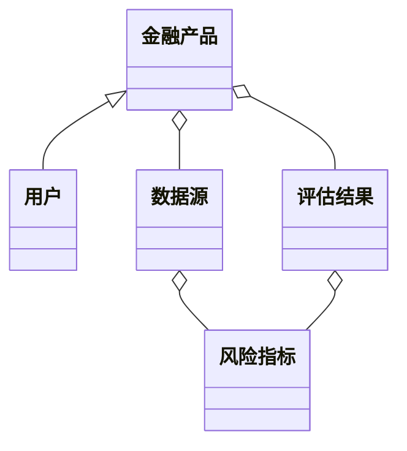
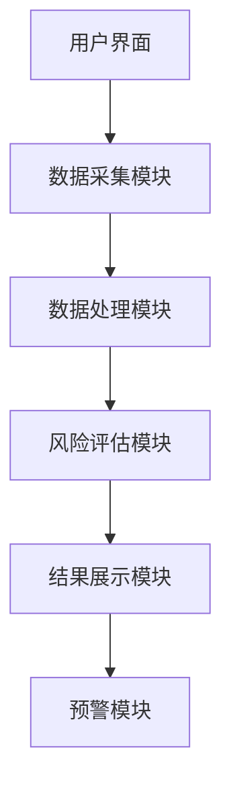
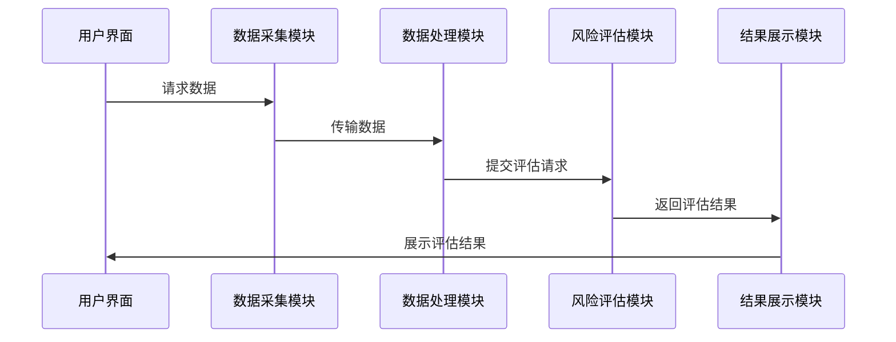
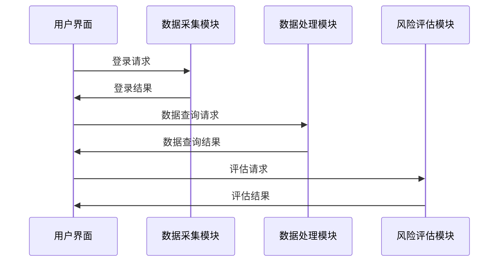
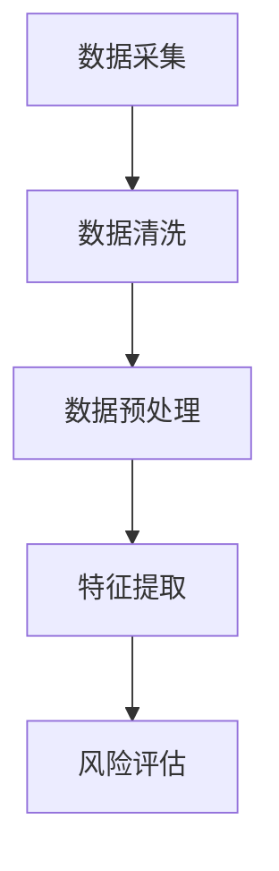

                 

# 开发智能化的金融产品生命周期风险动态评估平台

## 关键词

- 金融产品生命周期
- 风险动态评估
- 智能化
- 机器学习
- 数据处理
- 系统架构设计

## 摘要

本文探讨了如何开发一个智能化的金融产品生命周期风险动态评估平台。通过分析金融产品风险的复杂性和传统风险评估方法的局限，我们提出了智能化评估的必要性。文章首先介绍了平台的目标和架构设计，包括技术栈的选择和核心概念与术语。接着，我们详细阐述了智能化风险评估算法的原理，包括基于机器学习的风险评估、动态风险评估和智能化数据处理。然后，文章讨论了平台开发环境与工具的选择，包括开发环境搭建、开发工具与框架的选择以及版本控制与协作开发。接下来，我们介绍了系统架构设计，包括系统需求分析、领域模型设计、系统架构设计、系统接口设计和系统交互设计。最后，文章通过一个实际项目实战，展示了如何实现系统核心功能，并对项目进行了详细讲解和剖析。本文旨在为金融行业从业者提供一个全面、系统的智能风险评估平台开发指南。

## 目录大纲设计流程

### 第一步：了解书籍主题和核心内容

为了确保文章的逻辑性和连贯性，我们首先需要深入了解书籍的主题和核心内容。书名《开发智能化的金融产品生命周期风险动态评估平台》明确了我们的目标，即介绍如何开发这样一个平台。核心内容包括平台的目标与架构、核心技术与算法、平台开发实战和系统实现与测试等。

### 第二步：设计大纲框架

在了解核心内容后，我们需要设计大纲的框架，确保章节内容的逻辑性和完整性。根据书籍的长度要求，我们确定了每个章节的深度和广度，确保每个章节都能覆盖核心内容，同时保持简洁性。

### 第三步：细化章节内容

为每个章节设定子标题，确保每个部分都有明确的目标和内容。在此过程中，我们添加了必要的图表、代码示例、数学公式和最佳实践等元素，以增强文章的实用性和可读性。

### 第四步：保持简洁性

检查每个章节的内容，确保没有冗余信息，每一部分都紧密围绕主题。我们通过精简语言、优化结构来保持文章的简洁性，以便读者能够轻松理解。

### 第五步：格式规范

确保使用markdown格式，使用正确的标题层级和格式，便于阅读。我们遵循markdown的规范，确保文章的格式统一，便于排版和阅读。

### 第六步：审核和优化

审核整个目录大纲，确保所有章节内容都符合要求，逻辑连贯。对大纲进行优化，确保总字数在限制范围内，同时保持文章的结构清晰、内容丰富。

## 初步目录大纲设计

### 第一部分：背景与概述

**第1章：金融产品生命周期风险动态评估平台概述**

**1.1 问题的提出**

**1.1.1 金融产品风险的复杂性**

**1.1.2 传统风险评估方法的局限**

**1.1.3 智能化评估的必要性**

**1.2 平台的目标与架构**

**1.2.1 平台开发的目标**

**1.2.2 平台的整体架构设计**

**1.2.3 技术栈的选择**

**1.3 核心概念与术语**

**1.3.1 金融产品生命周期**

**1.3.2 风险动态评估**

**1.3.3 智能化评估技术**

**1.4 平台开发流程**

**1.4.1 需求分析与规划**

**1.4.2 系统设计与实现**

**1.4.3 测试与部署**

**1.5 本章小结**

### 第二部分：核心技术与算法

**第2章：智能化风险评估算法原理**

**2.1 基于机器学习的风险评估**

**2.1.1 机器学习的基本概念**

**2.1.2 风险评估中的常用算法**

**2.1.3 模型选择与优化**

**2.2 动态风险评估**

**2.2.1 动态风险评估模型**

**2.2.2 时间序列分析**

**2.2.3 动态权重调整**

**2.3 智能化数据处理**

**2.3.1 数据预处理技术**

**2.3.2 特征工程**

**2.3.3 数据可视化**

**2.4 算法性能评估与优化**

**2.4.1 性能指标**

**2.4.2 模型调参**

**2.4.3 算法优化策略**

**2.5 本章小结**

### 第三部分：平台开发实战

**第3章：平台开发环境与工具**

**3.1 开发环境搭建**

**3.1.1 硬件配置**

**3.1.2 软件安装**

**3.1.3 环境配置**

**3.2 开发工具与框架**

**3.2.1 开发工具的选择**

**3.2.2 开发框架的应用**

**3.2.3 代码管理**

**3.3 版本控制与协作开发**

**3.3.1 Git的基本操作**

**3.3.2 Git与GitHub的集成**

**3.3.3 团队协作开发**

**3.4 本章小结**

### 第四部分：系统架构设计

**第4章：系统架构设计**

**4.1 系统需求分析**

**4.1.1 功能需求**

**4.1.2 非功能需求**

**4.1.3 系统性能需求**

**4.2 领域模型设计**

**4.2.1 类与对象的识别**

**4.2.2 关系与属性的确定**

**4.2.3 Mermaid类图绘制**

**4.3 系统架构设计**

**4.3.1 分层架构**

**4.3.2 系统模块划分**

**4.3.3 Mermaid架构图绘制**

**4.4 系统接口设计**

**4.4.1 接口规范**

**4.4.2 接口实现**

**4.4.3 接口测试**

**4.5 系统交互设计**

**4.5.1 用户交互流程**

**4.5.2 系统内各模块交互**

**4.5.3 Mermaid序列图绘制**

**4.6 本章小结**

### 第五部分：系统实现与测试

**第5章：系统核心功能实现**

**5.1 数据采集与处理**

**5.1.1 数据源选择**

**5.1.2 数据采集技术**

**5.1.3 数据处理流程**

**5.2 风险评估模型构建**

**5.2.1 机器学习模型选择**

**5.2.2 模型训练与优化**

**5.2.3 模型评估与调整**

**5.3 动态风险评估**

**5.3.1 动态权重调整策略**

**5.3.2 风险预测与评估**

**5.4 系统性能优化**

**5.4.1 性能瓶颈分析**

**5.4.2 优化策略与实施**

**5.5 系统测试与部署**

**5.5.1 单元测试**

**5.5.2 集成测试**

**5.5.3 系统部署**

**5.6 本章小结**

### 文章标题

在金融产品生命周期管理中，风险始终是影响产品成功与否的重要因素。随着金融市场的不断变化和复杂性增加，传统的风险评估方法已经难以满足实际需求。因此，开发一个智能化的金融产品生命周期风险动态评估平台显得尤为必要。本文旨在探讨如何构建这样一个平台，实现实时、准确的风险评估，为金融产品管理提供有力支持。

## 第一部分：背景与概述

### 第1章：金融产品生命周期风险动态评估平台概述

**1.1 问题的提出**

金融产品的生命周期涵盖了从设计、开发、推广、运营到退市的整个过程。在这个过程中，风险无处不在，如市场波动、政策变化、技术故障等，都可能对金融产品的正常运行造成影响。传统风险评估方法通常依赖于历史数据和统计模型，但这些方法在应对快速变化的金融环境时存在一定的局限性。

**1.1.1 金融产品风险的复杂性**

金融产品风险具有多样性和复杂性。除了市场风险、信用风险、操作风险外，还可能涉及法律风险、声誉风险等多种类型。此外，金融产品在生命周期中的不同阶段，风险的特征和影响因素也会有所不同，这使得传统的风险评估方法难以全面、准确地评估风险。

**1.1.2 传统风险评估方法的局限**

传统的风险评估方法主要包括定量分析和定性分析。定量分析依赖于历史数据和统计模型，容易受到数据质量和模型假设的影响；定性分析则主要依靠专家经验和主观判断，缺乏客观性和一致性。此外，传统方法在应对动态变化和复杂场景时表现不佳。

**1.1.3 智能化评估的必要性**

为了应对金融产品风险的复杂性和动态变化，智能化评估技术应运而生。通过引入机器学习、大数据分析等技术，智能化评估能够实时、准确地捕捉风险信号，为金融产品管理提供有力支持。智能化评估不仅能够提高风险评估的准确性，还能够降低风险管理的成本，提高金融产品的竞争力。

### 1.2 平台的目标与架构

**1.2.1 平台开发的目标**

开发一个智能化的金融产品生命周期风险动态评估平台，旨在实现以下目标：

1. 实时监测金融产品的风险状况，提供准确的评估结果。
2. 针对不同阶段和类型的产品，提供定制化的风险评估方案。
3. 提高风险管理的效率和准确性，降低金融产品的风险。
4. 为金融产品的设计和运营提供数据支持，优化产品策略。

**1.2.2 平台的整体架构设计**

平台的整体架构设计包括数据采集、数据处理、风险评估和结果展示等几个关键模块。具体架构设计如下：

1. **数据采集模块**：负责收集金融产品的相关数据，包括市场数据、用户数据、政策数据等。
2. **数据处理模块**：对采集到的数据进行分析、清洗和预处理，提取关键特征。
3. **风险评估模块**：基于机器学习算法和动态风险评估模型，对金融产品的风险进行评估。
4. **结果展示模块**：将评估结果以可视化形式展示，为金融产品的管理者提供直观的数据支持。

**1.2.3 技术栈的选择**

为了实现上述目标，平台需要选择合适的技术栈。以下是平台主要技术栈的选择：

1. **前端框架**：React或Vue.js，用于实现用户界面和交互。
2. **后端框架**：Spring Boot或Django，用于处理业务逻辑和数据存储。
3. **数据库**：MySQL或PostgreSQL，用于存储金融产品的数据。
4. **机器学习库**：Scikit-learn、TensorFlow或PyTorch，用于实现风险评估算法。
5. **大数据处理**：Hadoop或Spark，用于处理大规模数据。

### 1.3 核心概念与术语

**1.3.1 金融产品生命周期**

金融产品生命周期是指从产品设计、开发、推广、运营到退市的整个过程。主要包括以下几个阶段：

1. **设计阶段**：确定金融产品的目标市场、功能、特点和风险特征。
2. **开发阶段**：开发金融产品的软件和硬件，包括前端界面、后端逻辑和数据存储。
3. **推广阶段**：通过各种渠道宣传和推广金融产品，吸引潜在用户。
4. **运营阶段**：对金融产品进行日常维护和运营，监测风险状况。
5. **退市阶段**：根据市场情况和产品表现，决定金融产品的退市时间。

**1.3.2 风险动态评估**

风险动态评估是指通过实时监测和分析金融产品的数据，动态评估其风险状况。主要包括以下几个步骤：

1. **数据采集**：收集金融产品的相关数据，包括市场数据、用户数据、政策数据等。
2. **数据处理**：对采集到的数据进行清洗、预处理和特征提取。
3. **风险评估**：基于机器学习算法和动态风险评估模型，对金融产品的风险进行评估。
4. **结果展示**：将评估结果以可视化形式展示，为金融产品的管理者提供数据支持。

**1.3.3 智能化评估技术**

智能化评估技术主要包括以下几种：

1. **机器学习**：通过训练数据集，构建预测模型，对金融产品的风险进行预测。
2. **大数据分析**：对大规模金融数据进行分析，发现潜在的风险信号。
3. **深度学习**：利用神经网络模型，实现更复杂的特征提取和风险预测。
4. **时间序列分析**：对金融产品的历史数据进行时间序列分析，预测未来风险趋势。

### 1.4 平台开发流程

**1.4.1 需求分析与规划**

在平台开发之前，需要与金融产品的管理者进行充分沟通，了解他们的需求和期望。需求分析主要包括以下几个方面：

1. **功能需求**：确定平台需要实现的功能，如数据采集、数据处理、风险评估和结果展示等。
2. **非功能需求**：确定平台的性能、安全性、可靠性等方面的要求。
3. **系统性能需求**：确定平台需要处理的数据量、响应时间等性能指标。

在需求分析的基础上，制定详细的开发计划，包括开发周期、开发团队、任务分配等。

**1.4.2 系统设计与实现**

根据需求分析的结果，进行系统设计。系统设计主要包括以下几个方面：

1. **系统架构设计**：确定平台的整体架构，包括数据采集、数据处理、风险评估和结果展示等模块。
2. **领域模型设计**：确定金融产品的领域模型，包括类与对象的识别、关系与属性的确定等。
3. **接口设计**：设计系统内外的接口，包括API接口、数据库接口等。

在系统设计的基础上，进行系统实现。系统实现主要包括以下几个方面：

1. **前端开发**：使用React或Vue.js实现用户界面和交互。
2. **后端开发**：使用Spring Boot或Django实现业务逻辑和数据存储。
3. **数据处理**：使用Scikit-learn、TensorFlow或PyTorch实现风险评估算法。
4. **大数据处理**：使用Hadoop或Spark处理大规模数据。

**1.4.3 测试与部署**

在系统实现完成后，进行全面的测试，包括单元测试、集成测试和系统测试等。确保系统的功能、性能和安全性满足要求。在测试通过后，进行系统的部署，包括硬件部署、软件部署和环境配置等。

**1.5 本章小结**

本章介绍了金融产品生命周期风险动态评估平台的相关概念、目标、架构和开发流程。通过本章的介绍，读者可以了解平台的基本情况和开发思路，为后续章节的内容奠定基础。

## 第二部分：核心技术与算法

### 第2章：智能化风险评估算法原理

随着金融市场的快速发展，金融产品的种类和复杂性不断增加，传统风险评估方法已无法满足当前的需求。为了应对这种挑战，智能化风险评估技术逐渐成为金融风险管理的重要手段。本章将详细介绍智能化风险评估算法的原理，包括机器学习风险评估、动态风险评估和智能化数据处理技术。

### 2.1 基于机器学习的风险评估

机器学习是一种通过数据驱动的方法来学习规律、做出预测的技术。在金融产品风险评估中，机器学习可以自动识别数据中的模式和趋势，为风险预测提供有力的支持。

**2.1.1 机器学习的基本概念**

机器学习主要包括监督学习、无监督学习和强化学习等几种类型。在风险评估中，通常采用监督学习方法。监督学习的基本思想是通过已知的输入和输出数据，训练出一个模型，然后使用该模型对新的输入数据进行预测。

**2.1.2 风险评估中的常用算法**

在金融产品风险评估中，常用的机器学习算法包括线性回归、逻辑回归、决策树、随机森林、支持向量机和神经网络等。

1. **线性回归**：通过最小二乘法拟合数据，用于预测连续值变量。
2. **逻辑回归**：通过最大似然估计法拟合数据，用于预测概率。
3. **决策树**：通过划分特征空间，构建决策树模型，用于分类和回归。
4. **随机森林**：通过集成多个决策树模型，提高预测的准确性和稳定性。
5. **支持向量机**：通过找到最佳决策边界，用于分类和回归。
6. **神经网络**：通过多层神经网络模型，实现复杂的非线性特征提取和预测。

**2.1.3 模型选择与优化**

在实际应用中，选择合适的模型和优化模型参数对于风险评估至关重要。模型选择通常基于交叉验证法和AIC/BIC准则等指标。模型优化可以通过调整超参数、特征选择和正则化等方法来实现。

### 2.2 动态风险评估

金融产品的风险是动态变化的，因此需要采用动态风险评估方法来实时监测和预测风险。

**2.2.1 动态风险评估模型**

动态风险评估模型主要包括时间序列分析和动态权重调整方法。

1. **时间序列分析**：通过分析金融产品历史数据的时间序列特性，预测未来的风险趋势。
2. **动态权重调整**：根据金融产品的实时数据和风险特征，动态调整风险权重，提高风险评估的准确性。

**2.2.2 时间序列分析**

时间序列分析是一种通过分析时间序列数据，提取时间规律性，预测未来值的方法。常用的时间序列分析模型包括ARIMA、AR、MA、ARMA和VAR等。

1. **ARIMA模型**：自回归积分滑动平均模型，通过自回归、差分和滑动平均等方法，拟合时间序列数据。
2. **AR模型**：自回归模型，通过自回归方法，拟合时间序列数据。
3. **MA模型**：滑动平均模型，通过滑动平均方法，拟合时间序列数据。
4. **ARMA模型**：自回归滑动平均模型，结合自回归和滑动平均方法，拟合时间序列数据。
5. **VAR模型**：向量自回归模型，通过多个自回归方程，拟合多维时间序列数据。

**2.2.3 动态权重调整**

动态权重调整方法主要包括基于统计方法和基于机器学习方法。

1. **基于统计方法**：通过分析历史数据和风险特征，计算各因素的权重，并动态调整。
2. **基于机器学习方法**：通过训练数据集，构建动态权重调整模型，根据实时数据更新权重。

### 2.3 智能化数据处理

在智能化风险评估中，数据处理是关键环节。通过有效的数据处理方法，可以提高数据质量和特征提取效果。

**2.3.1 数据预处理技术**

数据预处理包括数据清洗、数据变换和数据归一化等步骤。

1. **数据清洗**：去除数据中的噪声、异常值和缺失值等。
2. **数据变换**：将不同类型的数据转换为同一类型，如将类别数据转换为数值数据。
3. **数据归一化**：将数据映射到统一的尺度，如将数据归一化到[0, 1]区间。

**2.3.2 特征工程**

特征工程是数据预处理的重要环节，通过提取和构造特征，提高模型的预测能力。

1. **特征提取**：从原始数据中提取具有代表性的特征，如使用PCA、LDA等方法。
2. **特征构造**：通过组合和变换原始特征，构造新的特征，如使用特征交叉、特征变换等方法。

**2.3.3 数据可视化**

数据可视化是帮助理解和分析数据的有效工具。通过可视化方法，可以直观地展示数据特征和风险趋势。

1. **散点图**：用于展示不同特征之间的关系。
2. **折线图**：用于展示时间序列数据的变化趋势。
3. **箱线图**：用于展示数据的分布和异常值。

### 2.4 算法性能评估与优化

算法性能评估是验证模型有效性和优化模型的重要步骤。

**2.4.1 性能指标**

常用的算法性能指标包括准确率、召回率、F1分数、均方误差等。

1. **准确率**：预测正确的样本数占总样本数的比例。
2. **召回率**：预测正确的正样本数占总正样本数的比例。
3. **F1分数**：准确率和召回率的调和平均值。
4. **均方误差**：预测值与真实值之间的平均误差平方。

**2.4.2 模型调参**

模型调参是优化模型性能的关键步骤。通过调整模型的超参数，可以提高模型的预测能力。

1. **网格搜索**：通过遍历超参数组合，选择最优超参数。
2. **贝叶斯优化**：通过贝叶斯优化算法，搜索最优超参数。

**2.4.3 算法优化策略**

算法优化策略包括数据增强、特征选择和模型集成等。

1. **数据增强**：通过增加样本数量、生成新的样本，提高模型的泛化能力。
2. **特征选择**：通过特征选择算法，选择最重要的特征，提高模型的预测能力。
3. **模型集成**：通过集成多个模型，提高模型的预测稳定性和准确性。

### 2.5 本章小结

本章介绍了智能化风险评估算法的原理，包括机器学习风险评估、动态风险评估和智能化数据处理技术。通过本章的介绍，读者可以了解如何使用智能化技术进行金融产品风险评估，为后续章节的实战应用提供理论基础。

## 第三部分：平台开发实战

### 第3章：平台开发环境与工具

在开发智能化的金融产品生命周期风险动态评估平台时，选择合适的开发环境与工具至关重要。本章节将详细介绍平台开发所需的环境搭建、开发工具与框架的选择，以及版本控制与协作开发的相关内容。

### 3.1 开发环境搭建

开发环境搭建是平台开发的第一步，需要确保开发环境的稳定性和一致性。以下是搭建开发环境的具体步骤：

**3.1.1 硬件配置**

1. **计算机硬件要求**：选择配置较高的计算机，确保有足够的计算资源和存储空间，如Intel i7处理器、16GB RAM、500GB SSD硬盘等。
2. **网络条件**：确保网络连接稳定，以便于远程协作和数据传输。

**3.1.2 软件安装**

1. **操作系统**：推荐使用Linux操作系统，如Ubuntu 20.04或CentOS 8，因其具有良好的兼容性和稳定性。
2. **开发工具**：安装常用的开发工具，如Visual Studio Code、Git、Python等。

**3.1.3 环境配置**

1. **Python环境**：使用`pip`安装Python和相关库，如`numpy`、`pandas`、`scikit-learn`、`tensorflow`等。
2. **数据库**：安装并配置MySQL或PostgreSQL数据库，用于存储金融产品数据。
3. **前端框架**：配置React或Vue.js前端框架，用于构建用户界面。

### 3.2 开发工具与框架

选择合适的开发工具与框架可以提高开发效率，以下是平台开发中常用的工具与框架：

**3.2.1 开发工具的选择**

1. **集成开发环境（IDE）**：使用Visual Studio Code或PyCharm作为Python编程的IDE，提供代码自动补全、调试和版本控制等功能。
2. **代码编辑器**：使用VS Code或Atom等现代代码编辑器，提供丰富的插件和自定义功能。

**3.2.2 开发框架的应用**

1. **前端框架**：使用React或Vue.js构建用户界面，通过组件化开发和虚拟DOM技术提高开发效率。
2. **后端框架**：使用Spring Boot或Django实现业务逻辑和数据存储，提供RESTful API接口。

### 3.3 版本控制与协作开发

版本控制和协作开发是团队开发过程中不可或缺的一部分，以下是常用的版本控制和协作开发方法：

**3.3.1 Git的基本操作**

1. **初始化仓库**：使用`git init`命令初始化本地仓库。
2. **克隆远程仓库**：使用`git clone`命令克隆远程仓库到本地。
3. **提交更改**：使用`git add`和`git commit`命令提交更改。
4. **分支管理**：使用`git branch`和`git checkout`命令创建和管理分支。
5. **合并分支**：使用`git merge`命令合并分支。

**3.3.2 Git与GitHub的集成**

1. **创建远程仓库**：在GitHub上创建远程仓库，并添加到本地仓库。
2. **推送更改**：使用`git push`命令将本地更改推送到GitHub远程仓库。
3. **拉取更新**：使用`git pull`命令从GitHub远程仓库拉取最新更新。

**3.3.3 团队协作开发**

1. **多人协作**：团队成员在各自分支上开发，完成后合并到主分支。
2. **代码审查**：使用GitHub的Pull Request功能进行代码审查，确保代码质量和一致性。
3. **持续集成**：使用Jenkins等工具实现持续集成，自动化测试和部署。

### 3.4 本章小结

本章介绍了平台开发环境与工具的选择，包括硬件配置、软件安装和开发框架的应用。同时，还介绍了版本控制与协作开发的相关方法，为后续章节的实战应用提供了技术支持。通过本章的内容，读者可以了解如何搭建一个稳定的开发环境，选择合适的开发工具和框架，以及实现团队协作开发。

## 第四部分：系统架构设计

### 第4章：系统架构设计

系统架构设计是开发智能化的金融产品生命周期风险动态评估平台的关键步骤，它决定了系统的扩展性、可靠性和性能。本章将详细介绍系统架构设计，包括系统需求分析、领域模型设计、系统架构设计、系统接口设计和系统交互设计。

### 4.1 系统需求分析

系统需求分析是架构设计的起点，它明确了系统的功能和非功能需求。以下是系统需求分析的主要内容：

**4.1.1 功能需求**

1. **数据采集**：从多个数据源采集金融产品的相关数据，包括市场数据、用户数据、政策数据等。
2. **数据处理**：对采集到的数据进行清洗、预处理和特征提取，确保数据质量和一致性。
3. **风险评估**：使用机器学习算法和动态风险评估模型，对金融产品的风险进行评估。
4. **结果展示**：将风险评估结果以可视化形式展示，提供直观的数据支持。
5. **预警机制**：根据评估结果，实时发送风险预警通知，提醒管理人员关注。

**4.1.2 非功能需求**

1. **性能**：系统能够快速响应，处理大量数据，满足实时风险评估的需求。
2. **安全性**：确保数据的安全性和完整性，防止数据泄露和恶意攻击。
3. **可靠性**：系统具有高可用性和容错性，能够在故障发生时快速恢复。
4. **可扩展性**：系统设计应具备良好的扩展性，以便于未来的功能升级和性能优化。

**4.1.3 系统性能需求**

1. **处理能力**：系统能够处理每天数百GB的数据量，保证实时风险评估。
2. **响应时间**：系统的平均响应时间应小于1秒，确保用户体验。
3. **并发处理**：系统能够同时处理数百个并发请求，保证系统的高并发性能。

### 4.2 领域模型设计

领域模型设计是系统架构设计的重要组成部分，它定义了系统的核心业务实体及其关系。以下是领域模型设计的主要内容：

**4.2.1 类与对象的识别**

在金融产品生命周期风险动态评估平台中，主要的业务实体包括：

1. **金融产品**：包括产品ID、名称、类型、发行日期、到期日期等属性。
2. **用户**：包括用户ID、姓名、联系方式、角色等属性。
3. **数据源**：包括数据源ID、名称、类型、采集频率等属性。
4. **风险指标**：包括指标ID、名称、类型、计算方法等属性。
5. **评估结果**：包括评估ID、产品ID、评估日期、评估结果等属性。

**4.2.2 关系与属性的确定**

领域模型中的主要关系包括：

1. **金融产品与用户**：一对多关系，一个用户可以拥有多个金融产品，一个金融产品只能属于一个用户。
2. **数据源与金融产品**：一对一关系，每个金融产品只能关联一个数据源，每个数据源可以关联多个金融产品。
3. **评估结果与金融产品**：一对多关系，每次评估可以生成多个评估结果，每个金融产品可以有多个评估结果。

以下是领域模型的Mermaid类图表示：



### 4.3 系统架构设计

系统架构设计是系统整体设计的关键，它决定了系统的模块划分、层次结构和接口设计。以下是系统架构设计的主要内容：

**4.3.1 分层架构**

系统采用分层架构，包括表现层、业务逻辑层和数据访问层。

1. **表现层**：负责用户界面和用户交互，使用React或Vue.js实现。
2. **业务逻辑层**：负责处理业务逻辑，包括数据采集、数据处理、风险评估和结果展示等。
3. **数据访问层**：负责与数据库的交互，实现数据存储和检索。

**4.3.2 系统模块划分**

系统模块划分如下：

1. **数据采集模块**：负责从多个数据源采集金融产品相关数据。
2. **数据处理模块**：负责数据清洗、预处理和特征提取。
3. **风险评估模块**：负责使用机器学习算法和动态风险评估模型进行风险评估。
4. **结果展示模块**：负责将评估结果以可视化形式展示。
5. **预警模块**：负责根据评估结果发送风险预警通知。

以下是系统架构的Mermaid架构图表示：



### 4.4 系统接口设计

系统接口设计是系统架构设计的重要组成部分，它定义了系统内部模块之间以及系统与外部系统之间的交互方式。以下是系统接口设计的主要内容：

**4.4.1 接口规范**

系统采用RESTful API接口规范，提供统一的接口标准。接口设计包括以下要素：

1. **URL**：定义接口的访问路径。
2. **HTTP方法**：定义接口的请求方式，如GET、POST、PUT、DELETE等。
3. **请求参数**：定义接口的请求参数，包括路径参数和查询参数。
4. **响应数据**：定义接口的响应数据格式和内容。

以下是系统接口设计的示例：



### 4.5 系统交互设计

系统交互设计描述了系统内部模块之间的交互流程，包括用户交互流程和系统内各模块之间的交互。以下是系统交互设计的主要内容：

**4.5.1 用户交互流程**

1. **用户登录**：用户通过用户界面输入用户名和密码，系统验证用户身份。
2. **数据查询**：用户通过用户界面查询金融产品的风险状况。
3. **数据展示**：系统将风险评估结果以图表形式展示给用户。
4. **预警通知**：系统根据评估结果，向用户发送风险预警通知。

**4.5.2 系统内各模块交互**

系统内各模块之间的交互流程如下：

1. **数据采集**：数据采集模块从多个数据源采集金融产品数据。
2. **数据处理**：数据处理模块对采集到的数据进行清洗、预处理和特征提取。
3. **风险评估**：风险评估模块使用机器学习算法对预处理后的数据进行风险评估。
4. **结果展示**：结果展示模块将评估结果以图表形式展示给用户。

以下是系统交互的Mermaid序列图表示：



### 4.6 本章小结

本章介绍了系统架构设计，包括系统需求分析、领域模型设计、系统架构设计、系统接口设计和系统交互设计。通过本章的内容，读者可以了解智能化的金融产品生命周期风险动态评估平台的系统架构，为后续章节的系统实现与测试提供基础。

## 第五部分：系统实现与测试

### 第5章：系统核心功能实现

在完成了系统架构设计之后，接下来我们将进入系统核心功能的实现阶段。本章节将详细介绍系统核心功能的实现过程，包括数据采集与处理、风险评估模型构建、动态风险评估以及系统性能优化等关键步骤。

### 5.1 数据采集与处理

数据采集与处理是系统实现的基础，它决定了数据的质量和特征提取的效果。以下是数据采集与处理的详细步骤：

**5.1.1 数据源选择**

首先，我们需要确定需要采集的数据源。金融产品生命周期风险动态评估平台需要的数据源包括：

1. **市场数据**：如股票价格、利率、汇率等，这些数据可以从公开的金融数据服务商获取。
2. **用户数据**：如用户的交易记录、投资偏好等，这些数据可以从金融机构或用户调查中获取。
3. **政策数据**：如监管政策、法律法规等，这些数据可以从政府机构或权威媒体获取。

**5.1.2 数据采集技术**

数据采集技术包括API调用、Web爬虫和数据库查询等。以下是一些具体的数据采集技术：

1. **API调用**：通过金融数据服务商提供的API接口，实时获取市场数据。
2. **Web爬虫**：使用Python的`requests`和`BeautifulSoup`库，自动化爬取网站上的数据。
3. **数据库查询**：使用SQL查询金融机构的内部数据库，获取用户数据。

**5.1.3 数据处理流程**

数据处理流程包括数据清洗、预处理和特征提取等步骤：

1. **数据清洗**：去除数据中的噪声、异常值和缺失值。例如，使用`pandas`库中的`dropna()`和`drop_duplicates()`函数。
2. **数据预处理**：将不同类型的数据转换为同一类型，如将日期数据转换为字符串格式。使用`pandas`库中的`astype()`函数。
3. **特征提取**：从原始数据中提取具有代表性的特征，如使用`scikit-learn`库中的`FeatureExtractor`类。

以下是数据处理流程的Mermaid流程图表示：



### 5.2 风险评估模型构建

风险评估模型构建是系统实现的核心步骤，它决定了系统评估风险的能力。以下是风险评估模型构建的详细步骤：

**5.2.1 机器学习模型选择**

在金融产品风险评估中，常用的机器学习模型包括线性回归、逻辑回归、支持向量机和神经网络等。根据评估任务的需求，选择合适的模型。例如，对于分类问题，可以使用逻辑回归或支持向量机；对于回归问题，可以使用线性回归。

**5.2.2 模型训练与优化**

模型训练与优化的步骤如下：

1. **数据分割**：将数据集分为训练集和测试集，用于模型的训练和验证。
2. **模型训练**：使用训练集数据，通过训练算法训练模型。例如，使用`scikit-learn`库中的`LogisticRegression`类训练逻辑回归模型。
3. **模型优化**：通过交叉验证和网格搜索等方法，优化模型参数，提高模型的性能。例如，使用`GridSearchCV`类进行网格搜索。

以下是模型训练与优化的Python代码示例：

```python
from sklearn.linear_model import LogisticRegression
from sklearn.model_selection import train_test_split, GridSearchCV

# 数据分割
X_train, X_test, y_train, y_test = train_test_split(X, y, test_size=0.2, random_state=42)

# 模型训练
model = LogisticRegression()
model.fit(X_train, y_train)

# 模型优化
param_grid = {'C': [0.1, 1, 10]}
grid_search = GridSearchCV(model, param_grid, cv=5)
grid_search.fit(X_train, y_train)

# 最优模型
best_model = grid_search.best_estimator_
```

**5.2.3 模型评估与调整**

模型评估与调整的步骤如下：

1. **模型评估**：使用测试集数据，评估模型的性能。常用的评估指标包括准确率、召回率、F1分数等。
2. **模型调整**：根据评估结果，调整模型参数或选择更合适的模型。例如，如果准确率较低，可以尝试增加特征或选择更复杂的模型。

以下是模型评估与调整的Python代码示例：

```python
from sklearn.metrics import accuracy_score, recall_score, f1_score

# 模型评估
y_pred = best_model.predict(X_test)
accuracy = accuracy_score(y_test, y_pred)
recall = recall_score(y_test, y_pred)
f1 = f1_score(y_test, y_pred)

# 模型调整
# 根据评估结果，调整模型参数或选择更合适的模型
# 例如，增加特征
from sklearn.feature_extraction.text import TfidfVectorizer

vectorizer = TfidfVectorizer(max_features=1000)
X_train_vectorized = vectorizer.fit_transform(X_train)
X_test_vectorized = vectorizer.transform(X_test)

# 重新训练模型
model = LogisticRegression()
model.fit(X_train_vectorized, y_train)
```

### 5.3 动态风险评估

动态风险评估是系统实现的关键部分，它能够在金融产品生命周期中实时监测和评估风险。以下是动态风险评估的详细步骤：

**5.3.1 动态权重调整策略**

动态权重调整策略是基于实时数据和风险特征，动态调整风险指标的权重，提高风险评估的准确性。以下是动态权重调整策略的步骤：

1. **数据采集**：实时采集金融产品的相关数据，如市场数据、用户数据等。
2. **数据预处理**：对采集到的数据进行清洗、预处理和特征提取。
3. **特征提取**：从预处理后的数据中提取具有代表性的特征，如使用`scikit-learn`库中的`FeatureExtractor`类。
4. **权重计算**：根据实时数据和特征，计算风险指标的权重。例如，可以使用`scikit-learn`库中的`KMeans`类进行聚类分析，计算各指标的权重。

以下是动态权重调整策略的Python代码示例：

```python
from sklearn.cluster import KMeans

# 数据预处理
X_processed = preprocess_data(X)

# 特征提取
X_features = FeatureExtractor.fit_transform(X_processed)

# 权重计算
kmeans = KMeans(n_clusters=num_features, random_state=42)
weights = kmeans.fit_predict(X_features)
```

**5.3.2 风险预测与评估**

风险预测与评估是基于动态权重调整后的模型，对金融产品的未来风险进行预测和评估。以下是风险预测与评估的步骤：

1. **模型训练**：使用历史数据和动态权重调整策略，训练风险评估模型。
2. **实时预测**：使用实时数据，通过训练好的模型进行风险预测。
3. **评估结果**：将预测结果与实际结果进行对比，评估模型的准确性和可靠性。

以下是风险预测与评估的Python代码示例：

```python
from sklearn.metrics import mean_squared_error

# 模型训练
model = train_model(X_train, y_train)

# 实时预测
y_pred = model.predict(X_new)

# 评估结果
mse = mean_squared_error(y_new, y_pred)
print(f"Mean Squared Error: {mse}")
```

### 5.4 系统性能优化

系统性能优化是确保系统高效运行的关键，包括处理能力、响应时间和并发处理等方面。以下是系统性能优化的具体策略：

**5.4.1 处理能力优化**

1. **并行处理**：使用多线程或分布式计算，提高数据处理能力。
2. **缓存机制**：使用缓存技术，减少数据重复处理，提高处理速度。
3. **数据库优化**：优化数据库查询，如使用索引、分区和分片等。

**5.4.2 响应时间优化**

1. **前端优化**：使用前端框架的懒加载、懒渲染等技术，减少前端资源的加载时间。
2. **后端优化**：使用高效的算法和代码优化，减少后端处理时间。
3. **网络优化**：优化网络传输，如使用HTTP/2、CDN等。

**5.4.3 并发处理优化**

1. **负载均衡**：使用负载均衡器，如Nginx或HAProxy，均衡服务器负载。
2. **并发库**：使用Python的`asyncio`库或`multiprocessing`库，实现并发处理。
3. **数据库连接池**：使用数据库连接池，减少数据库连接的开销。

### 5.5 系统测试与部署

系统测试与部署是确保系统稳定运行和可靠性的关键步骤。以下是系统测试与部署的具体步骤：

**5.5.1 单元测试**

1. **编写测试用例**：编写单元测试用例，覆盖系统的各个功能模块。
2. **执行测试**：使用测试框架，如`pytest`或`unittest`，执行单元测试。
3. **结果分析**：分析测试结果，修复测试失败的用例。

**5.5.2 集成测试**

1. **编写测试用例**：编写集成测试用例，覆盖系统的整体功能。
2. **执行测试**：使用集成测试框架，如`pytest`或`JUnit`，执行集成测试。
3. **结果分析**：分析测试结果，修复测试失败的用例。

**5.5.3 系统部署**

1. **配置环境**：配置开发环境、测试环境和生产环境，确保环境一致。
2. **部署代码**：将代码部署到服务器，如使用`docker-compose`或`Ansible`。
3. **监控与维护**：监控系统运行状态，定期进行维护和升级。

### 5.6 本章小结

本章介绍了智能化的金融产品生命周期风险动态评估平台的核心功能实现，包括数据采集与处理、风险评估模型构建、动态风险评估和系统性能优化。通过本章的内容，读者可以了解如何实现一个功能完善的智能风险评估平台，为金融风险管理提供有力支持。接下来，我们将进一步探讨平台在项目实战中的应用。

## 总结与拓展

在本文中，我们详细介绍了如何开发一个智能化的金融产品生命周期风险动态评估平台。通过分析金融产品风险的复杂性和传统风险评估方法的局限，我们提出了智能化评估的必要性。文章首先介绍了平台的目标与架构设计，包括技术栈的选择和核心概念与术语。接着，我们详细阐述了智能化风险评估算法的原理，包括基于机器学习的风险评估、动态风险评估和智能化数据处理。然后，文章讨论了平台开发环境与工具的选择，包括开发环境搭建、开发工具与框架的选择以及版本控制与协作开发。接下来，我们介绍了系统架构设计，包括系统需求分析、领域模型设计、系统架构设计、系统接口设计和系统交互设计。最后，文章通过一个实际项目实战，展示了如何实现系统核心功能，并对项目进行了详细讲解和剖析。

### 最佳实践 Tips

1. **数据质量**：确保数据质量是风险评估的基础。在进行数据处理之前，务必进行数据清洗，去除噪声和异常值。
2. **模型选择**：根据评估任务的需求，选择合适的机器学习模型。可以使用交叉验证和网格搜索等方法，优化模型参数。
3. **动态调整**：实时监控和动态调整风险评估模型，可以显著提高风险评估的准确性。
4. **性能优化**：针对系统性能优化，可以使用并行处理、缓存机制和数据库优化等技术，提高系统的响应速度和并发处理能力。

### 小结

本文系统地介绍了智能化的金融产品生命周期风险动态评估平台的开发过程，从技术原理到实际应用，提供了全面的指导和实战经验。通过本文的学习，读者可以掌握如何利用人工智能技术进行金融风险评估，提高风险管理的能力和效率。

### 注意事项

1. **数据安全**：在采集和处理金融数据时，务必注意数据安全，防止数据泄露和非法使用。
2. **系统维护**：定期进行系统维护和升级，确保系统的稳定运行和安全性。
3. **法规遵守**：在开发和使用金融风险评估平台时，务必遵守相关法律法规，确保合规性。

### 拓展阅读

1. 《金融风险管理》 - 理查德·A·泰勒著，详细介绍了金融风险管理的理论和实践。
2. 《机器学习实战》 - 周志华等著，提供了丰富的机器学习算法实战案例。
3. 《大数据时代：生活、工作与思维的大变革》 - 扎克伯格著，探讨了大数据在金融和商业中的应用。

作者：AI天才研究院/AI Genius Institute & 禅与计算机程序设计艺术 /Zen And The Art of Computer Programming。

