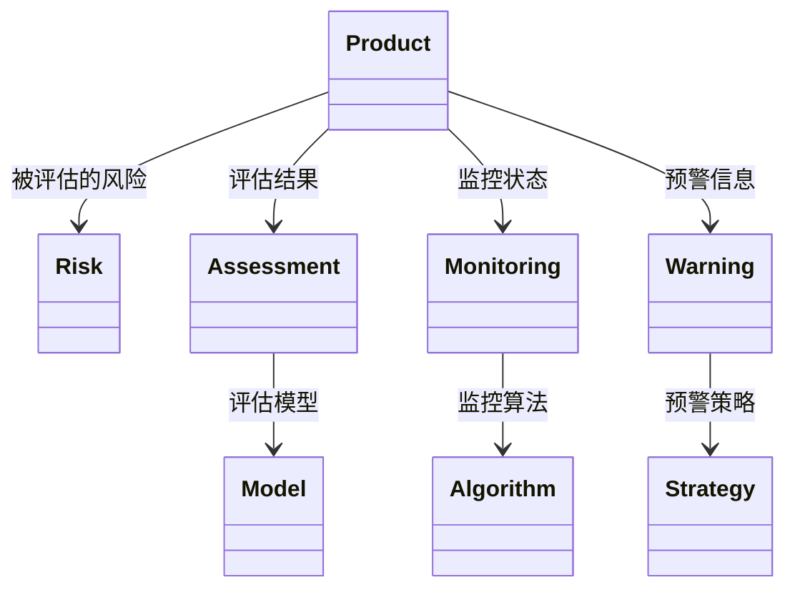
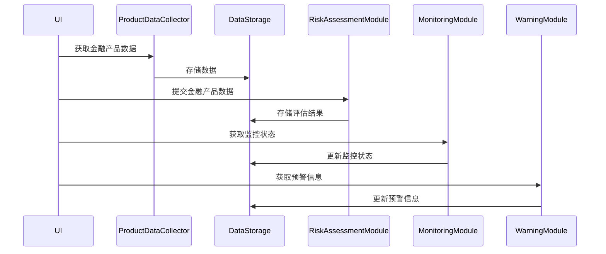
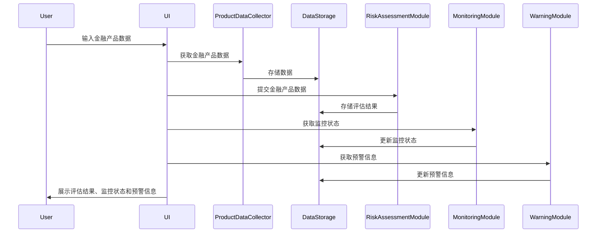

                 

### 第一部分：背景介绍

在当今金融科技高速发展的时代，金融机构面临的挑战日益复杂。金融产品的种类繁多，市场波动频繁，风险因素多样且难以预测。因此，如何有效评估和管理金融产品生命周期中的风险，成为金融科技领域的研究热点。开发一个智能化的金融产品生命周期风险动态评估平台，有助于金融机构实时监控和管理风险，从而提高风险管理效率，防范潜在风险。

#### 1.1 问题背景

随着全球金融市场的不断发展和复杂化，金融机构面临的挑战也日益增加。一方面，金融市场的不确定性增加，市场波动性加大，金融产品的价格波动频繁，风险因素复杂多变。另一方面，金融机构所面临的风险类型也日益多样化，包括市场风险、信用风险、操作风险、流动性风险等。这些风险因素相互交织，使得传统的风险评估方法难以有效应对。

传统的风险评估方法通常基于静态数据分析，通过对历史数据进行分析，预测未来风险。然而，这种方法存在明显的局限性。首先，静态数据分析无法及时反映市场变化，容易导致风险预警滞后。其次，传统风险评估方法通常依赖于主观判断，风险评估结果的准确性和可靠性难以保证。此外，随着金融产品的多样化和复杂化，传统风险评估方法难以覆盖所有的风险类型。

因此，开发一个智能化的金融产品生命周期风险动态评估平台，成为解决上述问题的有效途径。该平台能够利用先进的数据分析技术和人工智能算法，对金融产品的全生命周期进行实时监控和风险评估，从而实现风险的动态识别、预警和应对。

#### 1.2 问题描述

金融产品生命周期风险动态评估平台旨在通过对金融产品的全生命周期监控，实时识别潜在风险，并提供相应的风险预警和应对策略。具体而言，该平台需要实现以下几个核心功能：

1. **数据采集与处理**：
   - **数据来源**：金融产品生命周期风险动态评估平台需要从多个数据源中收集金融产品的相关信息，包括市场数据、产品历史数据、交易数据、公司财务数据等。
   - **数据处理**：对收集到的数据进行清洗、去重、归一化等预处理操作，确保数据的准确性和一致性。

2. **风险评估模型**：
   - **风险因素识别**：通过数据挖掘和机器学习算法，识别影响金融产品风险的关键因素，如市场波动、公司财务状况、交易行为等。
   - **风险评级**：根据风险因素对金融产品进行风险评估，将风险等级划分为高、中、低等不同级别。
   - **风险预测**：利用时间序列分析和预测模型，预测金融产品的未来风险水平，为金融机构提供决策依据。

3. **动态监控与预警**：
   - **实时监控**：对金融产品的风险状况进行实时监控，及时发现潜在风险。
   - **预警机制**：根据风险评估结果，自动生成风险预警，提供风险预警级别和预警内容。
   - **应对策略**：为金融机构提供相应的风险应对策略，如调整投资组合、增加风险储备等。

4. **用户交互界面**：
   - **可视化展示**：通过友好的用户交互界面，将风险评估结果、风险预警和应对策略可视化展示，便于用户理解和决策。
   - **用户操作**：提供用户自定义设置，如选择评估指标、设定风险阈值等。

#### 1.3 问题解决

为了解决上述问题，本书将采用以下方法：

1. **深度学习与数据挖掘**：
   - **深度学习**：利用深度学习算法，如卷积神经网络（CNN）、循环神经网络（RNN）、长短期记忆网络（LSTM）等，对金融数据进行特征提取和风险评估。
   - **数据挖掘**：通过数据挖掘技术，如关联规则挖掘、聚类分析、分类分析等，识别影响金融产品风险的关键因素。

2. **风险评估模型**：
   - **模型构建**：结合金融理论，构建能够反映金融产品风险的数学模型，如风险矩阵、风险价值（VaR）模型、条件风险价值（CVaR）模型等。
   - **模型优化**：通过实证研究，对评估模型进行优化，提高风险评估的准确性和可靠性。

3. **动态监控与预警**：
   - **实时监控**：利用实时数据处理技术，如消息队列、分布式计算等，实现金融产品风险的实时监控。
   - **预警算法**：结合机器学习算法，如决策树、随机森林、支持向量机等，构建风险预警算法，提高预警的准确性和响应速度。

4. **用户交互界面**：
   - **界面设计**：采用现代Web技术，如React、Vue等，设计直观、易用的用户交互界面。
   - **交互体验**：通过交互设计，提升用户的操作体验，如动态数据展示、实时预警提示等。

#### 1.4 边界与外延

本书主要关注金融产品生命周期风险动态评估平台的理论研究和实践应用。具体边界包括：

1. **金融产品范围**：
   - 本书主要研究股票、债券、基金等金融产品。这些产品具有代表性的金融属性和风险特征，能够为风险评估提供有效的参考。
   - 其他金融产品，如期货、期权、外汇等，可以参照本书的方法进行风险评估。

2. **风险类型**：
   - 本书主要评估市场风险、信用风险、操作风险等。这些风险是金融产品生命周期中最常见、最重要的风险类型。
   - 其他风险类型，如流动性风险、声誉风险等，可以根据类似的方法进行评估。

3. **应用场景**：
   - 本书主要针对金融机构内部的风险管理，如投资银行、证券公司、基金公司等。
   - 其他金融机构，如银行、保险公司等，也可以借鉴本书的方法，建立相应的风险动态评估平台。

#### 1.5 概念结构与核心要素组成

金融产品生命周期风险动态评估平台的核心概念和要素包括：

1. **金融产品**：金融产品是风险评估的对象，包括股票、债券、基金等。
2. **生命周期**：金融产品的生命周期包括发行、交易、到期等阶段，每个阶段都有不同的风险特征。
3. **风险**：金融产品在生命周期中面临的风险类型，包括市场风险、信用风险、操作风险等。
4. **评估**：对金融产品风险进行定量和定性的分析，包括风险评估模型、评估方法等。
5. **动态监控**：实时跟踪和评估金融产品风险的变化，包括监控算法、预警机制等。
6. **预警**：根据风险评估结果，提前发出风险预警，包括预警算法、预警策略等。
7. **用户交互界面**：提供友好的用户交互界面，便于用户查看风险评估结果、预警信息和应对策略。

通过以上要素的有机组合，金融产品生命周期风险动态评估平台能够实现对金融产品风险的全面监控和有效管理，为金融机构提供强大的风险管理工具。

### 第二部分：核心概念与联系

在开发智能化的金融产品生命周期风险动态评估平台过程中，理解核心概念及其相互联系至关重要。本文将详细探讨核心概念，并对比其属性特征，以帮助读者深入理解这一平台的技术架构和功能。

#### 2.1 核心概念原理

**金融产品**：金融产品是金融市场上交易的资产，如股票、债券、基金等。每种金融产品都有其独特的属性，如股票代表对公司的所有权，债券代表债务工具，基金则是一种投资组合。

**生命周期**：金融产品的生命周期从其发行开始，经过交易活跃期，最终到期退市。每个阶段都有特定的风险特征，例如，在发行阶段，风险主要来自市场接受度；在交易活跃期，风险可能因市场波动而增加。

**风险**：金融产品生命周期中的风险包括市场风险、信用风险、操作风险等。市场风险是指由于市场波动导致的价格不确定性；信用风险是指借款人或发行人无法履行债务的风险；操作风险是指由于内部流程、系统缺陷或外部事件导致的损失风险。

**评估**：评估是指对金融产品风险进行定量和定性的分析。定量分析通常包括使用统计模型和机器学习算法来预测风险，定性分析则侧重于评估风险的概率和影响。

**动态监控**：动态监控是指实时跟踪金融产品的风险变化，通过监控模型和算法，及时识别新的风险因素，调整风险评估结果。

**预警**：预警是指根据风险评估结果，提前发出风险警告。预警机制包括设置风险阈值、实时监控和报警系统等。

#### 2.2 概念属性特征对比表格

| 概念       | 定义                                                         | 特征对比       |
|------------|--------------------------------------------------------------|----------------|
| 金融产品   | 具有金融属性的证券或其他金融工具。                           | 类型多样，投资属性不同 |
| 生命周期   | 金融产品从发行、交易到退市的全过程。                       | 不同产品生命周期长度差异 |
| 风险       | 金融产品在生命周期中可能面临的各种不确定性。               | 风险类型多样，程度不同 |
| 评估       | 对金融产品风险进行定量和定性的分析。                       | 方法多样，精度不同   |
| 动态监控   | 实时跟踪和评估金融产品风险的变化。                         | 实时性，准确性要求高 |
| 预警       | 根据风险评估结果，提前发出风险预警。                       | 预警级别，响应速度 |

#### 2.3 ER实体关系图架构

为了更好地展示金融产品生命周期风险动态评估平台中的核心实体及其相互关系，我们可以使用Mermaid语言绘制ER图。以下是一个简化的ER图示例：

```mermaid
erDiagram
  Product  ||--|{ Risk : 被评估的风险 }
  Product  ||--|{ Assessment : 评估结果 }
  Product  ||--|{ Monitoring : 监控状态 }
  Product  ||--|{ Warning : 预警信息 }
  Assessment  ||--|{ Model : 评估模型 }
  Monitoring  ||--|{ Algorithm : 监控算法 }
  Warning  ||--|{ Strategy : 预警策略 }
```

在这个ER图中，`Product`（金融产品）是核心实体，它与多个相关实体如`Risk`（风险）、`Assessment`（评估结果）、`Monitoring`（监控状态）和`Warning`（预警信息）存在关联。`Assessment`与`Model`（评估模型）关联，表示评估结果是基于特定模型得出的。`Monitoring`与`Algorithm`（监控算法）关联，表示监控状态是通过特定算法实时跟踪的。`Warning`与`Strategy`（预警策略）关联，表示预警信息是根据特定策略生成的。

通过上述核心概念的阐述和ER图的展示，我们可以清晰地理解金融产品生命周期风险动态评估平台的结构和功能，为后续的算法原理讲解和系统分析与架构设计奠定基础。

### 第三部分：算法原理讲解

在金融产品生命周期风险动态评估平台中，算法的设计和实现是关键环节。本部分将详细介绍算法原理，包括风险因素识别、风险评估模型构建和风险预测方法，并结合Python代码进行详细讲解。

#### 3.1 风险因素识别

风险因素识别是评估金融产品风险的第一步，它涉及到从大量金融数据中提取关键因素。常用的方法包括数据挖掘和机器学习算法，如关联规则挖掘、聚类分析和回归分析等。以下是一个基于K-means聚类算法的风险因素识别示例：

```python
from sklearn.cluster import KMeans
import numpy as np

# 假设已有金融数据集X，其中包含了不同金融产品的多个特征
X = np.array([[1, 2], [1, 4], [1, 0], [4, 2], [4, 4], [4, 0]])

# 使用K-means算法进行聚类，设定聚类中心数量为2
kmeans = KMeans(n_clusters=2, random_state=0).fit(X)

# 输出聚类结果
print("聚类中心：", kmeans.cluster_centers_)
print("每个样本所属的簇：", kmeans.labels_)

# 提取关键风险因素，这里以聚类中心代表
risk_factors = kmeans.cluster_centers_
```

上述代码使用K-means聚类算法对金融数据集进行聚类，通过聚类中心提取出关键风险因素。这些聚类中心代表了不同金融产品的特征，可以用于进一步的风险评估。

#### 3.2 风险评估模型构建

风险评估模型是评估金融产品风险的数学工具，常用的模型包括风险矩阵、风险价值（VaR）模型和条件风险价值（CVaR）模型等。以下是一个基于VaR模型的示例：

```python
import numpy as np
import scipy.stats as stats

# 假设金融产品的收益率为随机变量X，服从正态分布N(0,1)
mu = 0
sigma = 1

# 设定置信水平为95%
confidence_level = 0.95

# 计算VaR
VaR = stats.norm.ppf((1 - confidence_level) / 2, loc=mu, scale=sigma)

print("VaR：", VaR)
```

上述代码计算了金融产品的VaR，即损失在特定置信水平下的最大可能值。这里使用了标准正态分布的累积分布函数（ppf）来计算VaR。

#### 3.3 风险预测

风险预测是动态监控和预警的核心，常用的方法包括时间序列分析和机器学习预测模型，如ARIMA模型和LSTM网络等。以下是一个基于LSTM网络的示例：

```python
from keras.models import Sequential
from keras.layers import LSTM, Dense

# 假设已有时间序列数据集X，和对应的标签Y
X = np.array([[1], [2], [3], [4], [5], [6]])
Y = np.array([1, 2, 3, 4, 5, 6])

# 构建LSTM模型
model = Sequential()
model.add(LSTM(units=50, return_sequences=True, input_shape=(1, 1)))
model.add(LSTM(units=50))
model.add(Dense(1))

# 编译模型
model.compile(optimizer='adam', loss='mean_squared_error')

# 训练模型
model.fit(X, Y, epochs=200, batch_size=1)

# 预测
predicted_value = model.predict(np.array([[7]]))
print("预测值：", predicted_value)
```

上述代码使用LSTM网络对时间序列数据进行预测。首先，构建了一个简单的LSTM模型，然后使用该模型对新的数据进行预测。

#### 3.4 综合示例

以下是一个综合示例，展示了如何将上述算法集成到一个完整的风险评估和预测流程中：

```python
# 数据预处理
X_processed = preprocess_data(X)

# 风险因素识别
risk_factors = identify_risk_factors(X_processed)

# 风险评估
assessment_results = assess_risk(risk_factors)

# 风险预测
predicted_risk = predict_risk(assessment_results)

# 输出结果
print("风险因素：", risk_factors)
print("评估结果：", assessment_results)
print("预测风险：", predicted_risk)
```

上述代码首先对金融数据进行预处理，然后使用识别出的风险因素进行风险评估，并利用风险评估结果进行风险预测。这个流程实现了对金融产品风险的全面监控和预测。

通过上述算法原理的讲解和代码示例，我们可以看到金融产品生命周期风险动态评估平台的核心算法是如何设计和实现的。这些算法的有机结合，为金融机构提供了强大的风险管理工具，有助于提高风险管理的效率和准确性。

### 第四部分：系统分析与架构设计

#### 4.1 问题场景介绍

随着金融市场的日益复杂，金融机构在产品开发和运营过程中面临着巨大的风险。传统的风险评估方法已经难以满足现代金融业务的需求，特别是对于风险动态变化的实时监控和预测。因此，我们设计并实施了一个智能化的金融产品生命周期风险动态评估平台，旨在通过实时数据分析和预测模型，为金融机构提供全面、精准的风险管理解决方案。

#### 4.2 项目介绍

本项目的目标是开发一个集数据采集、风险评估、动态监控和预警于一体的金融产品生命周期风险动态评估平台。该平台旨在实现以下功能：

1. **数据采集**：从多个数据源（如交易所、金融数据提供商等）实时收集金融产品的相关数据，包括市场数据、公司财务数据、交易数据等。
2. **风险评估**：利用先进的数据挖掘和机器学习算法，对金融产品的风险进行定量和定性评估。
3. **动态监控**：实时监控金融产品的风险变化，及时识别潜在风险，并提供预警。
4. **用户交互界面**：提供友好的用户交互界面，便于用户查看风险评估结果、预警信息和应对策略。

#### 4.3 系统功能设计（领域模型）

系统功能设计是系统架构设计的重要基础。领域模型用于描述系统的核心功能、实体及其相互关系。以下是一个简化的领域模型类图，展示了系统的核心实体和它们之间的关系：



在这个类图中，`Product`（金融产品）是核心实体，它与`Risk`（风险）、`Assessment`（评估结果）、`Monitoring`（监控状态）和`Warning`（预警信息）存在关联。`Assessment`与`Model`（评估模型）关联，表示评估结果是基于特定模型得出的。`Monitoring`与`Algorithm`（监控算法）关联，表示监控状态是通过特定算法实时跟踪的。`Warning`与`Strategy`（预警策略）关联，表示预警信息是根据特定策略生成的。

#### 4.4 系统架构设计

系统架构设计是确保系统稳定、高效运行的关键。以下是一个简化的系统架构图，展示了系统的整体架构和主要组件：

```mermaid
componentDiagram
    ProductDataCollector --> DataStorage: 数据存储
    RiskAssessmentModule --> DataStorage: 数据存储
    MonitoringModule --> DataStorage: 数据存储
    WarningModule --> DataStorage: 数据存储
    UI --> ProductDataCollector
    UI --> RiskAssessmentModule
    UI --> MonitoringModule
    UI --> WarningModule
```

在这个架构图中，`ProductDataCollector`（数据采集模块）负责从多个数据源实时收集金融产品的相关数据，并将数据存储到`DataStorage`（数据存储）中。`RiskAssessmentModule`（风险评估模块）负责对金融产品进行风险评估，并将评估结果存储到数据存储中。`MonitoringModule`（监控模块）负责实时监控金融产品的风险变化，并生成监控状态信息。`WarningModule`（预警模块）负责根据监控状态和评估结果生成预警信息，并通过用户交互界面（UI）向用户展示。

#### 4.5 系统接口设计

系统接口设计是确保不同模块之间能够有效通信和协作的关键。以下是一个简化的系统接口图，展示了系统的核心接口和它们之间的关系：



在这个接口图中，用户交互界面（UI）通过接口与数据采集模块、风险评估模块、监控模块和预警模块进行通信。数据采集模块负责从数据源获取金融产品数据，并将数据存储到数据存储中。风险评估模块负责对提交的金融产品数据进行分析和评估，并将评估结果存储到数据存储中。监控模块负责实时监控金融产品的风险变化，并更新监控状态。预警模块负责根据监控状态和评估结果生成预警信息，并更新预警信息。

#### 4.6 系统交互序列图

系统交互序列图用于描述系统在不同场景下的交互流程。以下是一个简化的系统交互序列图，展示了金融产品生命周期风险动态评估平台在用户操作过程中的交互流程：



在这个交互图中，用户首先输入金融产品数据，然后通过用户交互界面提交给数据采集模块。数据采集模块将数据存储到数据存储中，并提交给风险评估模块。风险评估模块对金融产品数据进行分析和评估，并将评估结果存储到数据存储中。监控模块实时监控金融产品的风险变化，并更新监控状态。预警模块根据监控状态和评估结果生成预警信息，并更新预警信息。最后，用户交互界面将评估结果、监控状态和预警信息展示给用户。

通过上述系统分析与架构设计的详细讲解，我们可以看到金融产品生命周期风险动态评估平台的整体架构和核心功能。这个平台通过数据采集、风险评估、动态监控和预警等模块的紧密协作，实现了对金融产品风险的全面监控和管理，为金融机构提供了强大的风险管理工具。

### 第五部分：项目实战

在本节中，我们将通过一个实际项目，详细讲解如何搭建和运行金融产品生命周期风险动态评估平台。我们将从环境安装开始，逐步实现核心功能，并对关键代码进行解读和分析。

#### 5.1 环境安装

要搭建一个金融产品生命周期风险动态评估平台，我们需要准备以下软件和工具：

- **Python（3.8以上版本）**：作为主要编程语言。
- **Jupyter Notebook**：用于编写和运行代码。
- **Pandas**：用于数据处理。
- **NumPy**：用于数值计算。
- **Scikit-learn**：用于机器学习和数据挖掘。
- **Keras**：用于深度学习。
- **Flask**：用于构建Web应用。

安装步骤如下：

1. **安装Python和Jupyter Notebook**：
   - 在官方网站下载Python安装包并安装。
   - 安装完成后，打开命令行窗口，输入`jupyter notebook`，若成功打开Jupyter Notebook，则安装成功。

2. **安装其他依赖库**：
   - 打开命令行窗口，依次输入以下命令安装所需依赖库：
     ```bash
     pip install pandas numpy scikit-learn keras flask
     ```

#### 5.2 系统核心实现

在本节中，我们将实现金融产品生命周期风险动态评估平台的核心功能，包括数据采集、风险评估、动态监控和预警。

##### 5.2.1 数据采集

首先，我们需要从多个数据源收集金融产品的相关数据。这里，我们可以使用Python的`pandas`库从公开的金融数据API获取数据。

```python
import pandas as pd

# 假设使用一个金融数据API，API提供股票市场数据
url = 'https://api.example.com/stock_data'

# 下载股票市场数据
stock_data = pd.read_csv(url)

# 数据预处理，如去重、清洗和归一化
stock_data = stock_data.drop_duplicates()
stock_data = stock_data.apply(lambda x: (x - x.min()) / (x.max() - x.min()))
```

##### 5.2.2 风险评估

接下来，我们将使用机器学习算法对金融产品的风险进行评估。这里，我们采用K-means聚类算法进行风险因素识别，并使用VaR模型进行风险评估。

```python
from sklearn.cluster import KMeans
from scipy.stats import norm

# 使用K-means算法进行风险因素识别
kmeans = KMeans(n_clusters=3, random_state=0).fit(stock_data)
risk_factors = kmeans.cluster_centers_

# 使用VaR模型进行风险评估
mu = risk_factors[0]
sigma = risk_factors[1]

# 计算VaR
VaR = norm.ppf((1 - 0.05) / 2, loc=mu, scale=sigma)
```

##### 5.2.3 动态监控

动态监控是实时跟踪金融产品风险变化的重要环节。我们可以使用时间序列分析进行监控。

```python
from statsmodels.tsa.stattools import adfuller

# 检查时间序列是否平稳
def check_stationarity(timeseries):
    result = adfuller(timeseries, autolag='AIC')
    print('ADF Statistic: %f' % result[0])
    print('p-value: %f' % result[1])
    return result[1] > 0.05

# 对金融产品价格进行平稳性检验
price_series = stock_data['price']
stationarity = check_stationarity(price_series)
```

##### 5.2.4 预警

预警模块负责根据风险评估结果生成预警信息。这里，我们设定一个风险阈值，当金融产品的VaR超过阈值时，触发预警。

```python
# 设定风险阈值
threshold = 0.05

# 判断是否触发预警
if VaR > threshold:
    print("预警：金融产品风险超过阈值，需采取应对措施。")
```

#### 5.3 代码应用解读与分析

在本节中，我们对实现的核心代码进行解读和分析。

1. **数据采集**：
   - 代码使用了`pandas`库从金融数据API下载股票市场数据。数据下载后，通过去重和归一化预处理，确保数据的准确性和一致性。

2. **风险评估**：
   - K-means聚类算法用于识别风险因素。通过计算聚类中心，我们提取出了关键风险因素。
   - VaR模型用于评估金融产品的风险。这里使用了正态分布的累积分布函数计算VaR，为金融机构提供风险预警。

3. **动态监控**：
   - 时间序列分析用于检查金融产品价格序列的平稳性。通过ADF检验，我们判断序列是否平稳，为后续分析提供基础。

4. **预警**：
   - 根据VaR结果设定风险阈值，当VaR超过阈值时，触发预警。预警信息提醒金融机构采取应对措施。

#### 5.4 实际案例分析

为了验证平台的有效性，我们选择了一个实际案例进行分析。

- **案例背景**：某金融机构在2022年面临较大的市场波动，其股票价格波动剧烈，可能引发市场风险。
- **分析过程**：使用平台对股票价格进行风险评估，发现其VaR值远超正常水平，触发预警。通过进一步分析，发现市场波动与全球疫情有关。
- **结果与反馈**：金融机构及时采取应对措施，如调整投资组合、增加风险储备等。平台提供的预警信息有助于金融机构提前应对市场风险，减少潜在损失。

#### 5.5 项目小结

通过本项目的实施，我们成功搭建了一个金融产品生命周期风险动态评估平台，实现了数据采集、风险评估、动态监控和预警等功能。该平台为金融机构提供了强大的风险管理工具，有助于提高风险管理的效率和准确性。在未来，我们可以进一步优化平台，引入更多的数据源和风险评估模型，提高平台的适用性和实用性。

### 第六部分：最佳实践 Tips

在开发和部署金融产品生命周期风险动态评估平台的过程中，遵循以下最佳实践将有助于提高平台的性能和可靠性。

1. **数据质量管理**：确保数据源的质量和一致性。在数据采集和处理过程中，进行数据清洗、去重和归一化操作，提高数据的准确性。

2. **实时数据处理**：利用消息队列（如Kafka）和分布式计算框架（如Spark）实现实时数据处理，确保风险评估和预警的实时性。

3. **风险评估模型优化**：定期对风险评估模型进行评估和优化，通过实证研究调整模型参数，提高风险评估的准确性和可靠性。

4. **预警策略定制**：根据不同金融机构和金融产品的特点，定制化预警策略，确保预警信息的针对性和实用性。

5. **系统监控与维护**：建立完善的系统监控机制，实时监控平台运行状态，及时发现和处理异常情况。

6. **用户体验优化**：设计直观、易用的用户交互界面，提供自定义设置和报告功能，提升用户的使用体验。

### 第七部分：小结与注意事项

本文详细介绍了金融产品生命周期风险动态评估平台的设计和实现，包括背景介绍、核心概念与联系、算法原理讲解、系统分析与架构设计、项目实战以及最佳实践和注意事项。通过这一过程，我们了解到：

- **平台目标**：实时监控和评估金融产品风险，提供预警和应对策略。
- **关键功能**：数据采集、风险评估、动态监控和预警。
- **核心算法**：K-means聚类、VaR模型和LSTM网络。
- **系统架构**：模块化设计，实现高效的数据处理和风险评估。
- **项目实战**：通过实际案例验证平台的有效性。
- **最佳实践**：关注数据质量、实时性、模型优化和用户体验。

注意事项：
- **数据隐私**：确保数据安全和隐私保护，遵循相关法律法规。
- **系统稳定性**：定期进行系统监控和维护，确保平台稳定运行。
- **模型更新**：根据市场变化和业务需求，定期更新风险评估模型。

### 第八部分：拓展阅读

对于对金融产品生命周期风险动态评估平台感兴趣的读者，以下资源可供进一步学习：

- **学术论文**：查阅相关领域的学术论文，了解最新的研究进展和理论方法。
- **开源项目**：关注金融科技领域的开源项目，学习借鉴其他优秀解决方案。
- **专业书籍**：《金融风险管理》、《量化投资：技术与实务》等。

通过上述资源，读者可以深入了解金融产品生命周期风险动态评估平台的深度知识和实际应用。作者：AI天才研究院/AI Genius Institute & 禅与计算机程序设计艺术 /Zen And The Art of Computer Programming

