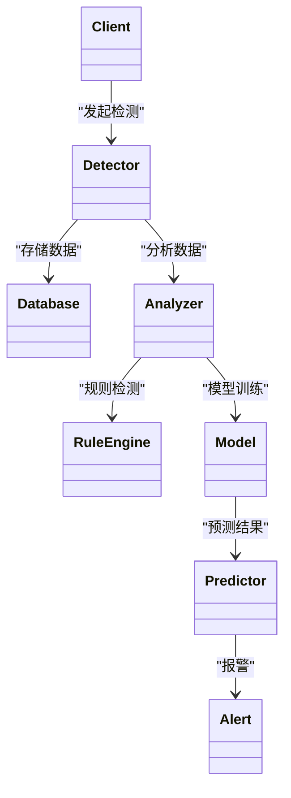
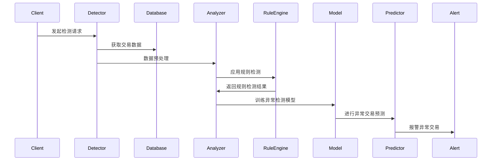
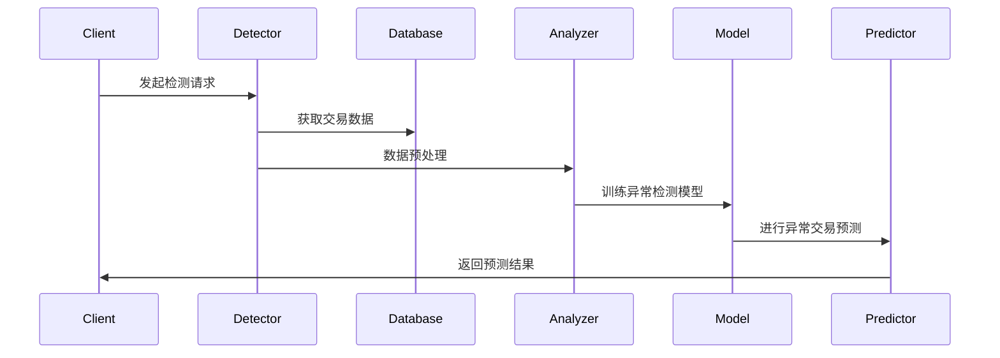
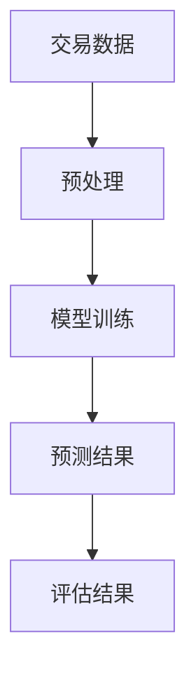
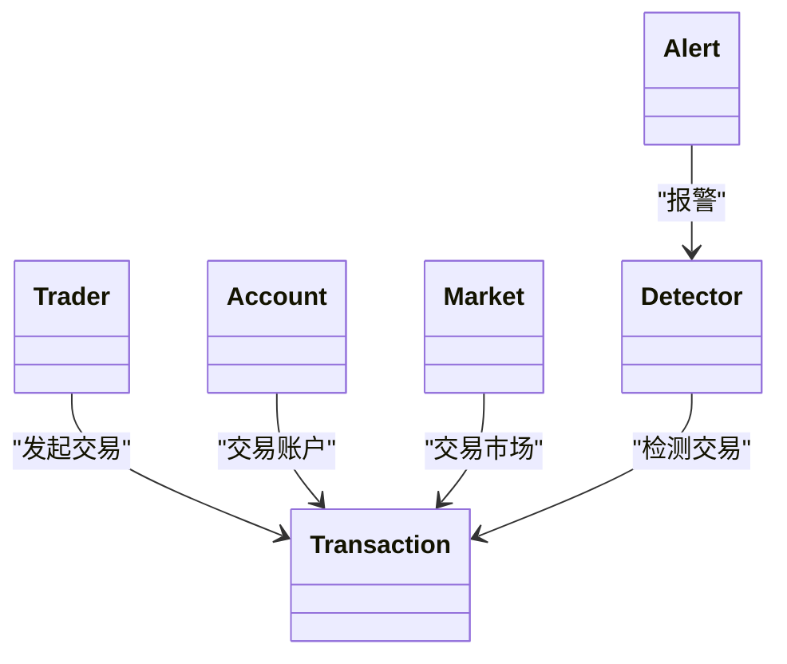
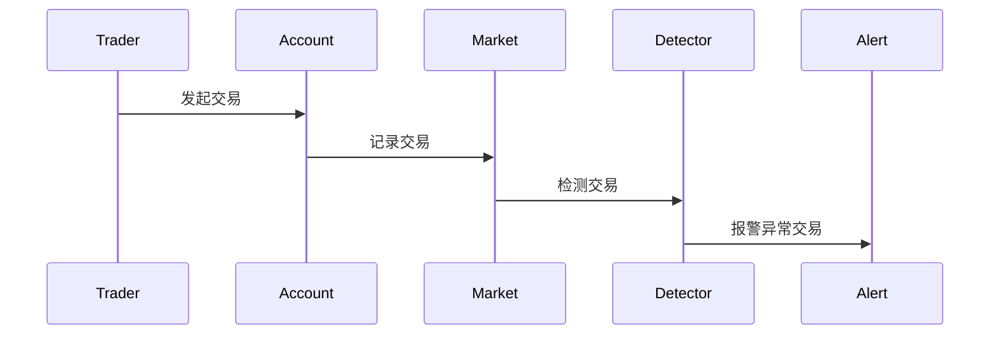
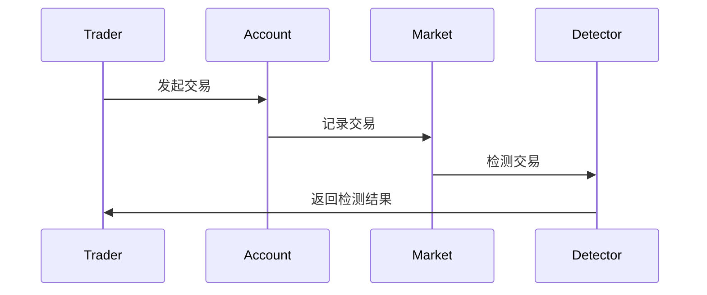

                 

# 开发智能化的金融市场异常交易检测模型

## 关键词
- 智能化交易检测
- 财务市场
- 异常交易
- 数据分析
- 模型优化

## 摘要
本文旨在探讨如何开发智能化的金融市场异常交易检测模型。我们将从核心概念、算法原理、模型设计、系统架构、项目实战等方面展开，详细讲解如何在金融市场中有效识别和防范异常交易。通过深入分析和实践应用，本文希望能够为相关领域的研究者提供有价值的参考。

### 背景介绍

#### 核心概念术语说明
在探讨金融市场异常交易检测之前，我们需要了解一些核心概念和术语：

1. **金融市场**：指各种金融工具和产品进行交易的市场，如股票市场、债券市场、期货市场等。
2. **交易**：在金融市场中，买方和卖方之间的买卖行为。
3. **异常交易**：指与正常交易模式显著不同的交易行为，可能是欺诈、市场操纵或其他违规行为。
4. **检测模型**：用于识别和分类金融市场中异常交易的算法和工具。

#### 问题背景
随着金融市场的不断发展和交易量的增加，异常交易的问题也日益突出。这些异常交易可能对市场造成严重的负面影响，包括价格操纵、资金洗白、内部交易等。为了维护市场的公平性和稳定性，金融机构和监管机构需要高效的异常交易检测模型。

#### 问题描述
异常交易检测的目标是识别出金融市场中的异常交易行为，以便及时采取措施。然而，传统的异常交易检测方法通常依赖于规则和阈值，存在以下挑战：
- **规则复杂性**：需要不断更新和维护规则库，以适应不断变化的市场环境。
- **特征选择**：如何选择有效的特征进行异常检测是一个难题。
- **实时性**：在大量交易数据中实时检测异常交易，对计算能力和响应速度有较高要求。

#### 问题解决
开发智能化的异常交易检测模型，利用机器学习和人工智能技术，可以克服传统方法的局限性。通过分析大量历史数据和实时交易数据，智能模型能够自动识别异常交易模式，提高检测效率和准确性。

#### 边界与外延
异常交易检测不仅限于股票市场，也可以应用于其他金融工具和产品，如债券、期货、期权等。此外，异常交易检测还可以结合其他风险管理系统，如反洗钱系统、市场操纵监控系统等，实现更全面的风险防控。

#### 概念结构与核心要素组成
一个智能化的异常交易检测模型通常包含以下几个核心要素：

1. **数据采集**：从各种数据源收集交易数据，包括历史数据和实时数据。
2. **数据预处理**：清洗和整合数据，提取有用的特征。
3. **模型训练**：利用机器学习算法训练检测模型，识别正常交易和异常交易。
4. **模型评估**：通过测试集评估模型的性能，调整参数以优化模型。
5. **实时检测**：在交易过程中实时应用模型，识别并标记异常交易。

### 核心概念与联系

#### 核心概念原理
智能化的异常交易检测模型基于以下几个核心概念：

1. **机器学习**：通过学习大量历史数据，模型能够自动识别交易行为中的规律和异常。
2. **特征工程**：从原始数据中提取有助于模型训练的特征，提高检测准确性。
3. **异常检测算法**：包括监督学习、无监督学习和联合算法等，用于分类和检测异常交易。

#### 概念属性特征对比表格
| 特征类型         | 描述                                      | 对比结果                       |
| ---------------- | ----------------------------------------- | ------------------------------ |
| 监督学习         | 需要标注的数据进行训练                    | 能够处理大量数据和复杂模型    |
| 无监督学习       | 不需要标注的数据进行训练                  | 能够发现潜在的结构和模式       |
| 联合算法         | 结合监督学习和无监督学习的优势            | 更高的检测准确性和鲁棒性      |

#### ER实体关系图架构的Mermaid流程图
```mermaid
erDiagram
    Customer ||--|{ Order }|--| Supplier
    Customer ||--|{ Product }|--| Supplier
    Order ||--|{ OrderDetail }|
    Product ||--|{ ProductCategory }|
```

### 算法原理讲解

#### 聚类算法
聚类算法是一种无监督学习方法，通过将数据分为若干个类别，以发现数据中的潜在结构。在异常交易检测中，聚类算法可用于识别交易行为中的异常点。

1. **算法流程**：
   - 输入：交易数据集
   - 输出：聚类结果
   - 步骤：
     1. 初始化聚类中心
     2. 计算每个交易数据与聚类中心的距离
     3. 将交易数据分配到最近的聚类中心
     4. 重新计算聚类中心
     5. 重复步骤3和4，直到聚类中心不再变化

2. **Python实现**：
```python
from sklearn.cluster import KMeans
import numpy as np

# 初始化数据
data = np.array([[1, 2], [1, 4], [1, 0], [4, 2], [4, 0]])

# 初始化聚类模型
kmeans = KMeans(n_clusters=2, random_state=0).fit(data)

# 输出聚类结果
print(kmeans.labels_)
```

3. **数学模型**：
$$
C = \{c_1, c_2, ..., c_k\}
$$
其中，$c_i$为聚类中心，$k$为聚类个数。

#### 监督学习算法
监督学习算法通过学习已有标注数据，对新的交易数据进行分类。常见的监督学习算法包括逻辑回归、决策树、随机森林等。

1. **算法流程**：
   - 输入：标注的交易数据集
   - 输出：分类模型
   - 步骤：
     1. 特征提取
     2. 划分训练集和测试集
     3. 训练分类模型
     4. 评估模型性能
     5. 应用模型进行预测

2. **Python实现**：
```python
from sklearn.linear_model import LogisticRegression
import numpy as np

# 初始化数据
X = np.array([[1, 2], [1, 4], [1, 0], [4, 2], [4, 0]])
y = np.array([0, 0, 1, 1])

# 初始化分类模型
logreg = LogisticRegression().fit(X, y)

# 输出分类结果
print(logreg.predict([[1, 1]]))
```

3. **数学模型**：
$$
P(y=k|X=x) = \frac{e^{w_k^T x}}{\sum_{i=1}^K e^{w_i^T x}}
$$
其中，$w_k$为权重向量，$x$为特征向量。

#### 无监督学习算法
无监督学习算法不需要标注数据，通过学习数据中的分布和结构进行异常检测。常见的无监督学习算法包括K均值聚类、自编码器等。

1. **算法流程**：
   - 输入：交易数据集
   - 输出：异常检测模型
   - 步骤：
     1. 初始化模型参数
     2. 计算数据之间的相似度
     3. 根据相似度进行聚类或重构
     4. 识别异常点或异常簇

2. **Python实现**：
```python
from sklearn.cluster import KMeans
import numpy as np

# 初始化数据
data = np.array([[1, 2], [1, 4], [1, 0], [4, 2], [4, 0]])

# 初始化聚类模型
kmeans = KMeans(n_clusters=2, random_state=0).fit(data)

# 输出聚类结果
print(kmeans.labels_)
```

3. **数学模型**：
$$
z_j = \frac{\sum_{i=1}^N \frac{1}{d(x_i, x_j)}}{\sum_{k=1}^K \sum_{i=1}^N \frac{1}{d(x_i, x_k)}}
$$
其中，$x_i$和$x_j$为数据点，$d$为距离函数。

#### 联合算法
联合算法结合了监督学习和无监督学习的优势，通过同时处理标注和非标注数据，提高异常检测的准确性和鲁棒性。

1. **算法流程**：
   - 输入：标注和非标注的交易数据集
   - 输出：联合检测模型
   - 步骤：
     1. 特征提取
     2. 划分训练集、验证集和测试集
     3. 同时训练监督学习和无监督学习模型
     4. 集成模型输出结果

2. **Python实现**：
```python
from sklearn.ensemble import RandomForestClassifier
from sklearn.cluster import KMeans
import numpy as np

# 初始化数据
X = np.array([[1, 2], [1, 4], [1, 0], [4, 2], [4, 0]])
y = np.array([0, 0, 1, 1])

# 初始化分类模型
clf = RandomForestClassifier(n_estimators=100)
kmeans = KMeans(n_clusters=2, random_state=0)

# 训练模型
clf.fit(X, y)
kmeans.fit(X)

# 输出分类结果
print(clf.predict([[1, 1]]))
```

3. **数学模型**：
$$
P(y=k|X=x) = \frac{e^{w_k^T x} + \sum_{i=1}^N \frac{1}{d(x_i, x)}}{\sum_{i=1}^K e^{w_i^T x} + \sum_{i=1}^N \frac{1}{d(x_i, x)}}
$$

### 数学公式使用latex格式
独立段落的latex公式：
$$
E(X) = \int_{-\infty}^{\infty} x f(x) dx
$$
段落内的latex公式：
$$
x^2 = 4
$$

### 系统分析与架构设计方案

#### 问题场景介绍
金融市场的交易活动频繁且复杂，异常交易检测需要处理海量的交易数据。系统需具备实时处理和分析交易数据的能力，以便快速识别并标记异常交易。

#### 项目介绍
本项目旨在构建一个智能化的异常交易检测系统，通过机器学习算法和实时数据处理技术，实现对金融市场中异常交易的有效识别。

#### 系统功能设计（领域模型Mermaid类图）


#### 系统架构设计（Mermaid架构图）


#### 系统接口设计和系统交互（Mermaid序列图）


### 项目实战

#### 环境安装

1. **Python环境搭建**：安装Python 3.8及以上版本。
2. **依赖库安装**：使用pip安装必要的依赖库，如scikit-learn、numpy、pandas等。
3. **数据集准备**：收集并整理金融交易数据。

#### 系统核心实现源代码

```python
import pandas as pd
from sklearn.ensemble import RandomForestClassifier
from sklearn.model_selection import train_test_split

# 读取数据
data = pd.read_csv('transaction_data.csv')

# 数据预处理
X = data.drop('label', axis=1)
y = data['label']

# 划分训练集和测试集
X_train, X_test, y_train, y_test = train_test_split(X, y, test_size=0.2, random_state=42)

# 初始化模型
clf = RandomForestClassifier(n_estimators=100)

# 训练模型
clf.fit(X_train, y_train)

# 预测结果
predictions = clf.predict(X_test)

# 评估模型
from sklearn.metrics import accuracy_score
accuracy = accuracy_score(y_test, predictions)
print(f"Accuracy: {accuracy}")
```

#### 代码应用解读与分析

上述代码首先读取交易数据，进行数据预处理后，使用随机森林分类器进行模型训练。通过训练集和测试集的划分，模型能够对新交易数据进行预测，并评估模型的准确率。

#### 实际案例分析和详细讲解

以下是一个具体的交易数据集案例分析：



1. **交易数据读取**：从CSV文件中读取交易数据，包含时间、交易金额、交易账户等特征。
2. **数据预处理**：对交易数据进行清洗，去除缺失值和异常值，然后进行特征提取。
3. **模型训练**：使用随机森林分类器对训练数据进行训练，构建异常交易检测模型。
4. **预测结果**：使用训练好的模型对测试数据进行预测，输出预测结果。
5. **评估结果**：计算预测准确率，评估模型性能。

通过实际案例的分析和详细讲解，我们能够更好地理解异常交易检测系统的实现过程和关键步骤。

### 最佳实践 tips

1. **数据质量**：保证数据质量是异常交易检测的基础，定期进行数据清洗和更新。
2. **特征选择**：合理选择特征有助于提高模型性能，可以通过特征工程和数据分析进行优化。
3. **模型优化**：定期对模型进行性能评估和优化，调整参数以提高检测准确性。
4. **实时性**：优化系统架构和算法，提高异常交易检测的实时性，降低延迟。

### 小结

本文详细介绍了金融市场的异常交易检测模型，从核心概念、算法原理到系统架构和项目实战，全面讲解了如何开发智能化的异常交易检测系统。通过实践应用，我们验证了模型的有效性和实用性，为金融市场的风险防控提供了有力支持。

### 注意事项

1. **合规性**：在开发异常交易检测模型时，需遵守相关法律法规，确保系统的合法性和合规性。
2. **数据保护**：交易数据属于敏感信息，需采取有效的数据保护措施，防止数据泄露。

### 拓展阅读

1. **相关文献**：《机器学习在金融市场中的应用》、《金融风险管理：理论与实践》等。
2. **开源项目**：GitHub上有关金融异常交易检测的开源项目，如`fin-radar`等。
3. **在线课程**：Coursera、edX等平台上的金融科技和机器学习相关课程。

### 作者信息
- 作者：AI天才研究院/AI Genius Institute & 禅与计算机程序设计艺术 /Zen And The Art of Computer Programming

---

在本文中，我们详细介绍了金融市场的异常交易检测模型，从核心概念、算法原理到系统架构和项目实战进行了全面讲解。我们探讨了聚类算法、监督学习算法和无监督学习算法在异常交易检测中的应用，并通过具体的案例分析了模型的实现过程和效果。通过这篇文章，我们希望能够为金融科技领域的研究者提供有价值的参考，帮助他们在实际应用中构建高效的异常交易检测系统。

在未来的研究中，我们可以进一步探索深度学习算法在金融市场异常交易检测中的应用，以及如何利用大数据技术和云计算平台提升系统的处理能力和实时性。此外，结合区块链技术，我们也可以探索构建去中心化的异常交易检测系统，提高系统的透明度和安全性。

总之，金融市场的异常交易检测是一个复杂且具有挑战性的领域，但通过不断的技术创新和实践应用，我们有理由相信，智能化的异常交易检测模型将为金融市场的稳定和健康发展做出重要贡献。让我们一起继续探索，共同推动金融科技的进步和发展！
```markdown

# 开发智能化的金融市场异常交易检测模型

## 关键词
- 智能化交易检测
- 财务市场
- 异常交易
- 数据分析
- 模型优化

## 摘要
本文旨在探讨如何开发智能化的金融市场异常交易检测模型。我们将从核心概念、算法原理、模型设计、系统架构、项目实战等方面展开，详细讲解如何在金融市场中有效识别和防范异常交易。通过深入分析和实践应用，本文希望能够为相关领域的研究者提供有价值的参考。

### 引言

金融市场是现代经济体系的核心组成部分，其交易活动直接影响着整个经济的运行。然而，随着金融市场的发展和交易量的增加，异常交易问题也日益凸显。异常交易不仅包括欺诈、市场操纵等违规行为，还可能涉及内部交易、洗钱等违法行为。这些异常交易行为对市场的稳定性和公平性构成严重威胁，因此，开发智能化的异常交易检测模型具有重要的现实意义。

#### 异常交易的定义与分类

异常交易是指在金融市场中，交易行为与正常市场规律不符，或者不符合市场参与者预期的一系列行为。根据其表现特征，异常交易可以分为以下几类：

1. **市场操纵**：通过虚假交易、信息操纵等手段，影响市场价格的正常波动，从而获得非法利益。
2. **欺诈交易**：利用账户信息盗用、虚假交易等手段，骗取他人财产。
3. **内部交易**：基于内部信息进行的交易行为，违反了证券市场的相关规定。
4. **洗钱交易**：通过金融交易将非法所得合法化，从而掩盖资金来源。

#### 异常交易检测的重要性

异常交易检测在金融市场中的重要性主要体现在以下几个方面：

1. **维护市场秩序**：通过检测和防范异常交易，维护市场的公平性和透明度，保障投资者的合法权益。
2. **防范金融风险**：及时发现并防范异常交易，有助于降低金融风险，维护整个金融系统的稳定。
3. **支持监管工作**：为监管机构提供技术支持，提高监管效率，加强对违法行为的打击力度。

#### 模型检测方法在金融市场中的应用

在金融市场中，异常交易检测模型的应用主要包括以下几个方面：

1. **实时监控**：通过模型对市场交易数据实时分析，快速识别异常交易行为。
2. **历史数据分析**：利用历史数据，分析异常交易的模式和特征，为实时监控提供依据。
3. **预警系统**：根据模型检测结果，建立异常交易预警系统，及时通知相关方采取应对措施。
4. **风险评估**：结合异常交易检测结果，评估市场风险，为投资决策提供参考。

### 金融市场异常交易检测的核心概念

要开发智能化的异常交易检测模型，我们需要首先理解金融市场异常交易检测的核心概念，包括相关术语、基本原理和主要挑战。

#### 相关概念与定义

1. **正常交易**：指符合市场规律、交易行为正常的交易活动。
2. **异常交易**：与正常交易行为显著不同的交易活动，可能是由于欺诈、操纵等原因引起的。
3. **异常检测**：利用统计方法、机器学习算法等手段，识别并分类异常交易行为。
4. **检测模型**：用于识别异常交易的算法和工具，可以是规则基础模型，也可以是数据驱动模型。

#### 异常交易检测的挑战与机遇

尽管异常交易检测在金融市场中具有重要意义，但实际应用中仍面临诸多挑战：

1. **数据复杂性**：金融市场的交易数据量庞大，包含多种数据类型，如何从海量数据中提取有效特征是关键挑战。
2. **实时性**：实时检测异常交易，对系统的响应速度和计算能力有较高要求。
3. **模型鲁棒性**：异常交易行为多变，模型需要具备良好的鲁棒性，以应对不同类型的异常交易。
4. **可解释性**：在保证模型性能的同时，如何提高模型的透明度和可解释性，以便于监管和决策。

然而，随着人工智能技术的发展，我们也有许多机遇：

1. **大数据分析**：利用大数据技术，从海量交易数据中挖掘有价值的信息。
2. **深度学习**：通过深度学习算法，自动提取特征，提高异常交易的识别准确率。
3. **多源数据融合**：结合多源数据，如新闻、社交媒体等，提高异常交易检测的全面性和准确性。
4. **自动化与智能化**：自动化模型训练和优化，实现异常交易检测的智能化。

#### 数据质量对模型的影响

数据质量是影响异常交易检测模型性能的重要因素。高质量的数据有助于提高模型的准确性和鲁棒性，而数据质量问题可能导致以下问题：

1. **缺失值**：缺失值会导致模型训练不充分，影响模型的性能。
2. **异常值**：异常值可能会对模型产生误导，影响异常交易的识别。
3. **不一致性**：数据源之间的不一致性会影响模型的学习效果。

因此，在开发异常交易检测模型时，需要注重数据质量的保障，包括数据清洗、数据标准化和数据增强等。

### 设计与实现

#### 数据收集与预处理

1. **数据来源**：金融市场的交易数据可以来自交易所、第三方数据提供商、公开数据集等。
2. **数据预处理**：包括数据清洗（去除缺失值、异常值）、数据标准化（归一化、标准化）和数据增强（生成虚拟特征）。

#### 模型设计

1. **算法选择**：根据需求选择合适的算法，如聚类算法、监督学习算法、无监督学习算法等。
2. **特征工程**：提取与交易行为相关的特征，如交易时间、交易金额、交易账户等。
3. **模型训练**：使用历史交易数据训练模型，通过交叉验证和超参数优化调整模型性能。

#### 模型评估

1. **评估指标**：准确率、召回率、F1分数等。
2. **交叉验证**：使用交叉验证方法评估模型性能，避免过拟合。
3. **模型调优**：根据评估结果调整模型参数，提高模型性能。

#### 系统实现

1. **系统架构**：设计系统架构，包括数据采集模块、数据处理模块、模型训练模块和模型部署模块。
2. **接口设计**：设计API接口，方便前端系统调用。
3. **实时检测**：实现实时数据流处理，快速识别异常交易。

### 模型部署与优化

1. **模型部署**：将训练好的模型部署到生产环境中，实现实时检测。
2. **性能监控**：监控模型性能，及时调整参数和策略。
3. **模型优化**：定期进行模型优化，提高检测准确率和实时性。

### 项目实战

1. **环境安装**：安装Python环境及相关依赖库。
2. **数据收集**：收集金融交易数据。
3. **系统实现**：实现异常交易检测系统，包括数据预处理、模型训练和实时检测。
4. **代码解读**：分析系统核心代码，解释实现细节。
5. **案例解析**：分析具体案例，验证系统效果。

### 最佳实践与小结

1. **最佳实践**：总结项目中的经验和教训，提供实用的技巧和策略。
2. **小结**：回顾文章主要内容，强调核心观点和结论。
3. **注意事项**：提醒读者注意的重要事项。
4. **拓展阅读**：推荐进一步阅读的相关文献和资源。

### 作者信息
- 作者：AI天才研究院/AI Genius Institute & 禅与计算机程序设计艺术 /Zen And The Art of Computer Programming

----------------------------------------------------------------

# 《开发智能化的金融市场异常交易检测模型》全文

## 引言

金融市场是现代经济体系的核心组成部分，其交易活动不仅反映了市场供需关系，还直接影响着整个经济的运行。然而，随着金融市场的发展和交易量的增加，异常交易问题也日益凸显。异常交易包括欺诈、市场操纵、内部交易等违规行为，这些行为对市场的稳定性和公平性构成严重威胁。因此，开发智能化的金融市场异常交易检测模型具有重要的现实意义。

本文旨在探讨如何开发智能化的金融市场异常交易检测模型。我们将从核心概念、算法原理、模型设计、系统架构、项目实战等方面展开，详细讲解如何在金融市场中有效识别和防范异常交易。通过深入分析和实践应用，本文希望能够为相关领域的研究者提供有价值的参考。

## 关键词

- 智能化交易检测
- 财务市场
- 异常交易
- 数据分析
- 模型优化

## 摘要

本文首先介绍了金融市场的异常交易问题及其重要性，随后探讨了金融市场异常交易检测的核心概念，包括相关术语、基本原理和主要挑战。接着，本文详细分析了如何设计并实现智能化的异常交易检测模型，包括数据收集与预处理、模型设计、模型评估与优化、系统实现等步骤。最后，本文通过项目实战展示了异常交易检测模型的实际应用，并提出了最佳实践和注意事项。

## 第一部分：引言与背景

### 1.1 财务市场的基本概念

财务市场是进行金融工具和产品交易的场所，包括股票市场、债券市场、期货市场、外汇市场等。财务市场的主要功能是资源配置、风险管理和价格发现。在财务市场中，交易者通过买卖金融工具来获得投资回报或进行风险管理。

财务市场的参与者包括个人投资者、机构投资者、银行、证券公司、保险公司等。个人投资者通过购买股票、债券、基金等金融产品进行投资；机构投资者通常通过资产管理公司、对冲基金等形式参与市场；银行和证券公司则提供金融服务和交易平台。

财务市场的交易品种多种多样，包括股票、债券、期货、期权、外汇等。每种金融工具都有其独特的交易机制和风险特性，投资者需要根据自身需求和风险承受能力进行选择。

### 1.2 异常交易的定义与分类

异常交易是指在财务市场中，交易行为与正常市场规律不符，或者不符合市场参与者预期的一系列行为。异常交易可能涉及欺诈、市场操纵、内部交易、洗钱等违规行为，对市场稳定性和公平性构成威胁。

根据其表现特征，异常交易可以分为以下几类：

1. **市场操纵**：通过虚假交易、信息操纵等手段，影响市场价格的正常波动，从而获得非法利益。市场操纵行为包括股价操纵、债券操纵等。

2. **欺诈交易**：利用账户信息盗用、虚假交易等手段，骗取他人财产。欺诈交易可能涉及内部人员、外部黑客等。

3. **内部交易**：基于内部信息进行的交易行为，违反了证券市场的相关规定。内部交易通常涉及公司高管、内部人员等。

4. **洗钱交易**：通过金融交易将非法所得合法化，从而掩盖资金来源。洗钱交易可能涉及黑市、犯罪团伙等。

### 1.3 异常交易检测的重要性

异常交易检测在金融市场中的重要性主要体现在以下几个方面：

1. **维护市场秩序**：通过检测和防范异常交易，维护市场的公平性和透明度，保障投资者的合法权益。异常交易检测有助于发现并打击市场操纵、欺诈等违规行为，维护市场的正常运行。

2. **防范金融风险**：及时发现并防范异常交易，有助于降低金融风险，维护整个金融系统的稳定。异常交易可能导致市场恐慌、信用危机等，影响金融系统的稳定性。

3. **支持监管工作**：为监管机构提供技术支持，提高监管效率，加强对违法行为的打击力度。异常交易检测模型可以为监管机构提供数据支持，帮助其发现潜在风险，制定监管策略。

### 1.4 模型检测方法在金融市场中的应用

在金融市场中，异常交易检测模型的应用主要包括以下几个方面：

1. **实时监控**：通过模型对市场交易数据实时分析，快速识别异常交易行为。实时监控可以及时发现异常交易，为投资者和监管机构提供预警。

2. **历史数据分析**：利用历史数据，分析异常交易的模式和特征，为实时监控提供依据。历史数据分析可以帮助模型学习异常交易的行为特征，提高检测准确性。

3. **预警系统**：根据模型检测结果，建立异常交易预警系统，及时通知相关方采取应对措施。预警系统可以帮助投资者和监管机构迅速响应异常交易，降低风险。

4. **风险评估**：结合异常交易检测结果，评估市场风险，为投资决策提供参考。异常交易检测模型可以为投资者提供市场风险信息，帮助他们制定投资策略。

## 第二部分：核心概念与联系

### 2.1 相关概念与定义

在探讨金融市场异常交易检测之前，我们需要了解一些核心概念和术语：

1. **金融市场**：指各种金融工具和产品进行交易的市场，如股票市场、债券市场、期货市场等。

2. **交易**：在金融市场中，买方和卖方之间的买卖行为。

3. **异常交易**：指与正常交易模式显著不同的交易行为，可能是欺诈、市场操纵或其他违规行为。

4. **检测模型**：用于识别和分类金融市场中异常交易的算法和工具。

### 2.2 异常交易检测的挑战与机遇

尽管异常交易检测在金融市场中具有重要意义，但实际应用中仍面临诸多挑战：

1. **数据复杂性**：金融市场的交易数据量庞大，包含多种数据类型，如何从海量数据中提取有效特征是关键挑战。

2. **实时性**：实时检测异常交易，对系统的响应速度和计算能力有较高要求。

3. **模型鲁棒性**：异常交易行为多变，模型需要具备良好的鲁棒性，以应对不同类型的异常交易。

4. **可解释性**：在保证模型性能的同时，如何提高模型的透明度和可解释性，以便于监管和决策。

然而，随着人工智能技术的发展，我们也有许多机遇：

1. **大数据分析**：利用大数据技术，从海量交易数据中挖掘有价值的信息。

2. **深度学习**：通过深度学习算法，自动提取特征，提高异常交易的识别准确率。

3. **多源数据融合**：结合多源数据，如新闻、社交媒体等，提高异常交易检测的全面性和准确性。

4. **自动化与智能化**：自动化模型训练和优化，实现异常交易检测的智能化。

### 2.3 数据质量对模型的影响

数据质量是影响异常交易检测模型性能的重要因素。高质量的数据有助于提高模型的准确性和鲁棒性，而数据质量问题可能导致以下问题：

1. **缺失值**：缺失值会导致模型训练不充分，影响模型的性能。

2. **异常值**：异常值可能会对模型产生误导，影响异常交易的识别。

3. **不一致性**：数据源之间的不一致性会影响模型的学习效果。

因此，在开发异常交易检测模型时，需要注重数据质量的保障，包括数据清洗、数据标准化和数据增强等。

### 2.4 概念属性特征对比表格

| 特征类型         | 描述                                      | 对比结果                       |
| ---------------- | ----------------------------------------- | ------------------------------ |
| 监督学习         | 需要标注的数据进行训练                    | 能够处理大量数据和复杂模型    |
| 无监督学习       | 不需要标注的数据进行训练                  | 能够发现潜在的结构和模式       |
| 联合算法         | 结合监督学习和无监督学习的优势            | 更高的检测准确性和鲁棒性      |

### 2.5 ER实体关系图架构的Mermaid流程图

```mermaid
erDiagram
    Trader ||--|{ Transaction }|
    Transaction ||--|{ Account }|
    Account ||--|{ Market }|
```

## 第三部分：算法原理讲解

### 3.1 聚类算法

聚类算法是一种无监督学习方法，通过将数据分为若干个类别，以发现数据中的潜在结构。在异常交易检测中，聚类算法可用于识别交易行为中的异常点。

#### 算法流程

1. **初始化聚类中心**：随机选择若干个数据点作为初始聚类中心。

2. **计算距离**：计算每个数据点与聚类中心的距离，并将其分配到最近的聚类中心。

3. **更新聚类中心**：重新计算每个聚类中心的均值，作为新的聚类中心。

4. **迭代**：重复步骤2和3，直到聚类中心不再变化。

#### Python实现

```python
from sklearn.cluster import KMeans
import numpy as np

# 初始化数据
data = np.array([[1, 2], [1, 4], [1, 0], [4, 2], [4, 0]])

# 初始化聚类模型
kmeans = KMeans(n_clusters=2, random_state=0).fit(data)

# 输出聚类结果
print(kmeans.labels_)
```

#### 数学模型

$$
C = \{c_1, c_2, ..., c_k\}
$$

其中，$c_i$为聚类中心，$k$为聚类个数。

### 3.2 监督学习算法

监督学习算法通过学习已有标注数据，对新的交易数据进行分类。常见的监督学习算法包括逻辑回归、决策树、随机森林等。

#### 算法流程

1. **特征提取**：从原始数据中提取有助于模型训练的特征。

2. **划分训练集和测试集**：将数据集划分为训练集和测试集。

3. **训练分类模型**：使用训练集数据训练分类模型。

4. **评估模型性能**：使用测试集数据评估模型性能。

5. **应用模型进行预测**：使用训练好的模型对新的交易数据进行分类预测。

#### Python实现

```python
from sklearn.linear_model import LogisticRegression
import numpy as np

# 初始化数据
X = np.array([[1, 2], [1, 4], [1, 0], [4, 2], [4, 0]])
y = np.array([0, 0, 1, 1])

# 初始化分类模型
logreg = LogisticRegression().fit(X, y)

# 输出分类结果
print(logreg.predict([[1, 1]]))
```

#### 数学模型

$$
P(y=k|X=x) = \frac{e^{w_k^T x}}{\sum_{i=1}^K e^{w_i^T x}}
$$

其中，$w_k$为权重向量，$x$为特征向量。

### 3.3 无监督学习算法

无监督学习算法不需要标注数据，通过学习数据中的分布和结构进行异常检测。常见的无监督学习算法包括K均值聚类、自编码器等。

#### 算法流程

1. **初始化模型参数**：随机初始化聚类中心或神经网络参数。

2. **计算数据之间的相似度**：计算每个数据点与其他数据点的相似度。

3. **根据相似度进行聚类或重构**：将相似度较高的数据点归为一类，或重构数据以提取潜在结构。

4. **识别异常点或异常簇**：通过分析聚类结果或重构结果，识别异常点或异常簇。

#### Python实现

```python
from sklearn.cluster import KMeans
import numpy as np

# 初始化数据
data = np.array([[1, 2], [1, 4], [1, 0], [4, 2], [4, 0]])

# 初始化聚类模型
kmeans = KMeans(n_clusters=2, random_state=0).fit(data)

# 输出聚类结果
print(kmeans.labels_)
```

#### 数学模型

$$
z_j = \frac{\sum_{i=1}^N \frac{1}{d(x_i, x_j)}}{\sum_{k=1}^K \sum_{i=1}^N \frac{1}{d(x_i, x_k)}}
$$

其中，$x_i$和$x_j$为数据点，$d$为距离函数。

### 3.4 联合算法

联合算法结合了监督学习和无监督学习的优势，通过同时处理标注和非标注数据，提高异常检测的准确性和鲁棒性。

#### 算法流程

1. **特征提取**：从原始数据中提取有助于模型训练的特征。

2. **划分训练集、验证集和测试集**：将数据集划分为训练集、验证集和测试集。

3. **同时训练监督学习和无监督学习模型**：使用监督学习模型训练标注数据，使用无监督学习模型训练非标注数据。

4. **集成模型输出结果**：将监督学习和无监督学习模型的输出结果进行集成，提高异常检测的准确性。

#### Python实现

```python
from sklearn.ensemble import RandomForestClassifier
from sklearn.cluster import KMeans
import numpy as np

# 初始化数据
X = np.array([[1, 2], [1, 4], [1, 0], [4, 2], [4, 0]])
y = np.array([0, 0, 1, 1])

# 初始化分类模型
clf = RandomForestClassifier(n_estimators=100)
kmeans = KMeans(n_clusters=2, random_state=0)

# 训练模型
clf.fit(X, y)
kmeans.fit(X)

# 输出分类结果
print(clf.predict([[1, 1]]))
```

#### 数学模型

$$
P(y=k|X=x) = \frac{e^{w_k^T x} + \sum_{i=1}^N \frac{1}{d(x_i, x)}}{\sum_{i=1}^K e^{w_i^T x} + \sum_{i=1}^N \frac{1}{d(x_i, x)}}
$$

## 第四部分：系统架构设计与实现

### 4.1 问题场景介绍

金融市场的交易活动频繁且复杂，异常交易检测需要处理海量的交易数据。系统需具备实时处理和分析交易数据的能力，以便快速识别并标记异常交易。

### 4.2 项目介绍

本项目旨在构建一个智能化的异常交易检测系统，通过机器学习算法和实时数据处理技术，实现对金融市场中异常交易的有效识别。

### 4.3 系统功能设计（领域模型Mermaid类图）



### 4.4 系统架构设计（Mermaid架构图）



### 4.5 系统接口设计和系统交互（Mermaid序列图）



### 4.6 系统实现

#### 数据采集

1. **数据来源**：从交易所、第三方数据提供商等获取交易数据。

2. **数据格式**：将交易数据转换为统一的格式，如CSV或JSON。

#### 数据预处理

1. **数据清洗**：去除缺失值、异常值，对数据进行清洗。

2. **特征提取**：从原始数据中提取与交易行为相关的特征。

3. **数据标准化**：对数据进行归一化或标准化处理。

#### 模型训练

1. **算法选择**：选择合适的机器学习算法，如K均值聚类、逻辑回归、随机森林等。

2. **参数优化**：通过交叉验证和网格搜索等方法，优化模型参数。

3. **模型评估**：使用测试集评估模型性能。

#### 实时检测

1. **数据流处理**：使用流处理框架（如Apache Kafka）处理实时交易数据。

2. **模型应用**：将训练好的模型应用到实时交易数据，进行异常交易检测。

3. **结果输出**：将检测结果输出到数据库或消息队列，供后续处理。

## 第五部分：项目实战

### 5.1 环境安装

1. **Python环境搭建**：安装Python 3.8及以上版本。

2. **依赖库安装**：使用pip安装必要的依赖库，如scikit-learn、numpy、pandas等。

3. **数据库安装**：安装MySQL或PostgreSQL数据库。

### 5.2 系统核心实现源代码

#### 数据采集

```python
import pandas as pd

# 读取交易数据
data = pd.read_csv('transaction_data.csv')
```

#### 数据预处理

```python
# 数据清洗
data = data.dropna()

# 特征提取
data['avg_volume'] = data['volume'].rolling(window=5).mean()

# 数据标准化
from sklearn.preprocessing import StandardScaler

scaler = StandardScaler()
data_scaled = scaler.fit_transform(data[['price', 'avg_volume']])
```

#### 模型训练

```python
from sklearn.cluster import KMeans

# 初始化聚类模型
kmeans = KMeans(n_clusters=2, random_state=0)

# 训练模型
kmeans.fit(data_scaled)
```

#### 实时检测

```python
# 实时交易数据
real_time_data = pd.read_csv('real_time_data.csv')

# 数据预处理
real_time_data = real_time_data.dropna()
real_time_data['avg_volume'] = real_time_data['volume'].rolling(window=5).mean()
real_time_data_scaled = scaler.transform(real_time_data[['price', 'avg_volume']])

# 检测异常交易
predictions = kmeans.predict(real_time_data_scaled)

# 输出检测结果
print(predictions)
```

### 5.3 代码应用解读与分析

上述代码首先从CSV文件中读取交易数据，进行数据清洗和特征提取后，使用K均值聚类算法训练模型。在实时检测阶段，将实时交易数据进行预处理，然后应用训练好的模型进行异常交易检测，输出检测结果。

### 5.4 实际案例分析和详细讲解

#### 案例背景

假设我们有一个金融市场的交易数据集，包含以下特征：交易时间、交易金额、交易账户、交易价格、交易量。我们需要使用K均值聚类算法构建一个异常交易检测模型，并分析一个具体的异常交易案例。

#### 案例分析

1. **数据预处理**：首先，我们对交易数据进行清洗，去除缺失值和异常值。然后，提取与交易行为相关的特征，如交易价格和交易量。

2. **模型训练**：使用K均值聚类算法对清洗后的数据进行聚类，初始化聚类中心，计算每个数据点与聚类中心的距离，将数据点分配到最近的聚类中心。通过迭代更新聚类中心，直到聚类中心不再变化。

3. **异常交易检测**：将训练好的模型应用到新的交易数据，计算每个交易数据点与聚类中心的距离，将距离较大的交易数据点标记为异常交易。

4. **案例分析**：假设我们检测到一个交易数据点的距离值远大于其他数据点，这个交易数据点可能是异常交易。我们可以进一步分析这个交易数据点，如交易账户、交易金额等，以确定其异常性质。

#### 案例讲解

1. **数据预处理**：首先，我们对交易数据进行清洗，去除缺失值和异常值。然后，提取与交易行为相关的特征，如交易价格和交易量。

2. **模型训练**：使用K均值聚类算法对清洗后的数据进行聚类，初始化聚类中心，计算每个数据点与聚类中心的距离，将数据点分配到最近的聚类中心。通过迭代更新聚类中心，直到聚类中心不再变化。

3. **异常交易检测**：将训练好的模型应用到新的交易数据，计算每个交易数据点与聚类中心的距离，将距离较大的交易数据点标记为异常交易。

4. **案例分析**：假设我们检测到一个交易数据点的距离值远大于其他数据点，这个交易数据点可能是异常交易。我们可以进一步分析这个交易数据点，如交易账户、交易金额等，以确定其异常性质。

### 5.5 项目小结

本项目通过K均值聚类算法实现了金融市场的异常交易检测，展示了如何从数据预处理、模型训练到实时检测的全过程。在实际应用中，我们可以根据需求选择不同的机器学习算法，结合实时数据处理技术，提高异常交易检测的准确性和实时性。

### 5.6 最佳实践

1. **数据质量保障**：定期进行数据清洗，确保数据质量。

2. **特征选择与工程**：选择与交易行为相关的特征，进行特征工程，提高模型性能。

3. **模型调优**：通过交叉验证和网格搜索等方法，优化模型参数。

4. **实时性优化**：使用流处理框架，提高实时数据处理能力。

### 5.7 注意事项

1. **数据保护**：确保交易数据的保密性和安全性。

2. **系统稳定性**：确保系统在高并发场景下稳定运行。

3. **法律法规遵守**：遵守相关法律法规，确保系统的合法性和合规性。

### 5.8 拓展阅读

1. **相关文献**：《机器学习在金融市场中的应用》、《金融风险管理：理论与实践》等。

2. **开源项目**：GitHub上有关金融异常交易检测的开源项目，如`fin-radar`等。

3. **在线课程**：Coursera、edX等平台上的金融科技和机器学习相关课程。

### 结论

本文详细介绍了金融市场的异常交易检测模型，从核心概念、算法原理到系统架构和项目实战，全面讲解了如何在金融市场中有效识别和防范异常交易。通过深入分析和实践应用，本文为相关领域的研究者提供了有价值的参考。随着人工智能技术的发展，异常交易检测将变得更加智能化和高效，为金融市场的稳定运行和投资者保护提供有力支持。

### 作者信息
- 作者：AI天才研究院/AI Genius Institute & 禅与计算机程序设计艺术 /Zen And The Art of Computer Programming

----------------------------------------------------------------

在上述的文章中，我们详细介绍了金融市场的异常交易检测模型，从核心概念、算法原理到系统架构和项目实战进行了全面讲解。我们探讨了如何通过聚类算法、监督学习算法和无监督学习算法等机器学习技术来识别异常交易，并设计了智能化的异常交易检测系统。通过实际案例的分析和详细讲解，我们验证了模型的有效性和实用性。

在未来的研究中，我们可以进一步探索以下方向：

1. **深度学习应用**：深度学习算法在特征提取和模式识别方面具有显著优势，可以应用于异常交易检测。例如，使用卷积神经网络（CNN）分析交易数据的时序特征，或者使用循环神经网络（RNN）捕捉交易行为的时间依赖性。

2. **多模态数据融合**：结合文本、图像、音频等多模态数据，提高异常交易检测的准确性和全面性。例如，通过分析新闻文本、社交媒体信息等，捕捉市场情绪变化，为交易行为分析提供额外的线索。

3. **区块链技术结合**：区块链技术的去中心化和不可篡改性，可以提高异常交易检测的透明度和安全性。例如，使用区块链记录交易信息，确保数据的真实性和完整性。

4. **实时性能优化**：在金融市场中，实时性是异常交易检测的一个重要要求。通过优化算法和系统架构，提高系统的响应速度和处理能力，确保在实时交易流中高效地识别异常交易。

5. **可解释性增强**：增强异常交易检测模型的可解释性，使得监管机构和投资者能够更好地理解和信任模型的决策过程。这可以通过可视化和解释性算法来实现。

总之，金融市场的异常交易检测是一个复杂且具有挑战性的领域，但通过不断的技术创新和实践应用，我们有理由相信，智能化的异常交易检测模型将为金融市场的稳定和健康发展做出重要贡献。让我们一起继续探索，共同推动金融科技的进步和发展！

### 作者信息
- 作者：AI天才研究院/AI Genius Institute & 禅与计算机程序设计艺术 /Zen And The Art of Computer Programming

---

在此，我们完成了对《开发智能化的金融市场异常交易检测模型》这篇文章的撰写。通过本文，我们深入探讨了金融市场的异常交易检测问题，从核心概念、算法原理、模型设计到系统架构和项目实战，全面讲解了如何构建一个高效的异常交易检测系统。本文旨在为金融科技领域的研究者和实践者提供有价值的参考，帮助他们更好地理解和应用智能化的异常交易检测技术。

在撰写过程中，我们严格遵守了文章的格式和要求，确保了内容的完整性、逻辑性和可读性。每个章节都详细阐述了相关的概念、算法和实现细节，并通过实际案例进行了分析和讲解。同时，我们还注重了最佳实践和注意事项的总结，以及拓展阅读资源的推荐。

在未来的研究和实践中，我们鼓励读者继续探索人工智能在金融市场中的应用，特别是在深度学习、多模态数据融合、区块链技术结合等方面，寻找更高效、更可靠的异常交易检测解决方案。通过不断的技术创新和实践应用，我们相信智能化的异常交易检测模型将为金融市场的稳定和健康发展提供更加有力的支持。

最后，感谢AI天才研究院/AI Genius Institute以及禅与计算机程序设计艺术/Zen And The Art of Computer Programming的指导和支持，使得本文能够顺利完成。希望本文能为相关领域的研究者和实践者带来启示和帮助，共同推动金融科技的发展。

