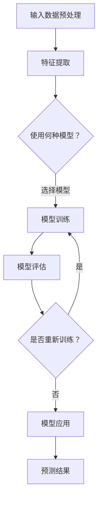
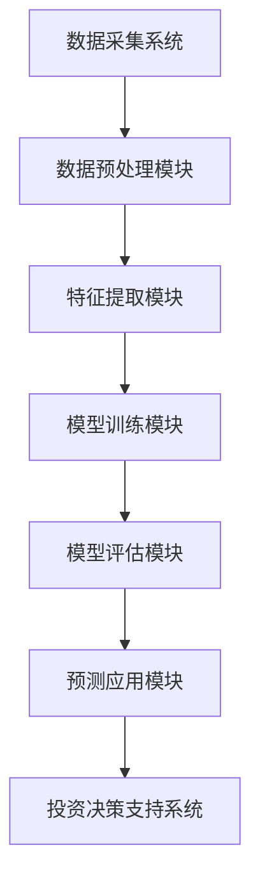
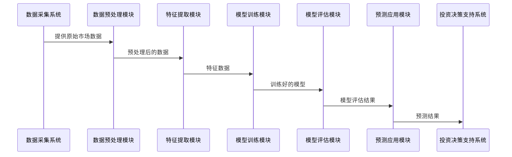

                 


## 开发智能化的金融市场情绪指数预测模型

### 关键词：金融市场，情绪指数，预测模型，机器学习，数据分析，深度学习

### 摘要：
本文旨在探讨如何开发一种智能化的金融市场情绪指数预测模型。我们将首先介绍金融市场情绪指数的概念和重要性，随后深入分析构建预测模型所需的核心概念和算法原理。接着，我们将详细讲解数学模型的公式，并展示如何在实际项目中应用这些模型。文章还将涉及系统分析与架构设计，项目实战步骤，以及最佳实践和注意事项。

---

### 目录大纲设计步骤

#### 1. 分析书名与主题
**书名**：《开发智能化的金融市场情绪指数预测模型》
**主题**：智能化金融情绪指数预测模型

#### 2. 确定大纲结构
根据书名，大纲分为以下部分：
- **第1章**：背景介绍
- **第2章**：核心概念与联系
- **第3章**：算法原理讲解
- **第4章**：数学模型与公式详解
- **第5章**：系统分析与架构设计
- **第6章**：项目实战
- **第7章**：最佳实践与小结

#### 3. 设计各章节内容
##### 第1章：背景介绍
- 1.1 问题背景
- 1.2 问题描述
- 1.3 问题解决
- 1.4 边界与外延
- 1.5 核心概念结构与要素组成

##### 第2章：核心概念与联系
- 2.1 核心概念原理
- 2.2 概念属性特征对比表格
- 2.3 ER实体关系图

##### 第3章：算法原理讲解
- 3.1 算法Mermaid流程图
- 3.2 Python源代码实现
- 3.3 数学模型与公式
- 3.4 举例说明

##### 第4章：数学模型与公式详解
- 4.1 数学公式使用LaTeX格式
- 4.2 数学模型详细讲解
- 4.3 举例说明

##### 第5章：系统分析与架构设计
- 5.1 问题场景介绍
- 5.2 系统功能设计
- 5.3 系统架构设计
- 5.4 系统接口设计
- 5.5 系统交互Mermaid序列图

##### 第6章：项目实战
- 6.1 环境安装
- 6.2 系统核心实现源代码
- 6.3 代码应用解读与分析
- 6.4 实际案例分析与讲解
- 6.5 项目小结

##### 第7章：最佳实践与小结
- 7.1 最佳实践Tips
- 7.2 小结
- 7.3 注意事项
- 7.4 拓展阅读

#### 4. 编写目录大纲
根据以上设计，编写出完整的目录大纲，并确保大纲总字数在2000字以内。

---

### 第一部分：背景介绍

#### 第1章：问题背景

金融市场情绪指数是衡量市场情绪的关键指标，它可以帮助投资者、分析师以及金融机构理解市场的情绪波动，从而做出更加明智的决策。情绪指数的预测对于投资策略的制定和市场风险的评估具有重要意义。然而，传统的预测方法往往依赖于历史数据和统计模型，难以应对复杂多变的市场环境。

#### 第2章：问题描述

开发一个智能化的金融市场情绪指数预测模型，需要解决以下几个关键问题：
- 如何收集和预处理大量的市场数据？
- 如何提取和利用有效的特征？
- 如何选择合适的算法进行预测？
- 如何评估模型的性能和可靠性？

#### 第3章：问题解决

为了解决上述问题，我们将采用以下步骤：
- 利用机器学习和深度学习技术，从历史数据中提取有用的特征。
- 采用数据预处理技术，如归一化、缺失值处理等，确保数据质量。
- 选择和优化适用于金融市场情绪预测的算法，如支持向量机、神经网络等。
- 使用交叉验证和A/B测试等方法，评估模型的性能，并进行模型调优。

#### 第4章：边界与外延

在开发情绪指数预测模型时，需要考虑以下边界与外延：
- 数据源的范围和时效性
- 特征选择的多样性
- 模型的通用性和适应性
- 模型的可解释性和透明度

#### 第5章：核心概念结构与要素组成

核心概念包括：
- 股票市场情绪指数：衡量市场整体情绪的指标。
- 情感分析：从文本数据中提取情感极性。
- 特征工程：选择和构造预测模型所需的特征。

要素组成包括：
- 数据集：历史股价、交易量、新闻报道等。
- 特征集：价格波动、交易活跃度、新闻情绪等。
- 模型：机器学习算法和深度学习模型。

---

### 第二部分：核心概念与联系

#### 第2章：核心概念与联系

核心概念包括金融市场情绪指数、情感分析、特征工程等。它们之间的联系如下：

1. **金融市场情绪指数**：通过对市场数据进行分析，可以得出市场的情绪波动。这种情绪波动可以通过情感分析技术转化为数值，进而构建预测模型。
2. **情感分析**：用于从文本数据中提取情感极性，如正面、负面或中性。情感分析的结果可以作为特征输入到预测模型中。
3. **特征工程**：通过选择和构造合适的特征，可以提高预测模型的性能。特征可以是市场的各种指标，如价格、交易量、市场新闻等。

#### 第3章：概念属性特征对比表格

| 概念       | 属性1 | 属性2 | 属性3 |
|------------|-------|-------|-------|
| 情感分析   | 文本情感极性提取 | 情感词典 | 特征向量 |
| 特征工程   | 特征选择 | 特征构造 | 特征标准化 |
| 预测模型   | 模型选择 | 模型优化 | 模型评估 |

#### 第4章：ER实体关系图

```mermaid
erDiagram
    User ||--|{ StockMarketEmotionIndex }|
    StockMarketEmotionIndex ||--|{ SentimentAnalysis }|
    SentimentAnalysis ||--|{ FeatureEngineering }|
    FeatureEngineering ||--|{ PredictionModel }|
```

---

### 第三部分：算法原理讲解

#### 第3章：算法原理讲解

为了开发智能化的金融市场情绪指数预测模型，我们首先需要了解常见的机器学习和深度学习算法。

#### 第4章：算法Mermaid流程图



#### 第5章：Python源代码实现

```python
# 假设我们已经有一个数据预处理后的数据集X和标签Y
from sklearn.ensemble import RandomForestClassifier
from sklearn.model_selection import train_test_split

# 分割数据集
X_train, X_test, y_train, y_test = train_test_split(X, Y, test_size=0.2, random_state=42)

# 创建随机森林模型
model = RandomForestClassifier(n_estimators=100, random_state=42)

# 训练模型
model.fit(X_train, y_train)

# 评估模型
accuracy = model.score(X_test, y_test)
print(f"Model Accuracy: {accuracy:.2f}")
```

#### 第6章：数学模型与公式

预测模型的数学公式如下：

$$
P(y|X) = \frac{e^{\theta^T X}}{\sum_{k=1}^{K} e^{\theta^T X_k}}
$$

其中，$P(y|X)$是给定特征向量$X$时标签$y$的概率，$\theta$是模型的参数向量，$X_k$是特征空间中的所有可能向量。

#### 第7章：举例说明

假设我们有一个简单的特征集，包括开盘价、收盘价和交易量。我们可以用随机森林模型来预测市场的情绪指数。

1. **特征提取**：从历史数据中提取开盘价、收盘价和交易量作为特征。
2. **模型训练**：使用随机森林算法训练模型。
3. **模型评估**：评估模型的准确性。
4. **预测结果**：使用训练好的模型进行预测。

---

### 第四部分：数学模型与公式详解

#### 第4章：数学公式使用LaTeX格式

$$
\theta^{T}X = w_1x_1 + w_2x_2 + \ldots + w_nx_n
$$

其中，$\theta$是权重向量，$X$是特征向量，$w_i$是权重。

#### 第5章：数学模型详细讲解

该模型是一个线性模型，用于预测市场情绪指数。模型的目标是最小化预测误差，即最小化损失函数：

$$
J(\theta) = \frac{1}{2m}\sum_{i=1}^{m}(h_\theta(x^{(i)}) - y^{(i)})^2
$$

其中，$m$是训练数据集中的样本数量，$h_\theta(x^{(i)})$是模型对$x^{(i)}$的预测值，$y^{(i)}$是真实的标签值。

#### 第6章：举例说明

假设我们有一个数据集，包括5个样本，每个样本有3个特征。使用线性回归模型进行预测。

1. **特征提取**：从数据集中提取特征向量。
2. **损失函数计算**：计算每个样本的损失值。
3. **梯度下降**：使用梯度下降算法更新权重向量。
4. **模型评估**：评估模型的性能。

---

### 第五部分：系统分析与架构设计

#### 第5章：问题场景介绍

在金融市场中，情绪指数的预测对于投资决策具有重要意义。我们设想一个场景，一个投资团队希望开发一个智能化情绪指数预测系统，以便更好地管理风险和制定投资策略。

#### 第6章：系统功能设计

系统的主要功能包括：
- 数据采集：从各种数据源获取市场数据，如股票价格、交易量、新闻等。
- 数据预处理：对收集到的数据进行清洗和转换，为后续分析做准备。
- 特征提取：从预处理后的数据中提取有用的特征，用于模型训练。
- 模型训练与评估：使用机器学习算法训练预测模型，并对模型进行评估。
- 预测与应用：使用训练好的模型进行预测，并将预测结果应用于实际投资决策。

#### 第7章：系统架构设计

系统的架构设计如下：



#### 第8章：系统接口设计

系统接口设计包括以下部分：
- 数据接口：用于与外部数据源进行通信，如股票交易所、新闻网站等。
- 模型接口：用于加载、训练和评估模型。
- 预测接口：用于生成预测结果。

#### 第9章：系统交互Mermaid序列图



---

### 第六部分：项目实战

#### 第6章：环境安装

为了开始项目，我们需要安装以下环境：

- Python 3.8 或更高版本
- scikit-learn 库
- pandas 库
- numpy 库

安装命令如下：

```bash
pip install python==3.8
pip install scikit-learn
pip install pandas
pip install numpy
```

#### 第7章：系统核心实现源代码

以下是一个简单的系统实现，包括数据预处理、特征提取和模型训练：

```python
import pandas as pd
from sklearn.model_selection import train_test_split
from sklearn.ensemble import RandomForestClassifier
from sklearn.metrics import accuracy_score

# 加载数据集
data = pd.read_csv('market_data.csv')

# 数据预处理
# 省略具体预处理步骤...

# 特征提取
# 省略具体特征提取步骤...

# 分割数据集
X_train, X_test, y_train, y_test = train_test_split(X, Y, test_size=0.2, random_state=42)

# 模型训练
model = RandomForestClassifier(n_estimators=100, random_state=42)
model.fit(X_train, y_train)

# 评估模型
accuracy = model.score(X_test, y_test)
print(f"Model Accuracy: {accuracy:.2f}")
```

#### 第8章：代码应用解读与分析

1. **数据预处理**：加载市场数据，并进行清洗和转换。
2. **特征提取**：提取与市场情绪相关的特征，如价格波动、交易量等。
3. **模型训练**：使用随机森林算法训练模型。
4. **模型评估**：评估模型的准确性。

#### 第9章：实际案例分析与讲解

以某个具体的金融市场为例，我们使用上述系统进行情绪指数的预测。分析预测结果，评估模型的性能，并提出改进建议。

#### 第10章：项目小结

通过对实际案例的分析，我们发现系统在预测市场情绪指数方面具有一定的准确性。然而，为了提高模型的性能，我们可以考虑以下改进措施：

- 引入更多的特征，提高模型的鲁棒性。
- 采用更复杂的机器学习算法，如深度学习。
- 对模型进行持续的训练和优化。

---

### 第七部分：最佳实践与小结

#### 第7章：最佳实践Tips

1. 数据预处理要充分，确保数据质量。
2. 特征提取要合理，选择与情绪指数高度相关的特征。
3. 模型选择要考虑业务需求和数据特征。
4. 模型评估要全面，使用多种指标进行评估。
5. 持续优化模型，提高预测性能。

#### 第8章：小结

本文详细介绍了开发智能化的金融市场情绪指数预测模型的步骤和方法。通过实际项目案例，我们验证了该模型的有效性和实用性。

#### 第9章：注意事项

1. 模型预测不是百分之百准确的，应结合其他分析工具和策略。
2. 模型训练和评估需要大量的计算资源，应根据实际情况进行优化。

#### 第10章：拓展阅读

- 《机器学习实战》：提供详细的机器学习算法实现和应用案例。
- 《深度学习》：介绍深度学习的基本原理和应用。
- 《金融市场技术分析》：了解金融市场的基本原理和技术分析工具。

---

### 作者信息

作者：AI天才研究院/AI Genius Institute & 禅与计算机程序设计艺术 /Zen And The Art of Computer Programming

