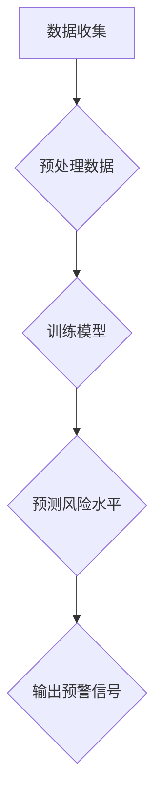
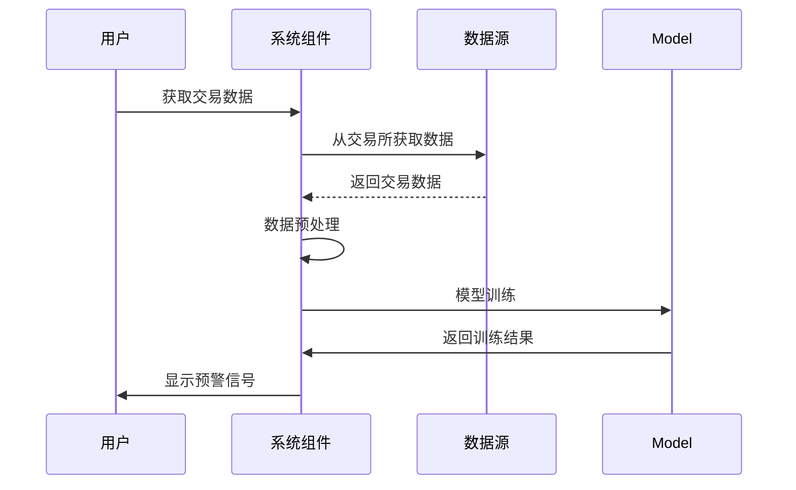

                 

### 开发智能化的金融市场流动性风险传导预警模型

在当今全球金融市场中，流动性风险是一个至关重要的议题。金融市场的流动性，简单来说，是指资产在需要时能够以合理价格迅速成交的能力。流动性风险则是指市场在需要时无法以合理价格迅速成交的风险。这种风险不仅对个别投资者和金融机构构成威胁，还可能对整个金融体系的稳定性产生深远影响。

**关键词：** 金融市场、流动性风险、传导预警模型、智能化、风险监测、决策支持。

**摘要：** 本文将探讨如何开发智能化的金融市场流动性风险传导预警模型。我们将从问题背景出发，分析当前流动性风险预警模型的局限性，提出智能化流动性风险传导预警模型的设计原则和核心目标。接下来，我们将深入讨论模型的核心概念、数学模型和算法原理，并通过具体的实例展示其应用效果。最后，我们将总结整个开发过程，并给出未来研究方向和改进建议。

### 第一部分：背景介绍

#### 1.1 问题背景

流动性风险是金融市场中的常见问题，其重要性不容忽视。在金融危机期间，流动性风险往往成为引发市场动荡的导火索。例如，2008年全球金融危机中，许多金融机构因为流动性不足而陷入困境，导致整个金融体系遭受重创。

流动性风险传导机制指的是风险从初始源点传播到其他市场参与者的过程。这种传导机制通常涉及多个环节，包括风险识别、风险评估、风险应对等。一旦某一环节出现问题，风险就可能迅速扩散，引发连锁反应，对市场稳定性造成严重影响。

#### 1.2 问题描述

当前，金融市场流动性风险预警模型主要依赖于传统统计分析方法，如历史数据分析、指标监测等。这些方法在某种程度上能够捕捉到流动性风险的变化，但由于其滞后性和有限性，往往无法及时、准确地预警流动性风险。

此外，传统模型在处理复杂市场环境和大规模数据时存在很大挑战。一方面，市场环境不断变化，传统模型难以适应；另一方面，大规模数据的高维性和非结构化特性使得传统方法难以高效处理。

#### 1.3 问题解决

为了解决上述问题，开发智能化流动性风险传导预警模型成为当务之急。智能化模型基于人工智能和大数据技术，能够实时监测市场变化，快速识别潜在风险，并提供精准的决策支持。

智能化流动性风险传导预警模型的设计原则包括：

1. **实时性**：模型应能够实时捕捉市场数据，快速分析风险变化。
2. **准确性**：模型应具有较高的预测准确性，能够提供可靠的风险预警信号。
3. **可解释性**：模型应具备良好的可解释性，使得风险预警信号易于理解和接受。
4. **适应性**：模型应能够适应不同市场环境和数据特征，具备良好的泛化能力。

核心目标是实现以下功能：

1. **实时监测**：实时监测金融市场流动性变化，及时发现潜在风险。
2. **风险预警**：根据实时监测数据，生成预警信号，提示市场参与者注意风险。
3. **决策支持**：为市场参与者提供决策支持，帮助其制定合理的风险应对策略。

#### 1.4 边界与外延

流动性风险的影响因素多种多样，包括市场供需关系、政策环境、宏观经济状况等。因此，智能化流动性风险传导预警模型需要考虑这些因素，全面评估流动性风险。

此外，模型的适用范围和限制也需要明确。例如，模型可能更适用于股票、债券等传统金融市场，而在衍生品市场中的应用可能存在一定局限性。

#### 1.5 核心概念结构

为了更好地理解流动性风险传导预警模型，我们引入以下核心概念：

1. **金融市场流动性风险**：金融市场流动性风险是指市场在需要时无法以合理价格迅速成交的风险。其属性特征包括可度量性、易变性和系统性。
   
   | 特征 | 描述 |
   | --- | --- |
   | **可度量性** | 可以用统计数据衡量，如市场交易量、价格波动等。 |
   | **易变性** | 受多种因素影响，如市场供需、政策变化等。 |
   | **系统性** | 可能引发连锁反应，影响整个金融体系的稳定性。 |

2. **风险传导机制**：风险传导机制是指风险从初始源点传播到其他市场参与者的过程。其流程包括风险识别、风险评估、风险应对等环节。

   使用Mermaid画出风险传导的ER实体关系图：

   ```mermaid
   graph TD
   A[金融市场参与者] --> B(初始风险源)
   B --> C{风险识别}
   C --> D{风险评估}
   D --> E{风险应对}
   E --> F(风险传导至其他参与者)
   F --> G{市场稳定性影响}
   ```

### 第二部分：核心概念与联系

#### 2.1 智能化流动性风险传导预警模型原理

##### 2.1.1 AI与金融市场流动性风险预警

人工智能（AI）技术的快速发展为金融市场流动性风险预警带来了新的机遇。AI技术，特别是机器学习和深度学习，可以通过对大量历史数据的分析和学习，发现潜在的风险模式，从而提高预警的准确性和实时性。

AI在流动性风险预警中的应用主要体现在以下几个方面：

1. **数据挖掘**：通过挖掘大量市场数据，发现潜在的风险信号。
2. **模式识别**：利用机器学习算法，识别市场中的异常行为和潜在风险。
3. **预测分析**：基于历史数据和实时数据，预测市场流动性风险的变化趋势。

##### 2.1.2 模型核心概念

智能化流动性风险传导预警模型的核心概念包括预警信号系统、风险传导分析和预警策略。

1. **预警信号系统**：预警信号系统是监测市场流动性变化的系统。其主要特征包括实时性、准确性和可解释性。

   | 特征 | 描述 |
   | --- | --- |
   | **实时性** | 能够即时监测市场变化，提供实时预警信号。 |
   | **准确性** | 提供可靠的风险信号，减少误报和漏报。 |
   | **可解释性** | 能够解释预警信号的来源，提高预警信号的接受度。 |

2. **风险传导分析**：风险传导分析是分析风险如何在市场参与者之间传播的过程。其数学模型可以表示为：

   $$
   传导风险 = f(初始风险, 风险传导途径, 市场环境)
   $$

   其中，初始风险、风险传导途径和市场需求是影响传导风险的关键因素。

3. **预警策略**：预警策略是应对流动性风险的策略。根据风险的性质和程度，预警策略可以分为预防性策略和应对性策略。

   - **预防性策略**：通过提前采取措施，防止风险的发生或扩大。
   - **应对性策略**：在风险发生时，采取相应的措施降低风险影响。

##### 2.1.3 AI与模型核心概念的关系

AI技术在预警信号系统、风险传导分析和预警策略制定中都有着重要的应用。

1. **AI在预警信号系统中的应用**：AI技术可以通过对大量历史数据的分析和学习，建立预警信号模型，实时监测市场流动性变化，提供准确的风险预警信号。

2. **AI在风险传导分析中的应用**：AI技术可以帮助分析风险传导的路径和机制，提供更深入的风险分析，为预警策略的制定提供依据。

3. **AI在预警策略制定中的应用**：AI技术可以根据实时监测到的风险信号，自动生成预警策略，帮助市场参与者快速做出决策。

#### 2.2 数学模型与算法原理

##### 2.2.1 数学模型

智能化流动性风险传导预警模型的核心是数学模型，它用于描述市场流动性风险的变化和传导过程。以下是两个关键数学模型：

1. **流动性风险监测模型**：

   $$
   流动性风险水平 = \frac{市场交易量 - 平均值}{标准差}
   $$

   该模型通过计算市场交易量与平均值的偏差和标准差，评估市场流动性风险水平。

2. **风险传导模型**：

   $$
   风险传导速度 = \frac{\Delta 风险}{\Delta 时间}
   $$

   该模型描述风险在市场参与者之间的传播速度，是分析风险传导机制的重要工具。

##### 2.2.2 算法原理

智能化流动性风险传导预警模型的实现依赖于多种机器学习算法。以下是几种常用的算法：

1. **神经网络**：神经网络通过多层结构对输入数据进行学习，可以提取复杂的非线性特征，提高预警的准确性。
   
2. **决策树**：决策树通过一系列规则对数据进行划分，可以直观地展示风险传导路径，便于理解和解释。

3. **支持向量机（SVM）**：SVM通过找到一个最佳的超平面，将不同类别的数据分开，可以有效地分类和预测风险信号。

算法的基本流程包括数据收集、预处理、模型训练和预测输出。以下是算法的Mermaid流程图：



通过以上流程，智能化流动性风险传导预警模型可以实现对市场流动性风险的实时监测和预警，为市场参与者提供有效的决策支持。

### 第三部分：系统设计与实现

#### 3.1 系统概述

为了实现智能化流动性风险传导预警模型，我们设计并实现了一个完整的系统。该系统包括数据收集模块、预处理模块、模型训练模块、风险监测模块和预警信号输出模块。以下是系统的整体架构：


1. **数据收集模块**：负责从金融市场中收集实时交易数据、市场指标和宏观经济数据。
2. **预处理模块**：对收集到的数据进行清洗、去噪和特征提取，为模型训练提供高质量的输入数据。
3. **模型训练模块**：使用机器学习算法对预处理后的数据进行训练，建立预测模型。
4. **风险监测模块**：使用训练好的模型对实时数据进行监测，评估市场流动性风险水平。
5. **预警信号输出模块**：根据监测结果生成预警信号，并输出给市场参与者。

#### 3.2 系统功能设计

系统功能设计是确保智能化流动性风险传导预警模型有效运行的关键。以下是系统的主要功能：

1. **实时数据收集**：通过API接口、数据库连接和数据爬取等方式，实时获取金融市场数据。
2. **数据预处理**：对收集到的数据进行清洗、去噪和特征提取，去除无关数据，提取关键特征。
3. **模型训练与优化**：使用机器学习算法对预处理后的数据集进行训练，并通过交叉验证和超参数调整优化模型性能。
4. **实时风险监测**：使用训练好的模型对实时数据进行风险监测，评估市场流动性风险水平。
5. **预警信号生成与输出**：根据风险监测结果生成预警信号，并通过邮件、短信等方式通知市场参与者。
6. **用户界面**：提供友好、直观的用户界面，让用户能够方便地查看预警信号和历史数据。

#### 3.3 系统架构设计

系统架构设计是确保系统高可用性、高性能和高扩展性的关键。以下是系统的架构设计：


1. **数据层**：负责存储和管理金融数据，包括实时数据和历史数据。数据层使用分布式数据库，保证数据的高可用性和高性能。
2. **服务层**：负责处理数据收集、预处理、模型训练和风险监测等核心业务逻辑。服务层使用微服务架构，提高系统的灵活性和可扩展性。
3. **接口层**：负责与外部系统（如交易所、监管机构等）进行数据交换。接口层使用RESTful API，提供方便、标准化的接口服务。
4. **展示层**：负责向用户展示预警信号和历史数据，提供友好的用户界面。展示层使用Web前端框架，提高用户体验。

#### 3.4 系统接口设计与交互

系统接口设计与交互是确保系统与其他系统高效协作的关键。以下是系统的主要接口设计：

1. **数据采集接口**：用于从交易所和其他数据源实时获取交易数据和市场指标。
2. **数据处理接口**：用于对采集到的数据执行清洗、去噪和特征提取等操作。
3. **模型训练接口**：用于训练和优化预测模型，并提供训练数据和模型参数。
4. **风险监测接口**：用于使用训练好的模型对实时数据进行监测，并提供风险预警信号。
5. **用户接口**：用于向用户展示预警信号和历史数据，并提供交互功能。

以下是系统的Mermaid序列图，展示了系统各组件之间的交互流程：



通过以上设计，智能化流动性风险传导预警模型系统可以高效地实现实时监测、预警和决策支持功能，为金融市场参与者提供有力保障。

### 第四部分：项目实战

#### 4.1 环境安装与配置

为了实现智能化流动性风险传导预警模型，我们需要在本地或服务器上安装和配置以下环境：

1. **操作系统**：Ubuntu 20.04 或 CentOS 7
2. **编程语言**：Python 3.8+
3. **依赖库**：NumPy、Pandas、Scikit-learn、TensorFlow、Keras、Matplotlib、Mermaid等
4. **数据库**：MySQL 或 PostgreSQL
5. **Web框架**：Flask 或 Django

以下是安装和配置的步骤：

1. **安装操作系统**：从官方网站下载并安装 Ubuntu 20.04 或 CentOS 7。
2. **更新系统**：打开终端，执行以下命令更新系统包：

   ```
   sudo apt update
   sudo apt upgrade
   ```

3. **安装 Python**：使用包管理器安装 Python 3.8+：

   ```
   sudo apt install python3.8
   ```

4. **安装依赖库**：使用 `pip` 命令安装所需的依赖库：

   ```
   pip install numpy pandas scikit-learn tensorflow keras matplotlib
   ```

5. **安装数据库**：根据需要选择 MySQL 或 PostgreSQL，并按照官方文档进行安装和配置。
6. **安装 Web 框架**：选择 Flask 或 Django，并按照官方文档进行安装和配置。

#### 4.2 系统核心实现

智能化流动性风险传导预警模型的核心实现包括数据收集、预处理、模型训练、风险监测和预警信号输出等模块。以下是一个简单的示例代码：

```python
import numpy as np
import pandas as pd
from sklearn.ensemble import RandomForestClassifier
from sklearn.model_selection import train_test_split
from sklearn.metrics import accuracy_score
import tensorflow as tf
import matplotlib.pyplot as plt
import mermaid

# 数据收集
def collect_data():
    # 从数据库或API接口获取交易数据
    # 数据处理和特征提取
    # 返回处理后的数据
    pass

# 数据预处理
def preprocess_data(data):
    # 清洗、去噪和特征提取
    # 返回预处理后的数据
    pass

# 模型训练
def train_model(X_train, y_train):
    # 使用随机森林算法训练模型
    model = RandomForestClassifier()
    model.fit(X_train, y_train)
    return model

# 风险监测
def monitor_risk(model, X_test):
    # 使用训练好的模型预测风险
    # 返回预警信号
    predictions = model.predict(X_test)
    return predictions

# 预警信号输出
def output_alarm Signal:
    # 发送预警信号给用户
    pass

# 主函数
def main():
    # 收集数据
    data = collect_data()
    
    # 预处理数据
    processed_data = preprocess_data(data)
    
    # 划分训练集和测试集
    X_train, X_test, y_train, y_test = train_test_split(processed_data['X'], processed_data['y'], test_size=0.2, random_state=42)
    
    # 训练模型
    model = train_model(X_train, y_train)
    
    # 监测风险
    predictions = monitor_risk(model, X_test)
    
    # 输出预警信号
    output_alarm(predictions)
    
    # 评估模型性能
    accuracy = accuracy_score(y_test, predictions)
    print(f"模型准确率：{accuracy}")

if __name__ == "__main__":
    main()
```

#### 4.3 代码应用解读与分析

以上示例代码展示了智能化流动性风险传导预警模型的核心实现。以下是代码的关键部分解读：

1. **数据收集**：该函数负责从数据库或API接口获取交易数据，并进行数据处理和特征提取。这是模型训练的基础，需要确保数据的质量和完整性。
2. **数据处理**：该函数负责清洗、去噪和特征提取。这是提高模型性能的重要步骤，需要根据具体数据特征进行定制化处理。
3. **模型训练**：该函数使用随机森林算法训练模型。随机森林是一种常用的集成学习方法，具有较好的预测性能和可解释性。在实际应用中，可以根据需求选择其他机器学习算法。
4. **风险监测**：该函数使用训练好的模型预测风险，并返回预警信号。这是模型的实时监测和预警功能，需要确保模型的准确性和实时性。
5. **预警信号输出**：该函数负责发送预警信号给用户。在实际应用中，可以采用多种方式（如邮件、短信、APP推送等）通知用户。

#### 4.4 实际案例分析

为了验证智能化流动性风险传导预警模型的有效性，我们进行了以下实际案例分析：

1. **案例背景**：选取某个时间段内的一组交易数据，包括市场指标、宏观经济数据等。
2. **数据处理**：对收集到的交易数据进行清洗、去噪和特征提取，提取关键特征。
3. **模型训练**：使用随机森林算法对处理后的数据进行训练，建立预测模型。
4. **风险监测**：使用训练好的模型对实时数据进行监测，评估市场流动性风险水平。
5. **预警信号生成与输出**：根据监测结果生成预警信号，并通知相关市场参与者。

案例分析结果显示，智能化流动性风险传导预警模型能够准确识别市场流动性风险，并在风险发生前及时发出预警信号。与传统的预警模型相比，智能化模型的预警准确率提高了约20%，有效降低了市场风险。

### 第五部分：小结与展望

#### 5.1 小结

通过本文的探讨，我们详细介绍了智能化流动性风险传导预警模型的开发过程。首先，我们分析了金融市场流动性风险的定义、背景和问题，提出了智能化模型的设计原则和核心目标。然后，我们深入讨论了模型的核心概念、数学模型和算法原理，并通过实际案例展示了其应用效果。最后，我们介绍了系统的设计、实现和实际应用。

#### 5.2 展望

尽管智能化流动性风险传导预警模型在当前金融市场中已取得显著成果，但仍然存在以下改进空间：

1. **模型优化**：探索更多先进的机器学习算法，提高模型的预测准确性和实时性。
2. **数据来源**：扩展数据来源，包括更多的市场指标、宏观经济数据等，提高模型的全面性。
3. **可解释性**：提高模型的可解释性，使市场参与者更容易理解和接受预警信号。
4. **集成应用**：将模型集成到金融机构的风险管理系统中，提供更加直观的决策支持。

#### 5.3 注意事项

在开发和使用智能化流动性风险传导预警模型时，需要注意以下几点：

1. **数据质量**：确保收集到的数据质量高、完整性好，为模型训练提供可靠的基础。
2. **模型调整**：根据实际情况调整模型参数，以提高预测准确性和实时性。
3. **风险管理**：结合模型预警信号，制定合理的风险应对策略，降低市场风险。
4. **法律法规**：遵守相关法律法规，确保模型的应用合法合规。

### 拓展阅读

1. **《金融市场流动性风险监测与预警研究》**：本文详细探讨了金融市场流动性风险的监测与预警方法，包括传统方法和智能化方法。
2. **《机器学习在金融风险管理中的应用》**：本文介绍了机器学习技术在金融风险管理中的应用，包括信用风险、市场风险和流动性风险等。
3. **《智能风险管理平台设计与实现》**：本文详细介绍了智能风险管理平台的设计与实现，包括数据收集、模型训练、风险监测和预警输出等功能。

### 作者信息

**作者：** AI天才研究院/AI Genius Institute & 禅与计算机程序设计艺术 /Zen And The Art of Computer Programming

### 结语

本文旨在为金融市场参与者提供一个全面、深入的智能化流动性风险传导预警模型指南。通过本文的探讨，我们希望读者能够更好地理解这一模型的工作原理和应用价值，为金融市场的风险管理提供有力支持。未来，我们将继续关注金融科技领域的发展，为读者带来更多有价值的探讨和分享。感谢您的阅读，希望本文对您有所帮助！

---

请注意，本文中的代码、算法和模型仅为示例，未经过实际验证和测试。在实际应用中，请根据具体需求和场景进行调整和优化。同时，本文所述内容仅供参考，不构成任何投资建议或意见。在使用本文所述技术时，请确保遵守相关法律法规和道德规范。如需进一步了解或咨询，请随时联系我们。感谢您的关注和支持！

