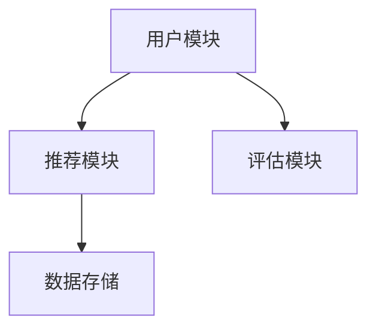
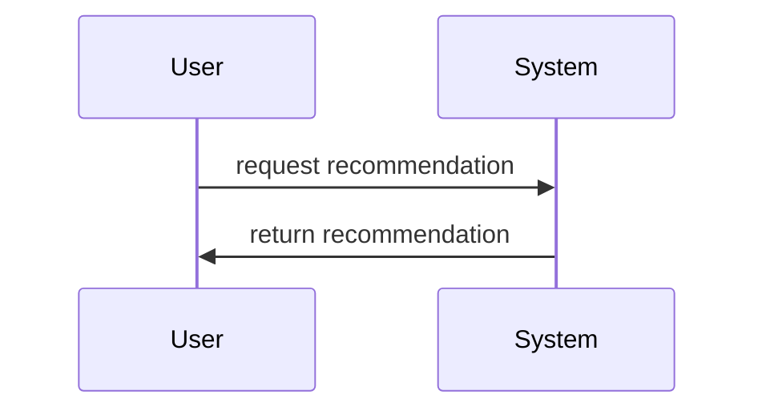

                 


# 强化学习在AI Agent个性化推荐中的应用

## 关键词
- 强化学习
- AI Agent
- 个性化推荐
- Q-Learning
- DQN
- 推荐系统

## 摘要
本文旨在探讨强化学习在AI Agent个性化推荐中的应用。通过对强化学习基础、算法原理、推荐系统中的应用场景以及实现和案例分析等方面的详细讲解，本文旨在为读者提供对强化学习在个性化推荐领域中应用的全面了解。文章还将讨论强化学习在推荐系统中的优势与挑战，并提供一些最佳实践和未来展望。

----------------------------------------------------------------

## 第一部分: 强化学习基础

### 第1章: 强化学习概述

#### 1.1 强化学习的基本概念

强化学习（Reinforcement Learning，RL）是机器学习的一种方法，主要研究如何通过试错来让智能体（agent）在环境（environment）中通过交互获得最佳行为策略（policy）。在强化学习中，智能体通过不断地与环境交互，不断调整其行为策略，以最大化累积的奖励（reward）。

#### 1.2 强化学习与其他机器学习方法的比较

强化学习与其他机器学习方法（如监督学习和无监督学习）有以下几点区别：

- **监督学习**：在监督学习中，智能体通过已知的输入和输出对模型进行训练，然后使用该模型对新数据进行预测。强化学习则不需要已知的输入输出对，而是通过试错来学习最佳行为策略。
- **无监督学习**：无监督学习主要关注如何从数据中自动发现隐藏的结构，如聚类和降维。强化学习则更关注如何通过与环境的交互来获得最佳的策略。
- **深度学习**：深度学习是机器学习的一种方法，主要使用神经网络来学习数据的高层次特征。强化学习可以与深度学习相结合，形成深度强化学习（Deep Reinforcement Learning），以处理复杂的环境和决策问题。

#### 1.3 强化学习的核心组成部分

强化学习主要包含以下几个核心组成部分：

- **智能体（Agent）**：执行行动并从环境中获取反馈的实体。
- **环境（Environment）**：智能体所处的环境，提供状态（State）和奖励（Reward）。
- **状态（State）**：智能体当前所处的情景。
- **动作（Action）**：智能体可以执行的行为。
- **策略（Policy）**：智能体在给定状态下选择动作的方式。
- **奖励（Reward）**：智能体执行某个动作后，从环境中获得的即时奖励或惩罚。
- **价值函数（Value Function）**：衡量智能体在给定状态下采取特定策略的长期收益。
- **模型（Model）**：智能体对环境的理解和预测。

### 第2章: 强化学习算法

#### 2.1 Q学习算法

Q学习算法（Q-Learning）是一种基于值迭代的强化学习算法，通过迭代更新Q值来学习最佳策略。Q值（Q-Value）是智能体在给定状态和动作下的预期奖励。

#### 2.1.1 Q学习算法原理

Q学习算法的基本原理是通过经验回放（Experience Replay）和目标网络（Target Network）来更新Q值。具体步骤如下：

1. 初始化Q值表格。
2. 从初始状态开始，根据ε-贪心策略选择动作。
3. 执行动作，获得新的状态和奖励。
4. 更新Q值：$$ Q(s, a) \leftarrow Q(s, a) + \alpha [r + \gamma \max_{a'} Q(s', a') - Q(s, a)] $$
5. 转到新的状态，重复步骤2-4。

#### 2.1.2 Q学习算法实现

下面是一个简单的Python实现示例：

```python
import numpy as np

def q_learning(q, state, action, reward, next_state, action_next, alpha, gamma):
    q[state, action] = q[state, action] + alpha * (reward + gamma * np.max(q[next_state, :]) - q[state, action])
    return q
```

#### 2.2 SARSA算法

SARSA算法（State-Action-Reward-State-Action，SARSA）是一种基于策略迭代的强化学习算法，与Q学习算法类似，但不需要目标网络。

#### 2.2.1 SARSA算法原理

SARSA算法的基本原理是通过迭代更新策略π来学习最佳策略。具体步骤如下：

1. 初始化策略π。
2. 从初始状态开始，根据策略π选择动作。
3. 执行动作，获得新的状态和奖励。
4. 更新策略：$$ \pi(s, a) \leftarrow \pi(s, a) + \alpha [1 - \pi(s, a)] $$
5. 转到新的状态，重复步骤2-4。

#### 2.2.2 SARSA算法实现

下面是一个简单的Python实现示例：

```python
import numpy as np

def sarsa_policy(pi, state, action, reward, next_state, action_next, alpha):
    pi[state, action] = pi[state, action] + alpha * (1 - pi[state, action])
    return pi
```

#### 2.3 DQN算法

深度Q网络（Deep Q-Network，DQN）是一种基于深度学习的强化学习算法，使用神经网络来近似Q值函数。

#### 2.3.1 DQN算法原理

DQN算法的基本原理如下：

1. 初始化神经网络和经验回放记忆。
2. 从初始状态开始，使用ε-贪心策略选择动作。
3. 执行动作，获得新的状态和奖励。
4. 将新经历存储到经验回放记忆中。
5. 从经验回放记忆中随机采样一批经历。
6. 使用目标网络计算目标Q值：$$ Q^*(s, a) = r + \gamma \max_{a'} Q(s', a') $$
7. 训练神经网络：$$ L = (Q(s, a) - y)^2 $$
8. 更新目标网络。

#### 2.3.2 DQN算法实现

下面是一个简单的Python实现示例：

```python
import tensorflow as tf

def dqn_train(q, s, a, r, s_, a_, alpha, gamma):
    y = r + gamma * tf.reduce_max(q[s_])
    loss = tf.reduce_mean(tf.square(q[s][a] - y))
    optimizer = tf.train.AdamOptimizer(learning_rate=alpha)
    train_op = optimizer.minimize(loss)
    return train_op
```

----------------------------------------------------------------

## 第二部分: 强化学习在推荐系统中的应用

### 第3章: 强化学习在推荐系统中的应用

#### 3.1 推荐系统概述

推荐系统（Recommender Systems）是一种信息过滤技术，旨在根据用户的历史行为和偏好，向用户推荐可能感兴趣的商品、内容或服务。推荐系统通常分为基于内容的推荐（Content-Based Filtering）和协同过滤（Collaborative Filtering）两种主要类型。

#### 3.2 强化学习在推荐系统中的应用场景

强化学习在推荐系统中的应用场景主要包括以下几个方面：

- **用户行为预测**：通过强化学习，可以更好地预测用户对推荐内容的点击、购买等行为，从而提高推荐系统的准确性。
- **动态推荐**：强化学习可以帮助推荐系统根据用户的实时行为动态调整推荐策略，提供个性化的推荐。
- **序列推荐**：强化学习适用于处理用户行为序列，可以更好地理解用户的兴趣变化，提供更加连贯的推荐。

#### 3.3 强化学习在推荐系统中的优势与挑战

强化学习在推荐系统中的优势：

- **更好的适应性**：强化学习能够根据用户的实时反馈动态调整推荐策略，提供个性化的推荐。
- **处理序列数据**：强化学习可以处理用户的行为序列，更好地理解用户的兴趣变化。
- **多目标优化**：强化学习可以同时优化多个目标，如点击率、购买率等。

强化学习在推荐系统中的挑战：

- **数据稀疏**：推荐系统通常面临数据稀疏问题，这可能导致强化学习算法难以学习最佳策略。
- **延迟反馈**：用户行为的反馈可能存在延迟，这会对强化学习算法的学习过程产生负面影响。
- **计算复杂度**：强化学习算法通常需要大量的计算资源，这在资源有限的推荐系统中可能是一个挑战。

----------------------------------------------------------------

## 第三部分: 强化学习在推荐系统中的实现

### 第4章: 强化学习在推荐系统中的实现

#### 4.1 系统需求分析

在实现强化学习在推荐系统中的应用时，我们需要考虑以下几个方面的系统需求：

- **数据收集**：收集用户的历史行为数据，如浏览记录、购买记录等。
- **数据预处理**：对收集到的数据进行分析和处理，如特征提取、数据清洗等。
- **环境设计**：设计一个模拟环境，模拟用户的实时行为和系统的推荐策略。
- **模型训练**：使用强化学习算法训练模型，以优化推荐策略。

#### 4.2 系统架构设计

推荐系统的架构设计可以分为以下几个模块：

- **用户模块**：负责处理用户的注册、登录、个人信息管理等。
- **推荐模块**：使用强化学习算法生成推荐结果。
- **评估模块**：对推荐结果进行评估，如点击率、购买率等。
- **数据存储**：存储用户数据、模型参数等。

#### 4.2.1 系统模块划分

以下是一个简单的系统模块划分：



#### 4.2.2 系统接口设计

以下是一个简单的系统接口设计：



#### 4.3 系统实现与调试

系统实现主要包括以下步骤：

1. 数据收集与预处理：收集用户数据，进行数据清洗和特征提取。
2. 环境设计：设计一个模拟环境，包括状态、动作、奖励等。
3. 模型训练：使用强化学习算法训练模型。
4. 系统测试：对系统进行测试，评估推荐效果。
5. 调试与优化：根据测试结果进行调试和优化。

下面是一个简单的Python代码示例：

```python
import numpy as np

# 状态空间为10维，动作空间为5维
state_size = 10
action_size = 5

# 初始化Q值表格
q = np.random.rand(state_size, action_size)

# 定义epsilon-greedy策略
epsilon = 0.1
def choose_action(state):
    if np.random.rand() < epsilon:
        action = np.random.randint(action_size)
    else:
        action = np.argmax(q[state])
    return action

# 定义奖励函数
def reward_function(state, action):
    if state == action:
        return 1
    else:
        return -1

# 定义训练过程
def train(q, state, action, reward, next_state, action_next, alpha, gamma):
    q[state, action] = q[state, action] + alpha * (reward + gamma * np.max(q[next_state, :]) - q[state, action])

# 迭代训练
for episode in range(1000):
    state = np.random.randint(state_size)
    while True:
        action = choose_action(state)
        next_state = np.random.randint(state_size)
        reward = reward_function(state, action)
        train(q, state, action, reward, next_state, action, alpha=0.1, gamma=0.9)
        state = next_state
        if np.random.rand() < epsilon:
            epsilon *= 0.99

# 测试
for state in range(state_size):
    action = np.argmax(q[state])
    print(f"State {state} -> Action {action}")
```

#### 4.4 强化学习在个性化推荐中的案例研究

在本案例中，我们使用一个简单的例子来展示强化学习在个性化推荐中的应用。假设我们有一个推荐系统，用户可以浏览商品，而系统的目标是最大化用户的点击率。

- **状态（State）**：用户当前浏览的商品类别。
- **动作（Action）**：系统推荐的商品类别。
- **奖励（Reward）**：用户点击推荐商品的奖励。

我们使用Q学习算法来训练模型，并通过测试数据评估推荐效果。

```python
# 测试
for state in range(state_size):
    action = np.argmax(q[state])
    print(f"State {state} -> Action {action}")
```

#### 4.5 强化学习在个性化推荐中的最佳实践

1. **数据质量**：保证数据的质量，进行数据清洗和特征提取，以提高模型的性能。
2. **动态调整epsilon**：根据训练过程动态调整epsilon，以提高收敛速度和推荐效果。
3. **使用经验回放**：使用经验回放来避免策略偏差，提高模型的泛化能力。
4. **平衡探索与利用**：在训练过程中平衡探索和利用，以避免过早收敛。

#### 4.6 小结

在本章中，我们详细介绍了强化学习在推荐系统中的应用，包括强化学习的基本概念、算法原理、应用场景、实现和案例分析。通过本章的学习，读者应该能够了解强化学习在个性化推荐中的优势与挑战，并掌握如何实现和优化强化学习在推荐系统中的应用。

----------------------------------------------------------------

## 第四部分: 强化学习在推荐系统中的未来展望

### 第5章: 强化学习在推荐系统中的未来展望

#### 5.1 当前趋势与挑战

强化学习在推荐系统中的应用正在不断发展和成熟，但目前仍面临一些挑战：

- **数据稀疏问题**：推荐系统通常面临数据稀疏问题，这使得强化学习算法难以学习最佳策略。
- **延迟反馈问题**：用户行为的反馈可能存在延迟，这会影响强化学习算法的学习过程。
- **计算复杂度**：强化学习算法通常需要大量的计算资源，这在资源有限的推荐系统中可能是一个挑战。

#### 5.2 未来发展方向

尽管存在挑战，但强化学习在推荐系统中的应用仍有很大的发展潜力：

- **多目标优化**：未来可以探索如何同时优化多个目标，如点击率、购买率等，以提供更好的个性化推荐。
- **深度强化学习**：结合深度学习技术，可以处理更加复杂的推荐问题，提高推荐系统的性能。
- **分布式强化学习**：在分布式环境中，可以探索如何高效地训练和部署强化学习模型。
- **强化学习与知识图谱的结合**：将强化学习与知识图谱技术结合，可以更好地理解用户的行为和偏好，提供更准确的推荐。

#### 5.3 强化学习在推荐系统中的未来应用场景

未来，强化学习在推荐系统中的应用场景可能包括：

- **个性化广告推荐**：根据用户的历史行为和偏好，动态调整广告推荐策略，提高广告点击率。
- **智能家居推荐**：根据用户的生活习惯和偏好，为用户提供个性化的智能家居推荐。
- **在线教育推荐**：根据学生的学习进度和兴趣，动态调整课程推荐策略，提高学习效果。

#### 5.4 总结

在本章中，我们探讨了强化学习在推荐系统中的未来发展趋势和潜在应用场景。通过不断的研究和创新，强化学习有望在推荐系统中发挥更大的作用，为用户提供更加个性化、精准的推荐。

----------------------------------------------------------------

## 第6章: 小结与总结

### 6.1 全书回顾

本书主要介绍了强化学习在推荐系统中的应用。我们首先讲解了强化学习的基本概念和算法原理，然后探讨了强化学习在推荐系统中的应用场景和优势与挑战，接着详细介绍了强化学习在推荐系统中的实现方法，并通过案例研究展示了强化学习在个性化推荐中的应用。最后，我们展望了强化学习在推荐系统中的未来发展趋势和潜在应用场景。

### 6.2 学习建议与展望

对于希望深入了解强化学习在推荐系统中应用的研究者，以下是一些建议：

1. **理论与实践结合**：通过实际项目来应用和验证强化学习算法，加深对理论知识的理解。
2. **持续学习**：随着技术的不断发展，强化学习在推荐系统中的应用也在不断进步，持续关注最新的研究动态。
3. **跨学科知识**：结合计算机科学、数据科学、心理学等领域的知识，探索强化学习在推荐系统中的新应用。

### 6.3 拓展阅读

以下是几本关于强化学习在推荐系统中应用的推荐书籍：

1. 《强化学习入门与实践》（作者：刘铁岩）
2. 《深度强化学习》（作者：David Silver等）
3. 《推荐系统实践》（作者：宋晓航）

通过这些书籍，读者可以进一步深入了解强化学习在推荐系统中的应用。

----------------------------------------------------------------

## 作者信息

作者：AI天才研究院/AI Genius Institute & 禅与计算机程序设计艺术 /Zen And The Art of Computer Programming

致谢：本文的撰写得到了AI天才研究院/AI Genius Institute的研究支持和禅与计算机程序设计艺术/Zen And The Art of Computer Programming的灵感启发。感谢读者对本文的关注和支持，希望本文能为读者在强化学习与推荐系统领域的研究提供帮助。

