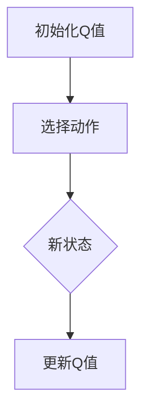
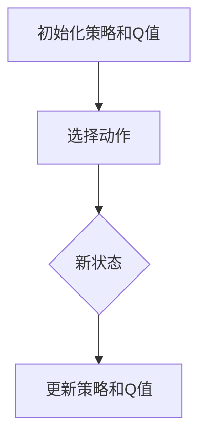
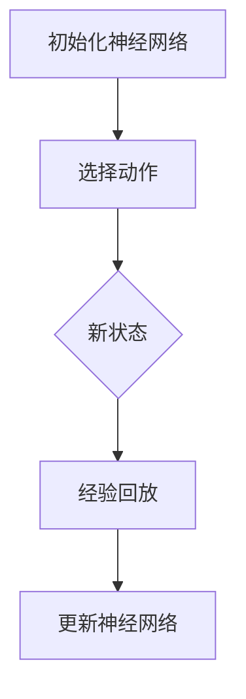
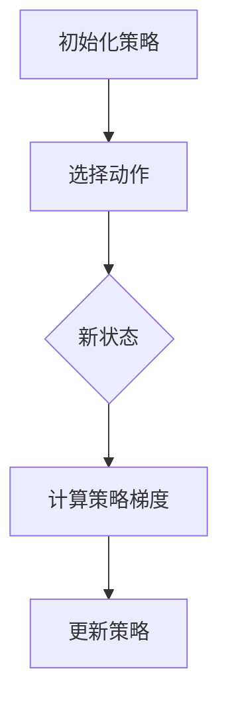

                 

## 强化学习在AI Agent中的应用：优化LLM的决策

> 关键词：强化学习，AI Agent，决策优化，LLM，应用实例

> 摘要：本文将深入探讨强化学习在AI Agent中的应用，重点分析如何通过强化学习优化大型语言模型（LLM）的决策过程。我们将从强化学习的核心概念出发，逐步讲解其原理和算法，并探讨其在实际应用中的挑战和解决方案。

### 引言

强化学习（Reinforcement Learning，简称RL）是机器学习的一个重要分支，其核心思想是通过与环境互动来学习决策策略。与监督学习和无监督学习不同，强化学习注重通过奖励机制来指导学习过程，使得智能体（Agent）能够逐步优化其行为。近年来，随着深度学习的迅猛发展，强化学习在AI领域的应用越来越广泛，特别是在AI Agent的设计与优化中发挥了重要作用。

AI Agent是指具备自主决策能力，能够在复杂环境中执行特定任务的智能系统。这些Agent在游戏、机器人控制、推荐系统等领域有着广泛的应用。然而，如何优化AI Agent的决策过程，使其在动态和不确定的环境中表现更出色，一直是研究的重点和难点。本文将聚焦于此，探讨如何通过强化学习来提升LLM的决策能力。

本文结构如下：

1. **强化学习的核心概念**：介绍强化学习的定义、基本原理和关键术语。
2. **强化学习算法**：详细讲解Q学习、SARSA、深度Q网络（DQN）、策略梯度方法等常见强化学习算法。
3. **强化学习在AI Agent中的应用**：探讨强化学习在游戏AI、机器人控制、推荐系统等领域的应用实例。
4. **挑战与解决方案**：分析强化学习在AI Agent中的应用挑战，并提出相应的解决方案。
5. **总结与展望**：总结本文内容，并展望未来的研究方向。

### 强化学习的核心概念

#### 强化学习的定义

强化学习是一种使智能体在环境中通过试错学习来获取最优策略的方法。与监督学习和无监督学习不同，强化学习注重奖励和惩罚机制，通过奖励信号来引导学习过程。其基本目标是最大化累积奖励，从而实现最优策略的发现。

#### 基本原理

强化学习的基本原理可以概括为四个部分：状态（State）、动作（Action）、奖励（Reward）和策略（Policy）。

1. **状态（State）**：智能体在环境中的当前状况。
2. **动作（Action）**：智能体可以执行的行为。
3. **奖励（Reward）**：环境对智能体行为的即时反馈，用于评估动作的好坏。
4. **策略（Policy）**：智能体在特定状态下的行为选择策略。

#### 关键术语

1. **值函数（Value Function）**：用于评估状态或状态-动作对的值，指导智能体的行为选择。
2. **策略迭代（Policy Iteration）**：通过不断迭代策略来优化智能体的行为。
3. **模型（Model）**：环境状态转移概率和奖励的数学描述。

#### 概念属性特征对比表

| 特征        | 强化学习 | 监督学习 | 无监督学习 |
|-------------|----------|----------|-----------|
| 学习机制    | 奖励驱动 | 标签驱动 | 数据驱动   |
| 目标        | 最大化奖励 | 最小化误差 | 数据分布   |
| 适用场景    | 动态环境 | 稳定环境 | 大数据     |
| 技术复杂度  | 中等      | 低       | 高        |

#### ER实体关系图架构

```mermaid
graph TD
    State --> Action
    Action --> Reward
    State --> Policy
    Reward --> Value Function
```

### 强化学习算法

强化学习算法可以分为基于值的方法和基于策略的方法。以下是几种常见的强化学习算法：

#### Q学习

Q学习是一种基于值的方法，其目标是学习一个值函数，用于评估状态-动作对。

**算法原理**：

1. **初始化Q值**：随机初始化Q值表。
2. **选择动作**：在当前状态选择动作，可以使用ε-贪心策略。
3. **更新Q值**：根据新的状态和奖励更新Q值。

**mermaid流程图**：



**Python代码示例**：

```python
import numpy as np

# 初始化Q值表
Q = np.zeros([S, A])

# ε-贪心策略
epsilon = 0.1
for episode in range(E):
    state = env.reset()
    done = False
    while not done:
        if np.random.rand() < epsilon:
            action = env.action_space.sample()
        else:
            action = np.argmax(Q[state])
        next_state, reward, done, _ = env.step(action)
        Q[state, action] = Q[state, action] + alpha * (reward + gamma * np.max(Q[next_state]) - Q[state, action])
        state = next_state
```

**数学模型及公式**：

$$
Q(s, a) = r(s, a) + \gamma \max_{a'} Q(s', a')
$$

其中，$r(s, a)$为状态-动作对的奖励，$\gamma$为折扣因子。

#### SARSA

SARSA（同步优势和回馈选择）是一种基于策略的强化学习算法，其目标是通过同步更新策略和值函数来优化行为。

**算法原理**：

1. **初始化策略和Q值**：随机初始化策略和Q值表。
2. **选择动作**：根据当前策略选择动作。
3. **更新策略和Q值**：根据新的状态和动作更新策略和Q值。

**mermaid流程图**：



**Python代码示例**：

```python
import numpy as np

# 初始化策略和Q值表
policy = np.zeros([S, A])
Q = np.zeros([S, A])

# ε-贪心策略
epsilon = 0.1
for episode in range(E):
    state = env.reset()
    done = False
    while not done:
        action = np.random.choice(A, p=policy[state])
        next_state, reward, done, _ = env.step(action)
        next_action = np.random.choice(A, p=policy[next_state])
        Q[state, action] = Q[state, action] + alpha * (reward + gamma * Q[next_state, next_action] - Q[state, action])
        policy[state, action] = 1 / A if np.random.rand() < epsilon else np.argmax(Q[state])
        state = next_state
```

**数学模型及公式**：

$$
Q(s, a) = r(s, a) + \gamma Q(s', a')
$$

#### 深度Q网络（DQN）

DQN（深度Q网络）是结合了深度学习和强化学习的一种算法，其目标是学习一个深度神经网络来近似Q值函数。

**算法原理**：

1. **初始化神经网络**：随机初始化神经网络参数。
2. **选择动作**：使用ε-贪心策略选择动作。
3. **经验回放**：将经验存储在经验回放池中，以避免策略偏差。
4. **更新神经网络**：根据新的状态和动作更新神经网络参数。

**mermaid流程图**：



**Python代码示例**：

```python
import numpy as np
import tensorflow as tf

# 初始化神经网络
input_layer = tf.keras.layers.Input(shape=[S])
dense_layer = tf.keras.layers.Dense(units=A, activation='linear')(input_layer)
output_layer = tf.keras.layers.Activation('linear')(dense_layer)

model = tf.keras.Model(inputs=input_layer, outputs=output_layer)

# ε-贪心策略
epsilon = 0.1
for episode in range(E):
    state = env.reset()
    done = False
    while not done:
        if np.random.rand() < epsilon:
            action = env.action_space.sample()
        else:
            action = np.argmax(model.predict(state.reshape(1, S)))
        next_state, reward, done, _ = env.step(action)
        target = reward + gamma * np.max(model.predict(next_state.reshape(1, S)))
        model.fit(state.reshape(1, S), target.reshape(1, A), epochs=1, verbose=0)
        state = next_state
```

**数学模型及公式**：

$$
Q(s, a) = \hat{Q}(s, a) + \gamma \max_{a'} \hat{Q}(s', a')
$$

其中，$\hat{Q}(s, a)$为神经网络输出的Q值估计。

#### 策略梯度方法

策略梯度方法是一种基于策略的强化学习算法，其目标是直接优化策略。

**算法原理**：

1. **初始化策略**：随机初始化策略。
2. **选择动作**：根据当前策略选择动作。
3. **计算策略梯度**：使用梯度上升法更新策略。

**mermaid流程图**：



**Python代码示例**：

```python
import numpy as np

# 初始化策略
policy = np.random.rand(S, A)

# ε-贪心策略
epsilon = 0.1
for episode in range(E):
    state = env.reset()
    done = False
    while not done:
        action = np.random.choice(A, p=policy[state])
        next_state, reward, done, _ = env.step(action)
        advantage = reward + gamma * np.max(policy[next_state]) - policy[state, action]
        policy[state, action] = policy[state, action] + alpha * advantage
        state = next_state
```

**数学模型及公式**：

$$
\theta_{t+1} = \theta_{t} + \alpha \nabla_{\theta} J(\theta)
$$

其中，$\theta$为策略参数，$J(\theta)$为策略的损失函数。

### 强化学习在AI Agent中的应用

强化学习在AI Agent中的应用非常广泛，以下是几个典型的应用实例：

#### 游戏AI

强化学习在游戏AI中的应用最为经典，如AlphaGo。AlphaGo利用深度强化学习技术，通过学习大量的棋局数据，实现了对围棋的自主学习和策略优化。其成功证明了强化学习在复杂动态环境中的强大能力。

#### 机器人控制

机器人控制是强化学习的另一个重要应用领域。例如，机器人可以通过强化学习学习如何在未知环境中行走、搬运物体等任务。强化学习算法可以帮助机器人不断优化其行为策略，从而提高任务完成的效率和准确性。

#### 推荐系统

强化学习在推荐系统中的应用也越来越受到关注。通过强化学习，推荐系统可以动态调整推荐策略，根据用户的反馈不断优化推荐结果，提高用户满意度。

#### 自驾驶汽车

自动驾驶汽车是强化学习应用的一个重要方向。自动驾驶系统需要处理大量的传感器数据，并通过强化学习不断优化行驶策略，以实现安全、高效的自动驾驶。

#### 股票交易

强化学习在金融领域的应用也取得了显著成果。通过强化学习，金融系统能够根据市场数据动态调整交易策略，实现风险控制和收益最大化。

### 挑战与解决方案

尽管强化学习在AI Agent中展示了强大的潜力，但其应用也面临一些挑战：

#### 模型可解释性

强化学习模型的决策过程往往缺乏可解释性，这使得在实际应用中难以理解模型的行为和决策依据。

**解决方案**：引入可解释性技术，如注意力机制、可视化方法等，提高模型的透明度。

#### 训练时间

强化学习算法的训练时间较长，特别是在复杂环境中，这限制了其在实时应用中的适用性。

**解决方案**：采用分布式训练、模型压缩等技术，加快训练速度。

#### 数据效率

强化学习算法对数据的依赖性较高，特别是在初始阶段，需要大量的数据来训练模型。

**解决方案**：采用数据增强、迁移学习等技术，提高数据利用效率。

### 总结与展望

本文深入探讨了强化学习在AI Agent中的应用，分析了其核心概念、算法原理以及在实际应用中的挑战和解决方案。强化学习作为一种强大的机器学习方法，在AI Agent的优化和决策中发挥着重要作用。未来，随着技术的不断进步和应用场景的拓展，强化学习在AI领域的前景将更加广阔。我们期待更多创新成果的出现，推动AI技术的发展。

