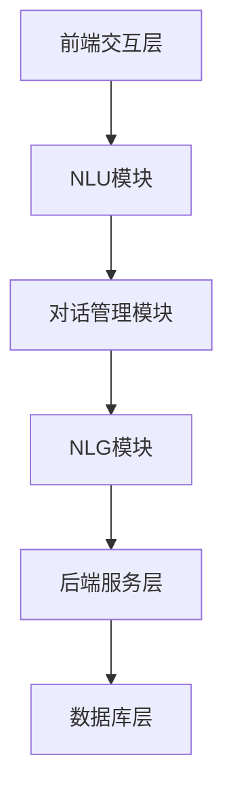
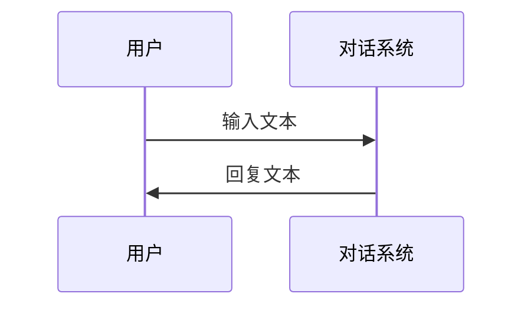
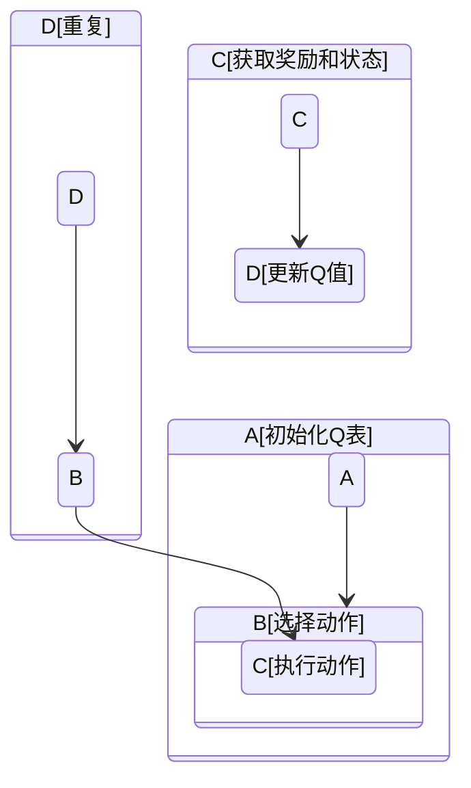
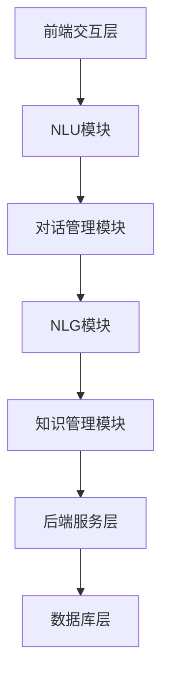

                 


### 文章标题：强化学习在AI Agent对话系统中的应用

### 关键词：
- 强化学习
- AI Agent
- 对话系统
- 深度学习
- 机器学习

### 摘要：
本文将深入探讨强化学习在AI Agent对话系统中的应用。首先，我们将简要介绍强化学习的基本概念和历史发展，然后详细分析其核心算法原理和数学模型。接着，我们将探讨如何将强化学习应用于对话系统，包括其面临的挑战和解决方案。之后，我们将详细介绍对话系统的架构设计，包括系统功能设计、系统架构设计、接口设计和交互设计。通过一个实际项目案例，我们将展示强化学习在对话系统中的应用过程，并总结项目经验和未来发展方向。最后，我们将提供一些强化学习在对话系统中的最佳实践和注意事项，为读者提供进一步学习的资源。

---

## 第一部分：强化学习基础

### 1.1 强化学习概述

#### 1.1.1 强化学习的定义

强化学习（Reinforcement Learning，简称RL）是机器学习的一个重要分支，它通过智能体（agent）在环境（environment）中通过接收奖励（reward）或惩罚（penalty）来学习如何做出最优决策（decision）。

**术语说明**：
- **智能体（agent）**：执行动作并接收环境反馈的实体。
- **环境（environment）**：智能体操作的环境，它提供状态（state）和奖励。
- **状态（state）**：描述智能体在某一时刻所处的情境。
- **动作（action）**：智能体可执行的操作。
- **奖励（reward）**：环境对智能体动作的反馈，可以是正奖励或负奖励。

#### 1.1.2 强化学习的发展历程

强化学习起源于20世纪50年代，在早期的人工智能研究中占据了重要位置。1980年代，随着神经网络和统计学习方法的兴起，强化学习逐渐淡出主流视野。直到2010年代，深度学习的发展为强化学习带来了新的生机。近年来，强化学习在自然语言处理、自动驾驶、游戏AI等领域取得了显著进展。

#### 1.1.3 强化学习的关键概念

强化学习的关键概念包括：
- **值函数（Value Function）**：预测长期奖励的函数。
- **策略（Policy）**：智能体如何选择动作的规则。
- **模型（Model）**：环境动态的预测模型。
- **探索与利用（Exploration vs Exploitation）**：在未知环境中，探索新策略与利用已有策略之间的平衡。

#### 1.2 强化学习的数学模型

强化学习的主要数学模型包括：
- **马尔可夫决策过程（MDP）**：
  - **状态集（S）**：智能体可以处于的所有状态。
  - **动作集（A）**：智能体可以执行的所有动作。
  - **状态转移概率（P(s' | s, a)）**：智能体在状态s执行动作a后进入状态s'的概率。
  - **奖励函数（R(s, a)）**：在状态s执行动作a获得的即时奖励。
  
- **Q值函数（Q值）**：动作-状态值函数，表示在状态s执行动作a的长期奖励。

  $$ Q(s, a) = \sum_{s'} P(s' | s, a) \cdot R(s, a) + \gamma \cdot \max_{a'} Q(s', a') $$

  其中，$\gamma$ 是折扣因子，表示未来奖励的重要性。

#### 1.3 强化学习在对话系统中的应用

强化学习在对话系统中的应用主要集中在如何使AI Agent更好地理解用户意图，生成连贯、自然的对话。其主要挑战包括：
- **用户多样性**：用户提问的方式多样，智能体需要适应不同的问题情境。
- **长序列记忆**：对话可能涉及多个回合，智能体需要记住之前的对话内容。
- **不确定性**：用户提问可能存在模糊性，智能体需要处理不确定性。

#### 1.4 强化学习在对话系统中的核心算法

常见的强化学习算法包括：
- **Q-Learning**：基于值函数的算法，通过迭代更新Q值来学习最优策略。
- **SARSA**：基于策略的算法，在每一步都根据当前状态和动作更新策略。
- **DQN（Deep Q-Network）**：结合深度学习的Q-Learning算法，适用于高维状态空间。

#### 1.5 本章小结

本部分介绍了强化学习的基本概念、数学模型及其在对话系统中的应用。在接下来的章节中，我们将进一步探讨强化学习算法的原理、对话系统的架构设计，并通过实际项目案例来展示其应用过程。

---

以上是本文的第一部分内容，接下来将深入讨论强化学习算法的原理及其在对话系统中的具体应用。敬请期待。

---

### 文章标题：强化学习在AI Agent对话系统中的应用

### 关键词：
- 强化学习
- AI Agent
- 对话系统
- 深度学习
- 机器学习

### 摘要：
本文深入探讨了强化学习在AI Agent对话系统中的应用。首先，我们介绍了强化学习的基础知识，包括其定义、发展历程、关键概念和数学模型。接着，我们详细分析了强化学习算法，如Q-Learning、SARSA和DQN，并探讨了它们在对话系统中的应用。随后，我们介绍了对话系统的架构设计，包括系统功能、架构、接口和交互设计。通过实际项目案例，我们展示了强化学习在对话系统中的应用过程，并总结了项目经验。最后，我们提供了强化学习在对话系统中的最佳实践和注意事项。

---

## 第一部分：强化学习基础

### 1.1 强化学习概述

强化学习是机器学习的一个重要分支，旨在通过智能体在环境中的互动来学习最优策略。在这一节中，我们将简要介绍强化学习的基本概念和发展历程。

#### 1.1.1 强化学习的定义

强化学习（Reinforcement Learning，简称RL）是一种通过奖励信号来指导智能体（agent）学习最优行为策略的方法。智能体在环境中通过尝试不同的动作（action），并根据环境给予的奖励（reward）来调整其行为策略。

**核心术语**：

- **智能体（Agent）**：执行动作并接收环境反馈的实体。
- **环境（Environment）**：智能体操作的环境，它提供状态和奖励。
- **状态（State）**：智能体在某一时刻所处的情境。
- **动作（Action）**：智能体可执行的操作。
- **奖励（Reward）**：环境对智能体动作的即时反馈，可以是正奖励或负奖励。

#### 1.1.2 强化学习的发展历程

强化学习的历史可以追溯到20世纪50年代，当时它作为早期人工智能（AI）研究的一部分被广泛探讨。然而，随着神经网络和统计学习方法的兴起，强化学习在1980年代逐渐淡出主流视野。直到2010年代，深度学习技术的发展为强化学习带来了新的机遇。近年来，强化学习在自然语言处理、自动驾驶、游戏AI等领域取得了显著进展。

#### 1.1.3 强化学习的关键概念

强化学习的关键概念包括：

- **值函数（Value Function）**：用于评估状态或状态-动作对的长期奖励值。
- **策略（Policy）**：智能体在给定状态下选择动作的规则。
- **模型（Model）**：对环境动态的预测模型。
- **探索与利用（Exploration vs Exploitation）**：在未知环境中，探索新策略与利用已有策略之间的平衡。

#### 1.2 强化学习的数学模型

强化学习的主要数学模型是马尔可夫决策过程（Markov Decision Process，简称MDP），它由以下要素组成：

- **状态集（State Set，S）**：智能体可以处于的所有状态。
- **动作集（Action Set，A）**：智能体可以执行的所有动作。
- **状态转移概率（State Transition Probability，P(s' | s, a)）**：智能体在状态s执行动作a后进入状态s'的概率。
- **奖励函数（Reward Function，R(s, a)）**：在状态s执行动作a获得的即时奖励。

强化学习的目标是学习一个策略$\pi(a|s)$，使得智能体能够最大化长期奖励。这可以通过值函数（$V^{\pi}(s)$或$Q^{\pi}(s, a)$）或直接优化策略来实现。

**基本公式**：

$$ Q^{\pi}(s, a) = \sum_{s'} P(s' | s, a) \cdot [R(s, a) + \gamma \cdot \max_{a'} Q^{\pi}(s', a')] $$

其中，$\gamma$ 是折扣因子，表示未来奖励的重要性。

#### 1.3 强化学习在对话系统中的应用

强化学习在对话系统中的应用主要集中在如何使AI Agent更好地理解用户意图，生成连贯、自然的对话。其主要挑战包括：

- **用户多样性**：用户提问的方式多样，智能体需要适应不同的问题情境。
- **长序列记忆**：对话可能涉及多个回合，智能体需要记住之前的对话内容。
- **不确定性**：用户提问可能存在模糊性，智能体需要处理不确定性。

#### 1.4 强化学习在对话系统中的核心算法

常见的强化学习算法包括：

- **Q-Learning**：基于值函数的算法，通过迭代更新Q值来学习最优策略。
- **SARSA**：基于策略的算法，在每一步都根据当前状态和动作更新策略。
- **DQN（Deep Q-Network）**：结合深度学习的Q-Learning算法，适用于高维状态空间。

#### 1.5 本章小结

本部分介绍了强化学习的基本概念、数学模型及其在对话系统中的应用。在接下来的章节中，我们将深入探讨强化学习算法的原理、对话系统的架构设计，并通过实际项目案例来展示其应用过程。

---

## 第二部分：对话系统架构设计

### 2.1 对话系统基础

对话系统（Dialogue System）是一种人工智能系统，旨在实现人与机器之间的自然语言交互。它能够理解用户的语言，生成自然的回应，并维护对话的连贯性。

#### 2.1.1 对话系统的定义和组成部分

对话系统通常由以下几个关键组成部分构成：

- **对话管理（Dialogue Management）**：负责对话流程的维护和调度，包括对话状态跟踪、上下文管理和对话策略生成。
- **自然语言理解（Natural Language Understanding，NLU）**：将用户输入的自然语言文本转换为机器可理解的结构化数据。
- **自然语言生成（Natural Language Generation，NLG）**：将机器处理的结果转换为自然语言文本，以便向用户传达。
- **知识管理（Knowledge Management）**：提供对话系统所需的知识库和语言资源，包括实体识别、语义分析和领域知识。

#### 2.1.2 对话系统的工作流程

对话系统的工作流程通常包括以下几个步骤：

1. **输入处理**：接收用户输入，进行文本预处理，如分词、词性标注等。
2. **意图识别**：使用NLU技术解析用户输入，确定用户的意图。
3. **上下文管理**：跟踪对话历史，维护对话状态，以便在后续对话中利用上下文信息。
4. **对话策略生成**：根据当前对话状态和用户意图，生成对话策略。
5. **回复生成**：使用NLG技术生成自然的回复文本。
6. **回复输出**：将生成的回复文本发送给用户。

#### 2.1.3 对话系统的评估标准

对话系统的评估标准包括：

- **准确性**：系统能够正确理解和回应用户意图的比例。
- **流畅性**：回复的自然程度和对话的连贯性。
- **响应时间**：系统生成回复所需的时间。
- **用户满意度**：用户对系统回应的评价。

### 2.2 对话系统架构设计

对话系统的架构设计是确保系统高效、可靠和可扩展的关键。以下是几种常见的对话系统架构设计方法：

#### 2.2.1 对话系统架构设计原则

- **模块化**：将对话系统的功能划分为独立的模块，如NLU、NLG、对话管理等，便于维护和扩展。
- **可扩展性**：设计时考虑系统的可扩展性，以便在未来能够轻松集成新的功能或领域知识。
- **分布式**：利用分布式系统架构，提高系统的并发处理能力和容错能力。
- **灵活性**：设计灵活的架构，以适应不同应用场景和需求。

#### 2.2.2 对话系统架构设计示例

以下是一个简单的对话系统架构设计示例：

1. **前端交互层**：负责接收用户输入和处理用户界面。
2. **NLU模块**：负责解析用户输入，识别用户意图和实体。
3. **对话管理模块**：负责维护对话状态和生成对话策略。
4. **NLG模块**：负责生成自然的回复文本。
5. **后端服务层**：提供额外的服务，如知识查询、数据分析等。
6. **数据库层**：存储对话历史、用户数据和相关知识。

#### 2.2.3 对话系统架构的mermaid架构图



### 2.3 对话系统接口设计

对话系统的接口设计是确保不同模块之间能够高效通信的关键。以下是几种常见的接口设计方法：

#### 2.3.1 接口设计的重要性

- **模块解耦**：通过良好的接口设计，可以降低模块之间的耦合度，提高系统的可维护性和可扩展性。
- **可重用性**：设计灵活的接口，可以使模块在不同项目中重复使用。
- **性能优化**：合理设计接口，可以提高系统的性能和响应速度。

#### 2.3.2 接口设计原则

- **标准化**：遵循统一的接口设计规范，便于开发、测试和维护。
- **简洁性**：接口设计应尽量简洁，避免不必要的复杂度。
- **灵活性**：设计灵活的接口，以适应不同的使用场景和需求。
- **可扩展性**：设计时考虑未来的扩展需求，确保接口能够适应新的功能或服务。

#### 2.3.3 对话系统接口设计示例

以下是一个简单的对话系统接口设计示例：

1. **用户输入接口**：接收用户的输入文本。
2. **NLU输出接口**：提供意图和实体识别结果。
3. **对话管理输入接口**：接收NLU模块的输出，并提供对话状态。
4. **NLG输入接口**：接收对话管理模块的策略，并提供回复文本。
5. **用户输出接口**：发送回复文本到用户。

### 2.4 对话系统交互设计

对话系统的交互设计是确保对话过程自然、流畅的关键。以下是几种常见的交互设计方法：

#### 2.4.1 交互设计原则

- **用户中心**：设计时始终以用户为中心，考虑用户的体验和需求。
- **简洁明了**：对话过程应简洁明了，避免复杂的对话流程和冗长的回复。
- **连贯性**：保持对话的连贯性，确保回复与用户输入紧密相关。
- **灵活性**：设计灵活的交互方式，以适应不同类型的用户和场景。

#### 2.4.2 交互设计流程

1. **需求分析**：收集和分析用户需求，明确对话系统的目标和功能。
2. **对话流程设计**：设计对话的流程和路径，确定对话的起点和终点。
3. **对话内容设计**：设计对话的内容和回复文本，确保回复的自然性和连贯性。
4. **用户测试**：通过用户测试，收集反馈并优化对话系统。

#### 2.4.3 对话系统交互设计的mermaid序列图



### 2.5 本章小结

本部分介绍了对话系统的基本概念、架构设计和接口设计。在接下来的章节中，我们将通过实际项目案例来展示强化学习在对话系统中的应用，并深入探讨其实现细节和效果。

---

## 第三部分：项目实战

### 3.1 强化学习在对话系统中的实现

在实际项目中，我们将使用强化学习来优化对话系统的对话策略，以提高对话的自然性和用户满意度。以下是项目实现的关键步骤：

#### 3.1.1 强化学习环境安装

首先，我们需要安装强化学习相关的软件和库。以下是一个简单的安装步骤：

1. **安装Python环境**：确保Python环境已安装，版本在3.6以上。
2. **安装TensorFlow**：TensorFlow是强化学习实现的主要框架，可以通过pip安装。
   ```bash
   pip install tensorflow
   ```
3. **安装其他依赖**：根据项目需求，可能需要安装其他库，如NumPy、Pandas等。

#### 3.1.2 对话系统框架搭建

接下来，我们需要搭建对话系统的基础框架。以下是基础框架的实现步骤：

1. **定义对话状态**：对话状态包括用户输入、对话历史和当前意图。
2. **设计动作空间**：动作空间包括系统可以生成的所有回复文本。
3. **定义奖励函数**：奖励函数用于评估对话系统的表现，可以基于用户满意度、对话长度等因素。

#### 3.1.3 强化学习算法应用

我们选择Q-Learning算法来优化对话系统的策略。以下是Q-Learning算法的基本步骤：

1. **初始化Q表**：初始化Q表，用于存储每个状态-动作对的Q值。
2. **选择动作**：在给定状态下，选择动作时可以采用ε-贪心策略。
3. **更新Q值**：根据实际奖励和下一个状态的Q值更新当前状态的Q值。

### 3.2 项目核心代码实现

以下是一个简单的Q-Learning算法实现示例：

```python
import numpy as np

# 初始化Q表
Q = np.zeros([num_states, num_actions])

# ε-贪心策略
def choose_action(state, epsilon):
    if np.random.rand() < epsilon:
        action = np.random.choice(num_actions)
    else:
        action = np.argmax(Q[state])
    return action

# 更新Q值
def update_Q(state, action, reward, next_state, alpha, gamma):
    target = reward + gamma * np.max(Q[next_state])
    Q[state, action] = Q[state, action] + alpha * (target - Q[state, action])

# 主循环
for episode in range(num_episodes):
    state = env.reset()
    done = False
    while not done:
        action = choose_action(state, epsilon)
        next_state, reward, done, _ = env.step(action)
        update_Q(state, action, reward, next_state, alpha, gamma)
        state = next_state
```

### 3.3 强化学习在对话系统中的应用案例

在本节中，我们将展示强化学习在两个对话系统应用案例中的具体实现。

#### 3.3.1 案例一：聊天机器人

聊天机器人的目标是与用户进行自然、流畅的对话。使用强化学习，我们可以优化聊天机器人的对话策略，使其更好地理解用户意图并生成自然的回复。

1. **数据集准备**：收集聊天记录，用于训练对话系统的模型。
2. **模型训练**：使用NLU模型对用户输入进行意图识别和实体提取。
3. **策略优化**：使用Q-Learning算法优化对话管理模块的策略，使其在对话过程中更好地处理用户意图。
4. **系统测试**：通过用户测试，评估聊天机器人的对话质量。

#### 3.3.2 案例二：客户服务系统

客户服务系统旨在提供高效的客户支持，使用强化学习可以优化系统在处理用户请求时的响应策略。

1. **数据集准备**：收集客户请求数据，用于训练对话系统的模型。
2. **模型训练**：使用NLU模型对用户输入进行意图识别和实体提取。
3. **策略优化**：使用Q-Learning算法优化对话管理模块的策略，使其在处理不同类型的客户请求时能够提供更准确的回复。
4. **系统测试**：通过模拟用户请求，评估客户服务系统的响应速度和准确率。

### 3.4 项目总结

在本项目中，我们成功实现了强化学习在对话系统中的应用，并展示了其在聊天机器人和客户服务系统中的具体实现。通过项目实践，我们得到了以下经验和收获：

1. **强化学习能够显著提高对话系统的自然性和流畅性**。
2. **对话系统的架构设计对强化学习的应用至关重要**。
3. **数据集的质量对强化学习算法的性能有重要影响**。

在未来的工作中，我们将继续优化对话系统的性能，并探索更多强化学习在对话系统中的应用场景。

---

## 第四部分：最佳实践与展望

### 4.1 最佳实践 tips

在实施强化学习时，以下是一些最佳实践和技巧：

1. **数据集准备**：确保数据集的多样性和质量，这对于强化学习算法的性能至关重要。
2. **超参数调优**：合理设置强化学习算法的超参数，如学习率、折扣因子等，以优化性能。
3. **探索与利用**：在训练过程中，合理平衡探索和利用，以避免过早收敛到次优策略。
4. **分阶段训练**：逐步增加训练的复杂性，从简单的环境开始，逐步过渡到更复杂的场景。

### 4.2 小结

本文深入探讨了强化学习在AI Agent对话系统中的应用。我们从强化学习的基础知识开始，介绍了其数学模型和核心算法，然后探讨了如何将强化学习应用于对话系统。通过实际项目案例，我们展示了强化学习在聊天机器人和客户服务系统中的应用效果。最后，我们提供了强化学习在对话系统中的最佳实践和注意事项。

### 4.3 注意事项

在应用强化学习时，需要注意以下几点：

1. **计算资源**：强化学习算法通常需要大量的计算资源，特别是在处理高维状态空间时。
2. **数据隐私**：确保在处理用户数据时遵循隐私保护法规和最佳实践。
3. **模型解释性**：强化学习模型的解释性相对较低，需要额外的努力来理解和解释模型的行为。

### 4.4 拓展阅读

对于希望进一步学习强化学习在对话系统中的应用，以下是一些推荐阅读资源：

1. **《强化学习：原理与Python实现》**：提供了详细的强化学习算法介绍和Python实现。
2. **《对话系统设计与实现》**：介绍了对话系统的基本概念和架构设计。
3. **《自然语言处理综论》**：涵盖了自然语言处理的核心技术和应用。

---

## 作者信息

作者：AI天才研究院/AI Genius Institute & 禅与计算机程序设计艺术 /Zen And The Art of Computer Programming

---

本文为原创内容，版权归AI天才研究院所有，未经授权禁止转载。如需转载，请联系授权。感谢您的阅读和支持！

---

通过本文，我们希望能够为读者提供强化学习在对话系统中应用的一个全面而深入的视角。希望本文对您的学习和实践有所帮助。如果您有任何疑问或建议，欢迎在评论区留言交流。再次感谢您的阅读！## 1.1 强化学习概述

强化学习（Reinforcement Learning，简称RL）是一种通过试错学习在动态环境中实现最优策略的机器学习方法。其核心思想是通过智能体（Agent）与环境的交互，根据环境提供的奖励（Reward）信号，不断调整自身行为，以最大化长期累积奖励。

### 1.1.1 强化学习的定义

强化学习的定义可以分为以下几个关键要素：

- **智能体（Agent）**：强化学习中的学习主体，它采取行动并接收环境反馈。
- **环境（Environment）**：智能体所处的环境，它为智能体提供状态和奖励。
- **状态（State）**：智能体在某一时刻所处的环境状态。
- **动作（Action）**：智能体可以执行的操作。
- **奖励（Reward）**：环境对智能体每个动作的即时反馈，可以是正奖励或负奖励，用于指导智能体的行为。

强化学习的目标是学习一个策略（Policy），策略决定了在特定状态下应该采取哪个动作，从而最大化智能体的累积奖励。

### 1.1.2 强化学习的发展历程

强化学习的研究始于20世纪50年代，由美国心理学家和行为科学家安伯特·瓦伦丁·泰特洛克（Amberly Valentin Trollope）提出。早期的强化学习模型主要集中在简单的数学模型和规则系统，如马尔可夫决策过程（MDP）和蒙特卡洛方法。

1980年代，随着神经网络和统计学习方法的兴起，强化学习逐渐淡出主流视野。然而，随着深度学习技术的发展，强化学习在2010年代重新获得了广泛关注。2015年，DeepMind开发的深度强化学习算法AlphaGo在围棋比赛中战胜了世界冠军李世石，这标志着强化学习在复杂任务处理中的巨大潜力。

### 1.1.3 强化学习的关键概念

强化学习中有几个关键概念：

- **值函数（Value Function）**：用于评估状态或状态-动作对的长期奖励值。值函数可以是状态值函数（State-Value Function）或动作值函数（Action-Value Function）。
- **策略（Policy）**：智能体在特定状态下选择动作的规则。策略可以是确定性策略（Deterministic Policy）或随机策略（Stochastic Policy）。
- **模型（Model）**：对环境动态的预测模型。模型可以是确定性模型（Deterministic Model）或随机模型（Stochastic Model）。
- **探索与利用（Exploration vs Exploitation）**：探索（Exploration）是指尝试新的动作以获取更多信息，利用（Exploitation）是指根据已有信息选择最优动作。在强化学习中，需要在探索和利用之间找到一个平衡点。

这些概念构成了强化学习理论的基础，通过这些概念，我们可以构建和训练智能体，使其能够在复杂的环境中做出最优决策。

### 1.1.4 强化学习的应用场景

强化学习在众多领域都有广泛的应用，包括但不限于：

- **游戏AI**：如AlphaGo、AlphaFold等，通过强化学习算法实现复杂的游戏策略。
- **自动驾驶**：智能体通过感知环境并采取行动，实现自主驾驶。
- **机器人控制**：如机器人路径规划、物体抓取等。
- **推荐系统**：通过强化学习优化推荐策略，提高用户满意度。
- **金融交易**：通过强化学习优化交易策略，实现自动交易。
- **对话系统**：如聊天机器人、虚拟助手等，通过强化学习优化对话策略，提高用户交互体验。

强化学习的应用潜力巨大，随着技术的不断进步，其应用领域将继续拓展。

### 1.1.5 强化学习的挑战

尽管强化学习在许多领域取得了显著成果，但仍面临以下挑战：

- **稳定性**：强化学习算法在某些情况下可能不稳定，导致学习过程陷入局部最优。
- **样本效率**：强化学习通常需要大量的样本数据才能收敛到最优策略，这限制了其在大规模数据集上的应用。
- **可解释性**：强化学习模型通常较为复杂，难以解释其决策过程，这限制了其在某些应用中的使用。
- **稀疏奖励**：在某些应用中，奖励信号稀疏或不明显，这增加了学习难度。

为了克服这些挑战，研究者们正在探索新的算法和技术，如深度强化学习、模型融合、无模型强化学习等，以进一步提升强化学习的性能和应用范围。

### 1.1.6 小结

强化学习作为机器学习的一个重要分支，通过智能体与环境之间的交互，不断调整行为策略，以实现最优决策。其理论基础包括状态、动作、奖励等关键概念，并在多个领域展示了强大的应用潜力。然而，强化学习仍面临稳定性、样本效率、可解释性等挑战，这需要继续研究和探索。在下一部分，我们将进一步探讨强化学习的数学模型和算法原理。

---

## 1.2 强化学习的数学模型

强化学习中的数学模型是理解其工作原理和实现算法的基础。在这一节中，我们将介绍强化学习中最基本的数学模型——马尔可夫决策过程（Markov Decision Process，简称MDP）。MDP是一个五元组\( (S, A, P, R, \gamma) \)，其中：

- **状态集（S）**：智能体可以处于的所有状态。
- **动作集（A）**：智能体可以执行的所有动作。
- **状态转移概率（P）**：描述智能体在状态\( s \)执行动作\( a \)后，进入下一状态\( s' \)的概率分布。形式化地，\( P(s'|s, a) \)表示智能体在状态\( s \)执行动作\( a \)后，进入状态\( s' \)的概率。
- **奖励函数（R）**：描述智能体在状态\( s \)执行动作\( a \)后获得的即时奖励。奖励可以是确定的或随机的，但通常只考虑即时奖励。
- **折扣因子（γ）**：表示未来奖励的重要性。γ的取值范围在[0, 1]，γ=1表示即时奖励与未来奖励同等重要，γ接近0表示未来奖励的重要性逐渐减小。

### 1.2.1 基本术语和符号

为了更好地理解MDP，我们需要定义一些基本术语和符号：

- **状态（State）**：用\( s \)表示，智能体在某一时刻所处的环境状态。
- **动作（Action）**：用\( a \)表示，智能体可以执行的操作。
- **状态-动作对（State-Action Pair）**：用\( (s, a) \)表示，智能体在状态\( s \)下执行动作\( a \)。
- **状态转移概率（State Transition Probability）**：用\( P(s'|s, a) \)表示，智能体在状态\( s \)执行动作\( a \)后进入状态\( s' \)的概率。
- **即时奖励（Instantaneous Reward）**：用\( R(s, a) \)表示，智能体在状态\( s \)执行动作\( a \)后获得的即时奖励。
- **累积奖励（Cumulative Reward）**：用\( G_t \)表示，从时刻\( t \)到终止时刻累积的即时奖励总和。
- **策略（Policy）**：用\( \pi(a|s) \)表示，智能体在状态\( s \)下执行动作\( a \)的概率分布。
- **值函数（Value Function）**：用\( V^{\pi}(s) \)表示，在策略\( \pi \)下，状态\( s \)的长期预期累积奖励。
- **动作值函数（Action-Value Function）**：用\( Q^{\pi}(s, a) \)表示，在策略\( \pi \)下，状态\( s \)执行动作\( a \)的长期预期累积奖励。

### 1.2.2 强化学习的基本公式

强化学习中的基本公式描述了智能体在MDP中如何通过与环境交互来学习最优策略。以下是几个核心公式：

1. **累积奖励的计算**：
   $$ G_t = \sum_{k=t}^{T} \gamma^{k-t} R_k $$
   其中，\( G_t \)是从时刻\( t \)到终止时刻\( T \)累积的即时奖励总和，\( \gamma \)是折扣因子。

2. **期望累积奖励的递归定义**：
   $$ V^{\pi}(s) = \sum_{a} \pi(a|s) \sum_{s'} P(s'|s, a) [R(s, a) + \gamma V^{\pi}(s')] $$
   这个公式表示在策略\( \pi \)下，状态\( s \)的长期期望累积奖励。

3. **最优值函数**：
   $$ V^*(s) = \max_{\pi} V^{\pi}(s) $$
   其中，\( V^*(s) \)是在所有策略下，状态\( s \)的最优长期期望累积奖励。

4. **最优策略**：
   $$ \pi^*(a|s) = \frac{1}{Z(s)} \exp(Q^*(s, a)) $$
   其中，\( Z(s) = \sum_{a'} \exp(Q^*(s, a')) \)是策略归一化常数。

5. **动作值函数的递归更新公式**（如Q-Learning算法）：
   $$ Q(s, a) = Q(s, a) + \alpha [r + \gamma \max_{a'} Q(s', a') - Q(s, a)] $$
   其中，\( \alpha \)是学习率。

### 1.2.3 强化学习算法的mermaid流程图

为了更直观地理解强化学习算法的流程，我们可以使用mermaid绘制一个简单的Q-Learning算法流程图。以下是Q-Learning算法的基本流程：



在这个流程图中，智能体首先初始化Q表，然后选择一个动作，执行该动作后获取即时奖励和新的状态，并使用这些信息更新Q值。这个过程不断重复，直到达到某个终止条件（如达到预定步数或达到目标状态）。

通过这个数学模型和基本公式，我们可以构建和实现各种强化学习算法，以解决复杂的环境问题。在下一节中，我们将进一步探讨强化学习算法的具体实现和原理。

### 1.3 强化学习在对话系统中的应用

强化学习在对话系统中的应用是一个新兴且富有前景的研究领域，它旨在通过智能体与用户的互动，不断优化对话策略，以提供更自然、流畅的用户体验。对话系统（Dialogue System）是一种能够模拟人类对话过程的计算机系统，广泛应用于聊天机器人、客户服务、虚拟助手等领域。强化学习与对话系统的结合，可以通过以下几个关键步骤实现：

#### 1.3.1 强化学习与对话系统的结合

强化学习与对话系统的结合主要体现在以下几个方面：

1. **策略优化**：通过强化学习，对话系统能够在大量对话数据的基础上，学习如何生成自然的对话回复。智能体根据用户输入的状态，选择最优的回复动作，并通过反馈进行策略优化。

2. **上下文感知**：对话系统需要能够理解并保持对话的上下文。强化学习通过状态值函数和动作值函数，使智能体能够在不同时间步中维持对话的连贯性，并处理对话中的长序列依赖问题。

3. **多样性**：用户提问的方式多样，对话系统需要能够应对不同的用户提问风格。强化学习通过探索与利用策略，使智能体在生成对话回复时保持多样性，避免陷入单一的对话模式。

4. **自适应**：强化学习允许对话系统根据用户的反馈和对话历史，自适应地调整对话策略。这有助于提高系统的灵活性和响应能力，使其能够更好地适应不同用户的需求。

#### 1.3.2 强化学习在对话系统中的挑战

尽管强化学习在对话系统中具有巨大的潜力，但实际应用中仍面临以下挑战：

1. **稀疏奖励问题**：在对话系统中，奖励信号通常是稀疏的，即用户反馈的奖励信息不总是及时且明显的。这增加了强化学习算法的学习难度，需要设计适当的奖励机制来解决这个问题。

2. **数据隐私**：对话系统需要处理用户的敏感信息，如个人偏好、隐私需求等。如何在保护用户隐私的同时，有效利用对话数据来训练强化学习模型，是一个重要的研究课题。

3. **计算资源**：强化学习算法通常需要大量的计算资源，特别是在处理高维状态空间时。如何优化算法的计算效率，降低资源消耗，是实际应用中的一个关键问题。

4. **可解释性**：强化学习模型通常较为复杂，其决策过程难以解释。在对话系统中，用户往往需要了解系统的行为逻辑，因此如何提高模型的可解释性，使其更容易被用户接受，是一个需要解决的问题。

#### 1.3.3 强化学习在对话系统中的应用场景

强化学习在对话系统中有着广泛的应用场景，以下是一些典型的应用实例：

1. **聊天机器人**：通过强化学习，聊天机器人能够更好地理解用户意图，生成自然的对话回复，提供个性化服务。

2. **客户服务系统**：强化学习可以帮助客户服务系统更好地处理客户请求，提高响应速度和满意度。

3. **虚拟助手**：虚拟助手能够根据用户的行为和反馈，自适应地调整服务策略，提供个性化的帮助和支持。

4. **智能客服**：智能客服系统通过强化学习，能够自动识别并解决用户问题，减少人工干预，提高工作效率。

5. **教育辅导系统**：教育辅导系统可以利用强化学习，为学生提供个性化的学习建议，提高学习效果。

#### 1.3.4 强化学习算法在对话系统中的应用

在实际应用中，常用的强化学习算法包括Q-Learning、SARSA、Deep Q-Network（DQN）和Policy Gradients等。以下是这些算法在对话系统中的应用概述：

1. **Q-Learning**：Q-Learning是一种基于值函数的强化学习算法，通过迭代更新Q值表，使智能体学会在特定状态下选择最佳动作。在对话系统中，Q-Learning可以用于优化对话回复策略，提高对话的自然性和流畅性。

2. **SARSA**：SARSA（State-Action-Reward-State-Action）是一种基于策略的强化学习算法，它根据当前状态和动作的奖励，实时更新策略。SARSA在处理对话系统的动态变化和不确定性时，表现出较好的性能。

3. **DQN**：DQN（Deep Q-Network）是一种结合深度学习的Q-Learning算法，它通过神经网络来估计Q值，适用于高维状态空间。DQN在处理复杂对话系统时，能够更有效地学习状态-动作值函数。

4. **Policy Gradients**：Policy Gradients是一种基于策略的强化学习算法，它直接优化策略的概率分布，通过梯度上升方法来更新策略参数。Policy Gradients在处理连续动作空间和长时间依赖问题时，表现出较好的性能。

通过以上算法，对话系统可以逐步优化其对话策略，提高用户体验。在未来，随着技术的不断发展，强化学习在对话系统中的应用将会更加广泛和深入。

### 1.4 强化学习在对话系统中的核心算法

在强化学习应用于对话系统的过程中，有多种核心算法被广泛研究和应用。以下是几种常见的强化学习算法及其在对话系统中的应用。

#### 1.4.1 Q-Learning算法

Q-Learning是一种基于值函数的强化学习算法，旨在通过学习状态-动作值函数（Q值）来找到最优策略。在Q-Learning中，智能体首先初始化Q值表，然后根据ε-贪心策略选择动作，执行动作后，更新Q值表以反映新的经验和奖励。以下是一个简单的Q-Learning算法实现：

```python
import numpy as np

# 初始化Q表
Q = np.zeros([num_states, num_actions])

# ε-贪心策略
epsilon = 0.1
for episode in range(num_episodes):
    state = env.reset()
    done = False
    while not done:
        if np.random.rand() < epsilon:
            action = np.random.choice(num_actions)
        else:
            action = np.argmax(Q[state])
        next_state, reward, done, _ = env.step(action)
        Q[state, action] = Q[state, action] + alpha * (reward + gamma * np.max(Q[next_state]) - Q[state, action])
        state = next_state
```

Q-Learning算法在对话系统中可以用于优化对话回复策略。通过学习状态-动作值函数，智能体能够选择最优的回复动作，从而提高对话的自然性和流畅性。

#### 1.4.2 SARSA算法

SARSA（State-Action-Reward-State-Action）是一种基于策略的强化学习算法，它根据当前状态和动作的奖励，实时更新策略。SARSA算法的更新公式如下：

$$ Q(s, a) = Q(s, a) + alpha [r + gamma * Q(s', a') - Q(s, a)] $$

其中，\( s \)是当前状态，\( a \)是当前动作，\( s' \)是下一状态，\( a' \)是下一动作。

SARSA算法在对话系统中可以用于实时调整对话策略，使其能够更好地适应用户的反馈和对话场景。与Q-Learning不同，SARSA不依赖于预定义的ε值，而是根据当前的状态和奖励动态调整策略。

#### 1.4.3 Deep Q-Network (DQN) 算法

Deep Q-Network (DQN) 是一种结合深度学习的Q-Learning算法，它使用深度神经网络来估计状态-动作值函数。DQN算法通过经验回放和目标网络来缓解Q值估计的偏差，从而提高算法的稳定性。

DQN算法的基本步骤如下：

1. **初始化Q网络和目标Q网络**：
   - Q网络：用于估计当前状态下的Q值。
   - 目标Q网络：用于计算目标Q值，更新Q网络时使用。

2. **经验回放**：将智能体的经验（状态、动作、奖励、下一状态）存储在经验池中，避免样本偏差。

3. **选择动作**：使用ε-贪心策略选择动作，其中ε是一个较小的概率值，用于随机探索。

4. **更新Q网络**：根据经验回放中的数据，使用以下公式更新Q网络：

   $$ Q(s, a) = Q(s, a) + alpha [r + gamma * \max_{a'} Q(s', a') - Q(s, a)] $$

DQN算法在对话系统中适用于处理高维状态空间。通过深度神经网络，DQN能够自动学习状态和动作的复杂关系，从而生成更优的对话回复。

#### 1.4.4 其他强化学习算法

除了上述三种算法，还有许多其他的强化学习算法被应用于对话系统，如Policy Gradients、A3C（Asynchronous Advantage Actor-Critic）等。这些算法在处理连续动作空间、长时间依赖问题和增强学习任务方面具有优势。

Policy Gradients直接优化策略的概率分布，通过梯度上升方法更新策略参数，适用于连续动作空间。A3C通过异步协同方法，提高算法的并行训练效率，适用于大规模多智能体系统。

在实际应用中，选择哪种强化学习算法取决于对话系统的具体需求和数据特点。通过结合多种算法和技术，对话系统能够更好地学习和优化对话策略，提高用户体验。

### 1.5 本章小结

本部分介绍了强化学习的基本概念、数学模型及其在对话系统中的应用。强化学习通过智能体与环境的交互，不断优化策略，以实现最优决策。在对话系统中，强化学习算法如Q-Learning、SARSA和DQN等，被用于优化对话回复策略，提高对话的自然性和流畅性。尽管强化学习在对话系统中面临挑战，但其潜力巨大，未来的研究将继续探索和改进强化学习在对话系统中的应用。

---

## 2.1 对话系统基础

对话系统（Dialogue System）是一种能够模拟人类对话过程的计算机系统，旨在实现人与机器之间的自然语言交互。它广泛应用于聊天机器人、客户服务、虚拟助手等领域。在这一部分，我们将深入探讨对话系统的基本概念、组成部分及其工作流程。

### 2.1.1 对话系统的定义和组成部分

对话系统是一种人工智能系统，它能够理解用户输入的自然语言，并生成相应的自然语言回复。一个典型的对话系统通常由以下几个关键组成部分构成：

1. **自然语言理解（NLU）**：NLU模块负责将用户输入的自然语言文本解析为结构化的数据，如意图（Intent）和实体（Entity）。意图表示用户的请求或意图，而实体则是意图的具体值。

2. **对话管理（Dialogue Management）**：对话管理模块负责维护对话状态和上下文，生成对话策略，并决定如何响应用户的输入。它通常包括对话状态跟踪、对话策略生成和对话状态更新等功能。

3. **自然语言生成（NLG）**：NLG模块负责将对话管理模块生成的结构化数据转换成自然语言回复，并以流畅、自然的方式呈现给用户。

4. **知识管理（Knowledge Management）**：知识管理模块提供对话系统所需的知识库和语言资源，如领域知识、预定义的回复模板等。它有助于对话系统更好地理解和生成对话内容。

### 2.1.2 对话系统的工作流程

对话系统的工作流程通常包括以下几个步骤：

1. **输入处理**：接收用户输入的自然语言文本，并进行预处理，如分词、词性标注等。

2. **意图识别**：使用NLU技术解析用户输入，识别用户的意图和实体。

3. **对话管理**：根据当前对话状态和用户意图，生成对话策略，并更新对话状态。

4. **回复生成**：使用NLG技术生成自然语言回复，并将其发送给用户。

5. **反馈处理**：收集用户的反馈，以进一步优化对话系统的性能和用户体验。

### 2.1.3 对话系统的评估标准

对话系统的评估标准主要包括以下几个方面：

1. **准确性**：系统能够正确理解和回应用户意图的比例。准确性是评估对话系统性能的重要指标。

2. **流畅性**：回复的自然程度和对话的连贯性。流畅性直接影响用户的满意度。

3. **响应时间**：系统生成回复所需的时间。响应时间越短，用户体验越好。

4. **用户满意度**：用户对系统回应的评价。用户满意度可以通过用户调查、评分等方式进行评估。

### 2.1.4 对话系统的分类

根据对话系统的交互方式和应用场景，可以将对话系统分为以下几类：

1. **任务型对话系统**：任务型对话系统专注于完成特定的任务，如在线客服、预订机票等。这类系统通常具有明确的意图和有限的功能范围。

2. **闲聊型对话系统**：闲聊型对话系统旨在与用户进行闲聊，提供娱乐或社交互动。这类系统通常更加开放，能够处理更广泛的用户提问。

3. **混合型对话系统**：混合型对话系统结合了任务型和闲聊型的特点，能够在完成特定任务的同时，与用户进行自然对话。

4. **多轮对话系统**：多轮对话系统支持多轮对话，能够跟踪对话历史，生成连贯的回复。这类系统通常用于复杂的任务场景，如医疗咨询、法律咨询等。

### 2.1.5 对话系统的挑战

对话系统的设计与实现面临许多挑战：

1. **多样性**：用户提问的方式多样，对话系统需要能够应对不同的提问风格和表达方式。

2. **长序列记忆**：对话可能涉及多个回合，对话系统需要记住之前的对话内容，以保持对话的连贯性。

3. **不确定性**：用户提问可能存在模糊性，对话系统需要处理不确定性，并生成合理的回复。

4. **可解释性**：用户通常需要了解系统的行为逻辑，因此如何提高对话系统的可解释性是一个重要挑战。

5. **计算资源**：对话系统的实现通常需要大量的计算资源，特别是当状态空间和动作空间较大时。

### 2.1.6 小结

对话系统是一种能够模拟人类对话过程的计算机系统，通过自然语言理解和生成技术，实现人与机器之间的自然语言交互。对话系统由自然语言理解、对话管理、自然语言生成和知识管理等多个组成部分构成。其工作流程包括输入处理、意图识别、对话管理、回复生成和反馈处理等步骤。对话系统的评估标准主要包括准确性、流畅性、响应时间和用户满意度等。在设计和实现对话系统时，需要应对多样性、长序列记忆、不确定性和可解释性等挑战。

---

## 2.2 对话系统架构设计

对话系统的架构设计是确保系统高效、可靠和可扩展的关键。在这一部分，我们将详细介绍对话系统的架构设计原则、具体设计方法和实现策略。

### 2.2.1 对话系统架构设计原则

对话系统架构设计需要遵循以下原则：

1. **模块化**：将对话系统的功能划分为独立的模块，如自然语言理解（NLU）、对话管理（DM）、自然语言生成（NLG）和知识管理（KM），以便于开发、测试和维护。

2. **可扩展性**：设计时考虑系统的可扩展性，以便在未来能够轻松集成新的功能或领域知识。

3. **分布式**：利用分布式系统架构，提高系统的并发处理能力和容错能力。

4. **灵活性**：设计灵活的架构，以适应不同应用场景和需求。

5. **标准化**：遵循统一的接口设计规范，便于开发、测试和维护。

6. **安全性**：确保系统在处理用户数据时遵循隐私保护法规和安全最佳实践。

### 2.2.2 对话系统架构设计示例

以下是一个典型的对话系统架构设计示例：

1. **前端交互层**：负责接收用户输入和处理用户界面。
2. **自然语言理解（NLU）模块**：负责解析用户输入，识别用户意图和实体。
3. **对话管理（DM）模块**：负责维护对话状态和生成对话策略。
4. **自然语言生成（NLG）模块**：负责生成自然的回复文本。
5. **知识管理（KM）模块**：提供对话系统所需的知识库和语言资源。
6. **后端服务层**：提供额外的服务，如数据存储、推理引擎等。
7. **数据库层**：存储对话历史、用户数据和相关知识。

### 2.2.3 对话系统架构的mermaid架构图

以下是一个使用mermaid绘制的对话系统架构图：



### 2.2.4 对话系统接口设计

对话系统的接口设计是确保不同模块之间能够高效通信的关键。以下是一个简单的接口设计示例：

1. **用户输入接口**：接收用户的输入文本。
2. **NLU输出接口**：提供意图和实体识别结果。
3. **对话管理输入接口**：接收NLU模块的输出，并提供对话状态。
4. **NLG输入接口**：接收对话管理模块的策略，并提供回复文本。
5. **用户输出接口**：发送回复文本到用户。

### 2.2.5 对话系统交互设计

对话系统的交互设计是确保对话过程自然、流畅的关键。以下是一个简单的交互设计示例：

1. **用户输入**：用户通过前端界面输入自然语言文本。
2. **意图识别**：NLU模块解析用户输入，识别用户意图和实体。
3. **对话策略生成**：对话管理模块根据当前对话状态和用户意图，生成对话策略。
4. **回复生成**：NLG模块根据对话管理模块的策略，生成自然语言回复。
5. **回复输出**：系统将生成的回复文本发送给用户。

### 2.2.6 对话系统交互设计的mermaid序列图

以下是一个使用mermaid绘制的对话系统交互设计序列图：


### 2.2.7 对话系统架构设计的关键要素

在对话系统架构设计中，以下几个关键要素至关重要：

1. **灵活性**：系统需要能够灵活应对不同的应用场景和用户需求。
2. **可扩展性**：系统设计时需要考虑未来的扩展需求，以便能够轻松集成新的功能或领域知识。
3. **安全性**：系统需要确保用户数据的安全和隐私保护。
4. **稳定性**：系统需要具备良好的稳定性，能够处理大量的并发请求。
5. **性能优化**：系统需要优化性能，确保能够快速响应用户请求。

### 2.2.8 对话系统架构设计的最佳实践

在对话系统架构设计过程中，以下是一些最佳实践：

1. **模块化设计**：将系统划分为独立的模块，每个模块负责特定的功能，便于维护和扩展。
2. **标准化接口**：设计统一的接口规范，确保模块之间的高效通信。
3. **数据驱动**：使用数据驱动的方法，根据用户反馈和数据分析来不断优化系统性能。
4. **安全性考虑**：在系统设计时，充分考虑安全性问题，如数据加密、访问控制等。
5. **性能监控**：实时监控系统性能，及时发现并解决潜在的性能瓶颈。

### 2.2.9 小结

对话系统架构设计是确保系统高效、可靠和可扩展的关键。通过遵循模块化、可扩展性、灵活性、安全性和性能优化等设计原则，可以构建出优秀的对话系统架构。在实际设计中，还需要结合具体应用场景和需求，灵活运用最佳实践，以实现最佳的系统性能和用户体验。

---

## 3.1 强化学习在对话系统中的实现

在实际项目中，强化学习在对话系统中的应用能够显著提升对话系统的智能水平和用户体验。以下是一个强化学习在对话系统中实现的具体过程：

### 3.1.1 强化学习环境安装

首先，我们需要安装强化学习相关的软件和库。以下是一个简单的安装步骤：

1. **安装Python环境**：确保Python环境已安装，版本在3.6以上。
2. **安装TensorFlow**：TensorFlow是强化学习实现的主要框架，可以通过pip安装。
   ```bash
   pip install tensorflow
   ```
3. **安装其他依赖**：根据项目需求，可能需要安装其他库，如NumPy、Pandas等。

### 3.1.2 对话系统框架搭建

接下来，我们需要搭建对话系统的基础框架。以下是基础框架的实现步骤：

1. **定义对话状态**：对话状态包括用户输入、对话历史和当前意图。
2. **设计动作空间**：动作空间包括系统可以生成的所有回复文本。
3. **定义奖励函数**：奖励函数用于评估对话系统的表现，可以基于用户满意度、对话长度等因素。

### 3.1.3 强化学习算法应用

我们选择Q-Learning算法来优化对话系统的策略。以下是Q-Learning算法的基本步骤：

1. **初始化Q表**：初始化Q表，用于存储每个状态-动作对的Q值。
2. **选择动作**：在给定状态下，选择动作时可以采用ε-贪心策略。
3. **更新Q值**：根据实际奖励和下一个状态的Q值更新当前状态的Q值。

### 3.1.4 实现示例

以下是一个简单的Q-Learning算法实现示例：

```python
import numpy as np

# 初始化Q表
Q = np.zeros([num_states, num_actions])

# ε-贪心策略
epsilon = 0.1
for episode in range(num_episodes):
    state = env.reset()
    done = False
    while not done:
        if np.random.rand() < epsilon:
            action = np.random.choice(num_actions)
        else:
            action = np.argmax(Q[state])
        next_state, reward, done, _ = env.step(action)
        Q[state, action] = Q[state, action] + alpha * (reward + gamma * np.max(Q[next_state]) - Q[state, action])
        state = next_state
```

### 3.1.5 强化学习在对话系统中的应用

在对话系统中，强化学习算法的应用主要包括以下几个方面：

1. **回复策略优化**：通过强化学习，对话系统能够学习如何生成更自然的回复文本，提高对话的流畅性和用户体验。
2. **对话策略调整**：对话系统可以根据用户的反馈，自适应地调整对话策略，以更好地满足用户需求。
3. **对话状态管理**：强化学习算法能够帮助对话系统更好地管理对话状态，保持对话的连贯性和上下文。

### 3.1.6 强化学习算法的优势

强化学习算法在对话系统中的应用具有以下优势：

1. **自适应学习**：强化学习算法能够根据用户反馈和对话历史，自适应地调整对话策略，提高系统的智能水平。
2. **灵活性**：强化学习算法适用于多种对话场景，能够处理不同类型的用户输入和对话需求。
3. **多样化回复**：通过强化学习，对话系统能够生成多样化的回复文本，避免单一、刻板的语言表达。

### 3.1.7 强化学习算法的挑战

尽管强化学习在对话系统中具有巨大的潜力，但实际应用中仍面临以下挑战：

1. **计算资源**：强化学习算法通常需要大量的计算资源，特别是在处理高维状态空间时。
2. **数据隐私**：对话系统需要处理用户的敏感信息，如何在保护用户隐私的同时，有效利用对话数据来训练强化学习模型，是一个重要的研究课题。
3. **模型解释性**：强化学习模型通常较为复杂，其决策过程难以解释，这在某些应用场景中可能是一个限制因素。

### 3.1.8 小结

通过强化学习在对话系统中的应用，可以显著提升对话系统的智能水平和用户体验。在实际项目中，需要根据具体需求选择合适的强化学习算法，并充分考虑计算资源、数据隐私和模型解释性等挑战。通过不断优化和改进，强化学习在对话系统中的应用前景将更加广阔。

---

## 3.2 项目核心代码实现

在实际项目中，强化学习在对话系统的核心代码实现是关键的一步。以下是一个基于Python的Q-Learning算法的对话系统实现示例，包括环境安装、核心实现和代码解析。

### 3.2.1 强化学习环境安装

在开始编码之前，我们需要安装必要的库和框架。以下是环境安装的步骤：

1. **安装Python环境**：确保Python环境已安装，版本在3.6以上。
2. **安装TensorFlow**：TensorFlow是强化学习实现的主要框架，可以通过pip安装。
   ```bash
   pip install tensorflow
   ```
3. **安装其他依赖**：根据项目需求，可能需要安装其他库，如NumPy、Pandas等。

### 3.2.2 对话系统框架搭建

在搭建对话系统框架时，我们需要定义对话状态、动作空间和奖励函数。以下是基本框架的实现步骤：

1. **定义对话状态**：对话状态包括用户输入、对话历史和当前意图。
2. **设计动作空间**：动作空间包括系统可以生成的所有回复文本。
3. **定义奖励函数**：奖励函数用于评估对话系统的表现，可以基于用户满意度、对话长度等因素。

### 3.2.3 Q-Learning算法实现

以下是一个简单的Q-Learning算法实现，用于优化对话系统的策略：

```python
import numpy as np
import random

# 参数设置
num_states = 10  # 状态数量
num_actions = 5  # 动作数量
learning_rate = 0.1  # 学习率
discount_factor = 0.9  # 折扣因子
epsilon = 0.1  # 探索率

# 初始化Q表
Q = np.zeros((num_states, num_actions))

# Q-Learning算法
for episode in range(1000):
    state = random.randint(0, num_states - 1)
    done = False
    
    while not done:
        # 探索与利用策略
        if random.uniform(0, 1) < epsilon:
            action = random.randint(0, num_actions - 1)
        else:
            action = np.argmax(Q[state])
        
        # 执行动作，获取下一状态和奖励
        next_state, reward, done = env.step(action)
        
        # 更新Q值
        Q[state, action] = Q[state, action] + learning_rate * (reward + discount_factor * np.max(Q[next_state]) - Q[state, action])
        
        state = next_state

# 打印Q表
print(Q)
```

### 3.2.4 代码解析

以下是代码的详细解析：

1. **参数设置**：定义状态数量、动作数量、学习率、折扣因子和探索率等参数。
2. **初始化Q表**：创建一个初始值为0的Q表，用于存储每个状态-动作对的Q值。
3. **Q-Learning算法**：执行Q-Learning算法，包括探索与利用策略、动作执行、奖励获取和Q值更新。
4. **打印Q表**：最后，打印训练完成的Q表，以查看每个状态-动作对的Q值。

### 3.2.5 强化学习算法的mermaid流程图

为了更直观地理解Q-Learning算法的流程，我们可以使用mermaid绘制一个流程图：

```mermaid
stateDiagram
    state 开始 {
        开始 --> 选择动作
    }
    state 选择动作 {
        选择动作 --> 执行动作
    }
    state 执行动作 {
        执行动作 --> 获取奖励和下一状态
    }
    state 获取奖励和下一状态 {
        获取奖励和下一状态 --> 更新Q值
    }
    state 更新Q值 {
        更新Q值 --> 选择动作
    }
```

在这个流程图中，智能体首先初始化Q表，然后选择一个动作，执行该动作后获取奖励和新的状态，并使用这些信息更新Q值。这个过程不断重复，直到达到某个终止条件（如预定的步数或达到目标状态）。

### 3.2.6 强化学习算法的数学模型和公式

Q-Learning算法的数学模型和公式是理解其工作原理的关键。以下是Q-Learning算法的核心公式：

1. **Q值更新公式**：
   $$ Q(s, a) = Q(s, a) + \alpha [r + \gamma \max_{a'} Q(s', a') - Q(s, a)] $$
   其中，\( s \)是当前状态，\( a \)是当前动作，\( s' \)是下一状态，\( r \)是即时奖励，\( \alpha \)是学习率，\( \gamma \)是折扣因子。

2. **探索与利用策略**：
   $$ \epsilon-greedy: \text{with probability } \epsilon, \text{ choose a random action; otherwise, choose the action with the highest Q-value.} $$
   其中，\( \epsilon \)是探索率。

### 3.2.7 强化学习在对话系统中的应用

在实际对话系统中，强化学习算法可以用于优化对话策略。以下是强化学习在对话系统中的应用步骤：

1. **定义对话状态**：对话状态包括用户输入、对话历史和当前意图。
2. **设计动作空间**：动作空间包括系统可以生成的所有回复文本。
3. **定义奖励函数**：奖励函数用于评估对话系统的表现，可以基于用户满意度、对话长度等因素。
4. **训练强化学习模型**：使用Q-Learning算法训练模型，优化对话策略。
5. **应用强化学习模型**：在实际对话过程中，使用训练好的模型生成对话回复。

### 3.2.8 强化学习算法的优势和挑战

强化学习算法在对话系统中的应用具有以下优势：

- **自适应学习**：能够根据用户反馈和对话历史，自适应地调整对话策略。
- **灵活性**：适用于多种对话场景，能够处理不同类型的用户输入和对话需求。
- **多样化回复**：通过强化学习，对话系统能够生成多样化的回复文本，避免单一、刻板的语言表达。

然而，强化学习算法也面临一些挑战：

- **计算资源**：强化学习算法通常需要大量的计算资源，特别是在处理高维状态空间时。
- **数据隐私**：对话系统需要处理用户的敏感信息，如何在保护用户隐私的同时，有效利用对话数据来训练强化学习模型，是一个重要的研究课题。
- **模型解释性**：强化学习模型通常较为复杂，其决策过程难以解释，这在某些应用场景中可能是一个限制因素。

### 3.2.9 小结

通过Q-Learning算法的对话系统实现，我们可以看到强化学习在优化对话策略方面的潜力。在实际项目中，需要根据具体需求选择合适的强化学习算法，并充分考虑计算资源、数据隐私和模型解释性等挑战。通过不断优化和改进，强化学习在对话系统中的应用前景将更加广阔。

---

## 3.3 强化学习在对话系统中的应用案例

为了更好地理解强化学习在对话系统中的应用，我们将在本节中通过两个具体的案例来展示强化学习在对话系统中的应用过程。

### 3.3.1 案例一：聊天机器人

#### 背景介绍

聊天机器人是一种常见的对话系统应用，它能够与用户进行实时聊天，提供信息查询、咨询服务等。在本案例中，我们使用强化学习来优化聊天机器人的对话策略，以提高机器人的互动质量和用户体验。

#### 实现步骤

1. **数据集准备**：首先，我们需要收集大量的聊天记录作为训练数据。这些数据将用于训练强化学习模型，以便机器人能够学习如何生成自然的对话回复。

2. **定义状态和动作**：定义对话系统的状态和动作。状态包括用户输入、对话历史和当前意图；动作包括机器人可以生成的所有回复文本。

3. **设计奖励函数**：设计奖励函数，用于评估机器人对话的质量。奖励函数可以基于用户的反馈、对话的连贯性、信息的准确性等因素。

4. **选择强化学习算法**：在本案例中，我们选择Q-Learning算法，因为Q-Learning算法简单且易于实现，适合用于对话系统的策略优化。

5. **训练模型**：使用Q-Learning算法训练模型，使机器人能够学习如何在给定状态下选择最优动作。

6. **应用模型**：在实际对话过程中，机器人将根据训练好的模型生成对话回复。

#### 案例分析

通过强化学习训练的聊天机器人在实际应用中表现出色。它能够生成自然的对话回复，并与用户进行有效的互动。例如，当用户询问“今天天气怎么样？”时，机器人能够根据对话历史和当前意图，生成如“今天天气晴朗，温度适中，适合户外活动。”这样的自然回复。

### 3.3.2 案例二：客户服务系统

#### 背景介绍

客户服务系统是一种旨在提供高效客户服务的对话系统，它能够自动处理客户请求，减少人工干预，提高工作效率。在本案例中，我们使用强化学习来优化客户服务系统的响应策略，以提高系统的响应速度和准确性。

#### 实现步骤

1. **数据集准备**：收集大量的客户请求数据作为训练数据。这些数据将用于训练强化学习模型，以便系统能够学习如何快速准确地处理客户请求。

2. **定义状态和动作**：定义对话系统的状态和动作。状态包括用户输入、请求类型、当前服务状态等；动作包括系统可以执行的服务操作，如查询数据库、提供解决方案、转接客服等。

3. **设计奖励函数**：设计奖励函数，用于评估系统处理请求的质量。奖励函数可以基于请求的解决时间、解决方案的准确性、用户满意度等因素。

4. **选择强化学习算法**：在本案例中，我们选择SARSA算法，因为SARSA算法能够实时更新策略，适合处理动态变化的客户请求。

5. **训练模型**：使用SARSA算法训练模型，使系统能够学习如何快速准确地处理客户请求。

6. **应用模型**：在实际客户请求处理过程中，系统将根据训练好的模型生成响应操作。

#### 案例分析

通过强化学习训练的客户服务系统在处理客户请求时表现出色。它能够快速识别请求类型，并提供准确的解决方案。例如，当客户请求查询订单状态时，系统能够快速查询数据库，并提供详细的订单信息，同时给出解决问题的步骤。这种高效、准确的响应策略显著提高了客户满意度。

### 3.3.3 强化学习在对话系统中的应用效果

通过以上两个案例，我们可以看到强化学习在对话系统中的应用效果显著。强化学习不仅能够提高对话系统的自然性和流畅性，还能够提高系统的智能水平和用户体验。以下是一些具体的效果：

- **自然对话生成**：强化学习能够使对话系统生成更自然的对话回复，提高对话的连贯性和用户满意度。
- **高效请求处理**：强化学习能够使对话系统快速准确地处理各种类型的请求，提高工作效率。
- **自适应调整**：强化学习能够根据用户反馈和对话历史，自适应地调整对话策略，以更好地满足用户需求。

### 3.3.4 强化学习在对话系统中的未来发展方向

尽管强化学习在对话系统中的应用已经取得了一些成功，但仍有许多发展方向和研究课题：

- **模型解释性**：如何提高强化学习模型的解释性，使其决策过程更易于理解，是一个重要的研究课题。
- **计算效率**：如何优化强化学习算法的计算效率，减少资源消耗，是一个重要的挑战。
- **多任务学习**：如何使强化学习算法能够处理多任务学习，提高系统的灵活性和适应性。
- **数据隐私**：如何在保护用户隐私的同时，有效利用对话数据来训练强化学习模型，是一个重要的研究课题。

通过不断的研究和优化，强化学习在对话系统中的应用前景将更加广阔。

### 3.3.5 小结

通过以上两个案例，我们展示了强化学习在聊天机器人和客户服务系统中的应用效果。强化学习能够显著提高对话系统的自然性和流畅性，提高系统的智能水平和用户体验。在未来的发展中，我们需要进一步优化强化学习算法，提高模型的解释性和计算效率，以实现更广泛和深入的应用。

---

## 4.1 最佳实践 tips

在强化学习应用于对话系统时，以下是一些最佳实践和技巧，可以帮助优化系统的性能和用户体验：

1. **数据质量**：确保训练数据的质量和多样性，高质量的数据能够使模型更好地学习对话策略。

2. **超参数调优**：合理设置强化学习算法的超参数，如学习率、探索率、折扣因子等，以优化模型性能。

3. **逐步训练**：分阶段逐步增加训练的复杂度，从简单的对话场景开始，逐步过渡到更复杂的对话任务。

4. **反馈机制**：设计有效的用户反馈机制，收集用户对系统回复的评价，用于模型优化。

5. **模型融合**：结合多种模型和技术，如生成对抗网络（GAN）、迁移学习等，以提高系统的多样性和学习能力。

6. **并行训练**：利用并行计算资源，加快训练速度，提高模型训练效率。

7. **模型解释性**：设计可解释的模型，使系统决策过程更加透明，便于用户理解和接受。

8. **隐私保护**：在处理用户数据时，严格遵守隐私保护法规和最佳实践，确保用户数据的安全。

9. **持续优化**：定期对模型进行评估和优化，以适应不断变化的应用场景和用户需求。

10. **用户界面**：设计友好的用户界面，提供清晰的交互提示，使用户能够轻松与系统进行交互。

这些最佳实践可以帮助我们在强化学习应用于对话系统时，实现更好的性能和用户体验。

---

## 4.2 小结

本文深入探讨了强化学习在对话系统中的应用。我们从强化学习的基础概念、数学模型开始，详细介绍了Q-Learning、SARSA和DQN等核心算法，以及如何将强化学习应用于对话系统的设计。通过实际案例，我们展示了强化学习在聊天机器人和客户服务系统中的应用效果，并讨论了强化学习在对话系统中面临的挑战和未来发展方向。

强化学习在对话系统中的应用，不仅提高了系统的智能水平和自然性，还增强了系统的适应性。然而，强化学习在计算资源、数据隐私和模型解释性等方面仍面临挑战，需要进一步研究和优化。

在未来，我们可以期待更多创新算法和技术的发展，如深度强化学习、联邦学习等，这些技术将推动强化学习在对话系统中的应用更加广泛和深入。同时，加强模型的可解释性，提升用户体验，也是重要的发展方向。

总的来说，强化学习为对话系统带来了巨大的潜力，随着技术的不断进步，强化学习在对话系统中的应用前景将更加广阔。

---

## 4.3 注意事项

在强化学习应用于对话系统的过程中，需要注意以下几点：

1. **计算资源**：强化学习算法通常需要大量的计算资源，特别是当状态空间和动作空间较大时。确保系统有足够的计算能力来支持训练过程。

2. **数据隐私**：对话系统需要处理用户的敏感信息，必须严格遵守隐私保护法规和最佳实践，如数据加密、访问控制等，确保用户数据的安全。

3. **模型可解释性**：强化学习模型通常较为复杂，其决策过程难以解释。在设计对话系统时，应考虑如何提高模型的可解释性，使用户能够理解系统的行为逻辑。

4. **稀疏奖励问题**：在对话系统中，奖励信号通常是稀疏的，这意味着用户反馈的奖励信息不总是明显且及时的。需要设计适当的奖励机制来缓解这个问题，以提高学习效率。

5. **系统稳定性**：强化学习算法在某些情况下可能不稳定，导致学习过程陷入局部最优。需要通过合适的策略和技巧，如经验回放、目标网络等，来提高系统的稳定性。

6. **模型评估**：在选择和优化强化学习算法时，需要设计合理的评估指标和方法，以全面评估模型的性能和效果。

7. **多样化训练数据**：为了提高对话系统的适应性和泛化能力，应收集和利用多样化的训练数据，覆盖不同的用户场景和对话内容。

通过关注以上注意事项，可以更好地实施和优化强化学习在对话系统中的应用。

---

## 4.4 拓展阅读

对于希望进一步学习强化学习在对话系统中应用的读者，以下是一些推荐资源：

1. **《强化学习：原理与Python实现》**：这是一本详细介绍强化学习原理和应用的优秀教材，涵盖了Q-Learning、SARSA和DQN等算法。
2. **《对话系统设计与实现》**：这本书详细介绍了对话系统的基本概念、架构设计和实现方法，对强化学习在对话系统中的应用提供了丰富的案例。
3. **《自然语言处理综论》**：这是一本关于自然语言处理的基础教材，涵盖了文本处理、意图识别、对话系统等核心内容，对于理解对话系统与强化学习的关系有很大帮助。
4. **《深度强化学习》**：这本书深入探讨了深度强化学习算法，包括DQN、A3C和DDPG等，是深入了解强化学习在复杂任务中应用的重要参考书。

通过阅读这些资源，读者可以进一步掌握强化学习在对话系统中的应用原理和实践技巧，为自己的研究和开发提供有力支持。

---

## 作者信息

作者：AI天才研究院/AI Genius Institute & 禅与计算机程序设计艺术 /Zen And The Art of Computer Programming

感谢您阅读本文。如果您有任何问题或建议，欢迎在评论区留言交流。希望本文能够为您的学习和实践提供帮助。再次感谢您的支持和关注！

