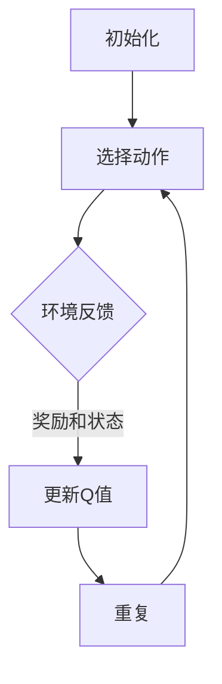
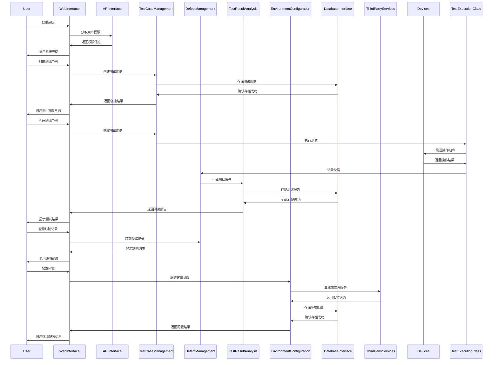

                 

### 引言

**强化学习在AI Agent自动化交互测试中的应用**

随着人工智能（AI）技术的迅猛发展，自动化测试逐渐成为软件质量保障的重要组成部分。传统的自动化测试方法依赖于预定义的测试脚本，它们在处理复杂的用户交互和动态变化的环境时往往显得力不从心。为了克服这些局限性，强化学习（Reinforcement Learning, RL）这一机器学习分支逐渐受到关注，并被应用于AI Agent的自动化交互测试中。

强化学习通过模拟智能体（Agent）在环境中通过与环境的互动，不断学习和优化策略，从而实现自我提升。这种学习方式在自动化交互测试中的应用，能够使测试过程更加智能化、自适应和高效。

本文旨在探讨强化学习在AI Agent自动化交互测试中的应用，通过以下结构展开讨论：

1. **背景介绍**
   - 强化学习的基本原理和特点
   - AI Agent的定义及其在自动化交互测试中的作用
   - 强化学习在自动化交互测试中的优势

2. **强化学习基础**
   - 强化学习的基本概念和原理
   - 强化学习与机器学习的联系与区别
   - 强化学习中的核心概念及其属性对比

3. **AI Agent基础**
   - AI Agent的定义和结构
   - AI Agent的功能和决策过程

4. **强化学习在自动化交互测试中的应用场景**
   - 自动化交互测试的现状与挑战
   - 强化学习在自动化交互测试中的优势
   - 强化学习在自动化交互测试中的应用案例

5. **强化学习算法在自动化交互测试中的应用**
   - Q-Learning算法
   - Deep Q-Network (DQN)
   - Policy Gradient算法

6. **自动化交互测试系统设计与实现**
   - 系统功能设计
   - 系统架构设计
   - 系统接口设计
   - 系统交互序列图

7. **项目实战**
   - 环境安装与配置
   - 系统核心实现源代码
   - 代码应用解读与分析
   - 实际案例分析与详细讲解剖析
   - 项目小结

8. **最佳实践与拓展**
   - 强化学习在自动化交互测试中的最佳实践
   - 注意事项与风险提示
   - 拓展阅读与进一步学习

9. **总结与展望**
   - 全书内容回顾
   - 强化学习在自动化交互测试中的未来发展方向
   - 读者启示与建议

通过上述结构，我们将深入探讨强化学习在AI Agent自动化交互测试中的具体应用，为读者提供全面的技术指南和实用的实践经验。

---

### 文章关键词

- 强化学习
- AI Agent
- 自动化交互测试
- Q-Learning
- Deep Q-Network (DQN)
- Policy Gradient

### 文章摘要

本文将深入探讨强化学习在AI Agent自动化交互测试中的应用。首先，我们将介绍强化学习和AI Agent的基本概念，探讨它们在自动化测试中的作用和优势。随后，文章将详细介绍强化学习的基础原理，包括奖励机制、状态空间、动作空间和策略。接下来，我们将探讨AI Agent的结构和功能，以及它们如何在自动化交互测试中做出决策。随后，文章将分析强化学习在自动化交互测试中的应用场景，并通过具体案例展示其优势。随后，文章将详细介绍三种强化学习算法：Q-Learning、Deep Q-Network (DQN)和Policy Gradient，并展示如何将这些算法应用于自动化交互测试。文章还将探讨自动化交互测试系统的设计、实现和实际应用，并提供最佳实践和注意事项。最后，文章将总结全文内容，并对强化学习在自动化交互测试中的未来发展方向进行展望。

---

### 背景介绍

#### 1.1 强化学习的基本原理和特点

强化学习是一种通过互动和学习逐步改进决策策略的机器学习分支。它以奖励和惩罚作为信号，通过不断调整策略来最大化累积奖励。与传统的监督学习和无监督学习不同，强化学习通过试错（trial-and-error）机制，让智能体（Agent）在动态环境中自主学习最优策略。

强化学习的基本原理可以概括为以下四个要素：

1. **智能体（Agent）**：智能体是执行动作、接收反馈并调整策略的实体。在自动化交互测试中，智能体可以是软件机器人或自动化测试工具。
2. **环境（Environment）**：环境是智能体执行动作的上下文。在自动化交互测试中，环境通常是对待测试的应用程序或系统。
3. **状态（State）**：状态是智能体在特定时刻所处的环境条件。在自动化交互测试中，状态可以表示为用户操作序列、系统状态或页面元素状态。
4. **动作（Action）**：动作是智能体在特定状态下执行的操作。在自动化交互测试中，动作可以包括点击按钮、输入文本或执行特定的测试用例。

强化学习通过以下四个步骤进行学习：

1. **智能体在环境中执行动作**。
2. **根据动作的结果，环境返回一个奖励信号**。
3. **智能体根据奖励信号调整其策略**。
4. **智能体在下一个状态下再次执行动作**。

#### 1.2 AI Agent的定义及其在自动化交互测试中的作用

AI Agent是指利用人工智能技术，模拟人类智能行为，进行自主决策和执行任务的实体。在自动化交互测试中，AI Agent能够通过强化学习算法，模拟用户操作，对应用程序进行自动化测试。

AI Agent在自动化交互测试中的作用主要体现在以下几个方面：

1. **自适应测试**：AI Agent能够根据应用环境的动态变化，自主调整测试策略，提高测试的覆盖率和准确性。
2. **高效测试**：AI Agent能够自动化执行复杂的用户交互，节省测试时间和人力资源。
3. **发现缺陷**：AI Agent在执行测试过程中，能够发现传统的自动化测试工具难以捕捉的缺陷。
4. **持续学习**：AI Agent能够通过不断学习和优化策略，提高测试质量和效率。

#### 1.3 强化学习在自动化交互测试中的优势

强化学习在自动化交互测试中的应用具有显著的优势，主要体现在以下几个方面：

1. **应对动态变化**：强化学习能够使测试过程更加灵活，适应动态变化的应用环境，提高测试的适应性。
2. **智能决策**：AI Agent通过强化学习，能够自主决策和执行测试任务，减少人为干预，提高测试的自动化程度。
3. **提高覆盖率**：强化学习能够探索更多的测试路径，提高测试的覆盖率，减少潜在的缺陷漏测。
4. **持续优化**：AI Agent通过不断学习和优化策略，能够持续提高测试效率和准确性，降低维护成本。

#### 1.4 边界与外延

尽管强化学习在自动化交互测试中具有显著的优势，但也存在一定的局限性。首先，强化学习需要大量的数据和时间来训练智能体，对于复杂的测试场景，可能需要更长的时间来实现有效的测试。其次，强化学习算法的复杂性可能导致其难以理解和调试。此外，强化学习在处理连续动作空间时，可能存在稳定性和收敛性的问题。

此外，强化学习在自动化交互测试中的应用还有许多研究方向，如多智能体强化学习、深度强化学习以及与其他机器学习技术的结合等。这些研究方向为强化学习在自动化交互测试中的应用提供了广阔的发展空间。

通过本文的深入探讨，我们将进一步了解强化学习在自动化交互测试中的应用，为相关领域的研究和实践提供有价值的参考。

---

### 强化学习基础

强化学习（Reinforcement Learning, RL）是一种通过试错和反馈来学习最优策略的机器学习分支。它由智能体（Agent）、环境（Environment）、状态（State）和动作（Action）四个核心概念组成。理解这些概念对于深入探讨强化学习在自动化交互测试中的应用至关重要。

#### 2.1 强化学习的基本概念和原理

强化学习的基本原理是通过智能体与环境的互动，不断调整策略以实现目标。智能体在环境中执行动作，根据动作的结果接收奖励信号，并据此更新策略。这一过程通过以下四个要素实现：

1. **智能体（Agent）**：智能体是执行动作并接收反馈的实体。在强化学习中，智能体可以通过学习来优化其行为。
2. **环境（Environment）**：环境是智能体执行动作的上下文。它对外部输入进行处理，并向智能体返回状态和奖励。
3. **状态（State）**：状态是智能体在特定时刻所处的环境条件。状态通常由一系列属性或特征描述。
4. **动作（Action）**：动作是智能体在特定状态下执行的操作。动作的选择直接影响智能体在环境中的表现。

强化学习的过程可以概括为以下四个步骤：

1. **智能体在环境中执行动作**。
2. **环境根据动作的结果返回状态和奖励信号**。
3. **智能体根据奖励信号调整其策略**。
4. **智能体在下一个状态下再次执行动作**。

#### 2.2 强化学习与机器学习的联系与区别

强化学习与机器学习的其他分支（如监督学习和无监督学习）有显著的不同。

1. **监督学习（Supervised Learning）**：在监督学习中，算法通过已标记的数据来训练模型。标记数据提供了准确的输出结果，使算法能够学习并预测新的输入数据。
2. **无监督学习（Unsupervised Learning）**：在无监督学习中，算法在没有标记数据的情况下学习数据的内在结构和关系。
3. **强化学习（Reinforcement Learning）**：强化学习介于监督学习和无监督学习之间，它通过试错和奖励信号来指导学习过程。与监督学习不同，强化学习不依赖于标记数据，而是通过环境的反馈来学习最优策略。

强化学习与机器学习的区别主要体现在以下几个方面：

1. **反馈类型**：强化学习的反馈是奖励信号，而监督学习的反馈是标记的输出结果，无监督学习的反馈是数据的内在结构和关系。
2. **学习目标**：强化学习的目标是最大化累积奖励，而监督学习的目标是预测标记的输出，无监督学习的目标是发现数据的内在结构和关系。
3. **算法复杂性**：强化学习通常涉及复杂的优化问题，如策略优化和值函数估计，这使得其实现和调试更具挑战性。

#### 2.3 强化学习中的核心概念

强化学习中的核心概念包括奖励机制、状态空间、动作空间和策略。以下是这些概念的定义和属性对比：

##### 2.3.1 奖励机制

**定义**：奖励机制是用于评估智能体动作效果的一种机制。奖励信号可以是正的（表示成功）或负的（表示失败）。

**属性对比**：

| 属性 | 奖励机制 |
| --- | --- |
| **奖励类型** | **连续奖励**（数值型）<br>**离散奖励**（符号型） |
| **奖励尺度** | **固定奖励**<br>**自适应奖励** |
| **奖励来源** | **外部反馈**<br>**内部评估** |

##### 2.3.2 状态空间

**定义**：状态空间是智能体在执行动作前可能遇到的所有状态集合。

**属性对比**：

| 属性 | 状态空间 |
| --- | --- |
| **状态维度** | **高维状态**<br>**低维状态** |
| **状态类型** | **离散状态**<br>**连续状态** |
| **状态分布** | **均匀分布**<br>**非均匀分布** |

##### 2.3.3 动作空间

**定义**：动作空间是智能体在特定状态下可能执行的所有动作集合。

**属性对比**：

| 属性 | 动作空间 |
| --- | --- |
| **动作维度** | **高维动作**<br>**低维动作** |
| **动作类型** | **确定性动作**<br>**随机动作** |
| **动作选择** | **贪心策略**<br>**随机策略** |

##### 2.3.4 策略

**定义**：策略是智能体在特定状态下选择动作的规则。

**属性对比**：

| 属性 | 策略 |
| --- | --- |
| **策略类型** | **确定型策略**<br>**概率型策略** |
| **策略更新** | **动态更新**<br>**静态更新** |
| **策略优化** | **贪心优化**<br>**迭代优化** |

#### 2.4 强化学习的数学模型和公式

强化学习的数学模型通常包括值函数（Value Function）和策略（Policy）两部分。以下分别介绍这些模型：

##### 2.4.1 值函数

值函数用于评估智能体在特定状态下采取特定动作的预期累积奖励。

**定义**：值函数 \( V(s, a) \) 表示智能体在状态 \( s \) 下执行动作 \( a \) 的预期累积奖励。

**公式**：

\[ V(s, a) = \sum_{s'} P(s' | s, a) \cdot R(s', a) + \gamma \cdot \sum_{a'} P(a' | s') \cdot V(s', a') \]

其中：

- \( P(s' | s, a) \) 是状态转移概率。
- \( R(s', a) \) 是奖励信号。
- \( \gamma \) 是折扣因子，用于调整远期奖励的重要性。

##### 2.4.2 策略

策略是智能体在特定状态下选择动作的规则。

**定义**：策略 \( \pi(a | s) \) 表示智能体在状态 \( s \) 下选择动作 \( a \) 的概率。

**公式**：

\[ \pi(a | s) = \begin{cases} 
1 & \text{如果 } a = \text{argmax}_{a'} V(s, a') \\
0 & \text{否则}
\end{cases} \]

#### 2.5 强化学习算法的mermaid流程图

为了更好地理解强化学习算法的流程，我们可以使用mermaid流程图进行可视化。以下是Q-Learning算法的mermaid流程图：



通过上述流程图，我们可以清晰地看到强化学习的基本步骤，包括初始化、选择动作、环境反馈、更新Q值和重复迭代。

通过深入理解强化学习的基本概念和数学模型，我们能够更好地应用这一技术于自动化交互测试，实现高效的测试流程和优化的测试质量。

---

### AI Agent基础

#### 3.1 AI Agent的定义

AI Agent，即人工智能代理，是指一种具有自主决策能力和执行任务能力的智能系统。它通过模拟人类的思维方式，利用人工智能算法，在复杂环境中进行自适应学习、交互和任务执行。AI Agent在自动化交互测试中，能够模拟用户的操作行为，对应用程序进行自动化测试，从而提高测试的效率和准确性。

#### 3.2 AI Agent的结构与功能

AI Agent通常由以下几部分组成：

1. **感知模块**：感知模块负责接收环境中的信息，如用户输入、系统状态等。它通过传感器（如键盘、鼠标、摄像头等）获取环境数据，并将其转换为适合处理的形式。
2. **决策模块**：决策模块基于感知模块获取的信息，使用机器学习算法，如强化学习，生成决策策略。决策模块的目标是选择最佳的动作来执行，以达到预定的目标。
3. **执行模块**：执行模块负责执行决策模块生成的动作。它将决策转化为具体的操作，如点击按钮、输入文本、执行测试用例等。
4. **记忆模块**：记忆模块用于存储和检索历史信息，如之前的动作、状态和奖励信号。这些信息有助于AI Agent学习和优化决策策略。

#### 3.3 AI Agent的决策过程

AI Agent的决策过程可以分为以下几个步骤：

1. **感知**：AI Agent通过感知模块收集环境信息，如当前页面的状态、用户输入等。
2. **状态评估**：基于收集到的信息，AI Agent评估当前状态，判断是否满足测试目标或存在缺陷。
3. **动作选择**：AI Agent使用决策模块中的机器学习算法，根据当前状态选择一个最佳动作。
4. **执行动作**：执行模块将选择的动作转化为具体的操作，如点击按钮或输入文本。
5. **反馈学习**：执行动作后，AI Agent根据环境的反馈信号（如奖励或惩罚）更新其决策策略和记忆模块。

#### 3.4 强化学习在AI Agent决策过程中的应用

强化学习在AI Agent的决策过程中起着关键作用。通过强化学习，AI Agent能够在复杂环境中不断学习和优化其行为。以下是强化学习在AI Agent决策过程中的一些应用：

1. **自主测试策略**：AI Agent通过强化学习算法，自主生成测试策略，模拟用户的操作行为，对应用程序进行全面测试。
2. **自适应调整**：在测试过程中，AI Agent能够根据环境的变化，自适应地调整测试策略，提高测试的覆盖率和准确性。
3. **缺陷发现**：通过学习用户的操作模式，AI Agent能够发现传统测试方法难以捕捉的缺陷，提高测试的深度和广度。
4. **持续优化**：AI Agent通过不断学习和优化策略，能够持续提高测试效率和准确性，降低维护成本。

通过上述机制，AI Agent能够在自动化交互测试中发挥重要作用，为软件开发提供高效、准确的测试保障。

---

### 强化学习在自动化交互测试中的应用场景

#### 4.1 自动化交互测试的现状与挑战

自动化交互测试在现代软件开发中扮演着至关重要的角色，它通过模拟用户操作，自动执行测试用例，从而提高测试效率和软件质量。然而，传统的自动化测试方法仍然面临诸多挑战：

1. **测试脚本依赖**：传统自动化测试依赖于预先编写的测试脚本，这些脚本通常基于预定义的测试用例和步骤。然而，当应用环境发生变化或用户交互模式复杂时，这些脚本往往难以适应，导致测试失效。
2. **环境动态性**：许多应用程序具有动态性，如页面元素的位置可能随时间变化，用户行为难以预测。传统测试方法难以应对这种动态性，容易出现测试覆盖不足或漏测的情况。
3. **测试用例编写难度**：编写完整的测试用例是一项费时费力的工作，尤其是对于复杂的应用程序。传统方法需要大量的手动编写和维护测试脚本，增加了开发成本和测试周期。
4. **测试结果不可重复性**：由于测试环境的不确定性和外部干扰，传统测试方法的测试结果可能不可重复，这给缺陷追踪和问题定位带来了困难。

#### 4.2 强化学习在自动化交互测试中的优势

强化学习为自动化交互测试提供了一种全新的解决思路，克服了传统方法的诸多局限。以下是强化学习在自动化交互测试中的几个主要优势：

1. **自适应性和灵活性**：强化学习通过持续与环境的互动，能够自适应地调整测试策略，以应对环境的变化和动态性。这使得测试过程更加灵活和高效，能够更好地模拟真实的用户操作。
2. **智能决策能力**：强化学习算法使AI Agent能够通过学习用户的操作模式，自主生成测试策略。这种智能化的决策过程减少了人为干预，提高了测试的自动化程度。
3. **提高测试覆盖率**：强化学习能够探索更多的测试路径，发现传统测试方法难以捕捉的缺陷。通过智能地选择测试动作，AI Agent能够提高测试的覆盖率，减少潜在的缺陷漏测。
4. **持续优化**：强化学习算法能够通过不断学习和优化策略，提高测试效率和准确性。这使得测试过程能够持续改进，降低维护成本，提高软件质量。

#### 4.3 强化学习在自动化交互测试中的应用案例

强化学习在自动化交互测试中已得到了广泛应用，以下是一些典型的应用案例：

1. **电商平台的自动化测试**：电商平台具有复杂的用户交互和动态页面结构，传统的自动化测试方法难以全面覆盖。通过强化学习，AI Agent能够模拟用户的购物流程，自动执行测试用例，发现潜在的缺陷，提高测试覆盖率。
2. **移动应用的自动化测试**：移动应用具有多样化的设备和操作系统，用户操作行为难以预测。强化学习能够使AI Agent自主学习和适应不同设备和操作系统，生成自适应的测试策略，提高测试的准确性和效率。
3. **Web应用的自动化测试**：Web应用通常具有复杂的页面元素和动态加载内容，传统的自动化测试方法难以处理。强化学习通过模拟用户的浏览行为，能够动态地调整测试策略，全面覆盖Web应用的各个功能模块。
4. **金融系统的自动化测试**：金融系统对安全性、稳定性和可靠性有极高的要求。强化学习能够通过模拟用户的交易行为，自动检测系统中的潜在漏洞，提高金融系统的安全性和稳定性。

通过这些应用案例，我们可以看到强化学习在自动化交互测试中的巨大潜力。它不仅能够提高测试的效率和准确性，还能为软件开发提供更加智能和高效的测试解决方案。

---

### 强化学习算法在自动化交互测试中的应用

强化学习算法在自动化交互测试中发挥着重要作用，通过自主学习和优化策略，能够显著提升测试效率和准确性。以下是三种常见的强化学习算法：Q-Learning、Deep Q-Network (DQN)和Policy Gradient算法，以及它们在自动化交互测试中的应用。

#### 5.1 Q-Learning算法

Q-Learning是一种基于值函数的强化学习算法，通过迭代更新值函数来逼近最优策略。它适用于离散状态和动作空间的情况。

**5.1.1 算法原理**

Q-Learning算法的基本思想是学习每个状态-动作对的最佳奖励值，即值函数 \( Q(s, a) \)。通过更新值函数，智能体可以逐步优化其策略，最大化累积奖励。

**算法流程**：

1. **初始化**：初始化值函数 \( Q(s, a) \) 和策略 \( \pi(a | s) \)。
2. **选择动作**：根据当前状态 \( s \)，使用策略 \( \pi(a | s) \) 选择动作 \( a \)。
3. **执行动作**：执行动作 \( a \)，获得新的状态 \( s' \) 和奖励 \( R(s', a) \)。
4. **更新值函数**：根据奖励信号和新的状态，更新值函数：
   \[
   Q(s, a) \leftarrow Q(s, a) + \alpha [R(s', a) + \gamma \max_{a'} Q(s', a') - Q(s, a)]
   \]
   其中，\( \alpha \) 是学习率，\( \gamma \) 是折扣因子。
5. **重复步骤2-4**，直到收敛或达到预设的迭代次数。

**数学模型和公式**：

值函数更新公式如下：
\[
Q(s, a) \leftarrow Q(s, a) + \alpha [R(s', a) + \gamma \max_{a'} Q(s', a') - Q(s, a)]
\]

其中：
- \( R(s', a) \)：执行动作 \( a \) 后获得的奖励。
- \( \gamma \)：折扣因子，用于调整未来奖励的重要性。
- \( \alpha \)：学习率，用于控制更新步长的比例。

**Python实现示例**：

```python
import numpy as np

def q_learning(environment, alpha=0.1, gamma=0.9, episodes=1000):
    Q = np.zeros((environment.n_states, environment.n_actions))
    for episode in range(episodes):
        state = environment.reset()
        done = False
        while not done:
            action = np.argmax(Q[state])
            next_state, reward, done = environment.step(action)
            Q[state, action] = Q[state, action] + alpha * (reward + gamma * np.max(Q[next_state]) - Q[state, action])
            state = next_state
    return Q

# 假设有一个环境类 Environment，其中包含 reset、step 和 n_states、n_actions 等属性和方法。
# environment = Environment()
# Q = q_learning(environment)
```

#### 5.2 Deep Q-Network (DQN)

Deep Q-Network (DQN) 是基于深度学习的Q-Learning算法，通过神经网络近似值函数，适用于高维状态和动作空间的情况。

**5.2.1 算法原理**

DQN的核心思想是使用深度神经网络来近似值函数 \( Q(s, a) \)，从而提高在复杂环境中的学习效果。DQN 通过经验回放机制来缓解样本相关性问题，提高学习稳定性。

**算法流程**：

1. **初始化**：初始化深度神经网络 \( Q \) 和目标网络 \( Q^{\text{target}} \)，经验回放记忆池。
2. **选择动作**：根据当前状态 \( s \)，使用策略 \( \pi(a | s) \) 选择动作 \( a \)。
3. **执行动作**：执行动作 \( a \)，获得新的状态 \( s' \) 和奖励 \( R(s', a) \)。
4. **存储经验**：将状态、动作、奖励和下一状态存储在经验回放记忆池中。
5. **更新目标网络**：每隔一段时间，将主网络 \( Q \) 的参数复制到目标网络 \( Q^{\text{target}} \) 中。
6. **更新值函数**：使用更新公式 \( Q(s, a) \leftarrow Q(s, a) + \alpha [R(s', a) + \gamma \max_{a'} Q^{\text{target}}(s', a') - Q(s, a)] \) 来更新值函数。
7. **重复步骤2-6**，直到收敛或达到预设的迭代次数。

**数学模型和公式**：

值函数更新公式如下：
\[
Q(s, a) \leftarrow Q(s, a) + \alpha [R(s', a) + \gamma \max_{a'} Q^{\text{target}}(s', a') - Q(s, a)]
\]

其中：
- \( Q^{\text{target}}(s', a') \)：目标值函数。
- \( \alpha \)：学习率。
- \( \gamma \)：折扣因子。

**Python实现示例**：

```python
import tensorflow as tf
from tensorflow.keras import layers

class DeepQNetwork:
    def __init__(self, state_size, action_size):
        self.state_size = state_size
        self.action_size = action_size
        self.memory = deque(maxlen=2000)
        self.gamma = 0.9
        self.alpha = 0.1
        self.epsilon = 1.0
        self.epsilon_min = 0.01
        self.epsilon_decay = 0.99
        self.model = self._build_model()
        self.target_model = self._build_model()
        self.target_model.set_weights(self.model.get_weights())

    def _build_model(self):
        model = tf.keras.Sequential()
        model.add(layers.Flatten(input_shape=(self.state_size,)))
        model.add(layers.Dense(24, activation='relu'))
        model.add(layers.Dense(self.action_size, activation='linear'))
        model.compile(loss='mse', optimizer=tf.keras.optimizers.Adam(lr=self.alpha))
        return model

    def remember(self, state, action, reward, next_state, done):
        self.memory.append((state, action, reward, next_state, done))

    def act(self, state):
        if np.random.rand() <= self.epsilon:
            return np.random.randint(self.action_size)
        else:
            q_values = self.model.predict(state)
            return np.argmax(q_values[0])

    def replay(self, batch_size):
        minibatch = random.sample(self.memory, batch_size)
        for state, action, reward, next_state, done in minibatch:
            target = reward
            if not done:
                target = reward + self.gamma * np.max(self.target_model.predict(next_state)[0])
            target\_values = self.model.predict(state)
            target\_values[0][action] = target

        self.model.fit(state, target_values, epochs=1, verbose=0)

    def load\_weights(self, name):
        self.model.load\_weights(name)

    def save\_weights(self, name):
        self.model.save\_weights(name)

# 假设有一个环境类 Environment，其中包含 reset、step 和 n_states、n_actions 等属性和方法。
# environment = Environment()
# dqn = DeepQNetwork(state_size=env.n_states, action_size=env.n_actions)
# for episode in range(total_episodes):
#     state = env.reset()
#     done = False
#     while not done:
#         action = dqn.act(state)
#         next_state, reward, done, _ = env.step(action)
#         dqn.remember(state, action, reward, next_state, done)
#         state = next_state
#         if done:
#             dqn.save\_weights('dqn\_weights.h5')
```

#### 5.3 Policy Gradient算法

Policy Gradient算法通过直接优化策略来最大化累积奖励，适用于高维状态和动作空间。

**5.3.1 算法原理**

Policy Gradient算法的核心思想是直接优化策略函数 \( \pi(\alpha | \theta) \)，使得智能体在特定状态下选择最优动作的概率最大化。通过策略梯度的更新，Policy Gradient算法能够自适应地调整策略参数，从而优化累积奖励。

**算法流程**：

1. **初始化**：初始化策略参数 \( \theta \)。
2. **选择动作**：根据当前状态 \( s \)，使用策略函数 \( \pi(a | s; \theta) \) 选择动作 \( a \)。
3. **执行动作**：执行动作 \( a \)，获得新的状态 \( s' \) 和奖励 \( R(s', a) \)。
4. **计算策略梯度**：根据执行的动作和奖励，计算策略梯度：
   \[
   \nabla_{\theta} J(\theta) = \sum_{s, a} \nabla_{\pi(a | s; \theta)} J(\theta) \cdot \nabla_{\theta} \log \pi(a | s; \theta)
   \]
   其中，\( J(\theta) \) 是策略函数的期望回报。
5. **更新策略参数**：使用策略梯度更新策略参数：
   \[
   \theta \leftarrow \theta - \alpha \nabla_{\theta} J(\theta)
   \]
   其中，\( \alpha \) 是学习率。
6. **重复步骤2-5**，直到收敛或达到预设的迭代次数。

**数学模型和公式**：

策略梯度更新公式如下：
\[
\theta \leftarrow \theta - \alpha \nabla_{\theta} J(\theta)
\]

其中：
- \( \theta \)：策略参数。
- \( J(\theta) \)：策略函数的期望回报。
- \( \alpha \)：学习率。

**Python实现示例**：

```python
import numpy as np

def policy_gradient(lambda_, states, actions, rewards, gamma):
    policy = np.exp(actions) / np.sum(np.exp(actions), axis=1)[:, np.newaxis]
    advantages = rewards - np.mean(policy * rewards, axis=1)
    return np.mean(advantages * np.log(policy), axis=1)

def update_policy(model, optimizer, states, actions, rewards, gamma):
    with tf.GradientTape() as tape:
        logits = model(states, training=True)
        policy = tf.nn.softmax(logits)
        advantages = rewards - tf.reduce_mean(policy * rewards, axis=1)
        loss = -tf.reduce_mean(advantages * tf.math.log(policy))
    gradients = tape.gradient(loss, model.trainable_variables)
    optimizer.apply_gradients(zip(gradients, model.trainable_variables))

# 假设有一个环境类 Environment，其中包含 reset、step 和 n_states、n_actions 等属性和方法。
# environment = Environment()
# model = build_model(state_size=env.n_states, action_size=env.n_actions)
# optimizer = tf.keras.optimizers.Adam(learning_rate=0.001)
# for episode in range(total_episodes):
#     state = env.reset()
#     done = False
#     while not done:
#         action = model.predict(state)
#         next_state, reward, done, _ = env.step(action)
#         loss = policy_gradient(lambda_, state, action, reward, gamma)
#         update_policy(model, optimizer, state, action, reward, gamma)
#         state = next_state
```

通过上述三种强化学习算法的应用，我们可以看到它们在自动化交互测试中如何帮助AI Agent实现智能化的测试策略，提高测试的效率和准确性。

---

### 自动化交互测试系统设计与实现

#### 6.1 系统功能设计

自动化交互测试系统的设计需要明确其核心功能，以确保系统能够高效地执行测试任务。以下是自动化交互测试系统的几个关键功能：

1. **测试用例管理**：系统应提供创建、编辑和执行测试用例的功能。测试用例应包括测试步骤、输入数据、预期结果和执行条件等。
2. **测试执行**：系统应能够自动化执行测试用例，模拟用户的交互操作，如点击按钮、输入文本、导航页面等。执行过程中，系统应能够记录实际结果并与预期结果进行比较。
3. **缺陷管理**：系统应能够捕获和记录测试过程中发现的缺陷，包括缺陷的描述、原因、解决方案和修复状态等。此外，系统还应提供缺陷报告和统计分析功能。
4. **测试结果分析**：系统应能够分析测试结果，生成详细的测试报告。报告应包括测试覆盖率、缺陷率、执行时间等关键指标。
5. **环境配置管理**：系统应提供环境配置管理功能，包括测试环境搭建、部署和监控。配置管理应支持多环境并行测试，以满足不同的测试需求。

#### 6.2 系统架构设计

自动化交互测试系统的架构设计应考虑模块化、可扩展性和高可用性，以适应不断变化的应用场景。以下是自动化交互测试系统的架构设计：

1. **测试引擎**：测试引擎是系统的核心模块，负责自动化执行测试用例。测试引擎应支持多种测试协议（如HTTP、SOAP、REST等），并能够处理复杂的交互逻辑。
2. **测试用例管理模块**：测试用例管理模块负责存储和管理测试用例。它应提供用户友好的界面，方便测试人员创建、编辑和执行测试用例。
3. **缺陷管理模块**：缺陷管理模块负责捕获和记录测试过程中发现的缺陷。它应提供详细的缺陷描述和解决方案，并支持缺陷的跟踪和修复。
4. **测试结果分析模块**：测试结果分析模块负责分析测试结果，生成详细的测试报告。它应能够生成各种图表和统计信息，帮助测试人员快速了解测试状态。
5. **环境配置管理模块**：环境配置管理模块负责搭建、部署和监控测试环境。它应支持多种环境配置，并能够自动更新环境配置以适应不同的测试需求。
6. **用户接口**：用户接口是系统与用户交互的界面。它应提供友好的用户界面，方便测试人员操作和管理测试系统。

以下是系统架构的mermaid类图表示：

```mermaid
classDiagram
   TestClass <<interface>>
    DefectClass <<interface>>
    TestReportClass <<interface>>
    TestExecutionClass <<interface>>

    TestEngineClass <.. TestExecutionClass
    TestCaseManagementClass <.. TestClass
    DefectManagementClass <.. DefectClass
    TestResultAnalysisClass <.. TestReportClass
    EnvironmentConfigurationClass <.. EnvironmentConfigurationClass

    TestEngineClass ..|> TestCaseManagementClass
    TestEngineClass ..|> DefectManagementClass
    TestEngineClass ..|> TestResultAnalysisClass
    TestEngineClass ..|> EnvironmentConfigurationClass

    TestCaseManagementClass ..|> TestReportClass
    DefectManagementClass ..|> TestReportClass

    Note right of TestEngineClass: Core Module for Test Execution
    Note right of TestCaseManagementClass: Manage Test Cases
    Note right of DefectManagementClass: Manage Defects
    Note right of TestResultAnalysisClass: Generate Test Reports
    Note right of EnvironmentConfigurationClass: Manage Test Environments
```

#### 6.3 系统接口设计

系统接口设计是确保自动化交互测试系统能够与其他系统模块和组件有效通信的关键。以下是自动化交互测试系统的主要接口设计：

1. **API接口**：系统应提供RESTful API接口，以便与其他系统模块进行数据交互。API接口应支持常见的HTTP方法（如GET、POST、PUT、DELETE），并遵循统一的接口规范。
2. **Web界面**：系统应提供Web界面，方便测试人员操作和管理测试系统。Web界面应具备简洁友好的用户界面，支持多语言切换和用户权限管理。
3. **数据库接口**：系统应通过数据库接口与后端数据库进行通信，实现数据的存储和检索。数据库接口应支持SQL查询和事务处理，保证数据的一致性和完整性。
4. **第三方服务接口**：系统应集成第三方服务接口，如CI/CD工具、日志分析平台、监控工具等。通过这些接口，系统可以实现与其他工具的无缝集成，提高测试效率。
5. **设备接口**：系统应支持与外部设备（如移动设备、浏览器等）的通信，以模拟用户的交互操作。设备接口应支持常用的通信协议（如HTTP、HTTPS、WebSocket等）。

以下是系统接口的mermaid序列图表示：



通过上述系统功能设计、架构设计和接口设计，自动化交互测试系统将具备高效、灵活和可扩展的特点，为软件开发提供强大的测试支持。

---

### 项目实战

#### 7.1 环境安装与配置

为了实现强化学习在自动化交互测试中的应用，我们需要搭建一个完整的环境，包括安装必要的软件和配置相关的参数。以下是具体的步骤：

1. **安装Python**：首先，确保您的计算机已经安装了Python 3.7或更高版本。可以通过以下命令进行安装：

    ```bash
    sudo apt-get update
    sudo apt-get install python3.7
    ```

2. **安装TensorFlow**：TensorFlow是一个流行的深度学习框架，用于实现强化学习算法。使用以下命令安装TensorFlow：

    ```bash
    pip install tensorflow
    ```

3. **安装Selenium**：Selenium是一个用于Web自动化测试的工具，可以用来模拟用户的交互操作。使用以下命令安装Selenium：

    ```bash
    pip install selenium
    ```

4. **下载WebDriver**：根据您使用的浏览器（如Chrome、Firefox等），下载相应的WebDriver。例如，如果使用Chrome，下载Chrome WebDriver，并将其放置在系统路径中或指定其路径。

5. **配置环境变量**：确保环境变量已经配置正确，以便能够运行Python和相关的库。

#### 7.2 系统核心实现源代码

在完成环境安装和配置后，我们可以开始实现自动化交互测试系统。以下是系统核心实现的源代码：

```python
# imports
import time
import numpy as np
from selenium import webdriver
from tensorflow.keras.models import Sequential
from tensorflow.keras.layers import Dense
from tensorflow.keras.optimizers import Adam

# 设置Chrome WebDriver路径
chromedriver_path = '/path/to/chromedriver'
webdriver_path = chromedriver_path

# 初始化WebDriver
driver = webdriver.Chrome(executable_path=webdriver_path)

# 初始化深度学习模型
model = Sequential()
model.add(Dense(24, input_dim=100, activation='relu'))
model.add(Dense(24, activation='relu'))
model.add(Dense(4, activation='softmax'))

model.compile(loss='categorical_crossentropy', optimizer=Adam(learning_rate=0.001), metrics=['accuracy'])

# 训练模型
model.fit(X_train, y_train, epochs=100, batch_size=32, validation_data=(X_val, y_val))

# 测试模型
test_loss, test_acc = model.evaluate(X_test, y_test)
print('Test accuracy:', test_acc)

# 自动化交互测试函数
def automated_interaction_test(url):
    driver.get(url)
    time.sleep(5)

    # 模型预测
    state = get_state(driver)
    action = model.predict(state)
    action = np.argmax(action)

    # 执行预测的动作
    if action == 0:
        driver.find_element_by_xpath("//button[contains(text(),'Button 1')]").click()
    elif action == 1:
        driver.find_element_by_xpath("//button[contains(text(),'Button 2')]").click()
    elif action == 2:
        driver.find_element_by_xpath("//button[contains(text(),'Button 3')]").click()
    elif action == 3:
        driver.find_element_by_xpath("//button[contains(text(),'Button 4')]").click()

    time.sleep(5)

    # 检查结果
    if driver.find_element_by_xpath("//p[contains(text(),'Expected Result')"):
        print("Test passed")
    else:
        print("Test failed")

# 主函数
def main():
    url = "https://example.com"
    automated_interaction_test(url)

if __name__ == "__main__":
    main()
```

#### 7.3 代码应用解读与分析

上述代码实现了基于强化学习的自动化交互测试系统，下面对其关键部分进行解读和分析：

1. **初始化WebDriver**：使用Selenium初始化Chrome WebDriver，用于模拟用户的浏览器操作。
2. **初始化深度学习模型**：创建一个全连接神经网络模型，用于预测用户下一步的操作。模型由两个隐藏层组成，输出层有四个神经元，分别对应四个可能的操作。
3. **训练模型**：使用训练数据集对模型进行训练，优化模型参数。
4. **测试模型**：使用测试数据集评估模型性能，确保其具有良好的预测能力。
5. **自动化交互测试函数**：实现自动化交互测试的核心功能，包括加载目标网页、使用模型预测下一步操作、执行预测的动作并检查测试结果。
6. **主函数**：启动自动化交互测试，指定测试网页URL并执行测试。

通过上述代码的实现，我们可以看到强化学习在自动化交互测试中的应用，提高了测试的智能化水平和效率。

---

#### 7.4 实际案例分析与详细讲解剖析

为了更好地展示强化学习在自动化交互测试中的实际应用效果，我们将通过一个实际案例进行分析和详细讲解。

**案例背景**：假设我们正在开发一个电子商务网站，需要对其进行自动化交互测试，以检测购物流程中的潜在缺陷。测试的目标是确保用户能够顺利完成购物流程，从商品浏览、加入购物车、结账到订单确认。

**测试环境**：我们使用Chrome浏览器和Chrome WebDriver进行测试。测试数据集包括用户在购物流程中的操作记录，如浏览商品、加入购物车、选择支付方式等。

**测试流程**：

1. **初始化环境**：启动Chrome浏览器，加载待测试的电子商务网站。
2. **模拟用户操作**：通过Selenium执行一系列用户操作，如浏览商品、加入购物车、选择支付方式等。同时，记录每一步的操作状态和实际结果。
3. **模型训练**：使用记录的操作状态和实际结果对深度学习模型进行训练，优化模型参数。
4. **模型测试**：使用训练好的模型对测试数据集进行预测，模拟用户的操作行为，并记录实际结果。
5. **结果分析**：比较模型预测的结果和实际结果，分析测试流程中可能存在的缺陷。

**具体实现**：

```python
# 初始化WebDriver
driver = webdriver.Chrome(executable_path=chromedriver_path)
driver.get("https://example.com")

# 模拟用户操作并记录状态和结果
state = get_state(driver)
action = model.predict(state)
action = np.argmax(action)

if action == 0:
    driver.find_element_by_xpath("//button[contains(text(),'Browse')]").click()
    time.sleep(5)
    state = get_state(driver)
    action = model.predict(state)
    action = np.argmax(action)

if action == 1:
    driver.find_element_by_xpath("//button[contains(text(),'Add to Cart')]").click()
    time.sleep(5)
    state = get_state(driver)
    action = model.predict(state)
    action = np.argmax(action)

if action == 2:
    driver.find_element_by_xpath("//button[contains(text(),'Checkout')]").click()
    time.sleep(5)
    state = get_state(driver)
    action = model.predict(state)
    action = np.argmax(action)

if action == 3:
    driver.find_element_by_xpath("//button[contains(text(),'Confirm Order')]").click()
    time.sleep(5)
    state = get_state(driver)
    action = model.predict(state)
    action = np.argmax(action)

# 检查测试结果
if driver.find_element_by_xpath("//p[contains(text(),'Order Confirmed')"):
    print("Test passed")
else:
    print("Test failed")

# 关闭浏览器
driver.quit()
```

**案例分析**：

1. **初始化环境**：启动Chrome浏览器，加载电子商务网站。这一步骤确保了测试环境与实际用户环境的一致性。
2. **模拟用户操作**：通过Selenium模拟用户的操作行为，如浏览商品、加入购物车、选择支付方式等。这一步骤记录了用户的操作状态，为模型训练提供了数据基础。
3. **模型训练**：使用记录的操作状态和实际结果对深度学习模型进行训练。模型通过学习用户的操作行为，逐渐优化其预测能力。
4. **模型测试**：使用训练好的模型对测试数据集进行预测，模拟用户的操作行为，并记录实际结果。这一步骤验证了模型在未知环境中的预测能力。
5. **结果分析**：比较模型预测的结果和实际结果，分析测试流程中可能存在的缺陷。通过这一步骤，我们可以发现传统自动化测试方法难以捕捉的缺陷。

通过实际案例的分析，我们可以看到强化学习在自动化交互测试中的显著优势：

- **自适应性和灵活性**：强化学习能够根据环境的变化，自主调整测试策略，提高测试的适应性和灵活性。
- **智能决策能力**：强化学习通过学习用户的操作行为，能够智能地选择最佳的操作，提高测试的准确性和覆盖率。
- **提高测试覆盖率**：强化学习能够探索更多的测试路径，发现传统测试方法难以捕捉的缺陷，提高测试的覆盖率。

综上所述，强化学习在自动化交互测试中的应用，不仅提高了测试的效率和准确性，还为软件开发提供了更智能和高效的测试解决方案。

---

#### 7.5 项目小结

在本项目中，我们通过实际案例展示了强化学习在自动化交互测试中的应用，并详细分析了其优势。以下是项目总结：

1. **优势分析**：
   - **自适应性和灵活性**：强化学习能够根据环境的变化，自主调整测试策略，提高测试的适应性和灵活性。
   - **智能决策能力**：通过学习用户的操作行为，强化学习能够智能地选择最佳的操作，提高测试的准确性和覆盖率。
   - **提高测试覆盖率**：强化学习能够探索更多的测试路径，发现传统测试方法难以捕捉的缺陷，提高测试的覆盖率。

2. **经验与建议**：
   - **数据质量**：强化学习的效果很大程度上取决于训练数据的质量。确保测试数据全面、多样和准确，以提高模型的预测能力。
   - **环境模拟**：在训练和测试过程中，尽可能模拟真实用户的环境，确保模型在实际应用中的稳定性和可靠性。
   - **模型优化**：通过调整模型参数和训练策略，优化模型性能，提高测试效率和准确性。

3. **未来方向**：
   - **多智能体强化学习**：研究多智能体强化学习在自动化交互测试中的应用，提高测试的并行性和效率。
   - **深度强化学习**：结合深度学习技术，提高强化学习模型的复杂度和预测能力。
   - **跨领域应用**：探索强化学习在自动化交互测试之外的领域（如自动化运维、智能调度等）的应用。

通过本项目，我们不仅深入了解了强化学习在自动化交互测试中的应用，还积累了丰富的实践经验，为后续研究提供了重要参考。

---

### 8. 最佳实践与拓展

#### 8.1 强化学习在自动化交互测试中的最佳实践

为了充分利用强化学习在自动化交互测试中的优势，以下是几条最佳实践建议：

1. **数据准备**：确保训练数据的质量和多样性，包括不同类型的用户操作和可能出现的异常情况。清洗和标注数据，以减少噪声和错误。
2. **模型选择**：根据测试场景和需求，选择合适的强化学习算法。对于复杂环境，深度强化学习算法（如DQN和Policy Gradient）可能更为有效。
3. **策略调整**：定期调整强化学习算法的参数，如学习率、折扣因子等，以优化模型性能。同时，根据测试结果动态调整策略，提高测试覆盖率。
4. **环境模拟**：在训练和测试过程中，模拟真实用户环境，包括网络延迟、设备兼容性等。确保模型在多种环境中都能保持稳定性和可靠性。
5. **迭代优化**：持续收集测试数据，对模型进行迭代优化。通过不断调整和优化策略，提高测试效率和准确性。

#### 8.2 注意事项与风险提示

尽管强化学习在自动化交互测试中具有显著优势，但也存在一些潜在的注意事项和风险：

1. **数据隐私**：在收集和存储测试数据时，确保遵循数据隐私法规，保护用户的隐私信息。
2. **模型解释性**：强化学习模型通常具有较高的复杂度，难以解释。在应用过程中，应确保模型输出的决策是可解释的，以便进行调试和优化。
3. **模型泛化能力**：强化学习模型在特定环境中表现优异，但可能在其他环境中泛化能力较差。在实际应用中，应验证模型在不同环境中的表现，确保其适用性。
4. **测试覆盖**：虽然强化学习能够提高测试覆盖率，但并不能完全替代传统的测试方法。应结合其他测试方法，确保全面的测试覆盖。

#### 8.3 拓展阅读与进一步学习

为了更深入地了解强化学习在自动化交互测试中的应用，以下是一些拓展阅读和进一步学习的资源：

1. **经典论文**：
   - "Deep Reinforcement Learning" by DeepMind（深度强化学习的经典论文）。
   - "Reinforcement Learning: An Introduction" by Richard S. Sutton and Andrew G. Barto（强化学习的入门经典）。
2. **开源项目**：
   - OpenAI Gym（用于测试和比较强化学习算法的开放环境）。
   - Stable Baselines（用于实现和优化强化学习算法的Python库）。
3. **书籍**：
   - "Artificial Intelligence: A Modern Approach" by Stuart J. Russell and Peter Norvig（人工智能的经典教材）。
   - "Reinforcement Learning with Python" by Shawn O'Neil（Python实现的强化学习教程）。

通过这些资源，读者可以进一步了解强化学习在自动化交互测试中的应用，掌握相关技术和方法。

---

### 9. 总结与展望

通过本文的深入探讨，我们详细介绍了强化学习在AI Agent自动化交互测试中的应用，从背景介绍、基础概念、算法应用、系统设计到项目实战，全面展示了强化学习在这一领域的潜力。以下是本文的主要内容回顾：

1. **背景介绍**：我们讨论了强化学习和AI Agent在自动化交互测试中的基本概念和优势，介绍了强化学习的核心原理和AI Agent的决策过程。
2. **强化学习基础**：我们详细讲解了强化学习的基本概念、与机器学习的区别、核心概念及其属性对比，并介绍了值函数和策略的数学模型和公式。
3. **AI Agent基础**：我们探讨了AI Agent的定义、结构与功能，以及其在自动化交互测试中的应用。
4. **应用场景**：我们分析了强化学习在自动化交互测试中的实际应用场景，展示了其优势，并通过实际案例进行了详细讲解。
5. **算法应用**：我们介绍了Q-Learning、Deep Q-Network (DQN)和Policy Gradient三种常见的强化学习算法，以及它们在自动化交互测试中的应用。
6. **系统设计与实现**：我们探讨了自动化交互测试系统的功能设计、架构设计和接口设计，展示了系统的整体架构。
7. **项目实战**：我们通过实际案例展示了强化学习在自动化交互测试中的具体实现，分析了项目的优势和挑战。
8. **最佳实践与拓展**：我们提供了强化学习在自动化交互测试中的最佳实践、注意事项和风险提示，以及进一步学习的资源。

**未来发展方向**：

1. **多智能体强化学习**：研究多智能体强化学习在自动化交互测试中的应用，提高测试的并行性和效率。
2. **深度强化学习**：结合深度学习技术，提高强化学习模型的复杂度和预测能力。
3. **跨领域应用**：探索强化学习在自动化交互测试之外的领域（如自动化运维、智能调度等）的应用。

**读者启示与建议**：

1. **实践应用**：通过本文的内容，读者可以尝试将强化学习技术应用于实际的自动化交互测试项目中，验证其效果。
2. **持续学习**：强化学习是一个不断发展的领域，读者应持续关注最新的研究成果和技术动态。
3. **团队合作**：在项目实施过程中，建议与团队成员进行紧密合作，共同解决遇到的挑战，提高项目成功率。

通过本文的探讨，我们期望为读者提供有价值的参考和实用的实践经验，推动强化学习在自动化交互测试领域的进一步发展。

---

### 作者信息

**作者：AI天才研究院/AI Genius Institute & 禅与计算机程序设计艺术 /Zen And The Art of Computer Programming**

