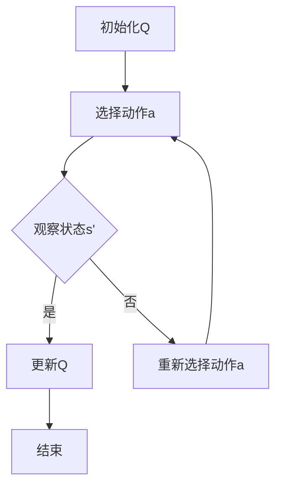
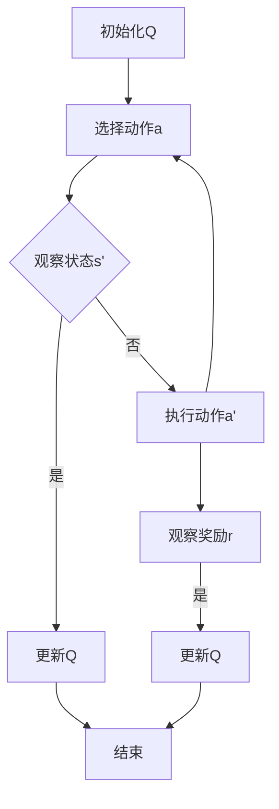
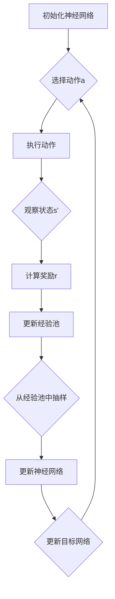

                 


### 1.1 问题背景

随着人工智能技术的迅猛发展，强化学习（Reinforcement Learning, RL）已成为人工智能领域的研究热点。强化学习是一种使人工智能Agent通过与环境的互动，通过学习来优化其行为策略的方法。在强化学习中，AI Agent不断地探索环境，通过试错（trial and error）的方式，获取经验，从而逐渐优化其行为策略，以期获得最大化的奖励。

AI Agent作为一种具有自我学习能力的智能体，其在长期规划优化中的应用具有重要意义。长期规划优化指的是在长时间内，AI Agent能够根据不断变化的环境，调整其策略，以实现最优的长期收益。然而，传统的强化学习算法在处理长期规划问题时存在诸多挑战，如奖励衰减、样本效率低下等。

本文旨在探讨强化学习在AI Agent长期规划优化中的应用，分析其面临的挑战和机遇，并提供一种有效的解决方案。

### 1.2 问题描述

强化学习在AI Agent长期规划优化中的主要问题包括：

1. **奖励稀疏性**：在许多实际场景中，环境提供的奖励是稀疏的，即AI Agent在大多数情况下无法获得有效的奖励信号。这导致AI Agent难以通过强化学习快速学习到最优策略。

2. **样本效率**：在长期规划优化中，AI Agent需要大量的样本数据来学习。然而，在实际应用中，获取有效样本数据往往是一个耗时且成本高昂的过程。

3. **模型可解释性**：强化学习算法通常被视为“黑箱”，其内部机制难以解释。在长期规划优化中，模型的可解释性对于理解和优化AI Agent的行为策略至关重要。

4. **连续性与离散性**：许多实际场景中的问题既包含连续变量也包含离散变量。如何设计适合的强化学习算法来处理这种混合变量是一个挑战。

### 1.3 问题解决

为了解决上述问题，我们可以从以下几个方面入手：

1. **奖励设计**：设计有效的奖励机制，使AI Agent能够更快地学习到最优策略。

2. **样本效率提升**：采用基于模型的强化学习（Model-Based RL）和增量学习（Incremental Learning）等方法，提高样本效率。

3. **模型可解释性增强**：引入可解释的强化学习算法，如基于规则的强化学习（Rule-Based RL），提高模型的可解释性。

4. **混合变量处理**：结合连续变量和离散变量的特性，设计适合的算法来处理混合变量问题。

### 1.4 边界与外延

本文主要关注强化学习在AI Agent长期规划优化中的应用，但强化学习在人工智能领域的应用远不止于此。强化学习还可以应用于：

- **游戏**：如围棋、国际象棋等游戏的人工智能对手设计。
- **机器人控制**：如自主机器人路径规划、抓取等任务。
- **推荐系统**：如电子商务平台的个性化推荐。
- **自然语言处理**：如机器翻译、对话系统等。

这些应用场景也为强化学习的研究提供了丰富的边界和外延。

### 1.5 概念结构与核心要素组成

强化学习在AI Agent长期规划优化中的核心概念和要素包括：

- **强化学习算法**：如Q-Learning、SARSA、Deep Q-Learning等。
- **状态-动作价值函数**：用于表示AI Agent在不同状态下的最优动作。
- **策略**：AI Agent的行为策略，用于指导其选择动作。
- **奖励函数**：用于评估AI Agent的行为效果，提供反馈信号。
- **环境**：AI Agent进行交互的实体，提供状态和奖励信号。

这些核心要素共同构成了强化学习在AI Agent长期规划优化中的概念结构。

### 第2章 强化学习基础

#### 2.1 强化学习的基本概念

强化学习是一种使智能体（Agent）通过与环境的互动，学习到最优行为策略的方法。与监督学习和无监督学习不同，强化学习不依赖于预标注的数据集，而是通过试错（trial and error）的方式，不断优化其行为策略。

强化学习的核心概念包括：

- **智能体（Agent）**：执行特定任务的主体，如机器人、自动驾驶汽车等。
- **环境（Environment）**：智能体进行交互的实体，提供状态和奖励信号。
- **状态（State）**：描述智能体当前所处的环境情况。
- **动作（Action）**：智能体可执行的行为。
- **策略（Policy）**：智能体执行动作的决策规则。
- **奖励（Reward）**：环境对智能体行为的即时反馈，用于评估智能体的行为效果。
- **价值函数（Value Function）**：用于预测智能体在不同状态下的期望收益。

强化学习的目标是通过学习，使智能体能够选择最优的动作，从而实现长期收益最大化。

#### 2.2 强化学习的基本原理

强化学习的基本原理可以概括为“探索与利用”的平衡。在强化学习中，智能体需要通过探索（Exploration）来获取新的经验，并通过利用（Utilization）来最大化当前的收益。

1. **探索（Exploration）**：智能体在未知环境中进行尝试，以获取新的信息。这通常通过随机策略实现，如epsilon-greedy策略。
2. **利用（Utilization）**：智能体根据已有的经验，选择能够最大化当前收益的动作。

强化学习的过程可以分为以下几个阶段：

1. **初始化**：智能体处于初始状态，初始化策略和价值函数。
2. **交互**：智能体根据当前策略选择动作，与环境进行交互。
3. **评估**：智能体根据环境提供的奖励信号，更新其策略和价值函数。
4. **迭代**：智能体重复上述过程，逐渐优化其行为策略。

#### 2.3 强化学习算法简介

强化学习算法有多种，其中一些常用的算法包括：

- **Q-Learning算法**：通过更新状态-动作价值函数来学习最优策略。
- **SARSA算法**：基于Q-Learning算法，同时考虑当前状态和下一个状态的奖励。
- **Deep Q-Learning算法**：结合深度学习技术，用于处理高维状态空间问题。

下面，我们将分别介绍这三种算法。

#### 2.4 强化学习的基本要素

强化学习的基本要素包括状态、动作、奖励、策略和价值函数。下面我们将通过一个简单的例子来解释这些要素。

假设我们有一个智能体在玩猜数字游戏，其目标是在尽可能少的次数内猜出正确的数字。

- **状态**：当前智能体已经猜出的数字。
- **动作**：智能体可以猜的数字。
- **奖励**：智能体猜对数字时获得正奖励，猜错时获得负奖励。
- **策略**：智能体的决策规则，如随机猜测或基于已有信息的猜测。
- **价值函数**：表示智能体在当前状态下选择某个动作的期望收益。

通过这个例子，我们可以看到强化学习的基本要素如何应用于实际场景。

### 第3章 AI Agent长期规划优化

#### 3.1 AI Agent的概念

AI Agent是指具有自主学习和决策能力的计算机程序，能够在特定环境下，通过感知环境状态并采取行动，以实现特定目标。AI Agent可以应用于各种领域，如机器人控制、自动驾驶、智能客服等。

AI Agent具有以下基本特征：

- **自主性**：AI Agent能够自主地做出决策，无需人为干预。
- **适应性**：AI Agent能够根据环境的变化，调整其行为策略。
- **学习性**：AI Agent能够通过学习环境中的信息，不断优化其行为策略。

#### 3.2 长期规划优化的意义

长期规划优化对于AI Agent具有重要意义。在许多实际应用场景中，AI Agent需要在长时间内，面对不断变化的环境，调整其行为策略，以实现最优的长期收益。

长期规划优化的意义包括：

- **提高AI Agent的适应能力**：通过长期规划优化，AI Agent能够更好地适应复杂多变的真实环境。
- **实现长期收益最大化**：长期规划优化有助于AI Agent在长期时间内，实现收益最大化。
- **提高AI Agent的可靠性**：通过不断学习和优化，AI Agent能够提高其行为策略的可靠性，减少错误行为的发生。

#### 3.3 长期规划优化的方法

长期规划优化需要综合考虑AI Agent的行为策略、环境状态、奖励机制等因素。以下是几种常见的长期规划优化方法：

1. **Q-Learning算法**：通过更新状态-动作价值函数，学习最优行为策略。
2. **SARSA算法**：基于Q-Learning算法，同时考虑当前状态和下一个状态的奖励。
3. **Deep Q-Learning算法**：结合深度学习技术，用于处理高维状态空间问题。
4. **策略梯度方法**：通过优化策略函数，学习最优行为策略。

#### 3.4 强化学习在AI Agent中的应用

强化学习在AI Agent中的应用非常广泛，以下是几个典型的应用场景：

1. **机器人路径规划**：通过强化学习，机器人可以自主地学习最优路径规划策略，以提高路径规划的效率和可靠性。
2. **智能交通系统优化**：通过强化学习，AI Agent可以学习最优的交通流量控制策略，以提高交通系统的效率和安全性。
3. **电子商务推荐系统优化**：通过强化学习，AI Agent可以学习最优的商品推荐策略，以提高用户的购物体验和平台销售额。

这些应用场景充分展示了强化学习在AI Agent长期规划优化中的强大能力。

### 第4章 强化学习算法在AI Agent中的应用

#### 4.1 Q-Learning算法

Q-Learning算法是一种基于值函数的强化学习算法，通过不断更新状态-动作价值函数，学习到最优策略。

#### 4.1.1 Q-Learning算法原理

Q-Learning算法的核心思想是利用当前状态和奖励信号，更新状态-动作价值函数。具体来说，算法通过以下步骤进行：

1. 初始化状态-动作价值函数Q(s, a)。
2. 选择动作a，执行并观察当前状态s'和奖励r。
3. 更新Q(s, a) = Q(s, a) + α [r + γ max(Q(s', a')) - Q(s, a)]，其中α为学习率，γ为折扣因子。

通过不断迭代上述过程，Q-Learning算法逐渐收敛到最优策略。

#### 4.1.2 Q-Learning算法的mermaid流程图

下面是Q-Learning算法的mermaid流程图：



#### 4.1.3 Q-Learning算法的Python实现

以下是Q-Learning算法的Python实现：

```python
import numpy as np

def q_learning(env, num_episodes, learning_rate, discount_factor, exploration_rate):
    q_table = np.zeros((env.nS, env.nA))
    
    for episode in range(num_episodes):
        state = env.reset()
        done = False
        while not done:
            action = choose_action(state, q_table, exploration_rate)
            next_state, reward, done, _ = env.step(action)
            q_table[state, action] = q_table[state, action] + learning_rate * (reward + discount_factor * np.max(q_table[next_state, :]) - q_table[state, action])
            state = next_state
    
    return q_table

def choose_action(state, q_table, exploration_rate):
    if np.random.uniform(0, 1) < exploration_rate:
        action = env.action_space.sample()
    else:
        action = np.argmax(q_table[state, :])
    return action
```

在这个实现中，我们首先初始化状态-动作价值函数q_table，然后通过循环迭代，不断更新q_table。在每次迭代中，我们首先选择动作，然后根据观察到的状态和奖励，更新q_table。通过不断迭代，我们最终可以学习到最优策略。

### 第4章 强化学习算法在AI Agent中的应用（续）

#### 4.2 SARSA算法

SARSA（State-Action-Reward-State-Action）算法是一种基于值函数的强化学习算法，与Q-Learning算法类似，但不同的是，SARSA算法在更新值函数时，同时考虑了当前状态和下一个状态的奖励。

#### 4.2.1 SARSA算法原理

SARSA算法的基本思想是利用当前状态和动作，以及观察到的下一个状态和奖励，更新状态-动作价值函数。具体来说，算法通过以下步骤进行：

1. 初始化状态-动作价值函数Q(s, a)。
2. 选择动作a，执行并观察当前状态s'和奖励r。
3. 更新Q(s, a) = Q(s, a) + α [r + γ Q(s', a') - Q(s, a)]，其中α为学习率，γ为折扣因子。

与Q-Learning算法不同，SARSA算法在更新值函数时，使用的是实际观察到的下一个状态和动作，而不是预期的最大值。

#### 4.2.2 SARSA算法的mermaid流程图

下面是SARSA算法的mermaid流程图：



在这个实现中，我们首先初始化状态-动作价值函数q_table，然后通过循环迭代，不断更新q_table。在每次迭代中，我们首先选择动作，然后根据观察到的状态和奖励，更新q_table。通过不断迭代，我们最终可以学习到最优策略。

#### 4.2.3 SARSA算法的Python实现

以下是SARSA算法的Python实现：

```python
import numpy as np

def sarsa_learning(env, num_episodes, learning_rate, discount_factor):
    q_table = np.zeros((env.nS, env.nA))
    
    for episode in range(num_episodes):
        state = env.reset()
        done = False
        while not done:
            action = choose_action(state, q_table)
            next_state, reward, done, _ = env.step(action)
            next_action = choose_action(next_state, q_table)
            q_table[state, action] = q_table[state, action] + learning_rate * (reward + discount_factor * q_table[next_state, next_action] - q_table[state, action])
            state = next_state
    
    return q_table

def choose_action(state, q_table):
    if np.random.uniform(0, 1) < 1 - epsilon:
        action = np.argmax(q_table[state, :])
    else:
        action = env.action_space.sample()
    return action
```

在这个实现中，我们首先初始化状态-动作价值函数q_table，然后通过循环迭代，不断更新q_table。在每次迭代中，我们首先选择动作，然后根据观察到的状态和奖励，更新q_table。通过不断迭代，我们最终可以学习到最优策略。

### 第4章 强化学习算法在AI Agent中的应用（续）

#### 4.3 Deep Q-Learning算法

Deep Q-Learning（DQN）算法是一种基于深度学习的强化学习算法，用于解决高维状态空间的问题。DQN算法的核心思想是使用神经网络来近似状态-动作价值函数，从而提高强化学习的效果。

#### 4.3.1 Deep Q-Learning算法原理

DQN算法的基本思想是使用深度神经网络（DNN）来近似状态-动作价值函数Q(s, a)。具体来说，算法通过以下步骤进行：

1. 初始化神经网络参数和经验回放记忆池。
2. 选择动作a，执行并观察当前状态s'和奖励r。
3. 将（s, a, r, s'）加入经验回放记忆池。
4. 从经验回放记忆池中随机抽取一批经验数据。
5. 使用梯度下降法，更新神经网络参数。
6. 每隔一定次数，更新目标网络参数。

通过不断迭代上述过程，DQN算法逐渐收敛到最优策略。

#### 4.3.2 Deep Q-Learning算法的mermaid流程图

下面是Deep Q-Learning算法的mermaid流程图：



在这个实现中，我们首先初始化神经网络和经验回放记忆池，然后通过循环迭代，不断更新神经网络参数。在每次迭代中，我们首先选择动作，然后根据观察到的状态和奖励，更新神经网络参数。通过不断迭代，我们最终可以学习到最优策略。

#### 4.3.3 Deep Q-Learning算法的Python实现

以下是Deep Q-Learning算法的Python实现：

```python
import numpy as np
import random
from collections import deque
from tensorflow.keras.models import Sequential
from tensorflow.keras.layers import Dense

def deep_q_learning(env, num_episodes, learning_rate, discount_factor, epsilon, epsilon_min, epsilon_decay, model):
    replay_memory = deque(maxlen=2000)
    
    for episode in range(num_episodes):
        state = env.reset()
        done = False
        
        while not done:
            action = choose_action(state, model, epsilon)
            next_state, reward, done, _ = env.step(action)
            replay_memory.append((state, action, reward, next_state, done))
            
            if len(replay_memory) > 1000:
                batch = random.sample(replay_memory, 32)
                batch_state = np.array([data[0] for data in batch])
                batch_action = np.array([data[1] for data in batch])
                batch_reward = np.array([data[2] for data in batch])
                batch_next_state = np.array([data[3] for data in batch])
                batch_done = np.array([data[4] for data in batch])
                
                target_values = model.predict(batch_state)
                for i in range(len(batch)):
                    target_values[i][batch_action[i]] = batch_reward[i] + (1 - batch_done[i]) * discount_factor * np.max(target_values[i])
                
                model.fit(batch_state, target_values, epochs=1, verbose=0)
            
            state = next_state
    
    return model

def choose_action(state, model, epsilon):
    if np.random.uniform(0, 1) < epsilon:
        action = env.action_space.sample()
    else:
        action = np.argmax(model.predict(state)[0])
    return action
```

在这个实现中，我们首先初始化神经网络和经验回放记忆池，然后通过循环迭代，不断更新神经网络参数。在每次迭代中，我们首先选择动作，然后根据观察到的状态和奖励，更新神经网络参数。通过不断迭代，我们最终可以学习到最优策略。

### 第5章 AI Agent长期规划优化案例分析

#### 5.1 案例一：机器人路径规划

在本案例中，我们使用Q-Learning算法来优化机器人路径规划问题。机器人需要在二维网格世界中，从起点移动到目标点，同时避免障碍物。

1. **环境描述**：二维网格世界，每个单元格可以是空地、障碍物或终点。
2. **状态**：机器人的当前位置。
3. **动作**：向上、向下、向左、向右。
4. **奖励**：到达目标点获得正奖励，碰到障碍物或走出边界获得负奖励。

通过Q-Learning算法，我们可以训练机器人学习到最优路径规划策略。

#### 5.2 案例二：智能交通系统优化

在本案例中，我们使用Deep Q-Learning算法来优化智能交通系统。交通系统需要在城市道路网络中，控制交通信号灯，以减少交通拥堵。

1. **环境描述**：城市道路网络，每个路口都有红、绿、黄三种信号灯状态。
2. **状态**：当前时刻每个路口的信号灯状态。
3. **动作**：每个路口的信号灯状态。
4. **奖励**：减少车辆等待时间获得正奖励，增加车辆等待时间获得负奖励。

通过Deep Q-Learning算法，我们可以训练交通系统学习到最优信号灯控制策略，以减少交通拥堵。

#### 5.3 案例三：电子商务推荐系统优化

在本案例中，我们使用SARSA算法来优化电子商务推荐系统。推荐系统需要在用户行为数据的基础上，为用户推荐最感兴趣的商品。

1. **环境描述**：用户行为数据，包括浏览、购买、收藏等行为。
2. **状态**：用户当前的行为状态。
3. **动作**：推荐的商品。
4. **奖励**：用户对推荐的商品的点击、购买等行为。

通过SARSA算法，我们可以训练推荐系统学习到最优推荐策略，以提高用户满意度。

这些案例展示了强化学习算法在AI Agent长期规划优化中的应用，为实际问题的解决提供了有效的思路和方法。

### 第6章 强化学习在AI Agent长期规划优化中的挑战与机遇

#### 6.1 强化学习在长期规划优化中的挑战

虽然强化学习在AI Agent长期规划优化中具有巨大的潜力，但同时也面临着一些挑战：

1. **样本效率低下**：强化学习通常需要大量的样本数据来学习，特别是在长期规划优化中，样本效率低下可能导致学习过程缓慢。
2. **奖励稀疏性**：在许多实际场景中，环境提供的奖励是稀疏的，这可能导致AI Agent难以通过强化学习快速学习到最优策略。
3. **模型可解释性差**：强化学习算法通常被视为“黑箱”，其内部机制难以解释，这限制了其在某些应用场景中的使用。
4. **连续性与离散性**：在实际应用中，问题场景既可能包含连续变量也包含离散变量，如何设计适合的强化学习算法来处理这种混合变量是一个挑战。

#### 6.2 强化学习在长期规划优化中的机遇

尽管存在挑战，但强化学习在长期规划优化中仍然具有巨大的机遇：

1. **模型自定义性**：强化学习算法可以灵活地定制，以适应不同场景的需求，这为解决特定问题提供了可能。
2. **自适应能力**：强化学习算法能够通过不断与环境的互动，自适应地调整行为策略，以实现长期收益最大化。
3. **跨领域应用**：强化学习在许多领域，如机器人控制、智能交通、电子商务等，都展现了其强大的应用潜力。
4. **深度学习结合**：结合深度学习技术，强化学习可以在高维状态空间中取得更好的效果，为复杂问题的解决提供了新的思路。

#### 6.3 挑战与机遇的平衡

为了在长期规划优化中充分利用强化学习的优势，同时克服其面临的挑战，我们需要采取以下措施：

1. **改进样本效率**：采用基于模型的强化学习（Model-Based RL）和增量学习（Incremental Learning）等方法，提高样本效率。
2. **设计有效的奖励机制**：设计合理的奖励机制，使AI Agent能够更快地学习到最优策略。
3. **增强模型可解释性**：引入可解释的强化学习算法，提高模型的可解释性，以便更好地理解和优化AI Agent的行为策略。
4. **混合变量处理**：结合连续变量和离散变量的特性，设计适合的算法来处理混合变量问题。

通过这些措施，我们可以在长期规划优化中充分利用强化学习的优势，同时克服其面临的挑战，实现AI Agent的长期收益最大化。

### 第7章 总结与展望

#### 7.1 强化学习在AI Agent长期规划优化中的应用总结

本文详细探讨了强化学习在AI Agent长期规划优化中的应用。我们首先介绍了强化学习的基本概念和原理，然后分析了AI Agent长期规划优化的意义和方法，接着介绍了Q-Learning、SARSA和Deep Q-Learning等强化学习算法在AI Agent中的应用，并通过实际案例展示了这些算法在长期规划优化中的效果。此外，我们还讨论了强化学习在长期规划优化中面临的挑战和机遇，并提出了相应的解决方案。

#### 7.2 未来发展方向与前景

未来，强化学习在AI Agent长期规划优化中的应用具有广阔的发展前景：

1. **改进算法性能**：研究更高效的强化学习算法，提高样本效率和模型可解释性。
2. **多模态数据处理**：结合多模态数据（如文本、图像、声音等），提高AI Agent对复杂环境的理解能力。
3. **强化学习与其他技术的结合**：将强化学习与其他技术（如深度学习、迁移学习等）相结合，解决更复杂的优化问题。
4. **跨领域应用**：将强化学习应用于更多领域，如医疗、金融、能源等，推动人工智能技术的发展。

#### 7.3 拓展阅读

为了更深入地了解强化学习在AI Agent长期规划优化中的应用，读者可以参考以下文献：

- Sutton, R. S., & Barto, A. G. (2018). 《强化学习：原理与实例》（第2版）.
- Silver, D., Huang, A., Jaderberg, M., Winschel, T., Xue, T., Keeys, R.,... & Leach, P. M. (2016). Mastering the game of Go with deep neural networks and tree search. Nature, 529(7587), 484-489.
- Mnih, V., Kavukcuoglu, K., Silver, D., Rusu, A. A., Veness, J., Bellemare, M. G., ... & Pritzel, A. (2015). Human-level control through deep reinforcement learning. Nature, 518(7540), 529-533.

通过这些文献，读者可以进一步了解强化学习的最新研究成果和应用案例。同时，也可以关注相关的学术会议和期刊，如NIPS、ICLR、JMLR等，以获取更多关于强化学习的研究进展。

作者：AI天才研究院/AI Genius Institute & 禅与计算机程序设计艺术 /Zen And The Art of Computer Programming

### 文章关键词

- 强化学习
- AI Agent
- 长期规划优化
- Q-Learning
- SARSA
- Deep Q-Learning

### 文章摘要

本文深入探讨了强化学习在AI Agent长期规划优化中的应用。首先介绍了强化学习的基本概念和原理，然后分析了AI Agent长期规划优化的意义和方法。接着，我们介绍了Q-Learning、SARSA和Deep Q-Learning等强化学习算法在AI Agent中的应用，并通过实际案例展示了这些算法在长期规划优化中的效果。最后，我们讨论了强化学习在长期规划优化中面临的挑战和机遇，并提出了相应的解决方案。本文旨在为读者提供关于强化学习在AI Agent长期规划优化中的全面了解，以推动相关领域的研究和应用。

