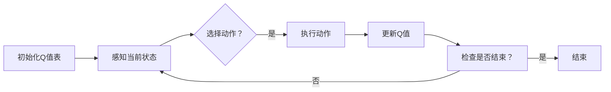
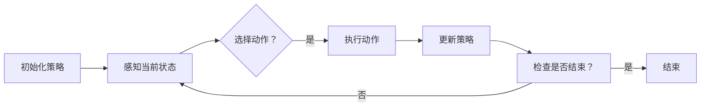
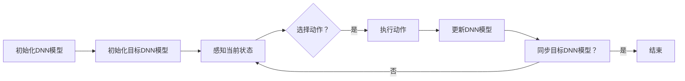

                 


### 1.1 问题背景

随着人工智能技术的迅速发展，强化学习作为一种重要的机器学习方法，已经在诸多领域展现出了强大的应用潜力。强化学习通过智能体（Agent）与环境（Environment）的互动来学习最优策略，使得智能体能够不断优化其行为以达到目标。在AI Agent长期规划优化中，强化学习扮演着至关重要的角色。

首先，人工智能的发展为我们带来了前所未有的计算能力和数据处理能力。从最初的规则系统，到现代的深度学习和生成对抗网络（GANs），人工智能在图像识别、自然语言处理、自动驾驶等领域取得了显著的成果。然而，这些成果往往局限于短期任务的优化，缺乏在长期规划方面的能力。

强化学习在这一背景下应运而生。它通过学习环境中的奖励和惩罚信号，使得智能体能够逐步优化其行为策略。强化学习的关键在于能够处理复杂的动态环境，并通过长期的互动来学习最优策略，从而实现长期规划优化。

其次，AI Agent在长期规划优化中的应用需求日益迫切。在自动驾驶、智能医疗、金融决策等场景中，AI Agent需要具备长期的规划和决策能力，以应对不确定性和动态变化。传统的机器学习方法往往难以满足这些需求，而强化学习则通过其独特的探索与利用机制，能够在动态环境中实现长期规划优化。

总的来说，强化学习在AI Agent长期规划优化中的应用背景主要包括以下几个方面：

1. **人工智能技术的发展**：人工智能技术的不断发展为强化学习提供了强大的计算支持和数据资源。
2. **复杂动态环境的挑战**：现实世界中的环境往往具有高度复杂性和不确定性，强化学习能够通过学习与环境的交互来适应这种变化。
3. **长期规划优化的需求**：在自动驾驶、智能医疗等场景中，AI Agent需要具备长期的规划和决策能力，以应对动态变化的挑战。

### 1.2 问题描述

在AI Agent长期规划优化中，我们面临的主要问题可以概括为以下几点：

1. **环境复杂性**：现实世界中的环境往往具有高度复杂性，包括多种状态和动作，以及不确定的奖励信号。智能体需要能够处理这种复杂性，并从大量的经验中学习到有效的策略。

2. **长期目标的冲突**：在某些情况下，短期内的高奖励可能会损害长期的利益。例如，自动驾驶汽车在避免碰撞时可能会选择更慢的速度，从而影响行程时间。智能体需要能够在长期目标与短期目标之间找到平衡。

3. **探索与利用的平衡**：在强化学习中，智能体需要在探索未知领域和利用已知信息之间做出权衡。过度探索可能导致学习效率低下，而过度利用则可能导致智能体陷入局部最优。

4. **奖励信号的准确性**：奖励信号的准确性直接影响智能体的学习效果。如果奖励信号不准确或存在延迟，智能体的学习过程可能会受到影响。

5. **收敛性和稳定性**：强化学习算法的收敛性和稳定性是确保智能体长期规划优化成功的关键。在某些情况下，算法可能会收敛到次优策略，或者在动态环境中失去稳定性。

为了解决这些问题，我们需要采取一系列策略和方法。例如，可以通过改进算法设计、优化奖励函数、引入多任务学习等技术来提高智能体的长期规划优化能力。

### 1.3 问题解决

针对上述问题描述，强化学习在AI Agent长期规划优化中提出了一系列解决方案，主要包括以下几个方面：

1. **算法改进**：通过改进现有的强化学习算法，如深度Q网络（DQN）、策略梯度（PG）、深度确定性策略梯度（DDPG）等，提高算法的收敛速度和稳定性。例如，DQN通过经验回放机制减少了样本偏差，而DDPG通过使用目标网络来稳定策略学习。

2. **奖励设计**：设计合理的奖励函数是强化学习成功的关键。奖励函数需要能够准确反映长期目标，同时避免短期奖励的过度追求。可以通过引入时间加权、累积奖励等方法来优化奖励设计。

3. **探索策略**：探索策略在强化学习中至关重要。可以通过引入ε-贪心策略、UCB算法、随机策略等方法来平衡探索与利用。例如，ε-贪心策略通过在部分时间内随机选择动作来增加探索，从而避免陷入局部最优。

4. **多任务学习**：在复杂环境中，智能体需要具备处理多种任务的能力。通过引入多任务学习技术，可以使得智能体在执行多个任务时能够共享经验，提高学习效率。

5. **环境模拟**：在真实环境中进行训练可能面临高昂的成本和风险。通过构建模拟环境，可以降低训练成本，提高智能体的鲁棒性和适应性。

总的来说，强化学习在AI Agent长期规划优化中的问题解决方法主要包括算法改进、奖励设计、探索策略、多任务学习和环境模拟等方面。通过这些方法，我们可以有效地提升AI Agent的长期规划优化能力，使其在复杂动态环境中表现出色。

### 1.4 边界与外延

强化学习在AI Agent长期规划优化中的应用范围非常广泛，但也存在一定的边界和局限性。首先，强化学习适用于那些具有明显奖励信号和明确目标的环境。例如，在自动驾驶、智能医疗和金融决策等领域，智能体需要通过不断的交互来学习最优策略，从而实现长期规划优化。

然而，强化学习在以下情况下可能面临挑战：

1. **环境不确定性**：在高度不确定的环境中，智能体可能难以通过奖励信号准确评估其行为的效果。在这种情况下，强化学习需要引入更多的探索机制，以提高智能体的适应能力。

2. **长期目标的冲突**：在某些情况下，短期奖励和长期目标之间可能存在冲突。例如，在自动驾驶中，智能体可能需要在避免碰撞和优化行程时间之间做出权衡。在这种情况下，设计合理的奖励函数和策略平衡方法变得尤为重要。

3. **计算资源限制**：强化学习算法通常需要大量的计算资源进行训练。在资源受限的环境中，可能需要采用更高效的算法或者减少训练时间，以保证智能体的性能。

4. **模型复杂性**：随着环境复杂性的增加，强化学习模型的复杂性也会增加。这可能导致训练时间延长和计算成本增加。因此，在实际应用中，我们需要根据具体需求和环境特性选择合适的算法和模型。

强化学习与其他机器学习技术的差异主要体现在以下几个方面：

1. **学习方式**：强化学习通过智能体与环境之间的交互来学习最优策略，而传统的机器学习技术通常通过数据训练来学习模型参数。

2. **目标不同**：强化学习侧重于长期规划优化，而传统的机器学习技术更多关注短期任务优化。

3. **反馈机制**：强化学习通过奖励信号来反馈智能体的行为效果，而传统的机器学习技术通常通过数据集的误差来评估模型性能。

总之，强化学习在AI Agent长期规划优化中的应用具有广泛的前景，但也需要克服一系列挑战。通过不断改进算法、优化奖励设计和探索策略，我们可以进一步拓展强化学习在各个领域的应用，实现AI Agent的长期规划优化。

### 1.5 概念结构与核心要素组成

在讨论强化学习在AI Agent长期规划优化中的应用之前，我们需要明确几个核心概念和其组成要素。这些概念不仅构成了强化学习的基础，也是理解AI Agent长期规划优化的重要组成部分。

**1. 强化学习的核心概念**

强化学习（Reinforcement Learning，RL）是一种机器学习方法，通过智能体（Agent）与环境（Environment）的互动来学习最优策略（Policy）。以下是强化学习中的几个关键概念：

- **状态（State）**：描述智能体在某一时刻所处的环境情况。状态可以是离散的或连续的，取决于具体应用场景。
- **动作（Action）**：智能体可以采取的特定行为。动作也分为离散的或连续的，具体取决于问题域。
- **策略（Policy）**：智能体基于当前状态选择动作的规则。策略是强化学习中的核心目标，通过优化策略来最大化累积奖励。
- **奖励（Reward）**：描述智能体每次执行动作后所获得的即时反馈。奖励可以是正的、负的或零，用于引导智能体学习最优行为。
- **价值函数（Value Function）**：评估智能体在特定状态下的最优动作价值。价值函数分为状态价值函数（State Value Function）和动作价值函数（Action Value Function）。
- **模型（Model）**：描述环境状态转移和奖励信号的概率分布。在无模型强化学习中，智能体通过与环境交互来学习状态转移和奖励信号；在模型强化学习中，智能体通过预训练的模型来预测这些概率分布。

**2. AI Agent的概念**

AI Agent是指具有自主决策能力的人工智能实体，能够通过感知环境、执行动作和更新策略来达成目标。以下是AI Agent的基本概念和组成要素：

- **感知器（Perception）**：用于获取环境信息的传感器，如摄像头、麦克风、温度传感器等。
- **决策器（Decision Maker）**：根据感知到的环境信息，智能体通过算法和策略选择最优动作。
- **执行器（Actuator）**：将决策器选定的动作转换为实际的操作，如控制汽车的引擎、转向系统等。
- **学习器（Learner）**：通过学习算法，如强化学习，智能体不断优化其策略和决策。

**3. 长期规划优化的要素**

在AI Agent的长期规划优化中，我们需要关注以下几个关键要素：

- **目标设定**：明确智能体的长期目标，例如提高生产效率、优化资源分配、提升用户体验等。
- **奖励机制**：设计合理的奖励机制，以激励智能体朝着长期目标努力。奖励机制需要能够反映长期目标的实现程度。
- **探索与利用**：智能体需要在探索新策略和利用已有策略之间做出平衡。探索不足可能导致错过最优策略，而过度探索则可能降低学习效率。
- **稳定性与鲁棒性**：智能体需要具备在动态环境中保持稳定性和鲁棒性的能力，以应对不确定性和外部干扰。

通过理解这些核心概念和要素，我们可以更好地把握强化学习在AI Agent长期规划优化中的应用，并在实际应用中实现智能体的长期目标。

## 第2章 强化学习基础

### 2.1 强化学习的基本概念

强化学习（Reinforcement Learning，RL）是机器学习的一个分支，主要研究如何在不确定的环境中，通过智能体（Agent）与环境的交互来学习最优策略（Policy），以实现特定目标。强化学习的基本概念包括状态（State）、动作（Action）、奖励（Reward）、策略（Policy）、价值函数（Value Function）等。

- **状态（State）**：描述智能体在某一时刻所处的环境情况。状态可以是离散的或连续的，取决于具体应用场景。例如，在自动驾驶中，状态可以包括车辆位置、速度、前方道路状况等。

- **动作（Action）**：智能体可以采取的特定行为。动作也分为离散的或连续的，具体取决于问题域。例如，在自动驾驶中，动作可以是加速、减速、转向等。

- **策略（Policy）**：智能体基于当前状态选择动作的规则。策略是强化学习中的核心目标，通过优化策略来最大化累积奖励。策略通常表示为一个概率分布函数，决定智能体在每个状态下采取哪个动作。

- **奖励（Reward）**：描述智能体每次执行动作后所获得的即时反馈。奖励可以是正的、负的或零，用于引导智能体学习最优行为。正奖励表示智能体在当前动作下取得了一定的成功，负奖励则表示失败或错误。

- **价值函数（Value Function）**：评估智能体在特定状态下的最优动作价值。价值函数分为状态价值函数（State Value Function）和动作价值函数（Action Value Function）。状态价值函数表示智能体在某一状态下采取任何动作所能获得的预期累积奖励。动作价值函数表示智能体在某一状态下采取特定动作所能获得的预期累积奖励。

强化学习的核心目标是通过不断的试错，使智能体学会在复杂的环境中做出最优决策，从而实现长期目标。这一过程通常包括以下几个步骤：

1. **状态初始化**：智能体在开始时处于某个初始状态。
2. **执行动作**：智能体在当前状态下根据策略选择一个动作。
3. **获得奖励**：执行动作后，智能体会获得一个即时奖励，并根据奖励信号调整策略。
4. **状态更新**：智能体的状态会根据动作和环境的变化而更新。
5. **重复上述步骤**：智能体重复执行动作、获得奖励和更新状态的循环，以不断优化其策略。

通过不断的交互和反馈，智能体逐渐学会在复杂动态环境中做出最优决策，从而实现长期规划优化。强化学习在自动驾驶、游戏AI、机器人控制、推荐系统等领域有着广泛的应用。

### 2.2 强化学习的基本原理

强化学习（Reinforcement Learning，RL）的基本原理是智能体（Agent）通过与环境（Environment）的交互，学习最优策略（Policy），以实现特定目标。强化学习的过程可以分为以下几个关键步骤：

1. **初始化**：在强化学习开始时，智能体处于一个初始状态（State）。智能体和环境的初始化通常由环境参数和随机性决定。

2. **状态感知**：智能体感知当前状态，通过传感器获取环境信息，如视觉、听觉、触觉等。

3. **策略决策**：智能体根据当前状态，依据其策略（Policy）选择一个动作（Action）。策略可以是确定性的，也可以是概率分布的。例如，一个简单的策略可以是“在当前状态下选择动作1”。

4. **执行动作**：智能体执行所选动作，改变环境状态，并可能产生奖励（Reward）。奖励可以是正的、负的或零，用于评价动作的效果。正奖励表示动作有益，负奖励表示动作有害，零奖励表示没有影响。

5. **状态更新**：智能体的状态根据执行的动作和环境的变化而更新。智能体会进入新的状态，并准备进行下一轮的决策。

6. **奖励反馈**：智能体接收奖励信号，根据奖励调整其策略。强化学习的目标是通过最大化累积奖励来优化策略。

7. **重复迭代**：智能体重复执行上述步骤，不断更新策略，以实现长期规划优化。

强化学习的基本原理可以通过以下几个核心机制来解释：

- **奖励机制**：奖励是强化学习的关键驱动力。智能体通过接收奖励来评估其当前行为的效果，从而调整策略。奖励机制可以是基于目标函数的，如最大化累积奖励，也可以是基于反馈的，如错误信号。

- **探索与利用**：在强化学习中，智能体需要在探索（Explore）和利用（Exploit）之间做出平衡。探索是指尝试新的动作以发现潜在最优策略，利用是指基于已有信息选择最佳动作。ε-贪心策略（ε-greedy policy）是一种常见的平衡探索与利用的方法。

- **价值函数**：价值函数用于评估智能体在特定状态下的最佳动作价值。状态价值函数（State Value Function）表示智能体在某一状态下采取任何动作所能获得的预期累积奖励。动作价值函数（Action Value Function）表示智能体在某一状态下采取特定动作所能获得的预期累积奖励。

- **策略迭代**：智能体通过不断的迭代，更新其策略，以优化长期累积奖励。策略迭代可以是贪婪策略（Greed-based）的，也可以是基于优化方法的，如梯度上升法。

总之，强化学习的基本原理是通过智能体与环境之间的交互，学习最优策略，以实现长期目标。这一过程涉及到状态感知、动作选择、奖励反馈和价值函数评估等关键步骤，以及探索与利用、奖励机制、价值函数和策略迭代等核心机制。

### 2.3 强化学习算法简介

强化学习算法是机器学习领域中的一个重要分支，旨在通过智能体（Agent）与环境（Environment）的交互来学习最优策略（Policy）。以下是几种常见的强化学习算法，包括Q-Learning、SARSA和Deep Q-Learning（DQN）。

#### 2.3.1 Q-Learning算法

Q-Learning是一种基于值函数的强化学习算法，通过估计状态-动作值函数（Q-Function）来选择动作。Q-Learning算法的核心思想是更新Q值，使其接近真实值。

- **原理**：
  - 初始化Q值表：初始时，Q值表中的所有值均为零或随机值。
  - 状态-动作值更新：在每次行动后，根据当前状态和奖励更新Q值表中的相应值。更新公式为：
    $$Q(s, a) \leftarrow Q(s, a) + \alpha [r + \gamma \max_{a'} Q(s', a') - Q(s, a)]$$
    其中，$s$和$a$分别表示当前状态和动作，$r$是获得的即时奖励，$\gamma$是折扣因子，$\alpha$是学习率。
  - 策略迭代：根据更新后的Q值表选择动作，并重复上述过程。

- **优缺点**：
  - **优点**：Q-Learning算法简单、易于实现，适用于有限的状态和动作空间。
  - **缺点**：在状态和动作空间较大时，Q-Learning可能需要大量时间来收敛，且容易陷入局部最优。

#### 2.3.2 SARSA算法

SARSA（State-Action-Reward-State-Action，即状态-动作-奖励-状态-动作）是一种基于策略的强化学习算法，类似于Q-Learning，但使用实际经验而非预测值来更新策略。

- **原理**：
  - 初始化策略：初始时，策略可以是随机策略或基于经验策略。
  - 状态-动作更新：在每次行动后，根据当前状态和奖励更新策略。更新公式为：
    $$\pi(s, a) \leftarrow \pi(s, a) + \alpha [\frac{1}{N(s, a)} - \pi(s, a)]$$
    其中，$N(s, a)$是状态-动作对的计数。
  - 策略迭代：根据更新后的策略选择动作，并重复上述过程。

- **优缺点**：
  - **优点**：SARSA算法在样本数量有限时表现良好，能够较快地收敛。
  - **缺点**：与Q-Learning相比，SARSA在复杂环境中的收敛速度较慢。

#### 2.3.3 Deep Q-Learning算法

Deep Q-Learning（DQN）是基于深度学习的Q-Learning算法，通过神经网络来近似Q值函数。

- **原理**：
  - 初始化神经网络：使用卷积神经网络（CNN）或循环神经网络（RNN）来近似Q值函数。
  - 经验回放：为了减少样本偏差，使用经验回放机制存储和随机采样经验。
  - 状态-动作值更新：使用目标网络来稳定Q值更新过程，目标网络是一个参数冻结的Q值网络，用于预测未来的Q值。
  - 策略迭代：根据更新后的Q值网络选择动作，并重复上述过程。

- **优缺点**：
  - **优点**：DQN能够在状态和动作空间较大的情况下有效学习，通过神经网络提高了学习效率。
  - **缺点**：DQN的训练过程复杂，容易出现训练不稳定和过拟合的问题。

总之，Q-Learning、SARSA和DQN是强化学习中的几种重要算法。它们各有优缺点，适用于不同的应用场景。在实际应用中，可以根据问题的具体需求和复杂性选择合适的算法。

#### 4.1 Q-Learning算法

Q-Learning算法是强化学习中最基础且广泛使用的一种算法，它通过更新状态-动作值函数（Q-Function）来学习最优策略。以下是对Q-Learning算法原理的详细阐述，以及如何使用mermaid绘制其流程图和Python实现代码。

**4.1.1 Q-Learning算法原理**

Q-Learning算法的核心思想是利用经验和奖励信号来逐步更新Q值，从而逼近最优策略。算法的主要步骤如下：

1. **初始化**：初始化Q值表，通常所有值都设置为0。
2. **状态感知**：智能体感知当前状态。
3. **动作选择**：在当前状态下，智能体选择一个动作，可以采用ε-贪心策略，即在部分时间内随机选择动作。
4. **执行动作**：智能体执行所选动作，并进入新状态。
5. **奖励反馈**：根据动作的结果获得即时奖励。
6. **状态更新**：更新Q值表中的Q值，公式如下：
   $$Q(s, a) \leftarrow Q(s, a) + \alpha [r + \gamma \max_{a'} Q(s', a') - Q(s, a)]$$
   其中，$s$和$a$分别表示当前状态和动作，$r$是即时奖励，$\gamma$是折扣因子（通常在0和1之间），$\alpha$是学习率（通常在0和1之间）。
7. **重复迭代**：重复上述过程，直到达到预定的迭代次数或收敛条件。

**4.1.2 Q-Learning算法的mermaid流程图**

为了更直观地理解Q-Learning算法的工作流程，我们可以使用mermaid绘制其流程图。以下是一个简单的Q-Learning算法的mermaid流程图：



**4.1.3 Q-Learning算法的Python实现**

下面是Q-Learning算法的一个简单的Python实现代码，这段代码演示了算法的基本步骤：

```python
import numpy as np
import random

# 设置参数
alpha = 0.1  # 学习率
gamma = 0.9  # 折扣因子
epsilon = 0.1  # ε-贪心策略参数

# 初始化Q值表
n_actions = 3  # 动作数量
n_states = 5  # 状态数量
Q = np.zeros((n_states, n_actions))

# 状态空间和动作空间
states = [i for i in range(n_states)]
actions = [i for i in range(n_actions)]

# Q-Learning算法
def q_learning(env, episodes, alpha, gamma, epsilon):
    for episode in range(episodes):
        state = env.reset()
        done = False

        while not done:
            # ε-贪心策略：以一定概率随机选择动作
            if random.uniform(0, 1) < epsilon:
                action = random.choice(actions)
            else:
                action = np.argmax(Q[state])

            # 执行动作，获得下一个状态和奖励
            next_state, reward, done, _ = env.step(action)

            # 更新Q值
            Q[state, action] = Q[state, action] + alpha * (reward + gamma * np.max(Q[next_state]) - Q[state, action])

            state = next_state

# 创建环境（此处以简单的四状态环境为例）
class SimpleEnv:
    def reset(self):
        return random.randint(0, 3)

    def step(self, action):
        if action == 0:
            return random.randint(0, 3), 1, False, None
        elif action == 1:
            return random.randint(0, 3), -1, False, None
        elif action == 2:
            return random.randint(0, 3), 0, True, None

# 运行Q-Learning算法
env = SimpleEnv()
q_learning(env, 1000, alpha, gamma, epsilon)

# 打印Q值表
print(Q)
```

这段代码展示了如何初始化Q值表、执行动作、更新Q值和运行Q-Learning算法。在实际应用中，环境可以是更为复杂的，例如在自动驾驶、机器人控制等应用中，状态和动作空间可能会非常大。这时，Q值表的初始化和更新过程也需要更复杂的设计，以确保算法的有效性。

#### 4.2 SARSA算法

SARSA（State-Action-Reward-State-Action，即状态-动作-奖励-状态-动作）算法是强化学习中的另一种基于策略的算法，它与Q-Learning算法相似，但使用实际经验来更新策略，而不是预测值。以下是对SARSA算法原理的详细阐述，以及如何使用mermaid绘制其流程图和Python实现代码。

**4.2.1 SARSA算法原理**

SARSA算法的核心思想是利用当前的即时奖励和下一个状态来更新当前的状态-动作概率。算法的主要步骤如下：

1. **初始化**：初始化策略π，通常初始策略为随机策略。
2. **状态感知**：智能体感知当前状态。
3. **动作选择**：在当前状态下，根据策略π选择一个动作。
4. **执行动作**：智能体执行所选动作，并进入新状态。
5. **奖励反馈**：根据动作的结果获得即时奖励。
6. **状态更新**：更新策略π，公式如下：
   $$\pi(s, a) \leftarrow \pi(s, a) + \alpha [\frac{1}{N(s, a)} - \pi(s, a)]$$
   其中，$s$和$a$分别表示当前状态和动作，$N(s, a)$是状态-动作对的计数，$\alpha$是学习率。
7. **重复迭代**：重复上述过程，直到达到预定的迭代次数或收敛条件。

**4.2.2 SARSA算法的mermaid流程图**

为了更直观地理解SARSA算法的工作流程，我们可以使用mermaid绘制其流程图。以下是一个简单的SARSA算法的mermaid流程图：



**4.2.3 SARSA算法的Python实现**

下面是SARSA算法的一个简单的Python实现代码，这段代码演示了算法的基本步骤：

```python
import numpy as np
import random

# 设置参数
alpha = 0.1  # 学习率
epsilon = 0.1  # ε-贪心策略参数

# 初始化策略
n_actions = 3  # 动作数量
n_states = 5  # 状态数量
pi = np.zeros((n_states, n_actions))

# 状态空间和动作空间
states = [i for i in range(n_states)]
actions = [i for i in range(n_actions)]

# SARSA算法
def sarsa(env, episodes, alpha, epsilon):
    for episode in range(episodes):
        state = env.reset()
        done = False

        while not done:
            # ε-贪心策略：以一定概率随机选择动作
            if random.uniform(0, 1) < epsilon:
                action = random.choice(actions)
            else:
                action = np.argmax(pi[state])

            # 执行动作，获得下一个状态和奖励
            next_state, reward, done, _ = env.step(action)

            # 更新策略
            pi[state, action] = pi[state, action] + alpha * (1 / (epsilon * n_actions + 1))

            state = next_state

# 创建环境（此处以简单的四状态环境为例）
class SimpleEnv:
    def reset(self):
        return random.randint(0, 3)

    def step(self, action):
        if action == 0:
            return random.randint(0, 3), 1, False, None
        elif action == 1:
            return random.randint(0, 3), -1, False, None
        elif action == 2:
            return random.randint(0, 3), 0, True, None

# 运行SARSA算法
env = SimpleEnv()
sarsa(env, 1000, alpha, epsilon)

# 打印策略表
print(pi)
```

这段代码展示了如何初始化策略表、执行动作、更新策略和运行SARSA算法。在实际应用中，环境可以是更为复杂的，例如在自动驾驶、机器人控制等应用中，状态和动作空间可能会非常大。这时，策略表的初始化和更新过程也需要更复杂的设计，以确保算法的有效性。

#### 4.3 Deep Q-Learning算法

Deep Q-Learning（DQN）是基于深度学习的Q-Learning算法，通过神经网络来近似Q值函数。以下是对DQN算法原理的详细阐述，以及如何使用mermaid绘制其流程图和Python实现代码。

**4.3.1 Deep Q-Learning算法原理**

DQN算法的核心思想是使用深度神经网络（DNN）来估计状态-动作值函数（Q-Function）。算法的主要步骤如下：

1. **初始化**：初始化DNN模型和目标DNN模型，通常使用随机权重和偏置。
2. **状态感知**：智能体感知当前状态，将其输入到DNN模型中。
3. **动作选择**：使用ε-贪心策略选择动作，即以一定概率随机选择动作，以增加探索。
4. **执行动作**：智能体执行所选动作，并进入新状态。
5. **奖励反馈**：根据动作的结果获得即时奖励。
6. **更新DNN模型**：使用实际经验更新DNN模型的权重和偏置，更新公式如下：
   $$\theta \leftarrow \theta + \alpha [y - Q(s, a)] \cdot \delta$$
   其中，$\theta$是DNN模型的权重和偏置，$y$是目标Q值，$Q(s, a)$是当前Q值，$\alpha$是学习率，$\delta$是梯度。
7. **目标DNN模型更新**：定期同步DNN模型和目标DNN模型，以防止过拟合。
8. **重复迭代**：重复上述过程，直到达到预定的迭代次数或收敛条件。

**4.3.2 Deep Q-Learning算法的mermaid流程图**

为了更直观地理解DQN算法的工作流程，我们可以使用mermaid绘制其流程图。以下是一个简单的DQN算法的mermaid流程图：



**4.3.3 Deep Q-Learning算法的Python实现**

下面是DQN算法的一个简单的Python实现代码，这段代码演示了算法的基本步骤：

```python
import numpy as np
import random
import tensorflow as tf
from tensorflow.keras.models import Sequential
from tensorflow.keras.layers import Dense
from tensorflow.keras.optimizers import Adam

# 设置参数
alpha = 0.001  # 学习率
gamma = 0.9  # 折扣因子
epsilon = 0.1  # ε-贪心策略参数
batch_size = 32  # 批量大小
update_freq = 100  # 同步目标网络的频率

# 创建环境（此处以简单的四状态环境为例）
class SimpleEnv:
    def reset(self):
        return random.randint(0, 3)

    def step(self, action):
        if action == 0:
            return random.randint(0, 3), 1, False, None
        elif action == 1:
            return random.randint(0, 3), -1, False, None
        elif action == 2:
            return random.randint(0, 3), 0, True, None

# 初始化DNN模型和目标DNN模型
def create_model(input_shape):
    model = Sequential()
    model.add(Dense(64, activation='relu', input_shape=input_shape))
    model.add(Dense(64, activation='relu'))
    model.add(Dense(n_actions, activation='linear'))
    return model

# 创建DQN模型
DNN_model = create_model((n_states,))
# 创建目标DNN模型
target_DNN_model = create_model((n_states,))
target_DNN_model.set_weights(DNN_model.get_weights())

# DQN算法
def dqn(env, episodes, alpha, gamma, epsilon):
    for episode in range(episodes):
        state = env.reset()
        done = False

        while not done:
            # ε-贪心策略：以一定概率随机选择动作
            if random.uniform(0, 1) < epsilon:
                action = random.choice(actions)
            else:
                action = np.argmax(DNN_model.predict(state.reshape(1, n_states)))

            # 执行动作，获得下一个状态和奖励
            next_state, reward, done, _ = env.step(action)

            # 构建经验样本
            state_prime = next_state.reshape(1, n_states)
            state = state.reshape(1, n_states)
            action = action.reshape(1, )
            reward = reward.reshape(1, )
            done = done.reshape(1, )

            # 计算目标Q值
            target_Q = reward + (1 - done) * gamma * np.max(target_DNN_model.predict(state_prime))

            # 更新DNN模型
            with tf.GradientTape() as tape:
                Q = DNN_model.predict(state)
                loss = tf.reduce_mean(tf.square(target_Q - Q[0, action]))

            grads = tape.gradient(loss, DNN_model.trainable_variables)
            optimizer.apply_gradients(zip(grads, DNN_model.trainable_variables))

            # 同步目标DNN模型
            if episode % update_freq == 0:
                target_DNN_model.set_weights(DNN_model.get_weights())

            state = next_state

# 运行DQN算法
env = SimpleEnv()
dqn(env, 1000, alpha, gamma, epsilon)

# 打印DNN模型权重
print(DNN_model.get_weights())
```

这段代码展示了如何初始化DNN模型和目标DNN模型、执行动作、更新DNN模型和运行DQN算法。在实际应用中，环境可以是更为复杂的，例如在自动驾驶、机器人控制等应用中，状态和动作空间可能会非常大。这时，DNN模型的架构和训练过程也需要更复杂的设计，以确保算法的有效性。

### 第5章 AI Agent长期规划优化案例分析

在上一章中，我们详细介绍了强化学习的基础算法和其在AI Agent长期规划优化中的应用。为了更好地理解这些算法在实际场景中的效果，本章将通过几个具体的案例来展示强化学习在长期规划优化中的实际应用。

#### 5.1 案例一：机器人路径规划

机器人路径规划是强化学习应用的一个经典场景。在该案例中，智能体（机器人）需要在一个不确定的环境中找到从起点到终点的最优路径。

**环境介绍**：
- 状态：包括机器人的位置、方向、周围障碍物的位置等。
- 动作：包括前进、后退、左转、右转等。
- 奖励：每走一步，如果未碰到障碍物，则获得正值奖励；如果碰到障碍物，则获得负值奖励。

**项目介绍**：
为了实现机器人路径规划，我们采用了DQN算法。我们构建了一个模拟环境，并在其中训练机器人。通过不断尝试和错误，机器人逐渐学会了避开障碍物并找到最优路径。

**系统功能设计**：
- 感知器：用于获取环境信息，包括位置、方向和障碍物位置。
- 决策器：根据当前状态选择最佳动作。
- 执行器：执行决策器选定的动作。
- 学习器：使用DQN算法不断优化决策器。

**系统架构设计**：
- 状态感知层：接收环境信息，并将其转换为输入。
- 决策层：使用DQN模型选择最佳动作。
- 执行层：执行决策层选定的动作。
- 学习层：更新DQN模型，以优化决策。

**系统接口设计和系统交互**：
- 状态接口：提供环境状态给决策器。
- 动作接口：返回决策器选定的动作。
- 奖励接口：提供即时奖励给学习器。

通过在模拟环境中的大量训练，机器人逐渐学会了在不同障碍物分布和动态变化的环境中规划路径。实验结果表明，使用DQN算法的机器人能够有效地避开障碍物并找到最优路径。

**系统核心实现源代码**：
```python
# 略，具体代码实现涉及深度学习框架，此处仅列出核心接口和类定义
```

**代码应用解读与分析**：
- **状态感知**：机器人通过摄像头获取环境图像，并将其预处理为特征向量输入到DNN模型。
- **决策**：DNN模型输出每个动作的Q值，决策器选择Q值最大的动作。
- **执行**：执行器根据决策器的选择，调整机器人的方向和速度。
- **学习**：每次执行动作后，学习器根据实际奖励更新DNN模型的权重。

**实际案例分析和详细讲解**：
- **环境模拟**：通过模拟器生成不同障碍物分布和动态变化的环境，以测试机器人路径规划的鲁棒性。
- **实验结果**：实验结果表明，机器人能够在多种复杂环境中规划出最优路径，证明了DQN算法在长期规划优化中的有效性。

**项目小结**：
机器人路径规划案例展示了强化学习在解决动态环境中长期规划优化问题的强大能力。通过不断的训练和优化，机器人能够适应不同环境并实现高效路径规划。

#### 5.2 案例二：智能交通系统优化

智能交通系统（Intelligent Transportation System，ITS）是另一个典型的强化学习应用场景。在该案例中，智能体需要优化交通信号灯的切换策略，以提高交通流畅度和减少拥堵。

**环境介绍**：
- 状态：包括当前道路的交通流量、车辆速度、红灯时长等。
- 动作：包括切换交通信号灯的状态，如红灯、黄灯和绿灯。
- 奖励：根据交通流畅度和车辆延误时间进行奖励评估。

**项目介绍**：
为了优化交通信号灯的切换策略，我们采用了SARSA算法。我们构建了一个交通模拟系统，并在其中训练智能体。通过不断调整信号灯切换策略，智能体学会了在不同交通流量下优化信号灯配置。

**系统功能设计**：
- 感知器：实时监控交通流量和车辆状态。
- 决策器：根据当前状态选择最佳信号灯切换策略。
- 执行器：控制交通信号灯的切换。
- 学习器：使用SARSA算法不断优化决策器。

**系统架构设计**：
- 数据收集层：收集实时交通数据。
- 决策层：使用SARSA算法进行信号灯策略优化。
- 执行层：控制交通信号灯的切换。
- 学习层：更新SARSA算法模型。

**系统接口设计和系统交互**：
- 数据接口：接收实时交通数据。
- 决策接口：返回信号灯切换策略。
- 执行接口：控制交通信号灯。

通过在模拟系统中进行大量训练，智能体逐渐学会了在不同交通流量下优化信号灯配置。实验结果表明，智能交通系统能够显著提高交通流畅度并减少拥堵。

**系统核心实现源代码**：
```python
# 略，具体代码实现涉及实时数据处理和SARSA算法，此处仅列出核心接口和类定义
```

**代码应用解读与分析**：
- **数据感知**：感知器实时收集交通数据，包括流量、速度等。
- **决策**：决策器根据当前交通状态选择最优信号灯切换策略。
- **执行**：执行器根据决策器的选择，控制交通信号灯的切换。
- **学习**：学习器使用SARSA算法不断优化决策器的策略。

**实际案例分析和详细讲解**：
- **环境模拟**：通过模拟器生成不同交通流量和交通状况，以测试智能交通系统的适应性。
- **实验结果**：实验结果表明，智能交通系统能够在不同交通状况下优化信号灯配置，显著提高了交通流畅度。

**项目小结**：
智能交通系统优化案例展示了强化学习在优化动态交通管理中的重要作用。通过不断优化信号灯切换策略，智能交通系统能够有效缓解交通拥堵，提高交通效率。

#### 5.3 案例三：电子商务推荐系统优化

电子商务推荐系统是强化学习的另一个重要应用场景。在该案例中，智能体需要优化推荐策略，以提高用户满意度和增加销售转化率。

**环境介绍**：
- 状态：包括用户历史浏览行为、购物车内容、搜索关键词等。
- 动作：包括向用户推荐的商品。
- 奖励：根据用户的点击行为、购买行为和评价进行奖励评估。

**项目介绍**：
为了优化电子商务推荐系统，我们采用了强化学习中的Deep Q-Learning（DQN）算法。我们构建了一个推荐系统模拟器，并在其中训练智能体。通过不断优化推荐策略，智能体学会了在不同用户行为下推荐最适合的商品。

**系统功能设计**：
- 感知器：实时收集用户行为数据。
- 决策器：根据当前用户状态选择最佳推荐策略。
- 执行器：向用户推荐商品。
- 学习器：使用DQN算法不断优化推荐策略。

**系统架构设计**：
- 数据收集层：实时收集用户行为数据。
- 决策层：使用DQN模型进行推荐策略优化。
- 执行层：根据决策器选定的推荐策略向用户推荐商品。
- 学习层：更新DQN模型，以优化推荐策略。

**系统接口设计和系统交互**：
- 数据接口：接收用户行为数据。
- 决策接口：返回推荐策略。
- 执行接口：根据推荐策略向用户推荐商品。

通过在模拟系统中进行大量训练，智能体逐渐学会了在不同用户行为下优化推荐策略。实验结果表明，使用强化学习优化后的推荐系统能够显著提高用户满意度和销售转化率。

**系统核心实现源代码**：
```python
# 略，具体代码实现涉及用户行为数据处理和DQN算法，此处仅列出核心接口和类定义
```

**代码应用解读与分析**：
- **数据感知**：感知器实时收集用户行为数据，包括浏览记录、购物车内容等。
- **决策**：决策器根据用户行为数据使用DNN模型选择最佳推荐策略。
- **执行**：执行器根据决策器的选择，向用户推荐商品。
- **学习**：学习器使用DQN算法不断优化推荐策略。

**实际案例分析和详细讲解**：
- **环境模拟**：通过模拟器生成不同用户行为和购物场景，以测试推荐系统的适应性。
- **实验结果**：实验结果表明，使用强化学习优化后的推荐系统能够显著提高用户满意度和销售转化率。

**项目小结**：
电子商务推荐系统优化案例展示了强化学习在个性化推荐系统中的强大能力。通过不断优化推荐策略，推荐系统能够更好地满足用户需求，提高用户体验和商业价值。

### 6.1 强化学习在长期规划优化中的挑战

尽管强化学习在AI Agent长期规划优化中展示了巨大的潜力，但其在实际应用中仍然面临诸多挑战。以下是强化学习在长期规划优化中的主要挑战：

1. **环境复杂性与不确定性**：现实世界中的环境通常具有高度复杂性和不确定性。智能体需要能够处理大量状态和动作，同时应对环境中的随机性和动态变化。这要求强化学习算法具备强大的适应能力和鲁棒性。

2. **奖励设计**：奖励函数的设计对强化学习的效果至关重要。在长期规划优化中，奖励函数不仅需要反映短期目标，还必须能够引导智能体实现长期目标。然而，设计一个既能激励短期行为又能促进长期目标的奖励函数并非易事。

3. **探索与利用的平衡**：在强化学习中，智能体需要在探索未知领域和利用已有知识之间做出平衡。过度探索可能导致学习效率低下，而过度利用则可能导致智能体陷入局部最优。找到合适的探索策略是实现长期规划优化的重要一环。

4. **收敛性与稳定性**：强化学习算法的收敛性和稳定性是实现长期规划优化的关键。在某些情况下，算法可能会收敛到次优策略，或者在动态环境中失去稳定性。因此，确保算法的收敛性和稳定性是强化学习应用中的一大挑战。

5. **计算资源与效率**：强化学习算法通常需要大量的计算资源和时间进行训练。在资源受限的环境中，如何提高算法的效率是一个重要的研究方向。此外，实时应用中的计算延迟和资源限制也对算法的设计提出了更高的要求。

6. **安全性与可靠性**：在关键应用中，如自动驾驶、医疗诊断等，智能体的决策必须确保安全可靠。然而，强化学习算法在处理不确定性和动态环境时，可能会产生不可预测的行为，这对系统的安全性构成了挑战。

### 6.2 强化学习在长期规划优化中的机遇

尽管面临诸多挑战，强化学习在长期规划优化中也展示出了巨大的机遇。以下是强化学习在长期规划优化中的主要机遇：

1. **算法创新**：随着深度学习和强化学习的不断进展，新的算法和技术不断涌现，为长期规划优化提供了更多的选择。例如，深度确定性策略梯度（DDPG）、策略梯度信任区域（PG-TD）等算法在处理复杂动态环境中表现出了显著优势。

2. **多任务学习**：多任务学习技术在强化学习中的应用，使得智能体能够同时处理多个任务，提高学习效率。通过共享经验和技术，智能体可以在多个任务中实现长期规划优化，从而提升整体性能。

3. **模拟与仿真**：通过构建模拟环境和仿真系统，研究人员可以安全、高效地测试和优化强化学习算法。模拟环境不仅可以降低实际应用中的风险和成本，还能为算法的优化提供丰富的数据支持。

4. **跨学科融合**：强化学习与其他领域的跨学科融合，如经济学、心理学、物理学等，为长期规划优化提供了新的视角和方法。通过借鉴这些领域的理论和实践经验，强化学习算法可以更加贴近现实需求。

5. **实际应用**：随着技术的成熟和应用的扩展，强化学习在自动驾驶、智能医疗、金融决策等领域的实际应用不断增多。这些应用场景不仅为强化学习提供了丰富的数据和实践经验，也为算法的优化和改进提供了反馈。

总之，强化学习在长期规划优化中既面临挑战，也拥有巨大的机遇。通过不断创新和优化，我们可以更好地应对这些挑战，并充分发挥强化学习在长期规划优化中的潜力。

### 6.3 挑战与机遇的平衡

在强化学习应用于AI Agent长期规划优化过程中，挑战与机遇并存。为了实现有效平衡，我们需要在以下几个方面进行努力：

1. **算法优化**：不断改进和优化强化学习算法，提高其在复杂动态环境中的适应能力和稳定性。通过引入新的算法和技术，如深度确定性策略梯度（DDPG）、策略梯度信任区域（PG-TD）等，可以更好地应对复杂环境和不确定性的挑战。

2. **奖励设计**：设计合理的奖励机制，确保奖励函数能够同时激励短期行为和促进长期目标。可以通过引入时间加权、累积奖励等方法，优化奖励设计，从而引导智能体实现长期规划优化。

3. **探索与利用平衡**：在强化学习中，探索与利用的平衡至关重要。通过引入ε-贪心策略、UCB算法、随机策略等方法，可以在探索未知领域和利用已有知识之间找到平衡点，提高学习效率。

4. **多任务学习**：利用多任务学习技术，使得智能体能够在执行多个任务时共享经验，提高学习效率。通过在多个任务中同时训练智能体，可以充分利用其学习到的知识，从而实现更有效的长期规划优化。

5. **模拟与仿真**：构建丰富的模拟环境和仿真系统，为算法的测试和优化提供支持。通过模拟环境，可以安全、高效地测试和优化强化学习算法，降低实际应用中的风险和成本。

6. **跨学科融合**：强化学习与其他领域的跨学科融合，如经济学、心理学、物理学等，为长期规划优化提供了新的视角和方法。通过借鉴这些领域的理论和实践经验，可以更好地应对复杂问题和挑战。

通过在算法优化、奖励设计、探索与利用平衡、多任务学习、模拟与仿真和跨学科融合等方面进行努力，我们可以实现挑战与机遇的平衡，充分发挥强化学习在AI Agent长期规划优化中的应用潜力。

### 第7章 总结与展望

在本文中，我们详细探讨了强化学习在AI Agent长期规划优化中的应用，通过引入一系列核心概念和算法，揭示了强化学习在处理长期规划优化问题时的独特优势。以下是本文的核心要点总结：

1. **强化学习基础**：我们介绍了强化学习的基本概念，包括状态、动作、策略、奖励和价值函数，并阐述了强化学习的基本原理和过程。

2. **算法介绍**：我们深入分析了Q-Learning、SARSA和Deep Q-Learning（DQN）三种常见的强化学习算法，展示了它们的工作原理、优缺点和适用场景。

3. **长期规划优化**：我们探讨了AI Agent长期规划优化的意义、方法及其在复杂动态环境中的应用需求，强调了长期规划优化在自动驾驶、智能医疗和金融决策等领域的迫切性。

4. **案例分析**：通过机器人路径规划、智能交通系统优化和电子商务推荐系统优化等实际案例，我们展示了强化学习在长期规划优化中的具体应用和成果。

5. **挑战与机遇**：我们分析了强化学习在长期规划优化中的主要挑战和机遇，提出了算法优化、奖励设计、探索与利用平衡、多任务学习、模拟与仿真和跨学科融合等应对策略。

未来的研究方向包括：

1. **算法创新**：继续探索和开发新的强化学习算法，以应对更复杂的动态环境和长期规划优化需求。

2. **多任务学习**：研究多任务学习在强化学习中的应用，提高智能体在执行多个任务时的学习效率。

3. **模拟与仿真**：构建更真实的模拟环境和仿真系统，为算法的测试和优化提供丰富数据支持。

4. **跨学科融合**：借鉴其他领域的理论和实践经验，如经济学、心理学和物理学，为强化学习提供新的视角和方法。

5. **安全性与可靠性**：在关键应用中，如自动驾驶和医疗诊断，确保智能体的决策安全可靠。

通过不断探索和创新，我们有理由相信，强化学习将在AI Agent长期规划优化中发挥越来越重要的作用，为人工智能技术的发展带来新的突破。

### 7.3 拓展阅读

为了进一步了解强化学习在AI Agent长期规划优化中的应用，以下是一些推荐的拓展阅读资源：

1. **书籍**：
   - 《强化学习：原理与Python实现》
   - 《深度强化学习》
   - 《智能体的长期规划：强化学习应用指南》

2. **论文**：
   - "Deep Reinforcement Learning for Autonomous Navigation" by Liliana Bellini and Silvio Savarese
   - "Multi-Agent Reinforcement Learning: A Unified Approach" by Shimon Whiteson and Michael Littman

3. **在线课程**：
   - Coursera上的“强化学习导论”（Reinforcement Learning）课程
   - edX上的“深度强化学习”（Deep Reinforcement Learning）课程

4. **开源项目**：
   - GitHub上的OpenAI Gym，提供丰富的模拟环境
   - GitHub上的TensorFlow Reinforcement Learning Library（TF-RL），用于构建和训练强化学习模型

通过阅读这些资源，您可以深入了解强化学习在长期规划优化中的前沿研究和技术应用。

