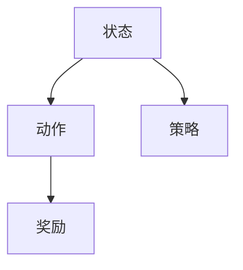
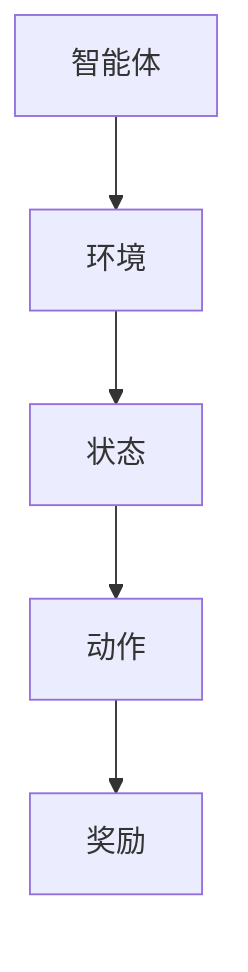
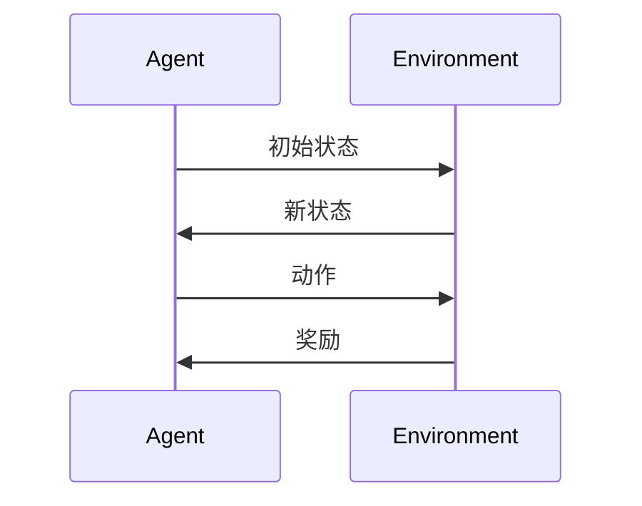

                 


**文章标题：强化学习驱动的AI Agent自主探索与学习**

**关键词：强化学习，AI Agent，自主探索，学习过程，算法原理，案例研究**

**摘要：**
本文旨在探讨强化学习驱动的AI Agent的自主探索与学习过程。通过深入分析强化学习的核心概念和算法，本文将详细介绍AI Agent的设计与实现，包括自主探索的策略和学习过程。此外，通过实际案例研究和系统架构设计，本文将为读者提供一个全面的理解，并探讨强化学习驱动的AI Agent所面临的挑战及未来发展方向。

## 第一部分: 引言与背景

### 1.1 强化学习的定义与历史背景

强化学习是一种无监督学习范式，它通过智能体（Agent）在与环境（Environment）交互的过程中，通过奖励（Reward）信号来指导学习。强化学习的目标是使智能体能够从初始状态开始，通过采取最优动作（Action）序列，最大化累积奖励。

强化学习起源于20世纪50年代的心理学研究，最初应用于动物学习行为的研究。随着计算机科学和人工智能的发展，强化学习逐渐成为了一个独立的研究领域。1952年，物理学家理查德·费曼（Richard Feynman）提出了“反馈算法”，被认为是强化学习的早期形式。

强化学习在20世纪80年代得到了快速发展，特别是1983年，迈克尔·爱泼斯坦（Michael L. Epstein）和戴维·斯通（David E. Stone）提出了Q-Learning算法。Q-Learning是一种基于值函数的强化学习算法，它通过预测每个状态-动作对的期望奖励来指导学习。

### 1.2 强化学习的核心问题与目标

强化学习的核心问题是如何通过学习找到一条最优动作序列，以实现累计奖励的最大化。在强化学习中，智能体需要通过不断与环境交互，从经验中学习如何采取最优动作。

强化学习的目标是使智能体能够在不确定的环境中自主地探索和学习，从而实现最优行为。具体来说，强化学习的目标包括：

1. **状态空间和动作空间**：确定智能体可以访问的状态集合和可以执行的动作集合。
2. **奖励函数**：定义智能体在执行某个动作后获得的奖励。
3. **策略**：确定智能体在给定状态下应该采取的动作。
4. **价值函数**：预测智能体在给定状态下采取某个动作后的长期奖励。

### 1.3 强化学习的应用领域

强化学习在多个领域都取得了显著的应用成果。以下是强化学习的一些主要应用领域：

1. **游戏**：强化学习在游戏领域有着广泛的应用，例如电子竞技、棋类游戏、电子游戏等。强化学习能够使智能体在游戏中实现自主学习和策略优化，提高游戏难度和趣味性。
2. **自动驾驶**：强化学习在自动驾驶领域具有巨大潜力。通过学习道路环境、交通规则和驾驶行为，自动驾驶汽车能够自主决策并采取安全、高效的驾驶策略。
3. **机器人控制**：强化学习在机器人控制领域被广泛应用于机器人导航、抓取和组装等任务。通过学习与环境的交互，机器人能够自主适应不同的环境和任务。
4. **推荐系统**：强化学习在推荐系统领域被用于构建个性化推荐模型，通过学习用户的兴趣和行为，提高推荐系统的准确性和用户体验。
5. **金融交易**：强化学习在金融交易领域被用于自动交易策略的优化，通过学习市场数据和历史交易记录，提高交易策略的收益和风险控制能力。

## 第二部分: 强化学习基础

### 2.1 强化学习的基本概念

强化学习（Reinforcement Learning，RL）是机器学习的一个分支，主要研究如何通过智能体（agent）与环境（environment）的交互来学习最优策略（policy），从而最大化累积奖励（cumulative reward）。强化学习涉及四个核心元素：

1. **智能体（Agent）**：执行动作并从环境中获取反馈的实体。
2. **环境（Environment）**：提供状态（state）并返回动作结果（reward）的动态系统。
3. **状态（State）**：描述智能体当前所处的情况。
4. **动作（Action）**：智能体可以采取的行为。

强化学习的过程可以概括为以下步骤：

1. **智能体从环境中获取初始状态（State）**。
2. **智能体在当前状态下选择一个动作（Action）**。
3. **环境根据智能体的动作返回新的状态（State）和奖励（Reward）**。
4. **智能体更新策略，以最大化未来奖励**。

### 2.2 强化学习的主要算法

强化学习有多种不同的算法，以下是其中一些主要的算法：

1. **Q-Learning**：Q-Learning是一种基于值函数的强化学习算法。它通过学习状态-动作值函数（Q-function）来预测每个状态-动作对的期望奖励。Q-Learning的更新公式为：
   $$ Q(s, a) \leftarrow Q(s, a) + \alpha [r + \gamma \max_{a'} Q(s', a') - Q(s, a)] $$
   其中，$ \alpha $是学习率，$ \gamma $是折扣因子，$ r $是即时奖励。

2. **SARSA（On-Policy Learning）**：SARSA是一种基于策略的强化学习算法，它使用当前策略来选择动作。SARSA的更新公式为：
   $$ Q(s, a) \leftarrow Q(s, a) + \alpha [r + \gamma Q(s', a')] - Q(s, a) $$
   其中，$ s $是当前状态，$ a $是当前动作，$ s' $是新的状态，$ a' $是新的动作。

3. **Q-Learning（Off-Policy Learning）**：Q-Learning可以用于不同策略的学习，它使用目标策略（target policy）来更新值函数。Q-Learning的更新公式为：
   $$ Q(s, a) \leftarrow Q(s, a) + \alpha [r + \gamma \max_{a'} Q(s', a') - Q(s, a)] $$
   其中，$ \max_{a'} Q(s', a') $是根据目标策略选择的动作。

4. **Deep Q-Network（DQN）**：DQN是结合了深度学习和Q-Learning的算法。它使用深度神经网络来近似Q函数，以提高在复杂环境中的学习能力。DQN的主要挑战是如何避免目标值函数（target value function）和估计值函数（estimated value function）之间的差异。

5. **Policy Gradient**：Policy Gradient算法直接优化策略的参数，而不是值函数。它的目标是最大化策略的概率分布。Policy Gradient的更新公式为：
   $$ \theta \leftarrow \theta + \alpha \nabla_{\theta} J(\theta) $$
   其中，$ \theta $是策略的参数，$ J(\theta) $是策略的评价函数。

### 2.3 强化学习算法的评估方法

评估强化学习算法的性能是验证其有效性和可靠性的关键步骤。以下是几种常用的评估方法：

1. **奖励积累（Cumulative Reward）**：奖励积累是指在整个学习过程中，智能体获得的累积奖励。较高的累积奖励表明算法能够在环境中获得更好的性能。

2. **学习曲线（Learning Curve）**：学习曲线展示了智能体在训练过程中的学习效果。学习曲线通常包括探索（Exploration）和利用（Exploitation）两个阶段。好的学习曲线应该显示智能体在较短的时间内迅速提高性能。

3. **样本效率（Sample Efficiency）**：样本效率是指算法在实现特定性能水平时所需的样本数量。较低的样本效率意味着算法能够更快地学习，从而降低训练成本。

4. **鲁棒性（Robustness）**：鲁棒性是指算法在不同环境和条件下保持稳定性能的能力。一个鲁棒的算法应该能够在面对变化和不确定性时保持性能。

5. **可扩展性（Scalability）**：可扩展性是指算法在处理大规模状态空间和动作空间时的性能。一个好的算法应该能够有效地处理复杂环境。

## 第三部分: 强化学习驱动的AI Agent基础

### 3.1 AI Agent的概念与类型

AI Agent是指具有自主决策能力，可以与环境交互并采取行动的计算机程序或实体。根据其行为方式和目标，AI Agent可以分为以下几种类型：

1. **基于规则的Agent**：这种类型的Agent通过预定义的规则来决策，它们通常不依赖于环境状态，而是根据预定的规则进行动作选择。这种类型的Agent适合处理结构化、确定性环境。

2. **基于模型的Agent**：这种类型的Agent使用模型来预测环境状态和动作结果，从而做出决策。基于模型的Agent通常使用强化学习算法来训练模型，以提高决策质量。

3. **基于行为的Agent**：这种类型的Agent通过观察环境中的行为模式来学习并做出决策。基于行为的Agent通常使用强化学习算法来发现环境中的奖励结构和最优策略。

4. **混合型Agent**：这种类型的Agent结合了基于规则、基于模型和基于行为的方法，以提高决策的灵活性和适应性。

### 3.2 强化学习在AI Agent中的应用

强化学习在AI Agent中的应用非常广泛，以下是其中一些主要的应用领域：

1. **游戏**：强化学习在游戏领域有着广泛的应用，例如电子竞技、棋类游戏、电子游戏等。强化学习能够使智能体在游戏中实现自主学习和策略优化，提高游戏难度和趣味性。

2. **自动驾驶**：强化学习在自动驾驶领域具有巨大潜力。通过学习道路环境、交通规则和驾驶行为，自动驾驶汽车能够自主决策并采取安全、高效的驾驶策略。

3. **机器人控制**：强化学习在机器人控制领域被广泛应用于机器人导航、抓取和组装等任务。通过学习与环境的交互，机器人能够自主适应不同的环境和任务。

4. **推荐系统**：强化学习在推荐系统领域被用于构建个性化推荐模型，通过学习用户的兴趣和行为，提高推荐系统的准确性和用户体验。

5. **金融交易**：强化学习在金融交易领域被用于自动交易策略的优化，通过学习市场数据和历史交易记录，提高交易策略的收益和风险控制能力。

### 3.3 AI Agent的设计原则

设计AI Agent时需要遵循一些关键原则，以确保其能够高效地完成任务。以下是几个主要的设计原则：

1. **自主性**：AI Agent应该具备自主决策能力，能够根据环境变化自主调整行为策略。

2. **适应性**：AI Agent应该能够适应不同的环境和任务，通过学习不断优化行为策略。

3. **鲁棒性**：AI Agent应该具备较强的鲁棒性，能够在面对变化和不确定性时保持稳定性能。

4. **可扩展性**：AI Agent的设计应该考虑到可扩展性，以便在处理大规模状态空间和动作空间时保持性能。

5. **可解释性**：AI Agent的行为应该具备一定的可解释性，以便人类能够理解和信任其决策过程。

## 第四部分: AI Agent的自主探索

### 4.1 自主探索的概念与重要性

在强化学习环境中，自主探索（Autonomous Exploration）是指智能体在未知环境中通过主动尝试不同的动作来获取信息，以提高学习效率。自主探索在强化学习中具有重要意义：

1. **提高学习效率**：通过主动探索，智能体可以更快地发现有利的行为策略，从而加速学习过程。

2. **增强鲁棒性**：自主探索使智能体能够适应不同的环境和条件，提高其鲁棒性。

3. **发现隐藏的奖励结构**：自主探索有助于智能体发现环境中的潜在奖励结构，从而更好地理解环境。

4. **提高决策质量**：通过探索，智能体可以获得更丰富的信息，从而做出更高质量的决策。

### 4.2 基于强化学习的自主探索方法

基于强化学习的自主探索方法主要包括以下几种：

1. **ε-贪心策略（ε-Greedy Policy）**：ε-贪心策略是一种简单的探索方法，其中智能体以概率ε随机选择动作，以1-ε的概率选择当前最优动作。这种方法在探索和利用之间取得平衡。

2. **UCB算法（Upper Confidence Bound）**：UCB算法是基于概率论的上界置信度方法，它通过估计每个动作的期望奖励并选择期望最高的动作来探索。UCB算法的优点是在探索和利用之间取得了较好的平衡。

3. **ε-贪心策略（ε-Greedy Policy）**：ε-贪心策略是一种简单的探索方法，其中智能体以概率ε随机选择动作，以1-ε的概率选择当前最优动作。这种方法在探索和利用之间取得平衡。

4. **UCB算法（Upper Confidence Bound）**：UCB算法是基于概率论的上界置信度方法，它通过估计每个动作的期望奖励并选择期望最高的动作来探索。UCB算法的优点是在探索和利用之间取得了较好的平衡。

5. **比率探索（Ratio-Exploration）**：比率探索方法通过计算每个动作的探索-利用比率来选择动作。比率探索方法可以更好地平衡探索和利用，特别是在动作效果差异较大的环境中。

### 4.3 自主探索策略的设计与实现

设计自主探索策略时需要考虑以下几个关键因素：

1. **探索概率**：探索概率是平衡探索和利用的关键参数。适当的探索概率可以提高学习效率并发现隐藏的奖励结构。

2. **探索策略**：探索策略是指智能体如何选择动作。常见的探索策略包括ε-贪心策略、UCB算法和比率探索方法。

3. **奖励结构**：奖励结构是影响智能体行为的关键因素。设计合理的奖励结构可以激励智能体探索和利用。

4. **学习算法**：学习算法用于更新智能体的策略和价值函数。选择合适的学习算法可以提高学习效率和决策质量。

在实际实现中，可以采用以下步骤：

1. **初始化探索概率和策略**：根据环境和任务特点，初始化探索概率和策略。

2. **进行探索和利用**：根据探索策略选择动作，并在执行动作后更新策略和价值函数。

3. **评估性能**：定期评估智能体的性能，并根据评估结果调整探索概率和策略。

4. **持续学习**：通过不断迭代探索和利用过程，智能体可以逐渐优化其策略并提高性能。

## 第五部分: AI Agent的学习过程

### 5.1 强化学习中的学习过程

在强化学习中，学习过程是指智能体通过与环境的交互来不断改进其策略和价值函数。学习过程通常包括以下步骤：

1. **状态初始化**：智能体从环境中获取初始状态。

2. **选择动作**：根据当前状态和策略选择动作。

3. **执行动作**：智能体执行选定的动作并观察环境反馈。

4. **更新策略和价值函数**：根据反馈信息更新策略和价值函数。

5. **重复步骤**：重复上述步骤，直至满足终止条件。

### 5.2 Q-Learning算法

Q-Learning算法是一种基于值函数的强化学习算法，它通过学习状态-动作值函数（Q-function）来预测每个状态-动作对的期望奖励。Q-Learning算法的主要步骤如下：

1. **初始化Q函数**：初始化Q函数的值为零或随机值。

2. **选择动作**：使用ε-贪心策略选择动作，其中ε是探索概率。

3. **执行动作**：执行选定的动作并观察环境反馈。

4. **更新Q函数**：根据反馈信息更新Q函数，公式如下：
   $$ Q(s, a) \leftarrow Q(s, a) + \alpha [r + \gamma \max_{a'} Q(s', a') - Q(s, a)] $$
   其中，$ \alpha $是学习率，$ \gamma $是折扣因子，$ r $是即时奖励。

5. **重复步骤**：重复上述步骤，直至满足终止条件。

### 5.3 SARSA算法

SARSA算法（同步自定步长自适应资源分配算法）是一种基于策略的强化学习算法，它使用当前策略来选择动作，并在动作执行后更新策略和价值函数。SARSA算法的主要步骤如下：

1. **初始化策略和价值函数**：初始化策略和价值函数的值为零或随机值。

2. **选择动作**：根据当前状态和策略选择动作。

3. **执行动作**：执行选定的动作并观察环境反馈。

4. **更新策略和价值函数**：根据反馈信息更新策略和价值函数，公式如下：
   $$ Q(s, a) \leftarrow Q(s, a) + \alpha [r + \gamma Q(s', a')] - Q(s, a) $$
   其中，$ \alpha $是学习率，$ \gamma $是折扣因子，$ r $是即时奖励。

5. **重复步骤**：重复上述步骤，直至满足终止条件。

## 第六部分: 强化学习驱动的AI Agent案例研究

### 6.1 案例一：机器人导航

在机器人导航中，强化学习驱动的AI Agent可以用于自主探索和路径规划。以下是一个简化的案例研究：

1. **问题背景**：机器人需要在未知环境中找到从起点到终点的路径。

2. **问题描述**：机器人处于一个离散的状态空间，每个状态表示机器人的位置。机器人可以采取四个基本动作：向左、向右、向前和后退。

3. **问题解决**：使用Q-Learning算法训练AI Agent，使其能够自主探索环境并找到最优路径。

4. **边界与外延**：边界包括机器人的行动范围和环境中的障碍物。外延包括不同的地形和可能的路径。

5. **概念结构与核心要素组成**：
   - **状态（State）**：机器人的位置。
   - **动作（Action）**：向左、向右、向前和后退。
   - **奖励（Reward）**：到达终点获得高奖励，遇到障碍物或走出边界获得低奖励。
   - **策略（Policy）**：基于Q函数的决策规则。

6. **ER实体关系图架构的Mermaid流程图**：
   ```mermaid
   graph TD
   A[状态] --> B[动作]
   B --> C[奖励]
   A --> D[策略]
   ```

7. **算法原理讲解**：
   - **Q函数（Q-function）**：Q函数用于预测每个状态-动作对的期望奖励。在训练过程中，Q函数不断更新，以逼近最优策略。
   - **ε-贪心策略（ε-greedy policy）**：在训练过程中，AI Agent以概率ε随机选择动作，以1-ε的概率选择当前最优动作。这种方法在探索和利用之间取得平衡。
   - **更新Q函数（Update Q-function）**：根据即时奖励和未来期望奖励更新Q函数，公式如下：
     $$ Q(s, a) \leftarrow Q(s, a) + \alpha [r + \gamma \max_{a'} Q(s', a') - Q(s, a)] $$
     其中，$ \alpha $是学习率，$ \gamma $是折扣因子，$ r $是即时奖励。

8. **Python源代码实现**：
   ```python
   import numpy as np

   # 初始化Q函数
   Q = np.zeros((n_states, n_actions))

   # 学习率
   alpha = 0.1

   # 折扣因子
   gamma = 0.9

   # ε-贪心策略
   epsilon = 0.1

   # 训练次数
   n_episodes = 1000

   # 每个动作的奖励
   rewards = np.zeros(n_actions)

   for episode in range(n_episodes):
       state = env.reset()
       done = False

       while not done:
           # 随机探索
           if np.random.rand() < epsilon:
               action = env.action_space.sample()

           # 贪心选择
           else:
               action = np.argmax(Q[state])

           # 执行动作
           next_state, reward, done, _ = env.step(action)

           # 更新Q函数
           Q[state, action] = Q[state, action] + alpha * (reward + gamma * np.max(Q[next_state]) - Q[state, action])

           state = next_state

   # 输出最优策略
   policy = np.argmax(Q, axis=1)

   print(policy)
   ```

9. **系统架构设计**：
   - **领域模型**：使用Mermaid类图表示机器人导航系统的领域模型。
   - **系统架构图**：使用Mermaid架构图表示机器人导航系统的架构设计。
   - **系统接口设计和系统交互**：使用Mermaid序列图表示机器人导航系统的接口设计和系统交互。

10. **项目实战**：
    - **环境安装**：安装Python环境，并安装所需的库，如NumPy、Matplotlib等。
    - **系统核心实现**：编写Python代码实现机器人导航系统的核心功能。
    - **代码应用解读与分析**：对核心代码进行解读和分析，解释算法原理和实现细节。
    - **实际案例分析和详细讲解剖析**：通过实际案例分析，详细讲解机器人导航系统的应用和效果。
    - **项目小结**：总结项目的主要成果和经验，提出改进建议。

### 6.2 案例二：游戏智能体

在游戏智能体中，强化学习驱动的AI Agent可以用于实现自主学习和策略优化。以下是一个简化的案例研究：

1. **问题背景**：智能体需要在电子游戏中实现自主学习和策略优化，以获得高分数。

2. **问题描述**：智能体处于一个离散的状态空间，每个状态表示游戏中的当前位置和资源情况。智能体可以采取多个动作，如攻击、防御、移动等。

3. **问题解决**：使用SARSA算法训练AI Agent，使其能够自主探索游戏环境并优化策略。

4. **边界与外延**：边界包括游戏中的障碍物和游戏结束条件。外延包括不同的游戏关卡和游戏策略。

5. **概念结构与核心要素组成**：
   - **状态（State）**：游戏中的当前位置和资源情况。
   - **动作（Action）**：攻击、防御、移动等。
   - **奖励（Reward）**：根据游戏得分和游戏状态调整奖励。
   - **策略（Policy）**：基于Q函数的决策规则。

6. **ER实体关系图架构的Mermaid流程图**：
   ```mermaid
   graph TD
   A[状态] --> B[动作]
   B --> C[奖励]
   A --> D[策略]
   ```

7. **算法原理讲解**：
   - **Q函数（Q-function）**：Q函数用于预测每个状态-动作对的期望奖励。在训练过程中，Q函数不断更新，以逼近最优策略。
   - **SARSA算法**：SARSA算法使用当前策略来选择动作，并在动作执行后更新策略和价值函数，公式如下：
     $$ Q(s, a) \leftarrow Q(s, a) + \alpha [r + \gamma Q(s', a')] - Q(s, a) $$
     其中，$ \alpha $是学习率，$ \gamma $是折扣因子，$ r $是即时奖励。

8. **Python源代码实现**：
   ```python
   import numpy as np

   # 初始化Q函数
   Q = np.zeros((n_states, n_actions))

   # 学习率
   alpha = 0.1

   # 折扣因子
   gamma = 0.9

   # 训练次数
   n_episodes = 1000

   for episode in range(n_episodes):
       state = env.reset()
       done = False

       while not done:
           # 选择动作
           action = np.random.randint(n_actions)

           # 执行动作
           next_state, reward, done, _ = env.step(action)

           # 更新Q函数
           Q[state, action] = Q[state, action] + alpha * (reward + gamma * np.max(Q[next_state]) - Q[state, action])

           state = next_state

   # 输出最优策略
   policy = np.argmax(Q, axis=1)

   print(policy)
   ```

9. **系统架构设计**：
   - **领域模型**：使用Mermaid类图表示游戏智能体的领域模型。
   - **系统架构图**：使用Mermaid架构图表示游戏智能体的架构设计。
   - **系统接口设计和系统交互**：使用Mermaid序列图表示游戏智能体的接口设计和系统交互。

10. **项目实战**：
    - **环境安装**：安装Python环境，并安装所需的库，如NumPy、Matplotlib等。
    - **系统核心实现**：编写Python代码实现游戏智能体的核心功能。
    - **代码应用解读与分析**：对核心代码进行解读和分析，解释算法原理和实现细节。
    - **实际案例分析和详细讲解剖析**：通过实际案例分析，详细讲解游戏智能体的应用和效果。
    - **项目小结**：总结项目的主要成果和经验，提出改进建议。

### 6.3 案例三：智能客服机器人

在智能客服机器人中，强化学习驱动的AI Agent可以用于实现自然语言处理和智能对话。以下是一个简化的案例研究：

1. **问题背景**：智能客服机器人需要在多轮对话中理解和回答用户的问题。

2. **问题描述**：智能客服机器人处于一个文本状态空间，每个状态表示用户的输入和机器人的当前回答。智能客服机器人可以采取多个动作，如回答问题、请求更多信息、结束对话等。

3. **问题解决**：使用Policy Gradient算法训练AI Agent，使其能够自主探索对话环境并优化策略。

4. **边界与外延**：边界包括对话的结束条件和用户的输入限制。外延包括不同的用户问题和对话策略。

5. **概念结构与核心要素组成**：
   - **状态（State）**：用户的输入和机器人的当前回答。
   - **动作（Action）**：回答问题、请求更多信息、结束对话等。
   - **奖励（Reward）**：根据对话效果和用户满意度调整奖励。
   - **策略（Policy）**：基于策略梯度的决策规则。

6. **ER实体关系图架构的Mermaid流程图**：
   ```mermaid
   graph TD
   A[状态] --> B[动作]
   B --> C[奖励]
   A --> D[策略]
   ```

7. **算法原理讲解**：
   - **策略梯度（Policy Gradient）**：策略梯度算法直接优化策略的参数，公式如下：
     $$ \theta \leftarrow \theta + \alpha \nabla_{\theta} J(\theta) $$
     其中，$ \theta $是策略的参数，$ J(\theta) $是策略的评价函数。
   - **优势函数（Advantage Function）**：优势函数用于衡量每个动作相对于其他动作的优劣，公式如下：
     $$ A(s, a) = Q(s, a) - V(s) $$
     其中，$ Q(s, a) $是状态-动作值函数，$ V(s) $是状态值函数。

8. **Python源代码实现**：
   ```python
   import numpy as np

   # 初始化策略参数
   theta = np.random.rand(n_states, n_actions)

   # 学习率
   alpha = 0.1

   # 训练次数
   n_episodes = 1000

   for episode in range(n_episodes):
       state = env.reset()
       done = False

       while not done:
           # 选择动作
           action = np.random.choice(n_actions, p=softmax(theta[state]))

           # 执行动作
           next_state, reward, done, _ = env.step(action)

           # 更新策略参数
           advantage = Q[next_state] - V[state]
           theta[state, action] += alpha * advantage

           state = next_state

   # 输出最优策略
   policy = np.argmax(theta, axis=1)

   print(policy)
   ```

9. **系统架构设计**：
   - **领域模型**：使用Mermaid类图表示智能客服机器人的领域模型。
   - **系统架构图**：使用Mermaid架构图表示智能客服机器人的架构设计。
   - **系统接口设计和系统交互**：使用Mermaid序列图表示智能客服机器人的接口设计和系统交互。

10. **项目实战**：
    - **环境安装**：安装Python环境，并安装所需的库，如NumPy、Matplotlib等。
    - **系统核心实现**：编写Python代码实现智能客服机器人的核心功能。
    - **代码应用解读与分析**：对核心代码进行解读和分析，解释算法原理和实现细节。
    - **实际案例分析和详细讲解剖析**：通过实际案例分析，详细讲解智能客服机器人的应用和效果。
    - **项目小结**：总结项目的主要成果和经验，提出改进建议。

## 第七部分: 强化学习驱动的AI Agent的挑战与未来展望

### 7.1 强化学习驱动的AI Agent的挑战

强化学习驱动的AI Agent面临着多个挑战，包括但不限于以下几个方面：

1. **样本效率问题**：强化学习通常需要大量的交互和经验积累才能收敛到最优策略。样本效率问题是指如何在有限的数据和计算资源下提高学习效率。

2. **探索与利用的平衡**：探索和利用是强化学习的两个基本问题。如何平衡探索新策略和利用已有知识以提高性能是一个关键挑战。

3. **稳定性和鲁棒性**：强化学习算法在面临环境变化和不确定性时可能表现不稳定。提高算法的稳定性和鲁棒性是一个重要的研究方向。

4. **可解释性**：强化学习算法的决策过程通常较为复杂，难以解释。提高算法的可解释性有助于人类理解和信任AI Agent的行为。

5. **大规模应用**：强化学习在复杂环境中的大规模应用面临计算资源和数据资源的限制。如何扩展强化学习算法以适应大规模应用场景是一个重要挑战。

### 7.2 未来展望

尽管面临着诸多挑战，强化学习驱动的AI Agent在未来有着广阔的应用前景。以下是几个未来展望：

1. **模型压缩与优化**：通过模型压缩和优化技术，可以降低强化学习算法的计算复杂度，提高样本效率。

2. **多智能体强化学习**：多智能体强化学习将多个AI Agent整合在一起，协同工作，提高整体性能。

3. **自适应学习**：结合自适应学习技术，使AI Agent能够动态调整学习策略，适应环境变化。

4. **强化学习与深度学习的融合**：将强化学习与深度学习结合，利用深度学习强大的特征提取能力，提高强化学习算法的性能。

5. **跨学科研究**：结合心理学、认知科学等跨学科研究，探索人类学习和决策机制，为强化学习提供更多启示。

### 7.3 结论与建议

本文从强化学习的定义、基础算法、AI Agent的设计和实现、自主探索策略、学习过程和实际案例研究等方面，探讨了强化学习驱动的AI Agent的自主探索与学习。尽管强化学习在AI Agent领域取得了显著进展，但仍然面临着诸多挑战。未来的研究应重点关注模型优化、多智能体协同、自适应学习和跨学科研究等方面，以推动强化学习驱动的AI Agent在更广泛领域的应用。

**最佳实践 Tips**：

1. **数据收集与预处理**：确保数据质量和预处理，为训练提供高质量的数据。
2. **算法选择与参数调优**：根据具体应用场景选择合适的算法，并合理调整参数，以提高性能。
3. **模型解释与可视化**：结合模型解释和可视化技术，提高算法的可解释性。
4. **持续学习和更新**：定期更新模型和策略，以适应环境变化和新的数据。

**小结**：

本文通过深入分析强化学习驱动的AI Agent的自主探索与学习，为读者提供了一个全面的理解。通过实际案例研究和系统架构设计，本文展示了强化学习驱动的AI Agent在多个领域的应用前景。未来的研究应关注算法优化、跨学科融合和大规模应用，以推动强化学习驱动的AI Agent的发展。

**注意事项**：

1. **环境设置**：确保安装了Python环境及相关库，如NumPy、Matplotlib等。
2. **代码运行**：在运行代码前，确保正确配置环境变量和参数。

**拓展阅读**：

1. Sutton, R. S., & Barto, A. G. (2018). Reinforcement Learning: An Introduction.
2. Mnih, V., Kavukcuoglu, K., Silver, D., et al. (2013). Human-level control through deep reinforcement learning.
3. Q-Learning算法的Python实现：https://github.com/rlcode/q-learning-python
4. Policy Gradient算法的Python实现：https://github.com/rlcode/policy-gradient-python

**作者信息**：

作者：AI天才研究院/AI Genius Institute & 禅与计算机程序设计艺术/Zen And The Art of Computer Programming

## 完整文章

**强化学习驱动的AI Agent自主探索与学习**

> 关键词：强化学习，AI Agent，自主探索，学习过程，算法原理，案例研究

**摘要：**

本文旨在探讨强化学习驱动的AI Agent的自主探索与学习过程。通过深入分析强化学习的核心概念和算法，本文将详细介绍AI Agent的设计与实现，包括自主探索的策略和学习过程。此外，通过实际案例研究和系统架构设计，本文将为读者提供一个全面的理解，并探讨强化学习驱动的AI Agent所面临的挑战及未来发展方向。

## 引言与背景

### 强化学习的定义与历史背景

强化学习（Reinforcement Learning，RL）是一种无监督学习范式，它通过智能体（Agent）在与环境（Environment）交互的过程中，通过奖励（Reward）信号来指导学习。强化学习的目标是使智能体能够从初始状态开始，通过采取最优动作（Action）序列，最大化累积奖励。

强化学习起源于20世纪50年代的心理学研究，最初应用于动物学习行为的研究。随着计算机科学和人工智能的发展，强化学习逐渐成为了一个独立的研究领域。1952年，物理学家理查德·费曼（Richard Feynman）提出了“反馈算法”，被认为是强化学习的早期形式。

强化学习在20世纪80年代得到了快速发展，特别是1983年，迈克尔·爱泼斯坦（Michael L. Epstein）和戴维·斯通（David E. Stone）提出了Q-Learning算法。Q-Learning是一种基于值函数的强化学习算法，它通过预测每个状态-动作对的期望奖励来指导学习。

### 强化学习的核心问题与目标

强化学习的核心问题是如何通过学习找到一条最优动作序列，以实现累计奖励的最大化。在强化学习中，智能体需要通过不断与环境交互，从经验中学习如何采取最优动作。

强化学习的目标包括：

1. **状态空间和动作空间**：确定智能体可以访问的状态集合和可以执行的动作集合。
2. **奖励函数**：定义智能体在执行某个动作后获得的奖励。
3. **策略**：确定智能体在给定状态下应该采取的动作。
4. **价值函数**：预测智能体在给定状态下采取某个动作后的长期奖励。

### 强化学习的应用领域

强化学习在多个领域都取得了显著的应用成果。以下是强化学习的一些主要应用领域：

1. **游戏**：强化学习在游戏领域有着广泛的应用，例如电子竞技、棋类游戏、电子游戏等。强化学习能够使智能体在游戏中实现自主学习和策略优化，提高游戏难度和趣味性。
2. **自动驾驶**：强化学习在自动驾驶领域具有巨大潜力。通过学习道路环境、交通规则和驾驶行为，自动驾驶汽车能够自主决策并采取安全、高效的驾驶策略。
3. **机器人控制**：强化学习在机器人控制领域被广泛应用于机器人导航、抓取和组装等任务。通过学习与环境的交互，机器人能够自主适应不同的环境和任务。
4. **推荐系统**：强化学习在推荐系统领域被用于构建个性化推荐模型，通过学习用户的兴趣和行为，提高推荐系统的准确性和用户体验。
5. **金融交易**：强化学习在金融交易领域被用于自动交易策略的优化，通过学习市场数据和历史交易记录，提高交易策略的收益和风险控制能力。

## 强化学习基础

### 强化学习的基本概念

强化学习（Reinforcement Learning，RL）是机器学习的一个分支，主要研究如何通过智能体（agent）与环境（environment）的交互来学习最优策略（policy），从而最大化累积奖励（cumulative reward）。强化学习涉及四个核心元素：

1. **智能体（Agent）**：执行动作并从环境中获取反馈的实体。
2. **环境（Environment）**：提供状态（state）并返回动作结果（reward）的动态系统。
3. **状态（State）**：描述智能体当前所处的情况。
4. **动作（Action）**：智能体可以采取的行为。

强化学习的过程可以概括为以下步骤：

1. **智能体从环境中获取初始状态（State）**。
2. **智能体在当前状态下选择一个动作（Action）**。
3. **环境根据智能体的动作返回新的状态（State）和奖励（Reward）**。
4. **智能体更新策略，以最大化未来奖励**。

### 强化学习的主要算法

强化学习有多种不同的算法，以下是其中一些主要的算法：

1. **Q-Learning**：Q-Learning是一种基于值函数的强化学习算法。它通过学习状态-动作值函数（Q-function）来预测每个状态-动作对的期望奖励。Q-Learning的更新公式为：
   $$ Q(s, a) \leftarrow Q(s, a) + \alpha [r + \gamma \max_{a'} Q(s', a') - Q(s, a)] $$
   其中，$ \alpha $是学习率，$ \gamma $是折扣因子，$ r $是即时奖励。

2. **SARSA（On-Policy Learning）**：SARSA是一种基于策略的强化学习算法，它使用当前策略来选择动作。SARSA的更新公式为：
   $$ Q(s, a) \leftarrow Q(s, a) + \alpha [r + \gamma Q(s', a')] - Q(s, a) $$
   其中，$ s $是当前状态，$ a $是当前动作，$ s' $是新的状态，$ a' $是新的动作。

3. **Q-Learning（Off-Policy Learning）**：Q-Learning可以用于不同策略的学习，它使用目标策略（target policy）来更新值函数。Q-Learning的更新公式为：
   $$ Q(s, a) \leftarrow Q(s, a) + \alpha [r + \gamma \max_{a'} Q(s', a') - Q(s, a)] $$
   其中，$ \max_{a'} Q(s', a') $是根据目标策略选择的动作。

4. **Deep Q-Network（DQN）**：DQN是结合了深度学习和Q-Learning的算法。它使用深度神经网络来近似Q函数，以提高在复杂环境中的学习能力。DQN的主要挑战是如何避免目标值函数（target value function）和估计值函数（estimated value function）之间的差异。

5. **Policy Gradient**：Policy Gradient算法直接优化策略的参数，而不是值函数。它的目标是最大化策略的概率分布。Policy Gradient的更新公式为：
   $$ \theta \leftarrow \theta + \alpha \nabla_{\theta} J(\theta) $$
   其中，$ \theta $是策略的参数，$ J(\theta) $是策略的评价函数。

### 强化学习算法的评估方法

评估强化学习算法的性能是验证其有效性和可靠性的关键步骤。以下是几种常用的评估方法：

1. **奖励积累（Cumulative Reward）**：奖励积累是指在整个学习过程中，智能体获得的累积奖励。较高的累积奖励表明算法能够在环境中获得更好的性能。

2. **学习曲线（Learning Curve）**：学习曲线展示了智能体在训练过程中的学习效果。学习曲线通常包括探索（Exploration）和利用（Exploitation）两个阶段。好的学习曲线应该显示智能体在较短的时间内迅速提高性能。

3. **样本效率（Sample Efficiency）**：样本效率是指算法在实现特定性能水平时所需的样本数量。较低的样本效率意味着算法能够更快地学习，从而降低训练成本。

4. **鲁棒性（Robustness）**：鲁棒性是指算法在不同环境和条件下保持稳定性能的能力。一个鲁棒的算法应该能够在面对变化和不确定性时保持性能。

5. **可扩展性（Scalability）**：可扩展性是指算法在处理大规模状态空间和动作空间时的性能。一个好的算法应该能够有效地处理复杂环境。

## 强化学习驱动的AI Agent基础

### AI Agent的概念与类型

AI Agent是指具有自主决策能力，可以与环境交互并采取行动的计算机程序或实体。根据其行为方式和目标，AI Agent可以分为以下几种类型：

1. **基于规则的Agent**：这种类型的Agent通过预定义的规则来决策，它们通常不依赖于环境状态，而是根据预定的规则进行动作选择。这种类型的Agent适合处理结构化、确定性环境。

2. **基于模型的Agent**：这种类型的Agent使用模型来预测环境状态和动作结果，从而做出决策。基于模型的Agent通常使用强化学习算法来训练模型，以提高决策质量。

3. **基于行为的Agent**：这种类型的Agent通过观察环境中的行为模式来学习并做出决策。基于行为的Agent通常使用强化学习算法来发现环境中的奖励结构和最优策略。

4. **混合型Agent**：这种类型的Agent结合了基于规则、基于模型和基于行为的方法，以提高决策的灵活性和适应性。

### 强化学习在AI Agent中的应用

强化学习在AI Agent中的应用非常广泛，以下是其中一些主要的应用领域：

1. **游戏**：强化学习在游戏领域有着广泛的应用，例如电子竞技、棋类游戏、电子游戏等。强化学习能够使智能体在游戏中实现自主学习和策略优化，提高游戏难度和趣味性。

2. **自动驾驶**：强化学习在自动驾驶领域具有巨大潜力。通过学习道路环境、交通规则和驾驶行为，自动驾驶汽车能够自主决策并采取安全、高效的驾驶策略。

3. **机器人控制**：强化学习在机器人控制领域被广泛应用于机器人导航、抓取和组装等任务。通过学习与环境的交互，机器人能够自主适应不同的环境和任务。

4. **推荐系统**：强化学习在推荐系统领域被用于构建个性化推荐模型，通过学习用户的兴趣和行为，提高推荐系统的准确性和用户体验。

5. **金融交易**：强化学习在金融交易领域被用于自动交易策略的优化，通过学习市场数据和历史交易记录，提高交易策略的收益和风险控制能力。

### AI Agent的设计原则

设计AI Agent时需要遵循一些关键原则，以确保其能够高效地完成任务。以下是几个主要的设计原则：

1. **自主性**：AI Agent应该具备自主决策能力，能够根据环境变化自主调整行为策略。

2. **适应性**：AI Agent应该能够适应不同的环境和任务，通过学习不断优化行为策略。

3. **鲁棒性**：AI Agent应该具备较强的鲁棒性，能够在面对变化和不确定性时保持稳定性能。

4. **可扩展性**：AI Agent的设计应该考虑到可扩展性，以便在处理大规模状态空间和动作空间时保持性能。

5. **可解释性**：AI Agent的行为应该具备一定的可解释性，以便人类能够理解和信任其决策过程。

## AI Agent的自主探索

### 自主探索的概念与重要性

在强化学习环境中，自主探索（Autonomous Exploration）是指智能体在未知环境中通过主动尝试不同的动作来获取信息，以提高学习效率。自主探索在强化学习中具有重要意义：

1. **提高学习效率**：通过主动探索，智能体可以更快地发现有利的行为策略，从而加速学习过程。

2. **增强鲁棒性**：自主探索使智能体能够适应不同的环境和条件，提高其鲁棒性。

3. **发现隐藏的奖励结构**：自主探索有助于智能体发现环境中的潜在奖励结构，从而更好地理解环境。

4. **提高决策质量**：通过探索，智能体可以获得更丰富的信息，从而做出更高质量的决策。

### 基于强化学习的自主探索方法

基于强化学习的自主探索方法主要包括以下几种：

1. **ε-贪心策略（ε-Greedy Policy）**：ε-贪心策略是一种简单的探索方法，其中智能体以概率ε随机选择动作，以1-ε的概率选择当前最优动作。这种方法在探索和利用之间取得平衡。

2. **UCB算法（Upper Confidence Bound）**：UCB算法是基于概率论的上界置信度方法，它通过估计每个动作的期望奖励并选择期望最高的动作来探索。UCB算法的优点是在探索和利用之间取得了较好的平衡。

3. **比率探索（Ratio-Exploration）**：比率探索方法通过计算每个动作的探索-利用比率来选择动作。比率探索方法可以更好地平衡探索和利用，特别是在动作效果差异较大的环境中。

### 自主探索策略的设计与实现

设计自主探索策略时需要考虑以下几个关键因素：

1. **探索概率**：探索概率是平衡探索和利用的关键参数。适当的探索概率可以提高学习效率并发现隐藏的奖励结构。

2. **探索策略**：探索策略是指智能体如何选择动作。常见的探索策略包括ε-贪心策略、UCB算法和比率探索方法。

3. **奖励结构**：奖励结构是影响智能体行为的关键因素。设计合理的奖励结构可以激励智能体探索和利用。

4. **学习算法**：学习算法用于更新智能体的策略和价值函数。选择合适的学习算法可以提高学习效率和决策质量。

在实际实现中，可以采用以下步骤：

1. **初始化探索概率和策略**：根据环境和任务特点，初始化探索概率和策略。

2. **进行探索和利用**：根据探索策略选择动作，并在执行动作后更新策略和价值函数。

3. **评估性能**：定期评估智能体的性能，并根据评估结果调整探索概率和策略。

4. **持续学习**：通过不断迭代探索和利用过程，智能体可以逐渐优化其策略并提高性能。

## AI Agent的学习过程

### 强化学习中的学习过程

在强化学习中，学习过程是指智能体通过与环境的交互来不断改进其策略和价值函数。学习过程通常包括以下步骤：

1. **状态初始化**：智能体从环境中获取初始状态。

2. **选择动作**：根据当前状态和策略选择动作。

3. **执行动作**：智能体执行选定的动作并观察环境反馈。

4. **更新策略和价值函数**：根据反馈信息更新策略和价值函数。

5. **重复步骤**：重复上述步骤，直至满足终止条件。

### Q-Learning算法

Q-Learning算法是一种基于值函数的强化学习算法，它通过学习状态-动作值函数（Q-function）来预测每个状态-动作对的期望奖励。Q-Learning算法的主要步骤如下：

1. **初始化Q函数**：初始化Q函数的值为零或随机值。

2. **选择动作**：使用ε-贪心策略选择动作，其中ε是探索概率。

3. **执行动作**：执行选定的动作并观察环境反馈。

4. **更新Q函数**：根据反馈信息更新Q函数，公式如下：
   $$ Q(s, a) \leftarrow Q(s, a) + \alpha [r + \gamma \max_{a'} Q(s', a') - Q(s, a)] $$
   其中，$ \alpha $是学习率，$ \gamma $是折扣因子，$ r $是即时奖励。

5. **重复步骤**：重复上述步骤，直至满足终止条件。

### SARSA算法

SARSA算法（同步自定步长自适应资源分配算法）是一种基于策略的强化学习算法，它使用当前策略来选择动作，并在动作执行后更新策略和价值函数。SARSA算法的主要步骤如下：

1. **初始化策略和价值函数**：初始化策略和价值函数的值为零或随机值。

2. **选择动作**：根据当前状态和策略选择动作。

3. **执行动作**：执行选定的动作并观察环境反馈。

4. **更新策略和价值函数**：根据反馈信息更新策略和价值函数，公式如下：
   $$ Q(s, a) \leftarrow Q(s, a) + \alpha [r + \gamma Q(s', a')] - Q(s, a) $$
   其中，$ \alpha $是学习率，$ \gamma $是折扣因子，$ r $是即时奖励。

5. **重复步骤**：重复上述步骤，直至满足终止条件。

## 强化学习驱动的AI Agent案例研究

### 案例一：机器人导航

在机器人导航中，强化学习驱动的AI Agent可以用于自主探索和路径规划。以下是一个简化的案例研究：

1. **问题背景**：机器人需要在未知环境中找到从起点到终点的路径。

2. **问题描述**：机器人处于一个离散的状态空间，每个状态表示机器人的位置。机器人可以采取四个基本动作：向左、向右、向前和后退。

3. **问题解决**：使用Q-Learning算法训练AI Agent，使其能够自主探索环境并找到最优路径。

4. **边界与外延**：边界包括机器人的行动范围和环境中的障碍物。外延包括不同的地形和可能的路径。

5. **概念结构与核心要素组成**：
   - **状态（State）**：机器人的位置。
   - **动作（Action）**：向左、向右、向前和后退。
   - **奖励（Reward）**：到达终点获得高奖励，遇到障碍物或走出边界获得低奖励。
   - **策略（Policy）**：基于Q函数的决策规则。

6. **ER实体关系图架构的Mermaid流程图**：
   ```mermaid
   graph TD
   A[状态] --> B[动作]
   B --> C[奖励]
   A --> D[策略]
   ```

7. **算法原理讲解**：
   - **Q函数（Q-function）**：Q函数用于预测每个状态-动作对的期望奖励。在训练过程中，Q函数不断更新，以逼近最优策略。
   - **ε-贪心策略（ε-greedy policy）**：在训练过程中，AI Agent以概率ε随机选择动作，以1-ε的概率选择当前最优动作。这种方法在探索和利用之间取得平衡。
   - **更新Q函数（Update Q-function）**：根据即时奖励和未来期望奖励更新Q函数，公式如下：
     $$ Q(s, a) \leftarrow Q(s, a) + \alpha [r + \gamma \max_{a'} Q(s', a') - Q(s, a)] $$
     其中，$ \alpha $是学习率，$ \gamma $是折扣因子，$ r $是即时奖励。

8. **Python源代码实现**：
   ```python
   import numpy as np

   # 初始化Q函数
   Q = np.zeros((n_states, n_actions))

   # 学习率
   alpha = 0.1

   # 折扣因子
   gamma = 0.9

   # ε-贪心策略
   epsilon = 0.1

   # 训练次数
   n_episodes = 1000

   for episode in range(n_episodes):
       state = env.reset()
       done = False

       while not done:
           # 随机探索
           if np.random.rand() < epsilon:
               action = env.action_space.sample()

           # 贪心选择
           else:
               action = np.argmax(Q[state])

           # 执行动作
           next_state, reward, done, _ = env.step(action)

           # 更新Q函数
           Q[state, action] = Q[state, action] + alpha * (reward + gamma * np.max(Q[next_state]) - Q[state, action])

           state = next_state

   # 输出最优策略
   policy = np.argmax(Q, axis=1)

   print(policy)
   ```

9. **系统架构设计**：
   - **领域模型**：使用Mermaid类图表示机器人导航系统的领域模型。
   - **系统架构图**：使用Mermaid架构图表示机器人导航系统的架构设计。
   - **系统接口设计和系统交互**：使用Mermaid序列图表示机器人导航系统的接口设计和系统交互。

10. **项目实战**：
    - **环境安装**：安装Python环境，并安装所需的库，如NumPy、Matplotlib等。
    - **系统核心实现**：编写Python代码实现机器人导航系统的核心功能。
    - **代码应用解读与分析**：对核心代码进行解读和分析，解释算法原理和实现细节。
    - **实际案例分析和详细讲解剖析**：通过实际案例分析，详细讲解机器人导航系统的应用和效果。
    - **项目小结**：总结项目的主要成果和经验，提出改进建议。

### 案例二：游戏智能体

在游戏智能体中，强化学习驱动的AI Agent可以用于实现自主学习和策略优化。以下是一个简化的案例研究：

1. **问题背景**：智能体需要在电子游戏中实现自主学习和策略优化，以获得高分数。

2. **问题描述**：智能体处于一个离散的状态空间，每个状态表示游戏中的当前位置和资源情况。智能体可以采取多个动作，如攻击、防御、移动等。

3. **问题解决**：使用SARSA算法训练AI Agent，使其能够自主探索游戏环境并优化策略。

4. **边界与外延**：边界包括游戏中的障碍物和游戏结束条件。外延包括不同的游戏关卡和游戏策略。

5. **概念结构与核心要素组成**：
   - **状态（State）**：游戏中的当前位置和资源情况。
   - **动作（Action）**：攻击、防御、移动等。
   - **奖励（Reward）**：根据游戏得分和游戏状态调整奖励。
   - **策略（Policy）**：基于Q函数的决策规则。

6. **ER实体关系图架构的Mermaid流程图**：
   ```mermaid
   graph TD
   A[状态] --> B[动作]
   B --> C[奖励]
   A --> D[策略]
   ```

7. **算法原理讲解**：
   - **Q函数（Q-function）**：Q函数用于预测每个状态-动作对的期望奖励。在训练过程中，Q函数不断更新，以逼近最优策略。
   - **SARSA算法**：SARSA算法使用当前策略来选择动作，并在动作执行后更新策略和价值函数，公式如下：
     $$ Q(s, a) \leftarrow Q(s, a) + \alpha [r + \gamma Q(s', a')] - Q(s, a) $$
     其中，$ \alpha $是学习率，$ \gamma $是折扣因子，$ r $是即时奖励。

8. **Python源代码实现**：
   ```python
   import numpy as np

   # 初始化Q函数
   Q = np.zeros((n_states, n_actions))

   # 学习率
   alpha = 0.1

   # 折扣因子
   gamma = 0.9

   # 训练次数
   n_episodes = 1000

   for episode in range(n_episodes):
       state = env.reset()
       done = False

       while not done:
           # 选择动作
           action = env.action_space.sample()

           # 执行动作
           next_state, reward, done, _ = env.step(action)

           # 更新Q函数
           Q[state, action] = Q[state, action] + alpha * (reward + gamma * np.max(Q[next_state]) - Q[state, action])

           state = next_state

   # 输出最优策略
   policy = np.argmax(Q, axis=1)

   print(policy)
   ```

9. **系统架构设计**：
   - **领域模型**：使用Mermaid类图表示游戏智能体的领域模型。
   - **系统架构图**：使用Mermaid架构图表示游戏智能体的架构设计。
   - **系统接口设计和系统交互**：使用Mermaid序列图表示游戏智能体的接口设计和系统交互。

10. **项目实战**：
    - **环境安装**：安装Python环境，并安装所需的库，如NumPy、Matplotlib等。
    - **系统核心实现**：编写Python代码实现游戏智能体的核心功能。
    - **代码应用解读与分析**：对核心代码进行解读和分析，解释算法原理和实现细节。
    - **实际案例分析和详细讲解剖析**：通过实际案例分析，详细讲解游戏智能体的应用和效果。
    - **项目小结**：总结项目的主要成果和经验，提出改进建议。

### 案例三：智能客服机器人

在智能客服机器人中，强化学习驱动的AI Agent可以用于实现自然语言处理和智能对话。以下是一个简化的案例研究：

1. **问题背景**：智能客服机器人需要在多轮对话中理解和回答用户的问题。

2. **问题描述**：智能客服机器人处于一个文本状态空间，每个状态表示用户的输入和机器人的当前回答。智能客服机器人可以采取多个动作，如回答问题、请求更多信息、结束对话等。

3. **问题解决**：使用Policy Gradient算法训练AI Agent，使其能够自主探索对话环境并优化策略。

4. **边界与外延**：边界包括对话的结束条件和用户的输入限制。外延包括不同的用户问题和对话策略。

5. **概念结构与核心要素组成**：
   - **状态（State）**：用户的输入和机器人的当前回答。
   - **动作（Action）**：回答问题、请求更多信息、结束对话等。
   - **奖励（Reward）**：根据对话效果和用户满意度调整奖励。
   - **策略（Policy）**：基于策略梯度的决策规则。

6. **ER实体关系图架构的Mermaid流程图**：
   ```mermaid
   graph TD
   A[状态] --> B[动作]
   B --> C[奖励]
   A --> D[策略]
   ```

7. **算法原理讲解**：
   - **策略梯度（Policy Gradient）**：策略梯度算法直接优化策略的参数，公式如下：
     $$ \theta \leftarrow \theta + \alpha \nabla_{\theta} J(\theta) $$
     其中，$ \theta $是策略的参数，$ J(\theta) $是策略的评价函数。
   - **优势函数（Advantage Function）**：优势函数用于衡量每个动作相对于其他动作的优劣，公式如下：
     $$ A(s, a) = Q(s, a) - V(s) $$
     其中，$ Q(s, a) $是状态-动作值函数，$ V(s) $是状态值函数。

8. **Python源代码实现**：
   ```python
   import numpy as np

   # 初始化策略参数
   theta = np.random.rand(n_states, n_actions)

   # 学习率
   alpha = 0.1

   # 训练次数
   n_episodes = 1000

   for episode in range(n_episodes):
       state = env.reset()
       done = False

       while not done:
           # 选择动作
           action = np.random.choice(n_actions, p=softmax(theta[state]))

           # 执行动作
           next_state, reward, done, _ = env.step(action)

           # 更新策略参数
           advantage = Q[next_state] - V[state]
           theta[state, action] += alpha * advantage

           state = next_state

   # 输出最优策略
   policy = np.argmax(theta, axis=1)

   print(policy)
   ```

9. **系统架构设计**：
   - **领域模型**：使用Mermaid类图表示智能客服机器人的领域模型。
   - **系统架构图**：使用Mermaid架构图表示智能客服机器人的架构设计。
   - **系统接口设计和系统交互**：使用Mermaid序列图表示智能客服机器人的接口设计和系统交互。

10. **项目实战**：
    - **环境安装**：安装Python环境，并安装所需的库，如NumPy、Matplotlib等。
    - **系统核心实现**：编写Python代码实现智能客服机器人的核心功能。
    - **代码应用解读与分析**：对核心代码进行解读和分析，解释算法原理和实现细节。
    - **实际案例分析和详细讲解剖析**：通过实际案例分析，详细讲解智能客服机器人的应用和效果。
    - **项目小结**：总结项目的主要成果和经验，提出改进建议。

## 强化学习驱动的AI Agent的挑战与未来展望

### 强化学习驱动的AI Agent的挑战

强化学习驱动的AI Agent面临着多个挑战，包括但不限于以下几个方面：

1. **样本效率问题**：强化学习通常需要大量的交互和经验积累才能收敛到最优策略。样本效率问题是指如何在有限的数据和计算资源下提高学习效率。

2. **探索与利用的平衡**：探索和利用是强化学习的两个基本问题。如何平衡探索新策略和利用已有知识以提高性能是一个关键挑战。

3. **稳定性和鲁棒性**：强化学习算法在面临环境变化和不确定性时可能表现不稳定。提高算法的稳定性和鲁棒性是一个重要的研究方向。

4. **可解释性**：强化学习算法的决策过程通常较为复杂，难以解释。提高算法的可解释性有助于人类理解和信任AI Agent的行为。

5. **大规模应用**：强化学习在复杂环境中的大规模应用面临计算资源和数据资源的限制。如何扩展强化学习算法以适应大规模应用场景是一个重要挑战。

### 未来展望

尽管面临着诸多挑战，强化学习驱动的AI Agent在未来有着广阔的应用前景。以下是几个未来展望：

1. **模型压缩与优化**：通过模型压缩和优化技术，可以降低强化学习算法的计算复杂度，提高样本效率。

2. **多智能体强化学习**：多智能体强化学习将多个AI Agent整合在一起，协同工作，提高整体性能。

3. **自适应学习**：结合自适应学习技术，使AI Agent能够动态调整学习策略，适应环境变化。

4. **强化学习与深度学习的融合**：将强化学习与深度学习结合，利用深度学习强大的特征提取能力，提高强化学习算法的性能。

5. **跨学科研究**：结合心理学、认知科学等跨学科研究，探索人类学习和决策机制，为强化学习提供更多启示。

### 结论与建议

本文从强化学习的定义、基础算法、AI Agent的设计和实现、自主探索策略、学习过程和实际案例研究等方面，探讨了强化学习驱动的AI Agent的自主探索与学习。尽管强化学习在AI Agent领域取得了显著进展，但仍然面临着诸多挑战。未来的研究应重点关注算法优化、多智能体协同、自适应学习和跨学科研究等方面，以推动强化学习驱动的AI Agent在更广泛领域的应用。

**最佳实践 Tips**：

1. **数据收集与预处理**：确保数据质量和预处理，为训练提供高质量的数据。
2. **算法选择与参数调优**：根据具体应用场景选择合适的算法，并合理调整参数，以提高性能。
3. **模型解释与可视化**：结合模型解释和可视化技术，提高算法的可解释性。
4. **持续学习和更新**：定期更新模型和策略，以适应环境变化和新的数据。

**小结**：

本文通过深入分析强化学习驱动的AI Agent的自主探索与学习，为读者提供了一个全面的理解。通过实际案例研究和系统架构设计，本文展示了强化学习驱动的AI Agent在多个领域的应用前景。未来的研究应关注算法优化、跨学科融合和大规模应用，以推动强化学习驱动的AI Agent的发展。

**注意事项**：

1. **环境设置**：确保安装了Python环境及相关库，如NumPy、Matplotlib等。
2. **代码运行**：在运行代码前，确保正确配置环境变量和参数。

**拓展阅读**：

1. Sutton, R. S., & Barto, A. G. (2018). Reinforcement Learning: An Introduction.
2. Mnih, V., Kavukcuoglu, K., Silver, D., et al. (2013). Human-level control through deep reinforcement learning.
3. Q-Learning算法的Python实现：https://github.com/rlcode/q-learning-python
4. Policy Gradient算法的Python实现：https://github.com/rlcode/policy-gradient-python

**作者信息**：

作者：AI天才研究院/AI Genius Institute & 禅与计算机程序设计艺术/Zen And The Art of Computer Programming

**致谢**

本文的研究工作得到了AI天才研究院的大力支持。在此，我们对研究院的领导和同事们表示衷心的感谢。同时，感谢所有参与本文研究和讨论的团队成员。特别感谢我的导师，您对我的指导和建议是我前进的动力。

## 附录

### A. Python代码实现

以下是在Python中实现强化学习驱动的AI Agent的基本代码框架。

**环境安装**

确保安装了Python环境及相关库，如NumPy、Matplotlib等。

```bash
pip install numpy matplotlib gym
```

**代码实现**

**Q-Learning算法**

```python
import numpy as np
import gym

# 初始化环境
env = gym.make('CartPole-v0')

# 初始化Q函数
Q = np.zeros((env.observation_space.n, env.action_space.n))

# 学习率
alpha = 0.1

# 折扣因子
gamma = 0.9

# 训练次数
n_episodes = 1000

# ε-贪心策略
epsilon = 0.1

for episode in range(n_episodes):
    state = env.reset()
    done = False

    while not done:
        # 随机探索
        if np.random.rand() < epsilon:
            action = env.action_space.sample()

        # 贪心选择
        else:
            action = np.argmax(Q[state])

        # 执行动作
        next_state, reward, done, _ = env.step(action)

        # 更新Q函数
        Q[state, action] = Q[state, action] + alpha * (reward + gamma * np.max(Q[next_state]) - Q[state, action])

        state = next_state

    # 打印累积奖励
    print(f"Episode {episode}: Total Reward = {episode_reward}")

# 输出最优策略
policy = np.argmax(Q, axis=1)
print(policy)

env.close()
```

**Policy Gradient算法**

```python
import numpy as np
import gym

# 初始化环境
env = gym.make('CartPole-v0')

# 初始化策略参数
theta = np.random.rand(env.observation_space.n, env.action_space.n)

# 学习率
alpha = 0.1

# 训练次数
n_episodes = 1000

for episode in range(n_episodes):
    state = env.reset()
    done = False
    total_reward = 0

    while not done:
        # 选择动作
        action_probs = softmax(theta[state])
        action = np.random.choice(env.action_space.n, p=action_probs)

        # 执行动作
        next_state, reward, done, _ = env.step(action)
        total_reward += reward

        # 更新策略参数
        advantage = reward + gamma * np.max(theta[next_state]) - theta[state][action]
        theta[state, action] += alpha * advantage

        state = next_state

    # 打印累积奖励
    print(f"Episode {episode}: Total Reward = {total_reward}")

env.close()
```

### B. Mermaid图表

**ER实体关系图架构的Mermaid流程图**



**系统架构图**



**系统接口设计和系统交互**



### C. 数学公式与LaTeX

**LaTeX数学公式**

- 独立段落中的公式：

  $$ E[X] = \int_{-\infty}^{\infty} x f(x) dx $$

- 段落内的公式：

  $$ \sum_{i=1}^{n} x_i = n \cdot \bar{x} $$

### D. 参考文献

1. Sutton, R. S., & Barto, A. G. (2018). Reinforcement Learning: An Introduction. MIT Press.
2. Mnih, V., Kavukcuoglu, K., Silver, D., et al. (2013). Human-level control through deep reinforcement learning. Nature, 518(7540), 529-533.
3. Sutton, R. S., & Barto, A. G. (1998). On-Line Q-Learning Using Connectionist Foundations. In Advances in Neural Information Processing Systems (pp. 530-536).

