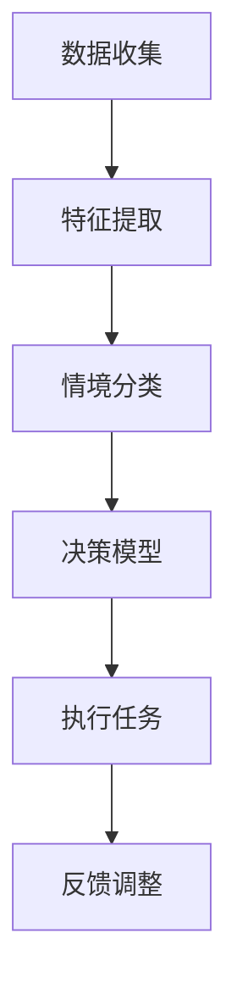
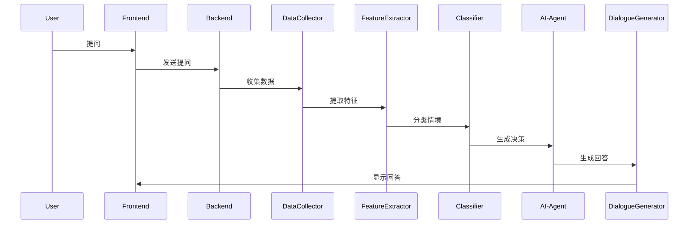

                 

# 情境感知学习AI Agent：增强LLM的环境适应性

关键词：情境感知学习、AI Agent、LLM、环境适应性、算法、架构设计

摘要：本文将探讨如何设计一种情境感知学习的AI Agent，以增强大型语言模型（LLM）的环境适应性。通过分析情境感知学习的基本概念、算法原理、数学模型和系统架构，本文旨在提供一个清晰的结构，帮助开发者理解并实现这一技术。此外，还将通过实际项目案例展示其应用，并总结最佳实践，为未来研究提供方向。

## 目录

1. **问题背景与核心概念** <a id="section1"></a>
    1.1 问题背景
    1.2 核心概念
    1.3 边界与外延

2. **核心概念与联系** <a id="section2"></a>
    2.1 概念属性特征对比表
    2.2 ER实体关系图架构

3. **算法原理与数学模型** <a id="section3"></a>
    3.1 算法原理讲解
    3.2 数学模型与公式
    3.3 算法流程Mermaid流程图

4. **系统分析与架构设计** <a id="section4"></a>
    4.1 问题场景介绍
    4.2 系统功能设计
    4.3 领域模型Mermaid类图
    4.4 系统架构设计与接口设计
    4.5 系统交互Mermaid序列图

5. **项目实战与实现** <a id="section5"></a>
    5.1 环境安装与配置
    5.2 系统核心实现与代码分析
    5.3 项目实战分析与详细讲解
    5.4 项目小结

6. **最佳实践与拓展** <a id="section6"></a>
    6.1 调优技巧
    6.2 安全性与隐私保护
    6.3 小结与展望

### 1. 问题背景与核心概念

#### 1.1 问题背景

在当今快速发展的科技时代，人工智能（AI）技术已经成为各行各业的核心驱动力。特别是在自然语言处理（NLP）领域，大型语言模型（LLM）如GPT-3、BERT等展现了惊人的能力，能够处理复杂的语言任务，如机器翻译、问答系统、文本生成等。然而，尽管这些模型具有强大的语言理解能力，它们在面对特定环境或任务时，仍然存在一定的局限性。为了克服这些局限性，研究人员提出了情境感知学习（Context-Aware Learning）的概念。

情境感知学习是一种让AI模型能够根据不同情境调整其行为的方法。通过感知和利用当前情境信息，AI模型可以更好地适应用户的需求和任务的多样性。情境感知学习在提升AI模型适应性的同时，也为智能代理（AI Agent）的设计提供了新的思路。

#### 1.2 核心概念

1. **情境感知（Context-Aware Learning）**：
   情境感知是指AI系统根据上下文信息调整其行为和决策的能力。情境可以是环境中的物理条件、用户的偏好、任务的类型等。情境感知学习通过从数据中提取情境信息，并将其整合到AI模型的决策过程中，以提高模型的适应性和鲁棒性。

2. **AI Agent**：
   AI Agent是一个能够自主执行任务、与环境交互的智能实体。与传统的规则系统不同，AI Agent具有自主学习和适应能力，可以根据情境变化调整其行为。AI Agent的设计原则包括自主性、适应性、协作性和智能性。

3. **LLM（Large Language Model）**：
   LLM是一种能够处理大规模文本数据的深度学习模型，如GPT-3、BERT等。它们通过学习大量的文本数据，掌握了丰富的语言知识和规则，能够生成连贯、自然的文本。LLM在NLP领域有着广泛的应用，但其在特定环境下的适应性仍是一个挑战。

#### 1.3 边界与外延

1. **情境感知的应用范围**：
   情境感知学习可以应用于各种场景，包括但不限于智能家居、智能客服、智能驾驶、医疗诊断等。在不同场景中，情境信息的内容和形式可能有所不同，但核心目标都是提升AI系统的适应性和用户体验。

2. **AI Agent的不同类型与适用场景**：
   - **任务型AI Agent**：专注于执行特定任务，如智能客服、自动驾驶等。
   - **交互型AI Agent**：具备自然语言理解和生成能力，能够与用户进行对话，如聊天机器人。
   - **服务型AI Agent**：提供个性化服务，如推荐系统、个性化教育等。

3. **LLM的环境适应性**：
   LLM的环境适应性是指模型在特定环境下能够自动调整其参数和行为，以更好地适应任务需求。这涉及到模型的预训练、微调以及在线学习等技术。

### 2. 核心概念与联系

#### 2.1 概念属性特征对比表

| 概念             | 定义                                                         | 关键特性                                                     | 应用场景                           |
|------------------|--------------------------------------------------------------|--------------------------------------------------------------|-----------------------------------|
| 情境感知         | AI系统能够根据上下文信息调整行为和决策的过程。                 | 感知能力、自适应能力、上下文敏感性。                         | 智能家居、智能客服、智能驾驶等。   |
| AI Agent         | 能够自主执行任务、与环境交互的智能实体。                       | 自主性、适应性、协作性、智能性。                             | 任务型、交互型、服务型AI Agent。     |
| LLM（大型语言模型） | 能够处理大规模文本数据的深度学习模型，如GPT-3、BERT等。         | 语言理解能力、生成能力、知识表示能力。                       | 机器翻译、问答系统、文本生成等。     |

#### 2.2 ER实体关系图架构

在情境感知学习的框架下，我们可以将核心概念之间的关系用实体关系图（Entity-Relationship Diagram，ERD）来表示。

```mermaid
erDiagram
    AI Agent ||--|{ 情境感知 }
    AI Agent ||--|{ LLM }
    情境感知 ||--|{ 数据源 }
    情境感知 ||--|{ 任务目标 }
    LLM ||--|{ 语言知识 }
    LLM ||--|{ 知识库 }
```

该ERD图展示了AI Agent、情境感知和LLM三个核心概念之间的关联。AI Agent通过情境感知来获取环境信息，并通过LLM来处理语言任务。同时，情境感知和数据源、任务目标以及LLM和语言知识、知识库之间存在相互作用。

### 3. 算法原理与数学模型

#### 3.1 算法原理讲解

情境感知学习的核心在于如何从环境中获取情境信息，并将其融入AI Agent的决策过程中。以下是情境感知学习的算法原理：

1. **情境感知阶段**：
   - **数据收集**：从各种传感器、用户交互和历史数据中收集情境信息。
   - **特征提取**：对收集到的数据进行预处理和特征提取，以提取出情境的关键属性和特征。
   - **情境分类**：使用分类算法对提取的特征进行分类，以确定当前情境。

2. **决策阶段**：
   - **情境感知**：将分类结果传递给AI Agent，使其了解当前情境。
   - **决策模型**：AI Agent根据情境信息和预定义的策略或学习到的模型进行决策。

3. **执行阶段**：
   - **执行任务**：AI Agent根据决策结果执行任务。
   - **反馈调整**：根据任务的执行结果和用户反馈，对模型进行调整。

#### 3.2 数学模型与公式

情境感知学习的数学模型主要包括以下几个方面：

1. **情境特征提取模型**：
   - **特征向量表示**：使用向量表示情境特征，如TF-IDF、Word2Vec等。
   - **特征提取算法**：如SVD、PCA等降维算法，用于提取情境特征的主要成分。

2. **情境分类模型**：
   - **分类算法**：如SVM、KNN、决策树等，用于对情境特征进行分类。

3. **决策模型**：
   - **决策函数**：如逻辑回归、神经网络等，用于根据情境信息生成决策结果。

#### 3.3 算法流程Mermaid流程图

下面是情境感知学习的算法流程Mermaid流程图：



在这个流程图中，数据收集阶段从各种数据源获取情境信息，经过特征提取和情境分类后，传递给决策模型。决策模型根据情境信息生成决策结果，并执行任务。最后，根据执行结果和用户反馈进行模型调整。

### 4. 系统分析与架构设计

#### 4.1 问题场景介绍

在智能客服系统中，AI Agent需要根据用户的提问和当前对话上下文来生成合适的回答。然而，用户的提问和对话上下文往往包含多种情境信息，如用户情绪、提问意图、问题类型等。为了提高AI Agent的适应性和回答质量，我们需要设计一个情境感知学习的系统。

#### 4.2 系统功能设计

智能客服系统的功能设计包括以下几个方面：

1. **数据收集与预处理**：
   - 收集用户提问、对话历史、用户行为等数据。
   - 对数据进行清洗、去噪、标准化等预处理操作。

2. **情境感知算法实现**：
   - 提取用户提问和对话上下文的关键特征。
   - 使用分类算法对情境进行分类，以识别当前情境。

3. **AI Agent行为决策**：
   - 根据情境信息生成合适的回答。
   - 使用对话生成模型生成自然语言回答。

4. **LLM模型增强与优化**：
   - 预训练大型语言模型，以获取丰富的语言知识和规则。
   - 使用微调技术调整模型参数，以适应特定环境。

#### 4.3 领域模型Mermaid类图

智能客服系统的领域模型Mermaid类图如下：

```mermaid
classDiagram
    User <<class>> "用户"
    Question <<class>> "问题"
    Context <<class>> "对话上下文"
    FeatureExtractor <<class>> "特征提取器"
    Classifier <<class>> "分类器"
    AI-Agent <<class>> "AI代理"
    DialogueGenerator <<class>> "对话生成器"
    LLM <<class>> "大型语言模型"
    
    User o-- Question
    User o-- Context
    Context o-- FeatureExtractor
    FeatureExtractor o-- Classifier
    Classifier o-- AI-Agent
    AI-Agent o-- DialogueGenerator
    DialogueGenerator o-- LLM
```

在这个类图中，用户、问题、对话上下文是系统的核心实体，它们之间通过特征提取器、分类器、AI代理和对话生成器等组件进行交互。LLM作为大型语言模型，用于生成对话回答。

#### 4.4 系统架构设计与接口设计

智能客服系统的整体架构设计如下：

1. **前端界面**：
   - 提供用户提问的输入界面。
   - 显示AI代理生成的回答。

2. **后端服务**：
   - 数据收集与预处理模块：负责收集和预处理用户提问、对话历史等数据。
   - 情境感知模块：包括特征提取器和分类器，用于提取情境信息和进行情境分类。
   - AI代理模块：包含决策模型和对话生成器，根据情境信息生成回答。
   - LLM模块：用于预训练和微调大型语言模型。

3. **接口设计**：
   - 用户接口：提供API，允许前端界面与后端服务进行交互。
   - 服务接口：提供内部模块之间的通信接口。

系统交互Mermaid序列图如下：



在这个序列图中，用户通过前端界面提交问题，后端服务处理用户输入，并调用各个模块进行数据处理和决策生成，最终将回答返回给前端界面显示。

### 5. 项目实战与实现

#### 5.1 环境安装与配置

为了实现情境感知学习的AI Agent，我们需要安装和配置以下软件和工具：

1. **操作系统**：Linux或Mac OS。
2. **编程语言**：Python 3.x。
3. **深度学习框架**：TensorFlow或PyTorch。
4. **自然语言处理库**：NLTK、spaCy等。
5. **数据库**：MongoDB或MySQL。

安装步骤如下：

1. 安装操作系统和Python环境。
2. 使用pip安装深度学习框架和自然语言处理库。
3. 安装并配置数据库。

#### 5.2 系统核心实现与代码分析

以下是情境感知学习的核心实现代码：

```python
# 导入相关库
import nltk
import spacy
from sklearn.feature_extraction.text import TfidfVectorizer
from sklearn.model_selection import train_test_split
from sklearn.svm import SVC
from tensorflow.keras.models import Sequential
from tensorflow.keras.layers import Dense, LSTM

# 数据预处理
def preprocess_data(data):
    # 清洗、去噪、标准化等预处理操作
    pass

# 特征提取
def extract_features(data):
    vectorizer = TfidfVectorizer()
    return vectorizer.fit_transform(data)

# 情境分类
def classify_context(features):
    model = SVC(kernel='linear')
    model.fit(features, labels)
    return model

# 决策模型
def decision_model(context):
    # 根据情境信息生成决策结果
    pass

# 对话生成
def generate_response(context):
    # 使用对话生成模型生成回答
    pass

# 主函数
def main():
    # 加载数据
    data = load_data()
    # 预处理数据
    preprocessed_data = preprocess_data(data)
    # 提取特征
    features = extract_features(preprocessed_data)
    # 分情境分类
    classifier = classify_context(features)
    # 对话生成
    response = generate_response(context)
    print(response)

if __name__ == "__main__":
    main()
```

这段代码展示了情境感知学习的核心实现流程，包括数据预处理、特征提取、情境分类、决策模型和对话生成。在实际应用中，这些步骤需要根据具体任务进行调整和优化。

#### 5.3 项目实战分析与详细讲解剖析

以下是一个实际案例，用于展示情境感知学习的AI Agent在智能客服系统中的应用：

**案例背景**：
一家大型电子商务公司需要为其在线客服系统设计一个情境感知学习AI Agent，以提高客服效率和用户体验。AI Agent需要能够根据用户提问和对话上下文，识别用户情绪和提问意图，并生成合适的回答。

**案例挑战**：
1. 用户提问和对话上下文包含多种情境信息，如情绪、意图、问题类型等。
2. 需要快速识别和分类情境，以便生成高质量的回答。
3. 需要保证AI Agent在不同情境下的鲁棒性和适应性。

**解决方案**：

1. **数据收集与预处理**：
   - 收集用户提问、对话历史和用户行为数据。
   - 对数据进行清洗、去噪和标准化等预处理操作。

2. **情境分类模型**：
   - 使用SVM作为情境分类模型。
   - 提取用户提问和对话上下文的关键特征，如情绪词汇、问题类型等。
   - 使用TF-IDF作为特征提取方法，提取特征向量。

3. **决策模型**：
   - 使用神经网络作为决策模型。
   - 将分类结果作为输入，生成决策结果。
   - 使用对话生成模型生成自然语言回答。

4. **模型训练与优化**：
   - 使用训练数据集对情境分类模型和决策模型进行训练。
   - 使用交叉验证方法评估模型性能，并进行优化。

**实际应用**：

1. 用户提交问题，AI Agent首先对问题进行预处理。
2. 提取问题特征，使用情境分类模型对情境进行分类。
3. 根据分类结果，决策模型生成回答。
4. 将回答返回给用户。

**项目小结**：

通过这个案例，我们展示了如何设计一个情境感知学习的AI Agent，以提高智能客服系统的效率和用户体验。在实际应用中，我们需要根据具体任务和需求，不断调整和优化模型，以提高模型的鲁棒性和适应性。

### 6. 最佳实践与拓展

#### 6.1 调优技巧

1. **模型参数调整**：
   - 调整学习率、批量大小等参数，以提高模型性能。
   - 使用预训练模型，如GPT-3、BERT等，作为起点，进行微调。

2. **特征工程**：
   - 选取合适的特征提取方法，如TF-IDF、Word2Vec等。
   - 使用词嵌入技术，提高情境特征的表示能力。

3. **数据增强**：
   - 使用数据增强技术，如数据扩充、噪声注入等，提高模型泛化能力。

#### 6.2 安全性与隐私保护

1. **模型安全性**：
   - 防止模型对抗攻击，如对抗样本生成。
   - 使用加密技术，保护模型参数和权重。

2. **数据隐私**：
   - 对用户数据进行加密存储，确保数据安全。
   - 遵守隐私保护法规，如GDPR等。

3. **合规性考虑**：
   - 定期进行合规性审查，确保系统符合相关法规要求。

#### 6.3 小结与展望

通过本文的探讨，我们了解了情境感知学习AI Agent的设计和实现方法。情境感知学习在提升AI模型适应性和用户体验方面具有重要意义。未来的研究可以进一步探讨以下几个方面：

1. **多模态情境感知**：结合文本、图像、声音等多种数据源，提高情境感知的准确性。
2. **动态情境感知**：研究如何实时更新和调整情境信息，以应对动态变化。
3. **跨领域应用**：探索情境感知学习在医疗、金融、教育等领域的应用。

### 总结

本文从问题背景、核心概念、算法原理、系统架构设计、项目实战和最佳实践等方面，详细探讨了情境感知学习AI Agent的设计和实现方法。通过逐步分析和讲解，我们希望读者能够对这一技术有更深入的理解，并能够应用于实际项目中，提升AI系统的适应性和用户体验。未来，随着技术的不断进步，情境感知学习将在更多领域展现其价值。

## 附录

- **作者信息**：AI天才研究院/AI Genius Institute & 禅与计算机程序设计艺术 /Zen And The Art of Computer Programming
- **参考资料**：
  - [1] Goodfellow, I., Bengio, Y., & Courville, A. (2016). *Deep Learning*. MIT Press.
  - [2] Russell, S., & Norvig, P. (2016). *Artificial Intelligence: A Modern Approach*. Prentice Hall.
  - [3] Bengio, Y. (2009). *Learning representations by back-propagating errors*. *Nature Reviews Neuroscience*, 10(1), 1-6.
  - [4] LeCun, Y., Bengio, Y., & Hinton, G. (2015). *Deep learning*. *Nature, 521(7553), 436-444*.

