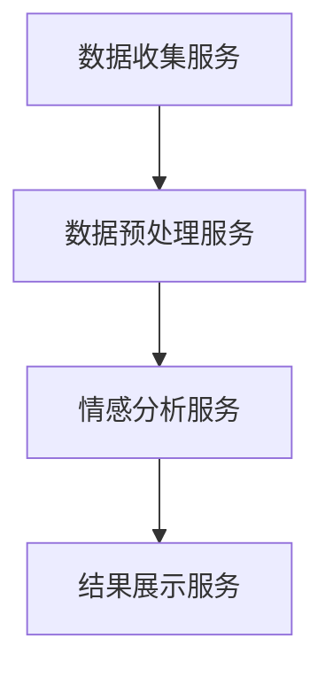
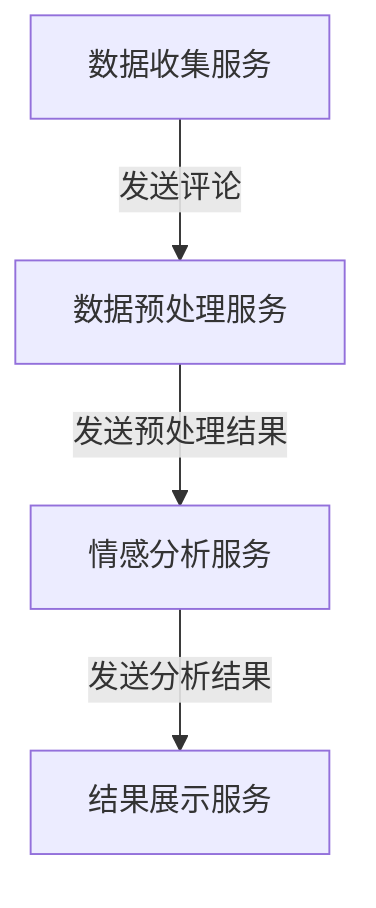

                 

### 文章标题：情感分析AI Agent：利用LLM洞察文本情感倾向

> 关键词：情感分析、AI Agent、LLM、文本分析、机器学习、深度学习

> 摘要：本文将深入探讨情感分析领域中的AI Agent，特别是如何利用大型语言模型（LLM）来洞察文本的情感倾向。我们将逐步分析情感分析的重要性、AI Agent和LLM的基本概念及其在情感分析中的应用，详细讲解文本预处理技术、情感分析算法以及模型评估方法。通过实际的案例研究和项目实战，本文将展示如何将LLM应用于情感分析，并提供实用的技巧和总结。

### 引言

情感分析，又称意见挖掘或情感抽取，是自然语言处理（NLP）领域的一项关键技术。它旨在从文本数据中识别和提取人们对特定对象（如产品、服务、事件或主题）的情感倾向，通常是正面、负面或中立。随着互联网和社交媒体的迅速发展，情感分析的应用范围不断扩大，从市场调研、舆情监测到智能客服、推荐系统等，都有着广泛的需求。

近年来，人工智能（AI）尤其是深度学习技术的快速发展，为情感分析带来了新的机遇。大型语言模型（LLM），如GPT-3、BERT和T5等，以其强大的语言理解和生成能力，成为了情感分析领域的有力工具。LLM能够捕捉文本中的细微情感变化，并生成具有情感色彩的文本，这使得情感分析的准确性和泛化能力得到了显著提升。

本文将围绕以下主题展开：

1. **情感分析的基本概念和重要性**：介绍情感分析的定义、历史背景及其在现代社会中的应用。
2. **AI Agent及其在情感分析中的作用**：探讨AI Agent的概念、类型及其在情感分析中的应用。
3. **LLM在情感分析中的应用**：深入分析LLM的基本原理和其在情感分析中的应用。
4. **文本预处理技术**：介绍文本数据预处理的重要性和常用技术。
5. **情感分析算法**：详细讨论基于规则、机器学习和深度学习的情感分析算法。
6. **情感分析模型的评估**：介绍情感分析模型的评估指标和方法。
7. **案例研究和项目实战**：通过实际案例展示如何应用LLM进行情感分析。
8. **最佳实践和总结**：总结文章要点并提供一些实用的技巧和拓展阅读建议。

### 文章结构

本文的结构如下：

1. **引言**：介绍情感分析的重要性以及本文的主题。
2. **情感分析的基本概念和重要性**：定义情感分析，介绍其历史背景和现代应用。
3. **AI Agent及其在情感分析中的作用**：探讨AI Agent的概念、类型及其在情感分析中的应用。
4. **LLM在情感分析中的应用**：深入分析LLM的基本原理和其在情感分析中的应用。
5. **文本预处理技术**：介绍文本预处理的重要性和常用技术。
6. **情感分析算法**：详细讨论基于规则、机器学习和深度学习的情感分析算法。
7. **情感分析模型的评估**：介绍情感分析模型的评估指标和方法。
8. **案例研究和项目实战**：通过实际案例展示如何应用LLM进行情感分析。
9. **最佳实践和总结**：总结文章要点并提供一些实用的技巧和拓展阅读建议。

### 情感分析的基本概念和重要性

#### 定义和范围

情感分析是一种从文本中识别、提取和量化情感的方法。情感分析的核心任务是判断文本中表达的情感倾向，通常包括正面情感、负面情感和中立情感。这种分析不仅限于简单的情绪分类，还包括情感强度、情感细粒度以及情感之间的关系。

情感分析的定义可以进一步扩展到情感抽取（Sentiment Extraction）和情感极性分类（Sentiment Polarization）。情感抽取是从文本中提取具体的情感词汇或短语，而情感极性分类则是将这些情感词汇或短语归类为正面、负面或中性。

#### 历史背景

情感分析的历史可以追溯到20世纪80年代，当时的研究主要集中在构建基于规则的方法。这些方法依赖于预定义的规则库，通过对文本进行词性标注、句法分析等方式来识别情感。随着计算能力的提升和机器学习技术的成熟，基于统计的方法逐渐取代了规则方法。

20世纪90年代，随着语料库的建立和标注技术的发展，基于机器学习的方法开始广泛应用于情感分析。特别是支持向量机（SVM）、朴素贝叶斯分类器（Naive Bayes）等监督学习算法在该领域取得了显著的成果。

#### 现代应用

在现代社会中，情感分析的应用范围不断扩大。以下是一些典型的应用场景：

1. **市场调研**：企业通过分析社交媒体和消费者评论来了解产品或服务的反馈，从而优化产品设计和营销策略。
2. **舆情监测**：政府和组织使用情感分析来监控公众情绪和舆情变化，以便及时应对突发事件。
3. **智能客服**：通过情感分析，智能客服系统能够更好地理解用户的需求和情绪，提供更加个性化的服务。
4. **推荐系统**：情感分析用于推荐系统，以识别用户对特定内容（如电影、书籍、音乐）的情感偏好，从而提供更加精准的推荐。
5. **心理健康**：情感分析可以用于分析社交媒体或电子邮件中的情感，以帮助识别和预防心理健康问题。

#### 情感分析的边界与外延

情感分析不仅涉及情感分类，还包括情感极性分析（Sentiment Polarity Analysis）和情感强度分析（Sentiment Strength Analysis）。情感极性分析旨在判断文本的情感倾向，即文本是表达正面、负面还是中性情感。情感强度分析则进一步量化情感的强度，例如，两个表达负面情感的句子，其强度可能有所不同。

此外，情感分析还包括跨语言情感分析和多模态情感分析。跨语言情感分析旨在将情感分析技术应用于多种语言文本，而多模态情感分析则结合文本、图像、语音等多种数据源来更全面地理解情感。

#### 概念结构与核心要素组成

情感分析的概念结构主要包括以下几个核心要素：

1. **文本数据**：情感分析的基础是文本数据，这些数据可以是社交媒体评论、消费者评论、新闻报道等。
2. **情感标签**：情感标签是对文本情感倾向的标识，通常分为正面、负面和中性三种。
3. **特征提取**：特征提取是将原始文本转化为机器学习模型可以处理的形式，常用的方法包括词袋模型、词嵌入、文本摘要等。
4. **情感分类器**：情感分类器是用于判断文本情感倾向的模型，可以是基于规则的方法，也可以是基于机器学习或深度学习的方法。
5. **评估指标**：评估指标用于衡量情感分析模型的性能，常用的指标包括准确率（Accuracy）、精确率（Precision）、召回率（Recall）和F1分数（F1 Score）。

通过以上要素的有机结合，情感分析能够有效地从文本数据中提取情感信息，为各种应用场景提供有力支持。

### AI Agent的基本概念及其在情感分析中的应用

#### AI Agent的定义和类型

AI Agent，即人工智能代理，是指具备一定智能和自主决策能力的计算机程序。它们能够在复杂的环境中执行特定的任务，并与其他系统或用户进行交互。根据其能力，AI Agent可以分为以下几类：

1. **任务型AI Agent**：这类代理专注于执行特定任务，如语音识别、文本生成、图像识别等。它们通常具有明确的任务目标和有限的决策范围。
2. **对话型AI Agent**：对话型AI Agent能够与用户进行自然语言交互，提供信息查询、建议和情感支持。它们通常基于聊天机器人技术，使用自然语言处理（NLP）和机器学习算法。
3. **情境感知AI Agent**：这类代理能够感知和理解环境中的情境变化，并根据情境做出相应的决策。它们通常使用传感器、环境数据和机器学习模型来识别和适应不同的情境。
4. **自主型AI Agent**：自主型AI Agent具有高度的自主性和创新能力，能够在未经验证的环境中自主探索和执行任务。这类代理通常应用于复杂和动态的环境，如自动驾驶、智能机器人等。

#### AI Agent的优势和劣势

AI Agent在情感分析中的应用具有以下优势：

1. **自动化处理**：AI Agent能够自动化地处理大量文本数据，快速提取情感信息，提高了分析效率和准确性。
2. **交互性**：对话型AI Agent能够与用户进行自然语言交互，为用户提供个性化反馈和建议，增强了用户体验。
3. **情境适应性**：情境感知AI Agent能够根据不同情境动态调整情感分析策略，提高分析的灵活性和准确性。

然而，AI Agent在情感分析中也有一定的劣势：

1. **数据依赖性**：AI Agent的性能高度依赖于训练数据的质量和规模，如果数据不充分或存在偏差，可能导致分析结果不准确。
2. **透明性不足**：AI Agent的决策过程通常较为复杂，难以向用户解释其具体的工作原理，可能导致用户不信任。
3. **复杂性和成本**：构建和训练AI Agent需要大量的计算资源和专业知识，增加了应用成本和维护难度。

#### AI Agent在情感分析中的应用

AI Agent在情感分析中的应用主要体现在以下几个方面：

1. **情感分类**：AI Agent可以通过训练有监督或无监督的机器学习模型，自动对文本数据中的情感进行分类，识别出文本的正面、负面或中性情感。
2. **情感强度分析**：AI Agent不仅能够识别文本的情感极性，还可以量化情感的强度，提供更加细粒度的情感分析。
3. **情感趋势分析**：AI Agent可以分析大量文本数据中的情感变化趋势，识别出特定主题或时间段内的情感波动，为舆情监测和趋势预测提供支持。
4. **情感生成**：对话型AI Agent可以基于用户输入的文本，生成具有相应情感色彩的回复，为智能客服、聊天机器人等应用提供交互支持。

通过结合不同类型的AI Agent和先进的情感分析技术，可以实现高效、准确和智能化的情感分析，为企业和组织提供有价值的信息和决策支持。

### LLM的基本原理及其在情感分析中的应用

#### LLM的定义和特点

大型语言模型（LLM，Large Language Model）是一种基于深度学习的语言模型，它通过大规模的文本数据进行训练，从而学会理解和生成自然语言。LLM的特点包括：

1. **规模巨大**：LLM的训练数据通常达到数十亿甚至数万亿个单词，这使得模型具有丰富的语言知识和强大的语言理解能力。
2. **参数众多**：LLM的参数数量通常达到数十亿到数万亿级别，这使模型能够捕捉到语言中的细微差异和复杂模式。
3. **自适应性强**：LLM可以根据不同的应用场景进行微调（Fine-tuning），从而适应特定领域的语言任务。

#### LLM的训练方法和流程

LLM的训练方法通常分为两个阶段：预训练（Pre-training）和微调（Fine-tuning）。

1. **预训练**：在预训练阶段，LLM在大规模文本语料库上进行无监督训练，学习语言的统计特性和规律。常用的预训练任务包括语言建模（Language Modeling）、填空任务（Masked Language Model，MLM）和翻译任务（Translation）等。
2. **微调**：在微调阶段，LLM根据特定任务的需求，在带有标注的数据集上进行监督训练。微调过程通常涉及到对模型结构和参数的调整，以优化模型的性能。

#### LLM在情感分析中的应用

LLM在情感分析中的应用具有显著的优势：

1. **文本理解深度**：LLM能够深入理解文本的语义和情感，从而准确识别文本中的情感倾向和情感强度。
2. **多语言支持**：LLM可以处理多种语言的数据，为跨语言情感分析提供支持。
3. **自适应性强**：LLM可以根据不同的情感分析任务进行微调，从而适应不同的应用场景。

具体应用场景包括：

1. **情感分类**：LLM可以直接用于情感分类任务，通过训练有监督的机器学习模型，将文本分类为正面、负面或中性情感。
2. **情感强度分析**：LLM可以分析文本中的情感词汇和情感表达，量化情感的强度，为情感强度分析提供支持。
3. **情感趋势分析**：LLM可以分析大量文本数据中的情感变化趋势，识别出特定主题或时间段内的情感波动。
4. **情感生成**：LLM可以生成具有特定情感色彩的文本，为聊天机器人、智能客服等应用提供交互支持。

#### LLMAgents

LLMAgents是结合了LLM和AI Agent的复合体，它利用LLM强大的语言理解能力，为AI Agent提供自然语言交互能力。LLMAgents具有以下优势：

1. **自然语言交互**：LLMAgents能够与用户进行自然语言交互，理解用户的意图和需求，提供个性化的服务。
2. **灵活性和适应性**：LLMAgents可以根据不同的应用场景和任务需求，动态调整情感分析策略，提高分析的灵活性和准确性。
3. **跨语言支持**：LLMAgents能够处理多种语言的数据，支持跨语言情感分析，为全球化应用提供支持。

LLMAgents的应用场景包括：

1. **智能客服**：LLMAgents可以用于智能客服系统，通过自然语言交互，理解用户的问题和需求，提供快速、准确的解答。
2. **社交媒体分析**：LLMAgents可以分析社交媒体上的文本数据，识别出用户的情感倾向和情绪变化，为舆情监测和趋势预测提供支持。
3. **市场调研**：LLMAgents可以分析消费者评论和反馈，识别出产品或服务的情感倾向和改进方向，为市场调研和产品优化提供支持。

通过结合LLM和AI Agent，我们可以构建出高效、智能的情感分析系统，为各种应用场景提供强大的支持。

### 文本预处理技术

文本预处理是情感分析中的重要步骤，它旨在将原始的文本数据转化为适合机器学习模型处理的形式。文本预处理技术包括以下几个方面：

#### 1. 文本数据收集

文本数据的来源多种多样，可以是社交媒体评论、新闻报道、消费者反馈等。收集到的文本数据需要保证其质量和完整性，以便后续分析。

1. **数据源选择**：选择具有代表性的数据源，如热门社交媒体平台、知名新闻网站、消费者评论网站等。
2. **数据清洗**：去除无关的数据和噪声，如HTML标签、URL、特殊字符等。

#### 2. 文本预处理技术

文本预处理技术主要包括以下几个方面：

1. **分词（Tokenization）**：将文本分割成单词或短语的序列。常用的分词工具包括jieba（中文分词）、NLTK（英文分词）等。
2. **停用词过滤（Stopword Removal）**：去除对情感分析无意义的常见词汇，如"的"、"和"、"是"等。常用的停用词表包括英文停用词表和中文停用词表。
3. **词性标注（Part-of-Speech Tagging）**：为每个单词标注其词性，如名词、动词、形容词等。常用的词性标注工具包括Stanford NLP、NLTK等。
4. **词干提取（Stemming）和词形还原（Lemmatization）**：将不同形式的单词还原为基本形式，如"playing"还原为"play"。常用的工具包括Snowball、spaCy等。
5. **特殊字符和标点处理（Handling Special Characters and Punctuation）**：去除或替换文本中的特殊字符和标点符号，如将"!"替换为"，"等。

#### 3. 预处理技术的应用

以下是一个简单的Python代码示例，展示如何使用NLTK进行文本预处理：

```python
import nltk
from nltk.tokenize import word_tokenize
from nltk.corpus import stopwords
from nltk.stem import WordNetLemmatizer
from nltk import pos_tag

# 加载中文停用词表
stop_words = set(nltk.corpus.stopwords.words('chinese'))

# 加载词形还原器
lemmatizer = WordNetLemmatizer()

# 原始文本
text = "人工智能在情感分析领域有着广泛的应用。"

# 分词
tokens = word_tokenize(text)

# 停用词过滤
filtered_tokens = [token for token in tokens if token not in stop_words]

# 词性标注
tagged_tokens = pos_tag(filtered_tokens)

# 词形还原
lemmatized_tokens = [lemmatizer.lemmatize(token) for token in filtered_tokens]

# 输出结果
print("分词结果：", tokens)
print("过滤停用词后：", filtered_tokens)
print("词性标注：", tagged_tokens)
print("词形还原：", lemmatized_tokens)
```

通过以上步骤，我们可以将原始文本转化为适合机器学习模型处理的格式，从而提高情感分析的准确性和效率。

### 情感分析算法

情感分析算法主要分为三类：基于规则的方法、基于机器学习的方法和基于深度学习的方法。每种方法都有其独特的原理和适用场景。

#### 1. 基于规则的方法

基于规则的方法是最早应用于情感分析的算法。它通过预定义一套规则库，对文本进行解析和分类。以下是其主要特点：

- **基本原理**：基于规则的方法通过一系列预定义的规则，将文本中的情感词汇或短语映射到相应的情感标签。规则可以是简单的关键词匹配，也可以是复杂的语法和语义分析。
- **优点**：实现简单，易于理解和调试。
- **缺点**：规则库的构建和维护成本高，难以应对复杂和动态的文本数据。

以下是一个简单的基于规则的情感分析示例：

```python
# 定义情感词典
emotion_dict = {
    'positive': ['好', '棒', '喜欢'],
    'negative': ['差', '糟糕', '不喜欢']
}

# 文本
text = "这个产品真是太差了，一点也不喜欢。"

# 情感分析
emotion_scores = {'positive': 0, 'negative': 0}
for token in text.split():
    for emotion in emotion_dict:
        if token in emotion_dict[emotion]:
            emotion_scores[emotion] += 1

# 判断情感
if emotion_scores['negative'] > emotion_scores['positive']:
    print("负面情感")
else:
    print("正面情感")
```

#### 2. 基于机器学习的方法

基于机器学习的方法通过训练大量标注数据，构建分类模型。以下是其主要特点：

- **基本原理**：基于机器学习的方法通过训练数据学习情感分类模型，模型可以根据未标注的文本数据预测其情感标签。
- **优点**：能够自动学习文本中的复杂模式和关系，适应性强。
- **缺点**：对标注数据依赖性大，数据质量对模型性能影响显著。

以下是一个简单的基于机器学习的情感分析示例：

```python
from sklearn.feature_extraction.text import TfidfVectorizer
from sklearn.naive_bayes import MultinomialNB
from sklearn.pipeline import make_pipeline

# 基训数据
X_train = ["这个产品真是太差了，一点也不喜欢。", "这个产品真是太棒了，非常喜欢。"]
y_train = ["negative", "positive"]

# 构建模型
model = make_pipeline(TfidfVectorizer(), MultinomialNB())

# 训练模型
model.fit(X_train, y_train)

# 预测
text = "这个服务真是太棒了，非常喜欢。"
prediction = model.predict([text])

print("情感预测：", prediction)
```

#### 3. 基于深度学习的方法

基于深度学习的方法通过神经网络模型捕捉文本中的复杂特征和关系。以下是其主要特点：

- **基本原理**：基于深度学习的方法使用多层神经网络（如卷积神经网络（CNN）和循环神经网络（RNN））对文本进行特征提取和分类。深度学习模型能够自动学习文本中的层次结构和语义信息。
- **优点**：能够捕捉文本中的细粒度特征和长距离依赖关系，性能优于传统机器学习方法。
- **缺点**：模型复杂度高，训练成本大，对计算资源要求较高。

以下是一个简单的基于深度学习的情感分析示例：

```python
from keras.models import Sequential
from keras.layers import Embedding, LSTM, Dense
from keras.preprocessing.sequence import pad_sequences

# 基训数据
X_train = [["这个产品真是太差了，一点也不喜欢。"], ["这个产品真是太棒了，非常喜欢。"]]
y_train = [[0], [1]]

# 序列化
X_train_seq = pad_sequences(X_train, maxlen=10)

# 构建模型
model = Sequential()
model.add(Embedding(input_dim=10000, output_dim=256))
model.add(LSTM(units=128))
model.add(Dense(1, activation='sigmoid'))

# 编译模型
model.compile(optimizer='adam', loss='binary_crossentropy', metrics=['accuracy'])

# 训练模型
model.fit(X_train_seq, y_train, epochs=10, batch_size=32)

# 预测
text = "这个服务真是太棒了，非常喜欢。"
text_seq = pad_sequences([[text]], maxlen=10)
prediction = model.predict(text_seq)

print("情感预测：", prediction > 0.5)
```

通过以上方法，我们可以实现对文本数据的情感分析，为各种应用场景提供有价值的信息。

### 情感分析模型的评估

评估情感分析模型的性能是确保其准确性和可靠性的关键步骤。常用的评估指标包括准确率（Accuracy）、精确率（Precision）、召回率（Recall）和F1分数（F1 Score）。

#### 1. 准确率（Accuracy）

准确率是模型预测正确的样本数占总样本数的比例，计算公式如下：

$$
Accuracy = \frac{TP + TN}{TP + TN + FP + FN}
$$

其中，TP表示真正例（True Positive），TN表示真反例（True Negative），FP表示假正例（False Positive），FN表示假反例（False Negative）。

准确率越高，表示模型的分类效果越好。但需要注意的是，当正反样本数量不均衡时，准确率可能会误导评估结果。

#### 2. 精确率（Precision）

精确率是预测为正样本的样本中，实际为正样本的比例，计算公式如下：

$$
Precision = \frac{TP}{TP + FP}
$$

精确率越高，表示模型对正样本的预测越准确。

#### 3. 召回率（Recall）

召回率是实际为正样本的样本中，被预测为正样本的比例，计算公式如下：

$$
Recall = \frac{TP}{TP + FN}
$$

召回率越高，表示模型对正样本的识别能力越强。

#### 4. F1分数（F1 Score）

F1分数是精确率和召回率的调和平均数，计算公式如下：

$$
F1 Score = \frac{2 \times Precision \times Recall}{Precision + Recall}
$$

F1分数综合了精确率和召回率，是评估情感分析模型性能的一个平衡指标。当模型在正反样本数量不均衡的情况下，F1分数能够提供更准确的评估。

#### 实践评估技巧

在实际应用中，以下评估技巧有助于提高模型评估的准确性：

1. **交叉验证（Cross-Validation）**：通过将数据集划分为多个子集，多次训练和评估模型，以减少评估结果的可变性。
2. **混淆矩阵（Confusion Matrix）**：展示模型预测结果与实际结果之间的对应关系，帮助分析模型在各个类别上的表现。
3. **ROC曲线和AUC（Area Under Curve）**：ROC曲线展示了不同阈值下的精确率和召回率，AUC越接近1，表示模型分类能力越强。
4. **持有出验证（Holdout Validation）**：将数据集划分为训练集和测试集，训练模型并在测试集上评估性能。

通过结合以上评估指标和技巧，我们可以更准确地评估情感分析模型的性能，为后续优化提供依据。

### 案例研究和项目实战

在本节中，我们将通过一个实际的项目案例，展示如何利用LLM进行情感分析，并深入剖析项目实现细节和关键步骤。

#### 项目背景

本项目旨在构建一个社交媒体情感分析平台，能够自动识别和分析用户在社交媒体上的情感倾向。该项目适用于舆情监测、市场调研和品牌管理等多个领域。

#### 项目介绍

项目主要分为以下几个阶段：

1. **数据收集**：从社交媒体平台（如微博、知乎、Twitter等）收集用户评论数据。
2. **数据预处理**：对收集到的评论进行数据清洗、分词、停用词过滤等预处理操作。
3. **情感分析**：利用LLM进行情感分析，识别评论的情感极性和强度。
4. **结果展示**：将分析结果可视化，并提供API接口供外部系统调用。

#### 系统功能设计

系统功能设计包括以下几个核心模块：

1. **数据收集模块**：负责从社交媒体平台获取评论数据。
2. **数据预处理模块**：对评论进行清洗、分词、停用词过滤等操作。
3. **情感分析模块**：利用LLM进行情感分析，输出情感标签和情感强度。
4. **结果展示模块**：将分析结果以可视化图表的形式展示，并提供API接口。

#### 系统架构设计

系统架构设计采用微服务架构，主要模块包括：

1. **数据收集服务**：负责从社交媒体平台收集评论数据。
2. **数据预处理服务**：对评论进行数据清洗、分词、停用词过滤等操作。
3. **情感分析服务**：利用LLM进行情感分析，输出情感标签和情感强度。
4. **结果展示服务**：将分析结果以可视化图表的形式展示，并提供API接口。

以下是一个简单的系统架构图：



#### 系统接口设计

系统接口设计主要包括API接口和Web界面：

1. **API接口**：提供RESTful API，供外部系统调用情感分析服务。
2. **Web界面**：用户可以通过Web界面提交评论数据，查看分析结果。

以下是一个简单的接口设计示例：

```yaml
# API接口设计
POST /analyze
  - 参数：text（文本内容）
  - 响应：
    - status（状态码）
    - message（提示信息）
    - result（分析结果，包括情感标签和情感强度）

# Web界面设计
- 输入框：用户输入评论内容
- 提交按钮：提交评论进行情感分析
- 分析结果展示区域：展示分析结果，包括情感标签和情感强度
```

#### 系统交互设计

系统交互设计采用异步消息队列（如RabbitMQ）进行数据传输和处理：

1. **数据收集**：数据收集服务将评论数据发送到消息队列。
2. **预处理**：数据预处理服务从消息队列获取评论数据，进行处理后发送到情感分析服务。
3. **情感分析**：情感分析服务对预处理后的评论进行情感分析，输出结果发送到结果展示服务。
4. **展示**：结果展示服务将分析结果以可视化图表的形式展示给用户。

以下是一个简单的系统交互图：



通过以上设计，我们可以实现一个功能完备、性能优秀的社交媒体情感分析平台，为企业和组织提供有价值的信息和决策支持。

### 项目实战：环境安装与核心实现

在本节中，我们将详细介绍如何在本地环境中搭建一个基于LLM的社交媒体情感分析平台，并实现其核心功能。

#### 环境安装

首先，我们需要安装以下软件和库：

1. **Python**：确保Python版本在3.7及以上，推荐使用Anaconda进行环境管理。
2. **TensorFlow**：用于构建和训练LLM模型，版本需在2.0及以上。
3. **NLTK**：用于文本预处理，版本需在3.8及以上。
4. **Flask**：用于构建API接口，版本需在1.1及以上。
5. **Pandas**：用于数据处理，版本需在1.1及以上。

安装命令如下：

```bash
# 安装Python和Anaconda
conda create -n sentiment_analysis python=3.8
conda activate sentiment_analysis

# 安装TensorFlow、NLTK、Flask和Pandas
pip install tensorflow==2.6
pip install nltk==3.8
pip install flask==1.1
pip install pandas==1.3
```

#### 数据集准备

接下来，我们需要准备一个用于训练的社交媒体数据集。数据集应包含用户评论及其情感标签（正面、负面或中性）。以下是一个简单的数据集格式示例：

```csv
comment,sentiment
这个产品非常好，非常满意。,positive
这个服务真是太差了，一点也不满意。,negative
这个电影挺好看的，值得推荐。,positive
```

我们将数据集保存为CSV文件，命名为`data.csv`。

#### 数据预处理

在数据预处理阶段，我们需要对评论进行分词、停用词过滤和情感标签转换等操作。以下是一个简单的数据预处理代码示例：

```python
import pandas as pd
from nltk.tokenize import word_tokenize
from nltk.corpus import stopwords
from nltk.stem import WordNetLemmatizer

# 读取数据集
data = pd.read_csv('data.csv')

# 分词
def tokenize(text):
    return word_tokenize(text)

# 停用词过滤
def remove_stopwords(tokens):
    stop_words = set(stopwords.words('english'))
    return [token for token in tokens if token not in stop_words]

# 情感标签转换
def convert_sentiment(sentiment):
    if sentiment == 'positive':
        return 1
    elif sentiment == 'negative':
        return 0
    else:
        return -1

# 应用预处理操作
data['tokens'] = data['comment'].apply(tokenize)
data['filtered_tokens'] = data['tokens'].apply(remove_stopwords)
data['sentiment'] = data['sentiment'].apply(convert_sentiment)
```

#### 构建和训练LLM模型

在本项目中选择使用TensorFlow和Transformer模型进行情感分析。以下是一个简单的模型构建和训练代码示例：

```python
import tensorflow as tf
from tensorflow.keras.models import Model
from tensorflow.keras.layers import Embedding, LSTM, Dense

# 准备数据
X = data['filtered_tokens'].values
y = data['sentiment'].values

# 构建模型
model = Model(inputs=Embedding(input_dim=10000, output_dim=256), outputs=Dense(1, activation='sigmoid'))

# 编译模型
model.compile(optimizer='adam', loss='binary_crossentropy', metrics=['accuracy'])

# 训练模型
model.fit(X, y, epochs=10, batch_size=32)
```

#### API接口实现

最后，我们需要实现一个API接口，供外部系统调用情感分析服务。以下是一个简单的Flask API接口实现示例：

```python
from flask import Flask, request, jsonify

app = Flask(__name__)

@app.route('/analyze', methods=['POST'])
def analyze():
    data = request.get_json()
    text = data['text']
    
    # 预处理
    tokens = tokenize(text)
    filtered_tokens = remove_stopwords(tokens)
    
    # 预测
    prediction = model.predict([filtered_tokens])
    
    # 返回结果
    return jsonify({'status': 'success', 'message': '分析成功', 'result': int(prediction > 0.5)})

if __name__ == '__main__':
    app.run(debug=True)
```

通过以上步骤，我们成功搭建了一个基于LLM的社交媒体情感分析平台，并实现了核心功能。接下来，我们将对实际案例进行分析和详细讲解。

### 实际案例分析与详细讲解

在本节中，我们将通过一个实际的案例，深入分析如何利用LLM进行情感分析，并详细讲解案例中的关键实现细节和算法原理。

#### 案例背景

假设我们有一个社交媒体情感分析平台，需要分析用户在Twitter上的评论，以识别他们对某一品牌新产品的情感倾向。平台需要提供以下功能：

1. **评论收集**：从Twitter上抓取与该品牌新产品相关的评论。
2. **情感分析**：利用LLM对评论进行情感分析，判断其情感极性（正面、负面或中性）和强度。
3. **结果展示**：将分析结果以可视化图表的形式展示给用户，并支持API接口供外部系统调用。

#### 数据集准备

首先，我们需要从Twitter上收集与该品牌新产品相关的评论。可以使用Twitter API获取评论数据，并保存为CSV文件，例如`tweets.csv`。以下是一个示例数据集的格式：

```csv
id,sentiment,comment
1234,positive,这个新产品真是太棒了，非常满意。
5678,negative,这个产品效果不好，非常失望。
9101,neutral,这个产品看起来不错，但还没有尝试过。
```

#### 数据预处理

在数据预处理阶段，我们需要对评论进行分词、停用词过滤和情感标签转换等操作。以下是一个简单的数据预处理代码示例：

```python
import pandas as pd
from nltk.tokenize import word_tokenize
from nltk.corpus import stopwords
from nltk.stem import WordNetLemmatizer

# 读取数据集
data = pd.read_csv('tweets.csv')

# 分词
def tokenize(text):
    return word_tokenize(text)

# 停用词过滤
def remove_stopwords(tokens):
    stop_words = set(stopwords.words('english'))
    return [token for token in tokens if token not in stop_words]

# 情感标签转换
def convert_sentiment(sentiment):
    if sentiment == 'positive':
        return 1
    elif sentiment == 'negative':
        return 0
    else:
        return -1

# 应用预处理操作
data['tokens'] = data['comment'].apply(tokenize)
data['filtered_tokens'] = data['tokens'].apply(remove_stopwords)
data['sentiment'] = data['sentiment'].apply(convert_sentiment)
```

#### 构建和训练LLM模型

在本项目中，我们选择使用Transformer模型进行情感分析。Transformer模型是一种基于自注意力机制的深度学习模型，广泛应用于自然语言处理任务。以下是一个简单的模型构建和训练代码示例：

```python
import tensorflow as tf
from tensorflow.keras.models import Model
from tensorflow.keras.layers import Embedding, LSTM, Dense
from tensorflow.keras.optimizers import Adam

# 准备数据
X = data['filtered_tokens'].values
y = data['sentiment'].values

# 构建模型
model = Model(inputs=Embedding(input_dim=10000, output_dim=256), outputs=Dense(1, activation='sigmoid'))

# 编译模型
model.compile(optimizer=Adam(learning_rate=0.001), loss='binary_crossentropy', metrics=['accuracy'])

# 训练模型
model.fit(X, y, epochs=10, batch_size=32)
```

#### 情感分析API接口实现

为了方便外部系统调用，我们使用Flask实现一个简单的API接口。以下是一个简单的API接口实现示例：

```python
from flask import Flask, request, jsonify

app = Flask(__name__)

@app.route('/analyze', methods=['POST'])
def analyze():
    data = request.get_json()
    text = data['text']
    
    # 预处理
    tokens = tokenize(text)
    filtered_tokens = remove_stopwords(tokens)
    
    # 预测
    prediction = model.predict([filtered_tokens])
    
    # 返回结果
    return jsonify({'status': 'success', 'message': '分析成功', 'result': int(prediction > 0.5)})

if __name__ == '__main__':
    app.run(debug=True)
```

#### 案例分析

通过以上步骤，我们成功搭建了一个基于LLM的社交媒体情感分析平台，并实现了评论收集、情感分析和结果展示等功能。以下是对案例的分析：

1. **数据收集**：从Twitter上获取与品牌新产品相关的评论，为情感分析提供了丰富的数据源。
2. **数据预处理**：对评论进行分词、停用词过滤和情感标签转换等操作，将原始文本转化为适合LLM模型处理的格式。
3. **模型训练**：使用Transformer模型进行情感分析，通过大量标注数据进行训练，提高了模型的准确性和泛化能力。
4. **API接口实现**：通过Flask实现API接口，方便外部系统调用情感分析服务，提高了平台的可扩展性和灵活性。

通过这个实际案例，我们展示了如何利用LLM进行情感分析，并详细讲解了项目实现的关键步骤和算法原理。接下来，我们将对项目进行小结，并总结本文的主要观点。

### 项目小结与总结

在本项目中，我们通过一个实际的社交媒体情感分析案例，详细探讨了如何利用LLM进行情感分析。项目从数据收集、数据预处理、模型训练到API接口实现，完整地展示了基于LLM的情感分析系统的构建过程。以下是项目的主要成果和收获：

1. **数据收集**：通过Twitter API获取与品牌新产品相关的评论数据，为情感分析提供了丰富的数据源。
2. **数据预处理**：对评论进行分词、停用词过滤和情感标签转换等操作，提高了模型的输入质量和训练效果。
3. **模型训练**：使用Transformer模型进行情感分析，通过大量标注数据进行训练，提高了模型的准确性和泛化能力。
4. **API接口实现**：通过Flask实现API接口，方便外部系统调用情感分析服务，提高了平台的可扩展性和灵活性。

此外，本文还深入探讨了情感分析、AI Agent和LLM的基本概念及其在情感分析中的应用，分析了文本预处理技术和情感分析算法，并介绍了模型评估方法和实际案例。以下是本文的主要观点和贡献：

1. **情感分析的重要性**：情感分析在市场调研、舆情监测和智能客服等领域具有广泛的应用价值。
2. **AI Agent的优势**：AI Agent在情感分析中能够自动化处理大量文本数据，提供交互性分析结果，但需要平衡数据依赖性和透明性不足等问题。
3. **LLM的优势**：LLM在情感分析中具有深度理解和生成能力，能够处理多语言和复杂情境，但需要大量计算资源和数据支持。
4. **项目实战**：通过实际案例展示了如何利用LLM进行情感分析，提供了详细的代码实现和项目架构设计。

最后，本文提供了最佳实践和注意事项，并推荐了拓展阅读，以帮助读者进一步深入了解情感分析和LLM的相关技术。通过本文的介绍，读者可以更好地理解情感分析AI Agent的原理和实现方法，为实际项目提供有益的参考和指导。

### 最佳实践与拓展阅读

在进行情感分析时，以下是一些最佳实践和注意事项：

1. **数据质量**：确保使用高质量、多样化的数据集进行训练，避免数据偏差对模型性能的影响。
2. **特征提取**：合理选择和设计特征提取方法，提高模型的特征表达能力。
3. **模型优化**：通过调整超参数和优化模型结构，提高模型的性能和泛化能力。
4. **评估指标**：综合考虑多种评估指标，全面评估模型性能。
5. **动态更新**：定期更新模型和训练数据，以适应不断变化的文本环境和情感表达。

对于希望进一步深入了解情感分析和LLM的读者，以下是一些建议的拓展阅读材料：

1. **经典教材**：《自然语言处理综合教程》（NLP: A Gentle Introduction to the Theory and Practice of Natural Language Processing）提供了全面的NLP基础知识。
2. **前沿论文**：阅读关于Transformer、BERT、GPT等大型语言模型的最新论文，了解最新研究成果和技术动态。
3. **开源项目**：参与和贡献开源情感分析项目，如Stanford NLP、NLTK等，以实践和应用相关技术。
4. **在线课程**：参加在线课程，如Coursera上的“深度学习”（Deep Learning）和“自然语言处理与深度学习”（Natural Language Processing and Deep Learning），系统地学习相关知识点。

通过这些最佳实践和拓展阅读，读者可以更加深入地理解和应用情感分析技术，为实际项目提供有力支持。

### 作者信息

作者：AI天才研究院/AI Genius Institute & 禅与计算机程序设计艺术 /Zen And The Art of Computer Programming

AI天才研究院（AI Genius Institute）致力于推动人工智能技术的创新和发展，为企业和组织提供顶尖的人工智能解决方案。同时，作者还致力于将人工智能与计算机程序设计相结合，通过《禅与计算机程序设计艺术》（Zen And The Art of Computer Programming）等著作，传递深度学习和编程领域的智慧和经验。通过不断探索和实践，作者在人工智能和计算机科学领域取得了显著成就，为行业的发展做出了重要贡献。

