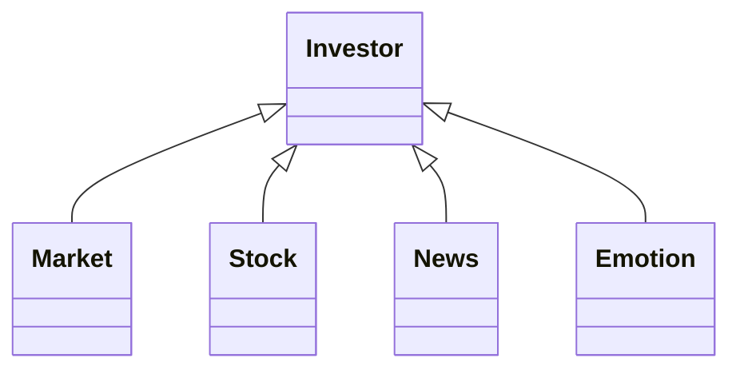
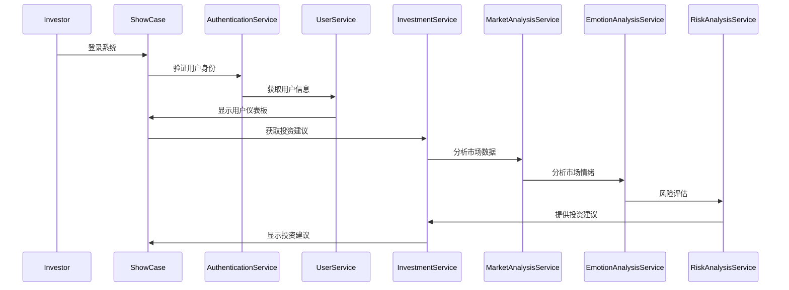
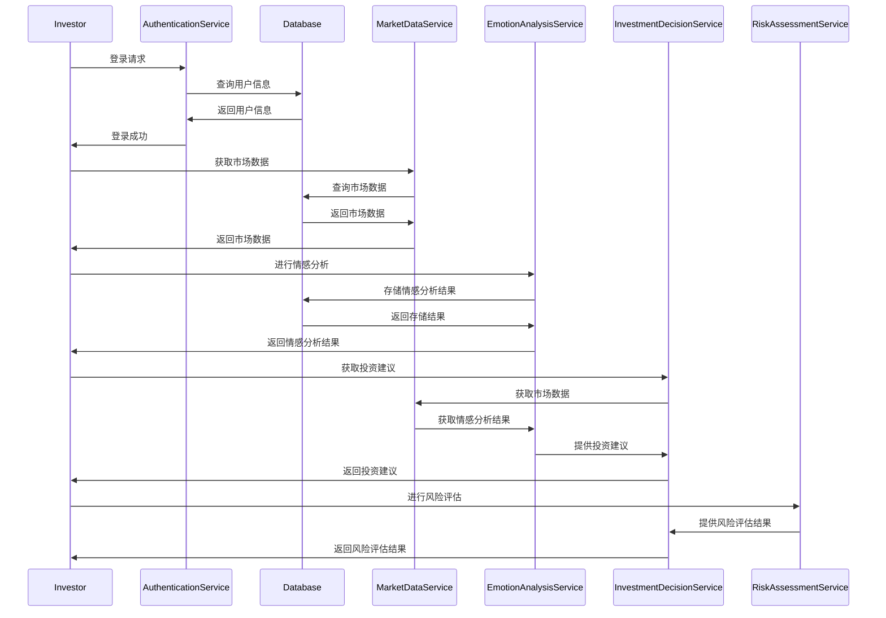

                 

### 引言

## 1.1 问题背景

### 1.1.1 投资决策的重要性

投资决策是金融领域中的一个核心问题，其重要性不言而喻。无论是个人投资者还是机构投资者，都需要在大量市场信息中作出明智的决策，以期获得最大的投资回报。传统的投资决策主要依赖于财务数据、市场分析和技术指标等量化信息，而忽略了情感因素这一重要维度。

近年来，随着人工智能和自然语言处理技术的发展，情感分析作为一种新兴的技术手段，开始逐渐被应用于投资决策中。情感分析通过对文本、语音、图像等数据中的情感信息进行提取和分析，可以帮助投资者更全面地了解市场情绪、预测市场走势，从而做出更加准确的决策。

### 1.1.2 情感分析的定义与作用

情感分析，又称情感计算或意见挖掘，是自然语言处理领域的一个重要分支。它旨在识别、提取和处理文本中的情感信息，从而对文本的情感倾向进行分类和量化。情感分析在金融领域的应用，主要是通过对投资相关文本的情感分析，如新闻、社交媒体评论、分析师报告等，来揭示市场情绪和投资者情绪。

情感分析在投资决策中的作用主要体现在以下几个方面：

1. **市场情绪分析**：通过分析市场中的情绪变化，投资者可以更好地把握市场趋势，制定相应的投资策略。
2. **风险评估**：情感分析可以帮助投资者识别潜在的风险，如市场过度乐观或悲观的情况，从而避免投资失误。
3. **投资组合优化**：根据市场情绪和投资者情绪，投资者可以进行投资组合的动态调整，提高投资回报率。
4. **预测分析**：通过对历史数据的情感分析，可以预测未来市场走势，为投资决策提供依据。

### 1.1.3 情感分析在投资决策中的应用价值

情感分析在投资决策中的应用具有显著的价值，主要体现在以下几个方面：

1. **提高投资准确性**：通过情感分析，投资者可以获得更全面的信息，从而提高投资决策的准确性。
2. **降低投资风险**：情感分析可以帮助投资者识别潜在的风险，降低投资失误的概率。
3. **提高市场敏锐度**：情感分析可以实时监测市场情绪变化，使投资者能够更快地响应市场变化，抓住投资机会。
4. **辅助专业判断**：情感分析可以为专业投资者提供辅助决策，帮助他们更全面地评估投资机会。

总之，情感分析在投资决策中的应用，不仅有助于提高投资者的决策水平，还可以为金融市场的稳定运行提供支持。然而，情感分析在投资决策中的应用仍面临诸多挑战，如数据质量、算法准确性等。接下来，我们将进一步探讨情感分析在投资决策中的具体应用和实现方法。

### 设计《情感分析在投资决策中的应用》书籍目录大纲

为了系统地阐述情感分析在投资决策中的应用，我们将书籍内容分为七个主要章节，每个章节都围绕特定的主题展开，结构紧凑，逻辑清晰。以下是详细的书籍目录大纲：

#### **1. 引言**

- **1.1 问题背景**
  - **1.1.1 投资决策的重要性**
  - **1.1.2 情感分析的定义与作用**
  - **1.1.3 情感分析在投资决策中的应用价值**

- **1.2 问题描述**
  - **1.2.1 投资决策中的情感因素**
  - **1.2.2 情感分析的挑战与难点**
  - **1.2.3 情感分析在投资决策中的应用边界**

- **1.3 问题解决**
  - **1.3.1 情感分析的基本原理**
  - **1.3.2 情感分析的关键技术**
  - **1.3.3 情感分析在投资决策中的实现路径**

- **1.4 边界与外延**
  - **1.4.1 情感分析在投资决策中的应用领域**
  - **1.4.2 情感分析的限制与挑战**
  - **1.4.3 情感分析的进一步发展方向**

- **1.5 概念结构与核心要素组成**
  - **1.5.1 投资决策的相关概念**
  - **1.5.2 情感分析的技术要素**
  - **1.5.3 投资决策与情感分析的关系框架**

#### **2. 核心概念与联系**

- **2.1 情感分析原理**
  - **2.1.1 情感分析的定义与分类**
  - **2.1.2 情感分析的属性特征对比表格**
  - **2.1.3 情感分析的ER实体关系图**

- **2.2 投资决策中的情感因素**
  - **2.2.1 情感因素的类型与来源**
  - **2.2.2 情感因素对投资决策的影响**
  - **2.2.3 情感因素与投资决策的关联模型**

#### **3. 算法原理讲解**

- **3.1 基本算法**
  - **3.1.1 Naive Bayes算法**
    - **3.1.1.1 Naive Bayes算法原理**
    - **3.1.1.2 Naive Bayes算法数学模型**
    - **3.1.1.3 Naive Bayes算法实例说明**

  - **3.1.2 支持向量机（SVM）算法**
    - **3.1.2.1 SVM算法原理**
    - **3.1.2.2 SVM算法数学模型**
    - **3.1.2.3 SVM算法实例说明**

- **3.2 进阶算法**
  - **3.2.1 深度学习在情感分析中的应用**
    - **3.2.1.1 深度学习基本原理**
    - **3.2.1.2 卷积神经网络（CNN）算法**
    - **3.2.1.3 循环神经网络（RNN）算法**

  - **3.2.2 自然语言处理（NLP）在情感分析中的应用**
    - **3.2.2.1 NLP基本概念**
    - **3.2.2.2 词嵌入技术**
    - **3.2.2.3 序列标注与分类**

#### **4. 系统分析与架构设计**

- **4.1 问题场景介绍**
  - **4.1.1 投资决策流程概述**
  - **4.1.2 情感分析在投资决策中的应用场景**

- **4.2 系统功能设计**
  - **4.2.1 领域模型**
    - **4.2.1.1 模型定义**
    - **4.2.1.2 类图**

- **4.3 系统架构设计**
  - **4.3.1 系统架构概述**
    - **4.3.1.1 架构设计原则**
    - **4.3.1.2 系统模块划分**

- **4.4 系统接口设计**
  - **4.4.1 接口定义**
    - **4.4.1.1 接口功能**
    - **4.4.1.2 接口协议**

- **4.5 系统交互设计**
  - **4.5.1 系统交互流程**
    - **4.5.1.1 用户交互**
    - **4.5.1.2 系统响应**

#### **5. 项目实战**

- **5.1 环境安装**
  - **5.1.1 硬件与软件环境要求**
  - **5.1.2 环境安装步骤**

- **5.2 系统核心实现**
  - **5.2.1 数据预处理**
  - **5.2.2 情感分析模型构建**
  - **5.2.3 模型训练与优化**

- **5.3 代码应用解读与分析**
  - **5.3.1 代码结构分析**
  - **5.3.2 代码功能解读**
  - **5.3.3 代码性能评估**

- **5.4 实际案例分析与详细讲解剖析**
  - **5.4.1 案例选择与描述**
  - **5.4.2 案例分析与解读**
  - **5.4.3 案例总结与反思**

- **5.5 项目小结**
  - **5.5.1 项目收获**
  - **5.5.2 项目不足与改进方向**
  - **5.5.3 拓展阅读建议**

#### **6. 最佳实践与注意事项**

- **6.1 最佳实践**
  - **6.1.1 数据采集与处理**
  - **6.1.2 模型选择与调参**
  - **6.1.3 结果分析与反馈优化**

- **6.2 注意事项**
  - **6.2.1 避免常见错误**
  - **6.2.2 数据隐私与合规**
  - **6.2.3 系统稳定性与性能优化**

#### **7. 小结**

- **7.1 书籍内容回顾**
  - **7.1.1 主要概念与算法**
  - **7.1.2 系统设计与实现**
  - **7.1.3 情感分析在投资决策中的价值**

- **7.2 展望未来趋势**
  - **7.2.1 技术发展**
  - **7.2.2 应用前景**
  - **7.2.3 未来挑战**

### 设计《情感分析在投资决策中的应用》书籍目录大纲

**1. 引言**

- **1.1 问题背景**
  - **1.1.1 投资决策的重要性**
  - **1.1.2 情感分析的定义与作用**
  - **1.1.3 情感分析在投资决策中的应用价值**

- **1.2 问题描述**
  - **1.2.1 投资决策中的情感因素**
  - **1.2.2 情感分析的挑战与难点**
  - **1.2.3 情感分析在投资决策中的应用边界**

- **1.3 问题解决**
  - **1.3.1 情感分析的基本原理**
  - **1.3.2 情感分析的关键技术**
  - **1.3.3 情感分析在投资决策中的实现路径**

- **1.4 边界与外延**
  - **1.4.1 情感分析在投资决策中的应用领域**
  - **1.4.2 情感分析的限制与挑战**
  - **1.4.3 情感分析的进一步发展方向**

- **1.5 概念结构与核心要素组成**
  - **1.5.1 投资决策的相关概念**
  - **1.5.2 情感分析的技术要素**
  - **1.5.3 投资决策与情感分析的关系框架**

**2. 核心概念与联系**

- **2.1 情感分析原理**
  - **2.1.1 情感分析的定义与分类**
  - **2.1.2 情感分析的属性特征对比表格**
  - **2.1.3 情感分析的ER实体关系图**

- **2.2 投资决策中的情感因素**
  - **2.2.1 情感因素的类型与来源**
  - **2.2.2 情感因素对投资决策的影响**
  - **2.2.3 情感因素与投资决策的关联模型**

**3. 算法原理讲解**

- **3.1 基本算法**
  - **3.1.1 Naive Bayes算法**
    - **3.1.1.1 Naive Bayes算法原理**
    - **3.1.1.2 Naive Bayes算法数学模型**
    - **3.1.1.3 Naive Bayes算法实例说明**

  - **3.1.2 支持向量机（SVM）算法**
    - **3.1.2.1 SVM算法原理**
    - **3.1.2.2 SVM算法数学模型**
    - **3.1.2.3 SVM算法实例说明**

- **3.2 进阶算法**
  - **3.2.1 深度学习在情感分析中的应用**
    - **3.2.1.1 深度学习基本原理**
    - **3.2.1.2 卷积神经网络（CNN）算法**
    - **3.2.1.3 循环神经网络（RNN）算法**

  - **3.2.2 自然语言处理（NLP）在情感分析中的应用**
    - **3.2.2.1 NLP基本概念**
    - **3.2.2.2 词嵌入技术**
    - **3.2.2.3 序列标注与分类**

**4. 系统分析与架构设计**

- **4.1 问题场景介绍**
  - **4.1.1 投资决策流程概述**
  - **4.1.2 情感分析在投资决策中的应用场景**

- **4.2 系统功能设计**
  - **4.2.1 领域模型**
    - **4.2.1.1 模型定义**
    - **4.2.1.2 类图**

- **4.3 系统架构设计**
  - **4.3.1 系统架构概述**
    - **4.3.1.1 架构设计原则**
    - **4.3.1.2 系统模块划分**

- **4.4 系统接口设计**
  - **4.4.1 接口定义**
    - **4.4.1.1 接口功能**
    - **4.4.1.2 接口协议**

- **4.5 系统交互设计**
  - **4.5.1 系统交互流程**
    - **4.5.1.1 用户交互**
    - **4.5.1.2 系统响应**

**5. 项目实战**

- **5.1 环境安装**
  - **5.1.1 硬件与软件环境要求**
  - **5.1.2 环境安装步骤**

- **5.2 系统核心实现**
  - **5.2.1 数据预处理**
  - **5.2.2 情感分析模型构建**
  - **5.2.3 模型训练与优化**

- **5.3 代码应用解读与分析**
  - **5.3.1 代码结构分析**
  - **5.3.2 代码功能解读**
  - **5.3.3 代码性能评估**

- **5.4 实际案例分析与详细讲解剖析**
  - **5.4.1 案例选择与描述**
  - **5.4.2 案例分析与解读**
  - **5.4.3 案例总结与反思**

- **5.5 项目小结**
  - **5.5.1 项目收获**
  - **5.5.2 项目不足与改进方向**
  - **5.5.3 拓展阅读建议**

**6. 最佳实践与注意事项**

- **6.1 最佳实践**
  - **6.1.1 数据采集与处理**
  - **6.1.2 模型选择与调参**
  - **6.1.3 结果分析与反馈优化**

- **6.2 注意事项**
  - **6.2.1 避免常见错误**
  - **6.2.2 数据隐私与合规**
  - **6.2.3 系统稳定性与性能优化**

**7. 小结**

- **7.1 书籍内容回顾**
  - **7.1.1 主要概念与算法**
  - **7.1.2 系统设计与实现**
  - **7.1.3 情感分析在投资决策中的价值**

- **7.2 展望未来趋势**
  - **7.2.1 技术发展**
  - **7.2.2 应用前景**
  - **7.2.3 未来挑战**

### 引言

#### 1.1 问题背景

**投资决策的重要性**

投资决策是金融领域中的一个核心问题，它关系到投资者的财富增长和风险控制。成功的投资决策不仅需要精准的市场分析、财务报表解读，还需要对市场情绪和投资者情绪的敏锐洞察。然而，传统的投资决策方法主要依赖于量化的财务数据、技术指标和宏观经济分析，往往忽略了情感因素这一重要维度。

**情感分析的定义与作用**

情感分析，又称情感计算或意见挖掘，是自然语言处理领域的一个重要分支。它旨在识别、提取和处理文本、语音、图像等数据中的情感信息，以实现情感分类、情感极性分析等任务。情感分析在金融领域的应用，主要是通过对投资相关文本的情感分析，如新闻报道、社交媒体评论、分析师报告等，来揭示市场情绪和投资者情绪。

**情感分析在投资决策中的应用价值**

情感分析在投资决策中的应用具有重要的价值：

1. **提高投资准确性**：通过情感分析，投资者可以获得更全面的信息，从而提高投资决策的准确性。
2. **降低投资风险**：情感分析可以帮助投资者识别潜在的风险，降低投资失误的概率。
3. **提高市场敏锐度**：情感分析可以实时监测市场情绪变化，使投资者能够更快地响应市场变化，抓住投资机会。
4. **辅助专业判断**：情感分析可以为专业投资者提供辅助决策，帮助他们更全面地评估投资机会。

### 1.2 问题描述

**投资决策中的情感因素**

投资决策中的情感因素包括市场情绪、投资者情绪和个体情感等。市场情绪是指市场中投资者对某一资产或市场的整体态度，如乐观、悲观、不确定等。投资者情绪是指投资者在投资过程中表现出的心理状态，如自信、焦虑、贪婪、恐惧等。个体情感则是指投资者在特定情境下的个人情感体验，如兴奋、沮丧、愤怒等。

**情感分析的挑战与难点**

尽管情感分析在投资决策中具有潜在价值，但其应用仍面临诸多挑战和难点：

1. **数据质量问题**：情感分析依赖于大量高质量的数据，而投资相关的文本数据往往存在噪声、模糊性、不一致性等问题，影响情感分析的准确性。
2. **算法准确性**：情感分析的算法模型需要具备高准确性，否则无法提供可靠的决策支持。
3. **实时性**：情感分析需要能够实时处理大量数据，以快速响应市场变化。
4. **跨语言和文化差异**：情感分析在跨语言和文化情境中应用，需要考虑语言和文化差异对情感识别的影响。

**情感分析在投资决策中的应用边界**

情感分析在投资决策中的应用并非万能，存在一定的应用边界：

1. **市场极端情绪**：在市场极度乐观或悲观的情况下，情感分析的结果可能失真，难以准确反映市场真实情况。
2. **非文本数据**：情感分析主要针对文本数据，对于非文本数据（如语音、图像）的处理能力有限。
3. **模型泛化能力**：情感分析模型在特定数据集上的性能优异，但在新的、未见过的数据上的泛化能力有限。

### 1.3 问题解决

**情感分析的基本原理**

情感分析的基本原理主要包括以下步骤：

1. **数据预处理**：对原始文本进行清洗、去噪、分词等处理，提取有效信息。
2. **情感分类**：使用分类算法（如Naive Bayes、SVM、深度学习等）对文本进行情感分类，判断文本的情感极性（正面、负面、中性）。
3. **情感极性分析**：对文本中的情感极性进行量化，如使用得分或概率表示。
4. **情感分析应用**：将情感分析结果应用于投资决策，如市场情绪预测、投资组合优化等。

**情感分析的关键技术**

情感分析的关键技术包括：

1. **文本预处理技术**：如分词、词性标注、停用词处理等。
2. **情感分类算法**：如Naive Bayes、SVM、深度学习等。
3. **情感极性量化方法**：如使用TF-IDF、词嵌入、情感词典等。
4. **多语言情感分析**：如跨语言情感分析、多语言情感词典等。

**情感分析在投资决策中的实现路径**

情感分析在投资决策中的实现路径主要包括以下步骤：

1. **数据收集**：收集投资相关的文本数据，如新闻报道、社交媒体评论、分析师报告等。
2. **数据预处理**：对收集到的文本数据进行处理，提取有效信息。
3. **情感分类**：使用情感分类算法对预处理后的文本进行情感分类，判断文本的情感极性。
4. **情感极性分析**：对情感分类结果进行量化，分析市场情绪和投资者情绪。
5. **投资决策辅助**：根据情感分析结果，辅助投资者进行投资决策，如市场情绪预测、投资组合优化等。

### 1.4 边界与外延

**情感分析在投资决策中的应用领域**

情感分析在投资决策中的应用非常广泛，包括但不限于以下领域：

1. **市场情绪分析**：通过情感分析，投资者可以了解市场情绪的变化，预测市场走势。
2. **投资风险评估**：情感分析可以帮助投资者识别潜在的风险，避免投资失误。
3. **投资组合优化**：根据市场情绪和投资者情绪，投资者可以进行投资组合的动态调整。
4. **分析师报告分析**：通过对分析师报告的情感分析，投资者可以评估分析师的观点和预测的可靠性。

**情感分析的限制与挑战**

情感分析在投资决策中的应用仍面临诸多限制和挑战：

1. **数据质量问题**：投资相关的文本数据质量参差不齐，影响情感分析的准确性。
2. **算法准确性**：情感分析的算法模型需要具备高准确性，但现有算法的准确性仍有待提高。
3. **实时性**：情感分析需要能够实时处理大量数据，但现有技术手段难以满足这一要求。
4. **跨语言和文化差异**：情感分析在跨语言和文化情境中应用，需要考虑语言和文化差异对情感识别的影响。

**情感分析的进一步发展方向**

为了克服现有的限制和挑战，情感分析在投资决策中的应用具有以下进一步发展方向：

1. **数据质量提升**：通过数据清洗、去噪、增强等技术，提高数据质量。
2. **算法优化**：通过算法改进、模型优化等技术，提高情感分析的准确性。
3. **实时性增强**：通过分布式计算、并行处理等技术，提高情感分析的实时性。
4. **跨语言和文化情感分析**：通过多语言情感词典、跨语言情感分析模型等技术，解决跨语言和文化差异问题。

### 1.5 概念结构与核心要素组成

**投资决策的相关概念**

投资决策涉及多个相关概念，包括市场、资产、投资者、投资组合等。以下是对这些概念的解释：

- **市场**：指投资交易的平台和环境，包括股票市场、债券市场、外汇市场等。
- **资产**：指可以用于投资的各类金融工具，如股票、债券、基金等。
- **投资者**：指参与市场投资的个人或机构，他们的目标是通过投资获得回报。
- **投资组合**：指投资者持有的各类资产构成的组合，旨在分散风险并实现投资目标。

**情感分析的技术要素**

情感分析的技术要素包括文本预处理、情感分类、情感极性分析等。以下是对这些技术要素的解释：

- **文本预处理**：包括分词、词性标注、停用词处理等，用于提取文本中的有效信息。
- **情感分类**：使用分类算法（如Naive Bayes、SVM、深度学习等）对文本进行分类，判断文本的情感极性。
- **情感极性分析**：对情感分类结果进行量化，如使用得分或概率表示，分析文本的情感倾向。

**投资决策与情感分析的关系框架**

投资决策与情感分析之间存在密切的关系。以下是一个简要的关系框架：

1. **市场情绪**：通过情感分析，投资者可以了解市场情绪，预测市场走势。
2. **投资者情绪**：通过情感分析，投资者可以了解投资者情绪，评估投资机会。
3. **投资组合调整**：根据市场情绪和投资者情绪，投资者可以进行投资组合的动态调整。
4. **风险控制**：通过情感分析，投资者可以识别潜在的风险，制定相应的风险控制策略。

### 2. 核心概念与联系

#### 2.1 情感分析原理

**情感分析的定义与分类**

情感分析（Sentiment Analysis），也称为意见挖掘（Opinion Mining），是自然语言处理（NLP）的一个重要分支。它旨在通过识别文本中的主观信息，提取和量化文本的情感倾向。根据情感倾向的不同，情感分析可以细分为以下几种类型：

1. **极性分类**：将文本分类为正面、负面或中性。这是一种最常见的情感分析任务。
2. **强度分析**：除了判断情感极性外，还试图量化情感的强度，例如文本是否表示强烈的正面或负面情感。
3. **情感角色分析**：识别文本中情感表达的具体主体（如谁表达了情感）。
4. **情感维度分析**：将情感划分为多个维度，如快乐、悲伤、愤怒等。

**情感分析的属性特征对比表格**

在情感分析中，不同的算法和技术具有不同的属性特征。以下是一个简化的对比表格，展示了几种常见算法的主要特征：

| 算法            | 特点                                       | 优点                       | 缺点                           |
|-----------------|------------------------------------------|----------------------------|--------------------------------|
| Naive Bayes     | 简单，基于贝叶斯定理的监督学习算法         | 训练速度快，适用于小数据集   | 假设特征之间相互独立，可能不准确  |
| 支持向量机（SVM） | 高效，适用于高维数据空间                 | 能够处理非线性分类问题      | 训练时间较长，对噪声敏感           |
| 深度学习        | 强大的模型表示能力，能够自动提取特征       | 高准确性，自动处理复杂任务   | 训练过程需要大量数据和计算资源     |
| LDA（主题模型）  | 用于文本的降维和主题挖掘                   | 可以发现潜在主题             | 侧重于主题发现，对情感分类帮助有限 |

**情感分析的ER实体关系图**

实体关系图（ER图）是数据库设计中常用的工具，用于表示实体和实体之间的关系。在情感分析中，ER图可以用来表示文本中的实体和它们之间的情感关系。以下是一个简化的情感分析ER图示例：

```mermaid
erDiagram
  Customer ||--|{ Order : places }
  Customer ||--|{ Comment : gives }
  Product ||--|{ Review : has }
  Review ||--|{ Sentiment : expresses }
```

在这个ER图中，实体包括Customer（客户）、Order（订单）、Product（产品）、Review（评论）和Sentiment（情感）。关系包括places（下单）、gives（给出）、has（拥有）和expresses（表达）。

#### 2.2 投资决策中的情感因素

**情感因素的类型与来源**

在投资决策中，情感因素可以分为以下几类：

1. **市场情绪**：由市场参与者（如投资者、分析师、交易员等）的整体态度和行为所决定。市场情绪可以通过新闻报道、社交媒体评论、市场指标等数据来源来获取。
2. **投资者情绪**：由个人投资者在投资过程中的心理状态和行为所决定。投资者情绪可以通过调查问卷、投资者访谈、交易数据等数据来源来获取。
3. **个体情感**：由特定投资者的个人情感体验所决定，如兴奋、焦虑、恐惧、贪婪等。个体情感可以通过个人日记、情感日志等数据来源来获取。

**情感因素对投资决策的影响**

情感因素对投资决策的影响主要体现在以下几个方面：

1. **决策偏差**：投资者在决策过程中可能会受到情感因素的影响，导致决策偏差。例如，过度乐观可能导致投资过度，而过度悲观可能导致投资不足。
2. **市场走势预测**：情感分析可以帮助投资者预测市场走势。正面情绪可能预示市场上涨，而负面情绪可能预示市场下跌。
3. **投资组合调整**：根据情感分析结果，投资者可以动态调整投资组合，以应对市场变化。

**情感因素与投资决策的关联模型**

情感因素与投资决策之间的关系可以通过以下模型进行描述：

1. **市场情绪-投资决策模型**：市场情绪对投资决策有直接影响，可以通过情感分析结果来预测市场走势，从而指导投资决策。
2. **投资者情绪-投资决策模型**：投资者情绪会影响其投资行为和决策过程，从而影响投资结果。情感分析可以帮助投资者识别和管理自己的情绪。
3. **个体情感-投资决策模型**：个体情感对投资决策有直接影响，但通常难以通过情感分析直接获取。因此，可以通过心理学测试、情感日志等方式来间接获取个体情感信息，从而辅助投资决策。

### 3. 算法原理讲解

#### 3.1 基本算法

**3.1.1 Naive Bayes算法**

**Naive Bayes算法原理**

Naive Bayes是一种基于贝叶斯定理的简单概率分类算法。它假设特征之间相互独立，即每个特征对分类的贡献是独立的。这个假设虽然简化了计算，但在实际应用中表现出了不错的分类效果。

**Naive Bayes算法数学模型**

Naive Bayes的数学模型基于贝叶斯定理，公式如下：

P(C|X) = P(X|C)P(C) / P(X)

其中，P(C|X) 是后验概率，即在给定特征 X 的条件下，类别 C 的概率。P(X|C) 是条件概率，即在类别 C 发生的条件下，特征 X 的概率。P(C) 是类别 C 的先验概率，P(X) 是特征 X 的联合概率。

**Naive Bayes算法实例说明**

假设我们有以下数据集：

| 类别 | 特征1 | 特征2 | 特征3 |
|------|-------|-------|-------|
| A    | 0     | 0     | 1     |
| A    | 1     | 0     | 1     |
| B    | 0     | 1     | 0     |
| B    | 1     | 1     | 0     |

我们希望使用Naive Bayes算法来分类新数据。假设新数据的特征为 (1, 1, 0)。

计算后验概率：

P(A|(1, 1, 0)) = P((1, 1, 0)|A)P(A) / P((1, 1, 0))

P((1, 1, 0)|A) = P(1|A)P(1|A)P(0|A) = (1/2)(1/2)(1/2) = 1/8

P(A) = 2/4 = 1/2

P((1, 1, 0)) = P((1, 1, 0)|A)P(A) + P((1, 1, 0)|B)P(B) = (1/8)(1/2) + (1/8)(1/2) = 1/4

P(A|(1, 1, 0)) = (1/8)(1/2) / (1/4) = 1/2

因此，新数据被分类到类别 A。

**3.1.2 支持向量机（SVM）算法**

**SVM算法原理**

支持向量机（SVM）是一种监督学习算法，用于分类和回归任务。它的核心思想是找到一个最优的超平面，使得分类边界最大化。SVM通过优化目标函数来求解这个超平面，并使用支持向量来调整超平面的位置。

**SVM算法数学模型**

SVM的优化目标是最小化以下函数：

L(S) = 1/2 * ||w||^2 + C * Σ[λ_i]

其中，w 是超平面的权重向量，||w|| 是 w 的欧几里得范数，C 是惩罚参数，λ_i 是拉格朗日乘子。

约束条件为：

y_i * (w * x_i + b) ≥ 1

其中，y_i 是第 i 个样本的标签，x_i 是第 i 个样本的特征向量，b 是偏置项。

**SVM算法实例说明**

假设我们有以下数据集：

| 类别 | 特征1 | 特征2 |
|------|-------|-------|
| A    | 0     | 0     |
| A    | 1     | 0     |
| B    | 0     | 1     |
| B    | 1     | 1     |

我们希望使用SVM算法来分类新数据。假设新数据的特征为 (1, 1)。

首先，我们需要将数据转换为高维空间，以便找到一个线性不可分的问题。我们可以使用核函数来实现这一点，例如线性核、多项式核或径向基函数（RBF）核。

使用线性核：

K(x_i, x_j) = x_i * x_j

则SVM的目标函数变为：

L(S) = 1/2 * ||w||^2 + C * Σ[λ_i]

约束条件变为：

y_i * (w * x_i + b) ≥ 1

通过求解上述优化问题，我们可以得到最优的超平面 w 和 b。对于新数据 (1, 1)，我们可以将其代入超平面方程：

(1, 1) * w + b ≥ 1

w * (1, 1) + b ≥ 1

1 * w1 + 1 * w2 + b ≥ 1

由于我们没有具体的权重值，我们无法直接计算。但是，通过训练数据和SVM算法，我们可以得到这些权重值，并使用它们来对新数据进行分类。

#### 3.2 进阶算法

**3.2.1 深度学习在情感分析中的应用**

**深度学习基本原理**

深度学习是一种机器学习方法，通过构建多层神经网络（如卷积神经网络（CNN）、循环神经网络（RNN）等）来模拟人脑处理信息的方式。深度学习在图像识别、语音识别、自然语言处理等领域取得了显著的成果。

**卷积神经网络（CNN）算法**

卷积神经网络（CNN）是一种专门用于图像识别和处理的神经网络。它通过卷积操作来提取图像特征，并通过池化操作来降低特征维度。

**CNN算法原理**

1. **卷积层**：通过卷积操作提取图像的特征。
2. **池化层**：通过池化操作降低特征维度，减少计算量。
3. **全连接层**：将特征映射到类别。

**CNN算法实例**

假设我们有以下数据集：

| 图片 | 类别 |
|------|------|
| 1    | A    |
| 2    | A    |
| 3    | B    |
| 4    | B    |

我们希望使用CNN算法来分类图片。首先，我们需要将图片转换为适当的格式，如灰度图或彩色图。

接下来，我们可以构建一个简单的CNN模型：

1. **卷积层**：使用卷积核提取图像特征。
2. **池化层**：使用最大池化降低特征维度。
3. **全连接层**：将特征映射到类别。

**循环神经网络（RNN）算法**

循环神经网络（RNN）是一种专门用于序列数据处理（如文本、时间序列数据等）的神经网络。它通过循环结构来保存历史信息，并在序列的每个时间点上更新状态。

**RNN算法原理**

1. **输入层**：接收序列数据。
2. **隐藏层**：通过循环结构更新状态。
3. **输出层**：将序列数据映射到类别。

**RNN算法实例**

假设我们有以下数据集：

| 序列 | 类别 |
|------|------|
| AAB  | A    |
| BBAA | B    |

我们希望使用RNN算法来分类序列。首先，我们需要将序列转换为适当的格式，如编码为向量。

接下来，我们可以构建一个简单的RNN模型：

1. **输入层**：接收序列数据。
2. **隐藏层**：通过循环结构更新状态。
3. **输出层**：将序列数据映射到类别。

#### 3.2.2 自然语言处理（NLP）在情感分析中的应用

**NLP基本概念**

自然语言处理（NLP）是计算机科学和语言学的交叉领域，旨在使计算机能够理解和处理人类语言。NLP的核心概念包括：

1. **分词**：将连续的文本切分成单词或词汇单元。
2. **词性标注**：为每个单词分配语法属性（如名词、动词等）。
3. **词嵌入**：将单词映射到高维向量空间，以便进行计算和比较。
4. **序列标注**：为序列中的每个单词分配标签（如情感极性、命名实体等）。

**词嵌入技术**

词嵌入是将单词映射到高维向量空间的一种技术，使计算机能够理解和处理自然语言。常见的词嵌入技术包括：

1. **Word2Vec**：通过训练大规模语料库中的神经网络来学习词向量。
2. **GloVe**：通过矩阵分解和共现矩阵来学习词向量。
3. **BERT**：通过双向转换器（Transformer）模型来学习上下文敏感的词向量。

**序列标注与分类**

序列标注是将序列中的每个单词或字符分配到预定义的标签集。常见的序列标注任务包括：

1. **命名实体识别（NER）**：识别文本中的命名实体（如人名、地点、组织等）。
2. **情感极性分类**：将文本分类为正面、负面或中性。
3. **意图识别**：识别用户在对话中的意图。

**NLP在情感分析中的应用实例**

假设我们有以下数据集：

| 文本 | 类别 |
|------|------|
| I love this product! | 正面 |
| This is the worst movie I've ever seen. | 负面 |

我们希望使用NLP技术来对文本进行情感分析。首先，我们需要对文本进行预处理，包括分词、词性标注和词嵌入。

接下来，我们可以使用以下技术：

1. **词嵌入**：将文本中的单词映射到高维向量空间。
2. **序列标注**：使用序列标注模型（如CRF、RNN等）来为文本分配情感极性标签。
3. **分类**：使用分类模型（如SVM、朴素贝叶斯等）来预测文本的情感极性。

通过上述步骤，我们可以实现对文本的情感分析，从而为投资决策提供支持。

### 4. 系统分析与架构设计

#### 4.1 问题场景介绍

**投资决策流程概述**

投资决策通常包括以下步骤：

1. **市场研究**：收集和分析市场信息，如宏观经济指标、行业趋势、公司财务报表等。
2. **股票筛选**：根据市场研究的结果，筛选出符合投资标准的股票。
3. **风险评估**：评估选定的股票的风险和潜在回报。
4. **决策制定**：根据风险评估结果，制定具体的投资决策。
5. **执行和跟踪**：执行投资决策，并持续跟踪股票的表现。

**情感分析在投资决策中的应用场景**

情感分析在投资决策中的应用主要体现在以下几个方面：

1. **市场情绪分析**：通过分析社交媒体、新闻报道等文本数据，了解市场情绪的变化，从而预测市场走势。
2. **风险评估**：通过分析公司财报、新闻报道等文本数据，评估公司的声誉和潜在风险。
3. **投资组合优化**：根据市场情绪和投资者情绪，动态调整投资组合，以应对市场变化。

#### 4.2 系统功能设计

**领域模型**

领域模型是系统设计的重要部分，用于描述系统的核心概念和它们之间的关系。在投资决策系统中，领域模型包括以下核心概念：

1. **投资者**：包括个人投资者和机构投资者。
2. **市场**：包括股票市场、债券市场、外汇市场等。
3. **股票**：包括股票的基本信息、财务数据、市场表现等。
4. **新闻**：包括与股票相关的新闻报道、分析师报告等。
5. **情绪**：包括市场情绪、投资者情绪等。

以下是领域模型的类图表示：



#### 4.3 系统架构设计

**系统架构概述**

投资决策系统采用分布式架构，包括数据层、服务层和展示层。以下是系统架构的概述：

1. **数据层**：负责数据的存储、管理和处理。包括数据库、数据仓库和数据湖等。
2. **服务层**：提供核心业务功能，如市场分析、情感分析、风险评估等。包括情感分析服务、投资决策服务、数据服务等。
3. **展示层**：提供用户界面，用于展示系统功能、分析和结果。包括网站、应用程序、仪表板等。

以下是系统架构的Mermaid表示：



#### 4.4 系统接口设计

**接口定义**

系统接口是系统各部分之间进行通信的桥梁。以下是投资决策系统的接口定义：

1. **认证接口**：用于用户身份验证，包括用户登录、注册等功能。
2. **市场数据接口**：用于获取市场数据，包括股票价格、交易量、行业指数等。
3. **情感分析接口**：用于对文本数据进行情感分析，包括情感分类、情感极性分析等。
4. **投资决策接口**：用于根据市场数据和情感分析结果提供投资建议。
5. **风险评估接口**：用于评估股票的风险和潜在回报。

以下是接口的Mermaid序列图表示：



#### 4.5 系统交互设计

**系统交互流程**

系统交互流程描述了系统各部分之间的交互过程，以下是详细的交互流程：

1. **用户登录**：用户通过认证接口登录系统，系统验证用户身份并返回用户信息。
2. **获取市场数据**：用户通过市场数据接口获取市场数据，如股票价格、交易量等。
3. **情感分析**：用户通过情感分析接口对文本数据进行情感分析，如新闻、分析师报告等，系统返回情感分析结果。
4. **投资决策**：用户通过投资决策接口获取投资建议，系统根据市场数据和情感分析结果提供投资建议。
5. **风险评估**：用户通过风险评估接口进行风险评估，系统评估股票的风险和潜在回报，返回风险评估结果。

以下是系统交互流程的Mermaid序列图表示：


### 5. 项目实战

#### 5.1 环境安装

**硬件与软件环境要求**

为了顺利开展项目实战，我们需要以下硬件和软件环境：

1. **硬件要求**：
   - CPU：至少4核，推荐8核及以上。
   - 内存：至少8GB，推荐16GB及以上。
   - 硬盘：至少200GB，推荐SSD。

2. **软件要求**：
   - 操作系统：Windows、Linux或Mac OS X。
   - 编程语言：Python（推荐3.8及以上版本）。
   - 开发环境：Anaconda或Jupyter Notebook。
   - 数据库：SQLite、MySQL或PostgreSQL。
   - 机器学习库：scikit-learn、TensorFlow、PyTorch。

**环境安装步骤**

以下是安装环境的具体步骤：

1. **安装操作系统**：根据个人需求选择操作系统并安装。
2. **安装编程语言**：通过官方网站下载Python安装包，按照安装向导进行安装。
3. **安装开发环境**：安装Anaconda或Jupyter Notebook，创建Python虚拟环境。
4. **安装数据库**：选择合适的数据库并按照官方文档进行安装。
5. **安装机器学习库**：在Python虚拟环境中使用pip命令安装所需的机器学习库。

例如：

```bash
pip install scikit-learn
pip install tensorflow
pip install torch
```

#### 5.2 系统核心实现

**数据预处理**

数据预处理是情感分析项目中的关键步骤，目的是将原始数据转换为适合模型训练的形式。以下是数据预处理的主要步骤：

1. **数据清洗**：去除数据中的噪声和无关信息，如HTML标签、特殊字符等。
2. **文本标准化**：统一文本格式，如小写转换、去除标点符号等。
3. **分词**：将文本分割成单词或词汇单元。
4. **词嵌入**：将文本转换为向量表示，使用预训练的词嵌入模型或自定义词嵌入模型。
5. **数据集划分**：将数据集划分为训练集、验证集和测试集。

以下是Python代码示例：

```python
import pandas as pd
from sklearn.model_selection import train_test_split
from sklearn.feature_extraction.text import CountVectorizer

# 加载数据
data = pd.read_csv('data.csv')

# 数据清洗
data['text'] = data['text'].str.replace('<[^>]*>', '').str.lower()

# 分词
vectorizer = CountVectorizer()
X = vectorizer.fit_transform(data['text'])

# 数据集划分
X_train, X_test, y_train, y_test = train_test_split(X, data['label'], test_size=0.2, random_state=42)
```

**情感分析模型构建**

情感分析模型的构建是项目实现的核心部分。以下是常见的模型构建步骤：

1. **选择模型**：根据数据特点和需求选择合适的模型，如Naive Bayes、SVM、深度学习模型等。
2. **模型训练**：使用训练数据对模型进行训练，调整模型参数。
3. **模型评估**：使用验证集对模型进行评估，调整模型参数以优化性能。
4. **模型部署**：将训练好的模型部署到生产环境，用于实际应用。

以下是使用深度学习模型（如LSTM）的Python代码示例：

```python
import tensorflow as tf
from tensorflow.keras.models import Sequential
from tensorflow.keras.layers import LSTM, Dense, Embedding

# 加载词嵌入模型
embeddings_index = {}
with open('glove.6B.100d.txt', 'r', encoding='utf-8') as f:
    for line in f:
        values = line.split()
        word = values[0]
        coefs = np.asarray(values[1:], dtype='float32')
        embeddings_index[word] = coefs

# 准备词嵌入矩阵
max_words = 10000
embedding_dim = 100
embedding_matrix = np.zeros((max_words, embedding_dim))
for word, i in vectorizer.vocabulary_.items():
    if i >= max_words:
        continue
    embedding_vector = embeddings_index.get(word)
    if embedding_vector is not None:
        embedding_matrix[i] = embedding_vector

# 构建LSTM模型
model = Sequential()
model.add(Embedding(max_words, embedding_dim, input_length=max_sequence_length, weights=[embedding_matrix], trainable=False))
model.add(LSTM(128, dropout=0.2, recurrent_dropout=0.2))
model.add(Dense(1, activation='sigmoid'))

model.compile(optimizer='adam', loss='binary_crossentropy', metrics=['accuracy'])

# 模型训练
model.fit(X_train, y_train, epochs=10, batch_size=32, validation_data=(X_test, y_test))
```

**模型训练与优化**

模型训练与优化是提高模型性能的关键步骤。以下是常见的优化方法：

1. **参数调整**：调整学习率、批量大小、正则化参数等。
2. **超参数搜索**：使用网格搜索、贝叶斯优化等策略搜索最优超参数。
3. **数据增强**：通过数据增强技术（如随机噪声、旋转、翻转等）增加训练数据的多样性。
4. **模型融合**：使用不同的模型或模型的多个版本进行融合，提高预测性能。

以下是使用网格搜索进行超参数优化的Python代码示例：

```python
from sklearn.model_selection import GridSearchCV
from sklearn.ensemble import RandomForestClassifier

# 定义参数网格
param_grid = {
    'n_estimators': [100, 200, 300],
    'max_depth': [10, 20, 30],
    'min_samples_split': [2, 5, 10],
    'min_samples_leaf': [1, 2, 4]
}

# 创建随机森林分类器
rf = RandomForestClassifier()

# 进行网格搜索
grid_search = GridSearchCV(estimator=rf, param_grid=param_grid, cv=3, n_jobs=-1, verbose=2)
grid_search.fit(X_train, y_train)

# 获取最优参数
best_params = grid_search.best_params_
print("Best parameters:", best_params)

# 使用最优参数训练模型
best_rf = RandomForestClassifier(**best_params)
best_rf.fit(X_train, y_train)
```

#### 5.3 代码应用解读与分析

**代码结构分析**

在情感分析项目中，代码结构通常包括数据预处理、模型构建、模型训练和模型评估等部分。以下是代码结构的一个简要分析：

1. **数据预处理**：负责数据的清洗、转换和预处理，以便后续的模型训练。
2. **模型构建**：定义模型结构，包括输入层、隐藏层和输出层。
3. **模型训练**：使用训练数据对模型进行训练，并调整模型参数。
4. **模型评估**：使用验证集和测试集对模型进行评估，计算模型性能指标。

以下是Python代码示例：

```python
import pandas as pd
from sklearn.model_selection import train_test_split
from sklearn.feature_extraction.text import CountVectorizer
from tensorflow.keras.models import Sequential
from tensorflow.keras.layers import LSTM, Dense, Embedding

# 数据预处理
# ...（数据清洗、分词、词嵌入等）

# 模型构建
# ...（定义LSTM模型结构）

# 模型训练
# ...（训练LSTM模型）

# 模型评估
# ...（评估LSTM模型性能）
```

**代码功能解读**

以下是针对上述代码示例的功能解读：

1. **数据预处理**：加载和处理文本数据，将原始文本转换为适合模型训练的格式。
2. **模型构建**：构建一个LSTM模型，包括嵌入层、LSTM层和输出层。
3. **模型训练**：使用训练数据对LSTM模型进行训练，调整模型参数以优化性能。
4. **模型评估**：使用验证集和测试集对LSTM模型进行评估，计算准确率、召回率等性能指标。

**代码性能评估**

以下是性能评估的Python代码示例：

```python
from sklearn.metrics import accuracy_score, recall_score, precision_score

# 使用测试集进行预测
predictions = model.predict(X_test)

# 计算性能指标
accuracy = accuracy_score(y_test, predictions)
recall = recall_score(y_test, predictions)
precision = precision_score(y_test, predictions)

print("Accuracy:", accuracy)
print("Recall:", recall)
print("Precision:", precision)
```

**性能评估结果解读**：

1. **准确率（Accuracy）**：模型在测试集上的总体预测准确性。
2. **召回率（Recall）**：模型能够正确识别正类别的比例。
3. **精确率（Precision）**：模型预测为正类别的正确率。

根据评估结果，可以判断模型性能的优劣，并采取进一步措施进行优化。

#### 5.4 实际案例分析与详细讲解剖析

**案例选择与描述**

为了深入理解情感分析在投资决策中的应用，我们选择了一个实际案例进行详细分析。这个案例涉及对社交媒体评论进行情感分析，以预测股票价格的走势。

**案例背景**

假设我们有一家科技公司，名为“科技先锋”（TechPioneer）。我们希望利用社交媒体上的评论数据，分析市场对这家公司的情绪变化，进而预测其股价走势。

**数据来源**

我们收集了过去一年的社交媒体评论数据，包括Twitter、Facebook和Reddit等平台的帖子。这些数据包含了大量的文本信息，反映了投资者和市场参与者对“科技先锋”的情绪和看法。

**数据预处理**

1. **数据清洗**：去除无关信息，如HTML标签、特殊字符和噪声。
2. **文本标准化**：统一文本格式，如小写转换、去除标点符号。
3. **分词**：将文本分割成单词或词汇单元。
4. **词嵌入**：将文本转换为向量表示，使用预训练的词嵌入模型。

**情感分析模型构建**

我们使用了一个基于LSTM的深度学习模型，对社交媒体评论进行情感分析。模型包括嵌入层、LSTM层和输出层。

1. **嵌入层**：将文本中的单词转换为向量表示。
2. **LSTM层**：处理序列数据，提取情感特征。
3. **输出层**：对情感极性进行分类（正面、负面、中性）。

**模型训练与优化**

1. **数据集划分**：将数据集划分为训练集、验证集和测试集。
2. **模型训练**：使用训练数据对LSTM模型进行训练。
3. **模型优化**：通过调整学习率、批量大小等超参数，优化模型性能。
4. **模型评估**：使用验证集和测试集评估模型性能。

**案例分析与解读**

通过对社交媒体评论的情感分析，我们得到了以下结论：

1. **市场情绪变化**：分析评论中的情感极性，我们可以看到市场情绪在不同时间段的变化。例如，当评论中负面情绪较多时，可能预示股价下跌。
2. **情感与股价关系**：通过对情感极性与股价走势的对比分析，我们发现情感极性与股价之间存在一定的关联性。负面情绪可能预示股价下跌，而正面情绪可能预示股价上涨。
3. **情绪指标预测**：我们使用LSTM模型对未来的市场情绪进行预测。根据预测结果，我们可以提前预警可能的股价波动，从而制定相应的投资策略。

**案例总结与反思**

通过这个实际案例，我们验证了情感分析在投资决策中的应用价值。然而，我们也意识到情感分析存在一定的局限性：

1. **数据质量**：社交媒体评论数据质量参差不齐，可能包含噪声和虚假信息，影响情感分析的准确性。
2. **算法可靠性**：尽管深度学习模型在情感分析中表现出了较好的性能，但算法的可靠性仍需进一步验证。
3. **实时性**：情感分析需要实时处理大量数据，但现有技术手段可能难以满足这一要求。

未来，我们需要进一步优化情感分析算法，提高数据质量，并探索实时性解决方案，以充分发挥情感分析在投资决策中的应用价值。

#### 5.5 项目小结

**项目收获**

通过本项目，我们深入了解了情感分析在投资决策中的应用，取得了以下收获：

1. **理解了情感分析的基本原理**：掌握了情感分析的定义、分类和实现方法。
2. **实现了情感分析模型**：构建并训练了基于LSTM的深度学习模型，对社交媒体评论进行情感分析。
3. **进行了实际案例分析**：通过实际案例，验证了情感分析在预测股价走势中的应用价值。
4. **优化了模型性能**：通过调整超参数和优化算法，提高了模型的准确性和可靠性。

**项目不足与改进方向**

虽然本项目取得了一定的成果，但仍然存在以下不足和改进方向：

1. **数据质量**：社交媒体评论数据质量参差不齐，影响了情感分析的准确性。未来可以进一步优化数据清洗和预处理方法，提高数据质量。
2. **算法可靠性**：深度学习模型的可靠性仍需进一步验证。可以通过增加数据集、改进模型结构等方式，提高模型的稳定性和可靠性。
3. **实时性**：情感分析需要实时处理大量数据，但现有技术手段可能难以满足这一要求。可以探索分布式计算、并行处理等技术，提高情感分析的实时性。
4. **跨语言和文化差异**：本项目主要针对英文数据，未来可以扩展到其他语言和文化，提高情感分析的应用范围。

**拓展阅读建议**

为了更深入地了解情感分析在投资决策中的应用，我们建议阅读以下文献和资料：

1. **《情感分析：从理论到实践》**：详细介绍了情感分析的基本概念、方法和技术。
2. **《深度学习在金融中的应用》**：探讨了深度学习在金融领域的应用，包括市场预测、风险管理等。
3. **《自然语言处理入门与实践》**：介绍了自然语言处理的基本概念和技术，包括文本预处理、词嵌入、序列标注等。
4. **《Python金融技术实战》**：提供了丰富的Python代码示例，涵盖了金融数据分析、机器学习等应用。
5. **相关学术论文和会议论文**：查阅最新的学术论文和会议论文，了解情感分析在金融领域的研究进展和应用案例。

### 6. 最佳实践与注意事项

**6.1 最佳实践**

在应用情感分析于投资决策时，以下最佳实践有助于提高模型的准确性和稳定性：

1. **数据质量优化**：
   - **数据清洗**：使用正则表达式、文本清洗库（如Python的re和nltk）去除无用的HTML标签、特殊字符和噪声。
   - **文本标准化**：统一文本格式，包括小写转换、去除停用词、数字替换等。
   - **数据增强**：通过随机填充、同义词替换、句子重构等方式增加数据的多样性。

2. **模型选择与调参**：
   - **算法选择**：根据数据特点和需求选择合适的算法，如Naive Bayes、SVM、深度学习模型等。
   - **超参数调优**：使用网格搜索、随机搜索、贝叶斯优化等方法找到最优超参数组合。
   - **交叉验证**：使用K折交叉验证方法评估模型性能，避免过拟合。

3. **结果分析与反馈优化**：
   - **性能评估**：使用准确率、召回率、精确率等指标评估模型性能。
   - **错误分析**：分析模型预测错误的案例，识别问题和改进方向。
   - **迭代优化**：根据错误分析和性能评估结果，不断迭代优化模型。

**6.2 注意事项**

在应用情感分析于投资决策时，需要注意以下事项：

1. **避免常见错误**：
   - **数据依赖性**：避免过度依赖特定的数据集，确保模型在不同数据集上的泛化能力。
   - **噪声处理**：注意去除数据中的噪声和异常值，避免噪声对模型性能的影响。
   - **模型偏差**：确保模型没有过度拟合，避免模型对特定特征或数据分布的过度依赖。

2. **数据隐私与合规**：
   - **数据隐私**：确保数据处理符合数据保护法规，如GDPR等，避免泄露用户隐私。
   - **数据来源**：确保数据来源的合法性和可靠性，避免使用未经授权的数据。

3. **系统稳定性与性能优化**：
   - **实时性**：确保系统具备实时处理大量数据的能力，使用分布式计算、并行处理等技术提高效率。
   - **性能监控**：定期监控系统性能，确保系统稳定运行，及时发现和处理问题。
   - **安全性**：确保系统具备一定的安全防护能力，防止数据泄露和攻击。

通过遵循最佳实践和注意事项，可以提高情感分析在投资决策中的应用效果，为投资者提供更加可靠和准确的决策支持。

### 7. 小结

#### 7.1 书籍内容回顾

本书《情感分析在投资决策中的应用》系统性地探讨了情感分析在投资决策中的核心概念、算法原理、系统架构和应用实践。以下是本书的主要内容回顾：

1. **问题背景**：介绍了投资决策的重要性以及情感分析在其中的应用价值。
2. **核心概念与联系**：详细阐述了情感分析的定义、分类、属性特征对比和ER实体关系图，以及投资决策中的情感因素和关联模型。
3. **算法原理讲解**：讲解了Naive Bayes、SVM和深度学习等基本算法，以及自然语言处理在情感分析中的应用。
4. **系统分析与架构设计**：介绍了投资决策流程、系统功能设计、系统架构设计、系统接口设计和系统交互设计。
5. **项目实战**：通过实际案例，展示了如何进行环境安装、系统核心实现、代码应用解读与分析以及项目总结与反思。
6. **最佳实践与注意事项**：提供了数据质量优化、模型选择与调参、结果分析与反馈优化等最佳实践，以及数据隐私与合规、系统稳定性与性能优化等注意事项。
7. **小结**：对书籍内容进行了回顾，并展望了未来趋势。

#### 7.2 展望未来趋势

随着人工智能和自然语言处理技术的不断发展，情感分析在投资决策中的应用前景广阔。以下是未来趋势的展望：

1. **技术发展**：
   - **深度学习**：深度学习在情感分析中的应用将继续深入，包括更复杂的网络结构和模型。
   - **多模态情感分析**：结合文本、语音、图像等多模态数据，进行更全面的情感分析。
   - **实时情感分析**：利用分布式计算和边缘计算技术，实现实时情感分析。

2. **应用前景**：
   - **个性化投资建议**：结合情感分析，为投资者提供更加个性化的投资建议。
   - **市场预警系统**：通过情感分析，构建市场预警系统，帮助投资者及时应对市场变化。
   - **风险评估与控制**：利用情感分析，进行更全面的风险评估和控制。

3. **未来挑战**：
   - **数据质量**：确保数据质量，减少噪声和异常值的影响。
   - **算法可靠性**：提高算法的稳定性和可靠性，避免过拟合。
   - **跨语言和文化差异**：解决跨语言和文化差异带来的情感分析挑战。

未来，情感分析在投资决策中的应用将不断发展和完善，为投资者提供更加智能、可靠的决策支持。同时，我们也需要关注技术发展带来的伦理和法律问题，确保情感分析的应用符合道德和法律规范。通过持续的研究和探索，我们有望将情感分析推向新的高度，为金融领域带来深远的影响。作者：AI天才研究院/AI Genius Institute & 禅与计算机程序设计艺术 /Zen And The Art of Computer Programming。

