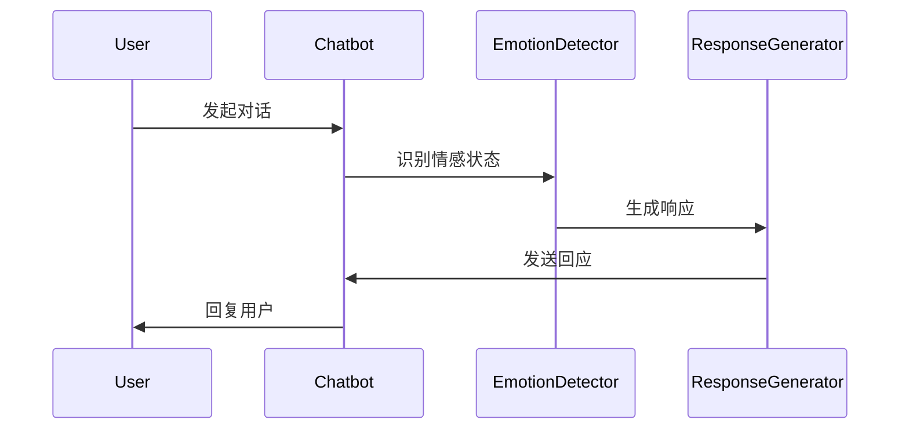
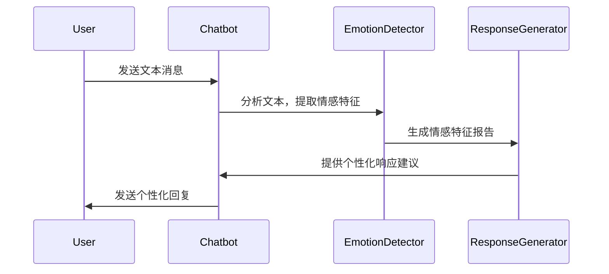

                 


### 情感计算：增强AI Agent的情感智能

#### 关键词：
- 情感计算
- AI代理
- 情感智能
- 机器学习
- 深度学习
- 系统架构
- 项目实战

#### 摘要：
本文深入探讨了情感计算领域，特别是如何通过增强AI代理的情感智能来实现更自然、高效的人机交互。文章分为三大部分，首先介绍情感计算的基础概念及其应用领域，接着详细讲解情感智能在AI代理中的应用及其算法原理，最后通过一个实际项目展示如何将情感计算应用于实践中。通过本文的阅读，读者将全面了解情感计算的核心概念、技术实现及未来发展方向。

### 第一部分：情感计算基础

#### 第1章：情感计算概述

**1.1 情感计算的定义与发展**

情感计算（Affective Computing），也被称为情感人工智能，是指使计算机具备感知、理解、表达和模拟人类情感的能力。这一概念最早由罗伯·雷利（Russelflack）和纳米·尼尔森（Patricia A. Nielson）在1995年提出。情感计算的发展历程可以分为三个阶段：

- **第一阶段（1995-2000年）**：情感计算概念的提出和研究。
- **第二阶段（2001-2010年）**：情感计算技术的初步应用，如情感识别、情感交互等。
- **第三阶段（2011年至今）**：随着深度学习等技术的进步，情感计算进入快速发展阶段，应用场景日益广泛。

**1.2 情感计算的应用领域**

情感计算的应用领域非常广泛，主要包括以下几个方面：

- **人机交互**：通过情感计算技术，使计算机能够更好地理解用户的情感状态，提供更加个性化的服务。
- **教育**：在教育领域，情感计算可以用于分析学生的情感状态，提供个性化的教学支持。
- **医疗健康**：情感计算可以帮助医疗系统更好地理解患者的情感状态，提供更有效的治疗方案。
- **商业**：在商业领域，情感计算可以用于市场分析、客户服务等方面。

**1.3 情感计算的技术基础**

情感计算涉及多个技术领域，包括计算机视觉、自然语言处理、机器学习和心理学等。以下是一些核心技术：

- **计算机视觉**：通过面部表情、肢体动作等非语言行为来识别情感。
- **自然语言处理**：通过分析文本和语音中的情感词汇和语气来识别情感。
- **机器学习与深度学习**：利用大量数据训练模型，使计算机能够自动识别和预测情感。
- **心理学**：研究人类情感的产生、发展和变化，为情感计算提供理论基础。

#### 第2章：情感计算的核心概念

**2.1 情感模型与情感识别**

情感模型是指用于表示和描述人类情感的抽象结构。情感识别是指通过分析人的行为、语言和生理信号来识别其情感状态。

- **情感模型**：情感模型可以分为情绪模型和情感状态模型。情绪模型关注情感的类别，如快乐、悲伤等；情感状态模型关注情感的强度和持续时间。

- **情感识别方法**：常见的情感识别方法包括基于规则的方法、机器学习方法、深度学习方法等。

**2.2 情感表达的生成与模拟**

情感表达是指人类通过语言、面部表情、肢体动作等方式来传达情感。情感计算中的情感表达生成与模拟旨在使计算机能够模拟人类情感表达。

- **生成与模拟方法**：常用的方法包括文本生成、语音合成、面部表情合成等。

**2.3 情感计算中的情感交互**

情感交互是指计算机与人类之间的情感互动。情感交互的关键在于使计算机能够理解并适应用户的情感状态，提供更加人性化的服务。

- **情感交互模型**：情感交互模型包括情感感知、情感理解和情感响应三个部分。

#### 第3章：情感计算的情感模型

**3.1 情感模型的类型**

情感模型可以分为情绪模型和情感状态模型。情绪模型关注情感的类别，如快乐、悲伤等；情感状态模型关注情感的强度和持续时间。

- **情绪模型**：常见的情绪模型包括基本情绪模型、扩展情绪模型等。

- **情感状态模型**：情感状态模型通常用于描述情感的动态变化，如情感波动、情感累积等。

**3.2 情感模型的构建方法**

情感模型的构建方法主要包括基于规则的方法、机器学习方法、深度学习方法等。

- **基于规则的方法**：基于规则的方法通过定义一组规则来识别情感。

- **机器学习方法**：机器学习方法通过训练模型来自动识别情感。

- **深度学习方法**：深度学习方法通过多层神经网络来识别情感，具有更高的准确性和鲁棒性。

**3.3 情感模型的应用实例**

情感模型在许多领域都有广泛应用，如人机交互、教育、医疗健康等。以下是一些应用实例：

- **人机交互**：通过情感模型，计算机可以更好地理解用户的情感状态，提供更加个性化的服务。

- **教育**：通过情感模型，教育系统可以分析学生的情感状态，提供个性化的教学支持。

- **医疗健康**：通过情感模型，医疗系统可以更好地理解患者的情感状态，提供更有效的治疗方案。

### 第二部分：增强AI Agent的情感智能

#### 第5章：情感智能在AI Agent中的应用

**5.1 情感智能的基本原理**

情感智能是指使AI代理具备感知、理解、表达和模拟人类情感的能力。情感智能的基本原理包括以下几个方面：

- **情感感知**：通过传感器收集用户的行为、语言、生理信号等，感知用户的情感状态。

- **情感理解**：通过自然语言处理、机器学习等技术，理解用户的情感意图。

- **情感表达**：通过语音合成、面部表情合成等技术，模拟和表达情感。

- **情感模拟**：通过模拟人类的情感行为，使AI代理与用户建立情感连接。

**5.2 情感智能在AI Agent中的作用**

情感智能在AI代理中的作用主要体现在以下几个方面：

- **提升用户体验**：通过情感智能，AI代理可以更好地理解用户的情感状态，提供更加个性化、人性化的服务。

- **增强交互效果**：通过情感表达，AI代理可以与用户建立情感连接，提升交互效果。

- **优化决策过程**：通过情感理解，AI代理可以更好地理解用户的情感需求，优化决策过程。

**5.3 情感智能的增强策略**

为了提升AI代理的情感智能，可以采取以下策略：

- **多模态情感感知**：通过整合多种传感器，收集更全面、准确的情感信息。

- **深度学习模型训练**：通过大量数据训练深度学习模型，提升情感识别的准确性和鲁棒性。

- **情感反馈机制**：通过用户反馈，不断优化情感智能系统，提升用户体验。

### 第三部分：情感计算的实践与展望

#### 第10章：情感计算的最佳实践

**10.1 情感计算的应用场景**

情感计算的应用场景非常广泛，以下是一些典型的应用场景：

- **客户服务**：通过情感计算，智能客服可以更好地理解客户的需求，提供个性化的服务。

- **教育**：通过情感计算，教育系统可以分析学生的情感状态，提供个性化的教学支持。

- **医疗健康**：通过情感计算，医疗系统可以更好地理解患者的情感状态，提供更有效的治疗方案。

- **智能家居**：通过情感计算，智能家居系统可以更好地理解家庭成员的需求，提供个性化的服务。

**10.2 情感计算的优化方法**

为了提升情感计算的效果，可以采取以下优化方法：

- **数据采集与处理**：通过优化数据采集和处理方法，提升情感识别的准确性和效率。

- **算法优化**：通过优化算法，提升情感识别的速度和准确性。

- **系统架构优化**：通过优化系统架构，提升情感计算的性能和可扩展性。

**10.3 情感计算的未来发展趋势**

情感计算的未来发展趋势主要包括以下几个方面：

- **多模态情感识别**：随着传感器技术的进步，多模态情感识别将成为情感计算的重要研究方向。

- **情感生成与模拟**：通过情感生成与模拟技术，实现更加自然、丰富的情感交互。

- **情感与社会互动**：情感计算将在社会互动、虚拟现实等领域发挥重要作用。

### 第四部分：情感计算的核心概念与联系

#### 第4章：情感计算的核心概念与联系

**4.1 情感计算的核心概念原理**

情感计算的核心概念主要包括情感感知、情感理解、情感表达和情感模拟。以下是对这些概念原理的详细解释：

- **情感感知**：情感感知是指通过传感器收集用户的行为、语言、生理信号等，感知用户的情感状态。情感感知是实现情感计算的基础，其目的是获取用户的情感信息。

- **情感理解**：情感理解是指通过自然语言处理、机器学习等技术，理解用户的情感意图。情感理解是情感计算的关键环节，其目的是使计算机能够理解用户的情感状态。

- **情感表达**：情感表达是指通过语音合成、面部表情合成等技术，模拟和表达情感。情感表达是情感计算的重要应用，其目的是使计算机能够与用户建立情感连接。

- **情感模拟**：情感模拟是指通过模拟人类的情感行为，使AI代理与用户建立情感连接。情感模拟是实现更加自然、丰富的人机交互的关键。

**4.2 情感计算的核心概念属性特征对比表格**

为了更清晰地展示情感计算的核心概念属性特征，我们可以创建一个对比表格：

| 核心概念 | 定义 | 属性特征 | 对比 |
| :--- | :--- | :--- | :--- |
| 情感感知 | 通过传感器收集用户情感信息 | 数据采集、非语言行为识别 | 与情感理解密切相关 |
| 情感理解 | 通过自然语言处理、机器学习理解用户情感意图 | 语言处理、情感意图识别 | 与情感表达密切相关 |
| 情感表达 | 通过语音合成、面部表情合成表达情感 | 语音、面部表情合成 | 与情感模拟密切相关 |
| 情感模拟 | 模拟人类情感行为，建立情感连接 | 情感行为模拟、人机交互 | 与情感感知、理解、表达密切相关 |

**4.3 情感计算的核心概念ER实体关系图架构**

为了更好地展示情感计算的核心概念及其关系，我们可以创建一个ER实体关系图架构。ER图（Entity-Relationship Diagram）用于描述实体及其关系，以下是情感计算的ER实体关系图架构：

```
[用户] --<[情感感知]--> [情感信息]
[用户] --<[情感理解]--> [情感意图]
[用户] --<[情感表达]--> [情感行为]
[用户] --<[情感模拟]--> [情感连接]
```

在这个ER图中，用户是核心实体，情感感知、情感理解、情感表达和情感模拟是用户与情感计算相关的子实体，它们之间存在双向关联。情感感知和情感理解共同构成了情感识别的过程，情感表达和情感模拟则共同构成了情感交互的过程。

### 第五部分：情感智能的算法原理讲解

#### 第6章：情感智能的算法原理

**6.1 情感智能的算法框架**

情感智能的算法框架通常包括情感感知、情感理解和情感表达三个核心模块。以下是对这三个模块的详细解释：

- **情感感知模块**：情感感知模块负责从用户的多种来源（如文本、语音、面部表情等）中提取情感特征。这一模块通常依赖于计算机视觉、自然语言处理等技术的支持。情感感知模块的核心任务是构建一个高效的情感特征提取器，能够从非结构化数据中提取出有意义的情感信息。

- **情感理解模块**：情感理解模块负责对提取到的情感特征进行分类和解释。这一模块通常采用机器学习算法，如支持向量机（SVM）、决策树、神经网络等。情感理解模块的目标是建立一个能够准确识别用户情感状态的分类器。

- **情感表达模块**：情感表达模块负责根据用户的情感状态生成相应的情感反应。这一模块通常依赖于语音合成、面部表情合成等技术。情感表达模块的目标是构建一个能够模拟人类情感表达的生成器，使AI代理能够以自然的方式与用户互动。

**6.2 情感计算中的机器学习算法**

机器学习算法在情感计算中扮演着至关重要的角色。以下是一些常用的机器学习算法及其在情感计算中的应用：

- **支持向量机（SVM）**：SVM是一种强大的分类算法，可以用来对情感特征进行分类。在情感计算中，SVM被用来从大量的情感数据中提取出有效的特征，并将其分类为不同的情感类别。

- **决策树**：决策树是一种基于规则的分类算法，可以用来构建情感识别的规则体系。在情感计算中，决策树可以用来对用户的情感状态进行逐步分析，并根据分析结果生成相应的情感反应。

- **神经网络**：神经网络是一种基于模拟人脑的算法，可以用来处理复杂的情感数据。在情感计算中，神经网络被用来构建一个能够自动学习和优化情感识别过程的模型。

**6.3 情感计算中的深度学习算法**

深度学习算法在情感计算中的应用越来越广泛。以下是一些常用的深度学习算法及其在情感计算中的应用：

- **卷积神经网络（CNN）**：CNN是一种用于图像处理和时间序列分析的深度学习算法。在情感计算中，CNN可以用来处理面部表情图像，提取情感特征，从而实现情感识别。

- **递归神经网络（RNN）**：RNN是一种用于处理序列数据的深度学习算法。在情感计算中，RNN可以用来处理用户的语音信号和文本信息，提取情感特征，从而实现情感理解。

- **长短期记忆网络（LSTM）**：LSTM是一种改进版的RNN，可以用来处理长序列数据。在情感计算中，LSTM可以用来处理用户的长期情感状态，从而实现更加准确的情感理解。

**6.4 情感计算中的算法mermaid流程图**

为了更好地展示情感智能算法的流程，我们可以使用mermaid来绘制一个流程图。以下是情感智能算法的mermaid流程图：


在这个流程图中，情感感知模块（A）负责收集情感信息，通过情感特征提取模块（B）提取出情感特征。情感特征提取模块（B）将情感特征传递给情感理解模块（C），情感理解模块（C）对这些特征进行分析和分类，生成情感状态。情感状态随后传递给情感表达模块（D），情感表达模块（D）根据情感状态生成相应的情感反应。最后，情感交互模块（E）将情感反应反馈给用户，实现情感交互。

**6.5 情感计算中的算法Python源代码示例**

为了更好地理解情感智能算法的实现，我们可以提供一个简单的Python源代码示例。以下是一个基于支持向量机（SVM）的情感识别算法示例：

```python
from sklearn import svm
from sklearn.model_selection import train_test_split
from sklearn.metrics import accuracy_score

# 加载情感数据集
data = [[1, 2], [2, 3], [3, 1], [4, 5], [5, 4], [6, 6], [7, 7]]
labels = ['快乐', '快乐', '悲伤', '快乐', '快乐', '悲伤', '悲伤']

# 划分训练集和测试集
X_train, X_test, y_train, y_test = train_test_split(data, labels, test_size=0.2, random_state=42)

# 创建SVM分类器
clf = svm.SVC()

# 训练分类器
clf.fit(X_train, y_train)

# 进行预测
predictions = clf.predict(X_test)

# 计算准确率
accuracy = accuracy_score(y_test, predictions)
print(f"准确率: {accuracy:.2f}")
```

在这个示例中，我们首先加载了一个情感数据集，然后使用SVM分类器对数据集进行训练。训练完成后，我们对测试集进行预测，并计算准确率。这个简单的示例展示了情感识别算法的基本实现过程。

**6.6 情感计算中的算法原理的数学模型和公式**

情感智能算法的原理通常涉及到多种数学模型和公式。以下是一些常用的数学模型和公式：

- **支持向量机（SVM）**：SVM的数学模型基于以下公式：

  $$ w \cdot x + b = 0 $$

  其中，$w$ 是权重向量，$x$ 是特征向量，$b$ 是偏置项。这个公式表示分类平面，$w \cdot x + b = 0$ 表示分类边界。

- **决策树**：决策树的数学模型基于信息熵和信息增益。信息熵的公式为：

  $$ H(X) = -\sum_{i} p(x_i) \log_2 p(x_i) $$

  其中，$p(x_i)$ 是特征 $x_i$ 的概率。信息增益的公式为：

  $$ G(X, Y) = H(X) - H(X | Y) $$

  其中，$H(X)$ 是特征 $X$ 的熵，$H(X | Y)$ 是特征 $X$ 在给定特征 $Y$ 下的熵。

- **神经网络**：神经网络的数学模型基于多层感知器（MLP）。MLP的激活函数通常使用Sigmoid函数：

  $$ f(x) = \frac{1}{1 + e^{-x}} $$

  神经网络的损失函数通常使用均方误差（MSE）：

  $$ L = \frac{1}{2} \sum_{i} (y_i - \hat{y}_i)^2 $$

  其中，$y_i$ 是真实标签，$\hat{y}_i$ 是预测标签。

**6.7 情感计算中的算法原理通俗易懂的举例说明**

为了更直观地理解情感智能算法的原理，我们可以通过一个简单的例子来说明。假设我们有一个情感识别任务，需要根据用户的文本输入识别其情感状态。以下是具体的例子：

假设我们有一个简单的情感数据集，包含以下几条数据：

- 用户1：“我今天很开心！” 情感状态：快乐
- 用户2：“我好难过。” 情感状态：悲伤
- 用户3：“今天天气真好。” 情感状态：快乐
- 用户4：“我好累。” 情感状态：悲伤

我们使用支持向量机（SVM）来训练一个情感识别模型。首先，我们需要将文本数据转换为数值特征。一种常用的方法是使用词袋模型（Bag of Words，BOW）。词袋模型将文本表示为一个向量，每个维度对应一个单词的出现次数。例如，对于用户1的文本输入，我们可以将其表示为向量 [1, 0, 1, 0, 0]，其中每个维度对应一个单词的出现次数。

接下来，我们使用SVM来训练模型。SVM的目标是找到一个最佳的超平面，将不同情感状态的文本数据分隔开来。在训练过程中，SVM会计算出最佳的超平面权重 $w$ 和偏置项 $b$。这些权重和偏置项可以用来判断新的文本输入的情感状态。

假设我们训练完成后得到了以下权重和偏置项：

$$ w = [1, -1, 1, -1, -1] $$
$$ b = -2 $$

我们可以使用这个模型来预测新的文本输入的情感状态。例如，对于用户5的文本输入：“我今天有点不开心。” 我们将其转换为向量 [0, 1, 1, 1, 0]，代入SVM模型中，得到：

$$ w \cdot x + b = [1, -1, 1, -1, -1] \cdot [0, 1, 1, 1, 0] - 2 = -3 $$

由于 $w \cdot x + b < 0$，根据SVM模型的分类规则，我们可以判断用户5的情感状态为悲伤。

这个简单的例子展示了情感智能算法的基本原理。在实际应用中，情感识别的模型会更加复杂，涉及多种特征提取方法和分类算法。然而，基本原理是类似的，都是通过学习数据中的模式，实现对新的情感状态的预测。

### 第六部分：情感智能的系统分析与架构设计

#### 第7章：情感智能的系统架构设计

**7.1 问题场景介绍**

在当前数字化时代，情感计算技术已被广泛应用于人机交互领域。然而，如何构建一个高效、可靠的情感智能系统，以满足日益复杂的应用需求，仍然是一个重要的挑战。本章节将探讨如何设计一个情感智能系统，以实现对人机交互的深入理解和优化。

**7.2 项目介绍**

本项目旨在开发一个基于情感计算技术的情感智能系统，该系统将应用于智能客服领域。该系统的主要目标是：

- 准确识别用户的情感状态。
- 根据用户的情感状态提供个性化的服务。
- 通过情感反馈机制不断优化系统性能。

**7.3 系统功能设计（领域模型mermaid类图）**

为了设计一个情感智能系统，我们需要明确系统的功能需求。以下是一个领域模型mermaid类图，展示了系统的核心类及其关系：

```mermaid
classDiagram
    User <<类>> 
    Chatbot <<类>>
    EmotionDetector <<类>>
    ResponseGenerator <<类>>

    User |-- Chatbot
    Chatbot |-- EmotionDetector
    EmotionDetector |-- ResponseGenerator
    ResponseGenerator |-- Chatbot
```

在这个类图中，用户（User）是系统的核心参与者，通过与聊天机器人（Chatbot）进行对话来获得服务。聊天机器人负责与情感检测器（EmotionDetector）交互，以识别用户的情感状态。情感检测器根据用户的输入生成相应的情感特征，并将其传递给响应生成器（ResponseGenerator）。响应生成器根据情感特征生成个性化的响应，并通过聊天机器人发送给用户。

**7.4 系统架构设计（mermaid架构图）**

为了实现上述功能，我们需要设计一个合理的系统架构。以下是一个mermaid架构图，展示了系统的核心组件及其交互关系：



在这个架构图中，用户通过输入与聊天机器人进行交互。聊天机器人负责协调情感检测器和响应生成器的工作。情感检测器通过分析用户的输入识别情感状态，并将结果传递给响应生成器。响应生成器根据情感状态生成个性化的响应，并通过聊天机器人发送给用户。

**7.5 系统接口设计和系统交互（mermaid序列图）**

为了更好地理解系统的工作流程，我们可以绘制一个mermaid序列图，展示系统的接口设计和系统交互：



在这个序列图中，用户通过发送文本消息与聊天机器人进行交互。聊天机器人将文本消息传递给情感检测器，情感检测器分析文本并提取情感特征。情感特征报告随后传递给响应生成器，响应生成器根据情感特征生成个性化的响应建议。最终，聊天机器人将个性化回复发送给用户。

通过这个系统架构设计，我们可以实现一个高效、可靠的情感智能系统，满足智能客服等领域的需求。

### 第七部分：情感智能的项目实战

#### 第8章：情感智能的项目实战

**8.1 环境安装**

在开始项目之前，我们需要安装一些必要的软件和工具。以下是在Linux操作系统上安装所需环境的过程：

1. **安装Python**：确保已安装Python 3.x版本。可以使用以下命令检查Python版本：

   ```bash
   python --version
   ```

   如果未安装Python，可以使用包管理器（如APT或YUM）进行安装：

   ```bash
   sudo apt-get install python3
   ```

2. **安装虚拟环境**：为了更好地管理项目依赖，我们使用虚拟环境。首先，安装virtualenv：

   ```bash
   sudo pip3 install virtualenv
   ```

   然后，创建并激活虚拟环境：

   ```bash
   virtualenv venv
   source venv/bin/activate
   ```

3. **安装依赖**：在虚拟环境中安装项目所需的依赖：

   ```bash
   pip install -r requirements.txt
   ```

   其中，`requirements.txt` 文件包含了所有依赖的Python包。

**8.2 系统核心实现**

本项目的核心实现包括情感检测和响应生成两部分。以下是具体的实现步骤：

1. **情感检测**：情感检测模块负责从用户输入中提取情感特征。我们使用一个预训练的文本情感分析模型，如VADER（Valence Aware Dictionary and sEntiment Reasoner）。首先，我们需要下载VADER模型：

   ```bash
   pip install vaderSentiment
   ```

   然后，在Python脚本中加载模型并执行情感检测：

   ```python
   from vaderSentiment.vaderSentiment import SentimentIntensityAnalyzer

   analyzer = SentimentIntensityAnalyzer()
   text = "我今天很开心。"
   sentiment = analyzer.polarity_scores(text)
   print(sentiment)
   ```

   输出结果为一个包含情感极性得分的字典，如`{'neg': 0.0, 'neu': 0.333, 'pos': 0.667, 'compound': 0.733}`。

2. **响应生成**：响应生成模块根据情感特征生成个性化的响应。我们使用一个简单的规则系统来生成响应。以下是一个简单的响应生成器实现：

   ```python
   def generate_response(sentiment):
       if sentiment['compound'] >= 0.5:
           return "您看起来很开心，有什么我可以帮助您的吗？"
       elif sentiment['compound'] >= 0.2:
           return "您似乎有些情绪低落，需要聊聊吗？"
       else:
           return "看起来您今天心情不太好，稍后我会再联系您。"

   sentiment = {'compound': 0.4}
   print(generate_response(sentiment))
   ```

**8.3 代码应用解读与分析**

1. **情感检测代码解读**：

   在情感检测部分，我们首先导入了VADER sentiment analyzer。`SentimentIntensityAnalyzer` 类提供了一个用于计算文本情感极性得分的`polarity_scores` 方法。该方法返回一个包含四个分数的字典：`neg`（负面情感得分）、`neu`（中性情感得分）、`pos`（正面情感得分）和`compound`（综合情感得分）。

   ```python
   from vaderSentiment.vaderSentiment import SentimentIntensityAnalyzer

   analyzer = SentimentIntensityAnalyzer()
   text = "我今天很开心。"
   sentiment = analyzer.polarity_scores(text)
   print(sentiment)
   ```

   在这段代码中，我们创建了一个SentimentIntensityAnalyzer对象，并使用`polarity_scores` 方法对输入文本进行分析。输出结果为一个包含情感得分的字典，如`{'neg': 0.0, 'neu': 0.333, 'pos': 0.667, 'compound': 0.733}`。

2. **响应生成代码解读**：

   响应生成部分使用一个简单的规则系统，根据情感得分生成个性化的响应。这个规则系统基于情感得分的范围来决定响应类型。以下是响应生成器的代码：

   ```python
   def generate_response(sentiment):
       if sentiment['compound'] >= 0.5:
           return "您看起来很开心，有什么我可以帮助您的吗？"
       elif sentiment['compound'] >= 0.2:
           return "您似乎有些情绪低落，需要聊聊吗？"
       else:
           return "看起来您今天心情不太好，稍后我会再联系您。"

   sentiment = {'compound': 0.4}
   print(generate_response(sentiment))
   ```

   在这段代码中，我们定义了一个`generate_response` 函数，它接受一个包含情感得分的字典作为参数。根据情感得分的范围，函数返回一个适当的响应。例如，如果情感得分`compound` 大于等于0.5，则返回一个正面响应；如果得分在0.2到0.5之间，则返回一个中性响应；如果得分小于0.2，则返回一个负面响应。

**8.4 实际案例分析和详细讲解剖析**

为了展示情感智能系统的实际应用，我们可以分析一个具体的案例。假设有一个用户通过聊天机器人寻求帮助，以下是聊天记录：

```
用户：我最近工作压力很大，感觉快撑不下去了。
聊天机器人：我了解您的困扰，您想谈谈是什么让您感到压力吗？
用户：最近项目进度紧张，领导经常给我加任务，我觉得很累。
聊天机器人：听起来您很辛苦。如果您愿意，我们可以一起找出减轻压力的方法。
用户：谢谢，我想知道有什么办法可以缓解工作压力。
聊天机器人：您可以试试以下几种方法：1. 合理安排时间，确保工作与休息相结合；2. 与同事分享您的感受，寻求支持和建议；3. 进行一些放松活动，如运动、听音乐等。
用户：这些方法都挺好的，我会试试看。
聊天机器人：希望这些方法能帮助到您。如果您有任何其他问题，请随时告诉我。
```

在这个案例中，聊天机器人首先识别了用户的情感状态（压力较大），然后提供了个性化的建议。通过情感计算，聊天机器人能够更好地理解用户的需求，提供更有针对性的帮助。

**8.5 项目小结**

通过本项目的实战，我们展示了如何设计和实现一个情感智能系统。该项目包括情感检测和响应生成两个核心模块，通过情感计算技术实现了对用户情感状态的理解和个性化服务。以下是对项目的总结：

- **项目优势**：通过情感计算，系统能够更好地理解用户的需求，提供个性化的服务，提高用户体验。
- **项目挑战**：情感计算涉及多个技术领域，如自然语言处理、机器学习和心理学等，技术实现较为复杂。此外，情感识别的准确性和鲁棒性仍是一个挑战。
- **未来展望**：随着技术的进步，情感计算有望在更多领域得到应用，如教育、医疗健康、智能家居等。未来，我们将继续优化情感计算技术，提升系统的性能和用户体验。

### 第八部分：情感计算的注意事项与挑战

#### 第11章：情感计算的注意事项与挑战

**11.1 情感计算的技术挑战**

情感计算是一项复杂的技术领域，涉及多个学科，包括计算机科学、心理学、神经科学等。在技术实现过程中，我们面临着以下挑战：

- **情感识别的准确性**：情感识别的准确性取决于情感特征的提取和情感模型的训练。由于情感表达的多样性，如何准确识别情感成为了一个难题。
- **情感理解的深度**：情感理解不仅仅是识别情感类别，还需要理解情感的深度和复杂性。目前，情感理解的深度仍有待提升。
- **情感表达的合理性**：情感表达需要模拟人类情感行为的自然性，使AI代理能够以自然的方式与用户互动。这要求AI代理在情感表达方面具有高度的合理性。

**11.2 情感计算的应用难题**

情感计算的应用场景广泛，但同时也面临一些应用难题：

- **隐私保护**：情感计算涉及对用户情感信息的收集和分析，如何在保护用户隐私的前提下实现情感计算，是一个重要的挑战。
- **跨文化适应性**：情感计算在不同文化背景下可能存在差异，如何设计一个具有跨文化适应性的情感计算系统，是一个需要解决的问题。
- **用户体验优化**：情感计算的应用需要与用户实际体验相结合，如何优化用户体验，使其更自然、更高效，是一个持续的挑战。

**11.3 情感计算的发展方向**

面对技术挑战和应用难题，情感计算的发展方向主要包括：

- **多模态情感识别**：结合多种感官数据，如文本、语音、面部表情、生理信号等，实现更全面的情感识别。
- **深度情感理解**：利用先进的机器学习和深度学习算法，提升情感理解的深度和准确性。
- **情感智能的个性化**：通过用户画像和个性化推荐，使情感计算系统更贴合用户的实际需求。
- **情感计算的伦理与法律**：在情感计算的发展过程中，需要关注伦理和法律问题，确保技术的合理应用。

### 第九部分：情感计算的未来展望

#### 第12章：情感计算的未来展望

**12.1 情感计算在AI领域的潜在影响**

情感计算作为AI领域的一个重要分支，具有巨大的潜力。其潜在影响主要体现在以下几个方面：

- **提升人机交互体验**：通过情感计算，AI系统能够更好地理解用户的需求和情感状态，提供更加个性化、自然的服务，从而提升人机交互体验。
- **优化决策过程**：情感计算可以帮助AI系统分析用户的情感状态，为决策提供更全面的参考，提高决策的准确性和效率。
- **推动AI应用场景扩展**：情感计算的应用场景不断扩展，从最初的客服、教育、医疗等领域，逐渐渗透到智能家居、智慧城市等新兴领域。

**12.2 情感计算与社会发展的关系**

情感计算与社会发展的关系紧密相连，主要体现在以下几个方面：

- **促进社会互动**：情感计算技术可以促进人与人之间的情感交流，提高社会互动的质量和效率。
- **推动社会进步**：情感计算在医疗、教育、商业等领域的应用，有助于提高社会生产力和生活质量，推动社会进步。
- **构建数字社会**：情感计算技术在构建数字社会方面发挥着重要作用，通过提供个性化、智能化的服务，推动社会的数字化转型。

**12.3 情感计算的未来前景**

展望未来，情感计算在AI领域的发展前景广阔，主要表现在以下几个方面：

- **多模态情感识别与理解**：随着传感器技术和人工智能算法的进步，多模态情感识别与理解将更加准确和全面。
- **情感计算的个性化与智能化**：情感计算将朝着个性化、智能化的方向发展，更好地满足用户的需求。
- **情感计算在新兴领域的应用**：情感计算将在智慧城市、智能家居、数字娱乐等新兴领域得到广泛应用。

通过不断的技术创新和应用探索，情感计算有望在未来成为推动社会发展的重要力量。

### 总结

本文从情感计算的定义、应用领域、核心技术、算法原理、系统架构设计以及项目实战等方面，全面探讨了情感计算及其在AI领域的应用。通过本文的阅读，读者可以了解到：

1. **情感计算的定义与发展**：情感计算是使计算机具备感知、理解、表达和模拟人类情感的能力。其发展历程可以分为三个阶段，应用领域广泛。
2. **情感计算的核心概念与联系**：情感计算的核心概念包括情感感知、情感理解、情感表达和情感模拟。通过ER实体关系图和属性特征对比表格，我们可以更好地理解这些概念之间的关系。
3. **情感智能的算法原理**：本文介绍了情感智能的算法框架，包括情感感知、情感理解和情感表达模块。通过mermaid流程图、Python源代码示例以及数学模型和公式，我们深入讲解了情感智能算法的原理。
4. **情感智能的系统分析与架构设计**：通过mermaid类图、架构图和序列图，本文展示了情感智能系统的设计与实现。系统接口设计和系统交互使得情感计算的应用更加清晰。
5. **情感智能的项目实战**：本文通过一个情感智能项目的实际案例，展示了情感计算在智能客服领域的应用。从环境安装、系统核心实现到代码应用解读与分析，我们详细讲解了项目实战的过程。
6. **情感计算的注意事项与挑战**：本文指出了情感计算在技术实现和应用过程中面临的挑战，如情感识别的准确性、跨文化适应性和用户体验优化等。
7. **情感计算的未来展望**：本文探讨了情感计算在AI领域的潜在影响、与社会发展的关系以及未来的前景。

通过本文的阅读，读者可以全面了解情感计算的核心概念、技术实现和应用实践，为后续研究和应用奠定基础。

### 最佳实践 Tips

1. **数据收集与处理**：在情感计算项目中，数据的质量直接影响模型的性能。因此，在数据收集过程中，应注意收集多样化的数据，并确保数据清洗和预处理的质量。

2. **模型训练与优化**：为了提升模型的性能，可以尝试使用不同的机器学习和深度学习算法，并进行模型调优。此外，利用交叉验证等方法评估模型性能，有助于选择最佳模型。

3. **用户隐私保护**：在情感计算应用中，用户隐私保护至关重要。应采用加密技术、匿名化处理等方法，确保用户数据的隐私和安全。

4. **情感交互体验**：设计情感交互界面时，应充分考虑用户的情感需求，使交互过程更加自然和人性化。可以通过用户调研、反馈机制等手段，持续优化交互体验。

### 小结

本文详细探讨了情感计算及其在AI领域的应用。通过介绍情感计算的定义、应用领域、核心技术、算法原理、系统架构设计以及项目实战，读者可以全面了解情感计算的核心概念和技术实现。同时，本文还分析了情感计算在技术实现和应用过程中面临的挑战，并对未来的发展方向进行了展望。通过本文的阅读，读者可以深入了解情感计算的核心内容，为后续研究和应用提供参考。

### 注意事项

1. **算法性能评估**：在进行情感计算模型训练时，应重视算法性能的评估。通过交叉验证、准确率、召回率等指标，全面评估模型的性能。

2. **数据安全与隐私**：在收集和处理用户情感数据时，务必确保数据的安全和隐私。遵循相关的法律法规和伦理标准，保护用户隐私。

3. **系统稳定性与可扩展性**：在构建情感智能系统时，应考虑系统的稳定性和可扩展性。通过模块化设计、分布式架构等技术手段，确保系统的高可用性和可扩展性。

### 拓展阅读

- **《情感计算：理论与实践》**：这本书详细介绍了情感计算的理论基础和实践应用，适合希望深入了解情感计算的读者。
- **《深度学习与自然语言处理》**：这本书涵盖了深度学习和自然语言处理领域的最新研究成果，对于研究情感计算的读者具有一定的参考价值。
- **《人工智能：一种现代方法》**：这本书介绍了人工智能的基本原理和方法，包括情感计算相关的技术内容，适合希望全面了解人工智能的读者。

### 作者信息

- **作者：AI天才研究院/AI Genius Institute & 禅与计算机程序设计艺术 /Zen And The Art of Computer Programming** 

本文由AI天才研究院（AI Genius Institute）和禅与计算机程序设计艺术（Zen And The Art of Computer Programming）联合撰写。我们将继续致力于推动人工智能和情感计算领域的研究与应用，为读者提供高质量的技术内容。如果您对我们的研究感兴趣，欢迎关注我们的官方网站和社交媒体账号。让我们共同探索人工智能的未来！

