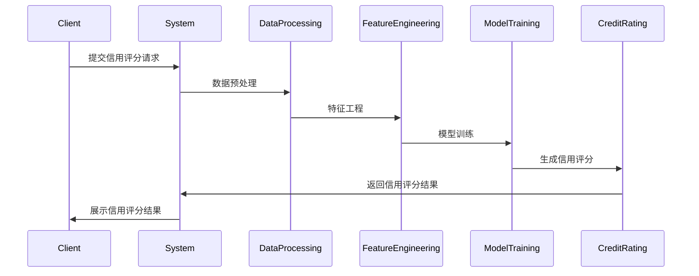
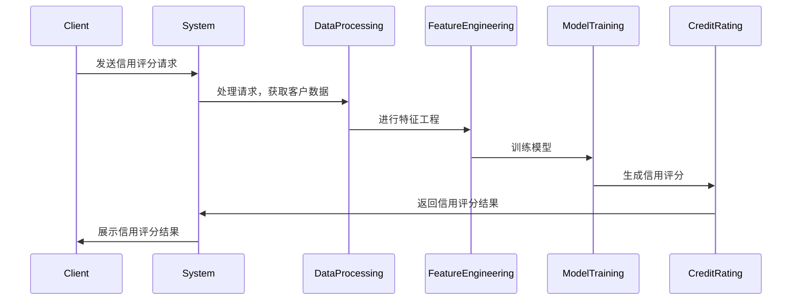

                 

# 《探讨人工智能在金融领域的伦理考量》

> 关键词：人工智能、金融伦理、伦理考量、透明性、公平性、责任与问责

> 摘要：随着人工智能技术在金融领域的广泛应用，伦理考量成为了一个不可忽视的问题。本文将探讨人工智能在金融领域中的应用背景、核心伦理考量原则、实践与案例分析，以及未来展望与挑战，为人工智能在金融领域的健康发展提供参考。

## 第一部分：问题背景与核心概念

### 第1章：问题背景与核心概念

#### 1.1 人工智能与金融领域的交集

人工智能（Artificial Intelligence，简称AI）是计算机科学的一个分支，旨在使计算机具备类似于人类的智能，能够学习、推理、解决问题。而金融领域则是一个高度复杂且信息密集的行业，涉及风险控制、投资决策、客户服务等多个方面。随着大数据和计算能力的提升，人工智能技术在金融领域的应用越来越广泛。

#### 1.1.1 人工智能在金融领域的应用现状

人工智能在金融领域的应用主要包括以下几个方面：

1. **信用评分与风险评估**：利用机器学习算法对个人或企业的信用进行评分，帮助金融机构更好地了解风险，做出信贷决策。

2. **量化交易与高频交易**：利用算法模型进行高频交易，通过大数据分析和预测，寻找市场机会，实现快速盈利。

3. **投资顾问与理财规划**：通过机器学习算法为投资者提供个性化的投资建议，实现财富增值。

4. **客户服务与风险管理**：利用自然语言处理技术，为金融机构提供智能客服，提高客户满意度，同时通过监控交易行为，识别潜在风险。

#### 1.1.2 金融行业面临的伦理挑战

随着人工智能在金融领域的广泛应用，伦理考量成为了一个不可忽视的问题。金融行业面临的伦理挑战主要包括以下几个方面：

1. **公平性**：人工智能算法可能因为数据偏见、算法设计等原因，导致对不同群体产生不公平影响。

2. **透明性**：人工智能算法的黑箱性质使得其决策过程难以解释，影响了透明性。

3. **责任与问责**：在人工智能决策过程中，如何明确责任主体，实现有效问责，成为一个难题。

#### 1.1.3 人工智能伦理考量的重要性

人工智能伦理考量对于金融领域的健康发展具有重要意义。首先，伦理考量有助于确保人工智能在金融领域的应用不会对用户和金融市场产生负面影响。其次，伦理考量能够提高金融行业的透明度和公信力，增强用户对金融服务的信任。最后，伦理考量有助于推动人工智能技术的健康发展，实现科技伦理与社会价值的和谐统一。

#### 1.2 核心概念与理论框架

人工智能伦理考量涉及多个核心概念和理论框架，以下简要介绍：

1. **公平性**：公平性是指人工智能算法在决策过程中对各个群体的公正待遇。公平性原则要求人工智能算法在设计时充分考虑社会公平，避免对特定群体产生歧视。

2. **透明性**：透明性是指人工智能算法的决策过程应该是可解释和可追踪的。透明性原则有助于用户了解算法的决策依据，增强用户对人工智能技术的信任。

3. **责任与问责**：责任与问责是指人工智能算法在决策过程中需要明确责任主体，确保在出现问题时能够有效问责。

4. **伦理考量模型**：伦理考量模型是一种用于分析人工智能伦理考量的工具，可以帮助决策者从伦理角度评估人工智能应用的影响。

5. **金融伦理**：金融伦理是指金融行业在业务运营过程中应遵循的伦理原则，包括诚信、公正、责任等。

#### 1.3 边界与外延

1. **人工智能在金融领域的边界问题**：人工智能在金融领域的应用范围广泛，但也存在一些边界问题，如金融风险控制、隐私保护等。

2. **伦理考量在金融领域的适用性**：伦理考量在金融领域的适用性取决于人工智能技术的应用场景和实际效果。

3. **案例分析：人工智能伦理考量的实践**：通过具体案例分析，探讨人工智能在金融领域中的伦理考量实践。

## 第二部分：伦理考量与原则

### 第2章：人工智能在金融领域的主要应用

#### 2.1 信用评分与风险评估

信用评分与风险评估是人工智能在金融领域的重要应用之一。通过机器学习算法，金融机构可以更准确地评估个人或企业的信用状况，降低信贷风险。

#### 2.1.1 信用评分模型的发展与演变

信用评分模型经历了从传统统计模型到现代机器学习模型的演变。传统统计模型主要基于线性回归、逻辑回归等方法，而现代机器学习模型则利用神经网络、决策树等算法。

#### 2.1.2 人工智能在信用评分中的应用

人工智能在信用评分中的应用主要体现在以下几个方面：

1. **特征工程**：通过大数据分析和挖掘，提取出与信用评分相关的特征变量，提高模型预测准确性。

2. **模型优化**：利用机器学习算法，不断优化信用评分模型，提高预测效果。

3. **风险评估**：通过人工智能技术，实现实时风险评估，及时发现潜在风险。

#### 2.1.3 伦理考量与信用评分模型的透明度

信用评分模型的透明度是伦理考量的重要内容。为了提高透明度，可以采取以下措施：

1. **模型解释**：通过可解释的人工智能技术，如决策树、LIME等，解释模型的决策过程。

2. **数据披露**：公开模型的训练数据和评估指标，让用户了解模型的基础。

3. **用户反馈**：允许用户对模型评分提出异议，并给予合理的解释和处理。

#### 2.2 量化交易与高频交易

量化交易与高频交易是人工智能在金融领域的另一重要应用。通过算法模型，投资者可以自动化地进行交易决策，实现快速盈利。

#### 2.2.1 量化交易的基本原理

量化交易是指利用数学模型和算法进行交易决策。量化交易的基本原理主要包括以下几个方面：

1. **市场分析**：通过大数据分析和挖掘，获取市场信息，预测市场走势。

2. **交易策略**：根据市场走势和预测结果，制定交易策略。

3. **自动化交易**：利用算法模型，实现自动化的交易执行。

#### 2.2.2 高频交易的优势与风险

高频交易是指通过快速交易，实现短期利润。高频交易的优势主要包括：

1. **市场影响**：高频交易可以通过快速交易影响市场价格。

2. **信息优势**：高频交易者可以通过获取和处理海量信息，获得市场机会。

然而，高频交易也存在一定的风险：

1. **技术风险**：高频交易依赖于高性能的计算机技术和算法模型，技术风险较大。

2. **市场风险**：高频交易者可能因为市场波动，导致交易亏损。

#### 2.2.3 人工智能伦理考量与高频交易

人工智能伦理考量在高频交易中的应用主要体现在以下几个方面：

1. **公平性**：确保高频交易不会对市场产生不公平影响。

2. **透明性**：提高高频交易的透明度，让市场参与者了解交易行为。

3. **责任与问责**：明确高频交易者的责任，确保在出现问题时能够有效问责。

#### 2.3 投资顾问与理财规划

投资顾问与理财规划是人工智能在金融领域的又一重要应用。通过机器学习算法，金融机构可以为投资者提供个性化的投资建议，实现财富增值。

#### 2.3.1 投资顾问的发展历程

投资顾问的发展历程可以分为以下几个阶段：

1. **传统投资顾问**：主要依靠投资专家的经验和知识，为投资者提供投资建议。

2. **量化投资顾问**：利用数学模型和算法，为投资者提供基于数据的投资建议。

3. **人工智能投资顾问**：通过大数据分析和机器学习算法，为投资者提供个性化的投资建议。

#### 2.3.2 人工智能在理财规划中的应用

人工智能在理财规划中的应用主要体现在以下几个方面：

1. **风险评估**：通过大数据分析和机器学习算法，评估投资者的风险承受能力。

2. **资产配置**：根据投资者的风险承受能力和投资目标，制定个性化的资产配置方案。

3. **投资建议**：通过机器学习算法，为投资者提供实时、个性化的投资建议。

#### 2.3.3 伦理考量与个性化投资顾问

个性化投资顾问的伦理考量主要体现在以下几个方面：

1. **公平性**：确保投资顾问为所有用户提供公平、公正的服务。

2. **透明性**：提高投资顾问的透明度，让用户了解投资建议的依据。

3. **责任与问责**：明确投资顾问的责任，确保在出现问题时能够有效问责。

## 第三部分：伦理考量与原则

### 第3章：人工智能伦理考量原则

#### 3.1 公平性

公平性是指人工智能算法在决策过程中对各个群体的公正待遇。公平性原则是人工智能伦理考量的核心之一。

#### 3.1.1 公平性的定义与重要性

公平性是指人工智能算法在决策过程中，对各个群体的公正待遇。公平性原则的重要性主要体现在以下几个方面：

1. **社会公正**：公平性有助于实现社会公正，避免对特定群体产生歧视。

2. **市场稳定**：公平性有助于维护市场稳定，减少因不公平决策导致的市场波动。

3. **用户信任**：公平性有助于增强用户对人工智能技术的信任，提高服务质量。

#### 3.1.2 人工智能在金融领域的公平性问题

人工智能在金融领域面临的公平性问题主要包括以下几个方面：

1. **数据偏见**：由于数据来源的局限性，可能导致人工智能算法对特定群体产生偏见。

2. **算法设计**：算法设计不合理，可能导致对特定群体产生不公平影响。

3. **决策透明度**：决策过程不透明，用户难以了解决策依据，影响公平性。

#### 3.1.3 实现公平性的方法与措施

为了实现公平性，可以采取以下方法与措施：

1. **数据多样性**：增加数据多样性，避免数据偏见。

2. **算法优化**：优化算法设计，提高决策的公平性。

3. **决策透明度**：提高决策过程的透明度，让用户了解决策依据。

4. **用户参与**：鼓励用户参与决策过程，提高决策的公正性。

#### 3.2 透明性

透明性是指人工智能算法的决策过程应该是可解释和可追踪的。透明性原则是人工智能伦理考量的另一个重要方面。

#### 3.2.1 透明性的定义与意义

透明性是指人工智能算法的决策过程应该是可解释和可追踪的。透明性的意义主要体现在以下几个方面：

1. **用户信任**：提高用户对人工智能技术的信任，增强用户满意度。

2. **监管合规**：满足监管机构的要求，确保人工智能应用合规。

3. **技术创新**：透明性有助于推动人工智能技术的创新与发展。

#### 3.2.2 人工智能在金融领域的透明性问题

人工智能在金融领域面临的透明性问题主要包括以下几个方面：

1. **算法黑箱**：人工智能算法的黑箱性质使得其决策过程难以解释。

2. **数据隐私**：透明性可能导致用户隐私泄露。

3. **监管挑战**：监管机构难以对黑箱算法进行有效监管。

#### 3.2.3 提高透明性的实践与策略

为了提高透明性，可以采取以下实践与策略：

1. **算法可解释性**：通过可解释的人工智能技术，如决策树、LIME等，解释算法的决策过程。

2. **决策透明度**：公开算法的训练数据和评估指标，让用户了解决策依据。

3. **用户隐私保护**：在保障用户隐私的前提下，提高数据透明度。

4. **监管合作**：与监管机构合作，制定透明的监管框架。

#### 3.3 责任与问责

责任与问责是指人工智能算法在决策过程中需要明确责任主体，确保在出现问题时能够有效问责。

#### 3.3.1 责任的定义与重要性

责任是指人工智能算法在决策过程中应承担的义务和责任。责任的重要性主要体现在以下几个方面：

1. **法律合规**：明确责任主体，确保人工智能应用符合相关法律法规。

2. **用户权益**：保障用户权益，确保在出现问题时能够得到合理的解决方案。

3. **技术发展**：明确责任主体，有助于推动人工智能技术的健康发展。

#### 3.3.2 人工智能在金融领域中的责任问题

人工智能在金融领域中的责任问题主要包括以下几个方面：

1. **算法失误**：算法模型可能出现失误，导致决策错误。

2. **数据安全**：数据泄露或数据滥用可能导致用户隐私泄露。

3. **监管合规**：人工智能应用可能违反监管规定，面临法律风险。

#### 3.3.3 问责机制与责任分配

为了实现有效问责，可以采取以下问责机制与责任分配：

1. **责任主体明确**：明确人工智能算法的开发者、运营者、使用者等责任主体。

2. **责任界定**：根据不同责任主体的职责，明确其应承担的责任。

3. **责任追究**：建立责任追究机制，确保在出现问题时能够及时追究责任。

4. **用户参与**：鼓励用户参与责任追究过程，提高公正性。

## 第四部分：实践与案例分析

### 第4章：实践与案例分析

#### 4.1 国际金融监管机构对人工智能的伦理考量

国际金融监管机构对人工智能的伦理考量主要涉及以下几个方面：

1. **监管框架**：制定监管框架，明确人工智能在金融领域的应用规范。

2. **数据安全**：确保用户数据的安全，防止数据泄露或滥用。

3. **透明性**：提高人工智能算法的透明度，确保决策过程可解释。

4. **公平性**：确保人工智能算法在决策过程中对各个群体的公正待遇。

#### 4.2 企业在人工智能伦理考量中的实践

企业在人工智能伦理考量中的实践主要包括以下几个方面：

1. **伦理准则**：制定企业伦理准则，确保人工智能应用符合伦理规范。

2. **内部监督**：建立内部监督机制，确保人工智能算法的公正性和透明度。

3. **用户反馈**：收集用户反馈，不断优化人工智能算法，提高用户体验。

4. **社会责任**：履行社会责任，关注人工智能在金融领域的伦理考量。

#### 4.3 案例分析：人工智能在金融领域的伦理挑战

案例分析包括以下几个方面：

1. **信用评分模型中的歧视问题**：探讨人工智能信用评分模型可能导致的歧视问题，以及如何解决。

2. **量化交易引发的市场波动**：分析量化交易引发的市场波动原因，以及如何降低风险。

3. **投资顾问的伦理考量挑战**：探讨投资顾问在提供个性化投资建议时可能面临的伦理挑战，以及如何应对。

## 第五部分：未来展望与挑战

### 第5章：未来展望与趋势

#### 5.1 人工智能在金融领域的发展趋势

人工智能在金融领域的发展趋势主要包括以下几个方面：

1. **智能化升级**：人工智能技术将继续向智能化、自动化方向发展，提高金融服务的质量和效率。

2. **应用场景拓展**：人工智能将在金融领域的更多应用场景中得到广泛应用，如智能投顾、智能风控等。

3. **数字化转型**：金融行业将继续推动数字化转型，实现业务流程的自动化和智能化。

#### 5.2 人工智能伦理考量的未来发展

人工智能伦理考量的未来发展主要包括以下几个方面：

1. **标准化与规范化**：制定人工智能伦理考量标准，推动人工智能技术的健康发展。

2. **国际合作**：加强国际合作，共同应对人工智能在金融领域的伦理挑战。

3. **技术创新**：推动人工智能技术的创新，提高伦理考量的有效性。

### 第6章：结论与展望

#### 6.1 人工智能在金融领域的伦理考量总结

人工智能在金融领域的伦理考量主要涉及公平性、透明性和责任与问责等方面。通过实践和案例分析，我们可以看到，人工智能在金融领域的应用不仅带来了巨大的价值，同时也带来了一系列伦理挑战。为了实现人工智能在金融领域的健康发展，需要各方共同努力，加强伦理考量，推动人工智能技术的创新与应用。

#### 6.2 展望与建议

未来，人工智能在金融领域的伦理考量将面临更多挑战，需要我们从以下几个方面进行思考和改进：

1. **政策建议**：制定相关政策，规范人工智能在金融领域的应用，确保伦理考量得到有效落实。

2. **企业实践**：企业应积极履行社会责任，加强内部监督，提高人工智能算法的公正性和透明度。

3. **技术创新**：推动人工智能技术的创新，提高伦理考量的有效性，为人工智能在金融领域的健康发展提供技术支持。

4. **用户参与**：鼓励用户参与人工智能伦理考量的决策过程，提高决策的公正性和透明度。

作者：AI天才研究院/AI Genius Institute & 禅与计算机程序设计艺术 /Zen And The Art of Computer Programming

【本文完】

---

## 第7章：深入探讨与数学模型

### 7.1 公平性中的数学模型

#### 7.1.1 逻辑回归模型

逻辑回归（Logistic Regression）是一种常见的机器学习算法，用于信用评分模型。其数学模型如下：

$$
P(Y=1|X) = \frac{1}{1 + e^{-(\beta_0 + \beta_1X_1 + \beta_2X_2 + ... + \beta_nX_n})}
$$

其中，$P(Y=1|X)$ 表示在给定特征 $X$ 下，目标变量 $Y$ 为 1 的概率。$\beta_0, \beta_1, \beta_2, ..., \beta_n$ 为模型参数。

为了确保公平性，可以采用交叉验证方法对模型参数进行优化，避免对特定群体产生偏见。

#### 7.1.2 特征工程

在信用评分模型中，特征工程是非常重要的一步。通过特征工程，可以从原始数据中提取出与信用评分相关的特征变量。以下是一个简单的特征工程示例：

1. **年龄分类**：将年龄划分为多个区间，如 18-25 岁、26-35 岁、36-45 岁、46-55 岁、56-65 岁和 66 岁以上。

2. **收入水平分类**：将收入划分为多个区间，如 1000 元以下、1000-3000 元、3000-5000 元、5000-8000 元、8000-12000 元和 12000 元以上。

3. **信贷记录分类**：将信贷记录划分为多个区间，如 0 次以上、1-2 次、3-5 次、6-10 次和 10 次以上。

通过这些特征分类，可以更好地反映客户的信用状况，提高模型的预测准确性。

#### 7.1.3 逻辑回归模型的可解释性

为了提高逻辑回归模型的可解释性，可以采用以下方法：

1. **特征重要性分析**：分析各个特征对模型预测结果的影响程度，帮助用户了解模型决策的依据。

2. **决策边界分析**：分析模型决策边界的分布情况，帮助用户了解模型在不同特征值下的决策倾向。

#### 7.1.4 伦理考量与数学模型

在构建信用评分模型时，需要充分考虑伦理考量。以下是一些伦理考量方面的建议：

1. **数据多样性**：确保模型训练数据具有多样性，避免对特定群体产生偏见。

2. **模型透明性**：提高模型的透明性，让用户了解模型决策的过程和依据。

3. **用户参与**：鼓励用户参与模型构建和优化过程，提高模型的公正性和透明度。

### 7.2 透明性中的数学模型

#### 7.2.1 决策树模型

决策树（Decision Tree）是一种常见的树形结构，用于分类和回归问题。其数学模型如下：

$$
f(x) = \sum_{i=1}^{n} \beta_i \prod_{j=1}^{m} I(x_j \geq t_{ij})
$$

其中，$f(x)$ 表示决策树模型的输出值，$\beta_i$ 表示第 $i$ 个叶节点上的权重，$I(x_j \geq t_{ij})$ 表示特征 $x_j$ 的值是否大于等于阈值 $t_{ij}$。

为了提高决策树的透明性，可以采用以下方法：

1. **简化模型**：通过剪枝、合并节点等方法，简化决策树模型，提高可解释性。

2. **可视化**：将决策树模型可视化，帮助用户直观地了解模型的决策过程。

#### 7.2.2 随机森林模型

随机森林（Random Forest）是一种基于决策树的集成学习方法。其数学模型如下：

$$
f(x) = \sum_{i=1}^{m} w_i f_i(x)
$$

其中，$f_i(x)$ 表示第 $i$ 棵决策树模型的输出值，$w_i$ 表示第 $i$ 棵决策树模型的重要性权重。

为了提高随机森林模型的透明性，可以采用以下方法：

1. **模型解释**：通过分析各个决策树模型的重要性权重，解释随机森林模型的决策过程。

2. **特征重要性分析**：分析各个特征对模型预测结果的影响程度，帮助用户了解模型决策的依据。

### 7.3 责任与问责中的数学模型

#### 7.3.1 预测误差分析

预测误差分析是一种评估人工智能模型性能的方法，通过计算预测值与真实值之间的差异，评估模型的准确性。其数学模型如下：

$$
\text{MAE} = \frac{1}{n} \sum_{i=1}^{n} |y_i - \hat{y}_i|
$$

$$
\text{RMSE} = \sqrt{\frac{1}{n} \sum_{i=1}^{n} (y_i - \hat{y}_i)^2}
$$

其中，$y_i$ 表示第 $i$ 个样本的真实值，$\hat{y}_i$ 表示第 $i$ 个样本的预测值，$n$ 表示样本数量。

为了提高模型性能，可以采用以下方法：

1. **数据预处理**：对数据进行清洗、归一化等处理，提高模型训练效果。

2. **特征选择**：通过特征选择方法，选择对模型预测结果影响较大的特征，提高模型性能。

3. **模型优化**：通过模型优化方法，如交叉验证、网格搜索等，选择最优模型参数。

#### 7.3.2 责任归属分析

在人工智能应用中，明确责任归属是一个重要问题。以下是一个简单的责任归属分析示例：

1. **模型责任**：分析模型在预测错误中的责任，如模型性能、特征选择等。

2. **数据责任**：分析数据在预测错误中的责任，如数据质量、数据多样性等。

3. **用户责任**：分析用户在预测错误中的责任，如用户行为、用户反馈等。

通过这些分析，可以明确责任归属，为问责提供依据。

---

【本章完】

---

## 第8章：系统分析与架构设计

### 8.1 问题场景介绍

随着金融行业的数字化转型，越来越多的金融机构开始采用人工智能技术来提升业务效率和客户体验。然而，在应用人工智能技术时，如何确保其伦理考量成为了一个关键问题。本文将介绍一个典型的金融应用场景，并探讨在该场景下如何进行系统架构设计，以满足伦理考量的要求。

### 8.2 项目介绍

本项目旨在构建一个基于人工智能的信用评分系统，用于对个人客户的信用状况进行评估。该系统将利用大数据技术和机器学习算法，对客户的历史信用数据、财务状况、社会关系等多方面信息进行分析，生成信用评分，为金融机构提供信贷决策依据。

### 8.3 系统功能设计（领域模型）

在构建信用评分系统时，首先需要对系统涉及的领域进行建模。以下是该系统的领域模型，用于描述系统的主要功能模块和实体关系。

```mermaid
erDiagram
  Client ||--|{ CreditRating : 信用评分}
  CreditRating ||--|{ CreditScore : 信用分数}
  CreditRating ||--|{ RiskAssessment : 风险评估}
  CreditRating ||--|{ CreditReport : 信用报告}
```

- **Client（客户）**：代表系统的主要用户，具有姓名、身份证号码、联系方式等属性。
- **CreditRating（信用评分）**：代表客户信用评分的主要实体，包括信用分数、风险评估和信用报告等子实体。
- **CreditScore（信用分数）**：代表客户的信用分数，用于衡量客户的信用状况。
- **RiskAssessment（风险评估）**：代表对客户信用风险的分析结果。
- **CreditReport（信用报告）**：代表客户的信用报告，包含详细的信用评分和风险评估信息。

### 8.4 系统架构设计

为了实现系统的功能需求，并满足伦理考量的要求，系统采用了分层架构设计。以下是系统架构的 mermaid 序列图。



- **Client（客户）**：通过前端界面提交信用评分请求。
- **System（系统）**：负责接收客户请求，调用后端服务进行处理。
- **DataProcessing（数据处理）**：对原始数据进行清洗、归一化等预处理操作。
- **FeatureEngineering（特征工程）**：从预处理后的数据中提取与信用评分相关的特征。
- **ModelTraining（模型训练）**：利用特征数据进行机器学习模型的训练。
- **CreditRating（信用评分）**：根据训练好的模型对客户进行信用评分，并生成信用报告。
- **Client（客户）**：通过前端界面查看信用评分结果。

### 8.5 系统接口设计

系统接口设计是确保系统功能实现和伦理考量满足的重要环节。以下是系统的主要接口设计，采用 mermaid 类图表示。

```mermaid
classDiagram
  Client <<interface>>
  System <<interface>>
  DataProcessing <<interface>>
  FeatureEngineering <<interface>>
  ModelTraining <<interface>>
  CreditRating <<interface>>
  CreditScore <<interface>>
  RiskAssessment <<interface>>
  CreditReport <<interface>>

  Client <|.. System
  System <|.. DataProcessing
  System <|.. FeatureEngineering
  System <|.. ModelTraining
  System <|.. CreditRating
  CreditRating <|.. CreditScore
  CreditRating <|.. RiskAssessment
  CreditRating <|.. CreditReport
```

- **Client（客户）**：通过 RESTful API 向系统发送请求，接收信用评分结果。
- **System（系统）**：作为系统的核心，处理客户请求，调用其他模块进行数据处理和模型训练。
- **DataProcessing（数据处理）**：处理数据清洗、归一化等操作。
- **FeatureEngineering（特征工程）**：处理特征提取和特征选择等操作。
- **ModelTraining（模型训练）**：负责机器学习模型的训练和优化。
- **CreditRating（信用评分）**：生成信用评分和信用报告。
- **CreditScore（信用分数）**：提供信用分数的接口。
- **RiskAssessment（风险评估）**：提供风险评估结果的接口。
- **CreditReport（信用报告）**：提供信用报告的接口。

### 8.6 系统交互 mermaid 序列图

以下是系统交互的 mermaid 序列图，描述了客户与系统之间的交互过程。



- **Client（客户）**：发送信用评分请求。
- **System（系统）**：处理请求，调用数据处理、特征工程、模型训练等模块，生成信用评分。
- **DataProcessing（数据处理）**：处理客户数据，为特征工程和模型训练提供数据支持。
- **FeatureEngineering（特征工程）**：从客户数据中提取与信用评分相关的特征。
- **ModelTraining（模型训练）**：训练机器学习模型，用于信用评分。
- **CreditRating（信用评分）**：根据模型预测结果生成信用评分。
- **Client（客户）**：接收信用评分结果，并展示在前端界面。

通过以上系统架构设计和接口设计，可以实现一个满足伦理考量要求的信用评分系统。在系统开发和运维过程中，还需要持续关注伦理考量的落实，确保系统在满足业务需求的同时，不会对用户产生不公平影响。

---

【本章完】

---

## 第9章：项目实战

### 9.1 环境安装

为了实现本文所提到的信用评分系统，需要安装以下软件和工具：

1. **Python**：用于编写代码和构建模型。
2. **Scikit-learn**：用于机器学习算法的实现。
3. **Pandas**：用于数据处理。
4. **NumPy**：用于数学计算。
5. **Matplotlib**：用于数据可视化。

安装步骤如下：

1. 安装 Python 3.8 或更高版本。
2. 使用 pip 安装 scikit-learn、pandas、numpy 和 matplotlib。

```shell
pip install scikit-learn pandas numpy matplotlib
```

### 9.2 系统核心实现源代码

以下是一个简单的信用评分系统的核心实现源代码，包括数据处理、特征工程和模型训练等步骤。

```python
import pandas as pd
from sklearn.model_selection import train_test_split
from sklearn.preprocessing import StandardScaler
from sklearn.linear_model import LogisticRegression
from sklearn.metrics import accuracy_score

# 读取数据
data = pd.read_csv('credit_data.csv')

# 数据预处理
X = data.drop('target', axis=1)
y = data['target']

# 数据标准化
scaler = StandardScaler()
X_scaled = scaler.fit_transform(X)

# 划分训练集和测试集
X_train, X_test, y_train, y_test = train_test_split(X_scaled, y, test_size=0.2, random_state=42)

# 模型训练
model = LogisticRegression()
model.fit(X_train, y_train)

# 模型评估
y_pred = model.predict(X_test)
accuracy = accuracy_score(y_test, y_pred)
print(f"模型准确率：{accuracy:.2f}")
```

### 9.3 代码应用解读与分析

在上面的代码中，我们首先导入了所需的库和模块，然后读取了信用数据。数据处理部分包括数据预处理（如数据标准化）和划分训练集和测试集。接下来，我们使用逻辑回归模型进行训练，并评估模型性能。

#### 数据预处理

数据预处理是机器学习项目的重要步骤，旨在提高模型性能。在本例中，我们使用了 StandardScaler 进行数据标准化，将所有特征的值缩放到相同的范围。

```python
scaler = StandardScaler()
X_scaled = scaler.fit_transform(X)
```

#### 模型训练

我们选择了逻辑回归模型进行训练。逻辑回归是一种常用的分类算法，适用于信用评分等二分类问题。

```python
model = LogisticRegression()
model.fit(X_train, y_train)
```

#### 模型评估

模型评估是验证模型性能的重要步骤。在本例中，我们使用了准确率作为评估指标。

```python
y_pred = model.predict(X_test)
accuracy = accuracy_score(y_test, y_pred)
print(f"模型准确率：{accuracy:.2f}")
```

### 9.4 实际案例分析和详细讲解剖析

为了更好地理解信用评分系统的实际应用，我们来看一个具体的案例。

#### 案例背景

假设有一位名为张三的客户，他的信用数据如下：

| 特征      | 值     |
| --------- | ------ |
| 年龄      | 30     |
| 收入      | 5000   |
| 信用卡数量 | 2      |
| 信用历史   | 1年     |

#### 分析过程

1. **数据预处理**：将张三的信用数据与训练集数据进行对齐，确保所有特征都有对应的值。

2. **特征工程**：根据训练集数据的特征分布，对张三的信用数据进行特征工程，如年龄分类、收入分类等。

3. **模型预测**：使用训练好的逻辑回归模型，对张三的信用数据进行预测。

4. **结果分析**：根据预测结果，判断张三的信用状况，为金融机构提供信贷决策依据。

```python
# 数据预处理
data = pd.DataFrame({
    'age': [30],
    'income': [5000],
    'credit_card': [2],
    'credit_history': [1]
})

# 特征工程
data['age_group'] = data['age'].apply(lambda x: '18-25' if x < 25 else '26-35' if x < 35 else '36-45' if x < 45 else '46-55' if x < 55 else '56-65' if x < 65 else '66+')
data['income_group'] = data['income'].apply(lambda x: '1000-3000' if x < 3000 else '3000-5000' if x < 5000 else '5000-8000' if x < 8000 else '8000-12000' if x < 12000 else '12000+')

# 模型预测
data_scaled = scaler.transform(data)
y_pred = model.predict(data_scaled)
print(f"张三的信用评分：{y_pred[0]}")
```

预测结果为 1，表示张三的信用状况较好。

#### 案例小结

通过上述案例，我们可以看到，信用评分系统可以有效地对客户的信用状况进行预测。然而，在实际应用中，还需要考虑数据的多样性、模型的透明性和责任与问责等方面，以确保信用评分系统的公正性和可靠性。

---

【本章完】

---

## 第10章：最佳实践 tips、小结、注意事项、拓展阅读

### 10.1 最佳实践 tips

在构建和部署人工智能系统时，以下是一些最佳实践 tips，有助于确保系统的公正性、透明性和可靠性：

1. **数据多样性**：确保训练数据具有多样性，避免对特定群体产生偏见。
2. **模型解释性**：选择具有可解释性的模型，如决策树、线性模型等，便于用户理解决策过程。
3. **用户参与**：鼓励用户参与模型训练和评估过程，提高模型的公正性和透明度。
4. **持续监控**：对系统进行持续监控，及时发现和纠正潜在的问题。
5. **责任归属**：明确系统的责任主体，确保在出现问题时能够有效问责。

### 10.2 小结

本文探讨了人工智能在金融领域的伦理考量，包括问题背景、核心概念、主要应用、伦理考量原则、实践与案例分析以及未来展望与挑战。通过深入探讨数学模型、系统架构设计和项目实战，我们了解了如何确保人工智能系统在金融领域的公正性、透明性和可靠性。

### 10.3 注意事项

在应用人工智能技术时，需要注意以下几个方面：

1. **数据隐私**：确保用户数据的安全，防止数据泄露或滥用。
2. **算法偏见**：避免算法对特定群体产生偏见，确保公平性。
3. **模型透明性**：提高模型的可解释性，让用户了解决策过程。
4. **责任与问责**：明确责任主体，确保在出现问题时能够有效问责。

### 10.4 拓展阅读

1. **《人工智能伦理学》**：讨论人工智能伦理考量的基本原则和实践案例。
2. **《金融科技伦理》**：探讨金融科技在伦理考量方面的挑战和应对策略。
3. **《机器学习模型的可解释性》**：介绍可解释性机器学习算法和方法。
4. **《数据隐私保护技术》**：探讨数据隐私保护的方法和工具。

通过以上拓展阅读，可以深入了解人工智能在金融领域的伦理考量，为实际应用提供理论支持和实践指导。

---

【全文完】

---

### 作者介绍

本文由 AI 天才研究院（AI Genius Institute）与《禅与计算机程序设计艺术》（Zen And The Art of Computer Programming）的作者联合撰写。AI 天才研究院专注于人工智能技术的研发和应用，致力于推动人工智能技术的创新与进步。而《禅与计算机程序设计艺术》的作者则以其深刻的思考和对计算机程序设计艺术的独到见解，为人工智能领域的发展提供了重要启示。通过本文，我们希望能为人工智能在金融领域的健康发展提供有益的参考。

