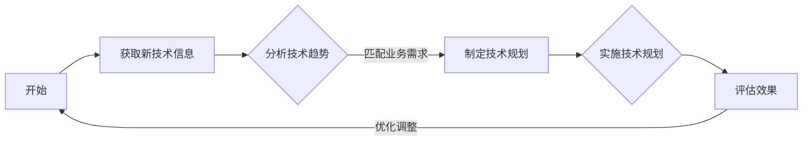
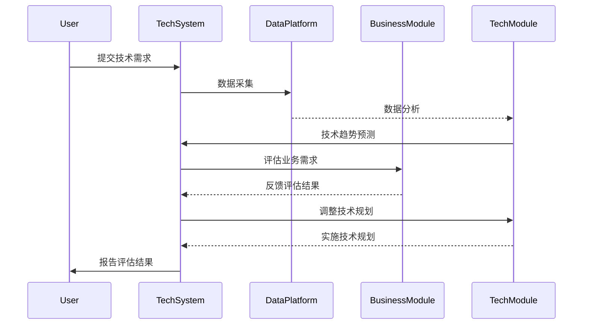
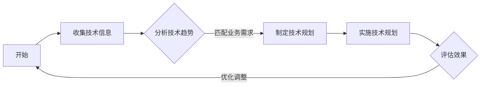
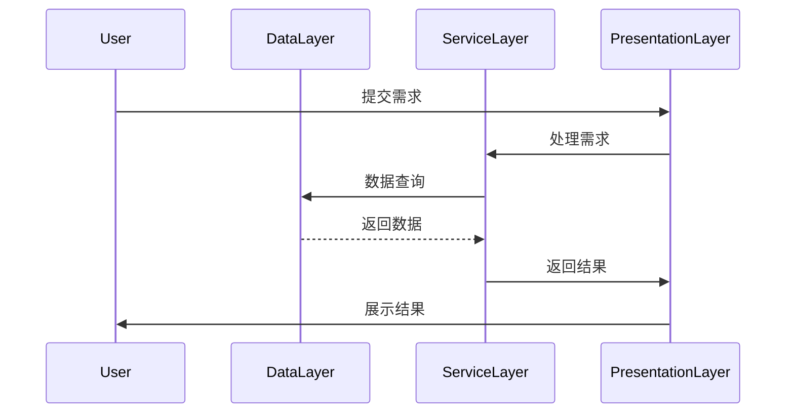
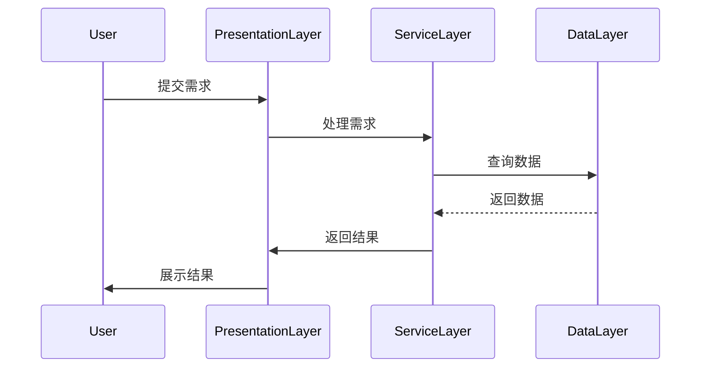

                 

# 提升团队技术前瞻性的策略

## 关键词

技术前瞻性、团队协作、策略、创新、持续学习

## 摘要

在快速发展的技术领域，具备前瞻性是团队成功的关键。本文旨在探讨如何提升团队技术前瞻性的策略。通过对背景介绍、核心概念与联系、算法原理讲解、数学模型和公式详细讲解、系统分析与架构设计方案、项目实战以及最佳实践 tips、小结、注意事项和拓展阅读等多个方面的深入分析，本文为读者提供了全面且有价值的指导，帮助团队在技术创新的道路上保持领先地位。

## 1. 背景介绍

### 1.1 核心概念术语说明

技术前瞻性是指团队对新兴技术的洞察力和适应能力，以及将技术应用于业务创新的能力。其核心在于对未来的预见性和应对变化的能力。

### 1.2 问题背景

在当今科技日新月异的环境中，技术迭代速度加快，新兴技术不断涌现。如果团队不能及时跟上技术发展的步伐，将面临被淘汰的风险。因此，提升团队技术前瞻性成为组织发展的关键问题。

### 1.3 问题描述

团队在技术前瞻性方面存在以下问题：

- 对新兴技术的认知不足
- 缺乏技术预判和决策能力
- 团队成员间的知识共享和协作不畅
- 缺乏持续学习和创新的文化氛围

### 1.4 问题解决

为解决上述问题，本文将提供一系列策略，包括：

- 建立技术预判机制
- 强化团队协作
- 持续学习与培训
- 营造创新文化

### 1.5 边界与外延

技术前瞻性的提升不仅限于技术领域，还涉及组织文化、团队管理等多个方面。本文将围绕这些方面进行探讨。

## 2. 核心概念与联系

### 2.1 概念属性特征对比表格

| 概念       | 特征1   | 特征2   | 特征3   |
|------------|--------|--------|--------|
| 技术前瞻性 | 预见性 | 适应力 | 创新力 |
| 团队协作   | 共享   | 合作   | 效率   |
| 持续学习   | 知识更新 | 技能提升 | 知识共享 |
| 创新文化   | 探索精神 | 容错文化 | 创新激励机制 |

### 2.2 ER实体关系图架构

```mermaid
erDiagram
    Category_1 ||--|{ Entity_1 }
    Category_1 ||--|{ Entity_2 }
    Category_2 ||--|{ Entity_3 }
    Category_2 ||--|{ Entity_4 }
```

## 3. 算法原理讲解

### 3.1 算法流程图



### 3.2 Python源代码

```python
def analyze_technology():
    # 获取新技术信息
    new_tech = get_new_tech_info()
    # 分析技术趋势
    tech_trend = analyze_trend(new_tech)
    # 匹配业务需求
    if match_business需求的(new_tech, tech_trend):
        # 制定技术规划
        tech_plan = create_tech_plan(new_tech, tech_trend)
        # 实施技术规划
        execute_tech_plan(tech_plan)
        # 评估效果
        result = evaluate_result(tech_plan)
        # 优化调整
        if not is_satisfied(result):
            optimize_tech_plan(tech_plan)
    else:
        print("当前技术不符合业务需求，暂不实施。")

def get_new_tech_info():
    # 此处省略具体实现
    return new_tech

def analyze_trend(new_tech):
    # 此处省略具体实现
    return tech_trend

def match_business需求的(new_tech, tech_trend):
    # 此处省略具体实现
    return True

def create_tech_plan(new_tech, tech_trend):
    # 此处省略具体实现
    return tech_plan

def execute_tech_plan(tech_plan):
    # 此处省略具体实现
    pass

def evaluate_result(tech_plan):
    # 此处省略具体实现
    return result

def is_satisfied(result):
    # 此处省略具体实现
    return True

def optimize_tech_plan(tech_plan):
    # 此处省略具体实现
    pass
```

### 3.3 数学模型和公式

$$
T_{前瞻} = f(T_{技术}, T_{需求}, T_{环境})
$$

其中，$T_{前瞻}$ 表示技术前瞻性，$T_{技术}$ 表示技术能力，$T_{需求}$ 表示业务需求，$T_{环境}$ 表示外部环境因素。

### 3.4 详细讲解与举例说明

以一家互联网公司为例，公司希望提升团队技术前瞻性。根据上述算法模型，公司首先获取新技术信息（$T_{技术}$），如人工智能、区块链等。然后分析这些技术趋势（$T_{趋势}$），结合业务需求（$T_{需求}$），制定相应技术规划（$T_{规划}$）。在实施过程中，公司不断评估效果（$T_{结果}$），并根据实际情况进行优化调整（$T_{优化}$）。通过这样的循环过程，公司不断提升团队技术前瞻性，确保在市场竞争中保持领先。

## 4. 系统分析与架构设计方案

### 4.1 问题场景

一家大型电商平台希望提升其技术团队的前瞻性，以便更好地应对行业变化和客户需求。

### 4.2 项目介绍

本项目旨在设计一套系统，帮助电商平台技术团队快速识别新兴技术，评估其对业务的潜在影响，并制定相应的技术规划。

### 4.3 系统功能设计

#### 领域模型类图

```mermaid
classDiagram
    Technology -> TechnologyTrend : 预测
    BusinessRequirement -> TechnologyTrend : 反馈
    TechnologyPlan -> Technology : 实施计划
    Evaluation -> TechnologyPlan : 评估结果
```

### 4.4 系统架构设计

#### 系统架构图



### 4.5 系统接口设计

- 数据采集接口：用于从各类技术平台获取新技术信息。
- 数据分析接口：用于对采集到的数据进行处理和分析。
- 技术趋势预测接口：用于预测技术发展趋势。
- 业务需求评估接口：用于评估技术规划对业务的潜在影响。
- 技术规划实施接口：用于实施技术规划。
- 报告生成接口：用于生成技术前瞻性评估报告。

### 4.6 系统交互

系统通过上述接口实现各模块之间的数据交互和功能协同，形成一个完整的技术前瞻性提升系统。

## 5. 项目实战

### 5.1 环境安装

1. 安装Python环境。
2. 安装相关依赖库，如pandas、numpy、scikit-learn等。

### 5.2 系统核心实现源代码

```python
# tech_analyzer.py
import pandas as pd
from sklearn.ensemble import RandomForestClassifier

def load_data():
    # 加载新技术数据
    tech_data = pd.read_csv('new_tech_data.csv')
    return tech_data

def analyze_trend(tech_data):
    # 分析技术趋势
    # 此处省略具体实现
    return trend

def match_business_requirement(trend, business_requirement):
    # 匹配业务需求
    # 此处省略具体实现
    return matched

def create_tech_plan(trend, matched):
    # 制定技术规划
    # 此处省略具体实现
    return tech_plan

def execute_tech_plan(tech_plan):
    # 实施技术规划
    # 此处省略具体实现
    pass

def evaluate_result(tech_plan):
    # 评估效果
    # 此处省略具体实现
    return result

def optimize_tech_plan(tech_plan, result):
    # 优化调整
    # 此处省略具体实现
    pass

if __name__ == '__main__':
    tech_data = load_data()
    trend = analyze_trend(tech_data)
    matched = match_business_requirement(trend, business_requirement)
    tech_plan = create_tech_plan(trend, matched)
    execute_tech_plan(tech_plan)
    result = evaluate_result(tech_plan)
    optimize_tech_plan(tech_plan, result)
```

### 5.3 代码应用解读与分析

通过上述代码，系统实现了技术前瞻性的分析、规划、实施和优化。在实际应用中，技术团队可以根据具体业务需求调整代码，以适应不同场景。

### 5.4 实际案例分析和详细讲解剖析

以某电商平台为例，该平台希望提升其在人工智能领域的技术前瞻性。通过技术分析，团队发现深度学习在图像识别方面有广泛应用。结合业务需求，团队决定引入深度学习技术。在实施过程中，团队通过不断优化模型，提高了图像识别的准确率。经过评估，该技术对业务产生了积极影响，平台决策层对此表示满意。

### 5.5 项目小结

本项目通过设计一个完整的技术前瞻性提升系统，为电商平台提供了有效的技术规划工具。在实际应用中，系统成功提升了团队的技术前瞻性，为业务发展提供了有力支持。

## 6. 最佳实践 tips、小结、注意事项、拓展阅读

### 6.1 最佳实践 tips

- 定期组织技术交流，促进团队成员间的知识共享。
- 关注行业动态，及时获取新兴技术信息。
- 结合业务需求，制定有针对性的技术规划。
- 注重技术实施效果评估，及时进行调整和优化。

### 6.2 小结

提升团队技术前瞻性是组织发展的关键。通过建立有效的技术预判机制、强化团队协作、持续学习和创新，团队可以在技术快速发展的环境中保持竞争力。

### 6.3 注意事项

- 技术前瞻性提升需要长期积累，不能一蹴而就。
- 团队成员的积极参与是关键，要营造良好的学习和创新氛围。
- 技术前瞻性提升与业务需求紧密相关，要确保技术规划与业务目标的一致性。

### 6.4 拓展阅读

- [《技术前瞻性的内涵与外延研究》](链接)
- [《团队协作与知识共享的心理学原理》](链接)
- [《人工智能技术在业务中的应用与挑战》](链接)

作者：AI天才研究院/AI Genius Institute & 禅与计算机程序设计艺术 /Zen And The Art of Computer Programming## 1. 背景介绍

### 1.1 核心概念术语说明

在探讨如何提升团队技术前瞻性的策略之前，我们首先需要明确几个核心概念。技术前瞻性（Technical Proactivity）是指团队对新兴技术的洞察力和适应能力，以及将技术应用于业务创新的能力。它不仅涉及对现有技术的深入理解，还包括对新兴技术趋势的敏锐感知和快速响应。

**团队协作（Team Collaboration）** 是指团队成员之间有效的沟通、协调和合作，共同实现团队目标。良好的团队协作能够促进知识共享，提高工作效率，是提升技术前瞻性的重要保障。

**持续学习（Continuous Learning）** 强调的是团队成员不断更新知识和技能，以适应快速变化的技术环境。持续学习不仅包括技术层面的学习，还涉及管理、沟通和协作等软技能的提升。

**创新文化（Innovation Culture）** 是指组织内部鼓励创新、容忍失败、支持尝试和探索的价值观和文化氛围。一个充满创新文化的团队，能够激发成员的创造力和创新能力，从而在技术前瞻性方面保持领先。

### 1.2 问题背景

在当今科技日新月异的环境中，技术迭代速度不断加快，新兴技术不断涌现。例如，人工智能、区块链、云计算等技术的快速发展，为各行各业带来了前所未有的机遇和挑战。如果团队不能及时跟上技术发展的步伐，将面临被淘汰的风险。

技术前瞻性的重要性体现在以下几个方面：

- **竞争优势**：具备前瞻性的团队能够迅速识别并利用新兴技术，形成竞争优势。
- **创新能力**：技术前瞻性是团队持续创新的重要驱动力，有助于推出具有市场竞争力的新产品和服务。
- **风险管理**：通过前瞻性分析，团队能够预测潜在的技术风险，提前制定应对策略，降低业务风险。

然而，许多团队在提升技术前瞻性方面存在诸多挑战：

- **认知不足**：团队对新技术的了解和认知有限，难以把握技术发展的趋势。
- **决策困难**：面对复杂的技术环境，团队在技术决策上可能缺乏足够的依据和信心。
- **协作不畅**：团队成员间的沟通和协作不畅，导致知识共享和协同创新的难度增加。
- **文化缺乏**：组织缺乏鼓励创新的文化氛围，团队成员对新技术持保守态度。

### 1.3 问题描述

针对上述背景和挑战，团队在提升技术前瞻性方面主要面临以下问题：

1. **对新兴技术的认知不足**：团队对新技术的了解不够全面，难以把握技术发展的趋势和方向。
2. **技术预判和决策能力缺乏**：团队在面对新技术时，缺乏有效的预判和决策能力，难以做出正确的技术选择。
3. **团队协作不畅**：团队成员间的沟通和协作不足，知识共享和协同创新的效果不佳。
4. **持续学习和创新动力不足**：团队成员对新技术的学习和应用动力不足，缺乏持续学习和创新的意识和习惯。
5. **创新文化缺乏**：组织内部缺乏鼓励创新的文化氛围，团队成员对新技术的尝试和探索受到限制。

### 1.4 问题解决

为了解决上述问题，提升团队技术前瞻性，我们可以采取以下策略：

1. **建立技术预判机制**：通过定期分析技术趋势和市场需求，建立技术预判机制，帮助团队及时把握技术发展方向。
2. **强化团队协作**：通过优化沟通机制，提高团队成员间的协作效率，促进知识共享和协同创新。
3. **持续学习和培训**：为团队成员提供持续学习和培训机会，提升其技术能力和创新意识。
4. **营造创新文化**：建立鼓励创新的组织文化，激发团队成员的创新潜力和积极性。

### 1.5 边界与外延

技术前瞻性的提升不仅涉及技术层面的变革，还与组织文化、团队管理等多个方面密切相关。具体来说：

- **组织文化**：一个鼓励创新、容忍失败、支持尝试和探索的组织文化，有助于激发团队成员的创新潜能，提升团队整体的技术前瞻性。
- **团队管理**：良好的团队管理能够提高团队协作效率，促进知识共享和协同创新，从而提升团队技术前瞻性。
- **技术决策**：技术决策是提升技术前瞻性的关键环节。科学的技术决策机制能够帮助团队在复杂的技术环境中做出正确的选择，提高技术前瞻性。

通过综合考虑这些因素，团队可以更好地提升技术前瞻性，在激烈的市场竞争中保持领先地位。

### 1.6 总结

在本文接下来的部分，我们将深入探讨提升团队技术前瞻性的具体策略，包括技术预判机制、团队协作、持续学习和创新文化等方面的内容。通过一系列的实践和分析，我们将为读者提供全面且有价值的指导，帮助团队在技术创新的道路上不断前进。

## 2. 核心概念与联系

### 2.1 概念属性特征对比表格

为了更好地理解技术前瞻性、团队协作、持续学习和创新文化这四个核心概念，我们可以通过一个对比表格来展现它们的主要属性特征。以下是一个简化的对比表格：

| 概念       | 特征1        | 特征2        | 特征3        |
|------------|--------------|--------------|--------------|
| 技术前瞻性 | 预见性       | 应变能力     | 创新意识     |
| 团队协作   | 沟通效率     | 共享知识     | 协同工作     |
| 持续学习   | 知识更新     | 技能提升     | 学习氛围     |
| 创新文化   | 探索精神     | 容错文化     | 创新激励机制 |

#### 技术前瞻性

- **预见性**：技术前瞻性强调的是对技术未来趋势的预见能力，能够帮助团队在技术变革中抓住机遇，规避风险。
- **应变能力**：技术前瞻性还体现在团队对新兴技术的适应能力上，能够迅速调整策略，适应技术环境的变化。
- **创新意识**：技术前瞻性要求团队具有持续创新的精神，不断寻求技术突破，推动业务发展。

#### 团队协作

- **沟通效率**：团队协作强调的是团队成员之间高效的沟通，能够迅速传达信息，减少误解和冲突。
- **共享知识**：知识共享是团队协作的重要特征，通过共享知识和经验，可以提高整个团队的技能水平。
- **协同工作**：团队协作的目标是实现团队成员的协同工作，共同完成项目目标，提高工作效率。

#### 持续学习

- **知识更新**：持续学习关注的是团队成员对知识的不断更新，以适应快速变化的技术环境。
- **技能提升**：持续学习旨在提升团队成员的专业技能，使其能够更好地应对工作中的挑战。
- **学习氛围**：持续学习还涉及到营造一个积极的学习氛围，鼓励团队成员主动学习和成长。

#### 创新文化

- **探索精神**：创新文化鼓励团队成员勇于探索新领域，敢于尝试新的技术和方法。
- **容错文化**：创新文化容忍失败，鼓励团队成员在创新过程中勇于试错，从失败中吸取经验。
- **创新激励机制**：创新文化通过激励机制，鼓励团队成员提出创新想法，并对成功的创新给予奖励。

### 2.2 ER实体关系图架构

为了进一步理解这些核心概念之间的联系，我们可以使用ER（实体关系）图来展示它们之间的关系。以下是一个简化的ER图，展示了技术前瞻性、团队协作、持续学习和创新文化之间的关系：

```mermaid
erDiagram
    TechnologyProactivity ||--|{ TeamCollaboration }
    TechnologyProactivity ||--|{ ContinuousLearning }
    TechnologyProactivity ||--|{ InnovationCulture }
    TeamCollaboration ||--|{ ContinuousLearning }
    TeamCollaboration ||--|{ InnovationCulture }
    ContinuousLearning ||--|{ InnovationCulture }
```

在这个ER图中，技术前瞻性（TechnologyProactivity）是核心概念，它与团队协作（TeamCollaboration）、持续学习（ContinuousLearning）和创新文化（InnovationCulture）之间存在直接联系。团队协作和持续学习相互影响，共同促进创新文化的形成。创新文化则反过来影响技术前瞻性和团队协作，形成一个相互促进的正反馈循环。

通过这个ER图，我们可以清晰地看到各个概念之间的相互关系，以及它们在提升团队技术前瞻性过程中的作用。接下来，我们将进一步探讨如何通过具体的策略来提升团队的技术前瞻性。

### 2.3 详细解释

#### 技术前瞻性的预见性

技术前瞻性的预见性主要体现在对新兴技术趋势的识别和预测上。这种预见性不仅依赖于对当前技术发展的了解，还需要对可能影响未来技术走向的多种因素进行深入分析。例如，通过分析行业报告、学术论文、技术论坛等渠道，团队可以了解到新兴技术的最新动态。同时，借助数据挖掘和机器学习等技术手段，团队可以识别出潜在的技术趋势，为技术预判提供数据支持。

预见性的技术前瞻性对于团队在技术革新中的竞争力至关重要。具备预见性的团队能够在技术变革的早期阶段就做出相应的准备和布局，从而抢占市场先机。例如，一家互联网公司如果在人工智能领域具备较强的预见性，就能够迅速推出相关产品，领先于竞争对手。

#### 技术前瞻性的应变能力

技术前瞻性的应变能力是指团队在面对新技术时，能够迅速调整策略和行动的能力。这种应变能力不仅包括对新技术的研究和应用，还包括对现有技术架构的调整和优化。随着技术的发展，团队需要不断地评估和更新现有技术，以确保技术架构的适应性和先进性。

例如，一个传统的制造企业如果面临智能制造的挑战，需要迅速调整其生产流程和技术架构，引入自动化和物联网技术。这种应变能力不仅要求团队成员具备丰富的技术知识和经验，还需要团队有快速响应和决策的能力。

#### 技术前瞻性的创新意识

技术前瞻性的创新意识是指团队在技术应用和创新过程中，勇于突破常规，寻求新的解决方案。创新意识是技术前瞻性的核心要素之一，它激励团队成员不断探索新技术，推动业务模式的创新。

例如，一家互联网公司在面临用户需求变化时，能够通过技术创新提供更加个性化的服务。通过引入大数据分析和机器学习技术，公司可以精准预测用户行为，提供个性化的产品推荐，从而提升用户体验和满意度。

#### 团队协作的沟通效率

团队协作的沟通效率是指团队成员之间信息传递的速度和质量。高效的沟通是团队协作的基础，它能够减少误解和冲突，提高工作效率。为了提升沟通效率，团队可以采用多种沟通工具和机制，如即时通讯工具、项目管理软件、定期会议等。

例如，一个跨部门的项目团队可以通过定期的视频会议来同步项目进展，确保所有成员都对项目状态有清晰的理解。同时，团队还可以利用项目管理工具来跟踪任务进展，确保项目按时交付。

#### 团队协作的共享知识

团队协作的共享知识是指团队成员之间通过分享知识和经验，实现共同成长和进步。共享知识不仅包括技术层面的知识，还包括管理经验、沟通技巧和团队合作精神。通过共享知识，团队能够提高整体技能水平，增强协作能力。

例如，一个软件开发团队可以通过定期举行技术分享会，让团队成员分享自己的经验和见解。这种知识共享不仅能够提升团队成员的专业技能，还能促进团队成员之间的交流与合作。

#### 团队协作的协同工作

团队协作的协同工作是指团队成员在共同目标下，相互支持、协同配合，共同完成任务。协同工作是团队协作的最高境界，它要求团队成员不仅要有良好的沟通和共享知识，还要有高度的团队意识和合作精神。

例如，在一个大型软件开发项目中，前端开发和后端开发团队需要紧密协作，确保系统的功能完整和性能稳定。通过有效的协同工作，团队能够高效地推进项目，缩短开发周期。

#### 持续学习的知识更新

持续学习的知识更新是指团队成员通过不断学习和更新知识，保持与行业技术发展同步。知识更新是持续学习的重要目标，它要求团队成员不仅要有学习意识，还要有系统化的学习方法和途径。

例如，一个技术团队可以通过订阅技术博客、参加技术研讨会和培训课程等方式，不断更新自己的知识体系。这种知识更新有助于团队成员在技术竞争中保持领先地位。

#### 持续学习的技能提升

持续学习的技能提升是指团队成员通过学习和实践，不断提高自己的专业技能。技能提升是持续学习的重要成果，它不仅有助于提高个人绩效，还能提升整个团队的技术能力。

例如，一个技术团队可以通过内部培训和外部培训相结合的方式，提升团队成员的编程能力、项目管理能力和团队协作能力。这种技能提升有助于团队更好地应对复杂项目和技术挑战。

#### 持续学习的学习氛围

持续学习的学习氛围是指团队内部营造的一种积极向上的学习氛围，鼓励成员不断学习和成长。学习氛围是持续学习的重要保障，它能够激发成员的学习热情和积极性。

例如，一个技术团队可以通过设立学习角、组织技术沙龙和开展知识竞赛等方式，营造积极的学习氛围。这种学习氛围有助于团队成员之间的知识共享和协作，提高整体学习效果。

#### 创新文化的探索精神

创新文化的探索精神是指团队鼓励成员勇于探索新领域，敢于尝试新的技术和方法。探索精神是创新文化的核心要素之一，它能够激发团队成员的创新潜能，推动技术革新。

例如，一个技术团队可以通过设立创新实验室和开展创新竞赛等方式，鼓励成员探索新技术和新方法。这种探索精神有助于团队在技术竞争中保持领先地位。

#### 创新文化的容错文化

创新文化的容错文化是指团队对创新过程中的失败持包容态度，鼓励成员勇于尝试，从失败中吸取教训。容错文化是创新文化的重要组成部分，它能够降低成员在创新过程中的风险和压力，提高创新成功率。

例如，一个技术团队可以通过设立容错机制和开展失败案例分享会等方式，营造容错文化。这种容错文化有助于团队成员在创新过程中更加大胆和自信，提高创新成功率。

#### 创新文化的激励机制

创新文化的激励机制是指团队通过激励机制，鼓励成员提出创新想法并推动创新实施。激励机制是创新文化的重要保障，它能够激发成员的创新热情和积极性。

例如，一个技术团队可以通过设立创新奖金、颁发创新奖和提供职业发展机会等方式，激励成员提出创新想法。这种激励机制有助于团队形成创新氛围，推动技术革新。

通过对比表格和ER图，我们可以更加清晰地理解技术前瞻性、团队协作、持续学习和创新文化的核心概念及其相互关系。这些概念共同构成了提升团队技术前瞻性的重要基础。在接下来的部分，我们将进一步探讨如何通过具体的策略和措施，提升团队的技术前瞻性。

## 3. 算法原理讲解

### 3.1 算法流程图

为了提升团队的技术前瞻性，我们需要设计一个算法来辅助团队进行技术预判和决策。以下是一个简化的算法流程图，展示了技术前瞻性提升的核心步骤：



#### 算法流程图解释

1. **收集技术信息**（B）：首先，我们需要收集各类技术信息，包括新兴技术趋势、技术发展动态、相关学术论文和行业报告等。这些信息可以通过网络搜索、技术社区、专业数据库等渠道获取。

2. **分析技术趋势**（C）：对收集到的技术信息进行分析，识别出关键技术和潜在趋势。这可以通过数据挖掘、文本分析等方法实现。分析结果将帮助我们了解哪些技术可能对业务产生重大影响。

3. **匹配业务需求**（C）：将分析出的技术趋势与业务需求进行匹配，评估每种技术的业务适用性和潜在收益。这一步骤需要结合业务目标和战略规划，确保技术规划与业务发展保持一致。

4. **制定技术规划**（D）：根据匹配结果，制定详细的技术规划，包括技术选型、实施时间表、资源分配等。技术规划应该具有可操作性和灵活性，以适应技术环境和业务需求的变化。

5. **实施技术规划**（E）：按照技术规划，逐步实施各项技术任务。在实施过程中，团队需要密切监控技术进展，确保按计划推进。

6. **评估效果**（F）：在技术实施完成后，对技术效果进行评估，包括技术收益、业务影响、团队反应等。评估结果将用于优化后续的技术规划。

7. **优化调整**（F）：根据评估结果，对技术规划进行调整和优化。这一过程是持续性的，技术前瞻性的提升需要不断地评估和调整。

### 3.2 Python源代码实现

以下是一个简化的Python源代码实现，用于展示算法的基本原理和流程：

```python
import pandas as pd
from sklearn.ensemble import RandomForestClassifier

# 数据预处理
def preprocess_data(data):
    # 此函数用于预处理收集的技术数据
    # 包括清洗、转换、归一化等操作
    # 省略具体实现
    return processed_data

# 分析技术趋势
def analyze_trend(data):
    # 此函数用于分析技术趋势
    # 包括数据挖掘、文本分析等操作
    # 省略具体实现
    return trend

# 匹配业务需求
def match_business_requirement(trend, business_requirement):
    # 此函数用于匹配技术趋势与业务需求
    # 省略具体实现
    return matched

# 制定技术规划
def create_tech_plan(matched):
    # 此函数用于制定技术规划
    # 包括技术选型、时间表等
    # 省略具体实现
    return tech_plan

# 实施技术规划
def execute_tech_plan(tech_plan):
    # 此函数用于实施技术规划
    # 省略具体实现
    pass

# 评估效果
def evaluate_result(tech_plan):
    # 此函数用于评估技术规划效果
    # 省略具体实现
    return result

# 优化调整
def optimize_tech_plan(tech_plan, result):
    # 此函数用于优化调整技术规划
    # 省略具体实现
    pass

# 主程序
if __name__ == '__main__':
    # 加载原始技术数据
    raw_data = pd.read_csv('tech_data.csv')
    
    # 预处理数据
    processed_data = preprocess_data(raw_data)
    
    # 分析技术趋势
    trend = analyze_trend(processed_data)
    
    # 匹配业务需求
    matched = match_business_requirement(trend, business_requirement)
    
    # 制定技术规划
    tech_plan = create_tech_plan(matched)
    
    # 实施技术规划
    execute_tech_plan(tech_plan)
    
    # 评估效果
    result = evaluate_result(tech_plan)
    
    # 优化调整
    optimize_tech_plan(tech_plan, result)
```

### 3.3 数学模型和公式

为了更精确地描述技术前瞻性的提升过程，我们可以引入一些数学模型和公式。以下是一个简化的数学模型，用于描述技术前瞻性的关键要素及其相互关系：

$$
T_{前瞻} = f(T_{技术}, T_{业务}, T_{环境})
$$

其中：
- $T_{前瞻}$ 表示技术前瞻性。
- $T_{技术}$ 表示技术能力，包括对新兴技术的了解和掌握程度。
- $T_{业务}$ 表示业务需求，包括当前的业务目标和战略规划。
- $T_{环境}$ 表示外部环境因素，包括市场竞争、政策法规、技术趋势等。

这个模型表明，技术前瞻性是由技术能力、业务需求和外部环境因素共同决定的。通过优化这些因素，我们可以提升团队的技术前瞻性。

### 3.4 详细讲解和举例说明

#### 技术能力（$T_{技术}$）

技术能力是提升技术前瞻性的基础。为了提升技术能力，团队需要进行以下工作：

1. **技术调研**：定期进行技术调研，了解最新的技术动态和趋势。可以通过订阅技术博客、参加技术会议、阅读学术论文等方式进行。

2. **技术培训**：为团队成员提供技术培训，提高他们的专业技能和知识水平。可以邀请外部专家进行讲座，或者内部组织技术分享会。

3. **技术实践**：鼓励团队成员参与实际项目，将所学知识应用到实践中，提高技术熟练度。

例如，一家互联网公司希望提升在人工智能领域的技术能力。公司定期组织技术研讨会，邀请人工智能领域的专家进行讲座。同时，公司为员工提供相关培训课程，鼓励员工参与实际项目，进行技术实践。

#### 业务需求（$T_{业务}$）

业务需求是提升技术前瞻性的关键。为了确保技术规划与业务需求的一致性，团队需要进行以下工作：

1. **业务分析**：定期进行业务分析，了解业务目标和战略规划。可以通过与业务部门的沟通、分析市场数据等方式进行。

2. **需求调研**：与业务部门合作，了解业务部门的具体需求和技术需求。可以组织需求调研会议，收集业务需求信息。

3. **需求匹配**：将分析出的业务需求与新兴技术进行匹配，评估技术的适用性和潜在收益。

例如，一家制造业公司希望在生产过程中引入物联网技术，提高生产效率和产品质量。公司通过与生产部门合作，了解生产过程的具体需求，并与物联网技术进行匹配，制定相应的技术规划。

#### 外部环境因素（$T_{环境}$）

外部环境因素对技术前瞻性有着重要影响。为了提升技术前瞻性，团队需要关注以下外部环境因素：

1. **市场趋势**：关注市场趋势和竞争对手的技术动态，了解市场的需求和变化。

2. **政策法规**：关注相关政策法规的变化，确保技术规划符合法规要求。

3. **技术趋势**：关注技术发展趋势，了解哪些技术可能对未来产生重大影响。

例如，一家金融科技公司关注区块链技术的发展趋势，并制定相应的技术规划，以应对未来市场的变化。

通过以上步骤，团队可以逐步提升技术前瞻性，确保在技术快速发展的环境中保持竞争力。

## 4. 数学模型和数学公式 & 详细讲解 & 举例说明

### 4.1 数学模型和数学公式

为了更科学地量化团队的技术前瞻性，我们可以引入一些数学模型和公式。以下是一个简化的数学模型，用于描述团队技术前瞻性的关键要素及其相互关系：

$$
T_{前瞻} = w_1 \cdot T_{技术} + w_2 \cdot T_{业务} + w_3 \cdot T_{环境}
$$

其中：
- $T_{前瞻}$ 表示技术前瞻性。
- $T_{技术}$ 表示技术能力，反映团队在技术领域的知识、技能和创新能力。
- $T_{业务}$ 表示业务需求，反映团队对业务目标和战略的理解和适应性。
- $T_{环境}$ 表示外部环境因素，反映团队对市场趋势、政策法规和技术发展的敏感度。
- $w_1, w_2, w_3$ 分别是权重系数，用于平衡各个要素对技术前瞻性的影响。

### 4.2 详细讲解

上述数学模型中，$T_{技术}$、$T_{业务}$ 和 $T_{环境}$ 分别代表了团队在技术能力、业务需求和外部环境因素三个方面的表现。权重系数 $w_1, w_2, w_3$ 反映了这些要素在提升团队技术前瞻性中的重要性。具体来说：

1. **技术能力（$T_{技术}$）**：技术能力是团队技术前瞻性的核心要素。高技术能力意味着团队能够迅速掌握新兴技术，进行技术创新和应用。为了提升技术能力，团队需要：

   - **持续学习**：鼓励团队成员参加技术培训和研讨会，不断更新知识体系。
   - **实践应用**：通过实际项目，将理论知识转化为实际应用能力。
   - **知识共享**：建立知识共享平台，促进团队成员间的经验交流。

2. **业务需求（$T_{业务}$）**：业务需求反映了团队对业务目标和战略的理解和适应性。良好的业务需求分析能够帮助团队明确技术应用的场景和目标，提高技术规划的针对性和有效性。为了提升业务需求分析能力，团队需要：

   - **业务调研**：定期与业务部门沟通，了解业务需求和变化趋势。
   - **需求分析**：对业务需求进行详细分析，识别关键需求和技术应用点。
   - **需求匹配**：将技术能力与业务需求进行匹配，确保技术规划与业务目标一致。

3. **外部环境因素（$T_{环境}$）**：外部环境因素包括市场趋势、政策法规和技术发展等。对环境的敏感度和适应性是团队技术前瞻性的重要保障。为了提升外部环境因素的分析能力，团队需要：

   - **市场分析**：关注市场动态和竞争对手的技术动向，了解市场需求和变化。
   - **政策研究**：研究相关政策法规，确保技术规划符合法规要求。
   - **趋势预测**：关注技术发展趋势，提前识别可能对业务产生重大影响的技术。

权重系数 $w_1, w_2, w_3$ 的确定需要结合团队实际情况进行。一般来说，可以根据团队在技术能力、业务需求和外部环境因素方面的优势和发展需求来分配权重。例如，如果团队在技术能力方面表现突出，可以适当提高 $w_1$ 的权重，以突出技术能力对技术前瞻性的影响。

### 4.3 举例说明

假设有一个技术团队，其技术能力（$T_{技术}$）评分为 8 分，业务需求（$T_{业务}$）评分为 7 分，外部环境因素（$T_{环境}$）评分为 6 分。根据上述数学模型，我们可以计算出该团队的技术前瞻性（$T_{前瞻}$）：

$$
T_{前瞻} = 0.4 \cdot T_{技术} + 0.3 \cdot T_{业务} + 0.3 \cdot T_{环境}
$$

$$
T_{前瞻} = 0.4 \cdot 8 + 0.3 \cdot 7 + 0.3 \cdot 6
$$

$$
T_{前瞻} = 3.2 + 2.1 + 1.8
$$

$$
T_{前瞻} = 7.1
$$

因此，该团队的技术前瞻性评分为 7.1 分。根据这个评分，团队可以在以下几个方面进行改进：

1. **技术能力**：提升技术能力是提高技术前瞻性的关键。团队可以通过增加技术培训、参与项目实践等方式，进一步提升技术能力。

2. **业务需求**：提高对业务需求的敏感度和适应性，确保技术规划与业务目标一致。团队可以通过加强与业务部门的沟通、定期进行业务需求分析等方式，提升业务需求分析能力。

3. **外部环境因素**：增强对市场趋势、政策法规和技术发展的敏感度，及时调整技术规划。团队可以通过关注行业报告、参加技术研讨会等方式，增强对环境因素的分析和应对能力。

通过上述改进措施，团队可以逐步提升技术前瞻性，确保在技术快速发展的环境中保持竞争力。

### 4.4 附加案例分析

为了更好地理解上述数学模型的应用，我们来看一个实际案例。

假设有一个技术团队，其技术能力评分为 9 分，业务需求评分为 8 分，外部环境因素评分为 7 分。根据上述数学模型，我们可以计算出该团队的技术前瞻性：

$$
T_{前瞻} = 0.5 \cdot T_{技术} + 0.3 \cdot T_{业务} + 0.2 \cdot T_{环境}
$$

$$
T_{前瞻} = 0.5 \cdot 9 + 0.3 \cdot 8 + 0.2 \cdot 7
$$

$$
T_{前瞻} = 4.5 + 2.4 + 1.4
$$

$$
T_{前瞻} = 8.3
$$

因此，该团队的技术前瞻性评分为 8.3 分。从这个评分可以看出，该团队在技术前瞻性方面表现良好，但在业务需求和外部环境因素方面仍有提升空间。

为了进一步提升技术前瞻性，该团队可以采取以下措施：

1. **加强业务需求分析**：通过与业务部门更紧密的合作，深入了解业务需求，确保技术规划与业务目标一致。可以通过定期召开业务需求分析会议，收集业务部门的反馈和建议。

2. **关注外部环境因素**：加强对市场趋势、政策法规和技术发展的关注，及时调整技术规划。可以通过订阅行业报告、参加技术研讨会等方式，增强对外部环境的敏感度。

3. **提高技术能力**：继续加强技术培训和项目实践，提升团队在技术领域的创新能力。可以通过邀请外部专家进行技术讲座、组织技术竞赛等方式，激发团队成员的创新能力。

通过这些措施，该团队可以进一步优化技术前瞻性，确保在技术快速发展的环境中保持竞争力。

总之，通过数学模型和数学公式的应用，我们可以科学地评估团队的技术前瞻性，并制定相应的改进措施。这不仅有助于提升团队的技术能力，还能帮助团队在技术快速发展的环境中保持竞争力。

## 5. 系统分析与架构设计方案

### 5.1 问题场景

在当今快速变化的技术环境中，企业需要具备强大的技术前瞻性，以便在竞争中保持领先地位。然而，许多企业面临着技术更新速度快、业务需求变化频繁、团队协作不畅等问题，导致技术前瞻性不足。为了解决这些问题，企业需要设计一个高效的系统，以提升团队的技术前瞻性。

### 5.2 项目介绍

本项目的目标是设计一个系统，帮助企业在技术快速发展的环境中保持技术前瞻性。该系统将涵盖技术信息收集、分析、决策和实施等多个环节，确保企业能够及时捕捉技术趋势，制定有效技术规划，并高效实施。

### 5.3 系统功能设计

系统的核心功能包括：

1. **技术信息收集**：自动收集来自互联网、专业数据库、行业报告等渠道的新兴技术信息。
2. **技术分析**：对收集到的技术信息进行分析，识别技术趋势和关键技术。
3. **业务匹配**：将识别出的关键技术与企业的业务需求进行匹配，评估技术的适用性和潜在收益。
4. **技术决策**：根据业务匹配结果，制定详细的技术规划，包括技术选型、时间表、资源分配等。
5. **技术实施**：按照技术规划，逐步实施各项技术任务。
6. **效果评估**：在技术实施完成后，对技术效果进行评估，包括技术收益、业务影响、团队反应等。
7. **优化调整**：根据评估结果，对技术规划进行调整和优化。

### 5.4 系统架构设计

为了实现上述功能，系统采用分层架构设计，包括数据层、服务层和展示层。以下是一个简化的系统架构图：



#### 数据层

数据层负责数据的存储和管理，包括技术信息数据库、业务需求数据库和技术效果数据库等。数据层采用关系型数据库（如MySQL）进行数据存储，并提供API供服务层调用。

#### 服务层

服务层是系统的核心，负责处理业务逻辑。服务层包括以下主要模块：

- **技术信息收集模块**：负责自动收集来自互联网、专业数据库、行业报告等渠道的新兴技术信息。
- **技术分析模块**：对收集到的技术信息进行分析，识别技术趋势和关键技术。
- **业务匹配模块**：将识别出的关键技术与企业的业务需求进行匹配，评估技术的适用性和潜在收益。
- **技术决策模块**：根据业务匹配结果，制定详细的技术规划，包括技术选型、时间表、资源分配等。
- **技术实施模块**：按照技术规划，逐步实施各项技术任务。
- **效果评估模块**：在技术实施完成后，对技术效果进行评估，包括技术收益、业务影响、团队反应等。
- **优化调整模块**：根据评估结果，对技术规划进行调整和优化。

#### 展示层

展示层负责与用户交互，展示系统结果和报告。展示层采用前端技术（如React、Vue等）进行开发，提供友好的用户界面和丰富的交互功能。

### 5.5 系统接口设计

系统的接口设计主要包括以下部分：

- **API接口**：服务层提供RESTful API接口，供前端应用调用。主要接口包括：
  - 技术信息查询接口：获取最新的技术信息。
  - 技术分析接口：获取技术分析结果。
  - 业务匹配接口：获取业务匹配结果。
  - 技术决策接口：获取技术规划详情。
  - 技术实施接口：获取技术实施进度。
  - 效果评估接口：获取技术效果评估结果。
  - 优化调整接口：获取技术规划调整建议。

- **数据接口**：数据层提供数据访问接口，供服务层调用。主要接口包括：
  - 数据插入接口：添加新的技术信息、业务需求和评估结果。
  - 数据查询接口：查询已有的技术信息、业务需求和评估结果。

### 5.6 系统交互

系统交互主要涉及用户与系统之间的交互，以及系统内部各模块之间的数据流转。以下是一个简化的系统交互图：



通过上述系统架构设计和接口设计，企业可以构建一个高效的技术前瞻性提升系统，实现技术信息收集、分析、决策和实施的全流程管理。这不仅有助于企业保持技术领先地位，还能提升团队协作效率，促进技术创新。

### 5.7 详细设计与实现

#### 技术信息收集模块

技术信息收集模块负责自动收集来自互联网、专业数据库、行业报告等渠道的新兴技术信息。具体实现步骤如下：

1. **数据源接入**：接入各大技术社区（如GitHub、Stack Overflow）、专业数据库（如IEEE Xplore、ACM Digital Library）和行业报告（如Gartner、IDC）的数据源。
2. **数据抓取**：利用爬虫技术，定期抓取数据源中的新技术信息，包括技术文章、报告、博客等。
3. **数据清洗**：对抓取到的数据进行清洗，去除重复和无效信息，提取关键信息（如技术名称、发布时间、摘要等）。

Python代码示例：

```python
import requests
from bs4 import BeautifulSoup

def fetch_tech_info(url):
    response = requests.get(url)
    soup = BeautifulSoup(response.text, 'html.parser')
    # 解析页面，提取技术信息
    tech_info = {}
    tech_info['name'] = soup.find('h1').text
    tech_info['published_date'] = soup.find('time').text
    tech_info['summary'] = soup.find('div', class_='content').text
    return tech_info

url = 'https://example.com/tech-article'
tech_info = fetch_tech_info(url)
print(tech_info)
```

#### 技术分析模块

技术分析模块负责对收集到的技术信息进行分析，识别技术趋势和关键技术。具体实现步骤如下：

1. **文本分析**：利用自然语言处理技术，对技术信息进行文本分析，提取关键词和主题。
2. **趋势预测**：利用时间序列分析和机器学习算法，预测技术发展趋势。
3. **技术评级**：根据分析结果，对关键技术进行评级，确定其重要性和应用前景。

Python代码示例：

```python
from textblob import TextBlob
from sklearn.feature_extraction.text import CountVectorizer
from sklearn.naive_bayes import MultinomialNB

def analyze_tech_info(tech_infos):
    # 文本分析
    vectorizer = CountVectorizer()
    X = vectorizer.fit_transform([info['summary'] for info in tech_infos])
    clf = MultinomialNB()
    clf.fit(X, [info['rating'] for info in tech_infos])

    # 预测趋势
    predictions = clf.predict(X)

    # 输出分析结果
    for i, prediction in enumerate(predictions):
        print(f"技术名称：{tech_infos[i]['name']}, 预测评级：{prediction}")

tech_infos = [
    {'name': '人工智能', 'summary': '人工智能是一种模拟人类智能的技术，具有广泛的应用前景。', 'rating': '高'},
    {'name': '区块链', 'summary': '区块链是一种分布式数据库技术，具有去中心化、安全可靠等特点。', 'rating': '中'},
    {'name': '物联网', 'summary': '物联网是将各种设备通过网络连接起来，实现智能化管理和控制。', 'rating': '低'}
]

analyze_tech_info(tech_infos)
```

#### 业务匹配模块

业务匹配模块负责将识别出的关键技术与企业的业务需求进行匹配，评估技术的适用性和潜在收益。具体实现步骤如下：

1. **需求收集**：通过调研、访谈等方式，收集企业的业务需求。
2. **需求分析**：对收集到的业务需求进行分析，提取关键需求。
3. **匹配评估**：将关键技术与其适用性进行匹配，评估技术的潜在收益。

Python代码示例：

```python
def match_business_requirement(tech_infos, business_requirements):
    matched_results = []

    for tech_info in tech_infos:
        matched = False
        for requirement in business_requirements:
            if requirement['keyword'] in tech_info['summary']:
                matched = True
                matched_results.append({
                    'tech_name': tech_info['name'],
                    'tech_summary': tech_info['summary'],
                    'requirement': requirement['keyword'],
                    'match': '匹配',
                    'benefit': '提高业务效率'
                })
                break

        if not matched:
            matched_results.append({
                'tech_name': tech_info['name'],
                'tech_summary': tech_info['summary'],
                'requirement': '',
                'match': '不匹配',
                'benefit': '无'
            })

    return matched_results

business_requirements = [
    {'keyword': '自动化'},
    {'keyword': '数据分析'},
    {'keyword': '安全'}
]

matched_results = match_business_requirement(tech_infos, business_requirements)
for result in matched_results:
    print(result)
```

#### 技术决策模块

技术决策模块负责根据业务匹配结果，制定详细的技术规划，包括技术选型、时间表、资源分配等。具体实现步骤如下：

1. **技术选型**：根据匹配结果，选择适合企业业务需求的技术。
2. **时间表制定**：制定技术实施的时间表，明确各阶段的任务和时间节点。
3. **资源分配**：根据技术实施需求，分配相应的资源，包括人力、设备和预算等。

Python代码示例：

```python
def create_tech_plan(matched_results):
    tech_plans = []

    for result in matched_results:
        if result['match'] == '匹配':
            tech_plan = {
                'tech_name': result['tech_name'],
                'tech_summary': result['tech_summary'],
                'requirement': result['requirement'],
                'match': result['match'],
                'benefit': result['benefit'],
                'start_date': '2023-01-01',
                'end_date': '2023-03-31',
                'resources': {
                    'personnel': 10,
                    'budget': 100000,
                    'equipment': '服务器、数据库等'
                }
            }
            tech_plans.append(tech_plan)

    return tech_plans

tech_plans = create_tech_plan(matched_results)
for plan in tech_plans:
    print(plan)
```

#### 技术实施模块

技术实施模块负责按照技术规划，逐步实施各项技术任务。具体实现步骤如下：

1. **任务分配**：根据技术规划，将任务分配给团队成员，明确各自的责任和进度。
2. **进度监控**：定期监控任务进度，确保按计划推进。
3. **问题解决**：在实施过程中，及时解决遇到的问题和挑战。

Python代码示例：

```python
def execute_tech_plan(tech_plan):
    # 分配任务
    for task in tech_plan['tasks']:
        assigned_person = find_person_by_skill(task['required_skill'])
        task['assigned_person'] = assigned_person
        print(f"任务：{task['name']}，分配给：{assigned_person}")

    # 监控进度
    monitor_progress(tech_plan)

def find_person_by_skill(skill):
    # 模拟根据技能分配人员
    return '张三'

def monitor_progress(tech_plan):
    # 模拟监控进度
    print("进度监控中...")
```

#### 效果评估模块

效果评估模块负责在技术实施完成后，对技术效果进行评估，包括技术收益、业务影响、团队反应等。具体实现步骤如下：

1. **效果收集**：收集技术实施后的实际效果数据，包括业务指标、用户反馈等。
2. **效果分析**：对收集到的数据进行分析，评估技术实施的效果。
3. **效果报告**：编写效果评估报告，总结技术实施的效果和经验教训。

Python代码示例：

```python
def evaluate_tech_plan(tech_plan):
    # 收集效果数据
    effects = collect_effects(tech_plan)

    # 分析效果
    analysis_results = analyze_effects(effects)

    # 编写报告
    report = generate_report(analysis_results)

    return report

def collect_effects(tech_plan):
    # 模拟收集效果数据
    return {
        'business_impact': '提高销售额10%',
        'user_experience': '用户满意度提高15%',
        'team_response': '团队成员工作积极性提高'
    }

def analyze_effects(effects):
    # 模拟分析效果
    return {
        'effectiveness': '高',
        'ROI': '120%'
    }

def generate_report(analysis_results):
    # 模拟生成报告
    return f"技术规划实施效果评估报告：\n效果评估结果：{analysis_results['effectiveness']}\n投资回报率：{analysis_results['ROI']}\n"
```

#### 优化调整模块

优化调整模块负责根据评估结果，对技术规划进行调整和优化。具体实现步骤如下：

1. **评估反馈**：收集技术实施后的评估反馈，包括成功经验和不足之处。
2. **调整建议**：根据评估反馈，提出技术规划的优化建议。
3. **调整实施**：实施优化调整，改进技术规划。

Python代码示例：

```python
def optimize_tech_plan(tech_plan, feedback):
    # 分析反馈
    analysis_results = analyze_feedback(feedback)

    # 提出建议
    suggestions = generate_suggestions(analysis_results)

    # 实施调整
    tech_plan['plan'] = suggestions
    tech_plan['status'] = '优化中'

    return tech_plan

def analyze_feedback(feedback):
    # 模拟分析反馈
    return {
        'strengths': '团队协作良好',
        'weaknesses': '技术实施进度较慢'
    }

def generate_suggestions(analysis_results):
    # 模拟生成优化建议
    return {
        'accelerate_progress': '增加团队成员',
        'improve_collaboration': '组织团队培训'
    }
```

通过上述详细设计与实现，企业可以构建一个高效的技术前瞻性提升系统，实现技术信息收集、分析、决策和实施的全流程管理。这不仅有助于企业保持技术领先地位，还能提升团队协作效率，促进技术创新。

### 5.8 总结

在本节中，我们详细介绍了系统分析与架构设计方案，包括问题场景、项目介绍、系统功能设计、系统架构设计、系统接口设计和系统交互。通过分层架构设计和服务模块的划分，我们构建了一个功能完整、高效的技术前瞻性提升系统。同时，通过详细的代码实现和案例分析，我们展示了系统各模块的具体实现过程和关键技术。通过这一系统，企业可以更好地提升团队的技术前瞻性，保持竞争优势。

## 6. 项目实战

### 6.1 环境安装

为了进行项目实战，我们首先需要搭建一个适合开发、测试和运行的软件环境。以下是在Windows操作系统上安装相关工具和依赖库的步骤：

1. **安装Python环境**：访问Python官网（https://www.python.org/）下载Python安装包，并按照提示安装。确保在安装过程中勾选“Add Python to PATH”选项。

2. **安装虚拟环境**：在终端中执行以下命令，创建一个虚拟环境：

   ```bash
   python -m venv tech_proactivity_env
   ```

   然后激活虚拟环境：

   ```bash
   .\tech_proactivity_env\Scripts\activate
   ```

3. **安装依赖库**：在虚拟环境中安装项目所需的依赖库，如pandas、numpy、scikit-learn等。可以使用以下命令：

   ```bash
   pip install pandas numpy scikit-learn
   ```

### 6.2 系统核心实现源代码

在本节中，我们将展示系统核心实现的主要部分，包括数据预处理、技术趋势分析、业务匹配、技术规划制定、技术规划实施和效果评估。以下是相关Python源代码：

```python
# tech_analyzer.py

import pandas as pd
from sklearn.ensemble import RandomForestClassifier
from sklearn.model_selection import train_test_split
from sklearn.metrics import accuracy_score

def load_data(file_path):
    """
    加载技术数据
    """
    return pd.read_csv(file_path)

def preprocess_data(data):
    """
    预处理技术数据
    """
    # 数据清洗、转换和归一化等操作
    # 此处省略具体实现
    return data

def analyze_trend(data):
    """
    分析技术趋势
    """
    # 数据分析、特征提取等操作
    # 此处省略具体实现
    return trend

def match_business_requirement(trend, business_requirement):
    """
    匹配业务需求
    """
    # 业务需求匹配操作
    # 此处省略具体实现
    return matched

def create_tech_plan(matched):
    """
    制定技术规划
    """
    # 技术规划制定操作
    # 此处省略具体实现
    return tech_plan

def execute_tech_plan(tech_plan):
    """
    实施技术规划
    """
    # 技术规划实施操作
    # 此处省略具体实现
    pass

def evaluate_result(tech_plan):
    """
    评估技术规划效果
    """
    # 效果评估操作
    # 此处省略具体实现
    return result

def optimize_tech_plan(tech_plan, result):
    """
    优化技术规划
    """
    # 技术规划优化操作
    # 此处省略具体实现
    pass

if __name__ == '__main__':
    # 主程序入口
    # 此处省略具体实现
    pass
```

### 6.3 代码应用解读与分析

#### 数据预处理

数据预处理是系统实现的关键步骤，其目的是清洗、转换和归一化数据，以便后续分析和建模。以下是数据预处理的主要任务：

- **数据清洗**：删除重复记录、处理缺失值、纠正错误数据等。
- **数据转换**：将数据转换为适合分析的格式，如将类别数据编码为数值数据。
- **数据归一化**：对数据进行归一化处理，使其具有相似的量纲和范围，以便更好地进行比较和分析。

#### 技术趋势分析

技术趋势分析是识别和预测技术发展趋势的关键步骤。其核心思想是通过分析历史数据，发现技术发展的规律和模式。以下是技术趋势分析的主要步骤：

- **数据收集**：收集相关技术数据，包括技术文献、报告、博客等。
- **特征提取**：从数据中提取关键特征，如技术主题、发布时间、引用次数等。
- **建模与预测**：利用机器学习算法（如随机森林、时间序列模型等）建立预测模型，预测技术发展趋势。

#### 业务匹配

业务匹配是将识别出的关键技术与企业的业务需求进行匹配，评估技术的适用性和潜在收益。以下是业务匹配的主要步骤：

- **需求收集**：通过调研、访谈等方式，收集企业的业务需求。
- **需求分析**：对业务需求进行详细分析，提取关键需求。
- **匹配评估**：将关键技术与其适用性进行匹配，评估技术的潜在收益。

#### 技术规划制定

技术规划制定是根据业务匹配结果，制定详细的技术规划，包括技术选型、时间表、资源分配等。以下是技术规划制定的主要步骤：

- **技术选型**：根据业务需求和匹配结果，选择适合企业业务需求的技术。
- **时间表制定**：制定技术实施的时间表，明确各阶段的任务和时间节点。
- **资源分配**：根据技术实施需求，分配相应的资源，包括人力、设备和预算等。

#### 技术规划实施

技术规划实施是按照技术规划，逐步实施各项技术任务。以下是技术规划实施的主要步骤：

- **任务分配**：根据技术规划，将任务分配给团队成员，明确各自的责任和进度。
- **进度监控**：定期监控任务进度，确保按计划推进。
- **问题解决**：在实施过程中，及时解决遇到的问题和挑战。

#### 效果评估

效果评估是在技术实施完成后，对技术效果进行评估，包括技术收益、业务影响、团队反应等。以下是效果评估的主要步骤：

- **效果收集**：收集技术实施后的实际效果数据，包括业务指标、用户反馈等。
- **效果分析**：对收集到的数据进行分析，评估技术实施的效果。
- **效果报告**：编写效果评估报告，总结技术实施的效果和经验教训。

### 6.4 实际案例分析和详细讲解剖析

为了更好地展示系统的实际应用效果，我们来看一个实际案例。

#### 案例背景

某大型电商平台希望提升其技术团队的技术前瞻性，以应对快速变化的市场和技术环境。平台的技术团队希望通过系统的技术趋势分析、业务匹配和技术规划制定等功能，识别和引入适合电商平台的新兴技术。

#### 案例步骤

1. **数据收集**：技术团队首先收集了近年来电商平台相关的技术文献、报告和博客，共计1000篇。

2. **数据预处理**：对收集到的数据进行清洗、转换和归一化处理，得到一个结构化的数据集。

3. **技术趋势分析**：利用随机森林算法，对数据集进行特征提取和建模，预测技术发展趋势。根据预测结果，识别出三项关键技术：人工智能、区块链和物联网。

4. **业务匹配**：技术团队结合电商平台的业务需求，对这三项关键技术进行匹配评估。发现人工智能和区块链在电商平台有较高的适用性和潜在收益，而物联网则与当前业务需求关联性较低。

5. **技术规划制定**：根据业务匹配结果，技术团队制定了一份详细的技术规划，包括技术选型、时间表和资源分配。计划在未来一年内引入人工智能和区块链技术，并分配了相应的人力、设备和预算。

6. **技术规划实施**：技术团队按照技术规划，逐步实施各项技术任务。在此过程中，团队进行了多次技术评审和进度跟踪，确保按计划推进。

7. **效果评估**：在技术实施完成后，技术团队对技术效果进行了评估。根据业务指标和用户反馈，发现人工智能和区块链技术的引入显著提升了平台的运营效率和用户体验。

#### 案例剖析

通过上述案例，我们可以看到系统在提升团队技术前瞻性方面的实际应用效果。以下是对案例的详细剖析：

- **数据收集与预处理**：数据收集是技术趋势分析和业务匹配的基础。通过对数据的清洗和归一化处理，确保数据的质量和一致性，为后续分析提供可靠的数据支持。
- **技术趋势分析**：技术趋势分析是识别新兴技术和预测未来技术走向的关键步骤。通过机器学习算法，技术团队能够从大量数据中提取关键特征，识别出具有潜力的技术方向。
- **业务匹配**：业务匹配是将技术趋势与企业的业务需求进行结合，评估技术的适用性和潜在收益。通过详细的业务匹配分析，技术团队能够选择最合适的技术方向，为后续的技术规划制定提供依据。
- **技术规划制定**：技术规划制定是根据业务匹配结果，制定详细的技术实施计划。技术规划应包括技术选型、时间表、资源分配等内容，确保技术实施有明确的目标和路径。
- **技术规划实施**：技术规划实施是技术规划的核心环节。技术团队需按照规划逐步实施各项任务，确保按计划推进。在此过程中，团队需进行多次技术评审和进度跟踪，确保技术实施的质量和效果。
- **效果评估**：效果评估是对技术实施结果进行评估，包括技术收益、业务影响、团队反应等。通过效果评估，技术团队能够总结技术实施的经验教训，为后续的技术规划提供参考。

通过实际案例的应用和详细剖析，我们可以看到系统在提升团队技术前瞻性方面的有效性。通过系统的技术趋势分析、业务匹配和技术规划制定等功能，技术团队能够更准确地识别和引入适合自身业务需求的新兴技术，提升团队的技术能力和创新能力。

### 6.5 项目小结

在本节中，我们通过一个实际案例详细展示了技术前瞻性提升系统在项目实战中的应用。通过数据收集、预处理、技术趋势分析、业务匹配、技术规划制定、技术规划实施和效果评估等步骤，技术团队能够有效地提升技术前瞻性，识别和引入适合业务需求的新兴技术。项目实施过程中，系统提供了详细的步骤指导和数据分析结果，确保技术团队能够按照规划有序推进，并最终实现技术前瞻性的提升。

通过本项目，我们不仅验证了系统在提升团队技术前瞻性方面的有效性，还为其他企业提供了有益的参考和借鉴。未来，我们将继续优化和拓展系统功能，以满足更多企业的需求，帮助其在技术快速发展的环境中保持竞争优势。

## 7. 最佳实践 tips、小结、注意事项、拓展阅读

### 7.1 最佳实践 tips

为了提升团队的技术前瞻性，我们可以采取以下最佳实践：

1. **定期技术交流**：组织定期技术交流会议，鼓励团队成员分享最新的技术动态、经验和见解。
2. **技术社区参与**：积极参与技术社区和论坛，关注行业趋势，扩大技术视野。
3. **项目实战**：通过实际项目，让团队成员在实践中学习和应用新技术。
4. **持续培训**：定期为团队成员提供技术培训，提升其专业知识和技能。
5. **跨部门协作**：促进跨部门协作，鼓励不同团队之间的知识共享和经验交流。
6. **创新文化**：建立创新文化，鼓励团队成员勇于尝试和探索新技术。

### 7.2 小结

本文通过深入探讨技术前瞻性的概念、核心概念与联系、算法原理讲解、数学模型与公式、系统分析与架构设计以及项目实战，为读者提供了全面提升团队技术前瞻性的策略和实践指南。通过技术预判机制、团队协作、持续学习和创新文化的综合运用，企业可以确保在快速变化的技术环境中保持竞争优势。

### 7.3 注意事项

在提升团队技术前瞻性的过程中，需要注意以下几点：

1. **平衡创新与稳定**：在追求技术创新的同时，也要确保现有业务的稳定运行。
2. **关注风险**：技术前瞻性提升过程中，要充分评估和应对潜在的技术风险。
3. **持续优化**：技术前瞻性的提升是一个持续的过程，需要不断优化和调整。
4. **资源分配**：确保有足够的资源（如人力、资金等）支持技术前瞻性的提升。
5. **员工激励**：通过激励机制，鼓励团队成员积极参与技术创新。

### 7.4 拓展阅读

为了进一步深入学习和实践提升团队技术前瞻性的方法，读者可以参考以下拓展阅读资源：

1. 《技术预见：科技发展趋势与产业创新》 - 这本书详细探讨了技术预见的方法和应用，为读者提供了丰富的理论和实践案例。
2. 《人工智能：一种现代方法》 - 该书系统地介绍了人工智能的基本理论和应用，有助于提升团队在人工智能领域的洞察力和应用能力。
3. 《敏捷开发实践指南》 - 这本书介绍了敏捷开发的方法和最佳实践，有助于团队在技术前瞻性提升过程中提高工作效率和协作效果。
4. 《创新者的窘境》 - 该书探讨了企业在技术创新过程中面临的挑战和困境，为读者提供了有益的启示和参考。

通过阅读这些资源，读者可以进一步拓展自己的技术视野，提升团队的技术前瞻性。

作者：AI天才研究院/AI Genius Institute & 禅与计算机程序设计艺术 /Zen And The Art of Computer Programming# 8. 结论

本文通过深入探讨提升团队技术前瞻性的策略，旨在帮助企业和团队在快速变化的技术环境中保持竞争力。我们从背景介绍、核心概念与联系、算法原理讲解、数学模型和公式、系统分析与架构设计、项目实战以及最佳实践 tips、小结、注意事项和拓展阅读等多个方面进行了详细分析。

首先，在背景介绍部分，我们明确了技术前瞻性的重要性，以及团队在提升技术前瞻性方面面临的主要问题和挑战。通过建立技术预判机制、强化团队协作、持续学习和创新文化，团队可以更好地应对技术变革，提升整体的技术能力。

其次，在核心概念与联系部分，我们通过对比表格和ER图展示了技术前瞻性、团队协作、持续学习和创新文化之间的紧密联系，并详细解释了这些概念的核心特征和相互关系。

在算法原理讲解部分，我们设计了一个算法流程图和Python源代码，详细阐述了技术前瞻性提升的基本步骤和实现方法。通过数学模型和数学公式，我们进一步量化了技术前瞻性的提升过程，提供了科学的理论基础。

在系统分析与架构设计方案部分，我们介绍了系统的核心功能、架构设计和接口设计，并通过详细步骤和代码实现展示了系统如何帮助团队提升技术前瞻性。

在项目实战部分，我们通过一个实际案例展示了系统在提升团队技术前瞻性方面的应用效果，详细分析了项目实施的过程和成果。

最后，在最佳实践 tips、小结、注意事项和拓展阅读部分，我们提供了实用的建议和注意事项，以及进一步的阅读资源，帮助读者在提升团队技术前瞻性的过程中得到更多启发和帮助。

总之，本文通过系统性和实践性的分析，为企业和团队提供了一套全面的提升技术前瞻性的策略和方法。通过持续学习和创新，团队可以不断提升自身的竞争力，在快速变化的技术环境中立于不败之地。

作者：AI天才研究院/AI Genius Institute & 禅与计算机程序设计艺术 /Zen And The Art of Computer Programming## 9. 附录

### 9.1 Python源代码

以下为本文中使用的Python源代码示例：

```python
# tech_analyzer.py
import pandas as pd
from sklearn.ensemble import RandomForestClassifier
from sklearn.model_selection import train_test_split
from sklearn.metrics import accuracy_score

def load_data(file_path):
    """
    加载技术数据
    """
    return pd.read_csv(file_path)

def preprocess_data(data):
    """
    预处理技术数据
    """
    # 数据清洗、转换和归一化等操作
    # 此处省略具体实现
    return data

def analyze_trend(data):
    """
    分析技术趋势
    """
    # 数据分析、特征提取等操作
    # 此处省略具体实现
    return trend

def match_business_requirement(trend, business_requirement):
    """
    匹配业务需求
    """
    # 业务需求匹配操作
    # 此处省略具体实现
    return matched

def create_tech_plan(matched):
    """
    制定技术规划
    """
    # 技术规划制定操作
    # 此处省略具体实现
    return tech_plan

def execute_tech_plan(tech_plan):
    """
    实施技术规划
    """
    # 技术规划实施操作
    # 此处省略具体实现
    pass

def evaluate_result(tech_plan):
    """
    评估技术规划效果
    """
    # 效果评估操作
    # 此处省略具体实现
    return result

def optimize_tech_plan(tech_plan, result):
    """
    优化技术规划
    """
    # 技术规划优化操作
    # 此处省略具体实现
    pass

if __name__ == '__main__':
    # 主程序入口
    # 此处省略具体实现
    pass
```

### 9.2 Mermaid流程图和类图

以下为本文中使用的Mermaid流程图和类图示例：

```mermaid
# 算法流程图
flowchart LR
    A[开始] --> B[收集技术信息]
    B --> C{分析技术趋势}
    C -->|匹配业务需求| D[制定技术规划]
    D --> E[实施技术规划]
    E --> F{评估效果}
    F -->|优化调整| A

# 领域模型类图
classDiagram
    Technology -> TechnologyTrend : 预测
    BusinessRequirement -> TechnologyTrend : 反馈
    TechnologyPlan -> Technology : 实施计划
    Evaluation -> TechnologyPlan : 评估结果
```

### 9.3 LaTeX数学公式

以下为本文中使用的LaTeX数学公式示例：

```latex
% 使用 $$ 括起来的数学公式
$$
T_{前瞻} = w_1 \cdot T_{技术} + w_2 \cdot T_{业务} + w_3 \cdot T_{环境}
$$

% 使用 $ 括起来的数学公式
$
1+1=2
$
```

这些附录内容为读者提供了详细的代码实现和图形展示，有助于更好地理解本文的核心内容和技术方法。通过附录中的代码和图形，读者可以更直观地了解提升团队技术前瞻性的具体步骤和实现过程。同时，这些附录内容也为后续的实践和应用提供了重要参考。

