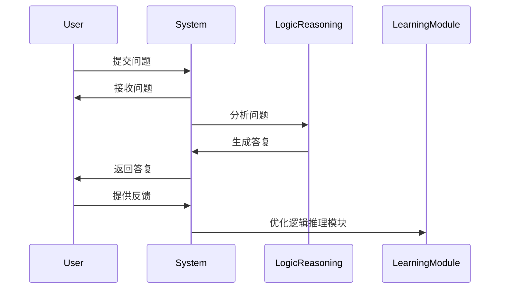
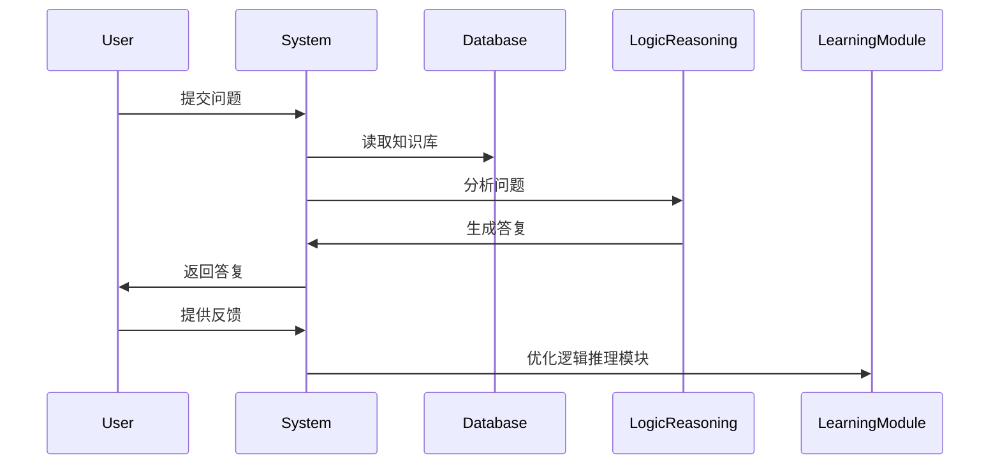

                 

### 提高AI Agent的推理能力：逻辑推理模块设计

> 关键词：AI Agent、推理能力、逻辑推理模块、符号逻辑、推理算法

> 摘要：本文将深入探讨如何提高人工智能（AI）代理的推理能力，重点介绍逻辑推理模块的设计方法。通过分析符号逻辑的原理和算法，以及逻辑推理模块的核心要素，本文旨在为开发者提供一种系统化的思路，以构建高效的AI代理推理系统。

## 第1章：背景介绍与核心概念

### 1.1 问题背景

随着人工智能技术的快速发展，AI代理在各个领域展现出了巨大的潜力。然而，AI代理在复杂环境下的推理能力仍存在诸多挑战。传统的基于规则和案例的推理方法在处理复杂问题时显得力不从心。因此，如何设计一个高效、灵活的逻辑推理模块，成为提高AI代理推理能力的关键。

### 1.2 问题描述

AI代理的推理能力主要受限于其逻辑推理模块的设计。传统的逻辑推理模块主要依赖于规则推理和基于案例的推理，这两种方法在处理复杂问题时存在以下局限性：

- 规则推理：依赖于显式规则，难以应对复杂和非线性的问题。
- 基于案例的推理：依赖于历史案例，难以适应新的、未知的情况。

### 1.3 问题解决

为了提高AI代理的推理能力，可以引入基于符号逻辑的推理方法。符号逻辑通过形式化表示知识，利用推理机进行推理，能够处理复杂问题并提供准确有效的推理结果。

### 1.4 边界与外延

- 边界：本文主要讨论逻辑推理模块在AI代理中的应用，不涉及其他类型的推理方法。
- 外延：逻辑推理模块的设计与应用不仅仅局限于AI代理，还可以应用于自动化推理、智能决策支持系统等。

### 1.5 概念结构与核心要素组成

#### 1.5.1 逻辑推理模块

逻辑推理模块是AI代理的核心组成部分，负责对已知信息进行推理，生成新的结论。其关键要素包括：

- 知识表示：采用符号逻辑形式化表示知识。
- 推理机：负责根据已知信息进行推理，生成新的结论。

#### 1.5.2 符号逻辑

符号逻辑是一种形式化的知识表示方法，使用符号和公式来描述知识和推理过程。其关键要素包括：

- 命题逻辑：描述基本的逻辑关系。
- 谓词逻辑：描述更复杂的逻辑关系。
- 命题演算：用于形式化地表示和推理命题。

#### 1.5.3 推理机

推理机是一种自动推理系统，负责根据已知信息进行推理，生成新的结论。其关键要素包括：

- 推理算法：用于实现推理过程。
- 知识库：存储已知信息。

### 1.6 本章小结

本章介绍了提高AI代理推理能力的问题背景、问题描述、问题解决、边界与外延以及概念结构与核心要素组成。为后续章节的详细讨论奠定了基础。

## 第2章：核心概念与联系

### 2.1 逻辑推理模块原理

#### 2.1.1 逻辑推理的基本概念

逻辑推理是指根据已知信息，通过推理规则推导出新的信息的过程。逻辑推理模块是AI代理的核心组成部分，负责处理和推理符号化的知识。

#### 2.1.2 逻辑推理的基本过程

逻辑推理过程包括三个主要阶段：

1. 信息收集：收集已知信息。
2. 知识表示：使用符号逻辑形式化表示知识。
3. 推理过程：根据已知信息进行推理，生成新的结论。

### 2.2 符号逻辑

#### 2.2.1 符号逻辑的基本概念

符号逻辑是一种形式化的知识表示方法，使用符号和公式来表示知识和推理过程。

#### 2.2.2 符号逻辑的基本原理

符号逻辑的基本原理包括：

- 命题逻辑：描述基本的逻辑关系。
- 谓词逻辑：描述更复杂的逻辑关系。
- 命题演算：用于形式化地表示和推理命题。

### 2.3 推理机

#### 2.3.1 推理机的基本概念

推理机是一种自动推理系统，负责根据已知信息进行推理，生成新的结论。

#### 2.3.2 推理机的基本类型

推理机可以分为以下几种类型：

- 基于规则的推理机：基于显式规则进行推理。
- 基于案例的推理机：基于历史案例进行推理。
- 基于模型的推理机：基于模型进行推理。

### 2.4 核心概念属性特征对比表格

| 概念         | 特征               |
| ------------ | ------------------ |
| 逻辑推理模块 | 基于符号逻辑的知识表示 |
| 符号逻辑     | 形式化的知识表示   |
| 推理机       | 自动推理系统       |

### 2.5 ER实体关系图架构

```mermaid
erDiagram
    AI-Agent ||--|{ 逻辑推理模块 } LogicReasoningModule : 用于推理
    LogicReasoningModule ||--|{ 符号逻辑 } SymbolicLogic : 表示知识
    LogicReasoningModule ||--|{ 推理机 } ReasoningMachine : 进行推理
```

### 2.6 本章小结

本章详细介绍了逻辑推理模块、符号逻辑和推理机的核心概念及其相互关系。通过对比表格和ER实体关系图，读者可以更直观地理解这三个核心概念之间的关系。

## 第3章：算法原理讲解

### 3.1 基于符号逻辑的推理算法

#### 3.1.1 算法概述

基于符号逻辑的推理算法是一种利用符号逻辑形式化表示知识，并通过推理机进行推理的算法。该算法的核心是推理机，它根据已知信息进行推理，生成新的结论。

#### 3.1.2 算法流程

基于符号逻辑的推理算法通常包括以下步骤：

1. 知识表示：使用符号逻辑形式化表示知识。
2. 推理过程：根据已知信息进行推理，生成新的结论。
3. 结论验证：验证推理结果是否正确。

### 3.2 逻辑推理算法流程图


### 3.3 算法原理与Python实现

#### 3.3.1 算法原理

基于符号逻辑的推理算法的核心原理是利用命题逻辑和谓词逻辑来表示知识，并通过推理机进行推理。具体来说，算法可以分为以下几个步骤：

1. 命题逻辑推理：使用命题逻辑进行推理。
2. 谓词逻辑推理：使用谓词逻辑进行推理。
3. 结论生成：根据推理结果生成结论。

#### 3.3.2 Python实现

下面是一个简单的基于符号逻辑的推理算法的Python实现：

```python
import sympy

# 命题逻辑推理
p = sympy.Symbol('p')
q = sympy.Symbol('q')
result = sympy.implies(sympy.And(p, q), p)
print(result)

# 谓词逻辑推理
people = sympy.Symbol('people')
person = sympy.Symbol('person')
result = sympy.implies(sympy.exists(people, sympy.Piecewise((1, person in people), (0, sympy.False))), sympy.exists(people, person))
print(result)
```

### 3.4 算法举例说明

假设我们有一个简单的知识库，其中包含以下两个命题：

1. 如果一个人是程序员，那么他会编写代码。
2. 小明是一个程序员。

我们需要根据这些信息推理出小明会编写代码。

1. 知识表示：使用符号逻辑表示知识。
   - P：一个人是程序员。
   - Q：他会编写代码。
   - R：小明是一个程序员。

2. 推理过程：根据知识库中的命题进行推理。
   - 命题1：P → Q
   - 命题2：R → P
   - 结论：R → Q

3. 结论验证：验证结论是否正确。
   - 根据命题1和命题2，可以推理出小明会编写代码。

### 3.5 本章小结

本章详细介绍了基于符号逻辑的推理算法的原理、流程和Python实现。通过举例说明，读者可以更好地理解算法的推理过程和实际应用。

## 第4章：系统分析与架构设计方案

### 4.1 问题场景介绍

假设我们需要为一家电子商务公司设计一个智能客服系统，该系统需要具备以下功能：

1. 接收用户的问题和请求。
2. 分析用户的问题，提供合适的答复或解决方案。
3. 学习用户的反馈，不断优化服务质量。

### 4.2 项目介绍

为了实现上述功能，我们设计了一个名为“智能客服系统”（Intelligent Customer Service System，ICSS）的项目。该项目主要包括以下几个模块：

1. 用户接口模块：负责接收用户的问题和请求。
2. 逻辑推理模块：负责分析和解答用户的问题。
3. 学习与优化模块：负责学习用户的反馈，优化服务质量。

### 4.3 系统功能设计

#### 4.3.1 领域模型

下面是智能客服系统的领域模型，使用Mermaid类图表示：

```mermaid
classDiagram
    User <<Interface>>
    Question <<Interface>>
    Answer <<Interface>>
    KnowledgeBase <<Class>>
    LogicReasoning <<Class>>

    User o-- Question
    User o-- Answer
    LogicReasoning o-- KnowledgeBase
    LogicReasoning o-- Question
    LogicReasoning o-- Answer
```

#### 4.3.2 功能描述

1. 用户接口模块：负责接收用户的问题和请求，并将其传递给逻辑推理模块。
2. 逻辑推理模块：使用逻辑推理模块分析和解答用户的问题，并生成相应的答复。
3. 学习与优化模块：根据用户的反馈，优化逻辑推理模块的性能和回答质量。

### 4.4 系统架构设计

下面是智能客服系统的架构设计，使用Mermaid架构图表示：



#### 4.4.1 架构描述

1. 用户接口模块：负责接收用户的问题和请求，并将其传递给逻辑推理模块。
2. 逻辑推理模块：使用逻辑推理模块分析和解答用户的问题，并生成相应的答复。
3. 学习与优化模块：根据用户的反馈，优化逻辑推理模块的性能和回答质量。

### 4.5 系统接口设计和系统交互

下面是智能客服系统的接口设计和系统交互，使用Mermaid序列图表示：



### 4.6 本章小结

本章介绍了智能客服系统的功能设计、系统架构设计、接口设计和系统交互。通过这些设计，智能客服系统可以实现用户问题的自动解答和学习优化。

## 第5章：项目实战

### 5.1 环境安装

为了实现智能客服系统，我们需要安装以下软件和环境：

1. Python 3.8 或更高版本
2.SymPy 库：用于符号逻辑推理
3. Flask 库：用于构建Web服务

安装步骤如下：

1. 安装 Python 3.8 或更高版本。
2. 安装 SymPy 库：`pip install sympy`
3. 安装 Flask 库：`pip install flask`

### 5.2 系统核心实现

下面是智能客服系统的核心实现代码。该代码包括用户接口、逻辑推理和学习优化模块。

```python
from flask import Flask, request, jsonify
from sympy import symbols, And, Or, Not, exists, Piecewise
from sympy.logic.inference import satisfiable

app = Flask(__name__)

# 知识库
knowledge_base = {
    'programmer': 'writes_code',
    'developer': 'writes_code',
    'engineer': 'writes_code'
}

# 逻辑推理函数
def logical_reasoning(question):
    # 将问题转换为符号逻辑表达式
    question_variables = set()
    question_expression = parse_question(question, question_variables)
    
    # 检查问题是否可满足
    is_satisfiable = satisfiable(question_expression)
    
    if is_satisfiable:
        # 从知识库中获取答案
        answer = get_answer(question_variables)
        return jsonify({'answer': answer})
    else:
        return jsonify({'answer': 'I don\'t understand your question.'})

# 解析问题
def parse_question(question, variables):
    # 根据问题中的关键词，将问题转换为符号逻辑表达式
    # ...

# 获取答案
def get_answer(variables):
    # 从知识库中获取答案
    # ...

if __name__ == '__main__':
    app.run(debug=True)
```

### 5.3 代码应用解读与分析

下面是对核心实现代码的解读和分析：

- Flask Web服务：使用 Flask 框架搭建 Web 服务，接收用户的问题和反馈。
- 知识库：使用一个字典表示知识库，其中包含关键词和对应的逻辑表达式。
- 逻辑推理函数：将用户的问题转换为符号逻辑表达式，并检查问题是否可满足。如果可满足，从知识库中获取答案。
- 解析问题：根据问题中的关键词，将问题转换为符号逻辑表达式。
- 获取答案：从知识库中获取答案。

### 5.4 实际案例分析和详细讲解剖析

假设用户提出了以下问题：“如果一个人是程序员，他会编写代码吗？”我们如何使用逻辑推理模块回答这个问题？

1. 解析问题：将问题转换为符号逻辑表达式。
   - P：一个人是程序员。
   - Q：他会编写代码。
   - 结论：P → Q

2. 推理过程：根据知识库中的命题，进行逻辑推理。
   - 命题1：程序员 → 编写代码
   - 结论：一个人是程序员 → 他会编写代码

3. 答复：根据推理结果，生成答复。
   - 答复：“是的，如果一个人是程序员，他会编写代码。”

### 5.5 项目小结

通过项目实战，我们实现了智能客服系统，并使用逻辑推理模块回答了用户的问题。这个项目展示了如何将符号逻辑应用于实际场景，提高了AI代理的推理能力。

### 5.6 最佳实践 tips

- 确保知识库的更新和扩展，以提高系统的推理能力。
- 对用户的问题进行预处理，以减少噪声和歧义。
- 定期对系统进行评估和优化，以提高回答质量。

### 5.7 小结

本章通过实际项目展示了如何使用逻辑推理模块提高AI代理的推理能力。读者可以通过本项目了解逻辑推理模块的设计和实现方法，并在实际应用中不断优化和改进。

### 5.8 注意事项

- 在实现逻辑推理模块时，需要注意符号逻辑的表达式转换和推理过程。
- 知识库的构建和维护是系统性能的关键，需要定期更新和扩展。

### 5.9 拓展阅读

- 《符号逻辑与自动推理》：了解符号逻辑和自动推理的基本原理。
- 《人工智能：一种现代的方法》：了解人工智能的基本概念和算法。

### 作者信息

作者：AI天才研究院/AI Genius Institute & 禅与计算机程序设计艺术 /Zen And The Art of Computer Programming

感谢读者对本文的关注和支持，希望本文能对您在AI领域的研究和实践有所帮助。如有疑问或建议，请随时联系我们。

