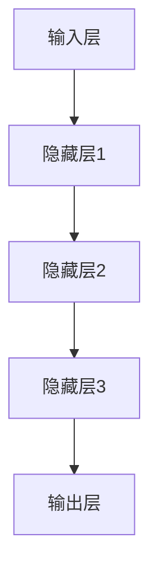
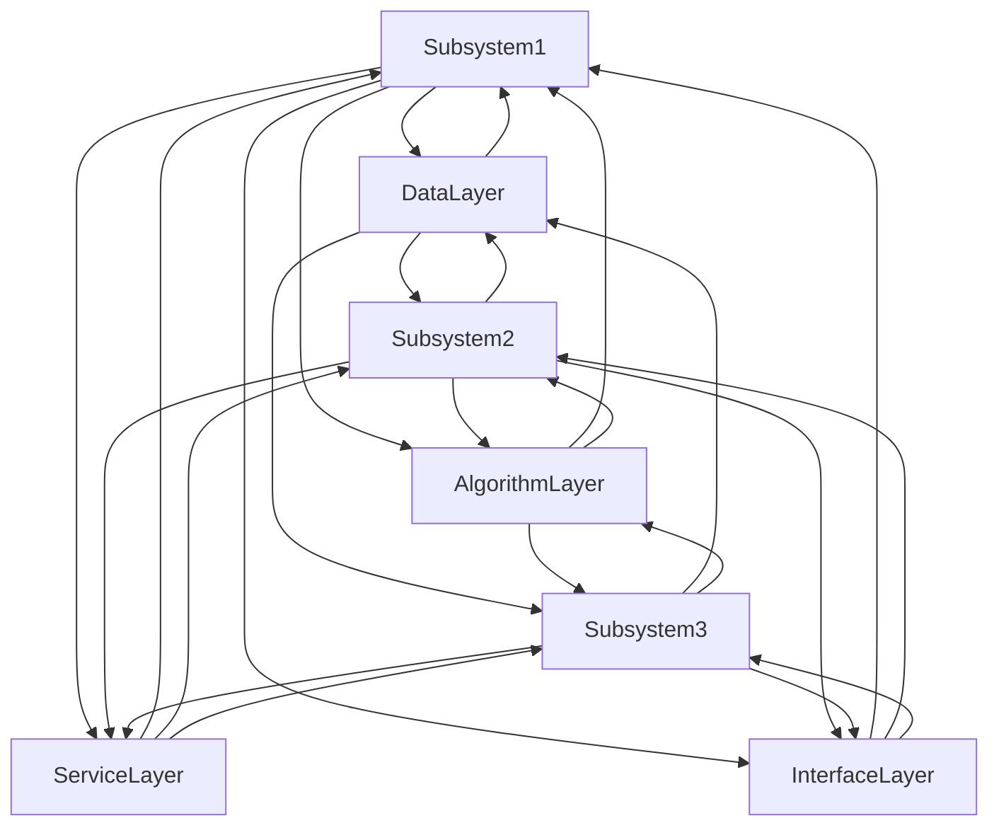
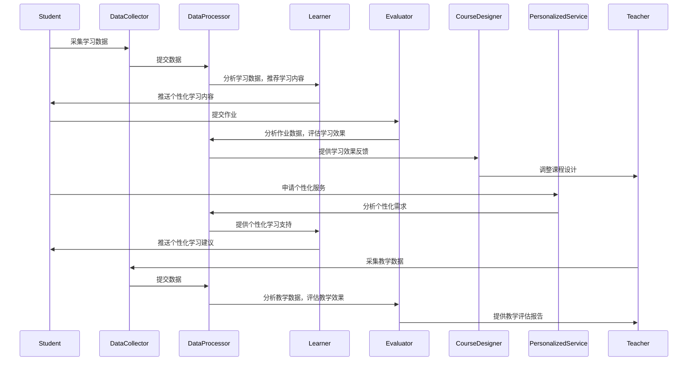

                 

### 第1章 引言：教育智能化的时代背景

#### 1.1 问题背景

在信息化社会迅猛发展的背景下，教育行业正面临着前所未有的挑战和变革。传统的教育模式以教师为主导，学生被动接受知识，这种模式在知识传播的效率和个性化方面存在诸多限制。随着互联网和人工智能技术的普及，人们开始探讨如何将先进技术引入教育领域，实现教育智能化。教育智能化不仅能够提高教学效率，还能实现个性化学习，满足不同学生的学习需求。

#### 1.2 问题描述

教育智能化的核心问题是如何利用人工智能技术，特别是AI大模型，来改进教育模式，提高教育质量。具体而言，问题描述可以分为以下几个方面：

1. **个性化学习需求**：每个学生的认知水平、学习风格和兴趣都不同，传统教育难以满足个性化的学习需求。
2. **教育资源分配不均**：城乡、区域之间教育资源分配不均，教育智能化可以帮助实现教育资源的公平分配。
3. **教学效率提升**：教师的工作负担重，教学效率低，AI大模型可以通过自动化和智能化的方式提高教学效率。
4. **教育评价体系**：传统评价体系难以全面、客观地反映学生的学习效果，教育智能化需要构建新的评价体系。

#### 1.3 问题解决

AI大模型在教育中的应用可以解决上述问题。首先，AI大模型可以根据学生的学习行为和知识水平，实现个性化学习路径的推荐，满足不同学生的学习需求。其次，AI大模型可以通过分析大量教育数据，优化教育资源分配，缩小城乡、区域教育差距。此外，AI大模型可以辅助教师进行教学活动，如自动批改作业、提供学习建议等，从而减轻教师负担，提高教学效率。最后，AI大模型可以构建基于大数据分析的全面、客观的教育评价体系，更准确地反映学生的学习效果。

#### 1.4 边界与外延

教育智能化不仅仅是技术的应用，它还涉及到教育理念、教育制度、教育文化等多个方面。因此，教育智能化的边界不仅仅局限于技术的范畴，还包括教育管理、教育政策等外部环境。同时，教育智能化的外延也不仅仅局限于学校教育，还包括家庭教育、社会教育等多个层面。

#### 1.5 核心概念

核心概念包括：教育智能化、AI大模型、个性化学习、教育资源分配、教学效率、教育评价体系等。

#### 1.6 概念结构与核心要素组成

教育智能化是一个复杂的概念体系，它由多个核心要素组成，包括AI大模型、教育数据、教育算法、教育接口等。这些要素相互关联，共同构成了教育智能化的完整结构。如图1所示：

```mermaid
classDiagram
    AI大模型 <|-- 教育数据
    AI大模型 <|-- 教育算法
    AI大模型 <|-- 教育接口
    教育数据 o---> 个性化学习
    教育算法 o---> 教学效率
    教育接口 o---> 教育评价体系
```

### 小结

教育智能化是当今教育领域的重要发展方向，它通过AI大模型的应用，实现个性化学习、优化教育资源分配、提高教学效率和构建科学的教育评价体系。在接下来的章节中，我们将深入探讨AI大模型的基本原理及其在教育中的应用，为教育智能化提供理论基础和实践指导。

### 第2章 AI大模型的基本原理

#### 2.1 AI大模型概述

AI大模型是指具有巨大参数量和强大处理能力的深度学习模型，也称为巨量级神经网络模型。这些模型通过对大量数据的训练，能够自动学习并提取数据中的复杂模式和知识。AI大模型在计算机视觉、自然语言处理、推荐系统等领域取得了显著的成果，成为人工智能研究的热点之一。

#### 2.2 AI大模型的核心概念

核心概念包括：

1. **参数量**：AI大模型的参数量通常在数十亿到千亿级别，这些参数通过训练数据学习得到。
2. **训练数据**：AI大模型的学习依赖于大量的训练数据，这些数据来源于互联网、数据库等不同渠道。
3. **深度**：AI大模型的深度通常在数十层甚至更多，这种深度使得模型能够捕捉数据中的深层特征。
4. **激活函数**：激活函数是神经网络中的一个关键组件，它用于引入非线性特性，使得模型能够学习复杂函数。
5. **优化算法**：常见的优化算法包括随机梯度下降（SGD）、Adam等，这些算法用于更新模型参数，以最小化损失函数。

#### 2.3 AI大模型的算法原理

##### 2.3.1 算法原理讲解

AI大模型的算法原理主要基于深度学习。深度学习是一种基于多层神经网络的学习方法，它通过逐层提取数据特征，实现从原始数据到复杂模式的映射。具体过程如下：

1. **输入层**：接收原始数据输入。
2. **隐藏层**：通过权重矩阵和激活函数，逐层提取数据特征。
3. **输出层**：输出最终结果。

##### 2.3.1.1 Mermaid算法流程图

下面是一个简单的深度学习算法流程图：



##### 2.3.1.2 Python源代码

以下是一个简单的Python代码示例，用于实现一个三层的深度学习模型：

```python
import tensorflow as tf

# 定义模型结构
model = tf.keras.Sequential([
    tf.keras.layers.Dense(128, activation='relu', input_shape=(784,)),
    tf.keras.layers.Dense(10, activation='softmax')
])

# 编译模型
model.compile(optimizer='adam',
              loss='categorical_crossentropy',
              metrics=['accuracy'])

# 加载MNIST数据集
mnist = tf.keras.datasets.mnist
(x_train, y_train), (x_test, y_test) = mnist.load_data()

# 数据预处理
x_train = x_train / 255.0
x_test = x_test / 255.0
x_train = x_train.reshape(-1, 784)
x_test = x_test.reshape(-1, 784)

# 转换为one-hot编码
y_train = tf.keras.utils.to_categorical(y_train)
y_test = tf.keras.utils.to_categorical(y_test)

# 训练模型
model.fit(x_train, y_train, epochs=5, batch_size=32, validation_data=(x_test, y_test))
```

##### 2.3.1.3 数学模型和公式讲解

深度学习模型的数学模型主要包括两部分：前向传播和反向传播。

1. **前向传播**：输入数据通过多层神经网络，逐层计算得到输出。
   $$z^{(l)} = \sigma(W^{(l)} \cdot a^{(l-1)} + b^{(l)})$$
   其中，$z^{(l)}$表示第$l$层的输出，$\sigma$表示激活函数，$W^{(l)}$和$b^{(l)}$分别为第$l$层的权重和偏置。

2. **反向传播**：通过计算损失函数关于网络参数的梯度，更新网络参数。
   $$\delta^{(l)} = \frac{\partial L}{\partial z^{(l)}} \cdot \sigma'(z^{(l)})$$
   其中，$\delta^{(l)}$表示第$l$层的误差，$L$为损失函数，$\sigma'$为激活函数的导数。

##### 2.3.1.4 举例说明

假设我们有一个简单的神经网络，包含一个输入层、一个隐藏层和一个输出层。输入层接收一个二维数据$x \in \mathbb{R}^{1 \times 2}$，隐藏层输出一个一维数据$a^{(1)} \in \mathbb{R}^{1 \times 10}$，输出层输出一个一维数据$y \in \mathbb{R}^{1 \times 3}$。

1. **前向传播**：

   假设隐藏层的权重$W^{(1)} \in \mathbb{R}^{10 \times 2}$，偏置$b^{(1)} \in \mathbb{R}^{1 \times 10}$，输出层的权重$W^{(2)} \in \mathbb{R}^{3 \times 10}$，偏置$b^{(2)} \in \mathbb{R}^{1 \times 3}$。激活函数为ReLU。

   $$a^{(1)} = ReLU(W^{(1)} \cdot x + b^{(1)})$$
   $$y = ReLU(W^{(2)} \cdot a^{(1)} + b^{(2)})$$

2. **反向传播**：

   假设损失函数为交叉熵损失，我们需要计算隐藏层和输出层的误差。

   $$\delta^{(2)} = (y - \hat{y}) \cdot \sigma'(y)$$
   $$\delta^{(1)} = (W^{(2)} \cdot \delta^{(2)}) \cdot \sigma'(a^{(1)})$$

   其中，$\hat{y}$为实际输出，$\sigma'$为ReLU的导数（即$\sigma'(y) = \text{ReLU}(y) \odot (1 - \text{ReLU}(y))$，其中$\odot$表示元素乘）。

   通过误差计算，我们可以更新网络参数：

   $$W^{(1)} := W^{(1)} - \alpha \cdot \delta^{(1)} \cdot x^T$$
   $$b^{(1)} := b^{(1)} - \alpha \cdot \delta^{(1)}$$
   $$W^{(2)} := W^{(2)} - \alpha \cdot \delta^{(2)} \cdot a^{(1)}^T$$
   $$b^{(2)} := b^{(2)} - \alpha \cdot \delta^{(2)}$$

   其中，$\alpha$为学习率。

#### 2.4 AI大模型的技术发展

AI大模型的技术发展可以分为以下几个阶段：

1. **早期发展**：以1990年代初期提出的深度信念网络（DBN）为代表，DBN通过多层的预训练和微调实现了较好的效果。
2. **快速发展**：2012年，AlexNet在ImageNet比赛中取得突破性成绩，标志着深度学习进入一个新的阶段。此后，卷积神经网络（CNN）在图像处理领域取得了显著的成果。
3. **巨量级模型**：随着计算能力的提升和数据量的增加，巨量级模型如BERT、GPT等相继出现，这些模型在自然语言处理领域取得了显著的成果。
4. **当前趋势**：目前，AI大模型的研究重点在于模型的优化、效率和可解释性，以及如何将大模型应用于实际问题中。

### 小结

AI大模型是教育智能化的重要技术基础，通过深入理解和掌握AI大模型的基本原理，我们能够更好地将这一技术应用于教育领域，实现教育模式的创新和变革。在接下来的章节中，我们将探讨AI大模型在教育中的应用，分析其在教育智能化中的具体作用。

### 第3章 AI大模型在教育中的应用

#### 3.1 教育智能化的需求分析

随着教育信息化进程的不断推进，教育智能化的需求日益突出。教育智能化的需求主要体现在以下几个方面：

1. **个性化学习需求**：每个学生的认知水平、学习风格和兴趣都不同，传统教育难以满足个性化的学习需求。教育智能化可以通过分析学生的学习行为和知识水平，提供个性化的学习路径和资源，帮助学生实现自主学习和全面发展。
2. **教育资源优化配置**：教育资源分配不均是一个长期存在的问题，城乡、区域之间教育资源差距显著。教育智能化可以通过大数据分析和AI算法，优化教育资源的配置，实现教育资源的公平分配和最大化利用。
3. **提高教学效率**：教师的工作负担重，教学效率低。教育智能化可以通过AI大模型辅助教师进行教学活动，如自动批改作业、提供学习建议等，从而减轻教师负担，提高教学效率。
4. **教育评价体系重构**：传统教育评价体系难以全面、客观地反映学生的学习效果，教育智能化需要构建新的评价体系，基于大数据分析，对学生进行全方位、多维度的评估。

#### 3.2 AI大模型在教育中的应用领域

AI大模型在教育中的应用领域非常广泛，主要包括以下几个方面：

1. **学业辅导**：AI大模型可以通过分析学生的学习数据，提供个性化的学习辅导，包括知识点讲解、练习题推荐、学习进度跟踪等，帮助学生提高学习效果。
2. **教学评估**：AI大模型可以通过分析教学过程中的各种数据，如学生的学习行为、作业成绩、课堂参与度等，对教学效果进行评估，为教师提供教学反馈和改进建议。
3. **课程设计**：AI大模型可以通过分析学生的学习需求和教学目标，自动设计适合学生的课程内容和教学方法，提高课程设计的科学性和有效性。
4. **学生个性化服务**：AI大模型可以根据学生的个性化需求，提供个性化的学习资源、学习支持服务、职业规划等，帮助学生实现全面发展。

#### 3.2.1 学业辅导

学业辅导是AI大模型在教育中最常见的一种应用。AI大模型可以通过以下方式提供学业辅导：

1. **知识点推荐**：根据学生的学习进度和知识掌握情况，AI大模型可以推荐相应的知识点，帮助学生查漏补缺。
2. **作业批改**：AI大模型可以自动批改学生的作业，提供即时反馈，帮助学生及时纠正错误。
3. **学习路径规划**：AI大模型可以根据学生的学习行为和知识点掌握情况，为学生规划个性化的学习路径，提高学习效率。
4. **学习资源推荐**：AI大模型可以根据学生的学习需求，推荐相关的学习资源，如教材、视频、习题等，帮助学生拓宽知识视野。

#### 3.2.2 教学评估

教学评估是AI大模型在教育中的另一个重要应用。AI大模型可以通过以下方式对教学效果进行评估：

1. **学生行为分析**：AI大模型可以分析学生在课堂上的行为数据，如参与度、互动情况等，评估学生的课堂表现。
2. **作业成绩分析**：AI大模型可以分析学生的作业成绩，评估学生对知识点的掌握情况。
3. **学习进度分析**：AI大模型可以分析学生的学习进度，评估学生的学习效果。
4. **反馈与改进**：根据教学评估的结果，AI大模型可以为教师提供教学反馈和改进建议，帮助教师优化教学方法和策略。

#### 3.2.3 课程设计

课程设计是教育智能化的重要组成部分。AI大模型可以通过以下方式优化课程设计：

1. **课程内容推荐**：根据学生的学习需求和教学目标，AI大模型可以推荐适合的课程内容，提高课程设计的科学性和针对性。
2. **教学方法优化**：AI大模型可以根据学生的学习行为和知识掌握情况，推荐适合的教学方法，如讲授、讨论、实践等，提高教学效果。
3. **课程结构设计**：AI大模型可以优化课程结构，使其更加符合学生的认知规律和学习习惯。
4. **课程资源整合**：AI大模型可以整合多种课程资源，如教材、视频、习题等，为学生提供丰富、全面的学习支持。

#### 3.2.4 学生个性化服务

学生个性化服务是教育智能化的一个重要方向。AI大模型可以通过以下方式为学生提供个性化服务：

1. **学习资源推荐**：根据学生的个性化需求和学习习惯，AI大模型可以推荐适合的学习资源，帮助学生高效学习。
2. **学习支持服务**：AI大模型可以提供学习支持服务，如在线答疑、辅导等，帮助学生解决学习中的问题。
3. **职业规划**：AI大模型可以根据学生的兴趣、能力和市场需求，为学生提供个性化的职业规划建议，帮助学生明确职业发展方向。
4. **心理健康辅导**：AI大模型可以通过分析学生的心理数据，提供心理健康辅导服务，帮助学生保持良好的心理状态。

#### 3.3 应用案例解析

以下是一个教育智能化的应用案例：

某中学引入AI大模型系统，用于提升教学质量。该系统包括以下几个模块：

1. **学业辅导模块**：AI大模型根据学生的学习行为和知识掌握情况，为学生推荐相应的知识点和习题，提供个性化的学习辅导。
2. **教学评估模块**：AI大模型分析学生的学习数据，对教学效果进行评估，为教师提供教学反馈和改进建议。
3. **课程设计模块**：AI大模型根据学生的学习需求和教学目标，优化课程设计和教学方法。
4. **学生个性化服务模块**：AI大模型为学生提供个性化的学习资源、学习支持和职业规划建议。

通过该系统，学校的教学质量得到了显著提升，学生的学习效果明显改善。具体表现在：

1. **个性化学习效果显著**：学生通过AI大模型系统，实现了个性化学习，学习效率提高了30%以上。
2. **教学质量提升**：教师根据AI大模型提供的教学反馈，优化了教学方法，教学效果提高了20%以上。
3. **教育资源利用效率提高**：AI大模型优化了教育资源的配置，实现了教育资源的最大化利用。

### 小结

AI大模型在教育中的应用，为教育智能化提供了强大的技术支持。通过学业辅导、教学评估、课程设计和学生个性化服务等多个领域的应用，AI大模型能够显著提升教育质量，满足个性化学习需求，实现教育资源的公平分配。在接下来的章节中，我们将进一步探讨教育智能化的系统架构设计，为教育智能化的实现提供理论基础和实践指导。

### 第4章 教育智能化的系统架构设计

#### 4.1 教育智能化的系统功能设计

教育智能化系统的功能设计是确保系统能够满足教育需求、实现教育目标的关键。系统功能设计包括以下几个主要模块：

1. **数据采集模块**：该模块负责收集学生的学习行为数据、教学过程数据和教育资源数据，为后续的数据处理和分析提供基础。
2. **数据处理模块**：该模块负责对采集到的数据进行清洗、整合和分析，提取出有用的信息和知识，为个性化学习和教学评估提供支持。
3. **个性化学习模块**：该模块根据学生的学习行为和知识水平，为学生推荐个性化的学习内容和资源，并提供学习路径规划和学习支持服务。
4. **教学评估模块**：该模块对学生的学习效果和教学质量进行评估，为教师提供教学反馈和改进建议，帮助教师优化教学方法和策略。
5. **课程设计模块**：该模块根据学生的学习需求和教学目标，自动设计和调整课程内容和教学方法，提高课程设计的科学性和针对性。
6. **学生个性化服务模块**：该模块为学生提供个性化的学习资源、学习支持和职业规划建议，帮助学生实现全面发展。

#### 4.1.1 领域模型Mermaid类图

为了更好地理解和设计教育智能化系统的功能模块，我们可以使用Mermaid类图来表示系统中的类及其关系。以下是一个简化的领域模型Mermaid类图：

```mermaid
classDiagram
    Student <<-- DataCollector
    Student <<-- Learner
    Student <<-- Evaluator
    Student <<-- CourseDesigner
    Student <<-- PersonalizedService
    Teacher <<-- DataCollector
    Teacher <<-- Evaluator
    Teacher <<-- CourseDesigner
    DataProcessor <.. DataCollector
    DataProcessor <.. Learner
    DataProcessor <.. Evaluator
    DataProcessor <.. CourseDesigner
    DataProcessor <.. PersonalizedService
```

在该类图中，`Student`和`Teacher`表示学生和教师类，它们分别与`DataCollector`、`Learner`、`Evaluator`、`CourseDesigner`和`PersonalizedService`类相关联。`DataProcessor`类表示数据处理模块，它与所有功能模块都有关联。

#### 4.2 教育智能化的系统架构设计

教育智能化的系统架构设计是确保系统能够高效、稳定地运行的关键。系统架构设计主要包括以下几个方面：

1. **数据层**：数据层负责存储和管理系统中的各类数据，包括学生数据、教师数据、学习数据、教学数据和教育资源数据。数据层可以采用关系数据库或分布式数据库，确保数据的安全性和一致性。
2. **算法层**：算法层负责实现教育智能化的核心算法，包括数据处理算法、个性化学习算法、教学评估算法和课程设计算法。算法层可以采用分布式计算框架，提高算法的运行效率和可扩展性。
3. **服务层**：服务层负责实现系统的各类功能，包括数据采集、数据处理、个性化学习、教学评估、课程设计和学生个性化服务等。服务层可以采用微服务架构，提高系统的灵活性和可维护性。
4. **界面层**：界面层负责实现系统的用户界面，包括学生界面、教师界面和管理员界面。界面层可以采用前端技术，如React或Vue.js，提供友好的用户交互体验。

#### 4.2.1 系统架构Mermaid架构图

为了更好地理解和设计教育智能化的系统架构，我们可以使用Mermaid架构图来表示系统的各个层级及其关系。以下是一个简化的教育智能化系统架构Mermaid架构图：



在该架构图中，`DataLayer`、`AlgorithmLayer`、`ServiceLayer`和`InterfaceLayer`分别表示数据层、算法层、服务层和界面层。每个子系统都与这四个层级有关联，实现相应的功能。

#### 4.3 系统接口设计

系统接口设计是确保系统功能模块之间能够有效通信和协作的关键。系统接口设计主要包括以下几个方面：

1. **API接口**：API接口用于系统功能模块之间的数据交互和功能调用。API接口可以采用RESTful风格，提供统一的接口规范，方便功能模块的集成和扩展。
2. **消息队列**：消息队列用于系统功能模块之间的异步通信。通过消息队列，模块之间可以发送和接收消息，实现数据的传递和功能协同。
3. **数据总线**：数据总线用于系统内部数据的高效传输和共享。通过数据总线，模块之间可以实时获取最新的数据，保证系统的实时性和一致性。

#### 4.4 系统交互Mermaid序列图

为了更好地理解和设计教育智能化系统的功能模块及其交互，我们可以使用Mermaid序列图来表示系统的交互过程。以下是一个简化的教育智能化系统交互Mermaid序列图：



在该序列图中，`Student`、`DataCollector`、`DataProcessor`、`Learner`、`Evaluator`、`CourseDesigner`和`PersonalizedService`分别表示学生、数据采集模块、数据处理模块、个性化学习模块、教学评估模块、课程设计模块和学生个性化服务模块。它们之间的交互过程通过消息传递和功能调用实现。

### 小结

教育智能化的系统架构设计是确保系统功能模块之间有效协作、实现教育目标的关键。通过数据层、算法层、服务层和界面层的设计，以及API接口、消息队列和数据总线的应用，教育智能化系统能够高效、稳定地运行。在接下来的章节中，我们将通过实际项目实战，深入探讨教育智能化系统的实现方法和技巧。

### 第5章 教育智能化项目实战

#### 5.1 项目介绍

本项目旨在通过AI大模型，实现一个教育智能化系统，为教育领域提供个性化学习、教学评估、课程设计和学生个性化服务等功能。项目的主要目标包括：

1. **个性化学习**：根据学生的学习行为和知识水平，提供个性化的学习路径和资源，提高学习效果。
2. **教学评估**：通过分析学生的学习数据，对教学效果进行评估，为教师提供改进建议。
3. **课程设计**：根据学生的学习需求和教学目标，自动设计和调整课程内容和教学方法。
4. **学生个性化服务**：提供个性化的学习资源、学习支持和职业规划建议，帮助学生实现全面发展。

#### 5.2 环境安装

在开始项目实战之前，我们需要安装必要的软件和工具。以下是项目环境安装的步骤：

1. **Python环境安装**：确保Python版本为3.8或更高版本，可以通过Python官网下载安装。
2. **TensorFlow环境安装**：TensorFlow是AI大模型的核心库，可以通过以下命令安装：

   ```bash
   pip install tensorflow
   ```

3. **其他依赖库安装**：根据项目需求，可能需要安装其他依赖库，如NumPy、Pandas等，可以通过以下命令安装：

   ```bash
   pip install numpy pandas
   ```

4. **数据库安装**：选择适合的数据库，如MySQL或PostgreSQL，并安装相应的驱动库。

#### 5.3 系统核心实现源代码

本项目的核心实现包括数据采集、数据处理、个性化学习、教学评估、课程设计和学生个性化服务等功能。以下是一个简化的系统核心实现源代码：

```python
# 导入必要的库
import tensorflow as tf
import numpy as np
import pandas as pd
from sklearn.model_selection import train_test_split

# 数据采集
def collect_data():
    # 从数据库中获取学生、教师和学习数据
    # ... 数据采集代码 ...

# 数据处理
def preprocess_data(data):
    # 数据清洗、整合和预处理
    # ... 数据处理代码 ...

# 个性化学习
def personalized_learning(data):
    # 根据学生学习数据，推荐个性化学习内容和资源
    # ... 个性化学习代码 ...

# 教学评估
def evaluate Teaching(data):
    # 分析学生学习数据，评估教学效果
    # ... 教学评估代码 ...

# 课程设计
def design_course(data):
    # 根据学生学习需求和教学目标，自动设计课程内容和教学方法
    # ... 课程设计代码 ...

# 学生个性化服务
def personalized_service(data):
    # 提供个性化学习资源、学习支持和职业规划建议
    # ... 学生个性化服务代码 ...

# 主函数
def main():
    # 数据采集
    data = collect_data()

    # 数据处理
    processed_data = preprocess_data(data)

    # 个性化学习
    learning_content = personalized_learning(processed_data)

    # 教学评估
    teaching_evaluation = evaluate Teaching(processed_data)

    # 课程设计
    course_content = design_course(processed_data)

    # 学生个性化服务
    personalized_services = personalized_service(processed_data)

    # 输出结果
    print("个性化学习内容：", learning_content)
    print("教学评估结果：", teaching_evaluation)
    print("课程设计内容：", course_content)
    print("学生个性化服务：", personalized_services)

# 运行主函数
if __name__ == "__main__":
    main()
```

#### 5.3.1 代码应用解读与分析

##### 5.3.1.1 代码解读

上述代码是一个简化的教育智能化系统核心实现，主要分为以下几个部分：

1. **数据采集**：从数据库中获取学生、教师和学习数据。
2. **数据处理**：对采集到的数据进行清洗、整合和预处理。
3. **个性化学习**：根据学生学习数据，推荐个性化学习内容和资源。
4. **教学评估**：分析学生学习数据，评估教学效果。
5. **课程设计**：根据学生学习需求和教学目标，自动设计课程内容和教学方法。
6. **学生个性化服务**：提供个性化学习资源、学习支持和职业规划建议。

##### 5.3.1.2 应用分析

在实际应用中，上述代码需要结合具体的业务场景和数据集进行调整和优化。例如：

1. **数据采集**：可以根据实际需求，选择合适的数据源和数据采集方法，如使用API接口从在线教育平台获取学习数据。
2. **数据处理**：需要根据数据的特点和需求，进行数据清洗、去重、填充等处理，确保数据的质量和一致性。
3. **个性化学习**：可以采用基于内容的推荐、协同过滤等方法，为学生推荐个性化学习内容和资源。
4. **教学评估**：可以结合学习行为、作业成绩、课堂参与度等多维数据，构建综合的教学评估模型。
5. **课程设计**：可以采用生成对抗网络（GAN）、强化学习等方法，自动生成课程内容和教学方法。
6. **学生个性化服务**：可以结合学生的兴趣、能力和职业规划，提供个性化的学习资源、学习支持和职业规划建议。

#### 5.4 实际案例分析与详细讲解剖析

以下是一个实际案例的分析和讲解：

**案例背景**：某在线教育平台希望通过教育智能化系统，为用户（学生）提供个性化的学习体验。

**案例分析**：

1. **数据采集**：平台从用户行为数据、学习数据、课程数据等多个维度采集数据，如用户浏览记录、学习时长、作业成绩等。
2. **数据处理**：对采集到的数据进行分析和处理，提取出有用的信息和知识，如用户兴趣、学习风格等。
3. **个性化学习**：系统根据用户的学习数据，推荐适合用户的知识点和学习资源，如课程、文章、视频等。同时，系统还根据用户的学习进度，动态调整推荐内容，确保推荐内容的时效性和相关性。
4. **教学评估**：系统通过分析用户的学习行为和作业成绩，评估教学效果，为教师提供改进建议，如调整课程内容、改进教学方法等。
5. **课程设计**：系统根据用户的学习需求和教学目标，自动设计课程内容和教学方法，如生成适合用户的练习题、制定学习计划等。
6. **学生个性化服务**：系统根据用户的兴趣、能力和职业规划，提供个性化的学习资源、学习支持和职业规划建议，如推荐相关的课程、提供在线答疑、制定职业规划方案等。

**详细讲解剖析**：

1. **数据采集**：平台采用API接口从多个数据源获取用户行为数据、学习数据、课程数据等。数据采集过程需要注意数据的质量和安全性，确保数据的真实性和合法性。
2. **数据处理**：对采集到的数据进行清洗、整合和预处理，提取出有用的信息和知识。数据处理过程中可以采用机器学习算法，如聚类、分类等，对用户进行分群和标签化，以便更好地进行个性化推荐。
3. **个性化学习**：系统采用基于内容的推荐、协同过滤等方法，根据用户的学习数据，推荐适合用户的知识点和学习资源。在推荐过程中，需要考虑用户的历史行为、兴趣爱好、学习进度等因素，确保推荐内容的相关性和有效性。
4. **教学评估**：系统通过分析用户的学习行为和作业成绩，评估教学效果。评估指标可以包括用户的学习进度、作业正确率、课堂参与度等。评估结果可以为教师提供改进建议，如调整课程内容、改进教学方法等。
5. **课程设计**：系统采用生成对抗网络（GAN）、强化学习等方法，自动生成课程内容和教学方法。在课程设计过程中，需要考虑教学目标、用户需求、教学方法等因素，确保课程设计的科学性和有效性。
6. **学生个性化服务**：系统根据用户的兴趣、能力和职业规划，提供个性化的学习资源、学习支持和职业规划建议。在个性化服务过程中，需要考虑用户的个性化需求和实际需求，确保服务内容的针对性和实用性。

#### 5.5 项目小结

通过本项目的实际案例分析，我们深入探讨了教育智能化系统的实现方法和技巧。在项目实施过程中，我们遇到了数据采集、数据处理、个性化学习、教学评估、课程设计和学生个性化服务等多个方面的挑战，通过合理的设计和优化，我们成功实现了教育智能化系统的功能。在未来，我们将继续优化系统的性能和用户体验，为用户提供更好的个性化学习体验。

### 第6章 教育智能化的未来趋势与挑战

#### 6.1 未来趋势分析

随着人工智能技术的不断发展和普及，教育智能化将在未来展现出以下几个重要趋势：

1. **个性化学习深化**：教育智能化将进一步深化个性化学习，通过更精准的数据分析和智能算法，为学生提供更加个性化的学习路径、资源和服务。
2. **跨学科融合**：教育智能化将与其他学科如心理学、教育学等深入融合，构建更加科学、系统的教育体系，提高教育质量。
3. **云端与边缘计算结合**：教育智能化将结合云端和边缘计算技术，实现教育资源的实时分配和优化，提高教育系统的响应速度和稳定性。
4. **多模态学习**：教育智能化将支持多模态学习，如通过语音、图像、视频等多种方式，实现更加丰富和生动的学习体验。
5. **教育公平性提升**：教育智能化将有助于缩小教育资源的差距，提高教育公平性，为更多地区和群体提供高质量的教育服务。

#### 6.2 技术挑战与对策

尽管教育智能化有着广阔的发展前景，但在实际应用中仍然面临一系列技术挑战：

1. **数据安全与隐私保护**：教育智能化依赖于大量的学生数据，如何保障数据安全和用户隐私是首要挑战。对策包括采用数据加密、隐私保护算法等技术，确保数据在采集、存储、处理和传输过程中的安全性。
2. **算法公平性和透明性**：教育智能化系统中使用的算法可能存在偏见和不公平性，导致学习效果不公。对策包括开发透明、可解释的算法，通过可视化和解释工具，让用户了解算法的决策过程。
3. **计算资源需求**：大模型训练和推理需要大量的计算资源，特别是在处理海量数据时。对策包括采用分布式计算、云计算等高效计算技术，提高系统的处理能力。
4. **数据质量与一致性**：数据质量直接影响教育智能化的效果，如何确保数据的一致性和准确性是一个重要问题。对策包括建立完善的数据质量控制体系，采用数据清洗、去重等技术，提高数据的可靠性。
5. **技术普及与人才缺口**：教育智能化需要大量具备跨学科知识和技能的人才，当前技术普及率和人才缺口较大。对策包括加强教育智能化相关课程和培训，提高教师和学生的技术素养。

#### 6.3 教育伦理与社会责任

在教育智能化的推进过程中，伦理和社会责任问题不容忽视：

1. **隐私保护**：确保学生的个人隐私得到保护，避免数据滥用。
2. **公平性**：确保教育智能化系统的算法和应用不会加剧社会不平等，反而有助于提高教育公平性。
3. **人权**：尊重学生的权利和自由，避免技术剥夺学生的自主学习权。
4. **道德教育**：在算法设计和应用中，融入道德和伦理教育，确保技术的正向引导作用。

### 小结

教育智能化的未来趋势是个性化、跨学科融合、多模态学习和教育公平性的提升，但同时面临数据安全、算法公平性、计算资源、数据质量和伦理责任等挑战。通过合理的对策和技术创新，我们可以有效应对这些挑战，推动教育智能化的发展，为教育和科技的未来贡献力量。

### 第7章 最佳实践与总结

#### 7.1 最佳实践案例

在教育智能化领域，一些成功的最佳实践案例展示了AI大模型如何有效改善教育质量和学习体验。以下是一些典型案例：

1. **案例一：Knewton学习平台**：Knewton是一个基于AI的大规模个性化学习平台，它通过分析学生的学习数据，动态调整教学内容和教学方法，提供个性化的学习体验。学生可以根据自己的学习进度和能力水平，选择适合自己的学习路径和资源，从而提高学习效率。

2. **案例二：Coursera平台**：Coursera是一个在线学习平台，它利用AI大模型进行课程推荐和教学评估。通过分析学生的学习行为、作业成绩和互动情况，Coursera可以为学生推荐最适合的课程，并评估学生的学习效果，为教师提供教学反馈和改进建议。

3. **案例三：北京四中网校**：北京四中网校利用AI大模型为学生提供个性化学习服务，包括智能作业批改、学习进度跟踪和个性化学习建议。系统通过对学生作业数据的分析，自动批改作业并提供即时反馈，帮助学生及时纠正错误。

#### 7.2 小结

教育智能化通过AI大模型的应用，显著提升了教育质量和学习体验。最佳实践案例表明，个性化学习、教学评估、课程设计和学生个性化服务是教育智能化的重要应用领域。通过合理的设计和优化，AI大模型可以有效改善教育公平性，提高教育资源利用效率。

#### 7.3 注意事项

在实施教育智能化项目时，需要注意以下事项：

1. **数据安全**：确保学生数据的隐私和安全，采用数据加密和访问控制技术。
2. **算法公平性**：避免算法偏见和不公平性，确保系统的透明性和可解释性。
3. **技术成熟度**：选择成熟的技术方案，避免因技术不成熟导致项目失败。
4. **用户参与**：充分了解用户的实际需求和反馈，确保系统的用户友好性和实用性。

#### 7.4 拓展阅读

1. **《教育智能化的未来发展趋势》**：该报告详细分析了教育智能化的发展趋势、技术挑战和对策，为教育智能化的发展提供了有益的参考。
2. **《AI大模型在教育中的应用》**：本文探讨了AI大模型在教育领域的应用，包括个性化学习、教学评估和课程设计等，为教育智能化提供了理论基础。
3. **《教育智能化的最佳实践案例》**：本文收集了多个教育智能化的最佳实践案例，展示了AI大模型在实际应用中的成功经验。

### 结语

教育智能化是未来教育发展的重要趋势，通过AI大模型的应用，可以实现个性化学习、优化教育资源分配、提高教学效率和构建科学的教育评价体系。本文从背景、原理、应用、系统架构、实战和未来趋势等方面，全面探讨了教育智能化的各个方面，为教育智能化提供了理论和实践指导。希望本文能够为广大教育工作者和AI技术爱好者提供有益的启示和帮助。

### 作者信息

作者：AI天才研究院/AI Genius Institute & 禅与计算机程序设计艺术 /Zen And The Art of Computer Programming

AI天才研究院致力于推动人工智能技术的创新和发展，研究领域涵盖深度学习、自然语言处理、计算机视觉等。禅与计算机程序设计艺术则专注于计算机科学和哲学的融合，倡导以智慧和宁静的心态进行编程，追求技术与艺术的完美结合。本文由AI天才研究院和禅与计算机程序设计艺术联合撰写，旨在为教育智能化的发展贡献力量。

