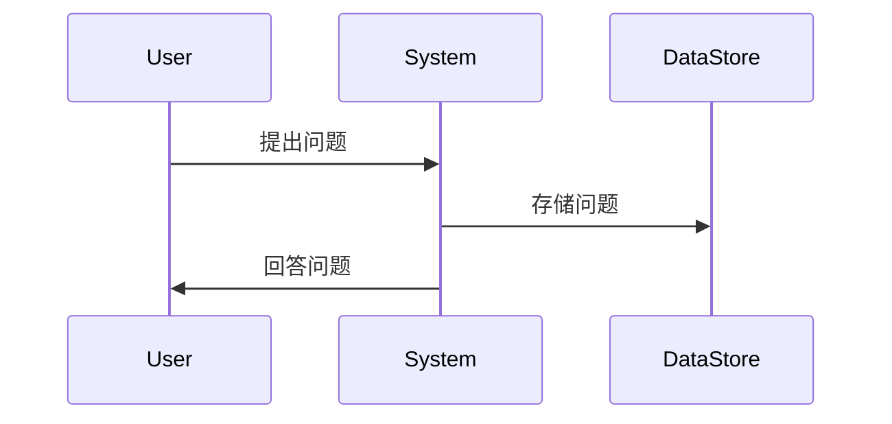
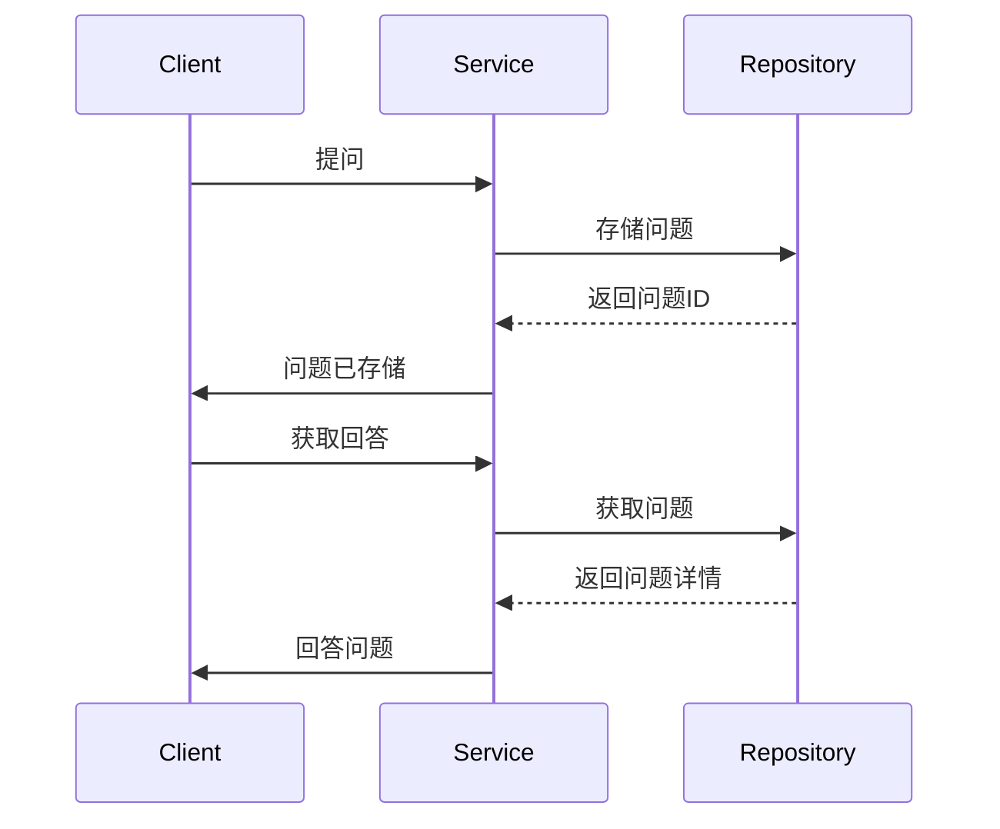

                 

# 数据收集策略：为AI Agent打造高质量数据集

## 关键词
- 数据收集策略
- AI Agent
- 高质量数据集
- 数据质量
- 数据源
- 数据清洗
- 数据存储
- 数据收集方法

## 摘要
本文旨在探讨数据收集策略在构建高质量数据集中的关键作用。通过分析数据收集策略的基本概念、核心概念与联系，以及其在不同应用场景下的设计原则和关键技术，本文将逐步引导读者深入了解数据收集策略的实践应用。此外，本文还将总结数据收集策略的最佳实践，提供资源获取与使用指南，并为未来数据收集策略的发展提出展望。

## 第一部分：背景与核心概念

### 第1章：数据收集策略概述

#### 1.1 问题背景
随着人工智能（AI）技术的迅猛发展，数据在AI应用中的重要性愈发凸显。高质量的数据集是训练和优化AI Agent的基石。然而，数据收集过程中常常面临数据质量差、数据源不稳定等问题，这直接影响到AI模型的性能和可靠性。因此，设计有效的数据收集策略成为提高AI Agent表现的关键步骤。

#### 1.2 数据收集策略的概念
数据收集策略是指为满足特定AI Agent需求，从多个数据源中系统性地收集、筛选和处理数据的一系列方法和步骤。其目的是确保收集到的数据具有高质量、代表性和可扩展性。

#### 1.3 数据收集策略的分类
数据收集策略可以根据数据源、收集方法、数据类型等因素进行分类。常见的分类方法包括：按数据来源分类（如内部数据、外部数据）、按数据收集方式分类（如自动收集、手动收集）、按数据类型分类（如图像数据、文本数据）等。

### 第2章：核心概念与联系

#### 2.1 数据质量
数据质量是指数据对于特定目的的有效性和可靠性。高数据质量意味着数据是准确的、完整的、一致的、及时的，并且具有必要的细节。数据质量直接影响AI模型的训练效果和预测准确性。

##### 数据质量的评估方法
- 准确性：数据与真实情况的一致程度。
- 完整性：数据是否包含所有必要的记录。
- 一致性：数据在不同来源和不同时间点是否一致。
- 及时性：数据是否在需要时能够快速获取。

#### 2.2 数据源
数据源是数据收集的起点，可以分为内部数据源和外部数据源。

##### 数据源的评估与选择
- 评估标准：数据量、数据质量、数据更新频率、数据访问权限等。
- 选择方法：根据AI Agent的需求和可用数据源的特点，选择最合适的数据源。

#### 2.3 数据收集方法
数据收集方法是指从数据源中提取数据的过程和方法。

##### 数据收集的方法分类
- 自动收集：使用脚本、API接口等自动化工具收集数据。
- 手动收集：人工方式收集数据，如问卷调查、访谈等。
- 联合收集：结合自动和手动收集方法，以获取更全面的数据。

##### 数据收集的流程
1. 确定数据收集目标。
2. 选择合适的数据源。
3. 设计数据收集方案。
4. 收集数据。
5. 数据清洗和处理。
6. 数据存储和管理。

##### 数据收集的技术工具
- 数据采集工具：如Web爬虫、API调用工具等。
- 数据清洗工具：如Pandas库、OpenRefine等。
- 数据存储工具：如Hadoop、Redis、MongoDB等。

### 第3章：数据收集策略的应用场景

#### 3.1 人工智能应用中的数据收集
在AI应用中，数据收集策略需要满足特定的需求，如图像识别、自然语言处理、推荐系统等。

##### 数据收集在人工智能中的应用案例
- 图像识别：收集大量标注好的图像数据。
- 自然语言处理：收集大量文本数据，并进行分词、标注等预处理。
- 推荐系统：收集用户行为数据，用于构建用户画像和推荐算法。

#### 3.2 不同行业的数据收集策略
不同行业对数据收集策略的需求有所不同，需要根据行业特点进行定制化设计。

##### 不同行业的数据收集
- 金融行业：收集交易数据、用户行为数据等，用于风险管理、客户服务优化等。
- 医疗健康行业：收集患者数据、医疗记录等，用于疾病预测、个性化治疗等。
- 教育行业：收集学生学习行为数据、考试数据等，用于教学效果评估、学习路径优化等。

## 第二部分：数据收集策略的设计与实践

### 第4章：数据收集策略的设计原则

#### 4.1 设计原则概述
数据收集策略的设计原则旨在确保数据收集过程的高效性和数据质量。基本原则包括：
- 数据需求导向：根据AI Agent的需求确定数据收集目标。
- 数据质量优先：优先考虑数据质量，确保数据的有效性和可靠性。
- 可扩展性：设计灵活的收集方案，以适应数据量的增长。
- 安全性：保护数据隐私，遵守相关法律法规。

#### 4.2 数据收集策略的制定流程
- 分析需求：明确AI Agent对数据的需求。
- 确定数据源：选择合适的数据源。
- 设计数据收集方案：制定详细的收集方案，包括数据采集、清洗、存储等步骤。
- 实施与监控：执行数据收集策略，并进行实时监控。
- 评估与优化：定期评估数据收集效果，并进行优化调整。

### 第5章：数据收集策略的关键技术

#### 5.1 数据收集技术
数据收集技术包括数据采集、数据清洗和数据存储等。

##### 数据采集技术
- 自动化采集：使用脚本、API接口等自动化工具进行数据采集。
- 手动采集：人工方式收集数据，如问卷调查、访谈等。

##### 数据清洗技术
- 数据清洗工具：使用Pandas库、OpenRefine等工具对数据进行清洗。
- 数据清洗流程：包括数据预处理、错误修正、缺失值处理等步骤。

##### 数据存储技术
- 数据存储工具：使用Hadoop、Redis、MongoDB等工具进行数据存储。
- 数据存储策略：根据数据类型和访问需求选择合适的存储方式。

### 第6章：数据收集策略的应用实战

#### 6.1 实战项目介绍
以一个智能客服系统为例，介绍数据收集策略在实际项目中的应用。

##### 项目背景
- 需要收集用户提问和回答数据，用于训练和优化智能客服模型。

##### 项目目标
- 收集高质量的客户提问和回答数据。
- 构建高效的智能客服系统。

##### 项目环境
- 数据来源：客户服务记录、社交媒体反馈等。
- 技术栈：Python、Pandas、Scikit-learn等。

#### 6.2 系统分析与设计

##### 领域模型设计
使用Mermaid绘制领域模型类图，展示系统中的主要实体和关系。

```mermaid
classDiagram
    class User {
        +String username
        +String password
        +String email
    }
    class Question {
        +String text
        +User author
        +DateTime created
    }
    class Answer {
        +String text
        +User author
        +DateTime created
    }
    User "asks" -> Question
    User "receives" -> Answer
```

##### 系统架构设计
使用Mermaid绘制系统架构图，展示系统的组成部分和各部分之间的关系。



##### 系统接口设计
使用Mermaid绘制系统接口序列图，展示系统的接口调用流程。



#### 6.3 系统实现与测试

##### 系统核心实现
```python
import pandas as pd
from sklearn.model_selection import train_test_split
from sklearn.feature_extraction.text import TfidfVectorizer
from sklearn.naive_bayes import MultinomialNB

# 数据采集与预处理
def collect_data():
    # 从数据库中获取数据
    questions = pd.read_sql_query("SELECT * FROM questions;", connection)
    answers = pd.read_sql_query("SELECT * FROM answers;", connection)
    
    # 合并问题和回答
    data = pd.merge(questions, answers, on="question_id")
    
    # 数据清洗
    data["text"] = data["text"].str.strip()
    data.dropna(inplace=True)
    
    return data

# 训练模型
def train_model(data):
    X = data["text"]
    y = data["label"]
    
    X_train, X_test, y_train, y_test = train_test_split(X, y, test_size=0.2, random_state=42)
    
    vectorizer = TfidfVectorizer()
    X_train = vectorizer.fit_transform(X_train)
    X_test = vectorizer.transform(X_test)
    
    model = MultinomialNB()
    model.fit(X_train, y_train)
    
    return model, vectorizer

# 预测与评估
def predict(model, vectorizer, test_data):
    test_vectorized = vectorizer.transform(test_data)
    predictions = model.predict(test_vectorized)
    
    accuracy = (predictions == test_data["label"]).mean()
    print(f"Accuracy: {accuracy:.2f}")
```

##### 系统测试与评估
- 单元测试：对系统中的每个功能模块进行测试，确保其正常运行。
- 集成测试：对系统整体进行测试，验证各个模块之间的交互和集成效果。
- 性能测试：对系统进行负载测试，评估其响应时间和处理能力。

#### 6.4 系统优化与调整
根据测试结果和用户反馈，对系统进行优化和调整，以提高数据收集策略的效果和用户体验。

### 第7章：数据收集策略的最佳实践与注意事项

#### 7.1 最佳实践
- 数据采集：定期更新数据源，确保数据的时效性。
- 数据清洗：使用自动化工具进行数据清洗，提高清洗效率和准确性。
- 数据存储：根据数据类型和访问需求选择合适的存储方案，确保数据的安全性和可靠性。
- 模型训练：定期重新训练模型，以适应数据的变化。

#### 7.2 小结
本文通过分析数据收集策略的背景、核心概念和应用场景，详细介绍了数据收集策略的设计原则、关键技术和实战应用。高质量的数据集是AI Agent性能的关键，因此，设计有效的数据收集策略至关重要。

#### 7.3 注意事项
- 在数据收集过程中，确保数据的质量和完整性。
- 注意数据隐私和安全，遵守相关法律法规。
- 定期评估和优化数据收集策略，以适应不断变化的需求。

### 第8章：拓展阅读

#### 8.1 相关书籍推荐
- 《大数据之路：阿里巴巴大数据实践》
- 《深度学习》
- 《Python数据科学手册》

#### 8.2 网络资源
- Kaggle：提供丰富的数据集和比赛
- ArXiv：提供最新的论文和研究成果
- AI技术社区：讨论和学习AI技术的平台

### 第9章：资源获取与使用

#### 9.1 资源获取方法
- 数据集：从Kaggle、UCI机器学习库等平台获取。
- 工具与库：使用Pandas、Scikit-learn、TensorFlow等Python数据科学库。

#### 9.2 资源使用指南
- 数据集使用：了解数据集的来源、格式和预处理方法。
- 工具与库使用：学习相关库的API和功能，结合具体项目进行应用。

## 总结
数据收集策略是构建高质量数据集的关键，对AI Agent的性能和可靠性具有重要影响。通过本文的介绍，读者可以掌握数据收集策略的基本概念、设计原则和实战应用，为实际项目提供指导。未来，随着AI技术的发展，数据收集策略将更加智能化和自动化，为AI应用提供更强大的支持。

### 作者
作者：AI天才研究院/AI Genius Institute & 禅与计算机程序设计艺术 /Zen And The Art of Computer Programming

