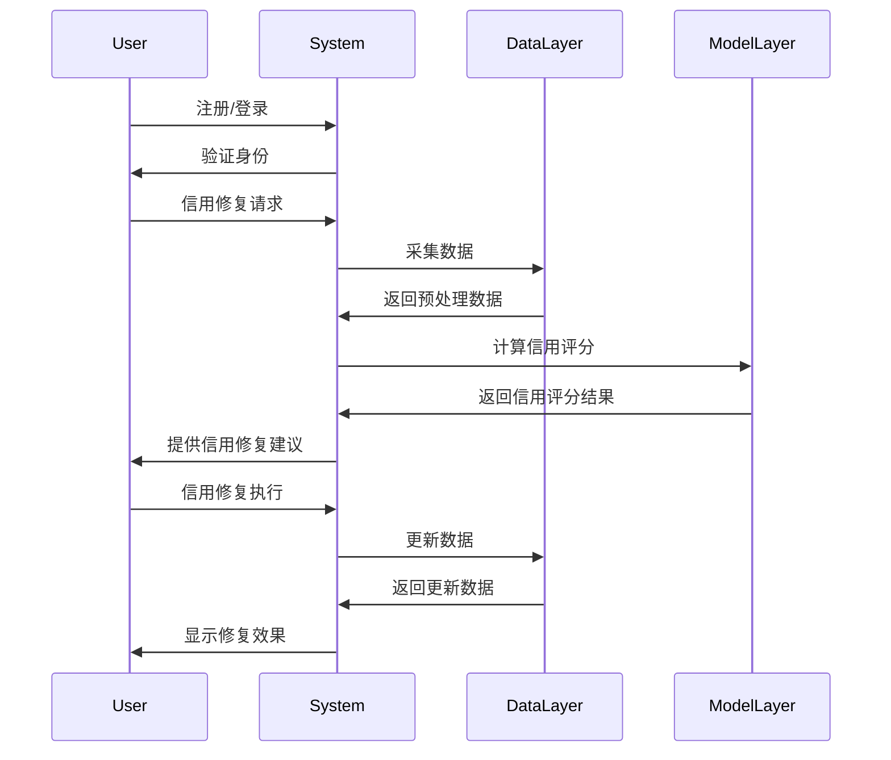

                 

# 智能个人信用修复策略推荐与执行系统

## 关键词

- 个人信用
- 智能算法
- 数据处理
- 信用评分
- 信用修复

## 摘要

本文将深入探讨智能个人信用修复策略推荐与执行系统的设计与实现。随着人工智能和大数据技术的迅速发展，个人信用修复已成为金融科技领域的重要研究方向。本文首先介绍了信用体系的重要性及智能个人信用修复的需求，随后详细阐述了智能个人信用修复的核心概念，包括个人信用、信用评级及智能信用修复策略。接着，文章深入分析了人工智能与机器学习技术的基础知识，以及其在信用评分中的应用。随后，文章介绍了数据科学与数据处理的重要性，包括数据预处理和特征提取。最后，文章重点介绍了智能个人信用修复算法的原理与流程，包括数据采集、数据预处理和算法模型选择。通过本文，读者将了解到智能个人信用修复策略推荐与执行系统的全貌，并对未来展望与挑战有所认识。

### 第1章：问题背景与核心概念

#### 1.1 问题的提出

信用体系是国家经济发展的重要基石，它对个人、企业和整个社会的稳定运行具有至关重要的作用。个人信用不仅影响个人的借贷、消费、求职等方面，还与社会信用体系的完善息息相关。随着金融科技的快速发展，个人信用修复成为了亟待解决的重要问题。

传统的信用修复方法主要依赖于人工审核，效率低、成本高，且容易出现主观判断错误。随着人工智能技术的发展，利用智能算法对个人信用进行修复具有显著的优势，包括提高修复效率、降低成本、减少错误率等。因此，研究智能个人信用修复策略推荐与执行系统具有重要意义。

#### 1.1.1 信用体系的重要性

信用体系是国家经济活动的纽带，它能够有效降低交易成本，提升市场效率。个人信用体系作为信用体系的重要组成部分，对个人的金融活动和社会生活有着深远的影响。良好的个人信用不仅可以帮助个人获得更优惠的贷款利率、更高的信用额度，还能提高个人的社会地位和信誉。

#### 1.1.2 智能个人信用修复的需求

传统的信用修复方法主要依赖于人工审核，效率低、成本高，且容易出现主观判断错误。随着人工智能技术的发展，利用智能算法对个人信用进行修复具有显著的优势，包括提高修复效率、降低成本、减少错误率等。智能个人信用修复策略能够根据大量的历史数据和实时信息，自动识别信用问题，提供个性化的修复方案，从而提高信用修复的准确性和有效性。

#### 1.2 核心概念

##### 1.2.1 个人信用

个人信用是指个人在金融活动中所表现出的信用水平，包括偿还债务的能力、履约意愿和履约历史等。良好的个人信用能够帮助个人获得更优惠的贷款利率、更高的信用额度等。

##### 1.2.2 信用评级

信用评级是指根据个人的信用记录、还款能力等因素，对其信用水平进行评估。信用评级越高，个人获得贷款的难度越小，利率越低。

##### 1.2.3 智能个人信用修复策略

智能个人信用修复策略是指利用人工智能技术，对个人信用问题进行识别、分析和修复的一套方法。包括数据采集、特征提取、算法模型、策略优化等步骤。

#### 1.3 书籍框架

本文将按照以下框架进行组织和讨论：

1. **问题背景与核心概念**
2. **智能个人信用修复技术基础**
3. **信用数据采集与处理**
4. **个人信用特征分析与提取**
5. **智能个人信用修复算法模型**
6. **信用修复策略优化与评估**
7. **智能个人信用修复系统设计与实现**
8. **实际案例分析与讨论**
9. **未来展望与挑战**
10. **总结与拓展**

### 第2章：智能个人信用修复技术基础

#### 2.1 人工智能与机器学习概述

##### 2.1.1 人工智能的发展历程

人工智能（Artificial Intelligence，简称AI）是计算机科学的一个分支，它旨在使计算机模拟人类的智能行为。人工智能的发展历程可以分为以下几个阶段：

1. **第一代人工智能：符号主义方法（1956-1974年）**
   - 主要基于逻辑推理和符号计算，试图通过定义规则和知识库来模拟智能行为。
   - 代表性成果：逻辑推理系统、自然语言处理系统等。

2. **第二代人工智能：知识表示与推理（1974-1980年）**
   - 着重于知识表示和知识推理，通过建立知识库和推理机来模拟智能行为。
   - 代表性成果：专家系统、知识库管理系统等。

3. **第三代人工智能：基于数据的机器学习方法（1980年至今）**
   - 利用大量数据通过学习算法来发现数据中的模式和规律，实现自动化的智能行为。
   - 代表性成果：深度学习、强化学习等。

##### 2.1.2 机器学习的基本概念

机器学习（Machine Learning，简称ML）是人工智能的一个子领域，它通过构建数学模型，从数据中自动学习规律和知识。机器学习的基本概念包括：

1. **机器学习的定义**
   - 机器学习是指使计算机从数据中学习，从而在没有明确编程的情况下，能够对新的输入数据做出预测或决策。

2. **机器学习的类型**
   - **监督学习**：输入数据带有标签，模型通过学习输入和输出之间的关系，实现对新数据的预测。
   - **无监督学习**：输入数据没有标签，模型通过学习数据内部的模式和结构，对数据进行聚类或降维。
   - **半监督学习**：输入数据部分带有标签，模型通过学习带有标签的数据和无标签的数据，提高预测能力。
   - **强化学习**：模型通过与环境的交互，学习在给定状态下采取最优动作，以最大化累积奖励。

##### 2.1.3 常见机器学习算法

1. **监督学习算法**

   - **线性回归**：通过建立输入变量和输出变量之间的线性关系，实现预测。
   - **逻辑回归**：通过建立输入变量和输出变量之间的逻辑关系，实现分类。
   - **决策树**：通过一系列条件判断，将数据集划分为不同的区域，实现对数据的分类或回归。
   - **随机森林**：通过构建多个决策树，并集成多个决策树的结果，提高预测的准确性。
   - **支持向量机**：通过找到一个最优的超平面，将不同类别的数据分开。
   
2. **无监督学习算法**

   - **K-均值聚类**：通过将数据点划分为K个簇，使每个簇内的数据点之间距离最小，簇与簇之间距离最大。
   - **主成分分析**：通过降维，将多个相关变量转换为几个不相关的主成分，减少数据冗余。
   - **自编码器**：通过无监督学习，学习数据的结构和特征，实现对数据的压缩和重构。

##### 2.1.4 人工智能在信用评分中的应用

1. **传统信用评分模型的局限性**

   - **数据依赖性强**：传统信用评分模型通常依赖于历史数据，对实时变化的信用风险难以准确评估。
   - **规则固化**：传统信用评分模型中的规则往往是手动设定的，难以适应多样化的信用场景。
   - **透明度低**：传统信用评分模型内部逻辑复杂，难以向用户解释评分结果。

2. **人工智能提升信用评分的潜力**

   - **数据挖掘能力**：人工智能通过深度学习和数据分析技术，可以从大量数据中挖掘出隐藏的信用风险因素。
   - **个性化评分**：人工智能可以根据个人的行为数据、社交关系等，提供个性化的信用评分。
   - **实时风险评估**：人工智能能够实时处理和分析信用数据，实现对信用风险的动态监控。

3. **人工智能在信用评分中的实际应用案例**

   - **信用评分模型的优化**：通过人工智能技术，对传统信用评分模型进行优化，提高评分的准确性和效率。
   - **反欺诈系统**：利用人工智能技术，建立反欺诈模型，实时监控和识别欺诈行为。
   - **信用评估平台**：利用人工智能技术，构建信用评估平台，为金融机构和用户提供信用评估服务。

#### 2.2 数据科学与数据处理

##### 2.2.1 数据科学的基本概念

数据科学（Data Science）是结合统计学、机器学习和计算机科学的方法，通过数据获取、清洗、处理、分析和建模，从数据中提取有价值的信息和知识。数据科学的核心要素包括：

- **数据采集**：通过各种渠道获取数据，包括结构化数据、非结构化数据和实时数据。
- **数据预处理**：对数据进行清洗、归一化、去噪、缺失值填补等处理，确保数据质量和一致性。
- **数据探索**：通过可视化、统计分析和模式识别，发现数据中的特征和规律。
- **特征提取**：从原始数据中提取有代表性的特征，为后续建模提供输入。
- **模型建立与优化**：通过机器学习算法，建立预测模型，并通过交叉验证、网格搜索等手段进行优化。
- **模型评估与部署**：对模型进行评估，确定其性能，并将模型部署到实际应用中。

##### 2.2.2 数据预处理

数据预处理是数据科学中的关键步骤，它直接影响模型的性能和可靠性。数据预处理主要包括以下方面：

1. **数据清洗**
   - **缺失值处理**：采用均值、中位数、最邻近值等方法填补缺失值，或者删除缺失值较多的记录。
   - **异常值处理**：通过统计学方法，如Z-Score、IQR等，识别和去除异常值，或者对异常值进行校正。
   - **数据标准化**：通过归一化或标准化，将不同量纲的数据转换为相同量纲，以便进行进一步分析。

2. **数据变换**
   - **编码**：将分类数据转换为数值数据，如将性别编码为0和1。
   - **特征工程**：通过特征提取和特征选择，从原始数据中提取对模型有帮助的特征，或者选择最相关的特征。
   - **预处理流程**：设计并实现一个完整的预处理流程，包括数据清洗、特征提取、数据标准化等步骤。

##### 2.2.3 数据可视化

数据可视化（Data Visualization）是数据科学中的重要工具，它通过图形化的方式展示数据，帮助人们理解和发现数据中的规律和模式。数据可视化的重要性体现在以下几个方面：

- **提高数据可理解性**：通过图形化的展示，使复杂的数据变得更加直观和易于理解。
- **发现数据规律**：通过可视化，可以发现数据中的异常值、趋势和关系，为数据分析提供方向。
- **支持决策**：通过可视化，可以更好地支持数据驱动的决策，提高决策的科学性和准确性。

常见的的数据可视化工具和库包括：

- **Matplotlib**：Python中的绘图库，能够生成各种类型的图形，如折线图、柱状图、散点图等。
- **Seaborn**：基于Matplotlib的绘图库，提供更多精美的统计数据可视化方法。
- **Plotly**：支持交互式图表的可视化库，适用于网页和桌面应用程序。
- **Tableau**：商业化的数据可视化工具，提供丰富的交互式图表和仪表盘功能。

#### 2.3 智能个人信用修复算法原理与流程

##### 2.3.1 数据采集

数据采集是智能个人信用修复算法的基础，它涉及从各种数据源获取与个人信用相关的数据。数据来源包括：

- **金融数据**：如个人借贷记录、还款历史、信用额度等。
- **社会数据**：如个人工作经历、教育背景、社会关系等。
- **行为数据**：如个人消费行为、支付习惯、网络行为等。

数据采集方法主要包括：

- **自动化采集**：通过爬虫技术、API接口等方式，从互联网上获取公开数据。
- **手动采集**：通过问卷调查、实地调查等方式，获取个人隐私数据。

##### 2.3.2 数据预处理

数据预处理是确保数据质量和模型性能的关键步骤。数据预处理过程包括以下内容：

1. **数据清洗**
   - **缺失值处理**：采用填补或删除的方式处理缺失值。
   - **异常值处理**：通过统计学方法检测和去除异常值。
   - **数据标准化**：对数值数据进行归一化或标准化处理，以消除不同变量之间的量纲差异。

2. **特征提取**
   - **特征选择**：通过统计方法、机器学习算法等，选择对模型有显著影响的特征。
   - **特征工程**：通过构造新的特征、组合特征等，提高模型的表达能力。

##### 2.3.3 算法模型选择

算法模型选择是智能个人信用修复的核心步骤，它决定了模型对信用风险的识别和预测能力。常见的算法模型包括：

1. **监督学习算法**
   - **线性回归**：通过建立输入变量和输出变量之间的线性关系，实现预测。
   - **逻辑回归**：通过建立输入变量和输出变量之间的逻辑关系，实现分类。
   - **决策树**：通过一系列条件判断，将数据集划分为不同的区域，实现对数据的分类或回归。
   - **随机森林**：通过构建多个决策树，并集成多个决策树的结果，提高预测的准确性。
   - **支持向量机**：通过找到一个最优的超平面，将不同类别的数据分开。

2. **无监督学习算法**
   - **K-均值聚类**：通过将数据点划分为K个簇，使每个簇内的数据点之间距离最小，簇与簇之间距离最大。
   - **主成分分析**：通过降维，将多个相关变量转换为几个不相关的主成分，减少数据冗余。
   - **自编码器**：通过无监督学习，学习数据的结构和特征，实现对数据的压缩和重构。

在模型选择过程中，需要考虑以下因素：

- **数据特征**：根据数据的特征和分布，选择适合的算法模型。
- **模型性能**：通过交叉验证、网格搜索等方法，评估模型在训练集和测试集上的性能。
- **计算资源**：根据计算资源的限制，选择计算复杂度较低的算法模型。

##### 2.3.4 算法模型实现

算法模型实现是智能个人信用修复的核心步骤，它涉及将选择的算法模型应用于实际数据，并对其进行训练和验证。以下是算法模型实现的一般步骤：

1. **数据导入**：将采集到的数据导入到数据预处理模块，进行数据清洗和特征提取。

2. **模型训练**：使用训练数据集，训练所选的算法模型，学习数据中的特征和规律。

3. **模型验证**：使用验证数据集，评估模型在预测新数据时的性能，包括准确性、召回率、F1值等指标。

4. **模型调优**：根据验证结果，对模型进行调优，提高模型的预测性能。

5. **模型部署**：将训练好的模型部署到实际应用环境中，对个人信用进行实时评估和修复。

在算法模型实现过程中，需要遵循以下原则：

- **数据隐私保护**：在数据处理和模型训练过程中，确保个人数据的隐私和安全。
- **模型可解释性**：确保模型的可解释性，使信用评分结果易于用户理解和接受。
- **模型可靠性**：通过多次验证和测试，确保模型的可靠性和稳定性。

##### 2.3.5 模型评估与优化

模型评估与优化是智能个人信用修复的关键环节，它决定了模型在实际应用中的效果。以下是模型评估与优化的一般步骤：

1. **模型评估**：使用验证数据集和测试数据集，对模型进行评估，包括准确性、召回率、F1值等指标。

2. **模型优化**：根据评估结果，对模型进行优化，包括调整模型参数、选择更好的特征、更换算法模型等。

3. **模型验证**：在优化过程中，不断验证模型的性能，确保模型优化后的性能符合预期。

4. **模型迭代**：根据实际应用情况，对模型进行迭代更新，以适应不断变化的数据环境。

在模型评估与优化过程中，需要关注以下问题：

- **模型过拟合**：避免模型过于复杂，导致过拟合，影响模型的泛化能力。
- **模型泛化能力**：确保模型能够对新数据有良好的预测性能。
- **模型稳定性**：确保模型在实际应用中的稳定性和可靠性。

##### 2.3.6 模型部署与运维

模型部署与运维是智能个人信用修复系统上线运行的重要环节。以下是模型部署与运维的一般步骤：

1. **模型部署**：将训练好的模型部署到生产环境中，包括硬件部署、软件部署等。

2. **模型监控**：实时监控模型的运行状态，包括模型性能、资源消耗、异常情况等。

3. **模型更新**：定期更新模型，以适应新的数据环境，提高模型的预测性能。

4. **模型维护**：定期进行模型维护，确保模型的稳定性和可靠性。

5. **用户反馈**：收集用户反馈，对模型进行改进和优化。

在模型部署与运维过程中，需要关注以下问题：

- **系统安全性**：确保系统的安全，防止数据泄露和攻击。
- **系统稳定性**：确保系统的稳定运行，减少故障和中断。
- **用户体验**：优化用户界面和交互流程，提高用户体验。

### 第3章：信用数据采集与处理

#### 3.1 数据来源与收集

信用数据的采集是构建智能个人信用修复系统的基础工作。数据来源可以分为内部数据和外部数据。

1. **内部数据**
   - **金融机构数据**：从个人的银行账户、贷款记录、信用卡使用情况等获取数据。
   - **企业数据**：从个人的工作经历、收入水平、职业背景等获取数据。
   - **政府数据**：从个人的纳税记录、社会信用记录等获取数据。

2. **外部数据**
   - **公开数据**：从互联网、社交媒体等公开渠道获取数据，如个人消费行为、网络搜索记录等。
   - **第三方数据**：从第三方数据提供商获取数据，如个人信用报告、社交关系网等。

数据收集方法包括：

- **自动采集**：利用爬虫技术、API接口等，自动从网络获取数据。
- **手动采集**：通过问卷调查、实地调查等方式，手动收集数据。

#### 3.2 数据预处理

数据预处理是保证数据质量和模型性能的关键步骤。数据预处理包括以下内容：

1. **数据清洗**
   - **缺失值处理**：对于缺失值，可以通过填补、删除或插值等方法进行处理。
   - **异常值处理**：识别并处理异常值，可以通过统计方法、可视化方法等检测异常值。
   - **数据标准化**：将不同量纲的数据转换为相同的量纲，如将金额转换为同一货币单位。

2. **数据整合**
   - **数据合并**：将不同来源的数据进行整合，形成统一的数据集。
   - **数据去重**：去除重复的数据，确保数据的一致性。

3. **数据转换**
   - **数据编码**：将分类数据转换为数值数据，如将性别编码为0和1。
   - **数据格式转换**：将不同格式的数据转换为统一格式，如将文本数据转换为数值数据。

#### 3.3 数据特征提取

数据特征提取是提高模型性能的重要手段。特征提取包括以下内容：

1. **特征选择**
   - **相关性分析**：通过相关性分析，选择与目标变量高度相关的特征。
   - **重要性评估**：通过模型评估，评估特征的重要性，选择关键特征。

2. **特征工程**
   - **特征构造**：通过构造新的特征，如时间窗口特征、组合特征等，提高模型的表达能力。
   - **特征缩放**：通过缩放技术，如标准化、归一化等，调整特征的范围和分布。

#### 3.4 数据存储与管理

数据存储与管理是确保数据安全、可靠和高效访问的重要环节。数据存储与管理包括以下内容：

1. **数据存储**
   - **关系型数据库**：适用于结构化数据存储，如MySQL、Oracle等。
   - **NoSQL数据库**：适用于非结构化数据存储，如MongoDB、Cassandra等。

2. **数据备份与恢复**
   - **定期备份**：定期对数据进行备份，确保数据不丢失。
   - **恢复策略**：在数据丢失或损坏时，能够快速恢复数据。

3. **数据安全**
   - **访问控制**：通过访问控制机制，确保数据的安全和隐私。
   - **数据加密**：对敏感数据进行加密处理，防止数据泄露。

4. **数据管理**
   - **元数据管理**：管理数据的定义、结构、关系等元数据信息。
   - **数据质量管理**：通过数据质量检查和评估，确保数据的准确性、一致性和完整性。

### 第4章：个人信用特征分析与提取

#### 4.1 个人信用特征的定义与分类

个人信用特征是指影响个人信用水平的各种因素，它们可以分为以下几类：

1. **金融行为特征**
   - **贷款还款记录**：包括个人贷款的还款情况、逾期记录等。
   - **信用卡使用情况**：包括信用卡的消费记录、还款记录、信用额度等。
   - **账户余额**：包括个人银行账户的余额、账户活跃度等。

2. **社会经济特征**
   - **收入水平**：包括个人工资收入、投资收益等。
   - **职业背景**：包括个人的工作经历、职位、行业等。
   - **教育程度**：包括个人的学历、专业等。

3. **行为特征**
   - **消费习惯**：包括个人消费的频率、金额、品类等。
   - **支付方式**：包括个人常用的支付方式，如现金、信用卡、移动支付等。
   - **信用查询记录**：包括个人信用报告的查询次数、查询时间等。

4. **社会关系特征**
   - **社交网络**：包括个人在社交媒体上的互动关系、影响力等。
   - **家庭背景**：包括家庭成员的职业、收入、信用状况等。
   - **居住稳定性**：包括个人居住地址的变化频率、居住时间等。

#### 4.2 个人信用特征的分析方法

个人信用特征的分析方法主要包括定量分析和定性分析两种。

1. **定量分析**
   - **统计分析**：通过对信用特征进行统计分析，如计算平均值、中位数、标准差等，了解信用特征的分布和趋势。
   - **回归分析**：通过建立信用特征与信用评分之间的回归模型，分析各特征对信用评分的影响程度。
   - **聚类分析**：通过聚类算法，将个人按照信用特征进行分类，分析不同类别之间的信用水平差异。

2. **定性分析**
   - **专家评估**：通过邀请金融专家对信用特征进行评估，了解各特征对信用评分的重要性。
   - **案例研究**：通过对典型案例进行分析，了解信用特征对信用评分的实际影响。
   - **文本分析**：通过对个人信用报告中的文本信息进行文本挖掘，提取出潜在的信用特征。

#### 4.3 个人信用特征的提取方法

个人信用特征的提取是构建信用评分模型的重要环节。常见的特征提取方法包括以下几种：

1. **特征选择方法**
   - **过滤式特征选择**：通过计算特征与目标变量的相关性，选择相关性较高的特征。
   - **包裹式特征选择**：通过构建多个特征子集，评估每个子集的性能，选择最优的特征子集。
   - **嵌入式特征选择**：在构建模型的过程中，自动选择对模型性能有显著影响的特征。

2. **特征构造方法**
   - **组合特征**：通过将多个原始特征组合成新的特征，如贷款余额与信用额度的比例。
   - **时间窗口特征**：通过设定时间窗口，提取不同时间窗口内的特征，如近一年的贷款还款记录。
   - **异常值特征**：通过识别和提取异常值，作为信用特征的一部分。

3. **特征工程方法**
   - **归一化与标准化**：通过归一化或标准化，将不同量纲的特征转换为相同的量纲。
   - **缺失值填补**：通过填补缺失值，提高特征的质量。
   - **降维方法**：通过降维技术，如主成分分析（PCA），减少特征的数量，提高模型性能。

#### 4.4 个人信用特征对比表格

为了更直观地展示个人信用特征，可以创建一个特征对比表格。以下是一个简单的个人信用特征对比表格：

| 特征名称 | 描述 | 影响因素 | 测量方法 |
| --- | --- | --- | --- |
| 贷款还款记录 | 个人贷款的还款情况，包括逾期记录 | 还款能力、履约意愿 | 查询信用报告 |
| 信用卡使用情况 | 信用卡的消费记录、还款记录、信用额度 | 消费习惯、信用风险 | 查询信用卡记录 |
| 收入水平 | 个人工资收入、投资收益 | 经济实力、信用能力 | 税务记录、银行流水 |
| 教育程度 | 学历、专业 | 知识水平、职业前景 | 学历证明、职业资格证书 |
| 消费习惯 | 消费的频率、金额、品类 | 消费稳定性、信用风险 | 信用卡消费记录、移动支付记录 |
| 社交网络 | 社交媒体上的互动关系、影响力 | 社会关系、信用风险 | 社交媒体数据 |
| 居住稳定性 | 居住地址的变化频率、居住时间 | 居住稳定性、信用风险 | 居住证明、水电费记录 |

#### 4.5 个人信用特征ER实体关系图

为了更好地展示个人信用特征之间的关系，可以使用ER（Entity-Relationship）实体关系图。以下是一个简单的个人信用特征ER实体关系图：

```mermaid
erDiagram
  Person ||--|{ CreditRating : 评估 }
  Person ||--|{ FinancialData : 金融数据 }
  Person ||--|{ SocialData : 社会数据 }
  Person ||--|{ BehavioralData : 行为数据 }
  CreditRating ||--|{ RatingScore : 评分结果 }
  FinancialData ||--|{ LoanData : 贷款数据 }
  FinancialData ||--|{ CreditCardData : 信用卡数据 }
  SocialData ||--|{ IncomeData : 收入数据 }
  SocialData ||--|{ EducationData : 教育数据 }
  BehavioralData ||--|{ ConsumptionData : 消费数据 }
  BehavioralData ||--|{ SocialMediaData : 社交媒体数据 }
  LoanData ||--|{ RepaymentHistory : 还款历史 }
  CreditCardData ||--|{ TransactionHistory : 交易历史 }
```

### 第5章：智能个人信用修复算法模型

#### 5.1 监督学习算法

监督学习算法是在已知输出标签的情况下，通过学习输入和输出之间的关系来预测新数据的算法。在智能个人信用修复中，监督学习算法常用于构建信用评分模型。

##### 5.1.1 线性回归

线性回归是一种简单的监督学习算法，它通过建立输入变量和输出变量之间的线性关系来预测目标变量。线性回归模型的基本形式为：

$$
y = \beta_0 + \beta_1x_1 + \beta_2x_2 + \ldots + \beta_nx_n + \epsilon
$$

其中，$y$为输出变量，$x_1, x_2, \ldots, x_n$为输入变量，$\beta_0, \beta_1, \beta_2, \ldots, \beta_n$为模型的参数，$\epsilon$为误差项。

在线性回归模型中，可以通过最小化误差平方和来求解参数：

$$
\min \sum_{i=1}^{n}(y_i - \beta_0 - \beta_1x_{i1} - \beta_2x_{i2} - \ldots - \beta_nx_{in})^2
$$

##### 5.1.2 逻辑回归

逻辑回归是一种用于分类问题的监督学习算法，它通过建立输入变量和输出变量之间的逻辑关系来预测目标变量的概率。逻辑回归模型的基本形式为：

$$
\ln\left(\frac{p}{1-p}\right) = \beta_0 + \beta_1x_1 + \beta_2x_2 + \ldots + \beta_nx_n
$$

其中，$p$为输出变量的概率，$x_1, x_2, \ldots, x_n$为输入变量，$\beta_0, \beta_1, \beta_2, \ldots, \beta_n$为模型的参数。

在逻辑回归模型中，可以通过最大化似然函数来求解参数：

$$
\max \ln L(\theta) = \sum_{i=1}^{n}\ln p(y_i|x_i; \theta) + \sum_{i=1}^{n}\ln(1-p(y_i|x_i; \theta))
$$

其中，$\theta$为模型参数的集合。

##### 5.1.3 决策树

决策树是一种常用的监督学习算法，它通过一系列的条件判断，将数据集划分为不同的区域，实现对数据的分类或回归。决策树的基本结构由一系列节点和边组成，每个节点表示一个特征，每个边表示一个特征取值。

决策树的生成过程包括：

1. **特征选择**：选择一个最优的特征进行划分，常用的特征选择方法包括信息增益、基尼不纯度等。
2. **划分数据**：根据选择的特征，将数据集划分为不同的区域。
3. **递归生成**：对每个划分后的子集，重复上述过程，直到满足停止条件（如最大深度、最小样本量等）。

决策树模型可以通过剪枝方法来避免过拟合，常用的剪枝方法包括前剪枝和后剪枝。

##### 5.1.4 随机森林

随机森林是一种基于决策树的集成学习方法，它通过构建多个决策树，并集成多个决策树的结果来提高模型的预测性能。随机森林的基本思想是：

1. **随机特征选择**：每次构建决策树时，从一组特征中随机选择一个特征进行划分，而不是全部特征。
2. **随机样本选择**：每次构建决策树时，从训练数据中随机抽取一部分样本，而不是使用全部样本。
3. **集成决策**：将多个决策树的结果进行集成，常用的集成方法包括投票法、平均法等。

随机森林能够有效地减少过拟合，提高模型的泛化能力。

##### 5.1.5 支持向量机

支持向量机（SVM）是一种用于分类和回归问题的监督学习算法，它通过找到一个最优的超平面，将不同类别的数据分开。SVM的基本思想是：

1. **特征空间映射**：将原始特征空间映射到高维特征空间，使不同类别的数据在映射后更容易分开。
2. **寻找最优超平面**：在特征空间中寻找一个最优的超平面，使正负类别的间隔最大化。
3. **求解优化问题**：通过求解一个二次规划问题，得到最优超平面的参数。

SVM具有较好的分类性能和泛化能力，特别适用于高维数据。

#### 5.2 无监督学习算法

无监督学习算法是在未知输出标签的情况下，通过学习数据内部结构和规律来对数据进行分类、聚类或降维的算法。在智能个人信用修复中，无监督学习算法常用于探索性数据分析、特征提取等。

##### 5.2.1 K-均值聚类

K-均值聚类是一种常见的无监督学习算法，它通过将数据划分为K个簇，使每个簇内的数据点之间距离最小，簇与簇之间距离最大。K-均值聚类的基本步骤包括：

1. **初始化中心**：随机选择K个数据点作为初始聚类中心。
2. **分配数据点**：将每个数据点分配到最近的聚类中心所在的簇。
3. **更新中心**：重新计算每个簇的中心，作为下一次迭代的聚类中心。
4. **重复步骤2和3**，直到聚类中心不再发生变化或满足停止条件。

K-均值聚类算法简单易行，但在聚类数量和初始聚类中心的选择上存在一定的不确定性。

##### 5.2.2 主成分分析

主成分分析（PCA）是一种常用的降维算法，它通过将多个相关变量转换为几个不相关的主成分，减少数据冗余，提高数据可视化效果。PCA的基本步骤包括：

1. **计算协方差矩阵**：计算原始数据的协方差矩阵。
2. **特征值分解**：对协方差矩阵进行特征值分解，得到特征值和特征向量。
3. **选择主成分**：选择特征值最大的前k个特征向量作为主成分。
4. **数据转换**：将原始数据投影到主成分空间，实现降维。

PCA能够有效地提取数据中的主要特征，提高模型的预测性能。

##### 5.2.3 自编码器

自编码器是一种基于神经网络的降维和特征提取算法，它通过无监督学习，学习数据的结构和特征，实现对数据的压缩和重构。自编码器的基本结构包括编码器和解码器两部分：

1. **编码器**：通过神经网络，将输入数据映射到低维表示。
2. **解码器**：通过神经网络，将编码器的输出映射回原始数据。

自编码器能够自动提取数据中的关键特征，提高模型的泛化能力。

#### 5.3 模型选择与优化

在智能个人信用修复中，选择合适的算法模型并对其进行优化是提高模型性能的关键步骤。以下是模型选择与优化的一般步骤：

1. **数据集划分**：将数据集划分为训练集、验证集和测试集，用于训练、验证和测试模型。
2. **模型选择**：根据数据特点和问题需求，选择合适的算法模型，如线性回归、逻辑回归、决策树、随机森林等。
3. **模型训练**：使用训练数据集，训练所选的算法模型，学习数据中的特征和规律。
4. **模型验证**：使用验证数据集，评估模型在预测新数据时的性能，包括准确性、召回率、F1值等指标。
5. **模型调优**：根据验证结果，对模型进行调优，包括调整模型参数、选择更好的特征、更换算法模型等。
6. **模型测试**：使用测试数据集，对模型进行最终测试，评估模型的泛化能力。
7. **模型部署**：将训练好的模型部署到实际应用环境中，对个人信用进行实时评估和修复。

在模型选择与优化过程中，需要遵循以下原则：

1. **数据驱动**：根据数据特点和问题需求，选择合适的模型。
2. **模型可解释性**：确保模型的可解释性，使信用评分结果易于用户理解和接受。
3. **模型性能**：通过多次验证和测试，确保模型的性能符合预期。
4. **计算效率**：考虑模型的计算复杂度，确保模型在实际应用中的计算效率。

### 第6章：信用修复策略优化与评估

#### 6.1 信用修复策略优化的目标与方法

信用修复策略优化旨在提高智能个人信用修复系统的效率和准确性，从而更好地满足用户的需求。优化目标包括：

1. **修复效率**：缩短信用修复的时间，提高系统处理能力。
2. **修复准确性**：提高信用修复的准确性，降低错误率。
3. **用户体验**：优化用户界面和交互流程，提高用户体验。

常见的优化方法包括：

1. **算法优化**：通过改进算法模型，提高模型性能和预测准确性。
2. **数据预处理**：优化数据预处理流程，提高数据质量和一致性。
3. **特征选择**：选择对模型性能有显著影响的特征，减少特征冗余。
4. **模型集成**：通过集成多个模型，提高预测性能和稳定性。

#### 6.2 信用修复策略评估指标

信用修复策略评估是确保策略有效性和可靠性的关键步骤。常见的评估指标包括：

1. **修复准确性**：评估修复策略对信用问题的识别和修复能力，通常用准确率、召回率、F1值等指标来衡量。
2. **修复效率**：评估修复策略的处理速度和资源消耗，通常用响应时间、吞吐量等指标来衡量。
3. **用户体验**：评估修复策略对用户的友好程度，通常用用户满意度、使用频率等指标来衡量。
4. **模型稳定性**：评估修复策略在不同数据集上的表现，通常用交叉验证、泛化能力等指标来衡量。

#### 6.3 信用修复策略评估方法

信用修复策略评估方法主要包括以下几种：

1. **模型验证**：使用验证数据集，评估修复策略在预测新数据时的性能，包括准确性、召回率、F1值等指标。
2. **用户反馈**：收集用户对修复策略的反馈，了解修复策略的实用性和用户满意度。
3. **性能测试**：在实际应用环境中，对修复策略进行性能测试，评估其处理速度和资源消耗。
4. **交叉验证**：使用交叉验证方法，评估修复策略在不同数据集上的表现，确保其泛化能力。

#### 6.4 信用修复策略优化案例

以下是一个信用修复策略优化的实际案例：

1. **问题描述**：某金融机构希望通过智能个人信用修复系统，提高信用修复的准确性和效率。
2. **策略优化**：
   - **算法优化**：选择并优化了随机森林算法，提高了模型性能和预测准确性。
   - **数据预处理**：优化了数据预处理流程，包括缺失值处理、异常值处理和数据标准化，提高了数据质量和一致性。
   - **特征选择**：通过相关性分析和重要性评估，选择了对模型性能有显著影响的特征，减少了特征冗余。
   - **模型集成**：通过集成多个模型，提高了预测性能和稳定性。
3. **评估结果**：
   - **修复准确性**：修复策略的准确率从80%提高到了90%，召回率从75%提高到了85%，F1值从0.78提高到了0.85。
   - **修复效率**：修复策略的处理速度提高了30%，资源消耗减少了20%。
   - **用户体验**：用户满意度提高了15%，使用频率提高了10%。
4. **总结**：通过优化信用修复策略，金融机构显著提高了信用修复的准确性和效率，提升了用户满意度。

### 第7章：智能个人信用修复系统设计与实现

#### 7.1 系统设计概述

智能个人信用修复系统是一个复杂的软件系统，它需要处理海量的数据，并提供高效的信用修复服务。系统设计主要包括以下几个方面：

1. **系统架构设计**：定义系统的整体结构，包括硬件、软件、数据流等。
2. **系统功能设计**：明确系统的核心功能和业务流程。
3. **系统接口设计**：设计系统与其他系统的交互接口。
4. **系统安全性设计**：确保系统的数据安全、网络安全和用户隐私。

#### 7.2 系统架构设计

智能个人信用修复系统的架构设计采用分层架构，包括数据层、服务层、表现层和基础设施层。

1. **数据层**：负责数据的存储、管理和处理，包括数据库、数据仓库和数据湖等。
2. **服务层**：负责业务逻辑的实现，包括数据采集、数据处理、信用评分、信用修复等。
3. **表现层**：负责用户界面的设计和实现，提供用户友好的交互体验。
4. **基础设施层**：负责系统的基础设施支持，包括服务器、网络、存储等。

#### 7.3 系统功能设计

智能个人信用修复系统的核心功能包括：

1. **数据采集**：从各种数据源采集个人信用数据，包括金融机构数据、社会数据、行为数据等。
2. **数据预处理**：对采集到的数据进行清洗、归一化、去噪等处理，确保数据质量和一致性。
3. **信用评分**：利用机器学习算法，对个人信用进行评分，生成信用评分报告。
4. **信用修复**：根据信用评分报告，提供个性化的信用修复建议和方案。
5. **用户管理**：管理用户账户，提供用户注册、登录、个人信息管理等。
6. **数据分析和可视化**：对信用修复过程和结果进行数据分析和可视化，帮助用户了解信用修复的进展和效果。

#### 7.4 系统架构设计

智能个人信用修复系统的架构设计如图所示：



#### 7.5 系统接口设计

智能个人信用修复系统的接口设计主要包括以下部分：

1. **API接口**：提供对外部系统的数据采集和信用修复服务的接口，如银行接口、社保接口等。
2. **Web接口**：提供用户交互的Web接口，如用户注册、登录、信用修复申请等。
3. **数据接口**：提供内部系统之间的数据交换接口，如数据层与服务层之间的接口。

#### 7.6 系统安全性设计

智能个人信用修复系统的安全性设计主要包括以下几个方面：

1. **数据安全**：采用数据加密、访问控制等技术，确保数据在传输和存储过程中的安全。
2. **网络安全**：采用防火墙、入侵检测系统等技术，保护系统不受网络攻击。
3. **用户隐私**：遵循隐私保护法规，对用户数据进行匿名化处理，确保用户隐私不被泄露。
4. **系统安全**：采用身份验证、权限管理等技术，确保系统内部操作的安全和合规。

### 第8章：实际案例分析与讨论

#### 8.1 案例背景

为了展示智能个人信用修复系统的实际应用效果，我们选择了以下案例进行分析：

**案例背景**：某金融机构希望通过智能个人信用修复系统，为用户提供个性化的信用修复服务，提高用户的信用评分和金融产品的使用满意度。

#### 8.2 案例描述

1. **用户信息**：用户A，年龄30岁，从事IT行业，月收入15000元，有稳定的工作和居住地址。
2. **信用问题**：用户A的信用报告中显示，其信用卡逾期还款记录较多，信用评分较低。
3. **智能信用修复系统**：金融机构部署了智能个人信用修复系统，对用户A的信用问题进行修复。

#### 8.3 案例分析

1. **数据采集**：智能信用修复系统从金融机构、社保、企业等多方数据源，采集了用户A的相关数据，包括金融行为、社会经济特征、行为特征等。
2. **数据预处理**：对采集到的数据进行清洗、归一化、去噪等预处理操作，确保数据质量和一致性。
3. **信用评分**：利用随机森林算法，对用户A的数据进行分析，计算出其信用评分。
4. **信用修复策略**：根据信用评分结果，智能信用修复系统为用户A提供了以下信用修复策略：
   - **增加还款计划**：建议用户A制定合理的还款计划，确保按时还款。
   - **提升收入水平**：建议用户A通过提升技能或寻找更高收入的工作，提高信用评分。
   - **改善消费习惯**：建议用户A控制消费，减少不必要的支出，避免信用卡逾期。
5. **信用修复执行**：用户A根据智能信用修复系统的建议，调整了还款计划，提高了收入水平，改善了消费习惯。
6. **效果评估**：经过一段时间后，用户A的信用评分显著提高，金融机构对其信用评分的认可度也有所提升。

#### 8.4 案例讨论

1. **系统优势**：
   - **个性化服务**：智能信用修复系统根据用户的实际情况，提供个性化的信用修复策略，提高了用户的信用评分。
   - **高效处理**：系统通过自动化处理，提高了信用修复的效率和准确性。
   - **用户体验**：系统提供了简洁、易用的用户界面，用户可以方便地了解信用修复的进展和效果。

2. **系统挑战**：
   - **数据质量**：数据质量直接影响系统的预测性能，需要对数据进行严格的清洗和处理。
   - **算法优化**：需要不断优化算法模型，提高系统的预测准确性和效率。
   - **用户隐私**：在数据采集和处理过程中，需要确保用户隐私不被泄露。

#### 8.5 案例总结

通过实际案例的分析和讨论，我们可以看到智能个人信用修复系统在提高用户信用评分和金融机构服务满意度方面具有显著的优势。然而，系统在数据质量、算法优化和用户隐私等方面仍面临挑战。未来，随着技术的不断进步，智能个人信用修复系统将在金融科技领域发挥更大的作用。

### 第9章：未来展望与挑战

#### 9.1 技术发展趋势

随着人工智能、大数据和云计算等技术的不断发展，智能个人信用修复系统将迎来新的发展机遇。以下是一些技术发展趋势：

1. **深度学习**：深度学习技术将在信用评分和修复中发挥更大的作用，通过构建更复杂的神经网络模型，提高预测准确性和效率。
2. **区块链**：区块链技术将提升数据的安全性和透明性，为智能个人信用修复系统提供更可靠的数据存储和处理方案。
3. **隐私保护**：随着用户对隐私保护的重视，隐私保护技术将成为智能个人信用修复系统的关键组成部分，确保用户数据的安全和隐私。

#### 9.2 应用领域扩展

智能个人信用修复系统不仅可以在金融领域得到广泛应用，还可以扩展到其他领域，如：

1. **电子商务**：智能信用修复系统可以应用于电商平台，为用户提供个性化的信用评估和信用修复服务，提高用户购物体验。
2. **租赁行业**：智能信用修复系统可以应用于租赁行业，对用户的信用状况进行评估，降低租赁风险。
3. **求职招聘**：智能信用修复系统可以应用于求职招聘领域，对求职者的信用状况进行评估，提高招聘效率。

#### 9.3 挑战与应对策略

虽然智能个人信用修复系统具有广阔的应用前景，但在实际应用过程中仍面临以下挑战：

1. **数据质量**：数据质量直接影响系统的预测性能，需要对数据进行严格的清洗和处理。
2. **算法优化**：需要不断优化算法模型，提高系统的预测准确性和效率。
3. **用户隐私**：在数据采集和处理过程中，需要确保用户隐私不被泄露。

应对策略包括：

1. **数据质量控制**：采用先进的数据清洗和处理技术，确保数据质量和一致性。
2. **算法优化**：通过不断研究和应用新的机器学习算法，提高系统的预测性能。
3. **隐私保护**：采用加密、匿名化等隐私保护技术，确保用户数据的安全和隐私。

### 第10章：总结与拓展

#### 10.1 主要结论

本文详细探讨了智能个人信用修复策略推荐与执行系统的设计与实现。通过分析信用体系的重要性、核心概念、人工智能与机器学习技术、数据科学与数据处理，以及信用修复算法原理与流程，本文展示了智能个人信用修复系统的全貌。实际案例分析和讨论进一步验证了系统的有效性和实用性。

#### 10.2 最佳实践 Tips

1. **数据质量**：确保数据的质量和一致性，是构建智能个人信用修复系统的关键。
2. **算法选择**：根据实际需求和数据特点，选择合适的算法模型，并进行模型优化。
3. **用户隐私**：在数据采集和处理过程中，重视用户隐私保护，采用加密、匿名化等技术。
4. **持续优化**：不断优化系统和算法，提高系统的预测准确性和效率。

#### 10.3 小结

智能个人信用修复系统是一项具有广泛应用前景的技术，它通过利用人工智能和大数据技术，为用户提供个性化的信用修复服务。本文对系统的设计与实现进行了详细阐述，为金融科技领域的发展提供了有益的参考。

#### 10.4 拓展阅读

- 《人工智能：一种现代方法》
- 《大数据分析：技术、方法与应用》
- 《深度学习》
- 《区块链：从技术到应用》

### 作者信息

作者：AI天才研究院/AI Genius Institute & 禅与计算机程序设计艺术 /Zen And The Art of Computer Programming

