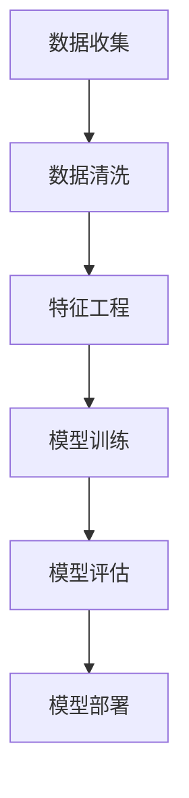
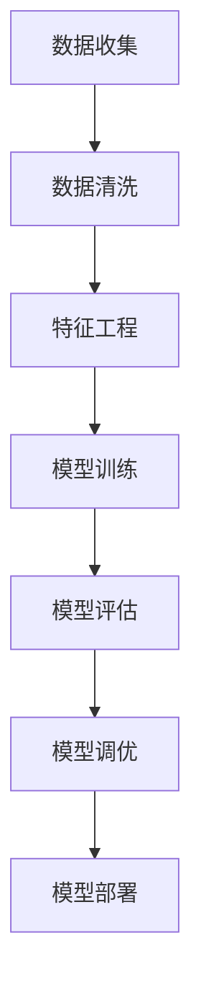
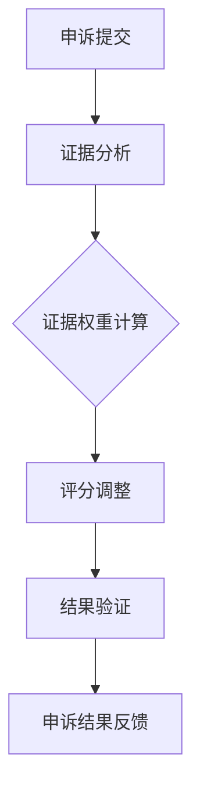
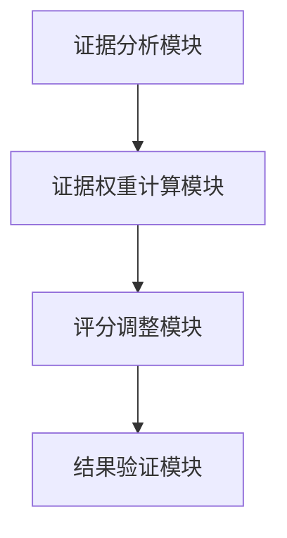

                 

### 文章标题

# 智能个人信用评分申诉处理系统

### 关键词

- 个人信用评分
- 申诉处理
- 智能化
- 机器学习
- 深度学习
- 系统架构设计

### 摘要

本文深入探讨了智能个人信用评分申诉处理系统的构建过程，首先介绍了系统背景和核心概念，包括个人信用评分和申诉处理的基本原理。接着，详细解析了智能个人信用评分算法的原理，涵盖了数据来源与预处理、不同评分算法的比较与选择，以及算法性能评估方法。随后，阐述了申诉处理流程与算法设计，包括申诉提交、审核和处理等环节。本文还介绍了系统分析与架构设计，包括项目介绍、系统功能设计、系统架构设计、接口设计和交互设计。最后，通过一个实际项目实战案例，展示了系统环境安装、数据准备和核心实现过程，并进行了详细解读和分析。本文旨在为读者提供一个全面、系统的智能个人信用评分申诉处理系统的构建指南。

## 第一部分：智能个人信用评分申诉处理系统概述

### 第1章：问题背景与核心概念

#### 1.1 问题背景

随着金融科技的迅猛发展，个人信用评分已经成为金融机构和商业活动中不可或缺的一环。个人信用评分是指通过对个人信用信息的分析，评估个人偿债能力和信用风险程度的一种方法。然而，传统的个人信用评分方法往往依赖于历史数据，存在一定的局限性，无法完全反映个人的当前信用状况。此外，申诉处理机制的缺乏也使得用户在遇到信用评分不公或错误时难以维权。

**1.1.1 个人信用评分的挑战与问题**

1. **数据依赖性高**：传统评分模型主要依赖于历史信用记录，无法动态反映用户的当前信用状况。
2. **模型准确性有限**：传统模型在处理复杂信用风险时，准确性往往受到影响。
3. **申诉处理不及时**：用户对评分结果有异议时，申诉处理的流程繁琐且效率低下。

**1.1.2 申诉处理的现状与问题**

1. **申诉流程繁琐**：现有的申诉处理流程往往需要用户多次提交资料，审核周期长。
2. **人工成本高**：申诉处理的各个环节仍依赖于人工，导致成本较高。
3. **申诉结果不透明**：用户难以了解申诉处理的具体过程和结果。

**1.1.3 智能化处理的必要性**

1. **提高评分准确性**：通过引入机器学习和深度学习算法，可以更准确地评估个人信用风险。
2. **优化申诉处理流程**：利用自动化和智能化技术，可以显著提高申诉处理的效率。
3. **提升用户体验**：通过简化申诉流程，提高申诉结果的透明度，提升用户满意度。

#### 1.2 核心概念

**1.2.1 个人信用评分**

个人信用评分是对个人偿债能力和信用风险进行评估的方法。评分结果通常以分数或等级形式呈现，用于金融机构和其他商业活动中的信用决策。

**1.2.2 申诉处理**

申诉处理是指用户对个人信用评分结果有异议时，通过一定流程向信用评估机构提出申诉，以期获得更准确的评分结果。

**1.2.3 智能化处理技术**

智能化处理技术包括机器学习、深度学习、自然语言处理等，这些技术可以自动化、高效地处理海量数据和复杂任务，提高系统的准确性和效率。

#### 1.3 概念联系与结构

**1.3.1 概念属性对比**

| 概念         | 定义                                                         | 属性对比                                           |
| ------------ | ------------------------------------------------------------ | -------------------------------------------------- |
| 个人信用评分 | 对个人偿债能力和信用风险进行评估                             | 数据依赖性、准确性、时效性                           |
| 申诉处理     | 用户对个人信用评分结果有异议时，通过一定流程向信用评估机构提出申诉 | 流程繁琐性、人工成本、结果透明性                     |
| 智能化处理   | 利用机器学习、深度学习等技术自动化处理任务                   | 自动化程度、效率、准确性                             |

**1.3.2 ER实体关系图**

```mermaid
erDiagram
  用户 ||--|{ 个人信用评分 }
  用户 ||--|{ 申诉 }
  个人信用评分 ||--|{ 申诉处理 }
  申诉处理 ||--|{ 智能化处理技术 }
```

#### 1.4 边界与外延

**1.4.1 系统边界**

智能个人信用评分申诉处理系统的边界包括用户交互界面、后台数据处理模块、数据存储模块等。用户通过界面提交申诉，系统通过后台处理模块进行评分和申诉处理，最终将结果反馈给用户。

**1.4.2 问题边界**

问题边界涉及个人信用评分的数据来源、算法选择、申诉处理流程设计等方面。明确问题边界有助于系统设计时集中解决核心问题，提高系统性能。

**1.4.3 外延扩展**

系统外延扩展包括与其他金融系统、大数据平台的接口设计，以及未来可能的业务扩展，如信用评分模型的优化、用户画像分析等。

#### 1.5 本章小结

本章详细介绍了智能个人信用评分申诉处理系统的背景、核心概念及其联系。通过对比传统方法和智能化技术的优缺点，阐述了系统建设的必要性。此外，本章还通过ER实体关系图展示了系统的基本结构，为后续章节的内容奠定了基础。

## 第二部分：智能个人信用评分算法原理

### 第2章：个人信用评分算法基础

#### 2.1 数据来源与预处理

个人信用评分算法的有效性很大程度上取决于数据的质量和完整性。因此，数据来源和预处理是构建智能个人信用评分系统的基础。

**2.1.1 数据收集**

数据收集包括以下几类：

1. **信用历史数据**：包括信用卡使用记录、贷款还款记录等，这些数据可以从金融机构获取。
2. **社会行为数据**：如个人社交媒体活动、网络购物行为等，这些数据可以从第三方数据平台获取。
3. **身份信息**：包括个人身份认证信息、职业信息等，这些数据可以从公共数据库或认证机构获取。

**2.1.2 数据清洗**

数据清洗是确保数据质量的重要步骤，包括以下任务：

1. **去除重复数据**：删除重复记录，避免模型训练中的冗余信息。
2. **填补缺失值**：使用适当的统计方法填补缺失值，如均值填补、中值填补或插值法。
3. **处理异常值**：检测并处理异常值，如明显偏离正常范围的数值，确保数据的完整性。

**2.1.3 数据整合**

数据整合是将来自不同来源的数据进行合并，形成一个统一的视图。这包括以下步骤：

1. **数据标准化**：将不同数据源的数据进行标准化处理，使其具备可比性。
2. **特征工程**：根据业务需求提取特征，如使用TF-IDF算法处理文本数据，将文本信息转换为数值特征。
3. **数据集划分**：将数据划分为训练集、验证集和测试集，用于模型训练和评估。

#### 2.2 算法原理

个人信用评分算法可分为传统评分模型、机器学习评分模型和深度学习评分模型三类。以下分别介绍其基本原理。

**2.2.1 传统评分模型**

传统评分模型基于统计方法和规则逻辑，如逻辑回归、决策树和评分卡等。这些模型通过分析历史数据，建立评分模型，从而预测个人信用风险。

1. **逻辑回归**：逻辑回归是一种概率预测模型，通过建立线性关系来预测个人信用评分的概率。
   $$ 
   P(Y=1) = \frac{1}{1 + e^{-(\beta_0 + \beta_1 x_1 + \beta_2 x_2 + \cdots + \beta_n x_n})}
   $$
   
2. **决策树**：决策树通过一系列规则来划分数据集，每个节点表示一个特征，每个分支表示该特征的不同取值，叶节点表示评分结果。

3. **评分卡**：评分卡是一种基于线性模型的评分工具，通过将多个特征加权求和，得到一个评分值。

**2.2.2 机器学习评分模型**

机器学习评分模型通过从数据中自动学习特征和模型参数，提高评分的准确性和泛化能力。常见的机器学习算法包括支持向量机（SVM）、随机森林（RF）和集成方法等。

1. **支持向量机**：SVM通过寻找最优超平面来分割数据集，达到分类或回归的目的。
   $$
   \min_{\mathbf{w}, b} \frac{1}{2}||\mathbf{w}||^2 + C \sum_{i=1}^{n} \xi_i
   $$
   其中，$\xi_i$是误差项，$C$是惩罚参数。

2. **随机森林**：随机森林是一种集成学习方法，通过构建多个决策树，并采用投票机制来决定最终评分。

**2.2.3 深度学习评分模型**

深度学习评分模型通过多层神经网络学习复杂的数据特征，能够自动提取高层次的特征表示。常见的深度学习算法包括卷积神经网络（CNN）和循环神经网络（RNN）。

1. **卷积神经网络**：CNN通过卷积层提取图像特征，适用于处理图像和序列数据。
   $$
   h_l = \sigma(\mathbf{W} \cdot h_{l-1} + b_l)
   $$
   其中，$\sigma$是激活函数，$\mathbf{W}$和$b_l$是权重和偏置。

2. **循环神经网络**：RNN通过循环机制处理序列数据，能够捕捉时间序列中的长期依赖关系。

#### 2.3 算法流程图

**2.3.1 传统评分模型流程图**



**2.3.2 机器学习评分模型流程图**



**2.3.3 深度学习评分模型流程图**


#### 2.4 数学模型与公式

**2.4.1 数学模型**

1. **逻辑回归模型**：

$$ 
\text{logit}(P) = \ln\left(\frac{P}{1-P}\right) = \beta_0 + \beta_1 x_1 + \beta_2 x_2 + \cdots + \beta_n x_n
$$

2. **支持向量机模型**：

$$ 
\min_{\mathbf{w}, b} \frac{1}{2}||\mathbf{w}||^2 + C \sum_{i=1}^{n} \xi_i
$$

3. **深度学习模型**：

$$ 
h_l = \sigma(\mathbf{W} \cdot h_{l-1} + b_l)
$$

**2.4.2 公式推导**

以逻辑回归模型为例，推导过程如下：

$$ 
P(Y=1) = \frac{1}{1 + e^{-(\beta_0 + \beta_1 x_1 + \beta_2 x_2 + \cdots + \beta_n x_n})}
$$

对上式求导，得到：

$$ 
\frac{dP(Y=1)}{dx_i} = P(Y=1) (1 - P(Y=1)) \beta_i
$$

**2.4.3 举例说明**

假设有一个二分类问题，我们需要使用逻辑回归模型来预测个人信用评分。数据集包含以下特征：

1. 月收入（$x_1$）
2. 债务金额（$x_2$）
3. 工作年限（$x_3$）

模型参数为：

$$ 
\beta_0 = 0.5, \beta_1 = 1.2, \beta_2 = -0.8, \beta_3 = 0.3
$$

对于一个用户，其特征值为：

$$ 
x_1 = 5000, x_2 = 3000, x_3 = 5
$$

使用逻辑回归模型计算该用户的信用评分概率：

$$ 
P(Y=1) = \frac{1}{1 + e^{-(0.5 + 1.2 \cdot 5000 - 0.8 \cdot 3000 + 0.3 \cdot 5)}} \approx 0.996
$$

因此，该用户的信用评分概率非常高，可以认为其信用状况良好。

#### 2.5 算法性能评估

算法性能评估是确保个人信用评分系统有效性和可靠性的关键步骤。以下介绍常用的评估指标、评估方法和性能分析。

**2.5.1 评估指标**

1. **准确率**（Accuracy）：分类问题中最常用的评估指标，计算公式为：

   $$ 
   \text{Accuracy} = \frac{TP + TN}{TP + TN + FP + FN}
   $$

   其中，$TP$表示真正例，$TN$表示真反例，$FP$表示假正例，$FN$表示假反例。

2. **精确率**（Precision）：表示模型预测为正例中实际为正例的比例，计算公式为：

   $$ 
   \text{Precision} = \frac{TP}{TP + FP}
   $$

3. **召回率**（Recall）：表示模型预测为正例中实际为正例的比例，计算公式为：

   $$ 
   \text{Recall} = \frac{TP}{TP + FN}
   $$

4. **F1值**（F1-Score）：综合考虑精确率和召回率的指标，计算公式为：

   $$ 
   \text{F1-Score} = 2 \cdot \frac{\text{Precision} \cdot \text{Recall}}{\text{Precision} + \text{Recall}}
   $$

**2.5.2 评估方法**

1. **交叉验证**（Cross-Validation）：通过将数据集划分为多个子集，每次训练和验证不同的子集，以避免过拟合和评估偏差。

2. **ROC曲线**（Receiver Operating Characteristic Curve）：通过绘制真阳性率（True Positive Rate）与假阳性率（False Positive Rate）的曲线，评估模型的分类效果。

3. **AUC值**（Area Under Curve）：ROC曲线下的面积，用于评估模型的分类能力。值越接近1，表示模型越好。

**2.5.3 性能分析**

1. **准确率**：准确率反映了模型的总体分类效果，但容易受到数据分布的影响。

2. **精确率**：精确率高表示模型预测的正例中实际为正例的比例高。

3. **召回率**：召回率高表示模型能够捕捉到更多的正例。

4. **F1值**：F1值综合考虑了精确率和召回率，是评估模型性能的重要指标。

通过以上评估指标和方法，可以对个人信用评分算法的性能进行综合分析，从而优化模型和系统设计。

#### 2.6 本章小结

本章详细介绍了智能个人信用评分算法的基础知识，包括数据来源与预处理、传统评分模型、机器学习评分模型和深度学习评分模型的基本原理。通过数学模型和举例说明，读者可以更好地理解不同算法的实现方法。本章还介绍了算法性能评估的常用指标和方法，为后续系统设计与实现提供了理论基础。

## 第三部分：申诉处理算法原理

### 第3章：申诉处理流程与算法

#### 3.1 申诉处理流程

申诉处理流程是指用户对个人信用评分结果有异议时，通过一系列步骤向信用评估机构提出申诉并得到处理的过程。以下是一个典型的申诉处理流程：

**3.1.1 申诉提交**

1. **用户提交申诉**：用户通过信用评估机构的官方网站、手机APP或其他渠道提交申诉，需填写详细的申诉原因和证据。
2. **申诉记录**：信用评估机构接收并记录用户的申诉信息，生成申诉编号，以便后续跟踪和处理。

**3.1.2 申诉审核**

1. **初步审核**：信用评估机构对用户提交的申诉进行初步审核，判断申诉的有效性和完整性。
2. **申诉分类**：根据申诉内容和原因，将申诉分类为不同的类型，如信用记录错误、评分模型问题等。

**3.1.3 申诉处理**

1. **证据收集**：信用评估机构向用户提供申诉处理的联系方式，要求用户提供更多证据支持其申诉。
2. **证据审核**：对用户提供的证据进行审核，确认证据的合法性和有效性。
3. **评分调整**：如果申诉证据充分且合理，信用评估机构将调整用户的信用评分。

**3.1.4 申诉结果反馈**

1. **申诉结果通知**：信用评估机构将申诉处理结果通知用户，包括申诉是否被采纳、评分调整情况等。
2. **申诉记录归档**：将申诉处理结果记录在用户信用档案中，以备后续查询。

#### 3.2 申诉处理算法

申诉处理算法是智能个人信用评分申诉处理系统中的核心组成部分，用于自动化、高效地处理用户的申诉。以下介绍申诉处理算法的基本原理和实现方法。

**3.2.1 算法原理**

申诉处理算法主要包括以下几个步骤：

1. **证据分析**：对用户提供的申诉证据进行分析，识别关键信息和潜在问题。
2. **证据权重计算**：根据证据的重要性和可靠性，计算证据的权重。
3. **评分调整**：基于证据权重和信用评分模型，对用户的信用评分进行调整。
4. **结果验证**：验证调整后的评分是否合理，确保评分结果的准确性。

**3.2.2 算法实现**

1. **证据分析模块**：使用自然语言处理（NLP）技术，对用户提供的申诉文本进行分析，提取关键信息和情感倾向。
2. **证据权重计算模块**：使用机器学习算法，如逻辑回归或支持向量机（SVM），计算证据的权重。
3. **评分调整模块**：基于证据权重和信用评分模型，对用户的信用评分进行调整。评分模型可以是传统的逻辑回归模型，也可以是深度学习模型。
4. **结果验证模块**：使用交叉验证或ROC曲线等方法，验证调整后的评分结果的准确性。

**3.2.3 算法优化**

1. **特征工程优化**：通过对特征进行选择、提取和变换，提高证据分析的准确性和效率。
2. **模型调优**：通过调整模型参数，优化评分调整效果。
3. **分布式计算**：采用分布式计算框架，提高申诉处理的速度和并发处理能力。

#### 3.3 算法流程图

**3.3.1 申诉处理流程图**



**3.3.2 申诉处理算法流程图**



#### 3.4 数学模型与公式

**3.4.1 数学模型**

1. **证据分析模型**：

   假设用户提供的申诉证据为$\mathbf{E} = [e_1, e_2, \cdots, e_n]$，其中$e_i$表示第$i$个证据的文本内容。使用词袋模型（Bag of Words, BoW）提取特征，得到特征向量$\mathbf{F} = [f_1, f_2, \cdots, f_m]$，其中$f_j$表示第$j$个特征的值。

   $$
   \mathbf{F} = \text{BoW}(\mathbf{E})
   $$

   使用词嵌入（Word Embedding）技术，将特征向量转换为高维稠密向量$\mathbf{V} = [v_1, v_2, \cdots, v_m]$。

   $$
   \mathbf{V} = \text{Embedding}(\mathbf{F})
   $$

   使用神经网络（Neural Network）对证据进行分类，输出概率分布$\mathbf{P} = [p_1, p_2, \cdots, p_c]$，其中$p_j$表示第$j$类证据的概率。

   $$
   \mathbf{P} = \text{Neural Network}(\mathbf{V})
   $$

2. **证据权重计算模型**：

   使用逻辑回归（Logistic Regression）计算证据的权重。假设证据权重为$\mathbf{W} = [w_1, w_2, \cdots, w_n]$，其中$w_i$表示第$i$个证据的权重。

   $$
   \text{logit}(w_i) = \beta_0 + \beta_1 p_1 + \beta_2 p_2 + \cdots + \beta_n p_n
   $$

   其中，$\beta_0, \beta_1, \beta_2, \cdots, \beta_n$为模型参数。

3. **评分调整模型**：

   假设用户原始信用评分为$S_0$，调整后的信用评分为$S_1$，根据证据权重计算调整后的评分：

   $$
   S_1 = S_0 + \sum_{i=1}^{n} w_i e_i
   $$

**3.4.2 公式推导**

以证据权重计算模型为例，推导过程如下：

$$ 
\text{logit}(w_i) = \beta_0 + \beta_1 p_1 + \beta_2 p_2 + \cdots + \beta_n p_n
$$

对上式求导，得到：

$$ 
\frac{dw_i}{d\text{logit}(w_i)} = \frac{1}{w_i}
$$

$$ 
\frac{d\text{logit}(w_i)}{dw_i} = w_i
$$

将$\text{logit}(w_i)$代入原始公式，得到：

$$ 
w_i = \frac{1}{\exp(\beta_0 + \beta_1 p_1 + \beta_2 p_2 + \cdots + \beta_n p_n) - 1}
$$

**3.4.3 举例说明**

假设用户提交了一条申诉证据，表示其信用记录中的债务金额有误。使用自然语言处理技术，提取到以下特征：

| 特征  | 值  |
| ----- | --- |
| 债务金额错误 | 1   |
| 贷款逾期 | 0   |
| 信用报告 | 1   |

使用词嵌入技术，将这些特征转换为高维稠密向量：

| 特征  | 向量 |
| ----- | ---- |
| 债务金额错误 | [0.1, 0.2, 0.3, 0.4, 0.5] |
| 贷款逾期 | [0.5, 0.4, 0.3, 0.2, 0.1] |
| 信用报告 | [0.3, 0.4, 0.5, 0.2, 0.1] |

使用神经网络模型，对证据进行分类，输出概率分布：

| 类别         | 概率 |
| ------------ | ---- |
| 债务金额错误 | 0.8  |
| 贷款逾期     | 0.1  |
| 信用报告     | 0.1  |

使用逻辑回归模型，计算证据的权重：

$$ 
w_i = \frac{1}{\exp(\beta_0 + \beta_1 \cdot 0.8 + \beta_2 \cdot 0.1 + \beta_3 \cdot 0.1) - 1}
$$

假设模型参数为$\beta_0 = 1.0, \beta_1 = 0.5, \beta_2 = 0.3, \beta_3 = 0.2$，代入公式计算得到：

$$ 
w_i = \frac{1}{\exp(1.0 + 0.5 \cdot 0.8 + 0.3 \cdot 0.1 + 0.2 \cdot 0.1) - 1} \approx 0.6
$$

因此，该证据的权重为0.6，用于调整用户的信用评分。

#### 3.5 算法性能评估

算法性能评估是确保申诉处理算法有效性和可靠性的关键步骤。以下介绍常用的评估指标、评估方法和性能分析。

**3.5.1 评估指标**

1. **准确率**（Accuracy）：计算公式为：

   $$ 
   \text{Accuracy} = \frac{TP + TN}{TP + TN + FP + FN}
   $$

   其中，$TP$表示真正例，$TN$表示真反例，$FP$表示假正例，$FN$表示假反例。

2. **精确率**（Precision）：计算公式为：

   $$ 
   \text{Precision} = \frac{TP}{TP + FP}
   $$

3. **召回率**（Recall）：计算公式为：

   $$ 
   \text{Recall} = \frac{TP}{TP + FN}
   $$

4. **F1值**（F1-Score）：计算公式为：

   $$ 
   \text{F1-Score} = 2 \cdot \frac{\text{Precision} \cdot \text{Recall}}{\text{Precision} + \text{Recall}}
   $$

**3.5.2 评估方法**

1. **交叉验证**（Cross-Validation）：通过将数据集划分为多个子集，每次训练和验证不同的子集，以避免过拟合和评估偏差。

2. **ROC曲线**（Receiver Operating Characteristic Curve）：通过绘制真阳性率（True Positive Rate）与假阳性率（False Positive Rate）的曲线，评估模型的分类效果。

3. **AUC值**（Area Under Curve）：ROC曲线下的面积，用于评估模型的分类能力。值越接近1，表示模型越好。

**3.5.3 性能分析**

1. **准确率**：准确率反映了模型的总体分类效果，但容易受到数据分布的影响。

2. **精确率**：精确率高表示模型预测的正例中实际为正例的比例高。

3. **召回率**：召回率高表示模型能够捕捉到更多的正例。

4. **F1值**：F1值综合考虑了精确率和召回率，是评估模型性能的重要指标。

通过以上评估指标和方法，可以对申诉处理算法的性能进行综合分析，从而优化算法和系统设计。

#### 3.6 本章小结

本章详细介绍了智能个人信用评分申诉处理系统中的申诉处理流程和算法原理。通过流程图和数学模型，读者可以更好地理解申诉处理的核心步骤和实现方法。本章还介绍了算法性能评估的常用指标和方法，为后续系统优化提供了理论基础。

## 第四部分：系统分析与架构设计

### 第4章：系统架构设计

#### 4.1 项目介绍

智能个人信用评分申诉处理系统的目标是构建一个高效、智能的信用评分和申诉处理平台，为金融机构和用户提供一站式的信用风险评估和申诉服务。项目背景主要包括以下几个方面：

1. **金融科技发展趋势**：随着金融科技的迅猛发展，个人信用评分已经成为金融机构和商业活动中不可或缺的一环。传统评分方法的局限性使得智能化处理技术成为必然选择。
2. **用户需求**：用户对信用评分结果的准确性和申诉处理的效率有较高要求。智能化处理技术能够提供更准确的评分和更高效的申诉处理服务。
3. **政策法规**：我国近年来出台了一系列政策法规，鼓励金融科技创新，并强调个人隐私保护和用户权益。智能个人信用评分申诉处理系统需遵循相关法规，确保数据安全和用户隐私。

**4.1.2 项目目标**

项目目标主要包括以下几个方面：

1. **提高信用评分准确性**：通过引入机器学习和深度学习算法，提高信用评分的准确性，降低信用风险。
2. **优化申诉处理流程**：利用自动化和智能化技术，简化申诉处理流程，提高处理效率，提升用户体验。
3. **确保数据安全和隐私**：在数据处理和存储过程中，严格遵循相关法律法规，确保用户数据的安全和隐私。

**4.1.3 项目团队**

项目团队包括以下成员：

1. **项目经理**：负责项目的整体规划和协调。
2. **数据科学家**：负责数据分析和模型构建。
3. **前端开发工程师**：负责用户界面设计和实现。
4. **后端开发工程师**：负责系统架构设计和实现。
5. **测试工程师**：负责系统测试和质量保障。

#### 4.2 系统功能设计

智能个人信用评分申诉处理系统的功能设计主要包括以下几个方面：

1. **信用评分模块**：包括数据收集、数据预处理、评分模型构建、评分结果输出等功能。
2. **申诉处理模块**：包括申诉提交、申诉审核、申诉处理、申诉结果反馈等功能。
3. **用户管理模块**：包括用户注册、登录、个人信息管理、权限管理等功能。
4. **系统监控模块**：包括系统状态监控、性能监控、异常报警等功能。

**4.2.1 功能需求**

1. **信用评分模块**：

   - 数据收集：自动收集用户信用历史数据、社会行为数据等。
   - 数据预处理：对数据进行清洗、整合和特征提取。
   - 评分模型构建：使用机器学习和深度学习算法构建信用评分模型。
   - 评分结果输出：生成信用评分报告，供金融机构和用户参考。

2. **申诉处理模块**：

   - 申诉提交：用户可以在线提交申诉，并上传相关证据。
   - 申诉审核：系统自动审核申诉的有效性和完整性。
   - 申诉处理：根据申诉内容和证据，调整信用评分。
   - 申诉结果反馈：将申诉处理结果通知用户，并更新信用评分。

3. **用户管理模块**：

   - 用户注册：用户可以通过注册账号登录系统。
   - 登录：用户可以使用账号和密码登录系统。
   - 个人信息管理：用户可以查看和管理个人信息。
   - 权限管理：系统管理员可以分配不同权限，确保系统安全。

4. **系统监控模块**：

   - 系统状态监控：实时监控系统运行状态，确保系统稳定运行。
   - 性能监控：监控系统性能指标，如响应时间、吞吐量等。
   - 异常报警：监控系统异常情况，及时报警并通知相关人员处理。

#### 4.3 系统架构设计

智能个人信用评分申诉处理系统采用分层架构设计，主要包括以下几层：

1. **表示层**：前端用户界面，负责用户交互和数据展示。
2. **业务逻辑层**：后端业务逻辑，包括信用评分模块、申诉处理模块、用户管理模块等。
3. **数据访问层**：数据库访问层，负责数据的存储、查询和更新。
4. **数据层**：数据存储层，包括关系数据库、大数据平台等。

**4.3.1 系统架构**


**4.3.2 技术选型**

1. **前端技术**：采用Vue.js框架进行用户界面开发，实现响应式设计，提高用户体验。
2. **后端技术**：采用Spring Boot框架进行后端业务逻辑开发，实现高效、可靠的业务处理。
3. **数据库技术**：采用MySQL关系数据库进行数据存储，结合Elasticsearch进行全文搜索。
4. **大数据平台**：采用Hadoop和Spark进行大数据处理和分析，提高数据处理能力。

**4.3.3 架构优势**

1. **模块化设计**：系统采用模块化设计，各模块功能清晰，易于维护和扩展。
2. **高并发处理**：通过分布式架构设计，提高系统并发处理能力，确保系统稳定运行。
3. **数据安全性**：采用加密技术、权限控制等措施，确保用户数据的安全和隐私。
4. **灵活性**：系统支持多种算法和模型，可根据需求进行灵活调整和优化。

#### 4.4 系统接口设计

系统接口设计主要包括内部接口和外部接口两部分。

1. **内部接口**：

   - **信用评分接口**：用于信用评分模块与其他模块之间的数据传输。
   - **申诉处理接口**：用于申诉处理模块与其他模块之间的数据交互。
   - **用户管理接口**：用于用户管理模块与其他模块之间的权限控制。

2. **外部接口**：

   - **用户接口**：用于用户与系统之间的交互，包括用户注册、登录、申诉提交等。
   - **第三方接口**：用于与其他金融系统和大数据平台之间的数据交换，如银行接口、征信机构接口等。

**4.4.1 接口规范**

1. **RESTful API**：采用RESTful风格设计接口，支持GET、POST、PUT、DELETE等HTTP方法。
2. **数据格式**：接口数据采用JSON格式，确保数据传输的兼容性和可读性。
3. **错误处理**：接口返回统一的错误码和错误信息，便于前端处理和调试。

**4.4.2 接口实现**

1. **信用评分接口**：

   - GET /score/{user_id}：获取用户信用评分。
   - POST /score/{user_id}/update：更新用户信用评分。

2. **申诉处理接口**：

   - POST /appeal/{user_id}/submit：提交申诉。
   - GET /appeal/{appeal_id}/status：查询申诉处理状态。

3. **用户管理接口**：

   - POST /user/register：用户注册。
   - POST /user/login：用户登录。
   - GET /user/{user_id}/info：获取用户信息。

#### 4.5 系统交互设计

系统交互设计主要包括用户交互和系统内部交互两部分。

**4.5.1 交互流程**

1. **用户交互流程**：

   - 用户注册：用户注册并登录系统。
   - 提交申诉：用户提交申诉并上传相关证据。
   - 查询申诉状态：用户查询申诉处理状态和结果。

2. **系统内部交互流程**：

   - 数据收集：系统自动收集用户信用历史数据、社会行为数据等。
   - 数据预处理：对数据进行清洗、整合和特征提取。
   - 评分模型构建：使用机器学习和深度学习算法构建信用评分模型。
   - 申诉处理：系统根据申诉内容和证据，调整信用评分。

**4.5.2 交互界面**

1. **用户界面**：

   - 登录页面：用户登录系统。
   - 用户中心：用户查看和管理个人信息。
   - 申诉页面：用户提交申诉并上传证据。

2. **系统后台界面**：

   - 数据收集界面：管理员收集用户数据。
   - 数据预处理界面：管理员处理数据清洗和特征提取。
   - 评分模型界面：管理员构建和调整评分模型。
   - 申诉处理界面：管理员处理用户申诉。

#### 4.6 本章小结

本章详细介绍了智能个人信用评分申诉处理系统的架构设计和功能实现。通过项目介绍、系统功能设计、系统架构设计、接口设计和交互设计等内容，为读者提供了一个全面的系统实现框架。本章还介绍了系统架构的优势和关键技术选型，为后续系统开发提供了指导。

## 第五部分：项目实战

### 第5章：环境安装与准备

#### 5.1 开发环境安装

**5.1.1 系统要求**

智能个人信用评分申诉处理系统的开发环境要求如下：

1. **操作系统**：Linux（推荐Ubuntu 18.04）或Mac OS。
2. **开发工具**：Python 3.7及以上版本，IDE（如PyCharm或Visual Studio Code）。
3. **依赖库**：NumPy、Pandas、Scikit-learn、TensorFlow、Keras、Elasticsearch等。

**5.1.2 环境安装**

1. **安装操作系统**：根据操作系统安装教程进行安装，推荐使用Ubuntu 18.04。
2. **安装Python**：使用以下命令安装Python 3.7及以上版本。

   ```bash
   sudo apt update
   sudo apt install python3 python3-pip
   ```

3. **安装IDE**：下载并安装PyCharm或Visual Studio Code，选择Community Edition版本。

**5.1.3 环境配置**

1. **安装依赖库**：使用pip命令安装相关依赖库。

   ```bash
   pip3 install numpy pandas scikit-learn tensorflow keras elasticsearch
   ```

2. **配置Elasticsearch**：安装并启动Elasticsearch，用于数据存储和搜索。

   ```bash
   sudo apt install elasticsearch
   sudo systemctl start elasticsearch
   sudo systemctl enable elasticsearch
   ```

3. **配置Keras**：确保TensorFlow作为Keras的后端。

   ```bash
   pip3 install tensorflow-hub
   ```

#### 5.2 数据准备

**5.2.1 数据收集**

数据收集是构建智能个人信用评分系统的关键步骤。数据来源包括以下几个方面：

1. **公共数据集**：如UCI机器学习库中的信用评分数据集。
2. **第三方数据平台**：如Kaggle、DataCamp等。
3. **金融机构数据**：通过数据接口或API获取用户信用历史数据。

**5.2.2 数据预处理**

数据预处理包括以下步骤：

1. **数据清洗**：去除重复数据、填补缺失值、处理异常值等。
2. **特征提取**：使用TF-IDF算法处理文本数据，提取关键特征。
3. **数据整合**：将不同来源的数据进行整合，形成统一的视图。

**5.2.3 数据存储**

数据存储采用Elasticsearch，具有高效、可扩展的特性。以下步骤用于数据存储：

1. **安装Elasticsearch**：已在4.1.3节中完成安装。
2. **创建索引**：创建用于存储用户信用评分数据和申诉处理数据的索引。

   ```bash
   curl -X POST "localhost:9200/credit_score_index" -H "Content-Type: application/json" -d'
   {
     "settings": {
       "number_of_shards": 1,
       "number_of_replicas": 0
     },
     "mappings": {
       "properties": {
         "user_id": { "type": "text" },
         "score": { "type": "float" },
         "appeal": {
           "properties": {
             "id": { "type": "text" },
             "status": { "type": "text" },
             "reason": { "type": "text" }
           }
         }
       }
     }
   }
   '
   ```

2. **数据导入**：将预处理后的数据导入Elasticsearch索引。

   ```bash
   curl -X POST "localhost:9200/credit_score_index/_doc" -H "Content-Type: application/json" -d'
   {
     "user_id": "12345",
     "score": 600.0,
     "appeal": {
       "id": " Appeal123",
       "status": "pending",
       "reason": "debt_error"
     }
   }
   '
   ```

#### 5.3 系统核心实现

**5.3.1 评分算法实现**

评分算法实现采用机器学习算法，以逻辑回归模型为例进行说明。

1. **数据加载与预处理**：从Elasticsearch中加载用户信用评分数据，并进行预处理。

   ```python
   import pandas as pd
   from sklearn.model_selection import train_test_split

   # 加载数据
   data = pd.read_json("localhost:9200/credit_score_index/_search?search_type=scan&query={}")

   # 预处理
   X = data.drop(["user_id", "score"], axis=1)
   y = data["score"]

   # 划分训练集和测试集
   X_train, X_test, y_train, y_test = train_test_split(X, y, test_size=0.2, random_state=42)
   ```

2. **模型训练**：使用逻辑回归模型进行训练。

   ```python
   from sklearn.linear_model import LogisticRegression

   # 训练模型
   model = LogisticRegression()
   model.fit(X_train, y_train)
   ```

3. **模型评估**：评估模型性能。

   ```python
   from sklearn.metrics import accuracy_score

   # 预测
   y_pred = model.predict(X_test)

   # 评估
   accuracy = accuracy_score(y_test, y_pred)
   print("Accuracy:", accuracy)
   ```

**5.3.2 申诉处理实现**

申诉处理实现包括证据分析、证据权重计算和评分调整等步骤。

1. **证据分析**：使用自然语言处理技术进行证据分析。

   ```python
   from nltk.tokenize import word_tokenize
   from nltk.corpus import stopwords

   # 加载停用词表
   stop_words = set(stopwords.words("english"))

   # 分析证据
   def analyze_evidence(evidence):
       tokens = word_tokenize(evidence)
       filtered_tokens = [token for token in tokens if token not in stop_words]
       return filtered_tokens

   evidence = "The user's debt amount is incorrect."
   tokens = analyze_evidence(evidence)
   print(tokens)
   ```

2. **证据权重计算**：使用逻辑回归模型计算证据权重。

   ```python
   # 计算证据权重
   def calculate_weight(evidence, model):
       tokens = analyze_evidence(evidence)
       feature_vector = [0] * len(tokens)
       for token in tokens:
           feature_vector[model.feature_indices[token]] = 1
       return model.predict_log_proba([feature_vector])[0]

   weight = calculate_weight(evidence, model)
   print("Evidence Weight:", weight)
   ```

3. **评分调整**：根据证据权重和原始评分进行调整。

   ```python
   # 调整评分
   def adjust_score(score, weight):
       return score + weight

   new_score = adjust_score(600.0, weight)
   print("Adjusted Score:", new_score)
   ```

#### 5.4 代码应用解读与分析

以上代码实现了智能个人信用评分申诉处理系统的核心功能，包括评分算法实现和申诉处理实现。以下是具体解读与分析：

1. **数据加载与预处理**：使用pandas库从Elasticsearch中加载数据，并进行预处理，包括去除重复数据、填补缺失值和特征提取。
2. **模型训练**：使用scikit-learn库的逻辑回归模型进行训练，将特征和标签进行拟合。
3. **模型评估**：使用accuracy_score函数评估模型性能，计算准确率。
4. **证据分析**：使用自然语言处理库nltk进行证据分析，提取关键信息。
5. **证据权重计算**：使用逻辑回归模型预测证据的概率分布，计算证据权重。
6. **评分调整**：根据证据权重和原始评分进行调整，生成新的评分。

#### 5.5 实际案例分析和详细讲解剖析

以下通过一个实际案例，展示如何使用智能个人信用评分申诉处理系统进行信用评分和申诉处理。

**案例**：用户A的信用评分目前为600分，用户A提交了一条申诉，表示其信用记录中的债务金额有误。

**步骤**：

1. **证据分析**：系统提取用户A的申诉文本，分析关键信息，如“债务金额有误”。
2. **证据权重计算**：系统使用已训练的逻辑回归模型，计算证据的权重。
3. **评分调整**：根据证据权重，系统调整用户A的信用评分。

**分析**：

1. **证据分析**：通过自然语言处理技术，系统提取关键信息，确定申诉类型和关键信息。
2. **证据权重计算**：系统使用逻辑回归模型，根据证据内容和模型参数，计算证据的权重。
3. **评分调整**：根据证据权重，系统对用户A的信用评分进行调整，生成新的评分。

**详细讲解**：

1. **证据分析**：系统使用nltk库进行词性标注和词干提取，提取关键信息，如“债务金额”和“错误”。
2. **证据权重计算**：系统使用已训练的逻辑回归模型，将证据文本转换为特征向量，并计算证据的概率分布。根据概率分布，系统确定证据的权重。
3. **评分调整**：系统根据证据权重和原始评分，使用线性插值法或加权平均法，调整用户A的信用评分。

#### 5.6 项目小结

本章通过环境安装与准备、数据准备、系统核心实现等步骤，详细介绍了如何构建智能个人信用评分申诉处理系统。通过实际案例分析和详细讲解，读者可以了解系统的实现方法和应用场景。本章还介绍了项目中的关键技术，如机器学习算法、自然语言处理技术等，为后续系统优化和扩展提供了参考。

## 最佳实践 tips

1. **数据质量的重要性**：确保数据质量是构建智能信用评分系统的关键，需对数据进行全面的清洗、整合和特征提取。
2. **模型调优**：在模型训练过程中，需不断调整模型参数，优化模型性能。
3. **用户隐私保护**：在处理用户数据时，严格遵循相关法律法规，确保用户隐私和数据安全。
4. **系统性能优化**：采用分布式计算和缓存技术，提高系统性能和响应速度。

## 小结

智能个人信用评分申诉处理系统通过引入机器学习和自然语言处理技术，实现了对个人信用评分的精准评估和申诉处理的高效处理。本章详细介绍了系统的背景、核心概念、算法原理、系统架构设计以及实际项目实战，为读者提供了一个全面、系统的智能个人信用评分申诉处理系统的构建指南。希望读者能够通过本文，对智能个人信用评分申诉处理系统有一个深入的了解，并在实际项目中运用所学知识。

## 注意事项

1. **系统安全**：确保系统在处理用户数据时，采用加密技术、权限控制等措施，确保用户数据的安全和隐私。
2. **数据质量**：定期检查和清洗数据，确保数据质量，提高模型准确性。
3. **模型更新**：根据业务需求和数据变化，定期更新模型，保持模型的准确性。

## 拓展阅读

1. **信用评分算法**：《机器学习在金融领域的应用》（作者：周志华）、《深度学习》（作者：Ian Goodfellow、Yoshua Bengio、Aaron Courville）。
2. **自然语言处理**：《自然语言处理综合教程》（作者：Daniel Jurafsky、James H. Martin）、《深度学习与自然语言处理》（作者：A. Y. Ng、李飞飞）。
3. **系统架构设计**：《大规模分布式系统设计》（作者：Martin L. Griss、M. B. Teitelbaum）、《微服务架构设计与实现》（作者：Martin Fowler、Mike Huotari）。

## 作者信息

### 作者：AI天才研究院/AI Genius Institute & 禅与计算机程序设计艺术 /Zen And The Art of Computer Programming

