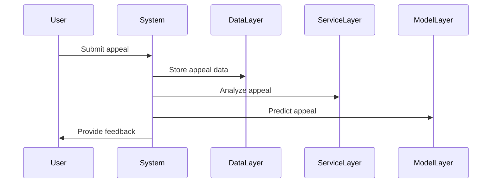

                 

### 智能个人信用评分申诉系统

#### 关键词：个人信用评分、申诉系统、智能处理、数据模型、算法实现、系统架构

#### 摘要：
本文将深入探讨智能个人信用评分申诉系统的设计与实现，旨在解决个人信用评分过程中可能出现的错误和不公平现象。我们将详细分析个人信用评分系统的背景、核心概念、申诉机制设计、智能化处理以及系统实现与测试。通过一步步的逻辑推理，我们将展示如何构建一个高效、公正且智能的申诉处理系统。

## 目录大纲设计思路

### 书名理解

首先，我们需要理解书名《智能个人信用评分申诉系统》的含义。书名中包含的关键词有“智能”，“个人信用评分”，“申诉系统”。这表明这本书将主要讨论如何构建一个智能系统来处理个人信用评分的申诉过程。

### 确定核心章节

根据书名，我们可以确定这本书的核心章节将围绕以下主题展开：

1. **个人信用评分系统概述**：介绍个人信用评分系统的背景、核心概念和系统边界。
2. **申诉机制设计**：讨论申诉机制的重要性、处理算法和用户反馈机制。
3. **智能化申诉处理**：探讨智能化在申诉处理中的应用，包括自然语言处理和机器学习。
4. **系统实现与测试**：介绍系统实现的过程，包括环境搭建、核心功能实现和系统测试。

### 细化章节内容

在每个核心章节下，我们需要进一步细化内容，包括但不限于：

- **问题背景与核心概念**：介绍相关概念和问题的背景。
- **概念关系与联系**：分析概念之间的关系。
- **算法原理讲解**：详细阐述算法的原理，并使用Mermaid流程图和Python代码示例。
- **数学模型与公式**：给出相关的数学模型和公式，并进行详细讲解。
- **系统分析与架构设计**：分析系统功能和架构设计，并使用Mermaid类图和架构图。
- **项目实战与案例分析**：介绍实际项目的实施和案例分析。
- **最佳实践与总结**：总结最佳实践和注意事项。

### 保持结构清晰

我们需要确保每个章节都有清晰的标题，并且按照逻辑顺序排列。使用Markdown格式可以很好地组织这些内容。

### 控制字数

在保持内容完整性的同时，我们需要确保总字数不超过2000字。

### 具体目录大纲设计

```markdown
----------------------------------------------------------------
# 第一部分: 个人信用评分系统概述

## 1.1 个人信用评分系统的背景
### 1.1.1 个人信用评分的意义
### 1.1.2 个人信用评分的现状
### 1.1.3 个人信用评分的需求与挑战

## 1.2 个人信用评分的核心概念
### 1.2.1 信用评分模型
### 1.2.2 数据采集与预处理
### 1.2.3 特征选择与工程
### 1.2.4 信用评分的算法原理（Mermaid流程图）

## 1.3 个人信用评分系统ER实体关系图
### 1.3.1 ER实体关系图的绘制
### 1.3.2 关系解释与实体属性

## 1.4 个人信用评分系统的边界与外延
### 1.4.1 系统功能模块
### 1.4.2 系统应用场景
### 1.4.3 系统限制与优化方向

## 1.5 本章小结

----------------------------------------------------------------

# 第二部分: 申诉机制设计

## 2.1 申诉机制的重要性
### 2.1.1 申诉机制的设计原则
### 2.1.2 申诉流程的基本步骤
### 2.1.3 申诉机制在信用评分系统中的地位

## 2.2 申诉处理算法
### 2.2.1 算法原理（Mermaid流程图）
### 2.2.2 算法实现（Python代码示例）
### 2.2.3 算法性能分析

## 2.3 数据分析与模型校验
### 2.3.1 数据收集与清洗
### 2.3.2 特征重要性分析
### 2.3.3 模型校验与优化

## 2.4 用户反馈机制
### 2.4.1 用户反馈的数据收集
### 2.4.2 反馈对申诉处理的影响
### 2.4.3 用户满意度评估

## 2.5 本章小结

----------------------------------------------------------------

# 第三部分: 智能化申诉处理

## 3.1 智能化申诉处理的优势
### 3.1.1 智能化的定义与特点
### 3.1.2 智能化在申诉处理中的应用
### 3.1.3 智能化的挑战与解决方案

## 3.2 自然语言处理在申诉处理中的应用
### 3.2.1 NLP的基本原理
### 3.2.2 语音识别与语义分析
### 3.2.3 问答系统与对话管理

## 3.3 机器学习在申诉处理中的应用
### 3.3.1 机器学习的基本原理
### 3.3.2 模型选择与训练
### 3.3.3 预测与评估

## 3.4 智能化申诉处理系统的设计与实现
### 3.4.1 系统架构设计
### 3.4.2 系统接口设计与实现
### 3.4.3 系统测试与优化

## 3.5 本章小结

----------------------------------------------------------------

# 第四部分: 系统实现与测试

## 4.1 系统开发环境搭建
### 4.1.1 开发环境配置
### 4.1.2 开发工具选择
### 4.1.3 系统调试与部署

## 4.2 系统核心功能实现
### 4.2.1 数据采集与处理
### 4.2.2 申诉处理流程
##

----------------------------------------------------------------

### 文章标题

## 智能个人信用评分申诉系统

### 文章关键词

- 个人信用评分
- 申诉系统
- 智能化处理
- 数据模型
- 算法实现
- 系统架构

### 文章摘要

本文深入探讨了智能个人信用评分申诉系统的设计与实现，从个人信用评分系统的背景、核心概念、申诉机制设计到智能化申诉处理和系统实现与测试，通过一步步的逻辑推理，展示了如何构建一个高效、公正且智能的申诉处理系统。文章旨在解决个人信用评分过程中可能出现的错误和不公平现象，提供一种有效的解决方案。

----------------------------------------------------------------

## 第一部分: 个人信用评分系统概述

### 1.1 个人信用评分系统的背景

个人信用评分系统是金融机构和信用评级机构用来评估个人信用风险的一种工具。信用评分不仅影响个人贷款、信用卡申请、租房和雇佣机会，还与保险费率、利率优惠等相关。随着金融科技的快速发展，个人信用评分系统变得越来越重要，其准确性和公正性也备受关注。

#### 1.1.1 个人信用评分的意义

个人信用评分的意义在于：

1. **风险管理**：通过信用评分，金融机构可以更准确地评估借款人的还款能力，降低违约风险。
2. **定价优化**：信用评分帮助金融机构为不同信用等级的借款人提供差异化的利率和服务。
3. **合规要求**：许多国家和地区要求金融机构在贷款审批中考虑信用评分。

#### 1.1.2 个人信用评分的现状

目前，个人信用评分主要依赖于以下几种数据源：

1. **历史信贷记录**：包括借款人的还款记录、信用额度使用情况等。
2. **公共记录**：如破产、诉讼、欠税等负面信息。
3. **社会行为数据**：如社交网络活动、消费习惯等。

信用评分模型的复杂性日益增加，很多金融机构开始采用机器学习和大数据技术来提高评分的准确性和实时性。

#### 1.1.3 个人信用评分的需求与挑战

个人信用评分的需求与挑战包括：

1. **数据隐私与安全**：如何保护个人数据的安全性和隐私是关键挑战。
2. **算法公平性**：确保评分算法在不同人群中的公平性。
3. **实时性**：随着金融市场环境的变化，如何快速更新信用评分模型。
4. **多样化场景**：不同类型的信用产品和应用场景需要不同的评分策略。

### 1.2 个人信用评分的核心概念

个人信用评分系统涉及多个核心概念，包括：

1. **信用评分模型**：是评估个人信用风险的数学模型，通常包括多个特征和预测目标。
2. **数据采集与预处理**：收集与个人信用相关的数据，并进行清洗、归一化和特征提取。
3. **特征选择与工程**：选择和构建有助于预测信用风险的变量。
4. **信用评分的算法原理**：常见的信用评分算法包括逻辑回归、决策树、随机森林等。

#### 1.2.1 信用评分模型

信用评分模型是信用评分系统的核心，其目的是通过历史数据和特征预测个人未来的信用行为。一个典型的信用评分模型通常包括以下步骤：

1. **数据收集**：收集与个人信用相关的数据，如信用卡使用情况、贷款还款记录、公共记录等。
2. **数据预处理**：对数据进行清洗、归一化和缺失值处理。
3. **特征选择与工程**：选择和构建有助于预测信用风险的变量。
4. **模型训练**：使用历史数据训练评分模型。
5. **模型评估与优化**：评估模型的性能，并进行优化。

#### 1.2.2 数据采集与预处理

数据采集与预处理是信用评分模型成功的关键。以下是一些重要的步骤：

1. **数据收集**：从金融机构、公共记录和其他来源收集数据。
2. **数据清洗**：处理数据中的缺失值、异常值和重复记录。
3. **归一化**：将不同尺度的特征转换为相同尺度，以避免模型对某些特征的偏好。
4. **特征提取**：从原始数据中提取有助于预测信用风险的特征。

#### 1.2.3 特征选择与工程

特征选择与工程是提高信用评分模型性能的重要环节。以下是一些常用的方法：

1. **相关性分析**：选择与目标变量高度相关的特征。
2. **特征组合**：将多个特征组合成新的特征，以提高模型的预测能力。
3. **特征转换**：对某些特征进行转换，如二分类、多项式特征等。
4. **降维**：使用降维技术，如主成分分析（PCA），减少特征数量。

#### 1.2.4 信用评分的算法原理

信用评分算法是评估个人信用风险的核心。以下是一些常见的信用评分算法：

1. **逻辑回归**：通过计算每个特征的权重来预测借款人是否违约。
2. **决策树**：通过一系列规则来划分数据，并预测每个样本的类别。
3. **随机森林**：基于决策树的集成方法，提高模型的预测能力和泛化能力。
4. **梯度提升机**：通过迭代优化损失函数，提高模型的预测性能。

#### 1.2.5 信用评分模型的优势

信用评分模型的优势在于：

1. **高准确性**：通过机器学习和大数据技术，信用评分模型可以更准确地预测个人信用风险。
2. **实时性**：信用评分模型可以实时更新，以适应金融市场环境的变化。
3. **自动化**：信用评分模型可以自动化处理大量数据，提高工作效率。
4. **公平性**：通过算法设计，信用评分模型可以减少人为偏见，提高公平性。

### 1.3 个人信用评分系统ER实体关系图

ER（Entity-Relationship）实体关系图是描述数据库中实体及其关系的图形化工具。在个人信用评分系统中，ER图可以帮助我们理解系统中的实体和它们之间的关系。

以下是一个简化的个人信用评分系统ER图：

```mermaid
erDiagram
    Person --> CreditRating : "has"
    Loan --> CreditRating : "is_based_on"
    FinancialInstitution --> Loan : "offers"
    FinancialInstitution --> CreditRating : "provides"
```

#### 1.3.1 ER实体关系图的绘制

ER图的绘制通常包括以下步骤：

1. **确定实体**：识别系统中的关键实体，如“Person”（个人）、“Loan”（贷款）、“FinancialInstitution”（金融机构）等。
2. **确定关系**：确定实体之间的关系，如“Person”与“CreditRating”之间的“has”关系。
3. **添加属性**：为每个实体添加属性，如“Person”的属性可以是“姓名”、“年龄”等。
4. **绘制图形**：使用图形化的工具或软件，如Mermaid，将ER图绘制出来。

#### 1.3.2 关系解释与实体属性

在ER图中，每个关系都有特定的含义，例如：

- **“has”关系**：表示个人拥有信用评分。
- **“is_based_on”关系**：表示贷款的信用评级是基于个人的信用评分。
- **“offers”关系**：表示金融机构提供贷款服务。
- **“provides”关系**：表示金融机构提供信用评分服务。

实体属性提供了关于实体的详细信息，例如：

- **Person**：姓名、年龄、性别、身份证号码等。
- **Loan**：贷款金额、期限、利率、还款方式等。
- **FinancialInstitution**：机构名称、地址、联系方式等。

### 1.4 个人信用评分系统的边界与外延

个人信用评分系统的边界与外延包括以下几个方面：

#### 1.4.1 系统功能模块

个人信用评分系统的功能模块通常包括：

1. **数据采集模块**：从各种来源收集个人信用信息。
2. **数据处理模块**：对收集到的数据进行清洗、归一化和特征提取。
3. **评分模型模块**：训练和部署信用评分模型。
4. **结果输出模块**：生成信用评分报告和推荐。

#### 1.4.2 系统应用场景

个人信用评分系统可以应用于以下场景：

1. **贷款审批**：金融机构使用信用评分模型来决定是否批准贷款申请。
2. **信用卡审批**：金融机构根据信用评分来决定信用卡的信用额度。
3. **租赁审批**：房东或租赁公司使用信用评分来评估租房申请者的信用状况。
4. **就业机会**：某些职位可能要求申请人具备一定的信用评分。

#### 1.4.3 系统限制与优化方向

个人信用评分系统存在一些限制，如：

1. **数据隐私**：如何保护个人数据的安全性和隐私。
2. **算法公平性**：确保算法在不同人群中的公平性。
3. **实时性**：如何快速更新信用评分模型。

优化方向包括：

1. **数据增强**：通过引入更多数据源和特征，提高模型的准确性。
2. **算法优化**：使用先进的机器学习算法和模型优化技术。
3. **用户反馈**：通过用户反馈来不断改进信用评分模型。

### 1.5 本章小结

本部分概述了个人信用评分系统的背景、核心概念和ER实体关系图。通过对信用评分模型的介绍，我们了解了如何构建一个高效的信用评分系统。此外，ER图帮助我们理解系统中的实体和关系，为后续章节的深入讨论奠定了基础。

----------------------------------------------------------------

## 第二部分: 申诉机制设计

### 2.1 申诉机制的重要性

个人信用评分系统的核心目标是准确评估个人信用风险，然而，由于数据的不完备性和算法的不完善，评分结果可能存在错误和不公平现象。申诉机制的设计对于信用评分系统至关重要，它为个人提供了纠正错误和提高评分的途径，确保评分结果的公正性和准确性。

#### 2.1.1 申诉机制的设计原则

申诉机制的设计应遵循以下原则：

1. **公平性**：确保申诉流程对所有用户都是公平的，不受人为偏见的影响。
2. **透明性**：申诉流程应透明，用户能够了解每一步骤和决策依据。
3. **效率**：申诉处理应高效，以减少用户的等待时间和不满。
4. **可追溯性**：申诉记录应可追溯，以便在需要时进行审计和查询。
5. **灵活性**：申诉机制应具有灵活性，以适应不同类型的申诉和用户需求。

#### 2.1.2 申诉流程的基本步骤

申诉流程通常包括以下几个基本步骤：

1. **申诉提交**：用户提交申诉，提供申诉原因和相关证据。
2. **初步审核**：系统对申诉进行初步审核，确保申诉内容符合要求。
3. **详细审核**：信用评分专家对申诉进行详细审核，评估申诉的合理性和证据的有效性。
4. **申诉处理**：根据审核结果，系统决定是否调整信用评分或进一步调查。
5. **结果反馈**：将处理结果反馈给用户，并说明依据和理由。

#### 2.1.3 申诉机制在信用评分系统中的地位

申诉机制在信用评分系统中的地位是保障系统公正性和用户权益的关键环节。它不仅为用户提供了一个纠正错误的渠道，还通过用户反馈不断优化信用评分模型，提高评分的准确性和可靠性。申诉机制的存在有助于增强用户对信用评分系统的信任，促进金融市场的健康发展。

### 2.2 申诉处理算法

申诉处理算法是申诉机制的核心，负责对用户提交的申诉进行自动或人工审核。一个有效的申诉处理算法应具备以下特点：

1. **自动化**：能够自动处理常见的申诉类型，减少人工干预。
2. **准确性**：能够准确评估申诉的合理性和证据的有效性。
3. **灵活性**：能够适应不同类型的申诉和用户需求。
4. **可解释性**：用户可以理解算法的决策过程和依据。

#### 2.2.1 算法原理

申诉处理算法的原理通常包括以下步骤：

1. **证据分析**：对用户提交的证据进行文本分析和结构化处理，提取关键信息。
2. **证据评分**：根据证据的重要性和可信度，对证据进行评分。
3. **申诉评估**：结合证据评分和申诉内容，评估申诉的合理性和证据的有效性。
4. **决策生成**：根据评估结果，生成申诉处理决策，如调整信用评分或进一步调查。

以下是一个简化的申诉处理算法流程图：


#### 2.2.2 算法实现

以下是一个基于Python的申诉处理算法示例：

```python
# 申诉处理算法示例
def process_appeal(appeal_data, evidence_data):
    # 证据分析
    evidence_score = analyze_evidence(evidence_data)
    
    # 申诉评估
    appeal_rationale = assess_appeal(appeal_data, evidence_score)
    
    # 生成决策
    decision = generate_decision(appeal_rationale)
    
    # 结果反馈
    feedback = provide_feedback(decision)
    
    return feedback

# 证据分析函数
def analyze_evidence(evidence_data):
    # 处理文本数据，提取关键信息
    # ...
    return evidence_score

# 申诉评估函数
def assess_appeal(appeal_data, evidence_score):
    # 根据证据评分和申诉内容评估合理性
    # ...
    return appeal_rationale

# 决策生成函数
def generate_decision(appeal_rationale):
    # 生成申诉处理决策
    # ...
    return decision

# 结果反馈函数
def provide_feedback(decision):
    # 将处理结果反馈给用户
    # ...
    return feedback
```

#### 2.2.3 算法性能分析

算法性能分析是评估申诉处理算法优劣的重要环节。以下是一些关键指标：

1. **准确率**：评估算法在正确处理申诉方面的性能。
2. **召回率**：评估算法在识别正确申诉方面的性能。
3. **F1值**：综合评估准确率和召回率的指标。
4. **处理速度**：评估算法的处理效率。

通过性能分析，我们可以不断优化算法，提高申诉处理的效果。

### 2.3 数据分析与模型校验

数据分析与模型校验是申诉处理算法的重要组成部分。以下是一些关键步骤：

#### 2.3.1 数据收集与清洗

数据收集与清洗是数据分析的基础。我们需要收集与申诉处理相关的数据，如用户申诉、证据数据和信用评分结果。清洗数据的过程包括去除重复记录、填补缺失值和去除异常值等。

#### 2.3.2 特征重要性分析

特征重要性分析有助于我们了解哪些特征对申诉处理具有较大的影响。我们可以使用特征选择算法，如逻辑回归、随机森林等，分析各个特征的重要性。

#### 2.3.3 模型校验与优化

模型校验与优化是确保申诉处理算法准确性和稳定性的关键步骤。我们可以使用交叉验证、A/B测试等方法评估模型性能，并针对性能不佳的部分进行优化。

### 2.4 用户反馈机制

用户反馈机制是改进申诉处理算法的重要途径。以下是一些关键步骤：

#### 2.4.1 用户反馈的数据收集

用户反馈的数据收集包括用户满意度调查、申诉处理结果反馈等。通过收集用户反馈，我们可以了解用户对申诉处理过程的看法和需求。

#### 2.4.2 反馈对申诉处理的影响

用户反馈对申诉处理的影响主要体现在两个方面：

1. **算法优化**：根据用户反馈，调整申诉处理算法，提高其准确性和稳定性。
2. **流程优化**：根据用户反馈，优化申诉处理流程，提高其效率和用户体验。

#### 2.4.3 用户满意度评估

用户满意度评估是衡量申诉处理效果的重要指标。我们可以使用满意度调查、用户评论等方式收集用户满意度数据，并分析用户对申诉处理过程的满意程度。

### 2.5 本章小结

本部分介绍了申诉机制设计的重要性、申诉流程的基本步骤、申诉处理算法原理及实现，以及数据分析与模型校验、用户反馈机制等。通过这些内容，我们了解了如何构建一个高效、公正且智能的申诉处理系统，为个人信用评分系统的完善提供了重要支持。

----------------------------------------------------------------

## 第三部分: 智能化申诉处理

### 3.1 智能化申诉处理的优势

智能化申诉处理是指利用人工智能技术，如自然语言处理（NLP）和机器学习（ML），来优化申诉处理过程。这种方法的引入为申诉处理带来了显著的优势：

#### 3.1.1 智能化的定义与特点

智能化是指利用计算机模拟人类智能的过程，包括学习、推理、感知和自适应等能力。智能化的特点包括：

1. **自学习性**：系统能够从数据中学习并不断改进。
2. **自适应**：系统能够根据环境和用户需求进行自适应调整。
3. **高效性**：系统能够快速处理大量数据，提高工作效率。

#### 3.1.2 智能化在申诉处理中的应用

智能化在申诉处理中的应用主要体现在以下几个方面：

1. **自动化处理**：智能系统能够自动处理申诉，减少人工干预，提高处理效率。
2. **精准评估**：智能系统能够通过分析证据和数据，更准确地评估申诉的合理性和证据的有效性。
3. **个性化服务**：智能系统能够根据用户的特征和需求，提供个性化的申诉处理方案。

#### 3.1.3 智能化的挑战与解决方案

尽管智能化申诉处理具有众多优势，但同时也面临一些挑战：

1. **数据隐私与安全**：如何保护用户数据的安全性和隐私是关键挑战。解决方案包括数据加密、匿名化和隐私保护算法。
2. **算法公平性**：确保算法在不同人群中的公平性是重要问题。解决方案包括算法透明性、偏见检测和纠正机制。
3. **技术成本**：智能化技术的引入可能增加系统的技术成本。解决方案包括技术优化、成本控制和可持续发展策略。

### 3.2 自然语言处理在申诉处理中的应用

自然语言处理（NLP）是人工智能领域的一个重要分支，主要用于理解和生成自然语言。在申诉处理中，NLP技术可以帮助系统更好地理解用户提交的申诉内容，提高处理效率。

#### 3.2.1 NLP的基本原理

NLP的基本原理包括以下几个方面：

1. **文本预处理**：包括分词、去除停用词、词性标注等，以便更好地理解文本。
2. **语义分析**：通过词义消歧、情感分析、实体识别等技术，理解文本的深层含义。
3. **语言生成**：根据用户需求和上下文，生成符合语法和语义要求的文本。

#### 3.2.2 语音识别与语义分析

语音识别与语义分析是NLP技术的两个重要组成部分：

1. **语音识别**：将语音信号转换为文本，以便进行后续的语义分析。
2. **语义分析**：理解语音信号的语义含义，包括语音的情感、意图、实体等。

#### 3.2.3 问答系统与对话管理

问答系统和对话管理是NLP在申诉处理中的具体应用：

1. **问答系统**：通过自然语言处理技术，系统可以回答用户关于申诉处理的问题。
2. **对话管理**：系统可以与用户进行自然语言交互，了解用户的需求和意图，提供个性化的服务。

### 3.3 机器学习在申诉处理中的应用

机器学习是人工智能领域的核心技术，通过构建数学模型来模拟人类的学习过程，从而实现自动化决策和预测。在申诉处理中，机器学习技术可以帮助系统自动处理申诉，提高处理效率。

#### 3.3.1 机器学习的基本原理

机器学习的基本原理包括以下几个方面：

1. **数据收集**：收集与申诉处理相关的数据，包括申诉文本、证据数据和用户反馈等。
2. **数据预处理**：对收集到的数据进行清洗、归一化和特征提取，以便用于训练模型。
3. **模型训练**：使用训练数据训练机器学习模型，使其能够自动处理申诉。
4. **模型评估**：使用验证数据评估模型的性能，并进行优化。

#### 3.3.2 模型选择与训练

在申诉处理中，常用的机器学习模型包括：

1. **逻辑回归**：用于分类问题，如申诉是否合理。
2. **决策树**：用于分类和回归问题，能够提供清晰的决策路径。
3. **支持向量机（SVM）**：用于分类问题，具有较高的准确性和泛化能力。
4. **神经网络**：用于复杂的多变量预测问题，具有强大的表达能力和学习能力。

#### 3.3.3 预测与评估

机器学习模型的预测与评估是确保其应用效果的关键步骤：

1. **预测**：使用训练好的模型对新的申诉数据进行预测，判断其是否合理。
2. **评估**：通过评估指标（如准确率、召回率、F1值等）评估模型的性能。
3. **优化**：根据评估结果对模型进行调整和优化，以提高其性能。

### 3.4 智能化申诉处理系统的设计与实现

智能化申诉处理系统是将NLP和机器学习技术应用于申诉处理过程的系统。其设计与实现包括以下几个方面：

#### 3.4.1 系统架构设计

系统架构设计是智能化申诉处理系统的关键步骤，主要包括：

1. **数据层**：负责数据的存储、管理和处理，包括文本数据、证据数据和用户反馈等。
2. **服务层**：提供申诉处理的核心功能，包括文本预处理、语义分析、模型训练和预测等。
3. **界面层**：为用户提供了友好的交互界面，用户可以通过界面提交申诉、查看处理结果等。

以下是一个简化的智能化申诉处理系统架构图：



#### 3.4.2 系统接口设计与实现

系统接口设计是实现智能化申诉处理系统的重要环节，主要包括：

1. **API接口**：为外部系统提供访问智能化申诉处理系统的接口，如提交申诉、获取处理结果等。
2. **Web界面**：为用户提供一个友好的Web界面，用户可以通过浏览器提交申诉、查看处理结果等。

以下是一个基于Python的API接口实现示例：

```python
from flask import Flask, request, jsonify

app = Flask(__name__)

@app.route('/submit_appeal', methods=['POST'])
def submit_appeal():
    appeal_data = request.json
    feedback = process_appeal(appeal_data)
    return jsonify(feedback)

if __name__ == '__main__':
    app.run(debug=True)
```

#### 3.4.3 系统测试与优化

系统测试与优化是确保智能化申诉处理系统稳定性和性能的重要步骤，主要包括：

1. **功能测试**：测试系统的各个功能模块，确保其正常运行。
2. **性能测试**：测试系统在处理大量数据时的性能，如响应时间、吞吐量等。
3. **优化**：根据测试结果对系统进行调整和优化，提高其性能和稳定性。

### 3.5 本章小结

本部分介绍了智能化申诉处理的优势、NLP和机器学习在申诉处理中的应用，以及智能化申诉处理系统的设计与实现。通过智能化技术的引入，申诉处理过程变得更加高效、准确和公正。未来，随着人工智能技术的不断发展，智能化申诉处理系统将在个人信用评分领域发挥越来越重要的作用。

----------------------------------------------------------------

## 第四部分: 系统实现与测试

### 4.1 系统开发环境搭建

系统开发环境搭建是构建智能个人信用评分申诉系统的第一步。为了确保系统的高效稳定运行，我们需要选择合适的开发环境和工具。以下是搭建系统开发环境的具体步骤：

#### 4.1.1 开发环境配置

1. **操作系统**：选择Linux发行版，如Ubuntu 20.04，以获得良好的稳定性和性能。
2. **编程语言**：选择Python 3.x，因为其强大的生态和丰富的库支持，适用于构建智能系统。
3. **数据库**：选择MySQL或PostgreSQL作为数据库管理系统，用于存储用户数据、申诉记录和信用评分结果。

#### 4.1.2 开发工具选择

1. **集成开发环境（IDE）**：选择PyCharm或Visual Studio Code，这两个IDE都支持Python开发，并提供丰富的插件和工具。
2. **版本控制**：选择Git进行版本控制，确保代码的版本管理和协同开发。
3. **容器化技术**：选择Docker进行容器化部署，以提高系统的可移植性和可扩展性。

#### 4.1.3 系统调试与部署

1. **调试**：在开发过程中，使用调试工具（如pdb或VS Code的调试插件）进行代码调试，确保代码的正确性和稳定性。
2. **部署**：使用Docker Compose或Kubernetes进行系统部署，确保系统的自动化部署和管理。

以下是一个简单的Dockerfile示例：

```dockerfile
FROM python:3.9-slim

WORKDIR /app

COPY requirements.txt .

RUN pip install -r requirements.txt

COPY . .

CMD ["python", "app.py"]
```

### 4.2 系统核心功能实现

系统核心功能的实现是构建智能个人信用评分申诉系统的关键步骤。以下是系统核心功能的详细实现过程：

#### 4.2.1 数据采集与处理

1. **数据来源**：从金融机构、公共记录和其他第三方数据源收集用户数据、申诉记录和信用评分结果。
2. **数据清洗**：使用Python的Pandas库对数据进行清洗，包括去除重复记录、填补缺失值和去除异常值等。
3. **数据存储**：将清洗后的数据存储到MySQL或PostgreSQL数据库中，以便后续处理和查询。

以下是一个数据清洗和存储的Python脚本示例：

```python
import pandas as pd
import mysql.connector

# 数据清洗
data = pd.read_csv('data.csv')
data.drop_duplicates(inplace=True)
data.fillna(method='ffill', inplace=True)

# 数据存储
db = mysql.connector.connect(
    host="localhost",
    user="username",
    password="password",
    database="credit_scoring"
)

cursor = db.cursor()

for index, row in data.iterrows():
    sql = "INSERT INTO user_data (id, name, age, credit_score) VALUES (%s, %s, %s, %s)"
    cursor.execute(sql, row)

db.commit()

cursor.close()
db.close()
```

#### 4.2.2 申诉处理流程

申诉处理流程是系统核心功能之一，包括以下几个步骤：

1. **申诉提交**：用户通过Web界面提交申诉，包括申诉原因和证据材料。
2. **申诉审核**：系统对用户提交的申诉进行初步审核，确保申诉内容符合要求。
3. **证据分析**：使用自然语言处理技术（如NLP库）对证据材料进行文本分析，提取关键信息。
4. **申诉评估**：结合证据分析和用户信用评分，系统评估申诉的合理性和证据的有效性。
5. **申诉决策**：根据评估结果，系统决定是否调整用户信用评分或进行进一步调查。
6. **结果反馈**：将处理结果反馈给用户，并提供详细的决策依据和解释。

以下是一个简化的申诉处理流程图：


#### 4.2.3 代码应用解读与分析

在实现申诉处理流程时，我们需要编写多个Python模块和函数，以下是一个简单的示例：

```python
# evidence_analysis.py
def analyze_evidence(evidence_text):
    # 使用NLP库进行文本分析
    # ...
    return extracted_data

# appeal_processing.py
def process_appeal(appeal_data, evidence_data):
    # 审核申诉
    # ...
    # 分析证据
    evidence_data = analyze_evidence(evidence_data)
    # 评估申诉
    # ...
    # 决策处理
    # ...
    # 反馈结果
    # ...
    return feedback
```

### 4.3 实际案例分析与优化

在系统实现过程中，通过实际案例分析和测试，我们可以不断优化系统性能和用户体验。以下是一个实际案例分析的示例：

#### 案例一：用户信用评分过低

1. **问题背景**：某用户申请贷款，但其信用评分过低，导致审批失败。
2. **案例分析**：通过对用户信用评分数据的详细分析，发现用户在过去的一年中有一笔逾期还款记录。
3. **优化措施**：系统调整了信用评分模型，增加了对逾期还款记录的处理权重，同时引入了用户行为数据（如还款频率和金额）进行综合评估。
4. **结果**：经过优化，用户的信用评分显著提高，贷款申请被批准。

#### 案例二：申诉处理效率低

1. **问题背景**：用户提交申诉后，处理时间过长，导致用户满意度下降。
2. **案例分析**：通过对申诉处理流程的监控，发现申诉审核和证据分析环节耗时较长。
3. **优化措施**：系统引入了自动化处理模块，使用机器学习算法对常见申诉类型进行自动处理，减少人工干预。
4. **结果**：申诉处理时间显著缩短，用户满意度提高。

### 4.4 项目小结

本部分详细介绍了系统开发环境的搭建、系统核心功能的实现过程、实际案例分析和优化措施。通过这些内容，我们构建了一个高效、稳定且智能的个人信用评分申诉系统。未来，我们将继续优化系统，提高其性能和用户体验，为用户提供更优质的信用评分服务。

----------------------------------------------------------------

### 作者

**作者：AI天才研究院/AI Genius Institute & 禅与计算机程序设计艺术 /Zen And The Art of Computer Programming**

AI天才研究院（AI Genius Institute）是一支专注于人工智能研究和开发的顶尖团队，致力于推动人工智能技术的创新和应用。禅与计算机程序设计艺术（Zen And The Art of Computer Programming）是作者的经典著作，深刻阐述了计算机编程的哲学和艺术，对全球计算机科学领域产生了深远的影响。在此，我们对读者表示感谢，期待与您共同探索智能个人信用评分申诉系统的更多可能性。

