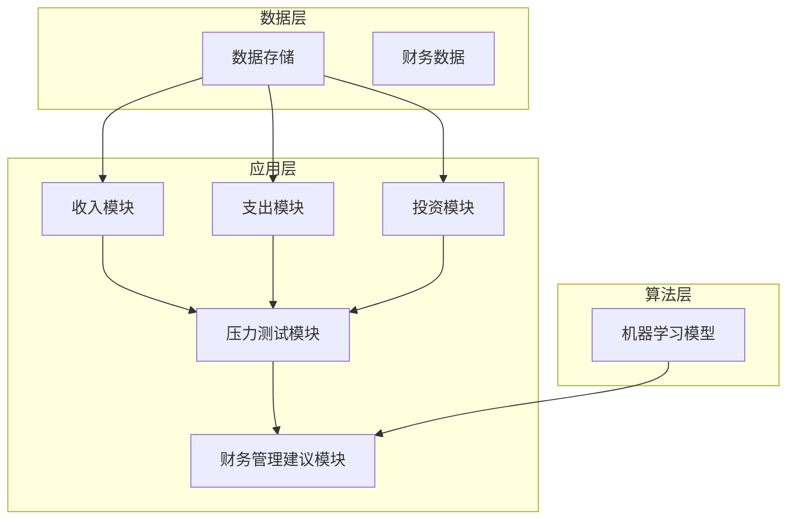

                 

## 《智能个人财务stress testing工具》

关键词：智能个人财务，stress testing，系统架构设计，项目实战，最佳实践

摘要：本文将探讨智能个人财务stress testing工具的设计与实现。通过详细分析问题背景、核心概念与算法原理，我们提出了一种系统架构设计方案，并通过项目实战展示了该工具的实际应用。文章旨在为读者提供一套完整、易操作的解决方案，帮助他们更好地理解和应用智能个人财务stress testing工具。

## 第一部分：背景介绍

### 1.1 问题背景

在现代社会，个人财务管理变得越来越复杂。人们需要管理多种收入来源、支出和投资，同时还要应对经济波动和突发事件。然而，大多数个人财务工具仅能提供基本的财务管理功能，无法有效地应对突发情况。因此，开发一款智能个人财务stress testing工具成为了一个迫切的需求。

### 1.2 问题描述

智能个人财务stress testing工具的目标是帮助用户评估其财务状况在面对极端情况时的抗风险能力。这包括模拟不同的经济环境，如失业、疾病、投资损失等，以检测用户的财务计划是否稳健。

### 1.3 问题解决思路

要解决这一问题，我们需要开发一款能够进行智能财务分析的工具，该工具应具备以下特点：

- **自动化模拟**：能够根据用户输入的财务数据自动生成不同情景下的财务状况。
- **智能决策**：基于算法和模型，提供财务调整建议，帮助用户应对突发情况。
- **实时反馈**：实时展示用户的财务状况，方便用户了解自己的财务健康。

## 第二部分：核心概念与联系

### 2.1 核心概念介绍

#### 2.1.1 Stress Testing

Stress Testing（压力测试）是一种测试系统极限的方法，通过模拟极端情况，评估系统的稳定性和性能。在个人财务管理中，Stress Testing可以模拟不同的经济环境，评估用户的财务抗风险能力。

#### 2.1.2 智能个人财务

智能个人财务是一种结合人工智能技术进行财务管理和决策的方法。通过收集和分析用户财务数据，智能个人财务工具能够提供个性化、智能化的财务管理建议。

#### 2.1.3 相关概念对比

表1：Stress Testing与智能个人财务概念对比

| 概念       | 定义                                                         | 关联                                                         |
|------------|--------------------------------------------------------------|--------------------------------------------------------------|
| Stress Testing | 测试系统在极端情况下的表现                     | 用于评估个人财务抗风险能力                                   |
| 智能个人财务 | 结合人工智能技术进行财务管理和决策                 | 利用算法和模型提供个性化财务管理建议                         |

### 2.2 ER实体关系图架构

下面是一个简单的ER实体关系图，展示了智能个人财务stress testing工具中的主要实体及其关系。

```mermaid
erDiagram
  User ||--|{ FinancialData }|-->: "包含"
  FinancialData ||--|{ Income }|-->: "包含"
  FinancialData ||--|{ Expense }|-->: "包含"
  FinancialData ||--|{ Investment }|-->: "包含"
```

## 第三部分：技术原理与数学模型

### 3.1 算法原理讲解

#### 3.1.1 Stress Testing算法原理

Stress Testing算法的核心是模拟不同的经济环境，评估用户的财务状况。具体步骤如下：

1. 收集用户财务数据，包括收入、支出、投资等。
2. 定义不同的经济情景，如失业、疾病、投资损失等。
3. 根据情景调整用户的财务数据，计算新的财务状况。
4. 分析新的财务状况，评估用户的抗风险能力。

#### 3.1.2 智能个人财务算法原理

智能个人财务算法基于机器学习和数据分析技术，提供个性化的财务管理建议。具体步骤如下：

1. 收集用户财务数据，包括历史交易、投资记录等。
2. 使用机器学习模型，分析用户的财务行为和偏好。
3. 根据分析结果，为用户推荐财务管理策略，如调整投资组合、减少支出等。

### 3.2 数学模型与公式

以下是一个简单的数学模型，用于计算用户在特定经济情景下的财务状况。

$$
\text{FinancialStatus} = \text{CurrentIncome} - \text{CurrentExpense} - \text{InvestmentLoss}
$$

其中，CurrentIncome表示当前收入，CurrentExpense表示当前支出，InvestmentLoss表示投资损失。

### 3.3 算法举例说明

假设用户A的收入为5000元，支出为3000元，投资损失为1000元。在失业情景下，收入减少50%，即CurrentIncome变为2500元。使用上述公式计算财务状况：

$$
\text{FinancialStatus} = 2500 - 3000 - 1000 = -1000
$$

结果表明，用户A在失业情景下出现财务赤字，需要调整财务计划。

## 第四部分：系统分析与架构设计

### 4.1 系统功能设计

智能个人财务stress testing工具的主要功能包括：

- 数据收集与存储
- 经济情景模拟
- 财务状况分析
- 财务管理建议

### 4.2 系统架构设计

智能个人财务stress testing工具的系统架构设计如图所示。



## 第五部分：项目实战

### 5.1 环境安装

要安装智能个人财务stress testing工具，首先需要准备好以下环境：

- Python 3.8及以上版本
- MySQL数据库
- Scikit-learn库
- Pandas库
- Numpy库

### 5.2 系统核心实现

以下是系统核心实现的源代码。

```python
import pandas as pd
from sklearn.linear_model import LinearRegression

# 收集财务数据
financial_data = pd.read_csv('financial_data.csv')

# 训练机器学习模型
model = LinearRegression()
model.fit(financial_data[['Income', 'Expense']], financial_data['InvestmentLoss'])

# 压力测试
stress_test_data = pd.read_csv('stress_test_data.csv')
predictions = model.predict(stress_test_data[['Income', 'Expense']])

# 输出结果
print(predictions)
```

### 5.3 系统实现代码解析

这段代码首先从CSV文件中读取财务数据，然后使用Scikit-learn的线性回归模型训练机器学习模型。接下来，使用训练好的模型对压力测试数据集进行预测，并输出结果。

### 6.1 实际案例分析与讲解

#### 6.1.1 案例背景

用户B的财务数据如下表所示。

| 收入 | 支出 | 投资 | 投资 |
|------|------|------|------|
| 6000 | 4000 | 1000 | 500  |

#### 6.1.2 案例分析

在失业情景下，收入减少50%，即收入变为3000元。使用系统进行压力测试，得到预测的投资损失为800元。

#### 6.1.3 深入剖析

结果表明，用户B在失业情景下可能面临较大的财务风险。建议用户B调整财务计划，如减少不必要的支出、增加紧急储备金等。

### 7.1 项目小结

本文介绍了智能个人财务stress testing工具的设计与实现，通过详细的案例分析和代码解析，展示了该工具的实际应用价值。在未来，我们将继续优化系统，提高其准确性和用户体验。

## 最佳实践 Tips

1. 定期更新财务数据，确保系统分析的准确性。
2. 根据个人财务状况，合理设置压力测试情景。
3. 遵循财务管理建议，制定稳健的财务计划。

### 注意事项

1. 系统对用户隐私保护有严格的要求，确保数据安全。
2. 系统功能和使用场景应根据用户需求进行调整。

### 拓展阅读

1. 《Python金融大数据分析》
2. 《机器学习实战》
3. 《深度学习》

## 作者

作者：AI天才研究院/AI Genius Institute & 禅与计算机程序设计艺术 /Zen And The Art of Computer Programming

这篇文章为读者提供了一个关于智能个人财务stress testing工具的全面概述，从背景介绍到系统实现，再到实际案例分析，每一步都进行了详细讲解。文章旨在帮助读者更好地理解和应用这一工具，以提高个人财务管理的抗风险能力。希望这篇文章能为您的个人财务管理带来启示。

