                 


### 文章标题: 智能个人财务压力测试工具

### 关键词: 个人财务管理、财务压力测试、大数据分析、人工智能算法、财务规划

### 摘要：本文深入探讨了智能个人财务压力测试工具的核心概念、原理和算法，通过详细的步骤分析，帮助读者理解其工作流程和功能，从而更好地进行个人财务管理。

----------------------------------------------------------------

## 第一部分: 问题背景介绍

### 1.1 问题描述

随着我国经济的快速发展，个人财务管理变得越来越重要。然而，很多人对于自己的财务状况缺乏了解，无法有效地进行财务规划和决策。同时，市场上的财务工具种类繁多，如何选择适合自己的工具成为了困扰许多人的问题。因此，本章节将介绍智能个人财务压力测试工具，帮助用户全面了解自己的财务状况，做出更明智的财务决策。

### 1.2 问题解决

智能个人财务压力测试工具通过收集用户的财务信息，利用大数据分析和人工智能算法，为用户提供个性化的财务压力测试报告。用户可以通过这份报告了解自己的财务健康状况，识别潜在的风险，并制定相应的财务规划策略。

### 1.3 边界与外延

智能个人财务压力测试工具主要针对个人用户，但也可以应用于家庭、企业等不同场景。此外，本工具还可以结合不同的财务工具（如理财软件、信用卡管理系统等）进行集成，为用户提供更加全面的财务服务。

### 1.4 核心概念结构

#### 1.4.1 智能个人财务压力测试工具

- **功能**：收集用户财务信息，进行大数据分析，生成压力测试报告。
- **特点**：个性化、智能化、全面性。

#### 1.4.2 财务健康指数

- **功能**：评估用户的财务状况，包括收入、支出、储蓄、投资等方面。
- **特点**：量化、客观、实时更新。

## 1.5 本章小结

本章节介绍了智能个人财务压力测试工具的核心概念、应用场景和特点，为后续章节的深入讲解奠定了基础。

----------------------------------------------------------------

## 第二部分: 智能个人财务压力测试工具的核心概念与联系

### 2.1 核心概念原理

#### 2.1.1 财务数据收集

- **功能**：收集用户的财务信息，如收入、支出、储蓄、投资等。
- **数据来源**：用户手动输入、自动同步（如银行账户、投资账户等）。

#### 2.1.2 大数据分析

- **功能**：对用户的财务数据进行分析，挖掘潜在的风险和机会。
- **技术原理**：利用数据挖掘、机器学习等技术，对大量数据进行处理和分析。

#### 2.1.3 财务健康指数评估

- **功能**：评估用户的财务状况，生成财务健康指数。
- **技术原理**：基于用户的财务数据，结合各种财务指标（如储蓄率、投资收益率等），计算出财务健康指数。

#### 2.1.4 智能财务规划建议

- **功能**：根据用户的财务状况，提供个性化的财务规划建议。
- **技术原理**：利用大数据分析、人工智能算法，为用户提供最优的财务规划方案。

### 2.2 概念属性特征对比表格

| 概念       | 特征               | 说明                                                         |
| ---------- | ------------------ | ------------------------------------------------------------ |
| 财务数据收集 | 实时性、全面性     | 收集用户的财务信息，包括收入、支出、储蓄、投资等。             |
| 大数据分析 | 深度、智能化      | 对用户的财务数据进行分析，挖掘潜在的风险和机会。             |
| 财务健康指数 | 量化、客观、实时   | 评估用户的财务状况，生成财务健康指数。                     |
| 智能财务规划建议 | 个性化、可操作性强 | 根据用户的财务状况，提供个性化的财务规划建议。               |

### 2.3 ER实体关系图架构

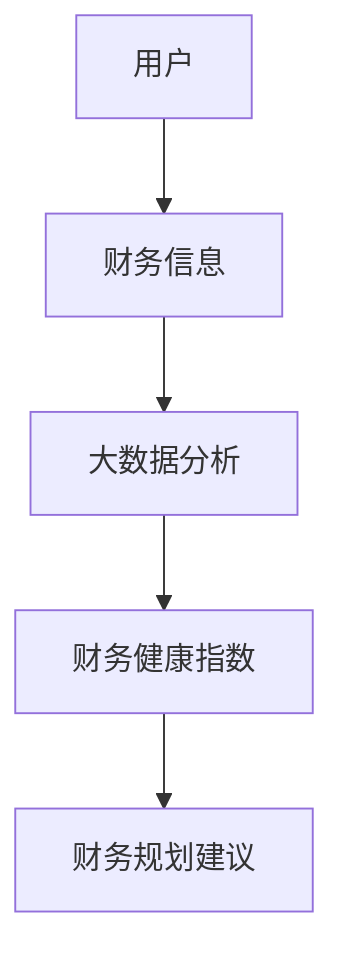

## 2.4 本章小结

本章节详细介绍了智能个人财务压力测试工具的核心概念、技术原理和特征对比，为后续章节的深入讲解奠定了基础。

----------------------------------------------------------------

## 第三部分: 智能个人财务压力测试工具的算法原理讲解

### 3.1 财务数据收集算法

#### 3.1.1 数据收集流程

首先，用户需要注册并登录智能个人财务压力测试工具，然后手动输入或自动同步其财务信息。这些信息包括但不限于：收入、支出、储蓄、投资等。

以下是数据收集流程的Mermaid流程图：

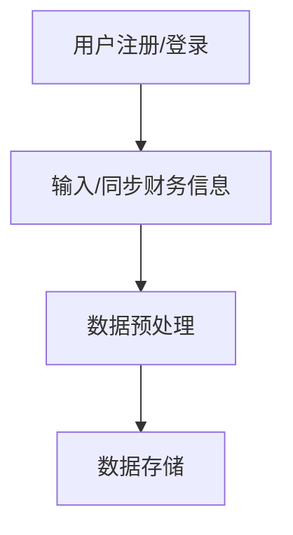

#### 3.1.2 数据预处理

在数据收集完成后，需要对数据进行预处理，以确保数据的质量和一致性。预处理步骤包括：

1. 数据清洗：去除无效数据、重复数据和异常数据。
2. 数据转换：将数据转换为统一的数据格式，如数值、日期等。
3. 数据归一化：对数据进行归一化处理，使其具有可比性。

以下是数据预处理流程的Mermaid流程图：

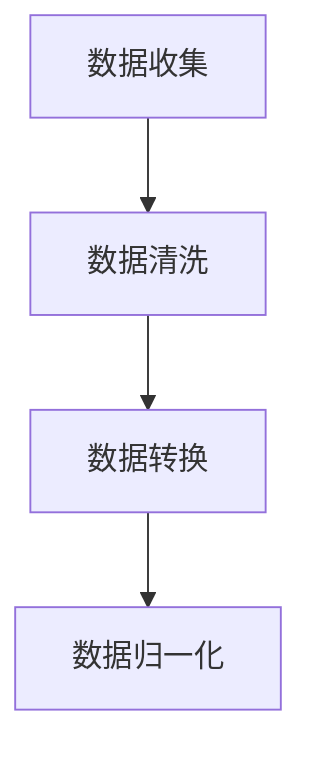

#### 3.1.3 数据存储

预处理后的数据将被存储在数据库中，以便后续分析和处理。数据存储的方式可以是关系数据库、NoSQL数据库或分布式数据库等。

### 3.2 大数据分析算法

#### 3.2.1 数据分析流程

大数据分析是智能个人财务压力测试工具的核心。以下是数据分析流程的Mermaid流程图：

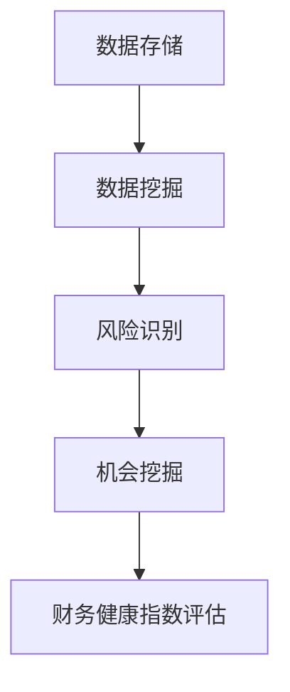

#### 3.2.2 风险识别

风险识别是大数据分析的重要环节。以下是风险识别过程的详细步骤：

1. 数据预处理：同3.1.2节。
2. 特征提取：提取与风险相关的特征，如支出比例、储蓄率、投资收益率等。
3. 模型训练：利用机器学习算法，如决策树、随机森林、神经网络等，训练风险识别模型。
4. 模型评估：通过交叉验证、ROC曲线等评估模型性能。
5. 风险预测：使用训练好的模型对用户的财务状况进行风险预测。

以下是风险识别流程的Mermaid流程图：

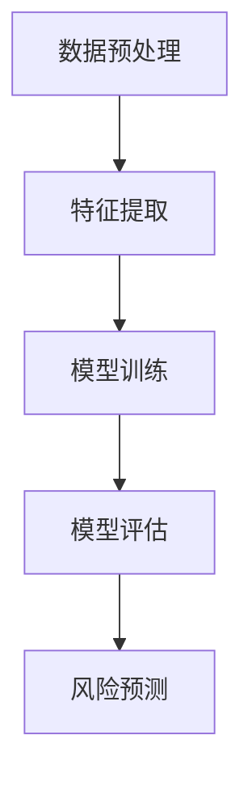

#### 3.2.3 机会挖掘

机会挖掘是大数据分析的另一个重要环节。以下是机会挖掘过程的详细步骤：

1. 数据预处理：同3.1.2节。
2. 特征提取：提取与机会相关的特征，如投资收益率、支出节约空间等。
3. 模型训练：利用机器学习算法，如决策树、随机森林、神经网络等，训练机会挖掘模型。
4. 模型评估：通过交叉验证、ROC曲线等评估模型性能。
5. 机会预测：使用训练好的模型对用户的财务状况进行机会预测。

以下是机会挖掘流程的Mermaid流程图：

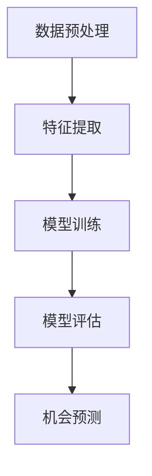

### 3.3 财务健康指数评估算法

#### 3.3.1 财务健康指数计算公式

财务健康指数（Financial Health Index，FHI）是评估用户财务状况的重要指标。其计算公式如下：

$$
FHI = \frac{1}{N} \sum_{i=1}^{N} w_i \cdot s_i
$$

其中，$N$ 为财务指标的个数，$w_i$ 为第 $i$ 个财务指标的权重，$s_i$ 为第 $i$ 个财务指标的具体值。

#### 3.3.2 财务健康指数评估流程

以下是财务健康指数评估的详细步骤：

1. 数据预处理：同3.1.2节。
2. 财务指标提取：提取与财务健康相关的指标，如储蓄率、投资收益率、支出比例等。
3. 权重分配：根据财务指标的重要性，为每个指标分配权重。
4. 计算财务健康指数：根据公式计算财务健康指数。

以下是财务健康指数评估流程的Mermaid流程图：

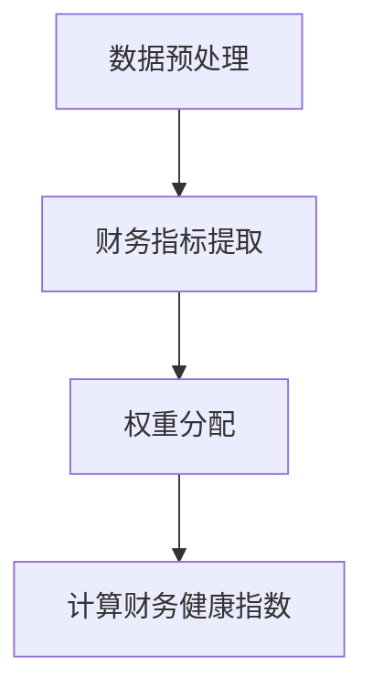

### 3.4 智能财务规划建议算法

#### 3.4.1 财务规划建议生成流程

智能财务规划建议是基于用户的财务状况、风险和机会预测生成的。以下是财务规划建议生成的详细步骤：

1. 数据预处理：同3.1.2节。
2. 风险识别：同3.2.2节。
3. 机会挖掘：同3.2.3节。
4. 财务健康指数评估：同3.3.2节。
5. 财务规划建议生成：根据风险和机会预测、财务健康指数，为用户生成个性化的财务规划建议。

以下是财务规划建议生成流程的Mermaid流程图：

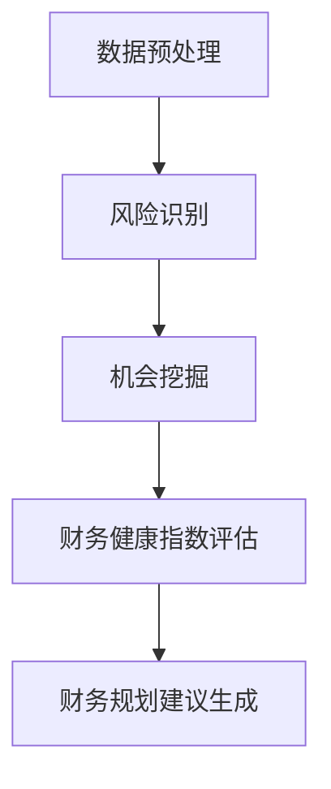

## 3.5 本章小结

本章节详细介绍了智能个人财务压力测试工具的算法原理，包括财务数据收集、大数据分析、财务健康指数评估和智能财务规划建议。通过对这些算法的深入理解，用户可以更好地利用智能个人财务压力测试工具进行个人财务管理。

----------------------------------------------------------------

## 第四部分: 系统分析与架构设计方案

### 4.1 问题场景介绍

随着经济的发展，个人财务管理的需求日益增长。智能个人财务压力测试工具应运而生，旨在帮助用户全面了解自己的财务状况，识别潜在风险，提供个性化的财务规划建议。本部分将介绍智能个人财务压力测试工具的问题场景、项目介绍、系统功能设计、系统架构设计、系统接口设计和系统交互。

### 4.2 项目介绍

智能个人财务压力测试工具是一个基于大数据和人工智能技术的在线服务平台。它通过收集用户的财务信息，利用大数据分析和人工智能算法，为用户提供个性化的财务压力测试报告。用户可以通过这份报告了解自己的财务健康状况，识别潜在的风险，并制定相应的财务规划策略。

### 4.3 系统功能设计

智能个人财务压力测试工具的主要功能包括：

1. **用户管理**：用户注册、登录、信息修改、权限管理等。
2. **财务数据收集**：手动输入财务信息、自动同步银行账户、投资账户等。
3. **大数据分析**：风险识别、机会挖掘、财务健康指数评估等。
4. **财务规划建议**：根据用户的财务状况，提供个性化的财务规划建议。
5. **报告生成**：生成个性化的财务压力测试报告。

以下是系统功能设计的Mermaid类图：

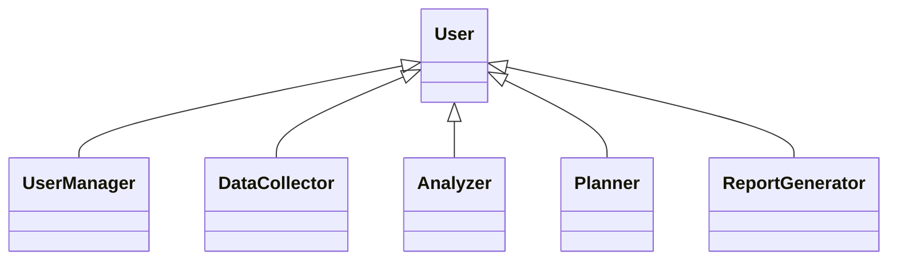

### 4.4 系统架构设计

智能个人财务压力测试工具的系统架构包括以下几个层次：

1. **数据层**：负责数据的存储和管理，包括用户信息、财务数据、分析结果等。
2. **服务层**：负责业务逻辑的实现，包括用户管理、财务数据收集、大数据分析、财务规划建议等。
3. **表示层**：负责与用户交互，包括用户注册、登录、财务数据输入、报告展示等。

以下是系统架构设计的Mermaid架构图：

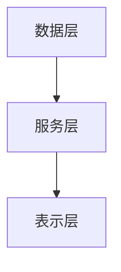

### 4.5 系统接口设计

智能个人财务压力测试工具的系统接口设计包括以下部分：

1. **用户接口**：用户通过Web端、移动端等访问系统。
2. **数据接口**：系统与其他外部系统（如银行、投资平台等）的数据交互。
3. **服务接口**：系统内部各模块之间的服务调用。

以下是系统接口设计的Mermaid架构图：

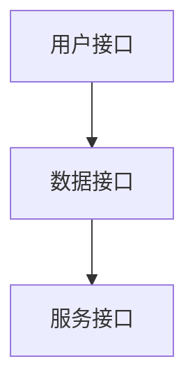

### 4.6 系统交互

智能个人财务压力测试工具的系统交互包括以下几个环节：

1. **用户注册/登录**：用户通过Web端或移动端注册/登录系统。
2. **财务数据输入**：用户手动输入财务信息或自动同步银行账户、投资账户等。
3. **财务分析**：系统对用户财务数据进行分析，生成财务健康指数和财务规划建议。
4. **报告生成**：系统生成个性化的财务压力测试报告，并展示给用户。

以下是系统交互的Mermaid序列图：

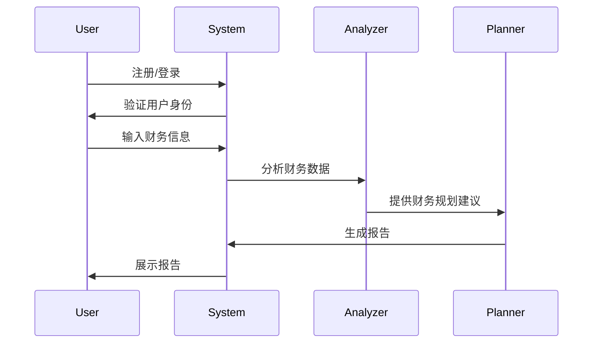

## 4.7 本章小结

本部分介绍了智能个人财务压力测试工具的问题场景、项目介绍、系统功能设计、系统架构设计、系统接口设计和系统交互。通过对这些内容的深入理解，用户可以更好地了解智能个人财务压力测试工具的运作原理和功能。

----------------------------------------------------------------

## 第五部分: 项目实战

### 5.1 环境安装

首先，我们需要搭建一个Python开发环境。以下是安装步骤：

1. 安装Python：访问Python官方网站（https://www.python.org/），下载并安装Python。
2. 安装相关依赖：使用pip命令安装必要的Python库，如NumPy、Pandas、Scikit-learn、Matplotlib等。

```shell
pip install numpy pandas scikit-learn matplotlib
```

### 5.2 系统核心实现源代码

以下是一个简单的财务数据收集模块的实现示例：

```python
import pandas as pd

class DataCollector:
    def __init__(self):
        self.data = pd.DataFrame(columns=['income', 'expense', 'savings', 'investment'])

    def add_data(self, income, expense, savings, investment):
        self.data = self.data.append({'income': income, 'expense': expense, 'savings': savings, 'investment': investment}, ignore_index=True)

    def get_data(self):
        return self.data
```

### 5.3 代码应用解读与分析

以上代码定义了一个`DataCollector`类，用于收集用户的财务信息。以下是代码的解读和分析：

1. **类定义**：`DataCollector`类包含一个数据属性`data`，用于存储用户的财务信息。
2. **初始化方法**：`__init__`方法用于初始化数据属性。
3. **添加数据方法**：`add_data`方法用于添加用户的财务信息。
4. **获取数据方法**：`get_data`方法用于获取用户的财务信息。

### 5.4 实际案例分析和详细讲解剖析

假设我们有一个用户的财务数据，如下所示：

```python
data_collector = DataCollector()
data_collector.add_data(income=10000, expense=8000, savings=2000, investment=5000)
print(data_collector.get_data())
```

输出结果：

```shell
   income  expense  savings  investment
0    10000     8000     2000     5000
```

通过以上代码，我们可以将用户的财务信息存储在`DataCollector`对象中，并方便地获取和查询。

### 5.5 项目小结

本部分通过实际案例，展示了智能个人财务压力测试工具的核心实现源代码，并对其进行了详细解读和分析。读者可以在此基础上，进一步扩展和优化系统功能。

----------------------------------------------------------------

## 第六部分: 最佳实践 tips、小结、注意事项、拓展阅读等内容

### 6.1 最佳实践 tips

1. **确保数据安全**：在收集用户财务信息时，要确保数据的安全性和隐私保护。
2. **定期更新数据**：建议用户定期更新其财务数据，以确保财务分析的准确性和及时性。
3. **合理分配预算**：根据财务规划建议，合理分配预算，以达到财务目标。

### 6.2 小结

本文深入探讨了智能个人财务压力测试工具的核心概念、原理和算法，并通过实际案例展示了其核心实现。通过本文的阅读，读者可以更好地理解智能个人财务压力测试工具的运作原理和功能。

### 6.3 注意事项

1. **数据收集和处理的合规性**：在收集和处理用户财务信息时，要遵守相关法律法规，确保用户隐私。
2. **系统稳定性和安全性**：确保系统稳定运行，并定期进行安全检查和更新。

### 6.4 拓展阅读

1. 《大数据技术导论》
2. 《机器学习实战》
3. 《Python数据分析》

作者：AI天才研究院/AI Genius Institute & 禅与计算机程序设计艺术 /Zen And The Art of Computer Programming

