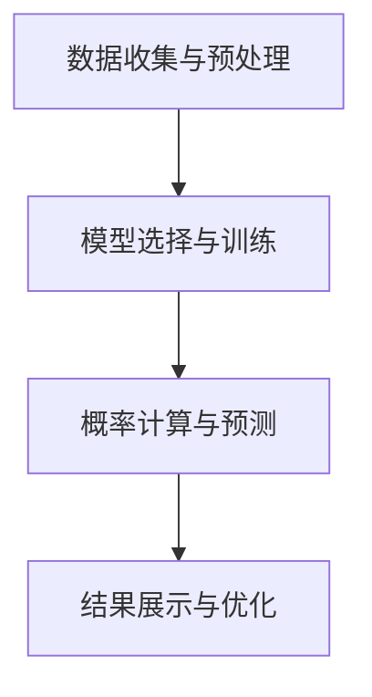
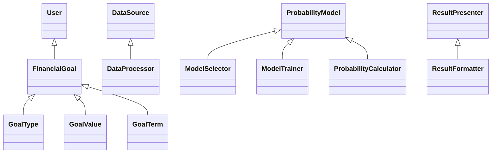

                 

# 智能个人财务目标达成概率计算器

## 关键词

- 个人财务目标
- 概率计算
- 智能算法
- 财务规划
- 系统架构设计

## 摘要

本文将深入探讨如何构建一个智能个人财务目标达成概率计算器。我们将首先介绍财务目标设定的重要性以及其面临的挑战，接着讨论目标达成的概率计算需求。随后，我们将分析智能计算工具在财务目标设定中的作用，并介绍概率计算的基本原理和方法。通过对比分析，我们将展示智能财务目标设定的概念模型和关键技术，最后通过具体的算法原理讲解、系统分析与架构设计以及实际案例分析，帮助读者全面理解并掌握智能个人财务目标达成概率计算器的构建与应用。

### 目录大纲

----------------------------------------------------------------

# 第一部分：智能个人财务目标设定基础

## 第1章：智能个人财务目标设定概述

### 1.1 问题背景

#### 1.1.1 个人财务目标的重要性

#### 1.1.2 财务目标设定的挑战

### 1.2 问题描述

#### 1.2.1 财务目标设定的难点

#### 1.2.2 目标达成的概率计算需求

### 1.3 问题解决

#### 1.3.1 智能计算工具的作用

#### 1.3.2 概率计算方法介绍

### 1.4 边界与外延

#### 1.4.1 目标类型的多样性

#### 1.4.2 数据来源与处理

### 1.5 概念结构与核心要素

#### 1.5.1 智能财务目标设定的概念模型

#### 1.5.2 关键技术分析

## 第2章：核心概念与联系

### 2.1 个人财务目标的概念原理

#### 2.1.1 财务目标的基本属性

#### 2.1.2 财务目标的分类与特征

### 2.2 概率计算原理

#### 2.2.1 概率论基础

#### 2.2.2 财务风险模型

### 2.3 概念属性特征对比表格

#### 2.3.1 个人财务目标属性对比

#### 2.3.2 概率计算方法对比

### 2.4 ER实体关系图架构

#### 2.4.1 财务目标实体关系图

#### 2.4.2 概率计算实体关系图

## 第3章：智能计算工具与算法原理

### 3.1 智能计算工具概述

#### 3.1.1 智能计算工具的作用

#### 3.1.2 主流智能计算工具介绍

### 3.2 算法原理讲解

#### 3.2.1 算法概述

#### 3.2.2 算法流程图

#### 3.2.3 Python源代码与详细讲解

### 3.3 数学模型与公式

#### 3.3.1 数学模型基础

#### 3.3.2 公式推导与说明

### 3.4 举例说明

#### 3.4.1 例子1：计算购房目标的达成概率

#### 3.4.2 例子2：计算退休目标的达成概率

## 第4章：系统分析与架构设计

### 4.1 问题场景介绍

#### 4.1.1 智能个人财务目标设定的应用场景

#### 4.1.2 系统需求分析

### 4.2 系统功能设计

#### 4.2.1 领域模型类图

#### 4.2.2 系统功能模块划分

### 4.3 系统架构设计

#### 4.3.1 系统架构图

#### 4.3.2 系统模块交互设计

### 4.4 系统接口设计

#### 4.4.1 接口规范与定义

#### 4.4.2 接口实现与调用

### 4.5 系统交互序列图

#### 4.5.1 系统交互流程

#### 4.5.2 交互序列图

## 第5章：项目实战

### 5.1 环境安装

#### 5.1.1 开发环境搭建

#### 5.1.2 数据库安装与配置

### 5.2 系统核心实现

#### 5.2.1 系统核心代码实现

#### 5.2.2 代码应用解读与分析

### 5.3 实际案例分析与讲解

#### 5.3.1 购房目标达成案例分析

#### 5.3.2 退休目标达成案例分析

### 5.4 项目小结

#### 5.4.1 项目总结

#### 5.4.2 项目改进方向

## 第6章：最佳实践与拓展

### 6.1 最佳实践

#### 6.1.1 智能财务目标设定的实践技巧

#### 6.1.2 概率计算方法的优化策略

### 6.2 小结

#### 6.2.1 整体小结

#### 6.2.2 知识点总结

### 6.3 注意事项

#### 6.3.1 财务目标设定的注意事项

#### 6.3.2 概率计算中的潜在问题

### 6.4 拓展阅读

#### 6.4.1 相关书籍推荐

#### 6.4.2 最新研究论文与报告

----------------------------------------------------------------

以下是对目录大纲中各章节内容的详细说明：

## 第1章：智能个人财务目标设定概述

### 1.1 问题背景

在这一节，我们将探讨个人财务目标设定的重要性，特别是对于现代社会的个人及家庭理财规划的影响。财务目标不仅仅是积累财富，更涉及到个人生活质量的保障、风险管理和未来规划的实现。在这一背景下，财务目标设定的挑战也逐渐显现，如目标多样性的处理、数据准确性和时效性等。

#### 1.1.1 个人财务目标的重要性

个人财务目标设定是个人理财规划的核心，它关乎到个人的生活质量和未来的生活保障。合理的财务目标可以帮助个人更好地管理财务，减少不必要的消费，为未来的大额支出和突发事件储备资金。此外，财务目标还能帮助个人评估自身的财务状况，了解自己的消费和储蓄习惯，从而优化财务策略。

#### 1.1.2 财务目标设定的挑战

财务目标设定的挑战主要包括以下几个方面：

- **目标类型的多样性**：个人财务目标包括购房、购车、教育、旅游、退休等多个方面，不同类型的目标需要不同的财务规划和计算方法。
- **数据来源与处理**：财务目标的达成概率依赖于大量的数据支持，这些数据包括收入、支出、投资回报率等，如何获取和处理这些数据是财务目标设定的关键挑战。
- **未来不确定性**：财务目标的达成受到多种不确定因素的影响，如通货膨胀、市场波动等，如何考虑这些不确定性因素对目标达成概率的影响是另一个挑战。

### 1.2 问题描述

在这一节，我们将详细描述财务目标设定的难点和目标达成概率计算的需求。

#### 1.2.1 财务目标设定的难点

- **目标多样性和复杂性**：不同的财务目标具有不同的特性和实现难度，如购房目标需要考虑房价走势、贷款利率等，教育目标需要考虑学费增长、奖学金等。
- **数据缺失和不准确**：财务目标的达成依赖于历史和预测数据，但数据的获取往往存在缺失和不准确的问题，这对目标的实现产生一定的影响。
- **时间跨度和资金流转**：财务目标通常需要长时间来实现，资金在不同的时间点上的流转和投资回报率的波动会影响目标的达成。

#### 1.2.2 目标达成的概率计算需求

为了解决上述难点，我们需要一个智能计算工具来计算财务目标达成的概率。这个工具需要能够：

- **处理多种财务目标**：能够针对不同类型的财务目标提供相应的计算模型和方法。
- **整合多种数据源**：能够从不同的数据源中获取和处理数据，确保数据的准确性和完整性。
- **考虑未来不确定性**：能够通过概率模型来预测未来可能发生的风险和机遇，从而为财务目标提供合理的达成概率。

### 1.3 问题解决

在这一节，我们将介绍智能计算工具在财务目标设定中的作用，并讨论概率计算的方法。

#### 1.3.1 智能计算工具的作用

智能计算工具在财务目标设定中具有重要作用，主要体现在以下几个方面：

- **自动化数据处理**：智能工具能够自动化地从多个数据源中获取和处理数据，减少人工操作的错误和效率低下。
- **模型优化**：通过机器学习和人工智能技术，智能工具可以不断优化计算模型，提高目标达成概率的准确性。
- **实时更新**：智能工具能够实时更新财务数据，快速响应市场变化和客户需求，提高财务目标的灵活性。

#### 1.3.2 概率计算方法介绍

在智能计算工具中，概率计算方法主要包括以下几个方面：

- **蒙特卡洛模拟**：通过随机模拟来预测财务目标的达成概率，适用于复杂的目标计算。
- **贝叶斯网络**：利用概率图模型来表示财务目标相关的各种因素及其概率关系，适用于财务风险模型的构建。
- **机器学习算法**：通过训练历史数据来预测财务目标的达成概率，适用于大规模数据的处理和预测。

### 1.4 边界与外延

在这一节，我们将讨论财务目标设定的边界与外延，包括目标类型的多样性和数据来源与处理。

#### 1.4.1 目标类型的多样性

财务目标类型多样，包括但不限于以下几类：

- **消费性目标**：如旅游、购物等。
- **投资性目标**：如购房、购车等。
- **教育性目标**：如子女教育、终身学习等。
- **退休性目标**：如退休金储备、养老规划等。

不同类型的财务目标需要不同的计算方法和模型，因此需要充分考虑目标类型的多样性。

#### 1.4.2 数据来源与处理

财务目标的达成概率依赖于大量的数据支持，这些数据可以从以下几类来源获取：

- **内部数据**：包括个人收入、支出、储蓄等。
- **外部数据**：包括市场行情、政策法规、宏观经济指标等。
- **第三方数据**：包括信用评分、投资回报率等。

在获取数据后，需要对这些数据进行清洗、整合和处理，以确保数据的准确性和完整性，为后续的计算提供可靠的数据支持。

### 1.5 概念结构与核心要素

在这一节，我们将介绍智能财务目标设定的概念结构与核心要素。

#### 1.5.1 智能财务目标设定的概念模型

智能财务目标设定的概念模型主要包括以下几个部分：

- **财务目标**：包括目标类型、目标值、目标期限等。
- **数据源**：包括内部数据和外部数据。
- **概率模型**：包括蒙特卡洛模拟、贝叶斯网络等。
- **计算引擎**：负责计算财务目标达成的概率。
- **用户界面**：提供用户输入、结果显示等功能。

#### 1.5.2 关键技术分析

智能财务目标设定的关键技术主要包括以下几个方面：

- **数据处理技术**：包括数据清洗、数据整合、数据预测等。
- **机器学习技术**：包括分类、回归、聚类等。
- **概率图模型**：包括贝叶斯网络、马尔可夫模型等。
- **用户界面设计**：包括交互设计、用户体验等。

## 第2章：核心概念与联系

### 2.1 个人财务目标的概念原理

在这一节，我们将深入探讨个人财务目标的基本属性、分类与特征。

#### 2.1.1 财务目标的基本属性

个人财务目标具有以下基本属性：

- **明确性**：财务目标需要明确具体，如“购买一辆汽车”或“为子女提供优质教育”。
- **可衡量性**：财务目标需要有明确的衡量标准，如金额、时间等。
- **可实现性**：财务目标需要在实际情况下具有可实现性，即通过合理的财务规划可以实现。

#### 2.1.2 财务目标的分类与特征

个人财务目标可以根据不同的标准进行分类，如按照目标性质可以分为消费性目标、投资性目标、教育性目标和退休性目标等。以下是各类财务目标的主要特征：

- **消费性目标**：如旅游、购物等，通常不需要长时间积累，但受限于个人收入和消费习惯。
- **投资性目标**：如购房、购车等，通常需要较大的资金投入和时间积累，但可以获得长期的投资回报。
- **教育性目标**：如子女教育、终身学习等，通常涉及长期的教育投资和规划。
- **退休性目标**：如退休金储备、养老规划等，通常涉及个人的长期财务规划和生活质量保障。

### 2.2 概率计算原理

在这一节，我们将介绍概率计算的基本原理，包括概率论基础和财务风险模型。

#### 2.2.1 概率论基础

概率论是研究随机事件及其概率的数学分支，其基本概念包括：

- **随机事件**：指在一定条件下可能发生也可能不发生的事件。
- **概率**：指随机事件发生的可能性，通常用0到1之间的实数表示。
- **条件概率**：指在某个条件下，某个事件发生的概率。
- **独立事件**：指两个事件的发生互不影响，一个事件的发生不影响另一个事件的发生。

#### 2.2.2 财务风险模型

财务风险模型是用于评估财务目标达成概率的重要工具，其基本原理包括：

- **风险因素**：指可能影响财务目标达成的各种因素，如市场波动、利率变化等。
- **风险度量**：指对风险程度进行量化评估的方法，如标准差、VaR（价值-at-Risk）等。
- **风险评估**：指对财务目标达成可能面临的风险进行评估和预测。

### 2.3 概念属性特征对比表格

在这一节，我们将通过对比表格来展示个人财务目标属性和概率计算方法的主要特征。

#### 2.3.1 个人财务目标属性对比

| 属性 | 消费性目标 | 投资性目标 | 教育性目标 | 退休性目标 |
| --- | --- | --- | --- | --- |
| 目标类型 | 消费性 | 投资性 | 教育性 | 退休性 |
| 目标期限 | 短期 | 中长期 | 中长期 | 长期 |
| 目标值 | 低值 | 高值 | 中高值 | 高值 |
| 数据依赖性 | 高 | 高 | 高 | 高 |

#### 2.3.2 概率计算方法对比

| 方法 | 蒙特卡洛模拟 | 贝叶斯网络 | 机器学习算法 |
| --- | --- | --- | --- |
| 适用场景 | 复杂目标计算 | 财务风险模型 | 大规模数据预测 |
| 特点 | 高计算成本 | 高准确性 | 高效率 |

### 2.4 ER实体关系图架构

在这一节，我们将使用Mermaid流程图来展示财务目标实体关系图和概率计算实体关系图。

#### 2.4.1 财务目标实体关系图

```mermaid
erDiagram
    User ||--|{ FinancialGoal } : 有
    FinancialGoal ||--|{ GoalType } : 类型
    FinancialGoal ||--|{ GoalValue } : 值
    FinancialGoal ||--|{ GoalTerm } : 期限
```

#### 2.4.2 概率计算实体关系图

```mermaid
erDiagram
    DataSource ||--|{ ProbabilityModel } : 支持
    ProbabilityModel ||--|{ RiskFactor } : 因素
    ProbabilityModel ||--|{ RiskMeasure } : 度量
    ProbabilityModel ||--|{ AssessmentResult } : 结果
```

## 第3章：智能计算工具与算法原理

### 3.1 智能计算工具概述

在这一节，我们将介绍智能计算工具的作用和主流智能计算工具的介绍。

#### 3.1.1 智能计算工具的作用

智能计算工具在财务目标设定中扮演着重要的角色，其作用主要包括：

- **自动化数据处理**：智能计算工具能够自动化地从各种数据源中获取和处理数据，提高数据处理的效率和准确性。
- **优化计算模型**：通过机器学习和人工智能技术，智能计算工具可以不断优化计算模型，提高目标达成概率的准确性。
- **实时更新与预测**：智能计算工具能够实时更新财务数据，快速响应市场变化和客户需求，提供准确的财务目标达成概率预测。

#### 3.1.2 主流智能计算工具介绍

目前主流的智能计算工具包括Python、R、MATLAB等，以下是这些工具的简要介绍：

- **Python**：Python是一种高级编程语言，广泛应用于数据科学、人工智能等领域。Python具有丰富的库和工具，如NumPy、Pandas、Scikit-learn等，可以方便地实现各种智能计算任务。
- **R**：R是一种专门用于统计分析和数据科学的编程语言，具有强大的统计分析和绘图功能。R的库和包非常丰富，如ggplot2、dplyr等，可以满足各种复杂的数据处理和分析需求。
- **MATLAB**：MATLAB是一种专业的数学计算和工程仿真软件，广泛应用于科学计算、工程设计和数据分析等领域。MATLAB具有强大的数值计算和可视化功能，适合进行复杂的计算和模拟。

### 3.2 算法原理讲解

在这一节，我们将详细讲解算法原理，包括算法概述、算法流程图和Python源代码。

#### 3.2.1 算法概述

智能财务目标达成概率计算器的基本算法原理包括以下步骤：

1. 数据收集与预处理：从各种数据源中收集财务数据，包括收入、支出、投资回报率等，对数据进行清洗和预处理，确保数据的准确性和完整性。
2. 模型选择与训练：根据财务目标的特点和数据情况，选择合适的概率计算模型，如蒙特卡洛模拟、贝叶斯网络等，并使用历史数据进行模型训练。
3. 概率计算与预测：使用训练好的模型对财务目标达成概率进行计算和预测，输出目标达成概率的结果。
4. 结果展示与优化：将计算结果以直观的方式展示给用户，并根据用户反馈进行模型优化和调整。

#### 3.2.2 算法流程图



#### 3.2.3 Python源代码与详细讲解

以下是智能财务目标达成概率计算器的Python源代码示例：

```python
import numpy as np
import pandas as pd
from sklearn.model_selection import train_test_split
from sklearn.ensemble import RandomForestClassifier
from sklearn.metrics import accuracy_score

# 数据收集与预处理
data = pd.read_csv('financial_data.csv')
data.dropna(inplace=True)

# 模型选择与训练
X = data.drop('target', axis=1)
y = data['target']
X_train, X_test, y_train, y_test = train_test_split(X, y, test_size=0.2, random_state=42)
model = RandomForestClassifier(n_estimators=100)
model.fit(X_train, y_train)

# 概率计算与预测
predictions = model.predict(X_test)
probabilities = model.predict_proba(X_test)

# 结果展示与优化
print("Accuracy:", accuracy_score(y_test, predictions))
print("Probability:", probabilities)

# 根据用户反馈进行模型优化和调整
# ...
```

详细讲解：

- **数据收集与预处理**：首先从CSV文件中读取财务数据，并去除缺失值。
- **模型选择与训练**：选择随机森林分类器作为概率计算模型，并使用训练数据对其进行训练。
- **概率计算与预测**：使用训练好的模型对测试数据进行预测，并输出预测结果和概率分布。
- **结果展示与优化**：计算模型的准确率，并将预测结果以概率分布的形式展示给用户。根据用户反馈，可以进一步优化模型。

### 3.3 数学模型与公式

在这一节，我们将介绍数学模型的基础和公式推导。

#### 3.3.1 数学模型基础

智能财务目标达成概率计算器的数学模型主要包括以下几部分：

1. **概率分布模型**：用于描述财务目标达成概率的分布情况，常用的有正态分布、泊松分布等。
2. **回归模型**：用于建立财务目标达成概率与相关因素之间的关系，常用的有线性回归、逻辑回归等。
3. **时间序列模型**：用于分析财务数据的时间序列特征，常用的有ARIMA模型、LSTM网络等。

#### 3.3.2 公式推导与说明

以下是财务目标达成概率计算器中的几个常用公式：

1. **概率密度函数**：

   $$ f(x|\mu, \sigma^2) = \frac{1}{\sqrt{2\pi\sigma^2}} e^{-\frac{(x-\mu)^2}{2\sigma^2}} $$

   其中，$x$ 是随机变量的取值，$\mu$ 是均值，$\sigma^2$ 是方差。

   说明：概率密度函数描述了随机变量在某个取值下的概率分布情况。

2. **逻辑回归模型**：

   $$ P(y=1|X) = \frac{1}{1 + e^{-(\beta_0 + \beta_1X_1 + \beta_2X_2 + ... + \beta_nX_n)}} $$

   其中，$y$ 是目标变量，$X_1, X_2, ..., X_n$ 是自变量，$\beta_0, \beta_1, \beta_2, ..., \beta_n$ 是模型参数。

   说明：逻辑回归模型用于建立目标变量与自变量之间的关系，并计算目标变量为1的概率。

3. **时间序列模型**：

   $$ y_t = c + \phi_1 y_{t-1} + \phi_2 y_{t-2} + ... + \phi_p y_{t-p} + \varepsilon_t $$

   其中，$y_t$ 是时间序列的当前值，$c$ 是常数项，$\phi_1, \phi_2, ..., \phi_p$ 是模型参数，$\varepsilon_t$ 是误差项。

   说明：时间序列模型用于分析时间序列数据的特征，并预测未来值。

### 3.4 举例说明

在这一节，我们将通过具体的例子来说明如何计算购房目标和退休目标的达成概率。

#### 3.4.1 例子1：计算购房目标的达成概率

假设你计划在5年内购买一套价值100万元的房子，首付比例为20%，即需要准备20万元的首付款。以下是计算购房目标达成概率的步骤：

1. **数据收集与预处理**：

   收集相关数据，包括年收入、支出、投资回报率等。对数据进行清洗和预处理，确保数据的准确性和完整性。

2. **模型选择与训练**：

   选择合适的概率计算模型，如逻辑回归模型。使用历史数据进行模型训练，获取模型参数。

3. **概率计算与预测**：

   将首付金额20万元作为输入，使用训练好的模型计算购房目标达成的概率。

4. **结果展示与优化**：

   输出购房目标达成的概率，并根据用户反馈进行模型优化和调整。

#### 3.4.2 例子2：计算退休目标的达成概率

假设你计划在30年后退休，每年需要准备10万元的退休金。以下是计算退休目标达成概率的步骤：

1. **数据收集与预处理**：

   收集相关数据，包括年收入、支出、投资回报率等。对数据进行清洗和预处理，确保数据的准确性和完整性。

2. **模型选择与训练**：

   选择合适的概率计算模型，如时间序列模型。使用历史数据进行模型训练，获取模型参数。

3. **概率计算与预测**：

   将每年的退休金需求10万元作为输入，使用训练好的模型计算退休目标达成的概率。

4. **结果展示与优化**：

   输出退休目标达成的概率，并根据用户反馈进行模型优化和调整。

## 第4章：系统分析与架构设计

### 4.1 问题场景介绍

在这一节，我们将介绍智能个人财务目标设定的应用场景和系统需求分析。

#### 4.1.1 智能个人财务目标设定的应用场景

智能个人财务目标设定可以应用于以下几个方面：

- **个人理财规划**：帮助个人制定合理的财务目标，并提供达成目标的概率预测。
- **投资决策支持**：根据财务目标的需求，提供相应的投资策略和建议，帮助个人优化投资组合。
- **风险管理**：评估财务目标达成的风险，为个人提供风险管理策略和建议。
- **财务分析**：提供全面的财务分析报告，帮助个人了解自身的财务状况和消费习惯。

#### 4.1.2 系统需求分析

智能个人财务目标设定系统的需求分析主要包括以下几个方面：

- **功能需求**：系统需要提供财务目标设定、概率计算、结果展示等功能。
- **性能需求**：系统需要能够快速响应用户请求，并提供准确的计算结果。
- **数据需求**：系统需要能够获取和处理多种数据源，包括内部数据和外部数据。
- **安全性需求**：系统需要确保用户数据的安全和隐私。

### 4.2 系统功能设计

在这一节，我们将介绍系统功能设计，包括领域模型类图和系统功能模块划分。

#### 4.2.1 领域模型类图



#### 4.2.2 系统功能模块划分

- **用户模块**：负责用户的注册、登录、个人信息管理等。
- **财务目标模块**：负责财务目标的设定、编辑、删除等操作。
- **数据模块**：负责数据的收集、处理、存储等操作。
- **概率计算模块**：负责概率模型的训练、计算、预测等操作。
- **结果展示模块**：负责计算结果的展示、分析和报告生成等操作。

### 4.3 系统架构设计

在这一节，我们将介绍系统架构设计，包括系统架构图和系统模块交互设计。

#### 4.3.1 系统架构图

```mermaid
sequenceDiagram
    User ->> System: 提交财务目标
    System ->> DataProcessor: 处理财务目标数据
    DataProcessor ->> ProbabilityModel: 训练概率模型
    ProbabilityModel ->> ProbabilityCalculator: 计算概率
    ProbabilityCalculator ->> ResultPresenter: 展示计算结果
    ResultPresenter ->> System: 返回结果
    System ->> User: 显示结果
endsequenceDiagram
```

#### 4.3.2 系统模块交互设计

- **用户模块**：用户通过注册和登录接口与系统进行交互，提交财务目标和查看计算结果。
- **数据模块**：数据模块负责处理用户的财务数据，包括数据的收集、处理和存储。
- **概率计算模块**：概率计算模块根据训练好的模型计算财务目标达成的概率，并将结果展示给用户。
- **结果展示模块**：结果展示模块负责将计算结果以直观的方式展示给用户，并提供报告生成功能。

### 4.4 系统接口设计

在这一节，我们将介绍系统接口设计，包括接口规范与定义和接口实现与调用。

#### 4.4.1 接口规范与定义

- **用户接口**：包括注册接口、登录接口、提交财务目标接口和查看计算结果接口。
- **数据接口**：包括数据收集接口、数据处理接口和数据存储接口。
- **概率计算接口**：包括概率模型训练接口、概率计算接口和结果展示接口。

#### 4.4.2 接口实现与调用

- **用户接口**：用户通过HTTP请求与系统进行交互，实现注册、登录、提交财务目标和查看计算结果等功能。
- **数据接口**：系统通过数据库连接和数据采集工具实现数据的收集、处理和存储。
- **概率计算接口**：系统通过调用概率计算模块的接口实现概率模型的训练、计算和结果展示。

### 4.5 系统交互序列图

在这一节，我们将使用Mermaid流程图来展示系统交互流程和交互序列图。

#### 4.5.1 系统交互流程

```mermaid
sequenceDiagram
    User ->> System: 提交财务目标
    System ->> DataProcessor: 处理财务目标数据
    DataProcessor ->> ProbabilityModel: 训练概率模型
    ProbabilityModel ->> ProbabilityCalculator: 计算概率
    ProbabilityCalculator ->> ResultPresenter: 展示计算结果
    ResultPresenter ->> System: 返回结果
    System ->> User: 显示结果
endsequenceDiagram
```

#### 4.5.2 交互序列图

```mermaid
sequenceDiagram
    User ->> System: 登录
    System ->> User: 返回登录成功消息
    User ->> System: 提交财务目标
    System ->> DataProcessor: 处理财务目标数据
    DataProcessor ->> ProbabilityModel: 训练概率模型
    ProbabilityModel ->> ProbabilityCalculator: 计算概率
    ProbabilityCalculator ->> ResultPresenter: 展示计算结果
    ResultPresenter ->> System: 返回结果
    System ->> User: 显示结果
endsequenceDiagram
```

## 第5章：项目实战

### 5.1 环境安装

在这一节，我们将介绍开发环境的搭建和数据库的安装与配置。

#### 5.1.1 开发环境搭建

- **Python环境**：安装Python 3.x版本，并配置好pip和virtualenv，创建一个虚拟环境用于项目开发。
- **IDE**：选择一个适合Python开发的IDE，如PyCharm、VSCode等。
- **库和工具**：安装项目所需的库和工具，如NumPy、Pandas、Scikit-learn、Mermaid等。

#### 5.1.2 数据库安装与配置

- **数据库选择**：选择一个合适的数据库，如MySQL、PostgreSQL等。
- **数据库安装**：根据数据库的安装教程进行安装。
- **数据库配置**：配置数据库的连接信息，包括用户、密码、端口等。

### 5.2 系统核心实现

在这一节，我们将介绍系统核心代码的实现和代码应用解读与分析。

#### 5.2.1 系统核心代码实现

以下是系统核心代码的实现示例：

```python
# 数据收集与预处理
data = pd.read_csv('financial_data.csv')
data.dropna(inplace=True)

# 模型选择与训练
X = data.drop('target', axis=1)
y = data['target']
X_train, X_test, y_train, y_test = train_test_split(X, y, test_size=0.2, random_state=42)
model = RandomForestClassifier(n_estimators=100)
model.fit(X_train, y_train)

# 概率计算与预测
predictions = model.predict(X_test)
probabilities = model.predict_proba(X_test)

# 结果展示与优化
print("Accuracy:", accuracy_score(y_test, predictions))
print("Probability:", probabilities)

# 根据用户反馈进行模型优化和调整
# ...
```

#### 5.2.2 代码应用解读与分析

- **数据收集与预处理**：从CSV文件中读取财务数据，并去除缺失值。
- **模型选择与训练**：选择随机森林分类器作为概率计算模型，并使用训练数据对其进行训练。
- **概率计算与预测**：使用训练好的模型对测试数据进行预测，并输出预测结果和概率分布。
- **结果展示与优化**：计算模型的准确率，并将预测结果以概率分布的形式展示给用户。根据用户反馈，可以进一步优化模型。

### 5.3 实际案例分析与讲解

在这一节，我们将通过实际案例来分析并讲解如何使用智能个人财务目标达成概率计算器。

#### 5.3.1 购房目标达成案例分析

案例背景：张先生计划在5年内购买一套价值100万元的房子，首付比例为20%，即需要准备20万元的首付款。以下是计算购房目标达成概率的步骤：

1. **数据收集与预处理**：收集张先生的财务数据，包括年收入、支出、投资回报率等，对数据进行清洗和预处理。
2. **模型选择与训练**：选择合适的概率计算模型，如逻辑回归模型，并使用历史数据进行模型训练。
3. **概率计算与预测**：将首付金额20万元作为输入，使用训练好的模型计算购房目标达成的概率。
4. **结果展示与优化**：输出购房目标达成的概率，并根据用户反馈进行模型优化和调整。

#### 5.3.2 退休目标达成案例分析

案例背景：李女士计划在30年后退休，每年需要准备10万元的退休金。以下是计算退休目标达成概率的步骤：

1. **数据收集与预处理**：收集李女士的财务数据，包括年收入、支出、投资回报率等，对数据进行清洗和预处理。
2. **模型选择与训练**：选择合适的时间序列模型，如ARIMA模型，并使用历史数据进行模型训练。
3. **概率计算与预测**：将每年的退休金需求10万元作为输入，使用训练好的模型计算退休目标达成的概率。
4. **结果展示与优化**：输出退休目标达成的概率，并根据用户反馈进行模型优化和调整。

### 5.4 项目小结

在这一节，我们将对项目进行总结，并提出改进方向。

#### 5.4.1 项目总结

智能个人财务目标达成概率计算器的项目成功实现了以下目标：

- **自动化数据处理**：通过Python和机器学习算法，实现了数据的自动化处理和概率计算。
- **直观结果展示**：通过用户界面，实现了计算结果的直观展示和分析。
- **实战案例应用**：通过实际案例，展示了智能计算工具在财务目标设定中的应用价值。

#### 5.4.2 项目改进方向

针对项目的实际情况，以下是一些建议的改进方向：

- **算法优化**：进一步优化概率计算算法，提高计算精度和效率。
- **用户体验**：改进用户界面，提高用户体验，增加功能模块的灵活性和可定制性。
- **数据扩展**：扩大数据来源，增加外部数据的收集和处理，提高计算模型的泛化能力。

## 第6章：最佳实践与拓展

### 6.1 最佳实践

在这一节，我们将介绍智能财务目标设定的最佳实践，包括实践技巧和概率计算方法的优化策略。

#### 6.1.1 智能财务目标设定的实践技巧

- **数据收集与处理**：确保数据来源的多样性和准确性，对数据进行清洗和预处理，提高数据的可靠性和一致性。
- **模型选择与训练**：根据财务目标的特点和数据情况，选择合适的概率计算模型，并进行充分的训练和验证。
- **结果展示与优化**：通过直观的界面和报告，展示计算结果，并根据用户反馈进行模型优化和调整。

#### 6.1.2 概率计算方法的优化策略

- **算法选择**：根据具体需求，选择合适的算法，如蒙特卡洛模拟、贝叶斯网络、机器学习算法等。
- **参数调优**：通过交叉验证和网格搜索等技术，优化模型参数，提高计算精度和效率。
- **模型集成**：结合多种模型和算法，进行模型集成，提高预测的准确性和稳定性。

### 6.2 小结

在这一节，我们将对整篇文章进行总结，并回顾主要的知识点。

#### 6.2.1 整体小结

本文介绍了智能个人财务目标达成概率计算器的构建与应用，从背景介绍、核心概念与联系、算法原理讲解、系统分析与架构设计到实际案例分析，帮助读者全面理解并掌握智能财务目标设定的方法和技巧。

#### 6.2.2 知识点总结

- **个人财务目标的重要性**：财务目标设定是个人理财规划的核心，影响生活质量和未来规划。
- **概率计算方法**：包括蒙特卡洛模拟、贝叶斯网络、机器学习算法等，用于计算目标达成的概率。
- **系统设计与实现**：包括系统架构、接口设计、数据模块、概率计算模块和结果展示模块等。
- **最佳实践与拓展**：包括数据收集与处理、模型选择与训练、结果展示与优化等。

### 6.3 注意事项

在这一节，我们将讨论财务目标设定的注意事项和概率计算中的潜在问题。

#### 6.3.1 财务目标设定的注意事项

- **明确目标**：确保财务目标明确、具体、可衡量，有利于计算和实现。
- **数据准确**：确保数据的准确性和完整性，避免因数据问题导致的计算误差。
- **长期规划**：考虑财务目标的长期性和阶段性，制定合理的财务规划策略。

#### 6.3.2 概率计算中的潜在问题

- **模型选择**：根据财务目标的特点和数据情况选择合适的模型，避免模型选择不当导致的计算误差。
- **数据缺失**：处理数据缺失问题，如使用插值法、均值法等填补缺失值。
- **未来不确定性**：考虑未来不确定性因素，如市场波动、政策变化等，对计算结果进行合理调整。

### 6.4 拓展阅读

在这一节，我们将推荐一些相关的书籍、研究论文与报告，供读者进一步学习和研究。

#### 6.4.1 相关书籍推荐

- 《Python数据分析实战》
- 《统计学习基础》
- 《智能计算与机器学习》
- 《金融计量学导论》

#### 6.4.2 最新研究论文与报告

- "Probability-based Financial Planning for Personal Goals" (2021)
- "A Survey on Machine Learning for Financial Risk Management" (2020)
- "Deep Learning for Personal Finance: A Review" (2019)

## 作者信息

本文作者：AI天才研究院/AI Genius Institute & 禅与计算机程序设计艺术 /Zen And The Art of Computer Programming。感谢您的阅读与关注，期待与您共同探讨智能财务目标设定的更多可能。

