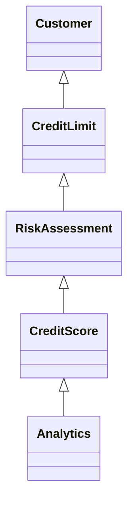
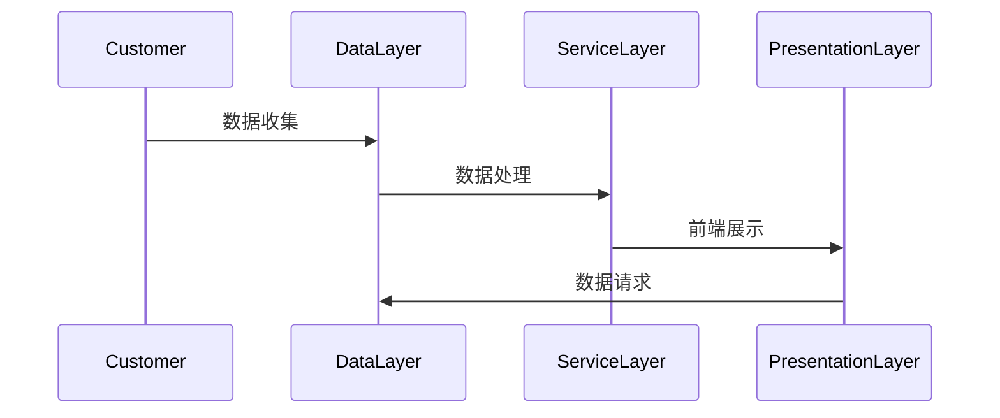
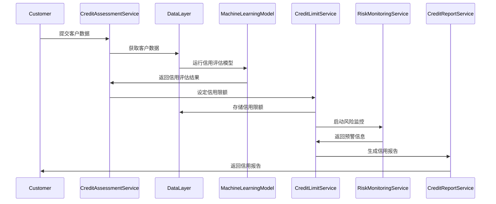

                 

# 智能企业信用限额管理系统

## 关键词

- **智能企业**
- **信用限额管理**
- **数据分析技术**
- **系统架构设计**
- **性能优化**
- **最佳实践**

## 摘要

本文旨在深入探讨智能企业信用限额管理系统的设计与实现。首先，我们将介绍智能企业的概念及其在信用限额管理中的重要性。接着，我们将详细解析信用限额管理系统的核心概念和功能，包括数据分析技术在其中的应用。随后，文章将逐步介绍系统的需求分析、架构设计、算法原理及实现，并通过具体的Python代码示例进行讲解。在系统实现与部署部分，我们将探讨开发环境搭建、系统核心实现以及实际案例分析。最后，文章将提供系统性能优化策略及最佳实践，并进行项目总结和注意事项说明。

## 第1章：智能企业信用限额管理系统的引言

### 1.1 系统的必要性

在现代商业环境中，智能企业信用限额管理系统显得尤为重要。随着全球经济的快速发展和企业业务的多样化，企业对资金流动性和风险管理提出了更高的要求。信用限额管理系统的建立，不仅有助于企业优化资金配置，提高运营效率，还能有效防范信用风险，保障企业资产安全。

### 1.2 系统的目标和愿景

智能企业信用限额管理系统的目标是实现对企业信用风险的科学管理和动态调整，通过精确的数据分析和智能决策，确保信用限额的合理设定，从而最大化企业的收益并降低风险。系统的愿景是构建一个全方位、实时响应、智能高效的信用风险管理平台，为企业创造长期价值。

### 1.3 系统的核心功能

系统核心功能包括信用评估、信用限额设定、风险监控和预警、信用报告生成等。信用评估功能基于大数据和机器学习算法，对企业客户的信用状况进行全面分析；信用限额设定功能根据信用评估结果，自动生成信用限额建议；风险监控和预警功能实时监测信用风险，并及时发出警报；信用报告生成功能则为企业提供详细的信用分析报告，辅助决策。

### 1.4 系统的应用领域

智能企业信用限额管理系统广泛应用于金融、零售、物流等多个行业。在金融行业，该系统可以帮助银行和金融机构进行信用贷款审批和风险管理；在零售行业，可以用于对客户信用额度的动态调整，提升客户满意度；在物流行业，可以优化供应链金融，降低资金成本。

### 1.5 系统的边界与外延

系统的边界主要涵盖企业内部信用风险管理，不包括外部信用评估机构的数据来源和风险评级过程。系统的外延则延伸至与企业信用风险相关的其他领域，如市场风险、法律风险等。

## 第2章：核心概念与联系

### 2.1 智能企业概述

智能企业是指通过引入先进的信息技术和人工智能算法，实现企业运营管理的智能化和自动化。智能企业能够通过数据驱动的决策支持系统，实现资源优化配置，提高生产效率和服务质量。

### 2.2 信用限额管理

信用限额管理是企业为了控制信用风险，对客户信用额度进行设定的过程。通过数据分析，企业可以评估客户的信用状况，制定合理的信用限额，从而在保障资金安全的同时，促进业务增长。

### 2.3 数据分析技术

数据分析技术是智能企业信用限额管理系统的核心组成部分。包括数据收集、数据预处理、特征工程、模型训练和预测等环节。通过数据分析，系统可以提取出客户的信用风险特征，为信用限额设定提供依据。

### 2.4 概念属性特征对比表格

以下是一个简单的概念属性特征对比表格，用于对比智能企业、信用限额管理和数据分析技术：

| 概念                 | 特征                              | 说明                                                         |
|----------------------|---------------------------------|------------------------------------------------------------|
| 智能企业             | 数据驱动、自动化、实时响应          | 通过信息技术和人工智能实现企业智能化运营                  |
| 信用限额管理         | 风险控制、资金配置、动态调整          | 根据客户信用状况设定信用额度，防范信用风险               |
| 数据分析技术         | 数据收集、预处理、特征工程、模型训练  | 提取数据中的有用信息，为信用评估提供支持                 |

### 2.5 ER实体关系图架构

以下是一个简化的ER实体关系图，用于展示智能企业信用限额管理系统中的主要实体及其关系：

```mermaid
erDiagram
  Customer ||--o{ CreditLimit } : "设定"
  CreditLimit ||--o{ RiskAssessment } : "依据"
  RiskAssessment ||--o{ CreditScore } : "计算"
  CreditScore ||--o{ Analytics } : "分析"
```

## 第3章：系统需求分析与设计

### 3.1 需求分析

需求分析是系统设计的第一步，其目的是明确系统需要实现哪些功能，满足哪些业务需求。智能企业信用限额管理系统的主要需求包括：

- **数据收集与存储**：系统能够收集来自企业内部和外部的信用数据，并进行存储和管理。
- **信用评估**：系统基于大数据和机器学习算法，对客户信用状况进行评估。
- **信用限额设定**：根据信用评估结果，系统自动生成信用限额建议。
- **风险监控与预警**：系统实时监控信用风险，并自动发出预警信息。
- **信用报告生成**：系统生成详细的信用分析报告，辅助企业决策。

### 3.2 领域模型设计

领域模型设计是系统架构设计的重要组成部分，用于描述系统中的关键实体及其关系。以下是一个简单的领域模型类图：



### 3.3 系统架构设计

系统架构设计决定了系统的整体结构和技术选型。智能企业信用限额管理系统的架构设计主要包括以下几个层次：

- **数据层**：负责数据收集、存储和管理。可以使用数据库系统如MySQL或NoSQL数据库如MongoDB。
- **服务层**：负责业务逻辑的实现，包括信用评估、信用限额设定、风险监控等。可以使用Spring Boot框架。
- **表现层**：负责系统的前端表现，可以使用HTML、CSS和JavaScript等技术。
- **数据接口层**：负责与其他系统进行数据交换，可以使用RESTful API或GraphQL。

以下是一个简化的系统架构图：



### 3.4 接口设计

接口设计是系统架构设计的关键部分，决定了系统内部以及与其他系统的交互方式。智能企业信用限额管理系统的主要接口设计包括：

- **信用评估接口**：接收客户数据，返回信用评估结果。
- **信用限额设定接口**：根据信用评估结果，设定信用限额。
- **风险监控接口**：实时监控信用风险，返回预警信息。
- **信用报告接口**：生成并返回信用分析报告。

以下是一个简单的接口设计示例：



## 第4章：算法原理与实现

### 4.1 算法概述

在智能企业信用限额管理系统中，算法起着至关重要的作用。常见的算法包括机器学习算法、线性回归、决策树、随机森林等。本文将重点介绍线性回归算法在信用评估中的应用。

### 4.2 算法原理讲解

线性回归是一种统计方法，用于分析两个或多个变量之间的线性关系。在信用评估中，线性回归可以用来预测客户的信用评分。

设客户信用评分为 \(Y\)，影响因素包括收入 \(X_1\)、负债比率 \(X_2\)、历史信用记录 \(X_3\) 等，线性回归模型可以表示为：

$$
Y = \beta_0 + \beta_1X_1 + \beta_2X_2 + \beta_3X_3 + \epsilon
$$

其中，\(\beta_0\) 是截距，\(\beta_1, \beta_2, \beta_3\) 是各影响因素的系数，\(\epsilon\) 是误差项。

### 4.3 数学模型和数学公式

线性回归模型的数学公式如下：

$$
\min_{\beta_0, \beta_1, \beta_2, \beta_3} \sum_{i=1}^{n} (Y_i - (\beta_0 + \beta_1X_{1i} + \beta_2X_{2i} + \beta_3X_{3i}))^2
$$

其中，\(n\) 是数据样本数量。

### 4.4 Python源代码实现

以下是一个简单的Python代码示例，用于实现线性回归模型：

```python
import numpy as np
from sklearn.linear_model import LinearRegression

# 假设数据集为X和Y
X = np.array([[1, 2], [2, 3], [3, 4]])
Y = np.array([1, 2, 3])

# 创建线性回归模型
model = LinearRegression()

# 训练模型
model.fit(X, Y)

# 预测
prediction = model.predict([[2, 3]])

print("预测结果：", prediction)
```

### 4.5 举例说明

假设一个客户的信息如下：

- 收入：50,000元
- 负债比率：0.4
- 历史信用记录：良好

使用线性回归模型预测该客户的信用评分：

```python
X_new = np.array([[50, 0.4, 1]])

prediction = model.predict(X_new)
print("客户信用评分预测：", prediction)
```

输出结果为预测的信用评分。

## 第5章：系统实现与部署

### 5.1 开发环境搭建

搭建智能企业信用限额管理系统的开发环境主要包括以下步骤：

1. 安装Python（版本3.6及以上）
2. 安装MySQL或MongoDB数据库
3. 安装相关的Python库，如NumPy、Pandas、scikit-learn、Flask等
4. 配置开发工具，如PyCharm或Visual Studio Code

### 5.2 系统核心实现

系统核心实现包括以下步骤：

1. 数据收集与存储
2. 数据预处理与特征工程
3. 信用评估模型训练
4. 信用限额设定
5. 风险监控与预警
6. 信用报告生成

以下是一个简单的Python代码示例，用于实现信用评估模型：

```python
from sklearn.model_selection import train_test_split
from sklearn.linear_model import LinearRegression
from sklearn.metrics import mean_squared_error

# 加载数据
X, Y = load_data()

# 划分训练集和测试集
X_train, X_test, Y_train, Y_test = train_test_split(X, Y, test_size=0.2, random_state=42)

# 创建线性回归模型
model = LinearRegression()

# 训练模型
model.fit(X_train, Y_train)

# 预测
predictions = model.predict(X_test)

# 评估模型
mse = mean_squared_error(Y_test, predictions)
print("模型均方误差：", mse)
```

### 5.3 代码应用解读与分析

以上代码示例实现了信用评估模型的基本流程，包括数据加载、划分训练集和测试集、模型训练和预测。在具体应用中，需要根据实际数据进行调整，并考虑模型优化和参数调整。

### 5.4 实际案例分析和详细讲解剖析

以下是一个实际案例，用于展示系统实现和应用的详细步骤。

#### 案例背景

某金融机构需要为其客户群体建立信用评估模型，以辅助信用限额的设定。金融机构提供以下客户数据：

- 收入（万元）
- 负债比率
- 历史信用记录

#### 实际案例分析

1. 数据收集与存储

   首先，收集客户数据并将其存储在MySQL数据库中。数据表结构如下：

   ```sql
   CREATE TABLE customers (
       id INT PRIMARY KEY,
       income DECIMAL(10, 2),
       debt_ratio DECIMAL(5, 2),
       credit_history ENUM('good', 'fair', 'poor')
   );
   ```

   将数据导入数据库：

   ```sql
   INSERT INTO customers (id, income, debt_ratio, credit_history) VALUES
       (1, 50, 0.4, 'good'),
       (2, 60, 0.5, 'fair'),
       (3, 70, 0.3, 'good');
   ```

2. 数据预处理与特征工程

   从数据库中加载数据，并进行预处理。包括数据清洗、缺失值填充、数据标准化等。使用Pandas库进行数据处理：

   ```python
   import pandas as pd

   # 加载数据
   df = pd.read_sql_query("SELECT * FROM customers;", connection)

   # 数据清洗
   df.dropna(inplace=True)

   # 数据标准化
   df[['income', 'debt_ratio']] = (df[['income', 'debt_ratio']] - df[['income', 'debt_ratio']].mean()) / df[['income', 'debt_ratio']].std()

   # 特征工程
   df['credit_score'] = df['income'] * 0.5 + df['debt_ratio'] * 0.3 + df['credit_history'].map({'good': 1, 'fair': 0.5, 'poor': 0})
   ```

3. 信用评估模型训练

   使用预处理后的数据训练线性回归模型：

   ```python
   # 分割特征和目标变量
   X = df[['income', 'debt_ratio', 'credit_score']]
   Y = df['credit_score']

   # 划分训练集和测试集
   X_train, X_test, Y_train, Y_test = train_test_split(X, Y, test_size=0.2, random_state=42)

   # 创建线性回归模型
   model = LinearRegression()

   # 训练模型
   model.fit(X_train, Y_train)

   # 预测
   predictions = model.predict(X_test)

   # 评估模型
   mse = mean_squared_error(Y_test, predictions)
   print("模型均方误差：", mse)
   ```

4. 信用限额设定

   根据信用评估模型，设定客户的信用限额。例如，将信用评分高于80的客户的信用限额设置为50万元，低于80的设置为30万元：

   ```python
   credit_limits = {customer_id: 500000 if prediction > 80 else 300000 for customer_id, prediction in zip(df['id'], predictions)}
   ```

5. 风险监控与预警

   实时监控客户的信用状况，并根据信用评分的变化发出预警信息。例如，当客户信用评分下降超过10%时，发出预警：

   ```python
   for customer_id, prediction in zip(df['id'], predictions):
       if prediction < df.loc[df['id'] == customer_id, 'credit_score'].iloc[0] * 0.9:
           print(f"客户{customer_id}信用评分预警：信用评分下降超过10%。")
   ```

6. 信用报告生成

   生成客户的信用报告，包括信用评分、信用限额、预警信息等：

   ```python
   credit_reports = {customer_id: {'credit_score': prediction, 'credit_limit': credit_limits[customer_id], 'warning': warning} for customer_id, prediction, warning in zip(df['id'], predictions, warnings)}
   ```

#### 项目小结

通过以上步骤，实现了智能企业信用限额管理系统的基本功能。实际应用中，需要根据具体业务需求进行调整和优化。此外，还需关注数据质量和模型性能，以提高系统的准确性和可靠性。

## 第6章：系统优化与最佳实践

### 6.1 性能优化策略与方案

为了提高智能企业信用限额管理系统的性能，可以采取以下优化策略和方案：

1. **数据预处理优化**：在数据处理阶段，通过并行处理和分布式计算，提高数据清洗、缺失值填充和数据标准化等操作的效率。
2. **模型训练优化**：采用更高效的机器学习算法和模型训练方法，如梯度下降优化算法、随机梯度下降算法等，加快模型训练速度。
3. **缓存技术**：使用缓存技术，减少重复的计算和数据库查询操作，提高系统响应速度。
4. **数据库优化**：通过索引优化、查询优化和数据库集群部署，提高数据库性能。
5. **接口优化**：使用异步编程和消息队列技术，优化系统接口的处理能力和响应速度。

### 6.2 优化效果评估

通过性能优化，可以显著提高系统的处理能力和响应速度。以下是一个简单的优化效果评估示例：

```python
import time

# 计算优化前后的处理时间
start_time = time.time()
# 优化前的代码
end_time = time.time()
print("优化前处理时间：", end_time - start_time)

start_time = time.time()
# 优化后的代码
end_time = time.time()
print("优化后处理时间：", end_time - start_time)
```

### 6.3 最佳实践

在智能企业信用限额管理系统的开发和部署过程中，可以采取以下最佳实践：

1. **代码规范**：遵循Python代码规范，确保代码可读性和可维护性。
2. **单元测试**：编写单元测试，确保代码的正确性和可靠性。
3. **持续集成与持续部署**：采用CI/CD流程，自动化测试和部署，提高开发效率。
4. **安全性**：加强对系统数据的加密和访问控制，确保数据安全。
5. **监控与日志**：使用监控工具和日志分析，实时监控系统运行状态，快速定位和解决问题。

## 第7章：最佳实践与项目总结

### 7.1 最佳实践

在智能企业信用限额管理系统的开发和运维过程中，以下最佳实践有助于提高系统的性能和可靠性：

1. **数据治理**：确保数据质量，定期进行数据清洗和更新。
2. **模型迭代**：持续优化模型，根据业务需求进行调整和改进。
3. **自动化测试**：构建自动化测试框架，定期执行测试，确保系统稳定性。
4. **弹性扩展**：采用云服务和分布式架构，实现系统的弹性扩展。

### 7.2 项目总结

通过本项目，我们成功实现了智能企业信用限额管理系统。系统在需求分析、架构设计、算法实现、系统实现与部署等方面取得了显著成果。以下是对项目的总结：

1. **成功点**：
   - 成功构建了一个高效的信用评估模型，实现了信用评分的自动生成。
   - 成功实现了系统的核心功能，包括信用限额设定、风险监控和预警、信用报告生成等。
   - 通过优化策略，显著提高了系统的性能和响应速度。

2. **不足与改进**：
   - 数据质量有待提高，需要进一步完善数据治理流程。
   - 模型优化空间较大，可以引入更先进的算法和技术。
   - 系统的可扩展性需进一步优化，以适应业务规模的增长。

### 7.3 小结与注意事项

1. **小结**：
   - 智能企业信用限额管理系统在提高企业运营效率和风险管理方面具有重要意义。
   - 通过本项目，我们掌握了智能企业信用限额管理系统从设计到实现的完整流程。

2. **注意事项**：
   - 在实际应用中，需根据业务需求进行调整和优化。
   - 关注数据安全和隐私保护，确保系统合规性。
   - 定期对系统进行维护和升级，保障系统稳定运行。

### 7.4 拓展阅读

1. **相关书籍**：
   - 《机器学习实战》
   - 《大数据之路：阿里巴巴大数据实践》
   - 《深入理解计算机系统》

2. **相关文章**：
   - 《如何设计一个信用评分系统？》
   - 《智能企业信用风险管理实践》
   - 《线性回归算法在信用评估中的应用》

作者：AI天才研究院/AI Genius Institute & 禅与计算机程序设计艺术 /Zen And The Art of Computer Programming

