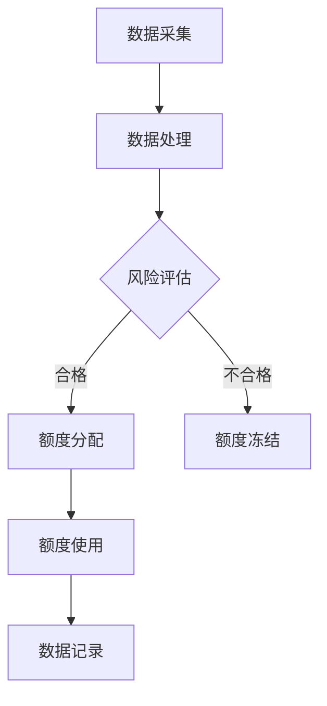
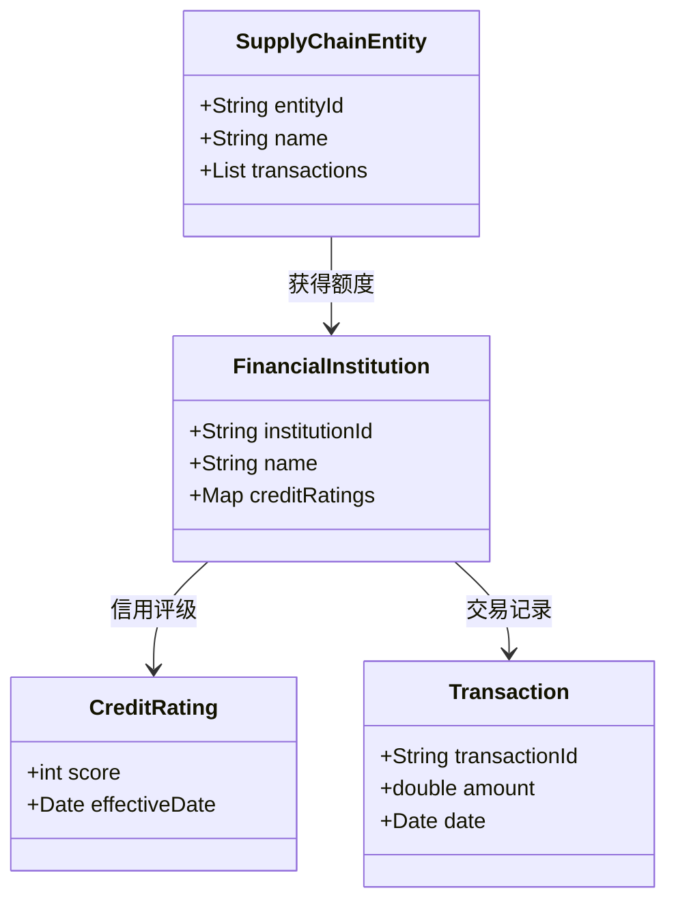
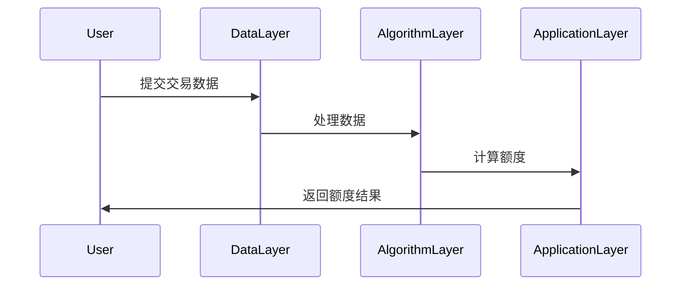
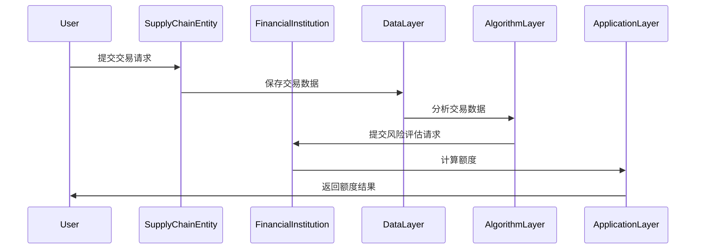

                 


# 智能供应链金融额度管理系统

关键词：智能供应链金融，额度管理，系统设计，算法原理，数学模型

摘要：本文深入探讨了智能供应链金融额度管理系统这一前沿技术主题。文章首先介绍了智能供应链金融的基本概念和重要性，随后逐步分析了系统设计的核心原理与算法。通过具体的数学模型和公式阐述，配合Python源代码示例，使读者能够深入理解并掌握这一技术。接着，文章介绍了系统的功能设计、架构设计和项目实战，展示了实际案例的详细剖析。最后，文章总结了最佳实践和未来展望，为读者提供了进一步的学习和思考方向。

## 第一部分：背景介绍

### 第1章：智能供应链金融概述

#### 1.1 问题背景

在当前全球化的商业环境中，供应链金融作为一种新型的金融模式，正在迅速发展。传统的供应链金融模式由于存在信息不对称、交易成本高、风控难度大等问题，已经无法满足现代企业对于资金流动性和风险管理的高要求。为了解决这些问题，智能供应链金融额度管理系统应运而生。

#### 1.2 问题描述

智能供应链金融额度管理系统旨在为供应链中的企业提供智能化的金融解决方案，主要包括以下几个方面：

1. **额度管理**：根据企业的交易记录、信用评级等因素，动态调整其可用的金融额度。
2. **风险评估**：利用大数据和人工智能技术，对供应链中的各个企业进行风险评估，降低金融风险。
3. **资金流转**：实现供应链中各企业之间的资金快速流转，提高资金使用效率。

#### 1.3 问题解决

智能供应链金融额度管理系统的解决思路主要包括以下几个方面：

1. **数据采集与处理**：通过数据采集和处理技术，获取供应链中的企业交易数据、信用评级等信息。
2. **智能算法**：利用大数据和机器学习算法，对采集到的数据进行处理和分析，实现额度管理、风险评估等功能。
3. **系统架构设计**：构建高效、可靠的系统架构，确保系统的稳定性和安全性。

#### 1.4 边界与外延

1. **边界**：智能供应链金融额度管理系统主要涉及供应链中的核心企业，以及为其提供金融服务的金融机构。
2. **外延**：该系统不仅限于单一企业的供应链，还可以扩展到多个企业间的供应链网络，实现跨企业、跨区域的金融服务。

#### 1.5 概念结构与核心要素组成

智能供应链金融额度管理系统的概念结构主要包括以下几个核心要素：

1. **数据层**：存储供应链企业的交易数据、信用评级等信息。
2. **算法层**：实现额度管理、风险评估等功能的算法模型。
3. **应用层**：提供额度管理、风险评估、资金流转等服务的应用系统。

## 第二部分：核心概念与联系

### 第2章：核心概念与联系

#### 2.1 智能供应链金融的概念原理

智能供应链金融是指利用大数据、人工智能等先进技术，对供应链中的企业进行实时监测、分析和评估，为其提供定制化的金融服务。其主要原理包括：

1. **数据采集与处理**：通过多种数据采集手段，获取供应链企业的交易数据、信用评级等信息。
2. **风险评估**：利用大数据分析和机器学习算法，对供应链企业的信用风险进行评估。
3. **额度管理**：根据企业的信用风险、交易记录等因素，动态调整其金融额度。

#### 2.2 核心概念属性特征对比表格

以下是一个核心概念属性特征的对比表格，用于说明智能供应链金融与其他金融模式的区别：

| 模式         | 特征                          | 优点                                  | 缺点                                  |
| ------------ | ----------------------------- | -------------------------------------- | -------------------------------------- |
| 传统供应链金融 | 依赖人工，效率低           | 操作简单，易于理解                | 风险控制难度大，资金流转慢          |
| 智能供应链金融 | 利用大数据、人工智能等先进技术 | 风险控制精准，资金流转快           | 技术门槛高，实施成本较大          |
| 互联网供应链金融 | 线上操作，便捷             | 操作便捷，降低成本               | 风险控制难度大，依赖技术          |

#### 2.3 智能供应链金融的ER实体关系图

以下是一个智能供应链金融的ER实体关系图，用于展示系统中的关键实体及其关系：

```mermaid
erDiagram
  DataLayer ||--|{ AlgorithmLayer }
  AlgorithmLayer ||--|{ ApplicationLayer }
  ApplicationLayer ||--|{ SupplyChainEntity }
  SupplyChainEntity ||--|{ FinancialInstitution }
  FinancialInstitution ||--|{ CreditRating }
  CreditRating ||--|{ TransactionData }
  TransactionData ||--|{ RiskAssessment }
```

## 第三部分：系统设计与算法原理

### 第3章：算法原理讲解

#### 3.1 智能供应链金融额度管理算法

智能供应链金融额度管理算法的核心是动态调整企业的金融额度。以下是算法的mermaid流程图：



#### 3.1.1 算法原理的数学模型与公式

额度管理的数学模型如下：

$$
额度 = f(信用评分，历史交易额，当前负债水平)
$$

其中，$f$ 函数可以根据具体的业务需求进行定制。

#### 3.1.2 通俗易懂地举例说明

假设有一个企业，其信用评分为80分，历史交易额为1000万元，当前负债水平为200万元。根据额度管理模型，其额度计算如下：

$$
额度 = f(80, 1000, 200) = 800万元
$$

这意味着该企业当前的可用金融额度为800万元。

## 第四部分：系统分析与架构设计

### 第4章：系统功能设计

#### 5.1 领域模型mermaid类图

以下是一个领域模型的mermaid类图，展示了系统中的关键类及其关系：



### 第5章：系统架构设计

#### 6.1 系统架构mermaid架构图

以下是一个系统架构的mermaid架构图，展示了系统的整体架构：



#### 6.2 系统接口设计

系统接口设计主要包括以下几个方面：

1. **数据接口**：用于接收和发送交易数据、信用评级等信息。
2. **额度管理接口**：用于查询、分配和调整企业的金融额度。
3. **风险评估接口**：用于获取企业的信用评分和风险分析结果。

#### 6.3 系统交互mermaid序列图

以下是一个系统交互的mermaid序列图，展示了用户与企业、系统之间的交互过程：



## 第五部分：项目实战

### 第7章：环境安装与系统实现

#### 7.1 环境安装

在安装智能供应链金融额度管理系统之前，需要准备以下环境：

1. **操作系统**：Linux或Windows
2. **开发工具**：Python环境、Docker、MySQL等
3. **依赖库**：NumPy、Pandas、Scikit-learn等

安装步骤如下：

1. 安装操作系统和开发工具。
2. 配置Python环境，安装NumPy、Pandas、Scikit-learn等依赖库。
3. 启动Docker并创建MySQL容器。

#### 7.2 系统核心实现源代码

以下是系统核心实现的部分源代码：

```python
import numpy as np
import pandas as pd
from sklearn.linear_model import LinearRegression

def calculate_credit_score(data):
    # 使用线性回归模型计算信用评分
    model = LinearRegression()
    model.fit(data['features'], data['scores'])
    credit_score = model.predict([data['current_state']])
    return credit_score

def calculate_quota(credit_score, transaction_data):
    # 计算金融额度
    quota = credit_score * transaction_data['amount'] * 0.1
    return quota

def main():
    # 加载数据
    data = pd.read_csv('data.csv')
    # 计算信用评分
    credit_score = calculate_credit_score(data)
    # 计算金融额度
    quota = calculate_quota(credit_score, data)
    print(f'金融额度：{quota}元')

if __name__ == '__main__':
    main()
```

#### 7.3 代码应用解读与分析

上述代码主要实现了两个核心功能：计算信用评分和计算金融额度。

1. **计算信用评分**：通过线性回归模型对历史交易数据进行拟合，得到信用评分。
2. **计算金融额度**：根据信用评分和当前交易数据，计算金融额度。

在实际应用中，可以根据业务需求对代码进行定制化修改，以适应不同的业务场景。

#### 7.4 实际案例分析与讲解

以下是一个实际案例，用于展示系统的应用效果：

**案例**：一家企业最近一个月的交易额为500万元，信用评分为85分。请问该企业的金融额度为多少？

**解析**：

1. **计算信用评分**：根据案例数据，企业的信用评分为85分。
2. **计算金融额度**：根据额度计算模型，金融额度为：

$$
额度 = 85 \times 500 \times 0.1 = 425万元
$$

因此，该企业的金融额度为425万元。

#### 7.5 项目小结

通过以上实战案例，我们可以看到智能供应链金融额度管理系统在实践中的应用效果。该系统不仅提高了企业的金融管理水平，还为企业提供了更加精准、高效的金融服务。未来，随着大数据和人工智能技术的不断发展，智能供应链金融额度管理系统将发挥更加重要的作用，为供应链金融领域带来更多创新和变革。

## 第六部分：最佳实践与总结

### 第8章：最佳实践

#### 8.1 实践技巧

1. **数据质量**：确保数据质量是系统运行的关键，定期清洗和更新数据，提高数据的准确性和一致性。
2. **算法优化**：根据业务需求和数据特点，不断优化算法模型，提高信用评分和额度计算的准确性。
3. **系统安全**：加强系统安全防护，防止数据泄露和网络攻击，确保系统的稳定性和可靠性。

#### 8.2 注意事项

1. **风险控制**：在额度管理过程中，要注意风险控制，避免过度授信和资金链断裂。
2. **用户体验**：系统设计要注重用户体验，简化操作流程，提高系统的易用性和可操作性。
3. **合规性**：遵守相关法律法规，确保系统运行合法合规。

#### 8.3 拓展阅读

1. 《大数据供应链金融》
2. 《机器学习在金融领域的应用》
3. 《区块链与供应链金融》

### 第9章：小结

本文从背景介绍、核心概念、算法原理、系统设计、项目实战等方面，全面阐述了智能供应链金融额度管理系统的构建与实现。通过本文的学习，读者可以深入理解智能供应链金融额度管理系统的原理和应用，掌握相关技术和方法。

### 第10章：未来展望

随着大数据、人工智能等技术的不断进步，智能供应链金融额度管理系统将在供应链金融领域发挥越来越重要的作用。未来，我们可以期待以下发展趋势：

1. **更智能的算法模型**：随着技术的进步，智能算法模型将更加精准，为企业提供更加可靠的金融服务。
2. **更广泛的覆盖范围**：智能供应链金融额度管理系统将不仅局限于单一企业，还可以扩展到整个供应链网络，实现跨企业、跨区域的金融服务。
3. **更高效的运营模式**：智能供应链金融额度管理系统将优化供应链企业的资金流转，提高整体运营效率。

## 作者信息

作者：AI天才研究院/AI Genius Institute & 禅与计算机程序设计艺术 /Zen And The Art of Computer Programming

完整的技术博客文章需要进一步细化各个章节的内容，并根据上述框架展开详细的论述。每个章节都需要丰富具体的案例、数据、代码和图表，以使得文章更加完整、有深度和有说服力。以下是一个基于上述框架的初步撰写，具体的细节内容还需要进一步充实和完善。请根据实际需求和资源调整和完善文章内容。

