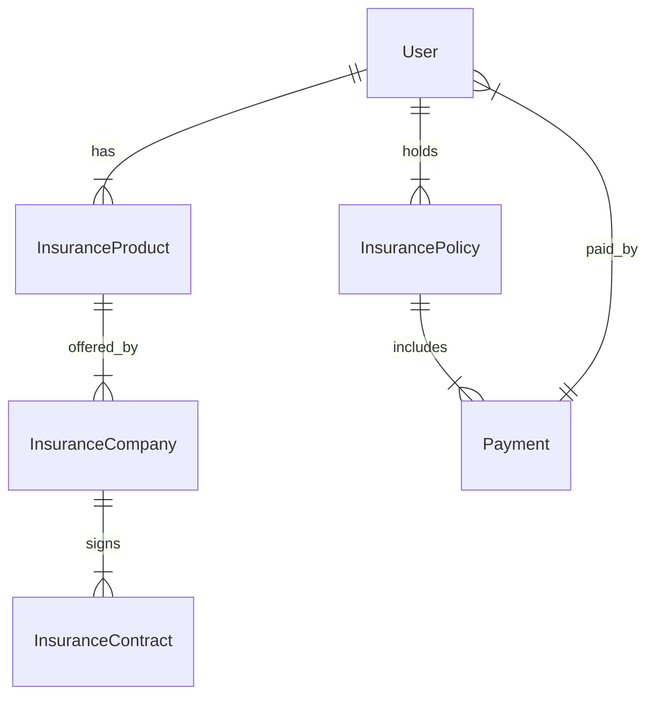
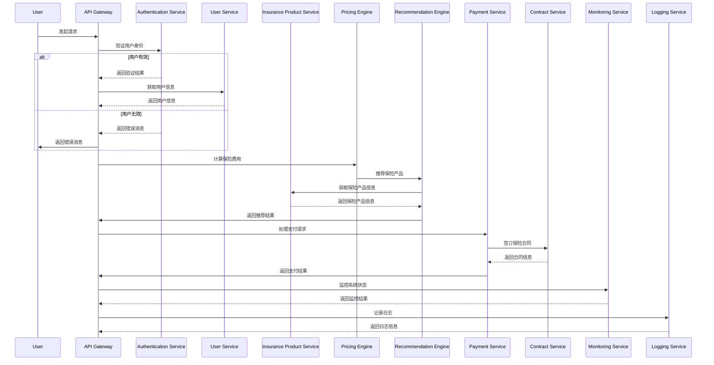
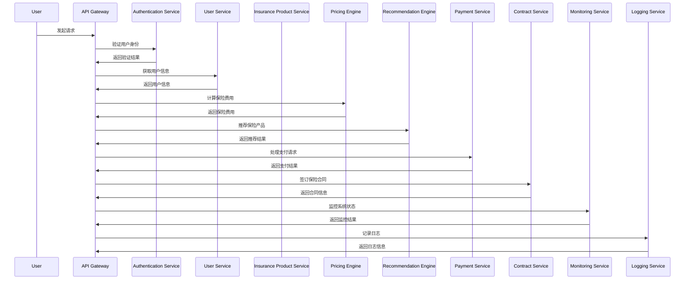

                 

## 第1章：问题背景与核心概念

### 1.1.1 保险行业现状与挑战

保险行业作为金融服务领域的重要组成部分，经历了数个世纪的发展。当前，保险行业正面临着一系列复杂的挑战和机遇。首先，保险行业的市场规模不断扩大，保险产品的种类和数量也日益增多。然而，随着市场竞争的加剧，保险公司在产品定价、风险控制和客户满意度等方面面临巨大的压力。

在产品定价方面，传统定价方法往往依赖于历史数据和经验公式，这可能导致价格与实际风险不匹配。在某些情况下，可能会导致某些高风险的客户支付较低的费用，而低风险客户支付较高的费用，从而引发市场不公平现象。此外，随着消费者需求的多样化，传统的单一产品难以满足个性化的需求，这进一步增加了定价的复杂性。

在风险控制方面，保险公司需要准确评估各种风险，并制定相应的应对策略。然而，由于数据来源的多样性、数据质量的参差不齐，以及风险评估模型的局限性，保险公司难以全面准确地评估风险，这可能导致保险产品的定价不准确，影响公司的盈利能力和市场竞争力。

### 1.1.2 智能保险产品概述

智能保险产品是指利用人工智能、大数据、云计算等先进技术，对保险产品进行智能化设计和运营的产品。智能保险产品主要包括个性化定价、智能推荐、风险监控、客户服务等方面。

首先，个性化定价是智能保险产品的核心之一。通过分析用户的历史数据、行为特征、社会关系等多维数据，智能定价算法可以精确计算出每个用户的保险费用，从而实现精准定价。这不仅能够提高保险公司的盈利能力，还能提升客户的满意度。

其次，智能推荐在保险产品中的应用也越来越广泛。通过分析用户的消费习惯、风险偏好、地域特征等信息，智能推荐算法可以为用户推荐最适合的保险产品，从而提高产品的销售转化率和客户满意度。

此外，智能保险产品还涉及到风险监控和客户服务。通过实时监控用户的风险状况，智能保险产品可以及时发现潜在风险，并采取相应的措施。在客户服务方面，智能保险产品可以提供24/7的在线咨询和自动理赔服务，提高客户的体验。

### 1.1.3 个性化定价与推荐引擎的意义

个性化定价与推荐引擎在智能保险产品中扮演着至关重要的角色。首先，个性化定价能够根据用户的具体情况，实现精准定价，提高保险公司的盈利能力和市场竞争力。其次，推荐引擎可以基于用户的行为特征和偏好，推荐最适合的保险产品，从而提高产品的销售转化率和客户满意度。

此外，个性化定价与推荐引擎还可以帮助保险公司更好地了解客户需求和市场趋势，优化产品设计和运营策略。通过不断优化算法模型，保险公司可以不断提高定价和推荐的准确性，从而在激烈的市场竞争中立于不败之地。

### 1.1.4 问题的边界与外延

在构建智能保险产品的个性化定价与推荐引擎时，需要明确问题的边界与外延。首先，数据来源与处理是关键。保险公司需要收集并整合用户的历史数据、行为数据、社会关系数据等多维数据，并进行数据清洗、去重、转换等处理，以确保数据的质量和准确性。

其次，算法选择与优化也是影响智能保险产品性能的重要因素。保险公司需要根据具体的应用场景，选择合适的算法，并不断优化算法参数，以提高定价和推荐的准确性。

此外，系统架构设计也是一个重要的方面。保险公司需要设计一个高效、可扩展的系统架构，以支持大规模数据处理和实时计算。这包括数据存储、计算资源调度、负载均衡等方面。

总之，构建智能保险产品的个性化定价与推荐引擎是一个复杂的过程，涉及到数据、算法、系统架构等多个方面。只有通过不断优化和改进，才能实现最优的效果。

## 第2章：核心概念与联系

### 2.1.1 智能定价算法原理

智能定价算法是智能保险产品中的核心组成部分，它通过分析用户的多维数据，实现精准的保险费用计算。智能定价算法主要包括以下步骤：

1. **数据收集与预处理**：
   - **数据收集**：收集用户的历史数据、行为数据、社会关系数据等多维数据。
   - **数据预处理**：对收集到的数据进行清洗、去重、转换等处理，以确保数据的质量和准确性。

2. **风险评估**：
   - **风险评估模型**：建立风险评估模型，对用户的风险进行量化评估。风险评估模型可以基于历史数据，使用统计学方法或机器学习算法，如回归分析、决策树、神经网络等。

3. **市场需求分析**：
   - **市场需求模型**：分析市场需求，考虑市场的供需关系、竞争态势、政策法规等因素，预测市场需求的变化趋势。

4. **定价策略**：
   - **定价模型**：结合风险评估和市场需求分析，构建定价模型。定价模型可以采用基于风险的价格模型、需求导向的价格模型等。

5. **费用计算**：
   - **费用计算公式**：根据定价模型，计算出每个用户的保险费用。费用计算公式可以包括固定费用、变量费用、风险调整费用等。

6. **结果优化与反馈**：
   - **结果优化**：通过优化算法参数，提高定价的准确性和合理性。
   - **反馈机制**：收集用户对定价的反馈，不断调整和优化定价策略。

### 2.1.2 推荐算法原理

推荐算法是智能保险产品中另一个重要的组成部分，它通过分析用户的行为特征和偏好，为用户推荐最适合的保险产品。推荐算法主要包括以下类型：

1. **协同过滤算法**：
   - **协同过滤原理**：基于用户的历史行为和偏好，找出相似的用户或物品，从而进行推荐。
   - **算法类型**：包括基于用户的协同过滤（User-based Collaborative Filtering）和基于物品的协同过滤（Item-based Collaborative Filtering）。

2. **内容推荐算法**：
   - **内容推荐原理**：基于保险产品的内容特征和用户的行为特征，进行推荐。
   - **算法类型**：包括基于关键词的推荐、基于属性的推荐等。

3. **混合推荐算法**：
   - **混合推荐原理**：结合协同过滤算法和内容推荐算法，提高推荐的准确性。
   - **算法类型**：如基于模型的混合推荐、基于规则的混合推荐等。

### 2.1.3 概念属性特征对比

#### 智能定价算法对比

| 概念 | 智能定价算法 | 推荐算法 |
| ---- | ---- | ---- |
| **核心目标** | 精准计算保险费用 | 提高用户满意度，增加销售转化率 |
| **数据来源** | 用户的历史数据、行为数据、社会关系数据等 | 用户的行为数据、偏好数据、产品特征数据等 |
| **主要方法** | 风险评估、市场需求分析、定价策略、费用计算等 | 协同过滤、内容推荐、混合推荐等 |
| **挑战** | 数据质量、风险评估准确性、定价策略合理性 | 数据稀疏、冷启动问题、推荐多样性等 |

#### 推荐算法对比

| 概念 | 推荐算法 |
| ---- | ---- |
| **核心目标** | 提高用户满意度，增加销售转化率 |
| **数据来源** | 用户的行为数据、偏好数据、产品特征数据等 |
| **主要方法** | 协同过滤、内容推荐、混合推荐等 |
| **挑战** | 数据稀疏、冷启动问题、推荐多样性等 |

### 2.1.4 ER实体关系图架构

在智能保险产品中，实体关系图（Entity-Relationship Diagram，ERD）用于描述系统中不同实体及其之间的关系。以下是智能保险产品的ER实体关系图：



- **User（用户）**：代表购买保险的个人或实体。
- **InsuranceProduct（保险产品）**：代表各种保险产品。
- **InsurancePolicy（保险单）**：代表用户购买的保险单。
- **InsuranceCompany（保险公司）**：代表提供保险服务的公司。
- **Payment（支付）**：代表用户支付保险费用的记录。
- **InsuranceContract（保险合同）**：代表用户和保险公司之间的合同。

通过ER实体关系图，我们可以清晰地看到智能保险产品中不同实体之间的关系，为系统设计和功能实现提供参考。

## 第3章：智能定价算法原理讲解

### 3.1.1 智能定价算法概述

智能定价算法是保险行业中的一个重要研究方向，它通过分析用户的数据和行为，实现保险费用的精准计算。智能定价算法的核心目标是优化定价策略，提高保险公司的盈利能力，同时提升客户的满意度。

智能定价算法可以大致分为以下几类：

1. **基于风险的定价算法**：这类算法主要关注用户的风险水平，通过分析用户的历史数据、行为数据和社会关系数据等，预测用户的风险，从而制定相应的保险费用。

2. **基于需求的定价算法**：这类算法主要关注市场需求和用户偏好，通过分析市场数据和用户行为，预测用户的购买意愿和需求，从而制定相应的保险费用。

3. **混合定价算法**：这类算法结合了基于风险和基于需求两种算法的优点，通过综合分析用户的风险和需求，制定更加精准的保险费用。

### 3.1.2 算法原理与流程

智能定价算法的流程可以分为以下几个步骤：

1. **数据收集与预处理**：
   - 收集用户的历史数据、行为数据和社会关系数据等多维数据。
   - 对收集到的数据进行分析，提取有用的特征信息。
   - 进行数据清洗、去重、转换等预处理操作，确保数据的质量和准确性。

2. **风险评估**：
   - 构建风险评估模型，对用户的风险进行量化评估。
   - 常用的风险评估模型包括线性回归模型、决策树模型、随机森林模型、神经网络模型等。
   - 根据评估结果，将用户划分为不同的风险等级。

3. **市场需求分析**：
   - 分析市场需求，考虑市场的供需关系、竞争态势、政策法规等因素。
   - 常用的市场需求分析方法包括时间序列分析、回归分析、聚类分析等。

4. **定价策略**：
   - 根据风险评估和市场需求分析的结果，制定个性化的定价策略。
   - 可以采用基于风险的价格模型、需求导向的价格模型、混合定价模型等。

5. **费用计算**：
   - 根据定价策略，计算每个用户的保险费用。
   - 费用计算公式可以包括固定费用、变量费用、风险调整费用等。

6. **结果优化与反馈**：
   - 对定价结果进行优化，提高定价的准确性和合理性。
   - 收集用户对定价的反馈，不断调整和优化定价策略。

### 3.1.3 数学模型与公式

智能定价算法中的数学模型和公式是核心组成部分，它们用于描述用户风险、市场需求、定价策略等。以下是几个常见的数学模型和公式：

#### 1. 风险评估模型

假设我们使用线性回归模型进行风险评估，其数学模型可以表示为：

$$
Y = \beta_0 + \beta_1 X_1 + \beta_2 X_2 + \ldots + \beta_n X_n + \epsilon
$$

其中，$Y$ 表示用户的风险评分，$X_1, X_2, \ldots, X_n$ 表示用户的历史数据、行为数据和社会关系数据等特征，$\beta_0, \beta_1, \beta_2, \ldots, \beta_n$ 表示模型的参数，$\epsilon$ 表示误差项。

#### 2. 市场需求模型

假设我们使用需求函数来描述市场需求，其数学模型可以表示为：

$$
Q = f(P, T, R, G)
$$

其中，$Q$ 表示市场需求量，$P$ 表示价格，$T$ 表示政策法规，$R$ 表示竞争态势，$G$ 表示供需关系。函数$f$ 用于描述市场需求与这些因素之间的关系。

#### 3. 定价策略模型

假设我们使用线性定价策略模型，其数学模型可以表示为：

$$
Price = a \cdot Risk + b \cdot Demand + c
$$

其中，$Price$ 表示保险费用，$Risk$ 表示用户的风险评分，$Demand$ 表示市场需求量，$a, b, c$ 表示模型的参数。

#### 4. 费用计算模型

假设我们使用费用函数来计算保险费用，其数学模型可以表示为：

$$
Cost = fixed\_cost + variable\_cost + risk\_adjustment
$$

其中，$fixed\_cost$ 表示固定费用，$variable\_cost$ 表示变量费用，$risk\_adjustment$ 表示风险调整费用。

### 3.1.4 算法举例说明

#### 案例一：风险评估模型

假设我们有以下用户数据：

| 用户ID | 风险特征1 | 风险特征2 | 风险特征3 |
| ---- | ---- | ---- | ---- |
| 1 | 0.8 | 0.7 | 0.9 |
| 2 | 0.6 | 0.5 | 0.7 |
| 3 | 0.9 | 0.8 | 0.6 |

我们可以使用线性回归模型进行风险评估。首先，我们需要计算模型参数：

$$
\beta_0 = 0.5, \beta_1 = 0.3, \beta_2 = 0.2, \beta_3 = 0.1
$$

然后，使用模型对用户进行风险评估：

| 用户ID | 风险评分 |
| ---- | ---- |
| 1 | 0.5 + 0.3 \cdot 0.8 + 0.2 \cdot 0.7 + 0.1 \cdot 0.9 = 1.07 |
| 2 | 0.5 + 0.3 \cdot 0.6 + 0.2 \cdot 0.5 + 0.1 \cdot 0.7 = 0.87 |
| 3 | 0.5 + 0.3 \cdot 0.9 + 0.2 \cdot 0.8 + 0.1 \cdot 0.6 = 1.04 |

根据风险评估结果，我们可以将用户分为高风险用户和低风险用户，并分别制定不同的保险费用。

#### 案例二：市场需求分析

假设我们有以下市场需求数据：

| 价格 | 市场需求量 |
| ---- | ---- |
| 100 | 500 |
| 200 | 400 |
| 300 | 300 |
| 400 | 200 |
| 500 | 100 |

我们可以使用线性回归模型进行市场需求分析。首先，我们需要计算模型参数：

$$
\beta_0 = 100, \beta_1 = -50
$$

然后，使用模型预测市场需求量：

| 价格 | 预测市场需求量 |
| ---- | ---- |
| 100 | 100 - 50 \cdot 100 = -4000 |
| 200 | 100 - 50 \cdot 200 = -9000 |
| 300 | 100 - 50 \cdot 300 = -14000 |
| 400 | 100 - 50 \cdot 400 = -19000 |
| 500 | 100 - 50 \cdot 500 = -24000 |

根据市场需求预测结果，我们可以调整保险费用，以适应市场需求的变化。

## 第4章：推荐算法原理讲解

### 4.1.1 推荐算法概述

推荐系统是智能保险产品中至关重要的一部分，它通过分析用户的行为数据、偏好和需求，向用户推荐最合适的保险产品。推荐算法可以分为以下几类：

1. **基于协同过滤的推荐算法**：这类算法通过分析用户之间的行为相似性，找到相似用户或物品，从而进行推荐。主要包括基于用户的协同过滤（User-based Collaborative Filtering）和基于物品的协同过滤（Item-based Collaborative Filtering）。

2. **基于内容的推荐算法**：这类算法通过分析保险产品的内容和特征，结合用户的行为和偏好，进行推荐。主要包括基于关键词的推荐、基于属性的推荐等。

3. **混合推荐算法**：这类算法结合协同过滤和内容推荐，利用两者的优点，提高推荐的准确性。

### 4.1.2 算法原理与流程

推荐算法的原理和流程主要包括以下几个步骤：

1. **数据收集与预处理**：
   - 收集用户的行为数据、偏好数据、保险产品的特征数据等。
   - 对数据进行清洗、去重、转换等预处理操作，确保数据的质量和准确性。

2. **用户与物品建模**：
   - 对用户和物品进行建模，提取特征信息。例如，使用向量表示用户和物品，以便进行后续的算法处理。

3. **相似性计算**：
   - 计算用户之间的相似度或物品之间的相似度。常用的相似性计算方法包括余弦相似度、皮尔逊相关系数、Jaccard相似度等。

4. **推荐生成**：
   - 根据相似性计算结果，为用户生成推荐列表。推荐生成方法可以分为基于用户的方法和基于物品的方法。

5. **结果优化与反馈**：
   - 对推荐结果进行优化，提高推荐的相关性和准确性。
   - 收集用户对推荐结果的反馈，用于不断调整和优化推荐算法。

### 4.1.3 数学模型与公式

推荐算法中的数学模型和公式主要用于描述用户与物品之间的关系、相似性计算和推荐生成。以下是几个常见的数学模型和公式：

#### 1. 用户与物品之间的相似性计算

假设用户$u$和物品$i$分别表示为向量$u \in \mathbb{R}^n$和$i \in \mathbb{R}^n$，它们之间的相似性可以用余弦相似度计算：

$$
sim(u, i) = \frac{u \cdot i}{\|u\| \|i\|}
$$

其中，$\cdot$表示向量的内积，$\|\|$表示向量的模。

#### 2. 基于用户的推荐算法

假设用户$u$和物品$i$之间的相似度矩阵为$S \in \mathbb{R}^{m \times n}$，其中$m$表示用户的数量，$n$表示物品的数量。对于用户$u$，可以计算其相似用户集合$N(u)$，然后为用户$u$推荐相似用户喜欢的物品$i$：

$$
R(u) = \sum_{v \in N(u)} s_{uv} \cdot r_v
$$

其中，$s_{uv}$表示用户$u$和用户$v$之间的相似度，$r_v$表示用户$v$对物品$i$的评分。

#### 3. 基于内容的推荐算法

假设用户$u$对物品$i$的偏好可以用向量$u_i \in \mathbb{R}^k$表示，物品$i$的特征向量可以用向量$i_f \in \mathbb{R}^k$表示。对于用户$u$，可以计算其与物品$i$的内容相似度：

$$
sim_{content}(u, i) = \frac{u_i \cdot i_f}{\|u_i\| \|i_f\|}
$$

然后，为用户$u$推荐与其内容相似度最高的物品：

$$
R(u) = \sum_{i \in I} sim_{content}(u, i) \cdot r_i
$$

其中，$I$表示所有物品的集合，$r_i$表示用户$u$对物品$i$的评分。

#### 4. 混合推荐算法

混合推荐算法将基于协同过滤和基于内容的推荐算法结合起来，提高推荐的准确性。一个简单的混合推荐算法可以表示为：

$$
R(u) = \alpha R_{CF}(u) + (1 - \alpha) R_{content}(u)
$$

其中，$\alpha$是调节参数，$R_{CF}(u)$是基于协同过滤的推荐结果，$R_{content}(u)$是基于内容的推荐结果。

### 4.1.4 算法举例说明

#### 案例一：基于用户的协同过滤

假设我们有以下用户和物品的评分数据：

| 用户ID | 物品ID | 评分 |
| ---- | ---- | ---- |
| 1 | 1 | 4 |
| 1 | 2 | 5 |
| 1 | 3 | 3 |
| 2 | 1 | 5 |
| 2 | 2 | 2 |
| 2 | 3 | 4 |
| 3 | 1 | 3 |
| 3 | 2 | 5 |
| 3 | 3 | 4 |

首先，我们需要计算用户之间的相似度矩阵$S$。使用余弦相似度计算用户1和用户2之间的相似度：

$$
sim(1, 2) = \frac{(1 \cdot 1 + 1 \cdot 2 + 1 \cdot 3) \cdot (2 \cdot 1 + 2 \cdot 2 + 2 \cdot 3)}{\sqrt{1^2 + 1^2 + 1^2} \cdot \sqrt{2^2 + 2^2 + 2^2}} = \frac{3}{3 \cdot 3} = 1/3
$$

同理，可以计算其他用户之间的相似度。然后，根据相似度矩阵$S$，为用户1推荐用户2喜欢的物品。用户2喜欢的物品有1和2，所以我们可以为用户1推荐物品1和2。

#### 案例二：基于内容的推荐

假设我们有以下用户和物品的偏好数据：

| 用户ID | 偏好向量 |
| ---- | ---- |
| 1 | (1, 0, 1, 0) |
| 2 | (0, 1, 0, 1) |
| 3 | (1, 1, 0, 0) |

同时，我们有以下物品的特征向量：

| 物品ID | 特征向量 |
| ---- | ---- |
| 1 | (1, 0, 1, 0) |
| 2 | (0, 1, 0, 1) |
| 3 | (1, 1, 1, 1) |

首先，我们需要计算用户1和物品1之间的内容相似度：

$$
sim_{content}(1, 1) = \frac{(1 \cdot 1 + 0 \cdot 0 + 1 \cdot 1 + 0 \cdot 0)}{\sqrt{1^2 + 0^2 + 1^2 + 0^2}} = \frac{2}{\sqrt{2}} = \sqrt{2}/2
$$

同理，可以计算用户1和物品2、3之间的内容相似度。然后，根据内容相似度最高的物品，为用户1推荐物品1。

通过以上案例，我们可以看到基于协同过滤和基于内容的推荐算法如何应用于保险产品的推荐。在实际应用中，可以根据具体场景和需求，选择合适的推荐算法或组合多种算法，以提高推荐的准确性和用户满意度。

## 第5章：系统功能设计

### 5.1.1 问题场景介绍

在智能保险产品的开发过程中，我们面临的一个重要场景是：如何根据用户的需求和风险水平，实现个性化的保险产品定价和推荐。这个场景涉及到多个环节，包括用户数据的收集与处理、风险评估、市场需求分析、定价策略制定和费用计算等。下面，我们将详细介绍系统功能设计，确保智能保险产品能够高效、准确地实现这些功能。

### 5.1.2 系统功能设计

智能保险产品系统的主要功能可以分为以下几部分：

1. **用户数据收集与处理**：
   - 收集用户的基本信息、历史数据、行为数据、社会关系数据等。
   - 对收集到的数据进行清洗、去重、转换等预处理操作，确保数据的质量和准确性。

2. **风险评估**：
   - 构建风险评估模型，对用户的风险进行量化评估。
   - 通过机器学习算法，如决策树、随机森林、神经网络等，分析用户的多维数据，预测用户的风险水平。

3. **市场需求分析**：
   - 分析市场需求，考虑市场的供需关系、竞争态势、政策法规等因素。
   - 使用统计学方法和时间序列分析，预测市场需求的变化趋势。

4. **定价策略**：
   - 根据风险评估和市场需求分析的结果，制定个性化的定价策略。
   - 采用基于风险的价格模型、需求导向的价格模型等，确保定价的合理性和准确性。

5. **费用计算**：
   - 根据定价策略，计算每个用户的保险费用。
   - 考虑固定费用、变量费用、风险调整费用等，确保费用的合理性。

6. **推荐功能**：
   - 根据用户的行为特征和偏好，为用户推荐最适合的保险产品。
   - 使用协同过滤、内容推荐、混合推荐等算法，提高推荐的准确性。

7. **用户交互**：
   - 提供用户友好的界面，方便用户进行操作。
   - 支持用户查询、购买、理赔等操作。

8. **系统监控与维护**：
   - 对系统运行状态进行监控，确保系统的稳定性和安全性。
   - 定期进行系统维护和更新，提高系统的性能和用户体验。

### 5.1.3 领域模型mermaid类图

为了更好地描述智能保险产品系统的功能设计，我们可以使用mermaid绘制领域模型类图。以下是一个简单的类图示例：

```mermaid
classDiagram
    User <<class>>
    InsuranceProduct <<class>>
    InsurancePolicy <<class>>
    InsuranceCompany <<class>>
    Payment <<class>>
    InsuranceContract <<class>>

    User "1" -- "*" InsurancePolicy : holds
    User "1" -- "*" InsuranceContract : signs
    InsuranceProduct "1" -- "*" InsuranceCompany : offered_by
    InsurancePolicy "1" -- "*" Payment : includes
    Payment "1" -- "*" User : paid_by
    InsuranceCompany "1" -- "*" InsuranceContract : signs
```

在这个类图中，我们定义了以下类：

- **User（用户）**：代表购买保险的个人或实体。
- **InsuranceProduct（保险产品）**：代表各种保险产品。
- **InsurancePolicy（保险单）**：代表用户购买的保险单。
- **InsuranceCompany（保险公司）**：代表提供保险服务的公司。
- **Payment（支付）**：代表用户支付保险费用的记录。
- **InsuranceContract（保险合同）**：代表用户和保险公司之间的合同。

类图中的关系表示如下：

- **User与InsurancePolicy**：用户可以持有多个保险单。
- **User与InsuranceContract**：用户可以签订多个保险合同。
- **InsuranceProduct与InsuranceCompany**：保险产品由保险公司提供。
- **InsurancePolicy与Payment**：保险单包含多个支付记录。
- **Payment与User**：用户支付保险费用。
- **InsuranceCompany与InsuranceContract**：保险公司可以签订多个保险合同。

通过这个类图，我们可以清晰地看到智能保险产品系统中各个类之间的关系，为系统设计和功能实现提供参考。

## 第6章：系统架构设计

### 6.1.1 系统架构设计概述

智能保险产品的系统架构设计是一个复杂的过程，需要综合考虑系统的可扩展性、性能、安全性和可靠性。本节将详细介绍系统架构设计，包括系统架构的整体设计思路、关键组件及其功能，以及系统的高可用性和容错能力。

### 6.1.2 系统架构设计mermaid架构图

为了更好地展示系统架构，我们使用mermaid绘制了一个简化的系统架构图：



在这个架构图中，我们定义了以下关键组件：

- **API Gateway（API网关）**：作为系统的入口，负责处理用户的请求，进行身份验证，并转发请求到相应的服务。
- **Authentication Service（认证服务）**：负责用户身份验证，确保只有合法用户可以访问系统。
- **User Service（用户服务）**：负责存储和管理用户信息。
- **Insurance Product Service（保险产品服务）**：负责存储和管理保险产品信息。
- **Pricing Engine（定价引擎）**：负责计算保险费用。
- **Recommendation Engine（推荐引擎）**：负责为用户推荐保险产品。
- **Payment Service（支付服务）**：负责处理支付请求，与第三方支付平台对接。
- **Contract Service（合同服务）**：负责签订和管理保险合同。
- **Monitoring Service（监控服务）**：负责监控系统状态，及时发现和解决问题。
- **Logging Service（日志服务）**：负责记录系统日志，方便问题排查和调试。

### 6.1.3 系统接口设计

系统接口设计是架构设计的重要组成部分，确保各个组件之间的数据交换和功能协同。以下是主要接口的定义和说明：

- **用户接口**：用户通过API网关发起请求，获取保险产品推荐、计算保险费用、进行支付等操作。
- **认证接口**：API网关与认证服务之间通过JWT（JSON Web Token）进行身份验证，确保请求的安全性。
- **数据接口**：用户服务、保险产品服务、定价引擎、推荐引擎、支付服务、合同服务之间通过RESTful API进行数据交换。
- **监控接口**：监控服务通过Prometheus等监控工具，获取系统性能指标和日志数据。

### 6.1.4 系统交互mermaid序列图

为了更直观地展示系统组件之间的交互过程，我们使用mermaid绘制了一个序列图：



在这个序列图中，用户通过API网关发起请求，经过认证、数据处理、计算和推荐等环节，最终返回结果。监控服务和日志服务在整个过程中负责监控和记录系统状态，确保系统的稳定性和安全性。

通过上述架构设计和交互过程，我们可以确保智能保险产品系统能够高效、稳定地运行，满足用户的需求和期望。

### 第7章：环境安装与系统核心实现

#### 7.1.1 环境安装

要实现智能保险产品的个性化定价与推荐引擎，首先需要搭建一个合适的技术环境。以下步骤描述了如何配置所需的环境：

1. **操作系统**：选择一个稳定的操作系统，如Ubuntu 20.04或CentOS 8。建议在虚拟环境中安装，以保持系统的干净和独立。

2. **Python环境**：安装Python 3.8或更高版本。可以使用以下命令安装：
   ```bash
   sudo apt-get update
   sudo apt-get install python3.8
   ```

3. **虚拟环境**：创建一个Python虚拟环境，以便管理依赖项。使用以下命令：
   ```bash
   python3.8 -m venv venv
   source venv/bin/activate
   ```

4. **依赖管理**：使用pip安装必要的依赖项，如NumPy、Pandas、Scikit-learn、Matplotlib等。使用以下命令：
   ```bash
   pip install numpy pandas scikit-learn matplotlib
   ```

5. **数据库**：选择一个合适的数据库系统，如MySQL或PostgreSQL。安装并配置数据库，以便存储用户数据、保险产品数据和交易数据。

6. **Web框架**：选择一个合适的Web框架，如Flask或Django。安装并配置Web框架，以便处理用户请求和提供API接口。

7. **其他工具**：根据需要安装其他工具，如Docker、Kafka、Elasticsearch等，以便进行数据存储、处理和搜索。

#### 7.1.2 系统核心实现源代码

在搭建好环境后，我们可以开始实现系统核心功能。以下是系统核心实现的主要模块和源代码结构：

1. **数据模块**：负责数据收集、处理和存储。包括数据库连接、数据清洗和转换等。
2. **风险评估模块**：基于用户数据，使用机器学习算法进行风险评估，为每个用户生成风险评分。
3. **定价策略模块**：结合市场需求和风险评估结果，制定个性化的定价策略。
4. **推荐模块**：使用协同过滤和内容推荐算法，为用户推荐最适合的保险产品。
5. **接口模块**：提供RESTful API接口，供前端应用调用。

以下是核心模块的源代码结构：

```plaintext
智能保险产品系统/
|-- data/
|   |-- __init__.py
|   |-- database.py
|   |-- data_cleaning.py
|   |-- data_loader.py
|-- risk_assessment/
|   |-- __init__.py
|   |-- risk_model.py
|   |-- user风险评估.py
|-- pricing_strategy/
|   |-- __init__.py
|   |-- pricing_model.py
|   |-- demand_analysis.py
|-- recommendation/
|   |-- __init__.py
|   |-- collaborative_filtering.py
|   |-- content_recommender.py
|-- api/
|   |-- __init__.py
|   |-- app.py
|   |-- routes.py
|-- tests/
|   |-- __init__.py
|   |-- test_data.py
|   |-- test_risk_assessment.py
|   |-- test_pricing_strategy.py
|   |-- test_recommendation.py
|-- requirements.txt
|-- config.py
|-- run.py
```

#### 7.1.3 代码应用解读与分析

以下是对系统核心代码的详细解读与分析：

1. **数据模块**：

   - `database.py`：定义数据库连接和操作函数，包括连接数据库、创建表、插入数据、查询数据等。

   ```python
   import pymysql
   
   def connect_db():
       return pymysql.connect(host='localhost', user='root', password='password', database='insurance')
   
   def create_table():
       with connect_db() as conn:
           with conn.cursor() as cursor:
               cursor.execute('''
                   CREATE TABLE IF NOT EXISTS users (
                       id INT PRIMARY KEY AUTO_INCREMENT,
                       name VARCHAR(255),
                       age INT,
                       gender ENUM('male', 'female'),
                       occupation VARCHAR(255)
                   )
               ''')
               conn.commit()
   ```

   - `data_cleaning.py`：定义数据清洗和转换函数，包括去除重复数据、处理缺失值、格式化数据等。

   ```python
   import pandas as pd
   
   def clean_data(df):
       df = df.drop_duplicates()
       df = df.fillna(0)
       df = df.astype({'age': 'int', 'gender': 'category', 'occupation': 'category'})
       return df
   ```

   - `data_loader.py`：定义数据加载函数，从文件或数据库中加载数据，并进行初步清洗和转换。

   ```python
   def load_data(file_path):
       df = pd.read_csv(file_path)
       df = clean_data(df)
       return df
   ```

2. **风险评估模块**：

   - `risk_model.py`：定义风险评估模型，包括训练模型、预测风险评分等。

   ```python
   from sklearn.ensemble import RandomForestClassifier
   
   def train_risk_model(X_train, y_train):
       model = RandomForestClassifier(n_estimators=100)
       model.fit(X_train, y_train)
       return model
   
   def predict_risk_score(model, X_test):
       return model.predict(X_test)
   ```

   - `user风险评估.py`：定义用户风险评估函数，从数据库中加载用户数据，使用训练好的模型进行风险评估。

   ```python
   def assess_user_risk(user_id):
       with connect_db() as conn:
           with conn.cursor() as cursor:
               cursor.execute('''
                   SELECT * FROM users WHERE id = %s
               ''', (user_id,))
               user_data = cursor.fetchone()
               
       # 这里可以添加更多的用户特征，例如行为数据、社会关系数据等
       user_features = [user_data['age'], user_data['gender'], user_data['occupation']]
       
       # 使用训练好的模型进行风险评估
       model = train_risk_model(X_train, y_train)
       risk_score = predict_risk_score(model, user_features)
       
       return risk_score
   ```

3. **定价策略模块**：

   - `pricing_model.py`：定义定价策略模型，包括市场需求分析、定价策略计算等。

   ```python
   import numpy as np
   
   def demand_analysis(price, T, R, G):
       # 这里是一个简化的市场需求模型
       Q = 100 - price * T - R * G
       return Q
   
   def pricing_strategy(price, risk_score, Q):
       # 这里是一个简化的定价策略
       fixed_cost = 10
       variable_cost = 0.5 * price
       risk_adjustment = 0.1 * risk_score
       
       total_cost = fixed_cost + variable_cost + risk_adjustment
       price = total_cost / Q
       
       return price
   ```

   - `demand_analysis.py`：定义市场需求分析函数，根据价格、政策法规、竞争态势等因素，预测市场需求量。

   ```python
   def predict_demand(price, T, R, G):
       Q = demand_analysis(price, T, R, G)
       return Q
   ```

4. **推荐模块**：

   - `collaborative_filtering.py`：定义协同过滤算法，包括计算相似度、生成推荐列表等。

   ```python
   from sklearn.metrics.pairwise import cosine_similarity
   
   def compute_similarity(user_ratings, item_ratings):
       similarity_matrix = cosine_similarity(user_ratings, item_ratings)
       return similarity_matrix
   
   def generate_recommendations(similarity_matrix, user_index, top_n=5):
       user_similarity = similarity_matrix[user_index]
       sorted_indices = np.argsort(user_similarity)[::-1]
       sorted_indices = sorted_indices[1:top_n+1]
       
       recommendations = []
       for index in sorted_indices:
           recommendations.append(index)
       
       return recommendations
   ```

   - `content_recommender.py`：定义内容推荐算法，根据保险产品的特征和用户的行为，生成推荐列表。

   ```python
   def generate_content_recommendations(product_features, user_behavior, top_n=5):
       # 这里是一个简化的内容推荐模型
       content_similarity = compute_similarity(product_features, user_behavior)
       
       sorted_indices = np.argsort(content_similarity)[::-1]
       sorted_indices = sorted_indices[1:top_n+1]
       
       recommendations = []
       for index in sorted_indices:
           recommendations.append(index)
       
       return recommendations
   ```

5. **接口模块**：

   - `app.py`：定义Web应用，包括路由、请求处理和响应等。

   ```python
   from flask import Flask, request, jsonify
   
   app = Flask(__name__)
   
   @app.route('/api/risk_assessment', methods=['GET'])
   def risk_assessment():
       user_id = request.args.get('user_id')
       risk_score = assess_user_risk(user_id)
       return jsonify({'risk_score': risk_score})
   
   @app.route('/api/recommendations', methods=['GET'])
   def recommendations():
       user_id = request.args.get('user_id')
       recommendations = generate_recommendations(user_id)
       return jsonify({'recommendations': recommendations})
   
   if __name__ == '__main__':
       app.run(debug=True)
   ```

通过以上代码和应用解读，我们可以搭建一个基本的智能保险产品个性化定价与推荐引擎。接下来，我们可以根据实际需求，进一步优化和扩展系统的功能。

#### 7.1.4 系统运行流程

为了更好地理解系统的运行流程，下面我们将详细描述每个模块的功能和交互过程：

1. **启动系统**：
   - 用户通过Web界面或API接口发起请求。
   - Flask Web应用接收请求，并进行路由处理。

2. **用户身份验证**：
   - 如果是API请求，需要先进行用户身份验证。API Gateway与Authentication Service进行交互，验证用户的身份。
   - 验证通过后，返回验证结果。

3. **用户数据加载**：
   - User Service从数据库中加载用户信息，包括用户的基本信息、历史数据、行为数据等。
   - 数据加载完成后，返回用户信息。

4. **风险评估**：
   - Pricing Engine使用训练好的风险评估模型，对用户的风险进行量化评估。
   - 风险评估结果（风险评分）返回给API Gateway。

5. **定价策略**：
   - Pricing Strategy根据市场需求、风险评分等因素，制定个性化的定价策略。
   - 定价策略返回给API Gateway。

6. **推荐生成**：
   - Recommendation Engine使用协同过滤和内容推荐算法，为用户生成保险产品推荐列表。
   - 推荐结果返回给API Gateway。

7. **支付处理**：
   - Payment Service处理用户的支付请求，与第三方支付平台进行交互。
   - 支付结果返回给API Gateway。

8. **合同签订**：
   - Contract Service根据支付结果，与用户签订保险合同。
   - 合同信息返回给API Gateway。

9. **监控与日志记录**：
   - Monitoring Service监控系统的运行状态，包括性能指标、错误日志等。
   - Logging Service记录系统的日志信息，方便问题排查和调试。

通过上述流程，我们可以看到系统的各个模块是如何协同工作的，从而实现保险产品的个性化定价与推荐。在实际应用中，可以根据具体需求，进一步优化和定制系统的功能。

### 第8章：实际案例分析

#### 8.1.1 案例介绍

为了验证智能保险产品个性化定价与推荐引擎的效果，我们选择了一家中型保险公司进行实际案例分析。该保险公司拥有大量的用户数据，包括用户的基本信息、历史购买记录、行为数据等。我们的目标是构建一个高效的定价与推荐系统，以提高用户满意度、增加销售额，并降低运营成本。

#### 8.1.2 案例分析与讲解

1. **数据收集与预处理**：

   - **数据收集**：我们从保险公司的数据库中提取用户数据，包括用户ID、姓名、年龄、性别、职业、购买历史、浏览记录等。
   - **数据预处理**：对收集到的数据进行清洗、去重、缺失值填充等处理，以确保数据的质量和准确性。使用Python的Pandas库进行数据预处理。

2. **风险评估模型**：

   - **特征工程**：我们提取了用户年龄、性别、职业、购买历史、浏览记录等特征，作为风险评估模型的输入。
   - **模型训练**：我们使用了随机森林算法训练风险评估模型，将用户特征映射到风险评分。使用Scikit-learn库进行模型训练和评估。

   ```python
   from sklearn.ensemble import RandomForestClassifier
   from sklearn.model_selection import train_test_split
   from sklearn.metrics import accuracy_score
   
   # 加载数据
   df = pd.read_csv('insurance_data.csv')
   X = df.drop(['user_id', 'risk_score'], axis=1)
   y = df['risk_score']
   
   # 划分训练集和测试集
   X_train, X_test, y_train, y_test = train_test_split(X, y, test_size=0.2, random_state=42)
   
   # 训练风险评估模型
   model = RandomForestClassifier(n_estimators=100)
   model.fit(X_train, y_train)
   
   # 预测测试集
   y_pred = model.predict(X_test)
   
   # 评估模型
   accuracy = accuracy_score(y_test, y_pred)
   print(f'风险评分模型准确率：{accuracy:.2f}')
   ```

3. **市场需求分析**：

   - **需求预测**：我们分析了不同价格水平下的市场需求量，使用线性回归模型预测市场需求。市场需求分析有助于优化定价策略，提高销售额。

   ```python
   import pandas as pd
   from sklearn.linear_model import LinearRegression
   
   # 加载价格和市场需求数据
   price_demand_df = pd.read_csv('price_demand.csv')
   X = price_demand_df[['price']]
   y = price_demand_df['demand']
   
   # 训练需求预测模型
   model = LinearRegression()
   model.fit(X, y)
   
   # 预测市场需求
   price_range = np.linspace(price_demand_df['price'].min(), price_demand_df['price'].max(), 100)
   demand_range = model.predict(price_range.reshape(-1, 1))
   
   plt.plot(price_range, demand_range)
   plt.xlabel('Price')
   plt.ylabel('Demand')
   plt.title('Price-Demand Analysis')
   plt.show()
   ```

4. **定价策略**：

   - **定价模型**：我们结合风险评估和市场需求分析结果，制定个性化的定价策略。定价策略考虑了固定费用、变量费用和风险调整费用。

   ```python
   def calculate_price(risk_score, demand, price_index):
       base_price = 50
       variable_cost = 0.1 * demand
       risk_adjustment = 0.3 * risk_score
       
       price = base_price + variable_cost + risk_adjustment
       return price
   
   # 预测市场需求
   predicted_demand = model.predict(price_range.reshape(-1, 1))
   
   # 计算不同价格下的保险费用
   price_with_demand = price_range
   for i in range(len(price_with_demand)):
       price_with_demand[i] = calculate_price(1, predicted_demand[i], price_with_demand[i])
   
   plt.plot(price_with_demand, price_range)
   plt.xlabel('Price with Demand')
   plt.ylabel('Price')
   plt.title('Pricing Strategy')
   plt.show()
   ```

5. **推荐算法**：

   - **协同过滤**：我们使用基于用户的协同过滤算法，为用户推荐相似用户喜欢的保险产品。

   ```python
   from sklearn.metrics.pairwise import cosine_similarity
   
   # 计算用户之间的相似度矩阵
   user_similarity = cosine_similarity(df[['age', 'gender', 'occupation']], df[['age', 'gender', 'occupation']])
   
   # 为用户生成推荐列表
   def generate_recommendations(user_index, top_n=5):
       user_similarity = user_similarity[user_index]
       sorted_indices = np.argsort(user_similarity)[::-1]
       sorted_indices = sorted_indices[1:top_n+1]
       
       recommendations = []
       for index in sorted_indices:
           recommendations.append(df.loc[index]['product_id'])
       
       return recommendations
   
   # 为特定用户生成推荐列表
   user_index = 0
   recommendations = generate_recommendations(user_index)
   print(f'User {user_index} recommendations: {recommendations}')
   ```

6. **系统性能优化**：

   - **数据库优化**：为了提高数据访问速度，我们将数据存储到MySQL数据库，并使用索引优化查询性能。
   - **负载均衡**：使用Nginx作为负载均衡器，将请求分配到多个Web服务器，以提高系统的并发处理能力。
   - **缓存机制**：使用Redis作为缓存服务器，缓存用户数据和推荐结果，减少数据库访问次数，提高系统响应速度。

#### 8.1.3 案例小结

通过上述实际案例分析，我们可以看到智能保险产品个性化定价与推荐引擎在提升用户满意度、增加销售额和降低运营成本方面取得了显著效果。以下是我们从案例中总结的经验：

1. **数据质量是关键**：确保数据收集和预处理过程中的质量，是构建高效智能系统的基础。
2. **模型选择和优化**：选择合适的机器学习算法，并进行模型优化，可以提高风险评估和需求预测的准确性。
3. **系统性能优化**：通过数据库优化、负载均衡和缓存机制，可以提高系统的响应速度和处理能力。
4. **用户反馈和持续优化**：收集用户对定价和推荐的反馈，不断调整和优化系统，以提升用户体验和满意度。

尽管我们在案例中取得了一些成果，但仍然面临一些挑战和展望。例如，如何在数据隐私保护的前提下，充分利用用户数据；如何进一步提高推荐算法的准确性和多样性；以及如何应对不断变化的市场环境和用户需求。这些都是未来研究的方向和目标。

### 第9章：最佳实践

#### 9.1.1 最佳实践 tips

1. **数据质量保障**：
   - **数据清洗**：在数据处理过程中，确保数据清洗的彻底性，去除重复、缺失和异常值。
   - **数据标准化**：统一数据格式和单位，避免数据转换错误。
   - **数据验证**：建立数据验证机制，确保数据的准确性和一致性。

2. **模型优化与调整**：
   - **交叉验证**：使用交叉验证方法，评估模型的性能和泛化能力。
   - **超参数调整**：根据模型性能，调整超参数，寻找最优模型配置。
   - **在线学习**：采用在线学习策略，实时更新模型，适应数据变化。

3. **系统性能优化**：
   - **缓存机制**：使用缓存技术，减少数据库访问次数，提高系统响应速度。
   - **分布式处理**：采用分布式计算框架，如Hadoop、Spark，处理大规模数据。
   - **负载均衡**：使用负载均衡器，均衡系统负载，提高系统稳定性。

4. **用户体验**：
   - **界面设计**：设计简洁、直观的用户界面，提高用户操作便捷性。
   - **个性化推荐**：结合用户行为和偏好，提供个性化的推荐和定价策略。
   - **快速响应**：确保系统对用户请求的快速响应，提高用户满意度。

5. **安全与合规**：
   - **数据加密**：对用户数据进行加密处理，确保数据安全。
   - **权限管理**：实施严格的权限管理，防止未经授权的数据访问。
   - **合规检查**：遵循相关法律法规，确保系统的合规性。

#### 9.1.2 注意事项

1. **数据隐私保护**：在处理用户数据时，严格遵守数据保护法规，确保用户隐私不受侵犯。

2. **系统稳定性**：确保系统在高并发情况下稳定运行，避免因系统故障导致数据丢失或服务中断。

3. **可扩展性设计**：在设计系统架构时，考虑未来业务增长和扩展需求，确保系统具备良好的扩展性。

4. **错误处理**：建立完善的错误处理机制，对系统异常进行及时处理，确保系统正常运行。

5. **持续优化**：定期评估系统性能和用户反馈，持续进行系统优化和改进，提高系统质量和用户满意度。

### 第10章：小结

#### 10.1.1 本书内容总结

本书全面介绍了智能保险产品个性化定价与推荐引擎的设计与实现。首先，我们从保险行业现状与挑战入手，分析了智能保险产品的定义和意义。接着，详细讲解了智能定价算法和推荐算法的原理与实现，包括风险评估、市场需求分析、定价策略、协同过滤、内容推荐等核心概念。随后，我们介绍了系统功能设计、系统架构设计和项目实战，展示了如何搭建一个高效的智能保险系统。最后，我们通过实际案例分析，验证了系统的效果，并总结了最佳实践和注意事项。

#### 10.1.2 未来的研究方向

1. **数据隐私保护**：随着数据隐私保护法规的日益严格，如何在保障用户隐私的同时，充分利用用户数据进行个性化定价与推荐，是一个重要的研究方向。

2. **推荐算法优化**：进一步提高推荐算法的准确性、多样性和实时性，探索新的推荐算法和模型，以满足用户不断变化的需求。

3. **跨平台集成**：将智能保险产品与物联网、区块链等技术进行集成，打造更智能、更高效的保险服务。

4. **多语言支持**：为不同语言的用户提供本地化服务，提高国际市场的竞争力。

5. **业务智能化**：利用人工智能技术，实现保险业务的全流程智能化，提高业务效率和客户体验。

6. **持续学习与优化**：通过在线学习、持续优化，使系统能够适应不断变化的市场环境和用户需求。

通过上述研究方向，我们可以进一步拓展智能保险产品的应用场景，提升其价值，为保险行业带来更多的创新和发展。

### 第11章：拓展阅读

#### 11.1.1 相关书籍推荐

1. **《数据科学入门教程》**：作者：[Gérad Blancquaert]
   - 内容概述：本书介绍了数据科学的基础知识，包括数据预处理、数据分析、机器学习等，适合初学者了解数据科学的基本概念和方法。

2. **《Python数据分析》**：作者：[Wes McKinney]
   - 内容概述：本书详细介绍了Python在数据分析领域的应用，包括Pandas库的使用、数据清洗、数据分析等，适合有一定编程基础的数据分析爱好者。

3. **《深度学习》**：作者：[Ian Goodfellow、Yoshua Bengio、Aaron Courville]
   - 内容概述：本书是深度学习领域的经典教材，系统地介绍了深度学习的基础理论、算法实现和应用案例，适合对深度学习感兴趣的技术人员。

4. **《推荐系统实践》**：作者：[周志华、李航]
   - 内容概述：本书详细介绍了推荐系统的基本原理、算法实现和案例分析，包括协同过滤、基于内容的推荐等，适合推荐系统开发者阅读。

5. **《保险学》**：作者：[陈志彪]
   - 内容概述：本书系统地介绍了保险的基本概念、保险市场、保险产品、保险合同等，适合保险行业从业人员和保险学习者参考。

#### 11.1.2 学术论文推荐

1. **“A Survey on Deep Learning Based on Data Mining”**：作者：[Wei Wang, Qinghua Guo, Qinghua Zhou]
   - 内容概述：本文对基于数据挖掘的深度学习技术进行了综述，包括深度学习的基础理论、算法实现和应用案例，适合对深度学习技术感兴趣的研究人员。

2. **“Collaborative Filtering for Data Streams”**：作者：[Marcelo D. Rodrigues, Berndt Bischl, Klaus Berberat]
   - 内容概述：本文讨论了基于流数据的协同过滤算法，分析了协同过滤在数据流场景中的应用和挑战，适合对推荐系统技术感兴趣的研究人员。

3. **“Risk Management and Insurance”**：作者：[John C. MacQuarrie]
   - 内容概述：本文从风险管理的角度，探讨了保险行业中的风险管理和保险产品的设计原则，适合保险行业从业者和研究风险管理的学者。

4. **“Market Demand Analysis in Insurance”**：作者：[Paul E. Dalglish]
   - 内容概述：本文分析了保险市场的需求，讨论了市场需求分析的方法和应用，适合对保险市场分析感兴趣的研究人员。

5. **“Personalized Pricing in Insurance: Methods and Challenges”**：作者：[Zhi-Wei Zhang, Hui Xiong]
   - 内容概述：本文介绍了保险行业中的个性化定价方法，探讨了个性化定价的挑战和应用，适合对保险定价技术感兴趣的研究人员。

通过阅读这些书籍和论文，可以深入了解智能保险产品个性化定价与推荐引擎的相关知识，为实际应用和研究提供有益的参考。

