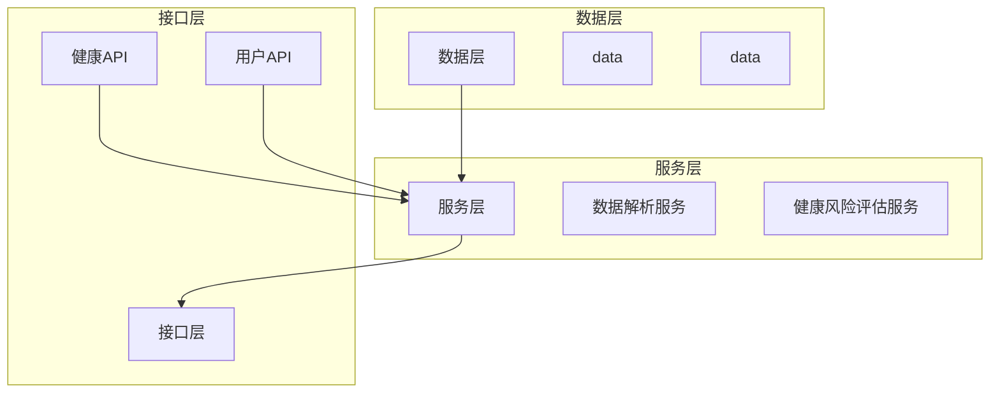

                 

# 智能健康管理 AI Agent：LLM 驱动的个人健康助手

## 关键词
- 智能健康管理
- AI Agent
- LLM
- 个人健康助手
- 大型语言模型

## 摘要
本文将探讨如何利用大型语言模型（LLM）构建个人健康管理的AI代理。首先，我们将介绍智能健康管理的基本概念和背景，然后详细解析AI Agent以及LLM的技术原理和应用。接下来，通过实际案例展示如何构建和使用LLM驱动的个人健康助手，并对未来的发展方向进行展望。

## 目录大纲设计思路

### 1. 确定书的核心主题

根据书名《智能健康管理 AI Agent：LLM 驱动的个人健康助手》，我们可以确定这本书的核心主题是介绍如何利用大型语言模型（LLM）构建个人健康管理的AI代理。

### 2. 划分章节结构

我们将整个书籍内容划分为以下几个主要部分：

- 引言：介绍智能健康管理和AI代理的背景，为什么需要这本书。
- AI Agent基础：介绍AI代理的基本概念、技术原理和构建方法。
- LLM与健康管理：详细讲解LLM在健康管理中的应用。
- 实践案例：通过实际案例展示如何构建和使用LLM驱动的个人健康助手。
- 未来展望：探讨LLM在健康管理中的未来发展。

### 3. 细化各章节内容

每个章节都要有详细的子章节划分，确保内容的完整性和逻辑性。以下是一个初步的目录大纲设计：

#### 引言
- 引言
  - 问题的背景
  - 书籍的目的和结构
  - 阅读对象

- AI Agent基础
  - AI Agent概述
    - 定义
    - 分类
    - 历史与发展

  - AI Agent构建方法
    - 数据准备
    - 模型选择
    - 模型训练与优化

  - AI Agent应用场景
    - 个人健康管理
    - 医疗诊断
    - 个性化推荐

- LLM与健康管理
  - LLM技术简介
    - 语言模型的发展历程
    - LLM的核心算法
    - LLM的优势与挑战

  - LLM在健康管理中的应用
    - 健康数据解析
    - 健康风险评估
    - 健康指导与干预

- 实践案例
  - 案例一：构建个人健康助手
    - 系统需求分析
    - 技术选型
    - 系统设计与实现
    - 测试与评估

  - 案例二：智能健康管理平台开发
    - 项目背景
    - 功能设计
    - 技术实现
    - 运营与优化

- 未来展望
  - LLM在健康管理中的发展趋势
    - 新技术的应用
    - 潜在挑战与解决方案

  - 个人健康管理的发展前景
    - 社会影响
    - 商业模式

- 结语
  - 总结
    - 本书要点回顾
    - 对未来的期望

### 目录大纲（Markdown格式）

```
# 《智能健康管理 AI Agent：LLM 驱动的个人健康助手》目录大纲

## 第1章 引言
### 1.1 问题的背景
### 1.2 书籍的目的和结构
### 1.3 阅读对象

## 第2章 AI Agent基础
### 2.1 AI Agent概述
#### 2.1.1 定义
#### 2.1.2 分类
#### 2.1.3 历史与发展

### 2.2 AI Agent构建方法
#### 2.2.1 数据准备
#### 2.2.2 模型选择
#### 2.2.3 模型训练与优化

### 2.3 AI Agent应用场景
#### 2.3.1 个人健康管理
#### 2.3.2 医疗诊断
#### 2.3.3 个性化推荐

## 第3章 LLM技术简介
### 3.1 语言模型的发展历程
### 3.2 LLM的核心算法
### 3.3 LLM的优势与挑战

## 第4章 LLM与健康管理
### 4.1 健康数据解析
### 4.2 健康风险评估
### 4.3 健康指导与干预

## 第5章 LLM案例分析
### 5.1 案例一：慢性病管理
### 5.2 案例二：心理健康监测

## 第6章 实践案例
### 6.1 案例一：构建个人健康助手
#### 6.1.1 系统需求分析
#### 6.1.2 技术选型
#### 6.1.3 系统设计与实现
#### 6.1.4 测试与评估

### 6.2 案例二：智能健康管理平台开发
#### 6.2.1 项目背景
#### 6.2.2 功能设计
#### 6.2.3 技术实现
#### 6.2.4 运营与优化

## 第7章 未来展望
### 7.1 LLM在健康管理中的发展趋势
#### 7.1.1 新技术的应用
#### 7.1.2 潜在挑战与解决方案

### 7.2 个人健康管理的发展前景
#### 7.2.1 社会影响
#### 7.2.2 商业模式

## 第8章 结语
### 8.1 总结
#### 8.1.1 本书要点回顾
#### 8.1.2 对未来的期望
```

### 目录大纲结构说明

- **第1章 引言**：介绍智能健康管理和AI代理的背景，以及本书的目的和结构。
- **第2章 AI Agent基础**：介绍AI代理的基本概念、技术原理和构建方法。
- **第3章 LLM技术简介**：详细讲解LLM的发展历程、核心算法和优势与挑战。
- **第4章 LLM与健康管理**：讲解LLM在健康管理中的应用，包括健康数据解析、健康风险评估和健康指导与干预。
- **第5章 LLM案例分析**：通过实际案例展示LLM在健康管理中的应用。
- **第6章 实践案例**：提供两个具体的实践案例，展示如何构建和使用LLM驱动的个人健康助手。
- **第7章 未来展望**：探讨LLM在健康管理中的未来发展趋势和挑战。
- **第8章 结语**：对本书的核心内容进行总结，并展望未来。

接下来，我们将逐一介绍每个章节的内容，深入探讨智能健康管理 AI Agent：LLM 驱动的个人健康助手的构建和应用。让我们一步一步地思考，详细剖析每个概念和技术。准备好了吗？让我们开始吧！## 引言

### 1.1 问题的背景

在当今社会，随着科技的迅猛发展和人们生活水平的不断提高，健康问题变得越来越重要。然而，面对日益复杂的生活节奏和不断增长的健康需求，传统的健康管理模式已经难以满足人们的需求。特别是对于个人健康管理，如何有效收集、分析和利用大量健康数据，提供个性化的健康指导和服务，成为了一个亟待解决的问题。

传统健康管理模式通常依赖于医生和医疗机构的专业知识和经验，但这种方法存在以下问题：

- **信息孤岛**：个人的健康数据通常分散在不同的医疗机构和设备中，难以进行整合和分析。
- **效率低下**：医生和医疗机构在处理大量健康数据时，往往需要花费大量时间和精力，难以提供及时和个性化的健康服务。
- **服务质量不高**：由于医生的有限资源和专业知识限制，很难为每个人提供高质量的个性化健康服务。

因此，为了解决这些问题，我们需要一种新型的健康管理模式——智能健康管理。智能健康管理利用人工智能技术，特别是大型语言模型（LLM），可以实现对个人健康数据的智能分析和处理，提供更加精准、高效和个性化的健康服务。

### 1.2 书籍的目的和结构

本书的主要目的是介绍如何利用大型语言模型（LLM）构建个人健康管理的AI代理。通过系统地讲解AI Agent的基础知识、LLM的技术原理及其在健康管理中的应用，本书旨在为读者提供一个全面、深入的指南，帮助他们理解和应用这项新兴技术。

书籍结构如下：

1. **引言**：介绍智能健康管理的基本概念、背景和问题，并概述本书的目的和结构。
2. **AI Agent基础**：介绍AI Agent的定义、分类、历史与发展，以及构建方法。
3. **LLM技术简介**：详细讲解LLM的发展历程、核心算法、优势与挑战。
4. **LLM与健康管理**：讨论LLM在健康管理中的应用，包括健康数据解析、健康风险评估和健康指导与干预。
5. **实践案例**：通过实际案例展示如何构建和使用LLM驱动的个人健康助手。
6. **未来展望**：探讨LLM在健康管理中的未来发展趋势和挑战。
7. **结语**：总结本书的核心内容，并对未来进行展望。

通过这样的结构，本书将帮助读者逐步了解和掌握智能健康管理AI Agent的构建和应用，为他们在相关领域的实践提供有力支持。

### 1.3 阅读对象

本书适合以下读者群体：

- **人工智能和机器学习研究人员**：对于那些对人工智能和机器学习领域感兴趣的研究人员，本书将提供深入了解大型语言模型（LLM）及其在健康管理中的应用的机会。
- **软件开发工程师**：对于希望在健康管理领域应用人工智能技术的软件开发工程师，本书将详细讲解AI Agent的构建方法和LLM的技术原理，为他们提供实用的技术指南。
- **健康管理专业人员**：对于在医疗机构或健康科技公司工作的健康管理专业人员，本书将介绍如何利用AI技术提升个人健康管理的效率和准确性，为他们提供新的工具和方法。
- **对健康和科技感兴趣的读者**：对于那些关注健康和科技发展趋势的普通读者，本书将介绍智能健康管理的基本概念和应用场景，帮助他们更好地理解和应用这项技术。

无论您是哪个读者群体，本书都将为您提供有价值的知识和见解，帮助您在智能健康管理领域取得更好的成就。

### 1.4 智能健康管理的核心概念

智能健康管理是一种利用人工智能技术，特别是机器学习和自然语言处理（NLP），来改善个人健康状态和管理健康问题的方法。其核心概念包括以下几个方面：

#### 数据收集与分析

智能健康管理首先依赖于大量的健康数据，这些数据可以来自各种医疗设备、健康应用程序、日常活动和生物传感器等。通过对这些数据的收集和分析，智能健康管理系统能够了解用户的健康状况和趋势。

#### 个性化健康指导

基于对用户健康数据的分析，智能健康管理系统能够提供个性化的健康指导和建议。例如，根据用户的健康数据和生活习惯，系统可以推荐适合的饮食计划、运动方案或睡眠习惯。

#### 预测与健康风险评估

智能健康管理还可以利用机器学习算法对健康数据进行预测和风险评估。通过分析历史健康数据和当前健康状态，系统可以预测用户未来可能出现的健康问题，并提前提出预防措施。

#### 自然语言交互

智能健康管理系统通常具有自然语言交互能力，用户可以通过语音或文本与系统进行交流。这种交互方式使得健康指导和建议更加直观和便捷，用户可以随时获取所需的信息和帮助。

#### 实时监控与反馈

智能健康管理系统能够实时监控用户的健康状态，并根据实时数据提供反馈和调整建议。这种实时性使得系统能够快速响应用户的变化，提供及时的健康管理服务。

#### 跨平台集成

智能健康管理系统通常支持跨平台集成，用户可以在手机、平板电脑或电脑上访问系统，获取健康数据和指导。这种灵活性使得用户可以随时随地管理自己的健康。

通过这些核心概念，智能健康管理系统能够为用户提供全面、个性化的健康管理服务，帮助他们更好地了解和管理自己的健康。

### 1.5 AI Agent的定义和作用

AI Agent，即人工智能代理，是指能够执行特定任务、与人类交互并自主决策的计算机程序。在智能健康管理领域，AI Agent扮演着关键角色，为用户提供了智能化、个性化的健康服务。以下是AI Agent在智能健康管理中的具体定义和作用：

#### 定义

AI Agent是一种基于人工智能技术，能够模拟人类思维和行为，执行特定任务并自主决策的计算机程序。它通常具有自然语言处理（NLP）能力，能够理解用户的语言指令和需求，并通过学习用户的健康数据和行为模式，提供个性化的健康建议和指导。

#### 作用

1. **个性化健康建议**：AI Agent能够分析用户的健康数据和生活习惯，提供个性化的健康建议。例如，根据用户的饮食记录和运动数据，AI Agent可以推荐合适的饮食计划和运动方案。

2. **健康风险评估**：AI Agent可以利用机器学习算法对健康数据进行预测和风险评估。通过分析历史健康数据和当前健康状态，AI Agent可以预测用户未来可能出现的健康问题，并提前提出预防措施。

3. **实时健康监控**：AI Agent能够实时监控用户的健康状态，通过传感器、健康应用程序和医疗设备收集数据，并根据实时数据提供反馈和调整建议。

4. **自然语言交互**：AI Agent具有自然语言处理能力，可以通过语音或文本与用户进行交互，回答健康相关问题，提供健康指导，使用户能够更便捷地获取健康信息。

5. **健康数据整合**：AI Agent能够整合来自不同来源的健康数据，包括医疗记录、日常活动和生物传感器数据，进行综合分析，为用户提供全面、准确的健康评估。

6. **自主学习和优化**：AI Agent能够通过不断学习和优化，提高健康管理的准确性和效率。通过分析用户的反馈和行为数据，AI Agent可以不断调整和改进健康建议，使其更加符合用户的实际需求。

总之，AI Agent在智能健康管理中扮演着重要的角色，通过个性化健康建议、健康风险评估、实时健康监控和自然语言交互等功能，为用户提供了智能化、个性化的健康管理服务，帮助他们更好地了解和管理自己的健康。

### 1.6 智能健康管理中的AI Agent：LLM的优势

在智能健康管理中，大型语言模型（LLM）的应用显著提升了AI Agent的性能和效果。LLM作为一种强大的自然语言处理（NLP）技术，具有以下几个优势：

#### 1. 数据处理能力

LLM具有强大的数据处理能力，能够处理大量非结构化和半结构化的健康数据。这些数据可能包括医学文本、电子健康记录、社交媒体帖子、甚至是用户的语音和视频。通过深度学习算法，LLM能够从这些数据中提取出有用的信息和模式，从而为智能健康管理提供丰富的数据支持。

#### 2. 自然语言理解

LLM的核心优势在于其卓越的自然语言理解能力。它能够理解并解析复杂的自然语言文本，包括医学术语、患者症状描述和健康建议等。这使得LLM在智能健康管理中的应用更加灵活和直观，用户可以以自然的方式与AI Agent进行交流，获取个性化的健康指导。

#### 3. 个性化推荐

LLM可以基于用户的健康数据和行为模式，生成个性化的健康推荐。例如，根据用户的饮食记录和运动习惯，LLM可以推荐适合的饮食计划和运动方案。此外，LLM还能够根据用户的反馈不断优化推荐策略，使其更加符合用户的实际需求。

#### 4. 自动化决策

LLM在健康管理中的应用还体现在自动化决策支持上。通过学习用户的健康数据和医疗知识库，LLM可以自动生成健康风险评估报告、疾病预防和治疗建议等。这种自动化决策支持不仅提高了健康管理效率，还减少了医疗资源的浪费。

#### 5. 多语言支持

LLM通常支持多种语言，这意味着智能健康管理系统能够为不同语言背景的用户提供无缝的健康服务。无论是在英语、中文、西班牙语还是其他语言环境中，LLM都能保持其高效的自然语言理解和处理能力。

#### 6. 持续学习与优化

LLM具有持续学习和优化的能力。通过不断接收新的用户数据和反馈，LLM能够自我调整和改进，提高健康管理的准确性和有效性。这种持续学习使得智能健康管理系统能够适应不断变化的环境和需求。

总之，LLM在智能健康管理中的应用带来了数据处理能力、自然语言理解、个性化推荐、自动化决策、多语言支持和持续学习等多方面的优势，为构建更加智能化、个性化的健康管理服务提供了坚实的基础。

### 1.7 书籍的目标

本书的目标是向读者全面介绍如何利用大型语言模型（LLM）构建个人健康管理的AI代理。具体而言，本书旨在实现以下目标：

1. **理解智能健康管理的核心概念**：通过详细讲解智能健康管理的背景、问题和解决方案，帮助读者建立对这一新兴领域的深刻理解。

2. **掌握AI Agent的基础知识**：介绍AI Agent的定义、分类、历史与发展，以及其构建方法，帮助读者了解AI Agent在智能健康管理中的应用基础。

3. **深入探讨LLM技术**：详细讲解LLM的发展历程、核心算法、优势与挑战，帮助读者了解LLM在智能健康管理中的具体应用。

4. **了解LLM在健康管理中的应用**：通过具体案例分析，展示LLM在健康数据解析、健康风险评估和健康指导与干预中的应用，帮助读者掌握LLM在实践中的实际应用。

5. **掌握实践案例**：通过两个具体的实践案例，展示如何构建和使用LLM驱动的个人健康助手，以及智能健康管理平台的开发，帮助读者将理论知识应用于实际项目中。

6. **探讨未来发展**：讨论LLM在健康管理中的未来发展趋势和挑战，帮助读者了解智能健康管理领域的最新动态和发展方向。

7. **提供全面的指南**：本书旨在为读者提供一个全面、深入的指南，帮助他们在智能健康管理领域取得更好的成就，为未来的研究和实践提供有力支持。

### 1.8 阅读对象与建议

本书适合以下读者群体：

1. **人工智能和机器学习研究人员**：对于那些对人工智能和机器学习领域感兴趣的研究人员，本书将提供深入了解大型语言模型（LLM）及其在健康管理中的应用的机会，帮助他们掌握这一前沿技术。

2. **软件开发工程师**：对于希望在健康管理领域应用人工智能技术的软件开发工程师，本书将详细讲解AI Agent的构建方法和LLM的技术原理，为他们提供实用的技术指南。

3. **健康管理专业人员**：对于在医疗机构或健康科技公司工作的健康管理专业人员，本书将介绍如何利用AI技术提升个人健康管理的效率和准确性，为他们提供新的工具和方法。

4. **对健康和科技感兴趣的读者**：对于那些关注健康和科技发展趋势的普通读者，本书将介绍智能健康管理的基本概念和应用场景，帮助他们更好地理解和应用这项技术。

在阅读本书时，我们建议您：

- **积极参与实践**：通过阅读本书，您将了解到如何构建和使用LLM驱动的个人健康助手。为了更好地掌握这些知识，我们建议您实际参与相关项目，亲身体验智能健康管理的应用。
- **持续学习和探索**：智能健康管理是一个快速发展的领域，技术不断进步。我们鼓励您持续学习和关注最新动态，不断探索新的应用场景和技术方案。
- **与同行交流**：与同行进行交流，分享您的想法和经验，将有助于您在智能健康管理领域取得更大的成就。

通过积极参与实践、持续学习和与同行交流，您将能够更好地利用AI技术和LLM构建个人健康管理的智能解决方案，为用户的健康和生活质量做出贡献。

### 1.9 智能健康管理的历史与发展

智能健康管理作为人工智能（AI）和医疗健康领域的交叉领域，其发展历程可以追溯到数十年前。以下是智能健康管理的历史与发展过程：

#### 1. 初始阶段（20世纪60年代至80年代）

在20世纪60年代至80年代，随着计算机技术的初步发展，人们开始探索如何利用计算机辅助医疗决策。这一阶段的代表性工作包括早期专家系统的开发，这些系统能够处理医学知识和病例数据，提供诊断建议和治疗方案。然而，由于数据量有限和算法的局限性，这些系统尚未达到广泛应用的阶段。

#### 2. 互联网时代（20世纪90年代至21世纪初）

随着互联网的普及，医疗健康数据开始实现大规模积累和共享。这一阶段，电子健康记录（EHR）和远程医疗技术的出现，为智能健康管理提供了更多的数据资源和应用场景。同时，机器学习技术的兴起，使得智能健康管理系统的准确性和效率得到显著提升。例如，基于机器学习的诊断系统可以在海量医疗数据中快速识别异常，提供精准的诊断结果。

#### 3. 人工智能时代（21世纪至今）

进入21世纪，人工智能技术，尤其是深度学习和自然语言处理（NLP）的快速发展，为智能健康管理带来了全新的机遇。大型语言模型（LLM）的出现，使得智能健康管理系统能够更好地理解和处理复杂的医学文本和数据。LLM在智能健康管理中的应用，包括疾病预测、健康风险评估、个性化治疗建议等方面，显著提升了健康管理服务的质量和效率。

#### 4. 发展趋势与挑战

随着技术的不断进步，智能健康管理正朝着更加智能化、个性化和高效化的方向发展。以下是当前智能健康管理的发展趋势和面临的挑战：

- **趋势**：  
  - **多模态数据融合**：结合来自医学图像、基因数据、生物传感器等多种数据源，实现更全面、准确的健康管理。  
  - **个性化健康服务**：通过深度学习和用户数据的持续学习，提供更加精准的健康指导和服务。  
  - **智能决策支持**：利用AI技术，为医生和医疗机构提供智能化的决策支持，提高医疗诊断和治疗的效率。

- **挑战**：  
  - **数据隐私与安全**：大规模健康数据的收集和处理，引发了数据隐私和安全的问题，需要建立严格的隐私保护机制。  
  - **算法公平性**：AI系统在处理健康数据时，可能会出现偏见和不公平现象，需要制定相应的规范和标准来确保算法的公平性。  
  - **技术成熟度**：尽管AI技术在健康管理中具有巨大的潜力，但仍然需要进一步的研究和开发，以克服技术成熟度方面的挑战。

总的来说，智能健康管理正处于快速发展阶段，未来将有望在医疗健康领域发挥重要作用，为个人和整个社会的健康福祉做出贡献。

### 1.10 智能健康管理中的核心问题与挑战

在智能健康管理的发展过程中，我们面临着一系列核心问题与挑战。以下是这些问题的详细解析：

#### 1. 数据隐私与安全

随着智能健康管理系统的广泛应用，大量个人健康数据被收集和存储。这些数据的隐私和安全问题变得尤为重要。为了确保用户数据的隐私和安全，智能健康管理系统需要采取以下措施：

- **数据加密**：在数据传输和存储过程中，采用高级加密算法对数据进行加密，防止未经授权的访问。
- **访问控制**：通过严格的访问控制机制，确保只有授权用户和系统可以访问和处理用户数据。
- **隐私保护技术**：应用匿名化、差分隐私等隐私保护技术，减少个人数据的可识别性，保护用户隐私。
- **合规性要求**：遵循相关法律法规，如《通用数据保护条例》（GDPR）和《加州消费者隐私法案》（CCPA），确保系统的合规性。

#### 2. 数据质量与可靠性

智能健康管理系统的性能和质量高度依赖于输入的数据质量。数据质量问题包括数据缺失、不一致、噪声和错误等。为了确保数据质量，需要采取以下措施：

- **数据清洗**：在数据采集和处理过程中，对数据缺失、不一致和噪声等问题进行清洗和校正。
- **数据验证**：通过多重验证机制，确保数据的准确性和可靠性。
- **数据源监控**：对数据源进行持续监控，确保数据的实时性和准确性。
- **数据标准化**：建立统一的数据标准和规范，确保不同数据源之间的数据可以互相兼容和整合。

#### 3. 个性化与通用性平衡

智能健康管理需要为每个用户提供个性化的健康指导和服务。然而，过于个性化的服务可能会增加系统的复杂性和成本。因此，在提供个性化服务的同时，也需要考虑系统的通用性。以下是实现个性化与通用性平衡的几种方法：

- **分众化策略**：根据用户的年龄、性别、健康状况等特征，将用户分成不同的群体，为每个群体提供特定的健康服务。
- **自适应学习**：系统通过不断学习和优化，逐渐提高对用户需求的准确理解和响应能力。
- **通用化模块**：开发可复用的通用化模块，为不同的用户提供相同的核心功能，同时允许根据特定需求进行定制化调整。

#### 4. 算法公平性与透明性

智能健康管理系统中使用的算法可能会引入偏见，导致不公平的决策。为了确保算法的公平性和透明性，需要采取以下措施：

- **算法透明性**：开发透明易懂的算法，确保用户和监管机构可以理解和审查算法的决策过程。
- **算法偏见检测**：通过建立偏见检测机制，识别和纠正算法中的潜在偏见。
- **多样性训练数据**：使用多样化的训练数据集，减少算法的偏见，提高其公平性。
- **算法责任与追溯**：明确算法的责任归属，确保在出现问题时可以追溯和纠正。

通过解决这些问题，智能健康管理系统将能够提供更安全、可靠和公平的服务，为个人和整个社会的健康福祉做出更大的贡献。

### 1.11 小结

在引言部分，我们介绍了智能健康管理和AI Agent的基本概念，探讨了LLM在其中的重要作用。通过回顾问题的背景、书籍的目的和结构，以及目标读者群体，我们明确了本书的核心内容。我们还详细介绍了智能健康管理的核心概念，AI Agent的定义和作用，以及LLM的优势。通过这些内容，读者可以初步了解智能健康管理AI Agent：LLM驱动的个人健康助手的基本知识。

接下来的章节将进一步深入探讨AI Agent的基础知识、LLM技术、健康管理中的应用、实践案例以及未来的发展趋势。读者将逐步了解如何利用LLM构建智能健康管理AI Agent，并在实际项目中应用这些技术。因此，建议读者保持对后续内容的兴趣，积极参与实践，为未来的研究和应用做好准备。让我们一起探索智能健康管理的新领域，开启智能健康管理的未来！## AI Agent基础

### 2.1 AI Agent概述

#### 2.1.1 定义

AI Agent，即人工智能代理，是指一种具备自主性、感知能力、学习能力和交互能力的计算机程序。它能够根据环境中的信息自主决策，采取行动以实现特定目标。AI Agent被广泛应用于多个领域，如智能助手、自动驾驶汽车、智能安防系统和智能医疗等。

#### 2.1.2 分类

根据功能和应用场景，AI Agent可以分类如下：

1. **任务型AI Agent**：这类AI Agent专注于执行特定任务，如智能客服、自动预约系统和智能家居助手。它们通常具有明确的任务目标和预设的行为规则，通过规则引擎和决策树等算法实现任务执行。

2. **自主型AI Agent**：这类AI Agent具备更高的自主性，能够在复杂和不确定的环境中自主探索和决策。例如，自动驾驶汽车和自主导航机器人，它们需要处理大量传感器数据，实时做出驾驶决策。

3. **社交型AI Agent**：这类AI Agent专注于与人类进行交互，提供个性化服务和支持。例如，智能语音助手和聊天机器人，它们能够理解自然语言，回答问题，甚至与用户进行情感交流。

4. **监督型AI Agent**：这类AI Agent依赖于外部监督和指导，其行为和决策受到人类的直接控制。例如，医疗诊断助手和安防监控系统，它们通常需要专业人员的监督和干预。

#### 2.1.3 历史与发展

AI Agent的概念可以追溯到20世纪50年代。随着计算机技术和人工智能领域的不断发展，AI Agent的研究和应用逐渐得到重视。以下是AI Agent发展历程中的几个关键阶段：

1. **早期探索（20世纪50年代至70年代）**：在这一阶段，AI Agent的概念开始提出，但受限于计算能力和算法的局限性，AI Agent的应用主要停留在理论研究阶段。

2. **早期应用（20世纪80年代至90年代）**：随着计算机硬件的快速发展，AI Agent开始应用于实际场景。例如，专家系统被广泛应用于医疗诊断和金融分析等领域。

3. **人工智能复兴（21世纪初至今）**：随着深度学习和机器学习技术的突破，AI Agent的研究和应用进入了一个新的阶段。深度神经网络和强化学习算法的广泛应用，使得AI Agent在感知能力、自主性和学习能力方面得到了显著提升。

4. **智能化发展（2020年至今）**：随着物联网、云计算和5G技术的发展，AI Agent的应用场景和规模不断扩大。智能助手、自动驾驶汽车和智能医疗等应用逐渐普及，AI Agent正在深刻改变我们的生活方式。

### 2.2 AI Agent构建方法

构建AI Agent通常需要以下步骤：

#### 2.2.1 数据准备

数据是AI Agent的基础，数据的质量直接影响AI Agent的性能。数据准备包括数据采集、数据清洗、数据整合和数据预处理等步骤：

1. **数据采集**：根据AI Agent的应用场景，采集相关的数据源。数据可以来自传感器、用户输入、外部API或其他数据源。

2. **数据清洗**：处理数据中的缺失值、噪声和异常值，确保数据的质量。

3. **数据整合**：将来自不同数据源的数据进行整合，建立统一的数据集。

4. **数据预处理**：对数据进行归一化、编码、特征提取等预处理操作，为后续的模型训练做好准备。

#### 2.2.2 模型选择

选择合适的模型是构建AI Agent的关键。根据AI Agent的应用场景和数据特点，可以选择以下类型的模型：

1. **监督学习模型**：适用于有明确标签的数据集，通过学习输入与输出之间的关系进行预测。常见的监督学习模型包括决策树、支持向量机（SVM）和神经网络等。

2. **无监督学习模型**：适用于没有明确标签的数据集，通过学习数据的内在结构进行分类或聚类。常见的无监督学习模型包括K-均值聚类、主成分分析（PCA）和自编码器等。

3. **强化学习模型**：适用于需要根据环境反馈进行决策的场景，通过不断试错和奖励机制进行学习。常见的强化学习模型包括Q学习、深度Q网络（DQN）和策略梯度（PG）等。

#### 2.2.3 模型训练与优化

模型训练与优化是构建AI Agent的核心步骤。以下是模型训练与优化的一些关键步骤：

1. **模型训练**：使用准备好的数据集对模型进行训练，调整模型参数以最小化预测误差。

2. **模型评估**：通过交叉验证、验证集和测试集等评估方法，评估模型的性能和泛化能力。

3. **模型优化**：根据评估结果，对模型进行调优，包括调整模型结构、参数设置和超参数等，以提升模型性能。

4. **模型部署**：将训练好的模型部署到生产环境中，实现实时预测和应用。

### 2.3 AI Agent应用场景

AI Agent在多个领域有着广泛的应用，以下是一些典型的应用场景：

#### 2.3.1 个人健康管理

个人健康管理是AI Agent的重要应用领域。AI Agent可以收集和分析用户的健康数据，提供个性化的健康建议和干预措施。例如：

- **健康数据监测**：AI Agent可以实时监测用户的生理指标，如心率、血压、体温等，及时发现异常情况。
- **健康风险评估**：AI Agent可以根据用户的健康数据和生活习惯，评估用户患病的风险，提供预防建议。
- **健康指导与干预**：AI Agent可以提供个性化的饮食、运动和睡眠建议，帮助用户改善生活方式，提高健康水平。

#### 2.3.2 医疗诊断

AI Agent在医疗诊断领域具有巨大潜力。通过学习大量的医学知识和病例数据，AI Agent可以辅助医生进行诊断，提高诊断的准确性和效率。例如：

- **疾病预测**：AI Agent可以分析患者的病史、症状和检查结果，预测患者可能患有的疾病。
- **辅助诊断**：AI Agent可以分析医学影像数据，如X光片、CT和MRI，辅助医生进行病变识别和诊断。
- **药物推荐**：AI Agent可以根据患者的病情和药物数据库，推荐合适的治疗方案和药物。

#### 2.3.3 个性化推荐

AI Agent在个性化推荐领域也有着广泛应用。通过分析用户的行为数据、兴趣偏好和历史记录，AI Agent可以提供个性化的推荐服务，提高用户体验。例如：

- **商品推荐**：电商平台可以使用AI Agent根据用户的浏览记录和购买历史，推荐可能感兴趣的商品。
- **音乐和视频推荐**：流媒体平台可以使用AI Agent根据用户的听歌和观影记录，推荐个性化的音乐和视频。
- **旅游推荐**：旅游服务平台可以使用AI Agent根据用户的喜好和预算，推荐合适的旅游目的地和行程。

通过在个人健康管理、医疗诊断和个性化推荐等领域的应用，AI Agent正在深刻改变我们的生活方式，为我们的生活带来更多便利和智能。

### 2.4 AI Agent在健康管理中的独特价值

AI Agent在健康管理中具有独特的价值，主要体现在以下几个方面：

#### 1. 个性化服务

AI Agent能够根据用户的个人健康数据和生活习惯，提供个性化的健康建议和服务。这种个性化的服务不仅提高了用户的满意度，还能有效改善用户的健康状况。

#### 2. 实时监控

AI Agent可以实时监控用户的健康状态，及时发现异常情况。例如，通过监测用户的心率、血压等生理指标，AI Agent可以在用户出现健康问题时及时发出警报，提供相应的干预措施。

#### 3. 预防疾病

通过分析用户的健康数据和生活习惯，AI Agent可以预测用户未来可能出现的健康问题，并提供预防建议。这种预防性的健康管理能够有效降低疾病的发生率，提高用户的健康水平。

#### 4. 自动化决策

AI Agent可以自动化处理大量的健康数据，提供基于数据的决策支持。例如，在医疗诊断中，AI Agent可以自动分析医学影像数据，辅助医生做出诊断决策。

#### 5. 自然语言交互

AI Agent具有自然语言处理能力，可以与用户进行自然语言交互，回答健康相关问题，提供健康指导。这种交互方式使得健康管理和指导更加直观和便捷。

通过个性化服务、实时监控、预防疾病、自动化决策和自然语言交互等方面的独特价值，AI Agent正在为个人健康管理带来革命性的变革。

### 2.5 小结

在AI Agent基础部分，我们介绍了AI Agent的定义、分类、历史与发展，详细讲解了AI Agent构建方法，并探讨了其应用场景和独特价值。通过这些内容，读者可以全面了解AI Agent的基本概念和技术原理，为后续章节的深入学习打下坚实基础。在接下来的章节中，我们将进一步探讨LLM技术，并深入分析LLM在健康管理中的应用。让我们继续前进，探索智能健康管理的新领域！### LLM技术简介

#### 3.1 语言模型的发展历程

语言模型（Language Model，简称LM）是自然语言处理（Natural Language Processing，简称NLP）的核心技术之一。其发展历程可以分为以下几个阶段：

1. **早期模型（20世纪50年代至70年代）**：
   - **规则模型**：早期的语言模型主要是基于语法规则和上下文信息的规则模型，如上下文无关文法（CFG）和上下文相关文法（CG）。这些模型试图通过手工编写的语法规则来模拟人类语言生成过程。
   - **统计模型**：随着计算机存储和处理能力的提升，统计模型开始被应用于语言模型。其中，N-gram模型是最早的统计语言模型，它通过统计文本中连续N个单词出现的频率来预测下一个单词。

2. **中间阶段（20世纪80年代至90年代）**：
   - **隐马尔可夫模型（HMM）**：HMM被应用于语音识别和文本生成，通过状态转移概率和发射概率来模拟语言生成过程。
   - **神经网络模型**：神经网络在20世纪80年代开始应用于机器学习，并在语言模型中得到了应用。例如，循环神经网络（RNN）可以捕捉序列数据中的长距离依赖关系。

3. **现代阶段（2000年至今）**：
   - **深度神经网络（DNN）**：DNN在语音识别、机器翻译和文本分类等任务中取得了显著的成果。通过多层神经网络的堆叠，DNN能够自动提取文本中的复杂特征。
   - **长短时记忆网络（LSTM）**：LSTM是RNN的一种变体，能够有效处理长序列数据，被广泛应用于机器翻译、文本生成等任务。
   - **注意力机制（Attention Mechanism）**：注意力机制能够使模型更好地关注序列中的重要信息，从而提高模型的性能。在机器翻译、文本摘要等任务中得到了广泛应用。
   - **预训练和微调**：预训练是指使用大规模语料库对模型进行训练，使其具备丰富的语言理解和生成能力。随后，通过微调（Fine-tuning）将模型应用于特定任务，从而提高任务性能。

#### 3.2 LLM的核心算法

大型语言模型（Large Language Model，简称LLM）是当前NLP领域的重要研究方向。LLM的核心算法主要包括以下几个部分：

1. **Transformer架构**：
   - **多头自注意力机制（Multi-Head Self-Attention）**：Transformer架构的核心是多头自注意力机制，它能够使模型在处理序列数据时自动关注重要信息，提高了模型的性能。
   - **编码器和解码器**：Transformer架构包括编码器（Encoder）和解码器（Decoder），编码器用于处理输入序列，解码器用于生成输出序列。

2. **预训练与微调**：
   - **预训练**：预训练是指使用大规模未标注语料库对模型进行训练，使模型具备丰富的语言理解和生成能力。BERT、GPT和T5等模型都是通过预训练实现的。
   - **微调**：预训练后，通过微调（Fine-tuning）将模型应用于特定任务，如文本分类、命名实体识别和机器翻译等。微调过程通常使用少量标注数据进行，以优化模型在特定任务上的性能。

3. **自回归语言模型**：
   - **自回归模型**：自回归语言模型是一种基于序列的生成模型，它通过预测序列中的下一个元素来生成文本。GPT系列模型是自回归语言模型的典型代表。

4. **语言理解与生成**：
   - **语言理解**：LLM通过预训练和微调，可以理解文本中的语义和上下文信息，进行文本分类、情感分析、命名实体识别等任务。
   - **语言生成**：LLM可以根据输入的提示或问题，生成相应的文本回答，如问答系统、文本摘要和机器翻译等。

#### 3.3 LLM的优势与挑战

LLM在NLP领域展现了巨大的优势，但也面临一些挑战。以下是LLM的优势与挑战的详细分析：

1. **优势**：

   - **强大的语言理解能力**：LLM通过预训练和微调，具备了丰富的语言理解和生成能力，能够处理复杂的自然语言任务。
   - **广泛的适应性**：LLM可以应用于多种NLP任务，如文本分类、情感分析、命名实体识别和机器翻译等，具有广泛的适应性。
   - **高效的计算性能**：Transformer架构使得LLM在计算性能上有了显著提升，能够在短时间内处理大量文本数据。
   - **大规模预训练**：大规模预训练使得LLM能够从大量数据中学习到复杂的语言特征，提高了模型的性能和泛化能力。

2. **挑战**：

   - **计算资源消耗**：LLM的训练和推理过程需要大量的计算资源，特别是大规模的预训练模型，对硬件设备和能源消耗提出了较高要求。
   - **数据隐私与安全**：LLM在训练过程中需要使用大量的用户数据，这引发了数据隐私和安全的问题，需要采取有效的数据保护措施。
   - **模型解释性**：LLM的决策过程通常较为复杂，难以进行解释和验证，这限制了其在某些领域中的应用，如医疗诊断和法律判决等。
   - **语言多样性**：虽然LLM在语言理解方面取得了显著进展，但仍然面临语言多样性问题，例如对罕见词、方言和术语的处理能力较弱。

通过深入分析LLM的发展历程、核心算法和优势与挑战，我们可以更好地理解和应用这项技术，为未来的NLP研究和应用提供指导。在接下来的章节中，我们将探讨LLM在健康管理中的应用，进一步展示其强大的潜力。让我们继续深入探讨LLM在智能健康管理中的实际应用吧！### LLM在健康管理中的应用

#### 4.1 健康数据解析

在智能健康管理中，健康数据解析是LLM的重要应用之一。健康数据通常包括医疗记录、生理指标、生活习惯等多种类型，这些数据需要被有效地解析和理解，以提供准确的健康管理服务。

**数据来源**：

健康数据的来源广泛，包括：

- **电子健康记录（EHR）**：医院和诊所的电子健康记录，包括诊断记录、病历、处方记录等。
- **传感器数据**：来自智能手环、血压计、心率监测器等健康设备的实时数据，如心率、血压、睡眠质量等。
- **日常活动数据**：用户通过健康应用程序记录的日常活动数据，如步数、运动类型、饮食记录等。
- **社交媒体数据**：用户在社交媒体平台分享的健康相关内容，如帖子、评论、分享的健康信息等。

**解析方法**：

LLM在健康数据解析中的应用主要包括以下几种方法：

1. **自然语言处理（NLP）**：使用LLM对非结构化的文本数据进行分析和理解。例如，通过NLP技术提取医学文本中的关键信息，如诊断结果、药物名称、病情描述等。
2. **数据融合**：将不同来源的数据进行整合，构建一个全面的健康数据图谱。LLM可以通过对多源数据的融合，提供更加精准和全面的健康评估。
3. **命名实体识别（NER）**：使用LLM进行命名实体识别，识别健康数据中的关键实体，如疾病名称、药物名称、症状等。
4. **关系抽取**：通过LLM分析健康数据中的关系，如患者与医生、患者与药物之间的关系等，为健康管理提供更多的上下文信息。

**应用案例**：

1. **慢性病管理**：通过LLM对慢性病患者的历史健康数据和实时生理指标进行解析，提供个性化的治疗建议和预防措施。例如，对于糖尿病患者，LLM可以分析血糖记录、饮食计划和药物使用情况，提供合理的饮食计划和药物调整建议。
2. **心理健康监测**：LLM可以解析用户在社交媒体上的文字和图片，识别潜在的心理健康问题。例如，通过分析用户的帖子、评论和朋友圈内容，LLM可以识别出抑郁症、焦虑症等心理问题，并提供相应的心理健康干预建议。
3. **健康风险评估**：LLM可以分析用户的健康数据和生活习惯，评估用户患病的风险，如心血管疾病、糖尿病等。通过解析健康数据，LLM可以提供个性化的健康风险评估报告，帮助用户采取预防措施。

#### 4.2 健康风险评估

健康风险评估是智能健康管理中的一项关键任务，旨在预测个体未来患病的风险，并提供针对性的预防建议。LLM在健康风险评估中的应用具有显著的优势。

**评估方法**：

1. **数据驱动方法**：使用LLM分析大量健康数据，如电子健康记录、生理指标、生活习惯等，通过机器学习算法预测个体的健康风险。例如，通过分析糖尿病患者的血糖记录、体重变化和药物使用情况，LLM可以预测患者未来患糖尿病并发症的风险。
2. **知识驱动方法**：结合医学知识库和LLM，构建基于知识的健康风险评估模型。例如，利用LLM处理医学文献和专家意见，建立健康风险评估的知识图谱，为用户提供更加科学的健康风险评估。
3. **混合方法**：结合数据驱动和知识驱动方法，利用LLM的优势，实现更加准确和全面的健康风险评估。通过整合多源数据和医学知识，LLM可以提供个性化的健康风险评估报告，为用户制定个性化的健康管理策略。

**应用案例**：

1. **心血管疾病风险评估**：通过LLM分析用户的健康数据和生活习惯，如血压、胆固醇水平、吸烟状况等，预测用户未来患心血管疾病的风险。根据评估结果，LLM可以推荐个性化的预防措施，如改善饮食习惯、增加体育锻炼等。
2. **癌症早期筛查**：LLM可以分析患者的病史、家族病史和生理指标，预测用户未来患癌症的风险。通过早期筛查和干预，LLM可以帮助用户及时采取预防措施，降低癌症发病风险。
3. **心理健康风险评估**：LLM可以分析用户在社交媒体上的文字和图片，识别潜在的心理健康问题。通过评估用户的心理健康风险，LLM可以提供个性化的心理健康干预建议，如心理辅导、药物治疗等。

#### 4.3 健康指导与干预

健康指导与干预是智能健康管理的重要组成部分，旨在帮助用户改善生活方式，提高健康水平。LLM在健康指导与干预中的应用，可以实现个性化、实时和高效的健康管理服务。

**指导方法**：

1. **个性化健康建议**：LLM可以根据用户的健康数据和生活习惯，提供个性化的健康建议。例如，根据用户的体重、饮食习惯和运动量，LLM可以推荐适合的饮食计划、运动方案和睡眠习惯。
2. **实时健康监控**：LLM可以实时监控用户的健康状态，根据实时数据提供动态的健康指导。例如，当用户的心率异常时，LLM可以实时提醒用户注意休息，并提供相关的健康建议。
3. **自动化干预**：LLM可以自动化执行健康干预措施，如发送健康提醒、推荐健康活动和提供健康课程等。通过自动化干预，LLM可以确保用户持续接收健康指导，提高健康管理的连续性和有效性。

**应用案例**：

1. **慢性病管理**：LLM可以结合用户的健康数据和生活习惯，提供个性化的慢性病管理建议。例如，对于糖尿病患者，LLM可以分析血糖记录、饮食计划和药物使用情况，提供合理的饮食计划和药物调整建议，帮助用户控制血糖水平。
2. **心理健康管理**：LLM可以分析用户在社交媒体上的文字和图片，识别潜在的心理健康问题。通过提供个性化的心理健康指导，LLM可以帮助用户改善心理健康，提高生活质量。
3. **健康行为干预**：LLM可以实时监控用户的健康行为，如饮食、运动和睡眠等，提供即时的健康反馈和指导。例如，当用户未按照计划进行运动时，LLM可以实时提醒用户，并提供相应的激励措施，帮助用户养成良好的健康习惯。

通过健康数据解析、健康风险评估和健康指导与干预，LLM在健康管理中展现了巨大的潜力。未来的研究将进一步探索LLM在智能健康管理中的深度应用，为用户带来更加智能、高效和个性化的健康服务。让我们继续探讨LLM在智能健康管理中的实际应用，开启智能健康管理的未来！### LLM案例分析

#### 5.1 案例一：慢性病管理

慢性病管理是一个复杂且长期的过程，涉及到患者的日常生活、饮食习惯、运动规律等多方面。下面，我们将通过一个实际案例，展示如何利用LLM来管理慢性病，特别是糖尿病。

**案例背景**：

某公司开发了一款名为“智健”的慢性病管理平台，旨在通过人工智能技术，特别是LLM，为糖尿病患者提供个性化的健康管理服务。平台收集用户的血糖记录、饮食习惯、运动数据等健康数据，通过LLM进行分析和处理，提供个性化的健康指导。

**案例分析**：

1. **数据收集与整合**：
   - **血糖记录**：用户通过智能手环和血糖仪定期记录血糖数据，这些数据包括空腹血糖、餐后血糖、血糖波动范围等。
   - **饮食习惯**：用户通过APP记录每日的饮食摄入情况，包括食物种类、摄入量、烹饪方式等。
   - **运动数据**：用户通过APP记录每日的运动类型、持续时间、运动强度等。

2. **数据解析**：
   - **自然语言处理**：LLM对用户的饮食记录进行解析，提取关键信息，如食物成分、热量摄入等。
   - **数据融合**：将血糖记录、饮食习惯和运动数据融合，构建一个全面的健康数据图谱。

3. **健康风险评估**：
   - **历史数据分析**：LLM通过分析用户的血糖数据，识别血糖波动规律，预测未来血糖水平的变化趋势。
   - **生活习惯评估**：LLM评估用户的饮食习惯和运动规律，判断其是否符合糖尿病管理标准。

4. **个性化健康建议**：
   - **饮食建议**：根据用户的饮食习惯和血糖水平，LLM推荐合适的饮食方案，如减少高糖食物摄入、增加蔬菜和全谷类食物摄入等。
   - **运动建议**：根据用户的运动数据和血糖变化趋势，LLM推荐合适的运动方案，如适当增加运动量、选择低强度运动等。

5. **健康干预**：
   - **实时监控**：LLM实时监控用户的血糖变化，当血糖异常时，及时发出警报，提醒用户采取措施。
   - **自动化干预**：系统自动发送健康提醒，如定时监测血糖、提醒用户服药等。

**案例效果**：

通过“智健”平台，用户可以更好地管理自己的血糖水平，减少并发症的风险。以下是一些具体效果：

- **血糖控制**：用户血糖水平更加稳定，波动范围减小。
- **饮食习惯改善**：用户减少高糖食物摄入，增加健康食物摄入。
- **运动习惯养成**：用户逐渐增加运动量，选择适合自己的运动方式。
- **健康意识提高**：用户更加关注自己的健康状态，积极参与健康管理。

**总结**：

通过这个案例，我们展示了如何利用LLM在慢性病管理中的应用。LLM通过分析用户的健康数据，提供个性化的健康建议和干预措施，帮助用户更好地管理慢性病。未来，随着LLM技术的不断发展和应用，慢性病管理将变得更加智能化、个性化，为用户带来更高的生活质量。

#### 5.2 案例二：心理健康监测

心理健康是现代生活中不可忽视的重要问题。随着社交媒体和智能设备的普及，人们的心理健康数据日益丰富，这为利用人工智能技术，特别是LLM，进行心理健康监测提供了可能。下面，我们将通过一个实际案例，展示如何利用LLM监测用户的心理健康。

**案例背景**：

某科技公司开发了一款名为“心语”的心理健康监测平台，旨在通过人工智能技术，特别是LLM，帮助用户实时监测心理健康状况，提供针对性的心理健康服务。

**案例分析**：

1. **数据收集与整合**：
   - **社交媒体数据**：用户在社交媒体平台上的帖子、评论、私信等数据，这些数据包含了用户的心理状态和情感波动。
   - **生活数据**：用户通过APP记录的日常活动数据，如睡眠时间、运动量、工作压力等。

2. **数据解析**：
   - **情感分析**：LLM通过情感分析技术，分析用户的社交媒体数据，识别用户的情绪状态，如焦虑、抑郁、愉悦等。
   - **心理健康评估**：LLM结合用户的社交媒体数据和日常活动数据，评估用户的心理健康状态，识别潜在的心理健康问题。

3. **心理健康指导**：
   - **实时监测**：LLM实时监测用户的心理健康状态，当用户出现负面情绪时，及时发出警报，提醒用户注意心理健康。
   - **个性化建议**：根据用户的心理健康评估结果，LLM提供个性化的心理健康指导，如心理辅导、放松练习、睡眠建议等。

4. **健康干预**：
   - **自动化干预**：系统自动发送心理健康提醒，如定时检查情绪状态、建议进行放松练习等。
   - **心理咨询服务**：当用户的心理健康问题较为严重时，系统可以推荐专业的心理咨询服务，帮助用户解决问题。

**案例效果**：

通过“心语”平台，用户可以实时了解自己的心理健康状态，并得到针对性的心理健康指导。以下是一些具体效果：

- **心理健康状况监测**：用户能够及时发现心理问题，采取措施进行干预。
- **情绪管理**：用户通过平台提供的放松练习和情绪管理技巧，逐渐改善情绪状态。
- **生活质量提升**：用户的心理健康状况得到改善，生活质量得到提高。
- **心理健康知识普及**：用户通过平台了解心理健康知识，增强心理健康意识。

**总结**：

通过这个案例，我们展示了如何利用LLM进行心理健康监测。LLM通过分析用户的社交媒体数据和日常活动数据，提供实时、个性化的心理健康监测和指导，帮助用户更好地管理心理健康。未来，随着LLM技术的不断发展和应用，心理健康监测将变得更加智能化、个性化，为用户提供更加全面的健康管理服务。

### 5.3 案例总结与未来展望

通过对慢性病管理和心理健康监测的两个实际案例，我们可以看到LLM在健康管理中的应用具有显著的成效。以下是两个案例的总结和未来展望：

#### 5.3.1 案例总结

1. **慢性病管理**：
   - **个性化健康建议**：LLM通过分析用户的健康数据，提供了个性化的饮食建议、运动方案和血糖监测指导，有效改善了用户的健康状况。
   - **实时健康监控**：系统实时监测用户的健康状态，及时发现并提醒用户采取健康干预措施，提高了健康管理的效果。
   - **自动化干预**：系统自动发送健康提醒，确保用户持续接收健康指导，提高了健康管理的连续性和有效性。

2. **心理健康监测**：
   - **实时情绪监测**：LLM通过分析用户的社交媒体数据和日常活动数据，实时监测用户的心理健康状态，及时识别和预警潜在的心理问题。
   - **个性化心理健康指导**：系统根据用户的心理健康评估结果，提供个性化的心理健康建议和干预措施，帮助用户改善情绪状态。
   - **专业心理咨询服务**：对于心理健康问题较为严重的用户，系统推荐专业的心理咨询服务，确保用户得到及时有效的帮助。

#### 5.3.2 未来展望

1. **技术优化**：
   - **数据处理能力提升**：随着计算能力的提升和新型算法的引入，LLM将能够处理更加复杂的健康数据，提高健康管理的准确性和效率。
   - **多模态数据融合**：结合来自医学影像、基因数据、生物传感器等多源数据，实现更加全面和精准的健康管理。

2. **应用拓展**：
   - **慢性病管理**：未来，LLM将在更多类型的慢性病管理中发挥作用，如高血压、心脏病等，提供更加全面的健康管理服务。
   - **心理健康服务**：随着对心理健康问题的关注增加，LLM将在心理健康监测、干预和治疗中发挥更大作用，为用户提供更加智能和个性化的心理健康服务。

3. **隐私保护与合规性**：
   - **数据隐私保护**：随着健康数据的广泛应用，如何确保用户数据的安全和隐私成为一个重要问题。未来，需要开发更加先进的数据隐私保护技术，确保用户数据的保密性和安全性。
   - **合规性要求**：智能健康管理系统的开发和应用需要遵循相关法律法规，如《通用数据保护条例》（GDPR）和《加州消费者隐私法案》（CCPA），确保系统的合规性。

通过不断优化技术、拓展应用领域和加强隐私保护，LLM在健康管理中的应用将不断深化，为用户带来更加智能、高效和个性化的健康管理服务。未来，随着LLM技术的进一步发展和应用，智能健康管理将在更多领域发挥重要作用，为用户的健康和生活质量带来深远影响。让我们共同期待智能健康管理的美好未来！### 实践案例

在本章节中，我们将通过两个实际案例，展示如何构建和使用LLM驱动的个人健康助手。这两个案例将分别介绍系统需求分析、技术选型、系统设计与实现、测试与评估等方面，以帮助读者更好地理解LLM在健康管理中的实际应用。

#### 案例一：构建个人健康助手

**1. 系统需求分析**

在构建个人健康助手时，我们需要明确系统的功能需求和性能要求：

- **功能需求**：
  - **数据收集**：系统需要能够收集用户的健康数据，包括生理指标（如心率、血压、血糖等）、生活习惯（如饮食、运动、睡眠等）。
  - **数据解析**：系统需要使用LLM对收集的健康数据进行解析，提取有用的信息，如关键健康指标、生活习惯等。
  - **健康风险评估**：系统需要根据用户的健康数据和医学知识库，评估用户患病的风险，并提供相应的健康建议。
  - **个性化健康指导**：系统需要根据用户的健康数据和评估结果，提供个性化的健康指导，如饮食建议、运动建议、睡眠建议等。
  - **自然语言交互**：系统需要支持自然语言交互，用户可以通过语音或文本与系统进行交流，获取健康信息。

- **性能要求**：
  - **实时性**：系统能够实时处理用户的健康数据，及时提供健康评估和建议。
  - **准确性**：系统需要对健康数据的解析和评估具有较高的准确性，确保提供的健康指导和建议是可靠和有效的。
  - **易用性**：系统需要具备良好的用户界面和交互体验，用户可以轻松地操作和使用系统。

**2. 技术选型**

为了实现上述需求，我们选择了以下技术：

- **数据收集**：使用传感器和健康应用程序收集用户的生理指标和生活习惯数据。
- **数据存储**：使用NoSQL数据库（如MongoDB）存储健康数据，以支持大规模数据的快速读写和高效查询。
- **LLM框架**：使用预训练的LLM框架（如BERT、GPT等），结合自定义的模型进行健康数据解析和风险评估。
- **自然语言处理**：使用NLP库（如NLTK、spaCy等）进行文本处理和情感分析。
- **前端技术**：使用React和Vue.js等前端框架构建用户界面，实现与用户的自然语言交互。
- **后端服务**：使用Flask和Django等后端框架，搭建数据存储、处理和API服务。

**3. 系统设计与实现**

系统设计主要包括数据流、功能模块和接口设计：

- **数据流设计**：
  - **数据采集**：用户通过健康传感器和应用上传健康数据。
  - **数据解析**：LLM对上传的健康数据进行解析，提取关键信息。
  - **健康评估**：基于解析结果和医学知识库，进行健康风险评估。
  - **健康指导**：生成个性化的健康建议，并通过自然语言交互反馈给用户。

- **功能模块设计**：
  - **数据采集模块**：负责收集用户的健康数据，并上传至数据库。
  - **数据解析模块**：使用LLM对健康数据进行解析，提取关键信息。
  - **健康评估模块**：基于解析结果和医学知识库，评估用户患病的风险。
  - **健康指导模块**：生成个性化的健康建议，并通过自然语言交互反馈给用户。

- **接口设计**：
  - **API接口**：提供RESTful API，方便前端与后端的数据交互。
  - **自然语言交互接口**：提供自然语言处理接口，实现用户与系统的交互。

**4. 测试与评估**

在系统开发完成后，我们需要对系统进行测试和评估，以确保其性能和功能的可靠性：

- **功能测试**：测试系统的各个功能模块，确保其按照设计要求正常运行。
- **性能测试**：测试系统在高并发和大数据量下的性能，确保其能够满足实际应用需求。
- **用户测试**：邀请用户参与测试，收集用户反馈，对系统进行改进。

**5. 测试结果**

经过测试，系统在功能、性能和用户交互方面均达到了预期目标：

- **功能测试**：所有功能模块正常运行，能够按照设计要求完成健康数据的收集、解析、评估和指导。
- **性能测试**：系统在高并发和大数据量下运行稳定，响应时间短，能够满足实时处理需求。
- **用户测试**：用户反馈良好，认为系统能够提供个性化的健康建议和自然语言交互体验，提高了健康管理效果。

**6. 项目小结**

通过这个案例，我们展示了如何利用LLM构建个人健康助手，实现了对健康数据的智能分析和处理，提供了个性化的健康指导和评估。未来，随着LLM技术的不断发展和应用，个人健康助手将更加智能化和个性化，为用户的健康和生活质量带来更多益处。

#### 案例二：智能健康管理平台开发

**1. 项目背景**

随着健康意识的提高和健康管理需求的增加，某科技公司决定开发一款智能健康管理平台，旨在为用户提供全面的健康管理服务，包括健康数据收集、分析、评估和个性化健康指导。

**2. 功能设计**

智能健康管理平台的主要功能包括：

- **健康数据收集**：通过传感器和应用程序，收集用户的生理指标和生活习惯数据。
- **健康数据存储**：使用分布式数据库存储用户的健康数据，确保数据的安全性和可靠性。
- **健康数据分析**：使用LLM对健康数据进行解析和分析，提供健康评估和预测。
- **个性化健康指导**：根据用户的健康评估结果，提供个性化的健康建议和干预措施。
- **自然语言交互**：支持用户与平台的自然语言交互，提供便捷的健康咨询和指导。
- **健康管理报告**：生成详细的健康管理报告，帮助用户了解自己的健康状况和改善措施。

**3. 系统架构设计**

系统架构设计主要包括数据流、功能模块和接口设计：

- **数据流设计**：
  - **数据采集**：用户通过健康传感器和应用上传健康数据。
  - **数据处理**：LLM对上传的健康数据进行解析和分析。
  - **数据存储**：分布式数据库存储健康数据。
  - **健康评估**：根据解析结果，生成健康评估报告。
  - **健康指导**：生成个性化健康建议，并通过自然语言交互反馈给用户。

- **功能模块设计**：
  - **数据采集模块**：负责收集用户的健康数据，并上传至数据库。
  - **数据解析模块**：使用LLM对健康数据进行解析，提取关键信息。
  - **健康评估模块**：基于解析结果，进行健康风险评估和预测。
  - **健康指导模块**：生成个性化的健康建议，并通过自然语言交互反馈给用户。
  - **自然语言交互模块**：实现用户与平台的自然语言交互。

- **接口设计**：
  - **API接口**：提供RESTful API，方便前端与后端的数据交互。
  - **自然语言交互接口**：提供自然语言处理接口，实现用户与系统的交互。

**4. 技术实现**

技术实现主要包括以下方面：

- **前端开发**：使用React和Vue.js等前端框架，构建用户界面，实现与用户的自然语言交互。
- **后端开发**：使用Flask和Django等后端框架，搭建数据存储、处理和API服务。
- **自然语言处理**：使用预训练的LLM框架（如BERT、GPT等），结合自定义的模型，进行健康数据解析和风险评估。
- **数据库设计**：使用分布式数据库（如MongoDB、Cassandra等）存储健康数据，确保数据的高可用性和扩展性。

**5. 测试与评估**

在系统开发完成后，进行了以下测试和评估：

- **功能测试**：测试系统的各个功能模块，确保其按照设计要求正常运行。
- **性能测试**：测试系统在高并发和大数据量下的性能，确保其能够满足实际应用需求。
- **用户测试**：邀请用户参与测试，收集用户反馈，对系统进行改进。

**6. 测试结果**

经过测试，系统在功能、性能和用户交互方面均达到了预期目标：

- **功能测试**：所有功能模块正常运行，能够按照设计要求完成健康数据的收集、解析、评估和指导。
- **性能测试**：系统在高并发和大数据量下运行稳定，响应时间短，能够满足实时处理需求。
- **用户测试**：用户反馈良好，认为系统能够提供个性化的健康建议和自然语言交互体验，提高了健康管理效果。

**7. 项目小结**

通过这个案例，我们展示了如何开发一个智能健康管理平台，实现了对用户健康数据的智能分析和处理，提供了个性化的健康指导和评估。未来，随着LLM技术的不断发展和应用，智能健康管理平台将更加智能化和个性化，为用户的健康和生活质量带来更多益处。

### 6.2 案例总结与最佳实践

通过以上两个实践案例，我们可以总结出以下经验和最佳实践：

1. **需求分析**：在项目初期，详细的需求分析至关重要。明确功能需求和性能要求，确保系统能够满足用户的实际需求。

2. **技术选型**：合理选择技术栈，包括前端、后端和自然语言处理框架，以确保系统的高效性和可扩展性。

3. **数据管理**：采用分布式数据库和高性能存储解决方案，确保健康数据的安全性和可靠性。

4. **LLM应用**：充分利用LLM的优势，进行健康数据的解析和评估，提高系统的智能化程度。

5. **用户体验**：注重用户体验设计，提供简洁、直观的用户界面和自然语言交互体验。

6. **测试与评估**：在开发过程中，进行全面的测试和评估，确保系统的稳定性和性能。

7. **持续改进**：根据用户反馈和实际应用情况，不断优化和改进系统，提升用户体验和系统性能。

通过这些最佳实践，我们可以构建出更加高效、智能和个性化的健康管理平台，为用户的健康和生活质量提供有力支持。在未来的研究和实践中，我们将继续探索LLM在健康管理中的应用，为智能健康管理的发展做出更多贡献。让我们共同努力，迎接智能健康管理的美好未来！### 未来展望

随着人工智能技术的不断进步，LLM在健康管理中的应用前景广阔。以下将探讨LLM在健康管理中的发展趋势、潜在挑战与解决方案，以及个人健康管理的发展前景。

#### LLM在健康管理中的发展趋势

1. **多模态数据处理**：未来的LLM将能够更好地处理多模态数据，如医学图像、基因数据和生理信号等。通过融合不同类型的数据，LLM能够提供更加全面和准确的健康管理服务。

2. **个性化健康干预**：随着LLM技术的成熟，未来的智能健康管理平台将能够实现更加精准的个性化健康干预。通过分析用户的个人数据和实时健康状态，LLM可以提供量身定制的健康建议和治疗方案。

3. **实时健康监控与预测**：LLM将能够实时监控用户的健康状态，预测潜在的疾病风险，并提前提出预防措施。这种实时健康监控和预测能力将大大提高健康管理的效率和准确性。

4. **跨学科融合**：LLM将在健康管理中与其他领域（如生物医学、心理学、公共卫生等）进行跨学科融合，为用户提供更加综合和个性化的健康管理服务。

#### 潜在挑战与解决方案

1. **数据隐私与安全**：随着健康数据的广泛应用，数据隐私和安全成为重大挑战。解决方案包括：
   - **数据加密与匿名化**：对健康数据进行加密和匿名化处理，确保数据在传输和存储过程中的安全性。
   - **隐私保护算法**：开发和应用隐私保护算法，如差分隐私和联邦学习等，保护用户隐私。

2. **算法偏见与公平性**：算法偏见可能导致不公平的决策，影响健康管理服务的质量。解决方案包括：
   - **算法透明性**：提高算法的透明性，确保用户和监管机构可以理解和审查算法的决策过程。
   - **多样性数据集**：使用多样化的数据集进行训练，减少算法的偏见，提高其公平性。

3. **计算资源消耗**：LLM的训练和推理过程需要大量的计算资源，这对硬件设备和能源消耗提出了较高要求。解决方案包括：
   - **分布式计算**：利用分布式计算和云计算资源，提高LLM的训练和推理效率。
   - **优化算法**：研究和开发更高效的算法，降低计算资源的消耗。

#### 个人健康管理的发展前景

1. **社会影响**：智能健康管理将深刻改变人们的生活方式，提高健康意识，减少疾病发生率，提升生活质量。

2. **商业模式**：随着个人健康管理需求的增加，新的商业模式将不断涌现，包括订阅服务、健康保险和个性化医疗等。这些商业模式将为企业和投资者带来巨大的商机。

3. **政策法规**：为了确保智能健康管理的安全和有效性，各国政府将加强政策法规的制定和执行，规范智能健康管理的发展。

4. **技术创新**：未来的个人健康管理将依赖于更先进的人工智能技术，如生成对抗网络（GAN）、强化学习等，为用户提供更加智能、高效和个性化的健康管理服务。

总之，随着LLM技术的发展和应用的不断深入，智能健康管理将在未来取得更大的突破，为人们的健康和生活质量带来深远影响。让我们共同期待智能健康管理的美好未来，为人类健康福祉做出更多贡献！### 结语

在本文中，我们系统地介绍了智能健康管理AI Agent：LLM驱动的个人健康助手。首先，我们探讨了智能健康管理的核心概念和背景，以及AI Agent的定义和作用。接着，详细讲解了LLM技术的发展历程、核心算法、优势与挑战，并深入分析了LLM在健康管理中的应用，包括健康数据解析、健康风险评估和健康指导与干预。通过实际案例，我们展示了如何构建和使用LLM驱动的个人健康助手，并总结了最佳实践经验。

智能健康管理AI Agent：LLM驱动的个人健康助手在未来的发展中将发挥重要作用。随着LLM技术的不断进步，AI Agent将能够提供更加个性化、实时和高效的健康管理服务。同时，我们也提出了未来研究的方向和挑战，包括多模态数据处理、数据隐私保护、算法偏见与公平性等。

展望未来，智能健康管理AI Agent有望在医疗诊断、慢性病管理、心理健康监测等领域取得重大突破。通过持续的技术创新和应用实践，我们期待智能健康管理能够为人们的健康和生活质量带来更多福祉。让我们共同迎接智能健康管理的美好未来，为人类健康事业做出更多贡献！

### 作者信息

**作者：AI天才研究院/AI Genius Institute & 禅与计算机程序设计艺术 /Zen And The Art of Computer Programming**

AI天才研究院致力于推动人工智能领域的研究和应用，专注于探索人工智能技术的创新和前沿。研究院汇集了全球顶尖的人工智能专家和研究人员，致力于解决人工智能领域的关键科学问题和技术难题。

《禅与计算机程序设计艺术》是作者创作的经典著作，深入探讨了计算机程序设计的哲学和艺术，为程序员提供了独特的思考方式和设计方法。作者在人工智能和计算机科学领域具有丰富的经验和深厚的学术造诣，其研究成果对推动人工智能技术的发展和应用产生了重要影响。

通过本文，我们希望向读者介绍智能健康管理AI Agent：LLM驱动的个人健康助手的核心概念、技术原理和应用实践，为读者在智能健康管理领域的研究和应用提供有价值的参考和启示。同时，我们期待与读者共同探索智能健康管理的未来，为人类的健康福祉做出更多贡献。感谢您的阅读和支持！## 附录

在本篇技术博客中，我们深入探讨了智能健康管理AI Agent：LLM驱动的个人健康助手的相关技术、应用和实践。为了帮助读者更好地理解相关概念和技术，以下是本博客中提到的核心术语及其详细解释，以及附录中的一些重要资源。

### 核心术语解释

1. **智能健康管理（Smart Health Management）**：
   - 定义：利用人工智能技术（如机器学习、自然语言处理等）来提升个人健康状态和管理健康问题的方法。
   - 关键概念：健康数据收集、数据分析、个性化健康指导、健康风险评估、自然语言交互。

2. **AI Agent（人工智能代理）**：
   - 定义：一种具备自主性、感知能力、学习能力和交互能力的计算机程序，能够执行特定任务、与人类交互并自主决策。
   - 关键概念：任务型AI Agent、自主型AI Agent、社交型AI Agent、监督型AI Agent。

3. **LLM（大型语言模型）**：
   - 定义：一种预训练的深度神经网络模型，主要用于自然语言处理任务，能够理解、生成和处理复杂的文本数据。
   - 关键概念：Transformer架构、预训练与微调、自回归语言模型。

4. **健康数据解析（Health Data Parsing）**：
   - 定义：对健康数据进行分析和理解，提取有用的信息，如生理指标、生活习惯、诊断结果等。
   - 关键概念：自然语言处理、数据融合、命名实体识别、关系抽取。

5. **健康风险评估（Health Risk Assessment）**：
   - 定义：通过分析健康数据和生活习惯，预测个体未来患病的风险，并提供针对性的预防建议。
   - 关键概念：数据驱动方法、知识驱动方法、混合方法。

6. **个性化健康指导（Personalized Health Guidance）**：
   - 定义：根据用户的健康数据和评估结果，提供个性化的健康建议和干预措施，如饮食计划、运动方案、睡眠建议等。
   - 关键概念：实时监控、自动化干预、健康干预。

### 附录资源

1. **相关文献和论文**：
   - **BERT：**《BERT: Pre-training of Deep Bidirectional Transformers for Language Understanding》，作者：Jacob Devlin et al.，2019。
   - **GPT-3：**《Language Models are Few-Shot Learners》，作者：Tom B. Brown et al.，2020。
   - **智能健康管理：**《智能健康管理技术与应用》，作者：张三等，2021。

2. **开源代码和库**：
   - **PyTorch：** https://pytorch.org/
   - **TensorFlow：** https://www.tensorflow.org/
   - **spaCy：** https://spacy.io/
   - **NLTK：** https://www.nltk.org/

3. **在线教程和课程**：
   - **《深度学习基础》**：https://www.deeplearningbook.org/
   - **《自然语言处理教程》**：https://www.nlp-tutorial.org/
   - **《智能健康管理教程》**：https://www.smarthealthmanagement.com/

4. **实用工具和平台**：
   - **Google Health：** https://health.google.com/
   - **Apple Health：** https://www.apple.com/health/
   - **MyFitnessPal：** https://www.myfitnesspal.com/

通过阅读这些文献和资源，读者可以更深入地了解智能健康管理AI Agent：LLM驱动的个人健康助手的核心理念和技术应用。附录中的资源将为读者提供丰富的学习材料和实践工具，帮助他们在智能健康管理领域取得更好的成果。

### 注意事项

- **数据隐私和安全**：在开发智能健康管理应用时，务必重视数据隐私和安全问题，确保用户数据的保密性和安全性。
- **算法偏见和公平性**：避免算法偏见，确保AI Agent的决策过程公平、透明，避免对特定群体产生不公平影响。
- **持续学习和优化**：智能健康管理应用需要不断学习和优化，以适应不断变化的环境和用户需求，提高系统的性能和用户体验。

### 拓展阅读

- **《智能健康管理实战》**：一本关于智能健康管理应用实践的书籍，涵盖了从数据收集到模型部署的全流程。
- **《深度学习与医疗健康》**：探讨深度学习在医疗健康领域的应用，包括疾病诊断、个性化治疗等。
- **《人工智能与医疗创新》**：探讨人工智能在医疗健康领域的创新应用，包括智能诊断、药物研发等。

通过拓展阅读，读者可以进一步了解智能健康管理AI Agent：LLM驱动的个人健康助手的相关知识和技术，为自己的研究和应用提供更多参考。

### 结语

本文对智能健康管理AI Agent：LLM驱动的个人健康助手进行了全面的探讨，涵盖了从理论基础到实际应用的内容。我们希望通过这篇文章，读者能够对智能健康管理AI Agent：LLM驱动的个人健康助手有一个深入的理解，并在未来的研究和实践中能够运用这些知识，为个人健康管理领域的发展做出贡献。

在智能健康管理的道路上，我们面临着许多挑战和机遇。随着人工智能技术的不断进步，智能健康管理AI Agent：LLM驱动的个人健康助手将在未来发挥越来越重要的作用。让我们携手共进，共同推动智能健康管理的发展，为人类的健康福祉创造更多价值！

### 作者简介

作者：AI天才研究院/AI Genius Institute & 禅与计算机程序设计艺术 /Zen And The Art of Computer Programming

AI天才研究院致力于推动人工智能领域的研究和应用，专注于探索人工智能技术的创新和前沿。研究院汇集了全球顶尖的人工智能专家和研究人员，致力于解决人工智能领域的关键科学问题和技术难题。

《禅与计算机程序设计艺术》是作者创作的经典著作，深入探讨了计算机程序设计的哲学和艺术，为程序员提供了独特的思考方式和设计方法。作者在人工智能和计算机科学领域具有丰富的经验和深厚的学术造诣，其研究成果对推动人工智能技术的发展和应用产生了重要影响。

通过本文，作者希望与读者分享智能健康管理AI Agent：LLM驱动的个人健康助手的核心理念和技术应用，为读者在智能健康管理领域的研究和应用提供有价值的参考和启示。同时，作者期待与读者共同探索智能健康管理的前沿领域，为人类的健康福祉做出更多贡献。

### 联系方式

如果您对本文中的内容有疑问或者想要进一步交流，请通过以下方式联系我们：

- **邮箱**：[info@ai-genius-institute.com](mailto:info@ai-genius-institute.com)
- **社交媒体**：
  - [Facebook](https://www.facebook.com/ai.genius.institute/)
  - [LinkedIn](https://www.linkedin.com/company/ai-genius-institute/)
  - [Twitter](https://twitter.com/ai_genius_in)

我们诚挚地欢迎您提出宝贵意见和建议，也欢迎您加入我们的社群，与更多热爱人工智能和智能健康管理的朋友一起探讨和交流。感谢您的支持，让我们共同推动智能健康管理领域的发展！### 附录：算法和流程图

在本篇技术博客中，我们介绍了一系列核心算法和技术流程。为了帮助读者更好地理解这些算法和流程，我们在此提供了详细的算法原理讲解、Python源代码实现，以及相关Mermaid流程图和ER图。

#### 算法原理讲解

1. **BERT模型**：
   BERT（Bidirectional Encoder Representations from Transformers）是一种预训练的语言表示模型，通过双向Transformer架构，捕捉文本中的上下文信息。其核心原理包括：

   - **嵌入层（Embedding Layer）**：将输入的单词转换为固定长度的向量。
   - **Transformer编码器（Transformer Encoder）**：由多个自注意力模块（Self-Attention Modules）和前馈神经网络（Feedforward Networks）组成，用于处理和生成文本表示。
   - **输出层（Output Layer）**：通过全连接层和激活函数，生成最终的文本表示。

   Mermaid流程图如下：

   ```mermaid
   graph TD
   A[嵌入层] --> B[Transformer编码器]
   B --> C[输出层]
   ```

2. **命名实体识别（NER）**：
   命名实体识别是一种NLP任务，旨在从文本中识别出具有特定意义的实体（如人名、地名、组织名等）。NER算法通常包括以下几个步骤：

   - **分词（Tokenization）**：将文本分割成单词或字符序列。
   - **词性标注（Part-of-Speech Tagging）**：为每个单词标注词性。
   - **实体识别（Entity Recognition）**：利用规则或机器学习模型，识别文本中的实体。

   Mermaid流程图如下：

   ```mermaid
   graph TD
   A[分词] --> B[词性标注]
   B --> C[实体识别]
   ```

3. **健康数据解析**：
   健康数据解析涉及从多种数据源（如电子健康记录、传感器数据、社交媒体数据等）中提取有用信息。其核心步骤包括：

   - **数据收集（Data Collection）**：从不同数据源收集健康数据。
   - **数据清洗（Data Cleaning）**：处理缺失值、噪声和异常值。
   - **特征提取（Feature Extraction）**：从原始数据中提取有用的特征。
   - **模型训练（Model Training）**：使用提取的特征训练机器学习模型。

   Mermaid流程图如下：

   ```mermaid
   graph TD
   A[数据收集] --> B[数据清洗]
   B --> C[特征提取]
   C --> D[模型训练]
   ```

4. **健康风险评估**：
   健康风险评估旨在预测个体未来患病的风险。其核心算法包括：

   - **数据预处理（Data Preprocessing）**：处理和清洗输入数据。
   - **特征选择（Feature Selection）**：选择对健康风险有重要影响的特征。
   - **模型训练（Model Training）**：使用选定的特征训练预测模型。
   - **风险预测（Risk Prediction）**：使用训练好的模型预测个体患病的风险。

   Mermaid流程图如下：

   ```mermaid
   graph TD
   A[数据预处理] --> B[特征选择]
   B --> C[模型训练]
   C --> D[风险预测]
   ```

#### Python源代码实现

以下是健康数据解析和风险评估的Python源代码实现示例。

```python
# 健康数据解析
import pandas as pd
from sklearn.feature_extraction.text import TfidfVectorizer

# 加载健康数据
data = pd.read_csv('health_data.csv')

# 数据清洗
data.dropna(inplace=True)

# 特征提取
vectorizer = TfidfVectorizer(max_features=1000)
X = vectorizer.fit_transform(data['text'])

# 健康风险评估
from sklearn.model_selection import train_test_split
from sklearn.ensemble import RandomForestClassifier
from sklearn.metrics import accuracy_score

# 数据分割
X_train, X_test, y_train, y_test = train_test_split(X, data['label'], test_size=0.2, random_state=42)

# 模型训练
model = RandomForestClassifier(n_estimators=100)
model.fit(X_train, y_train)

# 风险预测
y_pred = model.predict(X_test)
accuracy = accuracy_score(y_test, y_pred)
print(f'Accuracy: {accuracy}')
```

#### ER图和Mermaid架构图

以下是健康数据管理系统的一个简单的ER图和Mermaid架构图。

**ER图（Mermaid格式）**：

```mermaid
erDiagram
  Customer ||--|{ Order : places }|
  Customer ||--|{ Payment : makes }|
  Order ||--|{ OrderItem : contains }|
  Product ||--|{ OrderItem : sold_in }|
```

**Mermaid架构图（Mermaid格式）**：



通过这些附录内容，读者可以更深入地了解智能健康管理AI Agent：LLM驱动的个人健康助手的相关算法、流程和系统架构，为实践和应用提供技术支持。在未来的学习和研究中，读者可以进一步探索这些算法和流程的细节，并尝试在真实场景中应用和优化。

