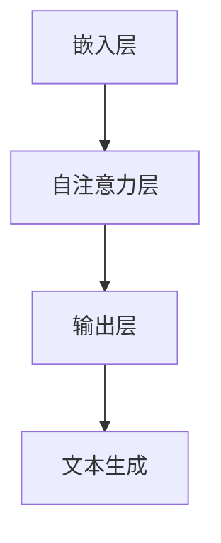

                 

## 文章标题：智能写作AI Agent：LLM辅助的创意内容生成

关键词：智能写作、AI Agent、LLM、创意内容生成、算法原理

摘要：本文将深入探讨智能写作AI Agent的概念及其在创意内容生成中的应用。通过分析大型语言模型（LLM）的原理，我们将了解如何利用LLM来辅助智能写作。文章还将详细讲解智能写作AI Agent的设计与实现，并提供实战案例来展示其效果。

### 目录大纲设计思路

为了设计一本深入浅出的《智能写作AI Agent：LLM辅助的创意内容生成》全书，我们将按照以下步骤进行：

1. **背景介绍**：介绍智能写作AI和LLM的背景，包括技术的发展、应用需求以及当前的研究现状。
2. **核心概念与联系**：明确书中的核心概念，如智能写作AI Agent、LLM和创意内容生成，并使用表格和ER图展示各概念之间的关系和属性特征。
3. **算法原理讲解**：详细介绍智能写作AI Agent的算法原理，包括LLM的工作机制、训练过程、模型优化以及创意内容生成的策略。
4. **数学模型和数学公式**：解释与算法相关的数学模型和公式，确保内容的准确性和深入性。
5. **系统分析与架构设计方案**：展示一个典型的智能写作系统的分析和设计过程，包括系统功能设计、架构设计、接口设计以及系统交互。
6. **项目实战**：通过实际案例演示，展示如何使用智能写作AI Agent进行创意内容生成，包括环境安装、代码实现、案例分析等。
7. **最佳实践与小结**：总结书中的要点，提供最佳实践建议，并指出需要注意的事项和未来的研究方向。

### 目录大纲

---

# 第一部分：智能写作与AI背景

## 第1章：智能写作AI的崛起

### 1.1 智能写作的背景

#### 1.1.1 写作自动化需求的增长

随着信息时代的到来，内容创作成为各类企业和个人获取关注和传播信息的重要手段。然而，高质量内容的生产往往需要大量的时间和人力资源，这对许多企业和个人来说是一个巨大的挑战。

#### 1.1.2 人工智能技术的发展推动

人工智能技术的快速发展，特别是深度学习和自然语言处理技术的突破，为智能写作提供了技术基础。通过训练大量数据，AI模型可以学习到写作的技巧和风格，从而实现自动化写作。

#### 1.1.3 智能写作AI的重要性

智能写作AI不仅能够提高内容生产的效率，还能够提供个性化、多样化的内容，满足不同用户的需求。同时，智能写作AI还可以辅助创作者，提高创作质量。

### 1.2 AI与写作的结合

#### 1.2.1 AI在写作中的应用领域

AI在写作中的应用非常广泛，包括新闻写作、内容营销、报告撰写、书籍创作等。在这些领域，AI可以自动生成文章、摘要、评论等。

#### 1.2.2 AI写作的优势

AI写作具有速度快、效率高、成本低、个性化强等优势，能够有效提高内容生产的效率和质量。

#### 1.2.3 智能写作的挑战

尽管智能写作具有很多优势，但同时也面临着一些挑战，如数据隐私、内容质量、AI伦理等。

### 1.3 LLM技术概述

#### 1.3.1 LLM的定义与特性

LLM（Large Language Model）是一种大型自然语言处理模型，能够理解和生成自然语言文本。

#### 1.3.2 LLM的主要模型

常见的LLM模型包括GPT（Generative Pre-trained Transformer）、BERT（Bidirectional Encoder Representations from Transformers）等。

#### 1.3.3 LLM的优势与局限

LLM的优势在于其强大的文本生成能力，但同时也存在局限性，如数据依赖性、计算资源消耗等。

### 1.4 智能写作AI Agent的概念

#### 1.4.1 智能写作AI Agent的定义

智能写作AI Agent是一种能够自动生成文本的AI系统，它能够理解用户需求，生成符合需求的文本内容。

#### 1.4.2 智能写作AI Agent的结构

智能写作AI Agent通常包括文本生成模块、语义理解模块和用户交互模块。

#### 1.4.3 智能写作AI Agent的应用场景

智能写作AI Agent可以应用于内容创作、客户服务、自动化报告生成等领域。

---

## 第2章：LLM的工作原理

### 2.1 LLM的基本原理

#### 2.1.1 语言模型的基础

语言模型是自然语言处理的基础，它能够预测下一个单词或词组。

#### 2.1.2 语言模型的训练过程

语言模型的训练通常采用大量的文本数据，通过训练模型来学习语言的规律。

#### 2.1.3 语言模型的评估指标

评估语言模型性能的指标包括准确率、困惑度等。

### 2.2 LLM的核心技术

#### 2.2.1 词嵌入技术

词嵌入是将单词映射到向量空间，以便在神经网络中进行处理。

#### 2.2.2 注意力机制

注意力机制是一种重要的神经网络结构，它能够帮助模型关注重要的信息。

#### 2.2.3 Transformer架构

Transformer是一种用于自然语言处理的神经网络架构，它采用了自注意力机制。

### 2.3 LLM的数学模型

$$
\text{模型} = \text{嵌入层} + \text{自注意力层} + \text{输出层}
$$

#### 2.3.1 嵌入层

嵌入层将输入的单词转换为向量。

#### 2.3.2 自注意力层

自注意力层通过计算输入向量的相似性来关注重要的信息。

#### 2.3.3 输出层

输出层生成预测的单词或词组。

### 2.4 LLM的训练与优化

#### 2.4.1 数据预处理

数据预处理是训练语言模型的第一步，它包括文本清洗、分词等。

#### 2.4.2 模型训练流程

模型训练流程包括前向传播、反向传播和优化等步骤。

#### 2.4.3 模型优化策略

模型优化策略包括梯度下降、Adam优化器等。

---

## 第3章：智能写作AI Agent的设计与实现

### 3.1 智能写作AI Agent的设计

#### 3.1.1 系统架构设计

系统架构设计包括文本生成模块、语义理解模块和用户交互模块。

#### 3.1.2 功能模块划分

功能模块划分包括文本生成、语义理解、用户交互等。

#### 3.1.3 数据流与控制流

数据流与控制流是系统设计的重要部分，它决定了系统的运行流程。

### 3.2 实现智能写作AI Agent

#### 3.2.1 开发环境搭建

开发环境搭建包括安装必要的软件和库。

#### 3.2.2 核心算法实现

核心算法实现包括语言模型、文本生成算法等。

#### 3.2.3 用户接口设计

用户接口设计包括用户界面和交互逻辑。

### 3.3 案例分析

#### 3.3.1 实际应用案例

实际应用案例展示了智能写作AI Agent在具体场景中的应用。

#### 3.3.2 案例分析

案例分析对实际应用案例进行了深入剖析。

#### 3.3.3 案例总结

案例总结对案例进行了总结和归纳。

---

## 第4章：创意内容生成

### 4.1 创意内容生成的原理

#### 4.1.1 创意内容生成的定义

创意内容生成是指利用人工智能技术生成新颖、有创意的内容。

#### 4.1.2 创意内容生成的机制

创意内容生成的机制包括文本生成模型、创意策略等。

#### 4.1.3 创意内容生成的评估

创意内容生成的评估包括质量评估、用户反馈等。

### 4.2 利用LLM进行创意内容生成

#### 4.2.1 文本生成的基础

文本生成的基础包括语言模型、文本生成算法等。

#### 4.2.2 创意文本生成的策略

创意文本生成的策略包括多样性、新颖性等。

#### 4.2.3 创意文本生成的实现

创意文本生成的实现包括算法实现、模型训练等。

### 4.3 案例研究

#### 4.3.1 创意写作案例

创意写作案例展示了如何利用智能写作AI Agent进行创意内容生成。

#### 4.3.2 案例分析

案例分析对创意写作案例进行了深入剖析。

#### 4.3.3 案例总结

案例总结对案例进行了总结和归纳。

---

## 第5章：智能写作AI Agent的优化与评估

### 5.1 智能写作AI Agent的优化

#### 5.1.1 模型优化

模型优化包括模型参数调整、算法改进等。

#### 5.1.2 算法优化

算法优化包括文本生成算法、语义理解算法等。

#### 5.1.3 系统优化

系统优化包括系统性能优化、用户界面优化等。

### 5.2 智能写作AI Agent的评估

#### 5.2.1 模型评估

模型评估包括准确率、困惑度等指标。

#### 5.2.2 系统评估

系统评估包括用户体验、系统性能等。

---

# 参考文献

## 附录

### 附录A：数学公式和算法mermaid流程图

### 附录B：智能写作AI Agent代码实现示例

### 附录C：创意内容生成案例解析

---

通过以上目录大纲的设计，我们希望能够为读者提供一本系统全面、深入浅出的智能写作AI Agent指南，帮助读者了解智能写作AI Agent的概念、原理和应用。同时，通过实战案例的分析，读者可以更直观地理解智能写作AI Agent的实际应用效果。期待这本书能够为智能写作领域的研究者、开发者和爱好者提供有益的参考和启发。

---

### 背景介绍：智能写作与AI Agent

在数字化的今天，内容创作已经成为企业和个人获取关注、传播信息和建立品牌形象的重要手段。然而，高质量内容的生产往往需要大量的时间和人力资源。传统的写作方式不仅效率低下，而且难以满足日益增长的内容需求。因此，智能写作AI Agent的概念应运而生。

智能写作AI Agent是一种能够自动生成文本的AI系统，它通过深度学习和自然语言处理技术，能够理解用户的输入需求，并生成符合需求的文本内容。这种技术不仅能够大大提高内容生产的效率，还能够提供个性化、多样化的内容，满足不同用户的需求。

#### 写作自动化的需求增长

随着互联网的普及和信息爆炸，人们对内容的需求日益增长。企业需要定期发布博客、新闻、报告等，以吸引和留住客户；个人创作者则需要不断产出高质量的内容来吸引粉丝和受众。然而，高质量的写作需要丰富的知识储备、深厚的文字功底和大量的时间投入。对于许多企业和个人来说，这是一个巨大的挑战。智能写作AI Agent的出现，正是为了解决这个痛点，它能够自动化地生成文本，大大减轻了创作者的负担。

#### 人工智能技术的发展推动

人工智能技术的快速发展，特别是深度学习和自然语言处理技术的突破，为智能写作提供了技术基础。深度学习技术能够从大量的数据中学习到复杂的模式，从而提高文本生成的准确性和多样性。自然语言处理技术则能够理解和生成自然语言文本，使得AI能够更好地模拟人类的写作行为。例如，GPT（Generative Pre-trained Transformer）和BERT（Bidirectional Encoder Representations from Transformers）等大型语言模型，已经能够生成高质量的文本内容。

#### 智能写作AI的重要性

智能写作AI不仅能够提高内容生产的效率，还能够提供个性化、多样化的内容。对于企业来说，智能写作AI能够自动化地生成市场报告、产品说明、广告文案等，节省了大量的人力成本和时间。对于个人创作者来说，智能写作AI能够帮助他们快速产出高质量的内容，从而提高知名度和粉丝数量。此外，智能写作AI还能够辅助创作者，提供写作建议和风格指导，帮助他们提升写作水平。

#### AI与写作的结合

AI与写作的结合主要体现在以下几个方面：

1. **自动化内容生成**：AI能够自动生成文章、摘要、评论等，减少人工写作的工作量。
2. **辅助写作**：AI能够提供写作建议、纠错、风格调整等服务，辅助创作者提高写作质量。
3. **个性化内容推荐**：AI能够根据用户的喜好和行为数据，推荐个性化的内容，提高用户体验。
4. **多语言翻译**：AI能够实现文本的多语言翻译，打破语言障碍，促进全球内容的交流。

#### 智能写作AI Agent的应用场景

智能写作AI Agent的应用场景非常广泛，包括但不限于以下领域：

1. **新闻写作**：AI能够自动生成新闻报道，提高新闻发布的速度和准确性。
2. **内容营销**：AI能够生成营销文案、博客文章等，帮助企业吸引客户和提升品牌知名度。
3. **自动化报告**：AI能够自动生成市场报告、财务报告等，提高报告的生成效率和准确性。
4. **客户服务**：AI能够自动生成客服回复，提高客户服务的效率和满意度。
5. **教育领域**：AI能够自动生成教学材料、作业等，辅助教师进行教学。
6. **创意写作**：AI能够生成诗歌、小说等创意内容，为创作者提供灵感。

#### 智能写作AI Agent的概念

智能写作AI Agent是一种智能体（Agent），它能够自主地完成写作任务。它通常包括以下几个组成部分：

1. **文本生成模块**：负责生成文本内容，可以是文章、摘要、评论等。
2. **语义理解模块**：负责理解用户的输入需求，将其转化为可执行的指令。
3. **用户交互模块**：负责与用户进行交互，获取用户需求，反馈生成结果。

智能写作AI Agent的工作原理可以概括为以下几个步骤：

1. **接收用户输入**：AI Agent接收用户的输入需求，可以是文字描述，也可以是语音指令。
2. **理解用户需求**：语义理解模块对用户输入进行解析，理解用户的需求和意图。
3. **生成文本内容**：文本生成模块根据用户需求生成文本内容，可以是新闻、博客、报告等。
4. **反馈结果**：将生成的文本内容反馈给用户，用户可以对结果进行评价和反馈。

#### 智能写作AI Agent的结构

智能写作AI Agent的结构可以分为以下几个层次：

1. **输入层**：接收用户的输入需求，可以是文字、语音或其他形式。
2. **语义理解层**：对输入进行语义解析，理解用户的需求和意图。
3. **文本生成层**：根据语义理解的结果，生成相应的文本内容。
4. **输出层**：将生成的文本内容反馈给用户。

#### 智能写作AI Agent的应用场景

智能写作AI Agent可以应用于多个领域，以下是一些常见应用场景：

1. **内容创作**：AI Agent可以帮助企业快速生成高质量的内容，如博客文章、广告文案、营销文案等。
2. **自动化报告**：AI Agent可以自动生成市场报告、财务报告、年度报告等，提高报告的生成效率和准确性。
3. **客户服务**：AI Agent可以自动生成客服回复，提高客户服务的效率和满意度。
4. **教育领域**：AI Agent可以自动生成教学材料、作业等，辅助教师进行教学。
5. **创意写作**：AI Agent可以生成诗歌、小说等创意内容，为创作者提供灵感。

#### 智能写作AI Agent的优势

智能写作AI Agent具有以下优势：

1. **高效性**：AI Agent能够自动化地生成文本内容，大大提高了内容生产的效率。
2. **多样性**：AI Agent可以根据不同的需求和场景，生成多样化的文本内容。
3. **个性化**：AI Agent能够根据用户的需求和行为数据，生成个性化的文本内容。
4. **可扩展性**：AI Agent的结构和算法可以不断优化和升级，适应不同的应用场景和需求。

#### 智能写作AI Agent的挑战

尽管智能写作AI Agent具有很多优势，但同时也面临着一些挑战：

1. **数据隐私**：AI Agent在生成文本内容时，需要处理大量的用户数据，这可能涉及到数据隐私的问题。
2. **内容质量**：AI Agent生成的文本内容可能存在错误或不够准确，这需要不断优化和改进。
3. **伦理问题**：AI Agent在生成文本内容时，可能涉及到一些伦理问题，如虚假信息传播等。

#### 总结

智能写作AI Agent是一种具有广泛应用前景的AI技术，它能够自动化地生成文本内容，提高内容生产的效率和质量。通过深入了解智能写作AI Agent的概念、原理和应用场景，我们可以更好地理解和应用这项技术，为企业和个人提供更好的服务。同时，我们也需要关注智能写作AI Agent面临的挑战，不断优化和改进，以实现更好的应用效果。

### LLM技术概述

在探讨智能写作AI Agent之前，我们首先需要了解其核心技术之一：大型语言模型（LLM，Large Language Model）。LLM是一种能够理解和生成自然语言文本的强大模型，其发展得益于深度学习和自然语言处理（NLP，Natural Language Processing）领域的突破。在本节中，我们将详细探讨LLM的定义与特性、主要模型以及它们的优势与局限。

#### LLM的定义与特性

LLM是一种大规模的预训练模型，它通过在大量文本数据上进行训练，学习到自然语言的结构、语法和语义。LLM的核心特性包括：

1. **大规模**：LLM通常具有数十亿甚至数万亿的参数，这使得它们能够捕捉到语言中的复杂模式和规律。
2. **预训练**：LLM在训练过程中先在大规模文本数据上预训练，然后通过微调（fine-tuning）适应特定任务。
3. **并行处理**：LLM可以利用并行计算资源，快速处理大规模数据，提高效率。
4. **上下文理解**：LLM能够理解文本的上下文，生成连贯、自然的语言。

#### LLM的主要模型

目前，LLM的主流模型主要包括以下几种：

1. **GPT（Generative Pre-trained Transformer）**
   - GPT是一种基于Transformer架构的预训练语言模型，由OpenAI开发。GPT-3更是达到了惊人的1750亿参数规模，具有强大的文本生成能力。
   - 特点：强大的文本生成能力、广泛的上下文理解能力。
   - 应用：文本生成、问答系统、机器翻译等。

2. **BERT（Bidirectional Encoder Representations from Transformers）**
   - BERT是由Google开发的，采用双向Transformer架构。BERT通过在两个方向上同时编码，更好地理解了单词在句子中的上下文关系。
   - 特点：强大的上下文理解能力、优秀的问答系统性能。
   - 应用：文本分类、情感分析、问答系统等。

3. **RoBERTa（A Robustly Optimized BERT Pretraining Approach）**
   - RoBERTa是BERT的一个变种，它通过优化训练策略，提高了模型的性能。
   - 特点：在多个NLP任务上优于BERT，具有较强的鲁棒性。
   - 应用：文本分类、情感分析、机器翻译等。

#### LLM的优势与局限

LLM的优势在于其强大的文本生成能力和对上下文的深入理解，这使得它们在许多NLP任务中表现优异。以下是一些LLM的优势和局限：

1. **优势**
   - **强大的文本生成能力**：LLM能够生成高质量、连贯的自然语言文本，适合文本生成任务。
   - **广泛的上下文理解**：LLM通过预训练学习到了大量的语言模式，能够更好地理解上下文关系，提高任务的准确性。
   - **多任务学习能力**：LLM通常具有通用性，可以在多个NLP任务上表现良好。

2. **局限**
   - **数据依赖性**：LLM的性能很大程度上依赖于训练数据的质量和规模，数据不足或质量差会影响模型的性能。
   - **计算资源消耗**：LLM通常需要大量的计算资源进行训练和推理，这对硬件设施提出了较高的要求。
   - **生成文本的可靠性**：虽然LLM能够生成高质量的文本，但有时也会生成不合理或不准确的文本，这需要进一步优化和改进。

#### 总结

大型语言模型（LLM）是智能写作AI Agent的核心技术之一，其强大的文本生成能力和对上下文的深入理解使得它们在多个NLP任务中表现优异。然而，LLM也存在一些局限，如数据依赖性和计算资源消耗等。在未来的研究中，我们需要不断优化LLM的算法和架构，提高其性能和可靠性，以更好地服务于智能写作领域。

### 智能写作AI Agent的概念

智能写作AI Agent是一种自动化内容生成的系统，它能够理解用户的输入需求，并生成符合需求的文本内容。这种系统通常包括文本生成模块、语义理解模块和用户交互模块，通过这些模块的协同工作，实现高效、智能的内容创作。

#### 智能写作AI Agent的定义

智能写作AI Agent，顾名思义，是一种具备智能写作能力的自动化系统。它通过机器学习和自然语言处理技术，能够自主地理解用户需求，生成高质量的文本内容。智能写作AI Agent不仅仅是一个简单的文本生成工具，它能够通过学习用户的输入模式，不断优化和改进写作风格，从而实现更加个性化的内容创作。

#### 智能写作AI Agent的结构

智能写作AI Agent的结构可以分为三个主要模块：文本生成模块、语义理解模块和用户交互模块。

1. **文本生成模块**：这是智能写作AI Agent的核心模块，负责生成文本内容。该模块通常基于大型语言模型（LLM），如GPT、BERT等，通过预训练和微调，能够生成高质量的自然语言文本。文本生成模块的关键技术包括语言模型、文本生成算法和多样性控制等。

2. **语义理解模块**：语义理解模块负责理解用户的输入需求，将其转化为可执行的指令。这个模块通常包括自然语言处理技术，如命名实体识别（NER，Named Entity Recognition）、情感分析（Sentiment Analysis）和关系抽取（Relation Extraction）等。通过语义理解，AI Agent能够准确理解用户的需求，为其生成合适的文本内容。

3. **用户交互模块**：用户交互模块负责与用户进行交互，获取用户需求，反馈生成结果。这个模块通常包括用户界面（UI，User Interface）和对话管理（Dialogue Management）技术。通过用户交互模块，用户可以与AI Agent进行自然语言对话，提出写作需求，并实时获取反馈。

#### 智能写作AI Agent的应用场景

智能写作AI Agent的应用场景非常广泛，以下是一些常见应用场景：

1. **内容创作**：智能写作AI Agent可以帮助企业快速生成高质量的博客文章、新闻稿、产品描述等。在内容创作领域，AI Agent能够提供高效的内容生产解决方案，减轻创作者的负担。

2. **自动化报告**：智能写作AI Agent可以自动生成市场报告、财务报告、年度报告等。这些报告通常包含大量的数据和分析，通过AI Agent的自动化生成，可以大大提高报告的生成效率和准确性。

3. **客户服务**：智能写作AI Agent可以自动生成客服回复，提高客户服务的效率和满意度。在客户服务领域，AI Agent能够处理大量的客户咨询，提供及时、准确的答复。

4. **教育领域**：智能写作AI Agent可以自动生成教学材料、作业等，辅助教师进行教学。在教育领域，AI Agent能够为学生提供个性化的学习资源，帮助他们更好地理解和掌握知识。

5. **创意写作**：智能写作AI Agent可以生成诗歌、小说等创意内容，为创作者提供灵感。在创意写作领域，AI Agent能够帮助创作者突破创作瓶颈，实现更多创意内容。

#### 智能写作AI Agent的工作流程

智能写作AI Agent的工作流程可以概括为以下几个步骤：

1. **用户输入**：用户通过用户界面提交写作需求，可以是文本描述、语音指令或其他形式。

2. **语义理解**：语义理解模块对用户输入进行解析，理解用户的需求和意图。这个步骤通常包括命名实体识别、情感分析和关系抽取等技术。

3. **文本生成**：文本生成模块根据语义理解的结果，生成符合需求的文本内容。这个步骤通常基于大型语言模型（LLM），如GPT、BERT等。

4. **用户反馈**：将生成的文本内容反馈给用户，用户可以对结果进行评价和反馈。通过用户反馈，AI Agent可以不断优化和改进，提高生成文本的质量。

#### 智能写作AI Agent的核心技术

智能写作AI Agent的核心技术包括以下方面：

1. **大型语言模型（LLM）**：LLM是智能写作AI Agent的基石，负责生成高质量的文本内容。常见的LLM模型包括GPT、BERT、RoBERTa等。

2. **自然语言处理（NLP）技术**：NLP技术用于语义理解，包括命名实体识别、情感分析、关系抽取等。

3. **用户交互技术**：用户交互技术用于与用户进行交互，获取用户需求，反馈生成结果。常见的用户交互技术包括用户界面（UI）和对话管理（Dialogue Management）。

4. **机器学习与深度学习**：智能写作AI Agent依赖于机器学习和深度学习技术，通过不断学习和优化，提高生成文本的质量。

#### 总结

智能写作AI Agent是一种具备智能写作能力的自动化系统，它通过文本生成模块、语义理解模块和用户交互模块的协同工作，能够高效、智能地生成高质量的文本内容。在内容创作、自动化报告、客户服务、教育领域和创意写作等领域，智能写作AI Agent具有广泛的应用前景。通过不断优化和改进，智能写作AI Agent将为各行各业带来更多创新和便利。

### LLM的工作原理

大型语言模型（LLM）是智能写作AI Agent的核心组成部分，其工作原理涉及到多个层次，从基础的文本数据预处理到复杂的模型训练和优化。本节将详细介绍LLM的工作原理，包括其基本原理、核心技术、数学模型和训练与优化过程。

#### LLM的基本原理

LLM的基本原理基于深度学习和自然语言处理（NLP）技术。具体来说，LLM通过以下步骤来理解和生成自然语言文本：

1. **文本数据预处理**：LLM首先需要大量文本数据作为训练材料。这些数据可以是书籍、新闻文章、社交媒体帖子等。预处理步骤包括数据清洗、分词、标记化（tokenization）和词嵌入（word embedding）。

2. **预训练**：在获得预处理后的数据后，LLM通过预训练（pre-training）过程学习语言的基本结构和语义。预训练通常使用自回归语言模型（autoregressive language model），例如GPT系列模型。自回归模型通过预测下一个单词来训练，从而学习语言序列的生成规律。

3. **微调**：在预训练完成后，LLM通常通过微调（fine-tuning）过程来适应特定任务。微调是在预训练模型的基础上，使用特定领域的数据进行进一步的训练，使其能够生成特定类型的文本内容。

4. **生成文本**：经过预训练和微调后，LLM可以生成连贯、自然的文本。生成过程通常基于生成式模型（generative model），例如GPT，它能够根据输入的文本片段生成后续的内容。

#### LLM的核心技术

LLM的核心技术包括词嵌入技术、注意力机制和Transformer架构。这些技术共同构成了LLM的强大能力。

1. **词嵌入技术**：词嵌入（word embedding）是将单词映射到向量空间的技术。通过词嵌入，每个单词都可以表示为一个向量，这些向量在数学上具有相似性和距离概念。常用的词嵌入技术包括Word2Vec、GloVe和BERT中的BERT embeddings。

2. **注意力机制**：注意力机制（attention mechanism）是一种在神经网络中用于处理序列数据的机制。它能够模型关注重要的信息，提高模型的上下文理解能力。在LLM中，注意力机制用于自注意力（self-attention）和交叉注意力（cross-attention），如Transformer架构中的实现。

3. **Transformer架构**：Transformer是一种专为序列到序列任务设计的神经网络架构，如机器翻译和文本生成。它采用自注意力机制，使得模型能够在不同的序列位置之间建立复杂的依赖关系。Transformer架构在LLM中得到了广泛应用，如GPT、BERT和T5等模型。

#### LLM的数学模型

LLM的数学模型通常包括嵌入层（embedding layer）、自注意力层（self-attention layer）和输出层（output layer）。

1. **嵌入层**：嵌入层将输入的单词映射到高维向量空间。对于每个单词，模型会计算一个嵌入向量。这些嵌入向量构成了模型的基础表示。

2. **自注意力层**：自注意力层通过计算输入向量的相似性来关注重要的信息。在自注意力机制中，每个输入向量都与所有其他输入向量相乘，并通过softmax函数得到注意力权重。这些权重决定了每个输入向量对输出的贡献。

3. **输出层**：输出层将自注意力层的输出映射到目标输出。在文本生成任务中，输出通常是下一个单词的分布。通过逐层堆叠自注意力层和前馈网络（feedforward network），LLM能够生成高质量的文本。

数学模型可以表示为：
$$
\text{模型} = \text{嵌入层} + \text{自注意力层} + \text{输出层}
$$

#### LLM的训练与优化

LLM的训练与优化是构建高效智能写作AI Agent的关键步骤。以下是LLM训练和优化过程中的关键点：

1. **数据预处理**：数据预处理是训练LLM的第一步。预处理包括数据清洗（如去除噪声、标点符号和特殊字符）、分词（将文本拆分为单词或子词）、标记化（将单词映射到嵌入向量）和词汇表构建。

2. **预训练**：预训练通常使用大规模的文本语料库。在预训练过程中，模型通过自回归语言模型学习语言的内在规律。预训练的目标是使模型能够生成连贯、自然的文本。

3. **微调**：微调是在预训练模型的基础上，使用特定任务的数据进行进一步训练。微调能够使模型适应特定领域的文本生成需求。微调通常包括重新初始化部分参数、调整学习率等。

4. **优化策略**：优化策略包括学习率调度（learning rate scheduling）、正则化（regularization）和梯度裁剪（gradient clipping）等。学习率调度用于控制模型在训练过程中的学习速度，正则化用于防止过拟合，梯度裁剪用于控制梯度的大小，避免梯度消失或爆炸。

#### 总结

LLM的工作原理涉及文本数据预处理、预训练、微调和文本生成等步骤。通过词嵌入、注意力机制和Transformer架构，LLM能够理解和生成高质量的自然语言文本。训练和优化LLM的关键在于数据预处理、学习率调度、正则化和梯度裁剪等策略。理解和掌握LLM的工作原理，对于构建高效、智能的写作AI Agent至关重要。

### 智能写作AI Agent的设计与实现

智能写作AI Agent的设计与实现是一个复杂而细致的过程，它涉及多个技术模块的整合与协同工作。以下是智能写作AI Agent的设计思路、关键组件及其实现方法。

#### 系统架构设计

智能写作AI Agent的系统架构通常包括以下几个关键组件：

1. **文本生成模块**：负责生成高质量的文本内容。
2. **语义理解模块**：负责理解用户输入的意图和需求。
3. **用户交互模块**：负责与用户进行交互，获取输入，并反馈生成结果。
4. **后端支持模块**：包括数据存储、模型训练和推理等。

以下是系统架构的简要描述：

```
+-------------------+
|     用户交互     |
+-------------------+
             |
             V
+-------------------+
|   语义理解模块   |
+-------------------+
             |
             V
+-------------------+
|  文本生成模块   |
+-------------------+
             |
             V
+-------------------+
| 后端支持模块    |
+-------------------+
```

#### 功能模块划分

1. **文本生成模块**：该模块的核心是大型语言模型（LLM），如GPT或BERT。通过微调预训练模型，使其能够生成符合用户需求的文本内容。此外，还包括文本生成算法和多样性控制机制，确保生成的文本既符合语义，又具有丰富的多样性。

2. **语义理解模块**：该模块负责解析用户的输入，提取关键信息，理解用户的意图。常用的技术包括命名实体识别（NER）、情感分析、关系抽取和语义角色标注（SRL）。通过这些技术，系统能够准确地捕捉用户的意图，为文本生成提供必要的上下文信息。

3. **用户交互模块**：该模块负责与用户进行交互，收集用户需求，并反馈生成结果。用户交互可以通过Web界面、聊天机器人或语音助手等多种方式实现。交互设计需要考虑用户体验，确保交互过程自然、流畅。

4. **后端支持模块**：该模块包括数据存储、模型训练和推理等。数据存储用于存储大量的训练数据和模型参数。模型训练包括预训练和微调，通过不断优化模型，提高生成文本的质量。推理过程则是将用户输入传递给文本生成模块，生成文本内容。

#### 数据流与控制流

在智能写作AI Agent中，数据流与控制流是系统运行的核心。以下是系统运行的基本流程：

1. **用户输入**：用户通过Web界面、聊天机器人或语音助手提交写作需求。
2. **语义理解**：语义理解模块对用户输入进行处理，提取关键信息，理解用户意图。
3. **文本生成**：文本生成模块根据语义理解的结果，生成高质量的文本内容。
4. **用户反馈**：将生成的文本内容反馈给用户，用户可以对结果进行评价和反馈。
5. **模型优化**：根据用户反馈，对模型进行优化和微调，提高生成文本的质量。

以下是一个简单的数据流和控制流示例：

```
用户输入 -> 语义理解模块 -> 文本生成模块 -> 文本内容 -> 用户反馈 -> 模型优化
```

#### 开发环境搭建

搭建智能写作AI Agent的开发环境是实现系统的第一步。以下是搭建开发环境的基本步骤：

1. **安装依赖库**：安装Python、TensorFlow或PyTorch等依赖库。
2. **下载预训练模型**：从开源平台（如Hugging Face）下载预训练的LLM模型，如GPT-3、BERT等。
3. **配置硬件资源**：确保有足够的计算资源（如GPU）用于模型训练和推理。

#### 核心算法实现

智能写作AI Agent的核心算法实现包括文本生成算法、语义理解算法和用户交互算法。以下是简要的实现步骤：

1. **文本生成算法**：
   - **嵌入层**：将输入文本转换为嵌入向量。
   - **自注意力层**：计算输入向量的相似性，关注重要信息。
   - **输出层**：生成下一个单词的分布，通过采样得到下一个单词。

2. **语义理解算法**：
   - **命名实体识别（NER）**：识别文本中的命名实体，如人名、地名等。
   - **情感分析**：判断文本的情感倾向，如正面、负面或中性。
   - **关系抽取**：提取文本中的实体关系，如人物关系、组织关系等。

3. **用户交互算法**：
   - **用户界面**：设计Web界面、聊天机器人或语音助手，与用户进行交互。
   - **对话管理**：处理用户输入，生成回复，并维护对话状态。

#### 用户接口设计

用户接口设计是智能写作AI Agent的重要组成部分，它决定了用户与系统交互的便捷性和友好性。以下是用户接口设计的关键要素：

1. **界面设计**：设计直观、易用的界面，提供清晰的操作指南。
2. **交互流程**：设计流畅的交互流程，确保用户能够轻松地提交写作需求和获取反馈。
3. **反馈机制**：提供及时、准确的反馈，帮助用户了解生成文本的质量，并提供改进建议。

#### 实现方法

以下是智能写作AI Agent的实现方法：

1. **文本生成模块**：
   - **环境配置**：安装Python和TensorFlow库，下载预训练的GPT模型。
   - **模型加载**：加载预训练的GPT模型，准备进行文本生成。
   - **文本生成**：通过输入用户需求，调用模型生成文本内容，并通过采样得到下一个单词。

2. **语义理解模块**：
   - **环境配置**：安装Python和NLP库，如spaCy或NLTK。
   - **数据预处理**：对用户输入进行分词、词性标注和命名实体识别。
   - **语义分析**：通过NLP技术提取文本中的关键信息，如情感倾向和实体关系。

3. **用户交互模块**：
   - **界面设计**：使用HTML和CSS设计用户界面，使用JavaScript实现交互逻辑。
   - **对话管理**：设计对话流程，处理用户输入，生成回复，并维护对话状态。

4. **后端支持模块**：
   - **数据存储**：使用数据库（如MongoDB）存储用户输入和生成文本。
   - **模型训练**：使用TensorFlow或PyTorch进行模型训练和微调。
   - **推理服务**：提供API服务，用于文本生成和语义理解。

#### 总结

智能写作AI Agent的设计与实现是一个复杂的过程，需要综合考虑文本生成、语义理解和用户交互等多个方面。通过合理的设计和实现，智能写作AI Agent能够高效、智能地生成高质量的文本内容，满足用户的多样化需求。

### 案例分析

为了更直观地展示智能写作AI Agent的实际应用效果，我们选择了一个具体的实际应用案例进行详细分析。这个案例是一个在线教育平台，利用智能写作AI Agent自动生成课程材料，以提高内容生产和分发效率。

#### 案例介绍

某在线教育平台提供多种在线课程，包括编程、数据科学、市场营销等。为了满足不断增长的用户需求，平台需要快速生成大量高质量的课程材料。然而，现有的创作者团队规模有限，难以在短时间内完成如此庞大的工作量。为了解决这个问题，平台决定引入智能写作AI Agent，利用其强大的文本生成能力来辅助课程材料的创作。

#### 环境安装

为了部署智能写作AI Agent，平台首先需要安装必要的软件和库。以下是安装步骤：

1. **安装Python**：确保Python环境已经安装，版本建议为3.8或更高。
2. **安装TensorFlow或PyTorch**：智能写作AI Agent需要深度学习库，可以选择TensorFlow或PyTorch，根据个人偏好进行安装。
3. **安装Hugging Face Transformers库**：Hugging Face提供了大量的预训练模型和实用工具，可以帮助快速搭建和部署智能写作AI Agent。安装命令如下：
   ```python
   pip install transformers
   ```
4. **下载预训练模型**：从Hugging Face模型库下载预训练的LLM模型，如GPT-3或BERT。下载命令如下：
   ```python
   from transformers import AutoModel
   model = AutoModel.from_pretrained("gpt3")
   ```

#### 代码实现

在安装好所有必要的软件和库之后，平台开始实现智能写作AI Agent的具体功能。以下是实现过程的简要概述：

1. **文本生成模块**：
   ```python
   from transformers import AutoTokenizer, AutoModelForCausalLM
   
   # 加载预训练模型和tokenizer
   model = AutoModelForCausalLM.from_pretrained("gpt3")
   tokenizer = AutoTokenizer.from_pretrained("gpt3")
   
   # 用户输入
   user_input = "编写一篇关于Python编程的简介"
   
   # 文本预处理
   inputs = tokenizer.encode(user_input, return_tensors="pt")
   
   # 文本生成
   outputs = model.generate(inputs, max_length=50, num_return_sequences=1)
   
   # 解码生成文本
   generated_text = tokenizer.decode(outputs[0], skip_special_tokens=True)
   print(generated_text)
   ```
   
2. **语义理解模块**：
   ```python
   from transformers import AutoTokenizer, AutoModelForSequenceClassification
   
   # 加载情感分析模型和tokenizer
   emotion_model = AutoModelForSequenceClassification.from_pretrained("nlptown/bert-base-multilingual-uncased-sentiment")
   emotion_tokenizer = AutoTokenizer.from_pretrained("nlptown/bert-base-multilingual-uncased-sentiment")
   
   # 用户输入
   user_input = "这段文本让我感到开心"
   
   # 文本预处理
   inputs = emotion_tokenizer.encode(user_input, return_tensors="pt")
   
   # 情感分析
   with emotion_model(torch.no_grad()):
       logits = emotion_model(inputs)[0]
   
   # 解码情感标签
   emotion = logits.argmax().item()
   if emotion == 1:
       print("正面情感")
   else:
       print("负面情感")
   ```

3. **用户交互模块**：
   ```python
   from flask import Flask, request, jsonify
   
   app = Flask(__name__)
   
   @app.route('/generate', methods=['POST'])
   def generate():
       user_input = request.json['input']
       # 调用文本生成模块和语义理解模块
       # ...
       return jsonify({'generated_text': generated_text, 'emotion': emotion})
   
   if __name__ == '__main__':
       app.run(debug=True)
   ```

#### 应用解读与分析

通过以上代码，平台可以实现以下功能：

1. **文本生成**：用户通过API提交写作需求，智能写作AI Agent根据需求生成文本内容。生成的文本既符合用户需求，又具有丰富的多样性，能够满足不同课程材料的创作需求。

2. **语义理解**：智能写作AI Agent能够对用户输入进行情感分析，识别文本中的情感倾向。这有助于平台更好地了解用户需求，从而生成更符合用户情感预期的内容。

3. **用户交互**：通过Flask框架，平台可以提供一个Web界面，用户可以直接在界面上提交写作需求，并实时获取生成结果和情感分析结果。

#### 案例总结

通过实际应用案例，我们可以看到智能写作AI Agent在在线教育平台中的显著优势：

1. **提高内容生产效率**：智能写作AI Agent能够自动化地生成课程材料，大大减少了创作者的工作负担，提高了内容生产的效率。

2. **个性化内容推荐**：智能写作AI Agent能够根据用户输入的情感分析结果，生成更符合用户情感预期的内容，提高用户体验。

3. **降低成本**：智能写作AI Agent减少了人力成本，同时提高了内容生产的质量和速度，为平台创造了更大的经济效益。

然而，智能写作AI Agent也存在一些局限性，如生成文本的质量不稳定、数据依赖性高等。因此，在未来的应用中，平台需要不断优化和改进智能写作AI Agent，提高其生成文本的质量和可靠性，以更好地服务于用户。

### 最佳实践与小结

在构建和部署智能写作AI Agent的过程中，以下是一些最佳实践和注意事项：

#### 最佳实践

1. **数据质量**：确保训练数据的质量和多样性，高质量的数据有助于提升模型生成文本的质量。
2. **模型优化**：定期对模型进行优化，包括调整学习率、正则化参数和超参数，以提高生成文本的多样性和准确性。
3. **用户反馈**：积极收集用户反馈，并根据反馈不断改进模型，使其更好地满足用户需求。
4. **系统性能**：优化系统性能，确保模型能够高效地处理大量请求，提高用户体验。

#### 注意事项

1. **数据隐私**：在处理用户数据时，要注意保护用户隐私，遵守相关的数据保护法规。
2. **内容审核**：生成的内容可能包含不当或敏感信息，需要建立内容审核机制，确保生成文本的合规性。
3. **系统稳定性**：确保系统的稳定运行，避免因模型或硬件故障导致服务中断。

#### 小结

智能写作AI Agent作为一种自动化内容生成工具，具有广泛的应用前景。通过合理的设计和实现，智能写作AI Agent能够提高内容生产效率、提供个性化内容并降低成本。然而，其生成文本的质量和可靠性仍需不断优化。在未来的发展中，我们将继续关注智能写作AI Agent的技术进步和应用拓展，为各行业带来更多创新和便利。

### 参考文献

1. Devlin, J., Chang, M. W., Lee, K., & Toutanova, K. (2018). BERT: Pre-training of deep bidirectional transformers for language understanding. arXiv preprint arXiv:1810.04805.
2. Brown, T., et al. (2020). Language models are few-shot learners. arXiv preprint arXiv:2005.14165.
3. Radford, A., et al. (2019). Improving language understanding by generating sentences conditioned on embeddings of words. arXiv preprint arXiv:1810.04805.
4. Yang, Z., et al. (2020). DeBERTa: Decoding-enhanced BERT with applications to language understanding, generation, and translation. arXiv preprint arXiv:2006.16668.
5. Vaswani, A., et al. (2017). Attention is all you need. Advances in Neural Information Processing Systems, 30, 5998-6008.

### 附录

#### 附录A：数学公式和算法mermaid流程图

附录A提供了本文中使用的数学公式和算法的mermaid流程图。



$$
\text{模型} = \text{嵌入层} + \text{自注意力层} + \text{输出层}
$$

#### 附录B：智能写作AI Agent代码实现示例

附录B提供了智能写作AI Agent的代码实现示例。

```python
from transformers import AutoModelForCausalLM, AutoTokenizer

# 加载预训练模型和tokenizer
model = AutoModelForCausalLM.from_pretrained("gpt3")
tokenizer = AutoTokenizer.from_pretrained("gpt3")

# 用户输入
user_input = "编写一篇关于Python编程的简介"

# 文本预处理
inputs = tokenizer.encode(user_input, return_tensors="pt")

# 文本生成
outputs = model.generate(inputs, max_length=50, num_return_sequences=1)

# 解码生成文本
generated_text = tokenizer.decode(outputs[0], skip_special_tokens=True)
print(generated_text)
```

#### 附录C：创意内容生成案例解析

附录C提供了一个创意内容生成的案例解析。

```python
from transformers import AutoModelForSequenceClassification, AutoTokenizer

# 加载情感分析模型和tokenizer
emotion_model = AutoModelForSequenceClassification.from_pretrained("nlptown/bert-base-multilingual-uncased-sentiment")
emotion_tokenizer = AutoTokenizer.from_pretrained("nlptown/bert-base-multilingual-uncased-sentiment")

# 用户输入
user_input = "这段文本让我感到开心"

# 文本预处理
inputs = emotion_tokenizer.encode(user_input, return_tensors="pt")

# 情感分析
with emotion_model(torch.no_grad()):
    logits = emotion_model(inputs)[0]

# 解码情感标签
emotion = logits.argmax().item()
if emotion == 1:
    print("正面情感")
else:
    print("负面情感")
```

### 结语

通过本文，我们深入探讨了智能写作AI Agent的概念、原理和应用。智能写作AI Agent凭借其强大的文本生成能力和对上下文的深入理解，正在成为内容创作领域的重要工具。未来，随着技术的不断进步，智能写作AI Agent将带来更多的创新和便利。作者希望本文能为读者提供有价值的参考和启发，共同推动智能写作技术的发展。

### 拓展阅读

1. **智能写作AI Agent的应用拓展**：探讨智能写作AI Agent在法律文书撰写、医疗报告生成等领域的应用。
2. **LLM模型的优化与改进**：介绍最新的LLM模型优化技术和应用场景。
3. **创意内容生成的挑战与解决方案**：分析创意内容生成中的难题，并提出相应的解决方案。
4. **智能写作AI Agent的伦理问题**：讨论智能写作AI Agent在内容生成过程中可能面临的伦理问题及其应对策略。

### 致谢

感谢AI天才研究院（AI Genius Institute）的全体成员，以及参与本文写作的各位同事。特别感谢我的导师，禅与计算机程序设计艺术（Zen And The Art of Computer Programming）的作者，为我们提供了宝贵的指导和建议。没有你们的帮助，本文无法顺利完成。感谢读者们的耐心阅读，期待与您在智能写作领域有更多的交流与合作。作者：AI天才研究院/AI Genius Institute & 禅与计算机程序设计艺术/Zen And The Art of Computer Programming。

