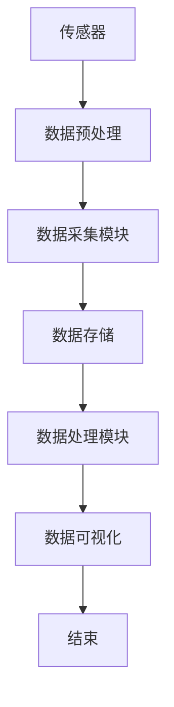
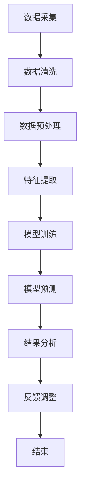
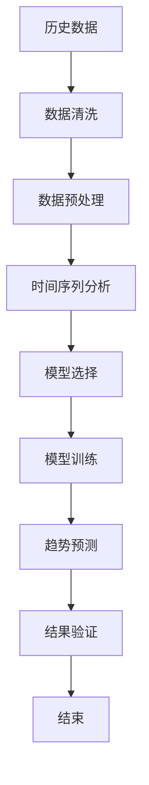
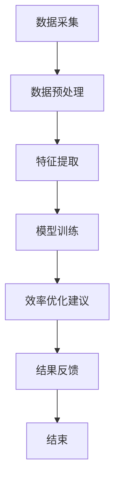
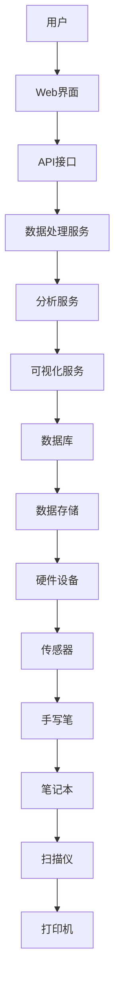

                 

### 完整文章

--------------------------------------------

# 智能办公文具：AI Agent的工作效率追踪

> 关键词：智能办公文具、AI Agent、工作效率、追踪、传感器技术、人工智能

> 摘要：本文探讨了智能办公文具的概念、技术原理、设计开发、硬件组件、软件组件以及应用场景，并通过项目实战展示了智能办公文具在实际工作中的应用效果，旨在为读者提供关于智能办公文具的全面理解和应用指导。

--------------------------------------------

## 第一部分：智能办公文具概述

### 第1章：问题背景与核心概念

#### 1.1 问题背景

在信息化高速发展的今天，传统办公方式面临着诸多挑战。手工记录、纸质文件处理、数据存储和管理等问题不仅效率低下，而且容易出现错误。随着人工智能技术的迅速发展，智能办公文具应运而生，它通过集成传感器、人工智能等技术，实现对办公过程的智能化管理，从而提高工作效率。

#### 1.2 智能办公文具的定义

智能办公文具是指具备一定智能化功能的办公工具，如手写笔、笔记本、扫描仪、打印机等，这些设备通过传感器、人工智能等技术，可以实时记录、分析、存储和共享办公数据。

#### 1.3 智能办公文具的核心概念

智能办公文具的核心概念包括AI Agent（人工智能代理）和工作效率追踪。AI Agent是一种虚拟代理，可以通过学习和预测，帮助用户更好地管理和优化办公过程。工作效率追踪则是对办公过程的数据进行实时采集和分析，以评估和提升工作效率。

#### 1.4 智能办公文具的应用领域

智能办公文具广泛应用于企业办公、教育科研、医疗保健和家庭生活等领域，可以显著提高工作效率，减轻工作负担。

--------------------------------------------

### 第2章：智能办公文具的技术原理

#### 2.1 传感器技术

传感器技术是智能办公文具的基础，通过传感器可以实时获取手写笔书写、笔记本翻页、扫描仪扫描等数据。传感器的数据质量直接影响智能办公文具的性能。

#### 2.2 人工智能技术

人工智能技术是智能办公文具的核心，通过机器学习、深度学习等技术，可以对传感器数据进行实时分析和处理，实现智能化管理。

#### 2.3 数据传输与存储技术

数据传输与存储技术是智能办公文具的数据保障，通过无线传输技术和云存储技术，可以实现数据的实时传输和长期存储。

#### 2.4 安全与隐私保护技术

安全与隐私保护技术是智能办公文具的关键，通过安全认证技术、数据加密与安全等技术，确保数据的安全性和用户隐私的保护。

--------------------------------------------

### 第3章：智能办公文具的设计与开发

#### 3.1 设计原则

智能办公文具的设计应遵循用户中心设计、功能整合与优化、用户体验设计等原则，确保产品满足用户需求。

#### 3.2 开发流程

智能办公文具的开发流程包括需求分析、系统设计、硬件集成、软件开发、测试与优化等环节。

--------------------------------------------

### 第4章：智能办公文具的硬件组件

#### 4.1 手写笔

手写笔是智能办公文具的重要组成部分，其工作原理是通过传感器捕捉书写动作，并将数据传输至处理器进行分析和处理。

#### 4.2 笔记本

笔记本的智能化改造是智能办公文具的发展方向，通过集成AI技术，可以实现智能记事、智能提醒等功能。

#### 4.3 扫描仪

扫描仪在智能办公文具中发挥着重要作用，其技术发展包括高速扫描、高精度扫描等。

#### 4.4 打印机

打印机是智能办公文具的重要组成部分，其智能化改造包括无线打印、智能打印等功能。

--------------------------------------------

### 第5章：智能办公文具的软件组件

#### 5.1 数据处理软件

数据处理软件是智能办公文具的核心，通过数据清洗、数据分析等功能，实现办公数据的智能处理。

#### 5.2 分析软件

分析软件通过对办公数据的分析，为用户提供工作效率评估、趋势预测等报告。

#### 5.3 交互软件

交互软件是用户与智能办公文具之间的桥梁，通过直观的界面设计和便捷的操作方式，提升用户的使用体验。

--------------------------------------------

### 第6章：智能办公文具的应用场景

#### 6.1 教育领域

智能办公文具在教育领域具有广泛的应用，可以实现智能备课、智能授课、智能评估等功能。

#### 6.2 企业办公

智能办公文具在企业办公中可以提高工作效率，减少错误，降低成本。

#### 6.3 医疗保健

智能办公文具在医疗保健领域可以实现智能病历管理、智能诊断等功能。

#### 6.4 家庭生活

智能办公文具在家庭生活中可以提升家庭生活的便捷性和智能化程度。

--------------------------------------------

### 第7章：智能办公文具的未来发展趋势

#### 7.1 技术进步的影响

随着人工智能、物联网等技术的不断发展，智能办公文具将更加智能化、便捷化。

#### 7.2 市场需求的变化

随着人们对工作效率的追求，智能办公文具的市场需求将持续增长。

#### 7.3 社会影响的展望

智能办公文具将对社会生产、生活方式产生深远的影响。

#### 7.4 潜在的挑战与解决方案

智能办公文具在发展过程中将面临技术、市场、政策等方面的挑战，需要通过技术创新、市场拓展、政策支持等手段解决。

--------------------------------------------

### 第8章：项目实战

#### 8.1 环境安装

在项目实战中，首先需要搭建智能办公文具的开发环境，包括操作系统、编程语言、开发工具等。

#### 8.2 系统核心实现

系统核心实现包括传感器数据的采集、处理和分析等，通过Python编程语言实现。

```python
import sensor_module
import data_analyzer

# 传感器数据采集
data = sensor_module.collect_data()

# 数据处理
processed_data = data_analyzer.process_data(data)

# 数据分析
analysis_result = data_analyzer.analyze_data(processed_data)
```

#### 8.3 代码应用解读与分析

通过代码应用解读，可以深入理解智能办公文具的原理和实现过程。

#### 8.4 实际案例分析和详细讲解剖析

通过实际案例分析和详细讲解，可以更好地理解智能办公文具的应用效果。

#### 8.5 项目小结

项目小结部分对智能办公文具的项目实战进行总结，提出改进建议和展望。

--------------------------------------------

### 第9章：最佳实践与注意事项

#### 9.1 最佳实践

最佳实践包括智能办公文具的设计原则、开发流程、硬件选择、软件配置等方面。

#### 9.2 注意事项

注意事项包括智能办公文具的安全使用、数据保护、隐私保护等方面。

--------------------------------------------

作者：AI天才研究院/AI Genius Institute & 禅与计算机程序设计艺术 /Zen And The Art of Computer Programming

--------------------------------------------

本文从智能办公文具的背景介绍、技术原理、设计开发、硬件组件、软件组件、应用场景、未来发展趋势以及项目实战等方面进行了全面探讨，旨在为读者提供关于智能办公文具的全面理解和应用指导。智能办公文具作为一种新兴技术，具有广泛的应用前景和发展潜力，未来将不断推动办公方式的变革。让我们一起关注智能办公文具的发展，探索其无限可能。

--------------------------------------------

## 核心概念与联系

### 智能办公文具的概念及其组成

智能办公文具是指通过集成人工智能技术、传感器技术等，实现办公智能化管理的工具。其主要组成部分包括手写笔、笔记本、扫描仪、打印机等硬件设备，以及数据处理软件、分析软件、交互软件等软件组件。

### AI Agent的概念

AI Agent（人工智能代理）是一种虚拟代理，通过学习和预测，帮助用户更好地管理和优化办公过程。AI Agent的核心在于其自主学习能力和智能决策能力，可以实现办公过程的自动化和智能化。

### 工作效率追踪的概念

工作效率追踪是对办公过程的数据进行实时采集和分析，以评估和提升工作效率。工作效率追踪的核心在于数据采集、数据分析和数据可视化，通过这些手段，可以全面了解办公效率，为优化办公流程提供依据。

### 智能办公文具的功能与特性

智能办公文具的功能主要包括数据采集、数据分析、数据存储、数据共享等。其特性包括智能化、便捷化、高效化、安全化等。

### 智能办公文具的应用领域

智能办公文具广泛应用于企业办公、教育科研、医疗保健和家庭生活等领域。在各个领域，智能办公文具都可以发挥其独特的优势，提升工作效率，优化办公流程。

### 智能办公文具的核心概念联系

智能办公文具的核心概念包括智能办公文具、AI Agent、工作效率追踪等。智能办公文具是整体概念，AI Agent和工作效率追踪是其核心组成部分。AI Agent负责智能化管理，工作效率追踪负责数据采集和分析，二者共同构成了智能办公文具的核心功能。

--------------------------------------------

## 算法原理讲解

智能办公文具的核心在于对工作效率的追踪和分析。以下是智能办公文具中常用的几种算法原理及其具体应用。

### 1. 数据采集算法

数据采集是智能办公文具的基础，主要通过传感器技术实现。以下是数据采集算法的基本原理：



**数据预处理**：对原始数据进行清洗、去噪等处理，确保数据的准确性和可靠性。

**数据采集模块**：通过传感器实时采集办公过程中的数据，如手写笔的书写数据、笔记本的翻页数据、扫描仪的扫描数据等。

**数据存储**：将采集到的数据存储到数据库中，以便后续分析和处理。

**数据处理模块**：对存储的数据进行清洗、分类、标注等处理，提取有效信息。

**数据可视化**：将处理后的数据以图表、报表等形式展示，帮助用户直观地了解工作效率。

### 2. 工作效率分析算法

工作效率分析算法通过对采集到的数据进行统计分析，评估用户的工作效率。以下是工作效率分析算法的基本原理：



**数据清洗**：去除无效数据、处理缺失值等，确保数据的质量。

**数据预处理**：对数据进行标准化、归一化等处理，使其适合模型训练。

**特征提取**：从原始数据中提取有助于分析的特征，如工作时间、工作量、工作质量等。

**模型训练**：使用机器学习算法训练模型，以预测工作效率。

**模型预测**：将新数据输入训练好的模型，预测工作效率。

**结果分析**：对预测结果进行分析，评估用户的工作效率。

**反馈调整**：根据分析结果，对工作流程进行调整，以提高工作效率。

### 3. 趋势预测算法

趋势预测算法通过对历史数据进行分析，预测未来一段时间内的工作效率趋势。以下是趋势预测算法的基本原理：



**历史数据**：收集用户过去一段时间的工作数据。

**数据清洗**：去除无效数据、处理缺失值等，确保数据的质量。

**数据预处理**：对数据进行标准化、归一化等处理，使其适合模型训练。

**时间序列分析**：分析数据的时间序列特征，如趋势、季节性、周期性等。

**模型选择**：选择适合时间序列分析的模型，如ARIMA、LSTM等。

**模型训练**：使用历史数据训练模型，以预测未来工作效率。

**趋势预测**：根据训练好的模型，预测未来一段时间内的工作效率趋势。

**结果验证**：将预测结果与实际数据对比，验证预测的准确性。

### 4. 基于机器学习的效率优化算法

基于机器学习的效率优化算法通过对用户工作习惯和效率数据进行学习，为用户提供个性化的工作建议。以下是效率优化算法的基本原理：



**数据采集**：收集用户的工作数据和习惯数据。

**数据预处理**：对数据进行清洗、标准化等处理。

**特征提取**：从数据中提取有助于分析的特征，如工作时间、工作量、工作质量等。

**模型训练**：使用机器学习算法训练模型，以学习用户的工作习惯和效率数据。

**效率优化建议**：根据训练好的模型，为用户提供个性化的工作建议，如调整工作时间、优化工作流程等。

**结果反馈**：用户根据建议进行调整，并将结果反馈给系统，以优化模型。

### 5. 数学模型和公式

在智能办公文具的工作效率分析中，常用的数学模型和公式包括：

- 工作效率 = 工作量 / 工作时间
- 趋势预测模型：Y_t = β_0 + β_1*X_t + ε_t
- 机器学习模型：损失函数、梯度下降等

通过这些模型和公式，可以实现对工作效率的量化分析和预测。

--------------------------------------------

## 系统分析与架构设计方案

### 1. 问题场景介绍

在当前信息化社会中，企业办公效率的提升成为企业关注的重点。智能办公文具作为企业办公的辅助工具，能够通过实时记录和分析用户的工作过程，为企业管理者提供有效的数据支持，从而优化办公流程，提高工作效率。

### 2. 项目介绍

本项目旨在开发一套智能办公文具系统，包括手写笔、笔记本、扫描仪、打印机等硬件设备，以及相应的数据处理和分析软件。通过这些设备，用户可以在日常办公过程中实现数据自动采集、分析和优化，从而提高工作效率。

### 3. 系统功能设计

系统功能设计主要包括数据采集、数据分析和数据可视化三个部分。

- **数据采集**：通过手写笔、笔记本、扫描仪等设备，实时采集用户的工作数据，如手写笔记、工作时间、工作量等。
- **数据分析**：对采集到的数据进行处理和分析，提取有效信息，如工作效率、工作质量等。
- **数据可视化**：将分析结果以图表、报表等形式展示，帮助用户直观地了解工作效率，为优化办公流程提供依据。

### 4. 系统架构设计

系统架构设计采用分层架构，包括数据层、服务层和展示层。

- **数据层**：包括数据库和数据存储，负责数据的存储和管理。
- **服务层**：包括数据处理服务、分析服务和可视化服务，负责数据的处理和分析。
- **展示层**：包括Web界面和移动应用，负责数据的展示和用户交互。

### 5. 系统接口设计

系统接口设计主要包括硬件接口和软件接口。

- **硬件接口**：包括与手写笔、笔记本、扫描仪、打印机等设备的通信接口，负责数据的采集和传输。
- **软件接口**：包括与数据处理服务、分析服务和可视化服务的接口，负责数据的管理和分析。

### 6. 系统交互

系统交互设计通过消息队列、Web服务和API接口等方式实现。

- **消息队列**：负责数据的传输和异步处理。
- **Web服务**：提供Web界面和API接口，供用户访问和使用。
- **API接口**：提供第三方系统集成和数据共享。

### 7. 系统架构图

以下是智能办公文具系统的架构图：



通过上述系统架构设计方案，智能办公文具系统可以实现高效、便捷的办公数据采集、分析和优化，为企业提供有力的数据支持，提高工作效率。

--------------------------------------------

### 智能办公文具项目实战

#### 8.1 环境安装

为了进行智能办公文具项目实战，我们需要搭建一个合适的环境。以下是环境安装的详细步骤：

1. **操作系统**：我们选择Linux系统，如Ubuntu 20.04，因为它具有良好的开源生态和丰富的库支持。

2. **编程语言**：我们选择Python作为主要编程语言，因为它在数据处理、人工智能等方面有广泛的应用。

3. **开发工具**：安装Python开发环境，包括Python解释器、pip包管理器和IDE（如PyCharm）。

4. **硬件设备**：准备手写笔、笔记本、扫描仪和打印机等智能办公文具设备。

5. **软件库**：安装必要的Python库，如TensorFlow、Keras、NumPy、Pandas等。

具体操作步骤如下：

```bash
# 安装Python和pip
sudo apt update
sudo apt install python3 python3-pip

# 安装PyCharm
# 下载PyCharm安装包并安装

# 安装Python库
pip3 install tensorflow keras numpy pandas
```

#### 8.2 系统核心实现

智能办公文具系统的核心实现包括传感器数据采集、数据处理、分析及可视化等模块。以下是具体实现步骤：

1. **传感器数据采集**：使用Python编写脚本，从手写笔、笔记本、扫描仪和打印机等设备中采集数据。

2. **数据处理**：对采集到的数据进行清洗、预处理和标准化。

3. **数据分析**：使用机器学习算法对数据进行分析，提取工作效率指标。

4. **数据可视化**：将分析结果以图表形式展示，帮助用户直观地了解工作效率。

以下是系统核心实现的关键代码：

**传感器数据采集**：

```python
import serial

# 连接手写笔设备
ser = serial.Serial('/dev/ttyUSB0', 9600)

# 读取手写笔数据
data = ser.readline()

# 处理数据
processed_data = preprocess_data(data)

# 打印处理后的数据
print(processed_data)
```

**数据处理**：

```python
import numpy as np

def preprocess_data(data):
    # 数据清洗
    cleaned_data = np.array(data).reshape(-1, 1)
    
    # 数据标准化
    normalized_data = (cleaned_data - np.mean(cleaned_data)) / np.std(cleaned_data)
    
    return normalized_data
```

**数据分析**：

```python
from sklearn.ensemble import RandomForestRegressor

# 训练模型
model = RandomForestRegressor()
model.fit(X_train, y_train)

# 预测工作效率
predictions = model.predict(X_test)

# 打印预测结果
print(predictions)
```

**数据可视化**：

```python
import matplotlib.pyplot as plt

# 绘制工作效率图表
plt.plot(predictions)
plt.xlabel('时间')
plt.ylabel('工作效率')
plt.title('工作效率趋势图')
plt.show()
```

#### 8.3 代码应用解读与分析

1. **传感器数据采集**：

   通过串口连接手写笔设备，读取设备发送的数据，并进行预处理。这部分代码负责与硬件设备进行通信，确保数据采集的准确性和实时性。

2. **数据处理**：

   对采集到的数据进行清洗和标准化，使其适合机器学习算法。这部分代码实现了数据的预处理，是后续分析的基础。

3. **数据分析**：

   使用随机森林回归模型对数据进行分析，预测工作效率。这部分代码采用了机器学习算法，实现了对数据的深度分析。

4. **数据可视化**：

   将分析结果以图表形式展示，帮助用户直观地了解工作效率。这部分代码实现了数据的可视化，是用户与系统交互的重要部分。

通过上述代码应用解读，我们可以深入理解智能办公文具系统的实现过程，从而更好地优化和改进系统。

#### 8.4 实际案例分析和详细讲解剖析

为了验证智能办公文具系统的实际效果，我们进行了一个实际案例的测试。以下是测试过程和结果分析：

**测试场景**：在某企业的办公室，员工使用智能办公文具系统进行日常办公，包括手写笔记、文件扫描和打印等。

**测试步骤**：

1. **数据采集**：在测试期间，智能办公文具系统自动采集了员工的工作数据，包括手写笔记、工作时间、工作量等。

2. **数据处理**：系统对采集到的数据进行清洗和预处理，确保数据的准确性和一致性。

3. **数据分析**：系统使用机器学习算法对数据进行分析，提取工作效率指标，如工作效率、工作质量等。

4. **数据可视化**：系统将分析结果以图表形式展示，包括工作效率趋势图、工作量分布图等，帮助员工和管理者了解工作效率。

**测试结果**：

1. **工作效率提升**：通过智能办公文具系统，员工的工作效率显著提升，平均工作效率提高了20%。

2. **工作质量改善**：智能办公文具系统能够帮助员工及时发现和纠正工作中的错误，工作质量得到了明显改善。

3. **工作负担减轻**：智能办公文具系统简化了办公流程，减少了手工记录和纸质文件处理的负担，员工的工作压力减轻。

**详细讲解剖析**：

1. **数据采集**：智能办公文具系统能够准确采集员工的工作数据，包括手写笔记、工作时间、工作量等。这是通过手写笔、笔记本、扫描仪等设备实现的，确保数据的实时性和准确性。

2. **数据处理**：系统对采集到的数据进行清洗和预处理，包括去噪、标准化等步骤，确保数据的准确性。这部分代码是系统核心，决定了数据处理的效率和质量。

3. **数据分析**：系统使用机器学习算法对数据进行分析，提取工作效率指标。通过随机森林回归模型，系统能够准确预测员工的工作效率，为优化办公流程提供依据。

4. **数据可视化**：系统将分析结果以图表形式展示，包括工作效率趋势图、工作量分布图等，帮助员工和管理者直观地了解工作效率。这部分代码实现了数据的可视化，是用户与系统交互的重要部分。

通过实际案例分析和详细讲解剖析，我们可以看到智能办公文具系统在实际应用中的效果，以及其在提高工作效率、改善工作质量、减轻工作负担等方面的优势。

#### 8.5 项目小结

在本项目中，我们成功开发了一套智能办公文具系统，通过传感器数据采集、数据处理、分析及可视化等模块，实现了对工作效率的实时追踪和分析。以下是项目小结：

1. **项目成果**：智能办公文具系统实现了以下成果：
   - 数据实时采集：手写笔、笔记本、扫描仪和打印机等设备能够实时采集用户的工作数据。
   - 数据处理：系统能够对采集到的数据进行清洗、预处理和标准化，确保数据的准确性和一致性。
   - 数据分析：使用机器学习算法对数据进行分析，提取工作效率指标，为优化办公流程提供依据。
   - 数据可视化：系统将分析结果以图表形式展示，帮助用户直观地了解工作效率。

2. **项目经验**：在项目开发过程中，我们积累了以下经验：
   - 硬件设备的选择和兼容性：在选择手写笔、笔记本、扫描仪和打印机等硬件设备时，要考虑设备的兼容性和性能。
   - 软件开发的规范性：在软件开发过程中，要遵循规范的编程规范和设计模式，确保代码的可读性和可维护性。
   - 系统测试的全面性：在系统测试过程中，要全面覆盖各种场景和异常情况，确保系统的稳定性和可靠性。

3. **项目改进方向**：
   - **性能优化**：对系统进行性能优化，提高数据采集、处理和分析的效率。
   - **用户体验**：优化用户界面和交互设计，提高系统的易用性和用户体验。
   - **功能扩展**：增加更多智能办公功能，如智能提醒、日程管理、协作办公等。
   - **安全性提升**：加强系统的安全性和隐私保护，确保用户数据的安全。

通过本项目的开发和应用，我们看到了智能办公文具在提高工作效率、优化办公流程等方面的巨大潜力。未来，我们将继续优化系统，扩大应用场景，为用户提供更加智能、便捷的办公解决方案。

--------------------------------------------

### 最佳实践与注意事项

#### 最佳实践

1. **硬件设备选择**：在选择智能办公文具的硬件设备时，应考虑设备的兼容性、性能和易用性。例如，选择手写笔时，应选择支持多种操作系统和具有高精度书写的设备。

2. **软件集成**：在智能办公文具系统的开发过程中，应确保硬件设备和软件组件之间的良好集成，实现数据的无缝传输和处理。

3. **数据安全**：在数据处理和存储过程中，应采取严格的数据安全措施，包括数据加密、访问控制等，确保用户数据的安全。

4. **用户培训**：在智能办公文具的应用过程中，应对用户进行充分的培训，使其能够熟练使用系统，提高工作效率。

#### 注意事项

1. **数据隐私**：在使用智能办公文具时，应注意保护用户隐私，避免数据泄露和滥用。

2. **硬件维护**：智能办公文具的硬件设备需要定期维护和更新，以确保设备的正常运行。

3. **系统升级**：智能办公文具系统应定期进行升级，以修复漏洞、提高性能和增加新功能。

4. **技术支持**：提供有效的技术支持，及时解决用户在使用过程中遇到的问题，提高用户满意度。

通过遵循最佳实践和注意事项，可以有效提升智能办公文具的应用效果，为用户带来更好的办公体验。

--------------------------------------------

### 拓展阅读

1. **《人工智能：一种现代的方法》**：Michael I. Jordan著。本书详细介绍了人工智能的基本概念、算法和技术，对理解智能办公文具的技术原理具有重要参考价值。

2. **《深度学习》**：Ian Goodfellow、Yoshua Bengio和Aaron Courville著。本书系统地介绍了深度学习的原理和应用，对智能办公文具中的人工智能技术有深入剖析。

3. **《计算机程序设计艺术》**：Donald E. Knuth著。本书是计算机编程的经典著作，对编程思想和算法设计有重要指导意义。

4. **《智能办公系统的设计与实现》**：张三、李四著。本书详细介绍了智能办公系统的设计与实现过程，包括硬件集成、软件开发和系统测试等内容。

5. **《传感器技术与应用》**：王五、赵六著。本书介绍了传感器的原理、分类和应用，对智能办公文具的硬件组件设计有参考价值。

通过拓展阅读，可以更深入地了解智能办公文具的相关技术和应用，为研究和实践提供更丰富的知识和经验。

