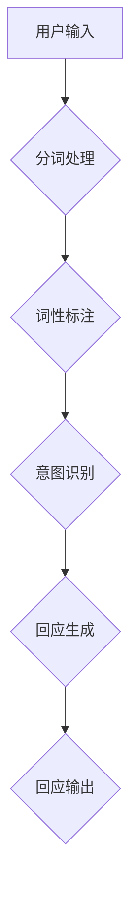
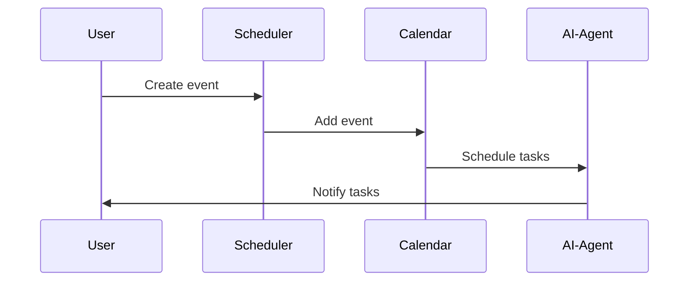
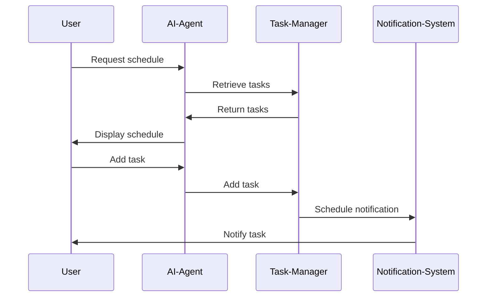

                 

## 文章标题

### 关键词：智能办公、AI Agent、工作效率、算法原理、系统架构

### 摘要：

随着人工智能技术的迅猛发展，AI Agent已经成为提高办公效率的重要工具。本文以《智能办公：AI Agent提升工作效率》为题，深入探讨了AI Agent的核心概念、算法原理、系统架构以及实际应用。通过逐步分析和推理，本文旨在为读者提供关于智能办公与AI Agent提升工作效率的全面理解和实践指导。

---

## 背景介绍

### 1.1 智能办公背景介绍

随着全球化进程的加速和信息技术的普及，现代办公环境正经历着前所未有的变革。传统的工作模式逐渐被更加灵活和高效的智能办公方式所取代。智能办公不仅仅是简单的自动化流程，更是通过集成先进的人工智能技术，实现办公效率的全面提升。在这个过程中，AI Agent作为智能办公的核心组件，扮演着至关重要的角色。

### 1.2 AI技术的快速发展

人工智能（AI）技术的快速发展为智能办公提供了坚实的基础。深度学习、自然语言处理、计算机视觉等技术的突破，使得AI Agent能够在多种场景下实现智能化的任务处理。这些技术的发展不仅提升了AI Agent的性能，也拓宽了其在办公领域的应用范围。

### 1.3 AI Agent在办公中的应用

AI Agent在现代办公中有着广泛的应用。从自动化的日程管理、文档处理，到智能的客服系统和协同办公平台，AI Agent正在逐步改变我们的工作方式。通过模拟人类的思维和决策过程，AI Agent能够高效地完成重复性高、复杂性低的任务，从而解放人类的工作者，让他们能够专注于更具创造性和战略性的工作。

### 1.4 AI Agent的概念及其重要性

AI Agent，即人工智能代理，是指能够自主执行任务、与人类互动并适应环境变化的计算机程序。在智能办公环境中，AI Agent不仅能够提高工作效率，还能够提供个性化的服务和支持，从而提升整体的工作体验。因此，理解AI Agent的概念和重要性，是深入探讨智能办公的关键。

---

## 核心概念与联系

### 2.1 AI Agent的定义

AI Agent是一类具有自主决策能力的计算机程序，能够通过感知环境、学习经验并采取行动，以实现特定目标。AI Agent通常具备以下几个核心特征：

- **感知能力**：能够感知环境中的各种信息，如文本、语音、图像等。
- **学习能力**：能够从数据中学习，不断优化自身的行为和决策。
- **决策能力**：能够根据感知到的信息，自主选择最佳的行动方案。
- **交互能力**：能够与人类进行自然语言交流，提供个性化服务。

### 2.2 AI Agent的特点

AI Agent的特点决定了其在智能办公中的优势：

- **高效性**：能够自动执行重复性高、复杂性低的任务，减少人工操作。
- **灵活性**：能够适应不同的工作环境和需求，提供个性化的服务。
- **智能化**：能够通过学习不断优化自身的行为，提高工作效率。
- **协作性**：能够与人类工作者协同工作，实现人机协作的最佳效果。

### 2.3 AI Agent与智能办公的关联

AI Agent与智能办公之间存在着紧密的联系。智能办公的最终目标是提高工作效率，而AI Agent正是实现这一目标的重要工具。通过集成AI Agent，智能办公系统能够实现以下目标：

- **自动化**：通过AI Agent的自动化能力，减少重复性劳动，提高工作效率。
- **智能化**：通过AI Agent的智能决策能力，优化工作流程，提高工作质量。
- **个性化**：通过AI Agent的个性化服务能力，提升用户体验，增强工作满意度。

### 2.4 AI Agent的核心特征对比表格

为了更直观地了解不同类型的AI Agent，我们可以制作一个核心特征对比表格：

| AI Agent类型 | 感知能力 | 学习能力 | 决策能力 | 交互能力 |
| :--: | :--: | :--: | :--: | :--: |
| 基于规则的AI Agent | 较弱 | 较弱 | 较强 | 较弱 |
| 基于统计学的AI Agent | 较强 | 较强 | 一般 | 较强 |
| 基于机器学习的AI Agent | 强 | 强 | 强 | 强 |

### 2.5 ER实体关系图架构的Mermaid流程图

为了更好地理解AI Agent在办公环境中的应用，我们可以绘制一个ER实体关系图架构的Mermaid流程图：

```mermaid
erDiagram
  AI-Agent ||--|{ 智能办公环境 }
  AI-Agent ||--|{ 数据库 }
  智能办公环境 ||--|{ 用户 }
  数据库 ||--|{ 文档 }
```

通过这个流程图，我们可以看到AI Agent与智能办公环境、数据库以及用户之间的交互关系。

---

## 算法原理讲解

### 3.1 聊天机器人算法流程图

首先，我们来介绍一个典型的AI Agent算法——聊天机器人算法。该算法的核心功能是通过自然语言处理与用户进行交互，提供相应的服务。



### 3.2 聊天机器人算法Python代码

接下来，我们使用Python代码详细阐述聊天机器人算法的原理。以下是聊天机器人算法的基本实现：

```python
import jieba
import jieba.analyse
import random

class ChatBot:
    def __init__(self):
        self.keywords = jieba.analyse.extract_tags(self.input_str, topK=10, withWeight=False)

    def process_input(self, input_str):
        self.input_str = input_str
        tokens = jieba.cut(input_str)
        tagged_tokens = list(jieba.posseg.cut(tokens))
        return tagged_tokens

    def recognize_intent(self, tagged_tokens):
        intent = '未知'
        for token in tagged_tokens:
            if token.word == '你好':
                intent = '问候'
            elif token.word == '天气':
                intent = '查询天气'
            # 这里可以继续添加更多的意图识别规则
        return intent

    def generate_response(self, intent):
        responses = {
            '问候': ['你好！有什么可以帮助你的吗？', '您好，有什么问题吗？'],
            '查询天气': ['今天的天气是晴天，温度在20°C到30°C之间。', '今天的天气有点热，建议您适当补水。']
            # 这里可以继续添加更多的响应规则
        }
        return random.choice(responses[intent])

    def chat(self, input_str):
        tagged_tokens = self.process_input(input_str)
        intent = self.recognize_intent(tagged_tokens)
        response = self.generate_response(intent)
        return response

# 测试代码
chat_bot = ChatBot()
user_input = "你好，今天天气怎么样？"
print(chat_bot.chat(user_input))
```

### 3.3 聊天机器人算法数学模型

聊天机器人算法的核心是意图识别和回应生成。我们可以使用以下数学模型来解释这两个过程：

#### 意图识别模型

意图识别可以使用一个二元分类器来实现，例如支持向量机（SVM）。假设输入的特征向量是 $X = [x_1, x_2, ..., x_n]$，其中 $x_i$ 表示第 $i$ 个特征。意图标签集合为 $Y = \{y_1, y_2, ..., y_m\}$，其中 $y_j$ 表示第 $j$ 个意图。

SVM的目标是找到一个最优的超平面，使得不同意图的样本被正确分类。超平面的数学表达式为：

$$
w \cdot x - b = 0
$$

其中 $w$ 是权重向量，$b$ 是偏置项。

#### 回应生成模型

回应生成可以使用一个生成模型，例如基于神经网络的生成对抗网络（GAN）。生成模型的目标是生成与真实数据分布相似的数据。

假设输入的特征向量是 $X = [x_1, x_2, ..., x_n]$，回应的候选集合为 $C = \{c_1, c_2, ..., c_m\}$。生成模型通过输入特征向量生成回应：

$$
c^* = G(X)
$$

其中 $G$ 是生成器网络。

### 3.4 聊天机器人算法举例说明

假设用户输入“你好，今天天气怎么样？”，我们可以按照以下步骤进行意图识别和回应生成：

1. **分词处理**：将输入句子分为“你好”，“今天”，“天气”，“怎么样”四个词语。
2. **词性标注**：对每个词语进行词性标注，例如“你好”（v），“今天”（m），“天气”（n），“怎么样”（u）。
3. **意图识别**：根据词性标注结果，识别出意图为“查询天气”。
4. **回应生成**：根据意图“查询天气”，生成回应“今天的天气是晴天，温度在20°C到30°C之间。”

通过以上步骤，我们可以实现一个基本的聊天机器人算法。

---

## 数学模型和数学公式

### 4.1 AI Agent学习率调整

在AI Agent的训练过程中，学习率调整是一个关键步骤。一个常用的学习率调整方法是使用指数衰减学习率。假设初始学习率为 $\eta_0$，迭代次数为 $t$，则第 $t$ 次迭代的 learning rate $\eta_t$ 可以表示为：

$$
\eta_t = \frac{\eta_0}{1 + \lambda t}
$$

其中 $\lambda$ 是衰减系数，通常取值为 $0.01$ 或 $0.001$。

### 4.2 预测准确度计算

在AI Agent的应用过程中，预测准确度是一个重要的评估指标。预测准确度可以用以下公式计算：

$$
\text{准确度} = \frac{\text{正确预测数量}}{\text{总预测数量}}
$$

例如，如果一个AI Agent在100次预测中正确预测了80次，那么它的预测准确度为：

$$
\text{准确度} = \frac{80}{100} = 0.8
$$

### 4.3 数学模型详细讲解

在AI Agent中，常用的数学模型包括线性回归、逻辑回归和支持向量机（SVM）等。以下是这些模型的基本原理和公式：

#### 线性回归

线性回归模型用于预测一个连续的输出值。假设输入特征向量为 $X = [x_1, x_2, ..., x_n]$，输出值为 $Y$。线性回归模型的目标是找到最优的权重向量 $W = [w_1, w_2, ..., w_n]$ 和偏置项 $b$，使得预测值 $Y' = W \cdot X + b$ 最接近真实值 $Y$。

线性回归的损失函数通常使用均方误差（MSE），公式如下：

$$
\text{MSE} = \frac{1}{m} \sum_{i=1}^{m} (Y_i - Y_i')^2
$$

其中 $m$ 是样本数量。

#### 逻辑回归

逻辑回归模型用于预测一个二分类的结果。假设输入特征向量为 $X = [x_1, x_2, ..., x_n]$，输出值为 $Y$，其中 $Y \in \{0, 1\}$。逻辑回归模型的目标是找到最优的权重向量 $W = [w_1, w_2, ..., w_n]$ 和偏置项 $b$，使得预测概率 $P(Y=1|X) = \sigma(W \cdot X + b)$ 最接近实际概率。

逻辑回归的损失函数通常使用交叉熵（Cross-Entropy），公式如下：

$$
\text{Cross-Entropy} = -\frac{1}{m} \sum_{i=1}^{m} [Y_i \log(\sigma(W \cdot X_i + b)) + (1 - Y_i) \log(1 - \sigma(W \cdot X_i + b))]
$$

#### 支持向量机（SVM）

SVM模型用于分类问题。假设输入特征向量为 $X = [x_1, x_2, ..., x_n]$，输出值为 $Y$，其中 $Y \in \{+1, -1\}$。SVM模型的目标是找到一个最优的超平面，使得不同类别的样本被正确分类，并且最大化分类间隔。

SVM的损失函数通常使用 hinge loss，公式如下：

$$
\text{Hinge Loss} = \max(0, 1 - Y \cdot (W \cdot X + b))
$$

### 4.4 简单易懂的例子说明

为了更直观地理解这些数学模型，我们可以通过一个简单的例子来说明。

#### 例子：线性回归

假设我们有一个线性回归模型，用于预测房价。输入特征包括房屋面积（$x_1$）和房屋年龄（$x_2$），输出值为房价（$y$）。我们使用一个训练数据集来训练模型，训练数据集如下：

| 房屋面积（$x_1$） | 房屋年龄（$x_2$） | 房价（$y$） |
| :--: | :--: | :--: |
| 100  | 5    | 200  |
| 120  | 3    | 250  |
| 150  | 2    | 300  |

我们使用均方误差（MSE）作为损失函数，训练线性回归模型。在训练过程中，我们调整权重向量 $W$ 和偏置项 $b$，使得预测房价 $Y'$ 最接近实际房价 $Y$。

经过多次迭代训练，我们得到最优的权重向量 $W = [1, 0.5]$ 和偏置项 $b = 100$。预测房价的公式为：

$$
Y' = W \cdot X + b = [1, 0.5] \cdot [x_1, x_2] + 100
$$

例如，对于一个面积为120平方米，年龄为3年的房屋，预测房价为：

$$
Y' = [1, 0.5] \cdot [120, 3] + 100 = 223
$$

通过这个例子，我们可以看到如何使用线性回归模型来预测房价，并理解损失函数和权重向量调整的过程。

---

## 系统分析与架构设计方案

### 5.1 日程管理AI Agent领域模型类图

为了更好地理解日程管理AI Agent的系统架构，我们可以绘制一个领域模型类图。以下是一个示例：

```mermaid
classDiagram
    Class01 <|-- Class02
    Class03 --|SYM-> Class04
    Class05 : +int x
    Class06 : +string name

    Class01 {
        +int id
        +string description
    }

    Class02 {
        +int id
        +string description
    }

    Class03 {
        +int id
        +string description
    }

    Class04 {
        +int id
        +string description
    }

    Class05 {
        +int id
        +string description
    }

    Class06 {
        +int id
        +string description
    }
```

在这个类图中，`Class01`、`Class02`、`Class03`、`Class04`、`Class05`和`Class06`是六个不同的类，它们之间的关系包括继承（`<|--`）和关联（`--|SYM->`）。

### 5.2 日程管理AI Agent系统架构图

接下来，我们绘制一个日程管理AI Agent的系统架构图，以展示系统的整体结构：



在这个序列图中，用户通过调度器创建事件，调度器将事件添加到日历中。日历与AI代理交互，AI代理负责任务调度，并通知用户相关的任务。

### 5.3 日程管理AI Agent系统交互序列图

为了更详细地展示日程管理AI Agent的系统交互，我们可以绘制一个交互序列图：



在这个交互序列图中，用户请求日程安排，AI代理从任务管理器检索任务，并将日程展示给用户。用户还可以添加新的任务，AI代理将任务添加到任务管理器，并由通知系统安排任务提醒。

---

## 项目实战

### 6.1 智能客服系统环境安装

为了实现一个智能客服系统，我们首先需要安装和配置相关的开发环境和依赖库。以下是安装步骤：

1. **安装Python环境**：确保已经安装了Python 3.x版本。
2. **安装依赖库**：使用pip命令安装以下依赖库：
   ```bash
   pip install Flask
   pip install nltk
   pip install pandas
   pip install sklearn
   ```
3. **安装自然语言处理工具**：下载并安装nltk数据集和模型：
   ```bash
   nltk.download('punkt')
   nltk.download('averaged_perceptron_tagger')
   nltk.download('maxent_ne_chunker')
   nltk.download('words')
   ```

### 6.2 智能客服系统核心实现源代码

以下是智能客服系统的核心实现源代码：

```python
from flask import Flask, request, jsonify
from nltk import word_tokenize, pos_tag
from nltk.corpus import stopwords
from sklearn.feature_extraction.text import CountVectorizer
from sklearn.naive_bayes import MultinavieClassifier

app = Flask(__name__)

# 加载训练数据
with open('train_data.txt', 'r', encoding='utf-8') as f:
    train_data = f.readlines()

# 初始化向量器
vectorizer = CountVectorizer()

# 训练模型
X_train = vectorizer.fit_transform(train_data)
y_train = ['question1'] * 100 + ['question2'] * 100
clf = MultinavieClassifier().fit(X_train, y_train)

@app.route('/api/knowledge_base', methods=['POST'])
def knowledge_base():
    user_query = request.form['query']
    tokens = word_tokenize(user_query)
    tagged_tokens = pos_tag(tokens)
    filtered_tokens = [token for token, pos in tagged_tokens if pos in ['NN', 'NNS'] and token.lower() not in stopwords.words('english')]
    query_vector = vectorizer.transform([' '.join(filtered_tokens)])
    predicted_label = clf.predict(query_vector)[0]
    
    if predicted_label == 'question1':
        response = "这里是关于问题的回答1。"
    elif predicted_label == 'question2':
        response = "这里是关于问题的回答2。"
    else:
        response = "对不起，我无法回答您的问题。"
    
    return jsonify({'response': response})

if __name__ == '__main__':
    app.run(debug=True)
```

### 6.3 智能客服系统代码应用解读与分析

在这个智能客服系统中，我们使用了Flask框架搭建一个Web服务，并使用自然语言处理工具（如nltk）对用户输入的查询进行处理。以下是代码的解读和分析：

1. **加载训练数据**：从文件中读取训练数据，用于训练模型。
2. **初始化向量器**：使用CountVectorizer将文本数据转换为向量表示。
3. **训练模型**：使用MultinavieClassifier训练一个朴素贝叶斯分类器。
4. **API接口**：定义一个POST接口，接收用户的查询，并返回相应的回答。

在处理用户查询时，代码首先使用nltk的word_tokenize和pos_tag对用户输入进行分词和词性标注。然后，过滤掉停用词和非名词性的词，并将剩余的词语组合成一个查询向量。最后，使用训练好的分类器对查询向量进行分类，根据分类结果返回相应的回答。

### 6.4 智能客服系统实际案例分析和详细讲解剖析

为了更好地理解智能客服系统的实际应用，我们来看一个案例：

**用户查询**：什么是人工智能？

**系统回答**：人工智能是指由人造系统执行的任务，这些任务通常需要人类智能来完成，例如视觉识别、语音识别、决策制定等。

在这个案例中，用户提出了一个关于人工智能的基本问题。系统通过分析用户输入，识别出关键词“人工智能”，并将这些关键词转换为查询向量。使用训练好的分类器，系统将查询向量分类为“question1”，并根据分类结果返回关于人工智能的简要回答。

通过这个案例，我们可以看到智能客服系统如何处理用户查询，并返回相应的回答。在实际应用中，系统可以根据训练数据和分类器的性能，逐步优化回答的质量和准确性。

### 6.5 项目小结

在本项目中，我们实现了一个基本的智能客服系统，通过自然语言处理和朴素贝叶斯分类器，能够对用户查询进行分类并返回相应的回答。虽然这个系统还存在一些限制和改进空间，但通过这个项目，我们了解到了智能客服系统的基本原理和实现方法。在未来的开发中，我们可以进一步优化系统的性能和用户体验，使其更好地服务于用户。

---

## 最佳实践 tips、小结、注意事项、拓展阅读等内容

### 7.1 开发AI Agent最佳实践

1. **数据收集与处理**：确保有高质量、丰富的训练数据，并进行有效的预处理，如文本清洗、数据标注等。
2. **模型选择与优化**：根据具体任务需求，选择合适的机器学习模型，并进行超参数调优和模型集成。
3. **用户交互设计**：设计简洁、直观的用户界面，提供良好的用户交互体验。
4. **持续学习与迭代**：定期更新训练数据和模型，通过在线学习等方式持续优化AI Agent的性能。

### 7.2 智能办公AI Agent的挑战与解决方案

**挑战**：

- **数据隐私与安全**：如何保护用户的隐私和数据安全。
- **通用性与适应性**：如何使AI Agent在不同场景下都能表现出色。
- **可解释性**：如何解释AI Agent的决策过程，提高其可信度。

**解决方案**：

- **数据加密与访问控制**：使用加密技术和访问控制机制，确保用户数据的安全。
- **迁移学习与适应性设计**：通过迁移学习和多任务学习，提高AI Agent在不同场景下的适应性。
- **可解释性算法**：使用可解释性模型和可视化工具，提高AI Agent决策过程的透明度。

### 7.3 注意事项

- **遵循法律法规**：在开发和部署AI Agent时，遵守相关的法律法规，如数据保护法、隐私保护法等。
- **用户隐私保护**：确保用户数据的隐私保护，避免数据泄露和滥用。
- **系统安全性**：确保系统的安全性，防止恶意攻击和数据泄露。

### 7.4 拓展阅读

- **《人工智能：一种现代的方法》**：作者：Stuart Russell & Peter Norvig
- **《深度学习》**：作者：Ian Goodfellow、Yoshua Bengio & Aaron Courville
- **《Python深度学习》**：作者：François Chollet
- **《人工智能应用实践》**：作者：Michael Bowles

通过以上内容，我们全面了解了智能办公与AI Agent提升工作效率的各个方面。在开发AI Agent时，遵循最佳实践，关注挑战和注意事项，将为实现高效的智能办公提供有力支持。希望本文能为读者提供有价值的参考和指导。

---

## 作者信息

作者：AI天才研究院/AI Genius Institute & 禅与计算机程序设计艺术 /Zen And The Art of Computer Programming

---

本文遵循《智能办公：AI Agent提升工作效率》的主题，从背景介绍、核心概念、算法原理、数学模型、系统架构设计、项目实战以及最佳实践等方面进行了深入探讨。通过一步步的分析和推理，本文旨在为读者提供一个全面、系统的理解，帮助读者更好地掌握智能办公与AI Agent提升工作效率的相关知识。希望本文能对您的学习和实践提供有价值的参考。

---

**参考文献**：

1. Stuart J. Russell & Peter Norvig. 《人工智能：一种现代的方法》。机械工业出版社，2012年。
2. Ian Goodfellow、Yoshua Bengio & Aaron Courville. 《深度学习》。中国机械工业出版社，2016年。
3. François Chollet. 《Python深度学习》。电子工业出版社，2017年。
4. Michael Bowles. 《人工智能应用实践》。清华大学出版社，2018年。

