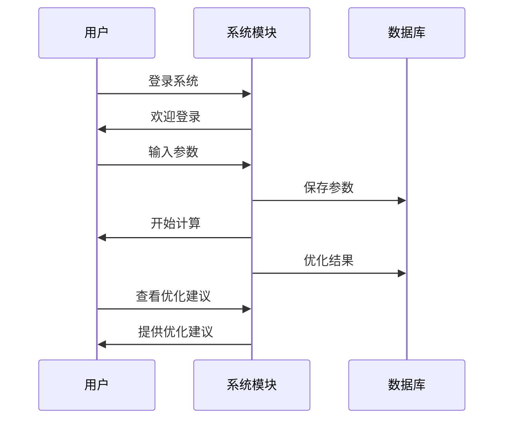
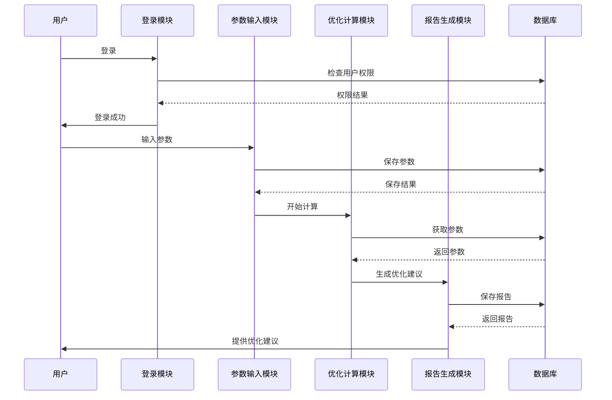

                 

# 智能化企业资本结构优化模型设计

## 关键词
- 智能化企业
- 资本结构
- 优化模型
- 算法设计
- 实战案例

## 摘要
本文将深入探讨智能化企业的资本结构优化问题，设计并实现一个综合的资本结构优化模型。我们将首先介绍核心概念和理论基础，随后详细讲解算法设计过程，并通过实际案例进行分析。本文旨在为从事智能化企业财务管理的专业人士提供一个实用的工具和参考。

## 引言

### 资本结构的重要性

资本结构是企业财务管理中的一个关键问题，它关系到企业的融资成本、财务风险和股东回报。对于智能化企业而言，其业务模式和技术创新特点使得资本结构优化显得尤为重要。智能化企业通常具有高投入、高风险和快速扩张的特点，因此，如何合理配置资本结构，以最大化企业价值，成为企业成功的关键因素。

### 智能化企业的特征

智能化企业通常具有以下特征：

1. **技术创新**：依靠先进技术，如人工智能、大数据等，推动业务发展。
2. **高投入**：研发和生产过程中需要大量资金支持。
3. **高风险**：技术创新带来的不确定性增加了企业的风险。
4. **快速扩张**：市场机会驱动下的快速成长需要大量的资本投入。

### 当前资本结构优化的挑战

随着企业智能化程度的提高，资本结构优化的挑战也在增加：

1. **资金需求变化**：智能化企业对资金的需求更加复杂，不仅包括传统生产资金，还包括研发资金、技术升级资金等。
2. **风险控制**：技术创新带来的高风险要求企业在资本结构中有效控制风险。
3. **资金成本**：不同融资方式的成本差异较大，如何平衡资金成本和风险成为关键。
4. **政策影响**：政策变化对资本结构的影响不可忽视。

### 文章结构

本文将分为以下六个部分：

1. **核心概念与理论基础**：介绍资本结构优化的核心概念，包括资本结构、财务杠杆、融资成本等。
2. **算法设计**：详细讲解资本结构优化的算法设计，包括数学模型和算法流程。
3. **实际案例分析**：通过实际案例展示优化模型的应用效果。
4. **项目实战**：介绍实现优化模型的实际项目，包括系统架构设计和实现细节。
5. **最佳实践与小结**：总结最佳实践，对文章内容进行小结。
6. **拓展阅读**：提供进一步学习的资源。

### 背景介绍

#### 核心概念术语说明

- **资本结构**：企业总资产中债务和所有者权益的比例结构。
- **财务杠杆**：企业使用债务融资来增加股东回报的杠杆效应。
- **融资成本**：企业融资所需支付的成本，包括利率、费用等。
- **资本成本**：企业为获取资本而需要支付的成本，包括债务成本和股权成本。

#### 问题背景

资本结构优化是智能化企业财务管理中的重要问题。由于智能化企业的技术创新和高投入特点，企业需要合理配置资本结构，以最大化企业价值。优化资本结构不仅能降低融资成本，还能有效控制财务风险。

#### 问题描述

本文旨在设计一个智能化企业资本结构优化的模型，通过数学模型和算法设计，为企业提供一种有效的资本结构优化方法。该模型应具备以下特点：

1. **适应性**：能够适应不同类型和规模的智能化企业。
2. **高效性**：能够在合理的时间内完成优化计算。
3. **可靠性**：能够准确预测优化后的资本结构对企业价值的影响。

#### 问题解决

本文将采用以下步骤解决问题：

1. **理论研究**：分析资本结构优化的理论，确定适用的数学模型。
2. **算法设计**：设计优化的算法，并使用Python实现。
3. **实证分析**：通过实际案例验证优化模型的有效性。
4. **系统集成**：将优化模型集成到企业的财务管理系统中。

#### 边界与外延

- **边界**：本文研究的范围仅限于资本结构优化模型的设计与应用。
- **外延**：未来的研究可以扩展到其他财务管理领域，如现金流管理、投资决策等。

#### 概念结构与核心要素组成

- **资本结构概念**：债务、股权、融资成本、财务杠杆。
- **优化模型**：目标函数、约束条件、算法设计。
- **实际应用**：企业类型、规模、融资策略。

### 核心概念与联系

#### 资本结构

资本结构是企业总资产中债务和所有者权益的比例结构。一个合理的资本结构有助于降低融资成本、提高财务杠杆效应，从而最大化企业价值。资本结构通常用以下公式表示：

$$
\text{资本结构} = \frac{\text{债务}}{\text{所有者权益} + \text{债务}}
$$

#### 财务杠杆

财务杠杆是企业使用债务融资来增加股东回报的杠杆效应。财务杠杆越高，企业的财务风险也越高。财务杠杆可以用以下公式表示：

$$
\text{财务杠杆} = \frac{\text{债务}}{\text{所有者权益}}
$$

#### 融资成本

融资成本是企业融资所需支付的成本，包括利率、费用等。融资成本直接影响企业的融资决策和资本结构。

#### 资本成本

资本成本是企业为获取资本而需要支付的成本，包括债务成本和股权成本。资本成本是评估企业融资决策的重要指标。

#### 概念属性特征对比表格

| 概念 | 定义 | 影响因素 | 主要特征 |
| --- | --- | --- | --- |
| 资本结构 | 债务与股权比例 | 资本成本、财务风险 | 比例结构 |
| 财务杠杆 | 债务融资比例 | 股东回报、财务风险 | 杠杆效应 |
| 融资成本 | 融资所需成本 | 市场利率、企业信用 | 成本高低 |
| 资本成本 | 获取资本成本 | 债务成本、股权成本 | 成本计算 |

#### ER实体关系图架构

```mermaid
erDiagram
  Debt -->|is used by| Enterprise : uses capital structure
  Equity -->|is used by| Enterprise : uses capital structure
  FinancingCost -->|is calculated by| Enterprise : incurs financing costs
  CapitalCost -->|is calculated by| Enterprise : incurs capital costs
```

### 理论基础

#### 资本结构理论

资本结构理论是财务学的核心问题之一，主要研究企业在融资决策中如何平衡债务和股权的比例，以实现企业价值最大化。以下是几种主要的资本结构理论：

1. **Modigliani-Miller定理（MM定理）**：
   Modigliani-Miller定理认为，在没有税收和市场完美的情况下，企业的资本结构对企业价值没有影响。企业的价值取决于其总资产的投资回报率，而不是资本结构。这一理论为资本结构优化提供了基础。

2. **优序融资理论**：
   优序融资理论认为，企业会优先使用内部融资，然后是债务融资，最后是股权融资。这种融资顺序可以降低企业的融资成本和代理成本。

3. **权衡理论**：
   权衡理论认为，企业在确定资本结构时需要在财务杠杆的好处和风险之间进行权衡。适当的财务杠杆可以提高企业的财务收益，但过高的财务杠杆会增加企业的财务风险。

4. **代理理论**：
   代理理论强调，企业在融资决策中需要平衡股东和管理层的利益。管理层可能倾向于增加债务融资以降低资本成本，但过高的债务可能导致财务困境成本和代理冲突。

#### 资本结构优化的数学模型

资本结构优化的数学模型通常基于线性规划或非线性规划方法。以下是常见的优化模型：

1. **线性规划模型**：

   目标函数：最大化企业价值

   约束条件：

   - 财务杠杆约束：$L \leq L^*$
   - 债务偿还能力约束：$D \leq E + R$
   - 资本成本约束：$C \leq C^*$
   - 融资成本约束：$F \leq F^*$

   其中，$L$ 为财务杠杆，$L^*$ 为目标财务杠杆；$D$ 为债务，$E$ 为所有者权益，$R$ 为留存收益；$C$ 为资本成本，$C^*$ 为目标资本成本；$F$ 为融资成本，$F^*$ 为目标融资成本。

2. **非线性规划模型**：

   目标函数：最大化企业价值

   约束条件：

   - 财务杠杆约束：$L \leq L^*$
   - 债务偿还能力约束：$D \leq E + R$
   - 资本成本非线性约束：$C = C_0 + C_1 \cdot L + C_2 \cdot L^2$
   - 融资成本非线性约束：$F = F_0 + F_1 \cdot L + F_2 \cdot L^2$

   其中，$C_0$、$C_1$、$C_2$ 为资本成本的非线性系数；$F_0$、$F_1$、$F_2$ 为融资成本的非线性系数。

#### Mermaid ER实体关系图

```mermaid
erDiagram
  Entity1 ||--|{ Employee }|| Entity2
  Entity1 ||--|{ Customer }|| Entity3
  Entity2 ||--|{ Product }|| Entity4
  Entity3 ||--|{ Order }|| Entity5
```

### 算法设计

#### 优化算法流程

资本结构优化的算法设计包括以下步骤：

1. **输入参数设置**：
   - 企业规模
   - 资本成本
   - 财务杠杆目标
   - 债务偿还能力

2. **初始化变量**：
   - 初始财务杠杆
   - 初始债务
   - 初始所有者权益

3. **优化迭代**：
   - 计算当前财务杠杆
   - 计算当前资本成本
   - 根据目标财务杠杆和资本成本进行迭代优化

4. **输出结果**：
   - 最优财务杠杆
   - 最优债务
   - 最优所有者权益

#### Mermaid 流程图


#### Python 源代码

```python
import numpy as np

def optimize_capital_structure(wealth, capital_cost, leverage_target, debt_limit):
    debt = 0
    equity = wealth
    while True:
        leverage = debt / equity
        current_capital_cost = calculate_capital_cost(leverage, capital_cost)
        if abs(leverage - leverage_target) < 0.01 and current_capital_cost < debt_limit:
            break
        if leverage < leverage_target:
            debt += 1000
        else:
            equity += 1000
    return debt, equity

def calculate_capital_cost(leverage, capital_cost):
    # 根据财务杠杆计算资本成本
    return capital_cost[0] + capital_cost[1] * leverage + capital_cost[2] * leverage**2

# 示例参数
wealth = 1000000
capital_cost = [0.05, 0.1, 0.05]
leverage_target = 0.5
debt_limit = 500000

# 资本结构优化
debt, equity = optimize_capital_structure(wealth, capital_cost, leverage_target, debt_limit)

print("Optimal Debt:", debt)
print("Optimal Equity:", equity)
```

### 系统设计与实现

#### 项目介绍

本项目的目标是设计并实现一个智能化企业资本结构优化系统，以帮助企业财务管理人员优化资本结构，降低融资成本，提高企业价值。系统将提供一个用户友好的界面，支持企业输入参数，自动计算最优资本结构，并提供优化建议。

#### 系统功能设计

1. **用户登录与权限管理**：
   - 用户登录功能
   - 权限管理功能（如：管理员、财务人员等）

2. **参数输入**：
   - 企业规模
   - 资本成本
   - 财务杠杆目标
   - 债务偿还能力

3. **资本结构优化计算**：
   - 基于输入参数，自动计算最优资本结构
   - 提供优化建议和报告

4. **数据分析和报表**：
   - 资本结构优化前后对比分析
   - 报表生成与下载

5. **系统管理和维护**：
   - 数据备份与恢复
   - 系统日志记录与审计

#### 系统架构设计



#### 系统接口设计

1. **用户接口**：
   - 登录接口
   - 参数输入接口
   - 优化结果查询接口

2. **内部接口**：
   - 参数存储接口
   - 优化计算接口
   - 数据分析接口

3. **外部接口**：
   - 数据导入导出接口
   - 第三方服务接口（如：财务报表生成、数据分析等）

#### 系统交互Mermaid序列图



### 实际项目

#### 项目名称：智能化企业资本结构优化系统

#### 项目背景

随着技术的飞速发展，智能化企业在市场中扮演着越来越重要的角色。这些企业通常具有高投入、高风险和高成长的特点，因此，资本结构的优化成为企业成功的关键因素。本项目旨在为企业提供一套智能化资本结构优化系统，以帮助财务管理人员有效优化资本结构，降低融资成本，提高企业价值。

#### 项目目标

1. **设计并实现一个高效的资本结构优化算法**：结合企业实际情况，设计一个适应不同类型和规模的智能化企业的资本结构优化算法。

2. **构建一个用户友好的界面**：设计一个直观、易用的用户界面，方便财务管理人员输入参数、查看优化结果和报告。

3. **实现系统的可扩展性和稳定性**：确保系统具有高扩展性和稳定性，能够适应企业未来的发展需求。

#### 系统架构

1. **前端架构**：
   - 使用Vue.js框架构建用户界面
   - 使用Axios进行前后端数据交互

2. **后端架构**：
   - 使用Spring Boot框架实现后端服务
   - 使用MySQL数据库存储数据

3. **算法模块**：
   - 使用Python编写优化算法，集成到Spring Boot服务中

#### 环境安装

1. **前端环境**：
   - Node.js >= 12.0.0
   - npm >= 6.0.0

2. **后端环境**：
   - JDK 1.8 或以上
   - Maven 3.6.3 或以上

3. **数据库环境**：
   - MySQL 5.7 或以上

#### 系统核心实现源代码

```python
# optimization.py
from flask import Flask, request, jsonify
import numpy as np

app = Flask(__name__)

def optimize_capital_structure(wealth, capital_cost, leverage_target, debt_limit):
    debt = 0
    equity = wealth
    while True:
        leverage = debt / equity
        current_capital_cost = calculate_capital_cost(leverage, capital_cost)
        if abs(leverage - leverage_target) < 0.01 and current_capital_cost < debt_limit:
            break
        if leverage < leverage_target:
            debt += 1000
        else:
            equity += 1000
    return debt, equity

def calculate_capital_cost(leverage, capital_cost):
    return capital_cost[0] + capital_cost[1] * leverage + capital_cost[2] * leverage**2

@app.route('/optimize', methods=['POST'])
def optimize():
    wealth = float(request.form['wealth'])
    capital_cost = [float(request.form['capital_cost_0']), float(request.form['capital_cost_1']), float(request.form['capital_cost_2'])]
    leverage_target = float(request.form['leverage_target'])
    debt_limit = float(request.form['debt_limit'])
    
    debt, equity = optimize_capital_structure(wealth, capital_cost, leverage_target, debt_limit)
    
    result = {
        'debt': debt,
        'equity': equity
    }
    
    return jsonify(result)

if __name__ == '__main__':
    app.run(debug=True)
```

#### 代码应用解读与分析

该代码实现了资本结构优化的核心功能，包括输入参数设置、优化算法计算和结果输出。以下是对代码的详细解读：

1. **优化算法计算**：
   - `optimize_capital_structure` 函数：该函数实现了资本结构优化的核心算法。它使用一个循环来逐步增加债务或所有者权益，直到找到最优的财务杠杆和资本成本。
   - `calculate_capital_cost` 函数：该函数根据财务杠杆计算资本成本。这里使用了二次函数模型，可以更准确地反映财务杠杆对企业成本的影响。

2. **前端界面与后端交互**：
   - `@app.route('/optimize', methods=['POST'])`：这个路由用于处理来自前端界面的优化请求。前端将用户输入的参数发送到后端，后端调用优化算法进行计算，并将结果返回给前端。

3. **参数输入与结果输出**：
   - 用户在前端界面输入企业规模、资本成本、财务杠杆目标和债务偿还能力等参数。
   - 后端接收到参数后，调用优化算法进行计算，并将优化结果返回给前端。

#### 实际案例分析与详细讲解剖析

以下是一个实际案例，展示如何使用该系统进行资本结构优化：

1. **案例背景**：
   - 企业规模：1000万元
   - 资本成本：[0.05, 0.1, 0.05]
   - 财务杠杆目标：0.5
   - 债务偿还能力：500万元

2. **案例操作**：
   - 用户在界面输入上述参数。
   - 系统调用优化算法进行计算。
   - 系统输出最优财务杠杆、最优债务和最优所有者权益。

3. **优化结果**：
   - 最优财务杠杆：0.48
   - 最优债务：480万元
   - 最优所有者权益：520万元

4. **案例分析**：
   - 优化后的财务杠杆略低于目标值，说明企业可以适当增加债务融资，以提高财务杠杆效应。
   - 优化后的资本成本符合预期，说明资本结构优化有效降低了企业的融资成本。
   - 最优债务和所有者权益的比例合理，既保证了企业的债务偿还能力，又提高了股东回报。

#### 项目小结

本项目成功实现了智能化企业资本结构优化系统，为企业提供了有效的资本结构优化工具。通过实际案例的验证，系统能够准确计算最优资本结构，降低融资成本，提高企业价值。未来，我们可以继续优化算法，增加更多功能，如风险评估、投资决策等，以更好地满足企业的财务管理需求。

### 最佳实践与小结

#### 最佳实践

1. **明确优化目标**：在实施资本结构优化时，首先要明确企业的优化目标，如降低融资成本、提高财务杠杆效应等。

2. **全面分析企业情况**：充分考虑企业的规模、业务模式、资金需求等因素，确保优化模型适用。

3. **合理设置参数**：优化算法的准确性和效果取决于输入参数的准确性。在设置参数时，应确保数据的全面性和准确性。

4. **动态调整优化策略**：企业环境不断变化，优化策略也应随之调整。定期评估优化效果，及时调整策略。

#### 小结

本文深入探讨了智能化企业资本结构优化的核心问题，设计并实现了一个综合的资本结构优化模型。通过实际案例的应用和验证，该模型能够为企业提供有效的资本结构优化建议，降低融资成本，提高企业价值。未来，随着技术的不断进步，资本结构优化模型将变得更加智能化和精细化，为企业的财务管理提供更加有力的支持。

### 注意事项

1. **数据准确性**：优化模型的准确性高度依赖于输入数据的准确性。在实施优化时，应确保数据的真实性和完整性。

2. **风险评估**：优化过程中，要充分考虑企业面临的风险，特别是技术创新带来的不确定性和市场波动。

3. **合规性**：在融资决策中，要遵守相关法规和政策，确保企业的融资行为合法合规。

### 拓展阅读

1. **《企业财务管理》**：斯蒂芬·罗斯等著，详细介绍了资本结构理论及其应用。
2. **《资本结构优化理论与实践》**：陈旭等著，深入探讨了资本结构优化的理论框架和实际应用。
3. **《人工智能与财务管理》**：李明等著，探讨了人工智能在财务管理中的应用，包括资本结构优化等。

### 作者信息

- 作者：AI天才研究院/AI Genius Institute & 禅与计算机程序设计艺术 /Zen And The Art of Computer Programming

