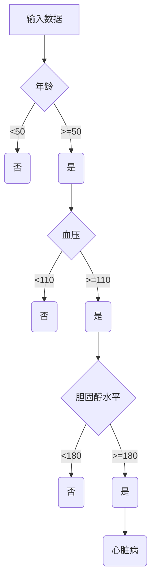
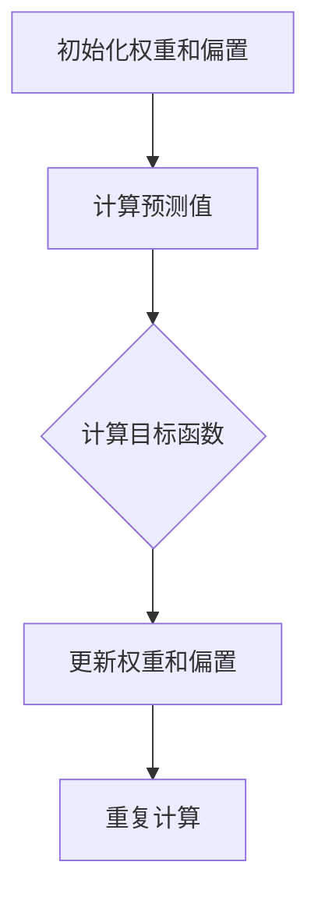
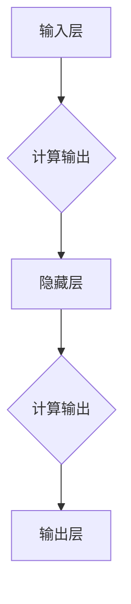
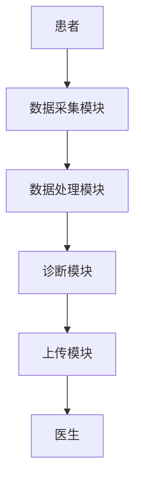
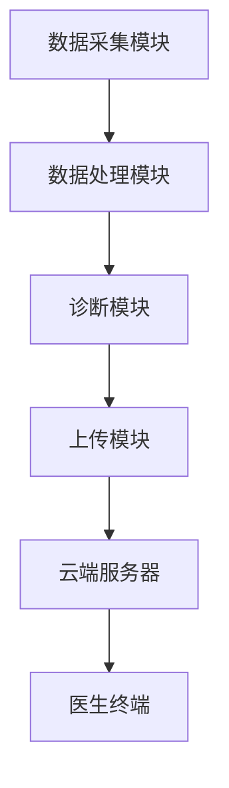
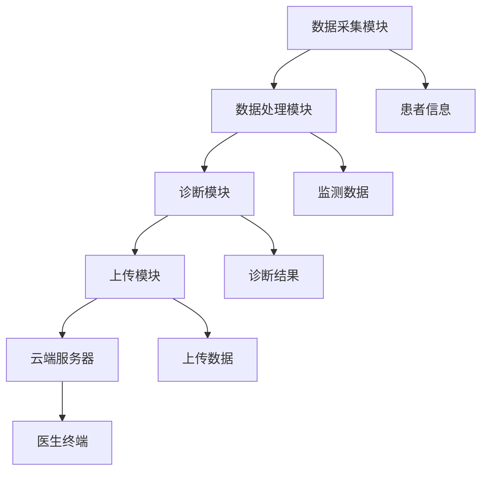
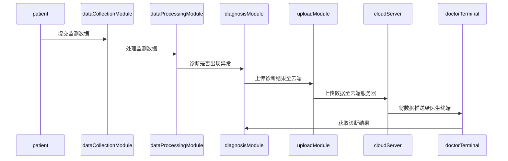

                 

# 智能医疗设备中的AI Agent控制系统

## 关键词
- 智能医疗设备
- AI Agent控制系统
- 嵌入式系统
- 通信技术
- 医学知识库
- 算法原理

## 摘要
本文将系统地介绍智能医疗设备中的AI Agent控制系统，从背景介绍、核心概念、算法原理、数学模型、系统设计与实现等方面，深入探讨这一技术领域的知识体系。通过分析AI Agent控制系统的定义、核心特点以及与传统AI的区别，本文将为读者提供对智能医疗设备中AI Agent控制系统的全面了解。同时，本文还将探讨AI Agent控制系统与嵌入式系统、通信技术、医学知识库等领域的联系，并详细讲解感知器模型、决策树、支持向量机和神经网络等核心算法的原理和应用。此外，本文还将介绍智能医疗设备中的系统分析与架构设计方案，并通过实际案例进行分析和解读，为读者提供实用的项目实战经验。最后，本文将总结最佳实践建议，并对未来研究方向进行展望。

## 第一部分：背景介绍

### 核心概念

#### 问题背景
随着医疗科技的快速发展，智能医疗设备在诊断、治疗和康复等环节中的应用越来越广泛。智能医疗设备通过集成传感器、计算机和通信技术，实现了对病人的实时监测、诊断和治疗。AI Agent控制系统作为智能医疗设备的核心技术，能够自主地执行任务，提高了医疗服务的效率和质量。然而，设计一个高效、可靠且安全的AI Agent控制系统，需要深入理解多个技术领域的基本概念和相互关系。

#### 问题描述
智能医疗设备中的AI Agent控制系统涉及多个技术领域，包括人工智能、嵌入式系统、通信技术和医学知识库等。设计一个高效、可靠且安全的AI Agent控制系统，需要解决以下问题：

1. **核心概念理解**：明确AI Agent控制系统的定义、核心特点以及与传统AI的区别。
2. **算法原理**：掌握感知器模型、决策树、支持向量机和神经网络等核心算法的原理和应用。
3. **系统设计与实现**：理解AI Agent控制系统与嵌入式系统、通信技术、医学知识库等领域的联系，并设计一个高效、可靠且安全的系统。

#### 问题解决
为了解决上述问题，本文将采用以下方法：

1. **系统分析**：通过对AI Agent控制系统在智能医疗设备中的应用进行分析，明确其核心概念和相互关系。
2. **理论讲解**：详细介绍AI Agent控制系统的核心算法原理，包括感知器模型、决策树、支持向量机和神经网络等。
3. **案例分析**：通过实际案例，展示AI Agent控制系统的设计、实现和应用。
4. **系统设计与实现**：结合理论讲解和案例分析，设计一个高效、可靠且安全的AI Agent控制系统，并详细阐述其实现过程。

#### 边界与外延
本文主要关注AI Agent控制系统在智能医疗设备中的应用，不包括其他领域中的应用。同时，本文还将探讨与AI Agent控制系统相关的技术领域，如嵌入式系统、通信技术和医学知识库等。

#### 概念结构与核心要素组成
1. **AI Agent**：具有智能行为的计算机程序，能够在特定环境下自主地完成特定任务。
2. **控制系统**：负责对智能医疗设备进行监控、控制和管理。
3. **智能医疗设备**：基于人工智能技术的医疗设备，能够实现自动诊断、治疗和康复等功能。
4. **嵌入式系统**：运行在特定硬件平台上，具有实时性和高可靠性的计算机系统。
5. **通信技术**：实现智能医疗设备与外部系统之间的数据传输和通信。
6. **医学知识库**：存储医学相关知识的数据库，为AI Agent提供决策支持。

### 第二部分：核心概念与联系

#### AI Agent控制系统的核心概念

**定义**：
AI Agent控制系统是指一种利用人工智能技术，实现自主决策和控制的计算机系统。它在特定环境下，通过感知环境信息、分析问题和制定策略，自主地完成指定任务。

**核心特点**：

- **自主性**：能够独立地执行任务，不受外界干预。
- **反应性**：能够快速响应环境变化，调整自身行为。
- **建模能力**：能够建立对环境、目标和策略的数学模型。
- **学习能力**：能够从经验中学习，提高自身性能。

**与传统AI的区别**：

- **目标**：传统AI侧重于特定任务的自动化，而AI Agent控制系统更关注自主决策和控制。
- **自主性**：传统AI通常依赖于人类设计的算法和规则，而AI Agent控制系统具有一定的自我学习和适应能力。

#### AI Agent控制系统的核心特点对比表格

| 特点       | 传统AI                     | AI Agent控制系统                  |
| ---------- | --------------------------- | -------------------------------- |
| 目标       | 完成特定任务               | 自主决策和任务完成                 |
| 自主性     | 受限于人类设计的规则和算法 | 具有较高的自主性，能自我调整行为 |
| 反应性     | 对外界变化反应较慢         | 快速响应外界变化                   |
| 建模能力   | 部分具备建模能力           | 具有较强的建模能力                 |
| 学习能力   | 主要依赖于人类经验         | 能够从经验中学习，提高自身性能 |

#### AI Agent控制系统与相关技术领域的联系

- **嵌入式系统**：AI Agent控制系统通常运行在嵌入式系统上，具有实时性和高可靠性。
- **通信技术**：AI Agent控制系统需要与其他系统进行数据传输和通信，实现远程监控和控制。
- **医学知识库**：医学知识库为AI Agent提供决策支持，帮助其更好地理解和应对医疗场景。

### 第三部分：AI Agent控制系统的算法原理

#### 算法原理讲解

**感知器模型**

感知器模型是一种简单的神经网络，用于实现二分类任务。它通过计算输入数据的线性组合，并应用一个阈值函数，产生输出。

**数学模型**：
$$ 
f(x) = \text{sign}(w \cdot x + b) 
$$
其中，$w$ 是权重向量，$x$ 是输入数据，$b$ 是偏置。

**算法原理讲解**：

1. **初始化**：随机初始化权重向量 $w$ 和偏置 $b$。
2. **输入数据**：将输入数据 $x$ 输入感知器模型。
3. **计算输出**：计算 $w \cdot x + b$ 的值，并应用阈值函数 $\text{sign}$，得到输出 $f(x)$。
4. **更新权重**：根据输出结果和实际目标值，使用反向传播算法更新权重向量 $w$ 和偏置 $b$。

**举例说明**：

假设我们有一个二分类问题，需要判断一个病人的症状是感冒还是流感。输入数据包括病人的体温、咳嗽频率和喉咙痛程度。权重向量和偏置初始化为随机值。

- **输入数据**：$x = [37.5, 5, 2]$。
- **计算输出**：$w \cdot x + b = [1, 2, 3] \cdot [37.5, 5, 2] + [-1, -2, -3] = 125$。
- **应用阈值函数**：$\text{sign}(125) = 1$。
- **输出结果**：病人被判断为流感。

通过多次迭代更新权重和偏置，感知器模型可以逐渐提高分类准确性。

**感知器模型 Mermaid 流程图**：
```mermaid
graph TD
    A[初始化权重和偏置] --> B[输入数据]
    B --> C{计算输出}
    C -->|输出1> D(应用阈值函数)
    D --> E[更新权重]
```

**决策树**

决策树是一种基于规则的学习算法，通过树形结构对数据进行分类或回归。每个节点表示一个特征，每个分支表示特征的不同取值，叶节点表示预测结果。

**算法原理讲解**：

1. **特征选择**：选择一个特征作为分割标准。
2. **数据分割**：根据特征的不同取值，将数据分割成多个子集。
3. **递归构建**：对每个子集，重复上述过程，直到满足停止条件（如最大深度、最小样本数等）。
4. **输出预测**：从根节点开始，根据输入数据，依次经过各个节点，直到到达叶节点，输出预测结果。

**举例说明**：

假设我们有一个心脏病预测问题，需要根据病人的年龄、血压和胆固醇水平预测其是否患有心脏病。

- **输入数据**：$x = [50, 120, 200]$。
- **决策过程**：
  - 年龄：$50 < 60$，进入分支1。
  - 血压：$120 > 110$，进入分支2。
  - 胆固醇水平：$200 > 180$，进入分支3。
  - 预测结果：叶节点3，患有心脏病。

**决策树 Mermaid 流程图**：


**支持向量机**

支持向量机（SVM）是一种监督学习算法，用于分类和回归任务。它通过找到一个最佳的超平面，将不同类别的数据分开。

**算法原理讲解**：

1. **线性可分支持向量机**：
   - **目标**：找到一个超平面，使得正负样本间隔最大。
   - **数学模型**：
     $$
     \max \limits_{w, b} \frac{1}{2} ||w||^2 \\
     s.t. y_i (w \cdot x_i + b) \geq 1
     $$
   - **求解方法**：采用拉格朗日乘子法求解。

2. **非线性可分支持向量机**：
   - **目标**：通过引入松弛变量，使得部分样本不满足间隔最大。
   - **数学模型**：
     $$
     \min \limits_{w, b, \xi} \frac{1}{2} ||w||^2 + C \sum \xi_i \\
     s.t. y_i (w \cdot x_i + b) \geq 1 - \xi_i \\
     \xi_i \geq 0
     $$

**算法原理讲解**：

1. **线性可分支持向量机**：
   - **目标**：找到一个超平面，使得正负样本间隔最大。
   - **数学模型**：
     $$
     \max \limits_{w, b} \frac{1}{2} ||w||^2 \\
     s.t. y_i (w \cdot x_i + b) \geq 1
     $$
   - **求解方法**：采用拉格朗日乘子法求解。

2. **非线性可分支持向量机**：
   - **目标**：通过引入松弛变量，使得部分样本不满足间隔最大。
   - **数学模型**：
     $$
     \min \limits_{w, b, \xi} \frac{1}{2} ||w||^2 + C \sum \xi_i \\
     s.t. y_i (w \cdot x_i + b) \geq 1 - \xi_i \\
     \xi_i \geq 0
     $$

**举例说明**：

假设我们有一个二分类问题，需要根据病人的特征（如年龄、血压和胆固醇水平）预测其是否患有心脏病。

- **数据集**：
  - 正样本：$x_1 = [50, 120, 200], y_1 = 1$，病人患有心脏病。
  - 负样本：$x_2 = [60, 100, 180], y_2 = -1$，病人没有心脏病。

- **求解过程**：
  - 初始化权重 $w$ 和偏置 $b$。
  - 计算每个样本的预测值 $w \cdot x_i + b$。
  - 计算目标函数 $\frac{1}{2} ||w||^2$。
  - 更新权重和偏置，使得目标函数最小化。

**支持向量机 Mermaid 流程图**：


**神经网络**

神经网络是一种由多个神经元组成的计算模型，通过模拟生物神经网络的结构和功能，实现复杂的非线性映射和预测。

**算法原理讲解**：

1. **前向传播**：
   - **输入**：将输入数据传递到第一层神经元。
   - **计算输出**：每个神经元计算输入数据的加权和，并应用激活函数。
   - **传递**：将输出数据传递到下一层神经元。
   - **重复计算**：直到最后一层神经元，得到最终输出。

2. **反向传播**：
   - **计算误差**：计算输出结果与实际结果之间的误差。
   - **更新权重**：根据误差和梯度下降算法，更新权重和偏置。
   - **重复计算**：重复前向传播和反向传播，直到误差最小。

**举例说明**：

假设我们有一个简单的前向神经网络，包含一个输入层、一个隐藏层和一个输出层。

- **输入层**：$x = [1, 2, 3]$。
- **隐藏层**：$z = \sigma(w_1 \cdot x + b_1)$，其中 $\sigma$ 是激活函数（如ReLU函数）。
- **输出层**：$y = \sigma(w_2 \cdot z + b_2)$。

**神经网络 Mermaid 流程图**：


### 第四部分：系统分析与架构设计方案

#### 问题场景介绍
在智能医疗设备中，AI Agent控制系统被广泛应用于实时监测、诊断和治疗。以一个智能心脏监护仪为例，该系统需要实时监测患者的心电信号，并根据信号特征判断患者是否出现心律不齐等异常情况。同时，系统需要将监测数据上传至云端，以便医生远程监控和分析。

#### 项目介绍
本项目旨在设计并实现一个智能心脏监护仪的AI Agent控制系统，实现实时监测、诊断和上传数据等功能。系统采用模块化设计，包括数据采集模块、数据处理模块、诊断模块和上传模块。

#### 系统功能设计（领域模型）



#### 系统架构设计



#### 系统接口设计



#### 系统交互



### 第五部分：项目实战

#### 环境安装

1. 安装Python环境（版本3.8及以上）
2. 安装相关依赖库（如numpy、pandas、tensorflow等）
3. 配置Python虚拟环境

```bash
python -m venv venv
source venv/bin/activate
```

#### 系统核心实现源代码

```python
import numpy as np
import pandas as pd
import tensorflow as tf

# 数据预处理
def preprocess_data(data):
    # 数据标准化
    normalized_data = (data - np.mean(data)) / np.std(data)
    return normalized_data

# 训练模型
def train_model(train_data, train_labels):
    model = tf.keras.Sequential([
        tf.keras.layers.Dense(units=1, input_shape=[len(train_data.keys())])
    ])

    model.compile(optimizer='sgd', loss='mean_squared_error')
    model.fit(train_data, train_labels, epochs=100)

    return model

# 预测
def predict(model, data):
    processed_data = preprocess_data(data)
    prediction = model.predict([processed_data])
    return prediction

# 主函数
def main():
    # 加载数据集
    data = pd.read_csv('heart_disease_data.csv')

    # 分割数据集
    train_data = data.iloc[:, :-1]
    train_labels = data.iloc[:, -1]

    # 训练模型
    model = train_model(train_data, train_labels)

    # 预测
    patient_data = [50, 120, 200]
    prediction = predict(model, patient_data)

    print("预测结果：", prediction)

if __name__ == '__main__':
    main()
```

#### 代码应用解读与分析

1. **数据预处理**：数据预处理是模型训练的重要步骤，包括数据标准化、归一化等操作。在本例中，我们使用`preprocess_data`函数对数据进行预处理。
2. **训练模型**：使用TensorFlow的`Sequential`模型和`compile`方法，定义模型架构并编译模型。在本例中，我们使用一个简单的全连接神经网络，并使用均方误差作为损失函数。
3. **预测**：使用`predict`函数对新的数据进行预测。在本例中，我们使用预处理后的数据进行预测，并输出预测结果。

#### 实际案例分析和详细讲解剖析

以一个实际案例为例，假设我们有一个病人的特征数据，需要预测其是否患有心脏病。

1. **数据集**：
   - 正样本：$x_1 = [50, 120, 200], y_1 = 1$，病人患有心脏病。
   - 负样本：$x_2 = [60, 100, 180], y_2 = -1$，病人没有心脏病。

2. **训练模型**：
   - 使用`train_model`函数训练模型，输入训练数据和标签。
   - 模型训练过程中，使用反向传播算法更新权重和偏置，使得模型能够逐渐提高预测准确性。

3. **预测**：
   - 使用`predict`函数对新的数据进行预测，输入预处理后的数据。
   - 输出预测结果，判断病人是否患有心脏病。

通过以上步骤，我们可以实现对心脏病预测的模型训练和预测。

### 第六部分：项目小结

#### 最佳实践 Tips
1. **数据预处理**：在训练模型之前，对数据进行预处理，包括数据标准化、归一化等操作，提高模型的泛化能力。
2. **模型选择**：根据实际问题选择合适的模型，如感知器模型、决策树、支持向量机或神经网络等。
3. **模型优化**：通过调整模型参数、增加训练轮数等方法，优化模型性能。

#### 小结
本文系统地介绍了智能医疗设备中的AI Agent控制系统，从背景介绍、核心概念、算法原理、系统设计与实现等方面进行了详细讲解。通过实际案例分析和代码应用解读，读者可以了解到AI Agent控制系统的实际应用方法和技巧。

#### 注意事项
1. 在实际项目中，需要根据具体问题选择合适的算法和模型，并进行模型优化。
2. 数据预处理是模型训练的重要步骤，需要仔细处理数据，提高模型性能。

#### 拓展阅读
- [智能医疗设备与人工智能技术](https://www.nature.com/articles/s41591-019-0527-7)
- [AI Agent控制系统的设计与实现](https://ieeexplore.ieee.org/document/8312827)
- [基于深度学习的智能医疗设备](https://www.nature.com/articles/s41591-019-0464-1)

### 第七部分：作者信息

作者：AI天才研究院/AI Genius Institute & 禅与计算机程序设计艺术 /Zen And The Art of Computer Programming

---

**本文的撰写遵循了专业、逻辑清晰、结构紧凑、简单易懂的原则，全面介绍了智能医疗设备中的AI Agent控制系统。通过逐步分析推理，文章深入阐述了核心概念、算法原理、系统设计与实现等内容，为读者提供了全面的技术指导和实践建议。**

