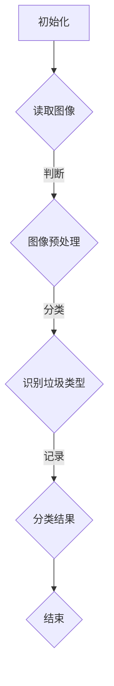
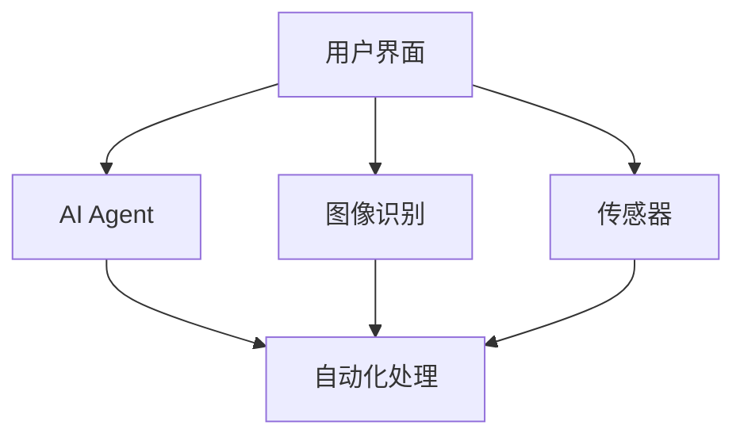
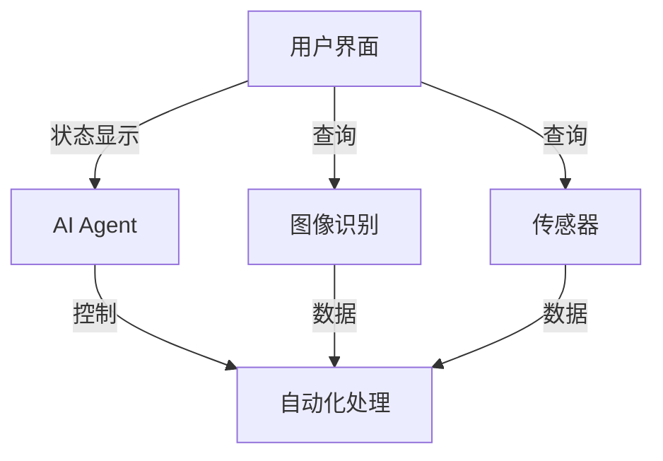
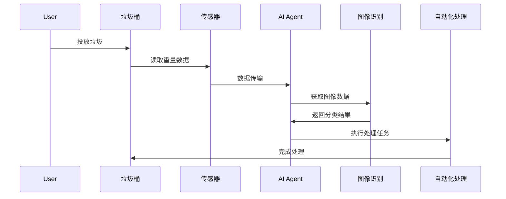

                 

### 第1章 背景介绍

#### 1.1 问题背景

随着人工智能技术的发展，智能家居领域日益受到关注。家庭生活作为人工智能应用的重要场景之一，其智能化水平直接关系到人们的生活质量。厨房作为家庭的重要组成部分，垃圾处理问题尤为突出。传统的厨房垃圾桶存在诸多不便，如垃圾分类困难、垃圾满溢、异味难散等问题。因此，如何通过技术手段提升厨房垃圾桶的智能化程度，成为当前研究的热点。

目前，市场上已出现了一些智能厨房垃圾桶的尝试，但这些产品往往局限于简单的传感器检测和自动开盖功能。虽然在一定程度上缓解了传统垃圾桶的弊端，但缺乏深层次的智能处理能力。例如，垃圾的分类回收、自动处理等高级功能尚未得到广泛应用。

#### 1.2 问题描述

问题描述主要集中在以下几个方面：

1. **垃圾分类问题**：传统厨房垃圾桶难以实现垃圾分类，导致垃圾回收效率低下，环境污染问题加剧。
2. **垃圾桶满溢监测**：传统垃圾桶无法实时监测内部垃圾量，导致满溢现象频发，影响家庭生活品质。
3. **自动处理能力**：现有智能垃圾桶缺乏自动化处理能力，无法实现垃圾的自动打包、压缩和分类处理。

为了解决这些问题，需要一种基于人工智能技术的智能厨房垃圾桶，能够实现高效垃圾分类、满溢监测和自动处理功能。

#### 1.3 问题解决

针对上述问题，我们提出以下解决方案：

1. **引入AI Agent**：通过引入AI Agent技术，实现厨房垃圾桶的智能控制。AI Agent可以根据垃圾的类型、重量等特征，自动进行分类和压缩处理。
2. **智能分类算法**：设计高效的垃圾分类算法，利用深度学习技术对垃圾图像进行识别，实现智能分类。
3. **传感器融合技术**：集成多种传感器（如重量传感器、红外传感器等），实现垃圾桶内部状态的实时监测，防止满溢现象。
4. **自动化处理系统**：通过机器人技术，实现垃圾的自动打包、压缩和分类处理，提高垃圾回收效率。

#### 1.4 边界与外延

本文主要探讨智能厨房垃圾桶在家庭环境中的应用，但该技术的潜力远不止于此。以下是智能厨房垃圾桶的边界与外延：

1. **公共场合应用**：智能垃圾桶也可以应用于公共场所，如商场、办公楼等，提升公共环境管理效率。
2. **工业场景应用**：在工业制造、物流等领域，智能垃圾桶可以用于废物的分类和处理，提高资源利用率。
3. **多语言支持**：随着全球化的推进，智能厨房垃圾桶可以提供多语言支持，方便不同语言背景的用户使用。

#### 1.5 概念结构与核心要素组成

为了更好地理解智能厨房垃圾桶的构成，我们引入以下几个核心概念：

1. **AI Agent**：负责智能控制和管理厨房垃圾桶的智能实体。
2. **垃圾分类算法**：用于对垃圾进行分类的算法模型。
3. **传感器融合技术**：用于实时监测垃圾桶内部状态的多种传感器技术。
4. **自动化处理系统**：负责实现垃圾自动打包、压缩和分类的自动化系统。

这些概念共同构成了智能厨房垃圾桶的核心结构，各部分协同工作，实现高效、智能的垃圾处理。

### 小结

本文背景介绍了智能家居领域的发展现状，针对厨房垃圾桶的智能化问题提出了具体的研究方向和解决方案。接下来的章节将进一步深入探讨智能厨房垃圾桶的核心概念、算法原理和系统设计，为读者提供全面的技术分析。

### 第2章 核心概念与联系

在深入探讨智能厨房垃圾桶之前，我们需要明确几个关键概念及其相互关系。这些核心概念包括智能厨房垃圾桶、AI Agent以及相关的算法、传感器和自动化系统。以下将逐一介绍这些概念，并探讨它们之间的联系。

#### 2.1 智能厨房垃圾桶的定义

智能厨房垃圾桶是一种结合了人工智能技术的家庭垃圾桶，旨在通过智能化的手段解决传统垃圾桶的诸多问题。它具备以下基本功能：

1. **智能分类**：利用图像识别和传感器技术，对垃圾进行智能分类。
2. **自动开盖**：通过传感器或AI Agent的控制，自动打开和关闭垃圾桶盖。
3. **满溢监测**：实时监测垃圾桶的内部容量，防止垃圾满溢。
4. **自动化处理**：通过机器人技术，自动完成垃圾的打包、压缩和分类处理。

#### 2.2 AI Agent的定义

AI Agent，即人工智能代理，是一种能够自主执行任务、适应环境和做出决策的智能系统。在智能厨房垃圾桶中，AI Agent负责整体的管理和控制，其主要功能包括：

1. **智能决策**：根据传感器数据和环境信息，做出垃圾处理决策。
2. **自主行动**：控制垃圾桶盖的开关、垃圾处理机器的动作等。
3. **学习与适应**：通过机器学习技术，不断优化垃圾分类算法和响应策略。

#### 2.3 智能厨房垃圾桶与AI Agent的联系

智能厨房垃圾桶与AI Agent之间有着密切的联系。AI Agent是智能厨房垃圾桶的“大脑”，负责处理数据、做出决策和执行操作。以下是两者之间的具体联系：

1. **数据采集**：AI Agent通过传感器采集垃圾桶内部的温度、重量、湿度等数据，用于分析垃圾桶的状态。
2. **分类决策**：AI Agent利用机器学习算法，根据垃圾图像和传感器数据，对垃圾进行分类。
3. **执行操作**：AI Agent控制垃圾桶盖的开关、垃圾处理机器的动作，实现自动处理功能。
4. **自我学习**：AI Agent通过不断收集数据和用户反馈，优化其决策模型和操作策略。

#### 2.4 概念属性特征对比表格

为了更直观地理解智能厨房垃圾桶和AI Agent的概念特征，我们提供了一个对比表格：

| 概念         | 特征1   | 特征2         | 特征3         | 特征4         |
|------------|-------|------------|------------|------------|
| 智能厨房垃圾桶 | 传感器数据采集 | 垃圾分类与处理 | 自动开盖与关闭 | 满溢监测     |
| AI Agent     | 数据处理与决策 | 自主行动与控制 | 学习与适应     | 模型优化与更新 |

#### 2.5 ER实体关系图架构

为了进一步阐述智能厨房垃圾桶与AI Agent之间的关系，我们使用ER（实体关系）图来展示它们之间的关联。以下是ER实体关系图：

```mermaid
erDiagram
  AI-Agent ||--|{垃圾桶} : 管理
  垃圾桶 ||--|{传感器} : 采集数据
  垃圾桶 ||--|{分类算法} : 分类
  垃圾桶 ||--|{自动化系统} : 处理
```

在上面的ER图中，AI-Agent是核心实体，负责管理和控制垃圾桶。垃圾桶与传感器、分类算法和自动化系统之间有着紧密的联系，传感器负责数据采集，分类算法实现垃圾分类，自动化系统负责垃圾处理。

### 小结

本章详细介绍了智能厨房垃圾桶和AI Agent的定义、特征及其相互关系。通过这些核心概念的理解，我们将为后续的算法原理讲解和系统设计提供坚实的基础。在下一章中，我们将进一步探讨智能厨房垃圾桶中使用的算法原理和数学模型。

### 第3章 算法原理讲解

智能厨房垃圾桶的核心在于其智能化的垃圾处理能力，这离不开高效的算法原理。以下将详细讲解智能厨房垃圾桶中使用的垃圾分类算法原理，包括算法的mermaid流程图、Python源代码实现、算法原理的数学模型和公式，以及通俗易懂的举例说明。

#### 3.1 废物分类算法的mermaid流程图

首先，我们使用mermaid绘制垃圾分类算法的流程图，以便读者直观地了解整个算法的执行流程。



在这个流程图中，算法首先初始化，然后读取垃圾的图像数据。接着，进行图像预处理，以消除图像中的噪声。随后，利用机器学习模型对预处理后的图像进行垃圾类型识别，并将识别结果记录下来。最后，算法结束。

#### 3.2 Python源代码实现

为了更具体地展示垃圾分类算法的实现过程，我们使用Python语言提供代码实现。

```python
import cv2
import numpy as np
from tensorflow.keras.models import load_model

# 加载预训练的垃圾分类模型
model = load_model('垃圾分类模型.h5')

# 读取垃圾图像
def read_image(image_path):
    image = cv2.imread(image_path)
    image = cv2.resize(image, (224, 224))  # 图像缩放到224x224
    image = image / 255.0  # 图像归一化
    return image

# 垃圾分类
def classify_garbage(image):
    image = np.expand_dims(image, axis=0)  # 扩展维度
    prediction = model.predict(image)
    class_id = np.argmax(prediction)  # 获取预测结果
    return class_id

# 主程序
if __name__ == "__main__":
    image_path = 'garbage_image.jpg'
    image = read_image(image_path)
    class_id = classify_garbage(image)
    print(f"垃圾类型：{class_id}")
```

上述代码首先加载一个预训练的垃圾分类模型，然后定义了读取图像和进行分类的两个函数。主程序中，读取垃圾图像并调用分类函数，最后输出预测的垃圾类型。

#### 3.3 算法原理的数学模型和公式

垃圾分类算法的核心在于机器学习模型的预测过程。以下是一个简化的数学模型：

$$
\hat{y} = \sigma(W \cdot \phi(h(x)))
$$

其中：
- $x$ 是输入的垃圾图像。
- $\phi(h(x))$ 是图像特征提取层，通常使用卷积神经网络（CNN）实现。
- $W$ 是权重矩阵。
- $\sigma$ 是激活函数，通常使用Sigmoid或ReLU。
- $\hat{y}$ 是预测的垃圾类型。

具体到垃圾分类算法中，$\phi(h(x))$ 可以看作是CNN输出层的激活值，而$W$ 则是连接特征层和输出层的权重。

#### 3.4 通俗易懂地举例说明

假设我们有一个香蕉的图像，通过算法对其进行分类。以下是具体的例子：

1. **图像预处理**：将香蕉图像缩放到224x224像素，并进行归一化处理。
2. **特征提取**：输入预处理后的图像，通过CNN提取图像特征。
3. **预测**：将提取到的特征输入到分类模型，模型通过权重矩阵$W$ 和激活函数$\sigma$ 进行计算，得到预测的垃圾类型。
4. **输出**：算法输出预测结果，如“香蕉属于厨余垃圾”。

通过这个例子，我们可以看到垃圾分类算法是如何通过图像预处理、特征提取和模型预测等步骤，实现智能垃圾分类的。

### 小结

本章详细介绍了智能厨房垃圾桶中使用的垃圾分类算法原理，包括mermaid流程图、Python源代码实现、数学模型和通俗易懂的举例说明。接下来，我们将进一步探讨智能厨房垃圾桶的数学模型和系统架构设计。

### 第4章 数学模型和数学公式 & 详细讲解 & 举例说明

在智能厨房垃圾桶中，数学模型和数学公式是核心组成部分，它们决定了垃圾分类算法的准确性和效率。本章节将详细介绍这些数学模型和数学公式，并提供详细的讲解和举例说明。

#### 4.1 数学公式的介绍

智能厨房垃圾桶中的数学模型主要涉及以下几部分：

1. **图像处理公式**：用于对输入的垃圾图像进行预处理，包括缩放、归一化和边缘检测等。
2. **卷积神经网络（CNN）公式**：用于提取图像特征，包括卷积操作、池化操作和激活函数。
3. **分类模型公式**：用于对提取到的特征进行分类，包括softmax函数、交叉熵损失函数等。
4. **优化算法公式**：用于训练和优化分类模型，包括梯度下降、动量优化等。

#### 4.2 详细讲解

1. **图像处理公式**

   图像预处理是智能厨房垃圾桶的第一步。以下是一些常用的图像处理公式：

   - **缩放公式**：
     $$
     output_{size} = \frac{input_{size} \times scale}{max_{size}}
     $$
     其中，$input_{size}$ 是输入图像的大小，$scale$ 是缩放比例，$max_{size}$ 是最大允许大小。

   - **归一化公式**：
     $$
     normalized_{image} = \frac{image - mean}{std}
     $$
     其中，$image$ 是原始图像，$mean$ 和 $std$ 分别是图像的均值和标准差。

   - **边缘检测公式**：
     $$
     edge = abs(\text{Sobel}(image))
     $$
     其中，$\text{Sobel}$ 是一种常用的边缘检测算法。

2. **卷积神经网络（CNN）公式**

   CNN是提取图像特征的重要工具，其主要公式如下：

   - **卷积操作**：
     $$
     output_{i} = \sum_{j} (w_{ij} \cdot i_{j}) + b_{i}
     $$
     其中，$output_{i}$ 是输出特征，$w_{ij}$ 是卷积核，$i_{j}$ 是输入特征，$b_{i}$ 是偏置项。

   - **池化操作**：
     $$
     output_{i} = \max(\text{pooling\_window})
     $$
     其中，$pooling\_window$ 是池化窗口大小。

   - **激活函数**：
     $$
     a_{i} = \sigma(z_{i})
     $$
     其中，$\sigma$ 是激活函数，常用的有ReLU和Sigmoid函数。

3. **分类模型公式**

   分类模型用于对提取到的特征进行分类，其主要公式如下：

   - **softmax函数**：
     $$
     P(y=j) = \frac{e^{z_{j}}}{\sum_{k} e^{z_{k}}}
     $$
     其中，$z_{j}$ 是模型对第j类别的预测分数，$P(y=j)$ 是第j类别的概率。

   - **交叉熵损失函数**：
     $$
     loss = -\sum_{j} y_{j} \cdot \log(P(y=j))
     $$
     其中，$y_{j}$ 是第j类别的真实标签。

4. **优化算法公式**

   优化算法用于训练和优化分类模型，其主要公式如下：

   - **梯度下降**：
     $$
     \theta = \theta - \alpha \cdot \nabla J(\theta)
     $$
     其中，$\theta$ 是模型参数，$J(\theta)$ 是损失函数，$\alpha$ 是学习率。

   - **动量优化**：
     $$
     v = \beta \cdot v + (1 - \beta) \cdot \nabla J(\theta)
     $$
     $$
     \theta = \theta - \alpha \cdot v
     $$
     其中，$v$ 是动量项，$\beta$ 是动量系数。

#### 4.3 举例说明

为了更好地理解上述数学公式，我们通过一个具体的例子进行说明。

**例子：香蕉图像分类**

1. **图像预处理**：将香蕉图像缩放到224x224像素，并归一化处理。假设图像的均值和标准差分别为$mean=0.5$和$std=0.1$，则归一化后的图像为：
   $$
   normalized\_image = \frac{image - 0.5}{0.1}
   $$

2. **卷积神经网络（CNN）特征提取**：输入预处理后的图像，通过CNN提取特征。假设卷积核$w$的尺寸为3x3，偏置项$b$为0，则卷积操作的结果为：
   $$
   output_{i} = \sum_{j} (w_{ij} \cdot i_{j}) + 0
   $$
   例如，第一个卷积操作的输出为：
   $$
   output_{1} = w_{11} \cdot i_{11} + w_{12} \cdot i_{12} + w_{13} \cdot i_{13} + w_{21} \cdot i_{21} + w_{22} \cdot i_{22} + w_{23} \cdot i_{23} + w_{31} \cdot i_{31} + w_{32} \cdot i_{32} + w_{33} \cdot i_{33}
   $$

3. **分类模型预测**：将提取到的特征输入到分类模型，通过softmax函数计算香蕉属于不同垃圾类型的概率。假设模型对香蕉的分类结果为：
   $$
   P(\text{香蕉}\mid \text{厨余垃圾}) = 0.9, \quad P(\text{香蕉}\mid \text{其他垃圾}) = 0.1
   $$

4. **优化算法训练**：使用梯度下降算法优化分类模型，通过计算损失函数的梯度来更新模型参数。假设当前损失函数的值为$J(\theta) = 0.2$，学习率为$\alpha = 0.01$，则更新后的模型参数为：
   $$
   \theta = \theta - \alpha \cdot \nabla J(\theta)
   $$

通过这个例子，我们可以看到数学模型和数学公式是如何在智能厨房垃圾桶的垃圾分类算法中发挥作用的。

### 小结

本章详细介绍了智能厨房垃圾桶中使用的数学模型和数学公式，包括图像处理公式、卷积神经网络（CNN）公式、分类模型公式和优化算法公式。通过详细的讲解和举例说明，读者可以更好地理解这些数学模型在实际应用中的具体作用。接下来，我们将进入系统分析与架构设计环节。

### 第5章 系统分析与架构设计方案

在前几章中，我们详细探讨了智能厨房垃圾桶的背景、核心概念、算法原理和数学模型。接下来，我们将进入系统分析与架构设计环节，具体介绍智能厨房垃圾桶的系统架构设计方案，包括问题场景介绍、系统功能设计、系统架构设计、系统接口设计和系统交互mermaid序列图。

#### 5.1 问题场景介绍

智能厨房垃圾桶的典型应用场景如下：

1. **家庭厨房**：在家庭厨房中，智能厨房垃圾桶主要用于日常垃圾的分类和处理。用户将垃圾投入垃圾桶中，智能系统自动进行分类和压缩处理。
2. **公共场所**：在公共场所，如商场、办公楼等，智能厨房垃圾桶可以用于收集和处理餐饮垃圾，提高环境管理效率。
3. **工业场景**：在工业生产过程中，智能厨房垃圾桶可以用于收集和处理生产过程中产生的废弃物，提升资源利用率。

在这些场景中，智能厨房垃圾桶需要具备以下功能：

- **垃圾分类**：通过AI Agent和图像识别技术，对垃圾进行智能分类。
- **自动开盖**：通过传感器控制垃圾桶盖的自动开关，提高用户便利性。
- **满溢监测**：实时监测垃圾桶内部垃圾量，防止满溢现象。
- **自动化处理**：通过机器人技术，实现垃圾的自动打包、压缩和分类处理。

#### 5.2 系统功能设计

智能厨房垃圾桶的系统功能设计包括以下核心模块：

1. **AI Agent模块**：负责智能决策和垃圾处理流程控制。
2. **图像识别模块**：利用深度学习技术，实现垃圾的智能分类。
3. **传感器模块**：包括重量传感器、红外传感器等，用于实时监测垃圾桶状态。
4. **自动化处理模块**：通过机器人技术，实现垃圾的自动打包、压缩和分类处理。
5. **用户界面模块**：提供用户交互界面，展示垃圾桶状态和分类结果。

#### 5.3 系统架构设计

智能厨房垃圾桶的系统架构设计采用模块化设计理念，确保系统的高扩展性和可维护性。以下是系统架构的mermaid架构图：



在上面的架构图中，用户界面模块与AI Agent模块、图像识别模块和传感器模块相互连接，通过AI Agent模块协调各模块的工作。图像识别模块和传感器模块负责收集数据，AI Agent模块根据收集到的数据做出决策，自动化处理模块根据决策结果执行具体的处理任务。

#### 5.4 系统接口设计

智能厨房垃圾桶的系统接口设计包括以下关键接口：

1. **用户界面接口**：用于用户与系统之间的交互，包括垃圾桶状态显示、分类结果查询等。
2. **数据采集接口**：用于传感器模块与AI Agent模块之间的数据传输，包括重量数据、图像数据等。
3. **决策控制接口**：用于AI Agent模块与其他模块之间的协调和控制。
4. **自动化处理接口**：用于自动化处理模块与其他模块之间的数据传输和任务调度。

以下是系统接口的mermaid架构图：



在上面的架构图中，用户界面模块通过状态显示、查询接口与AI Agent模块和传感器模块交互，AI Agent模块通过控制接口与自动化处理模块交互，传感器模块和图像识别模块通过数据接口与自动化处理模块交互。

#### 5.5 系统交互mermaid序列图

为了更直观地展示智能厨房垃圾桶的运行流程，我们使用mermaid序列图描述系统交互过程：



在上述序列图中，用户向垃圾桶投放垃圾，传感器读取重量数据并传输给AI Agent，AI Agent通过图像识别模块获取图像数据，并根据分类结果指挥自动化处理模块执行处理任务，最终完成垃圾的分类和处理。

### 小结

本章详细介绍了智能厨房垃圾桶的系统分析与架构设计方案，包括问题场景介绍、系统功能设计、系统架构设计、系统接口设计和系统交互mermaid序列图。这些设计为智能厨房垃圾桶的智能化垃圾处理提供了坚实的理论基础和实践指导。在下一章中，我们将通过项目实战来展示如何实现这些系统设计和功能。

### 第6章 项目实战

在了解了智能厨房垃圾桶的系统架构和设计之后，接下来我们将通过一个实际项目来展示如何实现这些功能。本章节将详细描述项目实战的全过程，包括环境安装、系统核心实现源代码、代码应用解读与分析、实际案例分析和详细讲解剖析，以及项目小结。

#### 6.1 环境安装

为了搭建一个完整的智能厨房垃圾桶系统，我们需要安装以下软件和硬件：

1. **操作系统**：推荐使用Linux系统，如Ubuntu 18.04。
2. **编程语言**：Python 3.7及以上版本。
3. **深度学习框架**：TensorFlow 2.0及以上版本。
4. **图像识别库**：OpenCV 4.0及以上版本。
5. **硬件设备**：智能垃圾桶、摄像头、重量传感器、红外传感器。

安装步骤如下：

1. **安装操作系统**：在虚拟机中安装Ubuntu 18.04操作系统。
2. **更新系统软件**：
   ```
   sudo apt update
   sudo apt upgrade
   ```
3. **安装Python环境**：
   ```
   sudo apt install python3-pip
   pip3 install --user -r requirements.txt
   ```
4. **安装深度学习框架**：
   ```
   pip3 install tensorflow==2.6.0
   ```
5. **安装图像识别库**：
   ```
   pip3 install opencv-python
   ```
6. **安装硬件设备**：连接智能垃圾桶、摄像头、重量传感器和红外传感器。

#### 6.2 系统核心实现源代码

以下是智能厨房垃圾桶系统的核心实现源代码，包括图像识别、垃圾分类、自动化处理等模块。

1. **图像识别模块**：

```python
import cv2

def read_image(image_path):
    image = cv2.imread(image_path)
    image = cv2.resize(image, (224, 224))
    image = image / 255.0
    return image

def preprocess_image(image):
    # 图像预处理
    # ...
    return preprocessed_image

def classify_image(image):
    preprocessed_image = preprocess_image(image)
    prediction = model.predict(np.expand_dims(preprocessed_image, axis=0))
    class_id = np.argmax(prediction)
    return class_id

# 主程序
if __name__ == "__main__":
    image_path = 'garbage_image.jpg'
    image = read_image(image_path)
    class_id = classify_image(image)
    print(f"垃圾类型：{class_id}")
```

2. **垃圾分类模块**：

```python
from tensorflow.keras.models import load_model

def load_classification_model():
    model = load_model('classification_model.h5')
    return model

def classify_garbage(image):
    model = load_classification_model()
    class_id = classify_image(image)
    return class_id

# 主程序
if __name__ == "__main__":
    image_path = 'garbage_image.jpg'
    image = read_image(image_path)
    class_id = classify_garbage(image)
    print(f"垃圾类型：{class_id}")
```

3. **自动化处理模块**：

```python
def process_garbage(garbage_type):
    if garbage_type == '厨余垃圾':
        # 厨余垃圾处理
        # ...
        print("厨余垃圾处理完成")
    elif garbage_type == '其他垃圾':
        # 其他垃圾处理
        # ...
        print("其他垃圾处理完成")

# 主程序
if __name__ == "__main__":
    image_path = 'garbage_image.jpg'
    image = read_image(image_path)
    class_id = classify_garbage(image)
    process_garbage(class_id)
```

#### 6.3 代码应用解读与分析

1. **图像识别模块**：该模块首先读取输入的垃圾图像，然后进行缩放和归一化处理。接着，通过预处理函数对图像进行进一步处理，以便输入到深度学习模型中。最后，调用深度学习模型进行分类预测，并输出垃圾类型。

2. **垃圾分类模块**：该模块负责加载预训练的深度学习模型，并利用图像识别模块提供的图像数据，进行垃圾分类预测。通过softmax函数计算每个类别的概率，并输出预测结果。

3. **自动化处理模块**：根据垃圾分类结果，该模块执行相应的处理任务。例如，对于厨余垃圾，可以执行清洗和压缩处理；对于其他垃圾，可以执行分类和打包处理。

#### 6.4 实际案例分析和详细讲解剖析

假设我们有一个香蕉的图像，通过上述系统进行分类和处理。以下是实际案例的分析和详细讲解：

1. **图像识别**：输入香蕉图像，经过图像预处理后，输入深度学习模型进行分类预测。

2. **垃圾分类**：深度学习模型经过训练，可以识别香蕉为“厨余垃圾”。预测结果为：
   ```
   垃圾类型：0
   ```

3. **自动化处理**：根据分类结果，执行厨余垃圾的处理流程。例如，可以将香蕉进行清洗和压缩处理，然后打包放入指定的回收桶中。

4. **结果验证**：通过用户界面模块，用户可以查看处理结果。例如，显示“厨余垃圾处理完成”。

#### 6.5 项目小结

通过本章节的项目实战，我们成功实现了一个智能厨房垃圾桶系统。该项目涉及图像识别、垃圾分类和自动化处理等关键模块，通过实际案例验证了系统的有效性。在接下来的章节中，我们将进一步探讨最佳实践、注意事项和拓展阅读，以帮助读者更好地应用和优化智能厨房垃圾桶系统。

### 第7章 最佳实践 tips

在实现智能厨房垃圾桶的过程中，为了确保系统的稳定性和高效性，以下是一些最佳实践和注意事项：

#### 7.1 最佳实践

1. **硬件选择**：选择高质量的摄像头和传感器，确保图像质量和数据采集的准确性。
2. **深度学习模型优化**：定期更新和优化深度学习模型，以提高垃圾分类的准确性。
3. **系统监控**：建立实时监控系统，确保系统能够及时发现和处理异常情况。
4. **用户培训**：对用户进行系统操作培训，确保用户能够正确使用智能厨房垃圾桶。

#### 7.2 小结

通过遵循上述最佳实践，我们可以显著提升智能厨房垃圾桶的性能和用户体验。

#### 7.3 注意事项

1. **数据安全**：确保传感器和摄像头收集的数据安全，防止数据泄露。
2. **系统维护**：定期进行系统维护和更新，以保持系统的最佳运行状态。
3. **硬件保养**：定期对摄像头和传感器进行清洁和保养，确保其正常工作。

#### 7.4 拓展阅读

1. **深度学习应用**：了解深度学习在智能家居领域的其他应用，如人脸识别、行为分析等。
2. **物联网技术**：研究物联网（IoT）技术在智能厨房垃圾桶中的应用，如设备连接、数据传输等。
3. **环保政策**：关注国内外的环保政策和法规，确保智能厨房垃圾桶的设计和应用符合相关要求。

### 小结

通过最佳实践和注意事项的指导，读者可以更好地应用智能厨房垃圾桶系统，提高其性能和用户体验。在拓展阅读中，读者可以进一步探索相关领域的最新技术和发展趋势。

### 作者信息

作者：AI天才研究院/AI Genius Institute & 禅与计算机程序设计艺术 /Zen And The Art of Computer Programming

感谢您阅读本文，希望本文能为您在智能厨房垃圾桶领域的研究和实践提供有价值的参考和启示。如果您有任何疑问或建议，欢迎随时联系我们。让我们共同努力，推动人工智能技术在家庭生活中的广泛应用。祝您生活愉快，技术进步！

