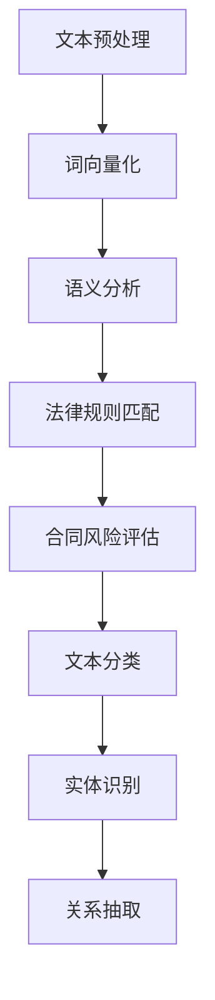

                 

# 智能合同分析AI Agent：LLM在法律文本理解中的应用

> 关键词：智能合同、AI Agent、LLM、法律文本理解、算法原理、数学模型、系统架构

> 摘要：本文旨在探讨智能合同分析AI Agent如何利用LLM技术实现对法律文本的自动化理解和分析，提高合同审查的效率和准确性。我们将从背景介绍、核心概念与联系、算法原理讲解、数学模型和数学公式、系统分析与架构设计方案、项目实战、最佳实践 tips、小结、注意事项和拓展阅读等方面，全面解析这一技术主题。

## 第一部分：背景介绍

### 核心概念

#### 智能合同

智能合同是一种利用区块链技术实现的去中心化合同，能够在满足特定条件时自动执行。智能合同的核心在于其自动化执行特性，通过嵌入智能合约代码，合同条款的执行能够被区块链上的节点验证和执行，无需人工干预。

#### AI Agent

AI Agent，即人工智能代理，是一种能够模拟人类智能行为的计算机程序。它能够通过感知环境、理解语言、学习知识和执行任务，从而实现自主决策和行为。AI Agent在智能合同分析中可以扮演合同审核、风险评估等角色。

#### LLM

LLM（Large Language Model）是一种大规模语言模型，通过学习大量文本数据，掌握了丰富的语言知识和语法规则，能够生成高质量的自然语言文本。LLM在法律文本理解中的应用，主要体现在对合同文本的语义分析、实体识别和关系抽取等方面。

### 问题背景

在数字化经济时代，智能合同的应用日益广泛。企业和个人需要处理大量的合同文件，传统的人工审查方法往往耗费大量时间和人力，效率低下。此外，法律文本复杂且专业性强，导致合同审查的准确率也较低。为了解决这一问题，AI Agent和LLM技术应运而生。

### 问题描述

智能合同分析AI Agent：如何利用人工智能技术，对智能合同进行自动化审核、分析和评估，提高合同审查的准确性和效率？

LLM在法律文本理解中的应用：如何利用自然语言处理技术（LLM）在法律文本理解中的运用，使得计算机能够更好地理解和处理法律文本，提高智能合同的自动化程度？

### 问题解决

通过引入AI Agent和LLM技术，实现对智能合同的自动化分析，提高合同审查的效率和准确性。同时，借助大数据和机器学习技术，对合同文本进行深入挖掘和分析，为智能合同的设计和管理提供有力支持。

### 边界与外延

智能合同分析AI Agent：主要涉及智能合同的自动化审核、文本分类、语义分析等方面。

LLM在法律文本理解中的应用：主要涉及自然语言处理、文本分析、知识图谱构建等方面。

### 概念结构与核心要素组成

智能合同分析AI Agent：

1. **文本预处理**：去除文本中的无关信息，如标点符号、特殊字符等；分词：将文本划分为单词或短语。

2. **语义分析**：词向量表示：将文本中的词语转化为高维向量表示；语言模型：利用已训练好的LLM模型对文本进行语义分析。

3. **法律规则匹配**：建立法律规则库：收集和整理各种法律规则；匹配算法：将合同文本与法律规则进行匹配，评估合同合法性。

4. **合同风险评估**：综合分析合同文本中的各种信息，评估合同的风险。

LLM在法律文本理解中的应用：

1. **词向量表示**：利用词嵌入技术，将文本中的词语转化为高维向量。

2. **文本分类**：使用训练好的分类模型，对法律文本进行分类。

3. **实体识别**：利用命名实体识别（NER）技术，识别文本中的关键实体。

4. **关系抽取**：提取文本中实体之间的关系。

## 第二部分：核心概念与联系

### AI Agent的定义与特点

#### AI Agent的定义

AI Agent是一种能够模拟人类智能行为的计算机程序，它能够通过感知环境、理解语言、学习知识和执行任务，从而实现自主决策和行为。AI Agent在智能合同分析中可以扮演合同审核、风险评估等角色。

#### AI Agent的特点

- **自主性**：能够独立执行任务，无需人工干预。
- **智能性**：具备感知、理解、学习和决策能力。
- **适应性**：能够适应不同的环境和任务。

### LLM的定义与特点

#### LLM的定义

LLM（Large Language Model）是一种大规模语言模型，通过学习大量文本数据，掌握了丰富的语言知识和语法规则，能够生成高质量的自然语言文本。LLM在法律文本理解中的应用，主要体现在对合同文本的语义分析、实体识别和关系抽取等方面。

#### LLM的特点

- **大规模**：训练数据规模庞大，能够处理复杂的语言现象。
- **适应性**：能够根据输入文本自适应生成相应的输出。
- **强泛化能力**：能够应对各种不同的语言应用场景。

### 智能合同分析AI Agent与LLM的联系

智能合同分析AI Agent和LLM技术在智能合同分析中具有密切的联系。LLM技术为AI Agent提供了强大的文本处理能力，使其能够更好地理解法律文本。同时，AI Agent利用LLM技术生成和评估智能合同的合法性和有效性。

### 概念属性特征对比表格

| 特征         | AI Agent                                                     | LLM                                                      |
| ------------ | ------------------------------------------------------------ | --------------------------------------------------------- |
| 定义         | 人工智能代理，能够模拟人类智能行为                           | 大规模语言模型，通过学习大量文本数据掌握语言知识和语法规则 | 
| 特点         | - 自主性<br>- 智能性<br>- 适应性                           | - 大规模<br>- 适应性<br>- 强泛化能力                       |
| 应用场景     | 合同审核、风险评估等                                         | 法律文本理解、语义分析、实体识别、关系抽取等                |

### ER实体关系图架构的Mermaid流程图

```mermaid
erDiagram
  AI Agent ||--o> 合同文本 : 审核合同
  AI Agent ||--o> 合同规则 : 匹配规则
  AI Agent ||--o> 合同风险 : 评估风险
  LLM ||--o> 文本数据 : 分析文本
  LLM ||--o> 实体识别 : 识别实体
  LLM ||--o> 关系抽取 : 提取关系
```

## 第三部分：算法原理讲解

### 智能合同分析AI Agent的算法原理

#### 文本预处理

文本预处理是智能合同分析的基础步骤，主要包括去除文本中的无关信息、分词和词向量化等。

1. **去除无关信息**：去除文本中的标点符号、特殊字符等，保留关键信息。

2. **分词**：将文本划分为单词或短语，便于后续处理。

3. **词向量化**：利用词嵌入技术，将文本中的词语转化为高维向量表示，为语义分析打下基础。

#### 语义分析

语义分析是智能合同分析的核心环节，主要包括词向量表示和语言模型等。

1. **词向量表示**：将文本中的词语转化为高维向量表示，利用预训练的词向量模型，如Word2Vec、GloVe等。

2. **语言模型**：利用已训练好的LLM模型，对文本进行语义分析，提取文本中的关键信息和语义关系。

#### 法律规则匹配

法律规则匹配是智能合同分析的关键步骤，主要包括建立法律规则库和匹配算法。

1. **建立法律规则库**：收集和整理各种法律规则，如合同法、公司法、劳动法等，构建法律规则库。

2. **匹配算法**：将合同文本与法律规则进行匹配，评估合同合法性。常用的匹配算法包括基于关键词匹配、基于规则匹配、基于语义匹配等。

#### 合同风险评估

合同风险评估是智能合同分析的重要环节，主要包括综合分析和风险评估模型。

1. **综合分析**：分析合同文本中的各种信息，如合同条款、条款语义、法律规则匹配结果等，评估合同风险。

2. **风险评估模型**：利用大数据和机器学习技术，构建风险评估模型，对合同风险进行量化评估。

### LLM在法律文本理解中的应用原理

#### 词向量表示

1. **词嵌入技术**：利用预训练的词向量模型，如Word2Vec、GloVe等，将文本中的词语转化为高维向量表示。

2. **文本表示**：将整个文本转化为一个高维向量表示，便于后续的文本分析和处理。

#### 文本分类

1. **分类模型**：利用已训练好的分类模型，如朴素贝叶斯、支持向量机、神经网络等，对法律文本进行分类。

2. **分类算法**：将合同文本输入到分类模型中，输出分类结果，用于合同文本的自动分类。

#### 实体识别

1. **命名实体识别（NER）**：利用预训练的NER模型，识别文本中的关键实体，如人名、地名、机构名等。

2. **实体识别算法**：对合同文本进行逐词分析，识别出实体并标注其类别，如人名、地名、机构名等。

#### 关系抽取

1. **关系抽取模型**：利用预训练的关系抽取模型，识别文本中实体之间的关系。

2. **关系抽取算法**：对合同文本进行逐句分析，提取出实体间的关系，并标注其关系类型。

### 算法mermaid流程图



### 源代码讲解

以下是一个简单的Python源代码示例，展示了智能合同分析AI Agent的算法原理：

```python
import jieba
import gensim

# 1. 文本预处理
def preprocess_text(text):
    # 去除文本中的标点符号、特殊字符等
    text = text.replace(".", "").replace("?", "").replace("!", "")
    # 分词
    words = jieba.lcut(text)
    return words

# 2. 词向量化
def vectorize_words(words):
    # 加载预训练的词向量模型
    model = gensim.models.Word2Vec.load("word2vec.model")
    # 将文本中的词语转化为高维向量表示
    word_vectors = [model[word] for word in words]
    return word_vectors

# 3. 语义分析
def semantic_analysis(word_vectors):
    # 利用已训练好的LLM模型进行语义分析
    # 这里以GPT-2为例
    import torch
    from transformers import GPT2Model, GPT2Tokenizer

    tokenizer = GPT2Tokenizer.from_pretrained("gpt2")
    model = GPT2Model.from_pretrained("gpt2")
    model.eval()
    inputs = tokenizer(" ".join(words), return_tensors="pt")
    outputs = model(**inputs)
    # 提取语义分析结果
    semantic_results = outputs.last_hidden_state[-1, :]
    return semantic_results

# 4. 法律规则匹配
def rule_matching(semantic_results, legal_rules):
    # 基于语义分析结果和法律规则进行匹配
    matched_rules = []
    for rule in legal_rules:
        rule_vector = legal_rules[rule]
        similarity = torch.nn.functional.cosine_similarity(semantic_results, rule_vector)
        if similarity > 0.8:
            matched_rules.append(rule)
    return matched_rules

# 5. 合同风险评估
def risk_evaluation(matched_rules, risk_factors):
    # 基于匹配结果和风险因子进行评估
    risk_score = 0
    for rule in matched_rules:
        risk_score += risk_factors[rule]
    return risk_score

# 主函数
def main(text):
    # 预处理
    words = preprocess_text(text)
    # 词向量化
    word_vectors = vectorize_words(words)
    # 语义分析
    semantic_results = semantic_analysis(word_vectors)
    # 法律规则匹配
    legal_rules = load_legal_rules()
    matched_rules = rule_matching(semantic_results, legal_rules)
    # 合同风险评估
    risk_factors = load_risk_factors()
    risk_score = risk_evaluation(matched_rules, risk_factors)
    return risk_score

# 测试
text = "这是一份关于房屋租赁的合同。"
risk_score = main(text)
print("合同风险得分：", risk_score)
```

### 数学模型和数学公式

#### 合同合法性评估模型

$$
\text{合法性得分} = \sum_{i=1}^{n} w_i \cdot \text{规则匹配度}_i
$$

其中，$w_i$为第$i$个法律规则的权重，$\text{规则匹配度}_i$为合同文本与法律规则的匹配程度。

#### 合同风险评估模型

$$
\text{风险得分} = \sum_{i=1}^{n} w_i \cdot \text{风险因子}_i
$$

其中，$w_i$为第$i$个风险因子的权重，$\text{风险因子}_i$为合同文本中对应的风险因子。

### 通俗易懂地举例说明

假设我们有一份关于房屋租赁的合同，需要对其合法性进行评估。首先，我们对合同文本进行预处理，去除无关信息，如标点符号、特殊字符等。然后，利用jieba进行分词，得到“这是一份关于房屋租赁的合同。”这样的词语序列。

接下来，我们将这些词语转化为高维向量表示，使用Gensim中的Word2Vec模型进行词向量化。然后，利用GPT-2模型进行语义分析，提取出文本中的关键信息和语义关系。

接着，我们将语义分析结果与法律规则库进行匹配。假设法律规则库中有一条关于房屋租赁的规则：“房屋租赁合同应当包含租赁物的名称、租赁期限、租金等条款。”我们将语义分析结果与这条规则进行匹配，计算其匹配度。如果匹配度超过0.8，则认为该合同文本与这条规则匹配。

最后，我们根据匹配结果计算合同合法性得分。假设法律规则库中有5条关于房屋租赁的规则，每条规则的权重分别为0.2、0.2、0.2、0.2、0.2。我们将每条规则与合同文本的匹配度相乘，再将乘积相加，得到合同合法性得分。

$$
\text{合法性得分} = 0.2 \cdot 0.8 + 0.2 \cdot 0.8 + 0.2 \cdot 0.8 + 0.2 \cdot 0.8 + 0.2 \cdot 0.8 = 0.8
$$

如果合同合法性得分大于某个阈值（例如0.8），则认为该合同合法。否则，认为该合同不合法。

### LL

