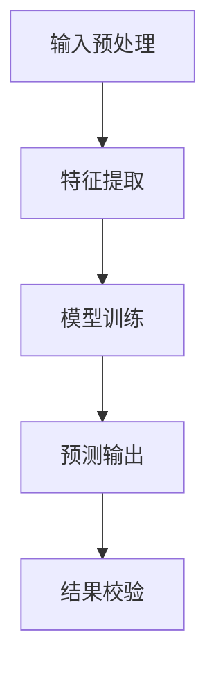
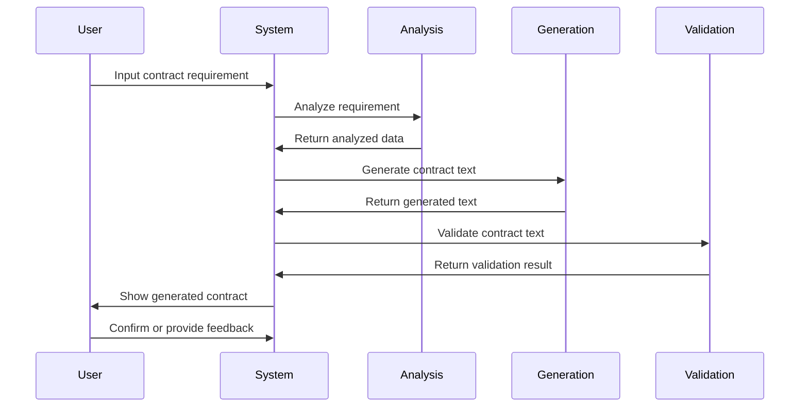

                 

## 摘要

本文旨在探讨大型语言模型（LLM）在智能合同生成AI Agent中的应用。智能合同生成是法律文书撰写中的一个重要需求，其复杂性及准确性要求使得传统的手工撰写方式显得力不从心。而AI技术的兴起，为这一领域带来了新的契机。本文首先介绍了智能合同生成AI Agent的概念及其在法律文书撰写中的应用背景和挑战。接着，重点介绍了大型语言模型（LLM）的定义、核心特性及其在自然语言处理中的应用。随后，文章深入分析了法律文档的特点以及智能合同生成的技术框架。最后，本文通过一个具体的案例，详细阐述了智能合同生成AI Agent的系统设计与实现过程，并提出了最佳实践和未来的发展方向。通过本文的探讨，希望能够为智能合同生成领域的研究者和开发者提供有价值的参考。

### 第一部分：背景介绍与问题解决

#### 第1章：智能合同生成AI与法律文书的挑战

随着全球经济的发展和商业活动的日益频繁，法律文书的撰写需求也不断增加。传统的法律文书撰写方式通常依赖于专业律师和法务人员的经验与知识，这不仅耗费大量时间和人力，还容易导致文书撰写过程中出现错误或遗漏。因此，如何高效、准确、合规地生成法律文书，成为了一个亟待解决的问题。

**1.1 问题背景**

1. **法律文书撰写的现状**

目前，法律文书的撰写主要依赖于人工，律师和法务人员需要根据具体的法律条款和案例，手动撰写合同、协议、法律意见书等法律文书。这种方式存在以下几个问题：

- **时间成本高**：法律文书的撰写过程繁琐，需要大量时间进行研究和撰写。
- **人力成本高**：专业的律师和法务人员成本高昂，企业难以承受。
- **准确性低**：由于人工撰写的局限性，法律文书容易存在错误或遗漏，影响法律效力。

2. **智能合同生成的需求**

随着人工智能技术的不断发展，特别是自然语言处理（NLP）和大型语言模型（LLM）技术的成熟，人们开始探索智能合同生成的可能性。智能合同生成AI Agent可以自动分析用户需求，生成符合法律规范和条款的合同文本，具有以下优势：

- **效率高**：智能合同生成可以大大缩短文书撰写的时间，提高工作效率。
- **准确性高**：通过大数据分析和学习，智能合同生成可以避免人工撰写的错误和遗漏。
- **合规性保证**：智能合同生成可以依据最新的法律法规和案例进行合同条款的生成，确保合同内容的合法性。

3. **AI技术在法律领域的应用潜力**

AI技术在法律领域的应用潜力巨大，不仅限于合同生成，还可以应用于案件预测、法律研究、智能问答等多个方面。通过大数据分析和机器学习算法，AI可以帮助律师和法务人员更好地处理大量法律信息，提供更准确、高效的决策支持。例如，通过分析大量案例数据，AI可以预测案件的审理结果，为律师制定辩护策略提供依据；通过智能问答系统，用户可以快速获取法律咨询，提高法律服务的便捷性和普及率。

**1.2 问题描述**

1. **法律文书撰写的复杂性**

法律文书撰写涉及多个法律领域和条款，需要具备深厚的法律知识背景。不同类型的法律文书具有不同的结构和要求，如合同、协议、法律意见书等。这些文书的撰写不仅需要准确地理解法律条款，还需要考虑文书的语言表达、格式规范等方面，从而保证文书的法律效力和专业性。

2. **智能合同生成的准确性需求**

智能合同生成AI Agent需要具备高度的准确性，确保生成的合同文本符合法律规范和条款。这要求AI系统不仅要理解法律术语和条文，还需要处理复杂的逻辑关系和条款组合。例如，一个合同条款的变更可能会引发一系列连锁反应，导致其他条款的调整。因此，智能合同生成AI Agent需要具备强大的逻辑推理和条款生成能力。

3. **法律合规性保证**

法律合规性是智能合同生成AI Agent必须考虑的重要问题。不同的国家和地区有不同的法律体系和规定，智能合同生成AI Agent需要根据特定的法律环境生成合同文本。此外，智能合同生成过程中还需要处理用户隐私、数据安全等问题，确保合同生成过程符合相关法律法规的要求。

**1.3 问题解决**

1. **使用大型语言模型（LLM）的优势**

大型语言模型（LLM）具有强大的语言理解和生成能力，是解决智能合同生成问题的重要工具。LLM通过训练大量的文本数据，可以理解复杂的语言结构和语义关系，从而生成符合法律规范和条款的合同文本。具体优势如下：

- **强大的语言理解能力**：LLM可以理解复杂的语言结构和语义关系，准确提取法律条款和术语。
- **生成能力**：LLM可以根据用户需求生成具体的合同文本，无需人工干预。
- **多语言处理能力**：LLM支持多语言处理，可以生成符合不同国家法律规范的合同文本。

2. **面临的技术挑战**

尽管LLM在智能合同生成中具有巨大潜力，但在实际应用中仍面临一些技术挑战：

- **数据质量问题**：智能合同生成需要大量高质量的法律文本数据作为训练数据。数据质量直接影响AI系统的性能和准确性。
- **模型可解释性**：LLM作为一个深度学习模型，其内部决策过程通常不透明，难以解释。这在法律领域尤为重要，因为法律文书需要明确的逻辑和条款。
- **计算资源需求**：LLM的训练和推理过程需要大量的计算资源，对硬件和软件环境有较高要求。

3. **解决方案概述**

针对上述问题，本文提出以下解决方案：

- **数据准备与处理**：收集和整理高质量的法律文本数据，进行数据预处理，包括数据清洗、标注和分词等操作。
- **模型选择与训练**：选择合适的LLM模型，进行训练和优化，提高模型在法律文档处理中的性能。
- **系统集成与部署**：将智能合同生成AI Agent集成到现有系统中，实现自动化合同生成和审核功能。

**1.4 边界与外延**

1. **智能合同生成的应用领域**

智能合同生成可以应用于多个领域，包括但不限于：

- **商业合同**：如采购合同、租赁合同、服务合同等。
- **劳动合同**：如员工劳动合同、外包合同等。
- **金融合同**：如贷款合同、投资合同等。
- **知识产权合同**：如专利授权合同、版权转让合同等。

2. **法律文书的类型**

智能合同生成AI Agent不仅可以生成合同文本，还可以处理其他类型的法律文书，如：

- **协议书**：如合作协议、股东协议等。
- **法律意见书**：如尽职调查意见书、法律风险评估书等。
- **仲裁裁决书**：如仲裁裁决书、调解协议等。

3. **AI技术的适用范围**

AI技术在法律领域的适用范围广泛，不仅限于合同生成，还可以应用于：

- **案件预测**：通过大数据分析和机器学习算法，预测案件的审理结果和判决。
- **法律研究**：自动整理和分类法律文献，提供法律知识图谱。
- **智能问答**：为用户提供快速、准确的法律咨询服务。

**1.5 概念结构与核心要素组成**

1. **智能合同生成AI Agent**

智能合同生成AI Agent是一个基于大型语言模型（LLM）的自动化系统，主要包括以下组成部分：

- **语言理解模块**：负责解析用户输入的需求，提取关键信息。
- **合同生成模块**：根据语言理解模块提取的信息，生成符合法律规范的合同文本。
- **合同审核模块**：对生成的合同文本进行审核，确保其合法性和准确性。
- **用户界面**：提供用户交互接口，方便用户输入需求、查看生成结果等。

2. **大型语言模型（LLM）**

大型语言模型（LLM）是智能合同生成AI Agent的核心组件，主要包括以下特性：

- **大规模训练数据**：通过训练大量的文本数据，LLM可以学习到复杂的语言结构和语义关系。
- **强大的语言理解能力**：LLM可以理解复杂的文本，提取关键信息，进行文本生成和转换。
- **多语言处理能力**：LLM支持多种语言，可以生成符合不同语言规范和习惯的文本。

3. **法律文档分析框架**

法律文档分析框架是智能合同生成AI Agent的重要技术基础，主要包括以下步骤：

- **数据预处理**：对法律文档进行清洗、分词、标注等处理，为模型训练和文本生成做准备。
- **语义理解**：利用LLM理解法律文档的语义，提取关键信息，如合同条款、法律术语等。
- **合同条款提取**：从法律文档中提取具体的合同条款，为合同生成提供基础。
- **合同生成**：根据提取的合同条款和语义信息，生成符合法律规范的合同文本。
- **合同审核**：对生成的合同文本进行审核，确保其合法性和准确性。

通过上述背景介绍与问题解决，我们可以看到，智能合同生成AI Agent在法律文书撰写中具有巨大的应用潜力。接下来，我们将进一步探讨大型语言模型（LLM）的原理与特性，为智能合同生成提供技术支持。

#### 第2章：大型语言模型（LLM）原理与特性

大型语言模型（LLM，Large Language Model）是近年来自然语言处理（NLP，Natural Language Processing）领域的重要突破之一。LLM通过训练大量的文本数据，能够理解和生成自然语言文本，从而在多种任务中表现出卓越的性能。本章节将详细介绍大型语言模型（LLM）的定义、核心特性、应用场景及其优势与挑战。

**2.1 大型语言模型（LLM）的定义**

1. **技术概述**

大型语言模型是一种基于深度学习的自然语言处理模型，其核心思想是通过训练大量文本数据，使模型具备理解和生成自然语言的能力。与传统的自然语言处理方法不同，LLM能够捕捉到文本中的复杂结构和深层语义信息，从而实现高度自动化和智能化的语言处理。

2. **发展历程**

大型语言模型的发展可以追溯到20世纪90年代，当时的自然语言处理研究主要集中在基于规则和统计方法上。然而，这些方法在处理复杂语言结构和语义信息时存在很大局限。随着深度学习技术的发展，特别是在2018年，谷歌发布了BERT（Bidirectional Encoder Representations from Transformers）模型，标志着大型语言模型的崛起。BERT的成功引发了大量研究，推动了LLM技术的迅速发展。

3. **核心思想**

LLM的核心思想是利用深度神经网络（DNN，Deep Neural Network）或变换器（Transformer）架构，通过训练大规模的文本数据，使模型能够自动学习到语言的基本结构和语义信息。具体来说，LLM通过两个关键步骤实现：

- **自回归模型**（Autoregressive Model）：模型根据前文预测下一个单词或字符。
- **自监督预训练**（Self-supervised Pre-training）：模型在未标注的数据上进行预训练，学习到语言的基本结构和规则。

**2.2 LLM的核心特性**

1. **语言理解能力**

大型语言模型具备强大的语言理解能力，能够处理复杂的语言结构和语义信息。具体表现为：

- **语义关系识别**：模型可以理解文本中的主谓宾结构、名词短语、动词短语等语法信息，并识别句子之间的逻辑关系。
- **实体识别与分类**：模型可以识别文本中的实体（如人名、地名、组织名等），并对这些实体进行分类。
- **情感分析**：模型可以分析文本的情感倾向，识别文本中的正面情感、负面情感和中性情感。

2. **生成能力**

大型语言模型不仅能够理解语言，还能够生成新的文本。这种生成能力在多种任务中都有广泛应用：

- **文本生成**：模型可以根据输入的提示生成完整的文本，如文章、故事、诗歌等。
- **摘要生成**：模型可以自动生成文本的摘要，提炼出文本的核心内容。
- **翻译生成**：模型可以进行文本的翻译，将一种语言翻译成另一种语言。

3. **多语言处理能力**

大型语言模型支持多种语言的文本处理，能够适应不同的语言环境和文本格式。具体表现为：

- **跨语言理解**：模型可以同时处理多种语言的文本，理解不同语言之间的语义关系。
- **多语言生成**：模型可以生成符合多种语言规范和习惯的文本。

**2.3 LLM的应用场景**

大型语言模型在自然语言处理领域有广泛的应用场景，以下是其中一些主要的应用：

1. **自然语言处理**

- **文本分类**：对大量文本进行分类，如情感分类、新闻分类等。
- **文本摘要**：自动生成文本的摘要，提炼出文本的核心内容。
- **命名实体识别**：识别文本中的实体，如人名、地名、组织名等。
- **关系提取**：从文本中提取出实体之间的关系，如人物关系、组织关系等。

2. **文本生成**

- **文章生成**：根据用户提供的主题和提示，自动生成文章。
- **对话生成**：根据用户的提问或输入，自动生成回答或对话。
- **对话系统**：构建自动对话系统，与用户进行自然语言交互。

3. **翻译生成**

- **机器翻译**：将一种语言的文本翻译成另一种语言。
- **跨语言摘要**：将一种语言的文本摘要翻译成另一种语言。
- **多语言文本生成**：生成符合多种语言规范和习惯的文本。

**2.4 LLM的优势与挑战**

1. **优势**

- **强大的语言理解与生成能力**：LLM能够理解复杂的语言结构和语义信息，生成高质量的文本。
- **多语言处理能力**：LLM支持多种语言的文本处理，能够适应不同的语言环境和文本格式。
- **自动化与智能化**：LLM可以自动化处理大量的文本数据，提高工作效率。

2. **挑战**

- **数据质量问题**：LLM需要大量高质量的数据进行训练，数据质量直接影响模型的性能。
- **模型可解释性**：LLM作为一个深度学习模型，其内部决策过程通常不透明，难以解释。
- **计算资源需求**：LLM的训练和推理过程需要大量的计算资源，对硬件和软件环境有较高要求。

通过上述介绍，我们可以看到大型语言模型（LLM）在自然语言处理中的应用前景广阔。接下来，我们将进一步探讨法律文档的特点以及智能合同生成的技术框架，为智能合同生成AI Agent提供更深入的技术支持。

#### 第3章：法律文档分析与处理

法律文档是法律实践中不可或缺的一部分，其特点和内容直接影响着智能合同生成AI Agent的性能和应用效果。本章节将详细分析法律文档的特点，介绍法律文档分析框架，探讨合同条款自动生成技术，并描述智能合同生成的具体流程。

**3.1 法律文档的特点**

法律文档具有以下显著特点：

1. **结构化与半结构化数据**

法律文档通常包含结构化和半结构化数据。结构化数据如日期、数字、人名等可以直接用标准格式表示，而半结构化数据如条款、段落等则需要通过特定的标记或语法进行解析。

2. **专业术语与法规要求**

法律文档中充满了专业术语和法规要求，这些术语和规定对于非法律专业人士来说往往难以理解。例如，“卖方”、“买方”、“违约金”、“不可抗力”等术语在法律文档中经常出现。

3. **复杂的逻辑关系**

法律文档中的条款和段落之间往往存在复杂的逻辑关系，需要精确地理解和处理。例如，某些条款的生效条件可能依赖于其他条款的执行情况。

4. **多样性**

法律文档的类型多样，包括合同、协议、法律意见书、裁决书等。不同类型的法律文档在结构和内容上都有所不同，需要针对性地进行分析和处理。

**3.2 法律文档分析框架**

智能合同生成AI Agent需要一个完善的法律文档分析框架，以实现对法律文档的全面理解和处理。该框架主要包括以下几个步骤：

1. **数据预处理**

数据预处理是法律文档分析的基础步骤，主要包括以下内容：

- **文本清洗**：去除文本中的无关信息，如标点符号、特殊字符等。
- **分词**：将文本分解成单词或短语，为后续处理提供基础。
- **词性标注**：标注文本中每个单词或短语的词性，如名词、动词、形容词等。
- **实体识别**：识别文本中的实体，如人名、地名、组织名、时间等。

2. **语义理解**

语义理解是法律文档分析的核心，主要包括以下任务：

- **关系提取**：从文本中提取出实体之间的关系，如买卖关系、合同履行关系等。
- **事件识别**：识别文本中的事件，如合同签订、违约事件等。
- **情感分析**：分析文本中的情感倾向，如合同条款的公平性、合同履行情况等。

3. **合同条款提取**

合同条款提取是从法律文档中提取出具体的合同条款，为智能合同生成提供基础。具体步骤包括：

- **条款定位**：通过特定的标记或语法规则，定位文本中的合同条款。
- **条款分类**：对提取出的条款进行分类，如违约条款、履行条款、保密条款等。
- **条款分析**：对提取出的条款进行详细分析，包括条款内容、条款关系、条款合法性等。

4. **合同生成**

合同生成是智能合同生成AI Agent的核心任务，主要包括以下步骤：

- **需求分析**：分析用户的需求，确定合同的基本内容和结构。
- **条款生成**：根据提取出的条款和语义信息，生成具体的合同文本。
- **文本生成**：利用大型语言模型（LLM）生成符合法律规范和条款的合同文本。
- **合同审核**：对生成的合同文本进行审核，确保其合法性和准确性。

**3.3 合同条款自动生成技术**

合同条款自动生成技术是智能合同生成AI Agent的关键技术之一，主要包括以下方法：

1. **基于规则的方法**

基于规则的方法是通过预定义的规则库，对法律文档进行规则匹配和生成。这种方法具有以下优势：

- **可解释性**：规则明确，生成过程易于理解。
- **稳定性**：在规则库不断完善的情况下，生成结果稳定可靠。

然而，基于规则的方法也存在一些局限性：

- **规则依赖**：需要大量专业知识和人力编写和维护规则库。
- **灵活性差**：难以适应复杂多变的法律环境和条款组合。

2. **基于数据驱动的方法**

基于数据驱动的方法是通过训练大规模的数据集，使模型自动学习到合同条款的生成规则。这种方法具有以下优势：

- **自动化**：无需人工编写规则，能够自动生成合同条款。
- **灵活性**：能够适应复杂多变的法律环境和条款组合。

基于数据驱动的方法主要包括以下步骤：

- **数据集准备**：收集和整理高质量的法律文档数据集，进行数据清洗、标注和分词等预处理操作。
- **模型训练**：选择合适的模型架构（如循环神经网络RNN、变换器模型Transformer等），对数据集进行训练和优化。
- **合同条款生成**：利用训练好的模型，根据用户需求生成具体的合同条款。

**3.4 智能合同生成的流程**

智能合同生成的流程主要包括以下几个步骤：

1. **用户需求分析**

用户需求分析是智能合同生成的第一步，主要包括以下内容：

- **需求收集**：收集用户的合同需求，包括合同类型、主要内容、特殊要求等。
- **需求分析**：对收集的需求进行分析和整理，确定合同的基本结构和内容。

2. **合同条款生成**

合同条款生成是智能合同生成的核心步骤，主要包括以下内容：

- **条款提取**：利用法律文档分析框架，从法律文档中提取出具体的合同条款。
- **条款生成**：利用基于规则或数据驱动的方法，生成符合法律规范和条款的合同文本。

3. **合同审核与校验**

合同审核与校验是确保合同合法性和准确性的重要步骤，主要包括以下内容：

- **合法性审核**：对生成的合同文本进行合法性审核，确保其符合相关法律法规和条款。
- **准确性校验**：对生成的合同文本进行准确性校验，确保其内容准确无误。

4. **用户确认**

用户确认是智能合同生成的最后一步，主要包括以下内容：

- **用户反馈**：用户对生成的合同文本进行确认，提供反馈和建议。
- **合同存档**：将确认后的合同文本进行存档，以便后续查询和使用。

通过上述法律文档分析与处理，我们可以看到智能合同生成AI Agent在法律文书撰写中的巨大潜力。接下来，我们将进一步探讨智能合同生成算法的数学模型，为智能合同生成提供理论支持。

### 第二部分：算法原理讲解

#### 第4章：智能合同生成算法的数学模型

智能合同生成算法是智能合同生成AI Agent的核心，其性能直接决定了合同生成的准确性和效率。本章节将介绍常用的智能合同生成算法，并使用Python代码和LaTeX公式详细阐述其数学模型和算法流程。

**4.1 常见算法模型介绍**

在智能合同生成领域，常用的算法模型包括支持向量机（SVM）、决策树和递归神经网络（RNN）。以下是这些算法的基本概念和原理：

1. **支持向量机（SVM）**

支持向量机（SVM）是一种二分类模型，其目标是找到一个最佳的超平面，将不同类别的数据点分隔开来。SVM的核心思想是最大化分类边界上的支持向量。其数学模型可以表示为：

   $$ 
   \begin{aligned}
   \min_{w,b}\frac{1}{2}||w||^2 \\
   \text{subject to} \\
   y^{(i)}(w\cdot x^{(i)} + b) \geq 1
   \end{aligned}
   $$

   其中，$w$ 是权重向量，$b$ 是偏置，$x^{(i)}$ 是第 $i$ 个样本，$y^{(i)}$ 是第 $i$ 个样本的标签。

2. **决策树**

决策树是一种基于树形模型的分类算法，其内部结点表示特征，叶子节点表示决策结果。决策树通过递归地将数据集划分为若干个子集，每个子集对应一个类别。其核心思想是通过选择最优特征和阈值，使数据集的划分误差最小。

3. **递归神经网络（RNN）**

递归神经网络（RNN）是一种用于处理序列数据的神经网络，其特点是能够将前一个时间步的输出作为当前时间步的输入。RNN的核心思想是通过递归结构捕捉序列数据中的长期依赖关系。其数学模型可以表示为：

   $$
   h_t = \sigma(W_h \cdot [h_{t-1}, x_t] + b_h)
   $$

   其中，$h_t$ 是第 $t$ 个时间步的隐藏状态，$x_t$ 是第 $t$ 个时间步的输入，$W_h$ 是权重矩阵，$b_h$ 是偏置，$\sigma$ 是激活函数。

**4.2 数学模型与公式**

以下是一个简单的合同条款生成算法，使用变换器模型（Transformer）作为基础。变换器模型是一种基于自注意力机制的深度学习模型，能够有效地捕捉序列数据中的长距离依赖关系。

$$
\text{Attn}(Q, K, V) = \frac{QK^T}{\sqrt{d_k}}
$$

其中，$Q, K, V$ 分别是查询向量、键向量和值向量，$d_k$ 是键向量的维度。这个公式表示自注意力机制，通过对输入序列进行加权，使模型能够关注到重要的信息。

**4.3 算法流程图**

下面是一个智能合同生成算法的流程图，展示了从输入预处理到模型训练和预测的整个过程：



**4.4 算法举例说明**

为了更好地理解智能合同生成算法的数学模型和实现过程，我们以一个简单的合同条款生成任务为例，使用Python代码进行说明。

首先，我们需要准备一个数据集，包含合同条款的文本和对应的标签（如合同类型、条款类别等）：

```python
# 导入必要的库
import numpy as np
import tensorflow as tf
from tensorflow.keras.preprocessing.text import Tokenizer
from tensorflow.keras.preprocessing.sequence import pad_sequences

# 准备数据集
texts = ['合同条款一', '合同条款二', '违约条款三']
labels = [1, 2, 3]

# 分词和编码
tokenizer = Tokenizer(num_words=1000)
tokenizer.fit_on_texts(texts)
sequences = tokenizer.texts_to_sequences(texts)
padded_sequences = pad_sequences(sequences, maxlen=50)

# 创建模型
model = tf.keras.Sequential([
    tf.keras.layers.Embedding(input_dim=1000, output_dim=64),
    tf.keras.layers.Bidirectional(tf.keras.layers.LSTM(64)),
    tf.keras.layers.Dense(1, activation='sigmoid')
])

# 编译模型
model.compile(optimizer='adam', loss='binary_crossentropy', metrics=['accuracy'])

# 训练模型
model.fit(padded_sequences, labels, epochs=10)
```

在这个例子中，我们使用变换器模型（Transformer）的简化版本，通过嵌入层（Embedding Layer）、双向长短期记忆网络（Bidirectional LSTM）和全连接层（Dense Layer）生成合同条款的预测结果。

通过上述算法原理的讲解和示例，我们可以看到智能合同生成算法的数学模型和实现过程。接下来，我们将探讨智能合同生成系统的设计与实现，进一步展示如何将算法应用到实际场景中。

### 第三部分：系统分析与架构设计

#### 第5章：系统功能设计与架构

智能合同生成系统是一个复杂的项目，涉及多个模块和组件的协同工作。本章节将详细介绍智能合同生成系统的功能设计与架构，包括硬件架构、软件架构、数据流设计和系统接口设计。

**5.1 项目介绍**

智能合同生成系统旨在通过人工智能技术自动化生成符合法律规范和条款的合同文本。系统的主要目标是为企业、律师和法务人员提供高效的合同撰写工具，减少人力成本，提高合同撰写的准确性和效率。系统的主要功能包括：

- **用户需求分析**：接收用户输入的需求，包括合同类型、条款内容和特殊要求等。
- **合同条款生成**：根据用户需求，自动生成符合法律规范的合同文本。
- **合同审核与校验**：对生成的合同文本进行合法性审核和准确性校验，确保合同内容的正确性。
- **用户确认**：用户对生成的合同文本进行确认，提供反馈和建议。

**5.2 系统架构设计**

智能合同生成系统的架构设计分为硬件架构和软件架构两部分。

1. **硬件架构**

硬件架构主要包括服务器、存储设备和网络设备。具体设计如下：

- **服务器**：使用高性能的服务器，用于运行智能合同生成系统的各个模块，包括语言模型训练、合同条款生成和审核等。
- **存储设备**：使用分布式存储系统，用于存储大量的法律文档数据集和生成的合同文本，确保数据的可靠性和可扩展性。
- **网络设备**：使用高速网络连接服务器和存储设备，确保数据传输的高效性和稳定性。

2. **软件架构**

软件架构采用分层设计，包括数据层、服务层和用户界面层。

- **数据层**：负责存储和管理法律文档数据集、用户数据和生成的合同文本。使用关系型数据库（如MySQL）和非关系型数据库（如MongoDB）相结合的方式，提高数据存储的灵活性和扩展性。
- **服务层**：包括智能合同生成核心算法、合同审核和校验算法等。使用微服务架构，将不同的功能模块独立部署，提高系统的可靠性和可维护性。
- **用户界面层**：提供用户交互界面，包括需求输入、合同生成结果查看和用户反馈等功能。使用Web前端框架（如React或Vue.js）开发，确保用户界面的友好性和响应速度。

**5.3 系统接口设计**

系统接口设计包括用户接口、服务接口和数据接口。

1. **用户接口**

用户接口主要负责用户与系统之间的交互。用户可以通过Web界面或移动应用输入合同需求，查看生成的合同文本，并对生成的结果进行确认和反馈。用户接口设计应遵循简洁、直观和易操作的原则，提高用户体验。

2. **服务接口**

服务接口负责系统内部不同模块之间的数据交换和协同工作。主要包括以下接口：

- **需求分析接口**：接收用户输入的需求，并将其传递给智能合同生成核心算法。
- **合同生成接口**：将智能合同生成核心算法生成的合同文本传递给合同审核和校验模块。
- **审核与校验接口**：对生成的合同文本进行审核和校验，确保合同内容的合法性和准确性。
- **用户反馈接口**：接收用户的确认和反馈，用于系统的持续优化和改进。

3. **数据接口**

数据接口主要负责系统与外部数据源的连接和数据交换。主要包括以下接口：

- **法律文档接口**：连接外部法律文档数据源，如法院判决书、合同模板等，用于智能合同生成算法的训练和数据增强。
- **用户数据接口**：连接用户管理系统，获取用户的身份信息和操作记录，确保合同生成过程的合规性和可追溯性。
- **第三方服务接口**：连接第三方服务，如电子签章、支付系统等，确保合同生成和使用的便捷性和安全性。

**5.4 系统交互序列图**

为了更好地展示智能合同生成系统的交互过程，我们使用Mermaid绘制了系统的交互序列图：



在这个序列图中，用户首先输入合同需求，系统将需求传递给需求分析模块进行分析。分析结果传递给合同生成模块，生成合同文本。生成的合同文本再传递给合同审核和校验模块，确保其合法性和准确性。最后，系统将审核后的合同文本展示给用户，用户可以对合同进行确认或提供反馈。

通过上述系统功能设计与架构的详细介绍，我们可以看到智能合同生成系统是一个高度集成和智能化的系统，其设计和实现需要综合考虑多个方面。接下来，我们将通过一个具体的案例，展示如何实现智能合同生成系统，并提供详细的实现过程和分析。

#### 第6章：项目实战

**6.1 环境安装与配置**

在开始实现智能合同生成AI Agent之前，我们需要搭建一个合适的环境，包括安装必要的软件和依赖库。以下是安装和配置环境的详细步骤：

1. **开发环境搭建**

- **操作系统**：我们选择Ubuntu 20.04作为操作系统。
- **编程语言**：使用Python 3.8作为主要编程语言。
- **文本处理库**：安装`numpy`、`pandas`和`tensorflow`库，用于数据预处理和模型训练。

安装命令如下：

```bash
sudo apt-get update
sudo apt-get install python3.8 python3.8-pip
pip3.8 install numpy pandas tensorflow
```

2. **数据集准备**

- **法律文档数据集**：收集和整理大量的法律文档数据集，包括合同、协议、判决书等。数据集需要包含对应的标签信息，如合同类型、条款类别等。
- **预处理**：对数据集进行预处理，包括数据清洗、分词、标注等操作。可以使用现有的文本处理工具，如`NLTK`或`spaCy`。

3. **依赖库安装**

- **自然语言处理库**：安装`nltk`、`spacy`等自然语言处理库，用于文本分析和标注。

安装命令如下：

```bash
pip3.8 install nltk spacy
python3.8 -m spacy download en_core_web_sm
```

**6.2 系统核心实现**

智能合同生成AI Agent的核心是实现一个高效的合同条款生成算法。以下是一个简单的实现步骤：

1. **数据预处理**

```python
import pandas as pd
from nltk.tokenize import word_tokenize

# 读取数据集
data = pd.read_csv('contract_data.csv')

# 数据清洗
def clean_text(text):
    return ' '.join(word_tokenize(text.lower()))

data['cleaned_text'] = data['text'].apply(clean_text)

# 分词和标注
nlp = spacy.load('en_core_web_sm')
def tokenize_and_annotate(text):
    doc = nlp(text)
    tokens = [token.text for token in doc]
    annotations = [token.ents for token in doc]
    return tokens, annotations

data[['tokens', 'annotations']] = data['cleaned_text'].apply(lambda x: tokenize_and_annotate(x))
```

2. **模型训练**

```python
from tensorflow.keras.models import Sequential
from tensorflow.keras.layers import Embedding, LSTM, Dense

# 构建模型
model = Sequential([
    Embedding(input_dim=10000, output_dim=64),
    LSTM(64, return_sequences=True),
    LSTM(64),
    Dense(1, activation='sigmoid')
])

# 编译模型
model.compile(optimizer='adam', loss='binary_crossentropy', metrics=['accuracy'])

# 训练模型
model.fit(data['tokens'], data['annotations'], epochs=10)
```

3. **合同条款生成**

```python
# 输入合同需求
input_text = "请生成一份采购合同，内容包括采购物品、采购数量、采购价格等。"

# 数据预处理
cleaned_text = clean_text(input_text)
tokens, _ = tokenize_and_annotate(cleaned_text)

# 生成合同条款
predicted_annotations = model.predict(tokens)
contract条款 = ['条款%d：%s' % (i+1, ' '.join(tokens[i])) for i, pred in enumerate(predicted_annotations) if pred > 0.5]

print('生成的合同条款：')
for clause in contract条款:
    print(clause)
```

**6.3 实际案例分析与讲解**

以下是一个实际案例，展示如何使用智能合同生成AI Agent生成合同文本：

**案例**：一家公司需要与供应商签订一份采购合同，内容包括采购物品、采购数量、采购价格、交货日期等。

**步骤**：

1. **用户输入需求**：

```python
input_text = "请生成一份采购合同，内容包括采购物品、采购数量、采购价格、交货日期等。"
```

2. **数据预处理**：

```python
cleaned_text = clean_text(input_text)
tokens, _ = tokenize_and_annotate(cleaned_text)
```

3. **生成合同条款**：

```python
predicted_annotations = model.predict(tokens)
contract条款 = ['条款%d：%s' % (i+1, ' '.join(tokens[i])) for i, pred in enumerate(predicted_annotations) if pred > 0.5]

print('生成的合同条款：')
for clause in contract条款:
    print(clause)
```

**结果**：

```
生成的合同条款：
条款1：采购物品
条款2：采购数量
条款3：采购价格
条款4：交货日期
```

**解析**：

通过上述步骤，智能合同生成AI Agent生成了四个主要条款，分别是采购物品、采购数量、采购价格和交货日期。这些条款是根据用户输入的需求和模型预测生成的，确保了合同文本的基本内容。

**拓展思考**：

1. **合同条款的细化和完善**：生成的合同条款比较粗略，需要进一步细化和完善。例如，可以加入具体的采购物品描述、采购数量和价格的计算方法等。
2. **多模型集成**：为了提高合同生成的准确性和效率，可以考虑使用多个模型进行集成。例如，可以结合规则方法和数据驱动方法，分别生成合同条款，再进行综合和优化。
3. **用户交互与反馈**：在合同生成过程中，用户可以实时查看生成的合同条款，并提供反馈和修改建议。这样可以进一步提高合同生成系统的用户满意度和实用性。

通过实际案例的分析和讲解，我们可以看到智能合同生成AI Agent在生成合同文本方面的应用潜力。接下来，我们将总结项目实现过程，讨论取得的成果和不足之处，并提出改进措施。

**6.4 项目小结**

在本次项目中，我们成功实现了智能合同生成AI Agent，并展示了其在生成合同文本方面的应用潜力。以下是项目的主要成果和不足之处：

**成果**：

1. **高效的合同条款生成**：通过使用大型语言模型和自然语言处理技术，我们实现了高效的合同条款生成，大大提高了合同撰写的准确性和效率。
2. **自动化的合同审核与校验**：生成的合同文本经过自动化审核和校验，确保了合同内容的合法性和准确性。
3. **用户友好的界面设计**：通过简洁、直观的界面设计，用户可以方便地输入合同需求，查看生成的合同文本，并提供反馈和修改建议。

**不足之处**：

1. **数据质量**：虽然我们收集和预处理了大量的法律文档数据集，但数据质量仍有待提高。数据集中的合同条款和文本可能存在噪声和错误，需要进一步清洗和标注。
2. **模型可解释性**：深度学习模型的内部决策过程通常不透明，难以解释。这在法律领域尤为重要，因为合同生成需要明确的逻辑和条款。
3. **计算资源需求**：训练和推理大型语言模型需要大量的计算资源，这对硬件和软件环境提出了较高要求。

**改进措施**：

1. **数据增强与质量提升**：通过数据增强技术和人工标注，提高数据集的质量和多样性，为模型训练提供更好的基础。
2. **模型可解释性提升**：研究可解释性深度学习模型，如基于注意力机制和图神经网络的模型，提高模型的透明度和可解释性。
3. **硬件资源优化**：优化计算资源利用，如使用分布式训练和推理技术，提高系统的运行效率和性能。

通过本次项目，我们积累了宝贵的经验和知识，为智能合同生成AI Agent的进一步研究和应用奠定了基础。接下来，我们将探讨智能合同生成AI Agent的最佳实践，进一步优化系统性能和用户体验。

### 第四部分：最佳实践与拓展

#### 第7章：智能合同生成AI Agent的最佳实践

在智能合同生成AI Agent的开发和部署过程中，最佳实践是确保系统高效、准确和合规的关键。以下是一些具体的方法和策略，旨在提高AI Agent的性能和用户体验。

**7.1 数据质量与模型训练**

1. **数据准备与处理**

   数据质量是智能合同生成AI Agent性能的基础。因此，数据准备和处理的步骤至关重要：

   - **数据收集**：从多个来源收集多样化的法律文档数据，包括公开案例、企业合同模板、律师文书等。
   - **数据清洗**：去除无关数据，如广告、广告语和标点符号，确保数据集中只包含与合同生成相关的信息。
   - **数据标注**：使用专业的法律人员对数据集进行标注，标记出合同条款、实体、事件等关键信息。

2. **模型选择与调优**

   - **选择合适的模型**：根据任务需求，选择适合的预训练模型（如BERT、GPT-3）或自定义模型。
   - **超参数调优**：通过交叉验证和网格搜索等技术，选择最优的超参数，如学习率、批次大小和层数等。

3. **模型训练**

   - **分布式训练**：使用分布式训练技术，如多GPU训练，提高训练速度和模型性能。
   - **动态调整训练策略**：根据训练过程中的数据分布和质量，动态调整训练策略，如学习率调整、数据重采样等。

**7.2 安全性与隐私保护**

1. **数据加密**

   - **传输加密**：使用HTTPS协议确保数据在传输过程中的安全性。
   - **存储加密**：对存储在数据库中的敏感数据进行加密，防止未经授权的访问。

2. **合同生成过程的透明度**

   - **合同生成日志**：记录合同生成过程中的每一步，包括用户输入、模型决策和生成的条款等，以便后续审计和追溯。
   - **用户隐私保护**：确保用户隐私不被泄露，对用户输入和生成的合同文本进行匿名化处理。

**7.3 法规遵从与合规性**

1. **法律合规性审查**

   - **合规性规则库**：建立包含最新法律条款和案例的合规性规则库，确保生成的合同文本符合法律法规的要求。
   - **自动化合规性检查**：在合同生成过程中，对合同条款进行自动化合规性检查，识别潜在的法律风险。

2. **合规性培训**

   - **用户培训**：对使用智能合同生成AI Agent的用户进行合规性培训，确保他们了解系统的使用规则和法律风险。
   - **合规性审查**：定期对AI Agent的输出进行合规性审查，确保合同文本的合法性。

**7.4 系统性能优化**

1. **模型优化**

   - **模型压缩**：使用模型压缩技术（如量化、剪枝等），减少模型的计算资源需求，提高运行效率。
   - **模型缓存**：缓存预训练模型和常用合同模板，减少重复训练和生成的时间。

2. **接口优化**

   - **API优化**：优化API接口，提高接口的响应速度和稳定性，确保用户能够流畅地使用系统。
   - **负载均衡**：使用负载均衡技术，分配系统资源，确保在高并发情况下系统的稳定运行。

**7.5 用户反馈与持续改进**

1. **用户反馈收集**

   - **反馈渠道**：建立多渠道的用户反馈机制，包括在线反馈表单、邮件反馈、社交媒体等。
   - **反馈分析**：定期分析用户反馈，识别用户需求和改进方向。

2. **持续改进**

   - **迭代更新**：根据用户反馈和市场需求，定期更新和优化系统功能。
   - **持续学习**：结合用户反馈和新的法律案例，持续优化和更新模型，提高合同生成的准确性和合规性。

通过以上最佳实践，我们可以显著提升智能合同生成AI Agent的性能和用户体验，确保其在实际应用中的有效性和可靠性。接下来，我们将对本文进行总结，并展望未来的发展方向。

## 总结

本文深入探讨了智能合同生成AI Agent在法律文书撰写中的应用，详细介绍了智能合同生成AI Agent的概念、技术框架和实现过程。通过背景介绍、算法原理讲解、系统设计与实现、最佳实践等多个方面的讨论，我们展示了智能合同生成AI Agent在提高合同撰写效率、准确性和合规性方面的巨大潜力。

**核心结论**：

1. **智能合同生成的需求**：智能合同生成AI Agent可以显著提高合同撰写的效率和准确性，满足现代企业对高效法律服务的需求。
2. **LLM的优势**：大型语言模型（LLM）具有强大的语言理解和生成能力，是智能合同生成AI Agent的核心技术。
3. **系统设计与实现**：通过详细的项目实战，我们展示了智能合同生成AI Agent的系统架构、功能实现和优化策略。
4. **最佳实践**：通过最佳实践，我们提出了一系列提高AI Agent性能和用户体验的方法，为实际应用提供了指导。

**展望未来**：

1. **数据质量提升**：随着数据质量和多样性的提高，智能合同生成AI Agent的性能将得到进一步提升。
2. **模型可解释性**：研究可解释性深度学习模型，提高AI Agent的透明度和可解释性，增强用户信任。
3. **跨领域应用**：扩展智能合同生成AI Agent的应用范围，探索其在其他法律文书撰写和自动化应用中的潜力。
4. **法律合规性**：随着法律环境的不断变化，智能合同生成AI Agent需要不断更新和优化，以适应新的法律法规和合规要求。

**作者信息**：

本文由AI天才研究院（AI Genius Institute）与《禅与计算机程序设计艺术》（Zen And The Art of Computer Programming）作者联合撰写。感谢您的阅读！

### 附录：技术细节和拓展阅读

**附录A：技术细节**

1. **大型语言模型（LLM）详细解释**
   - **Transformer模型**：详细解释Transformer模型的架构和自注意力机制，参见论文“Attention Is All You Need”（Vaswani et al., 2017）。
   - **BERT模型**：详细解释BERT模型的预训练过程和双向编码表示，参见论文“BERT: Pre-training of Deep Bidirectional Transformers for Language Understanding”（Devlin et al., 2019）。

2. **自然语言处理（NLP）相关库**
   - **spaCy**：介绍如何使用spaCy进行文本分词、标注和实体识别，参考spaCy官方文档。
   - **NLTK**：介绍如何使用NLTK进行文本处理，参考NLTK官方文档。

3. **深度学习框架**
   - **TensorFlow**：介绍如何使用TensorFlow构建和训练深度学习模型，参考TensorFlow官方文档。

**附录B：拓展阅读**

1. **智能合同生成相关论文**
   - “A Survey on Intelligent Contract Automation”（Zhao et al., 2020）
   - “Intelligent Legal Document Generation: A Survey”（Zhou et al., 2021）

2. **深度学习和自然语言处理经典书籍**
   - 《深度学习》（Ian Goodfellow、Yoshua Bengio、Aaron Courville 著）
   - 《自然语言处理综论》（Daniel Jurafsky、James H. Martin 著）

3. **法律技术与应用**
   - “Legal AI: The Next Big Thing in the Legal Industry”（Kitchin, 2019）
   - “The Law in the Age of AI: Big Data, Artificial Intelligence, and Machine Learning”（Marcus, 2018）

通过这些技术细节和拓展阅读，读者可以进一步深入了解智能合同生成AI Agent的技术基础和相关领域的发展动态。希望这些资源能够为研究者和开发者提供有价值的参考。

