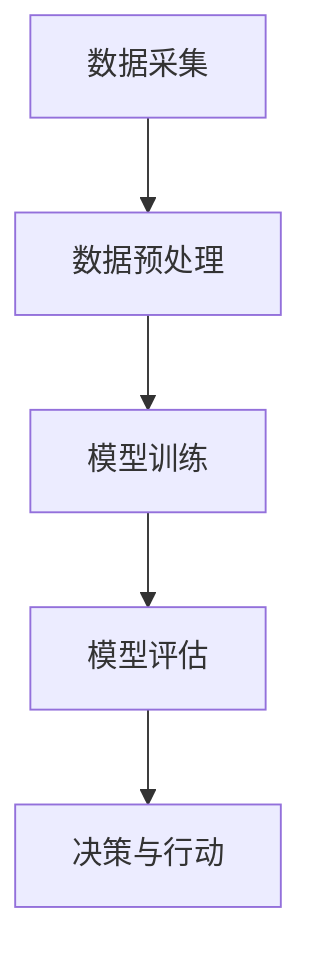
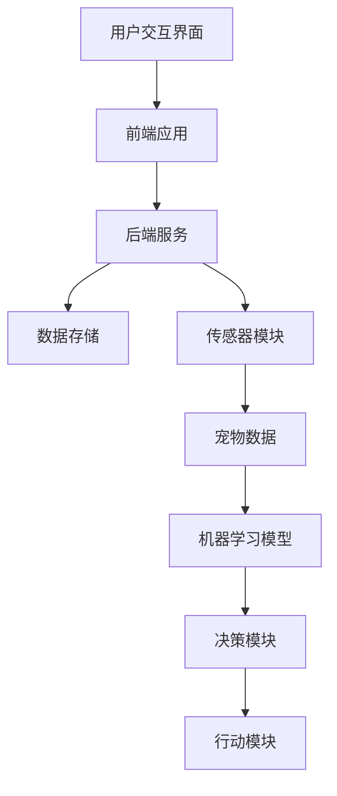

                 


# 智能宠物碗：AI Agent的宠物饮食健康管理

## 关键词

- 智能宠物碗
- AI Agent
- 宠物饮食管理
- 传感器技术
- 机器学习
- 个性化饮食建议

## 摘要

智能宠物碗作为宠物健康管理的前沿技术，通过集成AI Agent和传感器技术，实现对宠物饮食行为的实时监测和分析。本文将深入探讨智能宠物碗的背景、核心概念、算法原理、系统架构和项目实战，旨在为读者提供全面的智能宠物碗技术解析，并揭示其在宠物饮食管理中的巨大潜力。

### 背景介绍

#### 问题背景

随着科技的发展，人工智能（AI）技术逐渐深入到我们的日常生活中，特别是在宠物饲养领域。宠物作为家庭成员，其健康问题越来越受到关注。然而，传统的宠物饮食管理方法往往依赖于宠物主人的经验和观察，存在饮食不均衡、过量等问题，导致宠物健康状况不佳。因此，如何通过技术创新提高宠物饮食管理水平，成为了当前的研究热点。

#### 问题描述

智能宠物碗作为一种新兴的智能硬件，旨在通过AI技术和传感器技术，实现对宠物饮食行为的实时监测和分析。具体来说，智能宠物碗需要解决以下问题：

1. **数据采集**：如何准确采集宠物的饮食行为数据，包括进食速度、进食量、进食频率等？
2. **数据处理**：如何处理大量采集到的数据，并从中提取有用的信息，为宠物主人提供有针对性的饮食建议？
3. **个性化建议**：如何根据宠物的健康状况和需求，提供个性化的饮食管理方案？

#### 问题解决

智能宠物碗通过AI Agent技术，实现了对宠物饮食行为的智能监测和管理。AI Agent是一种能够自主学习、自主决策并采取行动的智能实体。在智能宠物碗中，AI Agent通过以下步骤实现问题解决：

1. **数据采集**：智能宠物碗内置多种传感器，如红外传感器、重力传感器等，实时监测宠物的进食行为，并采集相关数据。
2. **数据处理**：AI Agent利用机器学习算法，对采集到的数据进行分析和处理，提取出有用的信息。
3. **个性化建议**：根据分析结果，AI Agent为宠物主人提供个性化的饮食管理建议，如调整饮食量、推荐营养食谱等。

#### 边界与外延

智能宠物碗的应用边界主要包括宠物的种类、年龄、健康状况等。在外延方面，智能宠物碗还可以与其他智能设备（如智能秤、智能喂食器等）进行联动，提供更全面的宠物健康管理解决方案。

#### 概念结构与核心要素组成

智能宠物碗的核心概念包括：

1. **传感器技术**：用于采集宠物饮食行为的数据。
2. **AI Agent技术**：实现智能诊断和自适应功能。
3. **数据处理与算法**：用于分析数据并提供个性化饮食建议。
4. **用户交互界面**：用于用户与智能宠物碗的交互。

### 核心概念与联系

#### AI Agent的定义与特点

AI Agent（人工智能代理）是一种能够自主学习、自主决策并采取行动的智能实体。在智能宠物碗中，AI Agent负责监测宠物的饮食行为，并根据数据进行分析和决策，为宠物主人提供个性化的饮食建议。

| 特点           | 说明                                                         |
| -------------- | ------------------------------------------------------------ |
| 自学习         | AI Agent能够通过数据不断优化其算法，提高决策的准确性。         |
| 自主决策       | AI Agent能够在没有人工干预的情况下，根据宠物的饮食行为做出决策。 |
| 自行动作       | AI Agent可以通过调整饮食方案来影响宠物的饮食行为。           |

#### AI Agent与传感器技术的联系

传感器技术是智能宠物碗的基础，用于采集宠物的饮食行为数据。这些数据包括宠物的进食速度、进食量、进食频率等。AI Agent利用这些数据，通过机器学习算法进行分析和决策，从而为宠物主人提供个性化的饮食建议。

### AI Agent与传统AI的区别

与传统AI技术相比，AI Agent具有更高的自主性和适应性。传统AI技术通常依赖于预定义的规则和模型，而AI Agent能够自主学习并不断优化其算法，使其在复杂环境中能够更加灵活地应对各种情况。

| 对比项           | AI Agent               | 传统AI                 |
| ---------------- | ---------------------- | ---------------------- |
| 自主性           | 高自主性，能够自主决策 | 依赖预定义规则，需要人工干预 |
| 适应性           | 能够自我学习和优化     | 面对复杂环境时适应性较差   |
| 自行动作         | 能够采取行动           | 需要人工执行特定动作     |

### AI Agent的技术实现

#### AI Agent的基本架构

AI Agent的基本架构包括以下几个关键模块：

1. **传感器模块**：负责采集宠物的饮食行为数据。
2. **数据处理模块**：负责对采集到的数据进行清洗、预处理和特征提取。
3. **学习模块**：负责使用机器学习算法对数据进行训练和优化。
4. **决策模块**：负责根据训练结果和当前数据进行决策。
5. **行动模块**：负责执行决策结果，如调整饮食方案。

#### 数据采集与预处理

智能宠物碗内置多种传感器，如红外传感器、重力传感器等，用于采集宠物的饮食行为数据。这些数据包括宠物的进食速度、进食量、进食频率等。采集到的原始数据通常包含噪声和冗余信息，因此需要进行预处理。

预处理过程通常包括以下步骤：

1. **数据清洗**：去除噪声和异常值。
2. **数据归一化**：将不同量纲的数据转换为同一量纲，便于后续处理。
3. **特征提取**：从原始数据中提取出有用的特征，用于训练模型。

#### 机器学习算法

智能宠物碗的AI Agent通常使用机器学习算法进行训练和优化。常见的机器学习算法包括：

1. **决策树**：通过构建树形结构来分类或回归。
2. **支持向量机**：通过找到一个最佳的超平面来分类数据。
3. **神经网络**：通过多层神经网络来学习复杂的非线性关系。

#### 决策与行动

经过机器学习算法训练的AI Agent，可以根据当前采集到的宠物饮食行为数据，进行决策并采取相应的行动。例如，如果AI Agent发现宠物进食量过大，它可能会建议宠物主人减少宠物的饮食量，或者推荐适合宠物的低热量饮食方案。

#### AI Agent的挑战与优化

尽管AI Agent在智能宠物碗中展示了强大的潜力，但其在实际应用中仍面临一些挑战：

1. **数据质量**：高质量的数据是AI Agent准确决策的基础。因此，需要采取措施确保数据采集和预处理的质量。
2. **模型可解释性**：机器学习模型通常被视为“黑盒”，其决策过程难以解释。为了提高模型的可解释性，需要开发可解释的机器学习算法。
3. **适应性**：AI Agent需要能够适应不断变化的环境和需求。为此，需要设计灵活的算法，以便在新的数据条件下进行自我调整。

### 智能宠物碗的算法流程

智能宠物碗的算法流程可以分为以下几个关键步骤：

1. **数据采集**：通过内置传感器实时采集宠物饮食行为数据。
2. **数据预处理**：对采集到的数据进行清洗、归一化和特征提取。
3. **模型训练**：使用预处理后的数据训练机器学习模型。
4. **模型评估**：评估模型的性能，确保其能够准确预测宠物的饮食行为。
5. **决策与行动**：根据模型的预测结果，为宠物主人提供个性化的饮食建议。

以下是一个简化的算法流程图：



### 智能宠物碗的系统架构设计

智能宠物碗的系统架构设计需要考虑多个方面，包括硬件设计、软件架构和用户交互等。以下是一个简化的系统架构设计：



#### 硬件设计

智能宠物碗的硬件设计主要包括传感器模块和执行模块。传感器模块负责采集宠物饮食行为数据，如红外传感器、重力传感器等。执行模块负责根据AI Agent的决策结果，调整宠物的饮食量或提供其他相应的操作。

#### 软件架构

智能宠物碗的软件架构可以分为前端应用、后端服务和数据存储三个层次。前端应用负责与用户交互，后端服务负责处理数据、训练模型和提供决策结果。数据存储用于存储宠物的历史数据和模型参数。

#### 用户交互界面

用户交互界面是智能宠物碗与用户之间的桥梁，可以通过移动应用或网页实现。用户可以通过界面查看宠物的饮食行为数据、模型预测结果和饮食建议，并进行相关的操作。

### 智能宠物碗的项目实战

#### 环境安装

要在本地搭建一个智能宠物碗的项目环境，首先需要安装以下软件：

1. **Python**：用于编写和运行智能宠物碗的代码。
2. **TensorFlow**：用于训练和部署机器学习模型。
3. **Keras**：用于简化TensorFlow的使用。

安装命令如下：

```bash
pip install python
pip install tensorflow
pip install keras
```

#### 系统核心实现

智能宠物碗的系统核心实现主要包括数据采集、数据处理、模型训练和决策四个部分。以下是一个简单的Python代码示例：

```python
# 数据采集
def collect_data():
    # 采集宠物的饮食行为数据
    data = sensors.collect_data()
    return data

# 数据处理
def preprocess_data(data):
    # 清洗、归一化和特征提取
    processed_data = preprocessing.preprocess(data)
    return processed_data

# 模型训练
def train_model(data):
    # 使用预处理后的数据训练机器学习模型
    model = keras.models.Sequential()
    model.add(keras.layers.Dense(units=64, activation='relu', input_shape=(input_shape,)))
    model.add(keras.layers.Dense(units=64, activation='relu'))
    model.add(keras.layers.Dense(units=output_shape, activation='softmax'))
    model.compile(optimizer='adam', loss='categorical_crossentropy', metrics=['accuracy'])
    model.fit(data, epochs=10, batch_size=32)
    return model

# 决策与行动
def make_decision(model, current_data):
    # 使用训练好的模型进行决策，并采取相应的行动
    prediction = model.predict(current_data)
    action = decision_module.make_decision(prediction)
    action.execute()
```

#### 代码应用解读与分析

以下是对上述代码的解读和分析：

1. **数据采集**：`collect_data` 函数负责采集宠物的饮食行为数据。这部分代码依赖于传感器模块，可以通过调用相应的接口实现。
2. **数据处理**：`preprocess_data` 函数负责对采集到的数据进行处理，包括清洗、归一化和特征提取。这部分代码可以使用现有的数据处理库（如`numpy`、`scikit-learn`等）来实现。
3. **模型训练**：`train_model` 函数负责使用预处理后的数据训练机器学习模型。这里使用了一个简单的神经网络模型，通过`keras`库实现。模型训练是一个迭代过程，需要多次迭代才能得到一个性能较好的模型。
4. **决策与行动**：`make_decision` 函数负责使用训练好的模型进行决策，并采取相应的行动。这里首先使用模型预测当前数据，然后根据预测结果采取相应的行动。

#### 实际案例分析与详细讲解剖析

为了更好地理解智能宠物碗的实际应用，我们可以通过一个实际案例进行分析和讲解。

#### 案例背景

假设有一只宠物狗，它的主人希望通过智能宠物碗来管理其饮食健康。宠物的年龄、体重和健康状况等信息已提前录入系统。

#### 案例过程

1. **数据采集**：智能宠物碗通过传感器模块采集宠物的饮食行为数据，包括进食速度、进食量、进食频率等。
2. **数据处理**：系统对采集到的数据进行预处理，包括清洗、归一化和特征提取，以便后续模型训练。
3. **模型训练**：系统使用预处理后的数据训练机器学习模型，模型训练过程中，系统不断调整模型的参数，以期得到一个性能较好的模型。
4. **决策与行动**：训练好的模型开始预测宠物的饮食行为，根据预测结果，系统为宠物主人提供个性化的饮食建议。例如，如果预测宠物进食量过大，系统可能会建议减少宠物的饮食量。

#### 项目小结

通过上述案例，我们可以看到智能宠物碗在宠物饮食健康管理中的巨大潜力。它不仅能够实时监测宠物的饮食行为，还能根据宠物的健康状况和需求，提供个性化的饮食建议，从而帮助宠物主人更好地管理宠物的饮食健康。

然而，智能宠物碗在实际应用中仍面临一些挑战，如数据质量、模型可解释性和适应性等。未来，随着技术的不断进步，智能宠物碗有望在宠物健康管理领域发挥更大的作用。

### 最佳实践 Tips

1. **定期更新数据**：定期更新宠物的健康数据，有助于提高AI Agent的决策准确性。
2. **多样化传感器**：集成多种传感器，如红外传感器、重力传感器、摄像头等，可以提高数据采集的准确性和完整性。
3. **用户反馈**：鼓励用户提供反馈，以便不断优化系统功能和用户体验。

### 小结

智能宠物碗作为AI技术在宠物健康管理领域的应用，展示了其巨大的潜力。通过集成传感器技术和AI Agent，智能宠物碗能够实现对宠物饮食行为的实时监测和个性化管理，从而帮助宠物主人更好地管理宠物的饮食健康。未来，随着技术的不断进步，智能宠物碗有望在宠物健康管理领域发挥更大的作用。

### 注意事项

1. **数据隐私**：在采集和处理宠物数据时，需确保用户隐私安全，遵循相关法律法规。
2. **设备稳定性**：智能宠物碗的硬件设计应考虑设备的稳定性，以确保长期运行的可靠性。

### 拓展阅读

1. **《人工智能：一种现代的方法》**：该书详细介绍了人工智能的基本概念和算法，对于理解智能宠物碗中的AI技术非常有帮助。
2. **《机器学习实战》**：该书通过实际案例介绍了机器学习算法的应用，对于智能宠物碗中的数据处理和模型训练有很好的参考价值。
3. **《智能宠物健康管理研究》**：该论文探讨了智能宠物健康管理的前沿技术和应用，为智能宠物碗的研发提供了理论基础。

### 作者信息

作者：AI天才研究院/AI Genius Institute & 禅与计算机程序设计艺术 /Zen And The Art of Computer Programming

通过本文，我们深入探讨了智能宠物碗：AI Agent的宠物饮食健康管理。从背景介绍到核心概念，再到算法原理、系统架构和项目实战，我们全面解析了智能宠物碗的技术实现和应用潜力。希望本文能为读者提供有益的参考，激发对智能宠物碗技术的兴趣和探索。未来，随着技术的不断进步，智能宠物碗有望在宠物健康管理领域发挥更大的作用，为宠物和宠物主人带来更多福祉。让我们继续关注这一领域的发展，共同见证AI技术的神奇魅力。🐾🔬🔥

