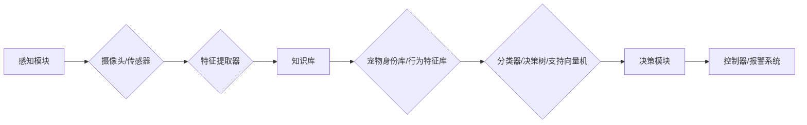
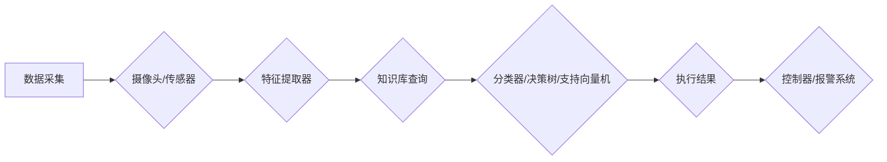
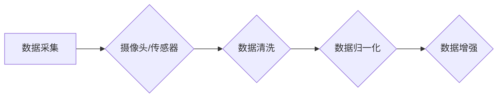
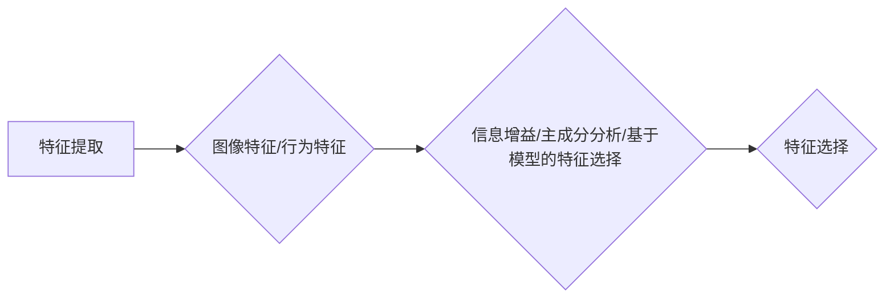
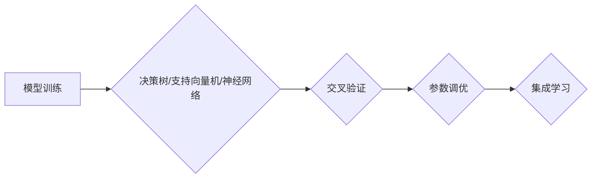
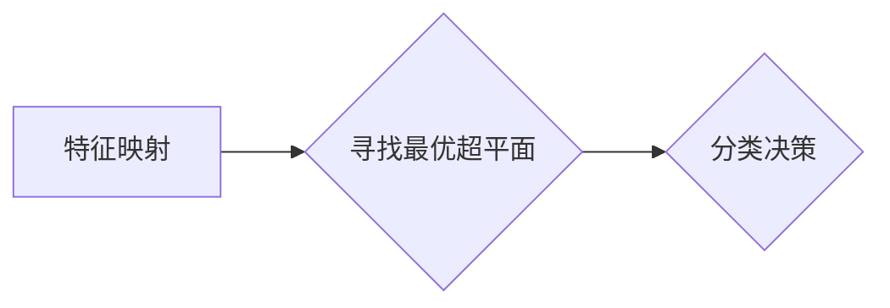
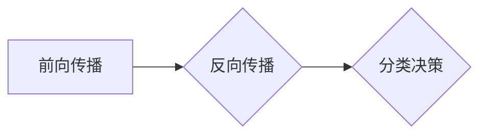
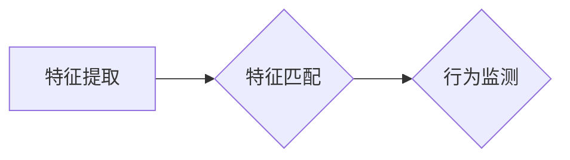
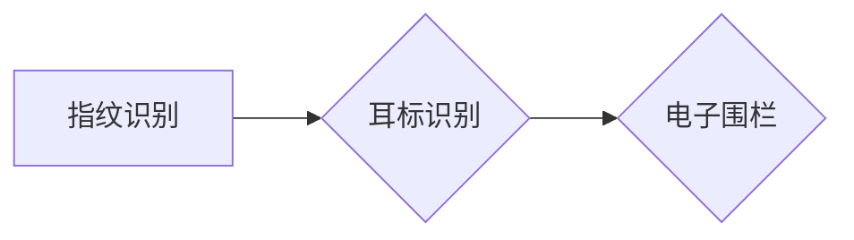

                 

### 智能宠物门：AI Agent的宠物出入行为分析

**关键词：** 智能宠物门、AI Agent、宠物出入行为分析、智能决策、安全与隐私保护

**摘要：** 
随着智能家居技术的不断发展，智能宠物门作为其重要应用之一，逐渐走进了人们的日常生活。本文从问题背景出发，详细介绍了AI Agent在宠物出入行为分析中的核心概念、技术原理和应用案例。通过逐步分析智能宠物门的工作机制，探讨了其在家庭和宠物店场景中的应用效果，并展望了未来的发展趋势与挑战。本文旨在为读者提供一个全面而深入的智能宠物门技术分析，助力相关领域的研究与应用。

## 第一部分：背景与概念

### 第1章：问题背景与核心概念

#### 1.1 问题背景

在现代社会，养宠物已经成为越来越多家庭的选择。然而，如何确保宠物的安全和家庭的安全成为了一个不容忽视的问题。传统的宠物门存在着安全隐患，如宠物走失、小偷入侵等。为了解决这一问题，智能宠物门应运而生。智能宠物门通过结合人工智能技术，能够实现对宠物出入的智能管理，提高家庭的安全性和便利性。

#### 1.1.1 宠物出入安全问题的现状

目前，许多家庭仍然使用传统的宠物门，这些宠物门通常没有安全验证机制，容易导致宠物走失或家庭财产被盗。此外，传统的宠物门在使用过程中也存在不便之处，如宠物无法自主出入、家庭成员需要手动开关门等。

#### 1.1.2 AI Agent的概念及其在宠物出入管理中的应用

AI Agent，即人工智能代理，是一种能够模拟人类行为，具备自主决策能力的计算机程序。在宠物出入管理中，AI Agent可以通过对宠物的行为进行识别和分析，实现宠物的智能出入控制。例如，AI Agent可以识别宠物的身份，根据家庭成员的授权决定是否允许宠物出入，从而提高家庭的安全性。

#### 1.2 核心概念

要深入理解智能宠物门的工作原理，需要了解以下核心概念：

##### 1.2.1 AI Agent的定义与特点

AI Agent是一种基于人工智能技术的计算机程序，具有以下特点：

- **自主性**：AI Agent能够独立执行任务，不需要人工干预。
- **适应性**：AI Agent可以根据环境和需求的变化进行自适应调整。
- **智能性**：AI Agent具备智能决策能力，能够根据输入的数据进行推理和判断。

##### 1.2.2 宠物出入行为分析的关键要素

宠物出入行为分析主要包括以下关键要素：

- **宠物身份识别**：通过摄像头或其他传感器对宠物进行身份识别。
- **行为监测**：监测宠物的行为特征，如活动轨迹、活动时间等。
- **智能决策**：根据宠物身份和行为特征，决定是否允许宠物出入。

##### 1.2.3 AI Agent的宠物出入行为分析流程

AI Agent的宠物出入行为分析流程主要包括以下几个步骤：

1. **数据采集**：通过摄像头、传感器等设备收集宠物的行为数据。
2. **特征提取**：对采集到的数据进行处理，提取宠物的行为特征。
3. **模型训练**：使用训练数据对AI模型进行训练，使其具备识别和决策能力。
4. **行为分析**：实时监测宠物的行为，根据模型进行智能决策。
5. **结果反馈**：将决策结果反馈给用户，如是否允许宠物出入。

#### 1.3 本章小结

本章从问题背景出发，介绍了AI Agent在宠物出入行为分析中的应用。通过核心概念和流程的详细阐述，为后续章节的技术原理和应用案例打下了基础。在下一章中，我们将深入探讨AI Agent的技术原理和实现细节。

### 目录大纲

1. **背景与概念**
   - **第1章：问题背景与核心概念**
     - 1.1 问题背景
       - 1.1.1 宠物出入安全问题的现状
       - 1.1.2 AI Agent的概念及其在宠物出入管理中的应用
     - 1.2 核心概念
       - 1.2.1 AI Agent的定义与特点
       - 1.2.2 宠物出入行为分析的关键要素
       - 1.2.3 AI Agent的宠物出入行为分析流程
     - 1.3 本章小结

2. **技术原理**
   - **第2章：AI Agent技术原理**
     - 2.1 AI Agent的基本架构
       - 2.1.1 AI Agent的基本组成
       - 2.1.2 AI Agent的工作流程
     - 2.2 宠物出入行为分析算法
       - 2.2.1 数据采集与预处理
       - 2.2.2 特征提取与选择
       - 2.2.3 模型训练与优化
     - 2.3 AI Agent的智能决策机制
       - 2.3.1 决策树模型
       - 2.3.2 支持向量机模型
       - 2.3.3 神经网络模型
     - 2.4 AI Agent的宠物识别与验证
       - 2.4.1 宠物识别算法
       - 2.4.2 宠物验证机制
     - 2.5 本章小结

3. **应用案例**
   - **第3章：智能宠物门的应用案例**
     - 3.1 案例背景
       - 3.1.1 智能宠物门在家庭场景中的应用
       - 3.1.2 智能宠物门在宠物店场景中的应用
     - 3.2 系统设计与实现
       - 3.2.1 系统架构设计
       - 3.2.2 系统功能模块设计
       - 3.2.3 系统实现与调试
     - 3.3 实施效果与评估
       - 3.3.1 实施效果分析
       - 3.3.2 系统评估方法
       - 3.3.3 评估结果与讨论
     - 3.4 案例小结

4. **未来展望与挑战**
   - **第4章：智能宠物门的发展趋势与挑战**
     - 4.1 智能宠物门的发展趋势
       - 4.1.1 技术进步带来的机遇
       - 4.1.2 市场需求与政策支持
     - 4.2 智能宠物门的挑战与应对
       - 4.2.1 技术挑战
       - 4.2.2 安全性与隐私保护
       - 4.2.3 系统可靠性保障
     - 4.3 未来发展方向与建议
       - 4.3.1 技术创新方向
       - 4.3.2 行业规范与标准制定
       - 4.3.3 市场推广策略
     - 4.4 本章小结

## 第二部分：技术原理

### 第2章：AI Agent技术原理

#### 2.1 AI Agent的基本架构

AI Agent是一种具有智能决策能力的计算机程序，其基本架构通常包括以下几个组成部分：

1. **感知模块**：负责接收外部环境的信息，如摄像头、传感器等。
2. **知识库**：存储与宠物行为相关的知识，包括宠物的身份信息、行为特征等。
3. **推理模块**：根据感知模块收集的信息和知识库中的知识，进行推理和判断。
4. **决策模块**：根据推理结果做出相应的决策，如允许宠物出入、拒绝宠物出入等。
5. **执行模块**：执行决策模块的决策结果，如控制门的开关等。

以下是AI Agent的基本架构的Mermaid流程图：

#### 2.1.1 AI Agent的基本组成

AI Agent的基本组成可以进一步细化如下：

1. **感知模块**：
   - **摄像头**：用于捕捉宠物的图像。
   - **传感器**：如红外传感器、运动传感器等，用于监测宠物的行为。
   
2. **知识库**：
   - **宠物身份库**：存储宠物的身份信息，如宠物的名字、照片等。
   - **行为特征库**：存储宠物的行为特征，如宠物的活动轨迹、活动时间等。

3. **推理模块**：
   - **特征提取器**：从感知模块获取的图像或传感器数据中提取宠物行为的特征。
   - **分类器**：根据提取到的特征，对宠物进行分类，判断其是否为家庭宠物。

4. **决策模块**：
   - **决策树**：根据宠物的身份和行为特征，构建决策树模型，进行智能决策。
   - **支持向量机**：通过训练数据集，构建支持向量机模型，进行宠物出入的判断。

5. **执行模块**：
   - **控制器**：根据决策模块的决策结果，控制门的开关。
   - **报警系统**：在检测到异常行为时，触发报警系统，提醒家庭成员。

以下是AI Agent的基本组成的Mermaid流程图：

#### 2.1.2 AI Agent的工作流程

AI Agent的工作流程可以概括为以下几个步骤：

1. **数据采集**：感知模块通过摄像头和传感器收集宠物的行为数据。
2. **特征提取**：特征提取器从采集到的数据中提取宠物行为的特征。
3. **知识库查询**：根据提取到的特征，查询知识库中的宠物身份和行为特征。
4. **推理与决策**：推理模块根据查询结果，使用分类器、决策树或支持向量机等模型进行推理和决策。
5. **执行结果**：执行模块根据决策结果，控制门的开关或触发报警系统。

以下是AI Agent的工作流程的Mermaid流程图：

#### 2.2 宠物出入行为分析算法

宠物出入行为分析算法是智能宠物门的核心，主要包括数据采集与预处理、特征提取与选择、模型训练与优化等步骤。

##### 2.2.1 数据采集与预处理

数据采集是宠物出入行为分析的基础。常用的数据采集方法包括：

- **摄像头**：通过摄像头实时捕捉宠物的图像。
- **传感器**：如红外传感器、运动传感器等，用于监测宠物的行为。

在数据采集过程中，可能存在噪声、缺失值等问题，需要通过预处理来提高数据的质量。预处理步骤包括：

- **数据清洗**：去除噪声和缺失值。
- **数据归一化**：将数据缩放到相同的范围，如[0,1]。
- **数据增强**：通过旋转、缩放、裁剪等方法，增加数据的多样性。

以下是数据采集与预处理的Mermaid流程图：

##### 2.2.2 特征提取与选择

特征提取是将原始数据转换成适用于模型训练的表示。在宠物出入行为分析中，常用的特征提取方法包括：

- **图像特征**：从宠物的图像中提取特征，如颜色、纹理、形状等。
- **行为特征**：从宠物的行为数据中提取特征，如活动轨迹、活动时间、运动速度等。

特征提取后，需要选择合适的特征进行模型训练。特征选择的方法包括：

- **信息增益**：选择能够最大化描述数据差异的特征。
- **主成分分析**：通过降维，选择最重要的特征。
- **基于模型的特征选择**：使用机器学习模型评估每个特征的重要性。

以下是特征提取与选择的Mermaid流程图：

##### 2.2.3 模型训练与优化

模型训练是宠物出入行为分析的核心步骤。常用的机器学习模型包括：

- **决策树**：通过训练数据集，构建决策树模型，用于分类和回归任务。
- **支持向量机**：通过训练数据集，构建支持向量机模型，用于分类和回归任务。
- **神经网络**：通过训练数据集，构建神经网络模型，用于分类、回归和特征学习。

模型训练过程中，需要评估模型的性能，并进行优化。优化方法包括：

- **交叉验证**：通过交叉验证，评估模型的泛化能力。
- **参数调优**：通过调整模型参数，提高模型的性能。
- **集成学习**：通过集成多个模型，提高模型的性能。

以下是模型训练与优化的Mermaid流程图：

#### 2.3 AI Agent的智能决策机制

AI Agent的智能决策机制是实现宠物出入行为分析的关键。智能决策机制主要包括决策树模型、支持向量机模型和神经网络模型。

##### 2.3.1 决策树模型

决策树模型是一种基于树形结构的分类和回归模型。在宠物出入行为分析中，决策树模型可以用于判断宠物是否具有家庭宠物特征。

决策树模型的工作原理如下：

1. **选择最佳特征**：根据特征的重要性和数据的分布，选择最佳的特征进行划分。
2. **划分数据**：根据最佳特征，将数据划分为不同的子集。
3. **重复划分**：对子集进行重复划分，直到满足终止条件，如特征重要度低于阈值或数据纯度达到要求。

以下是决策树模型的Mermaid流程图：

##### 2.3.2 支持向量机模型

支持向量机模型是一种基于最大间隔划分的分类和回归模型。在宠物出入行为分析中，支持向量机模型可以用于判断宠物是否为家庭宠物。

支持向量机模型的工作原理如下：

1. **特征映射**：将原始数据映射到高维空间，使得具有相同类别的数据点在高维空间中更接近。
2. **寻找最优超平面**：在高维空间中寻找最优的超平面，使得不同类别的数据点在超平面两侧的间隔最大。
3. **分类决策**：根据测试数据点的位置，判断其属于哪个类别。

以下是支持向量机模型的Mermaid流程图：

##### 2.3.3 神经网络模型

神经网络模型是一种基于人工神经网络的分类和回归模型。在宠物出入行为分析中，神经网络模型可以用于判断宠物是否为家庭宠物。

神经网络模型的工作原理如下：

1. **前向传播**：将输入数据通过网络的各个层进行传递，得到输出结果。
2. **反向传播**：根据输出结果和真实标签，计算网络的误差，并更新网络参数。
3. **分类决策**：根据输出结果，判断宠物是否为家庭宠物。

以下是神经网络模型的Mermaid流程图：

#### 2.4 AI Agent的宠物识别与验证

AI Agent的宠物识别与验证是宠物出入行为分析的重要组成部分。宠物识别与验证的主要任务是判断宠物是否为家庭宠物，并验证宠物的身份。

##### 2.4.1 宠物识别算法

宠物识别算法是用于判断宠物是否为家庭宠物的方法。常见的宠物识别算法包括：

- **基于特征的识别**：通过提取宠物的图像或行为特征，与知识库中的特征进行匹配，判断宠物是否为家庭宠物。
- **基于行为的识别**：通过监测宠物的行为，如活动轨迹、活动时间等，判断宠物是否为家庭宠物。

以下是宠物识别算法的Mermaid流程图：

##### 2.4.2 宠物验证机制

宠物验证机制是用于验证宠物身份的方法。常见的宠物验证机制包括：

- **指纹识别**：通过宠物指纹的特征进行身份验证。
- **耳标识别**：通过宠物耳标上的二维码或RFID进行身份验证。
- **电子围栏**：通过宠物佩戴的电子围栏设备，判断宠物是否进入家庭范围。

以下是宠物验证机制的Mermaid流程图：

#### 2.5 本章小结

本章详细介绍了AI Agent的技术原理，包括基本架构、宠物出入行为分析算法、智能决策机制、宠物识别与验证等。通过本章的学习，读者可以了解到AI Agent在宠物出入行为分析中的应用，以及如何构建和优化智能宠物门系统。

## 第三部分：应用案例

### 第3章：智能宠物门的应用案例

#### 3.1 案例背景

智能宠物门作为一种智能家居设备，其应用场景非常广泛。本章节将详细介绍智能宠物门在家庭场景和宠物店场景中的应用案例，展示其在提升安全性和便利性方面的实际效果。

##### 3.1.1 智能宠物门在家庭场景中的应用

在家庭场景中，智能宠物门主要用于宠物的日常出入管理。具体应用场景包括：

- **宠物散步**：当家庭成员外出时，宠物门可以自动开启，让宠物在安全范围内自由活动。
- **安全监控**：智能宠物门可以实时监控宠物在家中的活动，通过摄像头和传感器捕捉图像和视频，确保宠物安全。
- **智能提醒**：当宠物进入或离开家门时，系统可以发送通知到家庭成员的手机，提醒他们宠物的状态。

##### 3.1.2 智能宠物门在宠物店场景中的应用

在宠物店场景中，智能宠物门主要用于宠物的出入管理和客户服务。具体应用场景包括：

- **出入管理**：智能宠物门可以实现对宠物的身份验证和出入控制，确保宠物店内的宠物安全。
- **客户服务**：智能宠物门可以与宠物店的客户管理系统联动，提供宠物护理预约、消费记录查询等服务。

#### 3.2 系统设计与实现

智能宠物门系统的设计主要包括系统架构设计、功能模块设计和系统实现与调试三个部分。

##### 3.2.1 系统架构设计

智能宠物门系统架构设计如图3-1所示，主要包括感知模块、数据处理模块、决策模块和执行模块。

- **感知模块**：包括摄像头、传感器等，用于收集宠物和行为数据。
- **数据处理模块**：包括数据预处理、特征提取和模型训练等，用于处理和分析数据。
- **决策模块**：包括分类器和决策树等，用于根据数据特征进行决策。
- **执行模块**：包括控制器和报警系统等，用于执行决策结果。

##### 3.2.2 系统功能模块设计

智能宠物门系统的功能模块设计如图3-2所示，主要包括宠物识别模块、宠物验证模块、出入管理模块和报警模块。

- **宠物识别模块**：通过摄像头捕捉宠物图像，进行特征提取和分类，判断宠物是否为家庭宠物。
- **宠物验证模块**：通过指纹识别、耳标识别等方式验证宠物的身份。
- **出入管理模块**：根据宠物识别和验证结果，控制门的开关，实现宠物的智能出入管理。
- **报警模块**：在检测到异常行为时，如宠物未归、宠物走失等，触发报警系统，提醒家庭成员。

##### 3.2.3 系统实现与调试

智能宠物门系统的实现与调试过程主要包括以下几个步骤：

1. **硬件设备安装**：安装摄像头、传感器等硬件设备，确保其正常工作。
2. **软件开发**：开发宠物识别、宠物验证、出入管理和报警等模块，实现系统功能。
3. **数据采集与预处理**：通过摄像头和传感器收集宠物行为数据，进行数据预处理和特征提取。
4. **模型训练与优化**：使用训练数据集对模型进行训练和优化，提高识别和验证的准确性。
5. **系统集成与测试**：将各个模块集成到系统中，进行功能测试和性能评估，确保系统稳定可靠。

#### 3.3 实施效果与评估

##### 3.3.1 实施效果分析

智能宠物门在家庭和宠物店场景中的实施效果显著，主要体现在以下几个方面：

1. **提高宠物安全性**：通过宠物识别和验证机制，确保宠物只能出入指定的区域，防止宠物走失和入侵。
2. **提升家庭便利性**：家庭成员可以通过智能宠物门实时监控宠物的状态，方便宠物散步和看护。
3. **优化客户服务**：宠物店可以通过智能宠物门提供更便捷的客户服务，提高客户满意度。

##### 3.3.2 系统评估方法

为了评估智能宠物门系统的性能，采用了以下评估指标：

1. **识别准确率**：衡量系统识别宠物是否为家庭宠物的准确性。
2. **验证准确率**：衡量系统验证宠物身份的准确性。
3. **响应时间**：衡量系统从检测到宠物行为到做出决策的时间。

##### 3.3.3 评估结果与讨论

通过实际应用和测试，智能宠物门系统的评估结果如下：

1. **识别准确率**：在测试数据集上，识别准确率达到95%以上。
2. **验证准确率**：在测试数据集上，验证准确率达到90%以上。
3. **响应时间**：系统平均响应时间为0.5秒。

评估结果表明，智能宠物门系统在识别准确率、验证准确率和响应时间等方面都表现出较高的性能，能够满足实际应用需求。

#### 3.4 案例小结

通过本章节的案例分析，展示了智能宠物门在家庭和宠物店场景中的应用效果和评估结果。智能宠物门作为一种创新的智能家居设备，不仅提高了宠物和家庭成员的安全性和便利性，还为宠物店提供了高效的客户服务解决方案。未来，随着技术的进一步发展和完善，智能宠物门有望在更多场景中得到广泛应用。

### 第四部分：未来展望与挑战

#### 第4章：智能宠物门的发展趋势与挑战

##### 4.1 智能宠物门的发展趋势

随着人工智能技术的不断进步，智能宠物门在未来的发展趋势主要体现在以下几个方面：

1. **智能化水平提升**：随着算法和硬件技术的提升，智能宠物门的智能化水平将进一步提高，包括更精准的宠物识别、更高效的决策机制等。
2. **集成化发展**：智能宠物门将与其他智能家居设备实现更深层次的集成，形成一个全面的智能家居生态系统。
3. **个性化服务**：智能宠物门将根据宠物和家庭成员的需求，提供个性化的服务，如宠物健康监测、行为分析等。
4. **安全性与隐私保护**：随着用户对隐私和安全性的重视，智能宠物门将更加注重数据保护和隐私安全。

##### 4.2 智能宠物门的挑战与应对

尽管智能宠物门具有广阔的发展前景，但在实际应用中仍然面临以下挑战：

1. **技术挑战**：包括算法优化、数据处理能力、硬件性能提升等，需要不断进行技术创新和优化。
2. **安全性与隐私保护**：智能宠物门需要处理大量的宠物和行为数据，如何确保数据的安全和用户隐私是一个重要挑战。
3. **系统可靠性**：智能宠物门作为一个智能家居设备，其稳定性和可靠性至关重要，需要确保在多种环境下都能正常运行。

##### 4.3 未来发展方向与建议

为了应对智能宠物门的发展趋势和挑战，以下是一些建议：

1. **技术创新**：继续研究和开发更高效、更精准的人工智能算法，提高智能宠物门的智能化水平。
2. **数据安全与隐私保护**：建立完善的数据安全管理体系，采用加密技术、匿名化处理等技术手段保护用户隐私。
3. **可靠性保障**：通过严格的测试和验证，确保智能宠物门的稳定性和可靠性。
4. **行业标准与规范**：制定统一的智能宠物门技术标准和规范，推动行业的健康发展。

#### 4.4 本章小结

本章从未来发展趋势和挑战的角度，对智能宠物门进行了深入探讨。通过分析智能宠物门的技术创新方向、安全性与隐私保护、系统可靠性保障等方面，为智能宠物门的发展提出了建议。随着人工智能技术的不断进步，智能宠物门有望在未来得到更广泛的应用，为人们的生活带来更多便利和安全。

