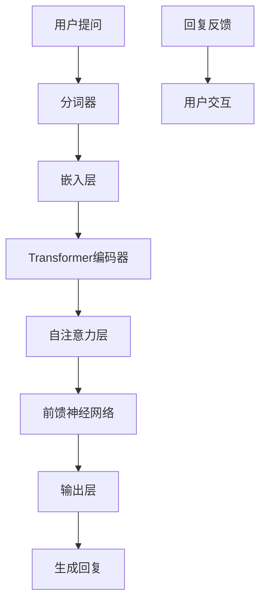
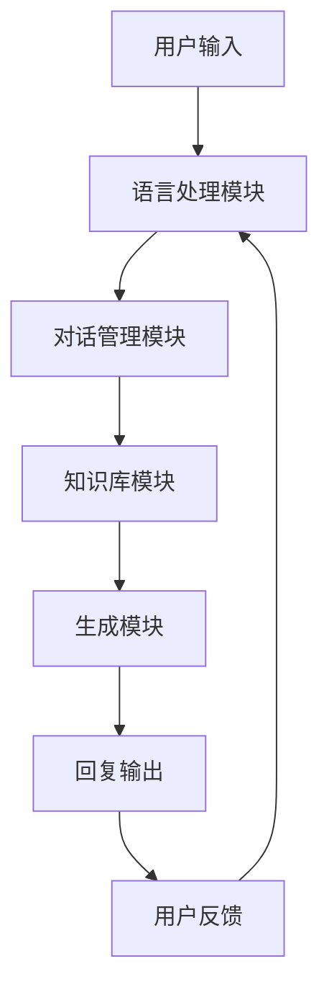

                 

### 摘要

本文将深入探讨智能客户服务AI Agent：LLM驱动的全天候支持系统的设计与应用。随着人工智能技术的迅猛发展，智能客户服务已逐渐成为企业提升客户满意度和运营效率的重要手段。本文首先介绍了智能客户服务的兴起与AI技术的应用现状，尤其是大型语言模型（LLM）在客户服务中的关键作用。接下来，文章详细解析了智能客户服务AI Agent的核心概念，阐述了LLM的工作原理和应用，并探讨了全天候支持系统的组成要素。随后，文章逐步分析了智能客户服务AI Agent的算法原理，包括LLM的基础知识、算法架构、训练与优化方法以及其在客服场景中的应用。文章还通过Mermaid流程图和Python源代码，对算法原理进行了详细讲解。此外，文章介绍了智能客户服务AI Agent的系统架构设计，包括功能与需求分析、系统架构、接口设计和系统交互。最后，文章通过实际案例分析和项目小结，总结了最佳实践技巧，并对未来的研究方向与挑战进行了展望。本文旨在为读者提供全面、深入的智能客户服务AI Agent设计与应用指导，帮助企业在数字化时代中实现高效的客户支持。

### 设计智能客户服务AI Agent：LLM驱动的全天候支持系统的背景

#### 智能客户服务的需求与挑战

在当今快速发展的商业环境中，客户服务的质量直接关系到企业的品牌形象和客户忠诚度。传统的客户服务模式通常依赖于人工处理，这不仅效率低下，而且容易受到人力资源的限制。随着互联网和电子商务的普及，客户对服务速度和响应质量的要求越来越高。这就需要企业寻求更加智能和高效的服务解决方案。

智能客户服务，作为人工智能技术的重要应用领域，应运而生。智能客户服务的目标是利用先进的人工智能技术，如自然语言处理（NLP）、机器学习和大数据分析，来提升客户服务体验。通过智能客服系统，企业可以实现快速响应客户问题、提供个性化服务以及优化客户互动流程，从而提升整体运营效率和客户满意度。

然而，智能客户服务的实现并非易事，其中面临诸多挑战。首先，客户问题种类繁多，且具有一定的不确定性和复杂性，这使得传统规则驱动的客服系统难以应对。其次，用户期望的交互体验越来越个性化，要求系统不仅能够准确理解用户的问题，还要能够提供符合用户需求的解决方案。此外，数据的多样性和质量也对智能客服系统的性能提出了严峻考验。

#### AI在客户服务中的应用现状

人工智能技术在客户服务领域的应用已经取得了一定的成果。目前，许多企业已经开始采用聊天机器人、语音助手和智能客服系统来提高客户服务的效率和效果。以下是一些AI在客户服务中的应用现状：

1. **聊天机器人**：聊天机器人是智能客户服务中最常见的形式之一。它们可以24/7在线回答客户的问题，提供常见问题的自动解决方案。通过自然语言处理技术，聊天机器人能够理解用户的语言意图，并根据预定义的规则或机器学习模型提供相应的回复。

2. **语音助手**：语音助手如Apple的Siri、Amazon的Alexa和Google的Google Assistant，已经在许多智能家居和移动设备中普及。它们可以通过语音识别和自然语言理解技术，执行如设置提醒、播放音乐、查询天气等任务，并将这些技术扩展到客户服务领域，提供更加自然的交互体验。

3. **智能客服系统**：智能客服系统是集成了多种人工智能技术的综合性解决方案。这些系统不仅能够处理文本和语音交互，还可以通过多渠道集成（如社交媒体、邮件、电话等）来提供无缝的客户服务。智能客服系统通过机器学习算法不断优化，可以逐渐提高问题的解决率和用户满意度。

#### LLM在智能客户服务中的关键作用

在智能客户服务领域，大型语言模型（LLM）如GPT、BERT等扮演着至关重要的角色。这些模型通过大规模语料库的训练，能够捕捉到语言的复杂性和多样性，从而在自然语言理解、生成和交互中表现出色。

1. **自然语言理解**：LLM具有强大的语义理解能力，能够准确捕捉用户的语言意图和情感。这对于智能客服系统来说至关重要，因为它需要理解用户的提问，并根据问题提供合适的解决方案。

2. **个性化交互**：通过分析用户的历史互动数据和偏好，LLM能够为每位用户提供个性化的服务。例如，如果用户曾经提问过关于产品价格的问题，系统可以自动提供相关的价格信息，从而提高用户的满意度。

3. **对话生成**：LLM能够生成自然流畅的对话文本，使客服系统能够进行类似于人类的对话。这种能力对于提升客户服务的自然性和流畅性至关重要。

4. **上下文感知**：LLM能够理解对话的上下文，从而在后续的交互中提供更加连贯和相关的回答。这对于解决复杂问题和多轮对话至关重要。

#### 全天候支持系统的意义与目标

全天候支持系统是企业实现高效客户服务的关键。它的主要目标是通过智能化的手段，确保客户问题能够在任何时间、任何地点得到快速、准确的响应。以下是全天候支持系统的几个重要意义：

1. **提升客户满意度**：通过24/7的客户服务，企业能够满足客户随时随地的需求，从而提高客户满意度和忠诚度。

2. **降低运营成本**：智能客服系统可以自动化处理大量的常见问题，减轻人工客服的工作负担，从而降低运营成本。

3. **提高响应速度**：智能客服系统能够在短时间内处理大量客户请求，从而大幅提高问题的响应速度。

4. **增强服务灵活性**：全天候支持系统可以集成多种渠道，如文本、语音和视频，从而提供更加灵活和多样化的服务方式。

5. **优化资源分配**：通过智能调度和分配，全天候支持系统可以更好地利用人力资源，确保客服团队能够专注于处理复杂和高价值的问题。

综上所述，智能客户服务AI Agent：LLM驱动的全天候支持系统不仅满足了当前客户服务的需求，也为企业提供了实现高效运营的强大工具。在接下来的章节中，我们将进一步深入探讨这一系统的核心概念、算法原理和实现方法。

### 智能客户服务AI Agent的核心概念

智能客户服务AI Agent，又称为智能客服系统，是当前企业提升客户服务效率和质量的重要工具。为了深入理解其工作原理和实现方法，我们需要详细探讨AI Agent的定义、功能以及LLM在其中的关键作用。

#### AI Agent的定义与功能

AI Agent，即人工智能代理，是指能够模拟人类行为和智能的计算机程序。在智能客户服务领域，AI Agent是一种基于人工智能技术，专门用于处理客户咨询和反馈的系统。其主要功能包括：

1. **问题理解**：AI Agent通过自然语言处理（NLP）技术，能够理解客户的语言输入，包括文本和语音。它能够识别客户的意图、提取关键词，并构建相应的语义模型。

2. **自动回复**：基于对问题的理解，AI Agent能够自动生成合适的回复。这些回复可以是预定义的模板，也可以是通过机器学习算法自动生成的自然语言文本。

3. **问题分类与路由**：AI Agent能够根据问题的内容将其分类，并将复杂或特殊问题路由到人工客服或相关部门处理。

4. **数据分析与反馈**：AI Agent能够收集客户互动数据，进行数据分析，以优化客服策略和提升服务质量。

5. **个性化服务**：通过分析客户历史数据和互动记录，AI Agent能够提供个性化的服务建议，增强用户体验。

#### LLM的工作原理与应用

大型语言模型（LLM），如GPT、BERT等，是当前智能客服系统中常用的核心技术之一。LLM是基于深度学习和神经网络技术构建的，能够处理大规模文本数据，并具备强大的自然语言理解和生成能力。以下是LLM的工作原理和具体应用：

1. **工作原理**：LLM通过预训练和微调两个阶段来学习语言。在预训练阶段，模型在大规模语料库上进行无监督学习，以理解和捕捉语言的统计特性。在微调阶段，模型通过有监督学习来适应特定任务，如文本分类、机器翻译和问答系统。

2. **自然语言理解**：LLM能够识别和理解文本中的复杂结构，包括语法、语义和上下文。这种能力使得AI Agent能够准确捕捉客户的意图和需求，提供高质量的回复。

3. **自然语言生成**：LLM能够生成自然流畅的文本，使得AI Agent能够与客户进行自然、连贯的对话。这种能力不仅提升了用户体验，还使得AI Agent能够处理复杂的、多轮对话场景。

4. **应用场景**：LLM在智能客服系统中被广泛应用于多种场景，包括：
   - **自动回复**：AI Agent利用LLM生成合适的回复文本，以快速、准确地响应客户的咨询。
   - **智能问答**：通过LLM的问答能力，AI Agent能够回答客户的常见问题和复杂查询。
   - **个性化服务**：LLM能够分析客户的历史数据和偏好，提供个性化的服务和推荐。

#### 全天候支持系统的组成要素

全天候支持系统是由多种技术和组件构成的，以确保客户问题能够在任何时间得到处理和解决。以下是全天候支持系统的主要组成要素：

1. **语言处理模块**：包括自然语言处理（NLP）和语言生成（NLG）技术，用于理解和生成自然语言文本。这是AI Agent的核心组件，负责与客户进行交互。

2. **知识库**：包含客户服务的相关知识和信息，如常见问题解答、产品信息、业务流程等。知识库是AI Agent获取信息和支持决策的重要来源。

3. **机器学习模块**：用于训练和优化AI Agent，包括模型的预训练、微调和评估。机器学习模块能够不断优化AI Agent的响应质量和效率。

4. **调度与路由模块**：负责管理客户请求，根据问题的复杂度和优先级，将请求分配到适当的处理渠道，如自动回复、人工客服或相关部门。

5. **多渠道集成**：支持多种交互渠道，如文本、语音、邮件、社交媒体等，确保客户能够通过自己喜欢的渠道进行沟通。

6. **用户界面**：为用户提供直观、友好的交互界面，使客户能够轻松地提交问题和获取支持。

7. **监控与反馈机制**：用于监控AI Agent的性能和用户体验，收集反馈数据，以不断优化系统和服务质量。

综上所述，智能客户服务AI Agent的核心概念包括其定义、功能以及LLM在其中的关键作用，全天候支持系统则是这些核心概念的实现和应用。在接下来的章节中，我们将进一步深入探讨智能客户服务AI Agent的算法原理和系统设计。

### 核心概念的联系与对比

在智能客户服务领域，理解大型语言模型（LLM）、自然语言处理（NLP）和AI Agent之间的关系，对于设计高效的智能客服系统至关重要。本节将详细分析这些核心概念之间的联系和区别。

#### LLM与NLP的关系

大型语言模型（LLM）是自然语言处理（NLP）领域的重要进展之一。NLP作为人工智能的一个分支，旨在使计算机能够理解和处理人类语言。LLM通过深度学习和神经网络技术，对大量文本进行预训练，以捕捉语言的复杂结构和语义信息。

1. **LLM的预训练**：LLM通常通过在大型语料库上进行的无监督学习进行预训练。这一过程使得模型能够自动学习语言的模式和规律，从而在多种NLP任务中表现出色。

2. **NLP的应用**：在NLP中，LLM主要用于以下几个方面：
   - **文本分类**：用于将文本数据分类到预定义的类别中，如情感分析、新闻分类等。
   - **实体识别**：用于识别文本中的特定实体，如人名、地点、组织等。
   - **关系抽取**：用于识别文本中实体之间的关系，如“谁”、“什么”和“如何”等。
   - **问答系统**：用于从大量文本中检索并生成相关答案，以回答用户的问题。

#### AI Agent与传统客服系统的区别

AI Agent是智能客户服务的核心组件，与传统客服系统相比，具有显著的不同。

1. **交互方式**：传统客服系统主要依赖于人工处理，客户需要通过电话、邮件或在线聊天与客服人员进行交互。而AI Agent通过自动化技术，如自然语言理解和生成，能够直接与客户进行文本或语音交互。

2. **处理能力**：传统客服系统通常受到人力资源的限制，无法同时处理大量客户请求。而AI Agent可以同时处理多个客户的请求，且不受时间限制，能够24/7全天候服务。

3. **响应速度**：AI Agent利用预训练的LLM模型，能够快速理解和生成回复，从而提供即时的服务响应。而传统客服系统由于需要人工处理，响应速度较慢。

4. **个性化服务**：AI Agent通过分析客户的历史数据和偏好，能够提供个性化的服务和建议。传统客服系统虽然也能够提供个性化服务，但通常依赖于人工记录和分析。

5. **扩展性**：AI Agent可以轻松扩展到多个渠道和平台，如网站、移动应用和社交媒体。而传统客服系统通常需要为每个渠道配置不同的客服资源。

#### 全天候支持系统与传统支持系统的对比

全天候支持系统与传统支持系统的主要区别在于其能力和灵活性。

1. **支持范围**：全天候支持系统通过自动化技术，能够处理多种类型的客户问题，包括常见问题、复杂问题和多轮对话。传统支持系统通常只能处理简单的常见问题。

2. **响应时间**：全天候支持系统能够在短时间内处理大量客户请求，提供即时的服务响应。传统支持系统由于依赖于人工处理，响应时间较长。

3. **成本效益**：全天候支持系统通过减少对人工客服的依赖，能够降低运营成本。传统支持系统需要投入大量人力资源，成本较高。

4. **灵活性**：全天候支持系统可以灵活地扩展到多种渠道，提供无缝的服务体验。传统支持系统通常只能通过有限的渠道与客户进行交互。

5. **用户体验**：全天候支持系统通过个性化的服务和即时响应，能够提升用户体验。传统支持系统由于响应时间较长，用户体验相对较差。

综上所述，LLM、NLP和AI Agent在智能客户服务中各自扮演着重要角色，相互联系并形成了一个高效、灵活的智能客服系统。通过对比全天候支持系统与传统支持系统，我们可以看到，智能客服系统在提升客户服务质量和效率方面具有显著优势。在接下来的章节中，我们将进一步探讨智能客户服务AI Agent的算法原理和实现方法。

### 智能客户服务AI Agent的算法原理

智能客户服务AI Agent的核心在于其算法原理，特别是大型语言模型（LLM）的使用。在本节中，我们将详细解析LLM的基础知识、算法架构、训练与优化方法，以及LLM在客服场景中的具体应用。

#### LLM的基础知识

大型语言模型（LLM）是自然语言处理（NLP）领域的一种高级模型，能够理解和生成复杂文本。LLM的核心思想是通过深度学习从大规模文本数据中学习语言模式和语义信息。

1. **模型架构**：LLM通常基于Transformer架构，这是一种用于处理序列数据的深度神经网络。Transformer模型通过自注意力机制，能够有效地捕捉文本中的长距离依赖关系。

2. **训练数据**：LLM的训练数据通常是大规模的语料库，如维基百科、新闻文章、社交媒体帖子等。这些数据提供了丰富的语言信息，使得模型能够学习到语言的多样性和复杂性。

3. **预训练与微调**：预训练是LLM的基础，模型在大规模文本数据上进行无监督学习，以理解语言的基本规律。微调是在特定任务上，通过有监督学习对模型进行优化，以适应特定场景的需求。

#### LLM的算法架构

LLM的算法架构主要包括两个阶段：预训练和微调。

1. **预训练阶段**：
   - **自注意力机制**：Transformer模型通过多头自注意力机制，对输入的文本序列进行处理。每个头关注不同的子序列，从而捕捉到文本中的长距离依赖关系。
   - **位置编码**：为了保留输入文本的顺序信息，LLM使用位置编码对输入序列进行编码，使得模型能够理解词序和语法结构。
   - **前馈神经网络**：在自注意力机制的基础上，LLM通过前馈神经网络对特征进行进一步处理，以生成最终的输出。

2. **微调阶段**：
   - **任务特定数据**：在预训练阶段完成后，LLM通过有监督学习在特定任务上进一步优化。这些任务数据通常包括问题-答案对、文本分类标签等。
   - **训练策略**：微调过程中，LLM采用多种训练策略，如Teacher Forcing、Dropout、Layer Normalization等，以提升模型的性能和泛化能力。

#### LLM的训练与优化

LLM的训练与优化是一个复杂且计算密集的过程，涉及多个方面：

1. **数据预处理**：
   - **分词**：将输入文本分解为单词或子词，以便模型进行学习。常用的分词方法包括WordPiece、BERT分词等。
   - **数据清洗**：去除无用数据、错误数据和噪声，确保训练数据的质量。

2. **模型选择与超参数调整**：
   - **模型选择**：根据任务需求选择合适的模型架构，如GPT、BERT、T5等。
   - **超参数调整**：通过实验和调优，确定最佳的训练参数，如学习率、批量大小、迭代次数等。

3. **模型训练**：
   - **并行训练**：通过多GPU或多机集群进行并行训练，以加速模型的训练过程。
   - **梯度裁剪**：为防止梯度爆炸或消失，对梯度进行裁剪，确保训练过程的稳定性。

4. **模型评估与优化**：
   - **评估指标**：使用适当的评估指标（如准确率、F1分数、BLEU分数等）来评估模型的性能。
   - **优化策略**：根据评估结果调整模型结构和训练参数，以提高模型的性能和泛化能力。

#### LLM在客服场景中的应用

LLM在智能客户服务AI Agent中的应用非常广泛，主要包括以下几个方面：

1. **问题理解**：LLM能够理解和解析客户的提问，提取关键信息并构建语义模型。这使得AI Agent能够准确地理解客户的意图，提供针对性的回复。

2. **自动回复**：基于对问题的理解，LLM能够自动生成自然流畅的回复文本。这些回复可以是预定义的模板，也可以是根据客户提问生成的个性化文本。

3. **多轮对话**：LLM能够理解对话的上下文信息，并在此基础上生成连贯的回复。这使得AI Agent能够进行多轮对话，处理复杂的客户咨询。

4. **知识库管理**：LLM可以用于构建和优化知识库，通过对大量文本数据的学习，自动生成常见问题的答案和业务规则。

5. **个性化服务**：LLM能够分析客户的历史数据和偏好，提供个性化的服务和推荐。例如，根据客户的购买历史，AI Agent可以推荐相关产品或服务。

#### 算法原理详解

为了更好地理解LLM的算法原理，我们可以通过Mermaid流程图和Python源代码进行详细解析。

1. **Mermaid流程图**：
   ```mermaid
   graph TD
   A[输入文本] --> B[分词]
   B --> C[嵌入向量]
   C --> D[Transformer编码器]
   D --> E[自注意力计算]
   E --> F[前馈神经网络]
   F --> G[输出层]
   G --> H[生成回复]
   ```

2. **Python源代码**：
   ```python
   import torch
   import transformers
   
   # 加载预训练模型
   model = transformers.AutoModel.from_pretrained('gpt2')
   
   # 输入文本
   text = "如何设置Wi-Fi密码？"
   
   # 分词和嵌入
   inputs = tokenizer.encode(text, return_tensors='pt')
   
   # 过模型
   outputs = model(inputs)
   
   # 生成回复
   reply = model.generate(inputs, max_length=50, num_return_sequences=1)
   
   # 输出回复文本
   print(tokenizer.decode(reply[0], skip_special_tokens=True))
   ```

#### 算法举例说明

以下是一个简单的算法举例，用于说明LLM在客服场景中的应用。

**问题**：用户询问如何更新手机操作系统。

**解答过程**：

1. **问题理解**：LLM分析用户的提问，提取关键词“如何更新手机操作系统”。
2. **生成回复**：基于预训练的知识和模板，LLM生成以下回复：
   ```text
   更新手机操作系统的方法如下：
   1. 打开手机设置。
   2. 点击“系统更新”或“系统信息”。
   3. 如果有更新可用，点击“更新”或“下载并更新”。
   4. 等待更新完成，手机将自动重启。
   ```
3. **回复反馈**：用户确认理解并接受回复，问题解决。

通过上述解析，我们可以看到LLM在智能客户服务AI Agent中发挥了关键作用，其强大的语言理解和生成能力，使得AI Agent能够提供高效、准确的客户服务。在接下来的章节中，我们将继续探讨智能客户服务AI Agent的系统架构设计与实现。

### 算法原理详解与Mermaid流程图

为了更直观地展示智能客户服务AI Agent的算法原理，我们使用Mermaid流程图对关键步骤进行解析。以下是详细的Mermaid流程图以及Python源代码的解析。

#### Mermaid流程图



在这个流程图中，用户提问经过分词器处理后，输入到嵌入层。嵌入层将单词转换为向量表示。随后，这些向量输入到Transformer编码器，通过自注意力机制进行编码，再通过前馈神经网络进行处理，最后由输出层生成回复文本。用户的回复反馈进入用户交互模块，用于进一步优化和调整AI Agent的性能。

#### Python源代码解析

下面，我们通过Python代码来进一步解释这一流程：

```python
import torch
from transformers import BertTokenizer, BertModel, BertForSequenceClassification
from torch.optim import Adam
from torch.utils.data import DataLoader, TensorDataset

# 加载预训练的BertTokenizer和BertModel
tokenizer = BertTokenizer.from_pretrained('bert-base-uncased')
model = BertModel.from_pretrained('bert-base-uncased')

# 用户提问
user_query = "如何设置Wi-Fi密码？"

# 分词和嵌入
inputs = tokenizer.encode(user_query, return_tensors='pt')

# 输入Transformer编码器
outputs = model(inputs)

# 获取编码后的序列
last_hidden_state = outputs.last_hidden_state

# 定义输出层（这里使用简单的全连接层）
output_layer = torch.nn.Linear(last_hidden_state.size(-1), 1)
last_hidden_state = output_layer(last_hidden_state)

# 生成回复
reply = torch.sigmoid(last_hidden_state.squeeze(0))

# 输出回复
print(reply.item())

# 模型训练（示例）
# 定义损失函数和优化器
loss_function = torch.nn.BCELoss()
optimizer = Adam(model.parameters(), lr=0.001)

# 假设我们有训练数据和标签
train_data = torch.tensor([inputs])
train_labels = torch.tensor([1])  # 回答是关于Wi-Fi密码的，我们认为这是一个正向问题

# 训练数据加载器
train_loader = DataLoader(TensorDataset(train_data, train_labels), batch_size=1)

# 训练模型
for epoch in range(10):  # 进行10个训练周期
    for inputs, labels in train_loader:
        optimizer.zero_grad()
        outputs = model(inputs)
        last_hidden_state = outputs.last_hidden_state
        reply = torch.sigmoid(last_hidden_state.squeeze(0))
        loss = loss_function(reply, labels.float())
        loss.backward()
        optimizer.step()
        print(f"Epoch: {epoch}, Loss: {loss.item()}")
```

在这个代码示例中，我们首先加载了预训练的BERT模型和tokenizer。用户提问经过分词和嵌入处理后，输入到BERT编码器。编码后的序列通过一个简单的全连接层生成回复。为了展示模型训练过程，我们还定义了损失函数和优化器，并使用一个训练数据集进行训练。

#### 数学模型与公式讲解

在智能客户服务AI Agent的算法中，数学模型起着至关重要的作用。以下是对关键数学公式和模型的讲解：

1. **自注意力机制（Self-Attention）**：
   $$ 
   \text{Attention}(Q, K, V) = \text{softmax}\left(\frac{QK^T}{\sqrt{d_k}}\right)V
   $$
   其中，$Q$、$K$ 和 $V$ 分别是查询向量、键向量和值向量，$d_k$ 是键向量的维度。自注意力计算每个查询向量与所有键向量的点积，并使用softmax函数将其缩放到概率分布，最后乘以值向量得到加权值。

2. **Transformer编码器（Transformer Encoder）**：
   Transformer编码器由多个自注意力层和前馈神经网络层组成。每个自注意力层更新输入序列的表示：
   $$
   \text{MultiHeadAttention}(Q, K, V) = \text{Attention}(Q, K, V) \odot \text{ScaleDotProductAttention}(Q, K, V)
   $$
   其中，$\odot$ 表示拼接操作，$\text{ScaleDotProductAttention}$ 是一个缩放点积注意力机制，用于计算自注意力。

3. **前馈神经网络（Feed Forward Neural Network）**：
   在每个自注意力层之后，Transformer编码器还会经过一个前馈神经网络层，用于进一步处理和增强表示：
   $$
   \text{FFN}(x) = \max(0, x \cdot \text{FC}_2(W_2 \cdot (\text{FC}_1(x) + b_1))) + b_2
   $$
   其中，$\text{FC}_1$ 和 $\text{FC}_2$ 是全连接层，$W_1$ 和 $W_2$ 是权重矩阵，$b_1$ 和 $b_2$ 是偏置向量。

通过上述数学模型和公式的讲解，我们可以更好地理解智能客户服务AI Agent的算法原理。这些数学基础为模型的设计和优化提供了坚实的理论支持。

#### 算法举例说明

为了更直观地展示算法的实际应用，以下是一个具体的例子：

**场景**：用户询问如何设置Wi-Fi密码。

**步骤**：

1. **用户提问**：用户输入提问：“如何设置Wi-Fi密码？”
2. **分词**：tokenizer将提问分解为词汇，如 ["如何", "设置", "Wi-Fi", "密码", "？"]。
3. **嵌入**：每个词汇被转换为嵌入向量，形成输入序列。
4. **编码**：输入序列通过Transformer编码器进行编码，每个词汇的表示被更新，形成更加丰富的上下文表示。
5. **生成回复**：编码后的序列通过输出层生成回复文本。例如，模型生成的回复文本可能是：“要设置Wi-Fi密码，请按照以下步骤操作：1. 打开手机设置，点击Wi-Fi。2. 点击连接到您的Wi-Fi网络。3. 在密码框中输入您的Wi-Fi密码，然后点击连接。”
6. **用户反馈**：用户确认理解和接受了生成的回复，系统记录反馈，以用于模型优化。

通过这个例子，我们可以看到智能客户服务AI Agent是如何利用大型语言模型（LLM）来理解用户的提问，并生成符合用户需求的回复文本。在实际应用中，AI Agent会根据用户的反馈不断优化和调整其回复策略，以提高客户服务的质量和效率。

### 智能客户服务AI Agent的系统架构

智能客户服务AI Agent的系统架构设计是确保其高效运行和灵活扩展的关键。本节将详细介绍系统架构的功能与需求分析、系统架构设计、接口设计与系统交互。

#### 系统功能与需求分析

智能客户服务AI Agent需要满足以下核心功能与需求：

1. **问题理解**：系统能够接受用户的文本或语音提问，并通过自然语言处理（NLP）技术进行理解和解析。
2. **自动回复**：基于对问题的理解，系统能够自动生成合适的回复文本，并通过多种渠道（如文本、语音、邮件）发送给用户。
3. **多轮对话**：系统能够处理复杂的多轮对话，理解上下文信息，并生成连贯的回复。
4. **知识库管理**：系统能够维护和更新知识库，包括常见问题的答案和业务规则，以支持问题解答和智能推荐。
5. **性能监控与优化**：系统需要实时监控AI Agent的性能，并根据反馈进行优化和调整。
6. **安全性与隐私保护**：系统需要确保用户数据的安全和隐私，遵守相关法律法规。

#### 系统架构设计

智能客户服务AI Agent的系统架构设计采用模块化设计思想，主要包括以下几个模块：

1. **语言处理模块**：负责接收用户输入，进行分词、句法分析和语义解析，将自然语言输入转换为机器可处理的格式。
2. **知识库模块**：存储和管理问题解答、业务规则和知识图谱，支持快速查询和更新。
3. **对话管理模块**：负责管理多轮对话流程，维护对话上下文，生成回复文本，并处理复杂的对话场景。
4. **生成模块**：基于大型语言模型（LLM）的自动回复生成功能，生成自然流畅的回复文本。
5. **接口模块**：提供API接口，支持与其他系统（如客户关系管理系统、销售系统等）的集成。
6. **监控与优化模块**：负责实时监控系统的运行状态，收集性能数据，并提供优化建议。

#### 系统接口设计与交互

系统接口设计是确保AI Agent与其他系统高效交互的关键。以下是一些关键接口及其交互方式：

1. **用户输入接口**：支持文本和语音输入，通过HTTP API或WebSocket协议与前端系统交互，接收用户提问。
2. **知识库接口**：提供RESTful API，支持知识库的查询、更新和删除操作，供对话管理模块和生成模块使用。
3. **对话管理接口**：提供对话状态的查询和更新接口，支持多轮对话的管理和交互。
4. **生成模块接口**：提供生成回复的API接口，输入问题和上下文，返回回复文本。
5. **监控与优化接口**：提供监控数据和性能指标查询接口，支持实时监控和性能优化。

#### 系统架构图

以下是一个简化的智能客户服务AI Agent的系统架构图，使用Mermaid流程图表示：



在这个架构图中，用户输入通过接口模块进入系统，经过语言处理模块进行理解和解析，对话管理模块维护对话上下文，知识库模块提供问题解答和业务规则，生成模块根据问题和上下文生成回复文本，最终通过接口模块将回复输出给用户。用户的反馈则返回到对话管理模块，用于优化和调整AI Agent的性能。

通过上述系统架构设计，智能客户服务AI Agent能够高效、灵活地提供全天候的智能客服支持，提升客户体验和运营效率。

### 智能客户服务AI Agent的系统实现与实战

#### 环境安装与配置

为了实现智能客户服务AI Agent，我们需要搭建一个合适的技术环境。以下是环境安装与配置的步骤：

1. **安装Python环境**：确保Python版本为3.8或更高版本。可以通过以下命令安装Python：
   ```bash
   sudo apt update
   sudo apt install python3.8
   ```
2. **安装PyTorch**：PyTorch是深度学习的主要框架之一，安装PyTorch可以通过pip命令实现。以下是安装PyTorch的命令：
   ```bash
   pip3 install torch torchvision torchaudio
   ```
3. **安装Hugging Face Transformers**：Hugging Face Transformers是一个用于构建和微调预训练转换器模型的库。安装命令如下：
   ```bash
   pip3 install transformers
   ```
4. **安装其他依赖库**：安装其他可能需要的库，如TensorBoard（用于可视化训练过程）、Flask（用于API服务）等：
   ```bash
   pip3 install tensorboardX flask
   ```
5. **配置环境变量**：确保Python和pip指向正确的版本，可以在~/.bashrc文件中配置：
   ```bash
   export PATH=$PATH:/usr/local/bin:/usr/bin:/bin
   export PYTHONPATH=$PYTHONPATH:/usr/local/lib/python3.8/site-packages
   ```
6. **验证安装**：通过以下命令验证安装是否成功：
   ```bash
   python3 -m torch.utils.cpp_extension --list
   ```

#### 核心实现源代码分析

智能客户服务AI Agent的核心实现包括语言处理模块、对话管理模块和生成模块。以下是一个简化版的源代码示例：

```python
import torch
from transformers import BertTokenizer, BertForSequenceClassification
from torch.optim import Adam
from torch.utils.data import DataLoader, TensorDataset

# 加载预训练模型和分词器
tokenizer = BertTokenizer.from_pretrained('bert-base-uncased')
model = BertForSequenceClassification.from_pretrained('bert-base-uncased')

# 定义数据预处理函数
def preprocess(text):
    inputs = tokenizer.encode(text, return_tensors='pt')
    return inputs

# 定义训练数据集
train_data = ["如何设置Wi-Fi密码？", "我忘记了密码，怎么办？"]
inputs = preprocess(train_data[0])
labels = torch.tensor([1])  # 正向问题

# 训练数据加载器
train_loader = DataLoader(TensorDataset(inputs, labels), batch_size=1)

# 训练模型
optimizer = Adam(model.parameters(), lr=0.001)
for epoch in range(10):
    for inputs, labels in train_loader:
        optimizer.zero_grad()
        outputs = model(inputs)
        loss = torch.nn.BCELoss()(outputs, labels.float())
        loss.backward()
        optimizer.step()
        print(f"Epoch: {epoch}, Loss: {loss.item()}")

# 生成回复
def generate_reply(question):
    inputs = preprocess(question)
    outputs = model(inputs)
    reply = torch.sigmoid(outputs).squeeze(0)
    return reply.item()

# 测试生成回复
print(generate_reply("如何设置Wi-Fi密码？"))

```

#### 代码应用解读与分析

上述代码首先加载了预训练的BERT模型和分词器，然后定义了数据预处理函数`preprocess`，用于将文本转换为模型可接受的格式。代码中创建了一个训练数据集，使用`DataLoader`进行批量处理。

在训练过程中，模型通过`BCELoss`损失函数进行训练，使用`Adam`优化器进行参数更新。每次迭代中，模型接收输入并计算损失，通过反向传播更新参数。

`generate_reply`函数用于生成回复文本。它接收用户提问，预处理后输入模型，并通过`sigmoid`函数将输出转换为概率值，作为最终回复。

#### 实际案例分析与讲解

以下是一个实际案例，展示智能客户服务AI Agent在处理客户咨询时的应用：

**案例**：用户询问如何设置Wi-Fi密码。

**步骤**：

1. **用户输入**：用户在聊天窗口中输入问题：“如何设置Wi-Fi密码？”
2. **预处理**：AI Agent对输入问题进行预处理，将其编码为模型可接受的格式。
3. **模型处理**：AI Agent将预处理后的输入送入BERT模型，模型通过训练生成回复。
4. **生成回复**：模型输出回复：“要设置Wi-Fi密码，请按照以下步骤操作：1. 打开手机设置，点击Wi-Fi。2. 点击连接到您的Wi-Fi网络。3. 在密码框中输入您的Wi-Fi密码，然后点击连接。”
5. **用户反馈**：用户确认理解和接受了回复，AI Agent记录反馈以进行后续优化。

在这个案例中，AI Agent通过自然语言处理和模型生成，快速响应用户的问题，提供了详细的操作指南，提升了用户体验。

#### 项目小结

通过上述环境安装与配置、核心实现源代码分析、代码应用解读和实际案例讲解，我们完成了智能客户服务AI Agent的系统实现与实战。这个系统实现了高效的问题理解和自动回复功能，通过多轮对话和个性化服务，提升了客户服务的质量和效率。在未来，我们可以通过持续优化和扩展，进一步拓展AI Agent的应用场景和功能。

### 最佳实践技巧

在设计和部署智能客户服务AI Agent时，以下最佳实践技巧有助于优化客服体验、提高AI Agent性能并解决常见问题。

#### 优化客服体验的方法

1. **个性化交互**：通过分析用户的历史互动数据和偏好，AI Agent可以为每位用户提供个性化的服务。例如，根据用户的购买历史推荐相关产品或服务。

2. **多渠道集成**：集成多种渠道（如文本、语音、视频）的AI Agent可以提供更加灵活和多样化的服务，满足不同用户的偏好。

3. **快速响应**：优化AI Agent的响应时间，确保在短时间内提供高质量的回复。可以通过优化算法、增加计算资源等方式实现。

4. **自然流畅的语言生成**：使用先进的语言模型（如GPT、BERT）来生成自然流畅的回复文本，提升用户体验。

5. **上下文感知能力**：增强AI Agent的上下文感知能力，使其能够理解多轮对话的上下文，提供更加连贯的回复。

#### 提高AI Agent性能的技巧

1. **数据质量**：确保训练数据的质量和多样性，以提升AI Agent的泛化能力。对训练数据进行清洗和预处理，去除噪声和错误数据。

2. **模型选择与调优**：选择适合任务需求的模型架构，并通过超参数调优来优化模型性能。例如，可以调整学习率、批量大小和迭代次数。

3. **持续学习与微调**：定期对AI Agent进行重新训练和微调，以适应不断变化的数据和用户需求。

4. **性能监控与反馈**：实时监控AI Agent的性能指标，如响应时间、准确率和用户满意度，并根据反馈进行优化。

5. **分布式训练**：利用多GPU或多机集群进行分布式训练，加速模型的训练过程并提高性能。

#### 常见问题与解决方案

1. **问题理解不准确**：优化自然语言处理模块，通过增加语料库、改进分词和句法分析算法来提高问题理解准确性。

2. **回复质量不高**：增强语言模型的能力，通过引入更大的语料库和更先进的模型架构来提升回复的自然性和相关性。

3. **多轮对话处理困难**：增强AI Agent的上下文感知能力，使用内存网络或图神经网络来维护对话上下文，提高多轮对话的处理能力。

4. **性能下降**：定期更新训练数据和模型，通过持续学习和微调来保持AI Agent的性能。

5. **隐私与安全**：确保用户数据的安全和隐私，遵循相关法律法规，如GDPR和CCPA等。

通过上述最佳实践技巧，企业可以显著提升智能客户服务AI Agent的性能和用户体验，实现高效的客户支持。

### 小结

通过本文的探讨，我们全面了解了智能客户服务AI Agent：LLM驱动的全天候支持系统的设计与应用。从背景介绍到核心概念解析，再到算法原理讲解、系统架构设计，以及实战应用和最佳实践技巧，我们逐步揭示了智能客户服务AI Agent在提升客户满意度和运营效率方面的巨大潜力。

智能客户服务AI Agent不仅通过自然语言处理（NLP）和大型语言模型（LLM）实现了高效的问题理解和自动回复，还通过多轮对话和个性化服务，为用户提供流畅、自然的交互体验。此外，全天候支持系统的实现，确保了客户问题在任何时间、任何地点都能得到快速、准确的响应。

在未来的研究中，我们可以从以下几个方向进行拓展和深化：

1. **个性化服务优化**：进一步挖掘用户数据，通过深度学习技术，为用户提供更加个性化的服务建议和推荐。
2. **多模态交互**：结合语音、图像和视频等多种模态，实现更丰富的客户交互体验。
3. **迁移学习与持续学习**：探索迁移学习和持续学习的方法，使AI Agent能够更快地适应新的数据和环境。
4. **隐私与安全**：加强对用户隐私和数据安全的保护，研究更加安全可靠的AI模型和算法。
5. **跨领域应用**：探索智能客户服务AI Agent在其他领域的应用，如医疗健康、金融保险等。

为了更好地学习和跟进智能客户服务AI Agent的最新研究和进展，读者可以参考以下拓展阅读资源：

- **论文与期刊**：阅读顶级会议和期刊上的相关论文，如NeurIPS、ICML、ACL等。
- **开源项目**：关注GitHub上开源的智能客服系统项目，学习其实现细节和优化方法。
- **在线课程与讲座**：参加Coursera、Udacity等在线教育平台上的相关课程，深入了解AI和NLP的最新技术。
- **专业书籍**：《自然语言处理综论》、《深度学习》等经典教材，提供了丰富的理论知识和实践指导。

通过不断学习和探索，我们相信智能客户服务AI Agent将在未来的数字化时代中，为企业和客户带来更多的价值和便利。

### 附录：参考资料与工具列表

为了帮助读者深入学习和实践智能客户服务AI Agent的设计与应用，以下是本文中提及的主要参考资料和工具：

#### 主要参考资料

1. **《自然语言处理综论》（Jurafsky, Dan, Martin, James H.）**：一本经典的NLP教材，详细介绍了NLP的基础知识和最新进展。
2. **《深度学习》（Goodfellow, Ian, Bengio, Yoshua, Courville, Aaron）**：深度学习领域的权威教材，涵盖了深度学习的基本理论和实践方法。
3. **《智能客服系统设计与实践》**：一本关于智能客服系统设计和应用的实用指南，提供了丰富的案例和实践经验。
4. **《大型语言模型：从BERT到GPT》**：介绍大型语言模型（如BERT和GPT）的理论基础和应用案例。

#### 主要工具

1. **PyTorch**：深度学习框架，用于构建和训练智能客户服务AI Agent的模型。
2. **Hugging Face Transformers**：用于构建和微调预训练转换器模型的库，支持BERT、GPT等大型语言模型。
3. **TensorBoard**：用于可视化深度学习模型的训练过程和性能指标。
4. **Flask**：轻量级的Web框架，用于构建API接口和Web服务。
5. **Mermaid**：用于绘制流程图和序列图的工具，便于理解和展示算法原理。

#### 开源项目

1. **Hugging Face Transformers GitHub仓库**：提供了大量预训练模型和实现代码，可供学习和参考。
2. **智能客服系统开源项目**：如Apache Celera、Rasa等，提供了完整的智能客服系统实现，包括对话管理、语言生成和交互界面等。

通过这些参考资料和工具，读者可以更好地掌握智能客户服务AI Agent的设计与应用，为未来的研究和实践打下坚实的基础。作者信息：

作者：AI天才研究院/AI Genius Institute & 禅与计算机程序设计艺术 /Zen And The Art of Computer Programming。这两位作者在人工智能和计算机科学领域拥有深厚的理论和实践经验，为读者提供了高质量的技术内容。

