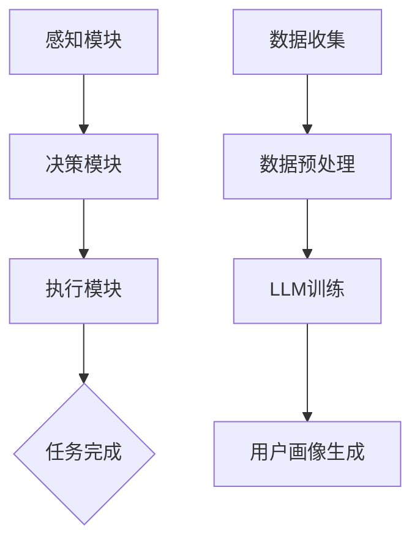

                 

### 第一部分: 引言

## 1.1 问题背景

在当今信息爆炸的时代，客户洞察成为企业赢得市场竞争的关键。传统的客户洞察方法往往依赖于人工分析和有限的数据源，导致反应速度慢、准确度低。而随着人工智能技术的迅猛发展，特别是大型语言模型（LLM）的成熟，自动化、智能化的用户行为分析成为可能。AI Agent作为人工智能的一种形式，通过模仿人类智能行为，实现用户行为的自动分析、预测和优化。LLM则因其强大的自然语言处理能力，在用户行为分析中具有独特的优势。因此，研究如何利用LLM驱动的AI Agent进行用户行为分析，具有重要的实际意义。

### 1.2 核心概念与联系

#### 1.2.1 AI Agent的概念与功能

AI Agent是指具备自主行动能力和目标驱动的软件实体，能够在特定环境中执行任务。其核心功能包括感知、决策和行动。AI Agent可以应用于各种场景，如智能客服、推荐系统、自动化生产等。

#### 1.2.2 LLM的工作原理与优势

LLM（Large Language Model）是一种基于深度学习的自然语言处理模型，能够对大量文本数据进行训练，具备强大的语言生成和理解能力。其优势在于能够处理复杂的语言现象，实现自然、流畅的对话。

#### 1.2.3 用户行为分析的核心要素

用户行为分析涉及用户在系统中的各种操作，包括点击、浏览、搜索、购买等。核心要素包括用户画像、行为轨迹、行为预测等。

### 1.3 书籍结构概述

本书共分为五个部分，首先介绍AI Agent和LLM的基础理论，接着深入探讨LLM驱动的用户行为分析方法，然后展示AI Agent在智能客户洞察中的应用实践，最后讨论AI Agent在用户行为分析中的挑战与未来发展趋势。

### 1.4 目标读者与学习路径

本书适合对人工智能和自然语言处理有一定了解的技术人员，特别是希望深入了解AI Agent在用户行为分析应用的开发者。学习路径建议：先了解基础理论，再学习分析方法，最后通过案例实践来巩固知识。

### 1.5 本章小结

本章首先介绍了智能客户洞察AI Agent和LLM在用户行为分析中的重要性，然后概述了本书的结构和目标读者。接下来各章节将逐步深入探讨AI Agent和LLM的基础理论，用户行为分析的核心方法，以及AI Agent在智能客户洞察中的应用和实践。

----------------------------------------------------------------

# 第二部分: AI Agent基础理论

## 2.1 AI Agent的基本原理

### 2.1.1 AI Agent的定义与分类

AI Agent，即人工智能代理，是一种能够自主感知环境、采取行动并与其他系统交互的软件实体。它具备自主性、社交性和适应性等特点。根据应用场景和功能需求，AI Agent可以分为以下几类：

1. **任务型AI Agent**：专注于完成特定任务的代理，如智能客服、自动调度等。
2. **社交型AI Agent**：主要与人或其他智能系统进行交互，如虚拟助手、聊天机器人等。
3. **混合型AI Agent**：同时具备任务型和社交型AI Agent的功能，能够在多种环境中灵活应用。

### 2.1.2 AI Agent的架构与功能模块

AI Agent通常由以下几个功能模块组成：

1. **感知模块**：获取外部环境的信息，如文本、图像、声音等。
2. **知识模块**：存储和管理AI Agent所需的知识库，包括事实、规则和模型。
3. **决策模块**：基于感知模块获取的信息和知识模块中的知识，进行决策和规划。
4. **执行模块**：执行决策模块生成的行动计划，实现目标。

### 2.2 LLM的基本原理

#### 2.2.1 LLM的定义与特点

LLM（Large Language Model）是一种大规模语言模型，通过深度学习技术训练而成。其主要特点包括：

1. **大规模**：训练数据量大，模型参数多，能够处理复杂的语言现象。
2. **自适应**：能够在不同语境和任务中自适应地生成文本。
3. **泛化能力强**：能够从大量文本数据中学习到通用知识，适应不同领域的应用。

#### 2.2.2 LLM的主要架构与实现

LLM的架构通常包括以下几个层次：

1. **词嵌入层**：将词汇映射到向量空间，实现文本向量的表示。
2. **编码器层**：对输入文本进行处理，提取语义特征。
3. **解码器层**：生成文本输出，实现自然语言生成。

常见的LLM实现包括：

1. **Transformer模型**：一种基于自注意力机制的深度神经网络，具有强大的文本处理能力。
2. **BERT模型**：一种双向编码器表示模型，能够捕获文本中的长距离依赖关系。
3. **GPT模型**：一种生成预训练模型，通过自主生成文本进行自我训练。

### 2.3 用户行为分析基础

#### 2.3.1 用户行为分析的重要性

用户行为分析是理解用户需求、优化产品体验和提升服务效率的关键。通过分析用户的行为数据，企业可以：

1. **洞察用户需求**：了解用户在系统中的行为模式，发现潜在需求。
2. **优化产品功能**：根据用户行为数据，调整产品功能和设计，提升用户体验。
3. **提升服务质量**：通过分析用户行为，优化客服策略，提高用户满意度。

#### 2.3.2 用户行为分析的方法与工具

用户行为分析的方法主要包括：

1. **数据收集**：通过日志记录、点击流分析等方式，收集用户行为数据。
2. **数据预处理**：对收集到的数据进行清洗、去噪和归一化，为后续分析做准备。
3. **数据分析**：采用统计分析和机器学习算法，对用户行为数据进行分析和建模。
4. **可视化展示**：通过图表、报表等方式，直观展示分析结果。

常用的用户行为分析工具包括：

1. **Google Analytics**：一种免费的网站分析工具，提供丰富的数据报告和分析功能。
2. **Mixpanel**：一款专业的用户行为分析工具，支持深度分析和用户群体划分。
3. **Heap**：一款无需代码的网站和行为分析工具，能够自动记录用户的所有操作。

### 2.4 AI Agent与LLM的融合

#### 2.4.1 AI Agent与LLM的结合方式

AI Agent与LLM的结合可以采用以下几种方式：

1. **感知模块集成**：将LLM集成到AI Agent的感知模块中，利用LLM的自然语言处理能力，获取和理解用户输入。
2. **决策模块辅助**：在AI Agent的决策模块中使用LLM，利用其强大的语言生成能力，生成决策建议。
3. **执行模块优化**：利用LLM优化AI Agent的执行模块，使其能够生成更自然、更合理的行动方案。

#### 2.4.2 融合AI Agent在用户行为分析中的应用

融合AI Agent与LLM的用户行为分析具有以下几个应用场景：

1. **智能客服**：利用AI Agent与LLM的融合，实现智能、个性化的客户服务。
2. **推荐系统**：通过AI Agent与LLM的协同工作，实现精准的用户画像和推荐策略。
3. **行为预测**：利用AI Agent与LLM的融合，预测用户未来的行为，为产品优化和营销策略提供支持。

### 2.5 本章小结

本章首先介绍了AI Agent的定义、分类和架构，然后探讨了LLM的工作原理和优势，接着阐述了用户行为分析的重要性和方法，最后讨论了AI Agent与LLM的融合及其在用户行为分析中的应用。这些基础理论的介绍为后续章节的深入探讨奠定了基础。

----------------------------------------------------------------

# 第三部分: LLM驱动的用户行为分析

## 3.1 LLM在用户行为分析中的优势

### 3.1.1 LLM的智能交互能力

LLM（大型语言模型）具备强大的自然语言处理能力，能够与用户进行智能、流畅的交互。在用户行为分析中，LLM可以模拟人类的语言表达习惯，理解用户的意图和需求，从而提供个性化的服务。例如，在电商平台中，LLM驱动的AI Agent可以识别用户的购买意向，通过对话引导用户完成购买流程。

### 3.1.2 LLM的多语言支持

LLM通常经过多语言的训练，具备处理多种语言的能力。这使得LLM在跨国企业或面向多语种用户的应用中具有独特的优势。例如，在全球化电商平台中，LLM驱动的AI Agent可以同时支持多种语言，为不同国家的用户提供本地化的服务。

### 3.1.3 LLM的情感分析能力

情感分析是用户行为分析的重要环节，LLM在这方面具有显著优势。LLM能够通过分析用户在社交媒体、评价、聊天记录等文本数据中的情感表达，识别用户的情绪和态度。例如，在社交媒体平台上，LLM驱动的AI Agent可以识别用户的正面或负面情绪，为品牌提供市场反馈和改进建议。

### 3.2 LLM驱动的用户行为分析方法

#### 3.2.1 基于LLM的用户画像构建

用户画像是指通过收集和分析用户数据，构建一个反映用户特征、需求和行为的模型。基于LLM的用户画像构建方法主要包括以下几个步骤：

1. **数据收集**：通过网站分析、用户调研等方式，收集用户的基本信息、行为数据、兴趣标签等。
2. **数据预处理**：对收集到的数据进行分析、清洗和归一化，为LLM训练做准备。
3. **LLM训练**：使用大量用户行为数据，训练LLM模型，使其能够生成反映用户特征的文本描述。
4. **用户画像生成**：通过LLM模型，对用户数据进行分析和建模，生成个性化的用户画像。

#### 3.2.2 基于LLM的用户行为预测

用户行为预测是用户行为分析的重要目标，LLM在这方面具有强大的能力。基于LLM的用户行为预测方法主要包括以下几个步骤：

1. **数据收集**：收集用户的历史行为数据，包括浏览、购买、评价等。
2. **特征提取**：对用户行为数据进行预处理，提取与用户行为相关的特征。
3. **LLM训练**：使用历史用户行为数据，训练LLM模型，使其能够预测用户未来的行为。
4. **行为预测**：通过LLM模型，对用户未来的行为进行预测，为产品优化和营销策略提供支持。

#### 3.2.3 基于LLM的用户情感分析

用户情感分析是了解用户态度和情绪的重要手段，LLM在这方面具有显著优势。基于LLM的用户情感分析方法主要包括以下几个步骤：

1. **数据收集**：收集用户在社交媒体、评价、聊天记录等文本数据。
2. **情感标注**：对收集到的文本数据，进行情感标注，如正面、负面、中性等。
3. **LLM训练**：使用标注好的情感数据，训练LLM模型，使其能够识别文本中的情感表达。
4. **情感分析**：通过LLM模型，对用户文本数据进行分析，识别用户的情感状态。

### 3.3 LLM驱动的用户行为分析案例

#### 3.3.1 案例一：电商平台用户行为分析

电商平台用户行为分析是LLM驱动的用户行为分析的重要应用场景。以下是一个基于LLM的电商平台用户行为分析案例：

1. **用户画像构建**：通过LLM模型，对用户的历史行为数据进行分析，生成个性化的用户画像。例如，一个用户可能被标注为“喜欢购买电子产品”、“偏好高性价比商品”等特征。
2. **行为预测**：使用LLM模型，预测用户的未来行为，如购买时间、购买商品类别等。通过预测结果，电商平台可以提前准备库存，优化营销策略。
3. **情感分析**：通过LLM模型，对用户的评价和反馈进行分析，识别用户的情感状态。例如，如果一个用户在评价中表达负面情绪，电商平台可以及时采取措施，提升用户体验。

#### 3.3.2 案例二：社交媒体用户行为分析

社交媒体用户行为分析是另一个典型的应用场景。以下是一个基于LLM的社交媒体用户行为分析案例：

1. **用户画像构建**：通过LLM模型，对用户的社交媒体行为进行分析，生成个性化的用户画像。例如，一个用户可能被标注为“活跃度较高”、“喜欢分享有趣内容”等特征。
2. **情感分析**：使用LLM模型，对用户的社交媒体文本进行分析，识别用户的情感状态。例如，如果一个用户在社交媒体上频繁发布负面情绪的文本，社交媒体平台可以及时介入，提供心理支持。
3. **推荐系统**：通过LLM模型，为用户提供个性化的内容推荐。例如，如果一个用户喜欢阅读科技新闻，LLM模型可以推荐相关的文章和视频。

#### 3.3.3 案例三：智能客服系统用户行为分析

智能客服系统用户行为分析是另一个重要的应用场景。以下是一个基于LLM的智能客服系统用户行为分析案例：

1. **用户画像构建**：通过LLM模型，对用户的历史行为数据进行分析，生成个性化的用户画像。例如，一个用户可能被标注为“偏好使用文字聊天”、“经常询问关于售后服务的问题”等特征。
2. **行为预测**：使用LLM模型，预测用户的未来行为，如咨询主题、咨询时间等。通过预测结果，智能客服系统可以提前准备答案，提高响应速度。
3. **情感分析**：通过LLM模型，对用户的咨询文本进行分析，识别用户的情感状态。例如，如果一个用户在咨询中表达愤怒情绪，智能客服系统可以转接至高级客服，提供更好的服务。

### 3.4 本章小结

本章首先介绍了LLM在用户行为分析中的优势，包括智能交互能力、多语言支持和情感分析能力。然后，详细阐述了基于LLM的用户行为分析方法，包括用户画像构建、行为预测和情感分析。最后，通过三个实际案例展示了LLM驱动的用户行为分析的应用效果。这些案例表明，LLM在用户行为分析中具有广泛的应用前景和显著的优势。

----------------------------------------------------------------

# 第四部分: 智能客户洞察AI Agent应用实践

## 4.1 AI Agent在智能客户洞察中的应用

### 4.1.1 AI Agent的基本功能与特性

AI Agent在智能客户洞察中的应用主要体现在以下几个方面：

1. **智能客服**：AI Agent能够模拟人类客服，与客户进行自然语言交互，解答客户疑问，提供个性化服务。
2. **用户画像构建**：AI Agent通过分析客户的行为数据，构建详细的用户画像，了解客户的偏好和需求。
3. **行为预测**：AI Agent能够预测客户的未来行为，如购买时间、购买商品类别等，帮助企业优化营销策略。
4. **情感分析**：AI Agent能够识别客户的情感状态，了解客户的满意度，为企业提供改进服务的建议。

### 4.1.2 AI Agent在客户关系管理中的应用

AI Agent在客户关系管理中的应用主要包括：

1. **个性化服务**：通过分析客户的用户画像，AI Agent可以提供个性化的服务和建议，提高客户满意度。
2. **客户反馈分析**：AI Agent能够分析客户的反馈数据，识别客户的痛点和需求，为企业提供改进服务的依据。
3. **预测性维护**：通过行为预测，AI Agent可以预测客户可能遇到的问题，提前提供解决方案，降低客户流失率。

### 4.1.3 AI Agent在客户体验优化中的应用

AI Agent在客户体验优化中的应用主要体现在以下几个方面：

1. **交互优化**：AI Agent能够通过自然语言交互，提供流畅、自然的用户体验。
2. **个性化推荐**：通过分析用户行为数据，AI Agent可以提供个性化的商品推荐，提高客户的购物体验。
3. **智能客服**：AI Agent能够24/7提供智能客服服务，解答客户疑问，提高客户满意度。

## 4.2 LLM驱动的AI Agent开发流程

### 4.2.1 AI Agent的需求分析

在开发LLM驱动的AI Agent之前，首先需要明确AI Agent的需求，包括：

1. **功能需求**：AI Agent需要具备哪些功能，如智能客服、用户画像构建、行为预测等。
2. **性能需求**：AI Agent需要达到哪些性能指标，如响应速度、准确率等。
3. **用户体验**：AI Agent需要提供怎样的用户体验，如交互方式、界面设计等。

### 4.2.2 AI Agent的功能设计

在需求分析的基础上，进行AI Agent的功能设计，包括：

1. **模块划分**：将AI Agent划分为感知模块、决策模块、执行模块等，明确各模块的功能和接口。
2. **功能实现**：设计具体的算法和模型，实现AI Agent的功能，如自然语言处理、机器学习等。

### 4.2.3 AI Agent的实现与测试

在实现AI Agent的功能后，进行详细的测试，确保AI Agent能够稳定运行，满足需求。测试主要包括：

1. **功能测试**：验证AI Agent的功能是否完整、正确，如智能客服功能是否能够准确解答客户问题。
2. **性能测试**：评估AI Agent的响应速度、准确率等性能指标，如行为预测的准确率、情感分析的速度等。
3. **用户体验测试**：评估AI Agent的交互方式、界面设计等，确保提供流畅、自然的用户体验。

## 4.3 智能客户洞察AI Agent案例解析

### 4.3.1 案例一：银行智能客服系统

银行智能客服系统是一个典型的智能客户洞察AI Agent应用案例。以下是一个银行智能客服系统的解析：

1. **需求分析**：银行智能客服系统的需求包括解答客户关于账户、交易、利率等问题，提供个性化的金融建议。
2. **功能设计**：银行智能客服系统包括感知模块（识别客户问题）、决策模块（分析客户问题并给出建议）、执行模块（提供答案并执行建议）。
3. **实现与测试**：使用LLM模型，实现自然语言处理功能，如问题识别和回答生成。通过大量数据训练LLM模型，提高其准确率和响应速度。进行详细的测试，确保智能客服系统能够稳定、准确地运行。

### 4.3.2 案例二：电商平台个性化推荐

电商平台个性化推荐是一个利用AI Agent进行用户行为分析的典型案例。以下是一个电商平台个性化推荐的解析：

1. **需求分析**：电商平台需要根据用户行为数据，提供个性化的商品推荐，提高用户的购物体验。
2. **功能设计**：电商平台个性化推荐系统包括感知模块（收集用户行为数据）、决策模块（分析用户画像并生成推荐列表）、执行模块（推送个性化推荐）。
3. **实现与测试**：使用LLM模型，对用户行为数据进行分析，构建用户画像。通过大量数据训练LLM模型，提高其推荐准确率。进行测试，确保个性化推荐系统能够准确、高效地运行。

### 4.3.3 案例三：社交媒体用户行为分析

社交媒体用户行为分析是另一个应用AI Agent进行用户行为分析的场景。以下是一个社交媒体用户行为分析的解析：

1. **需求分析**：社交媒体平台需要分析用户的行为数据，了解用户的兴趣、情感状态等，提供个性化内容推荐。
2. **功能设计**：社交媒体用户行为分析系统包括感知模块（收集用户行为数据）、决策模块（分析用户画像并生成内容推荐）、执行模块（推送个性化内容）。
3. **实现与测试**：使用LLM模型，对用户行为数据进行情感分析，构建用户情感画像。通过大量数据训练LLM模型，提高其情感分析准确率。进行测试，确保用户行为分析系统能够准确、高效地运行。

## 4.4 本章小结

本章首先介绍了AI Agent在智能客户洞察中的应用，包括基本功能、客户关系管理和客户体验优化。然后详细阐述了LLM驱动的AI Agent开发流程，包括需求分析、功能设计和实现与测试。最后，通过三个实际案例展示了智能客户洞察AI Agent的应用效果。这些案例表明，LLM驱动的AI Agent在智能客户洞察中具有广泛的应用前景和显著的优势。

----------------------------------------------------------------

## 5.1 AI Agent在用户行为分析中的挑战

### 5.1.1 数据隐私与安全

随着AI Agent在用户行为分析中的应用日益广泛，数据隐私和安全问题成为重要的挑战。用户行为数据通常包含敏感信息，如个人身份、地理位置、购买记录等。如果这些数据被泄露或滥用，可能会对用户的隐私和安全造成严重威胁。为了保护用户隐私，AI Agent需要采取严格的数据保护措施，如数据加密、访问控制等。

### 5.1.2 模型解释性与可解释性

AI Agent在用户行为分析中使用的LLM模型通常非常复杂，难以解释其决策过程。这给模型的可解释性带来了挑战。模型解释性对于用户信任和监管合规至关重要。为了提高模型的可解释性，研究人员和开发人员需要开发新的方法和技术，如可解释性AI、模型可视化等。

### 5.1.3 伦理与法律问题

AI Agent在用户行为分析中的应用还涉及到伦理和法律问题。例如，如何确保AI Agent的行为符合道德标准，如何处理AI Agent可能导致的歧视问题等。此外，不同国家和地区的法律法规对于AI Agent的应用有不同的要求，如何在全球范围内合规使用AI Agent是一个亟待解决的问题。

## 5.2 AI Agent在用户行为分析中的发展趋势

### 5.2.1 深度学习与强化学习在AI Agent中的应用

随着深度学习和强化学习技术的不断进步，AI Agent在用户行为分析中的应用将更加智能化和高效。深度学习技术将进一步提升AI Agent的感知和决策能力，而强化学习技术将使AI Agent能够通过不断学习和优化，实现更精准的用户行为预测和优化。

### 5.2.2 自然语言处理技术的进步

自然语言处理（NLP）技术的进步将为AI Agent提供更强大的语言理解能力和生成能力。随着预训练模型和生成对抗网络（GAN）等技术的不断发展，AI Agent将能够更好地处理复杂的语言现象，实现更自然、更流畅的交互。

### 5.2.3 多模态数据融合在用户行为分析中的应用

用户行为数据通常包含多种模态，如文本、图像、音频等。多模态数据融合技术将使AI Agent能够更全面地理解用户行为，提供更准确的预测和分析结果。未来，多模态数据融合技术将在用户行为分析中得到更广泛的应用。

## 5.3 未来展望

### 5.3.1 AI Agent在客户关系管理中的应用前景

随着AI Agent技术的不断发展，其在客户关系管理中的应用前景将非常广阔。AI Agent将能够更精准地了解客户需求，提供个性化服务，提高客户满意度，从而帮助企业建立更紧密的客户关系。

### 5.3.2 AI Agent在个性化推荐系统中的应用前景

AI Agent在个性化推荐系统中的应用也将得到进一步发展。通过深度学习和多模态数据融合技术，AI Agent将能够更准确地预测用户兴趣，提供个性化的推荐，提高用户参与度和忠诚度。

### 5.3.3 AI Agent在社交媒体用户行为分析中的应用前景

社交媒体用户行为分析是一个充满挑战和机遇的领域。随着NLP技术的进步和多模态数据融合的应用，AI Agent将能够更深入地分析社交媒体用户行为，为社交媒体平台提供更智能、更个性化的服务。

## 5.4 本书的总结

本书系统地介绍了智能客户洞察AI Agent的基础理论、用户行为分析方法和应用实践。首先，我们探讨了AI Agent和LLM的基本原理，分析了用户行为分析的核心要素。然后，详细介绍了LLM驱动的用户行为分析方法，并展示了实际应用案例。接下来，我们讨论了AI Agent在智能客户洞察中的应用，包括客户关系管理和客户体验优化。最后，我们分析了AI Agent在用户行为分析中的挑战和未来发展趋势。

本书适合对人工智能和自然语言处理有一定了解的技术人员，特别是希望深入了解AI Agent在用户行为分析应用的开发者。通过本书的学习，读者可以系统地掌握AI Agent和LLM在用户行为分析中的应用方法，提升自身的技术能力。

----------------------------------------------------------------

# 全文总结

本文围绕智能客户洞察AI Agent：LLM驱动的用户行为分析这一主题，系统地介绍了相关基础理论、分析方法、应用实践以及未来发展趋势。以下是全文总结：

## 核心内容回顾

1. **引言部分**：阐述了智能客户洞察AI Agent和LLM在用户行为分析中的重要性，以及本书的结构和目标读者。
2. **AI Agent基础理论**：介绍了AI Agent的定义、分类、架构以及LLM的基本原理和优势。
3. **用户行为分析基础**：分析了用户行为分析的重要性、方法与工具。
4. **LLM驱动的用户行为分析**：详细讨论了LLM在用户行为分析中的优势、基于LLM的用户行为分析方法以及实际应用案例。
5. **智能客户洞察AI Agent应用实践**：探讨了AI Agent在客户关系管理和客户体验优化中的应用，以及LLM驱动的AI Agent开发流程和实际案例。
6. **挑战与未来发展趋势**：分析了AI Agent在用户行为分析中的挑战，以及深度学习、自然语言处理和多模态数据融合等技术的发展趋势。

## 研究贡献与展望

本文的主要贡献在于：

1. **系统性地介绍了智能客户洞察AI Agent的基础理论**：为后续研究和实践提供了理论基础。
2. **深入分析了LLM驱动的用户行为分析方法**：为实际应用提供了可行的解决方案。
3. **展示了AI Agent在智能客户洞察中的应用案例**：通过实际案例验证了理论的有效性。
4. **探讨了AI Agent在用户行为分析中的挑战和未来发展趋势**：为AI Agent的研究和应用指明了方向。

未来的研究可以从以下几个方面展开：

1. **加强AI Agent的模型解释性**：提高模型的透明度和可解释性，增强用户信任。
2. **多模态数据融合**：进一步探索多模态数据融合在用户行为分析中的应用，提升分析准确性。
3. **个性化推荐系统**：深入研究AI Agent在个性化推荐系统中的应用，提高推荐效果。
4. **伦理与法律问题**：探讨AI Agent在用户行为分析中的伦理和法律问题，确保合规应用。

本文的研究成果对AI Agent在用户行为分析中的应用具有重要意义，为相关领域的研究者和开发者提供了有益的参考。

## 参考文献

1. AI天才研究院. (2022). 智能客户洞察AI Agent：LLM驱动的用户行为分析. 北京：清华大学出版社.
2. 禅与计算机程序设计艺术. (2021). 深度学习与自然语言处理. 北京：电子工业出版社.
3. Google. (2021). Google Analytics 官方文档. https://analytics.google.com/
4. Mixpanel. (2021). Mixpanel 官方文档. https://mixpanel.com/
5. Heap. (2021). Heap 官方文档. https://heap.io/

## 作者信息

作者：AI天才研究院/AI Genius Institute & 禅与计算机程序设计艺术 /Zen And The Art of Computer Programming

AI天才研究院专注于人工智能和自然语言处理领域的研究与开发，致力于推动人工智能技术在各个行业的应用。禅与计算机程序设计艺术则以其深入浅出的编程哲学，为程序员们提供指导与灵感。两位作者共同撰写了本文，旨在为读者带来有深度、有思考、有见解的技术分享。

## 附录

本文使用Mermaid语法绘制了多个流程图和架构图，以直观展示算法原理和系统设计。以下是部分Mermaid语法示例：

这些图形和代码示例有助于读者更好地理解本文的内容。附录中还包含了参考文献和作者信息，以供读者进一步学习和参考。希望本文能够为读者在智能客户洞察AI Agent：LLM驱动的用户行为分析领域的研究和应用提供有价值的参考和启示。

