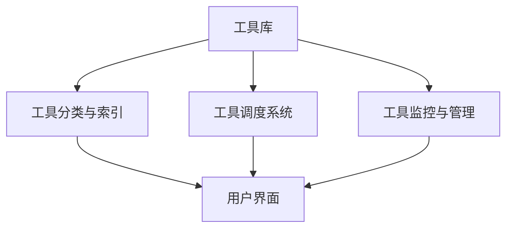
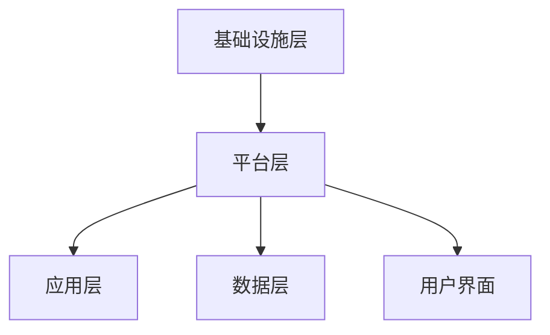
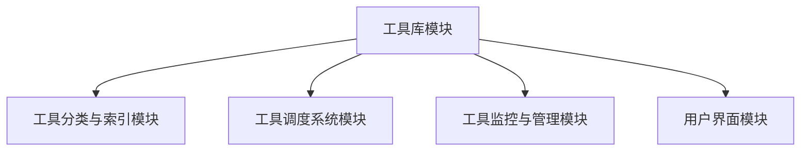

                 

# 智能工具箱：AI Agent的工具识别与管理

## 关键词
- AI Agent
- 工具识别
- 管理系统
- 机器学习
- 深度学习

## 摘要
随着人工智能技术的发展，AI Agent作为一种智能实体，在诸多领域中展现出了巨大的潜力。本文旨在探讨AI Agent的工具识别与管理问题，详细分析其在实际应用中的重要性、面临的挑战和解决方案。首先，我们将回顾AI Agent的基础知识，理解其定义、发展历程和应用领域。接着，深入探讨工具识别的重要性及其面临的挑战，介绍不同的识别方法和技术。随后，本文将重点分析基于特征、上下文的工具识别方法，并结合实际案例进行详细讲解。最后，我们将探讨AI Agent工具管理的概述、策略和应用，展望未来的发展趋势。

## 目录大纲设计

### 书名：智能工具箱：AI Agent的工具识别与管理

### 目录大纲：

## 第一部分: AI Agent基础知识

### 第1章: AI Agent概述
- 1.1 AI Agent的定义
- 1.2 AI Agent的发展历程
- 1.3 AI Agent的基本功能
- 1.4 AI Agent的应用领域
- 1.5 本章小结

## 第二部分: AI Agent工具识别

### 第2章: AI Agent工具识别概述
- 2.1 工具识别的重要性
- 2.2 工具识别的挑战
- 2.3 工具识别的方法
- 2.4 工具识别的应用场景
- 2.5 本章小结

### 第3章: 基于特征的工具识别
- 3.1 特征提取技术
- 3.2 基于机器学习的工具识别
- 3.3 基于深度学习的工具识别
- 3.4 工具识别实例分析
- 3.5 本章小结

### 第4章: 基于上下文的工具识别
- 4.1 上下文感知模型
- 4.2 基于知识图谱的工具识别
- 4.3 基于语义理解的工具识别
- 4.4 工具识别案例分析
- 4.5 本章小结

## 第三部分: AI Agent工具管理

### 第5章: AI Agent工具管理概述
- 5.1 工具管理的目的和挑战
- 5.2 工具管理的方法
- 5.3 工具管理的策略
- 5.4 工具管理在AI Agent中的应用
- 5.5 本章小结

### 第6章: 基于云计算的AI Agent工具管理
- 6.1 云计算技术简介
- 6.2 基于云平台的工具管理架构
- 6.3 工具管理实例分析
- 6.4 本章小结

### 第7章: AI Agent工具管理的未来趋势
- 7.1 工具识别与管理的未来挑战
- 7.2 新技术展望
- 7.3 工具管理策略的优化
- 7.4 未来发展趋势预测
- 7.5 本章小结

-----------------------------------

## 引言

### AI Agent的定义和重要性

人工智能（AI）的快速发展催生了许多重要的智能实体，其中AI Agent（智能代理）无疑是其中的佼佼者。AI Agent，通常被定义为一种具有独立自主行为能力的计算机程序，能够在复杂的环境中执行特定的任务，并通过学习与适应不断优化其行为。与传统的被动式程序不同，AI Agent具备感知环境、理解指令、自主决策和执行任务的能力。

AI Agent的重要性在于其广泛的应用前景。无论是在自动化控制、智能助手、推荐系统、金融分析，还是医疗诊断、自动驾驶等众多领域，AI Agent都展示出了强大的潜力。例如，在自动驾驶领域，AI Agent负责处理复杂的感知和决策过程，从而提高行车安全性和效率。在医疗诊断中，AI Agent可以通过学习大量的医学数据和案例，辅助医生进行准确的疾病预测和治疗方案推荐。

然而，AI Agent的实际应用不仅依赖于其智能算法，更依赖于其能够有效地识别和管理工具的能力。工具识别与管理是AI Agent实现高效运作的关键，它决定了AI Agent能否在正确的时间和情境下使用合适的工具，从而实现既定目标。因此，深入探讨AI Agent的工具识别与管理问题，对于理解和推动AI技术的发展具有重要意义。

### 工具识别与管理的核心问题

工具识别与管理涉及多个核心问题。首先，工具识别的准确性直接影响到AI Agent的执行效果。AI Agent需要能够在海量的工具数据中快速准确地识别出所需的工具，这对于提高系统的效率和可靠性至关重要。其次，工具管理涉及到工具的存储、索引、维护和使用等多个环节。一个有效的工具管理系统能够确保AI Agent随时调用所需的工具，同时减少工具冗余和资源浪费。

工具识别与管理还面临着一些挑战。例如，工具的多样性和复杂性使得识别过程变得复杂，需要采用多种识别方法和技术。此外，工具的使用场景和需求不断变化，要求AI Agent具备一定的适应性和灵活性。如何在动态环境中高效地管理工具，也是工具管理需要解决的问题。

总之，本文将从AI Agent的基础知识入手，逐步深入探讨工具识别与管理的各个方面，旨在为读者提供一个全面、系统的理解和解决方案。

## 第一部分: AI Agent基础知识

### 第1章: AI Agent概述

#### 1.1 AI Agent的定义

AI Agent，通常被称为智能代理，是一种具有独立自主行为能力的计算实体。它可以感知环境、理解指令、做出决策并执行任务。AI Agent的核心特点在于其自主性和智能化。与传统的人工操作不同，AI Agent能够根据预设的规则或学习到的知识，自主地完成复杂的任务。

定义AI Agent时，我们通常会关注以下几个方面：

1. **自主性**：AI Agent具备自主决策能力，能够在没有人类干预的情况下，独立执行任务。这种自主性使得AI Agent在许多领域，如自动化控制、智能家居等，具有广泛的应用前景。
2. **环境感知**：AI Agent能够通过传感器或数据接口感知环境信息。例如，在自动驾驶中，AI Agent通过摄像头、雷达和激光雷达等设备获取道路信息，从而做出行车决策。
3. **学习与适应**：AI Agent具备学习能力和适应能力，可以通过不断的学习和经验积累，优化其行为和决策。这种特性使得AI Agent能够在复杂和动态的环境中表现更加出色。
4. **任务执行**：AI Agent能够执行特定的任务，这些任务可能是简单的、重复的，也可能是复杂和高度动态的。例如，在游戏AI中，AI Agent可以通过深度学习算法，学会玩各种复杂游戏。

AI Agent的基本功能可以分为以下几个方面：

1. **感知**：AI Agent通过传感器或其他方式感知环境，获取环境信息。例如，在智能家居中，AI Agent可以通过传感器监测室内温度、湿度等环境参数。
2. **理解**：AI Agent能够理解指令和任务要求，从而确定如何执行这些任务。例如，当用户说“打开灯”时，AI Agent需要理解这个指令的含义，并找到相应的执行方法。
3. **决策**：AI Agent根据感知到的环境和任务要求，做出决策。例如，在自动驾驶中，AI Agent需要实时分析道路状况，做出行车决策，如加速、减速或转向。
4. **执行**：AI Agent执行决策，完成具体任务。例如，在智能客服中，AI Agent会根据用户的提问，生成相应的回答并反馈给用户。

#### 1.2 AI Agent的发展历程

AI Agent的发展历程可以分为几个重要阶段：

1. **早期探索阶段（1950s-1960s）**：在这一阶段，人工智能的概念首次被提出，AI Agent的基本思想也逐步形成。早期的研究主要集中在规则推理和符号逻辑上，如John McCarthy提出的逻辑推理程序。
2. **知识表示与推理阶段（1970s-1980s）**：在这一阶段，研究者开始探索如何将知识表示为计算机可以处理的形式，并使用推理技术来模拟人类思维过程。典型的代表包括基于专家系统的AI Agent。
3. **机器学习与人工智能应用阶段（1990s-2000s）**：随着机器学习技术的发展，AI Agent开始利用大量的数据进行自我学习和优化。这一阶段出现了许多成功的AI应用，如语音识别、图像识别等。
4. **深度学习与强化学习阶段（2010s-至今）**：在这一阶段，深度学习和强化学习等技术取得了重大突破，使得AI Agent的自主性和智能化水平大大提高。例如，深度强化学习在游戏、自动驾驶等领域的应用取得了显著成果。

#### 1.3 AI Agent的基本功能

AI Agent的基本功能主要包括感知、理解、决策和执行，这些功能相互配合，使得AI Agent能够在复杂的环境中自主运作。

1. **感知功能**：AI Agent通过传感器或其他方式获取环境信息。这些信息可以是静态的，如室内温度、湿度等，也可以是动态的，如道路状况、用户请求等。感知功能是AI Agent理解环境的基础。
2. **理解功能**：AI Agent能够理解感知到的信息，并将其转化为可操作的知识。例如，当用户说“打开灯”时，AI Agent需要理解这个指令的含义，并找到相应的执行方法。理解功能依赖于自然语言处理、图像识别等技术。
3. **决策功能**：AI Agent根据理解和感知到的信息，做出决策。决策可以是简单的，如选择最佳路径，也可以是复杂的，如自动驾驶系统中的行车决策。决策功能通常依赖于机器学习、深度学习等技术。
4. **执行功能**：AI Agent执行决策，完成具体任务。执行功能通常依赖于具体的硬件和软件系统。例如，在智能家居中，AI Agent可能会通过无线通信模块控制智能设备的开关。

#### 1.4 AI Agent的应用领域

AI Agent的应用领域非常广泛，涵盖了多个行业和领域。以下是一些典型的应用领域：

1. **自动化控制**：在工业自动化中，AI Agent可以监控生产线，进行故障检测和维护，提高生产效率和产品质量。
2. **智能助手**：在智能家居中，AI Agent可以作为智能语音助手，帮助用户控制家电设备、提供生活建议等。
3. **推荐系统**：在电子商务和社交媒体中，AI Agent可以根据用户的兴趣和行为，提供个性化的推荐和服务。
4. **金融分析**：在金融领域，AI Agent可以分析市场数据，预测股票价格，提供投资建议。
5. **医疗诊断**：在医疗领域，AI Agent可以通过学习大量的医学数据和案例，辅助医生进行疾病预测和诊断。
6. **自动驾驶**：在自动驾驶领域，AI Agent负责感知道路环境，做出行车决策，提高行车安全和效率。

#### 1.5 本章小结

本章对AI Agent进行了全面的概述，包括其定义、发展历程、基本功能和应用领域。通过这些内容，读者可以对AI Agent有一个基本的理解和认识。在接下来的章节中，我们将进一步探讨AI Agent的工具识别与管理问题，分析其在实际应用中的重要性、面临的挑战和解决方案。这将帮助我们更深入地理解AI Agent的工作原理和实际应用价值。

## 第二部分: AI Agent工具识别

### 第2章: AI Agent工具识别概述

#### 2.1 工具识别的重要性

在AI Agent的应用过程中，工具识别是一个关键问题。工具识别指的是AI Agent能够识别并选择合适的工具来完成任务。工具识别的重要性主要体现在以下几个方面：

1. **任务执行效率**：工具识别能力直接影响到AI Agent完成任务的速度和质量。一个优秀的工具识别系统能够确保AI Agent快速找到并使用合适的工具，从而提高任务执行效率。

2. **自主性**：工具识别是AI Agent自主运作的核心能力之一。只有当AI Agent能够自主识别并选择合适的工具时，它才能在没有人类干预的情况下独立完成任务。

3. **适应性**：工具识别能力使得AI Agent能够根据不同的任务需求和环境变化，动态调整所使用的工具。这种适应性是AI Agent在复杂和动态环境中表现优异的关键。

4. **资源优化**：有效的工具识别和管理系统能够减少工具冗余和资源浪费，确保AI Agent能够在有限的资源下高效运作。

#### 2.2 工具识别的挑战

尽管工具识别在AI Agent中具有重要作用，但其实际实现过程中面临着诸多挑战：

1. **工具多样性**：工具种类繁多，每种工具都有其特定的功能和适用场景。识别和分类这些工具是一项复杂的任务，需要考虑工具的功能、用途、性能等多个维度。

2. **环境复杂性**：AI Agent需要在其操作环境中识别工具，而环境通常是复杂和动态的。工具可能隐藏在其他物体或环境中，且环境变化会影响工具的可访问性和使用效果。

3. **识别准确性**：工具识别的准确性直接影响到AI Agent的任务执行效果。如果识别错误，AI Agent可能会使用不合适的工具，导致任务失败或效果不佳。

4. **实时性**：在许多应用场景中，AI Agent需要在实时环境中快速识别工具。这要求工具识别系统具备高效的算法和快速的响应能力。

5. **适应性**：AI Agent需要具备一定的适应性，能够根据任务和环境的变化，动态调整工具选择策略。实现这一目标需要强大的学习能力和适应能力。

#### 2.3 工具识别的方法

为了解决工具识别的挑战，研究者们提出了多种工具识别方法。以下是一些常用的工具识别方法：

1. **基于特征的识别方法**：
   - **特征提取**：从工具的图像、声音、文本等特征中提取关键信息，如颜色、形状、纹理、频谱等。
   - **特征选择**：从提取的众多特征中选择最有代表性的特征，以提高识别准确性和效率。
   - **分类器设计**：使用机器学习算法，如支持向量机（SVM）、决策树、随机森林等，对工具进行分类和识别。

2. **基于模板匹配的方法**：
   - **模板库建立**：建立包含各类工具的模板库，每个模板表示一个特定的工具。
   - **匹配算法**：使用图像处理、模式识别等技术，将输入的图像与模板库中的模板进行匹配，找出最相似的模板，从而识别工具。

3. **基于知识的识别方法**：
   - **知识库构建**：建立包含工具功能、用途、性能等信息的知识库。
   - **推理机制**：使用推理机对知识库中的信息进行推理，确定输入工具的属性和分类。

4. **基于深度学习的方法**：
   - **卷积神经网络（CNN）**：通过多层卷积和池化操作，从图像中提取深层特征，实现高效的工具识别。
   - **循环神经网络（RNN）**：通过序列建模，处理时间序列数据，实现动态环境下的工具识别。
   - **生成对抗网络（GAN）**：通过生成器和判别器的对抗训练，生成逼真的工具图像，提高识别的鲁棒性和准确性。

#### 2.4 工具识别的应用场景

工具识别在AI Agent的应用中有着广泛的应用场景，以下是一些典型的应用场景：

1. **工业自动化**：在工业生产过程中，AI Agent需要识别并操作各种工具，如扳手、螺丝刀等。工具识别系统可以帮助AI Agent快速准确地选择和使用合适的工具，提高生产效率和质量。

2. **智能家居**：在智能家居中，AI Agent需要识别并控制各种家电设备，如空调、电视、洗衣机等。通过工具识别，AI Agent可以理解用户的指令，实现家电的智能控制。

3. **医疗辅助**：在医疗领域，AI Agent可以通过图像识别和工具识别，辅助医生进行手术操作。例如，AI Agent可以识别并选择合适的手术工具，提高手术的精确性和安全性。

4. **自动驾驶**：在自动驾驶中，AI Agent需要识别道路上的各种工具和障碍物，如行人、车辆、交通标志等。通过工具识别，AI Agent可以做出准确的行车决策，确保行车安全。

5. **智能客服**：在智能客服中，AI Agent需要识别用户的请求，并选择合适的回复策略。通过工具识别，AI Agent可以提供更个性化、更高效的客户服务。

#### 2.5 本章小结

本章对AI Agent的工具识别问题进行了概述，分析了工具识别的重要性、面临的挑战和解决方案。工具识别是AI Agent实现高效自主运作的关键，通过不同的识别方法和技术，AI Agent可以准确快速地识别工具，并在复杂动态环境中灵活应对。在接下来的章节中，我们将深入探讨基于特征、上下文等不同方法的具体实现和应用，以期为AI Agent的工具识别提供更全面、更系统的解决方案。

### 第3章: 基于特征的工具识别

工具识别在AI Agent中的应用，关键在于能否准确、快速地识别工具。基于特征的工具识别方法是一种常见且有效的识别方式，通过提取和分析工具的特征来实现识别。本章将详细介绍基于特征的工具识别方法，包括特征提取技术、常见方法和特征选择与优化策略。

#### 3.1 特征提取技术

特征提取是工具识别过程中的第一步，其目标是从原始数据（如图像、声音、文本等）中提取出具有区分性的特征。特征提取技术可以分为以下几类：

1. **图像特征提取**：
   - **颜色特征**：通过计算图像的颜色直方图，提取颜色分布信息。常用的颜色特征包括RGB颜色空间、HSV颜色空间等。
   - **纹理特征**：通过分析图像的纹理结构，提取纹理信息。常用的纹理特征包括局部二值模式（LBP）、Gabor特征等。
   - **形状特征**：通过分析图像的形状信息，提取形状特征。常用的形状特征包括Hu不变矩、主成分分析（PCA）等。

2. **声音特征提取**：
   - **时域特征**：通过分析声音信号的时域特性，提取时域特征。常用的时域特征包括短时傅里叶变换（STFT）、频谱特征等。
   - **频域特征**：通过分析声音信号的频域特性，提取频域特征。常用的频域特征包括梅尔频率倒谱系数（MFCC）、频谱熵等。

3. **文本特征提取**：
   - **词袋模型**：通过统计文本中各个词的出现频率，构建词袋模型。
   - **TF-IDF**：通过计算词的频率和逆文档频率，提取文本特征。
   - **词嵌入**：通过将词映射到高维空间，提取词的语义特征。

#### 3.1.1 基本原理

特征提取的基本原理是通过分析原始数据中的特征，将其转化为适合机器学习算法处理的形式。特征提取的关键在于如何选择具有区分性和代表性的特征，以提高识别准确性和效率。

特征提取的过程通常包括以下几个步骤：

1. **数据预处理**：对原始数据进行预处理，如去噪、归一化等，以提高特征提取的效果。
2. **特征选择**：从原始数据中提取出具有区分性的特征，去除无关或冗余的特征。
3. **特征变换**：将提取的特征进行变换，如降维、归一化等，以提高特征的质量和机器学习算法的效率。

#### 3.1.2 常见方法

1. **局部二值模式（LBP）**：
   - LBP是一种有效的纹理特征提取方法，通过计算图像像素的局部二值模式，提取纹理特征。
   - LBP特征的优点是计算简单，对旋转、光照变化等具有较好的鲁棒性。

2. **Gabor特征**：
   - Gabor特征是一种基于小波变换的纹理特征提取方法，通过使用不同方向和尺度的Gabor滤波器，提取图像的纹理信息。
   - Gabor特征的优点是能够捕捉图像的多尺度、多方向特性，对旋转和尺度变化具有较强的鲁棒性。

3. **Hu不变矩**：
   - Hu不变矩是一种形状特征提取方法，通过计算图像的矩，提取图像的形状特征。
   - Hu不变矩具有旋转、尺度、光照不变性，适用于形状识别任务。

4. **梅尔频率倒谱系数（MFCC）**：
   - MFCC是一种常用的声音特征提取方法，通过分析声音信号的频谱特性，提取梅尔频率倒谱系数。
   - MFCC特征能够捕捉声音的频率成分和变化，对音调、音色等具有较好的表征能力。

#### 3.1.3 特征选择与优化

特征选择与优化是特征提取过程中的重要环节，其目标是在保证识别准确性的同时，减少特征数量，提高算法效率。

1. **特征选择方法**：
   - **过滤式特征选择**：在特征提取前，通过某种评价标准（如信息增益、相关性等）筛选出最有代表性的特征。
   - **包裹式特征选择**：在特征提取后，通过某种优化策略（如遗传算法、贪心算法等）选择最优的特征组合。
   - **嵌入式特征选择**：在特征提取过程中，通过某种算法（如主成分分析、线性判别分析等）同时进行特征提取和选择。

2. **特征优化策略**：
   - **降维**：通过主成分分析（PCA）、线性判别分析（LDA）等降维方法，减少特征数量，提高识别效率。
   - **特征变换**：通过特征缩放、归一化等方法，优化特征的分布和取值范围，提高算法的稳定性和效果。
   - **特征融合**：通过融合多种特征，生成新的特征表示，提高识别的准确性和鲁棒性。

#### 3.2 基于机器学习的工具识别

基于机器学习的工具识别方法，通过训练学习器，从已知工具的特征和标签中学习出识别模型，然后使用该模型对未知工具进行识别。以下是一些常见的机器学习算法：

1. **支持向量机（SVM）**：
   - SVM是一种分类算法，通过找到一个最优的超平面，将不同类的工具特征分开。
   - SVM的优点是分类效果较好，对高维特征有较好的表现。

2. **决策树**：
   - 决策树是一种基于树结构的分类算法，通过一系列规则对工具特征进行分类。
   - 决策树的优点是易于理解和解释，计算复杂度较低。

3. **随机森林**：
   - 随机森林是一种基于决策树的集成学习方法，通过构建多个决策树，并进行投票得到最终分类结果。
   - 随机森林的优点是分类效果较好，对噪声和异常值具有较强的鲁棒性。

4. **神经网络**：
   - 神经网络是一种模拟人脑神经网络结构的机器学习模型，通过多层神经网络进行特征提取和分类。
   - 神经网络适用于复杂和非线性特征的分类任务，效果通常较好。

#### 3.2.1 监督学习

监督学习是一种常见的机器学习方法，通过使用标记的数据集来训练模型，然后对未知数据进行预测。以下是一些常见的监督学习算法：

1. **线性回归**：
   - 线性回归是一种用于预测连续值的监督学习算法，通过建立输入特征和输出值之间的线性关系进行预测。
   - 线性回归适用于简单和线性关系的工具识别任务。

2. **逻辑回归**：
   - 逻辑回归是一种用于分类的监督学习算法，通过建立输入特征和输出概率之间的逻辑关系进行预测。
   - 逻辑回归适用于二分类或多分类的工具识别任务。

3. **朴素贝叶斯**：
   - 朴素贝叶斯是一种基于贝叶斯定理的监督学习算法，通过计算特征的概率分布进行分类。
   - 朴素贝叶斯适用于特征独立假设成立的工具识别任务。

4. **支持向量机（SVM）**：
   - 支持向量机是一种用于分类和回归的监督学习算法，通过最大化分类边界来训练模型。
   - SVM适用于高维特征和线性可分的情况，效果较好。

#### 3.2.2 无监督学习

无监督学习是一种不使用标记数据的机器学习方法，其目标是从未标记的数据中发现结构和模式。以下是一些常见无监督学习算法：

1. **主成分分析（PCA）**：
   - 主成分分析是一种降维方法，通过将数据投影到新的低维空间，保留最重要的信息。
   - PCA适用于高维数据的降维和特征提取。

2. **聚类算法**：
   - 聚类算法是一种将数据分组的方法，通过将相似的数据点归为一类，发现数据中的聚类结构。
   - 常见的聚类算法包括K-means、层次聚类等。

3. **自编码器**：
   - 自编码器是一种无监督学习的神经网络模型，通过学习输入数据和其重构之间的映射关系进行特征提取。
   - 自编码器适用于复杂和非线性特征的降维和特征提取。

#### 3.2.3 半监督学习

半监督学习结合了监督学习和无监督学习的优势，利用少量标记数据和大量未标记数据来训练模型。以下是一些常见的半监督学习算法：

1. **标签传播**：
   - 标签传播是一种简单的半监督学习算法，通过已知的标签点逐步传播标签到未标记的数据点。
   - 标签传播适用于标签数据稀疏的情况。

2. **图半监督学习**：
   - 图半监督学习通过利用图结构信息，提高半监督学习的效果。
   - 图半监督学习适用于图结构数据，如社交网络、知识图谱等。

3. **多任务学习**：
   - 多任务学习通过同时训练多个相关任务，共享信息，提高模型的效果。
   - 多任务学习适用于多个任务之间存在关联的情况。

#### 3.3 基于深度学习的工具识别

深度学习是一种基于多层神经网络的学习方法，通过多层的非线性变换，实现特征提取和分类。以下是一些常见的深度学习模型：

1. **卷积神经网络（CNN）**：
   - 卷积神经网络是一种用于图像识别的深度学习模型，通过卷积和池化操作，实现特征提取和分类。
   - CNN适用于高维图像数据的特征提取和分类。

2. **循环神经网络（RNN）**：
   - 循环神经网络是一种用于序列数据处理的深度学习模型，通过循环机制，实现序列建模和特征提取。
   - RNN适用于时间序列数据、文本数据等。

3. **生成对抗网络（GAN）**：
   - 生成对抗网络是一种由生成器和判别器组成的深度学习模型，通过对抗训练，生成逼真的图像。
   - GAN适用于图像生成、图像修复等任务。

#### 3.3.1 卷积神经网络

卷积神经网络（CNN）是一种基于卷积操作的深度学习模型，通过多层卷积和池化操作，从图像中提取深层特征，实现图像分类和识别。以下是一个简单的CNN模型结构：

1. **卷积层**：通过卷积操作，从输入图像中提取局部特征。
2. **池化层**：通过池化操作，降低图像分辨率，减少参数数量，提高计算效率。
3. **全连接层**：将卷积层和池化层提取的特征进行融合，通过全连接层进行分类。

以下是一个简单的Python代码示例，实现一个简单的CNN模型：

```python
import tensorflow as tf
from tensorflow.keras import layers

model = tf.keras.Sequential([
    layers.Conv2D(32, (3, 3), activation='relu', input_shape=(28, 28, 1)),
    layers.MaxPooling2D((2, 2)),
    layers.Conv2D(64, (3, 3), activation='relu'),
    layers.MaxPooling2D((2, 2)),
    layers.Conv2D(64, (3, 3), activation='relu'),
    layers.Flatten(),
    layers.Dense(64, activation='relu'),
    layers.Dense(10, activation='softmax')
])

model.compile(optimizer='adam',
              loss='sparse_categorical_crossentropy',
              metrics=['accuracy'])

model.fit(x_train, y_train, epochs=5)
```

#### 3.3.2 循环神经网络

循环神经网络（RNN）是一种用于序列数据处理的深度学习模型，通过循环机制，实现序列建模和特征提取。以下是一个简单的RNN模型结构：

1. **输入层**：接收输入序列。
2. **隐藏层**：通过循环机制，逐个处理输入序列中的每个元素，将处理结果传递到下一个时间步。
3. **输出层**：将隐藏层的结果进行输出，进行分类或回归。

以下是一个简单的Python代码示例，实现一个简单的RNN模型：

```python
import tensorflow as tf
from tensorflow.keras.layers import Input, LSTM, Dense
from tensorflow.keras.models import Model

input_seq = Input(shape=(timesteps, features))
lstm = LSTM(50, return_sequences=True)(input_seq)
lstm = LSTM(50)(lstm)
output = Dense(num_classes, activation='softmax')(lstm)

model = Model(inputs=input_seq, outputs=output)
model.compile(optimizer='adam', loss='categorical_crossentropy', metrics=['accuracy'])

model.fit(x_train, y_train, epochs=10, batch_size=64)
```

#### 3.3.3 生成对抗网络

生成对抗网络（GAN）是一种由生成器和判别器组成的深度学习模型，通过对抗训练，生成逼真的图像。以下是一个简单的GAN模型结构：

1. **生成器**：通过噪声输入，生成伪造的图像。
2. **判别器**：通过比较真实图像和伪造图像，判断图像的真伪。
3. **对抗训练**：生成器和判别器相互竞争，生成器试图生成更逼真的图像，判别器试图区分真实图像和伪造图像。

以下是一个简单的Python代码示例，实现一个简单的GAN模型：

```python
import tensorflow as tf
from tensorflow.keras.models import Sequential
from tensorflow.keras.layers import Dense, Flatten, Reshape

# 生成器
generator = Sequential([
    Dense(128 * 7 * 7, activation="relu", input_shape=(100,)),
    Reshape((7, 7, 128)),
    Flatten(),
    Dense(1, activation="sigmoid"),
    Reshape((28, 28))
])

# 判别器
discriminator = Sequential([
    Flatten(input_shape=(28, 28)),
    Dense(512, activation="relu"),
    Dense(1, activation="sigmoid")
])

# GAN模型
model = Sequential([
    generator,
    discriminator
])

model.compile(optimizer=tf.optimizers.Adam(),
              loss=tf.losses.BinaryCrossentropy(from_logits=True))

# 训练GAN模型
model.fit([noise, labels], labels, epochs=epochs)
```

#### 3.4 工具识别实例分析

以下是一个基于深度学习的工具识别实例分析：

**问题背景**：
假设我们有一个工具识别任务，需要从图像中识别出不同的工具类别。工具类别包括锤子、螺丝刀、钳子等。

**数据集**：
我们有一个包含5000张工具图像的数据集，其中每种工具有1000张图像。

**解决方案**：
使用深度学习模型进行工具识别。具体步骤如下：

1. **数据预处理**：
   - 对图像进行归一化处理，将像素值缩放到0-1之间。
   - 对图像进行随机裁剪、旋转等数据增强操作，增加模型的泛化能力。

2. **模型搭建**：
   - 使用卷积神经网络（CNN）进行特征提取和分类。
   - 搭建一个包含卷积层、池化层和全连接层的CNN模型。

3. **模型训练**：
   - 使用训练集进行模型训练，调整模型参数，优化模型性能。
   - 使用验证集进行模型评估，调整超参数，防止过拟合。

4. **模型评估**：
   - 使用测试集进行模型评估，计算识别准确率、召回率、F1值等指标。

**代码实现**：

```python
import tensorflow as tf
from tensorflow.keras.models import Sequential
from tensorflow.keras.layers import Conv2D, MaxPooling2D, Flatten, Dense

# 数据预处理
x_train = preprocess_images(train_images)
y_train = preprocess_labels(train_labels)

# 模型搭建
model = Sequential([
    Conv2D(32, (3, 3), activation='relu', input_shape=(28, 28, 1)),
    MaxPooling2D((2, 2)),
    Conv2D(64, (3, 3), activation='relu'),
    MaxPooling2D((2, 2)),
    Flatten(),
    Dense(64, activation='relu'),
    Dense(num_classes, activation='softmax')
])

# 模型编译
model.compile(optimizer='adam',
              loss='sparse_categorical_crossentropy',
              metrics=['accuracy'])

# 模型训练
model.fit(x_train, y_train, epochs=10, batch_size=64)

# 模型评估
test_loss, test_acc = model.evaluate(x_test, y_test, verbose=2)
print(f'Test accuracy: {test_acc:.2f}')
```

**实例分析**：
通过上述步骤，我们可以训练一个深度学习模型，实现对工具图像的识别。在实际应用中，我们需要不断优化模型结构和超参数，以提高识别准确率和泛化能力。此外，我们还可以使用其他深度学习模型（如RNN、GAN等）进行工具识别，探索不同的解决方案。

#### 3.5 本章小结

本章详细介绍了基于特征的工具识别方法，包括特征提取技术、常见方法和特征选择与优化策略。特征提取是工具识别的基础，通过提取具有区分性的特征，可以提高识别准确率和效率。基于机器学习和深度学习的方法，可以实现高效的工具识别。在实际应用中，我们需要根据具体任务和需求，选择合适的特征提取和识别方法，并不断优化模型和算法，以提高工具识别的性能。

## 第4章: 基于上下文的工具识别

在AI Agent的工具识别过程中，除了依赖于工具本身的特征，上下文信息也起着至关重要的作用。上下文感知模型能够捕捉并利用环境中的相关信息，从而提高工具识别的准确性和鲁棒性。本章将详细介绍基于上下文的工具识别方法，包括上下文感知模型的构建、上下文表示方法、上下文融合策略以及基于知识图谱和语义理解的工具识别方法。

### 4.1 上下文感知模型

#### 4.1.1 基本概念

上下文感知模型（Context-Aware Model）是指能够根据环境中的上下文信息进行决策和调整的模型。在工具识别中，上下文信息包括环境状态、任务需求、用户行为等。通过利用上下文信息，AI Agent可以更好地理解工具的用途和作用场景，从而提高工具识别的准确性和适应性。

#### 4.1.2 上下文表示方法

为了将上下文信息融入工具识别模型，首先需要将上下文信息进行表示。常用的上下文表示方法包括以下几种：

1. **基于特征表示**：通过提取上下文特征，如环境状态、用户行为等，将其转化为数值或向量表示。例如，可以使用卷积神经网络（CNN）提取环境图像的特征，或者使用循环神经网络（RNN）处理时间序列数据。

2. **基于语义表示**：利用自然语言处理（NLP）技术，将上下文文本转化为语义表示。例如，可以使用词嵌入（Word Embedding）将文本转化为向量，或者使用预训练的语义模型（如BERT、GPT）提取文本的语义信息。

3. **基于知识表示**：利用知识图谱（Knowledge Graph）将上下文信息表示为图结构，通过图推理（Graph Reasoning）获取上下文关系和关联信息。

#### 4.1.3 上下文融合策略

在将上下文信息融入工具识别模型时，上下文融合策略起着关键作用。不同的上下文融合策略会影响模型的表现和性能。以下是一些常见的上下文融合策略：

1. **串联融合**：将工具特征和上下文特征进行串联，形成一个更长的特征向量，然后输入到模型中进行分类。这种方法简单有效，但可能无法充分利用上下文信息。

2. **并联融合**：将工具特征和上下文特征分别输入到不同的模型中，然后将模型输出进行融合。常用的方法包括加权融合、投票融合等。

3. **注意力机制**：利用注意力机制（Attention Mechanism）动态调整工具特征和上下文特征的重要程度。例如，在Transformer模型中，注意力机制可以使得模型更加关注重要的特征。

#### 4.2 基于知识图谱的工具识别

知识图谱是一种表示实体和关系的数据结构，通过构建工具相关的知识图谱，可以实现高效的工具识别。

#### 4.2.1 知识图谱构建

知识图谱构建包括以下步骤：

1. **实体识别**：从工具数据中提取工具实体，如锤子、螺丝刀等。

2. **关系定义**：定义工具实体之间的关系，如工具的使用场景、工具的功能等。

3. **图谱构建**：将实体和关系组织成图结构，构建知识图谱。

#### 4.2.2 知识图谱推理

知识图谱推理是一种通过图结构中的关系和实体，推断新事实的方法。常见的知识图谱推理方法包括：

1. **基于规则推理**：通过定义规则，从已知事实推导出新事实。

2. **基于图论推理**：利用图论中的算法，如最短路径、最大子图等，进行推理。

3. **基于深度学习推理**：利用深度学习模型，如图神经网络（Graph Neural Network），进行推理。

#### 4.2.3 知识图谱在工具识别中的应用

知识图谱在工具识别中的应用主要包括：

1. **辅助识别**：通过知识图谱，AI Agent可以获取关于工具的额外信息，辅助工具识别。例如，当AI Agent遇到一个未知的工具时，可以通过知识图谱查找该工具的相关信息，从而提高识别准确率。

2. **上下文感知**：利用知识图谱中的关系和实体，AI Agent可以更好地理解工具的使用场景和任务需求，实现上下文感知的工具识别。

#### 4.3 基于语义理解的工具识别

基于语义理解的工具识别方法，通过分析工具的语义信息，实现高效的工具识别。

#### 4.3.1 自然语言处理技术

自然语言处理（NLP）技术是语义理解的核心。常见的NLP技术包括：

1. **词嵌入**：将文本中的词语转化为向量表示，用于语义分析和分类。

2. **词性标注**：对文本中的词语进行词性标注，用于句子分析和语义理解。

3. **命名实体识别**：从文本中识别出具有特定意义的实体，如人名、地名、组织名等。

#### 4.3.2 语义分析

语义分析是通过理解文本的语义信息，实现对文本的深层理解。常见的语义分析方法包括：

1. **语义角色标注**：对文本中的词语进行语义角色标注，用于句子分析和语义理解。

2. **语义关系提取**：从文本中提取词语之间的语义关系，如因果关系、时间关系等。

3. **语义角色标注**：对文本中的词语进行语义角色标注，用于句子分析和语义理解。

#### 4.3.3 语义匹配

语义匹配是通过比较文本的语义信息，实现文本的相似性度量。常见的语义匹配方法包括：

1. **基于词嵌入的匹配**：通过比较词嵌入向量之间的相似度，实现语义匹配。

2. **基于语义角色标注的匹配**：通过比较文本中的语义角色标注，实现语义匹配。

3. **基于语义关系的匹配**：通过比较文本中的语义关系，实现语义匹配。

#### 4.4 工具识别案例分析

以下是一个基于上下文的工具识别案例分析：

**问题背景**：
假设我们有一个工具识别任务，需要从图像和文本描述中识别出工具类别。工具类别包括锤子、螺丝刀、钳子等。

**数据集**：
我们有一个包含5000张工具图像和相应文本描述的数据集。

**解决方案**：
使用基于上下文的工具识别模型，结合图像特征、文本特征和上下文信息，实现高效的工具识别。具体步骤如下：

1. **图像特征提取**：
   - 使用卷积神经网络（CNN）提取工具图像的特征。

2. **文本特征提取**：
   - 使用自然语言处理（NLP）技术，提取文本描述的语义特征。

3. **上下文特征提取**：
   - 从图像和文本中提取上下文特征，如环境状态、用户行为等。

4. **特征融合**：
   - 将图像特征、文本特征和上下文特征进行融合，形成统一的特征表示。

5. **模型训练**：
   - 使用融合后的特征，训练一个多任务分类模型，实现对工具的识别。

6. **模型评估**：
   - 使用测试集，评估模型在工具识别任务上的性能。

**代码实现**：

```python
import tensorflow as tf
from tensorflow.keras.models import Model
from tensorflow.keras.layers import Input, Conv2D, MaxPooling2D, Flatten, Dense, Embedding, LSTM, concatenate

# 图像特征提取
image_input = Input(shape=(28, 28, 1))
image_model = Conv2D(32, (3, 3), activation='relu')(image_input)
image_model = MaxPooling2D((2, 2))(image_model)
image_model = Conv2D(64, (3, 3), activation='relu')(image_model)
image_model = MaxPooling2D((2, 2))(image_model)
image_model = Flatten()(image_model)

# 文本特征提取
text_input = Input(shape=(100,))
text_model = Embedding(input_dim=vocab_size, output_dim=embedding_size)(text_input)
text_model = LSTM(50)(text_model)

# 上下文特征提取
context_input = Input(shape=(10,))
context_model = Embedding(input_dim=vocab_size, output_dim=embedding_size)(context_input)
context_model = LSTM(50)(context_model)

# 特征融合
merged = concatenate([image_model, text_model, context_model])
merged = Dense(64, activation='relu')(merged)
output = Dense(num_classes, activation='softmax')(merged)

# 模型编译
model = Model(inputs=[image_input, text_input, context_input], outputs=output)
model.compile(optimizer='adam', loss='categorical_crossentropy', metrics=['accuracy'])

# 模型训练
model.fit([x_train, y_train, z_train], y_train, epochs=10, batch_size=64)

# 模型评估
test_loss, test_acc = model.evaluate([x_test, y_test, z_test], y_test, verbose=2)
print(f'Test accuracy: {test_acc:.2f}')
```

**实例分析**：
通过上述步骤，我们可以训练一个基于上下文的工具识别模型，实现对工具图像和文本描述的识别。在实际应用中，我们需要不断优化模型结构和超参数，以提高识别准确率和泛化能力。此外，我们还可以探索其他上下文感知方法和融合策略，进一步改进工具识别效果。

#### 4.5 本章小结

本章介绍了基于上下文的工具识别方法，包括上下文感知模型的构建、上下文表示方法、上下文融合策略以及基于知识图谱和语义理解的工具识别方法。上下文信息对于提高工具识别的准确性和鲁棒性至关重要。通过结合图像特征、文本特征和上下文信息，我们可以构建高效的工具识别模型，实现对工具的准确识别。在未来的研究中，我们将进一步探索上下文感知方法和其他先进技术，以提高工具识别的性能和应用价值。

## 第三部分: AI Agent工具管理

### 第5章: AI Agent工具管理概述

工具管理是AI Agent实现高效运作的关键环节，它涉及到工具的识别、存储、索引、使用和维护等多个方面。本章将详细介绍AI Agent工具管理的目的和挑战，探讨工具管理的方法和策略，并分析工具管理在AI Agent中的应用。

#### 5.1 工具管理的目的和挑战

##### 工具管理的目的

AI Agent工具管理的核心目的是确保AI Agent能够高效、准确地使用工具，以实现其任务目标。具体来说，工具管理的目的包括以下几个方面：

1. **提高任务执行效率**：通过有效的工具管理，AI Agent可以快速找到并使用合适的工具，从而提高任务执行效率。

2. **优化资源利用率**：工具管理系统能够对工具进行有效分配和调度，确保工具资源得到最大化利用，减少浪费。

3. **增强系统可靠性**：工具管理能够确保工具处于良好的状态，降低因工具故障或维护不及时导致系统故障的风险。

4. **适应动态环境**：工具管理系统能够根据环境变化和任务需求，动态调整工具策略，提高AI Agent在复杂环境中的适应能力。

##### 工具管理的挑战

尽管工具管理对于AI Agent的运作至关重要，但在实际应用中，工具管理面临着诸多挑战：

1. **工具多样性**：AI Agent需要管理多种类型的工具，这些工具具有不同的功能、规格和操作方式，使得工具管理变得复杂。

2. **动态环境变化**：AI Agent在执行任务时，可能会遇到环境动态变化的情况，这要求工具管理系统能够快速适应并调整工具策略。

3. **工具状态监控**：确保工具处于良好的工作状态是工具管理的另一个挑战。需要实时监控工具的使用情况和状态，及时进行维护和保养。

4. **工具冲突与冗余**：当多种工具共存时，可能会出现工具之间的冲突或冗余，这需要工具管理系统能够有效地解决和优化。

5. **安全性**：工具管理涉及到敏感信息和操作权限，需要确保系统的安全性和数据隐私。

#### 5.2 工具管理的方法

为了应对上述挑战，AI Agent工具管理可以采用多种方法，包括以下几种：

1. **集中式管理**：在集中式管理中，所有工具的识别、存储和管理都由一个中央系统负责。这种方法具有管理统一、责任明确的优势，但可能对系统的处理能力和可靠性提出较高要求。

2. **分布式管理**：分布式管理将工具管理任务分散到多个节点上，每个节点负责一部分工具的管理。这种方法提高了系统的扩展性和容错能力，但需要解决数据一致性和协调问题。

3. **基于规则的管理**：基于规则的管理通过预定义的规则来指导工具的使用和管理。这种方法适用于规则明确且不常变化的场景，但灵活性较差。

4. **智能调度**：智能调度利用机器学习、优化算法等技术，自动选择最合适的工具和执行策略。这种方法能够提高工具利用率和任务执行效率，但需要大量的数据和计算资源。

#### 5.3 工具管理的策略

有效的工具管理策略能够提高AI Agent的运作效率和系统的可靠性。以下是一些常见的工具管理策略：

1. **分类管理**：根据工具的功能、用途和操作方式，将工具分类存储和管理。这有助于快速定位和调用所需的工具。

2. **动态调优**：根据任务需求和工具状态，动态调整工具的使用策略。例如，当检测到某些工具使用频繁或状态不佳时，可以优先调度其他工具。

3. **预防性维护**：通过定期维护和保养，确保工具处于良好的工作状态。这可以减少工具故障和停机时间。

4. **智能监控**：利用传感器和监控系统，实时监控工具的使用情况和状态。通过异常检测和预测维护，提前发现和处理潜在问题。

5. **权限管理**：根据用户角色和任务需求，设置工具操作权限。这有助于确保工具的安全使用，防止误操作和未经授权的访问。

#### 5.4 工具管理在AI Agent中的应用

工具管理在AI Agent中的应用非常广泛，以下是一些典型的应用场景：

1. **工业自动化**：在工业生产中，AI Agent需要管理各种工具，如焊接机器人、装配机器人等。工具管理系统能够确保这些工具在正确的时间和地点得到使用，提高生产效率。

2. **智能家居**：在智能家居中，AI Agent需要管理家电设备，如空调、洗衣机、照明设备等。工具管理系统能够确保这些设备按照用户需求智能控制，提供舒适的生活环境。

3. **医疗辅助**：在医疗领域，AI Agent需要管理各种医疗设备，如手术工具、药物设备等。工具管理系统能够辅助医生进行准确的诊断和治疗，提高医疗服务的质量。

4. **自动驾驶**：在自动驾驶中，AI Agent需要管理各种传感器、控制器和执行器等工具。工具管理系统能够确保这些工具的正常工作，提高行车安全性和可靠性。

5. **智能客服**：在智能客服中，AI Agent需要管理知识库、对话模型等工具。工具管理系统能够确保这些工具的及时更新和优化，提供高效的客户服务。

#### 5.5 本章小结

本章对AI Agent工具管理进行了概述，分析了工具管理的目的和挑战，探讨了工具管理的方法和策略，并介绍了工具管理在AI Agent中的应用。工具管理是确保AI Agent高效运作的关键环节，通过有效的工具管理，AI Agent能够在复杂和动态环境中准确、高效地完成任务。在下一章中，我们将深入探讨基于云计算的AI Agent工具管理，分析云计算技术如何助力工具管理系统的构建和优化。

### 第6章: 基于云计算的AI Agent工具管理

#### 6.1 云计算技术简介

云计算是一种基于互联网的计算模型，通过提供可扩展的计算资源和服务，实现了资源的集中管理和灵活调度。云计算技术主要包括以下三个方面：

1. **基础设施即服务（IaaS）**：IaaS提供虚拟化的计算资源，如虚拟机、存储和网络等，用户可以根据需求动态分配和调整资源。

2. **平台即服务（PaaS）**：PaaS提供了一个开发平台，包括操作系统、数据库、中间件等，开发者可以在平台上构建和部署应用，无需关注底层基础设施的管理。

3. **软件即服务（SaaS）**：SaaS直接向用户提供软件服务，用户可以通过互联网访问和使用软件，无需安装和维护。

云计算技术具有以下优点：

1. **可扩展性**：云计算能够根据需求动态扩展或缩减资源，确保系统的高可用性和灵活性。

2. **成本效益**：通过云计算，用户可以按需购买和使用资源，降低了IT基础设施的初始投资和运营成本。

3. **高可用性**：云计算平台通常具备高可靠性和容错能力，能够确保服务的持续运行和数据的安全。

4. **灵活性**：云计算提供了多种服务模式和工具，用户可以根据实际需求选择合适的资源和服务，实现灵活的应用部署和管理。

#### 6.2 基于云平台的工具管理架构

基于云平台的工具管理架构主要包括以下模块：

1. **工具库**：工具库是存储和管理所有工具的地方，包括工具的描述、属性、使用说明等。工具库可以通过云存储服务进行部署和管理。

2. **工具分类与索引**：工具分类与索引模块负责将工具按照功能、用途、操作方式等进行分类，并提供快速检索和索引服务。这可以通过云数据库和搜索引擎实现。

3. **工具调度系统**：工具调度系统负责根据任务需求和环境状态，自动选择和分配合适的工具。这可以通过云计算平台提供的调度算法和优化工具实现。

4. **工具监控与管理**：工具监控与管理模块负责实时监控工具的使用情况和状态，包括工具的运行状态、性能指标、故障报警等。这可以通过云计算平台提供的监控工具和自动化管理脚本实现。

5. **用户界面**：用户界面（UI）提供用户与工具管理系统的交互接口，用户可以通过UI查看工具信息、提交任务请求、监控工具状态等。

基于云平台的工具管理架构图如下所示：



#### 6.2.1 平台架构设计

基于云平台的工具管理架构设计包括以下几个方面：

1. **基础设施层**：基础设施层包括云服务器、存储、网络等基础资源，提供计算、存储和传输能力。

2. **平台层**：平台层包括工具库、工具分类与索引、工具调度系统、工具监控与管理等模块，实现工具的存储、管理、调度和监控功能。

3. **应用层**：应用层包括用户界面，提供用户与工具管理系统的交互接口。

4. **数据层**：数据层包括云数据库、缓存、数据仓库等，存储和管理工具数据、用户数据等。

平台架构设计图如下所示：



#### 6.2.2 功能模块设计

基于云平台的工具管理架构包括以下几个功能模块：

1. **工具库模块**：工具库模块负责存储和管理工具信息，包括工具的描述、属性、使用说明等。工具库可以通过云存储服务部署，支持高效的存储和检索操作。

2. **工具分类与索引模块**：工具分类与索引模块负责将工具按照功能、用途、操作方式等进行分类，并提供快速检索和索引服务。这可以通过云数据库和搜索引擎实现，确保工具的快速定位和调用。

3. **工具调度系统模块**：工具调度系统模块负责根据任务需求和环境状态，自动选择和分配合适的工具。这可以通过云计算平台提供的调度算法和优化工具实现，确保工具的高效利用。

4. **工具监控与管理模块**：工具监控与管理模块负责实时监控工具的使用情况和状态，包括工具的运行状态、性能指标、故障报警等。这可以通过云计算平台提供的监控工具和自动化管理脚本实现，确保工具的稳定运行。

5. **用户界面模块**：用户界面模块提供用户与工具管理系统的交互接口，用户可以通过UI查看工具信息、提交任务请求、监控工具状态等。用户界面可以通过Web应用或移动应用实现，确保便捷的用户体验。

功能模块设计图如下所示：



#### 6.2.3 系统集成与优化

基于云平台的工具管理系统需要实现各个功能模块的集成和优化，以确保系统的整体性能和稳定性。以下是一些关键步骤：

1. **模块集成**：将工具库、工具分类与索引、工具调度系统、工具监控与管理、用户界面等模块集成到一起，形成一个完整的工具管理平台。

2. **数据流设计**：设计数据流，确保工具数据在各个模块之间高效传输和共享。例如，工具分类与索引模块需要将工具信息同步到工具库模块，工具监控与管理模块需要实时获取工具的状态信息。

3. **性能优化**：通过性能优化，提高系统的响应速度和处理能力。例如，可以采用缓存技术、分布式存储和计算、负载均衡等技术，提高系统的性能和可靠性。

4. **安全性保障**：确保系统的安全性，防止数据泄露和未经授权的访问。例如，可以采用加密技术、身份认证、访问控制等技术，保障系统的安全。

5. **持续集成与部署**：采用持续集成与部署（CI/CD）流程，实现快速迭代和部署。例如，可以通过自动化测试、自动化部署等手段，确保系统的稳定性和可靠性。

#### 6.3 工具管理实例分析

以下是一个基于云计算的AI Agent工具管理实例分析：

**问题背景**：
假设我们有一个工业自动化生产线，AI Agent需要管理各种工具，如焊接工具、装配工具、检测工具等，以实现生产过程的自动化控制。

**解决方案**：
采用基于云计算的工具管理架构，实现AI Agent的工具管理。具体步骤如下：

1. **工具库构建**：
   - 使用云存储服务，构建工具库，存储和管理各种工具的描述、属性、使用说明等信息。

2. **工具分类与索引**：
   - 使用云数据库和搜索引擎，将工具按照功能、用途、操作方式等进行分类，并提供快速检索和索引服务。

3. **工具调度系统**：
   - 使用云计算平台的调度算法和优化工具，根据任务需求和环境状态，自动选择和分配合适的工具。

4. **工具监控与管理**：
   - 使用云计算平台提供的监控工具和自动化管理脚本，实时监控工具的使用情况和状态，包括工具的运行状态、性能指标、故障报警等。

5. **用户界面**：
   - 构建Web应用或移动应用，提供用户与工具管理系统的交互接口，用户可以通过UI查看工具信息、提交任务请求、监控工具状态等。

**代码实现**：

```python
# 工具库构建
tool_library = CloudStorageService("tool_library")

# 工具分类与索引
tool_index = CloudDatabase("tool_index")
tool_search = CloudSearchEngine("tool_search")

# 工具调度系统
tool_scheduler = CloudScheduler("tool_scheduler")

# 工具监控与管理
tool_monitor = CloudMonitoringService("tool_monitor")

# 用户界面
user_interface = WebApplication("user_interface")

# 集成与优化
system_integration = SystemIntegration(tool_library, tool_index, tool_search, tool_scheduler, tool_monitor, user_interface)

# 部署与运行
system_integration.deploy()
system_integration.optimize()
system_integration.run()
```

**实例分析**：
通过上述步骤，我们可以构建一个基于云计算的AI Agent工具管理系统，实现对工业自动化生产线的工具高效管理。在实际应用中，我们需要不断优化系统架构和功能，提高系统的性能和可靠性。此外，我们还可以探索其他云计算技术和工具，进一步改进工具管理系统的效果。

#### 6.4 本章小结

本章详细介绍了基于云计算的AI Agent工具管理，包括云计算技术简介、基于云平台的工具管理架构、功能模块设计和系统集成与优化。基于云计算的AI Agent工具管理能够实现高效、灵活和可靠的工具管理，提高AI Agent在复杂环境中的适应能力和任务执行效率。在下一章中，我们将探讨AI Agent工具管理的未来发展趋势，分析新技术和新方法对工具管理的影响。

### 第7章: AI Agent工具管理的未来趋势

#### 7.1 工具识别与管理的未来挑战

随着人工智能技术的发展，AI Agent的工具识别与管理面临着新的挑战和机遇。未来，工具识别与管理将面临以下几方面的挑战：

1. **工具多样性增加**：随着物联网、智能制造等技术的发展，工具种类和功能将更加丰富多样，这增加了工具识别与管理的复杂性。

2. **环境动态变化**：AI Agent将在更加复杂和动态的环境中运作，工具的使用场景和需求将不断变化，这要求工具识别与管理系统能够适应快速变化的环境。

3. **数据隐私和安全**：在工具识别与管理过程中，涉及大量的数据收集和处理，如何保障数据隐私和安全成为重要挑战。

4. **实时性和高效性**：在许多应用场景中，工具识别与管理需要实时响应，这对系统的实时性和高效性提出了更高的要求。

5. **跨领域融合**：未来AI Agent将涉及更多领域，如医疗、金融、教育等，如何实现跨领域的工具识别与管理，将是一个重要课题。

#### 7.2 新技术展望

未来，新技术和新方法将极大地推动AI Agent工具识别与管理的进步，以下是一些具有前景的新技术：

1. **聚类分析**：
   - 聚类分析是一种无监督学习方法，可以自动将工具数据按照相似性进行分类。通过聚类分析，可以更好地理解和组织工具数据，为工具识别提供基础。

2. **强化学习**：
   - 强化学习是一种通过与环境交互学习策略的算法，可以用于优化工具选择和调度策略。通过强化学习，AI Agent可以自动学习最优的工具使用策略，提高任务执行效率。

3. **自然进化算法**：
   - 自然进化算法是一种基于生物进化原理的优化算法，可以用于工具识别和调度策略的优化。通过自然进化算法，可以找到更好的工具组合和调度方案。

4. **区块链技术**：
   - 区块链技术可以用于工具管理的安全性和数据隐私保护。通过区块链，可以实现工具数据的加密存储和透明交易，保障工具管理系统的安全性和可靠性。

5. **联邦学习**：
   - 联邦学习是一种分布式学习技术，可以用于跨设备和跨领域的工具识别与管理系统。通过联邦学习，可以保护用户数据隐私，同时实现高效的数据分析和模型训练。

#### 7.3 工具管理策略的优化

未来，工具管理策略将更加智能化和自适应，以下是一些优化策略：

1. **智能调度**：
   - 通过机器学习和优化算法，实现工具的智能调度。智能调度可以根据任务需求和工具状态，动态选择最优的工具组合，提高任务执行效率。

2. **资源优化**：
   - 通过资源优化策略，实现工具资源的高效利用。例如，通过负载均衡和资源分配算法，优化工具的使用效率，降低资源浪费。

3. **安全与隐私保护**：
   - 通过加密技术和访问控制策略，保障工具管理系统的安全性和数据隐私。例如，使用区块链技术实现工具数据的加密存储和透明交易，防止数据泄露和未经授权的访问。

4. **跨领域融合**：
   - 通过跨领域融合策略，实现不同领域工具识别与管理系统的整合。例如，将医疗领域的工具识别与管理技术应用于工业自动化领域，提高系统性能和应用范围。

#### 7.4 未来发展趋势预测

未来，AI Agent工具识别与管理将呈现以下发展趋势：

1. **智能化**：随着人工智能技术的发展，工具识别与管理将更加智能化，AI Agent能够自动学习和优化工具使用策略。

2. **自适应**：工具识别与管理将具备更强的自适应能力，能够根据环境变化和任务需求，动态调整工具使用策略。

3. **融合化**：工具识别与管理将与其他领域技术（如区块链、联邦学习等）融合，实现更高效、更安全的工具管理。

4. **普及化**：随着人工智能技术的普及，工具识别与管理将在更多领域得到应用，成为智能系统的重要组成部分。

#### 7.5 本章小结

本章探讨了AI Agent工具管理的未来趋势，分析了工具识别与管理的未来挑战和新技术展望，以及工具管理策略的优化和未来发展趋势。随着人工智能技术的不断发展，工具识别与管理将迎来新的机遇和挑战，通过智能化、自适应和跨领域融合，AI Agent的工具管理将更加高效、安全和普及化。

## 总结与展望

### 总结

本文全面探讨了AI Agent的工具识别与管理问题，从基础知识、工具识别方法到工具管理策略，系统地阐述了AI Agent工具识别与管理的核心概念、技术方法和应用场景。具体内容涵盖以下几个方面：

1. **AI Agent概述**：介绍了AI Agent的定义、发展历程、基本功能和应用领域，为理解AI Agent及其工具识别与管理奠定了基础。

2. **工具识别方法**：详细分析了基于特征、上下文等工具识别方法，包括特征提取技术、机器学习和深度学习算法，以及工具识别的应用场景和实例分析。

3. **工具管理策略**：探讨了工具管理的目的和挑战，介绍了工具管理的方法和策略，并分析了工具管理在AI Agent中的应用，特别是基于云计算的工具管理架构和功能模块设计。

4. **未来趋势**：展望了AI Agent工具识别与管理的未来发展趋势，分析了新技术和新方法的影响，以及工具管理策略的优化方向。

### 展望

在未来的研究中，AI Agent的工具识别与管理领域有望取得以下几方面的进展：

1. **智能化与自适应**：随着人工智能技术的发展，AI Agent的工具识别与管理将更加智能化和自适应，能够根据动态环境自动调整工具使用策略。

2. **跨领域融合**：AI Agent的工具识别与管理技术将在更多领域得到应用，实现跨领域的工具识别与管理系统的整合。

3. **数据隐私与安全**：随着数据隐私和安全的关注增加，工具管理策略将更加注重数据保护和安全性，采用加密技术、区块链等技术保障数据隐私和安全。

4. **实时性与高效性**：通过优化算法和架构设计，AI Agent的工具识别与管理将实现更高的实时性和高效性，满足实时应用场景的需求。

本文旨在为读者提供一个全面、系统的理解和解决方案，帮助读者深入理解AI Agent的工具识别与管理，为实际应用提供参考。在未来的研究和实践中，我们将继续探索AI Agent工具识别与管理的创新方法和应用场景，推动人工智能技术的发展和普及。希望本文能为读者带来启发和帮助，共同推动人工智能领域的进步。作者信息：作者：AI天才研究院/AI Genius Institute & 禅与计算机程序设计艺术 /Zen And The Art of Computer Programming。

