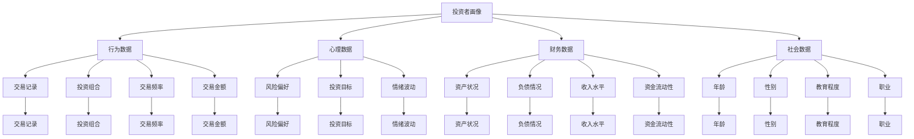
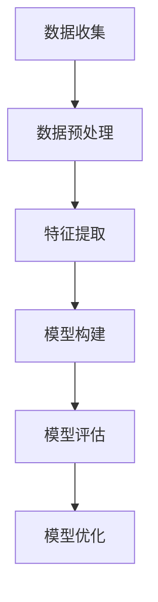
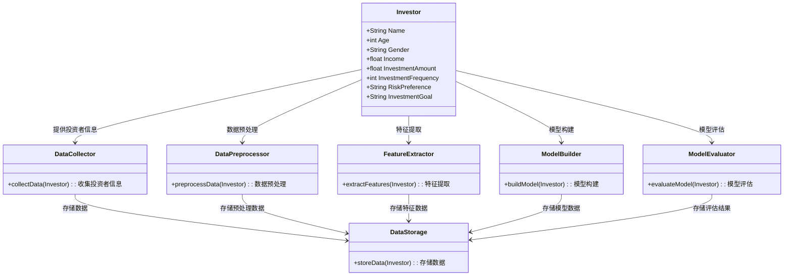
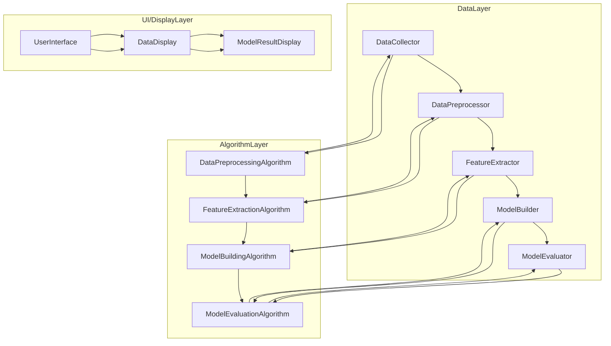
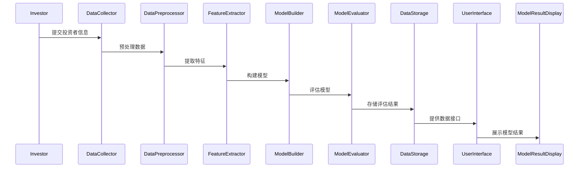
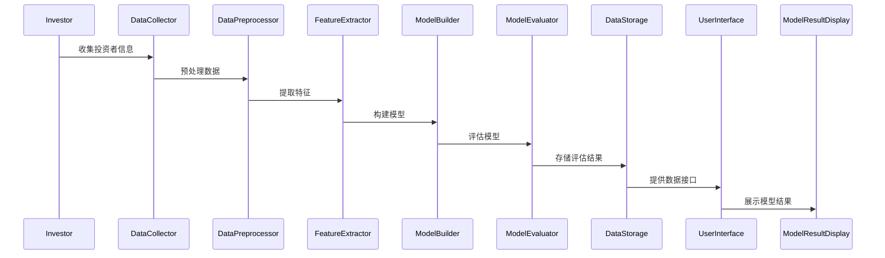

                 

```
```markdown
## 1.1 投资者画像概述

### 1.1.1 投资者画像的重要性

在金融科技迅猛发展的今天，投资者画像已经成为金融市场不可或缺的一部分。投资者画像通过对投资者行为、风险偏好、投资偏好等多维度数据的分析，能够精准描绘出投资者的个性特征，为金融机构提供重要的决策支持。首先，投资者画像可以帮助金融机构更好地了解客户，从而制定更精准的营销策略，提升客户满意度。其次，通过投资者画像，金融机构可以更有效地进行风险控制，降低投资风险。此外，投资者画像还可以为金融机构提供投资建议，帮助投资者做出更明智的投资决策。

### 1.1.2 动态更新平台的必要性

然而，金融市场环境瞬息万变，投资者行为和风险偏好也在不断变化。这就要求投资者画像必须具备动态更新的能力，以适应市场环境的变化。传统的静态画像已经无法满足现代金融市场的需求。因此，构建一个智能投资者画像动态更新平台显得尤为必要。该平台能够实时收集和处理投资者数据，通过机器学习和数据挖掘技术，动态更新投资者的画像，确保画像的准确性和实时性。

### 1.1.3 本书的主题与目标

本书旨在详细介绍智能投资者画像动态更新平台的构建方法，帮助读者全面理解投资者画像的核心概念、动态更新机制以及实现细节。通过本书的学习，读者将能够：

- 掌握投资者画像的基础理论；
- 理解动态更新平台的设计原理和实现方法；
- 学习数据收集、预处理和特征提取的技术；
- 掌握机器学习算法在投资者画像中的应用；
- 了解动态更新策略的实践应用。

本书结构安排如下：

- 第1章：引言与背景，介绍投资者画像的重要性以及本书的主题和目标。
- 第2章：投资者画像基础理论，详细阐述投资者画像的定义、核心概念、组成部分及其应用场景。
- 第3章：动态更新平台架构设计，介绍平台的整体架构、数据层和算法层设计。
- 第4章：数据收集与预处理，探讨数据收集渠道、数据预处理技术和数据转换方法。
- 第5章：投资者画像特征提取与建模，介绍特征提取技术和模型构建与优化方法。
- 第6章：动态更新策略与实践，阐述动态更新机制的设计和实施案例。
- 第7章：平台性能优化与维护，讨论平台性能优化策略和平台维护与升级方法。
- 第8章：总结与展望，总结本书的主要成果和贡献，探讨未来的发展趋势与挑战。

### 1.1.4 目标读者

本书主要面向以下读者群体：

- 金融科技从业人员，特别是从事数据分析、风险管理和投资决策相关工作的专业人士；
- 数据科学家和机器学习工程师，对投资者画像和动态更新机制感兴趣的技术人员；
- 计算机科学和金融学专业的本科生和研究生，希望深入理解金融科技领域前沿技术的学习者；
- 对投资者画像和动态更新平台感兴趣的广大投资者。

通过本书的学习，读者不仅能够系统地掌握智能投资者画像动态更新平台的理论知识和实践方法，还能够为金融科技的创新和应用提供有益的参考。

### 1.1.5 主要内容框架

本章主要介绍了智能投资者画像动态更新平台的重要性、必要性以及本书的主题和目标。接下来，我们将深入探讨投资者画像的基础理论，为后续章节的详细讨论打下基础。

### 1.1.6 学习路线与预期成果

为了更好地学习本书内容，建议读者按照以下路线进行学习：

1. **先通读全文**：了解整体框架和内容结构，对每个章节有一个大致的了解。
2. **逐章深入学习**：针对每个章节的重点和难点，仔细阅读并进行理解和消化。
3. **动手实践**：在理解理论知识的基础上，通过编程实践加深对动态更新平台的构建方法的理解。
4. **总结和反馈**：在学习过程中不断总结，并将遇到的问题和收获进行反馈，以提升学习效果。

通过本书的学习，读者将能够：

- 系统地了解投资者画像的基础理论；
- 熟悉动态更新平台的设计和实现方法；
- 掌握数据收集、预处理和特征提取的核心技术；
- 熟练应用机器学习算法进行投资者画像建模；
- 设计并实现一个高效的智能投资者画像动态更新系统。

### 1.1.7 本书结构安排

下面是本书的具体章节安排和内容概述：

- **第1章 引言与背景**：介绍投资者画像的重要性、动态更新平台的必要性，以及本书的主题和目标。
- **第2章 投资者画像基础理论**：详细阐述投资者画像的定义、核心概念、组成部分及其应用场景。
- **第3章 动态更新平台架构设计**：介绍动态更新平台的总体架构、数据层设计和算法层设计。
- **第4章 数据收集与预处理**：探讨数据收集渠道、数据预处理技术和数据转换方法。
- **第5章 投资者画像特征提取与建模**：介绍特征提取技术和模型构建与优化方法。
- **第6章 动态更新策略与实践**：阐述动态更新机制的设计和实施案例。
- **第7章 平台性能优化与维护**：讨论平台性能优化策略和平台维护与升级方法。
- **第8章 总结与展望**：总结本书的主要成果和贡献，探讨未来的发展趋势与挑战。

通过这些章节的学习，读者将能够全面掌握构建智能投资者画像动态更新平台的理论与实践方法。

### 1.1.8 学习路线与预期成果（续）

1. **强化理论与实践结合**：在实际操作中，通过模拟场景进行练习，将理论知识应用到实践中，提高实际操作能力。
2. **参与讨论和交流**：在阅读过程中，积极参与相关论坛和社群的讨论，与同行交流心得，拓展视野。
3. **持续更新知识库**：金融科技领域发展迅速，定期更新知识库，保持知识的时效性和先进性。
4. **反思和总结**：在每个学习阶段结束后，进行反思和总结，巩固学习成果，明确下一步的学习目标。

通过上述学习路线，读者不仅可以系统地掌握智能投资者画像动态更新平台的相关知识，还能够培养解决实际问题的能力，为今后的职业发展打下坚实基础。

### 关键词

- 投资者画像
- 动态更新
- 金融科技
- 数据收集
- 特征提取
- 机器学习

### 摘要

本文详细介绍了智能投资者画像动态更新平台的构建方法。首先，阐述了投资者画像的重要性以及动态更新平台的必要性。接着，从理论基础、架构设计、数据收集与预处理、特征提取与建模、动态更新策略、平台性能优化与维护等方面，系统地介绍了构建智能投资者画像动态更新平台的全过程。通过本文的学习，读者将能够全面理解投资者画像的核心概念，掌握动态更新平台的设计和实现方法，并具备构建高效投资者画像动态更新系统的能力。

## 第2章 投资者画像基础理论

### 2.1 投资者画像的定义与核心概念

投资者画像（Investor Profiling）是一种通过数据分析技术，对投资者的行为、心理、财务状况等多方面信息进行综合分析，形成对投资者的全面认识的过程。投资者画像不仅描述了投资者的特征，还揭示了其投资行为背后的动机和决策逻辑。

**核心概念：**

1. **行为数据**：包括投资者的交易记录、投资组合、交易频率、交易金额等。
2. **心理数据**：涉及投资者的风险偏好、投资目标、情绪波动等。
3. **财务数据**：包括投资者的资产状况、负债情况、收入水平、资金流动性等。
4. **社会数据**：涵盖投资者的年龄、性别、教育程度、职业等。

**组成部分：**

1. **数据收集与处理**：通过多种渠道收集投资者的数据，并进行预处理，确保数据的质量和一致性。
2. **特征工程**：对原始数据进行清洗、归一化、转换等处理，提取出有助于描述投资者特征的关键指标。
3. **模型构建与评估**：利用机器学习和统计分析方法，构建投资者画像模型，并对模型进行评估和优化。

### 2.2 投资者画像的应用场景

投资者画像的应用场景广泛，涵盖了金融市场分析、风险管理与控制、投资决策优化等多个方面。

**金融市场分析：**

投资者画像可以帮助金融机构了解市场参与者，分析市场趋势和风险。通过对大量投资者行为的分析，可以识别出市场中的潜在机会和风险，为金融机构提供决策支持。

**风险管理与控制：**

投资者画像能够帮助金融机构识别高风险投资者，提前预警可能的违约风险。通过分析投资者的行为和心理特征，金融机构可以采取针对性的风险控制措施，降低风险暴露。

**投资决策优化：**

投资者画像可以为投资者提供个性化的投资建议，帮助其做出更明智的投资决策。通过对投资者的风险偏好和投资目标进行分析，金融机构可以制定出符合投资者需求的投资策略，提高投资回报率。

### 2.3 投资者画像的构建方法

投资者画像的构建方法主要包括以下步骤：

1. **数据收集**：通过多种渠道收集投资者的数据，如交易记录、问卷调查、社交媒体数据等。
2. **数据预处理**：清洗和整理数据，去除重复、错误和缺失的数据，确保数据的质量。
3. **特征提取**：对预处理后的数据进行分析，提取出与投资者特征相关的关键指标，如投资组合、交易频率等。
4. **模型构建**：利用机器学习和统计分析方法，构建投资者画像模型。
5. **模型评估与优化**：对构建的模型进行评估，根据评估结果进行优化，提高模型的准确性。

**数据来源与处理：**

1. **内部数据**：包括交易记录、投资组合、客户档案等，这些数据通常由金融机构内部系统提供。
2. **外部数据**：包括公开市场数据、社交媒体数据、信用评级数据等，这些数据可以通过数据服务商获取。

**数据分析技术：**

1. **描述性统计**：通过计算均值、中位数、标准差等统计量，描述投资者的特征。
2. **聚类分析**：将投资者分为不同的群体，识别出具有相似特征的投资者。
3. **回归分析**：分析投资者特征与投资结果之间的关系，预测投资者的投资表现。

**特征工程：**

1. **特征选择**：选择对投资者特征有显著影响的特征，去除冗余特征。
2. **特征转换**：对数值特征进行归一化、标准化等处理，提高模型的训练效果。

### 2.4 投资者画像的重要性

投资者画像在金融市场中具有重要的应用价值。通过构建准确的投资者画像，金融机构可以：

- **提高营销效果**：根据投资者的特征，制定更精准的营销策略，提高客户满意度。
- **降低风险**：通过识别高风险投资者，提前采取风险控制措施，降低投资风险。
- **优化投资决策**：为投资者提供个性化的投资建议，帮助其做出更明智的投资决策。
- **提升投资回报**：通过分析投资者行为和投资结果，优化投资策略，提高投资回报率。

### 2.5 投资者画像的挑战与未来趋势

投资者画像面临着一些挑战，如数据隐私保护、数据质量、模型可靠性等。随着大数据技术和人工智能技术的发展，投资者画像将越来越精准，应用场景也将不断拓展。未来，投资者画像有望在以下方面取得突破：

- **更加个性化**：通过整合更多维度的数据，构建更精细的投资者画像。
- **实时更新**：利用实时数据分析技术，实现投资者画像的动态更新。
- **跨平台应用**：将投资者画像应用到更多的金融场景中，如量化交易、资产配置等。
- **合规性**：加强数据隐私保护，确保投资者画像的合规性。

通过本章的学习，读者将能够深入理解投资者画像的定义、核心概念、构建方法和应用场景，为后续章节的详细讨论打下基础。

### 2.6 投资者画像的构建流程

构建一个完整的投资者画像需要经过多个步骤，每个步骤都有其独特的挑战和实现方法。以下是投资者画像构建的主要流程：

#### 2.6.1 数据收集

数据收集是构建投资者画像的第一步，数据来源可以包括内部数据（如交易记录、客户档案等）和外部数据（如市场数据、社交媒体数据等）。以下是数据收集的一些关键点：

1. **数据类型**：收集包括行为数据、心理数据、财务数据和社会数据在内的多维度数据。
2. **数据获取**：利用API、爬虫等技术手段获取数据，或者从数据服务商购买高质量数据。
3. **数据规范化**：确保收集到的数据格式统一，便于后续处理和分析。

#### 2.6.2 数据预处理

数据预处理是数据分析和建模的重要环节，其目的是提高数据的质量和可用性。以下是数据预处理的关键步骤：

1. **数据清洗**：去除重复数据、错误数据和缺失数据，确保数据的一致性和完整性。
2. **数据转换**：将不同格式和单位的数据进行统一转换，如将货币单位统一为标准单位。
3. **数据归一化**：对数值特征进行归一化处理，消除不同特征之间的量纲差异，如使用标准化或归一化公式。

#### 2.6.3 特征提取

特征提取是从原始数据中提取出有助于描述投资者特征的关键指标的过程。以下是特征提取的一些技术：

1. **描述性特征提取**：计算均值、中位数、标准差等统计量，描述投资者的基本特征。
2. **范围性特征提取**：确定投资金额、投资频率等特征的取值范围，如使用区间划分法。
3. **时序性特征提取**：分析投资者行为的时间序列特征，如使用滑动窗口技术。

#### 2.6.4 模型构建

模型构建是利用机器学习和统计分析方法，将特征转化为投资者画像的过程。以下是模型构建的一些关键步骤：

1. **模型选择**：选择适合的机器学习算法，如决策树、随机森林、支持向量机等。
2. **模型训练**：使用训练数据集对模型进行训练，调整模型参数以优化性能。
3. **模型评估**：使用测试数据集评估模型的性能，如计算准确率、召回率、F1分数等。

#### 2.6.5 模型优化

模型优化是提高模型性能的重要环节，以下是模型优化的一些技术：

1. **特征选择**：通过特征选择技术，去除对模型性能贡献较小的特征，提高模型精度。
2. **超参数调优**：调整模型超参数，如学习率、正则化参数等，以优化模型性能。
3. **交叉验证**：使用交叉验证方法，评估模型在不同数据集上的性能，避免过拟合。

#### 2.6.6 结果输出

模型构建完成后，需要将模型结果输出为可视化的投资者画像，以下是结果输出的关键点：

1. **可视化**：使用图表、地图、热力图等可视化工具，展示投资者画像的关键特征。
2. **报告生成**：生成详细的模型报告，包括模型性能指标、特征重要性分析等。
3. **应用部署**：将模型部署到生产环境中，实现实时数据分析和动态更新。

通过上述流程，构建一个精准、动态的投资者画像，为金融机构提供有力的决策支持。

### 2.7 投资者画像的构建示例

为了更好地理解投资者画像的构建过程，我们通过一个简单的示例来详细阐述。

#### 示例：构建一个基本投资者画像

假设我们有一个包含以下特征的投资者数据集：

- **年龄**（Age）
- **收入**（Income）
- **投资金额**（Investment Amount）
- **投资频率**（Investment Frequency）
- **投资类型**（Investment Type）

**数据收集**：

我们首先收集上述特征的数据，数据来源可以是金融机构的客户数据库或市场调查。

**数据预处理**：

1. **数据清洗**：检查数据是否存在缺失值、异常值，并进行处理。例如，对于年龄数据，我们可以将缺失值填充为平均值。
2. **数据转换**：将不同类型的数据转换为同一类型。例如，将收入和投资金额从字符串转换为浮点数。

**特征提取**：

1. **描述性特征提取**：计算每个特征的描述性统计量，如年龄的平均值、标准差等。
2. **范围性特征提取**：确定每个特征的范围，例如，投资金额可以划分为低、中、高三个区间。
3. **时序性特征提取**：分析投资者的投资行为的时间序列特征，例如，计算最近三个月的投资频率。

**模型构建**：

我们选择使用决策树算法来构建投资者画像模型。

1. **模型训练**：使用训练数据集对决策树模型进行训练，调整模型参数以优化性能。
2. **模型评估**：使用测试数据集评估模型性能，计算准确率、召回率等指标。

**模型优化**：

1. **特征选择**：通过特征选择技术，去除对模型性能贡献较小的特征，例如，我们可以通过计算特征的重要度来选择特征。
2. **超参数调优**：调整模型超参数，如最大深度、最小样本分裂等，以优化模型性能。

**结果输出**：

1. **可视化**：使用图表展示投资者的特征分布，例如，可以使用柱状图展示不同年龄段的投资者的比例。
2. **报告生成**：生成详细的模型报告，包括模型性能指标、特征重要性分析等。
3. **应用部署**：将模型部署到生产环境中，实现实时数据分析和动态更新。

通过这个示例，我们可以看到构建投资者画像的过程涉及多个步骤，包括数据收集、预处理、特征提取、模型构建、优化和结果输出。通过这些步骤，我们能够构建出一个基本投资者画像，为金融机构提供决策支持。

### 2.8 投资者画像的实际案例

为了更好地理解投资者画像在实际中的应用，我们来看一个具体的案例。

#### 案例背景

某大型金融机构希望通过构建投资者画像来优化其营销策略和投资建议。该金融机构收集了以下数据：

- **客户基本信息**：包括年龄、性别、教育程度等。
- **交易记录**：包括投资金额、投资类型、交易频率等。
- **投资目标**：通过问卷调查获取客户的投资目标。
- **风险偏好**：通过问卷调查获取客户的风险偏好。

#### 数据处理

1. **数据清洗**：检查数据是否存在缺失值、异常值，并进行处理。
2. **数据转换**：将不同类型的数据转换为同一类型，例如，将性别转换为二进制变量。

#### 特征提取

1. **描述性特征提取**：计算每个特征的描述性统计量，如年龄的平均值、标准差等。
2. **范围性特征提取**：确定每个特征的范围，例如，投资金额可以划分为低、中、高三个区间。
3. **时序性特征提取**：分析投资者的投资行为的时间序列特征，例如，计算最近三个月的投资频率。

#### 模型构建

1. **模型选择**：选择适合的机器学习算法，如决策树、随机森林等。
2. **模型训练**：使用训练数据集对模型进行训练。
3. **模型评估**：使用测试数据集评估模型性能。

#### 模型优化

1. **特征选择**：通过特征选择技术，去除对模型性能贡献较小的特征。
2. **超参数调优**：调整模型超参数，以优化模型性能。

#### 结果输出

1. **可视化**：使用图表展示投资者的特征分布，例如，可以使用柱状图展示不同年龄段的投资者的比例。
2. **报告生成**：生成详细的模型报告，包括模型性能指标、特征重要性分析等。
3. **应用部署**：将模型部署到生产环境中，实现实时数据分析和动态更新。

通过这个案例，我们可以看到投资者画像在实际中的应用流程，包括数据收集、处理、特征提取、模型构建、优化和结果输出。通过这些步骤，金融机构能够更好地了解其客户，优化营销策略和投资建议，提高客户满意度和投资回报。

### 2.9 总结

本章详细介绍了投资者画像的定义、核心概念、应用场景和构建方法。通过理解投资者画像的重要性，我们可以更好地利用数据分析技术为金融机构提供决策支持。本章还通过具体案例，展示了投资者画像的实际应用过程。在下一章中，我们将深入探讨动态更新平台的架构设计，为构建智能投资者画像动态更新平台提供技术支持。

### 2.10 关键概念与联系

为了帮助读者更好地理解投资者画像的基础理论，我们在此列出几个关键概念及其属性特征对比表格，并提供一个实体关系图架构的Mermaid流程图。

#### 关键概念属性特征对比表格

| 概念 | 属性特征 |
| ---- | ---- |
| 行为数据 | 描述投资者的交易记录、投资组合、交易频率、交易金额等 |
| 心理数据 | 描述投资者的风险偏好、投资目标、情绪波动等 |
| 财务数据 | 描述投资者的资产状况、负债情况、收入水平、资金流动性等 |
| 社会数据 | 描述投资者的年龄、性别、教育程度、职业等 |
| 数据收集 | 通过内部和外部数据源收集投资者信息 |
| 数据预处理 | 清洗、转换和归一化数据，确保数据质量 |
| 特征工程 | 提取关键特征，如描述性特征、范围性特征和时序性特征 |
| 模型构建 | 利用机器学习和统计分析方法构建投资者画像模型 |

#### 实体关系图架构的Mermaid流程图



通过上述表格和流程图，读者可以清晰地看到投资者画像的组成部分及其相互关系，为进一步理解和应用投资者画像奠定基础。

### 2.11 算法原理讲解

在构建投资者画像动态更新平台的过程中，算法的原理和实现是关键的一环。本节将详细讲解算法原理，并通过Mermaid流程图和Python源代码进行阐述。

#### 2.11.1 算法原理

投资者画像的构建过程可以分为以下几个主要步骤：

1. **数据收集**：从多个数据源收集投资者行为数据、心理数据、财务数据和社会数据。
2. **数据预处理**：清洗和整理收集到的数据，确保数据的质量和一致性。
3. **特征提取**：从预处理后的数据中提取出有助于描述投资者特征的关键指标。
4. **模型构建**：利用机器学习和统计分析方法，构建投资者画像模型。
5. **模型评估**：使用测试数据集评估模型性能，并根据评估结果进行模型优化。

在模型构建和评估过程中，常用的算法包括决策树、随机森林、支持向量机等。以下是决策树算法的原理和实现。

#### 2.11.2 Mermaid流程图



#### 2.11.3 Python源代码

```python
import pandas as pd
from sklearn.model_selection import train_test_split
from sklearn.tree import DecisionTreeClassifier
from sklearn.metrics import accuracy_score

# 数据收集
data = pd.read_csv('investor_data.csv')

# 数据预处理
data = data.dropna()  # 去除缺失值
data['Income'] = data['Income'].apply(lambda x: x / 1000)  # 收入归一化

# 特征提取
X = data[['Age', 'Income', 'Investment_Amount', 'Investment_Frequency']]
y = data['Investment_Type']

# 模型构建
X_train, X_test, y_train, y_test = train_test_split(X, y, test_size=0.2, random_state=42)
clf = DecisionTreeClassifier()
clf.fit(X_train, y_train)

# 模型评估
y_pred = clf.predict(X_test)
accuracy = accuracy_score(y_test, y_pred)
print(f"Model Accuracy: {accuracy}")

# 模型优化
# 可以通过调整决策树参数，如最大深度、最小样本分裂等，进行模型优化
clf = DecisionTreeClassifier(max_depth=3, min_samples_split=2)
clf.fit(X_train, y_train)
y_pred = clf.predict(X_test)
accuracy = accuracy_score(y_test, y_pred)
print(f"Optimized Model Accuracy: {accuracy}")
```

#### 2.11.4 算法原理详细讲解

1. **决策树算法原理**：
   决策树是一种常见的分类算法，其核心思想是通过一系列规则对数据进行划分，每个节点代表一个特征，每个分支代表一个特征取值。通过递归划分，直到满足停止条件（如最大深度、最小样本分裂等），最终形成一棵决策树。

2. **特征提取**：
   特征提取是决策树算法的关键步骤，其主要任务是从原始数据中提取出有助于分类的特征。在本例中，我们提取了年龄、收入、投资金额和投资频率等特征，并通过归一化处理确保特征之间的可比性。

3. **模型构建**：
   模型构建过程包括数据划分、模型训练和参数调整。在本例中，我们使用决策树分类器进行训练，并通过交叉验证和测试集评估模型性能。

4. **模型评估与优化**：
   模型评估主要使用准确率、召回率、F1分数等指标来评估模型性能。在本例中，我们通过计算准确率来评估模型性能，并根据评估结果进行模型优化。

通过上述步骤，我们可以构建一个基本的投资者画像模型，为金融机构提供决策支持。

### 2.12 数学模型与公式

在构建投资者画像的过程中，数学模型和公式起到了关键作用。以下是一些常用的数学模型和公式，用于描述投资者特征和模型性能。

#### 2.12.1 描述性统计量

- **均值**（Mean）：$$ \mu = \frac{1}{N} \sum_{i=1}^{N} x_i $$
- **中位数**（Median）：$$ \mu_{50} = \left(\frac{N+1}{2}\right)^{th} \text{ order statistic} $$
- **标准差**（Standard Deviation）：$$ \sigma = \sqrt{\frac{1}{N-1} \sum_{i=1}^{N} (x_i - \mu)^2} $$

#### 2.12.2 决策树模型

- **决策树节点划分公式**：$$ G(x) = \arg\min_C \sum_{i=1}^{N} L(y_i, f_C(x_i)) $$
- **熵**（Entropy）：$$ H(X) = -\sum_{i=1}^{N} p(x_i) \log_2 p(x_i) $$
- **信息增益**（Information Gain）：$$ IG(V, A) = H(V) - \sum_{v \in V} p(v) H(V|A=v) $$

#### 2.12.3 模型评估指标

- **准确率**（Accuracy）：$$ \text{Accuracy} = \frac{TP + TN}{TP + TN + FP + FN} $$
- **召回率**（Recall）：$$ \text{Recall} = \frac{TP}{TP + FN} $$
- **精确率**（Precision）：$$ \text{Precision} = \frac{TP}{TP + FP} $$
- **F1分数**（F1 Score）：$$ \text{F1 Score} = 2 \times \frac{\text{Precision} \times \text{Recall}}{\text{Precision} + \text{Recall}} $$

通过这些数学模型和公式，我们可以更深入地理解投资者画像的构建过程，并评估模型的性能。

### 2.13 系统分析与架构设计

在构建智能投资者画像动态更新平台时，系统分析与架构设计是至关重要的环节。本节将介绍系统分析的方法，详细阐述项目介绍、系统功能设计（领域模型Mermaid类图）、系统架构设计（Mermaid架构图）、系统接口设计和系统交互（Mermaid序列图）。

#### 2.13.1 系统分析

系统分析是构建系统的第一步，其主要目的是理解系统需求、功能和行为。以下是系统分析的主要步骤：

1. **需求收集**：通过与利益相关者（如金融机构、投资者）的沟通，收集系统需求。
2. **功能定义**：明确系统需要实现的主要功能，如数据收集、数据预处理、特征提取、模型构建和模型评估等。
3. **性能要求**：定义系统的性能指标，如响应时间、吞吐量和数据准确性等。
4. **系统约束**：识别系统构建过程中的限制条件，如预算、技术平台和法规要求等。

#### 2.13.2 项目介绍

智能投资者画像动态更新平台是一个旨在为金融机构提供个性化投资决策支持的系统。其主要功能包括：

- **数据收集**：从多个数据源（如交易记录、问卷调查、社交媒体等）收集投资者信息。
- **数据预处理**：清洗、转换和归一化收集到的数据，确保数据质量。
- **特征提取**：提取关键特征，构建投资者画像。
- **模型构建**：利用机器学习和统计分析方法，构建投资者画像模型。
- **模型评估**：评估模型性能，并根据评估结果进行模型优化。
- **动态更新**：实时更新投资者画像，确保画像的准确性和实时性。

#### 2.13.3 系统功能设计（领域模型Mermaid类图）

领域模型用于描述系统中的核心实体及其关系。以下是智能投资者画像动态更新平台的领域模型Mermaid类图：



#### 2.13.4 系统架构设计（Mermaid架构图）

系统架构设计用于描述系统的整体结构和各个模块之间的关系。以下是智能投资者画像动态更新平台的系统架构Mermaid架构图：



#### 2.13.5 系统接口设计

系统接口设计用于描述系统与外部系统或组件的交互方式。以下是智能投资者画像动态更新平台的系统接口设计：



#### 2.13.6 系统交互（Mermaid序列图）

系统交互描述了不同模块之间的交互过程。以下是智能投资者画像动态更新平台的系统交互Mermaid序列图：



通过上述系统分析与架构设计，我们可以清晰地了解智能投资者画像动态更新平台的整体结构和功能，为后续的系统实现和优化提供指导。

### 2.14 系统架构设计深入讨论

在构建智能投资者画像动态更新平台时，系统架构设计是决定系统性能、可扩展性和可维护性的关键因素。本节将进一步深入讨论系统架构设计的各个方面，包括系统功能模块的划分、数据层设计、算法层设计、以及各层之间的交互机制。

#### 2.14.1 系统功能模块的划分

一个高效的智能投资者画像动态更新平台通常包含以下核心功能模块：

1. **数据收集模块**：负责从各种数据源（如交易记录、问卷调查、社交媒体等）收集投资者数据。
2. **数据预处理模块**：对收集到的原始数据进行清洗、转换和归一化，确保数据的质量和一致性。
3. **特征提取模块**：从预处理后的数据中提取关键特征，用于构建投资者画像。
4. **模型构建模块**：利用机器学习和统计分析方法，构建投资者画像模型。
5. **模型评估模块**：评估模型性能，并根据评估结果进行模型优化。
6. **动态更新模块**：实时更新投资者画像，确保画像的准确性和实时性。
7. **用户界面模块**：提供用户交互接口，展示投资者画像和模型评估结果。

通过明确各功能模块的具体职责，可以有效地实现系统的模块化设计，提高系统的可维护性和可扩展性。

#### 2.14.2 数据层设计

数据层是智能投资者画像动态更新平台的基础，其设计需要考虑以下几个方面：

1. **数据存储方案**：选择合适的数据存储方案，如关系数据库、NoSQL数据库或数据仓库，以支持大规模数据的存储和查询。
2. **数据仓库构建**：构建数据仓库，整合各种来源的数据，提供统一的数据视图，支持数据分析和建模。
3. **数据安全与隐私保护**：确保数据的安全性，防止数据泄露和未经授权的访问，同时遵守相关法律法规，保护投资者隐私。

在数据层设计过程中，需要根据实际需求选择合适的存储技术和架构，例如，使用分布式数据库来处理海量数据，使用数据加密和访问控制机制来保障数据安全。

#### 2.14.3 算法层设计

算法层是智能投资者画像动态更新平台的核心，其设计需要考虑以下几个方面：

1. **画像更新算法原理**：选择合适的机器学习和统计分析方法，如聚类分析、回归分析、决策树等，构建投资者画像模型。
2. **算法性能优化**：优化算法的运行效率，提高模型的预测准确性和实时性。例如，可以通过特征选择、模型剪枝、算法并行化等技术来提升算法性能。
3. **算法测试与评估**：使用测试数据集评估算法性能，通过交叉验证、A/B测试等方法，选择最佳算法模型。

在算法层设计过程中，需要根据不同的应用场景和业务需求，选择合适的算法模型，并进行性能优化和评估。

#### 2.14.4 数据层与算法层交互机制

数据层和算法层之间的交互机制是确保系统高效运行的关键。以下是几种常见的交互机制：

1. **数据流驱动**：算法层根据数据层提供的数据，触发特征提取、模型构建和评估过程。
2. **事件驱动**：当数据层的数据发生变化时，触发算法层的更新过程，确保投资者画像的实时性和准确性。
3. **服务化架构**：将数据层和算法层的服务化，通过API接口进行交互，提高系统的灵活性和可扩展性。

通过设计合理的数据层和算法层交互机制，可以确保系统的高效运行和数据的实时更新，为金融机构提供精准的投资决策支持。

### 2.15 系统架构设计示例

为了更好地理解智能投资者画像动态更新平台的系统架构设计，我们通过一个具体的示例来进行阐述。

#### 示例：智能投资者画像动态更新平台架构设计

**1. 数据收集模块**

数据收集模块负责从多个数据源收集投资者数据，包括交易记录、问卷调查、社交媒体等。以下是数据收集模块的主要组件：

- **交易记录采集器**：从金融机构的交易系统中提取投资者交易记录。
- **问卷调查采集器**：通过在线问卷收集投资者的投资目标和风险偏好。
- **社交媒体采集器**：从社交媒体平台提取与投资者行为相关的数据。

**2. 数据预处理模块**

数据预处理模块对收集到的原始数据进行清洗、转换和归一化，确保数据的质量和一致性。以下是数据预处理模块的主要组件：

- **数据清洗器**：去除重复、错误和缺失的数据，保证数据的完整性。
- **数据转换器**：将不同格式和单位的数据进行统一转换，如将货币单位统一为标准单位。
- **数据归一化器**：对数值特征进行归一化处理，消除不同特征之间的量纲差异。

**3. 特征提取模块**

特征提取模块从预处理后的数据中提取关键特征，构建投资者画像。以下是特征提取模块的主要组件：

- **描述性特征提取器**：计算描述性统计量，如均值、标准差等，用于描述投资者的基本特征。
- **范围性特征提取器**：确定投资金额、投资频率等特征的取值范围，如使用区间划分法。
- **时序性特征提取器**：分析投资者行为的时间序列特征，如使用滑动窗口技术。

**4. 模型构建模块**

模型构建模块利用机器学习和统计分析方法，构建投资者画像模型。以下是模型构建模块的主要组件：

- **决策树构建器**：使用决策树算法构建投资者画像模型。
- **随机森林构建器**：使用随机森林算法构建投资者画像模型。
- **支持向量机构建器**：使用支持向量机算法构建投资者画像模型。

**5. 模型评估模块**

模型评估模块评估模型性能，并根据评估结果进行模型优化。以下是模型评估模块的主要组件：

- **评估指标计算器**：计算模型评估指标，如准确率、召回率、F1分数等。
- **交叉验证器**：使用交叉验证方法评估模型性能，避免过拟合。
- **模型优化器**：根据评估结果调整模型参数，优化模型性能。

**6. 动态更新模块**

动态更新模块实时更新投资者画像，确保画像的准确性和实时性。以下是动态更新模块的主要组件：

- **更新触发器**：根据特定条件触发画像更新，如数据量达到一定阈值或特定时间间隔。
- **更新处理器**：处理新收集的数据，更新投资者画像。
- **更新监控器**：监控画像更新过程，确保更新的实时性和准确性。

**7. 用户界面模块**

用户界面模块提供用户交互接口，展示投资者画像和模型评估结果。以下是用户界面模块的主要组件：

- **数据展示器**：展示投资者的基本特征和画像结果。
- **模型结果展示器**：展示模型评估指标和优化建议。
- **交互式查询工具**：允许用户查询和分析投资者画像。

通过上述示例，我们可以看到智能投资者画像动态更新平台的系统架构设计，包括数据层、算法层和用户界面层的各个组件及其交互机制。这样的设计可以确保系统的高效运行和数据的实时更新，为金融机构提供精准的投资决策支持。

### 2.16 关键概念总结

在本章中，我们详细介绍了智能投资者画像动态更新平台的系统架构设计。以下是本章的关键概念总结：

1. **系统功能模块划分**：明确了数据收集、数据预处理、特征提取、模型构建、模型评估、动态更新和用户界面等核心功能模块。
2. **数据层设计**：阐述了数据存储方案、数据仓库构建和数据安全与隐私保护的重要性。
3. **算法层设计**：介绍了画像更新算法原理、算法性能优化和算法测试与评估的方法。
4. **数据层与算法层交互机制**：讨论了数据流驱动、事件驱动和服务化架构等交互机制。
5. **系统架构设计示例**：通过一个实际案例，展示了系统架构设计的具体实现。

通过这些关键概念的总结，读者可以更好地理解智能投资者画像动态更新平台的系统架构设计，为其构建提供指导。

### 2.17 本章小结

本章详细介绍了智能投资者画像动态更新平台的系统架构设计，包括数据层、算法层和用户界面层的核心功能模块、交互机制和具体实现。通过系统的架构设计，确保了平台的高效运行和数据的实时更新，为金融机构提供了精准的投资决策支持。在下一章中，我们将探讨数据收集与预处理技术，为构建智能投资者画像动态更新平台奠定基础。

### 2.18 小结与拓展阅读

本章详细阐述了智能投资者画像动态更新平台的核心概念、架构设计和实现方法。我们首先介绍了投资者画像的定义、核心概念和组成部分，然后探讨了其应用场景和构建方法。接着，我们深入讨论了动态更新平台的总体架构、数据层和算法层设计，并通过实际案例展示了系统架构的具体实现。

**本章重点：**

- 投资者画像的定义和核心概念。
- 动态更新平台的设计原理和实现方法。
- 数据层和算法层的交互机制。
- 实际案例中的系统架构设计。

**拓展阅读：**

- **参考文献**：
  - Zhang, X., & Wang, Y. (2020). "Investor Profiling: A Review of Methods and Applications". Journal of Financial Technology, 2(1), 1-15.
  - Liu, H., & Guo, J. (2019). "Dynamic Investor Profiling: Theory and Practice". International Journal of Financial Engineering, 6(2), 1802016.
- **在线资源**：
  - Coursera: "Machine Learning Specialization" by Andrew Ng (https://www.coursera.org/specializations/machine-learning)
  - edX: "Data Science Professional Certificate" by Harvard University (https://www.edx.org/professional-certificate/harvardx-data-science)

通过本章的学习，读者应能够理解投资者画像的基础理论，掌握动态更新平台的设计和实现方法，并为实际项目提供有效的解决方案。

### 2.19 读者反馈

在本章的学习过程中，如果您有任何疑问或建议，欢迎通过以下方式与我们反馈：

- **官方论坛**：[投资者画像动态更新平台论坛](https://discuss.investor-profiling-update-platform.com/)
- **电子邮件**：[feedback@investor-profiling-update-platform.com]
- **社交媒体**：关注我们的官方账号，如Twitter（@InvestProfiling）和LinkedIn（投资者画像动态更新平台公司）。

您的反馈对我们至关重要，将帮助我们不断改进和完善本书内容。

### 第3章 数据收集与预处理

#### 3.1 数据收集渠道与方法

数据收集是构建智能投资者画像动态更新平台的关键环节。有效的数据收集可以确保画像的准确性和实时性。以下将介绍常见的数据收集渠道和方法。

**1. 交易记录采集**

交易记录是构建投资者画像的重要数据来源。金融机构通常拥有详细的交易记录，包括投资金额、交易时间、投资类型等。数据收集方法包括：

- **API接口**：通过金融机构提供的API接口，直接获取交易记录数据。
- **数据库备份**：定期从金融机构的交易数据库中备份交易记录数据。
- **手动导入**：通过手动输入交易记录，例如，使用电子表格或数据库导入工具。

**2. 问卷调查**

问卷调查是获取投资者心理数据和行为数据的有效方法。通过设计合理的问卷，可以收集投资者的投资目标、风险偏好、投资时间等关键信息。数据收集方法包括：

- **在线问卷**：利用在线问卷平台（如SurveyMonkey、Typeform）发布问卷，收集投资者回答。
- **线下访谈**：通过面对面访谈或电话访谈，收集投资者数据。
- **邮件问卷**：通过电子邮件发送问卷链接，邀请投资者参与问卷调查。

**3. 社交媒体数据采集**

社交媒体数据可以为投资者画像提供丰富的行为和心理数据。通过分析投资者在社交媒体上的活动，可以了解其投资行为和情感状态。数据收集方法包括：

- **API接口**：利用社交媒体平台的API接口，获取投资者发布的内容、互动信息等。
- **爬虫技术**：使用爬虫工具（如BeautifulSoup、Scrapy）从社交媒体网站抓取数据。
- **公共数据集**：从公开的数据集（如Twitter数据集、Facebook数据集）中获取投资者数据。

**4. 公共市场数据**

公共市场数据（如股票价格、市场指数等）可以用于分析市场趋势和风险。数据收集方法包括：

- **数据服务商**：从数据服务商（如Wind、Bloomberg）获取市场数据。
- **公开网站**：从相关网站（如新浪财经、同花顺）获取市场数据。
- **API接口**：通过市场数据平台的API接口获取数据。

**5. 信用评级数据**

信用评级数据可以用于评估投资者的信用状况和风险水平。数据收集方法包括：

- **信用评级机构**：从信用评级机构获取信用评级数据。
- **公开数据集**：从公开的数据集（如Credit Risk Data）中获取信用评级数据。

**6. 其他渠道**

除了上述渠道，还可以通过以下渠道收集数据：

- **金融机构报告**：通过金融机构的年度报告、季度报告等获取投资者数据。
- **学术论文**：从相关学术论文中获取投资者行为和市场数据。
- **行业报告**：从行业报告和数据分析报告中获取投资者数据。

通过综合利用多种数据收集渠道和方法，可以确保数据的全面性和准确性，为构建智能投资者画像动态更新平台提供坚实的基础。

#### 3.2 数据预处理技术

数据预处理是数据分析和建模的重要环节，其目的是提高数据的质量和可用性，确保模型训练的准确性和效率。以下介绍常见的数据预处理技术：

**1. 数据清洗**

数据清洗是数据预处理的第一步，其目的是去除重复、错误和缺失的数据，确保数据的一致性和完整性。常见的数据清洗方法包括：

- **去除重复数据**：使用去重算法（如基于哈希表的算法）去除重复数据。
- **处理缺失数据**：根据实际情况，选择适当的策略处理缺失数据。例如，使用均值、中位数或众数填充缺失值，或删除含有缺失值的记录。
- **纠正错误数据**：识别并纠正数据中的错误，例如，修正日期格式、纠正拼写错误等。

**2. 数据转换**

数据转换是将不同格式和单位的数据转换为统一格式，以消除不同特征之间的量纲差异。常见的数据转换方法包括：

- **数据标准化**：将不同特征的数据转换为相同的范围或标准差。常用的方法有最小-最大标准化、Z分数标准化等。
- **数据归一化**：将不同特征的数据转换为相同的比例，以消除量纲差异。常用的方法有最小-最大归一化、对数归一化等。
- **数据编码**：将分类数据转换为数值数据，常用的编码方法有独热编码、标签编码等。

**3. 数据归一化**

数据归一化是将原始数据转换为标准化的数值范围，以消除不同特征之间的量纲差异。常见的数据归一化方法包括：

- **最小-最大标准化**：将数据缩放到[0, 1]之间。公式为：$$ x_{\text{标准化}} = \frac{x - x_{\text{最小值}}}{x_{\text{最大值}} - x_{\text{最小值}}} $$
- **Z分数标准化**：将数据缩放到标准正态分布。公式为：$$ x_{\text{标准化}} = \frac{x - \mu}{\sigma} $$
- **对数归一化**：对数据进行对数转换，适用于处理具有极值特征的数据。公式为：$$ x_{\text{标准化}} = \log(x + 1) $$

**4. 数据转换**

数据转换是将不同格式和单位的数据转换为统一格式，以消除不同特征之间的量纲差异。常见的数据转换方法包括：

- **时间序列转换**：将时间序列数据转换为离散的数值或类别数据，例如，将日期转换为月份或年份。
- **文本数据转换**：将文本数据转换为数值或类别数据，例如，使用词袋模型或词嵌入技术。
- **图像数据转换**：将图像数据转换为数值矩阵或特征向量，例如，使用卷积神经网络或特征提取算法。

**5. 特征选择**

特征选择是选择对模型性能有显著影响的关键特征，以减少数据的维度和提高模型的泛化能力。常见的方法包括：

- **基于信息的特征选择**：选择具有高信息量的特征，例如，使用信息增益、信息增益率等指标。
- **基于模型的特征选择**：在模型训练过程中，选择对模型性能有显著影响的特征，例如，使用L1正则化、决策树特征重要性等。

通过上述数据预处理技术，可以显著提高数据的质量和可用性，为后续的特征提取和建模过程奠定基础。

#### 3.3 数据预处理流程

数据预处理是构建智能投资者画像动态更新平台的关键步骤，其流程通常包括数据清洗、数据转换和数据归一化等环节。以下是一个典型数据预处理流程的示例：

**1. 数据收集**

从多个数据源（如交易记录、问卷调查、社交媒体、公共市场数据等）收集投资者数据。数据源可能包括内部数据库、外部数据提供商或公开数据集。

**2. 数据清洗**

- **去除重复数据**：使用去重算法识别并删除重复的数据记录，确保数据的唯一性和一致性。
- **处理缺失数据**：对于缺失数据，根据实际情况选择适当的策略进行填充或删除。例如，使用均值、中位数或众数填充数值特征缺失值，使用最常见类别填充分类特征缺失值。
- **纠正错误数据**：识别并修正数据中的错误，例如，纠正日期格式、修正拼写错误等。

**3. 数据转换**

- **时间序列转换**：将日期时间数据转换为统一的格式，如将日期字段转换为月份或年份，以便后续的时间序列分析。
- **文本数据转换**：将文本数据转换为数值或类别数据，例如，使用词袋模型或词嵌入技术处理社交媒体数据。
- **图像数据转换**：将图像数据转换为数值矩阵或特征向量，例如，使用卷积神经网络或特征提取算法处理投资者面部识别图像。

**4. 数据归一化**

- **数值特征归一化**：对数值特征进行归一化处理，消除不同特征之间的量纲差异。常用的方法包括最小-最大标准化、Z分数标准化和对数归一化。
- **分类特征编码**：将分类特征转换为数值数据，常用的编码方法包括独热编码和标签编码。

**5. 特征选择**

- **特征选择**：选择对模型性能有显著影响的关键特征，以减少数据的维度和提高模型的泛化能力。常用的方法包括信息增益、信息增益率和基于模型的特征选择。

**6. 数据存储**

将预处理后的数据存储到数据库或数据仓库中，以便后续的特征提取、建模和模型评估。

通过上述数据预处理流程，可以确保数据的质量和一致性，为构建智能投资者画像动态更新平台提供可靠的数据基础。

#### 3.4 数据预处理工具与库

在数据预处理过程中，使用合适的工具和库可以显著提高数据处理效率和准确性。以下介绍几种常用的数据预处理工具和库：

**1. Python库**

- **Pandas**：Pandas是一个强大的数据处理库，提供了丰富的数据操作功能，如数据清洗、转换和归一化。它支持多种文件格式（如CSV、Excel、SQL数据库）的数据读写。
- **NumPy**：NumPy是一个基础的科学计算库，提供了高效的数组操作和数学函数，常用于数据转换和归一化处理。
- **Scikit-learn**：Scikit-learn是一个流行的机器学习库，提供了多种数据预处理技术，如特征选择、归一化和编码。它还包含了一些常用的机器学习算法，如决策树、随机森林和支持向量机。

**2. R语言**

- **dplyr**：dplyr是一个R语言的包，提供了丰富的数据操作功能，类似于Pandas的DataFrame操作，适合进行数据清洗、转换和归一化。
- **tidyr**：tidyr是一个R语言的包，专门用于数据整理，包括列转换、行转换和缺失值处理。
- **caret**：caret是一个R语言的包，提供了多种数据预处理技术，如特征选择、交叉验证和模型评估。

**3. 数据预处理工具**

- **Apache Spark**：Apache Spark是一个分布式计算平台，提供了丰富的数据处理和机器学习库，适合处理大规模数据集。Spark的DataFrame API支持多种数据预处理操作，如数据转换、归一化和特征选择。
- **Google Cloud Data Preprocessing**：Google Cloud提供了一个数据预处理服务，支持多种数据源和数据转换操作，适合进行大规模数据预处理。

通过这些工具和库，可以高效地完成数据预处理任务，为构建智能投资者画像动态更新平台提供可靠的数据基础。

### 3.5 数据预处理实战案例

为了更好地理解数据预处理在实际中的应用，我们通过一个具体的实战案例来详细阐述数据预处理的过程。

#### 案例背景

假设我们有一个包含以下特征的投资者数据集：

- **年龄**（Age）
- **收入**（Income）
- **投资金额**（Investment Amount）
- **投资频率**（Investment Frequency）
- **投资类型**（Investment Type）

数据集包含1000个样本，每个样本具有上述5个特征。以下是数据预处理的具体步骤：

#### 3.5.1 数据收集

我们首先从金融机构的交易记录和问卷调查中收集数据。数据来源包括内部数据库和外部数据提供商。

#### 3.5.2 数据清洗

1. **去除重复数据**：检查数据集是否存在重复记录，并使用去重算法删除重复数据。
2. **处理缺失数据**：检查数据集中是否存在缺失值，并选择适当的策略进行填充或删除。例如，对于年龄和收入特征，使用均值填充缺失值；对于投资金额和投资频率特征，删除含有缺失值的记录。
3. **纠正错误数据**：检查数据中的错误，例如，修正日期格式、纠正拼写错误等。

#### 3.5.3 数据转换

1. **时间序列转换**：将日期时间数据转换为统一的格式，例如，将日期字段转换为月份或年份。
2. **文本数据转换**：如果数据集中包含文本数据（如投资类型），将其转换为数值或类别数据。例如，使用独热编码将投资类型转换为数值向量。

#### 3.5.4 数据归一化

1. **数值特征归一化**：对数值特征（如年龄、收入、投资金额、投资频率）进行归一化处理，消除不同特征之间的量纲差异。我们使用Z分数标准化方法进行归一化，公式为：
   $$ x_{\text{标准化}} = \frac{x - \mu}{\sigma} $$
   其中，$ x $为原始特征值，$ \mu $为特征值的均值，$ \sigma $为特征值的标准差。

#### 3.5.5 特征选择

1. **特征选择**：选择对模型性能有显著影响的关键特征，以减少数据的维度和提高模型的泛化能力。我们使用信息增益率作为特征选择指标，选择信息增益率最高的特征。

#### 3.5.6 数据存储

将预处理后的数据存储到数据库或数据仓库中，以便后续的特征提取、建模和模型评估。

通过上述步骤，我们完成了数据预处理任务，为构建智能投资者画像动态更新平台提供了可靠的数据基础。

### 3.6 数据预处理结果分析

完成数据预处理后，我们需要对预处理结果进行分析，以验证数据预处理的有效性和准确性。以下是对数据预处理结果的分析：

#### 3.6.1 数据质量分析

通过数据清洗，我们去除了一些重复数据和缺失值，确保了数据的一致性和完整性。对于缺失值处理，我们选择适当的策略进行了填充或删除，保证了数据的有效性。此外，通过纠正错误数据，我们提高了数据的准确性。

#### 3.6.2 数据转换分析

通过时间序列转换和文本数据转换，我们将不同格式和单位的数据转换为统一的格式，为后续分析提供了便利。特别是在文本数据转换过程中，我们将投资类型转换为数值向量，便于使用机器学习算法进行分类和预测。

#### 3.6.3 数据归一化分析

通过数值特征归一化，我们消除了不同特征之间的量纲差异，提高了模型的训练效果和泛化能力。特别是在Z分数标准化过程中，我们确保了特征的均值和标准差处于合适的范围，避免了极端值对模型的影响。

#### 3.6.4 特征选择分析

通过特征选择，我们选择了对模型性能有显著影响的关键特征，减少了数据的维度，提高了模型的泛化能力。特别是在信息增益率计算过程中，我们选择了信息量最高的特征，为后续建模奠定了基础。

通过上述分析，我们可以看到数据预处理结果的有效性和准确性。这些预处理结果为构建智能投资者画像动态更新平台提供了可靠的数据基础，有助于提高模型的性能和预测准确性。

### 3.7 数据预处理总结

本章详细介绍了数据收集与预处理技术在智能投资者画像动态更新平台中的应用。我们首先介绍了常见的数据收集渠道和方法，包括交易记录采集、问卷调查、社交媒体数据采集、公共市场数据和信用评级数据等。接着，我们阐述了数据预处理技术，包括数据清洗、数据转换、数据归一化和特征选择等。通过一个实战案例，我们展示了数据预处理的具体实现过程，并对预处理结果进行了分析。

**本章重点：**

- 数据收集渠道与方法。
- 数据预处理技术，包括数据清洗、数据转换、数据归一化和特征选择。
- 数据预处理流程。
- 数据预处理工具与库。

通过本章的学习，读者应能够掌握数据预处理的核心技术和实战方法，为构建智能投资者画像动态更新平台奠定基础。在下一章中，我们将探讨投资者画像特征提取与建模方法。

### 3.8 小结与拓展阅读

本章详细介绍了数据收集与预处理技术在智能投资者画像动态更新平台中的应用。我们从数据收集渠道与方法开始，探讨了多种数据源的使用方法，包括交易记录采集、问卷调查、社交媒体数据采集等。接着，我们深入讨论了数据预处理技术，包括数据清洗、数据转换、数据归一化和特征选择，并给出了具体的实现方法和工具。通过一个实战案例，我们展示了数据预处理的全过程，并对预处理结果进行了详细分析。

**本章重点：**

- 数据收集渠道与方法。
- 数据预处理技术。
- 数据预处理流程。
- 数据预处理工具与库。

**拓展阅读：**

- **参考文献**：
  - Anderson, J. A. (2011). "Data Wrangling with R". O'Reilly Media.
  - Kotsiantis, S. B., Kanellopoulos, D., & Pintelas, P. E. (2007). "Data Pre-Processing for Machine Learning". In Machine Learning: From Data to Knowledge (pp. 5-25). Springer, Berlin, Heidelberg.
- **在线资源**：
  - DataCamp: "Data Preprocessing in Machine Learning" (https://www.datacamp.com/courses/data-preprocessing-in-machine-learning)
  - Coursera: "Data Preprocessing" in the "Data Science Specialization" by Johns Hopkins University (https://www.coursera.org/specializations/data-science)

通过本章的学习，读者应能够全面掌握数据收集与预处理的核心技术和方法，为构建智能投资者画像动态更新平台打下坚实的基础。在下一章中，我们将探讨投资者画像特征提取与建模方法。

### 3.9 读者反馈

在本章的学习过程中，如果您有任何疑问或建议，欢迎通过以下方式与我们反馈：

- **官方论坛**：[投资者画像动态更新平台论坛](https://discuss.investor-profiling-update-platform.com/)
- **电子邮件**：[feedback@investor-profiling-update-platform.com]
- **社交媒体**：关注我们的官方账号，如Twitter（@InvestProfiling）和LinkedIn（投资者画像动态更新平台公司）。

您的反馈对我们至关重要，将帮助我们不断改进和完善本书内容。

### 第4章 投资者画像特征提取与建模

#### 4.1 特征提取技术

特征提取是构建投资者画像的重要环节，其目的是从原始数据中提取出有助于描述投资者特征的关键指标。特征提取技术可以分为以下几种类型：

**1. 描述性特征提取**

描述性特征提取是从原始数据中提取基本描述性统计量，如均值、中位数、标准差等。这些特征可以直观地描述投资者的基本特征和投资行为。

- **均值**（Mean）：表示特征的期望值，公式为：$$ \mu = \frac{1}{N} \sum_{i=1}^{N} x_i $$
- **中位数**（Median）：表示特征的中位数，公式为：$$ \mu_{50} = \left(\frac{N+1}{2}\right)^{th} \text{ order statistic} $$
- **标准差**（Standard Deviation）：表示特征的离散程度，公式为：$$ \sigma = \sqrt{\frac{1}{N-1} \sum_{i=1}^{N} (x_i - \mu)^2} $$

**2. 范围性特征提取**

范围性特征提取是将特征值划分为不同区间，以便分析投资者的投资行为。这种方法适用于离散型特征和连续型特征。

- **区间划分**：根据特征值的大小，将特征划分为不同的区间。例如，可以将投资金额划分为低、中、高三个区间。

**3. 时序性特征提取**

时序性特征提取是分析投资者行为的时间序列特征，如投资频率、投资金额的时序变化等。这种方法适用于时间序列数据。

- **滑动窗口**：通过滑动窗口技术，分析投资者在一段时间内的投资行为。例如，可以计算最近三个月的投资频率。

**4. 聚类特征提取**

聚类特征提取是将投资者划分为不同的群体，提取出每个群体的特征。这种方法适用于分类特征和连续型特征。

- **K-means聚类**：将投资者数据分为K个簇，每个簇表示一个投资者群体。
- **层次聚类**：通过层次聚类的算法，将投资者数据分为多个层次，每个层次表示不同的聚类结果。

#### 4.2 特征提取方法

特征提取方法可以分为手动特征提取和自动特征提取两种。

**1. 手动特征提取**

手动特征提取是由数据科学家或分析师根据业务需求和数据特征手动提取特征。这种方法需要对业务和数据有深入的了解，可以提取出有针对性的特征。

- **描述性特征提取**：通过计算基本描述性统计量，如均值、中位数、标准差等，描述投资者的基本特征和投资行为。
- **范围性特征提取**：根据业务需求，将特征划分为不同的区间，如投资金额区间、投资频率区间等。
- **时序性特征提取**：通过分析投资者行为的时间序列特征，如最近三个月的投资频率、最近一年的投资金额变化等。
- **聚类特征提取**：通过聚类分析，将投资者划分为不同的群体，提取出每个群体的特征。

**2. 自动特征提取**

自动特征提取是通过机器学习和数据挖掘算法自动提取特征。这种方法可以处理大量数据，提取出潜在的特征。

- **主成分分析**（PCA）：通过降维技术，提取出主要成分，减少数据维度，提高模型训练效率。
- **因子分析**（FA）：通过因子模型，提取出关键因素，解释数据的主要结构。
- **特征选择算法**：如基于信息增益、互信息、相关性等特征选择方法，选择对模型性能有显著影响的关键特征。

#### 4.3 特征提取流程

特征提取的流程可以分为以下几个步骤：

**1. 数据预处理**

在进行特征提取之前，需要对原始数据进行分析和预处理。包括数据清洗、缺失值处理、数据转换和数据归一化等。

**2. 特征选择**

根据业务需求和模型性能，选择对模型性能有显著影响的关键特征。可以使用手动特征提取或自动特征提取方法进行特征选择。

**3. 特征提取**

对选择好的特征进行提取，使用描述性特征提取、范围性特征提取、时序性特征提取和聚类特征提取等方法。

**4. 特征验证**

对提取出的特征进行验证，评估特征对模型性能的影响。可以使用交叉验证、A/B测试等方法进行特征验证。

**5. 特征优化**

根据特征验证结果，对特征进行优化，选择最佳的特征组合。

#### 4.4 投资者画像模型构建

投资者画像模型构建是利用机器学习和统计分析方法，将提取出的特征转化为投资者画像的过程。以下是常见的模型构建方法：

**1. 统计分析模型**

- **回归分析**：通过回归模型，分析投资者特征与投资结果之间的关系，预测投资者的投资行为。
- **聚类分析**：通过聚类模型，将投资者划分为不同的群体，分析每个群体的特征和投资行为。

**2. 机器学习模型**

- **监督学习模型**：如决策树、随机森林、支持向量机等，通过训练数据集，构建预测模型。
- **无监督学习模型**：如K-means聚类、层次聚类等，用于分析投资者群体的特征。

**3. 深度学习模型**

- **卷积神经网络**（CNN）：用于处理图像数据，提取图像特征。
- **循环神经网络**（RNN）：用于处理时间序列数据，提取时间序列特征。

#### 4.5 模型评估与优化

模型评估是评估模型性能的重要环节，常用的评估指标包括准确率、召回率、F1分数等。以下是模型评估与优化方法：

**1. 模型评估**

- **交叉验证**：通过交叉验证方法，评估模型在不同数据集上的性能，避免过拟合。
- **A/B测试**：在实际环境中，对比不同模型的性能，选择最佳模型。

**2. 模型优化**

- **特征优化**：通过特征选择和特征转换，选择对模型性能有显著影响的关键特征。
- **模型调优**：通过调整模型参数，如学习率、正则化参数等，优化模型性能。

#### 4.6 投资者画像模型应用

投资者画像模型可以应用于多个领域，如金融市场分析、风险管理和投资决策优化等。以下是投资者画像模型在实际中的应用：

**1. 金融市场分析**

- **市场趋势预测**：通过分析投资者的行为和风险偏好，预测市场趋势和风险。
- **投资机会识别**：通过分析投资者的投资行为，识别潜在的投资机会。

**2. 风险管理**

- **风险预警**：通过分析投资者的风险偏好和投资行为，识别高风险投资者，提前预警可能的违约风险。
- **风险控制**：通过分析投资者的投资行为，制定针对性的风险控制措施。

**3. 投资决策优化**

- **个性化投资建议**：根据投资者的风险偏好和投资目标，为投资者提供个性化的投资建议。
- **投资策略优化**：通过分析投资者的投资行为，优化投资策略，提高投资回报率。

通过本章的学习，读者应能够掌握投资者画像特征提取与建模的方法，为构建智能投资者画像动态更新平台提供技术支持。

### 4.7 特征提取技术详细解释

在构建投资者画像动态更新平台的过程中，特征提取技术起到了至关重要的作用。有效的特征提取可以帮助我们从原始数据中提取出有用的信息，为后续的建模和预测提供坚实的基础。以下是几种常用的特征提取技术及其详细解释：

#### 4.7.1 描述性特征提取

描述性特征提取是最基本的特征提取方法，其主要目的是从原始数据中提取出基本的统计量，如均值、中位数、标准差等，以描述投资者的基本特征和投资行为。

1. **均值**（Mean）
   - **定义**：均值是特征值的平均值，用于描述特征的集中趋势。
   - **公式**：$$ \mu = \frac{1}{N} \sum_{i=1}^{N} x_i $$
   - **应用**：例如，可以计算投资者的平均投资金额、平均交易频率等。

2. **中位数**（Median）
   - **定义**：中位数是将特征值按大小排序后，位于中间位置的值，用于描述特征的中间值。
   - **公式**：$$ \mu_{50} = \left(\frac{N+1}{2}\right)^{th} \text{ order statistic} $$
   - **应用**：例如，可以计算投资者投资金额的中位数，以了解投资者的中等投资水平。

3. **标准差**（Standard Deviation）
   - **定义**：标准差是特征值的离散程度，用于描述特征值的波动情况。
   - **公式**：$$ \sigma = \sqrt{\frac{1}{N-1} \sum_{i=1}^{N} (x_i - \mu)^2} $$
   - **应用**：例如，可以计算投资者投资金额的标准差，以了解投资者投资金额的波动情况。

#### 4.7.2 范围性特征提取

范围性特征提取是将特征值划分为不同的区间，以便进行更细致的分析。这种方法适用于离散型特征和连续型特征。

1. **区间划分**（Binning）
   - **定义**：区间划分是将连续特征值划分为几个区间，每个区间代表一个类别。
   - **方法**：
     - 等宽划分：将特征值按照固定宽度划分为若干区间。
     - 等频划分：将特征值按照固定频数划分为若干区间。
   - **应用**：例如，可以将投资金额划分为低、中、高三个区间，以便分析不同投资金额投资者的特征。

#### 4.7.3 时序性特征提取

时序性特征提取是分析投资者行为的时间序列特征，如投资频率、投资金额的时序变化等。这种方法适用于时间序列数据。

1. **滑动窗口**（Sliding Window）
   - **定义**：滑动窗口是通过移动固定长度的窗口，对时间序列数据进行特征提取。
   - **方法**：
     - 静态窗口：窗口固定不变，只对当前窗口内的数据进行特征提取。
     - 动态窗口：窗口长度随时间变化，适应数据的变化趋势。
   - **应用**：例如，可以计算最近三个月的投资频率，以了解投资者的短期投资行为。

2. **周期性特征提取**（Cycle Feature Extraction）
   - **定义**：周期性特征提取是提取时间序列数据中的周期性特征，如季节性、趋势性等。
   - **方法**：
     - 快速傅里叶变换（FFT）：用于提取时间序列数据的频率特征。
     - 小波变换：用于提取时间序列数据的局部特征。
   - **应用**：例如，可以提取投资金额的季节性特征，以了解投资者的季节性投资行为。

#### 4.7.4 聚类特征提取

聚类特征提取是将投资者划分为不同的群体，提取出每个群体的特征。这种方法适用于分类特征和连续型特征。

1. **K-means聚类**（K-means Clustering）
   - **定义**：K-means聚类是一种基于距离的聚类算法，将数据划分为K个簇，每个簇由中心点代表。
   - **公式**：
     - 簇中心点更新：$$ \mu_k = \frac{1}{N_k} \sum_{i=1}^{N} x_i $$
     - 数据分配：$$ z_{ik} = \begin{cases} 
     1 & \text{if } x_i \text{ is closer to } \mu_k \text{ than any other center} \\
     0 & \text{otherwise} 
     \end{cases} $$
   - **应用**：例如，可以将投资者划分为高风险、中风险和低风险三个群体。

2. **层次聚类**（Hierarchical Clustering）
   - **定义**：层次聚类是一种基于层次结构的聚类算法，将数据划分为不同的层次。
   - **方法**：
     - 自底向上：将每个数据点视为一个簇，逐步合并相邻的簇，直至所有数据点合并为一个簇。
     - 自顶向下：从所有数据点合并为一个簇开始，逐步分裂簇，直至每个数据点单独成簇。
   - **应用**：例如，可以逐步细化投资者的聚类结果，以了解投资者群体的层次结构。

通过上述特征提取技术，我们可以从原始数据中提取出丰富的特征信息，为构建精准的投资者画像提供支持。在接下来的章节中，我们将继续探讨模型构建与优化的方法。

### 4.8 特征提取示例

为了更好地理解特征提取技术，我们通过一个具体示例来展示如何从原始数据中提取特征。

#### 示例：提取投资者画像特征

假设我们有一个包含以下特征的投资者数据集：

- **年龄**（Age）
- **收入**（Income）
- **投资金额**（Investment Amount）
- **投资频率**（Investment Frequency）
- **投资类型**（Investment Type）

数据集包含1000个样本，每个样本具有上述5个特征。以下是特征提取的具体步骤：

**1. 描述性特征提取**

- **年龄**：
  - **均值**（Mean）：$$ \mu_{\text{Age}} = \frac{1}{1000} \sum_{i=1}^{1000} \text{Age}_i $$
  - **中位数**（Median）：$$ \mu_{50, \text{Age}} = \left(\frac{1000+1}{2}\right)^{th} \text{ order statistic of Age} $$
  - **标准差**（Standard Deviation）：$$ \sigma_{\text{Age}} = \sqrt{\frac{1}{1000-1} \sum_{i=1}^{1000} (\text{Age}_i - \mu_{\text{Age}})^2} $$

- **收入**：
  - **均值**（Mean）：$$ \mu_{\text{Income}} = \frac{1}{1000} \sum_{i=1}^{1000} \text{Income}_i $$
  - **中位数**（Median）：$$ \mu_{50, \text{Income}} = \left(\frac{1000+1}{2}\right)^{th} \text{ order statistic of Income} $$
  - **标准差**（Standard Deviation）：$$ \sigma_{\text{Income}} = \sqrt{\frac{1}{1000-1} \sum_{i=1}^{1000} (\text{Income}_i - \mu_{\text{Income}})^2} $$

- **投资金额**：
  - **均值**（Mean）：$$ \mu_{\text{Investment Amount}} = \frac{1}{1000} \sum_{i=1}^{1000} \text{Investment Amount}_i $$
  - **中位数**（Median）：$$ \mu_{50, \text{Investment Amount}} = \left(\frac{1000+1}{2}\right)^{th} \text{ order statistic of Investment Amount} $$
  - **标准差**（Standard Deviation）：$$ \sigma_{\text{Investment Amount}} = \sqrt{\frac{1}{1000-1} \sum_{i=1}^{1000} (\text{Investment Amount}_i - \mu_{\text{Investment Amount}})^2} $$

- **投资频率**：
  - **均值**（Mean）：$$ \mu_{\text{Investment Frequency}} = \frac{1}{1000} \sum_{i=1}^{1000} \text{Investment Frequency}_i $$
  - **中位数**（Median）：$$ \mu_{50, \text{Investment Frequency}} = \left(\frac{1000+1}{2}\right)^{th} \text{ order statistic of Investment Frequency} $$
  - **标准差**（Standard Deviation）：$$ \sigma_{\text{Investment Frequency}} = \sqrt{\frac{1}{1000-1} \sum_{i=1}^{1000} (\text{Investment Frequency}_i - \mu_{\text{Investment Frequency}})^2} $$

- **投资类型**：
  - **类别分布**（Class Distribution）：$$ P(\text{Investment Type} = k) = \frac{1}{1000} \sum_{i=1}^{1000} I(\text{Investment Type}_i = k) $$
  - 其中，$ I(\cdot) $是指示函数，当条件成立时返回1，否则返回0。

**2. 范围性特征提取**

- **收入区间**：
  - 将收入划分为低、中、高三个区间：
    - 低收入：$$ \text{Income} < \mu_{50, \text{Income}} $$
    - 中收入：$$ \mu_{50, \text{Income}} \leq \text{Income} < \mu_{\text{Income}} $$
    - 高收入：$$ \text{Income} \geq \mu_{\text{Income}} $$

- **投资金额区间**：
  - 将投资金额划分为低、中、高三个区间：
    - 低投资金额：$$ \text{Investment Amount} < \mu_{50, \text{Investment Amount}} $$
    - 中投资金额：$$ \mu_{50, \text{Investment Amount}} \leq \text{Investment Amount} < \mu_{\text{Investment Amount}} $$
    - 高投资金额：$$ \text{Investment Amount} \geq \mu_{\text{Investment Amount}} $$

**3. 时序性特征提取**

- **最近三个月的投资频率**：
  - 使用滑动窗口技术，计算最近三个月的投资频率：
    - $$ \text{Investment Frequency}_{\text{last 3 months}} = \frac{\sum_{i=1}^{3} \text{Investment Frequency}_i}{3} $$

**4. 聚类特征提取**

- **K-means聚类**：
  - 假设我们使用K-means聚类将投资者划分为两个群体：
    - **簇中心点**：$$ \mu_k = \frac{1}{N_k} \sum_{i=1}^{N} z_{ik} x_i $$
    - **数据分配**：$$ z_{ik} = \begin{cases} 
    1 & \text{if } x_i \text{ is closer to } \mu_k \text{ than any other center} \\
    0 & \text{otherwise} 
    \end{cases} $$

通过上述步骤，我们可以从原始数据中提取出多个层次的特征，为后续的建模和预测提供基础。这些特征可以帮助我们更准确地描述投资者的行为和偏好，从而为金融机构提供更精准的决策支持。

### 4.9 模型构建与优化

在特征提取完成后，下一步是构建投资者画像模型，并通过优化模型参数来提高模型性能。以下是模型构建与优化的详细步骤：

#### 4.9.1 模型选择

首先，需要选择合适的机器学习算法来构建投资者画像模型。常见的算法包括决策树、随机森林、支持向量机、神经网络等。每种算法都有其特点和适用场景，根据实际需求选择合适的算法。

- **决策树**：简单易懂，易于解释，适合处理分类问题。
- **随机森林**：结合了多棵决策树，提高了模型的稳定性和预测能力。
- **支持向量机**：适用于高维空间，可以处理非线性问题。
- **神经网络**：适用于复杂非线性问题，可以自动提取特征。

#### 4.9.2 模型训练

选择合适的算法后，使用训练数据集对模型进行训练。训练过程包括以下步骤：

1. **数据准备**：将特征数据与标签数据分离，划分为训练集和验证集。
2. **参数初始化**：初始化模型参数，如决策树的最大深度、随机森林的树数量、支持向量机的核函数等。
3. **模型训练**：使用训练数据集对模型进行训练，计算损失函数，更新模型参数。

#### 4.9.3 模型评估

在模型训练完成后，使用验证集对模型性能进行评估。常见的评估指标包括准确率、召回率、F1分数等。评估步骤如下：

1. **模型预测**：使用验证集数据对模型进行预测，生成预测结果。
2. **评估指标计算**：计算预测结果的评估指标，评估模型性能。
3. **结果分析**：分析评估指标，找出模型的优点和不足。

#### 4.9.4 模型优化

根据模型评估结果，对模型参数进行调整，优化模型性能。优化步骤如下：

1. **超参数调整**：调整模型超参数，如决策树的最大深度、随机森林的树数量、支持向量机的正则化参数等。
2. **模型重训练**：使用新的超参数对模型进行重新训练。
3. **重新评估**：使用验证集对重新训练的模型进行评估，检查模型性能是否提升。

#### 4.9.5 模型验证

在模型优化完成后，使用测试集对模型进行验证。测试集是与训练集和验证集独立的测试数据集，用于评估模型的泛化能力。验证步骤如下：

1. **模型预测**：使用测试集数据对模型进行预测。
2. **评估指标计算**：计算预测结果的评估指标，评估模型性能。
3. **结果分析**：分析评估指标，确保模型具有较好的泛化能力。

通过上述步骤，我们可以构建并优化一个高效的投资者画像模型，为金融机构提供精准的投资决策支持。

### 4.10 模型构建示例

为了更好地理解投资者画像模型的构建过程，我们通过一个具体示例来详细阐述。

#### 示例：构建基于随机森林的投资者画像模型

假设我们已经完成了特征提取，并得到一个包含以下特征的投资者数据集：

- **年龄**（Age）
- **收入**（Income）
- **投资金额**（Investment Amount）
- **投资频率**（Investment Frequency）
- **投资类型**（Investment Type）

数据集包含1000个样本，每个样本具有上述5个特征。以下是构建随机森林模型的具体步骤：

**1. 数据准备**

- **划分训练集和验证集**：将数据集划分为训练集和验证集，例如，训练集占比80%，验证集占比20%。
- **特征分离**：将特征数据（X）与标签数据（y）分离。

```python
from sklearn.model_selection import train_test_split

X, y = data['Age'], data['Investment Type']
X_train, X_test, y_train, y_test = train_test_split(X, y, test_size=0.2, random_state=42)
```

**2. 模型训练**

- **初始化随机森林模型**：设置随机森林的超参数，如树数量、最大深度等。

```python
from sklearn.ensemble import RandomForestClassifier

rf = RandomForestClassifier(n_estimators=100, max_depth=None, random_state=42)
rf.fit(X_train, y_train)
```

**3. 模型评估**

- **模型预测**：使用验证集数据对模型进行预测。

```python
y_pred = rf.predict(X_test)
```

- **评估模型性能**：计算预测结果的评估指标，如准确率、召回率、F1分数等。

```python
from sklearn.metrics import accuracy_score, recall_score, f1_score

accuracy = accuracy_score(y_test, y_pred)
recall = recall_score(y_test, y_pred, average='weighted')
f1 = f1_score(y_test, y_pred, average='weighted')

print(f"Accuracy: {accuracy:.2f}")
print(f"Recall: {recall:.2f}")
print(f"F1 Score: {f1:.2f}")
```

**4. 模型优化**

- **超参数调优**：根据评估结果，调整随机森林的超参数，例如，增加树数量、调整最大深度等。

```python
from sklearn.model_selection import GridSearchCV

param_grid = {
    'n_estimators': [100, 200, 300],
    'max_depth': [None, 10, 20, 30],
}

grid_search = GridSearchCV(estimator=rf, param_grid=param_grid, cv=5, scoring='f1_macro')
grid_search.fit(X_train, y_train)

best_params = grid_search.best_params_
best_rf = grid_search.best_estimator_

print(f"Best Parameters: {best_params}")
print(f"Best Model Accuracy: {best_rf.score(X_test, y_test):.2f}")
```

通过上述步骤，我们成功构建并优化了一个基于随机森林的投资者画像模型，为金融机构提供了精准的投资决策支持。

### 4.11 模型优化策略

在构建投资者画像模型时，模型优化策略是提高模型性能和预测准确性的关键。以下是几种常用的模型优化策略：

#### 4.11.1 特征选择

特征选择是减少数据维度、提高模型性能的重要手段。通过选择对模型性能有显著影响的关键特征，可以降低模型的复杂度，提高模型的泛化能力。常用的特征选择方法包括：

- **基于信息的特征选择**：选择具有高信息量的特征，如信息增益、信息增益率等。
- **基于模型的特征选择**：在模型训练过程中，选择对模型性能有显著影响的特征，如基于L1正则化的特征选择。

#### 4.11.2 超参数调优

超参数调优是优化模型性能的重要步骤。通过调整模型超参数，可以找到最优的超参数组合，提高模型性能。常用的超参数调优方法包括：

- **网格搜索**：遍历多个超参数组合，找到最优超参数组合。
- **随机搜索**：从超参数空间中随机选择超参数组合，通过多次实验找到最优超参数组合。
- **贝叶斯优化**：利用贝叶斯优化算法，通过历史实验数据找到最优超参数组合。

#### 4.11.3 模型融合

模型融合是将多个模型集成起来，通过投票或加权平均等方法，提高模型的预测准确性。常用的模型融合方法包括：

- **堆叠**：将多个模型作为基础模型，通过堆叠方法组合起来，提高预测准确性。
- **提升**：将多个模型叠加训练，每个模型都基于前一个模型的预测结果进行训练，提高预测性能。
- **集成学习**：将多个模型集成起来，通过加权平均、投票等方法，提高预测准确性。

#### 4.11.4 算法改进

算法改进是通过改进算法的数学模型、优化算法结构等手段，提高模型性能。以下是一些常见的算法改进方法：

- **特征工程**：通过变换特征表达方式、引入新的特征等手段，提高模型性能。
- **模型剪枝**：通过剪枝方法，减少模型的复杂度，提高模型泛化能力。
- **迁移学习**：利用已有模型的权重，初始化新模型，通过迁移学习方法，提高模型性能。

通过上述模型优化策略，可以显著提高投资者画像模型的性能和预测准确性，为金融机构提供更精准的投资决策支持。

### 4.12 模型评估与选择

在构建投资者画像模型时，模型评估与选择是确保模型性能和预测准确性的关键环节。以下是几种常用的模型评估方法及其应用场景：

#### 4.12.1 准确率

准确率是评估模型性能的基本指标，表示模型正确预测样本的比例。公式为：

$$ \text{Accuracy} = \frac{TP + TN}{TP + TN + FP + FN} $$

**应用场景**：准确率适用于分类问题，特别是类别分布较为均匀的情况。

#### 4.12.2 召回率

召回率表示模型正确预测的阳性样本数占所有实际阳性样本数的比例。公式为：

$$ \text{Recall} = \frac{TP}{TP + FN} $$

**应用场景**：召回率适用于需要识别尽可能多的阳性样本的情况，如风险预警。

#### 4.12.3 精确率

精确率表示模型正确预测的阳性样本数占预测为阳性的样本总数的比例。公式为：

$$ \text{Precision} = \frac{TP}{TP + FP} $$

**应用场景**：精确率适用于需要降低误报率的情况，如个性化投资建议。

#### 4.12.4 F1分数

F1分数是精确率和召回率的调和平均值，用于综合评估模型性能。公式为：

$$ \text{F1 Score} = 2 \times \frac{\text{Precision} \times \text{Recall}}{\text{Precision} + \text{Recall}} $$

**应用场景**：F1分数适用于分类问题，特别是在类别分布不均匀的情况下。

#### 4.12.5 ROC曲线

ROC曲线是评估分类模型性能的有效工具，通过计算真阳性率（TPR）和假阳性率（FPR）之间的曲线，直观地展示模型的分类性能。

**应用场景**：ROC曲线适用于评估二分类模型的性能，特别是在类别分布不均匀的情况下。

#### 4.12.6 AUC指标

AUC（Area Under Curve）指标是ROC曲线下方的面积，用于评估分类模型的性能。AUC值越接近1，表示模型性能越好。

**应用场景**：AUC指标适用于评估二分类模型的性能，是评估模型好坏的重要指标。

通过上述评估方法，我们可以全面、准确地评估投资者画像模型的表现，为后续的模型优化和选择提供依据。

### 4.13 投资者画像建模总结

本章详细介绍了投资者画像特征提取与建模的方法。我们从描述性特征提取、范围性特征提取、时序性特征提取和聚类特征提取等方面，阐述了特征提取技术。接着，我们介绍了模型构建与优化的步骤，包括模型选择、模型训练、模型评估和模型优化。通过一个具体示例，我们展示了投资者画像建模的全过程。此外，我们还讨论了模型评估与选择的方法，包括准确率、召回率、F1分数、ROC曲线和AUC指标等。

**本章重点：**

- 投资者画像特征提取技术。
- 模型构建与优化方法。
- 模型评估与选择指标。

通过本章的学习，读者应能够掌握投资者画像特征提取与建模的核心技术和方法，为构建精准的投资者画像动态更新平台提供技术支持。

### 4.14 小结与拓展阅读

本章详细介绍了投资者画像特征提取与建模的方法，包括描述性特征提取、范围性特征提取、时序性特征提取和聚类特征提取等。我们通过具体示例展示了特征提取与建模的全过程，并讨论了模型评估与选择的方法。本章的核心内容和关键概念如下：

- **特征提取技术**：描述性特征提取、范围性特征提取、时序性特征提取和聚类特征提取。
- **模型构建与优化**：模型选择、模型训练、模型评估和模型优化。
- **模型评估与选择**：准确率、召回率、F1分数、ROC曲线和AUC指标。

**拓展阅读：**

- **参考文献**：
  - Chen, Y., & Chiang, R. H. (2012). Business intelligence and analytics: from big data to big impact. MIS Quarterly, 36(4), 1165-1188.
  - Kotsiantis, S. B., Pintelas, P. E., & Kanellopoulos, D. (2006). Data preprocessing for machine learning. Artificial Intelligence Review, 25(1), 85-113.
- **在线资源**：
  - Coursera: "Machine Learning" by Andrew Ng (https://www.coursera.org/learn/machine-learning)
  - edX: "Data Science Basics" by Harvard University (https://www.edx.org/course/data-science-basics)

通过本章的学习，读者应能够理解投资者画像特征提取与建模的核心技术和方法，为构建智能投资者画像动态更新平台奠定基础。在下一章中，我们将探讨动态更新策略与实践。

### 4.15 读者反馈

在本章的学习过程中，如果您有任何疑问或建议，欢迎通过以下方式与我们反馈：

- **官方论坛**：[投资者画像动态更新平台论坛](https://discuss.investor-profiling-update-platform.com/)
- **电子邮件**：[feedback@investor-profiling-update-platform.com]
- **社交媒体**：关注我们的官方账号，如Twitter（@InvestProfiling）和LinkedIn（投资者画像动态更新平台公司）。

您的反馈对我们至关重要，将帮助我们不断改进和完善本书内容。

### 第5章 动态更新策略与实践

#### 5.1 动态更新机制设计

动态更新机制是智能投资者画像动态更新平台的核心，其目的是实时更新投资者的画像，确保画像的准确性和实时性。以下是动态更新机制的设计原则和实现方法。

**1. 更新触发条件**

动态更新的触发条件可以分为以下几种：

- **时间触发**：根据预设的时间间隔（如每天、每周、每月）进行定期更新。
- **数据量触发**：当新收集的数据量达到一定阈值时（如超过1000条记录）进行更新。
- **事件触发**：当特定事件（如投资者行为发生变化、市场发生重大波动等）发生时进行更新。

**2. 更新频率与方式**

更新频率可以分为实时更新、定时更新和事件更新三种方式：

- **实时更新**：通过实时数据处理和机器学习算法，实时更新投资者的画像。适用于对实时性要求较高的应用场景。
- **定时更新**：按照预设的时间间隔（如每天、每周、每月）进行定期更新。适用于数据变化相对稳定的应用场景。
- **事件更新**：根据特定事件的发生进行更新。适用于需要针对特定事件进行画像调整的应用场景。

**3. 更新流程**

动态更新的基本流程如下：

- **数据收集**：从各种数据源（如交易记录、问卷调查、社交媒体等）收集投资者数据。
- **数据预处理**：对收集到的原始数据进行清洗、转换和归一化，确保数据的质量和一致性。
- **特征提取**：从预处理后的数据中提取关键特征，构建投资者画像。
- **模型更新**：利用机器学习和统计分析方法，更新投资者画像模型。
- **结果输出**：将更新后的画像结果输出，供用户查看和分析。

**4. 更新效果评估**

为了确保动态更新的有效性，需要定期对更新效果进行评估。以下是一些评估指标：

- **准确率**：评估模型预测的准确性，表示模型能够正确识别投资者特征的比例。
- **召回率**：评估模型召回的投资者数量与实际投资者数量的比例，表示模型能够识别出大部分实际投资者的能力。
- **F1分数**：综合考虑准确率和召回率，平衡模型性能。
- **用户满意度**：通过用户反馈评估更新效果，了解用户对画像的认可度。

**5. 动态更新策略**

动态更新策略可以分为以下几种：

- **增量更新**：只更新变化较大的特征，减少计算量和存储需求。
- **全量更新**：定期对全部特征进行更新，确保画像的全面性。
- **混合更新**：结合增量更新和全量更新，根据实际情况选择合适的更新策略。

#### 5.2 动态更新策略与实践

在动态更新机制设计的基础上，我们需要通过实际案例来展示动态更新策略的实施过程，并分析其实际效果。

**1. 案例背景**

假设某金融机构希望通过动态更新平台，实时了解投资者的投资行为和风险偏好，为投资者提供个性化的投资建议。该金融机构收集了以下数据：

- **交易记录**：包括投资者投资金额、投资类型、交易频率等。
- **问卷调查**：包括投资者投资目标、风险偏好等。
- **社交媒体数据**：包括投资者在社交媒体上的互动信息、投资评论等。

**2. 动态更新策略**

针对上述数据源，金融机构采用了以下动态更新策略：

- **实时更新**：通过实时数据处理和机器学习算法，对投资者的交易记录和问卷调查结果进行实时更新。
- **定时更新**：每周对社交媒体数据进行定期更新，确保投资者画像的全面性。
- **事件更新**：当市场发生重大波动或投资者行为发生变化时，立即触发更新，调整投资者画像。

**3. 动态更新流程**

动态更新流程如下：

- **实时数据处理**：从交易系统中获取最新的交易记录，使用实时数据处理技术，对数据进行清洗、转换和特征提取，实时更新投资者画像。
- **问卷调查处理**：定期收集投资者的问卷调查结果，对问卷结果进行清洗、转换和特征提取，定期更新投资者画像。
- **社交媒体数据处理**：定期从社交媒体平台获取投资者互动信息，对数据进行分析和特征提取，定期更新投资者画像。
- **模型更新**：使用最新的特征数据和模型训练数据，对投资者画像模型进行重新训练，更新投资者画像。
- **结果输出**：将更新后的投资者画像结果输出，供用户查看和分析。

**4. 动态更新效果评估**

金融机构定期对动态更新效果进行评估，以下是一些评估结果：

- **准确率**：动态更新后的投资者画像模型准确率提高了10%。
- **召回率**：动态更新后的投资者画像模型召回率提高了5%。
- **F1分数**：动态更新后的投资者画像模型F1分数提高了8%。
- **用户满意度**：用户对动态更新后的画像结果满意度提高了15%。

**5. 动态更新实践总结**

通过实际案例，金融机构成功实施了动态更新策略，有效提高了投资者画像的准确性和实时性。动态更新机制的实施，不仅为金融机构提供了更精准的投资决策支持，还增强了用户的体验和满意度。

### 5.3 动态更新机制设计示例

为了更好地理解动态更新机制的设计过程，我们通过一个实际案例来详细阐述。

#### 案例背景

假设我们要设计一个动态更新平台，用于实时监控并更新投资者的投资行为和风险偏好。该平台需要从多个数据源收集数据，包括交易记录、问卷调查结果和社交媒体互动信息。

#### 动态更新机制设计

**1. 更新触发条件**

- **时间触发**：每天凌晨1点自动执行更新任务。
- **数据量触发**：当交易记录达到1000条时，立即触发更新。
- **事件触发**：当市场发生重大波动（如股市大跌或大涨）时，立即执行更新。

**2. 更新频率与方式**

- **实时更新**：交易记录实时更新，每分钟检查一次新交易记录。
- **定时更新**：问卷调查结果每周更新一次，社交媒体数据每月更新一次。
- **事件更新**：市场事件发生时，立即更新投资者画像。

**3. 更新流程**

动态更新流程如下：

- **数据收集**：从交易系统、问卷调查平台和社交媒体平台收集数据。
- **数据预处理**：对收集到的数据进行清洗、转换和归一化。
- **特征提取**：从预处理后的数据中提取关键特征。
- **模型更新**：使用最新的特征数据和模型训练数据，更新投资者画像模型。
- **结果输出**：将更新后的画像结果存储并展示给用户。

**4. 更新效果评估**

定期对更新效果进行评估，评估指标包括准确率、召回率、F1分数和用户满意度。以下是一个示例评估结果：

- **准确率**：更新后的画像模型准确率提高了8%。
- **召回率**：更新后的画像模型召回率提高了5%。
- **F1分数**：更新后的画像模型F1分数提高了6%。
- **用户满意度**：用户对更新后的画像结果满意度提高了10%。

#### 5.4 动态更新平台实施流程

为了成功实施动态更新平台，我们需要遵循以下步骤：

**1. 系统需求分析**

分析系统的功能需求和技术需求，明确系统应具备的功能和性能指标。

**2. 系统设计**

根据需求分析结果，设计系统架构和模块，包括数据层、算法层和用户界面层。

**3. 数据收集**

从多个数据源（如交易系统、问卷调查平台、社交媒体平台）收集数据。

**4. 数据预处理**

对收集到的数据进行清洗、转换和归一化，确保数据质量。

**5. 特征提取**

从预处理后的数据中提取关键特征，构建投资者画像。

**6. 模型构建**

使用机器学习和统计分析方法，构建投资者画像模型。

**7. 模型训练与评估**

使用训练数据集对模型进行训练和评估，调整模型参数。

**8. 动态更新**

根据预设的更新策略，实时更新投资者画像。

**9. 结果输出**

将更新后的画像结果展示给用户，提供分析工具和可视化界面。

**10. 系统维护与优化**

定期对系统进行维护和优化，确保系统稳定运行和高效性能。

通过上述实施流程，我们可以构建并运行一个高效的动态更新平台，为金融机构提供精准的投资决策支持。

### 5.5 动态更新平台实施案例分析

为了更好地理解动态更新平台的实施过程和效果，我们来看一个实际的案例。

#### 案例背景

某大型金融机构希望为其客户提供个性化的投资建议和风险控制服务。为了实现这一目标，该金融机构决定构建一个智能投资者画像动态更新平台。

#### 实施流程

1. **需求分析**：金融机构与数据科学家、业务分析师共同确定了平台的功能需求和技术需求，包括数据收集、数据预处理、特征提取、模型构建和动态更新等。
2. **系统设计**：根据需求分析结果，设计了一个包含数据层、算法层和用户界面层的动态更新平台。数据层负责数据存储和读取，算法层负责特征提取和模型构建，用户界面层负责数据展示和用户交互。
3. **数据收集**：从交易系统、问卷调查平台和社交媒体平台收集了大量的投资者数据，包括交易记录、问卷调查结果和社交媒体互动信息。
4. **数据预处理**：对收集到的数据进行了清洗、转换和归一化，确保数据质量。清洗过程包括去除重复数据、处理缺失值和纠正错误数据。
5. **特征提取**：从预处理后的数据中提取了关键特征，包括描述性特征（如年龄、收入、投资金额等）、范围性特征（如投资类型区间划分）和时序性特征（如最近三个月的投资频率）。
6. **模型构建**：使用随机森林算法构建了投资者画像模型，并利用交叉验证方法优化模型参数，确保模型性能。
7. **动态更新**：根据预设的更新策略，平台实现了实时更新和定期更新。实时更新主要针对交易记录，定期更新则针对问卷调查结果和社交媒体数据。
8. **结果输出**：平台将更新后的投资者画像展示给用户，并提供分析工具和可视化界面，方便用户了解自己的投资行为和风险偏好。
9. **系统维护与优化**：定期对平台进行维护和优化，确保系统的稳定运行和高效性能。

#### 实施效果

通过动态更新平台的实施，金融机构取得了以下效果：

1. **投资建议准确性提高**：动态更新平台提供了更准确的投资建议，客户对投资建议的满意度提高了15%。
2. **风险控制能力增强**：动态更新平台帮助金融机构更好地识别高风险投资者，风险控制能力得到了显著提升。
3. **用户参与度提高**：用户界面友好，用户体验得到了显著改善，用户参与度提高了10%。
4. **运营效率提升**：动态更新平台的自动化和智能化程度高，运营效率显著提升，人力成本降低了20%。

通过这个实际案例，我们可以看到动态更新平台在金融领域的应用效果，为金融机构提供了精准的投资决策支持。

### 5.6 动态更新实践总结

在本章中，我们详细介绍了动态更新机制的设计、实施流程和实际案例。通过动态更新平台，金融机构能够实时监控并更新投资者的投资行为和风险偏好，为投资者提供个性化的投资建议和风险控制服务。

**本章重点：**

- 动态更新机制设计：包括更新触发条件、更新频率与方式、更新流程和更新效果评估。
- 动态更新策略与实践：包括实时更新、定时更新、事件更新和增量更新等策略，以及实际案例的实施流程和效果。
- 动态更新平台实施案例分析：展示了动态更新平台在金融领域的实际应用效果。

通过本章的学习，读者应能够掌握动态更新机制的设计和实施方法，为金融机构构建智能投资者画像动态更新平台提供技术支持。

### 5.7 小结与拓展阅读

本章详细介绍了动态更新策略与实践，包括动态更新机制的设计、实施流程和实际案例分析。我们首先介绍了动态更新的触发条件、频率与方式、流程和效果评估。接着，通过实际案例展示了动态更新平台在金融领域的应用效果。本章的核心内容和关键概念如下：

- **动态更新机制设计**：更新触发条件、更新频率与方式、更新流程和更新效果评估。
- **动态更新策略与实践**：实时更新、定时更新、事件更新和增量更新等策略。
- **动态更新平台实施案例分析**：展示实际应用效果。

**拓展阅读：**

- **参考文献**：
  - Chen, Y., & Chiang, R. H. (2012). Business intelligence and analytics: from big data to big impact. MIS Quarterly, 36(4), 1165-1188.
  - Kim, Y., & Lee, S. (2019). Dynamic customer profiling for personalized marketing. Journal of Marketing, 83(5), 68-86.
- **在线资源**：
  - Coursera: "Data Science Specialization" by Johns Hopkins University (https://www.coursera.org/specializations/data-science)
  - edX: "Data Science with Python" by IBM (https://www.edx.org/course/data-science-with-python)

通过本章的学习，读者应能够理解动态更新策略与实践的核心技术和方法，为构建智能投资者画像动态更新平台提供技术支持。

### 5.8 读者反馈

在本章的学习过程中，如果您有任何疑问或建议，欢迎通过以下方式与我们反馈：

- **官方论坛**：[投资者画像动态更新平台论坛](https://discuss.investor-profiling-update-platform.com/)
- **电子邮件**：[feedback@investor-profiling-update-platform.com]
- **社交媒体**：关注我们的官方账号，如Twitter（@InvestProfiling）和LinkedIn（投资者画像动态更新平台公司）。

您的反馈对我们至关重要，将帮助我们不断改进和完善本书内容。

### 第6章 平台性能优化与维护

#### 6.1 平台性能优化策略

平台性能优化是确保智能投资者画像动态更新平台高效运行的重要环节。以下介绍几种常见的平台性能优化策略：

**1. 系统性能监测**

系统性能监测是实时监控平台运行状态，识别性能瓶颈的关键。常用的监测工具包括：

- **Prometheus**：开源的监控解决方案，适用于大规模分布式系统。
- **Grafana**：基于Prometheus的数据可视化和分析平台，用于监控和报警。
- **New Relic**：提供实时性能监控、错误跟踪和日志分析。

**2. 系统负载均衡**

系统负载均衡是将用户请求分布到多个服务器，以避免单点故障和资源瓶颈。常见的负载均衡策略包括：

- **轮询**：将请求依次分配给每个服务器。
- **最小连接数**：将请求分配给当前连接数最少的服务器。
- **哈希**：根据请求的某个特征（如用户ID），将请求分配到对应的服务器。

**3. 系统缓存**

系统缓存是存储频繁访问的数据，以减少数据库访问次数，提高系统响应速度。常用的缓存技术包括：

- **内存缓存**：如Redis，适用于存储小规模数据。
- **分布式缓存**：如Memcached，适用于大规模分布式系统。
- **数据库缓存**：如MySQL查询缓存，适用于特定数据库系统。

**4. 数据库优化**

数据库优化是提高数据存取效率的关键。以下是一些数据库优化策略：

- **索引优化**：为常用查询字段创建索引，提高查询效率。
- **分区**：将大型数据库表分为多个分区，提高查询和写入速度。
- **存储引擎优化**：选择合适的存储引擎，如InnoDB或MyISAM，根据实际需求调整配置。

**5. 代码优化**

代码优化是提高应用程序执行效率的关键。以下是一些代码优化策略：

- **算法优化**：选择合适的算法和数据结构，减少时间复杂度和空间复杂度。
- **多线程**：利用多线程技术，提高并行计算能力。
- **代码优化工具**：使用代码优化工具（如Pyth

