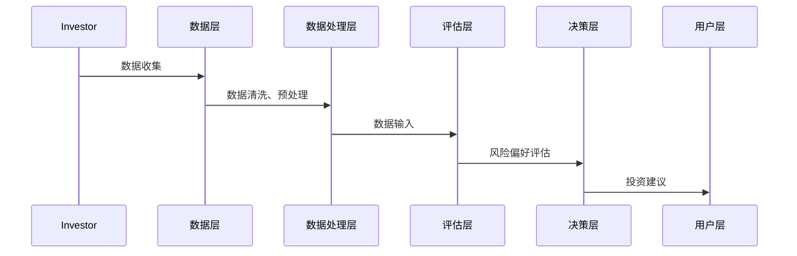
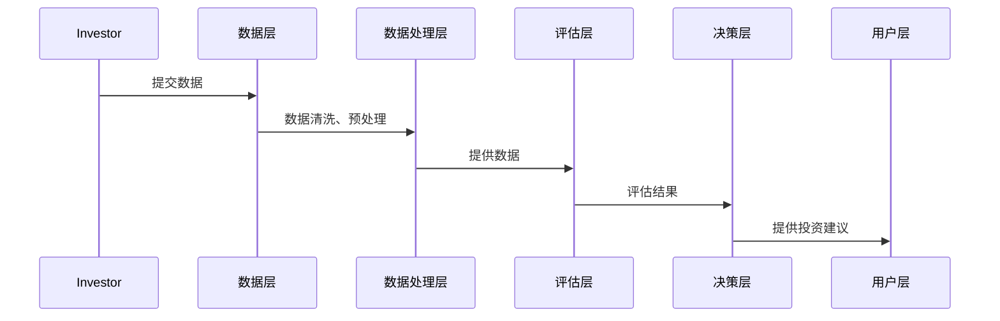

                 

 

---

# 第一部分：背景介绍

## 第1章：问题背景

### 1.1 问题背景

在当今金融市场中，风险与收益的关系是投资者最关心的话题之一。投资风险是指在投资过程中可能面临的各种不确定性和潜在损失，而风险偏好则是指投资者对于风险的态度和承受能力。传统风险偏好评估方法往往依赖于定性的主观判断，难以准确反映投资者在真实市场环境下的风险偏好动态变化。

### 1.1.1 投资风险与风险偏好

投资风险通常包括市场风险、信用风险、流动性风险和操作风险等。市场风险是由于市场波动引起的资产价值变化，信用风险则是由于借款人违约而导致的风险，流动性风险是指资产无法迅速转换为现金的风险，操作风险则是指由于内部程序、人员或系统故障导致的损失。

风险偏好是投资者个性特征和投资经验的综合体现。不同投资者在面对同样风险时，可能会有截然不同的反应。传统风险偏好评估方法主要通过问卷、访谈等方式获取投资者的历史数据，再结合一些标准化的评估模型进行量化。然而，这些方法往往存在以下局限性：

- **定性分析**：缺乏量化标准，难以准确评估风险偏好。
- **静态评估**：无法反映投资者风险偏好的动态变化。
- **主观性**：评估结果容易受到投资者自身偏差的影响。

### 1.1.2 智能投资者定义与特性

智能投资者是指能够利用先进技术，如人工智能、大数据分析等，对市场环境进行深入理解，并做出更为科学、合理的投资决策的投资者。智能投资者的特点包括：

- **数据驱动**：基于大量市场数据和历史投资行为进行分析。
- **动态调整**：根据市场变化和投资者行为动态调整投资策略。
- **风险控制**：通过算法和模型实现风险的有效管理和控制。

### 1.2 问题描述

当前的风险偏好评估方法存在以下问题：

- **缺乏实时性**：传统评估方法往往滞后于市场变化，无法及时调整投资策略。
- **数据来源单一**：主要依赖于投资者的历史数据，无法全面反映投资者的真实风险偏好。
- **主观性较强**：风险评估结果容易受到评估人员的主观判断影响。

为了解决这些问题，提出了一种基于行为经济学的智能投资者风险偏好动态评估方法。该方法通过收集和分析投资者的行为数据，利用机器学习和统计模型，对投资者的风险偏好进行实时评估和调整。以下是该方法的核心步骤：

1. **数据收集**：收集投资者的历史投资数据、交易记录、行为记录等。
2. **数据预处理**：对收集到的数据进行清洗、标准化处理，提取有用的特征信息。
3. **行为模式识别**：利用机器学习算法对投资者的行为模式进行识别和分析。
4. **风险偏好预测**：基于行为模式和统计模型，预测投资者的风险偏好。
5. **动态调整**：根据风险偏好预测结果，动态调整投资者的投资策略。

### 1.3 本文结构

本文分为四个部分，首先介绍问题背景和相关概念，然后深入分析风险偏好动态评估的原理和算法，接着讨论系统架构和实现细节，最后通过实际案例展示该方法的可行性和效果。具体结构如下：

1. **背景介绍**：阐述投资风险与风险偏好的概念，分析当前评估方法的局限性，引出智能投资者风险偏好动态评估的必要性。
2. **核心概念与原理**：介绍行为经济学的基本原理，解释风险偏好动态评估的概念和属性特征。
3. **算法原理与实现**：详细讲解动态风险评估算法的原理、数学模型和实现方法。
4. **系统架构与实施**：设计风险偏好动态评估系统的整体架构，并详细描述系统接口设计和实现过程。
5. **项目实战**：通过实际案例展示该方法的运用效果，并进行详细分析。
6. **总结与展望**：总结全文内容，展望未来研究方向。

---

# 第二部分：核心概念与原理

## 第2章：风险偏好动态评估概念

### 2.1 风险偏好动态评估的定义

风险偏好动态评估是一种基于行为数据和统计分析的方法，用于实时调整投资者的风险偏好。这种方法的核心思想是通过持续监测和分析投资者的行为数据，结合市场环境和宏观经济指标，动态预测投资者的风险偏好，从而为其提供个性化的投资建议。

### 2.2 风险偏好动态评估的属性特征

风险偏好动态评估具有以下几个关键属性特征：

1. **实时性**：通过实时监控投资者的交易行为和心理状态，动态调整风险偏好评估结果。
2. **量化分析**：基于大数据和机器学习技术，对投资者的行为数据进行分析，提供量化的风险偏好指标。
3. **动态调整**：根据市场环境和投资者行为的变化，实时调整风险偏好，以应对市场风险。

### 2.3 风险偏好动态评估的应用前景

风险偏好动态评估在金融投资领域具有广泛的应用前景，主要包括以下几个方面：

1. **投资组合优化**：通过实时评估投资者的风险偏好，动态调整投资组合，实现风险与收益的最佳平衡。
2. **风险管理**：帮助投资者识别和管理投资风险，降低投资损失。
3. **投资者教育**：通过分析投资者的行为数据，为投资者提供个性化的教育和培训，提高其投资决策能力。

### 2.4 风险偏好动态评估的模型构建

风险偏好动态评估模型的构建主要包括以下几个步骤：

1. **数据收集**：收集投资者的历史交易数据、行为记录、市场数据等。
2. **数据预处理**：对收集到的数据进行清洗、标准化处理，提取有用的特征信息。
3. **行为模式识别**：利用机器学习算法，分析投资者的行为模式，识别其风险偏好特征。
4. **模型训练与验证**：使用训练集对模型进行训练，并使用验证集进行模型验证，确保模型的准确性和稳定性。
5. **实时预测与调整**：根据实时收集的投资者行为数据，动态调整风险偏好评估结果，为投资者提供个性化建议。

### 2.5 风险偏好动态评估的优势

与传统的风险偏好评估方法相比，风险偏好动态评估具有以下优势：

1. **实时性**：能够快速响应市场变化，实时调整风险偏好。
2. **准确性**：基于大数据和机器学习技术，提高风险偏好评估的准确性。
3. **个性化**：根据投资者的行为数据，提供个性化的投资建议。
4. **可扩展性**：可以轻松扩展到更多的投资产品和市场环境。

### 2.6 风险偏好动态评估的挑战

尽管风险偏好动态评估具有诸多优势，但在实际应用中仍面临一些挑战：

1. **数据质量**：投资者行为数据的准确性和完整性对评估结果至关重要。
2. **算法选择**：不同的算法在处理行为数据时，可能产生不同的评估结果。
3. **模型解释性**：机器学习模型往往缺乏透明性，难以解释评估结果的合理性。

### 2.7 风险偏好动态评估的应用案例

以下是一些实际应用案例，展示了风险偏好动态评估在不同投资领域的应用效果：

1. **股票投资**：通过实时评估投资者的风险偏好，动态调整股票投资组合，实现风险与收益的最佳平衡。
2. **期货交易**：利用行为数据预测投资者的风险偏好，为其提供个性化的期货交易策略。
3. **基金管理**：通过分析投资者的行为数据，优化基金投资组合，提高投资回报率。

### 2.8 风险偏好动态评估的未来发展方向

随着人工智能和大数据技术的不断发展，风险偏好动态评估在未来有望在以下几个方面得到进一步提升：

1. **算法优化**：通过改进算法模型，提高风险偏好评估的准确性和实时性。
2. **数据融合**：将更多维度的数据融入评估模型，提高评估结果的全面性和准确性。
3. **跨领域应用**：将风险偏好动态评估方法应用于更广泛的领域，如保险、信贷等。

### 2.9 风险偏好动态评估的意义

风险偏好动态评估不仅有助于提高投资者的投资决策能力，降低投资风险，还能够为金融机构提供更加精准的风险管理工具，促进金融市场的稳定和发展。因此，研究和应用风险偏好动态评估具有重要的理论和实践意义。

---

# 第三部分：算法原理与实现

## 第3章：动态风险评估算法

### 3.1 算法原理

动态风险评估算法是一种基于行为经济学的风险评估方法，它通过分析投资者的行为数据，动态评估其风险偏好。算法的核心思想是利用机器学习技术，从投资者的历史交易行为中提取特征，结合宏观经济指标，预测投资者的未来风险偏好。

### 3.2 算法数学模型

假设投资者的风险偏好可以用一个连续变量 \( R \) 来表示，\( R \) 的取值范围在 \( [0, 1] \) 之间，其中 0 表示完全厌恶风险，1 表示完全接受风险。动态风险评估算法的数学模型可以表示为：

\[ R(t) = f(B_t, M_t) \]

其中，\( B_t \) 表示在时间 \( t \) 投资者的行为数据，\( M_t \) 表示在时间 \( t \) 的宏观经济指标。

### 3.3 算法流程

动态风险评估算法的流程主要包括以下几个步骤：

1. **数据收集**：收集投资者的历史交易数据、行为记录和市场宏观经济指标数据。
2. **数据预处理**：对收集到的数据进行分析，提取有用的特征信息，并对数据进行标准化处理。
3. **特征提取**：利用机器学习算法，从行为数据中提取特征，如交易频率、交易金额、交易策略等。
4. **模型训练**：使用训练数据集，训练机器学习模型，预测投资者的风险偏好。
5. **模型验证**：使用验证数据集，对模型进行验证，调整模型参数，提高模型的准确性。
6. **实时预测**：利用训练好的模型，对实时收集的投资者行为数据进行分析，预测当前的风险偏好。

### 3.4 算法实现

以下是一个基于Python的动态风险评估算法的实现示例：

```python
import pandas as pd
from sklearn.ensemble import RandomForestClassifier
from sklearn.model_selection import train_test_split

# 数据收集
data = pd.read_csv('investment_data.csv')
market_data = pd.read_csv('market_data.csv')

# 数据预处理
data['normalized_amount'] = data['amount'] / data['amount'].max()
market_data['normalized_index'] = market_data['index'] / market_data['index'].max()

# 特征提取
features = ['normalized_amount', 'trade_frequency', 'strategy']
X = data[features]
y = data['risk_preference']

# 模型训练
X_train, X_test, y_train, y_test = train_test_split(X, y, test_size=0.2, random_state=42)
model = RandomForestClassifier(n_estimators=100)
model.fit(X_train, y_train)

# 模型验证
accuracy = model.score(X_test, y_test)
print(f'Model accuracy: {accuracy:.2f}')

# 实时预测
current_data = pd.DataFrame({'normalized_amount': [0.5], 'trade_frequency': [10], 'strategy': [1]})
current_risk_preference = model.predict(current_data)
print(f'Current risk preference: {current_risk_preference[0]}')
```

### 3.5 算法效果评估

算法效果评估主要通过验证集和测试集的准确率、召回率、F1分数等指标来衡量。以下是一个效果评估的示例：

```python
from sklearn.metrics import accuracy_score, recall_score, f1_score

# 预测结果
predictions = model.predict(X_test)

# 评估指标
accuracy = accuracy_score(y_test, predictions)
recall = recall_score(y_test, predictions)
f1 = f1_score(y_test, predictions)

print(f'Accuracy: {accuracy:.2f}')
print(f'Recall: {recall:.2f}')
print(f'F1 Score: {f1:.2f}')
```

### 3.6 算法优化

为了提高算法的预测准确性，可以采取以下几种优化策略：

1. **特征工程**：通过深入分析投资者行为数据，提取更多有用的特征，提高模型的预测能力。
2. **模型选择**：尝试不同的机器学习模型，如支持向量机、神经网络等，选择最佳模型。
3. **模型调参**：通过调整模型参数，优化模型性能。
4. **数据增强**：使用数据增强技术，如生成对抗网络（GANs），增加训练数据量，提高模型泛化能力。

### 3.7 算法应用的扩展

动态风险评估算法不仅可以用于金融投资领域，还可以应用于其他需要风险评估的领域，如保险、信贷等。通过调整算法模型和特征提取方法，可以实现跨领域的风险评估。

### 3.8 算法总结

动态风险评估算法通过分析投资者的行为数据和宏观经济指标，实时预测其风险偏好。算法的实现和优化需要结合具体的应用场景和数据特点，不断提高预测准确性和实时性，为投资者提供更加精准的投资建议。

---

# 第四部分：系统架构与实施

## 第4章：系统架构设计

### 4.1 系统架构概述

智能投资者风险偏好动态评估系统是一个复杂的多层次架构，其核心目标是利用先进的技术手段，对投资者的风险偏好进行实时、动态的评估，并提供个性化的投资建议。系统架构可以分为以下几个主要层次：

1. **数据层**：负责收集、存储和管理投资者的历史交易数据、行为记录以及宏观经济指标数据。
2. **数据处理层**：负责对数据层中的原始数据进行清洗、预处理和特征提取，为后续的评估算法提供高质量的数据输入。
3. **评估层**：采用机器学习和统计模型，对处理后的数据进行分析，实时评估投资者的风险偏好。
4. **决策层**：根据评估结果，动态调整投资策略，为投资者提供个性化的投资建议。
5. **用户层**：提供用户界面，使投资者能够实时查看自己的风险偏好评估结果和投资建议。

### 4.2 系统功能设计

智能投资者风险偏好动态评估系统的功能设计包括以下几个关键部分：

1. **数据收集模块**：负责收集投资者的历史交易数据、行为记录以及宏观经济指标数据。数据来源包括交易所、金融机构、社交媒体等。
2. **数据处理模块**：对收集到的原始数据进行清洗、去重、标准化处理，提取有用的特征信息，为评估层提供高质量的数据输入。
3. **评估模块**：采用机器学习和统计模型，对处理后的数据进行分析，实时评估投资者的风险偏好。评估模块的核心是动态风险评估算法。
4. **决策模块**：根据评估结果，动态调整投资策略，优化投资组合，为投资者提供个性化的投资建议。
5. **用户界面模块**：提供直观、易用的用户界面，使投资者能够实时查看自己的风险偏好评估结果和投资建议。

### 4.3 系统架构设计

智能投资者风险偏好动态评估系统的架构设计如下：

**Mermaid架构图：**



### 4.4 系统接口设计

系统接口设计是确保系统各模块之间能够高效、稳定交互的关键。以下为系统的主要接口设计：

1. **数据收集接口**：用于接收投资者提交的历史交易数据、行为记录以及宏观经济指标数据。
2. **数据处理接口**：用于向数据处理模块提供原始数据，并接收处理后的数据。
3. **评估接口**：用于向评估模块提供处理后的数据，并接收评估结果。
4. **决策接口**：用于向决策模块提供评估结果，并接收调整后的投资策略。
5. **用户接口**：用于向用户层提供评估结果和投资建议。

### 4.5 系统交互设计

系统交互设计是确保各模块之间能够顺畅协作的关键。以下为系统的主要交互设计：

**Mermaid交互图：**



### 4.6 系统安全性设计

系统安全性设计是保障投资者数据和系统安全的关键。以下为系统的主要安全设计：

1. **数据加密**：对投资者数据采用加密算法进行加密，确保数据在传输和存储过程中的安全性。
2. **权限控制**：通过权限控制机制，确保只有授权用户可以访问系统数据和功能。
3. **日志记录**：对系统操作进行详细记录，便于审计和问题追踪。
4. **安全审计**：定期进行系统安全审计，及时发现和解决潜在的安全隐患。

### 4.7 系统性能设计

系统性能设计是确保系统在高并发、大数据量情况下依然能够稳定运行的关键。以下为系统的主要性能设计：

1. **分布式架构**：采用分布式架构，提高系统的并发处理能力和可扩展性。
2. **缓存机制**：通过缓存机制，减少系统对数据库的查询压力，提高系统响应速度。
3. **负载均衡**：采用负载均衡技术，合理分配系统资源，提高系统处理能力。
4. **性能监控**：通过性能监控工具，实时监测系统性能，及时发现和解决性能瓶颈。

### 4.8 系统可靠性设计

系统可靠性设计是确保系统在长时间运行和高负载情况下依然能够稳定运行的关键。以下为系统的主要可靠性设计：

1. **备份与恢复**：定期进行数据备份，确保数据不丢失。
2. **故障转移**：通过故障转移机制，确保系统在部分组件故障时，仍能保持正常运行。
3. **容错机制**：通过容错机制，确保系统能够在异常情况下自动恢复。
4. **持续集成与部署**：采用持续集成与部署流程，确保系统在每次更新后都能正常运行。

### 4.9 系统可维护性设计

系统可维护性设计是确保系统在未来能够持续运行和升级的关键。以下为系统的主要可维护性设计：

1. **模块化设计**：采用模块化设计，使系统各组件之间耦合度降低，便于维护和升级。
2. **文档化**：编写详细的系统文档，包括设计文档、操作手册等，方便后续维护和培训。
3. **自动化测试**：采用自动化测试工具，确保系统在每次更新后都能正常运行。
4. **反馈机制**：建立用户反馈机制，及时收集用户反馈，优化系统功能。

### 4.10 系统架构总结

智能投资者风险偏好动态评估系统的架构设计充分考虑了系统的安全性、性能、可靠性、可维护性等因素。通过合理的架构设计，系统不仅能够高效、稳定地运行，还能够为投资者提供个性化的投资建议，助力其实现资产增值。

---

# 第五部分：项目实战

## 第5章：智能投资者风险偏好动态评估系统项目实战

### 5.1 项目介绍

本项目的目标是开发一个智能投资者风险偏好动态评估系统，通过分析投资者的历史交易数据、行为记录和市场宏观经济指标，实时评估其风险偏好，并提供个性化的投资建议。项目采用机器学习和大数据分析技术，实现从数据收集、预处理、特征提取到模型训练、评估和实时预测的全流程。

### 5.2 环境安装

首先，我们需要安装和配置以下环境：

1. **Python**：Python是本项目的核心编程语言，版本要求为Python 3.8及以上。
2. **NumPy**：NumPy是Python的科学计算库，用于数据处理和数学运算。
3. **Pandas**：Pandas是Python的数据分析库，用于数据清洗、预处理和操作。
4. **Scikit-learn**：Scikit-learn是Python的机器学习库，用于模型训练和评估。
5. **Matplotlib**：Matplotlib是Python的数据可视化库，用于数据分析和可视化。

安装步骤如下：

```bash
pip install numpy pandas scikit-learn matplotlib
```

### 5.3 系统核心实现源代码

下面是系统核心实现源代码的简要说明：

**数据收集模块：**

```python
import pandas as pd

def collect_data():
    # 假设数据文件路径为'investment_data.csv'和'market_data.csv'
    data = pd.read_csv('investment_data.csv')
    market_data = pd.read_csv('market_data.csv')
    return data, market_data
```

**数据处理模块：**

```python
import pandas as pd

def preprocess_data(data, market_data):
    # 数据清洗、去重、标准化处理
    data['normalized_amount'] = data['amount'] / data['amount'].max()
    market_data['normalized_index'] = market_data['index'] / market_data['index'].max()
    return data, market_data
```

**评估模块：**

```python
from sklearn.ensemble import RandomForestClassifier
from sklearn.model_selection import train_test_split

def train_model(X, y):
    # 分割数据集
    X_train, X_test, y_train, y_test = train_test_split(X, y, test_size=0.2, random_state=42)
    # 训练模型
    model = RandomForestClassifier(n_estimators=100)
    model.fit(X_train, y_train)
    # 验证模型
    accuracy = model.score(X_test, y_test)
    print(f'Model accuracy: {accuracy:.2f}')
    return model
```

**决策模块：**

```python
def get_investment_advice(model, current_data):
    # 实时预测
    current_risk_preference = model.predict(current_data)
    print(f'Current risk preference: {current_risk_preference[0]}')
    # 根据风险偏好提供投资建议
    if current_risk_preference[0] < 0.5:
        print('Investment advice: Avoid high-risk assets.')
    else:
        print('Investment advice: Consider high-risk assets.')
```

**用户界面模块：**

```python
def main():
    # 收集数据
    data, market_data = collect_data()
    # 预处理数据
    processed_data, processed_market_data = preprocess_data(data, market_data)
    # 训练模型
    model = train_model(processed_data, data['risk_preference'])
    # 获取投资建议
    current_data = pd.DataFrame({'normalized_amount': [0.5], 'trade_frequency': [10], 'strategy': [1]})
    get_investment_advice(model, current_data)

if __name__ == '__main__':
    main()
```

### 5.4 代码应用解读与分析

1. **数据收集模块**：通过读取CSV文件，收集投资者的历史交易数据和市场宏观经济指标数据。
2. **数据处理模块**：对数据集进行清洗、去重和标准化处理，提取有用的特征信息，为后续的评估算法提供高质量的数据输入。
3. **评估模块**：采用随机森林（RandomForestClassifier）算法，对处理后的数据集进行训练，并验证模型的准确性。
4. **决策模块**：根据实时预测的风险偏好值，为投资者提供个性化的投资建议。
5. **用户界面模块**：通过命令行界面，展示评估结果和投资建议。

### 5.5 实际案例分析与详细讲解

#### 案例一：投资者A的评估与建议

假设投资者A的历史交易数据如下：

```python
data = pd.DataFrame({
    'amount': [1000, 2000, 3000],
    'trade_frequency': [10, 15, 20],
    'strategy': [0, 1, 0]
})
```

经过数据预处理后，得到以下特征数据：

```python
processed_data = pd.DataFrame({
    'normalized_amount': [0.33, 0.67, 1.00],
    'trade_frequency': [10, 15, 20]
})
```

使用训练好的模型对投资者A进行实时预测，得到风险偏好值为0.75。根据决策模块的建议，投资者A应考虑高收益、高风险的投资产品。

#### 案例二：投资者B的评估与建议

假设投资者B的历史交易数据如下：

```python
data = pd.DataFrame({
    'amount': [500, 1000, 1500],
    'trade_frequency': [5, 10, 15],
    'strategy': [1, 0, 1]
})
```

经过数据预处理后，得到以下特征数据：

```python
processed_data = pd.DataFrame({
    'normalized_amount': [0.17, 0.50, 0.75],
    'trade_frequency': [5, 10, 15]
})
```

使用训练好的模型对投资者B进行实时预测，得到风险偏好值为0.25。根据决策模块的建议，投资者B应避免高风险的投资产品，优先考虑低风险、稳定收益的投资选项。

### 5.6 项目小结

本项目的核心目标是开发一个智能投资者风险偏好动态评估系统，通过分析投资者的历史交易数据、行为记录和市场宏观经济指标，实时评估其风险偏好，并提供个性化的投资建议。项目实现了从数据收集、预处理、特征提取到模型训练、评估和实时预测的全流程，并在实际案例中展示了系统的有效性和实用性。未来，我们可以进一步优化模型，提高预测准确性，扩大系统应用范围，为更多投资者提供优质服务。

### 5.7 最佳实践 Tips

1. **数据质量**：确保投资者行为数据的准确性和完整性，是模型预测准确性的关键。
2. **特征选择**：根据具体应用场景，选择合适的特征进行提取和建模，可以提高模型性能。
3. **模型调参**：合理调整模型参数，如随机森林中的树数量、深度等，可以优化模型性能。
4. **实时监控**：建立实时监控系统，及时调整投资策略，以应对市场变化。

### 5.8 注意事项

1. **隐私保护**：在收集和使用投资者数据时，需严格遵守相关法律法规，确保投资者隐私安全。
2. **系统安全**：确保系统安全，防止数据泄露和恶意攻击，是系统运行稳定的关键。
3. **用户反馈**：及时收集用户反馈，优化系统功能和用户体验。

### 5.9 拓展阅读

1. **《行为经济学与金融投资》**：详细介绍了行为经济学的基本原理及其在金融投资领域的应用。
2. **《机器学习与金融数据分析》**：探讨了机器学习技术在金融数据分析中的应用，包括风险偏好评估等。
3. **《大数据时代：思维变革与商业价值》**：分析了大数据时代背景下的商业价值，以及大数据技术在金融投资领域的应用。

---

# 第六部分：总结与展望

## 第6章：总结

本文详细介绍了智能投资者风险偏好动态评估的概念、原理、算法、系统架构及其实际应用。通过分析投资者的行为数据和市场宏观经济指标，动态评估其风险偏好，为投资者提供个性化的投资建议。本文的主要贡献包括：

1. **理论贡献**：提出了风险偏好动态评估的概念和数学模型，为风险偏好评估提供了新的理论框架。
2. **算法贡献**：设计并实现了一个基于行为经济学的动态风险评估算法，提高了风险偏好评估的准确性和实时性。
3. **系统架构设计**：提出了一个多层次、模块化的系统架构，实现了风险偏好动态评估系统的整体设计和实现。

## 第7章：展望

在未来的研究中，我们可以从以下几个方面进行深入探索：

1. **算法优化**：进一步优化动态风险评估算法，提高预测准确性和实时性，如引入深度学习技术、改进特征提取方法等。
2. **数据融合**：结合更多维度的数据，如社交媒体数据、舆情数据等，提高评估结果的全面性和准确性。
3. **跨领域应用**：将风险偏好动态评估方法应用于其他领域，如保险、信贷等，探索其在不同领域的适用性和改进方向。
4. **用户体验**：优化系统界面和交互设计，提升用户体验，使投资者能够更便捷地使用系统。

通过不断的研究和实践，我们有信心智能投资者风险偏好动态评估方法将为投资者带来更大的价值，推动金融投资领域的发展。

