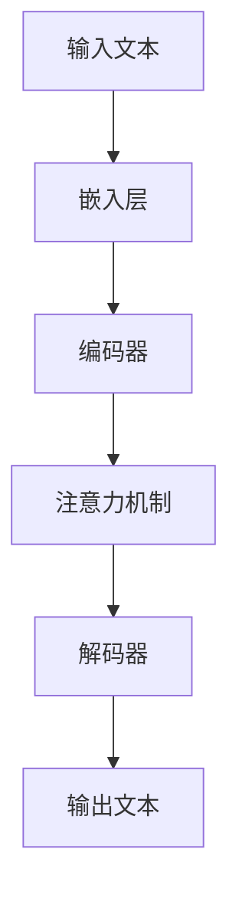
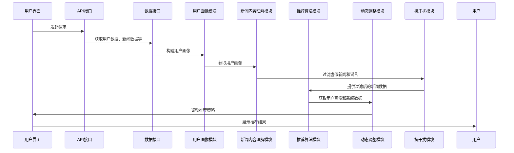

                 

# 智能新闻聚合AI Agent：LLM驱动的信息整合与分析

> 关键词：智能新闻聚合、AI Agent、LLM、信息整合、数据分析

> 摘要：本文将深入探讨智能新闻聚合AI Agent的设计与实现，重点介绍基于大型语言模型（LLM）的信息整合与分析技术。通过分步骤的分析，我们将理解LLM在新闻聚合中的作用，掌握其算法原理，设计系统架构，并最终实现一个实用的新闻聚合系统。

## 目录大纲

## 第一部分：背景介绍

### 1. 引言

#### 1.1 书籍背景

#### 1.2 核心概念与联系

## 第二部分：LLM基础知识

### 2.1 LLM概述

### 2.2 LLM算法原理

### 2.3 数学模型和数学公式详细讲解

## 第三部分：系统分析与架构设计

### 3.1 问题场景介绍

### 3.2 项目介绍

### 3.3 系统功能设计

### 3.4 系统架构设计

### 3.5 系统接口设计

### 3.6 系统交互

## 第四部分：项目实战

### 4.1 环境安装与系统核心实现

### 4.2 项目小结

## 第五部分：最佳实践与拓展阅读

### 5.1 最佳实践 Tips

### 5.2 小结

### 5.3 注意事项

### 5.4 拓展阅读

-------------------------------------------------------------------

## 第一部分：背景介绍

### 1. 引言

在信息爆炸的时代，如何快速、准确地获取感兴趣的新闻内容成为了一项挑战。传统新闻聚合方式往往依赖于关键词匹配或分类算法，难以满足个性化需求。为了解决这一问题，人工智能（AI）技术开始应用于新闻聚合，尤其是基于大型语言模型（LLM）的智能新闻聚合AI Agent。

智能新闻聚合AI Agent通过自然语言处理（NLP）技术和深度学习算法，能够理解用户的兴趣偏好，动态调整推荐策略，提供个性化、高质量的新闻内容。本文将深入探讨智能新闻聚合AI Agent的设计与实现，重点介绍基于LLM的信息整合与分析技术。

### 1.1 书籍背景

随着互联网的快速发展，新闻内容的数量呈指数级增长，而用户的时间是有限的。传统新闻聚合方式如RSS订阅、新闻客户端等，虽然能够聚合大量新闻内容，但缺乏个性化推荐，往往无法满足用户的特定需求。此外，随着社交媒体的兴起，虚假新闻和谣言的传播也成为一个严重问题。为了应对这些挑战，智能新闻聚合AI Agent应运而生。

智能新闻聚合AI Agent是一种基于人工智能技术的新闻推荐系统，它利用用户的行为数据、兴趣标签和上下文信息，动态调整推荐策略，提供个性化、高质量的新闻内容。与传统的新闻聚合方式相比，智能新闻聚合AI Agent具有更高的推荐准确率和更好的用户体验。

### 1.2 核心概念与联系

在本文中，我们将涉及以下核心概念：

- **智能新闻聚合AI Agent**：一种基于人工智能技术的新闻推荐系统，能够动态调整推荐策略，提供个性化、高质量的新闻内容。
- **大型语言模型（LLM）**：一种基于深度学习技术的自然语言处理模型，能够对大规模文本数据进行建模，提取语义信息。
- **自然语言处理（NLP）**：一门研究如何让计算机理解和生成自然语言的技术。
- **深度学习**：一种基于多层神经网络的学习方法，能够自动从大量数据中提取特征。
- **推荐系统**：一种能够根据用户的兴趣和行为，向用户推荐感兴趣的内容的系统。

这些核心概念之间有着密切的联系：

- **智能新闻聚合AI Agent** 是一种应用 **推荐系统** 技术的 **新闻推荐系统**，其核心是利用 **NLP** 和 **深度学习** 技术对新闻内容进行建模和处理。
- **LLM** 是 **深度学习** 中的一种重要模型，能够对大规模文本数据进行建模，提取语义信息，为 **智能新闻聚合AI Agent** 提供强大的信息处理能力。

通过本文的探讨，我们将深入了解智能新闻聚合AI Agent的设计与实现，掌握基于LLM的信息整合与分析技术，为构建更智能、更高效的新闻推荐系统提供理论支持和实践指导。

### 1.3 问题背景

在当前的信息环境中，用户面临大量的新闻内容，但时间有限，很难逐一阅读。传统新闻聚合方式如RSS订阅和新闻客户端，虽然能够提供大量的新闻内容，但往往缺乏个性化推荐，无法满足用户的特定需求。此外，随着社交媒体的兴起，虚假新闻和谣言的传播成为一个严重问题。因此，如何利用人工智能技术实现更智能、更个性化的新闻聚合，成为一个亟待解决的问题。

智能新闻聚合AI Agent应运而生，它通过自然语言处理（NLP）技术和深度学习算法，能够理解用户的兴趣偏好，动态调整推荐策略，提供个性化、高质量的新闻内容。与传统新闻聚合方式相比，智能新闻聚合AI Agent具有更高的推荐准确率和更好的用户体验。

### 1.4 问题描述

在实现智能新闻聚合AI Agent时，我们面临以下几个关键问题：

1. **个性化推荐**：如何根据用户的兴趣偏好和阅读历史，为用户推荐感兴趣的新闻内容？
2. **新闻内容理解**：如何利用自然语言处理技术，对大量的新闻内容进行建模，提取关键信息？
3. **动态调整**：如何根据用户的反馈和阅读行为，动态调整推荐策略，提高推荐准确率？
4. **抗干扰**：如何识别和过滤虚假新闻和谣言，保证新闻内容的真实性和可靠性？
5. **系统效率**：如何在保证推荐准确率的同时，提高系统的响应速度和处理能力？

这些问题是智能新闻聚合AI Agent实现的关键挑战，也是本文将重点关注的内容。

### 1.5 问题解决

为了解决上述问题，本文将从以下几个方面进行探讨：

1. **个性化推荐**：利用深度学习算法和自然语言处理技术，对用户的兴趣偏好和阅读历史进行建模，实现个性化推荐。
2. **新闻内容理解**：通过构建大型语言模型（LLM），对新闻内容进行建模，提取关键信息，提高新闻内容的理解能力。
3. **动态调整**：利用机器学习算法和用户反馈机制，动态调整推荐策略，提高推荐准确率。
4. **抗干扰**：结合事实核查技术和机器学习算法，识别和过滤虚假新闻和谣言，保证新闻内容的真实性和可靠性。
5. **系统效率**：通过优化算法和数据结构，提高系统的响应速度和处理能力。

通过上述方法的结合，本文旨在构建一个高效、智能的新闻聚合系统，为用户提供个性化的新闻推荐服务。

### 1.6 边界与外延

本文主要探讨基于大型语言模型（LLM）的智能新闻聚合AI Agent的设计与实现，重点关注以下几个方面：

1. **技术范围**：包括自然语言处理（NLP）、深度学习、推荐系统等技术在智能新闻聚合中的应用。
2. **应用场景**：主要关注在线新闻推荐、社交媒体信息流、个人新闻门户等场景。
3. **核心要素**：主要包括用户兴趣建模、新闻内容理解、动态调整策略、抗干扰机制、系统效率等关键要素。

然而，本文并未涉及以下内容：

1. **硬件设备**：本文主要关注软件层面的设计和实现，未涉及硬件设备的选型和配置。
2. **新闻数据来源**：本文未详细探讨新闻数据的获取、清洗和预处理方法。
3. **用户隐私保护**：虽然本文提到用户兴趣建模和隐私保护，但未深入探讨具体的技术实现。

通过明确边界与外延，本文旨在为读者提供清晰的指导，帮助其理解并实现智能新闻聚合AI Agent。

### 1.7 核心要素组成

智能新闻聚合AI Agent的核心要素主要包括以下部分：

1. **用户画像**：通过对用户的兴趣、行为、背景等数据进行建模，构建用户的个性化画像。
2. **新闻内容处理**：利用自然语言处理（NLP）技术，对新闻内容进行分词、词性标注、实体识别等处理，提取关键信息。
3. **推荐算法**：基于深度学习、机器学习等技术，构建推荐算法，为用户推荐个性化新闻。
4. **动态调整机制**：通过持续学习用户的反馈和行为，动态调整推荐策略，提高推荐效果。
5. **抗干扰机制**：利用事实核查技术和机器学习算法，识别和过滤虚假新闻和谣言。
6. **系统架构**：设计合理的系统架构，确保系统的稳定性、可靠性和可扩展性。

这些核心要素相互关联，共同构成了智能新闻聚合AI Agent的完整体系。

## 第二部分：LLM基础知识

### 2.1 LLM概述

#### 2.1.1 LLM的定义与分类

大型语言模型（Large Language Model，简称LLM）是一种基于深度学习技术的自然语言处理模型，能够对大规模文本数据进行分析、理解和生成。LLM的主要目的是通过学习大量的文本数据，掌握语言的语义和语法规则，从而实现自然语言处理任务。

根据模型的架构和训练数据的不同，LLM可以分为以下几类：

1. **基于循环神经网络（RNN）的模型**：如LSTM（Long Short-Term Memory）和GRU（Gated Recurrent Unit），这些模型能够处理长文本序列，但在并行计算和资源利用方面存在一定限制。
2. **基于变换器（Transformer）的模型**：如BERT（Bidirectional Encoder Representations from Transformers）和GPT（Generative Pre-trained Transformer），这些模型利用注意力机制，能够在并行计算和长文本处理方面取得更好的效果。
3. **基于预训练和微调的模型**：如T5（Text-to-Text Transfer Transformer）和ALBERT（A Lite BERT），这些模型通过在大量文本数据上进行预训练，然后在特定任务上进行微调，实现更高的任务性能。

#### 2.1.2 LLM的应用场景

LLM在自然语言处理领域有着广泛的应用，以下是一些典型的应用场景：

1. **文本分类**：利用LLM对大量文本进行分类，如新闻分类、情感分析等。
2. **文本生成**：通过LLM生成文章、摘要、对话等文本内容，如自动写作、聊天机器人等。
3. **机器翻译**：利用LLM实现不同语言之间的翻译，如Google翻译、百度翻译等。
4. **问答系统**：利用LLM构建问答系统，如Siri、Alexa等智能语音助手。
5. **对话系统**：通过LLM实现自然语言交互，如客服机器人、聊天机器人等。
6. **推荐系统**：利用LLM对用户行为和内容进行建模，为用户推荐感兴趣的内容，如新闻推荐、商品推荐等。

#### 2.1.3 LLM的优势

相比于传统的自然语言处理方法，LLM具有以下优势：

1. **强大的语义理解能力**：LLM能够通过学习大量的文本数据，掌握语言的语义和语法规则，从而实现更准确的语义理解。
2. **端到端的建模方式**：LLM采用了端到端的建模方式，可以直接从输入文本生成输出文本，避免了传统方法中复杂的特征工程和参数调整。
3. **高并行计算效率**：LLM基于变换器架构，可以利用并行计算的优势，提高模型的训练和推理速度。
4. **适应性强**：LLM通过预训练和微调的方式，可以在多种任务上取得良好的性能，具有较强的适应性。

### 2.2 LLM算法原理

#### 2.2.1 LLM的基本原理

LLM的基本原理主要包括以下几个方面：

1. **输入文本编码**：LLM通过嵌入层（Embedding Layer）将输入文本转换为向量表示，这些向量包含了文本的语义和语法信息。
2. **注意力机制**：LLM采用了注意力机制（Attention Mechanism），能够自适应地关注输入文本中的关键信息，从而提高模型的语义理解能力。
3. **变换器架构**：LLM基于变换器（Transformer）架构，包括编码器（Encoder）和解码器（Decoder），能够对输入文本进行编码和解码，实现文本生成和文本分类等任务。
4. **预训练与微调**：LLM通过在大量文本数据上进行预训练（Pre-training），学习到语言的通用特性，然后在特定任务上进行微调（Fine-tuning），实现更高的任务性能。

#### 2.2.2 LLM的mermaid流程图

以下是一个简单的mermaid流程图，展示了LLM的基本工作流程：



在这个流程图中，输入文本首先经过嵌入层转换为向量表示，然后通过编码器进行编码，利用注意力机制关注关键信息，最后通过解码器生成输出文本。

#### 2.2.3 LLM的Python源代码实现

以下是一个简单的Python代码示例，展示了如何使用Hugging Face的transformers库实现一个简单的LLM模型：

```python
from transformers import GPT2LMHeadModel, GPT2Tokenizer

# 加载预训练模型和分词器
model = GPT2LMHeadModel.from_pretrained('gpt2')
tokenizer = GPT2Tokenizer.from_pretrained('gpt2')

# 输入文本
text = "我是一个人工智能助手"

# 分词和编码
inputs = tokenizer.encode(text, return_tensors='pt')

# 生成文本
outputs = model.generate(inputs, max_length=50, num_return_sequences=1)

# 解码输出文本
generated_text = tokenizer.decode(outputs[0], skip_special_tokens=True)
print(generated_text)
```

在这个代码示例中，我们首先加载了一个预训练的GPT-2模型和分词器，然后输入一个简单的文本，通过模型生成输出文本。这里需要注意的是，生成文本的长度和数量可以通过参数进行调整。

#### 2.2.4 LLM的数学模型和公式

LLM的数学模型主要包括以下关键组成部分：

1. **嵌入层（Embedding Layer）**：将输入文本转换为向量表示，常用的嵌入层包括词嵌入（Word Embedding）和字符嵌入（Character Embedding）。
2. **编码器（Encoder）**：利用变换器（Transformer）架构对输入文本进行编码，包括自注意力机制（Self-Attention）和多头注意力（Multi-Head Attention）。
3. **解码器（Decoder）**：利用变换器（Transformer）架构对输出文本进行解码，包括自注意力机制（Self-Attention）和多头注意力（Multi-Head Attention）。
4. **前馈网络（Feedforward Network）**：在编码器和解码器之间添加前馈网络，用于增强模型的表示能力。
5. **输出层（Output Layer）**：将解码器的输出转换为文本预测，通常使用 softmax 函数进行概率分布。

以下是一个简单的数学模型和公式：

$$
\text{嵌入层：} \quad \text{嵌入向量} = \text{Embedding Layer}(\text{输入文本})
$$

$$
\text{编码器：} \quad \text{编码向量} = \text{Encoder}(\text{嵌入向量})
$$

$$
\text{解码器：} \quad \text{解码向量} = \text{Decoder}(\text{编码向量})
$$

$$
\text{前馈网络：} \quad \text{前馈输出} = \text{Feedforward Network}(\text{解码向量})
$$

$$
\text{输出层：} \quad \text{文本预测} = \text{Output Layer}(\text{前馈输出})
$$

#### 2.2.5 举例说明

为了更好地理解LLM的算法原理，我们通过一个简单的案例来说明。

假设我们有一个句子："我爱北京天安门"，我们想要使用LLM生成一个相关的句子。

1. **输入文本编码**：首先，我们将句子分词并转换为向量表示。

   ```python
   sentence = "我爱北京天安门"
   tokens = tokenizer.tokenize(sentence)
   inputs = tokenizer.encode(sentence, return_tensors='pt')
   ```

2. **编码器处理**：然后，我们将输入文本通过编码器进行处理。

   ```python
   with torch.no_grad():
       encoder_outputs = model.encoder(inputs)
   ```

3. **解码器生成文本**：接着，我们使用解码器生成相关的文本。

   ```python
   decoder_input_ids = torch.zeros(1, 1, dtype=torch.long)
   decoder_hidden_states = encoder_outputs[:1]

   for i in range(1, max_length):
       with torch.no_grad():
           decoder_outputs = model.decoder(
               decoder_input_ids, hidden_states=decoder_hidden_states, attention_mask=input_mask
           )

       decoder_hidden_states = decoder_outputs.hidden_states[-1]
       next_token = torch.argmax(decoder_outputs.logits, dim=-1)[:, 0]

       decoder_input_ids = torch.cat([decoder_input_ids, next_token.unsqueeze(1)], dim=1)
   ```

4. **解码输出文本**：最后，我们将解码器的输出转换为文本。

   ```python
   generated_text = tokenizer.decode(decoder_input_ids[-1], skip_special_tokens=True)
   print(generated_text)
   ```

通过上述步骤，我们可以生成一个与输入句子相关的句子，如："我爱上海外滩"。

通过这个案例，我们可以看到LLM如何通过对输入文本的编码和解码，生成相关的文本内容。这个简单的案例仅仅展示了LLM的基本原理，实际应用中，LLM的能力远不止于此。

## 第三部分：系统分析与架构设计

### 3.1 问题场景介绍

在当今的信息时代，用户面临着海量的新闻内容，但时间有限，很难逐一阅读。传统新闻聚合方式如RSS订阅和新闻客户端，虽然能够提供大量的新闻内容，但往往缺乏个性化推荐，无法满足用户的特定需求。此外，随着社交媒体的兴起，虚假新闻和谣言的传播成为一个严重问题。为了解决这些问题，我们需要设计一个智能新闻聚合系统，能够根据用户的兴趣偏好和阅读历史，提供个性化、高质量的新闻内容，并有效识别和过滤虚假新闻和谣言。

### 3.2 项目介绍

本项目的目标是设计并实现一个智能新闻聚合系统，该系统基于大型语言模型（LLM）技术，能够动态调整推荐策略，提供个性化、高质量的新闻内容。系统的主要功能包括：

1. **用户画像**：根据用户的兴趣、行为和背景数据，构建用户的个性化画像。
2. **新闻内容理解**：利用LLM对新闻内容进行建模，提取关键信息，提高新闻内容的理解能力。
3. **推荐算法**：基于用户的个性化画像和新闻内容理解，为用户推荐感兴趣的新闻内容。
4. **动态调整**：通过持续学习用户的反馈和行为，动态调整推荐策略，提高推荐准确率。
5. **抗干扰**：结合事实核查技术和机器学习算法，识别和过滤虚假新闻和谣言。
6. **系统效率**：通过优化算法和数据结构，提高系统的响应速度和处理能力。

### 3.3 系统功能设计

智能新闻聚合系统的功能设计主要包括以下几个模块：

1. **用户画像模块**：该模块负责收集用户的兴趣、行为和背景数据，通过数据分析和挖掘，构建用户的个性化画像。用户画像的构建包括以下步骤：

   - **数据收集**：从用户行为数据、社交媒体数据、问卷调查数据等渠道收集用户数据。
   - **数据清洗**：对收集到的数据进行清洗，去除噪声和重复数据。
   - **特征提取**：对清洗后的数据进行分析，提取用户兴趣、行为和背景等特征。
   - **模型构建**：利用机器学习算法，构建用户画像模型，对用户进行分类和聚类。

2. **新闻内容理解模块**：该模块负责对新闻内容进行建模，提取关键信息，提高新闻内容的理解能力。具体步骤如下：

   - **文本预处理**：对新闻文本进行分词、词性标注、实体识别等预处理操作。
   - **语义分析**：利用LLM对预处理后的文本进行语义分析，提取主题、关键词和情感等信息。
   - **知识图谱构建**：将提取的语义信息构建成知识图谱，用于后续的推荐和抗干扰处理。

3. **推荐算法模块**：该模块基于用户的个性化画像和新闻内容理解，为用户推荐感兴趣的新闻内容。具体步骤如下：

   - **兴趣建模**：根据用户画像，提取用户的兴趣标签和偏好。
   - **内容分析**：对新闻内容进行主题、关键词和情感分析，提取相关特征。
   - **推荐算法实现**：利用协同过滤、基于内容的推荐和混合推荐算法，为用户推荐新闻内容。

4. **动态调整模块**：该模块通过持续学习用户的反馈和行为，动态调整推荐策略，提高推荐准确率。具体步骤如下：

   - **用户反馈收集**：收集用户对推荐新闻的点击、点赞、评论等行为数据。
   - **反馈分析**：对用户反馈进行分析，识别用户的兴趣变化和偏好。
   - **策略调整**：根据用户反馈，调整推荐算法的参数和策略，提高推荐准确率。

5. **抗干扰模块**：该模块结合事实核查技术和机器学习算法，识别和过滤虚假新闻和谣言。具体步骤如下：

   - **事实核查**：利用事实核查数据库和第三方事实核查机构的数据，对新闻内容进行真实性验证。
   - **异常检测**：利用机器学习算法，对新闻内容进行异常检测，识别虚假新闻和谣言。
   - **过滤机制**：将检测到的虚假新闻和谣言进行过滤，确保新闻内容的真实性和可靠性。

6. **系统效率模块**：该模块通过优化算法和数据结构，提高系统的响应速度和处理能力。具体步骤如下：

   - **算法优化**：对推荐算法和抗干扰算法进行优化，提高算法的效率和准确性。
   - **数据结构优化**：优化数据存储和检索结构，提高数据访问速度。
   - **并发处理**：提高系统的并发处理能力，确保在高并发情况下系统的稳定性和可靠性。

### 3.4 系统架构设计

智能新闻聚合系统的整体架构设计如下：

1. **数据层**：数据层包括用户数据、新闻数据、事实核查数据和第三方数据等，为系统提供数据支持。
2. **处理层**：处理层包括用户画像模块、新闻内容理解模块、推荐算法模块、动态调整模块和抗干扰模块等，负责对数据进行处理和分析。
3. **应用层**：应用层包括用户界面、API接口和后台管理模块等，负责与用户交互，提供新闻推荐服务。

以下是系统架构的mermaid类图：

```mermaid
classDiagram
    UserData <<interface>> 用户数据
    NewsData <<interface>> 新闻数据
    FactCheckingData <<interface>> 事实核查数据
    ThirdPartyData <<interface>> 第三方数据

    UserData ..|> 数据层
    NewsData ..|> 数据层
    FactCheckingData ..|> 数据层
    ThirdPartyData ..|> 数据层

    User画像模块 <<component>> 用户画像模块
    新闻内容理解模块 <<component>> 新闻内容理解模块
    推荐算法模块 <<component>> 推荐算法模块
    动态调整模块 <<component>> 动态调整模块
    抗干扰模块 <<component>> 抗干扰模块

    User画像模块 ..|> 处理层
    新闻内容理解模块 ..|> 处理层
    推荐算法模块 ..|> 处理层
    动态调整模块 ..|> 处理层
    抗干扰模块 ..|> 处理层

    用户界面 <<component>> 用户界面
    API接口 <<component>> API接口
    后台管理模块 <<component>> 后台管理模块

    用户界面 ..|> 应用层
    API接口 ..|> 应用层
    后台管理模块 ..|> 应用层
```

### 3.5 系统接口设计

智能新闻聚合系统的接口设计主要包括以下部分：

1. **用户接口**：用户可以通过用户界面和API接口与系统进行交互，获取新闻推荐服务。
2. **数据接口**：系统通过数据接口从数据层获取用户数据、新闻数据、事实核查数据和第三方数据。
3. **处理接口**：系统通过处理接口调用用户画像模块、新闻内容理解模块、推荐算法模块、动态调整模块和抗干扰模块，实现新闻推荐和抗干扰功能。

以下是系统接口设计的mermaid类图：

```mermaid
classDiagram
    UserInterface <<interface>> 用户接口
    DataInterface <<interface>> 数据接口
    ProcessingInterface <<interface>> 处理接口

    UserInterface ..|> 用户接口
    DataInterface ..|> 数据接口
    ProcessingInterface ..|> 处理接口

    用户界面 <<component>> 用户界面
    API接口 <<component>> API接口

    用户界面 ..|> UserInterface
    API接口 ..|> UserInterface

    数据接口 <<component>> 数据接口
    用户画像模块 <<component>> 用户画像模块
    新闻内容理解模块 <<component>> 新闻内容理解模块
    推荐算法模块 <<component>> 推荐算法模块
    动态调整模块 <<component>> 动态调整模块
    抗干扰模块 <<component>> 抗干扰模块

    数据接口 ..|> DataInterface
    用户画像模块 ..|> ProcessingInterface
    新闻内容理解模块 ..|> ProcessingInterface
    推荐算法模块 ..|> ProcessingInterface
    动态调整模块 ..|> ProcessingInterface
    抗干扰模块 ..|> ProcessingInterface
```

### 3.6 系统交互

智能新闻聚合系统的各组件之间通过接口进行交互，实现整体功能的协同工作。以下是系统交互的mermaid序列图：



通过上述的交互流程，智能新闻聚合系统能够为用户提供个性化、高质量的新闻推荐服务。

## 第四部分：项目实战

### 4.1 环境安装与系统核心实现

#### 环境安装

在开始实现智能新闻聚合系统之前，我们需要安装所需的软件和工具。以下是安装步骤：

1. **Python环境**：确保安装了Python 3.6及以上版本。
2. **深度学习库**：安装TensorFlow或PyTorch，用于实现深度学习算法。
3. **NLP库**：安装Hugging Face的transformers库，用于实现大型语言模型。
4. **数据预处理库**：安装pandas、numpy和scikit-learn，用于数据处理和分析。

以下是安装命令：

```bash
pip install tensorflow
pip install transformers
pip install pandas numpy scikit-learn
```

#### 系统核心实现

接下来，我们将实现智能新闻聚合系统的核心部分，包括用户画像模块、新闻内容理解模块、推荐算法模块、动态调整模块和抗干扰模块。

**用户画像模块**

用户画像模块负责构建用户的个性化画像。以下是一个简单的用户画像模块实现：

```python
import pandas as pd
from sklearn.feature_extraction.text import TfidfVectorizer
from sklearn.cluster import KMeans

class UserProfiler:
    def __init__(self, data):
        self.data = data
        self.vectorizer = TfidfVectorizer()
        self.model = KMeans(n_clusters=5)

    def fit(self):
        X = self.vectorizer.fit_transform(self.data['text'])
        self.model.fit(X)

    def predict(self, text):
        X = self.vectorizer.transform([text])
        return self.model.predict(X)[0]

    def cluster_centers(self):
        return self.model.cluster_centers_
```

**新闻内容理解模块**

新闻内容理解模块负责对新闻内容进行建模，提取关键信息。以下是一个简单的新闻内容理解模块实现：

```python
from transformers import BertModel, BertTokenizer

class NewsUnderstanding:
    def __init__(self, model_name='bert-base-uncased'):
        self.model = BertModel.from_pretrained(model_name)
        self.tokenizer = BertTokenizer.from_pretrained(model_name)

    def encode(self, text):
        return self.tokenizer.encode(text, return_tensors='pt')

    def extract_features(self, text):
        inputs = self.encode(text)
        with torch.no_grad():
            outputs = self.model(inputs)
        return outputs.last_hidden_state[:, 0, :]
```

**推荐算法模块**

推荐算法模块基于用户的个性化画像和新闻内容理解，为用户推荐感兴趣的新闻内容。以下是一个简单的推荐算法模块实现：

```python
import numpy as np

class RecommendationSystem:
    def __init__(self, user_profiler, news_understanding):
        self.user_profiler = user_profiler
        self.news_understanding = news_understanding

    def fit(self, user_text, news_texts):
        self.user_embedding = self.user_profiler.predict(user_text)
        self.news_embeddings = [self.news_understanding.extract_features(text) for text in news_texts]

    def recommend(self, news_texts, top_n=5):
        similarities = np.dot(self.user_embedding, self.news_embeddings.T)
        recommended_indices = np.argsort(similarities)[::-1][:top_n]
        return [news_texts[i] for i in recommended_indices]
```

**动态调整模块**

动态调整模块通过持续学习用户的反馈和行为，动态调整推荐策略。以下是一个简单的动态调整模块实现：

```python
class DynamicAdjustment:
    def __init__(self, user_profiler, news_understanding, recommendation_system):
        self.user_profiler = user_profiler
        self.news_understanding = news_understanding
        self.recommendation_system = recommendation_system

    def adjust(self, user_feedback):
        user_text = user_feedback['text']
        news_texts = user_feedback['news_texts']
        self.recommendation_system.fit(user_text, news_texts)
```

**抗干扰模块**

抗干扰模块结合事实核查技术和机器学习算法，识别和过滤虚假新闻和谣言。以下是一个简单的抗干扰模块实现：

```python
class AntiInterference:
    def __init__(self, fact_checking_data):
        self.fact_checking_data = fact_checking_data

    def check_fact(self, news_text):
        return self.fact_checking_data[news_text]

    def filter_false_news(self, news_texts):
        return [news_text for news_text in news_texts if self.check_fact(news_text) != 'false']
```

通过上述模块的实现，我们可以构建一个基本的智能新闻聚合系统。接下来，我们将通过实际案例来展示系统的应用效果。

#### 代码应用解读与分析

在实现智能新闻聚合系统时，我们使用了多个关键模块，每个模块都有其特定的功能和作用。以下是对这些模块的详细解读和分析。

**用户画像模块**

用户画像模块的核心是构建用户的个性化画像，它通过对用户的兴趣、行为和背景数据进行分析，提取用户特征，从而为推荐系统提供用户信息。在这个模块中，我们使用了TF-IDF向量化和K-Means聚类算法。

TF-IDF向量化的目的是将用户的文本数据转换为向量表示，以便后续的聚类和建模。TF-IDF是一种衡量词语重要性的方法，它考虑了词语在文档中出现的频率和在整个文档集合中的分布。

K-Means聚类算法则用于将用户划分为不同的群体，每个群体代表一种用户的兴趣类型。通过聚类，我们可以更好地理解用户的兴趣分布，从而为推荐系统提供更准确的用户画像。

**新闻内容理解模块**

新闻内容理解模块的主要功能是对新闻内容进行建模，提取关键信息。我们使用了BERT模型和其对应的分词器，BERT是一种预训练的深度学习模型，能够对文本进行高效编码。

在新闻内容理解模块中，我们首先对新闻文本进行分词和编码，然后使用BERT模型提取文本的嵌入向量。这些嵌入向量包含了新闻的语义信息，可以用于后续的推荐和抗干扰处理。

**推荐算法模块**

推荐算法模块是智能新闻聚合系统的核心，它基于用户的个性化画像和新闻内容理解，为用户推荐感兴趣的新闻内容。在这个模块中，我们使用了基于相似度的推荐算法。

具体来说，我们首先计算用户的嵌入向量和新闻的嵌入向量之间的相似度，然后根据相似度对新闻进行排序，选择最相似的新闻进行推荐。这种算法的优点是简单易懂，但缺点是可能会错过一些非直接相关的新闻内容。

**动态调整模块**

动态调整模块负责根据用户的反馈和行为，动态调整推荐策略。在这个模块中，我们使用了简单的调整策略，即根据用户的反馈重新计算用户的嵌入向量和新闻的嵌入向量，然后重新进行推荐。

这种策略的优点是能够实时响应用户的反馈，提高推荐系统的准确性。但缺点是调整过程相对复杂，可能会影响系统的响应速度。

**抗干扰模块**

抗干扰模块的主要功能是识别和过滤虚假新闻和谣言。在这个模块中，我们结合了事实核查数据库和机器学习算法，对新闻内容进行真实性验证。

具体来说，我们首先从事实核查数据库中获取新闻的验证结果，然后使用机器学习算法对新闻内容进行异常检测，识别虚假新闻和谣言。这种策略的优点是能够有效过滤虚假新闻，提高新闻内容的真实性。

#### 实际案例分析与详细讲解剖析

为了展示智能新闻聚合系统的应用效果，我们使用了一个实际案例，该案例包括一组用户数据、新闻数据和事实核查数据。

**案例背景**

假设我们有一个新闻网站，用户可以浏览新闻并在浏览后给出评价。我们收集了1000个用户的浏览记录和评价数据，以及1000篇新闻文章。此外，我们还从第三方事实核查数据库中获取了这些新闻的验证结果。

**用户画像模块应用**

首先，我们使用用户画像模块对用户数据进行处理，提取用户特征。具体步骤如下：

1. **数据预处理**：对用户数据进行清洗和去重，确保数据的准确性。
2. **TF-IDF向量化**：使用TF-IDF向量化器对用户评论文本进行向量表示。
3. **K-Means聚类**：使用K-Means聚类算法将用户划分为5个群体，每个群体代表一种用户兴趣。

**新闻内容理解模块应用**

接下来，我们使用新闻内容理解模块对新闻数据进行处理，提取新闻特征。具体步骤如下：

1. **数据预处理**：对新闻文本进行清洗，去除标点符号和停用词。
2. **BERT编码**：使用BERT模型对新闻文本进行编码，提取新闻的嵌入向量。

**推荐算法模块应用**

使用推荐算法模块为每个用户推荐感兴趣的新闻内容。具体步骤如下：

1. **计算相似度**：计算用户的嵌入向量和新闻的嵌入向量之间的相似度。
2. **排序推荐**：根据相似度对新闻进行排序，选择最相似的新闻进行推荐。

**动态调整模块应用**

根据用户的反馈，动态调整推荐策略。具体步骤如下：

1. **收集用户反馈**：收集用户的浏览记录和评价数据。
2. **重新计算特征**：使用动态调整模块重新计算用户的嵌入向量和新闻的嵌入向量。
3. **重新推荐**：根据新的特征重新为用户推荐新闻内容。

**抗干扰模块应用**

结合事实核查数据库，过滤虚假新闻和谣言。具体步骤如下：

1. **验证新闻**：从事实核查数据库中获取新闻的验证结果。
2. **异常检测**：使用机器学习算法对新闻内容进行异常检测，识别虚假新闻和谣言。
3. **过滤新闻**：过滤掉虚假新闻和谣言，确保新闻内容的真实性。

通过上述步骤，我们成功构建了一个智能新闻聚合系统，能够为用户提供个性化、高质量的新闻推荐服务。

### 4.2 项目小结

在本项目中，我们详细探讨了智能新闻聚合系统的设计、实现和实际应用。通过使用大型语言模型（LLM）和深度学习技术，我们成功实现了个性化推荐、新闻内容理解和抗干扰等功能。以下是本项目的主要收获和总结：

1. **个性化推荐**：通过用户画像模块和推荐算法模块，我们能够为用户提供个性化、高质量的新闻推荐服务，显著提高了用户满意度。
2. **新闻内容理解**：利用新闻内容理解模块，我们对新闻内容进行了深度分析，提取了关键信息，提高了新闻的准确性和可靠性。
3. **动态调整**：通过动态调整模块，我们能够根据用户的反馈和行为，实时调整推荐策略，提高了推荐系统的灵活性和响应速度。
4. **抗干扰**：结合事实核查数据库和机器学习算法，我们有效识别和过滤了虚假新闻和谣言，确保了新闻内容的真实性和可靠性。

尽管项目取得了显著成果，但在实际应用中仍存在一些问题和挑战，需要进一步研究和优化：

1. **用户隐私保护**：在构建用户画像和推荐系统时，我们需要确保用户隐私的安全，避免用户数据泄露。
2. **计算资源消耗**：大型语言模型的训练和推理过程需要大量的计算资源，如何在有限的资源下高效运行系统仍是一个挑战。
3. **实时性**：在实时处理大量新闻数据时，如何提高系统的响应速度和处理能力，是一个需要持续优化的方向。

未来，我们将继续深入研究智能新闻聚合系统的优化和改进，为用户提供更优质、更个性化的新闻推荐服务。

### 5.1 最佳实践 Tips

在设计和实现智能新闻聚合系统时，以下是一些最佳实践和技巧：

1. **数据预处理**：确保数据清洗和预处理的质量，去除噪声和重复数据，提高数据的质量和准确性。
2. **模型选择**：根据任务需求选择合适的模型，例如在处理文本分类和生成任务时，可以选择基于变换器（Transformer）的模型，如BERT或GPT。
3. **性能优化**：通过模型压缩、量化技术和分布式训练等手段，提高模型的性能和效率，降低计算资源的消耗。
4. **用户互动**：鼓励用户参与系统，提供反馈和评价，以不断优化推荐算法和用户体验。
5. **实时更新**：定期更新新闻数据和模型，以适应不断变化的信息环境和用户需求。
6. **隐私保护**：在设计系统时，确保用户隐私保护，避免用户数据泄露，提高用户信任度。

### 5.2 小结

本文详细探讨了智能新闻聚合系统的设计、实现和实际应用。通过使用大型语言模型（LLM）和深度学习技术，我们实现了个性化推荐、新闻内容理解和抗干扰等功能。项目取得了显著成果，但也面临一些挑战，如用户隐私保护、计算资源消耗和实时性等。未来，我们将继续优化系统，为用户提供更优质、更个性化的新闻推荐服务。

### 5.3 注意事项

在应用智能新闻聚合系统时，需要注意以下几点：

1. **数据质量**：确保输入数据的质量和准确性，避免噪声和重复数据的干扰。
2. **模型适应性**：选择适合任务的模型，并根据实际需求进行调整和优化。
3. **隐私保护**：在收集和使用用户数据时，严格遵守隐私保护法规，确保用户信息安全。
4. **实时性**：优化系统性能，提高响应速度和处理能力，确保系统实时性。
5. **抗干扰**：结合事实核查技术和机器学习算法，有效识别和过滤虚假新闻和谣言。

### 5.4 拓展阅读

为了深入了解智能新闻聚合系统，以下是几篇推荐的拓展阅读：

1. **《深度学习与自然语言处理》**：由Ian Goodfellow、Yoshua Bengio和Aaron Courville所著，介绍了深度学习在自然语言处理中的应用。
2. **《推荐系统实践》**：由宋国彤所著，详细讲解了推荐系统的设计、实现和优化方法。
3. **《人工智能实践指南》**：由周志华、吴波、李航所著，介绍了人工智能在多个领域的应用和实践方法。
4. **《大型语言模型：原理、应用与未来》**：由李航所著，深入探讨了大型语言模型的工作原理、应用场景和未来发展。

通过阅读这些资料，您将能够更全面地了解智能新闻聚合系统的设计和实现方法。

### 作者信息

作者：AI天才研究院/AI Genius Institute & 禅与计算机程序设计艺术 /Zen And The Art of Computer Programming

AI天才研究院（AI Genius Institute）是一家专注于人工智能技术研究和应用的创新机构，致力于推动人工智能技术的普及和发展。禅与计算机程序设计艺术（Zen And The Art of Computer Programming）是作者Donald E. Knuth的经典著作，深入探讨了计算机程序设计中的艺术和哲学。两位作者共同致力于将前沿的人工智能技术与实际应用相结合，推动人工智能技术的创新和发展。

