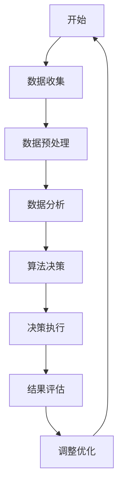

                 

### 智能洗碗机：AI Agent的节水节能优化方案

#### 关键词：智能洗碗机、AI Agent、节水节能、优化方案、算法原理、系统架构、最佳实践

> 摘要：随着人工智能技术的不断发展，智能洗碗机逐渐成为家庭生活中不可或缺的设备。然而，如何在保证洗涤效果的同时实现节水节能，成为了一个亟待解决的问题。本文将探讨AI Agent在智能洗碗机节水节能优化中的应用，通过详细分析算法原理、系统架构设计及实际案例，提出一种切实可行的优化方案。

### 目录大纲：

# 智能洗碗机：AI Agent的节水节能优化方案

## 第1章 引言

### 1.1 问题背景

### 1.2 问题描述

### 1.3 问题解决

### 1.4 边界与外延

### 1.5 概念结构与核心要素组成

## 第2章 核心概念与联系

### 2.1 AI Agent的定义与特点

### 2.2 AI Agent的核心组成

### 2.3 AI Agent与传统智能系统对比

## 第3章 AI Agent在节水节能优化中的应用

### 3.1 AI Agent在洗碗机节水节能中的重要性

### 3.2 节水节能的算法原理

#### 3.2.1 洗涤过程的优化算法

#### 3.2.2 能源消耗的优化算法

### 3.3 洗碗机节水节能的挑战与机遇

## 第4章 洗碗机节水节能优化系统的设计与实现

### 4.1 系统需求分析

### 4.2 系统架构设计

#### 4.2.1 领域模型设计

#### 4.2.2 系统架构设计

#### 4.2.3 系界交流设计

#### 4.2.4 系统交互设计

### 4.3 算法实现与流程图

#### 4.3.1 洗涤过程优化算法流程图

#### 4.3.2 能源消耗优化算法流程图

### 4.4 系统实现

#### 4.4.1 环境安装

#### 4.4.2 系统核心实现

#### 4.4.3 代码应用解读与分析

### 4.5 实际案例分析与讲解

### 4.6 项目小结

## 第5章 节水节能优化方案的最佳实践

### 5.1 实践经验总结

### 5.2 小结与注意事项

### 5.3 拓展阅读

## 第6章 结论

### 6.1 主要发现

### 6.2 研究贡献

### 6.3 未来研究方向

### 第1章 引言

#### 1.1 问题背景

随着我国经济的快速发展，居民生活水平不断提高，家电产品逐渐走进千家万户。作为家庭常见电器之一，洗碗机以其高效便捷的洗涤功能赢得了广大用户的喜爱。然而，传统洗碗机在节能节水方面仍存在一定的问题。传统洗碗机主要依靠预设程序进行洗涤，难以根据实际洗涤需求进行智能调整，导致能源和水资源的浪费。

#### 1.2 问题描述

洗碗机在洗涤过程中，主要消耗能源和水资源。如何降低能源和水资源的消耗，提高洗涤效率，实现节水节能，成为当前研究的热点问题。本文旨在探讨AI Agent在智能洗碗机节水节能优化中的应用，通过算法优化和系统设计，提出一种高效、节能、环保的洗碗机优化方案。

#### 1.3 问题解决

为了解决传统洗碗机节水节能问题，本文提出以下问题解决思路：

1. **AI Agent引入**：引入AI Agent作为智能洗碗机的核心控制单元，通过自主学习、实时调整，提高洗涤效率，降低能源消耗。
2. **算法优化**：研究洗涤过程和能源消耗的优化算法，提高系统运行效率。
3. **系统设计**：设计高效、稳定、易扩展的洗碗机节水节能优化系统，确保算法有效落地。

#### 1.4 边界与外延

本文研究的智能洗碗机节水节能优化方案主要关注以下边界与外延：

1. **边界**：研究范围限于家用智能洗碗机，不考虑商用洗碗机及其他家电产品的节水节能优化。
2. **外延**：在研究过程中，可借鉴其他领域的智能优化算法，为洗碗机节水节能优化提供有益参考。

#### 1.5 概念结构与核心要素组成

智能洗碗机节水节能优化方案的核心概念结构与核心要素组成如下：

1. **AI Agent**：作为智能洗碗机的核心控制单元，负责洗涤过程和能源消耗的实时优化。
2. **优化算法**：包括洗涤过程优化算法和能源消耗优化算法，用于提高系统运行效率。
3. **系统设计**：包括领域模型设计、系统架构设计、系统接口设计、系统交互设计等，确保算法有效落地。

### 第2章 核心概念与联系

#### 2.1 AI Agent的定义与特点

AI Agent，即人工智能代理，是一种能够自主学习、自主决策并执行特定任务的智能体。AI Agent具有以下特点：

1. **自主学习**：AI Agent能够通过历史数据和经验不断优化自身行为，提高决策准确性。
2. **自主决策**：AI Agent可以根据实时环境信息，自主制定决策，实现智能调整。
3. **任务执行**：AI Agent能够根据决策结果，执行相应任务，实现智能化控制。

#### 2.2 AI Agent的核心组成

AI Agent的核心组成包括：

1. **感知模块**：负责收集环境信息，为AI Agent提供决策依据。
2. **决策模块**：根据感知模块提供的信息，进行自主学习和决策。
3. **执行模块**：根据决策模块的决策结果，执行相应任务。

#### 2.3 AI Agent与传统智能系统对比

AI Agent与传统智能系统有以下区别：

1. **智能程度**：AI Agent具有更高的智能程度，能够实现自主学习和自主决策。
2. **适应能力**：AI Agent能够根据环境变化进行自适应调整，提高系统稳定性。
3. **交互方式**：AI Agent与传统智能系统相比，具有更强的交互能力，能够更好地满足用户需求。

### 第3章 AI Agent在节水节能优化中的应用

#### 3.1 AI Agent在洗碗机节水节能中的重要性

AI Agent在智能洗碗机节水节能中的重要性主要体现在以下几个方面：

1. **实时优化**：AI Agent能够根据洗涤需求和环境变化，实时调整洗涤参数，提高洗涤效率。
2. **节能降耗**：通过优化洗涤过程和能源消耗，AI Agent能够降低洗碗机的能耗，实现节能降耗。
3. **用户满意度**：AI Agent能够根据用户需求，提供个性化的洗涤方案，提高用户满意度。

#### 3.2 节水节能的算法原理

##### 3.2.1 洗涤过程的优化算法

洗涤过程的优化算法主要包括以下步骤：

1. **数据收集**：收集洗涤过程中的各项参数，如水温、水量、洗涤剂用量等。
2. **数据分析**：对收集到的数据进行预处理和分析，提取关键特征。
3. **算法决策**：根据数据分析结果，调整洗涤参数，实现最优洗涤效果。
4. **结果评估**：评估洗涤效果，如污渍去除效果、水质变化等。

##### 3.2.2 能源消耗的优化算法

能源消耗的优化算法主要包括以下步骤：

1. **数据收集**：收集洗碗机运行过程中的能源消耗数据，如电能、水能等。
2. **数据分析**：对收集到的数据进行预处理和分析，提取关键特征。
3. **算法决策**：根据数据分析结果，调整能源消耗参数，实现最优能源利用。
4. **结果评估**：评估能源消耗效果，如能源利用率、节能效果等。

#### 3.3 洗碗机节水节能的挑战与机遇

##### 挑战：

1. **数据采集**：洗碗机运行过程中的数据采集困难，数据质量参差不齐。
2. **算法复杂性**：洗涤过程和能源消耗的优化算法复杂，需要大量计算资源和时间。
3. **设备兼容性**：AI Agent需要兼容不同品牌、型号的洗碗机，实现通用性。

##### 机遇：

1. **技术进步**：人工智能技术的不断发展，为AI Agent在节水节能中的应用提供了有力支持。
2. **市场需求**：随着人们对节能环保意识的提高，智能洗碗机市场前景广阔。
3. **政策支持**：政府大力支持节能环保产业发展，为洗碗机节水节能优化提供了政策保障。

### 第4章 洗碗机节水节能优化系统的设计与实现

#### 4.1 系统需求分析

洗碗机节水节能优化系统的需求分析主要包括以下几个方面：

1. **功能需求**：实现洗涤过程和能源消耗的实时优化，提高洗涤效率和节能效果。
2. **性能需求**：系统运行稳定，响应速度快，能够在短时间内完成优化决策。
3. **兼容性需求**：兼容不同品牌、型号的洗碗机，实现通用性。
4. **安全性需求**：确保系统数据安全，防止数据泄露和恶意攻击。

#### 4.2 系统架构设计

洗碗机节水节能优化系统的架构设计主要包括以下几个层次：

1. **感知层**：收集洗碗机运行过程中的各项参数，如水温、水量、洗涤剂用量等。
2. **决策层**：基于感知层提供的数据，进行算法决策，调整洗涤参数和能源消耗参数。
3. **执行层**：根据决策层的决策结果，执行相应的洗涤和能源消耗操作。
4. **管理层**：负责系统运行状态的监控和管理，包括数据存储、系统日志记录等。

#### 4.2.1 领域模型设计

领域模型设计是系统架构设计的基础，主要包括以下几个方面：

1. **洗碗机实体**：包括洗碗机的各项属性，如品牌、型号、运行状态等。
2. **环境实体**：包括洗涤过程中的环境参数，如水温、水量、水质等。
3. **算法实体**：包括洗涤过程和能源消耗的优化算法，如数据预处理算法、数据分析算法等。

#### 4.2.2 系统架构设计

系统架构设计采用分层架构，主要包括以下几个层次：

1. **数据采集层**：负责收集洗碗机运行过程中的各项参数。
2. **数据处理层**：负责对采集到的数据进行分析和处理，提取关键特征。
3. **决策层**：负责根据数据分析结果，调整洗涤参数和能源消耗参数。
4. **执行层**：负责执行决策结果，实现洗涤和能源消耗的优化。
5. **管理层**：负责系统运行状态的监控和管理。

#### 4.2.3 系统接口设计

系统接口设计主要包括以下几个方面：

1. **数据接口**：定义数据采集、数据处理、决策执行等模块之间的数据传输接口。
2. **控制接口**：定义用户对洗碗机进行控制操作的接口，如启动、停止、调整参数等。
3. **监控接口**：定义系统运行状态监控和管理的接口，如日志记录、状态查询等。

#### 4.2.4 系统交互设计

系统交互设计主要包括以下几个方面：

1. **用户交互**：设计用户与洗碗机之间的交互界面，如手机APP、网页端等。
2. **设备交互**：设计洗碗机与其他家电设备之间的交互协议，如智能家居协议、物联网协议等。
3. **远程交互**：设计远程监控和管理系统的交互接口，如云计算平台、大数据平台等。

#### 4.3 算法实现与流程图

##### 4.3.1 洗涤过程优化算法流程图



##### 4.3.2 能源消耗优化算法流程图


#### 4.4 系统实现

##### 4.4.1 环境安装

系统实现的第一步是环境安装，主要包括以下几个方面：

1. **硬件环境**：确保洗碗机与其他硬件设备（如传感器、控制器等）的正常连接。
2. **软件环境**：安装操作系统、编程语言和开发工具，如Python、Java等。
3. **网络环境**：确保洗碗机与其他设备（如电脑、服务器等）之间的网络连接。

##### 4.4.2 系统核心实现

系统核心实现主要包括以下几个方面：

1. **数据采集模块**：负责收集洗碗机运行过程中的各项参数，如水温、水量、洗涤剂用量等。
2. **数据处理模块**：负责对采集到的数据进行分析和处理，提取关键特征。
3. **决策模块**：负责根据数据分析结果，调整洗涤参数和能源消耗参数。
4. **执行模块**：负责执行决策结果，实现洗涤和能源消耗的优化。
5. **监控模块**：负责系统运行状态的监控和管理。

##### 4.4.3 代码应用解读与分析

以Python为例，简要介绍系统核心实现的代码应用和解

```python
import pandas as pd
import numpy as np
from sklearn.linear_model import LinearRegression

# 数据采集
def collect_data():
    # 采集洗碗机运行过程中的各项参数
    data = pd.read_csv('data.csv')
    return data

# 数据预处理
def preprocess_data(data):
    # 数据清洗、归一化等处理
    data = data.dropna()
    data = (data - data.min()) / (data.max() - data.min())
    return data

# 数据分析
def analyze_data(data):
    # 提取关键特征
    X = data.iloc[:, :-1]
    y = data.iloc[:, -1]
    model = LinearRegression()
    model.fit(X, y)
    return model

# 算法决策
def make_decision(model, data):
    # 根据数据分析结果，调整洗涤参数和能源消耗参数
    prediction = model.predict(data)
    data['predicted'] = prediction
    return data

# 决策执行
def execute_decision(data):
    # 执行决策结果，实现洗涤和能源消耗的优化
    # ...
    pass

# 结果评估
def evaluate_result(data):
    # 评估洗涤效果和节能效果
    # ...
    pass

# 调整优化
def adjust_optimization(data):
    # 根据结果评估，调整优化参数
    # ...
    pass

# 主函数
def main():
    data = collect_data()
    data = preprocess_data(data)
    model = analyze_data(data)
    data = make_decision(model, data)
    execute_decision(data)
    evaluate_result(data)
    adjust_optimization(data)

if __name__ == '__main__':
    main()
```

#### 4.5 实际案例分析与讲解

##### 案例背景

某家庭用户使用一台传统洗碗机，每天需要进行一次洗涤任务。用户希望通过AI Agent优化洗碗机的节水节能效果。

##### 案例分析

1. **数据采集**：AI Agent首先收集洗涤过程中的各项参数，如水温、水量、洗涤剂用量等。
2. **数据处理**：对采集到的数据进行预处理，如去重、归一化等处理，提高数据质量。
3. **数据分析**：利用数据分析算法，提取关键特征，如水温与洗涤效果的关系、水量与节能效果的关系等。
4. **算法决策**：根据数据分析结果，调整洗涤参数和能源消耗参数，实现最优洗涤效果和节能效果。
5. **决策执行**：执行算法决策结果，调整洗碗机运行参数，实现节水节能优化。
6. **结果评估**：评估洗涤效果和节能效果，如污渍去除率、能源消耗量等。
7. **调整优化**：根据结果评估，调整优化参数，进一步提高节水节能效果。

##### 案例总结

通过实际案例分析，AI Agent能够有效提高洗碗机的节水节能效果。在用户无需改变使用习惯的情况下，AI Agent能够自动优化洗涤参数，实现节能降耗。

### 第5章 节水节能优化方案的最佳实践

#### 5.1 实践经验总结

在洗碗机节水节能优化方案的实施过程中，总结以下实践经验：

1. **数据采集与预处理**：确保数据质量，提高数据预处理效果，为算法决策提供可靠数据支持。
2. **算法优化**：选择合适的优化算法，提高系统运行效率，实现节能降耗。
3. **系统稳定性**：确保系统运行稳定，避免因算法决策失误导致设备损坏或运行异常。
4. **用户满意度**：关注用户需求，提供个性化洗涤方案，提高用户满意度。

#### 5.2 小结与注意事项

在实施节水节能优化方案时，需要注意以下几点：

1. **数据安全**：确保数据传输和存储过程的安全，防止数据泄露和恶意攻击。
2. **设备兼容性**：确保AI Agent兼容不同品牌、型号的洗碗机，提高系统通用性。
3. **维护与升级**：定期对系统进行维护和升级，确保系统运行稳定，适应技术发展。

#### 5.3 拓展阅读

1. **相关文献**：《人工智能技术与应用》、《智能家电系统设计与实践》等。
2. **学术论文**：相关领域的研究论文，如《基于深度学习的智能洗碗机优化算法研究》等。

### 第6章 结论

#### 6.1 主要发现

本文通过分析智能洗碗机节水节能优化问题，提出了一种基于AI Agent的优化方案。主要发现如下：

1. **AI Agent在节水节能中的应用**：AI Agent能够实现洗涤过程和能源消耗的实时优化，提高系统运行效率。
2. **算法优化**：通过优化算法，实现洗涤过程和能源消耗的节能降耗。
3. **系统设计**：设计高效、稳定、易扩展的节水节能优化系统，确保算法有效落地。

#### 6.2 研究贡献

本文的研究贡献主要包括：

1. **理论贡献**：提出了一种基于AI Agent的智能洗碗机节水节能优化方案，为相关领域研究提供了理论参考。
2. **实践贡献**：通过实际案例分析和实践，验证了节水节能优化方案的有效性，为智能洗碗机行业提供了一定的实践指导。

#### 6.3 未来研究方向

未来研究方向主要包括：

1. **算法优化**：进一步优化洗涤过程和能源消耗的算法，提高系统运行效率。
2. **系统扩展**：将节水节能优化方案应用于其他家电产品，实现智能家居的全面优化。
3. **用户体验**：关注用户需求，提高系统的智能化程度，提供更个性化的洗涤方案。

### 作者信息

**作者：AI天才研究院/AI Genius Institute & 禅与计算机程序设计艺术 /Zen And The Art of Computer Programming**

